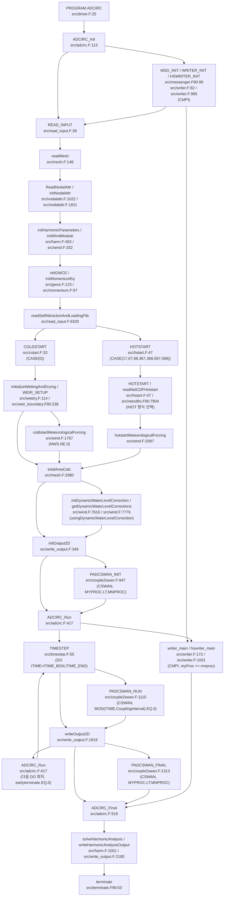

# ADCIRC v56.2.1 초기화와 한 시간 단계의 호출·상태 흐름

## 판독 기준과 요약

이 문서는 원문 인용과 AI가 작성한 추적 결과를 구분한다.
백틱 안의 문장은 원문이다.
표의 순서·판정·생산과 소비 관계는 소스 판독 결과이다.
원문을 넘어서는 의미 부여에는 “해석:”을 붙인다.
“한 시간 단계”는 시간 반복의 한 회차이다.
특정 `DTDP` 값이나 fort.15 구성을 가정하지 않는다.
코드 판은 `models/ADCIRC/raw/source_code/adcirc/CMakeLists.txt:92` `set(ADCIRC_VERSION_STRING "v56.2.1")`로 고정한다.
호출 위치와 조건의 판정은 `nl -ba`로 연 원문에 둔다.
판독 기록은 항목을 찾는 색인으로만 사용한다.

추적 깊이는 TIMESTEP의 직접 호출을 1단계로 정의한다.
1단계 루틴의 직접 호출을 2단계로 정의한다.
3단계 호출은 이름과 호출·정의 위치만 적는다.
MPI 통신 루틴과 SWAN 결합 루틴은 호출 위치와 조건에서 멈춘다.
wind/의 루틴은 src의 호출 위치에서 멈춘다.
prep/·thirdparty/·asgs/·adcircpy 내부는 판독하지 않았다.
모델 실행과 컴파일은 수행하지 않았다.
git은 사용하지 않았다.
현재 노트의 수정은 수행하지 않았다.

조건 표는 전처리 분기의 합집합이다.
표의 `선행 분기`와 `선택 분기`는 IF/ELSEIF/ELSE의 위치를 보존한다.
ELSE는 같은 IF의 앞선 분기가 선택되지 않은 경로이다.
서로 다른 분기의 호출이 한 실행에서 모두 일어난다는 뜻은 아니다.
Fortran 내장 함수와 배열 참조는 호출 수에 넣지 않는다.
직접 CALL 문과 상태 계산에 쓰는 비내장 함수 호출은 구분해서 적는다.
추적용 `LOG_SCOPE_TRACED` 매크로는 `src/timestep.F:229` `LOG_SCOPE_TRACED("timestep", TIMESTEP_TRACING)`에 있다.
이 문서는 추적 매크로를 전처리하여 확장하지 않았다.

일반 유동 경로는 강제력을 준비한 뒤 solveGWCE를 호출한다.
TIMESTEP은 그 뒤 computeWettingAndDrying을 호출한다.
TIMESTEP은 그 뒤 solveMomentumEq를 호출한다.
TIMESTEP은 조건에 따라 VSSOL 또는 SCALAR_TRANS_2D를 호출한다.
TIMESTEP은 그 뒤 극값을 수집한다.
TIMESTEP은 그 뒤 조화분석을 누적한다.
TIMESTEP은 그 뒤 핫스타트 쓰기 조건을 검사한다.
그 순서는 `src/timestep.F:655` `call getMeteorologicalForcing(nws, wsx2, wsy2, pr2,`<br>`src/timestep.F:845` `call applyTidePotentialForcing(TimeLoc, TimeH)`<br>`src/timestep.F:1073` `call solveGWCE(it, ITIME_BGN, timeloc, timeh)`<br>`src/timestep.F:1092` `call computeWettingAndDrying(it)`<br>`src/timestep.F:1107` `call solveMomentumEq()`<br>`src/timestep.F:1143` `CALL VSSOL(IT,TimeLoc)`<br>`src/timestep.F:1155` `CALL SCALAR_TRANS_2D (IT, TimeLoc)`<br>`src/timestep.F:1166` `call collectMinMaxData(timeloc)`<br>`src/timestep.F:1188` `CALL updateHarmonicAnalysis(IT, TIMEH)`<br>`src/timestep.F:1215` `CALL writeHotstart(TimeLoc, IT)`에서 확인한다.
일반 2D 출력은 TIMESTEP 밖에서 실행한다.
ADCIRC_Run은 `src/adcirc.F:476` `CALL TIMESTEP(ITIME,TimeLoc)`<br>`src/adcirc.F:482` `CALL PADCSWAN_RUN(ITIME)`<br>`src/adcirc.F:492` `CALL writeOutput2D(ITIME,TimeLoc) ! =>see write_output.F` 순서로 호출한다.
CPRECOR 경로는 solveGWCE 안에서 예측 수위·예측 운동량·보정 수위를 먼저 계산한다.
그 경로도 TIMESTEP의 습윤건조 판정과 최종 운동량 풀이로 돌아온다.
근거는 `src/gwce.F:182` `IF(CPRECOR) THEN`<br>`src/gwce.F:183` `CALL GWCE_New(IT,ITIME_BGN,TimeLoc,TimeH)`<br>`src/gwce.F:192` `CALL Mom_Eqs_New_NC()`<br>`src/gwce.F:198` `CALL GWCE_New_pc(IT,TimeLoc,TimeH)`와 `src/timestep.F:1092` `call computeWettingAndDrying(it)`<br>`src/timestep.F:1107` `call solveMomentumEq()`이다.
GWCE는 이번 단계의 습윤건조 판정보다 먼저 기존 NODECODE·NOFF를 읽는다.
근거는 `src/gwce.F:1015` `NCELE=NC1*NC2*NC3*NOFF(IE)`와 `src/timestep.F:1092` `call computeWettingAndDrying(it)`이다.
ETA1의 이동은 TIMESTEP 시작이 아니라 GWCE_New의 우변 조립 뒤에 있다.
근거는 `src/gwce.F:1623` `IF(CPRECOR) THEN`<br>`src/gwce.F:1625` `Eta0(I)=Eta1(I)`<br>`src/gwce.F:1627` `Eta1(I)=Eta2(I)`<br>`src/gwce.F:1629` `H1(I) = H2(I)`<br>`src/gwce.F:1630` `Eta2(I)=0.0d0`이다.

## 1. 초기화 순서

### 1.1 PROGRAM ADCIRC와 ADCIRC_Init

진입점은 `src/driver.F:25` `PROGRAM ADCIRC`이다.
초기화 정의는 `src/adcirc.F:113` `SUBROUTINE ADCIRC_Init(COMM, ROOTD)`이다.
driver의 첫 호출은 `src/driver.F:38` `CALL ADCIRC_Init()`이다.

| 순서 | 호출 위치 file:line 원문 | 조건 | 피호출 정의 file:line | 조건 스위치를 읽는 줄 file:line |
| --- | --- | --- | --- | --- |
| I-1 | `src/adcirc.F:183` `call GET_COMMAND_ARGUMENT(i, cmdlinearg)` | `src/adcirc.F:179` `if ((argcount.gt.0).and.(myproc.eq.0)) then` | Fortran 또는 컴파일러 제공 루틴. | `src/adcirc.F:179` `if ((argcount.gt.0).and.(myproc.eq.0)) then` |
| I-2 | `src/adcirc.F:186` `call PRINT_HELP()` | `src/adcirc.F:179` `if ((argcount.gt.0).and.(myproc.eq.0)) then`<br>`src/adcirc.F:184` `select case(trim(cmdlinearg))`<br>`src/adcirc.F:185` `case("-h","--help")` | `src/adcirc.F:564` `SUBROUTINE PRINT_HELP()` | `src/adcirc.F:185` `case("-h","--help")` |
| I-3 | `src/adcirc.F:187` `call exit(ADCIRC_EXIT_SUCCESS)` | `src/adcirc.F:179` `if ((argcount.gt.0).and.(myproc.eq.0)) then`<br>`src/adcirc.F:184` `select case(trim(cmdlinearg))`<br>`src/adcirc.F:185` `case("-h","--help")` | Fortran 또는 컴파일러 제공 루틴. | `src/adcirc.F:185` `case("-h","--help")` |
| I-4 | `src/adcirc.F:193` `call exit(ADCIRC_EXIT_SUCCESS)` | `src/adcirc.F:179` `if ((argcount.gt.0).and.(myproc.eq.0)) then`<br>`src/adcirc.F:184` `select case(trim(cmdlinearg))`<br>`src/adcirc.F:188` `case("-V","-v","--version")` | Fortran 또는 컴파일러 제공 루틴. | `src/adcirc.F:188` `case("-V","-v","--version")` |
| I-5 | `src/adcirc.F:196` `call exit(ADCIRC_EXIT_SUCCESS)` | `src/adcirc.F:179` `if ((argcount.gt.0).and.(myproc.eq.0)) then`<br>`src/adcirc.F:184` `select case(trim(cmdlinearg))`<br>`src/adcirc.F:194` `case("--hash")` | Fortran 또는 컴파일러 제공 루틴. | `src/adcirc.F:194` `case("--hash")` |
| I-6 | `src/adcirc.F:214` `CALL GET_NUMWRITERS()  ! Get number of writer processors from command line arguments` | `src/adcirc.F:213` `#ifdef CMPI` | `src/sizes.F:414` `SUBROUTINE GET_NUMWRITERS` | `src/adcirc.F:213` `#ifdef CMPI` |
| I-7 | `src/adcirc.F:216` `CALL MSG_INIT(COMM)  ! Init MPI and get MPI-rank of this cpu` | `src/adcirc.F:213` `#ifdef CMPI`<br>`src/adcirc.F:215` `IF (PRESENT(COMM)) THEN` | `src/messenger.F90:99` `subroutine MSG_INIT(MPI_COMM_IN)` | `src/adcirc.F:215` `IF (PRESENT(COMM)) THEN` |
| I-8 | `src/adcirc.F:218` `CALL MSG_INIT()      ! Init MPI and get MPI-rank of this cpu` | `src/adcirc.F:213` `#ifdef CMPI`<br>선행 분기: `src/adcirc.F:215` `IF (PRESENT(COMM)) THEN`<br>선택 분기: `src/adcirc.F:217` `ELSE` | `src/messenger.F90:99` `subroutine MSG_INIT(MPI_COMM_IN)` | `src/adcirc.F:217` `ELSE` |
| I-9 | `src/adcirc.F:220` `CALL MAKE_DIRNAME()    ! Establish Working Directory Name` | `src/adcirc.F:213` `#ifdef CMPI` | `src/sizes.F:118` `SUBROUTINE MAKE_DIRNAME()` | `src/adcirc.F:213` `#ifdef CMPI` |
| I-10 | `src/adcirc.F:221` `call openLogFile(localdir)  ! jgf50.65: open subdomain log files (fort.16)` | `src/adcirc.F:213` `#ifdef CMPI` | `src/logging.F90:332` `subroutine openLogFile(dir)` | `src/adcirc.F:213` `#ifdef CMPI` |
| I-11 | `src/adcirc.F:222` `CALL WRITER_INIT()     ! Initialize WRITER module` | `src/adcirc.F:213` `#ifdef CMPI` | `src/writer.F:92` `subroutine writer_init ()` | `src/adcirc.F:213` `#ifdef CMPI` |
| I-12 | `src/adcirc.F:223` `CALL HSWRITER_INIT()   ! Initialize HSWRITER module  !st3 for hstart  100711` | `src/adcirc.F:213` `#ifdef CMPI` | `src/writer.F:995` `SUBROUTINE HSWRITER_INIT ()` | `src/adcirc.F:213` `#ifdef CMPI` |
| I-13 | `src/adcirc.F:227` `CALL READ_INPUT()      ! Establish sizes by reading fort.14 and fort.15` | `src/adcirc.F:213` `#ifdef CMPI` | `src/read_input.F:39` `SUBROUTINE READ_INPUT()` | `src/adcirc.F:213` `#ifdef CMPI` |
| I-14 | `src/adcirc.F:228` `CALL MSG_TABLE(NSTA3DD, NSTA3DV, NSTA3DT,       ! Read Message-Passing Tables`<br>`src/adcirc.F:229` `&               NSTA3DD_G, NSTA3DV_G, NSTA3DT_G,`<br>`src/adcirc.F:230` `&               IMAP_STA3DD_LG, IMAP_STA3DV_LG, IMAP_STA3DT_LG)` | `src/adcirc.F:213` `#ifdef CMPI` | `src/messenger.F90:305` `subroutine MSG_TABLE(NSTA3DD_IN, NSTA3DV_IN, NSTA3DT_IN, &` | `src/adcirc.F:213` `#ifdef CMPI` |
| I-15 | `src/adcirc.F:231` `CALL MSG_START()       ! Startup message passing` | `src/adcirc.F:213` `#ifdef CMPI` | `src/messenger.F90:511` `subroutine MSG_START()` | `src/adcirc.F:213` `#ifdef CMPI` |
| I-16 | `src/adcirc.F:237` `CALL MAKE_DIRNAME()    ! Establish Working Directory Name` | 선행 분기: `src/adcirc.F:213` `#ifdef CMPI`<br>선택 분기: `src/adcirc.F:232` `#else` | `src/sizes.F:118` `SUBROUTINE MAKE_DIRNAME()` | `src/adcirc.F:232` `#else` |
| I-17 | `src/adcirc.F:238` `call openLogFile()     ! jgf50.65: open fort.16 file` | 선행 분기: `src/adcirc.F:213` `#ifdef CMPI`<br>선택 분기: `src/adcirc.F:232` `#else` | `src/logging.F90:332` `subroutine openLogFile(dir)` | `src/adcirc.F:232` `#else` |
| I-18 | `src/adcirc.F:239` `CALL READ_INPUT()      ! Establish sizes by reading fort.14 and fort.15` | 선행 분기: `src/adcirc.F:213` `#ifdef CMPI`<br>선택 분기: `src/adcirc.F:232` `#else` | `src/read_input.F:39` `SUBROUTINE READ_INPUT()` | `src/adcirc.F:232` `#else` |
| I-19 | `src/adcirc.F:255` `CALL allocateFullDomainIOArrays()` | `src/adcirc.F:252` `IF ( (MNPROC.gt.1).and.`<br>`src/adcirc.F:253` `&        ( (myProc.eq.0)`<br>`src/adcirc.F:254` `&          .or.(READ_LOCAL_HOT_START_FILES.eqv..false.) ) ) THEN` | `src/globalio.F:60` `SUBROUTINE allocateFullDomainIOArrays()` | `src/adcirc.F:252` `IF ( (MNPROC.gt.1).and.`<br>`src/adcirc.F:253` `&        ( (myProc.eq.0)`<br>`src/adcirc.F:254` `&          .or.(READ_LOCAL_HOT_START_FILES.eqv..false.) ) ) THEN` |
| I-20 | `src/adcirc.F:259` `CALL allocateFullDomainHAIOArrays()` | `src/adcirc.F:257` `IF ( (MNPROC.gt.1).and.(myProc.eq.0).and.`<br>`src/adcirc.F:258` `&     (WRITE_LOCAL_HARM_FILES.eqv..false.) ) THEN` | `src/harm.F:329` `SUBROUTINE allocateFullDomainHAIOArrays()` | `src/adcirc.F:257` `IF ( (MNPROC.gt.1).and.(myProc.eq.0).and.`<br>`src/adcirc.F:258` `&     (WRITE_LOCAL_HARM_FILES.eqv..false.) ) THEN` |
| I-21 | `src/adcirc.F:264` `CALL initVEW1DChannelWetPerimeter()` | `src/adcirc.F:263` `if ( activateVEW1DChannelWetPerimeter.eqv..true. ) THEN` | `src/nodalattr.F:2249` `SUBROUTINE initVEW1DChannelWetPerimeter()` | `src/adcirc.F:263` `if ( activateVEW1DChannelWetPerimeter.eqv..true. ) THEN` |
| I-22 | `src/adcirc.F:268` `CALL initHarmonicParameters()` | 호출 위치에 추가 조건 없음. | `src/harm.F:493` `SUBROUTINE initHarmonicParameters()` | 추가 스위치 없음. |
| I-23 | `src/adcirc.F:272` `call initWindModule()` | 호출 위치에 추가 조건 없음. | `src/wind.F:332` `subroutine initWindModule()` | 추가 스위치 없음. |
| I-24 | `src/adcirc.F:275` `call initGWCE()` | 호출 위치에 추가 조건 없음. | `src/gwce.F:123` `subroutine initGWCE()` | 추가 스위치 없음. |
| I-25 | `src/adcirc.F:276` `call initMomentumEq()` | 호출 위치에 추가 조건 없음. | `src/momentum.F:97` `subroutine initMomentumEq()` | 추가 스위치 없음. |
| I-26 | `src/adcirc.F:281` `CALL ALLNODES(NP_GLOBAL)` | `src/adcirc.F:280` `#ifdef CMPI` | `src/messenger.F90:1237` `subroutine ALLNODES(TOTNODES)` | `src/adcirc.F:280` `#ifdef CMPI` |
| I-27 | `src/adcirc.F:293` `call readSelfAttractionAndLoadingFile()` | 호출 위치에 추가 조건 없음. | `src/read_input.F:6320` `subroutine readSelfAttractionAndLoadingFile` | 추가 스위치 없음. |
| I-28 | `src/adcirc.F:318` `CALL COLDSTART()` | `src/adcirc.F:316` `SELECT CASE(IHOT)`<br>`src/adcirc.F:317` `CASE(0)` | `src/cstart.F:33` `SUBROUTINE COLDSTART()` | `src/read_input.F:1066` `READ(15,*) IHOT` |
| I-29 | `src/adcirc.F:322` `CALL HOTSTART()` | `src/adcirc.F:316` `SELECT CASE(IHOT)`<br>`src/adcirc.F:321` `CASE(17,67,68,367,368,567,568) ! non-portable binary or netcdf hotstart file` | `src/hstart.F:47` `SUBROUTINE HOTSTART()` | `src/read_input.F:1066` `READ(15,*) IHOT` |
| I-30 | `src/adcirc.F:339` `call totalAreaCalc()` | 호출 위치에 추가 조건 없음. | `src/mesh.F:3380` `subroutine totalAreaCalc()` | 추가 스위치 없음. |
| I-31 | `src/adcirc.F:362` `call initDynamicWaterLevelCorrection(timeloc) ! initializes the i/o` | `src/adcirc.F:358` `if (usingDynamicWaterLevelCorrection.eqv..true.) then` | `src/wind.F:7616` `subroutine initDynamicWaterLevelCorrection(timesec)` | `src/adcirc.F:358` `if (usingDynamicWaterLevelCorrection.eqv..true.) then` |
| I-32 | `src/adcirc.F:363` `call getDynamicWaterLevelCorrections(dynamicWaterLevelCorrection2, timeloc) ! populate` | `src/adcirc.F:358` `if (usingDynamicWaterLevelCorrection.eqv..true.) then` | `src/wind.F:7776` `subroutine getDynamicWaterLevelCorrections(dynamicWaterLevelCorrectionsArray, timesec)` | `src/adcirc.F:358` `if (usingDynamicWaterLevelCorrection.eqv..true.) then` |
| I-33 | `src/adcirc.F:368` `call initOutput2D(timeloc)` | 호출 위치에 추가 조건 없음. | `src/write_output.F:349` `SUBROUTINE initOutput2D(timeloc)` | 추가 스위치 없음. |

MPI 전용 writer 프로세스는 `src/adcirc.F:224` `if ( (mnwproh > 0.or.mnwproc > 0) .and. myProc >= mnproc) then`<br>`src/adcirc.F:225` `return`에서 초기화를 반환한다.
이 프로세스는 ADCIRC_Run의 시간 반복에 들어가지 않는다.
MPI 호출의 내부 통신은 추적하지 않는다.

### 1.2 READ_INPUT 내부의 입력·격자·절점 속성 준비

READ_INPUT은 `src/read_input.F:39` `SUBROUTINE READ_INPUT()`에 정의되어 있다.
다음 표는 초기 상태와 실행 선택을 준비하는 호출을 추린다.
입력 오류 로그의 모든 호출을 초기화 완료 조건으로 삼지 않는다.

| 순서 | 호출 위치 file:line 원문 | 조건 | 피호출 정의 file:line | 조건 스위치를 읽는 줄 file:line |
| --- | --- | --- | --- | --- |
| R-1 | `src/read_input.F:372` `CALL initNAModule()` | 호출 위치에 추가 조건 없음. | `src/nodalattr.F:415` `SUBROUTINE InitNAModule()` | 추가 스위치 없음. |
| R-2 | `src/read_input.F:384` `call readMesh()` | 호출 위치에 추가 조건 없음. | `src/mesh.F:148` `subroutine readMesh()` | 추가 스위치 없음. |
| R-3 | `src/read_input.F:387` `call alloc_main1a()` | 호출 위치에 추가 조건 없음. | `src/global.F:862` `SUBROUTINE ALLOC_MAIN1a()` | 추가 스위치 없음. |
| R-4 | `src/read_input.F:390` `call alloc_main2()` | 호출 위치에 추가 조건 없음. | `src/global.F:973` `SUBROUTINE ALLOC_MAIN2()` | 추가 스위치 없음. |
| R-5 | `src/read_input.F:393` `call alloc_main3()` | 호출 위치에 추가 조건 없음. | `src/global.F:993` `SUBROUTINE ALLOC_MAIN3()` | 추가 스위치 없음. |
| R-6 | `src/read_input.F:398` `CALL openFileForRead(15,TRIM(INPUTDIR)//'/'//'fort.15',ios)` | 호출 위치에 추가 조건 없음. | `src/io.F90:56` `subroutine openFileForRead(lun, filename, errorIO, required)` | 추가 스위치 없음. |
| R-7 | `src/read_input.F:510` `call readNws08Namelist(15)` | 호출 위치에 추가 조건 없음. | `src/nws08.F90:318` `subroutine readNws08Namelist(iounit)` | 추가 스위치 없음. |
| R-8 | `src/read_input.F:614` `CALL initialize_baroclinic3d_namelist_options()` | 호출 위치에 추가 조건 없음. | `src/global_3dvs.F:733` `subroutine initialize_baroclinic3d_namelist_options()` | 추가 스위치 없음. |
| R-9 | `src/read_input.F:1683` `CALL ReadNodalAttr(NScreen, ScreenUnit, MyProc, NAbOut)` | 호출 위치에 추가 조건 없음. | `src/nodalattr.F:1022` `SUBROUTINE ReadNodalAttr(NScreen, ScreenUnit, MyProc, NAbOut)` | 추가 스위치 없음. |
| R-10 | `src/read_input.F:1687` `CALL SpongeLayerRelatedPrep( )` | `src/read_input.F:1686` `IF ( LoadAbsLayerSigma .AND. FoundAbsLayerSigma ) THEN` | `src/sponge_layer.F90:288` `subroutine SpongeLayerRelatedPrep()` | `src/read_input.F:1686` `IF ( LoadAbsLayerSigma .AND. FoundAbsLayerSigma ) THEN` |
| R-11 | `src/read_input.F:2637` `CALL setNws08f15Parameters(WindRefTime, BLAdj, g)` | `src/read_input.F:2618` `IF(ABS(NWS).EQ.8) THEN` | `src/nws08.F90:421` `subroutine setNws08f15Parameters(WindRefTime_in, BLAdj_in, g)` | `src/read_input.F:1769` `READ(15,FMT=*,END=99998,ERR=99999) NWS`<br>`src/read_input.F:1830` `NWS=(ABS(NWS)-NRS*100)*(NWS/ABS(NWS))` |
| R-12 | `src/read_input.F:3056` `call initializeMesh()` | 호출 위치에 추가 조건 없음. | `src/mesh.F:1458` `subroutine initializeMesh()` | 추가 스위치 없음. |
| R-13 | `src/read_input.F:3060` `CALL FLAGSPONGEELEM()` | `src/read_input.F:3059` `IF ( LoadAbsLayerSigma .AND. FoundAbsLayerSigma ) THEN` | `src/sponge_layer.F90:217` `subroutine FLAGSPONGEELEM()` | `src/read_input.F:3059` `IF ( LoadAbsLayerSigma .AND. FoundAbsLayerSigma ) THEN` |
| R-14 | `src/read_input.F:3089` `if (abs(IDEN).ge.5) call ALLOC_BC3D_to_2D()` | `src/read_input.F:3086` `BC2D: IF ((C2DDI).AND.(CBaroclinic)) THEN`<br>한 줄 조건: `src/read_input.F:3089` `if (abs(IDEN).ge.5) call ALLOC_BC3D_to_2D()` | `src/couple2baroclinic3D.F:82` `SUBROUTINE ALLOC_BC3D_to_2D()` | `src/read_input.F:1149` `READ(15,*) IM`<br>`src/read_input.F:1173` `C2DDI         = .TRUE.`<br>`src/read_input.F:1244` `CGWCE_New = .TRUE.`<br>`src/read_input.F:1208` `CBaroclinic   = .TRUE.`<br>`src/read_input.F:1373` `CBaroclinic = .TRUE.` |
| R-15 | `src/read_input.F:3323` `CALL GET_ROTSPCOORD_CORIFVAL( CORIF ) ;` | 선행 분기: `src/read_input.F:3316` `IF(NCOR.EQ.0) THEN`<br>선택 분기: `src/read_input.F:3320` `ELSEIF (NCOR.EQ.1) THEN`<br>`src/read_input.F:3322` `IF ( IFSPROTS .EQ. 1 ) THEN` | `src/mesh.F:4487` `SUBROUTINE GET_ROTSPCOORD_CORIFVAL( CORIF )` | `src/read_input.F:3322` `IF ( IFSPROTS .EQ. 1 ) THEN` |
| R-16 | `src/read_input.F:3357` `call alloc_main4a()` | 호출 위치에 추가 조건 없음. | `src/global.F:1015` `SUBROUTINE ALLOC_MAIN4a()` | 추가 스위치 없음. |
| R-17 | `src/read_input.F:3371` `CALL ALLOC_MAIN4b()` | 호출 위치에 추가 조건 없음. | `src/global.F:1034` `SUBROUTINE ALLOC_MAIN4b()` | 추가 스위치 없음. |
| R-18 | `src/read_input.F:3433` `call alloc_main5()` | 호출 위치에 추가 조건 없음. | `src/global.F:1047` `SUBROUTINE ALLOC_MAIN5()` | 추가 스위치 없음. |
| R-19 | `src/read_input.F:3495` `call initializeBoundaries()` | 호출 위치에 추가 조건 없음. | `src/mesh.F:1769` `subroutine initializeBoundaries()` | 추가 스위치 없음. |
| R-20 | `src/read_input.F:3533` `call alloc_main6()` | `src/read_input.F:3519` `IF(NFLUXF.EQ.1) THEN` | `src/global.F:1063` `SUBROUTINE ALLOC_MAIN6()` | `src/read_input.F:3519` `IF(NFLUXF.EQ.1) THEN` |
| R-21 | `src/read_input.F:3730` `call alloc_main7()` | 호출 위치에 추가 조건 없음. | `src/global.F:1079` `SUBROUTINE ALLOC_MAIN7()` | 추가 스위치 없음. |
| R-22 | `src/read_input.F:3735` `CALL readStations(STATNAME, NSTAE, NNE, XEL, YEL, SLEL, SFEL,`<br>`src/read_input.F:3736` `&                  STAIE1, STAIE2, STAIE3,STAT_LUN,`<br>`src/read_input.F:3737` `&                  'ELEVATION RECORDING STATION   ')` | 호출 위치에 추가 조건 없음. | `src/control.F:629` `subroutine readStations(nsta, stax, stay)` | 추가 스위치 없음. |
| R-23 | `src/read_input.F:3853` `call alloc_main8()` | 호출 위치에 추가 조건 없음. | `src/global.F:1097` `SUBROUTINE ALLOC_MAIN8()` | 추가 스위치 없음. |
| R-24 | `src/read_input.F:3858` `CALL readStations(STATNAMEV, NSTAV, NNV, XEV, YEV, SLEV, SFEV,`<br>`src/read_input.F:3859` `&                  STAIV1, STAIV2, STAIV3,STAT_LUN,`<br>`src/read_input.F:3860` `&                 'VELOCITY RECORDING STATION    ' )` | 호출 위치에 추가 조건 없음. | `src/control.F:629` `subroutine readStations(nsta, stax, stay)` | 추가 스위치 없음. |
| R-25 | `src/read_input.F:3981` `call alloc_main9()` | `src/read_input.F:3870` `IF(IM.EQ.10) THEN` | `src/global.F:1113` `SUBROUTINE ALLOC_MAIN9()` | `src/read_input.F:3870` `IF(IM.EQ.10) THEN` |
| R-26 | `src/read_input.F:3987` `CALL readStations(STATNAMEC, NSTAC, NNC, XEC, YEC, SLEC, SFEC,`<br>`src/read_input.F:3988` `&                  STAIC1, STAIC2, STAIC3,STAT_LUN,`<br>`src/read_input.F:3989` `&                  'CONCENTRATION REC. STATION    ')` | `src/read_input.F:3870` `IF(IM.EQ.10) THEN` | `src/control.F:629` `subroutine readStations(nsta, stax, stay)` | `src/read_input.F:3870` `IF(IM.EQ.10) THEN` |
| R-27 | `src/read_input.F:4112` `call alloc_main10()` | `src/read_input.F:4000` `IF(NWS.NE.0) THEN` | `src/global.F:1129` `SUBROUTINE ALLOC_MAIN10()` | `src/read_input.F:1769` `READ(15,FMT=*,END=99998,ERR=99999) NWS`<br>`src/read_input.F:1830` `NWS=(ABS(NWS)-NRS*100)*(NWS/ABS(NWS))` |
| R-28 | `src/read_input.F:4117` `CALL readStations(STATNAMEM, NSTAM, NNM, XEM, YEM, SLEM, SFEM,`<br>`src/read_input.F:4118` `&                     STAIM1, STAIM2, STAIM3,STAT_LUN,`<br>`src/read_input.F:4119` `&                      'METEOROLOGICAL REC. STATION   ')` | `src/read_input.F:4000` `IF(NWS.NE.0) THEN` | `src/control.F:629` `subroutine readStations(nsta, stax, stay)` | `src/read_input.F:1769` `READ(15,FMT=*,END=99998,ERR=99999) NWS`<br>`src/read_input.F:1830` `NWS=(ABS(NWS)-NRS*100)*(NWS/ABS(NWS))` |
| R-29 | `src/read_input.F:4446` `CALL ALLOC_HA()` | `src/read_input.F:4445` `IF (NFREQ.GT.0) THEN` | `src/harm.F:265` `SUBROUTINE ALLOC_HA()` | `src/read_input.F:4445` `IF (NFREQ.GT.0) THEN` |
| R-30 | `src/read_input.F:4447` `CALL ALLOC_MAIN14()` | `src/read_input.F:4445` `IF (NFREQ.GT.0) THEN` | `src/harm.F:302` `SUBROUTINE ALLOC_MAIN14()` | `src/read_input.F:4445` `IF (NFREQ.GT.0) THEN` |
| R-31 | `src/read_input.F:4510` `CALL checkHarmonicParameters()` | 호출 위치에 추가 조건 없음. | `src/harm.F:394` `SUBROUTINE checkHarmonicParameters()` | 추가 스위치 없음. |
| R-32 | `src/read_input.F:4623` `CALL READ_INPUT_3D(StaTim,NT)` | `src/read_input.F:4622` `IF(C3D) THEN` | `src/read_input.F:5041` `SUBROUTINE READ_INPUT_3D(StaTime,NT)` | `src/read_input.F:1191` `C3D           = .TRUE.`<br>`src/read_input.F:1270` `C3D           = .TRUE.` |
| R-33 | `src/read_input.F:4630` `CALL InitNodalAttr`<br>`src/read_input.F:4631` `&  (DP, NP, G, NScreen, ScreenUnit, MyProc, NAbOut, Z0B)` | 호출 위치에 추가 조건 없음. | `src/nodalattr.F:1811` `SUBROUTINE InitNodalAttr(DP, NP, G, NScreen, ScreenUnit,` | 추가 스위치 없음. |
| R-34 | `src/read_input.F:4635` `call PrepCondensedNodes()` | 호출 위치에 추가 조건 없음. | `src/nodalattr.F:3169` `SUBROUTINE PrepCondensedNodes()` | 추가 스위치 없음. |
| R-35 | `src/read_input.F:4638` `CALL RecomputeFDXEFDYEAtCondensedNodes()` | 호출 위치에 추가 조건 없음. | `src/read_input.F:4901` `SUBROUTINE RecomputeFDXEFDYEAtCondensedNodes()` | 추가 스위치 없음. |
| R-36 | `src/read_input.F:4649` `if (abs(nddt).ne.0) call ALLOC_MAIN13()` | 한 줄 조건: `src/read_input.F:4649` `if (abs(nddt).ne.0) call ALLOC_MAIN13()` | `src/global.F:1258` `SUBROUTINE ALLOC_MAIN13()` | `src/read_input.F:4649` `if (abs(nddt).ne.0) call ALLOC_MAIN13()` |
| R-37 | `src/read_input.F:4652` `call alloc_main12()` | 호출 위치에 추가 조건 없음. | `src/global.F:1179` `SUBROUTINE ALLOC_MAIN12()` | 추가 스위치 없음. |
| R-38 | `src/read_input.F:4860` `if (ILUMP==0) call compute_csr_positions()` | 한 줄 조건: `src/read_input.F:4860` `if (ILUMP==0) call compute_csr_positions()` | `src/mesh.F:5281` `subroutine compute_csr_positions()` | `src/read_input.F:1350` `ILump=0`<br>`src/read_input.F:1353` `ILump=1`<br>`src/read_input.F:1357` `ILump=0` |
| R-39 | `src/read_input.F:4866` `call freeMesh()` | 호출 위치에 추가 조건 없음. | `src/mesh.F:3038` `subroutine freeMesh()` | 추가 스위치 없음. |

readMesh의 후속 호출은 `src/mesh.F:155` `call read14()`<br>`src/mesh.F:157` `call readMeshXDMF()`이다.
read14와 readMeshXDMF의 선택 조건은 `src/mesh.F:154` `case(ASCII)`<br>`src/mesh.F:156` `case(XDMF)`에 있다.

### 1.3 실행 선택 스위치의 입력과 파생

| 스위치 | 입력·설정 file:line 원문 | 확인한 결과 |
| --- | --- | --- |
| IM·2D/3D | `src/read_input.F:1149` `READ(15,*) IM`<br>`src/read_input.F:1154` `IF (IM.LT.100) THEN`<br>`src/read_input.F:1172` `IF (IM.EQ.0) THEN`<br>`src/read_input.F:1173` `C2DDI         = .TRUE.`<br>`src/read_input.F:1177` `ELSEIF (IM.EQ.10) THEN`<br>`src/read_input.F:1179` `C2D_PTrans    = .TRUE.`<br>`src/read_input.F:1190` `ELSEIF (IM.EQ.1) THEN`<br>`src/read_input.F:1191` `C3D           = .TRUE.`<br>`src/read_input.F:1192` `C3DVS         = .TRUE.`<br>`src/read_input.F:1197` `ELSEIF (IM.EQ.11) THEN`<br>`src/read_input.F:1200` `C3D_PTrans    = .TRUE.`<br>`src/read_input.F:1205` `ELSEIF (IM.EQ.21) THEN`<br>`src/read_input.F:1208` `CBaroclinic   = .TRUE.`<br>`src/read_input.F:1213` `ELSEIF (IM.EQ.31) THEN`<br>`src/read_input.F:1221` `WRITE(16,*) '          Momentum Eqs + Passive Scalar Transport'`<br>`src/read_input.F:1223` `C3D           = .TRUE.`<br>`src/read_input.F:1224` `C3DDSS        = .TRUE.` | IM의 단일 자리 분기는 C2DDI·C3D·C3DVS·C3DDSS·CBaroclinic·C2D_PTrans를 설정한다. |
| IM 여섯 자리 | `src/read_input.F:1233` `ELSEIF ((IM.GE.111111).AND.(IM.LE.734323)) THEN`<br>`src/read_input.F:1234` `IMDig1 = IM/100000`<br>`src/read_input.F:1235` `IMDig2 = (IM - 100000*IMDig1)/10000`<br>`src/read_input.F:1236` `IMDig3 = (IM - 100000*IMDig1 - 10000*IMDig2)/1000`<br>`src/read_input.F:1237` `IMDig4 = (IM - 100000*IMDig1 - 10000*IMDig2 - 1000*IMDig3)/100`<br>`src/read_input.F:1238` `IMDig5 = (IM - 100000*IMDig1 - 10000*IMDig2 - 1000*IMDig3`<br>`src/read_input.F:1239` `&        -  100*IMDig4)/10`<br>`src/read_input.F:1243` `C2DDI     = .TRUE.`<br>`src/read_input.F:1244` `CGWCE_New = .TRUE.`<br>`src/read_input.F:1267` `ELSEIF(IMDig1.EQ.6) THEN`<br>`src/read_input.F:1268` `C2DDI        = .FALSE.`<br>`src/read_input.F:1269` `CGWCE_LS_KGQ  = .TRUE.`<br>`src/read_input.F:1270` `C3D           = .TRUE.`<br>`src/read_input.F:1271` `C3DVS         = .TRUE.`<br>`src/read_input.F:1274` `ELSEIF(IMDig1.EQ.7) THEN`<br>`src/read_input.F:1275` `C2DDI        = .FALSE.`<br>`src/read_input.F:1276` `CGWCE_LS_KGQ  = .TRUE.`<br>`src/read_input.F:1277` `C3D           = .TRUE.`<br>`src/read_input.F:1278` `C3DVS         = .TRUE.`<br>`src/read_input.F:1279` `CBaroclinic   = .TRUE.` | 여섯 자리 IM도 2D/3D와 경압 실행을 선택한다. IM=1/11/21/31만으로 실행 선택 범위를 제한하지 않는다. |
| CGWCE_LS_* | `src/read_input.F:1247` `IF(IMDig1.EQ.1) THEN`<br>`src/read_input.F:1248` `CGWCE_LS_KGQ     = .TRUE. !jgf This is the default.`<br>`src/read_input.F:1251` `ELSEIF(IMDig1.EQ.2) THEN`<br>`src/read_input.F:1252` `CGWCE_LS_2PartQ  = .TRUE.`<br>`src/read_input.F:1255` `ELSEIF(IMDig1.EQ.3) THEN`<br>`src/read_input.F:1256` `CGWCE_LS_2PartV  = .TRUE.`<br>`src/read_input.F:1259` `ELSEIF(IMDig1.EQ.4) THEN`<br>`src/read_input.F:1260` `CGWCE_LS_2PartSQ  = .TRUE.`<br>`src/read_input.F:1263` `ELSEIF(IMDig1.EQ.5) THEN`<br>`src/read_input.F:1264` `CGWCE_LS_2PartSV  = .TRUE.` | IMDig1은 KGQ·2PartQ·2PartV·2PartSQ·2PartSV 선택 플래그를 설정한다. 읽는 곳은 2.5절에 적는다. |
| ILUMP·CGWCE_HDP | `src/read_input.F:1348` `c     - - - - - - - - - - - - - - - - - - - - - - - -`<br>`src/read_input.F:1349` `IF (IMDig6.EQ.1) THEN`<br>`src/read_input.F:1350` `ILump=0`<br>`src/read_input.F:1352` `ELSEIF (IMDig6.EQ.2) THEN`<br>`src/read_input.F:1353` `ILump=1`<br>`src/read_input.F:1354` `CGWCE_Lump = .TRUE.`<br>`src/read_input.F:1356` `ELSEIF (IMDig6.EQ.3) THEN`<br>`src/read_input.F:1357` `ILump=0`<br>`src/read_input.F:1359` `CGWCE_HDP = .TRUE.`<br>`src/read_input.F:1360` `IFNL_HDP = 1` | IMDig6의 분기는 질량 행렬과 수심 기반 강성항을 선택한다. |
| CPRECOR·시간 간격 | `src/read_input.F:2521` `READ(15,*) DTDP`<br>`src/read_input.F:2522` `IF(DTDP.LT.0.d0) THEN`<br>`src/read_input.F:2523` `CPRECOR    = .TRUE.`<br>`src/read_input.F:2524` `CGWCE_New  = .FALSE. !jgf Turn off the default.`<br>`src/read_input.F:2525` `CME_New_NC = .FALSE. !jgf Turn off the default.`<br>`src/read_input.F:2526` `CME_New_C1 = .FALSE.`<br>`src/read_input.F:2527` `CME_New_C2 = .FALSE.`<br>`src/read_input.F:2528` `DT=-DTDP`<br>`src/read_input.F:2529` `DTDP=DT`<br>`src/read_input.F:2534` `ELSE IF(DTDP.GT.0.d0) THEN`<br>`src/read_input.F:2535` `DT=DTDP` | 음수 DTDP 입력은 CPRECOR를 켠다. 이 분기는 일반 GWCE·운동량 선택 플래그를 끈다. 이 분기는 DTDP를 양수로 바꾼다. |
| NOLIFA | `src/read_input.F:1519` `READ(15,*) NOLIFA`<br>`src/adcirc.F:286` `IF(NOLIFA.EQ.0) THEN`<br>`src/adcirc.F:287` `IFNLFA=0`<br>`src/adcirc.F:289` `IFNLFA=1` | ADCIRC_Init은 IFNLFA를 정한다. computeWettingAndDrying은 NOLIFA.NE.2이면 반환한다. |
| NWS·NCICE·NRS | `src/read_input.F:1769` `READ(15,FMT=*,END=99998,ERR=99999) NWS`<br>`src/read_input.F:1775` `NCICE = INT(ABS(NWS)/1000)`<br>`src/read_input.F:1776` `NWS = INT(ABS(NWS)-NCICE*1000)*INT(NWS/ABS(NWS))  !RESETTING NWS/NRS`<br>`src/read_input.F:1829` `NRS=ABS(NWS/100)`<br>`src/read_input.F:1830` `NWS=(ABS(NWS)-NRS*100)*(NWS/ABS(NWS))` | 입력 NWS에서 얼음 옵션을 먼저 떼어낸다. 허용 NWS 검사 뒤에 방사 응력 옵션을 떼어낸다. 기존 수정안은 7.1절의 fort15 C13이다. |
| 조석 포텐셜 | `src/read_input.F:1719` `READ(15,*) NTIP`<br>`src/read_input.F:1730` `IF (NTIP.NE.0) CTIP = .TRUE.`<br>`src/adcirc.F:299` `IF (CTIP) THEN`<br>`src/adcirc.F:303` `L_N(0,I) = 1.5d0*COS(SFEA(I))*COS(SFEA(I)) - 1d0`<br>`src/adcirc.F:305` `L_N(1,I) = SIN(2d0*SFEA(I))`<br>`src/adcirc.F:307` `L_N(2,I) = COS(SFEA(I))*COS(SFEA(I))` | NTIP가 CTIP를 선택한다. ADCIRC_Init은 전통적 분조식의 위도 계수 L_N을 준비한다. |
| IDEN·3D 수송 | `src/read_input.F:1383` `if (CBaroclinic.eqv..true.) then`<br>`src/read_input.F:1385` `if (C3D) READ(15,*) IDEN`<br>`src/read_input.F:5106` `READ(15,*) IDen3D`<br>`src/read_input.F:5107` `if (IDen3D.ne.IDEN) then`<br>`src/read_input.F:5110` `if (IDen.GT.0) then`<br>`src/read_input.F:5111` `C3D_BTrans  = .TRUE.` | CBaroclinic 경로는 IDEN을 읽는다. 3D 입력은 IDen3D와 IDEN의 일치를 검사한다. IDen.GT.0이면 C3D_BTrans를 켠다. |
| IHOT | `src/read_input.F:1066` `READ(15,*) IHOT`<br>`src/adcirc.F:316` `SELECT CASE(IHOT)`<br>`src/adcirc.F:317` `CASE(0)`<br>`src/adcirc.F:318` `CALL COLDSTART()`<br>`src/adcirc.F:321` `CASE(17,67,68,367,368,567,568) ! non-portable binary or netcdf hotstart file`<br>`src/adcirc.F:322` `CALL HOTSTART()` | IHOT는 COLDSTART 또는 HOTSTART를 선택한다. |
| 조화분석 | `src/read_input.F:4505` `READ(15,*) NHASE,NHASV,NHAGE,NHAGV`<br>`src/read_input.F:4510` `CALL checkHarmonicParameters()`<br>`src/read_input.F:4514` `IHARIND=NFREQ*(NHASE+NHASV+NHAGE+NHAGV)`<br>`src/read_input.F:4515` `IF(IHARIND.GT.0) IHARIND=1`<br>`src/read_input.F:4500` `IF ((FMV.GT.0.).AND.(NFREQ.GT.0).AND.(C2DDI)) CHARMV = .TRUE.` | IHARIND는 조화분석 누적의 실행 선택에 쓰인다. CHARMV는 평균·분산 누적의 실행 선택에 쓰인다. |
| NHSTAR·NHSINC | `src/read_input.F:4522` `READ(15,*) NHSTAR,NHSINC`<br>`src/read_input.F:4530` `IF (NHSTAR.lt.-1) then`<br>`src/read_input.F:4531` `NHOUTONCE = .true.`<br>`src/read_input.F:4532` `NHSTAR = -NHSTAR`<br>`src/read_input.F:4556` `IF((NHSINC.EQ.0).AND.(NHSTAR.NE.0)) THEN`<br>`src/read_input.F:4572` `if (NHSINC <= 0) NHSINC = 1  ! rtm 46.xx NHSINC must have a` | 음수 NHSTAR의 단회 처리와 NHSINC 검사는 핫스타트 쓰기 전에 수행한다. 기존 수정안은 7.1절의 fort15 C12이다. |
| ITPACK 입력·NFOVER | `src/read_input.F:986` `READ(15,*) NFOVER`<br>`src/read_input.F:991` `READ(15,*) NFOVER, WarnElev, iWarnElevDump, WarnElevDumpLimit,`<br>`src/read_input.F:4581` `READ(15,*) ITITER,ISLDIA,CONVCR,ITMAX`<br>`src/read_input.F:4585` `IF((ISLDIA.LT.0).OR.(ISLDIA.GT.5)) THEN`<br>`src/read_input.F:4592` `IF(NFOVER.EQ.1) THEN`<br>`src/read_input.F:4598` `ISLDIA=0`<br>`src/read_input.F:4602` `CALL terminate(exit_code=ADCIRC_EXIT_FAILURE, message=scratchMessage)` | NFOVER는 잘못된 ISLDIA를 0으로 바꾸는 입력 검사의 조건이다. TIMESTEP의 보편적 오류 무시 스위치로 읽지 않는다. |
| METONLY | `src/cstart.F:265` `IF(NWS.NE.0) THEN`<br>`src/cstart.F:269` `IF ((NOUTE.EQ.0) .AND. (NOUTV.EQ.0) .AND. (NOUTC.EQ.0) .AND.`<br>`src/cstart.F:270` `&       (NOUTGE.EQ.0) .AND. (NOUTGV.EQ.0) .AND. (NOUTGC.EQ.0 ).AND.`<br>`src/cstart.F:271` `&       (I3DSD.EQ.0) .AND. (I3DSV.EQ.0) .AND. (I3DST.EQ.0) .AND.`<br>`src/cstart.F:272` `&       (I3DGD.EQ.0) .AND. (I3DGV.EQ.0) .AND. (I3DGT.EQ.0) .AND.`<br>`src/cstart.F:273` `&       (NHASE.EQ.0) .AND. (NHASV.EQ.0) .AND.`<br>`src/cstart.F:274` `&       (NHAGE.EQ.0) .AND. (NHAGV.EQ.0) )`<br>`src/cstart.F:275` `&       THEN`<br>`src/cstart.F:278` `IF ( (NOUTM.NE.0) .OR. (NOUTGW.NE.0) ) THEN`<br>`src/cstart.F:281` `IF ( metOutputOn .AND. nonMetOutputOff ) THEN`<br>`src/cstart.F:292` `METONLY = .TRUE. ! set flag`<br>`src/hstart.F:811` `IF (NWS.NE.0) THEN`<br>`src/hstart.F:812` `IF ((NOUTE.EQ.0) .AND. (NOUTV.EQ.0) .AND. (NOUTC.EQ.0) .AND.`<br>`src/hstart.F:813` `&       (NOUTGE.EQ.0) .AND. (NOUTGV.EQ.0) .AND. (NOUTGC.EQ.0 ).AND.`<br>`src/hstart.F:814` `&       (I3DSD.EQ.0) .AND. (I3DSV.EQ.0) .AND. (I3DST.EQ.0) .AND.`<br>`src/hstart.F:815` `&       (I3DGD.EQ.0) .AND. (I3DGV.EQ.0) .AND. (I3DGT.EQ.0) .AND.`<br>`src/hstart.F:816` `&       (NHASE.EQ.0) .AND. (NHASV.EQ.0) .AND.`<br>`src/hstart.F:817` `&       (NHAGE.EQ.0) .AND. (NHAGV.EQ.0) )`<br>`src/hstart.F:818` `&       THEN`<br>`src/hstart.F:821` `IF ( (NOUTM.NE.0) .OR. (NOUTGW.NE.0) ) THEN`<br>`src/hstart.F:824` `IF ( (metOutputOn.eqv..true.) .AND.`<br>`src/hstart.F:825` `&        (nonMetOutputOff.eqv..true.) ) THEN`<br>`src/hstart.F:829` `METONLY = .TRUE. ! set flag` | 기상 출력 요청과 비기상 출력 비활성 조건이 METONLY를 설정한다. temporal ramp가 METONLY를 설정하는 줄은 아니다. |

### 1.4 COLDSTART와 HOTSTART

콜드스타트는 습윤건조 초기화와 weir 준비 뒤에 기상 초기화를 수행한다.
핫스타트는 저장 상태 복원 뒤에 기상 시각을 다시 맞춘다.

| 순서 | 호출 위치 file:line 원문 | 조건 | 피호출 정의 file:line | 조건 스위치를 읽는 줄 file:line |
| --- | --- | --- | --- | --- |
| C-1 | `src/cstart.F:109` `call initializeWettingAndDrying()` | 호출 위치에 추가 조건 없음. | `src/wetdry.F:114` `subroutine initializeWettingAndDrying()` | 추가 스위치 없음. |
| C-2 | `src/cstart.F:112` `CALL WEIR_SETUP()` | 호출 위치에 추가 조건 없음. | `src/weir_boundary.F90:238` `subroutine WEIR_SETUP()` | 추가 스위치 없음. |
| C-3 | `src/cstart.F:115` `call readFort015() ! NCSU Subdomain Modeling` | `src/cstart.F:114` `if (subdomainOn) then` | `src/subdomain.F:63` `SUBROUTINE readFort015()` | `src/cstart.F:114` `if (subdomainOn) then` |
| C-4 | `src/cstart.F:134` `CALL openFileForRead(141,TRIM(INPUTDIR)//'/'//'fort.141',IOS)` | `src/cstart.F:122` `IF (NDDT.NE.0) then` | `src/io.F90:56` `subroutine openFileForRead(lun, filename, errorIO, required)` | `src/cstart.F:122` `IF (NDDT.NE.0) then` |
| C-5 | `src/cstart.F:156` `CALL NDDT2GET(141,DP2(:),-99999.d0)` | `src/cstart.F:122` `IF (NDDT.NE.0) then`<br>`src/cstart.F:153` `IF (ABS(NDDT).EQ.2) THEN` | `src/globalio.F:1661` `SUBROUTINE NDDT2GET(lun,RVAL,defval)` | `src/cstart.F:153` `IF (ABS(NDDT).EQ.2) THEN` |
| C-6 | `src/cstart.F:186` `call setColdWetDryStateAndWaterSurfaceElevation()` | 호출 위치에 추가 조건 없음. | `src/cstart.F:1108` `subroutine setColdWetDryStateAndWaterSurfaceElevation()` | 추가 스위치 없음. |
| C-7 | `src/cstart.F:192` `call initInundationOutput()` | `src/cstart.F:191` `if (inundationOutput.eqv..true.) then` | `src/write_output.F:6211` `subroutine initInundationOutput()` | `src/cstart.F:191` `if (inundationOutput.eqv..true.) then` |
| C-8 | `src/cstart.F:301` `call coldstartMeteorologicalForcing(nws)` | `src/cstart.F:265` `IF(NWS.NE.0) THEN` | `src/wind.F:1767` `subroutine coldstartMeteorologicalForcing(nws)` | `src/read_input.F:1769` `READ(15,FMT=*,END=99998,ERR=99999) NWS`<br>`src/read_input.F:1830` `NWS=(ABS(NWS)-NRS*100)*(NWS/ABS(NWS))` |
| C-9 | `src/cstart.F:314` `CALL RSGET(RSNX1,RSNY1)` | `src/cstart.F:309` `IF(NRS.GE.1) THEN ! sb46.28sb03`<br>`src/cstart.F:312` `IF(NRS.EQ.1) THEN` | `src/wind.F:7520` `subroutine rsget(rsnx,rsny)` | `src/read_input.F:1829` `NRS=ABS(NWS/100)` |
| C-10 | `src/cstart.F:315` `CALL RSGET(RSNX2,RSNY2)` | `src/cstart.F:309` `IF(NRS.GE.1) THEN ! sb46.28sb03`<br>`src/cstart.F:312` `IF(NRS.EQ.1) THEN` | `src/wind.F:7520` `subroutine rsget(rsnx,rsny)` | `src/read_input.F:1829` `NRS=ABS(NWS/100)` |
| C-11 | `src/cstart.F:318` `CALL RS2INIT(RSNX1,RSNY1,NP)` | `src/cstart.F:309` `IF(NRS.GE.1) THEN ! sb46.28sb03`<br>`src/cstart.F:317` `IF(NRS.EQ.2) THEN` | `src/rs2.F:72` `subroutine rs2init(rsnx,rsny,np)` | `src/read_input.F:1829` `NRS=ABS(NWS/100)` |
| C-12 | `src/cstart.F:319` `CALL RS2GET(RSNX1,RSNY1,NP)` | `src/cstart.F:309` `IF(NRS.GE.1) THEN ! sb46.28sb03`<br>`src/cstart.F:317` `IF(NRS.EQ.2) THEN` | `src/rs2.F:735` `subroutine rs2get(rsnx,rsny,np)` | `src/read_input.F:1829` `NRS=ABS(NWS/100)` |
| C-13 | `src/cstart.F:320` `CALL RS2GET(RSNX2,RSNY2,NP)` | `src/cstart.F:309` `IF(NRS.GE.1) THEN ! sb46.28sb03`<br>`src/cstart.F:317` `IF(NRS.EQ.2) THEN` | `src/rs2.F:735` `subroutine rs2get(rsnx,rsny,np)` | `src/read_input.F:1829` `NRS=ABS(NWS/100)` |
| C-14 | `src/cstart.F:340` `CALL NCICE1_INIT(CICE1,NP)` | `src/cstart.F:332` `IF (NCICE.GE.1) THEN`<br>`src/cstart.F:339` `IF(NCICE.EQ.12) THEN` | `src/owi_ice.F:85` `SUBROUTINE NCICE1_INIT(Ciceval,NP)` | `src/read_input.F:1775` `NCICE = INT(ABS(NWS)/1000)` |
| C-15 | `src/cstart.F:341` `CALL NCICE1_GET(CICE1,NP)` | `src/cstart.F:332` `IF (NCICE.GE.1) THEN`<br>`src/cstart.F:339` `IF(NCICE.EQ.12) THEN` | `src/owi_ice.F:213` `SUBROUTINE NCICE1_GET(Ciceval,NP)` | `src/read_input.F:1775` `NCICE = INT(ABS(NWS)/1000)` |
| C-16 | `src/cstart.F:342` `CALL NCICE1_GET(CICE2,NP)` | `src/cstart.F:332` `IF (NCICE.GE.1) THEN`<br>`src/cstart.F:339` `IF(NCICE.EQ.12) THEN` | `src/owi_ice.F:213` `SUBROUTINE NCICE1_GET(Ciceval,NP)` | `src/read_input.F:1775` `NCICE = INT(ABS(NWS)/1000)` |
| C-17 | `src/cstart.F:351` `call Initial_BC3D_NetCDF(STATIM*86400.d0)` | `src/cstart.F:348` `#ifdef ADCNETCDF`<br>`src/cstart.F:350` `IF (C2DDI.and.CBaroclinic.and.abs(IDEN).ge.5) THEN` | `src/couple2baroclinic3D.F:627` `SUBROUTINE Initial_BC3D_NetCDF(TimeLoc)` | `src/read_input.F:1149` `READ(15,*) IM`<br>`src/read_input.F:1173` `C2DDI         = .TRUE.`<br>`src/read_input.F:1244` `CGWCE_New = .TRUE.`<br>`src/read_input.F:1208` `CBaroclinic   = .TRUE.`<br>`src/read_input.F:1373` `CBaroclinic = .TRUE.` |
| C-18 | `src/cstart.F:701` `CALL COLDSTART_3D()` | `src/cstart.F:700` `if (C3D) then` | `src/cstart.F:722` `SUBROUTINE COLDSTART_3D()` | `src/read_input.F:1191` `C3D           = .TRUE.`<br>`src/read_input.F:1270` `C3D           = .TRUE.` |

COLDSTART의 상태 배열 초기값은 `src/cstart.F:167` `C`<br>`src/cstart.F:168` `C------------------------------------------------------------------------------`<br>`src/cstart.F:169` `C`<br>`src/cstart.F:170` `C...  SET AT REST INITIAL CONDITION OVER WHOLE DOMAIN`<br>`src/cstart.F:179` `ETA1(:) = 0.D0`<br>`src/cstart.F:180` `ETA2(:) = 0.D0`<br>`src/cstart.F:182` `CH1(:) = 0.d0`에 있다.
출력 헤더 준비 호출은 COLDSTART의 `src/cstart.F:376`부터 `src/cstart.F:689`까지 분기별로 이어진다.
그 호출 목록은 다음 보조 표에 원래 순서대로 보존한다.

| 순서 | 호출 위치 file:line 원문 | 조건 | 피호출 정의 file:line | 조건 스위치를 읽는 줄 file:line |
| --- | --- | --- | --- | --- |
| C-IO-1 | `src/cstart.F:376` `CALL OPEN_GBL_FILE(61, TRIM(GLOBALDIR)//'/'//'fort.61',`<br>`src/cstart.F:377` `&       NSTAE_G, NSTAE, HEADER61)` | `src/cstart.F:374` `IF(ABS(NOUTE).EQ.1) THEN`<br>`src/cstart.F:375` `if (write_local_files.eqv..false.) then` | `src/globalio.F:480` `subroutine open_gbl_file(lun, filename, size_g, size_this,` | `src/cstart.F:375` `if (write_local_files.eqv..false.) then` |
| C-IO-2 | `src/cstart.F:379` `CALL OPEN_GBL_FILE(61, TRIM(LOCALDIR)//'/'//'fort.61',`<br>`src/cstart.F:380` `&       NSTAE_G, NSTAE, HEADER61)` | `src/cstart.F:374` `IF(ABS(NOUTE).EQ.1) THEN`<br>선행 분기: `src/cstart.F:375` `if (write_local_files.eqv..false.) then`<br>선택 분기: `src/cstart.F:378` `else` | `src/globalio.F:480` `subroutine open_gbl_file(lun, filename, size_g, size_this,` | `src/cstart.F:378` `else` |
| C-IO-3 | `src/cstart.F:394` `CALL OPEN_GBL_FILE(62, TRIM(GLOBALDIR)//'/'//'fort.62',`<br>`src/cstart.F:395` `&          NSTAV_G, NSTAV, HEADER62)` | `src/cstart.F:392` `IF(ABS(NOUTV).EQ.1) THEN`<br>`src/cstart.F:393` `if (write_local_files.eqv..false.) then` | `src/globalio.F:480` `subroutine open_gbl_file(lun, filename, size_g, size_this,` | `src/cstart.F:393` `if (write_local_files.eqv..false.) then` |
| C-IO-4 | `src/cstart.F:397` `CALL OPEN_GBL_FILE(62, TRIM(LOCALDIR)//'/'//'fort.62',`<br>`src/cstart.F:398` `&          NSTAV_G, NSTAV, HEADER62)` | `src/cstart.F:392` `IF(ABS(NOUTV).EQ.1) THEN`<br>선행 분기: `src/cstart.F:393` `if (write_local_files.eqv..false.) then`<br>선택 분기: `src/cstart.F:396` `else` | `src/globalio.F:480` `subroutine open_gbl_file(lun, filename, size_g, size_this,` | `src/cstart.F:396` `else` |
| C-IO-5 | `src/cstart.F:412` `CALL OPEN_GBL_FILE(81, TRIM(GLOBALDIR)//'/'//'fort.81',`<br>`src/cstart.F:413` `&          NSTAC_G, NSTAC, HEADER81)` | `src/cstart.F:410` `IF(ABS(NOUTC).EQ.1) THEN`<br>`src/cstart.F:411` `if (write_local_files.eqv..false.) then` | `src/globalio.F:480` `subroutine open_gbl_file(lun, filename, size_g, size_this,` | `src/cstart.F:411` `if (write_local_files.eqv..false.) then` |
| C-IO-6 | `src/cstart.F:415` `CALL OPEN_GBL_FILE(81, TRIM(LOCALDIR)//'/'//'fort.81',`<br>`src/cstart.F:416` `&          NSTAC_G, NSTAC, HEADER81)` | `src/cstart.F:410` `IF(ABS(NOUTC).EQ.1) THEN`<br>선행 분기: `src/cstart.F:411` `if (write_local_files.eqv..false.) then`<br>선택 분기: `src/cstart.F:414` `else` | `src/globalio.F:480` `subroutine open_gbl_file(lun, filename, size_g, size_this,` | `src/cstart.F:414` `else` |
| C-IO-7 | `src/cstart.F:432` `CALL OPEN_GBL_FILE(71, TRIM(GLOBALDIR)//'/'//'fort.71',`<br>`src/cstart.F:433` `&          NSTAM_G, NSTAM, HEADER71)` | `src/cstart.F:430` `IF(ABS(NOUTM).EQ.1) THEN`<br>`src/cstart.F:431` `if (write_local_files.eqv..false.) then` | `src/globalio.F:480` `subroutine open_gbl_file(lun, filename, size_g, size_this,` | `src/cstart.F:431` `if (write_local_files.eqv..false.) then` |
| C-IO-8 | `src/cstart.F:434` `CALL OPEN_GBL_FILE(72, TRIM(GLOBALDIR)//'/'//'fort.72',`<br>`src/cstart.F:435` `&         NSTAM_G, NSTAM, HEADER72)` | `src/cstart.F:430` `IF(ABS(NOUTM).EQ.1) THEN`<br>`src/cstart.F:431` `if (write_local_files.eqv..false.) then` | `src/globalio.F:480` `subroutine open_gbl_file(lun, filename, size_g, size_this,` | `src/cstart.F:431` `if (write_local_files.eqv..false.) then` |
| C-IO-9 | `src/cstart.F:438` `CALL OPEN_GBL_FILE(91, TRIM(GLOBALDIR)//'/'//'fort.91',`<br>`src/cstart.F:439` `&             NSTAM_G, NSTAM, HEADER91)` | `src/cstart.F:430` `IF(ABS(NOUTM).EQ.1) THEN`<br>`src/cstart.F:431` `if (write_local_files.eqv..false.) then`<br>`src/cstart.F:437` `IF(NCICE.NE.0) THEN` | `src/globalio.F:480` `subroutine open_gbl_file(lun, filename, size_g, size_this,` | `src/read_input.F:1775` `NCICE = INT(ABS(NWS)/1000)` |
| C-IO-10 | `src/cstart.F:442` `CALL OPEN_GBL_FILE(71, TRIM(LOCALDIR)//'/'//'fort.71',`<br>`src/cstart.F:443` `&          NSTAM_G, NSTAM, HEADER71)` | `src/cstart.F:430` `IF(ABS(NOUTM).EQ.1) THEN`<br>선행 분기: `src/cstart.F:431` `if (write_local_files.eqv..false.) then`<br>선택 분기: `src/cstart.F:441` `else` | `src/globalio.F:480` `subroutine open_gbl_file(lun, filename, size_g, size_this,` | `src/cstart.F:441` `else` |
| C-IO-11 | `src/cstart.F:444` `CALL OPEN_GBL_FILE(72, TRIM(LOCALDIR)//'/'//'fort.72',`<br>`src/cstart.F:445` `&         NSTAM_G, NSTAM, HEADER72)` | `src/cstart.F:430` `IF(ABS(NOUTM).EQ.1) THEN`<br>선행 분기: `src/cstart.F:431` `if (write_local_files.eqv..false.) then`<br>선택 분기: `src/cstart.F:441` `else` | `src/globalio.F:480` `subroutine open_gbl_file(lun, filename, size_g, size_this,` | `src/cstart.F:441` `else` |
| C-IO-12 | `src/cstart.F:448` `CALL OPEN_GBL_FILE(91, TRIM(LOCALDIR)//'/'//'fort.91',`<br>`src/cstart.F:449` `&             NSTAM_G, NSTAM, HEADER91)` | `src/cstart.F:430` `IF(ABS(NOUTM).EQ.1) THEN`<br>선행 분기: `src/cstart.F:431` `if (write_local_files.eqv..false.) then`<br>선택 분기: `src/cstart.F:441` `else`<br>`src/cstart.F:447` `IF(NCICE.NE.0) THEN` | `src/globalio.F:480` `subroutine open_gbl_file(lun, filename, size_g, size_this,` | `src/read_input.F:1775` `NCICE = INT(ABS(NWS)/1000)` |
| C-IO-13 | `src/cstart.F:467` `CALL OPEN_GBL_FILE(75, TRIM(GLOBALDIR)//'/'//'fort.75',`<br>`src/cstart.F:468` `&         NSTAE_G, NSTAE, HEADER61)  !no need to create a header75` | `src/cstart.F:465` `IF ((NDDT.NE.0).AND.(ABS(NOUTE).EQ.1)) THEN`<br>`src/cstart.F:466` `if (write_local_files.eqv..false.) then` | `src/globalio.F:480` `subroutine open_gbl_file(lun, filename, size_g, size_this,` | `src/cstart.F:466` `if (write_local_files.eqv..false.) then` |
| C-IO-14 | `src/cstart.F:470` `CALL OPEN_GBL_FILE(75, TRIM(LOCALDIR)//'/'//'fort.75',`<br>`src/cstart.F:471` `&         NSTAE_G, NSTAE, HEADER61)  !no need to create a header75` | `src/cstart.F:465` `IF ((NDDT.NE.0).AND.(ABS(NOUTE).EQ.1)) THEN`<br>선행 분기: `src/cstart.F:466` `if (write_local_files.eqv..false.) then`<br>선택 분기: `src/cstart.F:469` `else` | `src/globalio.F:480` `subroutine open_gbl_file(lun, filename, size_g, size_this,` | `src/cstart.F:469` `else` |
| C-IO-15 | `src/cstart.F:487` `CALL OPEN_GBL_FILE(63, TRIM(GLOBALDIR)//'/'//'fort.63',`<br>`src/cstart.F:488` `&       NP_G, NP, HEADER63)` | `src/cstart.F:485` `IF((ABS(NOUTGE).EQ.1).OR.(ABS(NOUTGE).EQ.4)) THEN`<br>`src/cstart.F:486` `if (write_local_files.eqv..false.) then` | `src/globalio.F:480` `subroutine open_gbl_file(lun, filename, size_g, size_this,` | `src/cstart.F:486` `if (write_local_files.eqv..false.) then` |
| C-IO-16 | `src/cstart.F:491` `CALL writeDomainHeader(92,`<br>`src/cstart.F:492` `&             TRIM(GLOBALDIR)//'/'//'fort.92',`<br>`src/cstart.F:493` `&             NP_G, NP, 'sponge     ')` | `src/cstart.F:485` `IF((ABS(NOUTGE).EQ.1).OR.(ABS(NOUTGE).EQ.4)) THEN`<br>`src/cstart.F:486` `if (write_local_files.eqv..false.) then`<br>`src/cstart.F:490` `IF (OUTPUTSPONGE) THEN` | `src/globalio.F:1395` `subroutine writeDomainHeader(lun, filename, numNodes_g,` | `src/cstart.F:490` `IF (OUTPUTSPONGE) THEN` |
| C-IO-17 | `src/cstart.F:500` `CALL writeDomainHeader(90,`<br>`src/cstart.F:501` `&              TRIM(GLOBALDIR)//'/'//'fort.90',`<br>`src/cstart.F:502` `&              NP_G, NP, 'Tau0      ')` | `src/cstart.F:485` `IF((ABS(NOUTGE).EQ.1).OR.(ABS(NOUTGE).EQ.4)) THEN`<br>`src/cstart.F:486` `if (write_local_files.eqv..false.) then`<br>`src/cstart.F:498` `IF (OutputTau0) THEN` | `src/globalio.F:1395` `subroutine writeDomainHeader(lun, filename, numNodes_g,` | `src/cstart.F:498` `IF (OutputTau0) THEN` |
| C-IO-18 | `src/cstart.F:506` `CALL OPEN_GBL_FILE(63, TRIM(LOCALDIR)//'/'//'fort.63',`<br>`src/cstart.F:507` `&         NP_G, NP, HEADER63)` | `src/cstart.F:485` `IF((ABS(NOUTGE).EQ.1).OR.(ABS(NOUTGE).EQ.4)) THEN`<br>선행 분기: `src/cstart.F:486` `if (write_local_files.eqv..false.) then`<br>선택 분기: `src/cstart.F:504` `else` | `src/globalio.F:480` `subroutine open_gbl_file(lun, filename, size_g, size_this,` | `src/cstart.F:504` `else` |
| C-IO-19 | `src/cstart.F:510` `CALL writeDomainHeader(92,`<br>`src/cstart.F:511` `&           TRIM(LOCALDIR)//'/'//'fort.92',`<br>`src/cstart.F:512` `&           NP_G, NP, 'sponge     ')` | `src/cstart.F:485` `IF((ABS(NOUTGE).EQ.1).OR.(ABS(NOUTGE).EQ.4)) THEN`<br>선행 분기: `src/cstart.F:486` `if (write_local_files.eqv..false.) then`<br>선택 분기: `src/cstart.F:504` `else`<br>`src/cstart.F:509` `IF (OUTPUTSPONGE) THEN` | `src/globalio.F:1395` `subroutine writeDomainHeader(lun, filename, numNodes_g,` | `src/cstart.F:509` `IF (OUTPUTSPONGE) THEN` |
| C-IO-20 | `src/cstart.F:519` `CALL writeDomainHeader(90,`<br>`src/cstart.F:520` `&           TRIM(GLOBALDIR)//'/'//'fort.90',`<br>`src/cstart.F:521` `$           NP_G, NP, 'Tau0      ')` | `src/cstart.F:485` `IF((ABS(NOUTGE).EQ.1).OR.(ABS(NOUTGE).EQ.4)) THEN`<br>선행 분기: `src/cstart.F:486` `if (write_local_files.eqv..false.) then`<br>선택 분기: `src/cstart.F:504` `else`<br>`src/cstart.F:517` `IF (OutputTau0.eqv..true.) THEN` | `src/globalio.F:1395` `subroutine writeDomainHeader(lun, filename, numNodes_g,` | `src/cstart.F:517` `IF (OutputTau0.eqv..true.) THEN` |
| C-IO-21 | `src/cstart.F:531` `call writeDomainHeader(101,trim(localdir)//'/'//`<br>`src/cstart.F:532` `&            'nodecode.63',NP_G, NP, 'nodecode    ')` | `src/cstart.F:528` `IF (ABS(NOUTGE).NE.0) then`<br>`src/cstart.F:529` `if (outputNodeCode.eqv..true.) then`<br>`src/cstart.F:530` `if (write_local_files.eqv..true.) then` | `src/globalio.F:1395` `subroutine writeDomainHeader(lun, filename, numNodes_g,` | `src/cstart.F:530` `if (write_local_files.eqv..true.) then` |
| C-IO-22 | `src/cstart.F:534` `call writeDomainHeader(101,trim(globaldir)//'/'//`<br>`src/cstart.F:535` `&            'nodecode.63',NP_G, NP, 'nodecode    ')` | `src/cstart.F:528` `IF (ABS(NOUTGE).NE.0) then`<br>`src/cstart.F:529` `if (outputNodeCode.eqv..true.) then`<br>선행 분기: `src/cstart.F:530` `if (write_local_files.eqv..true.) then`<br>선택 분기: `src/cstart.F:533` `else` | `src/globalio.F:1395` `subroutine writeDomainHeader(lun, filename, numNodes_g,` | `src/cstart.F:533` `else` |
| C-IO-23 | `src/cstart.F:540` `call writeDomainHeader(102,trim(localdir)//'/'//`<br>`src/cstart.F:541` `&            'noff.100',NE_G, NE, 'noff       ')` | `src/cstart.F:528` `IF (ABS(NOUTGE).NE.0) then`<br>`src/cstart.F:538` `if (outputNOFF.eqv..true.) then`<br>`src/cstart.F:539` `if (write_local_files.eqv..true.) then` | `src/globalio.F:1395` `subroutine writeDomainHeader(lun, filename, numNodes_g,` | `src/cstart.F:539` `if (write_local_files.eqv..true.) then` |
| C-IO-24 | `src/cstart.F:543` `call writeDomainHeader(102,trim(globaldir)//'/'//`<br>`src/cstart.F:544` `&            'noff.100',NE_G, NE, 'noff       ')` | `src/cstart.F:528` `IF (ABS(NOUTGE).NE.0) then`<br>`src/cstart.F:538` `if (outputNOFF.eqv..true.) then`<br>선행 분기: `src/cstart.F:539` `if (write_local_files.eqv..true.) then`<br>선택 분기: `src/cstart.F:542` `else` | `src/globalio.F:1395` `subroutine writeDomainHeader(lun, filename, numNodes_g,` | `src/cstart.F:542` `else` |
| C-IO-25 | `src/cstart.F:553` `call writeDomainHeader(108,trim(localdir)//'/'//`<br>`src/cstart.F:554` `&           'dynamicWaterlevelCorrection.63',NP_G, NP, 'dynamicWaterlevelCorrection')` | `src/cstart.F:550` `if ( (ABS(NOUTGE).eq.1.or.ABS(NOUTGE).eq.4).and.`<br>`src/cstart.F:551` `&      (usingDynamicWaterLevelCorrection.eqv..true.) ) then`<br>`src/cstart.F:552` `if (write_local_files.eqv..true.) then` | `src/globalio.F:1395` `subroutine writeDomainHeader(lun, filename, numNodes_g,` | `src/cstart.F:552` `if (write_local_files.eqv..true.) then` |
| C-IO-26 | `src/cstart.F:556` `call writeDomainHeader(108,trim(globaldir)//'/'//`<br>`src/cstart.F:557` `&           'dynamicWaterlevelCorrection.63',NP_G, NP, 'dynamicWaterlevelCorrection')` | `src/cstart.F:550` `if ( (ABS(NOUTGE).eq.1.or.ABS(NOUTGE).eq.4).and.`<br>`src/cstart.F:551` `&      (usingDynamicWaterLevelCorrection.eqv..true.) ) then`<br>선행 분기: `src/cstart.F:552` `if (write_local_files.eqv..true.) then`<br>선택 분기: `src/cstart.F:555` `else` | `src/globalio.F:1395` `subroutine writeDomainHeader(lun, filename, numNodes_g,` | `src/cstart.F:555` `else` |
| C-IO-27 | `src/cstart.F:563` `CALL OPEN_GBL_FILE(109, TRIM(GLOBALDIR)//'/'//'dynamicWaterlevelCorrection.61',`<br>`src/cstart.F:564` `&       NSTAE_G, NSTAE, HEADER61)` | `src/cstart.F:561` `IF( (ABS(NOUTE).EQ.1).and.(usingDynamicWaterLevelCorrection.eqv..true.)) THEN`<br>`src/cstart.F:562` `if (write_local_files.eqv..false.) then` | `src/globalio.F:480` `subroutine open_gbl_file(lun, filename, size_g, size_this,` | `src/cstart.F:562` `if (write_local_files.eqv..false.) then` |
| C-IO-28 | `src/cstart.F:566` `CALL OPEN_GBL_FILE(109, TRIM(LOCALDIR)//'/'//'dynamicWaterlevelCorrection.61',`<br>`src/cstart.F:567` `&       NSTAE_G, NSTAE, HEADER61)` | `src/cstart.F:561` `IF( (ABS(NOUTE).EQ.1).and.(usingDynamicWaterLevelCorrection.eqv..true.)) THEN`<br>선행 분기: `src/cstart.F:562` `if (write_local_files.eqv..false.) then`<br>선택 분기: `src/cstart.F:565` `else` | `src/globalio.F:480` `subroutine open_gbl_file(lun, filename, size_g, size_this,` | `src/cstart.F:565` `else` |
| C-IO-29 | `src/cstart.F:584` `CALL OPEN_GBL_FILE(64, TRIM(GLOBALDIR)//'/'//'fort.64',`<br>`src/cstart.F:585` `&        NP_G, NP, HEADER64)` | `src/cstart.F:582` `IF((ABS(NOUTGV).EQ.1).OR.(ABS(NOUTGV).EQ.4)) THEN`<br>`src/cstart.F:583` `if (write_local_files.eqv..false.) then` | `src/globalio.F:480` `subroutine open_gbl_file(lun, filename, size_g, size_this,` | `src/cstart.F:583` `if (write_local_files.eqv..false.) then` |
| C-IO-30 | `src/cstart.F:587` `CALL OPEN_GBL_FILE(64, TRIM(LOCALDIR)//'/'//'fort.64',`<br>`src/cstart.F:588` `&        NP_G, NP, HEADER64)` | `src/cstart.F:582` `IF((ABS(NOUTGV).EQ.1).OR.(ABS(NOUTGV).EQ.4)) THEN`<br>선행 분기: `src/cstart.F:583` `if (write_local_files.eqv..false.) then`<br>선택 분기: `src/cstart.F:586` `else` | `src/globalio.F:480` `subroutine open_gbl_file(lun, filename, size_g, size_this,` | `src/cstart.F:586` `else` |
| C-IO-31 | `src/cstart.F:596` `CALL OPEN_GBL_FILE(77,TRIM(GLOBALDIR)//'/'//'fort.77',`<br>`src/cstart.F:597` `&              NP_G,NP,HEADER77)` | `src/cstart.F:593` `IF(USE_TVW)THEN`<br>`src/cstart.F:595` `IF((ABS(NOUT_TVW).EQ.1).OR.(ABS(NOUT_TVW).EQ.4))THEN` | `src/globalio.F:480` `subroutine open_gbl_file(lun, filename, size_g, size_this,` | `src/cstart.F:595` `IF((ABS(NOUT_TVW).EQ.1).OR.(ABS(NOUT_TVW).EQ.4))THEN` |
| C-IO-32 | `src/cstart.F:614` `CALL OPEN_GBL_FILE(73, TRIM(GLOBALDIR)//'/'//'fort.73',`<br>`src/cstart.F:615` `&         NP_G, NP, HEADER73)` | `src/cstart.F:612` `IF((ABS(NOUTGW).EQ.1).OR.(ABS(NOUTGW).EQ.4)) THEN`<br>`src/cstart.F:613` `if (write_local_files.eqv..false.) then` | `src/globalio.F:480` `subroutine open_gbl_file(lun, filename, size_g, size_this,` | `src/cstart.F:613` `if (write_local_files.eqv..false.) then` |
| C-IO-33 | `src/cstart.F:616` `CALL OPEN_GBL_FILE(74, TRIM(GLOBALDIR)//'/'//'fort.74',`<br>`src/cstart.F:617` `$        NP_G, NP, HEADER74)` | `src/cstart.F:612` `IF((ABS(NOUTGW).EQ.1).OR.(ABS(NOUTGW).EQ.4)) THEN`<br>`src/cstart.F:613` `if (write_local_files.eqv..false.) then` | `src/globalio.F:480` `subroutine open_gbl_file(lun, filename, size_g, size_this,` | `src/cstart.F:613` `if (write_local_files.eqv..false.) then` |
| C-IO-34 | `src/cstart.F:620` `CALL OPEN_GBL_FILE(93, TRIM(GLOBALDIR)//'/'//'fort.93',`<br>`src/cstart.F:621` `$           NP_G, NP, HEADER93)` | `src/cstart.F:612` `IF((ABS(NOUTGW).EQ.1).OR.(ABS(NOUTGW).EQ.4)) THEN`<br>`src/cstart.F:613` `if (write_local_files.eqv..false.) then`<br>`src/cstart.F:619` `IF(NCICE.NE.0) then` | `src/globalio.F:480` `subroutine open_gbl_file(lun, filename, size_g, size_this,` | `src/read_input.F:1775` `NCICE = INT(ABS(NWS)/1000)` |
| C-IO-35 | `src/cstart.F:625` `CALL OPEN_GBL_FILE(73, TRIM(LOCALDIR)//'/'//'fort.73',`<br>`src/cstart.F:626` `&            NP_G, NP, HEADER73)` | `src/cstart.F:612` `IF((ABS(NOUTGW).EQ.1).OR.(ABS(NOUTGW).EQ.4)) THEN`<br>선행 분기: `src/cstart.F:613` `if (write_local_files.eqv..false.) then`<br>선택 분기: `src/cstart.F:623` `else` | `src/globalio.F:480` `subroutine open_gbl_file(lun, filename, size_g, size_this,` | `src/cstart.F:623` `else` |
| C-IO-36 | `src/cstart.F:627` `CALL OPEN_GBL_FILE(74, TRIM(LOCALDIR)//'/'//'fort.74',`<br>`src/cstart.F:628` `$        NP_G, NP, HEADER74)` | `src/cstart.F:612` `IF((ABS(NOUTGW).EQ.1).OR.(ABS(NOUTGW).EQ.4)) THEN`<br>선행 분기: `src/cstart.F:613` `if (write_local_files.eqv..false.) then`<br>선택 분기: `src/cstart.F:623` `else` | `src/globalio.F:480` `subroutine open_gbl_file(lun, filename, size_g, size_this,` | `src/cstart.F:623` `else` |
| C-IO-37 | `src/cstart.F:631` `CALL OPEN_GBL_FILE(93, TRIM(LOCALDIR)//'/'//'fort.93',`<br>`src/cstart.F:632` `$           NP_G, NP, HEADER93)` | `src/cstart.F:612` `IF((ABS(NOUTGW).EQ.1).OR.(ABS(NOUTGW).EQ.4)) THEN`<br>선행 분기: `src/cstart.F:613` `if (write_local_files.eqv..false.) then`<br>선택 분기: `src/cstart.F:623` `else`<br>`src/cstart.F:630` `IF(NCICE.NE.0) then` | `src/globalio.F:480` `subroutine open_gbl_file(lun, filename, size_g, size_this,` | `src/read_input.F:1775` `NCICE = INT(ABS(NWS)/1000)` |
| C-IO-38 | `src/cstart.F:646` `CALL OPEN_GBL_FILE(164, TRIM(GLOBALDIR)//'/'//'rads.64',`<br>`src/cstart.F:647` `&             NP_G, NP, HEADER74)` | `src/cstart.F:641` `IF ( (ABS(NRS).EQ.1).or.(ABS(NRS).EQ.3).or.(ABS(NRS).eq.4).or.`<br>`src/cstart.F:642` `&     (ABS(NRS).EQ.5) ) then`<br>`src/cstart.F:644` `IF((ABS(NOUTGW).EQ.1).OR.(ABS(NOUTGW).EQ.4)) THEN`<br>`src/cstart.F:645` `if (write_local_files.eqv..false.) then` | `src/globalio.F:480` `subroutine open_gbl_file(lun, filename, size_g, size_this,` | `src/read_input.F:1829` `NRS=ABS(NWS/100)` |
| C-IO-39 | `src/cstart.F:649` `CALL OPEN_GBL_FILE(164, TRIM(LOCALDIR)//'/'//'rads.64',`<br>`src/cstart.F:650` `&             NP_G, NP, HEADER74)` | `src/cstart.F:641` `IF ( (ABS(NRS).EQ.1).or.(ABS(NRS).EQ.3).or.(ABS(NRS).eq.4).or.`<br>`src/cstart.F:642` `&     (ABS(NRS).EQ.5) ) then`<br>`src/cstart.F:644` `IF((ABS(NOUTGW).EQ.1).OR.(ABS(NOUTGW).EQ.4)) THEN`<br>선행 분기: `src/cstart.F:645` `if (write_local_files.eqv..false.) then`<br>선택 분기: `src/cstart.F:648` `else` | `src/globalio.F:480` `subroutine open_gbl_file(lun, filename, size_g, size_this,` | `src/read_input.F:1829` `NRS=ABS(NWS/100)` |
| C-IO-40 | `src/cstart.F:686` `CALL OPEN_GBL_FILE(76, TRIM(GLOBALDIR)//'/'//'fort.76',`<br>`src/cstart.F:687` `&       NP_G, NP, HEADER63)  !NO NEED TO CREATE HEADER76` | `src/cstart.F:683` `IF ((NDDT.NE.0).AND.`<br>`src/cstart.F:684` `&       ((ABS(NOUTGE).EQ.1).OR.(ABS(NOUTGE).EQ.4))) THEN`<br>`src/cstart.F:685` `if (write_local_files.eqv..false.) then` | `src/globalio.F:480` `subroutine open_gbl_file(lun, filename, size_g, size_this,` | `src/cstart.F:685` `if (write_local_files.eqv..false.) then` |
| C-IO-41 | `src/cstart.F:689` `CALL OPEN_GBL_FILE(76, TRIM(LOCALDIR)//'/'//'fort.76',`<br>`src/cstart.F:690` `&       NP_G, NP, HEADER63)  !NO NEED TO CREATE HEADER76` | `src/cstart.F:683` `IF ((NDDT.NE.0).AND.`<br>`src/cstart.F:684` `&       ((ABS(NOUTGE).EQ.1).OR.(ABS(NOUTGE).EQ.4))) THEN`<br>선행 분기: `src/cstart.F:685` `if (write_local_files.eqv..false.) then`<br>선택 분기: `src/cstart.F:688` `else` | `src/globalio.F:480` `subroutine open_gbl_file(lun, filename, size_g, size_this,` | `src/cstart.F:688` `else` |

| 순서 | 호출 위치 file:line 원문 | 조건 | 피호출 정의 file:line | 조건 스위치를 읽는 줄 file:line |
| --- | --- | --- | --- | --- |
| H-1 | `src/hstart.F:215` `call initializeWettingAndDrying()` | 호출 위치에 추가 조건 없음. | `src/wetdry.F:114` `subroutine initializeWettingAndDrying()` | 추가 스위치 없음. |
| H-2 | `src/hstart.F:220` `call setColdWetDryStateAndWaterSurfaceElevation()` | `src/hstart.F:219` `if (inundationOutput.eqv..true.) then` | `src/cstart.F:1108` `subroutine setColdWetDryStateAndWaterSurfaceElevation()` | `src/hstart.F:219` `if (inundationOutput.eqv..true.) then` |
| H-3 | `src/hstart.F:224` `call initInundationOutput()` | `src/hstart.F:219` `if (inundationOutput.eqv..true.) then` | `src/write_output.F:6211` `subroutine initInundationOutput()` | `src/hstart.F:219` `if (inundationOutput.eqv..true.) then` |
| H-4 | `src/hstart.F:230` `call readFort015()` | `src/hstart.F:229` `if (subdomainOn) then` | `src/subdomain.F:63` `SUBROUTINE readFort015()` | `src/hstart.F:229` `if (subdomainOn) then` |
| H-5 | `src/hstart.F:667` `CALL readBinaryHAHotstart(IHOT, IHOTSTP)` | `src/hstart.F:240` `SELECT CASE(IHOT)`<br>`src/hstart.F:452` `CASE(67,68) ! non-portable binary file format`<br>`src/hstart.F:657` `IF(IHARIND.EQ.1) THEN`<br>`src/hstart.F:666` `IF(ITHS.GE.IHABEG) THEN` | `src/harm.F:1625` `SUBROUTINE readBinaryHAHotstart(lun, counter)` | `src/read_input.F:1066` `READ(15,*) IHOT`<br>`src/read_input.F:4514` `IHARIND=NFREQ*(NHASE+NHASV+NHAGE+NHAGV)`<br>`src/read_input.F:4515` `IF(IHARIND.GT.0) IHARIND=1` |
| H-6 | `src/hstart.F:679` `CALL readNetCDFHotstart(IHOT-ncHundreds, timeLoc)` | `src/hstart.F:240` `SELECT CASE(IHOT)`<br>`src/hstart.F:674` `CASE(367,368,567,568)  ! netcdf hotstart file`<br>`src/hstart.F:673` `#ifdef ADCNETCDF` | `src/netcdfio.F90:7904` `subroutine readNetCDFHotstart(lun, timeLoc)` | `src/read_input.F:1066` `READ(15,*) IHOT` |
| H-7 | `src/hstart.F:682` `CALL readNetCDFHotstart3D(IHOT-ncHundreds)` | `src/hstart.F:240` `SELECT CASE(IHOT)`<br>`src/hstart.F:674` `CASE(367,368,567,568)  ! netcdf hotstart file`<br>`src/hstart.F:673` `#ifdef ADCNETCDF`<br>`src/hstart.F:681` `IF (C3D) THEN` | `src/netcdfio.F90:9188` `subroutine readNetCDFHotstart3D(lun)` | `src/read_input.F:1191` `C3D           = .TRUE.`<br>`src/read_input.F:1270` `C3D           = .TRUE.`<br>`src/read_input.F:1066` `READ(15,*) IHOT` |
| H-8 | `src/hstart.F:685` `CALL readNetCDFHotstartHarmonic(IHOT-ncHundreds)` | `src/hstart.F:240` `SELECT CASE(IHOT)`<br>`src/hstart.F:674` `CASE(367,368,567,568)  ! netcdf hotstart file`<br>`src/hstart.F:673` `#ifdef ADCNETCDF`<br>`src/hstart.F:684` `IF ((IHARIND.eq.1).AND.(ITHS.gt.ITHAS)) THEN` | `src/netcdfio.F90:8747` `subroutine readNetCDFHotstartHarmonic(lun)` | `src/read_input.F:1066` `READ(15,*) IHOT`<br>`src/read_input.F:4514` `IHARIND=NFREQ*(NHASE+NHASV+NHAGE+NHAGV)`<br>`src/read_input.F:4515` `IF(IHARIND.GT.0) IHARIND=1` |
| H-9 | `src/hstart.F:687` `CALL readNetCDFHotstartHarmonicMeansVariances(IHOT`<br>`src/hstart.F:688` `&             -ncHundreds)` | `src/hstart.F:240` `SELECT CASE(IHOT)`<br>`src/hstart.F:674` `CASE(367,368,567,568)  ! netcdf hotstart file`<br>`src/hstart.F:673` `#ifdef ADCNETCDF`<br>`src/hstart.F:684` `IF ((IHARIND.eq.1).AND.(ITHS.gt.ITHAS)) THEN`<br>`src/hstart.F:686` `IF (CHARMV.eqv..true.) THEN` | `src/netcdfio.F90:9064` `subroutine readNetCDFHotstartHarmonicMeansVariances(lun)` | `src/read_input.F:1066` `READ(15,*) IHOT`<br>`src/read_input.F:4514` `IHARIND=NFREQ*(NHASE+NHASV+NHAGE+NHAGV)`<br>`src/read_input.F:4515` `IF(IHARIND.GT.0) IHARIND=1` |
| H-10 | `src/hstart.F:706` `CALL checkHAHotstart()` | `src/hstart.F:705` `IF((IHARIND.EQ.1).AND.(ITHS.GE.IHABEG)) THEN` | `src/harm.F:1861` `SUBROUTINE checkHAHotstart()` | `src/read_input.F:4514` `IHARIND=NFREQ*(NHASE+NHASV+NHAGE+NHAGV)`<br>`src/read_input.F:4515` `IF(IHARIND.GT.0) IHARIND=1` |
| H-11 | `src/hstart.F:766` `CALL HOTSTART_3D(TimeLoc,ITHS)` | `src/hstart.F:765` `IF(C3D) THEN` | `src/hstart.F:2066` `SUBROUTINE HOTSTART_3D(TimeLoc,ITHS)` | `src/read_input.F:1191` `C3D           = .TRUE.`<br>`src/read_input.F:1270` `C3D           = .TRUE.` |
| H-12 | `src/hstart.F:834` `CALL WEIR_SETUP()` | 호출 위치에 추가 조건 없음. | `src/weir_boundary.F90:238` `subroutine WEIR_SETUP()` | 추가 스위치 없음. |
| H-13 | `src/hstart.F:858` `call openFort019H(TimeLoc)          ! NCSU Subdomain` | `src/hstart.F:857` `if(subdomainOn.and.enforceBN.eq.1) then ! NCSU Subdomain` | `src/subdomain.F:398` `SUBROUTINE openFort019H(TimeLoc)` | `src/hstart.F:857` `if(subdomainOn.and.enforceBN.eq.1) then ! NCSU Subdomain` |
| H-14 | `src/hstart.F:1332` `CALL NDDT2GET(141,DP2(:),-99999.d0 )` | `src/hstart.F:1322` `IF(NDDT.EQ.2) THEN` | `src/globalio.F:1661` `SUBROUTINE NDDT2GET(lun,RVAL,defval)` | `src/hstart.F:1322` `IF(NDDT.EQ.2) THEN` |
| H-15 | `src/hstart.F:1350` `CALL NDDT2GET(141,DP2(:),-99999.d0 )` | `src/hstart.F:1322` `IF(NDDT.EQ.2) THEN`<br>`src/hstart.F:1343` `IF(TIMEIT.GT.bTIME2) THEN` | `src/globalio.F:1661` `SUBROUTINE NDDT2GET(lun,RVAL,defval)` | `src/hstart.F:1343` `IF(TIMEIT.GT.bTIME2) THEN` |
| H-16 | `src/hstart.F:1386` `CALL NDDT2GET(141,DP2(:),-99999.d0 )` | `src/hstart.F:1376` `IF(NDDT.EQ.-2) THEN` | `src/globalio.F:1661` `SUBROUTINE NDDT2GET(lun,RVAL,defval)` | `src/hstart.F:1376` `IF(NDDT.EQ.-2) THEN` |
| H-17 | `src/hstart.F:1419` `CALL NCICE1_INIT(CICE1,NP)` | `src/hstart.F:1414` `IF (NCICE.EQ.12) THEN` | `src/owi_ice.F:85` `SUBROUTINE NCICE1_INIT(Ciceval,NP)` | `src/read_input.F:1775` `NCICE = INT(ABS(NWS)/1000)` |
| H-18 | `src/hstart.F:1420` `CALL NCICE1_GET(CICE1,NP)` | `src/hstart.F:1414` `IF (NCICE.EQ.12) THEN` | `src/owi_ice.F:213` `SUBROUTINE NCICE1_GET(Ciceval,NP)` | `src/read_input.F:1775` `NCICE = INT(ABS(NWS)/1000)` |
| H-19 | `src/hstart.F:1421` `CALL NCICE1_GET(CICE2,NP)` | `src/hstart.F:1414` `IF (NCICE.EQ.12) THEN` | `src/owi_ice.F:213` `SUBROUTINE NCICE1_GET(Ciceval,NP)` | `src/read_input.F:1775` `NCICE = INT(ABS(NWS)/1000)` |
| H-20 | `src/hstart.F:1430` `CALL NCICE1_GET(CICE2,NP)` | `src/hstart.F:1414` `IF (NCICE.EQ.12) THEN`<br>`src/hstart.F:1424` `IF(TIMEIT.GT.CICE_TIME2) THEN` | `src/owi_ice.F:213` `SUBROUTINE NCICE1_GET(Ciceval,NP)` | `src/read_input.F:1775` `NCICE = INT(ABS(NWS)/1000)` |
| H-21 | `src/hstart.F:1447` `call hotstartMeteorologicalForcing(nws, wsx2, wsy2, pr2,`<br>`src/hstart.F:1448` `&   wvnxout, wvnyout, timeloc, rampmete2)` | 호출 위치에 추가 조건 없음. | `src/wind.F:2087` `subroutine hotstartMeteorologicalForcing(nws, wsx2, wsy2, pr2,` | `src/read_input.F:1769` `READ(15,FMT=*,END=99998,ERR=99999) NWS`<br>`src/read_input.F:1830` `NWS=(ABS(NWS)-NRS*100)*(NWS/ABS(NWS))` |
| H-22 | `src/hstart.F:1469` `CALL RSGET(RSNX1,RSNY1)` | `src/hstart.F:1463` `IF(NRS.GE.1) THEN ! sb46.28sb03`<br>`src/hstart.F:1466` `SELECT CASE(NRS)`<br>`src/hstart.F:1467` `CASE(1)` | `src/wind.F:7520` `subroutine rsget(rsnx,rsny)` | `src/read_input.F:1829` `NRS=ABS(NWS/100)` |
| H-23 | `src/hstart.F:1470` `CALL RSGET(RSNX2,RSNY2)` | `src/hstart.F:1463` `IF(NRS.GE.1) THEN ! sb46.28sb03`<br>`src/hstart.F:1466` `SELECT CASE(NRS)`<br>`src/hstart.F:1467` `CASE(1)` | `src/wind.F:7520` `subroutine rsget(rsnx,rsny)` | `src/read_input.F:1829` `NRS=ABS(NWS/100)` |
| H-24 | `src/hstart.F:1473` `CALL RS2INIT(RSNX1,RSNY1,NP)` | `src/hstart.F:1463` `IF(NRS.GE.1) THEN ! sb46.28sb03`<br>`src/hstart.F:1466` `SELECT CASE(NRS)`<br>`src/hstart.F:1471` `CASE(2)` | `src/rs2.F:72` `subroutine rs2init(rsnx,rsny,np)` | `src/read_input.F:1829` `NRS=ABS(NWS/100)` |
| H-25 | `src/hstart.F:1474` `CALL RS2GET(RSNX1,RSNY1,NP)` | `src/hstart.F:1463` `IF(NRS.GE.1) THEN ! sb46.28sb03`<br>`src/hstart.F:1466` `SELECT CASE(NRS)`<br>`src/hstart.F:1471` `CASE(2)` | `src/rs2.F:735` `subroutine rs2get(rsnx,rsny,np)` | `src/read_input.F:1829` `NRS=ABS(NWS/100)` |
| H-26 | `src/hstart.F:1475` `CALL RS2GET(RSNX2,RSNY2,NP)` | `src/hstart.F:1463` `IF(NRS.GE.1) THEN ! sb46.28sb03`<br>`src/hstart.F:1466` `SELECT CASE(NRS)`<br>`src/hstart.F:1471` `CASE(2)` | `src/rs2.F:735` `subroutine rs2get(rsnx,rsny,np)` | `src/read_input.F:1829` `NRS=ABS(NWS/100)` |
| H-27 | `src/hstart.F:1509` `call Initial_BC3D_NetCDF(TimeLoc)` | `src/hstart.F:1506` `#ifdef ADCNETCDF`<br>`src/hstart.F:1508` `IF (C2DDI.and.CBaroclinic.and.abs(IDEN).ge.5) THEN` | `src/couple2baroclinic3D.F:627` `SUBROUTINE Initial_BC3D_NetCDF(TimeLoc)` | `src/read_input.F:1149` `READ(15,*) IM`<br>`src/read_input.F:1173` `C2DDI         = .TRUE.`<br>`src/read_input.F:1244` `CGWCE_New = .TRUE.`<br>`src/read_input.F:1208` `CBaroclinic   = .TRUE.`<br>`src/read_input.F:1373` `CBaroclinic = .TRUE.` |

저장 상태를 읽는 binary 매핑 위치는 `src/hstart.F:526` `CALL readAndMapToSubdomain2D(ETA1, IHOT, IHOTSTP, moderbin)`<br>`src/hstart.F:527` `CALL readAndMapToSubdomain2D(ETA2, IHOT, IHOTSTP, moderbin)`<br>`src/hstart.F:536` `CALL readAndMapToSubdomain2D(ETADisc, IHOT, IHOTSTP, moderbin)`<br>`src/hstart.F:537` `CALL readAndMapToSubdomain2D(UU2, IHOT, IHOTSTP, moderbin)`<br>`src/hstart.F:538` `CALL readAndMapToSubdomain2D(VV2, IHOT, IHOTSTP, moderbin)`<br>`src/hstart.F:540` `CALL readAndMapToSubdomain2D(CH1, IHOT, IHOTSTP, moderbin)`<br>`src/hstart.F:542` `CALL readAndMapToSubdomainInt2D(NNODECODE, IHOT, IHOTSTP, moderbin)`<br>`src/hstart.F:545` `CALL readAndMapEleToSubdomainInt2D(NOFF, IHOT, IHOTSTP, moderbin)`이다.
핫스타트의 시간 간격 변경 판정은 `src/hstart.F:721` `DTDPHS=TimeLoc/ITHS  ! Set up time step information for hotstart file.`<br>`src/hstart.F:727` `IF ( (abs(dtChange).gt.1.0e-10).OR.`<br>`src/hstart.F:728` `&     ( (IDEN.GE.1).AND.`<br>`src/hstart.F:729` `&       (C3D.eqv..true.).AND.`<br>`src/hstart.F:731` `CHOTHS=.TRUE.`에 있다.
저장 상태의 수위 증분과 유량 복원은 `src/hstart.F:770` `ETAS(I)=ETA2(I)-ETA1(I)`<br>`src/hstart.F:771` `QX2(I)=UU2(I)*H2(I)`<br>`src/hstart.F:772` `QY2(I)=VV2(I)*H2(I)`에 있다.
출력 창 재설정 호출은 `src/hstart.F:746` `call recalculateStartingAndEndingTimestepsForOutput(`<br>`src/hstart.F:748` `call recalculateStartingAndEndingTimestepsForOutput(`<br>`src/hstart.F:750` `call recalculateStartingAndEndingTimestepsForOutput(`<br>`src/hstart.F:752` `call recalculateStartingAndEndingTimestepsForOutput(`<br>`src/hstart.F:754` `call recalculateStartingAndEndingTimestepsForOutput(`<br>`src/hstart.F:756` `call recalculateStartingAndEndingTimestepsForOutput(`에 있다.
일반 출력 헤더의 재개 처리는 `src/hstart.F:1575`부터 `src/hstart.F:2035`까지의 출력 분기이다.
초기화 완료 뒤 일반 출력의 descriptor는 `src/adcirc.F:368` `call initOutput2D(timeloc)`에서 준비한다.

3D 초기화의 직접 호출은 다음 표에 적는다.

| 순서 | 호출 위치 file:line 원문 | 조건 | 피호출 정의 file:line | 조건 스위치를 읽는 줄 file:line |
| --- | --- | --- | --- | --- |
| C3-1 | `src/cstart.F:1027` `CALL initOutput3D(41, I3DSD, NDSET3DSD, NSTA3DD, NSTA3DD_G,`<br>`src/cstart.F:1028` `&                  NSPO3DSD, IRType, I3DSDRec)` | 호출 위치에 추가 조건 없음. | `src/write_output.F:2846` `SUBROUTINE initOutput3D(lun, specifier, nset, nPerSet, nPerSet_g,` | 추가 스위치 없음. |
| C3-2 | `src/cstart.F:1032` `CALL initOutput3D(42, I3DSV, NDSET3DSV, NSTA3DV, NSTA3DV_G,`<br>`src/cstart.F:1033` `&                  NSPO3DSV, IRType, I3DSVRec)` | 호출 위치에 추가 조건 없음. | `src/write_output.F:2846` `SUBROUTINE initOutput3D(lun, specifier, nset, nPerSet, nPerSet_g,` | 추가 스위치 없음. |
| C3-3 | `src/cstart.F:1037` `CALL initOutput3D(43, I3DST, NDSET3DST, NSTA3DT, NSTA3DT_G,`<br>`src/cstart.F:1038` `&                  NSPO3DST, IRType, I3DSTRec)` | 호출 위치에 추가 조건 없음. | `src/write_output.F:2846` `SUBROUTINE initOutput3D(lun, specifier, nset, nPerSet, nPerSet_g,` | 추가 스위치 없음. |
| C3-4 | `src/cstart.F:1050` `CALL initOutput3D(44, I3DGD, NDSET3DGD, NP, NP_G,`<br>`src/cstart.F:1051` `&                  NSPO3DGD, IDen, I3DGDRec)` | 호출 위치에 추가 조건 없음. | `src/write_output.F:2846` `SUBROUTINE initOutput3D(lun, specifier, nset, nPerSet, nPerSet_g,` | 추가 스위치 없음. |
| C3-5 | `src/cstart.F:1081` `CALL initOutput3D(45, I3DGV, NDSET3DGV, NP, NP_G,`<br>`src/cstart.F:1082` `&                  NSPO3DGV, IRType, I3DGVRec)` | 호출 위치에 추가 조건 없음. | `src/write_output.F:2846` `SUBROUTINE initOutput3D(lun, specifier, nset, nPerSet, nPerSet_g,` | 추가 스위치 없음. |
| C3-6 | `src/cstart.F:1085` `CALL initOutput3D(46, I3DGT, NDSET3DGT, NP, NP_G,`<br>`src/cstart.F:1086` `&                  NSPO3DGT, IRType, I3DGTRec)` | 호출 위치에 추가 조건 없음. | `src/write_output.F:2846` `SUBROUTINE initOutput3D(lun, specifier, nset, nPerSet, nPerSet_g,` | 추가 스위치 없음. |
| C3-7 | `src/cstart.F:1089` `CALL VSSTUP ()` | 호출 위치에 추가 조건 없음. | `src/vsmy.F:33` `SUBROUTINE VSSTUP()` | 추가 스위치 없음. |

| 순서 | 호출 위치 file:line 원문 | 조건 | 피호출 정의 file:line | 조건 스위치를 읽는 줄 file:line |
| --- | --- | --- | --- | --- |
| H3-1 | `src/hstart.F:2463` `CALL setOutputTiming(N3DSD, I3DSDRec,`<br>`src/hstart.F:2464` `&      NTO3DSDS, NTO3DSDF, NSpo3DSD, NDSet3DSD, iths, dtdphs)` | `src/hstart.F:2462` `IF (I3DSD.LT.0) THEN` | `src/hstart.F:2595` `SUBROUTINE setOutputTiming(tsCounter, recCounter,` | `src/hstart.F:2462` `IF (I3DSD.LT.0) THEN` |
| H3-2 | `src/hstart.F:2472` `CALL initOutput3D(41, I3DSD, NDSET3DSD, NSTA3DD, NSTA3DD_g,`<br>`src/hstart.F:2473` `&                        NSPO3DSD, IRType, I3DSDRec)` | 호출 위치에 추가 조건 없음. | `src/write_output.F:2846` `SUBROUTINE initOutput3D(lun, specifier, nset, nPerSet, nPerSet_g,` | 추가 스위치 없음. |
| H3-3 | `src/hstart.F:2480` `CALL setOutputTiming(N3DSV, I3DSVRec,`<br>`src/hstart.F:2481` `&      NTO3DSVS, NTO3DSVF, NSpo3DSV, NDSet3DSV, iths, dtdphs)` | `src/hstart.F:2479` `IF (I3DSV.LT.0) THEN` | `src/hstart.F:2595` `SUBROUTINE setOutputTiming(tsCounter, recCounter,` | `src/hstart.F:2479` `IF (I3DSV.LT.0) THEN` |
| H3-4 | `src/hstart.F:2486` `CALL initOutput3D(42, I3DSV, NDSET3DSV, NSTA3DV, NSTA3DV_g,`<br>`src/hstart.F:2487` `&                        NSPO3DSV, IRType, I3DSVRec)` | 호출 위치에 추가 조건 없음. | `src/write_output.F:2846` `SUBROUTINE initOutput3D(lun, specifier, nset, nPerSet, nPerSet_g,` | 추가 스위치 없음. |
| H3-5 | `src/hstart.F:2495` `CALL setOutputTiming(N3DST, I3DSTRec,`<br>`src/hstart.F:2496` `&      NTO3DSTS, NTO3DSTF, NSpo3DST, NDSet3DST, iths, dtdphs)` | `src/hstart.F:2494` `IF (I3DST.LT.0) THEN` | `src/hstart.F:2595` `SUBROUTINE setOutputTiming(tsCounter, recCounter,` | `src/hstart.F:2494` `IF (I3DST.LT.0) THEN` |
| H3-6 | `src/hstart.F:2507` `CALL initOutput3D(43, I3DST, NDSET3DST, NSTA3DT, NSTA3DT_g,`<br>`src/hstart.F:2508` `&                        NSPO3DST, IRType, I3DSTRec)` | 호출 위치에 추가 조건 없음. | `src/write_output.F:2846` `SUBROUTINE initOutput3D(lun, specifier, nset, nPerSet, nPerSet_g,` | 추가 스위치 없음. |
| H3-7 | `src/hstart.F:2514` `CALL setOutputTiming(N3DGD, I3DGDRec,`<br>`src/hstart.F:2515` `&      NTO3DGDS, NTO3DGDF, NSpo3DGD, NDSet3DGD, iths, dtdphs)` | `src/hstart.F:2513` `IF(I3DGD.LT.0) THEN` | `src/hstart.F:2595` `SUBROUTINE setOutputTiming(tsCounter, recCounter,` | `src/hstart.F:2513` `IF(I3DGD.LT.0) THEN` |
| H3-8 | `src/hstart.F:2529` `CALL initOutput3D(44, I3DGD, NDSET3DGD, NP, NP_G,`<br>`src/hstart.F:2530` `&                        NSPO3DGD, IDen, I3DGDRec)` | 호출 위치에 추가 조건 없음. | `src/write_output.F:2846` `SUBROUTINE initOutput3D(lun, specifier, nset, nPerSet, nPerSet_g,` | 추가 스위치 없음. |
| H3-9 | `src/hstart.F:2561` `CALL setOutputTiming(N3DGV, I3DGVRec,`<br>`src/hstart.F:2562` `&      NTO3DGVS, NTO3DGVF, NSpo3DGV, NDSet3DGV, iths, dtdphs)` | `src/hstart.F:2560` `IF(I3DGV.LT.0) THEN` | `src/hstart.F:2595` `SUBROUTINE setOutputTiming(tsCounter, recCounter,` | `src/hstart.F:2560` `IF(I3DGV.LT.0) THEN` |
| H3-10 | `src/hstart.F:2565` `CALL initOutput3D(45, I3DGV, NDSET3DGV, NP, NP_g,`<br>`src/hstart.F:2566` `&                        NSPO3DGV, IRType, I3DGVRec)` | 호출 위치에 추가 조건 없음. | `src/write_output.F:2846` `SUBROUTINE initOutput3D(lun, specifier, nset, nPerSet, nPerSet_g,` | 추가 스위치 없음. |
| H3-11 | `src/hstart.F:2572` `CALL setOutputTiming(N3DGT, I3DGTRec,`<br>`src/hstart.F:2573` `&      NTO3DGTS, NTO3DGTF, NSpo3DGT, NDSet3DGT, iths, dtdphs)` | `src/hstart.F:2571` `IF(I3DGT.LT.0) THEN` | `src/hstart.F:2595` `SUBROUTINE setOutputTiming(tsCounter, recCounter,` | `src/hstart.F:2571` `IF(I3DGT.LT.0) THEN` |
| H3-12 | `src/hstart.F:2576` `CALL initOutput3D(46, I3DGT, NDSET3DGT, NP, NP_g,`<br>`src/hstart.F:2577` `&                        NSPO3DGT, IRType, I3DGTRec)` | 호출 위치에 추가 조건 없음. | `src/write_output.F:2846` `SUBROUTINE initOutput3D(lun, specifier, nset, nPerSet, nPerSet_g,` | 추가 스위치 없음. |
| H3-13 | `src/hstart.F:2581` `CALL VSSTUP ()` | 호출 위치에 추가 조건 없음. | `src/vsmy.F:33` `SUBROUTINE VSSTUP()` | 추가 스위치 없음. |

3D 포인터 연결의 원문은 `src/global_3dvs.F:482` `BSX => BSX1`<br>`src/global_3dvs.F:483` `BSY => BSY1`<br>`src/global_3dvs.F:484` `UU => UU2`<br>`src/global_3dvs.F:485` `VV => VV2`<br>`src/global_3dvs.F:486` `DAFluxX => QX2`<br>`src/global_3dvs.F:487` `DAFluxY => QY2`<br>`src/global_3dvs.F:488` `DUU => DUU1`<br>`src/global_3dvs.F:489` `DUV => DUV1`<br>`src/global_3dvs.F:490` `DVV => DVV1`<br>`src/global_3dvs.F:491` `BTP => MOM_LV_X`<br>`src/global_3dvs.F:492` `QNORMSP1 => QN2`이다.

### 1.5 초기화 뒤 반복 범위와 강제력 준비

ADCIRC_Init은 `src/adcirc.F:333` `ITIME_BGN = ITHS+1`<br>`src/adcirc.F:334` `ITIME_END = NT  !NT is set in read_input.F`로 반복 범위를 정한다.
ADCIRC_Init은 `src/adcirc.F:348` `TimeLoc=ITIME_BGN*DTDP + StaTim*86400.D0`<br>`src/adcirc.F:349` `IF (CHOTHS.eqv..true.) THEN`<br>`src/adcirc.F:350` `StaTimHS=((ITIME_BGN-1)*DTDPHS)/86400.D0`<br>`src/adcirc.F:351` `RefTimHS=((ITIME_BGN-1)*DTDP)/86400.D0`<br>`src/adcirc.F:352` `TimeLoc=ITIME_BGN*DTDP + (StaTimHS - RefTimHS)*86400.D0`로 첫 단계의 시각을 준비한다.
동적 수위 보정 배열의 준비는 `src/adcirc.F:356` `allocate(dynamicWaterLevelCorrectionDelta(np)) !time difference in offset tgaContOffset`<br>`src/adcirc.F:357` `dynamicWaterLevelCorrectionDelta=0.D0`<br>`src/adcirc.F:358` `if (usingDynamicWaterLevelCorrection.eqv..true.) then`<br>`src/adcirc.F:362` `call initDynamicWaterLevelCorrection(timeloc) ! initializes the i/o`<br>`src/adcirc.F:363` `call getDynamicWaterLevelCorrections(dynamicWaterLevelCorrection2, timeloc) ! populate`이다.
초기 GWCE 행렬 갱신 표시는 `src/adcirc.F:404` `NCChange=1 !jgf45.06 set flag to set up GWCE LHS on 1st iteration`이다.
initWindModule의 직접 호출은 `src/wind.F:364` `CALL checkWindDragType()`<br>`src/wind.F:365` `CALL mapWindDragFunctionPointer()`<br>`src/wind.F:394` `call terminate(exit_code=ADCIRC_EXIT_FAILURE,`이다.
initGWCE의 행렬 할당과 ITPACK 기본값 호출은 `src/gwce.F:141` `IF (ILump.eq.0) THEN ! default, fully consistent LHS`<br>`src/gwce.F:143` `call alloc_main11()`<br>`src/gwce.F:145` `CALL DFAULT(IPARM,RPARM)`<br>`src/gwce.F:146` `IPARM(1)=ITMAX`<br>`src/gwce.F:150` `RPARM(1)=CONVCR`<br>`src/gwce.F:153` `call alloc_main11_lumped()`이다.
initMomentumEq의 선택 계수 준비는 `src/momentum.F:97` `subroutine initMomentumEq()`에서 수행한다.

## 2. 시간 단계 순서

### 2.1 ADCIRC_Run의 반복과 ADCIRC_Final

시간 반복은 `src/adcirc.F:475` `DO ITIME=ITIME_BGN,ITIME_END`이다.
각 회차는 `src/adcirc.F:476` `CALL TIMESTEP(ITIME,TimeLoc)`로 시작한다.
SWAN 호출은 이번 TIMESTEP 뒤에 있다.
SWAN 호출 조건은 `src/adcirc.F:481` `IF(MOD(ITIME,CouplingInterval).EQ.0)THEN`이다.
earlyterminate 경로는 `src/adcirc.F:485` `if ( earlyterminate.ne.0 ) then`<br>`src/adcirc.F:486` `call writeOutput2D(ITIME_END,TimeLoc)`<br>`src/adcirc.F:487` `exit`에서 마지막 출력 호출과 반복 종료를 수행한다.
이 호출은 `ITIME_END`를 출력 함수의 IT 인수로 넘긴다.
그 사실은 현재 물리 시각이 원래 종료 시각에 도달했다는 뜻이 아니다.

| 순서 | 호출 위치 file:line 원문 | 조건 | 피호출 정의 file:line | 조건 스위치를 읽는 줄 file:line |
| --- | --- | --- | --- | --- |
| RUN-1 | `src/adcirc.F:452` `call logMessage(INFO,"Enter writer main.")` | `src/adcirc.F:448` `#ifdef CMPI`<br>`src/adcirc.F:449` `if (((mnwproh > 0).or.(mnwproc > 0)) .and. myproc >= mnproc) then`<br>`src/adcirc.F:450` `if ( myproc < mnproc+mnwproc ) then   !st3` | `src/logging.F90:395` `subroutine logMessage(log_level, message)` | `src/adcirc.F:450` `if ( myproc < mnproc+mnwproc ) then   !st3` |
| RUN-2 | `src/adcirc.F:453` `call writer_main()` | `src/adcirc.F:448` `#ifdef CMPI`<br>`src/adcirc.F:449` `if (((mnwproh > 0).or.(mnwproc > 0)) .and. myproc >= mnproc) then`<br>`src/adcirc.F:450` `if ( myproc < mnproc+mnwproc ) then   !st3` | `src/writer.F:172` `subroutine writer_main ()` | `src/adcirc.F:450` `if ( myproc < mnproc+mnwproc ) then   !st3` |
| RUN-3 | `src/adcirc.F:456` `call hswriter_main()` | `src/adcirc.F:448` `#ifdef CMPI`<br>`src/adcirc.F:449` `if (((mnwproh > 0).or.(mnwproc > 0)) .and. myproc >= mnproc) then`<br>선행 분기: `src/adcirc.F:450` `if ( myproc < mnproc+mnwproc ) then   !st3`<br>선택 분기: `src/adcirc.F:455` `else` | `src/writer.F:1001` `SUBROUTINE HSWRITER_MAIN ()` | `src/adcirc.F:455` `else` |
| RUN-4 | `src/adcirc.F:461` `call sendLabelInfoToWriters()` | `src/adcirc.F:448` `#ifdef CMPI`<br>선행 분기: `src/adcirc.F:449` `if (((mnwproh > 0).or.(mnwproc > 0)) .and. myproc >= mnproc) then`<br>선택 분기: `src/adcirc.F:459` `elseif ( (mnwproc > 0 .or. mnwproh > 0) .and. myproc == 0 ) then`<br>`src/adcirc.F:460` `if(mnwproc > 0)then` | `src/writer.F:129` `SUBROUTINE sendLabelInfoToWriters()` | `src/adcirc.F:460` `if(mnwproc > 0)then` |
| RUN-5 | `src/adcirc.F:474` `call allMessage(INFO,"Begin timestepping.")` | 호출 위치에 추가 조건 없음. | `src/logging.F90:412` `subroutine allMessage(level, message)` | 추가 스위치 없음. |
| RUN-6 | `src/adcirc.F:476` `CALL TIMESTEP(ITIME,TimeLoc)` | 호출 위치에 추가 조건 없음. | `src/timestep.F:55` `SUBROUTINE TIMESTEP(IT,TimeLoc)` | 추가 스위치 없음. |
| RUN-7 | `src/adcirc.F:482` `CALL PADCSWAN_RUN(ITIME)` | `src/adcirc.F:478` `#ifdef CSWAN`<br>`src/adcirc.F:481` `IF(MOD(ITIME,CouplingInterval).EQ.0)THEN` | `src/couple2swan.F:1110` `SUBROUTINE PADCSWAN_RUN(ITIME)` | `src/adcirc.F:481` `IF(MOD(ITIME,CouplingInterval).EQ.0)THEN` |
| RUN-8 | `src/adcirc.F:486` `call writeOutput2D(ITIME_END,TimeLoc)` | `src/adcirc.F:485` `if ( earlyterminate.ne.0 ) then` | `src/write_output.F:1819` `SUBROUTINE writeOutput2D(IT,TimeLoc)` | `src/adcirc.F:485` `if ( earlyterminate.ne.0 ) then` |
| RUN-9 | `src/adcirc.F:492` `CALL writeOutput2D(ITIME,TimeLoc) ! =>see write_output.F` | 선행 분기: `src/adcirc.F:485` `if ( earlyterminate.ne.0 ) then`<br>선택 분기: `src/adcirc.F:488` `else` | `src/write_output.F:1819` `SUBROUTINE writeOutput2D(IT,TimeLoc)` | `src/adcirc.F:488` `else` |
| RUN-10 | `src/adcirc.F:505` `IF (MYPROC == 0 .and. MNWPROC > 0) CALL WRITER_PAUSE()` | `src/adcirc.F:504` `#ifdef CMPI`<br>한 줄 조건: `src/adcirc.F:505` `IF (MYPROC == 0 .and. MNWPROC > 0) CALL WRITER_PAUSE()` | `src/writer.F:938` `subroutine writer_pause()` | `src/adcirc.F:504` `#ifdef CMPI` |
| RUN-11 | `src/adcirc.F:506` `IF (MYPROC == 0 .and. MNWPROH > 0) CALL HSWRITER_PAUSE()` | `src/adcirc.F:504` `#ifdef CMPI`<br>한 줄 조건: `src/adcirc.F:506` `IF (MYPROC == 0 .and. MNWPROH > 0) CALL HSWRITER_PAUSE()` | `src/writer.F:1040` `subroutine HSWRITER_PAUSE()` | `src/adcirc.F:504` `#ifdef CMPI` |

전용 writer 프로세스의 실행 분기는 `src/adcirc.F:449` `if (((mnwproh > 0).or.(mnwproc > 0)) .and. myproc >= mnproc) then`<br>`src/adcirc.F:453` `call writer_main()`<br>`src/adcirc.F:456` `call hswriter_main()`이다.
계산 프로세스는 `src/adcirc.F:224` `if ( (mnwproh > 0.or.mnwproc > 0) .and. myProc >= mnproc) then`<br>`src/adcirc.F:225` `return`의 초기화 반환 경로와 구분한다.
종료 시 driver는 `src/driver.F:55` `IF(MYPROC.LT.MNPROC)THEN`<br>`src/driver.F:56` `CALL PADCSWAN_FINAL()`<br>`src/driver.F:60` `CALL ADCIRC_Final()`<br>`src/driver.F:62` `call terminate(exit_code=ADCIRC_EXIT_SUCCESS)` 순서로 호출한다.
ADCIRC_Final의 호출 순서는 다음 표와 같다.

| 순서 | 호출 위치 file:line 원문 | 조건 | 피호출 정의 file:line | 조건 스위치를 읽는 줄 file:line |
| --- | --- | --- | --- | --- |
| F-1 | `src/adcirc.F:540` `CALL solveHarmonicAnalysis(ITIME)` | 호출 위치에 추가 조건 없음. | `src/harm.F:1001` `SUBROUTINE solveHarmonicAnalysis(ITIME)` | 추가 스위치 없음. |
| F-2 | `src/adcirc.F:541` `CALL writeHarmonicAnalysisOutput(ITIME)` | 호출 위치에 추가 조건 없음. | `src/write_output.F:2180` `SUBROUTINE writeHarmonicAnalysisOutput(ITIME)` | 추가 스위치 없음. |
| F-3 | `src/adcirc.F:544` `CALL terminate(exit_code=ADCIRC_EXIT_SUCCESS,`<br>`src/adcirc.F:545` `&                 do_finalize_mpi=.not.NO_MPI_FINALIZE,`<br>`src/adcirc.F:546` `&                 message="ADCIRC terminating normally")` | `src/adcirc.F:543` `IF (PRESENT(NO_MPI_FINALIZE)) THEN` | `src/terminate.F90:53` `subroutine terminate(exit_code, do_finalize_mpi, message)` | `src/adcirc.F:543` `IF (PRESENT(NO_MPI_FINALIZE)) THEN` |
| F-4 | `src/adcirc.F:548` `CALL terminate(exit_code=ADCIRC_EXIT_SUCCESS,`<br>`src/adcirc.F:549` `&                 do_finalize_mpi=.true.,`<br>`src/adcirc.F:550` `&                 message="ADCIRC terminating normally")` | 선행 분기: `src/adcirc.F:543` `IF (PRESENT(NO_MPI_FINALIZE)) THEN`<br>선택 분기: `src/adcirc.F:547` `ELSE` | `src/terminate.F90:53` `subroutine terminate(exit_code, do_finalize_mpi, message)` | `src/adcirc.F:547` `ELSE` |

ADCIRC_Final의 MPI 종료 선택은 `src/adcirc.F:543` `IF (PRESENT(NO_MPI_FINALIZE)) THEN`<br>`src/adcirc.F:544` `CALL terminate(exit_code=ADCIRC_EXIT_SUCCESS,`<br>`src/adcirc.F:548` `CALL terminate(exit_code=ADCIRC_EXIT_SUCCESS,`이다.
terminate 내부의 종료 호출 위치는 `src/terminate.F90:92` `call msg_fini(finalize_mpi)`<br>`src/terminate.F90:94` `call exit(exit_code_local)`이다.
종료 루틴의 후속 통신 내부는 추적하지 않는다.

### 2.2 TIMESTEP의 모든 직접 CALL

정의는 `src/timestep.F:55` `SUBROUTINE TIMESTEP(IT,TimeLoc)`이다.
다음 표의 T-1부터 T-58까지는 주석을 제외한 직접 CALL 위치 전부이다.
호출 위치 수의 근거는 이 표의 순번이다.
같은 루틴의 서로 다른 호출 위치를 합치지 않았다.

| 순서 | 호출 위치 file:line 원문 | 조건 | 피호출 정의 file:line | 조건 스위치를 읽는 줄 file:line |
| --- | --- | --- | --- | --- |
| T-1 | `src/timestep.F:358` `CALL Adjust_Sponge_Sigma( abs(DTDP) ) ;` | `src/timestep.F:356` `IF ( LoadAbsLayerSigma ) THEN`<br>`src/timestep.F:357` `IF (  FIRST_ADJ_ABS_LAYER ) THEN` | `src/sponge_layer.F90:122` `subroutine Adjust_Sponge_Sigma(DT)` | `src/timestep.F:357` `IF (  FIRST_ADJ_ABS_LAYER ) THEN` |
| T-2 | `src/timestep.F:431` `CALL GETABSLAYEREXT(TimeLoc, TimeH, RampElev, GeoidOffset )` | `src/timestep.F:427` `IF ( LoadAbsLayerSigma ) THEN`<br>`src/timestep.F:429` `IF ( .NOT. FIRST_ENTER ) THEN` | `src/sponge_layer.F90:642` `subroutine GETABSLAYEREXT(TimeLoc, TimeH, RampVal, &` | `src/timestep.F:429` `IF ( .NOT. FIRST_ENTER ) THEN` |
| T-3 | `src/timestep.F:442` `CALL GETABSLAYEREXT(TimeLoc - istep*DTDP, TimeH - istep*DTDP, RampTMP, GeoidOffset )` | `src/timestep.F:427` `IF ( LoadAbsLayerSigma ) THEN`<br>선행 분기: `src/timestep.F:429` `IF ( .NOT. FIRST_ENTER ) THEN`<br>선택 분기: `src/timestep.F:432` `ELSE` | `src/sponge_layer.F90:642` `subroutine GETABSLAYEREXT(TimeLoc, TimeH, RampVal, &` | `src/timestep.F:432` `ELSE` |
| T-4 | `src/timestep.F:444` `CALL SPONGE_SHIFT_SOLN( ) ;` | `src/timestep.F:427` `IF ( LoadAbsLayerSigma ) THEN`<br>선행 분기: `src/timestep.F:429` `IF ( .NOT. FIRST_ENTER ) THEN`<br>선택 분기: `src/timestep.F:432` `ELSE` | `src/sponge_layer.F90:752` `subroutine SPONGE_SHIFT_SOLN()` | `src/timestep.F:432` `ELSE` |
| T-5 | `src/timestep.F:448` `CALL GETABSLAYEREXT(TimeLoc, TimeH, RampElev, GeoidOffset )` | `src/timestep.F:427` `IF ( LoadAbsLayerSigma ) THEN`<br>선행 분기: `src/timestep.F:429` `IF ( .NOT. FIRST_ENTER ) THEN`<br>선택 분기: `src/timestep.F:432` `ELSE` | `src/sponge_layer.F90:642` `subroutine GETABSLAYEREXT(TimeLoc, TimeH, RampVal, &` | `src/timestep.F:432` `ELSE` |
| T-6 | `src/timestep.F:491` `call allMessage(INFO,scratchMessage)` | `src/timestep.F:468` `IF(abs(NDDT).EQ.1) THEN`<br>`src/timestep.F:470` `IF(TimeLoc.GT.BTIME2) THEN !determine if bathy file time incr. is exceeded` | `src/logging.F90:412` `subroutine allMessage(level, message)` | `src/timestep.F:470` `IF(TimeLoc.GT.BTIME2) THEN !determine if bathy file time incr. is exceeded` |
| T-7 | `src/timestep.F:508` `call allMessage(INFO,scratchMessage)` | `src/timestep.F:468` `IF(abs(NDDT).EQ.1) THEN`<br>`src/timestep.F:505` `IF(timeloc.EQ.BTIME_END) THEN` | `src/logging.F90:412` `subroutine allMessage(level, message)` | `src/timestep.F:505` `IF(timeloc.EQ.BTIME_END) THEN` |
| T-8 | `src/timestep.F:531` `CALL NDDT2GET( 141,DP2(:),-99999.d0 )` | `src/timestep.F:519` `IF(abs(NDDT).EQ.2) THEN`<br>`src/timestep.F:521` `IF(TimeLoc.GT.BTIME2) THEN !determine if bathy file time incr. is exceeded` | `src/globalio.F:1661` `SUBROUTINE NDDT2GET(lun,RVAL,defval)` | `src/timestep.F:521` `IF(TimeLoc.GT.BTIME2) THEN !determine if bathy file time incr. is exceeded` |
| T-9 | `src/timestep.F:541` `call allMessage(INFO,scratchMessage)` | `src/timestep.F:519` `IF(abs(NDDT).EQ.2) THEN`<br>`src/timestep.F:521` `IF(TimeLoc.GT.BTIME2) THEN !determine if bathy file time incr. is exceeded` | `src/logging.F90:412` `subroutine allMessage(level, message)` | `src/timestep.F:521` `IF(TimeLoc.GT.BTIME2) THEN !determine if bathy file time incr. is exceeded` |
| T-10 | `src/timestep.F:560` `call allMessage(INFO,scratchMessage)` | `src/timestep.F:519` `IF(abs(NDDT).EQ.2) THEN`<br>`src/timestep.F:557` `IF (timeloc.EQ.BTIME_END) THEN` | `src/logging.F90:412` `subroutine allMessage(level, message)` | `src/timestep.F:557` `IF (timeloc.EQ.BTIME_END) THEN` |
| T-11 | `src/timestep.F:579` `CALL Apply2DBottomFriction(UU1, VV1, DP, ETA2, G, IFNLFA, NP,`<br>`src/timestep.F:580` `&                              TK)` | `src/timestep.F:578` `if (C2DDI) then` | `src/nodalattr.F:2331` `SUBROUTINE Apply2DBottomFriction(UU1, VV1, DP, ETA2, G,` | `src/read_input.F:1149` `READ(15,*) IM`<br>`src/read_input.F:1173` `C2DDI         = .TRUE.`<br>`src/read_input.F:1244` `CGWCE_New = .TRUE.` |
| T-12 | `src/timestep.F:584` `CALL Apply2DInternalWaveDrag(NP, TK, TKM, UU1, VV1, DP, IT)` | `src/timestep.F:578` `if (C2DDI) then`<br>`src/timestep.F:583` `IF (CBaroclinic) THEN` | `src/nodalattr.F:2590` `SUBROUTINE Apply2DInternalWaveDrag(NP, TK, TKM, U, V, DP,` | `src/read_input.F:1149` `READ(15,*) IM`<br>`src/read_input.F:1173` `C2DDI         = .TRUE.`<br>`src/read_input.F:1244` `CGWCE_New = .TRUE.`<br>`src/read_input.F:1208` `CBaroclinic   = .TRUE.`<br>`src/read_input.F:1373` `CBaroclinic = .TRUE.` |
| T-13 | `src/timestep.F:587` `CALL Apply2DMomentumDisp(UU1, VV1, DP, ETA2, IFNLFA, NP,`<br>`src/timestep.F:588` `&                               TKM)` | `src/timestep.F:578` `if (C2DDI) then`<br>`src/timestep.F:583` `IF (CBaroclinic) THEN` | `src/nodalattr.F:2797` `SUBROUTINE Apply2DMomentumDisp(UU1, VV1, DP, ETA2,` | `src/read_input.F:1149` `READ(15,*) IM`<br>`src/read_input.F:1173` `C2DDI         = .TRUE.`<br>`src/read_input.F:1244` `CGWCE_New = .TRUE.`<br>`src/read_input.F:1208` `CBaroclinic   = .TRUE.`<br>`src/read_input.F:1373` `CBaroclinic = .TRUE.` |
| T-14 | `src/timestep.F:590` `CALL Apply2DInternalWaveDrag(NP, TK, TKM)` | `src/timestep.F:578` `if (C2DDI) then`<br>선행 분기: `src/timestep.F:583` `IF (CBaroclinic) THEN`<br>선택 분기: `src/timestep.F:589` `ELSE` | `src/nodalattr.F:2590` `SUBROUTINE Apply2DInternalWaveDrag(NP, TK, TKM, U, V, DP,` | `src/read_input.F:1149` `READ(15,*) IM`<br>`src/read_input.F:1173` `C2DDI         = .TRUE.`<br>`src/read_input.F:1244` `CGWCE_New = .TRUE.`<br>`src/read_input.F:1208` `CBaroclinic   = .TRUE.`<br>`src/read_input.F:1373` `CBaroclinic = .TRUE.` |
| T-15 | `src/timestep.F:599` `CALL Apply3DBottomFriction(Q, SIGMA, DP, ETA2, G, IFNLFA, NP,`<br>`src/timestep.F:600` `&                              TK, NFEN, Z0B, KP)` | `src/timestep.F:594` `if (C3D) then` | `src/nodalattr.F:2507` `SUBROUTINE Apply3DBottomFriction(Q, SIGMA, DP, ETA2, G,` | `src/read_input.F:1191` `C3D           = .TRUE.`<br>`src/read_input.F:1270` `C3D           = .TRUE.` |
| T-16 | `src/timestep.F:631` `CALL NCICE1_GET(CICE2,NP)` | `src/timestep.F:624` `IF (NCICE.EQ.12) THEN`<br>`src/timestep.F:625` `IF(TimeLoc.GT.CICE_TIME2) THEN` | `src/owi_ice.F:213` `SUBROUTINE NCICE1_GET(Ciceval,NP)` | `src/read_input.F:1775` `NCICE = INT(ABS(NWS)/1000)` |
| T-17 | `src/timestep.F:647` `call getDynamicWaterLevelCorrections(dynamicWaterLevelCorrection2, timeloc)` | `src/timestep.F:646` `if (usingDynamicWaterLevelCorrection.eqv..true.) then` | `src/wind.F:7776` `subroutine getDynamicWaterLevelCorrections(dynamicWaterLevelCorrectionsArray, timesec)` | `src/timestep.F:646` `if (usingDynamicWaterLevelCorrection.eqv..true.) then` |
| T-18 | `src/timestep.F:655` `call getMeteorologicalForcing(nws, wsx2, wsy2, pr2,`<br>`src/timestep.F:656` `&   wvnxout, wvnyout, timeloc)` | 호출 위치에 추가 조건 없음. | `src/wind.F:860` `subroutine getMeteorologicalForcing(nws, wsx2, wsy2, pr2,` | `src/read_input.F:1769` `READ(15,FMT=*,END=99998,ERR=99999) NWS`<br>`src/read_input.F:1830` `NWS=(ABS(NWS)-NRS*100)*(NWS/ABS(NWS))` |
| T-19 | `src/timestep.F:696` `CALL RSGET(RSNX2,RSNY2)` | `src/timestep.F:688` `IF(NRS/=0) THEN`<br>`src/timestep.F:689` `if((NRS==1).or.(nrs==2).or.(nrs==3).or.(nrs==5)) then  !saeed added 5`<br>`src/timestep.F:690` `IF(TimeLoc>RSTIME2) THEN`<br>`src/timestep.F:695` `IF(NRS==1) THEN` | `src/wind.F:7520` `subroutine rsget(rsnx,rsny)` | `src/read_input.F:1829` `NRS=ABS(NWS/100)` |
| T-20 | `src/timestep.F:698` `CALL RS2GET(RSNX2,RSNY2,NP)` | `src/timestep.F:688` `IF(NRS/=0) THEN`<br>`src/timestep.F:689` `if((NRS==1).or.(nrs==2).or.(nrs==3).or.(nrs==5)) then  !saeed added 5`<br>`src/timestep.F:690` `IF(TimeLoc>RSTIME2) THEN`<br>선행 분기: `src/timestep.F:695` `IF(NRS==1) THEN`<br>선택 분기: `src/timestep.F:697` `ELSEIF(NRS==2) THEN` | `src/rs2.F:735` `subroutine rs2get(rsnx,rsny,np)` | `src/read_input.F:1829` `NRS=ABS(NWS/100)` |
| T-21 | `src/timestep.F:703` `CALL ComputeWaveDrivenForces()` | `src/timestep.F:688` `IF(NRS/=0) THEN`<br>`src/timestep.F:689` `if((NRS==1).or.(nrs==2).or.(nrs==3).or.(nrs==5)) then  !saeed added 5`<br>`src/timestep.F:690` `IF(TimeLoc>RSTIME2) THEN`<br>선행 분기: `src/timestep.F:695` `IF(NRS==1) THEN`<br>선택 분기: `src/timestep.F:701` `ELSEIF(NRS==3) THEN`<br>`src/timestep.F:699` `#ifdef CSWAN` | `src/couple2swan.F:210` `SUBROUTINE ComputeWaveDrivenForces` | `src/read_input.F:1829` `NRS=ABS(NWS/100)` |
| T-22 | `src/timestep.F:845` `call applyTidePotentialForcing(TimeLoc, TimeH)` | `src/timestep.F:813` `IF (.NOT.METONLY) THEN` | `src/timestep.F:1511` `subroutine applyTidePotentialForcing(TimeLoc, TimeH)` | `src/cstart.F:281` `IF ( metOutputOn .AND. nonMetOutputOff ) THEN`<br>`src/cstart.F:292` `METONLY = .TRUE. ! set flag`<br>`src/hstart.F:824` `IF ( (metOutputOn.eqv..true.) .AND.`<br>`src/hstart.F:829` `METONLY = .TRUE. ! set flag` |
| T-23 | `src/timestep.F:855` `IF (C3DVS) CALL BPG3D(IT)` | `src/timestep.F:813` `IF (.NOT.METONLY) THEN`<br>`src/timestep.F:852` `IF (CBaroclinic) THEN`<br>한 줄 조건: `src/timestep.F:855` `IF (C3DVS) CALL BPG3D(IT)` | `src/timestep.F:2044` `SUBROUTINE BPG3D(IT)` | `src/read_input.F:1192` `C3DVS         = .TRUE.`<br>`src/read_input.F:1271` `C3DVS         = .TRUE.`<br>`src/read_input.F:1208` `CBaroclinic   = .TRUE.`<br>`src/read_input.F:1373` `CBaroclinic = .TRUE.`<br>`src/cstart.F:281` `IF ( metOutputOn .AND. nonMetOutputOff ) THEN`<br>`src/cstart.F:292` `METONLY = .TRUE. ! set flag`<br>`src/hstart.F:824` `IF ( (metOutputOn.eqv..true.) .AND.`<br>`src/hstart.F:829` `METONLY = .TRUE. ! set flag` |
| T-24 | `src/timestep.F:859` `IF (C2DDI) CALL BPG2D(IT,TimeLoc)` | `src/timestep.F:813` `IF (.NOT.METONLY) THEN`<br>`src/timestep.F:852` `IF (CBaroclinic) THEN`<br>한 줄 조건: `src/timestep.F:859` `IF (C2DDI) CALL BPG2D(IT,TimeLoc)` | `src/timestep.F:1884` `SUBROUTINE BPG2D(IT,TimeLoc)` | `src/read_input.F:1149` `READ(15,*) IM`<br>`src/read_input.F:1173` `C2DDI         = .TRUE.`<br>`src/read_input.F:1244` `CGWCE_New = .TRUE.`<br>`src/read_input.F:1208` `CBaroclinic   = .TRUE.`<br>`src/read_input.F:1373` `CBaroclinic = .TRUE.`<br>`src/cstart.F:281` `IF ( metOutputOn .AND. nonMetOutputOff ) THEN`<br>`src/cstart.F:292` `METONLY = .TRUE. ! set flag`<br>`src/hstart.F:824` `IF ( (metOutputOn.eqv..true.) .AND.`<br>`src/hstart.F:829` `METONLY = .TRUE. ! set flag` |
| T-25 | `src/timestep.F:966` `CALL COMPUTE_EXTERNAL_BOUNDARY_FLUX(I,TIMELOC,QN2(I))` | `src/timestep.F:813` `IF (.NOT.METONLY) THEN`<br>`src/timestep.F:962` `IF(NFLUXB.EQ.1) THEN`<br>`src/timestep.F:964` `SELECT CASE(LBCODEI(I))`<br>`src/timestep.F:965` `CASE(3,13,23)` | `src/weir_boundary.F90:1726` `subroutine COMPUTE_EXTERNAL_BOUNDARY_FLUX( &` | `src/cstart.F:281` `IF ( metOutputOn .AND. nonMetOutputOff ) THEN`<br>`src/cstart.F:292` `METONLY = .TRUE. ! set flag`<br>`src/hstart.F:824` `IF ( (metOutputOn.eqv..true.) .AND.`<br>`src/hstart.F:829` `METONLY = .TRUE. ! set flag` |
| T-26 | `src/timestep.F:982` `CALL SET_SUBMERGED64_AT(I,J,K,TIMELOC)` | `src/timestep.F:813` `IF (.NOT.METONLY) THEN`<br>`src/timestep.F:973` `IF(NFLUXIB64.EQ.1) THEN`<br>`src/timestep.F:976` `SELECT CASE(LBCODEI(I+1))`<br>`src/timestep.F:979` `CASE(64)` | `src/weir_boundary.F90:1949` `subroutine SET_SUBMERGED64_AT( &` | `src/cstart.F:281` `IF ( metOutputOn .AND. nonMetOutputOff ) THEN`<br>`src/cstart.F:292` `METONLY = .TRUE. ! set flag`<br>`src/hstart.F:824` `IF ( (metOutputOn.eqv..true.) .AND.`<br>`src/hstart.F:829` `METONLY = .TRUE. ! set flag` |
| T-27 | `src/timestep.F:1030` `CALL COMPUTE_INTERNAL_BOUNDARY_FLUX(I,J,K,`<br>`src/timestep.F:1031` `&                      TIMELOC,QN2(I))` | `src/timestep.F:813` `IF (.NOT.METONLY) THEN`<br>`src/timestep.F:1022` `IF(NFLUXIB.EQ.1) THEN`<br>`src/timestep.F:1026` `SELECT CASE(LBCODEI(I+1))`<br>`src/timestep.F:1027` `CASE(4,24,5,25)` | `src/weir_boundary.F90:1774` `subroutine COMPUTE_INTERNAL_BOUNDARY_FLUX( &` | `src/cstart.F:281` `IF ( metOutputOn .AND. nonMetOutputOff ) THEN`<br>`src/cstart.F:292` `METONLY = .TRUE. ! set flag`<br>`src/hstart.F:824` `IF ( (metOutputOn.eqv..true.) .AND.`<br>`src/hstart.F:829` `METONLY = .TRUE. ! set flag` |
| T-28 | `src/timestep.F:1041` `CALL COMPUTE_INTERNAL_BOUNDARY64_FLUX(I,J,K,`<br>`src/timestep.F:1042` `&                      TIMELOC,QN2(I))` | `src/timestep.F:813` `IF (.NOT.METONLY) THEN`<br>`src/timestep.F:1022` `IF(NFLUXIB.EQ.1) THEN`<br>`src/timestep.F:1026` `SELECT CASE(LBCODEI(I+1))`<br>`src/timestep.F:1033` `CASE(64)` | `src/weir_boundary.F90:2181` `subroutine COMPUTE_INTERNAL_BOUNDARY64_FLUX( &` | `src/cstart.F:281` `IF ( metOutputOn .AND. nonMetOutputOff ) THEN`<br>`src/cstart.F:292` `METONLY = .TRUE. ! set flag`<br>`src/hstart.F:824` `IF ( (metOutputOn.eqv..true.) .AND.`<br>`src/hstart.F:829` `METONLY = .TRUE. ! set flag` |
| T-29 | `src/timestep.F:1059` `CALL COMPUTE_CROSS_BARRIER_PIPE_FLUX(I,PIPE_FLUX)` | `src/timestep.F:813` `IF (.NOT.METONLY) THEN`<br>`src/timestep.F:1055` `IF(NFLUXIBP.EQ.1) THEN`<br>`src/timestep.F:1057` `IF((LBCODEI(I).EQ.5).OR.(LBCODEI(I).EQ.25)) THEN` | `src/weir_boundary.F90:2468` `subroutine COMPUTE_CROSS_BARRIER_PIPE_FLUX(IDX, FLUX)` | `src/cstart.F:281` `IF ( metOutputOn .AND. nonMetOutputOff ) THEN`<br>`src/cstart.F:292` `METONLY = .TRUE. ! set flag`<br>`src/hstart.F:824` `IF ( (metOutputOn.eqv..true.) .AND.`<br>`src/hstart.F:829` `METONLY = .TRUE. ! set flag` |
| T-30 | `src/timestep.F:1065` `if(subdomainOn.and.enforceBN.eq.1) call readFort019(it)  ! NCSU Subdomain` | `src/timestep.F:813` `IF (.NOT.METONLY) THEN`<br>한 줄 조건: `src/timestep.F:1065` `if(subdomainOn.and.enforceBN.eq.1) call readFort019(it)  ! NCSU Subdomain` | `src/subdomain.F:513` `SUBROUTINE readFort019(it)` | `src/cstart.F:281` `IF ( metOutputOn .AND. nonMetOutputOff ) THEN`<br>`src/cstart.F:292` `METONLY = .TRUE. ! set flag`<br>`src/hstart.F:824` `IF ( (metOutputOn.eqv..true.) .AND.`<br>`src/hstart.F:829` `METONLY = .TRUE. ! set flag` |
| T-31 | `src/timestep.F:1066` `if(subdomainOn.and.enforceBN.eq.2) call readFort020(it)  ! NCSU Subdomain` | `src/timestep.F:813` `IF (.NOT.METONLY) THEN`<br>한 줄 조건: `src/timestep.F:1066` `if(subdomainOn.and.enforceBN.eq.2) call readFort020(it)  ! NCSU Subdomain` | `src/subdomain.F:560` `SUBROUTINE readFort020(it)` | `src/cstart.F:281` `IF ( metOutputOn .AND. nonMetOutputOff ) THEN`<br>`src/cstart.F:292` `METONLY = .TRUE. ! set flag`<br>`src/hstart.F:824` `IF ( (metOutputOn.eqv..true.) .AND.`<br>`src/hstart.F:829` `METONLY = .TRUE. ! set flag` |
| T-32 | `src/timestep.F:1067` `if(subdomainOn.and.enforceBN.eq.2) call readFort021(it)  ! NCSU Subdomain` | `src/timestep.F:813` `IF (.NOT.METONLY) THEN`<br>한 줄 조건: `src/timestep.F:1067` `if(subdomainOn.and.enforceBN.eq.2) call readFort021(it)  ! NCSU Subdomain` | `src/subdomain.F:612` `SUBROUTINE readFort021(it)` | `src/cstart.F:281` `IF ( metOutputOn .AND. nonMetOutputOff ) THEN`<br>`src/cstart.F:292` `METONLY = .TRUE. ! set flag`<br>`src/hstart.F:824` `IF ( (metOutputOn.eqv..true.) .AND.`<br>`src/hstart.F:829` `METONLY = .TRUE. ! set flag` |
| T-33 | `src/timestep.F:1073` `call solveGWCE(it, ITIME_BGN, timeloc, timeh)` | `src/timestep.F:813` `IF (.NOT.METONLY) THEN` | `src/gwce.F:166` `subroutine solveGWCE(it, ITIME_BGN, timeloc, timeh)` | `src/cstart.F:281` `IF ( metOutputOn .AND. nonMetOutputOff ) THEN`<br>`src/cstart.F:292` `METONLY = .TRUE. ! set flag`<br>`src/hstart.F:824` `IF ( (metOutputOn.eqv..true.) .AND.`<br>`src/hstart.F:829` `METONLY = .TRUE. ! set flag` |
| T-34 | `src/timestep.F:1081` `call getVertLookup()` | `src/timestep.F:813` `IF (.NOT.METONLY) THEN`<br>`src/timestep.F:1078` `IF(level0)THEN`<br>`src/timestep.F:1079` `#ifdef ADCNETCDF` | `src/subgridLookup.F:352` `subroutine getVertLookup` | `src/cstart.F:281` `IF ( metOutputOn .AND. nonMetOutputOff ) THEN`<br>`src/cstart.F:292` `METONLY = .TRUE. ! set flag`<br>`src/hstart.F:824` `IF ( (metOutputOn.eqv..true.) .AND.`<br>`src/hstart.F:829` `METONLY = .TRUE. ! set flag` |
| T-35 | `src/timestep.F:1083` `call computeWettingAndDrying(it)` | `src/timestep.F:813` `IF (.NOT.METONLY) THEN`<br>`src/timestep.F:1078` `IF(level0)THEN`<br>`src/timestep.F:1079` `#ifdef ADCNETCDF` | `src/wetdry.F:140` `subroutine computeWettingAndDrying(it)` | `src/cstart.F:281` `IF ( metOutputOn .AND. nonMetOutputOff ) THEN`<br>`src/cstart.F:292` `METONLY = .TRUE. ! set flag`<br>`src/hstart.F:824` `IF ( (metOutputOn.eqv..true.) .AND.`<br>`src/hstart.F:829` `METONLY = .TRUE. ! set flag` |
| T-36 | `src/timestep.F:1085` `call terminate(exit_code=ADCIRC_EXIT_FAILURE,`<br>`src/timestep.F:1086` `&      message="Subgrid calculation requires building "`<br>`src/timestep.F:1087` `&             //"with netcdf enabled")` | `src/timestep.F:813` `IF (.NOT.METONLY) THEN`<br>`src/timestep.F:1078` `IF(level0)THEN`<br>선행 분기: `src/timestep.F:1079` `#ifdef ADCNETCDF`<br>선택 분기: `src/timestep.F:1084` `#else` | `src/terminate.F90:53` `subroutine terminate(exit_code, do_finalize_mpi, message)` | `src/cstart.F:281` `IF ( metOutputOn .AND. nonMetOutputOff ) THEN`<br>`src/cstart.F:292` `METONLY = .TRUE. ! set flag`<br>`src/hstart.F:824` `IF ( (metOutputOn.eqv..true.) .AND.`<br>`src/hstart.F:829` `METONLY = .TRUE. ! set flag` |
| T-37 | `src/timestep.F:1092` `call computeWettingAndDrying(it)` | `src/timestep.F:813` `IF (.NOT.METONLY) THEN`<br>선행 분기: `src/timestep.F:1078` `IF(level0)THEN`<br>선택 분기: `src/timestep.F:1089` `ELSE` | `src/wetdry.F:140` `subroutine computeWettingAndDrying(it)` | `src/cstart.F:281` `IF ( metOutputOn .AND. nonMetOutputOff ) THEN`<br>`src/cstart.F:292` `METONLY = .TRUE. ! set flag`<br>`src/hstart.F:824` `IF ( (metOutputOn.eqv..true.) .AND.`<br>`src/hstart.F:829` `METONLY = .TRUE. ! set flag` |
| T-38 | `src/timestep.F:1107` `call solveMomentumEq()` | `src/timestep.F:813` `IF (.NOT.METONLY) THEN` | `src/momentum.F:118` `subroutine solveMomentumEq()` | `src/cstart.F:281` `IF ( metOutputOn .AND. nonMetOutputOff ) THEN`<br>`src/cstart.F:292` `METONLY = .TRUE. ! set flag`<br>`src/hstart.F:824` `IF ( (metOutputOn.eqv..true.) .AND.`<br>`src/hstart.F:829` `METONLY = .TRUE. ! set flag` |
| T-39 | `src/timestep.F:1114` `CALL SPONGE_OPSPLIT0(DTDP/2)` | `src/timestep.F:813` `IF (.NOT.METONLY) THEN`<br>`src/timestep.F:1113` `IF ( C2DDI .AND. LoadAbsLayerSigma .AND. (sponge_dis_mthd == 0) ) THEN` | `src/sponge_layer.F90:160` `subroutine SPONGE_OPSPLIT0(DT)` | `src/read_input.F:1149` `READ(15,*) IM`<br>`src/read_input.F:1173` `C2DDI         = .TRUE.`<br>`src/read_input.F:1244` `CGWCE_New = .TRUE.`<br>`src/cstart.F:281` `IF ( metOutputOn .AND. nonMetOutputOff ) THEN`<br>`src/cstart.F:292` `METONLY = .TRUE. ! set flag`<br>`src/hstart.F:824` `IF ( (metOutputOn.eqv..true.) .AND.`<br>`src/hstart.F:829` `METONLY = .TRUE. ! set flag` |
| T-40 | `src/timestep.F:1118` `CALL SPONGE_SHIFT_SOLN( )` | `src/timestep.F:813` `IF (.NOT.METONLY) THEN`<br>`src/timestep.F:1117` `IF ( LoadAbsLayerSigma ) THEN` | `src/sponge_layer.F90:752` `subroutine SPONGE_SHIFT_SOLN()` | `src/cstart.F:281` `IF ( metOutputOn .AND. nonMetOutputOff ) THEN`<br>`src/cstart.F:292` `METONLY = .TRUE. ! set flag`<br>`src/hstart.F:824` `IF ( (metOutputOn.eqv..true.) .AND.`<br>`src/hstart.F:829` `METONLY = .TRUE. ! set flag` |
| T-41 | `src/timestep.F:1143` `CALL VSSOL(IT,TimeLoc)` | `src/timestep.F:813` `IF (.NOT.METONLY) THEN`<br>`src/timestep.F:1127` `IF (C3DVS) THEN` | `src/vsmy.F:142` `SUBROUTINE VSSOL(IT,TimeLoc)` | `src/read_input.F:1192` `C3DVS         = .TRUE.`<br>`src/read_input.F:1271` `C3DVS         = .TRUE.`<br>`src/cstart.F:281` `IF ( metOutputOn .AND. nonMetOutputOff ) THEN`<br>`src/cstart.F:292` `METONLY = .TRUE. ! set flag`<br>`src/hstart.F:824` `IF ( (metOutputOn.eqv..true.) .AND.`<br>`src/hstart.F:829` `METONLY = .TRUE. ! set flag` |
| T-42 | `src/timestep.F:1155` `CALL SCALAR_TRANS_2D (IT, TimeLoc)` | `src/timestep.F:813` `IF (.NOT.METONLY) THEN`<br>`src/timestep.F:1153` `IF(C2D_PTrans) THEN` | `src/timestep.F:1575` `SUBROUTINE SCALAR_TRANS_2D (IT,TimeLoc)` | `src/read_input.F:1179` `C2D_PTrans    = .TRUE.`<br>`src/cstart.F:281` `IF ( metOutputOn .AND. nonMetOutputOff ) THEN`<br>`src/cstart.F:292` `METONLY = .TRUE. ! set flag`<br>`src/hstart.F:824` `IF ( (metOutputOn.eqv..true.) .AND.`<br>`src/hstart.F:829` `METONLY = .TRUE. ! set flag` |
| T-43 | `src/timestep.F:1166` `call collectMinMaxData(timeloc)` | 호출 위치에 추가 조건 없음. | `src/write_output.F:6432` `subroutine collectMinMaxData(timeloc)` | 추가 스위치 없음. |
| T-44 | `src/timestep.F:1171` `call collectInundationData(timeloc, it)` | `src/timestep.F:1170` `if (inundationOutput.eqv..true.) then` | `src/write_output.F:6340` `subroutine collectInundationData(timeloc, it)` | `src/timestep.F:1170` `if (inundationOutput.eqv..true.) then` |
| T-45 | `src/timestep.F:1179` `if (subdomainOn.and.NOUTGS.eq.1) call writeFort065(it)` | 한 줄 조건: `src/timestep.F:1179` `if (subdomainOn.and.NOUTGS.eq.1) call writeFort065(it)` | `src/subdomain.F:205` `SUBROUTINE writeFort065(it)` | `src/timestep.F:1179` `if (subdomainOn.and.NOUTGS.eq.1) call writeFort065(it)` |
| T-46 | `src/timestep.F:1180` `if (subdomainOn.and.NOUTGS.eq.2) call writeFort066(it)` | 한 줄 조건: `src/timestep.F:1180` `if (subdomainOn.and.NOUTGS.eq.2) call writeFort066(it)` | `src/subdomain.F:271` `SUBROUTINE writeFort066(it)` | `src/timestep.F:1180` `if (subdomainOn.and.NOUTGS.eq.2) call writeFort066(it)` |
| T-47 | `src/timestep.F:1181` `if (subdomainOn.and.NOUTGS.eq.2) call writeFort067(it)` | 한 줄 조건: `src/timestep.F:1181` `if (subdomainOn.and.NOUTGS.eq.2) call writeFort067(it)` | `src/subdomain.F:337` `SUBROUTINE writeFort067(it)` | `src/timestep.F:1181` `if (subdomainOn.and.NOUTGS.eq.2) call writeFort067(it)` |
| T-48 | `src/timestep.F:1188` `CALL updateHarmonicAnalysis(IT, TIMEH)` | 호출 위치에 추가 조건 없음. | `src/harm.F:615` `SUBROUTINE updateHarmonicAnalysis(it, timeh)` | 추가 스위치 없음. |
| T-49 | `src/timestep.F:1204` `CALL writeHotstart_through_hswriter(TimeLoc,IT)  !st3 hsfile` | `src/timestep.F:1200` `if ((ABS(NHSTAR) > 0 .and. ITEST == IT) .or. (-IHOT == IT)) then  !tcm v51.26 added abs(nhstar) to handle when nhstar = -1`<br>`src/timestep.F:1201` `if( (MNWPROH > 0) ) then   !Writer for HSfile`<br>`src/timestep.F:1202` `if( (.not.C3D) ) then                     !Writer for HSfile`<br>`src/timestep.F:1203` `#ifdef CMPI` | `src/writer.F:1069` `SUBROUTINE writeHotstart_through_HSwriter(TimeLoc, IT)` | `src/read_input.F:1191` `C3D           = .TRUE.`<br>`src/read_input.F:1270` `C3D           = .TRUE.`<br>`src/read_input.F:1066` `READ(15,*) IHOT`<br>`src/read_input.F:4522` `READ(15,*) NHSTAR,NHSINC`<br>`src/read_input.F:4530` `IF (NHSTAR.lt.-1) then` |
| T-50 | `src/timestep.F:1215` `CALL writeHotstart(TimeLoc, IT)` | `src/timestep.F:1200` `if ((ABS(NHSTAR) > 0 .and. ITEST == IT) .or. (-IHOT == IT)) then  !tcm v51.26 added abs(nhstar) to handle when nhstar = -1`<br>선행 분기: `src/timestep.F:1201` `if( (MNWPROH > 0) ) then   !Writer for HSfile`<br>선택 분기: `src/timestep.F:1209` `else` | `src/write_output.F:4518` `SUBROUTINE writeHotstart(TimeLoc, IT)` | `src/read_input.F:1066` `READ(15,*) IHOT`<br>`src/read_input.F:4522` `READ(15,*) NHSTAR,NHSINC`<br>`src/read_input.F:4530` `IF (NHSTAR.lt.-1) then` |
| T-51 | `src/timestep.F:1311` `call WarnElevSum(WarnElevExceeded)` | `src/timestep.F:1246` `IF(NSCREEN.NE.0) THEN`<br>`src/timestep.F:1273` `#ifdef CMPI`<br>`src/timestep.F:1310` `IF(WarnElevDump)THEN` | `src/messenger.F90:1375` `subroutine WarnElevSum(WarnElevExceeded)` | `src/timestep.F:1310` `IF(WarnElevDump)THEN` |
| T-52 | `src/timestep.F:1313` `CALL WriteWarnElev(TimeLoc, IT)` | `src/timestep.F:1246` `IF(NSCREEN.NE.0) THEN`<br>`src/timestep.F:1273` `#ifdef CMPI`<br>`src/timestep.F:1310` `IF(WarnElevDump)THEN`<br>`src/timestep.F:1312` `IF (WarnElevExceeded.ne.0) THEN` | `src/write_output.F:5685` `SUBROUTINE WriteWarnElev(TimeLoc, it)` | `src/timestep.F:1312` `IF (WarnElevExceeded.ne.0) THEN` |
| T-53 | `src/timestep.F:1333` `call WarnElevSum(ErrorElevExceeded)  ! Clint's Zombie Slayer 2010.08.07` | `src/timestep.F:1246` `IF(NSCREEN.NE.0) THEN`<br>`src/timestep.F:1273` `#ifdef CMPI` | `src/messenger.F90:1375` `subroutine WarnElevSum(WarnElevExceeded)` | `src/timestep.F:1273` `#ifdef CMPI` |
| T-54 | `src/timestep.F:1336` `call terminate(exit_code=ADCIRC_EXIT_FAILURE,`<br>`src/timestep.F:1337` `&        message='Elevation exceeded ErrorElev threshold')` | `src/timestep.F:1246` `IF(NSCREEN.NE.0) THEN`<br>`src/timestep.F:1273` `#ifdef CMPI`<br>`src/timestep.F:1334` `IF( ErrorElevExceeded /= 0 ) THEN    !  Finalize MPI Environment,` | `src/terminate.F90:53` `subroutine terminate(exit_code, do_finalize_mpi, message)` | `src/timestep.F:1334` `IF( ErrorElevExceeded /= 0 ) THEN    !  Finalize MPI Environment,` |
| T-55 | `src/timestep.F:1383` `IF (WarnElevDump) CALL WriteWarnElev(TimeLoc, IT)` | `src/timestep.F:1246` `IF(NSCREEN.NE.0) THEN`<br>선행 분기: `src/timestep.F:1273` `#ifdef CMPI`<br>선택 분기: `src/timestep.F:1359` `#else`<br>`src/timestep.F:1374` `IF(ELMAX.GT.WarnElev) THEN`<br>한 줄 조건: `src/timestep.F:1383` `IF (WarnElevDump) CALL WriteWarnElev(TimeLoc, IT)` | `src/write_output.F:5685` `SUBROUTINE WriteWarnElev(TimeLoc, it)` | `src/timestep.F:1374` `IF(ELMAX.GT.WarnElev) THEN` |
| T-56 | `src/timestep.F:1397` `CALL terminate(exit_code=ADCIRC_EXIT_FAILURE,`<br>`src/timestep.F:1398` `&         message='Elevation exceeded ErrorElev threshold')` | `src/timestep.F:1246` `IF(NSCREEN.NE.0) THEN`<br>선행 분기: `src/timestep.F:1273` `#ifdef CMPI`<br>선택 분기: `src/timestep.F:1359` `#else`<br>`src/timestep.F:1385` `IF(ELMAX.GT.ErrorElev) THEN` | `src/terminate.F90:53` `subroutine terminate(exit_code, do_finalize_mpi, message)` | `src/timestep.F:1385` `IF(ELMAX.GT.ErrorElev) THEN` |
| T-57 | `src/timestep.F:1473` `call EarlyTermSum( earlyterminate )` | `src/timestep.F:1417` `#ifdef VELCHECK`<br>`src/timestep.F:1472` `#ifdef CMPI` | `src/messenger.F90:1403` `subroutine EarlyTermSum(earlyterminate)` | `src/timestep.F:1472` `#ifdef CMPI` |
| T-58 | `src/timestep.F:1490` `CALL CLOSE_MET_FILES() ;` | `src/timestep.F:1488` `IF ( IT == NT ) THEN` | `src/wind.F:9340` `SUBROUTINE CLOSE_MET_FILES()` | `src/timestep.F:1488` `IF ( IT == NT ) THEN` |

TIMESTEP의 비내장 함수 호출은 다음 네 위치에 있다.
이 함수 호출은 위 직접 CALL 58곳의 집계에 더하지 않았다.

| 순서 | 호출 위치 file:line 원문 | 조건 | 피호출 정의 file:line | 조건 스위치를 읽는 줄 file:line |
| --- | --- | --- | --- | --- |
| TF-1 | `src/timestep.F:878` `QN2(I)=QN2(I)+rotate_normal_flux(ICS, I, QNAM(J,I)*RFF*COS(ARGJ-QNPH(J,I)))` | `src/timestep.F:813` `IF (.NOT.METONLY) THEN`<br>`src/timestep.F:865` `IF(NFLUXF.EQ.1) THEN`<br>`src/timestep.F:866` `IF (NFFR.GT.0) THEN`<br>`src/timestep.F:876` `SELECT CASE(LBCODEI(I))`<br>`src/timestep.F:877` `CASE(2,12,22,52)` | `src/normal_flow_boundary.F90:59` `real(8) function rotate_normal_flux(ICS, IDX, Q) result(QROT)` | `src/timestep.F:813` `IF (.NOT.METONLY) THEN`<br>`src/timestep.F:865` `IF(NFLUXF.EQ.1) THEN`<br>`src/timestep.F:866` `IF (NFFR.GT.0) THEN`<br>`src/timestep.F:876` `SELECT CASE(LBCODEI(I))`<br>`src/timestep.F:877` `CASE(2,12,22,52)` |
| TF-2 | `src/timestep.F:880` `QN2(I)=QN2(I)+rotate_normal_flux(ICS, I, QNAM(J,I)*RFF*COS(ARGJ-QNPH(J,I)))` | `src/timestep.F:813` `IF (.NOT.METONLY) THEN`<br>`src/timestep.F:865` `IF(NFLUXF.EQ.1) THEN`<br>`src/timestep.F:866` `IF (NFFR.GT.0) THEN`<br>`src/timestep.F:876` `SELECT CASE(LBCODEI(I))`<br>`src/timestep.F:879` `CASE(32)` | `src/normal_flow_boundary.F90:59` `real(8) function rotate_normal_flux(ICS, IDX, Q) result(QROT)` | `src/timestep.F:813` `IF (.NOT.METONLY) THEN`<br>`src/timestep.F:865` `IF(NFLUXF.EQ.1) THEN`<br>`src/timestep.F:866` `IF (NFFR.GT.0) THEN`<br>`src/timestep.F:876` `SELECT CASE(LBCODEI(I))`<br>`src/timestep.F:879` `CASE(32)` |
| TF-3 | `src/timestep.F:894` `QNIN2(J) = rotate_normal_flux(ICS, J, QNIN_TMP)` | `src/timestep.F:813` `IF (.NOT.METONLY) THEN`<br>`src/timestep.F:865` `IF(NFLUXF.EQ.1) THEN`<br>`src/timestep.F:885` `ELSEIF((NFFR.EQ.0).OR.(NFFR.EQ.-1)) THEN`<br>`src/timestep.F:886` `IF(TimeLoc.GT.QTIME2) THEN`<br>`src/timestep.F:890` `IF((LBCODEI(J).EQ.2).OR.(LBCODEI(J).EQ.12)`<br>`src/timestep.F:891` `&                 .OR.(LBCODEI(J).EQ.22)) THEN` | `src/normal_flow_boundary.F90:59` `real(8) function rotate_normal_flux(ICS, IDX, Q) result(QROT)` | `src/timestep.F:813` `IF (.NOT.METONLY) THEN`<br>`src/timestep.F:865` `IF(NFLUXF.EQ.1) THEN`<br>`src/timestep.F:885` `ELSEIF((NFFR.EQ.0).OR.(NFFR.EQ.-1)) THEN`<br>`src/timestep.F:886` `IF(TimeLoc.GT.QTIME2) THEN`<br>`src/timestep.F:890` `IF((LBCODEI(J).EQ.2).OR.(LBCODEI(J).EQ.12)`<br>`src/timestep.F:891` `&                 .OR.(LBCODEI(J).EQ.22)) THEN` |
| TF-4 | `src/timestep.F:899` `QNIN2(J) = rotate_normal_flux(ICS, J, QNIN_TMP)` | `src/timestep.F:813` `IF (.NOT.METONLY) THEN`<br>`src/timestep.F:865` `IF(NFLUXF.EQ.1) THEN`<br>`src/timestep.F:885` `ELSEIF((NFFR.EQ.0).OR.(NFFR.EQ.-1)) THEN`<br>`src/timestep.F:886` `IF(TimeLoc.GT.QTIME2) THEN`<br>`src/timestep.F:890` `IF((LBCODEI(J).EQ.2).OR.(LBCODEI(J).EQ.12)`<br>`src/timestep.F:891` `&                 .OR.(LBCODEI(J).EQ.22)) THEN`<br>`src/timestep.F:895` `ELSEIF(LBCODEI(J).EQ.32) THEN` | `src/normal_flow_boundary.F90:59` `real(8) function rotate_normal_flux(ICS, IDX, Q) result(QROT)` | `src/timestep.F:813` `IF (.NOT.METONLY) THEN`<br>`src/timestep.F:865` `IF(NFLUXF.EQ.1) THEN`<br>`src/timestep.F:885` `ELSEIF((NFFR.EQ.0).OR.(NFFR.EQ.-1)) THEN`<br>`src/timestep.F:886` `IF(TimeLoc.GT.QTIME2) THEN`<br>`src/timestep.F:890` `IF((LBCODEI(J).EQ.2).OR.(LBCODEI(J).EQ.12)`<br>`src/timestep.F:891` `&                 .OR.(LBCODEI(J).EQ.22)) THEN`<br>`src/timestep.F:895` `ELSEIF(LBCODEI(J).EQ.32) THEN` |

수위·유속·유량의 새 값 위치는 2.3절과 3절에 적는다.

### 2.3 CALL 사이의 시간·상태 갱신과 비호출 분기

| 순서 위치 | 바뀌는 상태 | 조건·대입 file:line 원문 | 확인한 결과 |
| --- | --- | --- | --- |
| TIMESTEP 진입 | H2·H1 초기 준비 | `src/timestep.F:231` `IF (IT .EQ. 1) THEN`<br>`src/timestep.F:234` `H2(I) = DP(I)+IFNLFA*ETA2(I)`<br>`src/timestep.F:235` `H1(I) = H2(I)` | IT.EQ.1 경로는 ETA2로 H2를 만든다. H1은 H2를 받는다. |
| 시각 설정 | TimeLoc·TimeH | `src/timestep.F:257` `TimeLoc=IT*DTDP + StaTim*86400.D0`<br>`src/timestep.F:258` `TimeH=IT*DTDP + (StaTim - RefTim)*86400.D0`<br>`src/timestep.F:259` `IF (CHOTHS.eqv..true.) THEN`<br>`src/timestep.F:260` `IF ((ITHS+1).EQ.IT) THEN`<br>`src/timestep.F:264` `TimeLoc=IT*DTDP + (StaTimHS - RefTimHS)*86400.D0`<br>`src/timestep.F:265` `TimeH=IT*DTDP + ((StaTimHS - StaTim) - RefTim)*86400.D0`<br>`src/timestep.F:272` `TimeH=IT*DTDP + (StaTim - RefTim)*86400.D0`<br>`src/timestep.F:274` `IF (CHOTHS.eqv..true.) THEN`<br>`src/timestep.F:275` `IF ((ITHS+1).EQ.IT) THEN`<br>`src/timestep.F:277` `StaTim=((IT-1)*DTDP)/86400.D0`<br>`src/timestep.F:279` `TimeH=IT*DTDP + ((StaTimHS - StaTim) - RefTim)*86400.D0` | CHOTHS 경로는 핫스타트 시간 간격 변경을 반영한다. TimeH에는 뒤의 재대입이 있다. |
| temporal ramp | Ramp 계열 | `src/timestep.F:292` `IF(NRamp.EQ.0) THEN`<br>`src/timestep.F:293` `Ramp=1.0D0`<br>`src/timestep.F:294` `RampExtFlux=1.0D0`<br>`src/timestep.F:295` `RampIntFlux=1.0D0`<br>`src/timestep.F:296` `RampElev=1.0D0`<br>`src/timestep.F:297` `RampTip=1.0D0`<br>`src/timestep.F:298` `RampMete=1.0D0`<br>`src/timestep.F:299` `RampWRad=1.0D0`<br>`src/timestep.F:301` `Ramp=TANH((2.D0*TimeLoc/86400.D0)/DRamp)`<br>`src/timestep.F:302` `RampExtFlux=TANH((2.D0*TimeLoc/86400.D0)/DRampExtFlux)`<br>`src/timestep.F:303` `RampIntFlux=TANH((2.D0*TimeLoc/86400.D0)/DRampIntFlux)`<br>`src/timestep.F:304` `RampElev=TANH((2.D0*TimeLoc/86400.D0)/DRampElev)`<br>`src/timestep.F:305` `RampTip=TANH((2.D0*TimeLoc/86400.D0)/DRampTip)`<br>`src/timestep.F:306` `RampMete=TANH((2.D0*(TimeLoc/86400.D0-DUnRampMete))/DRampMete)`<br>`src/timestep.F:307` `RampWRad=TANH((2.D0*TimeLoc/86400.D0)/DRampWRad)` | NRamp.EQ.0은 ramp를 1로 둔다. 그 밖의 분기는 원문의 TANH 식을 사용한다. |
| 외부 유량 정착 | Ramp 계열 | `src/timestep.F:314` `IF (NRamp.gt.1.AND.FluxSettlingIT.GT.0) THEN`<br>`src/timestep.F:315` `IF(IT.LT.(FluxSettlingIT+10)) THEN`<br>`src/timestep.F:316` `Ramp=0.0`<br>`src/timestep.F:317` `RampIntFlux=0.0`<br>`src/timestep.F:318` `RampElev=0.0`<br>`src/timestep.F:319` `RampTip=0.0`<br>`src/timestep.F:320` `RampMete=0.0`<br>`src/timestep.F:321` `RampWRad=0.0`<br>`src/timestep.F:322` `ELSE`<br>`src/timestep.F:337` `IF(NRamp.ne.8) then`<br>`src/timestep.F:338` `RampMete=TANH((2.D0` | fluxSettlingTime 분기는 강제력 배율을 바꾼다. GWCE 호출을 건너뛰는 조건은 아니다. |
| 짧은 ramp 입력 | Ramp 계열 | `src/timestep.F:347` `IF (DRamp.lt.1.0e-6) Ramp = 1.0d0`<br>`src/timestep.F:348` `IF (DRampExtFlux.lt.1.0e-6) RampExtFlux = 1.0d0`<br>`src/timestep.F:349` `IF (DRampIntFlux.lt.1.0e-6) RampIntFlux = 1.0d0`<br>`src/timestep.F:350` `IF (DRampElev.lt.1.0e-6) RampElev = 1.0d0`<br>`src/timestep.F:351` `IF (DRampTip.lt.1.0e-6) RampTip = 1.0d0`<br>`src/timestep.F:352` `IF (DRampMete.lt.1.0e-6) RampMete = 1.0d0`<br>`src/timestep.F:353` `IF (DRampWRad.lt.1.0e-6) RampWRad = 1.0d0` | DRamp.lt.1.0e-6 검사 뒤의 값이 앞선 배율을 덮어쓴다. |
| 첫 sponge 준비 | 흡수층 계수 | `src/timestep.F:356` `IF ( LoadAbsLayerSigma ) THEN`<br>`src/timestep.F:357` `IF (  FIRST_ADJ_ABS_LAYER ) THEN`<br>`src/timestep.F:358` `CALL Adjust_Sponge_Sigma( abs(DTDP) ) ;`<br>`src/timestep.F:360` `FIRST_ADJ_ABS_LAYER = .FALSE. ;` | FIRST_ADJ_ABS_LAYER 경로는 계수 준비를 한 번 수행한다. |
| 단계 시작 복사 | UU0·VV0·QX0·QY0 및 UU1·VV1·QX1·QY1 | `src/timestep.F:375` `DO I=1,NP`<br>`src/timestep.F:376` `if(CPRECOR) THEN`<br>`src/timestep.F:377` `UU0(I)=UU1(I)`<br>`src/timestep.F:378` `VV0(I)=VV1(I)`<br>`src/timestep.F:379` `QX0(I)=QX1(I)`<br>`src/timestep.F:380` `QY0(I)=QY1(I)`<br>`src/timestep.F:382` `QX1(I)=QX2(I)`<br>`src/timestep.F:383` `QY1(I)=QY2(I)`<br>`src/timestep.F:384` `UU1(I)=UU2(I)`<br>`src/timestep.F:385` `VV1(I)=VV2(I)` | CPRECOR는 0 수준도 보존한다. 1 수준은 직전 단계의 2 수준을 받는다. 이 위치는 ETA1의 이동 위치가 아니다. |
| 단계 시작 초기화 | GWCE_LV·MOM_LV_X/Y·TRANS_LV_A/B | `src/timestep.F:386` `GWCE_LV(I) =0.D0`<br>`src/timestep.F:387` `MOM_LV_X(I)=0.D0`<br>`src/timestep.F:388` `MOM_LV_Y(I)=0.D0`<br>`src/timestep.F:392` `TRANS_LV_B(I)=0.D0`<br>`src/timestep.F:393` `TRANS_LV_A(I)=0.D0` | 조립 벡터를 0으로 둔다. IM.EQ.10 경로는 수송 조립 벡터도 0으로 둔다. |
| 기상 수준 이동 | WSX1·WSY1·PR1 및 WSX2·WSY2·PR2 | `src/timestep.F:397` `IF((NWS.NE.0).OR.(NRS.NE.0)) THEN`<br>`src/timestep.F:398` `WSX1(I)=WSX2(I)`<br>`src/timestep.F:399` `WSX2(I)=0.D0`<br>`src/timestep.F:400` `WSY1(I)=WSY2(I)`<br>`src/timestep.F:401` `WSY2(I)=0.D0`<br>`src/timestep.F:402` `PR1(I)=PR2(I)`<br>`src/timestep.F:403` `PR2(I) = PRBCKGRND_MH2O  !tcm v49.16 20100617 added`<br>`src/timestep.F:407` `PR2(I) = PRBCKGRND_MH2O` | NWS.NE.0 또는 NRS.NE.0이면 기존 2 수준을 1 수준으로 보존한다. 2 수준은 후속 기상 계산 전에 초기값을 받는다. PR2는 기상 분기가 없을 때도 배경 기압 수두를 받는다. |
| 조석 수준 이동 | TIP1·TIP2 | `src/timestep.F:411` `if(CTIP) then`<br>`src/timestep.F:412` `TIP1(I)=TIP2(I)`<br>`src/timestep.F:413` `TIP2(I)=0.D0` | CTIP 경로는 기존 TIP2를 TIP1로 보존한다. 새 TIP2 계산은 T-22에서 수행한다. |
| 보정 수준 이동 | dynamicWaterLevelCorrection1/2 | `src/timestep.F:419` `if (usingDynamicWaterLevelCorrection.eqv..true.) then`<br>`src/timestep.F:420` `dynamicWaterLevelCorrection1(:) = dynamicWaterLevelCorrection2(:)`<br>`src/timestep.F:421` `dynamicWaterLevelCorrection2(:) = 0.d0`<br>`src/timestep.F:646` `if (usingDynamicWaterLevelCorrection.eqv..true.) then`<br>`src/timestep.F:647` `call getDynamicWaterLevelCorrections(dynamicWaterLevelCorrection2, timeloc)`<br>`src/timestep.F:648` `if (dynamicWaterLevelCorrectionMassAdjust.eqv..true.) then`<br>`src/timestep.F:649` `dynamicWaterLevelCorrectionDelta=dynamicWaterLevelCorrection2-dynamicWaterLevelCorrection1` | 이번 단계의 보정은 T-17에서 갱신한다. Delta는 두 수준의 차이를 받는다. |
| sponge 외부 해 | ETA2_AbsLayer·UU2_AbsLayer·VV2_AbsLayer | `src/timestep.F:427` `IF ( LoadAbsLayerSigma ) THEN`<br>`src/timestep.F:429` `IF ( .NOT. FIRST_ENTER ) THEN`<br>`src/timestep.F:431` `CALL GETABSLAYEREXT(TimeLoc, TimeH, RampElev, GeoidOffset )`<br>`src/timestep.F:435` `DO istep = 2, 1, -1`<br>`src/timestep.F:442` `CALL GETABSLAYEREXT(TimeLoc - istep*DTDP, TimeH - istep*DTDP, RampTMP, GeoidOffset )`<br>`src/timestep.F:444` `CALL SPONGE_SHIFT_SOLN( ) ;`<br>`src/timestep.F:448` `CALL GETABSLAYEREXT(TimeLoc, TimeH, RampElev, GeoidOffset )` | 첫 진입은 과거 두 수준을 먼저 준비한다. 다음 진입은 현재 외부 해를 읽는다. 이 호출은 ADCIRC의 ETA1 이동과 구분한다. |
| 시변 수심 NDDT ±1 | DP·ETA2 | `src/timestep.F:468` `IF(abs(NDDT).EQ.1) THEN`<br>`src/timestep.F:470` `IF(TimeLoc.GT.BTIME2) THEN !determine if bathy file time incr. is exceeded`<br>`src/timestep.F:473` `BTIME_END = BTIME1 + BCHGTIMINC  !ending time for bathymetry changes during the btiminc interval`<br>`src/timestep.F:480` `READ(141,*) IJK,DP2(IJK)`<br>`src/timestep.F:494` `IF(timeloc.LT.BTIME_END) THEN  !tcm 20150728 changed .LE. to .LT.`<br>`src/timestep.F:500` `DP(I) = DPTMP2           !updating bathymetry to new value`<br>`src/timestep.F:502` `ETA2(I) = ETA2TMP        !updating elevation`<br>`src/timestep.F:505` `IF(timeloc.EQ.BTIME_END) THEN`<br>`src/timestep.F:511` `DP(I) = DP2(I)         !updating bathymetry to final value`<br>`src/timestep.F:513` `ETA2(I) = ETA2TMP       !updating elevation` | TimeLoc.GT.BTIME2이면 다음 자료를 준비한다. 구간 보간 또는 종료 시각의 대입이 GWCE 전에 ETA2를 바꾼다. |
| 시변 수심 NDDT ±2 | DP·ETA2 | `src/timestep.F:519` `IF(abs(NDDT).EQ.2) THEN`<br>`src/timestep.F:521` `IF(TimeLoc.GT.BTIME2) THEN !determine if bathy file time incr. is exceeded`<br>`src/timestep.F:524` `BTIME_END = BTIME1 + BCHGTIMINC  !ending time for bathymetry changes during the btiminc interval`<br>`src/timestep.F:531` `CALL NDDT2GET( 141,DP2(:),-99999.d0 )`<br>`src/timestep.F:545` `IF(timeloc.LT.BTIME_END) THEN !tcm 20150728 changed .LE. to .LT.`<br>`src/timestep.F:551` `DP(I) = DPTMP2 !updating bathymetry to new value`<br>`src/timestep.F:553` `ETA2(I) = ETA2TMP        !updating elevation`<br>`src/timestep.F:557` `IF (timeloc.EQ.BTIME_END) THEN`<br>`src/timestep.F:563` `DP(I) = DP2(I)         !updating bathymetry to final value`<br>`src/timestep.F:565` `ETA2(I) = ETA2TMP       !updating elevation` | NDDT2GET은 DP2를 읽는다. 수심 변경에 따른 ETA2 보정은 GWCE 풀이 이전의 값이다. |
| 마찰 준비 | TK·TKM | `src/timestep.F:578` `if (C2DDI) then`<br>`src/timestep.F:579` `CALL Apply2DBottomFriction(UU1, VV1, DP, ETA2, G, IFNLFA, NP,`<br>`src/timestep.F:583` `IF (CBaroclinic) THEN`<br>`src/timestep.F:584` `CALL Apply2DInternalWaveDrag(NP, TK, TKM, UU1, VV1, DP, IT)`<br>`src/timestep.F:587` `CALL Apply2DMomentumDisp(UU1, VV1, DP, ETA2, IFNLFA, NP,`<br>`src/timestep.F:590` `CALL Apply2DInternalWaveDrag(NP, TK, TKM)`<br>`src/timestep.F:594` `if (C3D) then`<br>`src/timestep.F:599` `CALL Apply3DBottomFriction(Q, SIGMA, DP, ETA2, G, IFNLFA, NP,`<br>`src/timestep.F:600` `&                              TK, NFEN, Z0B, KP)` | 마찰 준비는 이번 단계의 새 수위 풀이보다 앞선다. 입력 UU1·VV1과 이 시점의 ETA2는 기존 유동 상태이다. |
| 유량 수준 이동 | QN1·QN2 | `src/timestep.F:610` `DO I=1,NVEL`<br>`src/timestep.F:611` `QN0(I)=QN1(I)`<br>`src/timestep.F:612` `QN1(I)=QN2(I)`<br>`src/timestep.F:613` `QN2(I)=0.D0`<br>`src/timestep.F:614` `EN0(I)=EN1(I)`<br>`src/timestep.F:615` `EN1(I)=EN2(I)`<br>`src/timestep.F:616` `EN2(I)=0.D0` | 경계 유량의 기존 값을 보존한다. 새 경계 유량을 조립하기 전에 현재 수준을 초기화한다. |
| 얼음 준비 | CICE1·CICE2·CICEOUT | `src/timestep.F:624` `IF (NCICE.EQ.12) THEN`<br>`src/timestep.F:625` `IF(TimeLoc.GT.CICE_TIME2) THEN`<br>`src/timestep.F:626` `CICE_TIME1 = CICE_TIME2`<br>`src/timestep.F:627` `CICE_TIME2 = CICE_TIME2 + CICE_TIMINC`<br>`src/timestep.F:628` `DO I=1,NP`<br>`src/timestep.F:629` `CICE1(I) = CICE2(I)`<br>`src/timestep.F:631` `CALL NCICE1_GET(CICE2,NP)`<br>`src/timestep.F:635` `C    TCM V49.64.01 ADDED ICE EFFECTS ON WIND DRAG COEFF`<br>`src/timestep.F:637` `if (ncice.ne.0.and.(ncice.ne.14) .and. (ncice.ne.17)) then`<br>`src/timestep.F:638` `CICE_TRatio = (TimeLoc-CICE_TIME1)/CICE_TIMINC`<br>`src/timestep.F:639` `do i=1,np`<br>`src/timestep.F:640` `CICEOUT(I) = CICE1(I) + CICE_TRatio*(CICE2(I)-CICE1(I))` | NCICE=12는 얼음 시각을 넘을 때 한 자료를 읽는다. 일반 얼음 보간은 기상 루틴보다 먼저 실행한다. |
| 기상 갱신 | WSX2·WSY2·PR2 | `src/timestep.F:655` `call getMeteorologicalForcing(nws, wsx2, wsy2, pr2,`<br>`src/wind.F:941` `WSX2(I) = RampMete*WindX !apply ramp`<br>`src/wind.F:942` `WSY2(I) = RampMete*WindY`<br>`src/wind.F:947` `PR2(I) = PRBCKGRND_MH2O + PRDIFF`<br>`src/wind.F:1459` `WSX2(I) = RampMete*0.001293d0*WDRAGCO*WINDX*WINDMAG`<br>`src/wind.F:1460` `WSY2(I) = RampMete*0.001293d0*WDRAGCO*WINDY*WINDMAG`<br>`src/wind.F:1463` `PR2(I) = PRBCKGRND_MH2O + PRDIFF` | NWS별 기상 분기가 2 수준을 만든다. NWS=0 경로는 단계 시작 초기값을 유지한다. |
| 방사 응력 NRS 1·2·3·5 | RSNX1/2·RSNY1/2·WSX2·WSY2 | `src/timestep.F:688` `IF(NRS/=0) THEN`<br>`src/timestep.F:689` `if((NRS==1).or.(nrs==2).or.(nrs==3).or.(nrs==5)) then  !saeed added 5`<br>`src/timestep.F:690` `IF(TimeLoc>RSTIME2) THEN`<br>`src/timestep.F:691` `RSTIME1=RSTIME2`<br>`src/timestep.F:692` `RSTIME2=RSTIME2+RSTIMINC`<br>`src/timestep.F:693` `RSNX1=RSNX2`<br>`src/timestep.F:694` `RSNY1=RSNY2`<br>`src/timestep.F:695` `IF(NRS==1) THEN`<br>`src/timestep.F:696` `CALL RSGET(RSNX2,RSNY2)`<br>`src/timestep.F:698` `CALL RS2GET(RSNX2,RSNY2,NP)`<br>`src/timestep.F:701` `ELSEIF(NRS==3) THEN`<br>`src/timestep.F:703` `CALL ComputeWaveDrivenForces()`<br>`src/timestep.F:705` `RSNX2 = 2.0d0*SWAN_RSNX2 - SWAN_RSNX1`<br>`src/timestep.F:706` `RSNY2 = 2.0d0*SWAN_RSNY2 - SWAN_RSNY1`<br>`src/timestep.F:721` `RStRatio=(TimeLoc-RSTIME1)/RSTIMINC`<br>`src/timestep.F:726` `RSX = RampWRad*(RSNX1(I) + RStRatio*(RSNX2(I)-RSNX1(I)))`<br>`src/timestep.F:727` `RSY = RampWRad*(RSNY1(I) + RStRatio*(RSNY2(I)-RSNY1(I)))`<br>`src/timestep.F:728` `WSX2(I) = WSX2(I) + RSX`<br>`src/timestep.F:729` `WSY2(I) = WSY2(I) + RSY` | 자료 갱신은 TimeLoc.GT.RSTIME2인 IF이다. NRS=5 경로에는 이 위치의 내부 자료 읽기 CALL이 없다. NRS=3의 ComputeWaveDrivenForces는 CSWAN 경계에서 멈춘다. |
| 방사 응력 상한 | WSX2·WSY2 및 WVNXOUT·WVNYOUT | `src/timestep.F:743` `IF ((RSXYMAG .gt. WaveStressGrad_Cap ).and.`<br>`src/timestep.F:744` `&               (RSXYMAG.gt.0.0d0)) then`<br>`src/timestep.F:752` `WSX2(I) = WSX2(I) + RSXLIM`<br>`src/timestep.F:753` `WSY2(I) = WSY2(I) + RSYLIM`<br>`src/timestep.F:754` `RSNXOUT(I) = RSX    !keep unlimited value for writing`<br>`src/timestep.F:755` `RSNYOUT(I) = RSY    !keep unlimited value for writing` | 해의 방사 응력 기여와 출력용 기여는 상한 분기에서 서로 다른 값을 받을 수 있다. |
| 방사 응력 NRS 4 | RS 시각·WSX2·WSY2 | `src/timestep.F:764` `IF(NRS == 4) THEN    ! vjp modified Jan 22 2010`<br>`src/timestep.F:765` `IF(TimeLoc.GE.RSTIME2) THEN   !Get a new wave record`<br>`src/timestep.F:766` `RSTIME1=RSTIME2`<br>`src/timestep.F:767` `RSTIME2=RSTIME2+RSTIMINC`<br>`src/timestep.F:769` `IF (TimeLoc > ENDWAVE+RSTIMINC) THEN`<br>`src/timestep.F:770` `RSNX2(:) = 0.0d0;  RSNY2(:) = 0.0d0`<br>`src/timestep.F:771` `ENDIF`<br>`src/timestep.F:776` `RSX = RampWRad*RSNX2(I)`<br>`src/timestep.F:777` `RSY = RampWRad*RSNY2(I)`<br>`src/timestep.F:778` `WSX2(I) = WSX2(I) + RSX`<br>`src/timestep.F:779` `WSY2(I) = WSY2(I) + RSY`<br>`src/timestep.F:802` `WSX2(I) = WSX2(I) + RSXLIM`<br>`src/timestep.F:803` `WSY2(I) = WSY2(I) + RSYLIM` | NRS=4는 별도 시간 조건과 종료 후 영점 조건을 사용한다. 이 분기에는 RSGET·RS2GET 호출이 없다. |
| 유동 계산 게이트 | METONLY | `src/timestep.F:813` `IF (.NOT.METONLY) THEN`<br>`src/timestep.F:1163` `ENDIF` | 조석·경압·경계 유량·GWCE·습윤건조·운동량·3D·2D 수송은 이 블록 안에 있다. 앞의 마찰·기상·방사 응력 준비는 이 블록 밖에 있다. |
| 경압 경계 자료 | LNM_BC1/2·LNM_BC | `src/timestep.F:819` `IF((C3D).AND.(RES_BC_FLAG.GT.0).AND.(CBAROCLINIC)) THEN`<br>`src/timestep.F:820` `IF ((ABS(RES_BC_FLAG).GE.1).AND.(NOPE.GT.0)) THEN`<br>`src/timestep.F:822` `IF(BCFLAG_LNM.EQ.1)THEN`<br>`src/timestep.F:823` `IF(TimeLoc.GT.RBCTIME2) THEN`<br>`src/timestep.F:824` `RBCTIME1=RBCTIME2`<br>`src/timestep.F:825` `RBCTIME2=RBCTIME2+RBCTIMEINC`<br>`src/timestep.F:829` `READ(35,*) NOD,LNM_BC2(I)`<br>`src/timestep.F:834` `LNM_BC(NumofBCNode)=LNM_BC1(NumofBCNode)+`<br>`src/timestep.F:835` `&            RBCRATIO*(LNM_BC2(NumofBCNode)-`<br>`src/timestep.F:836` `&            LNM_BC1(NumofBCNode))` | C3D 경압 경계의 LNM 자료는 시각 조건에서 읽는다. READ는 직접 CALL 표의 집계 대상이 아니다. |
| 경압 계산 | VIDBCPDXOH/YOH·BPG | `src/timestep.F:852` `IF (CBaroclinic) THEN`<br>`src/timestep.F:855` `IF (C3DVS) CALL BPG3D(IT)`<br>`src/timestep.F:859` `IF (C2DDI) CALL BPG2D(IT,TimeLoc)` | C3DVS는 BPG3D를 호출한다. C2DDI는 BPG2D를 호출한다. 두 호출은 GWCE와 새 습윤건조 판정 이전에 있다. |
| 경계 유량 조립 | QN2·EN2·EtaDisc | `src/timestep.F:886` `IF(TimeLoc.GT.QTIME2) THEN`<br>`src/timestep.F:887` `QTIME1=QTIME2`<br>`src/timestep.F:905` `QN2=RampExtFlux*(QNIN1+QTRATIO*(QNIN2-QNIN1))`<br>`src/timestep.F:906` `EN2=RampExtFlux*(ENIN1+QTRATIO*(ENIN2-ENIN1))`<br>`src/timestep.F:912` `EtaDisc_Fill = .FALSE.    ! sb v46.48 11/06/2006`<br>`src/timestep.F:914` `EtaDisc(I) = Eta2(I)   ! EtaDisc written to hotstart file`<br>`src/timestep.F:923` `EtaDisc_Fill = .FALSE.`<br>`src/timestep.F:927` `ElevDisc(I)=EtaDisc(NNBB)   ! sb v46.48 11/06/2006`<br>`src/timestep.F:936` `IF(NFLUXRBC.EQ.1) THEN`<br>`src/timestep.F:941` `QN1(J)=H2(NNBB)*UN1`<br>`src/timestep.F:949` `IF(NFLUXGBC.EQ.1) THEN`<br>`src/timestep.F:954` `QN1(J)=H2(NNBB)*UN1` | 주기·비주기 경계 자료와 방사·수위경사 조건이 QN 또는 EN을 만든다. radiation 경계의 H2·UU1·VV1은 새 운동량 풀이 이전 값이다. |
| weir·파이프 | QN2·NIBNODECODE·BARINHT2·BARLANHT2 | `src/timestep.F:956` `END DO`<br>`src/timestep.F:966` `CALL COMPUTE_EXTERNAL_BOUNDARY_FLUX(I,TIMELOC,QN2(I))`<br>`src/timestep.F:975` `DO K = 1, NBOU`<br>`src/timestep.F:982` `CALL SET_SUBMERGED64_AT(I,J,K,TIMELOC)`<br>`src/timestep.F:1018` `C                     SOME TIME`<br>`src/timestep.F:1023` `NIBNODECODE(:) = 0`<br>`src/timestep.F:1030` `CALL COMPUTE_INTERNAL_BOUNDARY_FLUX(I,J,K,`<br>`src/timestep.F:1041` `CALL COMPUTE_INTERNAL_BOUNDARY64_FLUX(I,J,K,`<br>`src/timestep.F:1054` `C...`<br>`src/timestep.F:1059` `CALL COMPUTE_CROSS_BARRIER_PIPE_FLUX(I,PIPE_FLUX)`<br>`src/timestep.F:1060` `QN2(I) = QN2(I) + PIPE_FLUX` | 외부 장벽·내부 장벽·64 장벽·파이프는 GWCE 이전에 경계 유량을 만든다. 장벽의 높이 갱신은 2단계 COMPUTE_BARRIER_HEIGHT로 간다. |
| GWCE 상태 이동 | ETA0·ETA1·ETA2·H1 | `src/gwce.F:1623` `IF(CPRECOR) THEN`<br>`src/gwce.F:1624` `ETAS0(I)=ETAS(I)`<br>`src/gwce.F:1625` `Eta0(I)=Eta1(I)`<br>`src/gwce.F:1627` `Eta1(I)=Eta2(I)`<br>`src/gwce.F:1629` `H1(I) = H2(I)`<br>`src/gwce.F:1630` `Eta2(I)=0.0d0` | GWCE_New는 우변을 조립한 뒤 ETA1에 기존 ETA2를 보존한다. CPRECOR 경로만 ETA0와 ETAS0를 보존한다. |
| GWCE 새 수위 | ETA2 | `src/gwce.F:2000` `IF (ILump.eq.0) THEN ! default, fully consistent LHS`<br>`src/gwce.F:2003` `CALL JCG(NP,MNP,MNEI,NEITAB,COEF,GWCE_LV,ETAS,`<br>`src/gwce.F:2007` `ETA2(I)=NODECODE(I)*(ETAS(I)+dynamicWaterLevelCorrectionDelta(I))+ETA1(I) !COMPUTE NEW ELEVATIONS tgaContOffset`<br>`src/gwce.F:2009` `ELSE ! lumped LHS`<br>`src/gwce.F:2011` `IF (COEFDTemp(I).eq.0.0d0) THEN   ! COEFD --> COEFDTemp  08-11-2022 SB`<br>`src/gwce.F:2014` `RDIAG = 1.0d0 / COEFDTemp(I)   ! COEFD --> COEFDTemp  08-11-2022 SB`<br>`src/gwce.F:2016` `ETAS(I) = GWCE_LV(I) * RDIAG`<br>`src/gwce.F:2020` `ETA2(I)=NODECODE(I)*(ETAS(I)+dynamicWaterLevelCorrectionDelta(I))+ETA1(I) !COMPUTE NEW ELEVATIONS tgaContOffset`<br>`src/gwce.F:3070` `CALL JCG(NP,MNP,MNEI,NEITAB,COEF,GWCE_LV,ETAS,`<br>`src/gwce.F:3075` `ETA2(I)=NODECODE(I)*ETAS(I)+ETA1(I) !COMPUTE NEW ELEVATIONS` | 일반 GWCE의 ILump.eq.0은 JCG 뒤에 새 ETA2를 만든다. lumped 분기는 대각 역산 뒤에 새 ETA2를 만든다. CPRECOR는 GWCE_New_pc에서 ETA2를 다시 만든다. |
| 습윤건조 | ETA2·NODECODE·NOFF·NCCHANGE | `src/wetdry.F:204` `if (nolifa.ne.2) then`<br>`src/wetdry.F:223` `NOFFOLD(I)=NOFF(I)`<br>`src/wetdry.F:224` `NOFF(I)=1`<br>`src/wetdry.F:278` `IF(HTOT.LT.HABSMIN) ETA2(I)=HABSMIN-DP(I)`<br>`src/wetdry.F:311` `ETA2(I) = ETA2AVG`<br>`src/wetdry.F:312` `ETA2(NNBB2) = ETA2AVG`<br>`src/wetdry.F:1414` `IF(NNODECODE(I).NE.NODECODE(I)) THEN`<br>`src/wetdry.F:1415` `NODECODE(I)=NNODECODE(I)`<br>`src/wetdry.F:1416` `NCCHANGE=NCCHANGE+1`<br>`src/wetdry.F:1429` `IF(NOFF(I).NE.NOFFOLD(I)) NCCHANGE=NCCHANGE+1`<br>`src/wetdry.F:1442` `NOFF(I) = 0`<br>`src/wetdry.F:1443` `NCCHANGE=NCCHANGE+1`<br>`src/timestep.F:1078` `IF(level0)THEN`<br>`src/timestep.F:1081` `call getVertLookup()`<br>`src/timestep.F:1083` `call computeWettingAndDrying(it)`<br>`src/timestep.F:1092` `call computeWettingAndDrying(it)` | NOLIFA.NE.2이면 습윤건조 루틴은 반환한다. 실행 경로는 새 ETA2를 제한하거나 64 경계에서 평균한다. 실행 경로는 이번 단계의 NODECODE·NOFF를 확정한다. |
| 습윤건조 뒤 수심 | H2 | `src/timestep.F:1101` `DO I = 1,NP`<br>`src/timestep.F:1102` `H2(I) = DP(I)+IFNLFA*ETA2(I)` | H2는 습윤건조 처리 뒤의 ETA2로 다시 만든다. CPRECOR의 앞선 예측 운동량 풀이와 이 위치를 구분한다. |
| 2D 새 운동량 | UU2·VV2·QX2·QY2 | `src/momentum.F:125` `IF (C2DDI) THEN`<br>`src/momentum.F:126` `IF (CME_New_NC) THEN`<br>`src/momentum.F:127` `CALL Mom_Eqs_New_NC()`<br>`src/momentum.F:129` `IF ((CME_New_C1).OR.(CME_New_C2)) THEN`<br>`src/momentum.F:130` `CALL Mom_Eqs_New_Conserv()`<br>`src/momentum.F:132` `IF (CPRECOR) THEN`<br>`src/momentum.F:133` `CALL Mom_Eqs_Non_Conserv_pc()`<br>`src/momentum.F:1131` `UU2(I) = (MOM_LV_X(I)*AUV(2,I)-MOM_LV_Y(I)*AUV(3,I))/DDU`<br>`src/momentum.F:1132` `VV2(I) = (MOM_LV_Y(I)*AUV(1,I)-MOM_LV_X(I)*AUV(4,I))/DDU`<br>`src/momentum.F:1180` `QX2(I) = UU2(I)*H2(I)`<br>`src/momentum.F:1181` `QY2(I) = VV2(I)*H2(I)`<br>`src/momentum.F:1894` `QX2(I) = (MOM_LV_X(I)*AUV(2,I)-MOM_LV_Y(I)*AUV(3,I))/DDU`<br>`src/momentum.F:1895` `QY2(I) = (MOM_LV_Y(I)*AUV(1,I)-MOM_LV_X(I)*AUV(4,I))/DDU`<br>`src/momentum.F:1956` `UU2(I)=QX2(I)/H2(I)`<br>`src/momentum.F:1957` `VV2(I)=QY2(I)/H2(I)`<br>`src/momentum.F:2631` `UU2(I)=(MOM_LV_X(I)*AUV22-MOM_LV_Y(I)*AUV12(I))/DDU`<br>`src/momentum.F:2632` `VV2(I)=(MOM_LV_Y(I)*AUV11(I)-MOM_LV_X(I)*AUV21)/DDU`<br>`src/momentum.F:2672` `QX2(I)=UU2(I)*H2(I)`<br>`src/momentum.F:2673` `QY2(I)=VV2(I)*H2(I)` | C2DDI 경로만 2D 운동량 루틴을 선택한다. 비보존형은 유속을 먼저 만든다. 보존형은 유량을 먼저 만든다. CPRECOR의 최종 운동량은 보정 수위와 이번 습윤건조 상태를 읽는다. |
| 분리 sponge | ETA2·UU2·VV2·QX2·QY2 | `src/timestep.F:1113` `IF ( C2DDI .AND. LoadAbsLayerSigma .AND. (sponge_dis_mthd == 0) ) THEN`<br>`src/timestep.F:1114` `CALL SPONGE_OPSPLIT0(DTDP/2)`<br>`src/timestep.F:1117` `IF ( LoadAbsLayerSigma ) THEN`<br>`src/timestep.F:1118` `CALL SPONGE_SHIFT_SOLN( )`<br>`src/sponge_layer.F90:191` `CNLHS = 1.d0/(1.d0 + DT*SG)`<br>`src/sponge_layer.F90:196` `ETA2(I) = CNLHS(1)*CNRHS*ETA2(I)`<br>`src/sponge_layer.F90:203` `UU2(I) = CNLHS(2)*CNRHS*UU2(I)`<br>`src/sponge_layer.F90:204` `VV2(I) = CNLHS(3)*CNRHS*VV2(I)`<br>`src/sponge_layer.F90:207` `H2 = DP(I) + dble(IFNLFA)*ETA2(I)`<br>`src/sponge_layer.F90:208` `QX2(I) = UU2(I)*H2`<br>`src/sponge_layer.F90:209` `QY2(I) = VV2(I)*H2` | 분리 sponge는 2D 운동량 뒤에 해를 바꾼다. TIMESTEP에는 이 위치의 DTDP/2 호출 하나가 있다. |
| 3D 포텐셜 준비 | MOM_LV_X/BTP | `src/timestep.F:1127` `IF (C3DVS) THEN`<br>`src/timestep.F:1135` `MOM_LV_X(I)=ETA1(I)+ETA2(I)`<br>`src/timestep.F:1136` `IF(NWS.NE.0) MOM_LV_X(I)=MOM_LV_X(I)+PR1(I)+PR2(I) !atmospheric pressure`<br>`src/timestep.F:1137` `IF (CTIP) MOM_LV_X(I)=MOM_LV_X(I)-TIP1(I)-TIP2(I) !tidal potential`<br>`src/timestep.F:1138` `MOM_LV_X(I)=G*MOM_LV_X(I)/2.d0`<br>`src/timestep.F:1143` `CALL VSSOL(IT,TimeLoc)` | BTP는 MOM_LV_X를 가리킨다. VSSOL은 이 포텐셜을 읽는다. |
| 3D 새 유동 | UU2·VV2·QX2·QY2·BSX1·BSY1·DUU1·DUV1·DVV1 | `src/vsmy.F:1181` `UU(NH) = REAL(VIVel)`<br>`src/vsmy.F:1182` `VV(NH) = AIMAG(VIVel)`<br>`src/vsmy.F:1184` `DAFluxX(NH)=UU(NH)*Hsp1`<br>`src/vsmy.F:1185` `DAFluxY(NH)=VV(NH)*Hsp1`<br>`src/vsmy.F:1189` `BSX(NH) = EV(NH,1)*REAL(DUDS)`<br>`src/vsmy.F:1190` `BSY(NH) = EV(NH,1)*AIMAG(DUDS)`<br>`src/vsmy.F:1196` `BSX(NH) = TK(NH)*REAL(Qkp1(NH,1))`<br>`src/vsmy.F:1197` `BSY(NH) = TK(NH)*AIMAG(Qkp1(NH,1))`<br>`src/vsmy.F:1200` `DUU(NH) = 0.d0`<br>`src/vsmy.F:1201` `DUV(NH) = 0.d0`<br>`src/vsmy.F:1202` `DVV(NH) = 0.d0`<br>`src/vsmy.F:1214` `CALL VSDISP (IT,NH,Hsp1,UU(NH),VV(NH),` | VSSOL의 별칭 쓰기가 전역 2 수준을 갱신한다. VSDISP는 3D 유속 분산을 갱신한다. 이 값은 이번 GWCE 뒤에 만들어진다. |
| 3D 수송·시간 수준 이동 | SAL·TEMP·SIGT·DASigT·q·WZ | `src/vsmy.F:1546` `IF(C3D_BTrans) THEN`<br>`src/vsmy.F:1550` `CALL TRANS_3D(SAL,NLSD,NVSD,SALkp1,IDEN,TimeLoc)`<br>`src/vsmy.F:1552` `CALL TRANS_3D(TEMP,NLTD,NVTD,TEMPkp1,IDEN,TimeLoc)`<br>`src/vsmy.F:1554` `CALL TRANS_3D(SAL,NLSD,NVSD,SALkp1,IDEN-2,TimeLoc)`<br>`src/vsmy.F:1555` `CALL TRANS_3D(TEMP,NLTD,NVTD,TEMPkp1,IDEN-1,TimeLoc)`<br>`src/vsmy.F:1623` `SAL(NH,k)=SALkp1(NH,k)`<br>`src/vsmy.F:1625` `TEMP(NH,k)=TEMPkp1(NH,k)`<br>`src/vsmy.F:1627` `SAL(NH,k)=SALkp1(NH,k)`<br>`src/vsmy.F:1628` `TEMP(NH,k)=TEMPkp1(NH,k)`<br>`src/vsmy.F:1632` `IF(IDEN.GT.1) CALL CALC_SIGMAT_3D ()`<br>`src/vsmy.F:1641` `DASigT(NH)=DASigT(NH)+(Sigma(k+1)-Sigma(k))`<br>`src/vsmy.F:1642` `&                                   *(SigT(NH,k+1)+SigT(NH,k))/2.d0`<br>`src/vsmy.F:1680` `q(NH,k)     = qkp1(NH,k)`<br>`src/vsmy.F:1682` `WZ(NH,k)    = WZkp1(NH,k)` | IDEN 분기는 SAL·TEMP 수송을 선택한다. 밀도 갱신은 경압 계산보다 뒤에 있다. q와 WZ는 끝에서 다음 단계의 입력 수준을 받는다. |
| 2D 수송 | CH1 | `src/timestep.F:1153` `IF(C2D_PTrans) THEN`<br>`src/timestep.F:1155` `CALL SCALAR_TRANS_2D (IT, TimeLoc)`<br>`src/timestep.F:1637` `UV1=SQRT(UU1(I)*UU1(I)+VV1(I)*VV1(I))`<br>`src/timestep.F:1638` `BEDSTR=H1(I)*UV1*TK(I)*RhoWat0                           ![N/m^2]`<br>`src/timestep.F:1639` `C1=CH1(I)/H1(I)`<br>`src/timestep.F:1686` `NCELE=NC1*NC2*NC3*NOFF(IE)`<br>`src/timestep.F:1687` `U1N1=UU1(NM1)`<br>`src/timestep.F:1690` `V1N1=VV1(NM1)`<br>`src/timestep.F:1834` `IF(NCI.NE.0) CH1(I)=TRANS_LV_B(I)/TRANS_LV_A(I)` | SCALAR_TRANS_2D는 CH1을 갱신한다. 이 루틴의 침강·퇴적·침식 항은 2.5절에서 구분한다. |
| 집계·조화 누적 | 극값·침수 집계·조화 LHS/RHS | `src/timestep.F:1166` `call collectMinMaxData(timeloc)`<br>`src/timestep.F:1170` `if (inundationOutput.eqv..true.) then`<br>`src/timestep.F:1171` `call collectInundationData(timeloc, it)`<br>`src/timestep.F:1188` `CALL updateHarmonicAnalysis(IT, TIMEH)` | 이 호출들은 METONLY 블록 밖에 있다. 각 내부 선택 조건은 2.4절과 2.6절에 적는다. |
| 핫스타트 쓰기 | 저장 스냅샷 | `src/timestep.F:1196` `ITEST=(IT/NHSINC)*NHSINC`<br>`src/timestep.F:1200` `if ((ABS(NHSTAR) > 0 .and. ITEST == IT) .or. (-IHOT == IT)) then  !tcm v51.26 added abs(nhstar) to handle when nhstar = -1`<br>`src/timestep.F:1201` `if( (MNWPROH > 0) ) then   !Writer for HSfile`<br>`src/timestep.F:1202` `if( (.not.C3D) ) then                     !Writer for HSfile`<br>`src/timestep.F:1204` `CALL writeHotstart_through_hswriter(TimeLoc,IT)  !st3 hsfile`<br>`src/timestep.F:1210` `if (NHOUTONCE) then`<br>`src/timestep.F:1212` `NHSINC = huge(NHSINC)`<br>`src/timestep.F:1215` `CALL writeHotstart(TimeLoc, IT)`<br>`src/timestep.F:1222` `WriteSwanHotStart = .TRUE.` | 핫스타트는 이번 단계의 조화 누적 뒤에 쓴다. 일반 2D 출력과 이번 ADCIRC_Run의 SWAN 호출은 아직 실행하지 않았다. |
| 장벽 수준 이동 | BARINHT1·BARLANHT1 | `src/timestep.F:1227` `IF(NFLUXIB.EQ.1)THEN`<br>`src/timestep.F:1228` `BARINHT1(:)=BARINHT2(:)`<br>`src/timestep.F:1230` `IF(NFLUXB.EQ.1)THEN`<br>`src/timestep.F:1231` `BARLANHT1(:)=BARLANHT2(:)` | 장벽 1 수준 이동은 핫스타트 호출 뒤에 있다. |
| 화면 검사·종료 | WarnElevExceeded·ErrorElevExceeded·earlyterminate | `src/timestep.F:1246` `IF(NSCREEN.NE.0) THEN`<br>`src/timestep.F:1310` `IF(WarnElevDump)THEN`<br>`src/timestep.F:1311` `call WarnElevSum(WarnElevExceeded)`<br>`src/timestep.F:1312` `IF (WarnElevExceeded.ne.0) THEN`<br>`src/timestep.F:1313` `CALL WriteWarnElev(TimeLoc, IT)`<br>`src/timestep.F:1333` `call WarnElevSum(ErrorElevExceeded)  ! Clint's Zombie Slayer 2010.08.07`<br>`src/timestep.F:1334` `IF( ErrorElevExceeded /= 0 ) THEN    !  Finalize MPI Environment,`<br>`src/timestep.F:1336` `call terminate(exit_code=ADCIRC_EXIT_FAILURE,`<br>`src/timestep.F:1374` `IF(ELMAX.GT.WarnElev) THEN`<br>`src/timestep.F:1383` `IF (WarnElevDump) CALL WriteWarnElev(TimeLoc, IT)`<br>`src/timestep.F:1385` `IF(ELMAX.GT.ErrorElev) THEN`<br>`src/timestep.F:1397` `CALL terminate(exit_code=ADCIRC_EXIT_FAILURE,`<br>`src/timestep.F:1467` `IF ((foundNaN).AND.(IT_foundNaN.EQ.0)) THEN`<br>`src/timestep.F:1469` `ELSEIF ((IT.EQ.IT_foundNaN + 20).AND.(IT_foundNaN.NE.0)) THEN`<br>`src/timestep.F:1470` `earlyterminate = 1`<br>`src/timestep.F:1473` `call EarlyTermSum( earlyterminate )`<br>`src/timestep.F:1488` `IF ( IT == NT ) THEN`<br>`src/timestep.F:1490` `CALL CLOSE_MET_FILES() ;` | NSCREEN 분기는 수위 경고와 중단 검사를 감싼다. NaN 검사는 발견 단계에서 20단계 뒤에 earlyterminate를 설정한다. IT.EQ.NT이면 기상 파일 닫기를 호출한다. |

위 표의 ETA2 “새 값”은 단계 안의 여러 쓰기 위치를 뜻한다.
단계 말의 최종 ETA2는 GWCE·선택적 slope limiter·습윤건조·선택적 sponge 이후 값이다.
2D 운동량 경로는 선택된 운동량 풀이와 뒤의 sponge 조건으로 UU2·VV2·QX2·QY2를 갱신한다.
C3DVS 경로는 그 뒤의 VSSOL에서 UU2·VV2·QX2·QY2를 갱신한다.

### 2.4 NWS·NRS·NCICE의 자료 갱신 주기

기상 진입 호출은 `src/timestep.F:655` `call getMeteorologicalForcing(nws, wsx2, wsy2, pr2,`이다.
getMeteorologicalForcing은 매 회차 호출한다.
자료 읽기 갱신의 IF는 반복 따라잡기 DO가 아니다.
동적 수위 보정의 자료 갱신은 `src/wind.F:7797` `if ( timesec.gt.dynamicWaterLevelCorrectionTimeNew ) then`<br>`src/wind.F:7798` `do while (timesec.gt.dynamicWaterLevelCorrectionTimeNew)`<br>`src/wind.F:7804` `call readDynamicWaterLevelCorrectionDataSet()`의 DO 조건과 구분한다.

| 실행 선택 | 조건·읽기·보간 위치 file:line 원문 | 갱신 주기와 경계 |
| --- | --- | --- |
| NWS.EQ.1 | `src/wind.F:908` `IF(NWS.EQ.1) THEN`<br>`src/wind.F:910` `READ(22,*) NHG,WSX2(I),WSY2(I),PR2(I) !read in`<br>`src/wind.F:911` `WSX2(I)=RampMete*WSX2(I) ! apply ramp function`<br>`src/wind.F:912` `WSY2(I)=RampMete*WSY2(I)`<br>`src/wind.F:916` `PR2(I) = PRBCKGRND_MH2O + PRDIFF` | 매 단계 직접 READ한다. WSX2·WSY2는 입력 응력을 받는다. |
| ABS(NWS).EQ.2 | `src/wind.F:926` `IF(ABS(NWS).EQ.2) THEN`<br>`src/wind.F:927` `IF(TimeLoc.GT.WTIME2) THEN !determine if met file time incr. is exceeded`<br>`src/wind.F:929` `WTIME2=WTIME2+WTIMINC`<br>`src/wind.F:934` `READ(22,*) NHG,WVNX2(I),WVNY2(I),PRN2(I) ! read in`<br>`src/wind.F:937` `WTRatio=(TimeLoc-WTIME1)/WTIMINC ! interpolate`<br>`src/wind.F:941` `WSX2(I) = RampMete*WindX !apply ramp`<br>`src/wind.F:942` `WSY2(I) = RampMete*WindY`<br>`src/wind.F:947` `PR2(I) = PRBCKGRND_MH2O + PRDIFF` | TimeLoc.GT.WTIME2에서 한 자료를 읽는다. 매 단계 두 응력 자료를 보간한다. |
| NWS.EQ.3 | `src/wind.F:957` `IF(NWS.EQ.3) THEN`<br>`src/wind.F:958` `IF(TimeLoc.GT.WTIME2) THEN`<br>`src/wind.F:960` `WTIME2=WTIME2+WTIMINC`<br>`src/wind.F:965` `CALL NWS3GET()`<br>`src/wind.F:967` `WTRatio=(TimeLoc-WTIME1)/WTIMINC`<br>`src/wind.F:972` `WDragCo = WindDrag(WindMag, I)`<br>`src/wind.F:986` `WSX2(I) = RampMete*airwaterdensityrat*WDragCo*WindX*WindMag`<br>`src/wind.F:987` `WSY2(I) = RampMete*airwaterdensityrat*WDragCo*WindY*WindMag` | TimeLoc.GT.WTIME2에서 NWS3GET을 호출한다. 매 단계 바람으로 응력을 만든다. |
| ABS(NWS).EQ.4 | `src/wind.F:998` `IF(ABS(NWS).EQ.4) THEN`<br>`src/wind.F:999` `IF(TimeLoc.GT.WTIME2) THEN`<br>`src/wind.F:1001` `WTIME2=WTIME2+WTIMINC`<br>`src/wind.F:1007` `CALL NWS4GET()`<br>`src/wind.F:1009` `WTRatio=(TimeLoc-WTIME1)/WTIMINC` | TimeLoc.GT.WTIME2에서 NWS4GET을 호출한다. |
| ABS(NWS).EQ.5 | `src/wind.F:1044` `IF(ABS(NWS).EQ.5) THEN`<br>`src/wind.F:1045` `IF(TimeLoc.GT.WTIME2) THEN`<br>`src/wind.F:1047` `WTIME2=WTIME2+WTIMINC`<br>`src/wind.F:1052` `READ(22,*) NHG,WVNX2(I),WVNY2(I),PRN2(I)`<br>`src/wind.F:1057` `WindX = WVNX1(I) + WTRatio*(WVNX2(I)-WVNX1(I))`<br>`src/wind.F:1074` `WSX2(I) = RampMete*airwaterdensityrat*WDragCo*WindX*WindMag`<br>`src/wind.F:1075` `WSY2(I) = RampMete*airwaterdensityrat*WDragCo*WindY*WindMag`<br>`src/wind.F:1080` `PR2(I) = PRBCKGRND_MH2O + PRDIFF` | TimeLoc.GT.WTIME2에서 직접 READ한다. 매 단계 바람으로 응력을 만든다. |
| NWS.EQ.6 | `src/wind.F:1093` `IF(NWS.EQ.6) THEN`<br>`src/wind.F:1094` `IF(TimeLoc.GT.WTIME2) THEN`<br>`src/wind.F:1096` `WTIME2=WTIME2+WTIMINC`<br>`src/wind.F:1103` `CALL NWS6GET()`<br>`src/wind.F:1105` `WTRatio=(TimeLoc-WTIME1)/WTIMINC` | TimeLoc.GT.WTIME2에서 NWS6GET을 호출한다. |
| ABS(NWS).EQ.7 | `src/wind.F:1142` `IF(ABS(NWS).EQ.7) THEN`<br>`src/wind.F:1143` `IF(TimeLoc.GT.WTIME2) THEN`<br>`src/wind.F:1145` `WTIME2=WTIME2+WTIMINC`<br>`src/wind.F:1151` `CALL NWS7GET()`<br>`src/wind.F:1153` `WTRatio=(TimeLoc-WTIME1)/WTIMINC` | TimeLoc.GT.WTIME2에서 NWS7GET을 호출한다. 응력 보간 경로이다. |
| ABS(NWS).EQ.8 | `src/wind.F:1172` `IF(ABS(NWS).EQ.8) THEN`<br>`src/wind.F:1173` `CALL NWS08GET(WVNX2,WVNY2,PRN2,TIMELOC, FoundEye, EyeLon, EyeLat)` | NWS08GET을 매 단계 호출한다. src/nws08.F90의 2단계 정의에서 멈춘다. |
| NWS.EQ.10 | `src/wind.F:1208` `IF(NWS.EQ.10) THEN`<br>`src/wind.F:1209` `IF(TimeLoc.GT.WTIME2) THEN`<br>`src/wind.F:1211` `WTIME2=WTIME2+WTIMINC`<br>`src/wind.F:1217` `IF (NCICE.eq.10) THEN`<br>`src/wind.F:1219` `call nws10get(wvnx2,wvny2,prn2,cice2)`<br>`src/wind.F:1221` `call nws10get(wvnx2,wvny2,prn2)`<br>`src/wind.F:1224` `WTRatio=(TimeLoc-WTIME1)/WTIMINC`<br>`src/wind.F:1240` `IF (NCICE.eq.10) then`<br>`src/wind.F:1241` `Cicenow = 100d0*( CICE1(I) +`<br>`src/wind.F:1242` `&                           WTRatio*( CICE2(I)-CICE1(I) ) )`<br>`src/wind.F:1243` `WDragCo = WindIceDrag(WDragCo,Cicenow)` | TimeLoc.GT.WTIME2에서 NWS10GET을 호출한다. NCICE.eq.10은 같은 읽기에서 CICE2를 받는다. 항력용 얼음은 기상 내부의 WTRatio로 보간한다. |
| NWS.EQ.11 | `src/wind.F:1265` `IF(NWS.EQ.11) THEN`<br>`src/wind.F:1266` `IF(TimeLoc.GT.WTIME2) THEN`<br>`src/wind.F:1268` `WTIME2=WTIME2+WTIMINC`<br>`src/wind.F:1279` `CALL NWS11GET()`<br>`src/wind.F:1281` `WTRatio=(TimeLoc-WTIME1)/WTIMINC` | TimeLoc.GT.WTIME2에서 NWS11GET을 호출한다. |
| ABS(NWS).EQ.12 | `src/wind.F:1313` `IF (ABS(NWS).EQ.12.or.ABS(NWS).eq.14) THEN`<br>`src/wind.F:1314` `IF (TimeLoc.GT.WTIME2) THEN`<br>`src/wind.F:1316` `WTIME1 = WTIME2`<br>`src/wind.F:1323` `IF (ABS(NWS).eq.12) then`<br>`src/wind.F:1324` `CALL NWS12GET(WVNX2,WVNY2,PRN2,NP,PRBCKGRND)` | TimeLoc.GT.WTIME2에서 NWS12GET을 호출한다. |
| ABS(NWS).EQ.14 | `src/wind.F:1313` `IF (ABS(NWS).EQ.12.or.ABS(NWS).eq.14) THEN`<br>`src/wind.F:1314` `IF (TimeLoc.GT.WTIME2) THEN`<br>`src/wind.F:1326` `#if defined(GRIB2API) \|\| defined(ADCNETCDF)`<br>`src/wind.F:1327` `ELSE`<br>`src/wind.F:1328` `IF ((NCICE.eq.14.or.NCICE.eq.13).and.`<br>`src/wind.F:1329` `&             TimeLoc.GT.CICE_TIME2) THEN`<br>`src/wind.F:1333` `CALL NWS14GET(WVNX2,WVNY2,PRN2,CICE2)`<br>`src/wind.F:1335` `CALL NWS14GET(WVNX2,WVNY2,PRN2)` | DATETIME과 기상 API 전처리 분기를 사용한다. 얼음 자료 갱신 조건은 별도로 CICE_TIME2를 비교한다. |
| NWS.EQ.-14 | `src/wind.F:1350` `IF (NWS.eq.-14) then`<br>`src/wind.F:1351` `IF (TimeLoc.GT.WTIME2_12) THEN`<br>`src/wind.F:1353` `! exists)`<br>`src/wind.F:1355` `WTIME2_12 = WTIME2_12 + WTIMINC_12`<br>`src/wind.F:1366` `CALL NWS12GET(WVNX2,WVNY2,PRN2,NP,PRBCKGRND,HasData)`<br>`src/wind.F:1371` `WTRATIO_12 = (TimeLoc-WTIME1_12)/WTIMINC_12`<br>`src/wind.F:1372` `WTRATIO_14 = WTRATIO` | 추가 OWI 중첩은 WTIME2_12와 WTIMINC_12를 사용한다. 이 추가 경로는 NWS=+14에 붙지 않는다. |
| ABS(NWS).EQ.13 | `src/wind.F:1426` `#ifdef ADCNETCDF`<br>`src/wind.F:1428` `IF(ABS(NWS).EQ.13) THEN`<br>`src/wind.F:1429` `IF(TimeLoc.GT.WTIME2I) THEN`<br>`src/wind.F:1431` `WTIME2I=WTIME2I+WTIMINC`<br>`src/wind.F:1437` `CALL NWS13GET(WTIME2I,WVNX2,WVNY2,PRN2,`<br>`src/wind.F:1438` `&          WTIME2,EyeLon,EyeLat,FoundEye,W)`<br>`src/wind.F:1442` `WTRATIO=(TimeLoc-WTIME1I)/WTIMINC`<br>`src/wind.F:1459` `WSX2(I) = RampMete*0.001293d0*WDRAGCO*WINDX*WINDMAG`<br>`src/wind.F:1460` `WSY2(I) = RampMete*0.001293d0*WDRAGCO*WINDY*WINDMAG`<br>`src/wind.F:1463` `PR2(I) = PRBCKGRND_MH2O + PRDIFF` | ADCNETCDF 경로는 TimeLoc.GT.WTIME2I에서 NWS13GET을 호출한다. 시간 보간은 WTIME1I·WTIMINC를 사용한다. |
| NWS.EQ.19 | `src/wind.F:1472` `IF(NWS.EQ.19) THEN`<br>`src/wind.F:1473` `CALL NWS19GET(wvnx2, wvny2, prn2, timeloc)` | NWS19GET을 매 단계 호출한다. 이 루틴의 후속은 3단계 이름과 위치에서 멈춘다. wind/ 내부는 판독하지 않는다. |
| NWS.EQ.20 | `src/wind.F:1502` `IF(NWS.EQ.20) THEN`<br>`src/wind.F:1503` `CALL NWS20GET(wvnx2, wvny2, prn2, timeloc)` | NWS20GET을 매 단계 호출한다. 이 루틴의 후속은 3단계 이름과 위치에서 멈춘다. wind/ 내부는 판독하지 않는다. |
| ABS(NWS).EQ.29 또는 30 | `src/wind.F:1533` `IF((ABS(NWS).EQ.29).or.(ABS(NWS).eq.30)) THEN`<br>`src/wind.F:1535` `IF(TimeLoc.GT.WTIME2) THEN`<br>`src/wind.F:1543` `CALL NWS12GET(WVNX2,WVNY2,PRN2,NP,PRBCKGRND)`<br>`src/wind.F:1545` `call findStormCenter(eyeLat, eyeLon, foundEye)`<br>`src/wind.F:1550` `select case(abs(nws))`<br>`src/wind.F:1551` `case(29)`<br>`src/wind.F:1552` `CALL NWS19GET(vortexWVNX2,vortexWVNY2,vortexPRN2,timeloc)`<br>`src/wind.F:1553` `case(30)`<br>`src/wind.F:1554` `CALL NWS20GET(vortexWVNX2,vortexWVNY2,vortexPRN2,timeloc)`<br>`src/wind.F:1588` `bf = getBlendFactor(I,vortexRMW, pureVortex, pureBackground)` | 배경장은 WTIME2 조건에서 갱신한다. 와류 루틴은 매 단계 호출한다. getBlendFactor는 두 장의 결합 배율을 만든다. |
| ABS(NWS).EQ.15 | `src/wind.F:1604` `IF(ABS(NWS).EQ.15) THEN`<br>`src/wind.F:1605` `CALL NWS15GET(WVNX2,WVNY2,PRN2,timeloc)` | NWS15GET을 매 단계 호출한다. |
| ABS(NWS).EQ.16 | `src/wind.F:1631` `IF(ABS(NWS).EQ.16) THEN`<br>`src/wind.F:1632` `IF(TimeLoc.GT.WTIME2) THEN`<br>`src/wind.F:1634` `WTIME2=WTIME2+WTIMINC`<br>`src/wind.F:1640` `CALL NWS16GET(timeloc,WVNX2,WVNY2,PRN2)`<br>`src/wind.F:1642` `WTRATIO=(TimeLoc-WTIME1)/WTIMINC` | TimeLoc.GT.WTIME2에서 NWS16GET을 호출한다. |
| ABS(NWS).EQ.17 | `src/wind.F:1682` `IF(ABS(NWS).EQ.17) THEN`<br>`src/wind.F:1683` `IF(TimeLoc.GT.WTIME2) THEN`<br>`src/wind.F:1685` `WTIME2=WTIME2+WTIMINC`<br>`src/wind.F:1693` `if ((NCICE.ne. 0).and.`<br>`src/wind.F:1694` `&       TimeLoc.GT.CICE_TIME2) THEN`<br>`src/wind.F:1700` `WTRatio=(TimeLoc-WTIME1)/WTIMINC`<br>`src/wind.F:1706` `if (WTRatio .GT. 1.0) then`<br>`src/wind.F:1707` `WTRatio = 1.0`<br>`src/wind.F:1727` `Cicenow = 100d0*(CICE1(I) + CTRATIO*(CICE2(I)-CICE1(I)))   ! GML added 20210727`<br>`src/wind.F:1728` `WDragCo = WindIceDrag(WDragCo,Cicenow)                     ! GML added 20210727`<br>`src/wind.F:1729` `ciceout(i) = Cicenow                                       ! GML added 20210727`<br>`src/wind.F:1732` `WSX2(I) = RampMete*airwaterdensityrat*WDragCo*WindX*WindMag   !P.V units: m^2/s^2 aka`<br>`src/wind.F:1733` `WSY2(I) = RampMete*airwaterdensityrat*WDragCo*WindY*WindMag   !    per water unit mass (1/RhoWat0)`<br>`src/wind.F:1737` `PR2(I) = PRBCKGRND_MH2O + PRDIFF` | 이 분기는 시간 수준을 이동한다. 이 분기 안에는 기상 읽기 CALL이 없다. 보간 비율의 상한은 1이다. |
| 공통 항력·회전 | `src/wind.F:975` `CALL ApplyDirectionalWindReduction(I, WDragCo,`<br>`src/wind.F:978` `WDragCo = WindDrag(WindMag, I)`<br>`src/wind.F:981` `&         CALL ApplyCanopyCoefficient(I,WindX,WindY)`<br>`src/wind.F:984` `WDragCo = WindIceDrag(WDragCo,ciceout(i))`<br>`src/wind.F:1746` `IF ( IFSPROTS .eq. 1 ) THEN`<br>`src/wind.F:1749` `CALL DRVMAP2DSPVEC( WSX2, WSY2,`<br>`src/wind.F:1750` `&              UVECTMP, VVECTMP, NP, FWD = .TRUE. )` | LoadDirEffRLen·LoadCanopyCoef·NCICE는 응력 변환의 조건이다. IFSPROTS.EQ.1이면 마지막에 응력 벡터를 회전한다. |
| 기상 파일 닫기 | `src/wind.F:9351` `#ifdef DATETIME`<br>`src/wind.F:9352` `#ifdef ADCNETCDF`<br>`src/wind.F:9353` `IF ( NWS == 14 ) THEN`<br>`src/wind.F:9354` `IF ( (.not. grb2flag) .AND. read_NWS14_NetCdf_using_core_0 )  THEN`<br>`src/wind.F:9355` `IF ( MYPROC == 0 ) THEN`<br>`src/wind.F:9356` `call Check_err(NF90_CLOSE(PfileNCID))`<br>`src/wind.F:9357` `call Check_err(NF90_CLOSE(WfileNCID))`<br>`src/wind.F:9358` `call Check_err(NF90_CLOSE(Wfile1NCID))`<br>`src/wind.F:9360` `IF (NCICE.EQ.14) THEN`<br>`src/wind.F:9361` `call Check_err(NF90_CLOSE(CfileNCID))` | CLOSE_MET_FILES의 netCDF 닫기 조건은 NWS == 14이다. 원문의 이 비교를 ABS(NWS)==14로 바꾸어 읽지 않는다. |

NRS의 모든 TIMESTEP 분기는 2.3절의 NRS 1·2·3·5와 NRS 4 행에 있다.
NRS.NE.0의 분기 범위를 특정 fort.15 설정으로 좁히지 않았다.
NCICE=12의 직접 읽기 위치는 T-16이다.
NCICE 10·13·14·17의 기상 결합 조건은 위 표와 2.7절의 기상 호출 표에 있다.
NCICE의 입력 분리 조건은 1.3절에 있다.

### 2.5 물리·수치 루틴의 실행 선택

| 루틴·선택 | 원문 위치 | 확인한 흐름 |
| --- | --- | --- |
| solveGWCE dispatch | `src/gwce.F:182` `IF(CPRECOR) THEN`<br>`src/gwce.F:183` `CALL GWCE_New(IT,ITIME_BGN,TimeLoc,TimeH)`<br>`src/gwce.F:185` `IF (LoadEleSlopeLim) THEN`<br>`src/gwce.F:186` `call check_slopes(it,TimeLoc)`<br>`src/gwce.F:187` `call apply_slope_limits(ETA2,MNP)`<br>`src/gwce.F:189` `CALL UPDATER(ETA2,DUMY1,DUMY2,1)`<br>`src/gwce.F:192` `CALL Mom_Eqs_New_NC()`<br>`src/gwce.F:195` `CALL UPDATER(UU2,VV2,DUMY1,2)`<br>`src/gwce.F:196` `CALL UPDATER(QX2,QY2,DUMY1,2)`<br>`src/gwce.F:198` `CALL GWCE_New_pc(IT,TimeLoc,TimeH)`<br>`src/gwce.F:200` `IF (LoadEleSlopeLim) THEN`<br>`src/gwce.F:201` `call check_slopes(it,TimeLoc)`<br>`src/gwce.F:202` `call apply_slope_limits(ETA2,MNP)`<br>`src/gwce.F:204` `CALL UPDATER(ETA2,DUMY1,DUMY2,1)`<br>`src/gwce.F:213` `IF(CGWCE_New) THEN`<br>`src/gwce.F:214` `CALL GWCE_New(IT,ITIME_BGN,TimeLoc,TimeH)`<br>`src/gwce.F:216` `IF (LoadEleSlopeLim) THEN`<br>`src/gwce.F:217` `call check_slopes(it,TimeLoc)`<br>`src/gwce.F:218` `call apply_slope_limits(ETA2,MNP)`<br>`src/gwce.F:220` `CALL UPDATER(ETA2,DUMY1,DUMY2,1)` | CPRECOR 블록과 CGWCE_New 블록은 별개의 IF이다. 입력에서 CPRECOR를 켜면 CGWCE_New를 끈다. wrapper의 수위 halo 호출은 LoadEleSlopeLim 안에 있다. GWCE_New 자체의 halo 호출은 별도로 있다. |
| GWCE LHS 재조립 | `src/gwce.F:427` `NCIFBLCK: IF(NCChange.GT.0 .or. CGWCE_HDP ) THEN !if any subdomain grid has changed`<br>`src/gwce.F:428` `NCChange=0`<br>`src/gwce.F:430` `IF ( ILump.eq.0 ) THEN ! default, fully consistent case`<br>`src/gwce.F:432` `ELSE ! jgf48.4619: ILump.eq.1, only need the diagonals (Seizo)`<br>`src/gwce.F:437` `IF(C2DDI.AND.`<br>`src/gwce.F:438` `&       ((FullDomainTimeVaryingTau0.or.HighResTimeVaryingTau0)))`<br>`src/gwce.F:442` `TK(I) = max(abs(TKM(1,I))+abs(TKM(3,I)),`<br>`src/gwce.F:443` `&                     abs(TKM(2,I))+abs(TKM(3,I)))`<br>`src/gwce.F:445` `CALL CalculateTimeVaryingTau0(TK, NNeigh, NeiTab, NP)`<br>`src/gwce.F:448` `IF(C3D.AND.`<br>`src/gwce.F:449` `&       ((FullDomainTimeVaryingTau0.or.HighResTimeVaryingTau0)))`<br>`src/gwce.F:451` `CALL CalculateTimeVaryingTau0(TK, NNeigh, NeiTab, NP)` | NCChange 또는 CGWCE_HDP가 재조립을 선택한다. 이번 습윤건조 판정의 NCCHANGE는 다음 단계의 재조립을 선택한다. |
| GWCE 질량 행렬·ITPACK | `src/gwce.F:418` `C...  Consistent mass matrix: ILump=0, lumped mass matrix: ILump=1`<br>`src/gwce.F:420` `OffDiag=(1-ILump)         !off diagonal coefficient`<br>`src/gwce.F:141` `IF (ILump.eq.0) THEN ! default, fully consistent LHS`<br>`src/gwce.F:143` `call alloc_main11()`<br>`src/gwce.F:145` `CALL DFAULT(IPARM,RPARM)`<br>`src/gwce.F:146` `IPARM(1)=ITMAX`<br>`src/gwce.F:147` `IPARM(2)=ISLDIA`<br>`src/gwce.F:150` `RPARM(1)=CONVCR`<br>`src/gwce.F:153` `call alloc_main11_lumped()`<br>`src/gwce.F:2000` `IF (ILump.eq.0) THEN ! default, fully consistent LHS`<br>`src/gwce.F:2002` `IPARM(1)=ITMAX`<br>`src/gwce.F:2003` `CALL JCG(NP,MNP,MNEI,NEITAB,COEF,GWCE_LV,ETAS,`<br>`src/gwce.F:2004` `&        IWKSP,NW,WKSP,IPARM,RPARM,IER)`<br>`src/gwce.F:2005` `NUMITR=IPARM(1)`<br>`src/gwce.F:2007` `ETA2(I)=NODECODE(I)*(ETAS(I)+dynamicWaterLevelCorrectionDelta(I))+ETA1(I) !COMPUTE NEW ELEVATIONS tgaContOffset`<br>`src/gwce.F:2011` `IF (COEFDTemp(I).eq.0.0d0) THEN   ! COEFD --> COEFDTemp  08-11-2022 SB`<br>`src/gwce.F:2014` `RDIAG = 1.0d0 / COEFDTemp(I)   ! COEFD --> COEFDTemp  08-11-2022 SB`<br>`src/gwce.F:2016` `ETAS(I) = GWCE_LV(I) * RDIAG`<br>`src/gwce.F:2020` `ETA2(I)=NODECODE(I)*(ETAS(I)+dynamicWaterLevelCorrectionDelta(I))+ETA1(I) !COMPUTE NEW ELEVATIONS tgaContOffset` | 일반 GWCE_New의 consistent 경로는 JCG를 호출한다. lumped 경로는 대각 계수로 나눈다. ITMAX·ISLDIA·CONVCR는 ITPACK 인수 배열에 들어간다. ITITER 입력은 이 호출 위치의 분기 조건이 아니다. JCG 내부는 3단계에서 멈춘다. |
| GWCE corrector | `src/gwce.F:3063` `#ifdef CMPI`<br>`src/gwce.F:3065` `CALL UPDATER(GWCE_LV,COEF(:,1),DUMY1,2)`<br>`src/gwce.F:3069` `IPARM(1)=ITMAX`<br>`src/gwce.F:3070` `CALL JCG(NP,MNP,MNEI,NEITAB,COEF,GWCE_LV,ETAS,`<br>`src/gwce.F:3071` `&     IWKSP,NW,WKSP,IPARM,RPARM,IER)`<br>`src/gwce.F:3075` `ETA2(I)=NODECODE(I)*ETAS(I)+ETA1(I) !COMPUTE NEW ELEVATIONS`<br>`src/gwce.F:3080` `#ifdef CMPI`<br>`src/gwce.F:3081` `CALL UPDATER(ETA2,DUMY1,DUMY2,1)` | GWCE_New_pc의 JCG 호출에는 ILump.eq.0 게이트가 없다. 일반 GWCE_New의 lumped 선택을 corrector의 코드 조건으로 옮겨 적지 않는다. 이 정적 판독은 임의 스위치 조합의 정상 실행을 보증하지 않는다. |
| CGWCE_LS_2PartV/SV | `src/gwce.F:794` `IF ((CGWCE_LS_2PartV).OR.(CGWCE_LS_2PartSV)) THEN`<br>`src/gwce.F:873` `IF (CGWCE_LS_2PartV) THEN          !nonsymmetric`<br>`src/gwce.F:879` `IF (CGWCE_LS_2PartSV) THEN         !symmetric` | 이 분기는 속도 기반 횡응력을 조립한다. |
| CGWCE_LS_2PartQ/SQ | `src/gwce.F:897` `IF ((CGWCE_LS_2PartQ).OR.(CGWCE_LS_2PartSQ)) THEN`<br>`src/gwce.F:969` `IF (CGWCE_LS_2PartQ) THEN          !nonsymmetric`<br>`src/gwce.F:975` `IF (CGWCE_LS_2PartSQ) THEN         !symmetric` | 이 분기는 유량 기반 횡응력을 조립한다. |
| CGWCE_LS_* halo·RHS | `src/gwce.F:992` `IF ((CGWCE_LS_2PartQ).OR.(CGWCE_LS_2PartSQ).OR.(CGWCE_LS_2PartV).OR.(CGWCE_LS_2PartSV)) THEN`<br>`src/gwce.F:993` `CALL UPDATER(LSXX,LSXY,DUMY1,2)`<br>`src/gwce.F:994` `CALL UPDATER(LSYX,LSYY,DUMY1,2)`<br>`src/gwce.F:1253` `IF(CGWCE_LS_KGQ) THEN`<br>`src/gwce.F:1267` `IF((CGWCE_LS_2PartQ).OR.(CGWCE_LS_2PartV) .OR.`<br>`src/gwce.F:1268` `&        (CGWCE_LS_2PartSQ).OR.(CGWCE_LS_2PartSV)) THEN` | KGQ 분기와 2Part 분기는 우변 조립의 선택 조건이다. 이 선택은 별도 TIMESTEP CALL이 아니다. |
| 습윤건조·subgrid | `src/wetdry.F:204` `if (nolifa.ne.2) then`<br>`src/wetdry.F:227` `IF(loadSubgridBarrier)call applySubgridBarrier()`<br>`src/wetdry.F:820` `if (subdomainOn.and.enforceBN.eq.1) call enforceWDcb() ! NCSU Subdomain`<br>`src/wetdry.F:821` `if (subdomainOn.and.enforceBN.eq.2) call enforceWDob() ! NCSU Subdomain`<br>`src/wetdry.F:825` `CALL UPDATEI(NNODECODE,NIBCNT,2)`<br>`src/wetdry.F:827` `CALL UPDATER(FRIC,TK,ETA2,3)`<br>`src/wetdry.F:831` `CALL UPDATER(tmp1,tmp2,tmp3,3)`<br>`src/wetdry.F:845` `IF ((NDDT.NE.0).AND.(IT.LE.BTIME_END+1) ) THEN`<br>`src/wetdry.F:1066` `if (subdomainOn.and.enforceBN.eq.1) call enforceWDcb() ! NCSU Subdomain`<br>`src/wetdry.F:1067` `if (subdomainOn.and.enforceBN.eq.2) call enforceWDob() ! NCSU Subdomain`<br>`src/wetdry.F:1071` `CALL UPDATEI(NNODECODE,NIBCNT,2)`<br>`src/wetdry.F:1399` `if (subdomainOn.and.enforceBN.eq.1) call enforceWDcb() ! NCSU Subdomain`<br>`src/wetdry.F:1400` `if (subdomainOn.and.enforceBN.eq.2) call enforceWDob() ! NCSU Subdomain`<br>`src/wetdry.F:1405` `CALL UPDATEI(NNODECODE,IDUMY,1)`<br>`src/wetdry.F:1406` `CALL UPDATER(TotalArea,DUMY1,DUMY2,1)`<br>`src/wetdry.F:1450` `call computeAlpha()`<br>`src/wetdry.F:1458` `IF ( ILump.eq.0 ) THEN`<br>`src/wetdry.F:1459` `call WetDrySum(NCCHANGE)` | NOLIFA.NE.2이면 반환한다. subgrid 장벽과 subdomain 경계 강제는 루틴 안의 선택 경로이다. 습윤건조는 절점 상태와 요소 상태를 같은 호출 안에서 갱신한다. WetDrySum은 CMPI 및 ILump.eq.0 경로에 있다. |
| 2D 운동량 선택 | `src/momentum.F:125` `IF (C2DDI) THEN`<br>`src/momentum.F:126` `IF (CME_New_NC) THEN`<br>`src/momentum.F:127` `CALL Mom_Eqs_New_NC()`<br>`src/momentum.F:129` `IF ((CME_New_C1).OR.(CME_New_C2)) THEN`<br>`src/momentum.F:130` `CALL Mom_Eqs_New_Conserv()`<br>`src/momentum.F:132` `IF (CPRECOR) THEN`<br>`src/momentum.F:133` `CALL Mom_Eqs_Non_Conserv_pc()`<br>`src/momentum.F:136` `#ifdef CMPI`<br>`src/momentum.F:137` `CALL UPDATER(UU2,VV2,DUMY1,2)`<br>`src/momentum.F:138` `CALL UPDATER(QX2,QY2,DUMY1,2)` | C2DDI는 2D 운동량 풀이를 선택한다. C3DVS는 뒤의 VSSOL로 간다. 각 CME 분기는 별개의 IF이다. |
| 3D 경압 | `src/timestep.F:2166` `Hs=DP(NH)+IFNLFA*Eta2(NH) !total depth at previous (s) timestep`<br>`src/timestep.F:2169` `IF(densityIntegrationID == DENSITY_INTEGRATION_TRAPEZOIDAL)THEN`<br>`src/timestep.F:2172` `SigTAvg=(SigT(NH,k+1)+SigT(NH,k))/2.d0`<br>`src/timestep.F:2173` `DelSig=Sigma(k+1)-Sigma(k)`<br>`src/timestep.F:2174` `BCP(NH,k)=BCP(NH,k+1)+HGORhoOAMB*(SigTAvg-SigT0)*DelSig`<br>`src/timestep.F:2315` `IF(verticalInterpolationSchemeID==VERTICAL_INTERPOLATION_LINEAR)THEN`<br>`src/timestep.F:2316` `CALL ZSURFBUOY(SigmaNN,BCPN2,N2,k)`<br>`src/timestep.F:2318` `CALL ZSURFBUOY_p3(SigmaNN,BCPN2,N2,k)`<br>`src/timestep.F:2325` `IF(verticalInterpolationSchemeID==VERTICAL_INTERPOLATION_LINEAR)THEN`<br>`src/timestep.F:2326` `CALL ZSURFBUOY(SigmaNN,BCPN3,N3,k)`<br>`src/timestep.F:2328` `CALL ZSURFBUOY_p3(SigmaNN,BCPN3,N3,k)`<br>`src/timestep.F:2367` `IF(densityIntegrationID==DENSITY_INTEGRATION_TRAPEZOIDAL)THEN`<br>`src/timestep.F:2373` `VIDBCPDXOH(NH)=REAL(VIBCPG)/AMB`<br>`src/timestep.F:2374` `VIDBCPDYOH(NH)=AIMAG(VIBCPG)/AMB`<br>`src/timestep.F:2481` `CALL UPDATEC3D(BPG)`<br>`src/timestep.F:2482` `CALL UPDATER(VIDBCPDXOH,VIDBCPDYOH,DUMV1,2)` | BPG3D는 이 시점의 SIGT와 ETA2를 읽는다. 같은 z의 이웃 열 값은 지정 연직 보간으로 만든다. VSSOL의 이번 단계 밀도 갱신은 아직 실행하지 않았다. |
| 2D 경압 | `src/timestep.F:1923` `IF (abs(IDEN).ge.5) THEN`<br>`src/timestep.F:1925` `call Update_BC3D_Info(IDEN,TimeLoc)`<br>`src/timestep.F:1929` `! momentum dispersion terms required at every timestep`<br>`src/timestep.F:1931` `call FBPG_Disp_from_BC3D()`<br>`src/timestep.F:1933` `RETURN`<br>`src/timestep.F:1944` `NCEle=NC1*NC2*NC3*NOFF(IE)`<br>`src/timestep.F:1945` `H2N1=H2(NM1)`<br>`src/timestep.F:1948` `EtaN1=IFNLFA*Eta2(NM1)`<br>`src/timestep.F:1974` `DARhoMRho0N1=(DASigT(NM1)-SigT0)/RhoWat0`<br>`src/timestep.F:1977` `DEta2DX=EtaN1*FDX1O2A+EtaN2*FDX2O2A+EtaN3*FDX3O2A`<br>`src/timestep.F:1979` `DRhoDX=DARhoMRho0N1*FDX1O2A+DARhoMRho0N2*FDX2O2A`<br>`src/timestep.F:1983` `VIDBCPDXOHN1=Ramp*G*`<br>`src/timestep.F:1984` `&        (DARhoMRho0N1*DEta2DX+0.5d0*H2N1*DRhoDX)`<br>`src/timestep.F:2009` `VIDBCPDXOH(J) = VIDBCPDXOH(J)/TotalArea(J)`<br>`src/timestep.F:2010` `VIDBCPDYOH(J) = VIDBCPDYOH(J)/TotalArea(J)` | abs(IDEN).GE.5 경로는 외부 3D 자료를 갱신한다. IDEN 7·9의 제외 조건 뒤에는 native DASigT 경압 계산 경로가 있다. 외부 BPG 계산의 재료와 native 계산의 재료를 합치지 않는다. |
| 시변 장벽 | `src/weir_boundary.F90:1742` `if (BAR_DEG(BARRIER_INDEX)) then`<br>`src/weir_boundary.F90:1743` `call COMPUTE_BARRIER_HEIGHT(BARRIER_INDEX, &`<br>`src/weir_boundary.F90:1804` `#ifdef ORIGWEIR`<br>`src/weir_boundary.F90:1805` `call COMPUTE_INTERNAL_BOUNDARY_FLUX_ORIG(I, J, K, &`<br>`src/weir_boundary.F90:1806` `TIMELOC, FLUX)`<br>`src/weir_boundary.F90:1807` `return`<br>`src/weir_boundary.F90:1834` `if (BAR_DEG(I)) then`<br>`src/weir_boundary.F90:1835` `call COMPUTE_BARRIER_HEIGHT(I, TIMELOC, BARINHT1(I) &`<br>`src/weir_boundary.F90:2008` `if (BAR_DEG(I)) then`<br>`src/weir_boundary.F90:2009` `call COMPUTE_BARRIER_HEIGHT(I, TIMELOC, BARINHT1(I) &`<br>`src/weir_boundary.F90:2334` `if (BAR_DEG(I)) then`<br>`src/weir_boundary.F90:2335` `call COMPUTE_BARRIER_HEIGHT(I, TIMELOC, BARINHT1(I) &` | 외부 장벽·내부 장벽·64 장벽은 각각 높이 갱신 조건을 검사한다. ORIGWEIR 경로는 COMPUTE_INTERNAL_BOUNDARY_FLUX_ORIG 뒤에 반환한다. COMPUTE_BARRIER_HEIGHT는 2단계에서 멈춘다. |
| VSSOL 연직 풀이·필터 | `src/vsmy.F:584` `CALL EDDYVIS(Hsp1,UU(NH),VV(NH),`<br>`src/vsmy.F:1125` `999     CALL TRIDIAG(Mkm1,Mk,Mkp1,Fr,Gamma,NFEN)`<br>`src/vsmy.F:1146` `CALL UPDATEC3D(Qkp1)`<br>`src/vsmy.F:1150` `IF( .NOT.useAdaptiveFilter )THEN`<br>`src/vsmy.F:1153` `CALL Gaussian_filter_complex ( X, Y, NeiTab, NNeigh, qkp1,`<br>`src/vsmy.F:1163` `CALL UPDATEC3D(Qkp1)`<br>`src/vsmy.F:1213` `IF(IFNLCT.EQ.1) THEN`<br>`src/vsmy.F:1214` `CALL VSDISP (IT,NH,Hsp1,UU(NH),VV(NH),`<br>`src/vsmy.F:1424` `CALL UPDATER3D(WZkp1)` | VSSOL은 EDDYVIS와 TRIDIAG를 호출한다. useAdaptiveFilter는 Gaussian_filter_complex 호출의 분기이다. VSDISP는 IFNLCT.EQ.1의 선택이다. |
| 3D 수송·상태 방정식 | `src/vsmy.F:1546` `IF(C3D_BTrans) THEN`<br>`src/vsmy.F:1547` `IF(IDEN.EQ.1) THEN`<br>`src/vsmy.F:1550` `CALL TRANS_3D(SAL,NLSD,NVSD,SALkp1,IDEN,TimeLoc)`<br>`src/vsmy.F:1551` `ELSE IF(IDEN.EQ.3) THEN`<br>`src/vsmy.F:1552` `CALL TRANS_3D(TEMP,NLTD,NVTD,TEMPkp1,IDEN,TimeLoc)`<br>`src/vsmy.F:1553` `ELSE IF(IDEN.EQ.4) THEN`<br>`src/vsmy.F:1554` `CALL TRANS_3D(SAL,NLSD,NVSD,SALkp1,IDEN-2,TimeLoc)`<br>`src/vsmy.F:1555` `CALL TRANS_3D(TEMP,NLTD,NVTD,TEMPkp1,IDEN-1,TimeLoc)`<br>`src/vsmy.F:1632` `IF(IDEN.GT.1) CALL CALC_SIGMAT_3D ()` | C3D_BTrans 안에서 IDEN.EQ.2/3/4가 염분·온도 수송을 선택한다. IDEN.EQ.1의 밀도 직접 수송 CALL은 주석이다. CALC_SIGMAT_3D는 IDEN.GT.1이면 호출한다. |
| 3D 수송 2단계 경계 | `src/transport.F:44` `SUBROUTINE TRANS_3D(inarray,diffhoriz,diffvert,outarray,field,TimeLoc)`<br>`src/transport.F:252` `IF( verticalInterpolationSchemeID==VERTICAL_INTERPOLATION_LINEAR )THEN`<br>`src/transport.F:253` `CALL linear_vertical_interpolation_real (`<br>`src/transport.F:256` `ELSE ! Default`<br>`src/transport.F:257` `CALL cubic_vertical_interpolation( inarray_vertical,`<br>`src/transport.F:1182` `CALL ADC_TRIDAG2(Mkm1trans,Mktrans,Mkp1trans,Frtrans,Gammatrans,NFEN)` | TRANS_3D는 2단계 루틴이다. 그 직접 후속은 이름과 위치만 2.8절에 적는다. ADC_TRIDAG2의 내부는 추적하지 않는다. |
| 2D 수송 | `src/timestep.F:1153` `IF(C2D_PTrans) THEN`<br>`src/timestep.F:1155` `CALL SCALAR_TRANS_2D (IT, TimeLoc)`<br>`src/timestep.F:1630` `WS = 0.0001d0          ! particle fall velocity [m/s]`<br>`src/timestep.F:1631` `CBEDSTRD = 0.15d0      ! critical shear stress for deposition [N/m^2]`<br>`src/timestep.F:1632` `CCRITD = 0.30d0        ! critical concentration for hindered settling [kg/m^3]`<br>`src/timestep.F:1633` `ECONST = 0.00001d0     ! erosion rate constant [kg/m^2/sec]`<br>`src/timestep.F:1634` `CBEDSTRE = 0.4d0       ! critical shear stress for erosion [N/m^2]`<br>`src/timestep.F:1637` `UV1=SQRT(UU1(I)*UU1(I)+VV1(I)*VV1(I))`<br>`src/timestep.F:1638` `BEDSTR=H1(I)*UV1*TK(I)*RhoWat0                           ![N/m^2]`<br>`src/timestep.F:1639` `C1=CH1(I)/H1(I)`<br>`src/timestep.F:1656` `IF(BEDSTR.LT.CBEDSTRD) HSD=-(2.d0*WSMOD*C1)*`<br>`src/timestep.F:1664` `IF(BEDSTR.GT.CBEDSTRE) HSE=ECONST*(BEDSTR/CBEDSTRE-1.0)`<br>`src/timestep.F:1668` `SOURSIN(I)=HSD+HSE`<br>`src/timestep.F:1834` `IF(NCI.NE.0) CH1(I)=TRANS_LV_B(I)/TRANS_LV_A(I)` | SCALAR_TRANS_2D는 CH1을 푼다. 이 루틴에는 침강·퇴적·침식 source/sink가 있다. TIMESTEP은 CALC_SIGMAT_2D를 호출하지 않는다. 이름이 같은 파일에 있다는 사실을 호출 근거로 쓰지 않는다. |


### 2.6 출력 주기·조화분석·핫스타트

일반 2D 출력의 시간 창과 spool 조건은 descriptor마다 평가한다.
근거는 `src/write_output.F:1850` `if ( ptr(i) % descript2D % writeFlag.eqv..false. ) then`<br>`src/write_output.F:1851` `cycle`<br>`src/write_output.F:1855` `if (ptr(i) % descript2D % specifier.eq.OFF) then`<br>`src/write_output.F:1856` `cycle`<br>`src/write_output.F:1861` `if ( (it.gt.ptr(i) % descript2D % startTimeStep).and.`<br>`src/write_output.F:1862` `&        (it.le.ptr(i) % descript2D % endTimeStep) ) then`<br>`src/write_output.F:1863` `ptr(i) % descript2D % spoolCounter =`<br>`src/write_output.F:1864` `&          ptr(i) % descript2D % spoolCounter + 1`<br>`src/write_output.F:1870` `if (ptr(i) % descript2D % spoolCounter.ne.`<br>`src/write_output.F:1871` `&       ptr(i) % descript2D % outputTimeStepIncrement) then`<br>`src/write_output.F:1872` `cycle`<br>`src/write_output.F:1921` `ptr(i) % descript2D % spoolCounter = 0`이다.
writeFlag가 false인 descriptor는 건너뛴다.
specifier가 OFF인 descriptor는 건너뛴다.
spoolCounter는 시간 창 안에서 증가한다.
spoolCounter와 outputTimeStepIncrement가 다르면 건너뛴다.
쓰기 뒤에는 spoolCounter를 0으로 둔다.

| 출력 묶음 | 입력·descriptor 연결 원문 | 선택·시간 창·주기 |
| --- | --- | --- |
| 수위 관측점 | `src/read_input.F:3621` `READ(15,*) NOUTE,TOUTSE,TOUTFE,NSPOOLE`<br>`src/write_output.F:512` `ElevStaDescript % specifier            = NOUTE`<br>`src/write_output.F:522` `ElevStaDescript % startTimeStep           = NTCYSE`<br>`src/write_output.F:523` `ElevStaDescript % endTimeStep             = NTCYFE`<br>`src/write_output.F:524` `ElevStaDescript % outputTimeStepIncrement = NSPOOLE`<br>`src/write_output.F:525` `ElevStaDescript % spoolCounter            => NSCOUE` | NOUTE·NTCYSE/NTCFE·NSPOOLE |
| 유속 관측점 | `src/read_input.F:3750` `READ(15,*) NOUTV,TOUTSV,TOUTFV,NSPOOLV`<br>`src/write_output.F:548` `VelStaDescript % specifier            = NOUTV`<br>`src/write_output.F:577` `VelStaDescript % startTimeStep           = NTCYSV`<br>`src/write_output.F:578` `VelStaDescript % endTimeStep             = NTCYFV`<br>`src/write_output.F:579` `VelStaDescript % outputTimeStepIncrement = NSPOOLV`<br>`src/write_output.F:580` `VelStaDescript % spoolCounter            => NSCOUV` | NOUTV·NTCYSV/NTCFV·NSPOOLV |
| 2D 농도 관측점 | `src/read_input.F:3877` `READ(15,*) NOUTC,TOUTSC,TOUTFC,NSPOOLC`<br>`src/write_output.F:1183` `ConcStaDescript % specifier            = NOUTC`<br>`src/write_output.F:1193` `IF (ICS.eq.1) THEN`<br>`src/write_output.F:1194` `ConcStaDescript % x_coord           => XEC ! use orig coord`<br>`src/write_output.F:1195` `ConcStaDescript % y_coord           => YEC` | NOUTC·농도 descriptor |
| 기상 관측점 | `src/read_input.F:4006` `READ(15,*) NOUTM,TOUTSM,TOUTFM,NSPOOLM`<br>`src/write_output.F:758` `PrStaDescript % specifier            = NOUTM`<br>`src/write_output.F:767` `PrStaDescript % startTimeStep           = NTCYSM`<br>`src/write_output.F:768` `PrStaDescript % endTimeStep             = NTCYFM`<br>`src/write_output.F:769` `PrStaDescript % outputTimeStepIncrement = NSPOOLM`<br>`src/write_output.F:770` `PrStaDescript % spoolCounter            => NSCOUP`<br>`src/write_output.F:798` `WindVelStaDescript % specifier            = NOUTM`<br>`src/write_output.F:811` `WindVelStaDescript % startTimeStep           = NTCYSM`<br>`src/write_output.F:812` `WindVelStaDescript % endTimeStep             = NTCYFM`<br>`src/write_output.F:813` `WindVelStaDescript % outputTimeStepIncrement = NSPOOLM` | NOUTM·NTCYSM/NTCFM·NSPOOLM |
| 전체 영역 수위 | `src/read_input.F:4132` `READ(15,*) NOUTGE,TOUTSGE,TOUTFGE,NSPOOLGE`<br>`src/write_output.F:615` `ElevDescript % specifier            = NOUTGE`<br>`src/write_output.F:616` `ElevDescript % startTimeStep           = NTCYSGE`<br>`src/write_output.F:617` `ElevDescript % endTimeStep             = NTCYFGE`<br>`src/write_output.F:618` `ElevDescript % outputTimeStepIncrement = NSPOOLGE`<br>`src/write_output.F:619` `ElevDescript % spoolCounter            => NSCOUGE` | NOUTGE·NTCYSGE/NTCFGE·NSPOOLGE |
| 전체 영역 유속 | `src/read_input.F:4206` `READ(15,*) NOUTGV,TOUTSGV,TOUTFGV,NSPOOLGV`<br>`src/write_output.F:727` `VelDescript % specifier            = NOUTGV`<br>`src/write_output.F:728` `VelDescript % startTimeStep           = NTCYSGV`<br>`src/write_output.F:729` `VelDescript % endTimeStep             = NTCYFGV`<br>`src/write_output.F:730` `VelDescript % outputTimeStepIncrement = NSPOOLGV`<br>`src/write_output.F:731` `VelDescript % spoolCounter            => NSCOUGV` | NOUTGV·NTCYSGV/NTCFGV·NSPOOLGV |
| 전체 영역 2D 농도 | `src/read_input.F:4304` `READ(15,*) NOUTGC,TOUTSGC,TOUTFGC,NSPOOLGC`<br>`src/write_output.F:1214` `ConcDescript % specifier            = NOUTGC`<br>`src/write_output.F:1215` `ConcDescript % startTimeStep           = NTCYSGC`<br>`src/write_output.F:1216` `ConcDescript % endTimeStep             = NTCYFGC`<br>`src/write_output.F:1217` `ConcDescript % outputTimeStepIncrement = NSPOOLGC`<br>`src/write_output.F:1218` `ConcDescript % spoolCounter            => NSCOUGC` | NOUTGC·NTCYSGC/NTCFGC·NSPOOLGC |
| 전체 영역 기상·얼음·방사 응력 | `src/read_input.F:4364` `READ(15,*) NOUTGW,TOUTSGW,TOUTFGW,NSPOOLGW`<br>`src/write_output.F:840` `PrDescript % specifier            = NOUTGW`<br>`src/write_output.F:841` `PrDescript % startTimeStep           = NTCYSGW`<br>`src/write_output.F:842` `PrDescript % endTimeStep             = NTCYFGW`<br>`src/write_output.F:843` `PrDescript % outputTimeStepIncrement = NSPOOLGW`<br>`src/write_output.F:844` `PrDescript % spoolCounter            => NSCOUGP`<br>`src/write_output.F:929` `WindVelDescript % specifier            = NOUTGW`<br>`src/write_output.F:1072` `IceDescript % specifier            = NOUTGW`<br>`src/write_output.F:1142` `RSDescript % specifier            = NOUTGW` | NOUTGW·NTCYSGW/NTCFGW·NSPOOLGW |
| 동적 수위 보정·시변 수심 | `src/write_output.F:866` `dynamicWaterLevelCorrectionDescript % specifier            = NOUTGE`<br>`src/write_output.F:889` `dynamicWaterLevelCorrectionStaDescript % specifier            = NOUTE`<br>`src/write_output.F:979` `BathyStaDescript % specifier            = NOUTE`<br>`src/write_output.F:1019` `BathyDescript % specifier            = NOUTGE` | 해당 수위 descriptor의 선택과 출력 주기를 따른다. |
| 시변 장벽 | `src/write_output.F:1046` `weirELevDescript % startTimeStep          = NTCYS_TVW`<br>`src/write_output.F:1047` `weirElevDescript % endTimeStep            = NTCYF_TVW`<br>`src/write_output.F:1048` `weirElevDescript % outputTimeStepIncrement = NSPOOL_TVW` | NTCYS_TVW·NTCF_TVW·NSPOOL_TVW |

writeOutput2D의 직접 호출은 다음 표에 적는다.
이 표는 TIMESTEP 밖의 출력 경로를 보완한다.
첫 descriptor 쓰기 호출은 위의 cycle 조건을 모두 통과한 경로이다.

| 순서 | 호출 위치 file:line 원문 | 조건 | 피호출 정의 file:line | 조건 스위치를 읽는 줄 file:line |
| --- | --- | --- | --- | --- |
| O2-1 | `src/write_output.F:1881` `call updateGeographicOutputVelocity()` | `src/write_output.F:1878` `if ( (.not.geoVelUpdated) .and.`<br>`src/write_output.F:1879` `&        ( (ptr(i) % descript2D % field_name.eq.'Vel') .or.`<br>`src/write_output.F:1880` `&          (ptr(i) % descript2D % field_name.eq.'VelSta') ) ) then` | `src/write_output.F:1809` `SUBROUTINE updateGeographicOutputVelocity()` | `src/write_output.F:1878` `if ( (.not.geoVelUpdated) .and.`<br>`src/write_output.F:1879` `&        ( (ptr(i) % descript2D % field_name.eq.'Vel') .or.`<br>`src/write_output.F:1880` `&          (ptr(i) % descript2D % field_name.eq.'VelSta') ) ) then` |
| O2-2 | `src/write_output.F:1889` `call stationDataInterp(ptr(i) % descript2D)` | `src/write_output.F:1888` `if ( ptr(i) % descript2D % isStation .eqv. .true. ) then` | `src/write_output.F:2025` `subroutine stationDataInterp(descript)` | `src/write_output.F:1888` `if ( ptr(i) % descript2D % isStation .eqv. .true. ) then` |
| O2-3 | `src/write_output.F:1900` `call sendDataToWriter(ptr(i) % descript2D, timeLoc, it,`<br>`src/write_output.F:1901` `&               packOne)` | `src/write_output.F:1897` `if ( ptr(i) % descript2D % useWriter .eqv. .true. ) then`<br>`src/write_output.F:1898` `if ( ptr(i) % descript2D % num_items_per_record .eq. 1 ) then`<br>`src/write_output.F:1899` `#ifdef CMPI` | `src/writer.F:239` `subroutine sendDataToWriter(descript, TimeLoc, it, store_cmd)` | `src/write_output.F:1899` `#ifdef CMPI` |
| O2-4 | `src/write_output.F:1903` `call sendDataToWriter(ptr(i) % descript2D, timeLoc, it,`<br>`src/write_output.F:1904` `&               packTwo)` | `src/write_output.F:1897` `if ( ptr(i) % descript2D % useWriter .eqv. .true. ) then`<br>선행 분기: `src/write_output.F:1898` `if ( ptr(i) % descript2D % num_items_per_record .eq. 1 ) then`<br>선택 분기: `src/write_output.F:1902` `else`<br>`src/write_output.F:1899` `#ifdef CMPI` | `src/writer.F:239` `subroutine sendDataToWriter(descript, TimeLoc, it, store_cmd)` | `src/write_output.F:1899` `#ifdef CMPI` |
| O2-5 | `src/write_output.F:1912` `call writeOutArray(TimeLoc, IT, ptr(i) % descript2D,`<br>`src/write_output.F:1913` `&                               packOne, unpackOne)` | 선행 분기: `src/write_output.F:1897` `if ( ptr(i) % descript2D % useWriter .eqv. .true. ) then`<br>선택 분기: `src/write_output.F:1907` `else`<br>`src/write_output.F:1911` `if ( ptr(i) % descript2D % num_items_per_record .eq. 1 ) then` | `src/write_output.F:4280` `SUBROUTINE writeOutArray(TimeLoc, it, descript, pack_cmd,` | `src/write_output.F:1911` `if ( ptr(i) % descript2D % num_items_per_record .eq. 1 ) then` |
| O2-6 | `src/write_output.F:1915` `call writeOutArray(TimeLoc, IT, ptr(i) % descript2D,`<br>`src/write_output.F:1916` `&                            packTwo, unpackTwo)` | 선행 분기: `src/write_output.F:1897` `if ( ptr(i) % descript2D % useWriter .eqv. .true. ) then`<br>선택 분기: `src/write_output.F:1907` `else`<br>선행 분기: `src/write_output.F:1911` `if ( ptr(i) % descript2D % num_items_per_record .eq. 1 ) then`<br>선택 분기: `src/write_output.F:1914` `else` | `src/write_output.F:4280` `SUBROUTINE writeOutArray(TimeLoc, it, descript, pack_cmd,` | `src/write_output.F:1914` `else` |
| O2-7 | `src/write_output.F:1937` `CALL FLUSH_WRITERS()` | `src/write_output.F:1932` `#ifdef CMPI` | `src/writer.F:496` `SUBROUTINE FLUSH_WRITERS()` | `src/write_output.F:1932` `#ifdef CMPI` |
| O2-8 | `src/write_output.F:1951` `CALL writeOutArrayMinMax(311, TimeLoc, IT, 2, EtaMaxDescript,`<br>`src/write_output.F:1952` `&        packTwo, unpackTwo)` | `src/write_output.F:1949` `if (it.eq.nt) then`<br>`src/write_output.F:1950` `if (noutge.ne.0) then` | `src/write_output.F:4380` `SUBROUTINE writeOutArrayMinMax(lun, TimeLoc, it, nrecs_this,` | `src/write_output.F:1950` `if (noutge.ne.0) then` |
| O2-9 | `src/write_output.F:1955` `CALL writeOutArrayMinMax(312, TimeLoc, IT, 2, UMaxDescript,`<br>`src/write_output.F:1956` `&        packTwo, unpackTwo)` | `src/write_output.F:1949` `if (it.eq.nt) then`<br>`src/write_output.F:1954` `if (noutgv.ne.0) then` | `src/write_output.F:4380` `SUBROUTINE writeOutArrayMinMax(lun, TimeLoc, it, nrecs_this,` | `src/write_output.F:1954` `if (noutgv.ne.0) then` |
| O2-10 | `src/write_output.F:1959` `CALL writeOutArrayMinMax(313, TimeLoc, IT, 2, PrMinDescript,`<br>`src/write_output.F:1960` `&           packTwo, unpackTwo)` | `src/write_output.F:1949` `if (it.eq.nt) then`<br>`src/write_output.F:1958` `if ((nws.ne.0).and.(noutgw.ne.0)) then` | `src/write_output.F:4380` `SUBROUTINE writeOutArrayMinMax(lun, TimeLoc, it, nrecs_this,` | `src/read_input.F:1769` `READ(15,FMT=*,END=99998,ERR=99999) NWS`<br>`src/read_input.F:1830` `NWS=(ABS(NWS)-NRS*100)*(NWS/ABS(NWS))` |
| O2-11 | `src/write_output.F:1961` `CALL writeOutArrayMinMax(314, TimeLoc, IT, 2, WVMaxDescript,`<br>`src/write_output.F:1962` `&           packTwo, unpackTwo)` | `src/write_output.F:1949` `if (it.eq.nt) then`<br>`src/write_output.F:1958` `if ((nws.ne.0).and.(noutgw.ne.0)) then` | `src/write_output.F:4380` `SUBROUTINE writeOutArrayMinMax(lun, TimeLoc, it, nrecs_this,` | `src/read_input.F:1769` `READ(15,FMT=*,END=99998,ERR=99999) NWS`<br>`src/read_input.F:1830` `NWS=(ABS(NWS)-NRS*100)*(NWS/ABS(NWS))` |
| O2-12 | `src/write_output.F:1964` `CALL writeOutArrayMinMax(315, TimeLoc, IT, 2, RSMaxDescript,`<br>`src/write_output.F:1965` `&              packTwo, unpackTwo)` | `src/write_output.F:1949` `if (it.eq.nt) then`<br>`src/write_output.F:1958` `if ((nws.ne.0).and.(noutgw.ne.0)) then`<br>`src/write_output.F:1963` `IF (NRS.NE.0) THEN` | `src/write_output.F:4380` `SUBROUTINE writeOutArrayMinMax(lun, TimeLoc, it, nrecs_this,` | `src/read_input.F:1769` `READ(15,FMT=*,END=99998,ERR=99999) NWS`<br>`src/read_input.F:1830` `NWS=(ABS(NWS)-NRS*100)*(NWS/ABS(NWS))`<br>`src/read_input.F:1829` `NRS=ABS(NWS/100)` |
| O2-13 | `src/write_output.F:1972` `CALL writeOutArrayMinMax(323, TimeLoc, IT, 1, ESLDescript,`<br>`src/write_output.F:1973` `&               packOne, unpackOne)  !no time stamps so only one pack/unpack` | `src/write_output.F:1949` `if (it.eq.nt) then`<br>`src/write_output.F:1971` `IF (LoadEleSlopeLim) THEN` | `src/write_output.F:4380` `SUBROUTINE writeOutArrayMinMax(lun, TimeLoc, it, nrecs_this,` | `src/write_output.F:1971` `IF (LoadEleSlopeLim) THEN` |
| O2-14 | `src/write_output.F:1978` `IF(Swan_OutputHS)`<br>`src/write_output.F:1979` `&      CALL writeOutArrayMinMax(316,TimeLoc,IT,1,SwanHSMaxDescript,packOne,unpackOne)` | `src/write_output.F:1949` `if (it.eq.nt) then`<br>`src/write_output.F:1977` `#ifdef CSWAN`<br>한 줄 조건: `src/write_output.F:1978` `IF(Swan_OutputHS)`<br>`src/write_output.F:1979` `&      CALL writeOutArrayMinMax(316,TimeLoc,IT,1,SwanHSMaxDescript,packOne,unpackOne)` | `src/write_output.F:4380` `SUBROUTINE writeOutArrayMinMax(lun, TimeLoc, it, nrecs_this,` | `src/write_output.F:1977` `#ifdef CSWAN` |
| O2-15 | `src/write_output.F:1980` `IF(Swan_OutputDIR)`<br>`src/write_output.F:1981` `&      CALL writeOutArrayMinMax(317,TimeLoc,IT,1,SwanDIRMaxDescript,packOne,unpackOne)` | `src/write_output.F:1949` `if (it.eq.nt) then`<br>`src/write_output.F:1977` `#ifdef CSWAN`<br>한 줄 조건: `src/write_output.F:1980` `IF(Swan_OutputDIR)`<br>`src/write_output.F:1981` `&      CALL writeOutArrayMinMax(317,TimeLoc,IT,1,SwanDIRMaxDescript,packOne,unpackOne)` | `src/write_output.F:4380` `SUBROUTINE writeOutArrayMinMax(lun, TimeLoc, it, nrecs_this,` | `src/write_output.F:1977` `#ifdef CSWAN` |
| O2-16 | `src/write_output.F:1982` `IF(Swan_OutputTM01)`<br>`src/write_output.F:1983` `&      CALL writeOutArrayMinMax(318,TimeLoc,IT,1,SwanTM01MaxDescript,packOne,unpackOne)` | `src/write_output.F:1949` `if (it.eq.nt) then`<br>`src/write_output.F:1977` `#ifdef CSWAN`<br>한 줄 조건: `src/write_output.F:1982` `IF(Swan_OutputTM01)`<br>`src/write_output.F:1983` `&      CALL writeOutArrayMinMax(318,TimeLoc,IT,1,SwanTM01MaxDescript,packOne,unpackOne)` | `src/write_output.F:4380` `SUBROUTINE writeOutArrayMinMax(lun, TimeLoc, it, nrecs_this,` | `src/write_output.F:1977` `#ifdef CSWAN` |
| O2-17 | `src/write_output.F:1984` `IF(Swan_OutputTM02)`<br>`src/write_output.F:1985` `&      CALL writeOutArrayMinMax(321,TimeLoc,IT,1,SwanTM02MaxDescript,packOne,unpackOne)` | `src/write_output.F:1949` `if (it.eq.nt) then`<br>`src/write_output.F:1977` `#ifdef CSWAN`<br>한 줄 조건: `src/write_output.F:1984` `IF(Swan_OutputTM02)`<br>`src/write_output.F:1985` `&      CALL writeOutArrayMinMax(321,TimeLoc,IT,1,SwanTM02MaxDescript,packOne,unpackOne)` | `src/write_output.F:4380` `SUBROUTINE writeOutArrayMinMax(lun, TimeLoc, it, nrecs_this,` | `src/write_output.F:1977` `#ifdef CSWAN` |
| O2-18 | `src/write_output.F:1986` `IF(Swan_OutputTMM10)`<br>`src/write_output.F:1987` `&      CALL writeOutArrayMinMax(322,TimeLoc,IT,1,SwanTMM10MaxDescript,packOne,unpackOne)` | `src/write_output.F:1949` `if (it.eq.nt) then`<br>`src/write_output.F:1977` `#ifdef CSWAN`<br>한 줄 조건: `src/write_output.F:1986` `IF(Swan_OutputTMM10)`<br>`src/write_output.F:1987` `&      CALL writeOutArrayMinMax(322,TimeLoc,IT,1,SwanTMM10MaxDescript,packOne,unpackOne)` | `src/write_output.F:4380` `SUBROUTINE writeOutArrayMinMax(lun, TimeLoc, it, nrecs_this,` | `src/write_output.F:1977` `#ifdef CSWAN` |
| O2-19 | `src/write_output.F:1988` `IF(Swan_OutputTPS)`<br>`src/write_output.F:1989` `&      CALL writeOutArrayMinMax(319,TimeLoc,IT,1,SwanTPSMaxDescript,packOne,unpackOne)` | `src/write_output.F:1949` `if (it.eq.nt) then`<br>`src/write_output.F:1977` `#ifdef CSWAN`<br>한 줄 조건: `src/write_output.F:1988` `IF(Swan_OutputTPS)`<br>`src/write_output.F:1989` `&      CALL writeOutArrayMinMax(319,TimeLoc,IT,1,SwanTPSMaxDescript,packOne,unpackOne)` | `src/write_output.F:4380` `SUBROUTINE writeOutArrayMinMax(lun, TimeLoc, it, nrecs_this,` | `src/write_output.F:1977` `#ifdef CSWAN` |
| O2-20 | `src/write_output.F:1990` `IF(Swan_OutputWind)`<br>`src/write_output.F:1991` `&      CALL writeOutArrayMinMax(320,TimeLoc,IT,1,SwanWindMaxDescript,packTwo,unpackTwo)` | `src/write_output.F:1949` `if (it.eq.nt) then`<br>`src/write_output.F:1977` `#ifdef CSWAN`<br>한 줄 조건: `src/write_output.F:1990` `IF(Swan_OutputWind)`<br>`src/write_output.F:1991` `&      CALL writeOutArrayMinMax(320,TimeLoc,IT,1,SwanWindMaxDescript,packTwo,unpackTwo)` | `src/write_output.F:4380` `SUBROUTINE writeOutArrayMinMax(lun, TimeLoc, it, nrecs_this,` | `src/write_output.F:1977` `#ifdef CSWAN` |
| O2-21 | `src/write_output.F:1996` `call writeOutArrayMinMax(400, TimeLoc, IT, 2,`<br>`src/write_output.F:1997` `&         InundationTimeDescript, packTwo, unpackTwo)` | `src/write_output.F:1949` `if (it.eq.nt) then`<br>`src/write_output.F:1995` `if ((inundationOutput.eqv..true.).and.(noutge.ne.0)) then` | `src/write_output.F:4380` `SUBROUTINE writeOutArrayMinMax(lun, TimeLoc, it, nrecs_this,` | `src/write_output.F:1995` `if ((inundationOutput.eqv..true.).and.(noutge.ne.0)) then` |
| O2-22 | `src/write_output.F:1998` `call writeOutArrayMinMax(401, TimeLoc, IT, 2,`<br>`src/write_output.F:1999` `&         MaxInunDepthDescript, packTwo, unpackTwo)` | `src/write_output.F:1949` `if (it.eq.nt) then`<br>`src/write_output.F:1995` `if ((inundationOutput.eqv..true.).and.(noutge.ne.0)) then` | `src/write_output.F:4380` `SUBROUTINE writeOutArrayMinMax(lun, TimeLoc, it, nrecs_this,` | `src/write_output.F:1995` `if ((inundationOutput.eqv..true.).and.(noutge.ne.0)) then` |
| O2-23 | `src/write_output.F:2000` `call writeOutArray(timeLoc, it,`<br>`src/write_output.F:2001` `&          EndRisingInunDescript, packOne, unpackOne)` | `src/write_output.F:1949` `if (it.eq.nt) then`<br>`src/write_output.F:1995` `if ((inundationOutput.eqv..true.).and.(noutge.ne.0)) then` | `src/write_output.F:4280` `SUBROUTINE writeOutArray(TimeLoc, it, descript, pack_cmd,` | `src/write_output.F:1995` `if ((inundationOutput.eqv..true.).and.(noutge.ne.0)) then` |
| O2-24 | `src/write_output.F:2002` `call writeOutArrayMinMax(404, TimeLoc, IT, 2,`<br>`src/write_output.F:2003` `&         everDriedDescript, packTwo, unpackTwo)` | `src/write_output.F:1949` `if (it.eq.nt) then`<br>`src/write_output.F:1995` `if ((inundationOutput.eqv..true.).and.(noutge.ne.0)) then` | `src/write_output.F:4380` `SUBROUTINE writeOutArrayMinMax(lun, TimeLoc, it, nrecs_this,` | `src/write_output.F:1995` `if ((inundationOutput.eqv..true.).and.(noutge.ne.0)) then` |

일반 출력과 writer 선택은 `src/write_output.F:1897` `if ( ptr(i) % descript2D % useWriter .eqv. .true. ) then`<br>`src/write_output.F:1900` `call sendDataToWriter(ptr(i) % descript2D, timeLoc, it,`<br>`src/write_output.F:1903` `call sendDataToWriter(ptr(i) % descript2D, timeLoc, it,`<br>`src/write_output.F:1912` `call writeOutArray(TimeLoc, IT, ptr(i) % descript2D,`<br>`src/write_output.F:1915` `call writeOutArray(TimeLoc, IT, ptr(i) % descript2D,`이다.
전체 영역 자료 수집의 더 깊은 구현은 이 흐름의 완료 조건이 아니다.
극값 파일 쓰기는 `src/write_output.F:1949` `if (it.eq.nt) then` 안에 있다.
극값 수집은 각 TIMESTEP의 T-43에서 앞서 수행한다.
earlyterminate 분기는 IT 인수에 ITIME_END를 넘기므로 `ITIME_END.EQ.NT`인 경우 이 쓰기 분기에 들어갈 수 있다.
근거는 `src/adcirc.F:486` `call writeOutput2D(ITIME_END,TimeLoc)`과 `src/write_output.F:1949` `if (it.eq.nt) then`이다.

| 3D 출력 | 선택·시간 창·spool 원문 | 확인한 주기 |
| --- | --- | --- |
| fort.41·3D 밀도 관측점 | `src/write_output.F:3452` `IF(I3DSD.NE.0) THEN`<br>`src/write_output.F:3454` `IF((IT.GT.NTO3DSDS).AND.(IT.LE.NTO3DSDF)) N3DSD=N3DSD+1`<br>`src/write_output.F:3455` `IF(N3DSD.EQ.NSpo3DSD) THEN` | 쓰기 뒤 N3DSD를 0으로 둔다. |
| fort.42·3D 유속 관측점 | `src/write_output.F:3633` `IF(I3DSV.NE.0) THEN`<br>`src/write_output.F:3635` `IF((IT.GT.NTO3DSVS).AND.(IT.LE.NTO3DSVF)) N3DSV=N3DSV+1`<br>`src/write_output.F:3636` `IF(N3DSV.EQ.NSpo3DSV) THEN` | 쓰기 뒤 N3DSV를 0으로 둔다. |
| fort.43·3D 난류 관측점 | `src/write_output.F:3733` `IF(I3DST.NE.0) THEN`<br>`src/write_output.F:3735` `IF ((IT.GT.NTO3DSTS).AND.(IT.LE.NTO3DSTF)) N3DST=N3DST+1`<br>`src/write_output.F:3736` `IF (N3DST.EQ.NSpo3DST) THEN` | 쓰기 뒤 N3DST를 0으로 둔다. |
| fort.44·전체 영역 3D 밀도 | `src/write_output.F:3826` `IF(I3DGD.NE.0) THEN`<br>`src/write_output.F:3827` `IF((IT.GT.NTO3DGDS).AND.(IT.LE.NTO3DGDF)) N3DGD=N3DGD+1`<br>`src/write_output.F:3829` `IF(N3DGD.EQ.NSpo3DGD) THEN` | 쓰기 뒤 N3DGD를 0으로 둔다. |
| fort.45·전체 영역 3D 유속 | `src/write_output.F:4076` `IF(I3DGV.NE.0) THEN`<br>`src/write_output.F:4077` `IF ((IT.GT.NTO3DGVS).AND.(IT.LE.NTO3DGVF)) N3DGV=N3DGV+1`<br>`src/write_output.F:4079` `IF (N3DGV.EQ.NSpo3DGV) THEN` | 쓰기 뒤 N3DGV를 0으로 둔다. |
| fort.46·전체 영역 3D 난류 | `src/write_output.F:4151` `IF(I3DGT.NE.0) THEN`<br>`src/write_output.F:4153` `IF((IT.GT.NTO3DGTS).AND.(IT.LE.NTO3DGTF)) N3DGT=N3DGT+1`<br>`src/write_output.F:4154` `IF (N3DGT.EQ.NSpo3DGT) THEN` | 쓰기 뒤 N3DGT를 0으로 둔다. |
| fort.48·3D 내부 변수 | `src/write_output.F:4224` `#ifdef ADCNETCDF`<br>`src/write_output.F:4225` `IF(I3DGB.NE.0) THEN`<br>`src/write_output.F:4226` `IF ((IT.GT.NTO3DGBS).AND.(IT.LE.NTO3DGBF)) N3DGB=N3DGB+1`<br>`src/write_output.F:4228` `IF (N3DGB.EQ.NSpo3DGD) THEN` | ADCNETCDF 조건에서 밀도 출력 spool을 사용한다. |

3D 출력은 `src/vsmy.F:1698` `CALL writeOutput3D(TimeLoc,IT) !jgf48_11 moved to write_output.F`에서 이번 VSSOL 끝에 호출한다.
이 호출은 일반 2D 출력보다 앞선다.
writeOutput3D는 2단계 루틴이므로 그 후속 호출은 2.8절에서 이름과 위치만 적는다.

| 처리 | 주기·호출 원문 | 확인한 조건 |
| --- | --- | --- |
| 조화 LHS/RHS 누적 | `src/harm.F:632` `IF(IHARIND.EQ.1) THEN`<br>`src/harm.F:633` `IF((IT.GT.ITHAS).AND.(IT.LE.ITHAF)) THEN`<br>`src/harm.F:634` `IF(ICHA.EQ.NHAINC) ICHA=0`<br>`src/harm.F:635` `ICHA=ICHA+1`<br>`src/harm.F:636` `IF(ICHA.EQ.NHAINC) THEN`<br>`src/harm.F:652` `CALL LSQUPDLHS(timeh,IT)`<br>`src/harm.F:657` `IF(NHASE.ne.0) THEN`<br>`src/harm.F:664` `CALL LSQUPDES(ET00,NSTAE)`<br>`src/harm.F:669` `IF(NHASV.ne.0) THEN`<br>`src/harm.F:680` `CALL LSQUPDVS(UU00,VV00,NSTAV)`<br>`src/harm.F:685` `IF(NHAGE.ne.0) CALL LSQUPDEG(ETA2,NP)`<br>`src/harm.F:689` `IF(NHAGV.ne.0) CALL LSQUPDVG(UU2,VV2,NP)` | IHARIND·시간 창·ICHA.EQ.NHAINC가 누적을 선택한다. |
| 회전 유속 임시 변환 | `src/harm.F:641` `IF ( (NHASV .EQ. 1) .OR. (NHAGV .EQ. 1) ) THEN`<br>`src/harm.F:642` `IF ( IFSPROTS .EQ. 1 ) THEN`<br>`src/harm.F:646` `CALL DRVMAP2DSPVEC( UU2, VV2,`<br>`src/harm.F:694` `UU2 = UVECTMP ;`<br>`src/harm.F:695` `VV2 = VVECTMP ;` | 선택한 유속 조화분석은 지리 좌표 유속을 임시로 사용한다. 그 뒤 UU2·VV2를 원래 값으로 되돌린다. |
| 평균·분산 누적 | `src/harm.F:705` `if (CHARMV) then`<br>`src/harm.F:706` `IF(IT.GT.ITMV) THEN`<br>`src/harm.F:709` `ELAV(I)=ELAV(I)+ETA2(I)`<br>`src/harm.F:710` `XVELAV(I)=XVELAV(I)+UU2(I)`<br>`src/harm.F:711` `YVELAV(I)=YVELAV(I)+VV2(I)`<br>`src/harm.F:712` `ELVA(I)=ELVA(I)+ETA2(I)*ETA2(I)`<br>`src/harm.F:713` `XVELVA(I)=XVELVA(I)+UU2(I)*UU2(I)`<br>`src/harm.F:714` `YVELVA(I)=YVELVA(I)+VV2(I)*VV2(I)` | CHARMV 및 IT.GT.ITMV 경로는 단계마다 누적한다. |
| 조화 풀이·파일 쓰기 | `src/adcirc.F:540` `CALL solveHarmonicAnalysis(ITIME)`<br>`src/adcirc.F:541` `CALL writeHarmonicAnalysisOutput(ITIME)` | ADCIRC_Final은 누적 뒤의 풀이와 결과 쓰기를 호출한다. |
| 핫스타트 주기 | `src/timestep.F:1196` `ITEST=(IT/NHSINC)*NHSINC`<br>`src/timestep.F:1200` `if ((ABS(NHSTAR) > 0 .and. ITEST == IT) .or. (-IHOT == IT)) then  !tcm v51.26 added abs(nhstar) to handle when nhstar = -1`<br>`src/timestep.F:1201` `if( (MNWPROH > 0) ) then   !Writer for HSfile`<br>`src/timestep.F:1202` `if( (.not.C3D) ) then                     !Writer for HSfile`<br>`src/timestep.F:1204` `CALL writeHotstart_through_hswriter(TimeLoc,IT)  !st3 hsfile`<br>`src/timestep.F:1210` `if (NHOUTONCE) then`<br>`src/timestep.F:1212` `NHSINC = huge(NHSINC)`<br>`src/timestep.F:1215` `CALL writeHotstart(TimeLoc, IT)` | ABS(NHSTAR)와 NHSINC 배수 조건을 보존한다. -IHOT == IT의 별도 항도 보존한다. |
| SWAN 핫스타트 요청 | `src/timestep.F:1218` `#ifdef CSWAN`<br>`src/timestep.F:1222` `WriteSwanHotStart = .TRUE.`<br>`src/adcirc.F:481` `IF(MOD(ITIME,CouplingInterval).EQ.0)THEN`<br>`src/adcirc.F:482` `CALL PADCSWAN_RUN(ITIME)` | TIMESTEP은 SWAN 핫스타트 요청 플래그를 세운다. ADCIRC_Run의 다음 SWAN 호출 위치가 이 요청 뒤에 있다. SWAN 내부 저장 순서는 추적하지 않는다. |
| 핫스타트 형식·3D 쓰기 | `src/write_output.F:4988` `!tcm v51.26 mod for time-stamped nhstar=-1`<br>`src/write_output.F:4989` `CASE(-1,1,67,68) ! 1=nonportable binary`<br>`src/write_output.F:5248` `IF (C3D.eqv..true.) THEN`<br>`src/write_output.F:5250` `CALL HSTART3D_OUT(IT) ! -> see vsmy.F`<br>`src/write_output.F:5587` `CASE(3,5,367,368,567,568) ! netcdf`<br>`src/write_output.F:5591` `CALL writeNetCDFHotstart(hss%lun, Elev1Descript,`<br>`src/write_output.F:5597` `CALL writeNetCDFHotstartHarmonic(hss%lun,`<br>`src/write_output.F:5603` `CALL writeNetCDFHotstartHarmonicMeansVariances(hss%lun,`<br>`src/write_output.F:5608` `IF (C3D.eqv..true.) THEN`<br>`src/write_output.F:5609` `CALL HSTART3D_OUT(IT) ! -> see vsmy.F` | [10-11 검증 정정] writeHotstart는 SELECT CASE (NHSTAR)(src/write_output.F:4986)에서 세 분기를 선택한다: binary CASE(-1,1,67,68)(4989), ascii CASE(2,267,268)(5471, 원문 주석 "only used for debugging"), netCDF CASE(3,5,367,368,567,568)(5587). netCDF 분기는 #ifdef ADCNETCDF와 IF (myProc.eq.0) 안에서 쓴다(5589–5590). 원래 "binary 또는 netCDF"로 적었다. C3D 조건에서 HSTART3D_OUT을 호출한다. |
| 단회·파일 지정 종료 | `src/write_output.F:5625` `IF(hss % lun.EQ.67) THEN`<br>`src/write_output.F:5627` `IF ((NHSTAR.EQ.67).OR.(NHSTAR.EQ.267).OR.(NHSTAR.EQ.367).OR.`<br>`src/write_output.F:5629` `call allMessage(INFO,"NHSTAR.EQ.67; ADCIRC stopping.")`<br>`src/write_output.F:5645` `ELSE`<br>`src/write_output.F:5646` `IF ((NHSTAR.EQ.68).OR.(NHSTAR.EQ.268).OR.(NHSTAR.EQ.368).OR.`<br>`src/write_output.F:5648` `call allMessage(INFO,"NHSTAR.EQ.68; ADCIRC stopping.")`<br>`src/write_output.F:5665` `IF (TEST_HOTSTART.eqv..true.) THEN`<br>`src/write_output.F:5666` `call terminate(exit_code=ADCIRC_EXIT_FAILURE,` | 파일 지정 종료와 TEST_HOTSTART 종료 조건은 원문 분기에 따른다. 모든 쓰기를 무조건 교대 저장으로 설명하지 않는다. 기존 수정안은 7.1절의 outputs N12이다. |


### 2.7 모든 1단계 루틴의 직접 후속 호출: 2단계

같은 1단계 루틴을 여러 위치에서 호출하면 후속 목록은 한 번만 적는다.
상위 진입 조건은 T 표와 TF 표를 적용한다.
다음 표의 추가 조건은 해당 1단계 루틴 내부의 조건이다.
조건 표는 한 줄 IF의 조건도 호출 원문에서 보존한다.
정상 RETURN 뒤 오류 라벨의 호출은 정상 순서와 구분한다.

#### 2.7.1 Adjust_Sponge_Sigma

정의: `src/sponge_layer.F90:122` `subroutine Adjust_Sponge_Sigma(DT)`

직접 CALL 없음.

#### 2.7.2 GETABSLAYEREXT

정의: `src/sponge_layer.F90:642` `subroutine GETABSLAYEREXT(TimeLoc, TimeH, RampVal, &`

| 순서 | 2단계 호출 위치 file:line 원문 | 1단계 루틴 내부 조건 | 2단계 피호출 정의 file:line | 조건 스위치를 읽는 줄 file:line |
| --- | --- | --- | --- | --- |
| getabslayerext-1 | `src/sponge_layer.F90:715` `call READFORT2001(.false.)` | `src/sponge_layer.F90:655` `if (LoadAbsLayerSigma .and. sum(NumNodesAbsLayer) > 0) then`<br>`src/sponge_layer.F90:656` `select case (AbsLayerType)`<br>`src/sponge_layer.F90:710` `case (-1)`<br>`src/sponge_layer.F90:712` `if (TimeLoc > SPTIME2) then` | `src/sponge_layer.F90:592` `subroutine READFORT2001(FIRST_CALL)` | `src/sponge_layer.F90:712` `if (TimeLoc > SPTIME2) then` |
| getabslayerext-2 | `src/sponge_layer.F90:730` `call READFORT2001(.false.)` | `src/sponge_layer.F90:655` `if (LoadAbsLayerSigma .and. sum(NumNodesAbsLayer) > 0) then`<br>`src/sponge_layer.F90:725` `if (AbsLayerType == 2) then`<br>`src/sponge_layer.F90:727` `if (TimeLoc > SPTIME2) then` | `src/sponge_layer.F90:592` `subroutine READFORT2001(FIRST_CALL)` | `src/sponge_layer.F90:727` `if (TimeLoc > SPTIME2) then` |

#### 2.7.3 SPONGE_SHIFT_SOLN

정의: `src/sponge_layer.F90:752` `subroutine SPONGE_SHIFT_SOLN()`

직접 CALL 없음.

#### 2.7.4 allMessage

정의: `src/logging.F90:412` `subroutine allMessage(level, message)`

| 순서 | 2단계 호출 위치 file:line 원문 | 1단계 루틴 내부 조건 | 2단계 피호출 정의 file:line | 조건 스위치를 읽는 줄 file:line |
| --- | --- | --- | --- | --- |
| allmessage-1 | `src/logging.F90:417` `call screenMessage(level, message)` | 호출 위치에 추가 조건 없음. | `src/logging.F90:361` `subroutine screenMessage(log_level, message)` | 추가 스위치 없음. |
| allmessage-2 | `src/logging.F90:418` `call logMessage(level, message)` | 호출 위치에 추가 조건 없음. | `src/logging.F90:395` `subroutine logMessage(log_level, message)` | 추가 스위치 없음. |

#### 2.7.5 NDDT2GET

정의: `src/globalio.F:1661` `SUBROUTINE NDDT2GET(lun,RVAL,defval)`

직접 CALL 없음.

#### 2.7.6 Apply2DBottomFriction

정의: `src/nodalattr.F:2331` `SUBROUTINE Apply2DBottomFriction(UU1, VV1, DP, ETA2, G,`

직접 CALL 없음.

#### 2.7.7 Apply2DInternalWaveDrag

정의: `src/nodalattr.F:2590` `SUBROUTINE Apply2DInternalWaveDrag(NP, TK, TKM, U, V, DP,`

| 순서 | 2단계 호출 위치 file:line 원문 | 1단계 루틴 내부 조건 | 2단계 피호출 정의 file:line | 조건 스위치를 읽는 줄 file:line |
| --- | --- | --- | --- | --- |
| apply2dinternalwavedrag-1 | `src/nodalattr.F:2638` `CALL DRVMAP2DSPVEC( Hx, Hy,`<br>`src/nodalattr.F:2639` `&                UVECTMP, VVECTMP, NP, FWD = .TRUE. ) ;` | `src/nodalattr.F:2619` `LoadITFric: IF (LoadIT_Fric) THEN`<br>`src/nodalattr.F:2620` `IF ( FIRST_ENTRY ) THEN`<br>`src/nodalattr.F:2622` `IF ( IFSPROTS.eq.1 ) THEN`<br>`src/nodalattr.F:2625` `IF ( IT_FricNoOfVals.eq.3 ) THEN` | `src/mesh.F:4680` `SUBROUTINE DRVMAP2DSPVEC( UUD, VVD, UUS, VVS, NN, FWD )` | `src/nodalattr.F:2625` `IF ( IT_FricNoOfVals.eq.3 ) THEN` |
| apply2dinternalwavedrag-2 | `src/nodalattr.F:2659` `CALL UNTIDE(U,V,IT)` | `src/nodalattr.F:2619` `LoadITFric: IF (LoadIT_Fric) THEN`<br>`src/nodalattr.F:2656` `Baroc: IF (CBaroclinic.and.abs(IDEN).ge.5) THEN`<br>`src/nodalattr.F:2658` `if (abs(IDEN).ne.7) then` | `src/internaltide.F90:52` `subroutine UNTIDE(U_i, V_i, TimeStep)` | `src/read_input.F:1208` `CBaroclinic   = .TRUE.`<br>`src/read_input.F:1373` `CBaroclinic = .TRUE.` |

#### 2.7.8 Apply2DMomentumDisp

정의: `src/nodalattr.F:2797` `SUBROUTINE Apply2DMomentumDisp(UU1, VV1, DP, ETA2,`

직접 CALL 없음.

#### 2.7.9 Apply3DBottomFriction

정의: `src/nodalattr.F:2507` `SUBROUTINE Apply3DBottomFriction(Q, SIGMA, DP, ETA2, G,`

직접 CALL 없음.

#### 2.7.10 NCICE1_GET

정의: `src/owi_ice.F:213` `SUBROUTINE NCICE1_GET(Ciceval,NP)`

| 순서 | 2단계 호출 위치 file:line 원문 | 1단계 루틴 내부 조건 | 2단계 피호출 정의 file:line | 조건 스위치를 읽는 줄 file:line |
| --- | --- | --- | --- | --- |
| ncice1_get-1 | `src/owi_ice.F:269` `call ncice1_interp_basin(np)` | 빈 자료 반환을 통과한 경로: `src/owi_ice.F:231` `if(cntSnaps.LE.numBlankSnaps) then`<br>`src/owi_ice.F:241` `return`<br>`src/owi_ice.F:268` `if(updateB.eq.1) then` | `src/owi_ice.F:503` `SUBROUTINE NCICE1_INTERP_BASIN(NP)` | `src/owi_ice.F:268` `if(updateB.eq.1) then` |
| ncice1_get-2 | `src/owi_ice.F:313` `call terminate(exit_code=ADCIRC_EXIT_FAILURE,`<br>`src/owi_ice.F:314` `&       message='OWI_ICE snapshots not synchronized')` | 빈 자료 반환을 통과한 경로: `src/owi_ice.F:231` `if(cntSnaps.LE.numBlankSnaps) then`<br>`src/owi_ice.F:241` `return`<br>`src/owi_ice.F:284` `if ( regionExists ) then`<br>`src/owi_ice.F:309` `if(iCYMDHB.ne.iCYMDHR.or.iMinB.ne.iMinR) then` | `src/terminate.F90:53` `subroutine terminate(exit_code, do_finalize_mpi, message)` | `src/owi_ice.F:309` `if(iCYMDHB.ne.iCYMDHR.or.iMinB.ne.iMinR) then` |
| ncice1_get-3 | `src/owi_ice.F:319` `call ncice1_interp_region(np)` | 빈 자료 반환을 통과한 경로: `src/owi_ice.F:231` `if(cntSnaps.LE.numBlankSnaps) then`<br>`src/owi_ice.F:241` `return`<br>`src/owi_ice.F:284` `if ( regionExists ) then`<br>`src/owi_ice.F:318` `if(updateR.eq.1) then` | `src/owi_ice.F:592` `SUBROUTINE NCICE1_INTERP_REGION(NP)` | `src/owi_ice.F:318` `if(updateR.eq.1) then` |
| ncice1_get-4 | `src/owi_ice.F:451` `call terminate(exit_code=ADCIRC_EXIT_FAILURE,`<br>`src/owi_ice.F:452` `&   message='Either unit 225 or 227 could not be read')` | I/O 오류 라벨의 경로. 정상 경로와 구분: `src/owi_ice.F:438` `RETURN`<br>`src/owi_ice.F:440` `9999  continue`<br>`src/owi_ice.F:487` `99999 CONTINUE`<br>빈 자료 반환을 통과한 경로: `src/owi_ice.F:231` `if(cntSnaps.LE.numBlankSnaps) then`<br>`src/owi_ice.F:241` `return` | `src/terminate.F90:53` `subroutine terminate(exit_code, do_finalize_mpi, message)` | 추가 스위치 없음. |
| ncice1_get-5 | `src/owi_ice.F:490` `call terminate(exit_code=ADCIRC_EXIT_FAILURE,`<br>`src/owi_ice.F:491` `&   message='OWI_ICE read error in ice field data')` | I/O 오류 라벨의 경로. 정상 경로와 구분: `src/owi_ice.F:438` `RETURN`<br>`src/owi_ice.F:440` `9999  continue`<br>`src/owi_ice.F:487` `99999 CONTINUE`<br>빈 자료 반환을 통과한 경로: `src/owi_ice.F:231` `if(cntSnaps.LE.numBlankSnaps) then`<br>`src/owi_ice.F:241` `return` | `src/terminate.F90:53` `subroutine terminate(exit_code, do_finalize_mpi, message)` | 추가 스위치 없음. |

#### 2.7.11 getDynamicWaterLevelCorrections

정의: `src/wind.F:7776` `subroutine getDynamicWaterLevelCorrections(dynamicWaterLevelCorrectionsArray, timesec)`

| 순서 | 2단계 호출 위치 file:line 원문 | 1단계 루틴 내부 조건 | 2단계 피호출 정의 file:line | 조건 스위치를 읽는 줄 file:line |
| --- | --- | --- | --- | --- |
| getdynamicwaterlevelcorrections-1 | `src/wind.F:7804` `call readDynamicWaterLevelCorrectionDataSet()` | 선행 분기: `src/wind.F:7793` `if ( dynamicWaterLevelCorrectionIsConstant.eqv..true. ) then`<br>선택 분기: `src/wind.F:7795` `else`<br>`src/wind.F:7797` `if ( timesec.gt.dynamicWaterLevelCorrectionTimeNew ) then`<br>선행 분기: `src/wind.F:7800` `if (dynamicWaterLevelCorrectionSkipSnaps.lt.(-1*dynamicWaterLevelCorrectionBlankSnaps)) then`<br>선택 분기: `src/wind.F:7803` `else` | `src/wind.F:7855` `subroutine readDynamicWaterLevelCorrectionDataSet()` | `src/wind.F:7803` `else` |

#### 2.7.12 getMeteorologicalForcing

정의: `src/wind.F:860` `subroutine getMeteorologicalForcing(nws, wsx2, wsy2, pr2,`

| 순서 | 2단계 호출 위치 file:line 원문 | 1단계 루틴 내부 조건 | 2단계 피호출 정의 file:line | 조건 스위치를 읽는 줄 file:line |
| --- | --- | --- | --- | --- |
| getmeteorologicalforcing-1 | `src/wind.F:965` `CALL NWS3GET()` | `src/wind.F:957` `IF(NWS.EQ.3) THEN`<br>`src/wind.F:958` `IF(TimeLoc.GT.WTIME2) THEN` | `src/wind.F:3278` `SUBROUTINE NWS3GET()` | `src/read_input.F:1769` `READ(15,FMT=*,END=99998,ERR=99999) NWS`<br>`src/read_input.F:1830` `NWS=(ABS(NWS)-NRS*100)*(NWS/ABS(NWS))` |
| getmeteorologicalforcing-2 | `src/wind.F:975` `CALL ApplyDirectionalWindReduction(I, WDragCo,`<br>`src/wind.F:976` `&              WindMag, DP(I), ETA2(I), WindX, WindY)` | `src/wind.F:957` `IF(NWS.EQ.3) THEN`<br>`src/wind.F:974` `IF (LoadDirEffRLen) THEN` | `src/nodalattr.F:2878` `SUBROUTINE ApplyDirectionalWindReduction(NodeNumber, WindDragCo,` | `src/read_input.F:1769` `READ(15,FMT=*,END=99998,ERR=99999) NWS`<br>`src/read_input.F:1830` `NWS=(ABS(NWS)-NRS*100)*(NWS/ABS(NWS))` |
| getmeteorologicalforcing-3 | `src/wind.F:980` `IF (LoadCanopyCoef)`<br>`src/wind.F:981` `&         CALL ApplyCanopyCoefficient(I,WindX,WindY)` | `src/wind.F:957` `IF(NWS.EQ.3) THEN`<br>한 줄 조건: `src/wind.F:980` `IF (LoadCanopyCoef)`<br>`src/wind.F:981` `&         CALL ApplyCanopyCoefficient(I,WindX,WindY)` | `src/nodalattr.F:2996` `SUBROUTINE ApplyCanopyCoefficient(NodeNumber, WindX, WindY)` | `src/read_input.F:1769` `READ(15,FMT=*,END=99998,ERR=99999) NWS`<br>`src/read_input.F:1830` `NWS=(ABS(NWS)-NRS*100)*(NWS/ABS(NWS))` |
| getmeteorologicalforcing-4 | `src/wind.F:1007` `CALL NWS4GET()` | `src/wind.F:998` `IF(ABS(NWS).EQ.4) THEN`<br>`src/wind.F:999` `IF(TimeLoc.GT.WTIME2) THEN` | `src/wind.F:3377` `SUBROUTINE NWS4GET()` | `src/read_input.F:1769` `READ(15,FMT=*,END=99998,ERR=99999) NWS`<br>`src/read_input.F:1830` `NWS=(ABS(NWS)-NRS*100)*(NWS/ABS(NWS))` |
| getmeteorologicalforcing-5 | `src/wind.F:1017` `CALL ApplyDirectionalWindReduction(I, WDragCo,`<br>`src/wind.F:1018` `&              WindMag, DP(I), ETA2(I), WindX, WindY)` | `src/wind.F:998` `IF(ABS(NWS).EQ.4) THEN`<br>`src/wind.F:1016` `IF (LoadDirEffRLen) THEN` | `src/nodalattr.F:2878` `SUBROUTINE ApplyDirectionalWindReduction(NodeNumber, WindDragCo,` | `src/read_input.F:1769` `READ(15,FMT=*,END=99998,ERR=99999) NWS`<br>`src/read_input.F:1830` `NWS=(ABS(NWS)-NRS*100)*(NWS/ABS(NWS))` |
| getmeteorologicalforcing-6 | `src/wind.F:1022` `IF (LoadCanopyCoef)`<br>`src/wind.F:1023` `&         CALL ApplyCanopyCoefficient(I,WindX,WindY)` | `src/wind.F:998` `IF(ABS(NWS).EQ.4) THEN`<br>한 줄 조건: `src/wind.F:1022` `IF (LoadCanopyCoef)`<br>`src/wind.F:1023` `&         CALL ApplyCanopyCoefficient(I,WindX,WindY)` | `src/nodalattr.F:2996` `SUBROUTINE ApplyCanopyCoefficient(NodeNumber, WindX, WindY)` | `src/read_input.F:1769` `READ(15,FMT=*,END=99998,ERR=99999) NWS`<br>`src/read_input.F:1830` `NWS=(ABS(NWS)-NRS*100)*(NWS/ABS(NWS))` |
| getmeteorologicalforcing-7 | `src/wind.F:1063` `CALL ApplyDirectionalWindReduction(I, WDragCo,`<br>`src/wind.F:1064` `&              WindMag, DP(I), ETA2(I), WindX, WindY)` | `src/wind.F:1044` `IF(ABS(NWS).EQ.5) THEN`<br>`src/wind.F:1062` `IF (LoadDirEffRLen) THEN` | `src/nodalattr.F:2878` `SUBROUTINE ApplyDirectionalWindReduction(NodeNumber, WindDragCo,` | `src/read_input.F:1769` `READ(15,FMT=*,END=99998,ERR=99999) NWS`<br>`src/read_input.F:1830` `NWS=(ABS(NWS)-NRS*100)*(NWS/ABS(NWS))` |
| getmeteorologicalforcing-8 | `src/wind.F:1068` `IF (LoadCanopyCoef)`<br>`src/wind.F:1069` `&         CALL ApplyCanopyCoefficient(I,WindX,WindY)` | `src/wind.F:1044` `IF(ABS(NWS).EQ.5) THEN`<br>한 줄 조건: `src/wind.F:1068` `IF (LoadCanopyCoef)`<br>`src/wind.F:1069` `&         CALL ApplyCanopyCoefficient(I,WindX,WindY)` | `src/nodalattr.F:2996` `SUBROUTINE ApplyCanopyCoefficient(NodeNumber, WindX, WindY)` | `src/read_input.F:1769` `READ(15,FMT=*,END=99998,ERR=99999) NWS`<br>`src/read_input.F:1830` `NWS=(ABS(NWS)-NRS*100)*(NWS/ABS(NWS))` |
| getmeteorologicalforcing-9 | `src/wind.F:1103` `CALL NWS6GET()` | `src/wind.F:1093` `IF(NWS.EQ.6) THEN`<br>`src/wind.F:1094` `IF(TimeLoc.GT.WTIME2) THEN` | `src/wind.F:3496` `SUBROUTINE NWS6GET()` | `src/read_input.F:1769` `READ(15,FMT=*,END=99998,ERR=99999) NWS`<br>`src/read_input.F:1830` `NWS=(ABS(NWS)-NRS*100)*(NWS/ABS(NWS))` |
| getmeteorologicalforcing-10 | `src/wind.F:1113` `CALL ApplyDirectionalWindReduction(I, WDragCo,`<br>`src/wind.F:1114` `&              WindMag, DP(I), ETA2(I), WindX, WindY)` | `src/wind.F:1093` `IF(NWS.EQ.6) THEN`<br>`src/wind.F:1112` `IF (LoadDirEffRLen) THEN` | `src/nodalattr.F:2878` `SUBROUTINE ApplyDirectionalWindReduction(NodeNumber, WindDragCo,` | `src/read_input.F:1769` `READ(15,FMT=*,END=99998,ERR=99999) NWS`<br>`src/read_input.F:1830` `NWS=(ABS(NWS)-NRS*100)*(NWS/ABS(NWS))` |
| getmeteorologicalforcing-11 | `src/wind.F:1118` `IF (LoadCanopyCoef)`<br>`src/wind.F:1119` `&         CALL ApplyCanopyCoefficient(I,WindX,WindY)` | `src/wind.F:1093` `IF(NWS.EQ.6) THEN`<br>한 줄 조건: `src/wind.F:1118` `IF (LoadCanopyCoef)`<br>`src/wind.F:1119` `&         CALL ApplyCanopyCoefficient(I,WindX,WindY)` | `src/nodalattr.F:2996` `SUBROUTINE ApplyCanopyCoefficient(NodeNumber, WindX, WindY)` | `src/read_input.F:1769` `READ(15,FMT=*,END=99998,ERR=99999) NWS`<br>`src/read_input.F:1830` `NWS=(ABS(NWS)-NRS*100)*(NWS/ABS(NWS))` |
| getmeteorologicalforcing-12 | `src/wind.F:1151` `CALL NWS7GET()` | `src/wind.F:1142` `IF(ABS(NWS).EQ.7) THEN`<br>`src/wind.F:1143` `IF(TimeLoc.GT.WTIME2) THEN` | `src/wind.F:3626` `SUBROUTINE NWS7GET()` | `src/read_input.F:1769` `READ(15,FMT=*,END=99998,ERR=99999) NWS`<br>`src/read_input.F:1830` `NWS=(ABS(NWS)-NRS*100)*(NWS/ABS(NWS))` |
| getmeteorologicalforcing-13 | `src/wind.F:1173` `CALL NWS08GET(WVNX2,WVNY2,PRN2,TIMELOC, FoundEye, EyeLon, EyeLat)` | `src/wind.F:1172` `IF(ABS(NWS).EQ.8) THEN` | `src/nws08.F90:518` `subroutine NWS08GET(WVNX, WVNY, PRESS, TIMELOC, FoundEye, EyeLon, EyeLat)` | `src/read_input.F:1769` `READ(15,FMT=*,END=99998,ERR=99999) NWS`<br>`src/read_input.F:1830` `NWS=(ABS(NWS)-NRS*100)*(NWS/ABS(NWS))` |
| getmeteorologicalforcing-14 | `src/wind.F:1180` `CALL ApplyDirectionalWindReduction(I, WDragCo,`<br>`src/wind.F:1181` `&              WindMag, DP(I), ETA2(I), WindX, WindY)` | `src/wind.F:1172` `IF(ABS(NWS).EQ.8) THEN`<br>`src/wind.F:1179` `IF (LoadDirEffRLen) THEN` | `src/nodalattr.F:2878` `SUBROUTINE ApplyDirectionalWindReduction(NodeNumber, WindDragCo,` | `src/read_input.F:1769` `READ(15,FMT=*,END=99998,ERR=99999) NWS`<br>`src/read_input.F:1830` `NWS=(ABS(NWS)-NRS*100)*(NWS/ABS(NWS))` |
| getmeteorologicalforcing-15 | `src/wind.F:1185` `IF (LoadCanopyCoef)`<br>`src/wind.F:1186` `&         CALL ApplyCanopyCoefficient(I,WindX,WindY)` | `src/wind.F:1172` `IF(ABS(NWS).EQ.8) THEN`<br>한 줄 조건: `src/wind.F:1185` `IF (LoadCanopyCoef)`<br>`src/wind.F:1186` `&         CALL ApplyCanopyCoefficient(I,WindX,WindY)` | `src/nodalattr.F:2996` `SUBROUTINE ApplyCanopyCoefficient(NodeNumber, WindX, WindY)` | `src/read_input.F:1769` `READ(15,FMT=*,END=99998,ERR=99999) NWS`<br>`src/read_input.F:1830` `NWS=(ABS(NWS)-NRS*100)*(NWS/ABS(NWS))` |
| getmeteorologicalforcing-16 | `src/wind.F:1219` `call nws10get(wvnx2,wvny2,prn2,cice2)` | `src/wind.F:1208` `IF(NWS.EQ.10) THEN`<br>`src/wind.F:1209` `IF(TimeLoc.GT.WTIME2) THEN`<br>`src/wind.F:1217` `IF (NCICE.eq.10) THEN` | `src/wind.F:3902` `subroutine nws10get(ull,vll,pll,ill)` | `src/read_input.F:1769` `READ(15,FMT=*,END=99998,ERR=99999) NWS`<br>`src/read_input.F:1830` `NWS=(ABS(NWS)-NRS*100)*(NWS/ABS(NWS))`<br>`src/read_input.F:1775` `NCICE = INT(ABS(NWS)/1000)` |
| getmeteorologicalforcing-17 | `src/wind.F:1221` `call nws10get(wvnx2,wvny2,prn2)` | `src/wind.F:1208` `IF(NWS.EQ.10) THEN`<br>`src/wind.F:1209` `IF(TimeLoc.GT.WTIME2) THEN`<br>선행 분기: `src/wind.F:1217` `IF (NCICE.eq.10) THEN`<br>선택 분기: `src/wind.F:1220` `ELSE` | `src/wind.F:3902` `subroutine nws10get(ull,vll,pll,ill)` | `src/read_input.F:1769` `READ(15,FMT=*,END=99998,ERR=99999) NWS`<br>`src/read_input.F:1830` `NWS=(ABS(NWS)-NRS*100)*(NWS/ABS(NWS))`<br>`src/read_input.F:1775` `NCICE = INT(ABS(NWS)/1000)` |
| getmeteorologicalforcing-18 | `src/wind.F:1232` `CALL ApplyDirectionalWindReduction(I, WDragCo,`<br>`src/wind.F:1233` `&              WindMag, DP(I), ETA2(I), WindX, WindY)` | `src/wind.F:1208` `IF(NWS.EQ.10) THEN`<br>`src/wind.F:1231` `IF (LoadDirEffRLen) THEN` | `src/nodalattr.F:2878` `SUBROUTINE ApplyDirectionalWindReduction(NodeNumber, WindDragCo,` | `src/read_input.F:1769` `READ(15,FMT=*,END=99998,ERR=99999) NWS`<br>`src/read_input.F:1830` `NWS=(ABS(NWS)-NRS*100)*(NWS/ABS(NWS))` |
| getmeteorologicalforcing-19 | `src/wind.F:1237` `IF (LoadCanopyCoef)`<br>`src/wind.F:1238` `&         CALL ApplyCanopyCoefficient(I,WindX,WindY)` | `src/wind.F:1208` `IF(NWS.EQ.10) THEN`<br>한 줄 조건: `src/wind.F:1237` `IF (LoadCanopyCoef)`<br>`src/wind.F:1238` `&         CALL ApplyCanopyCoefficient(I,WindX,WindY)` | `src/nodalattr.F:2996` `SUBROUTINE ApplyCanopyCoefficient(NodeNumber, WindX, WindY)` | `src/read_input.F:1769` `READ(15,FMT=*,END=99998,ERR=99999) NWS`<br>`src/read_input.F:1830` `NWS=(ABS(NWS)-NRS*100)*(NWS/ABS(NWS))` |
| getmeteorologicalforcing-20 | `src/wind.F:1279` `CALL NWS11GET()` | `src/wind.F:1265` `IF(NWS.EQ.11) THEN`<br>`src/wind.F:1266` `IF(TimeLoc.GT.WTIME2) THEN` | `src/wind.F:4136` `SUBROUTINE NWS11GET()` | `src/read_input.F:1769` `READ(15,FMT=*,END=99998,ERR=99999) NWS`<br>`src/read_input.F:1830` `NWS=(ABS(NWS)-NRS*100)*(NWS/ABS(NWS))` |
| getmeteorologicalforcing-21 | `src/wind.F:1289` `CALL ApplyDirectionalWindReduction(I, WDragCo,`<br>`src/wind.F:1290` `&              WindMag, DP(I), ETA2(I), WindX, WindY)` | `src/wind.F:1265` `IF(NWS.EQ.11) THEN`<br>`src/wind.F:1288` `IF (LoadDirEffRLen) THEN` | `src/nodalattr.F:2878` `SUBROUTINE ApplyDirectionalWindReduction(NodeNumber, WindDragCo,` | `src/read_input.F:1769` `READ(15,FMT=*,END=99998,ERR=99999) NWS`<br>`src/read_input.F:1830` `NWS=(ABS(NWS)-NRS*100)*(NWS/ABS(NWS))` |
| getmeteorologicalforcing-22 | `src/wind.F:1294` `IF (LoadCanopyCoef)`<br>`src/wind.F:1295` `&         CALL ApplyCanopyCoefficient(I,WindX,WindY)` | `src/wind.F:1265` `IF(NWS.EQ.11) THEN`<br>한 줄 조건: `src/wind.F:1294` `IF (LoadCanopyCoef)`<br>`src/wind.F:1295` `&         CALL ApplyCanopyCoefficient(I,WindX,WindY)` | `src/nodalattr.F:2996` `SUBROUTINE ApplyCanopyCoefficient(NodeNumber, WindX, WindY)` | `src/read_input.F:1769` `READ(15,FMT=*,END=99998,ERR=99999) NWS`<br>`src/read_input.F:1830` `NWS=(ABS(NWS)-NRS*100)*(NWS/ABS(NWS))` |
| getmeteorologicalforcing-23 | `src/wind.F:1324` `CALL NWS12GET(WVNX2,WVNY2,PRN2,NP,PRBCKGRND)` | `src/wind.F:1313` `IF (ABS(NWS).EQ.12.or.ABS(NWS).eq.14) THEN`<br>`src/wind.F:1314` `IF (TimeLoc.GT.WTIME2) THEN`<br>`src/wind.F:1323` `IF (ABS(NWS).eq.12) then` | `src/owiwind.F:269` `SUBROUTINE NWS12GET(WVNX,WVNY,PRN,NP,PRdeflt,HasData)` | `src/read_input.F:1769` `READ(15,FMT=*,END=99998,ERR=99999) NWS`<br>`src/read_input.F:1830` `NWS=(ABS(NWS)-NRS*100)*(NWS/ABS(NWS))` |
| getmeteorologicalforcing-24 | `src/wind.F:1333` `CALL NWS14GET(WVNX2,WVNY2,PRN2,CICE2)` | `src/wind.F:1313` `IF (ABS(NWS).EQ.12.or.ABS(NWS).eq.14) THEN`<br>`src/wind.F:1314` `IF (TimeLoc.GT.WTIME2) THEN`<br>선행 분기: `src/wind.F:1323` `IF (ABS(NWS).eq.12) then`<br>선택 분기: `src/wind.F:1327` `ELSE`<br>`src/wind.F:1325` `#ifdef DATETIME`<br>`src/wind.F:1326` `#if defined(GRIB2API) \|\| defined(ADCNETCDF)`<br>`src/wind.F:1328` `IF ((NCICE.eq.14.or.NCICE.eq.13).and.`<br>`src/wind.F:1329` `&             TimeLoc.GT.CICE_TIME2) THEN` | `src/wind.F:8394` `SUBROUTINE NWS14GET(WVNX2,WVNY2,PRN2,CICE2)` | `src/read_input.F:1769` `READ(15,FMT=*,END=99998,ERR=99999) NWS`<br>`src/read_input.F:1830` `NWS=(ABS(NWS)-NRS*100)*(NWS/ABS(NWS))`<br>`src/read_input.F:1775` `NCICE = INT(ABS(NWS)/1000)` |
| getmeteorologicalforcing-25 | `src/wind.F:1335` `CALL NWS14GET(WVNX2,WVNY2,PRN2)` | `src/wind.F:1313` `IF (ABS(NWS).EQ.12.or.ABS(NWS).eq.14) THEN`<br>`src/wind.F:1314` `IF (TimeLoc.GT.WTIME2) THEN`<br>선행 분기: `src/wind.F:1323` `IF (ABS(NWS).eq.12) then`<br>선택 분기: `src/wind.F:1327` `ELSE`<br>`src/wind.F:1325` `#ifdef DATETIME`<br>`src/wind.F:1326` `#if defined(GRIB2API) \|\| defined(ADCNETCDF)`<br>선행 분기: `src/wind.F:1328` `IF ((NCICE.eq.14.or.NCICE.eq.13).and.`<br>`src/wind.F:1329` `&             TimeLoc.GT.CICE_TIME2) THEN`<br>선택 분기: `src/wind.F:1334` `ELSE` | `src/wind.F:8394` `SUBROUTINE NWS14GET(WVNX2,WVNY2,PRN2,CICE2)` | `src/read_input.F:1769` `READ(15,FMT=*,END=99998,ERR=99999) NWS`<br>`src/read_input.F:1830` `NWS=(ABS(NWS)-NRS*100)*(NWS/ABS(NWS))`<br>`src/read_input.F:1775` `NCICE = INT(ABS(NWS)/1000)` |
| getmeteorologicalforcing-26 | `src/wind.F:1341` `call findStormCenter(eyeLat, eyeLon, foundEye)` | `src/wind.F:1313` `IF (ABS(NWS).EQ.12.or.ABS(NWS).eq.14) THEN`<br>`src/wind.F:1314` `IF (TimeLoc.GT.WTIME2) THEN`<br>`src/wind.F:1340` `if (draglawtype.EQ.draglaw_powell) then` | `src/owiwind.F:381` `subroutine findStormCenter(eyeLat, eyeLon, foundEye)` | `src/read_input.F:1769` `READ(15,FMT=*,END=99998,ERR=99999) NWS`<br>`src/read_input.F:1830` `NWS=(ABS(NWS)-NRS*100)*(NWS/ABS(NWS))` |
| getmeteorologicalforcing-27 | `src/wind.F:1366` `CALL NWS12GET(WVNX2,WVNY2,PRN2,NP,PRBCKGRND,HasData)` | `src/wind.F:1313` `IF (ABS(NWS).EQ.12.or.ABS(NWS).eq.14) THEN`<br>`src/wind.F:1350` `IF (NWS.eq.-14) then`<br>`src/wind.F:1351` `IF (TimeLoc.GT.WTIME2_12) THEN` | `src/owiwind.F:269` `SUBROUTINE NWS12GET(WVNX,WVNY,PRN,NP,PRdeflt,HasData)` | `src/read_input.F:1769` `READ(15,FMT=*,END=99998,ERR=99999) NWS`<br>`src/read_input.F:1830` `NWS=(ABS(NWS)-NRS*100)*(NWS/ABS(NWS))` |
| getmeteorologicalforcing-28 | `src/wind.F:1368` `call findStormCenter(eyeLat, eyeLon, foundEye)` | `src/wind.F:1313` `IF (ABS(NWS).EQ.12.or.ABS(NWS).eq.14) THEN`<br>`src/wind.F:1350` `IF (NWS.eq.-14) then`<br>`src/wind.F:1351` `IF (TimeLoc.GT.WTIME2_12) THEN`<br>`src/wind.F:1367` `if (draglawtype.EQ.draglaw_powell) then` | `src/owiwind.F:381` `subroutine findStormCenter(eyeLat, eyeLon, foundEye)` | `src/read_input.F:1769` `READ(15,FMT=*,END=99998,ERR=99999) NWS`<br>`src/read_input.F:1830` `NWS=(ABS(NWS)-NRS*100)*(NWS/ABS(NWS))` |
| getmeteorologicalforcing-29 | `src/wind.F:1385` `CALL ApplyDirectionalWindReduction(I, WDragCo,`<br>`src/wind.F:1386` `&             WindMag, DP(I), ETA2(I), WindX, WindY)` | `src/wind.F:1313` `IF (ABS(NWS).EQ.12.or.ABS(NWS).eq.14) THEN`<br>`src/wind.F:1384` `IF (LoadDirEffRLen) THEN` | `src/nodalattr.F:2878` `SUBROUTINE ApplyDirectionalWindReduction(NodeNumber, WindDragCo,` | `src/read_input.F:1769` `READ(15,FMT=*,END=99998,ERR=99999) NWS`<br>`src/read_input.F:1830` `NWS=(ABS(NWS)-NRS*100)*(NWS/ABS(NWS))` |
| getmeteorologicalforcing-30 | `src/wind.F:1392` `CALL ApplyCanopyCoefficient(I,WindX,WindY)` | `src/wind.F:1313` `IF (ABS(NWS).EQ.12.or.ABS(NWS).eq.14) THEN`<br>`src/wind.F:1391` `IF (LoadCanopyCoef) then` | `src/nodalattr.F:2996` `SUBROUTINE ApplyCanopyCoefficient(NodeNumber, WindX, WindY)` | `src/read_input.F:1769` `READ(15,FMT=*,END=99998,ERR=99999) NWS`<br>`src/read_input.F:1830` `NWS=(ABS(NWS)-NRS*100)*(NWS/ABS(NWS))` |
| getmeteorologicalforcing-31 | `src/wind.F:1437` `CALL NWS13GET(WTIME2I,WVNX2,WVNY2,PRN2,`<br>`src/wind.F:1438` `&          WTIME2,EyeLon,EyeLat,FoundEye,W)` | `src/wind.F:1426` `#ifdef ADCNETCDF`<br>`src/wind.F:1428` `IF(ABS(NWS).EQ.13) THEN`<br>`src/wind.F:1429` `IF(TimeLoc.GT.WTIME2I) THEN` | `src/owiwind_netcdf.F:417` `SUBROUTINE NWS13GET(TimeLoc,WVNX2,WVNY2,PRN2,` | `src/read_input.F:1769` `READ(15,FMT=*,END=99998,ERR=99999) NWS`<br>`src/read_input.F:1830` `NWS=(ABS(NWS)-NRS*100)*(NWS/ABS(NWS))` |
| getmeteorologicalforcing-32 | `src/wind.F:1449` `CALL ApplyDirectionalWindReduction(I, WDragCo,`<br>`src/wind.F:1450` `&             WindMag, DP(I), ETA2(I), WindX, WindY)` | `src/wind.F:1426` `#ifdef ADCNETCDF`<br>`src/wind.F:1428` `IF(ABS(NWS).EQ.13) THEN`<br>`src/wind.F:1448` `IF (LoadDirEffRLen) THEN` | `src/nodalattr.F:2878` `SUBROUTINE ApplyDirectionalWindReduction(NodeNumber, WindDragCo,` | `src/read_input.F:1769` `READ(15,FMT=*,END=99998,ERR=99999) NWS`<br>`src/read_input.F:1830` `NWS=(ABS(NWS)-NRS*100)*(NWS/ABS(NWS))` |
| getmeteorologicalforcing-33 | `src/wind.F:1454` `IF (LoadCanopyCoef)`<br>`src/wind.F:1455` `&         CALL ApplyCanopyCoefficient(I,WindX,WindY)` | `src/wind.F:1426` `#ifdef ADCNETCDF`<br>`src/wind.F:1428` `IF(ABS(NWS).EQ.13) THEN`<br>한 줄 조건: `src/wind.F:1454` `IF (LoadCanopyCoef)`<br>`src/wind.F:1455` `&         CALL ApplyCanopyCoefficient(I,WindX,WindY)` | `src/nodalattr.F:2996` `SUBROUTINE ApplyCanopyCoefficient(NodeNumber, WindX, WindY)` | `src/read_input.F:1769` `READ(15,FMT=*,END=99998,ERR=99999) NWS`<br>`src/read_input.F:1830` `NWS=(ABS(NWS)-NRS*100)*(NWS/ABS(NWS))` |
| getmeteorologicalforcing-34 | `src/wind.F:1473` `CALL NWS19GET(wvnx2, wvny2, prn2, timeloc)` | `src/wind.F:1472` `IF(NWS.EQ.19) THEN` | `src/wind.F:5074` `SUBROUTINE NWS19GET(wvnx,wvny,press,timeloc)` | `src/read_input.F:1769` `READ(15,FMT=*,END=99998,ERR=99999) NWS`<br>`src/read_input.F:1830` `NWS=(ABS(NWS)-NRS*100)*(NWS/ABS(NWS))` |
| getmeteorologicalforcing-35 | `src/wind.F:1480` `CALL ApplyDirectionalWindReduction(I, WDragCo,`<br>`src/wind.F:1481` `&              WindMag, DP(I), ETA2(I), WindX, WindY)` | `src/wind.F:1472` `IF(NWS.EQ.19) THEN`<br>`src/wind.F:1479` `IF (LoadDirEffRLen) THEN` | `src/nodalattr.F:2878` `SUBROUTINE ApplyDirectionalWindReduction(NodeNumber, WindDragCo,` | `src/read_input.F:1769` `READ(15,FMT=*,END=99998,ERR=99999) NWS`<br>`src/read_input.F:1830` `NWS=(ABS(NWS)-NRS*100)*(NWS/ABS(NWS))` |
| getmeteorologicalforcing-36 | `src/wind.F:1485` `IF (LoadCanopyCoef)`<br>`src/wind.F:1486` `&         CALL ApplyCanopyCoefficient(I,WindX,WindY)` | `src/wind.F:1472` `IF(NWS.EQ.19) THEN`<br>한 줄 조건: `src/wind.F:1485` `IF (LoadCanopyCoef)`<br>`src/wind.F:1486` `&         CALL ApplyCanopyCoefficient(I,WindX,WindY)` | `src/nodalattr.F:2996` `SUBROUTINE ApplyCanopyCoefficient(NodeNumber, WindX, WindY)` | `src/read_input.F:1769` `READ(15,FMT=*,END=99998,ERR=99999) NWS`<br>`src/read_input.F:1830` `NWS=(ABS(NWS)-NRS*100)*(NWS/ABS(NWS))` |
| getmeteorologicalforcing-37 | `src/wind.F:1503` `CALL NWS20GET(wvnx2, wvny2, prn2, timeloc)` | `src/wind.F:1502` `IF(NWS.EQ.20) THEN` | `src/wind.F:5611` `SUBROUTINE NWS20GET(wvnx, wvny, press, timeloc)` | `src/read_input.F:1769` `READ(15,FMT=*,END=99998,ERR=99999) NWS`<br>`src/read_input.F:1830` `NWS=(ABS(NWS)-NRS*100)*(NWS/ABS(NWS))` |
| getmeteorologicalforcing-38 | `src/wind.F:1510` `CALL ApplyDirectionalWindReduction(I, WDragCo,`<br>`src/wind.F:1511` `&              WindMag, DP(I), ETA2(I), WindX, WindY)` | `src/wind.F:1502` `IF(NWS.EQ.20) THEN`<br>`src/wind.F:1509` `IF (LoadDirEffRLen) THEN` | `src/nodalattr.F:2878` `SUBROUTINE ApplyDirectionalWindReduction(NodeNumber, WindDragCo,` | `src/read_input.F:1769` `READ(15,FMT=*,END=99998,ERR=99999) NWS`<br>`src/read_input.F:1830` `NWS=(ABS(NWS)-NRS*100)*(NWS/ABS(NWS))` |
| getmeteorologicalforcing-39 | `src/wind.F:1515` `IF (LoadCanopyCoef)`<br>`src/wind.F:1516` `&         CALL ApplyCanopyCoefficient(I,WindX,WindY)` | `src/wind.F:1502` `IF(NWS.EQ.20) THEN`<br>한 줄 조건: `src/wind.F:1515` `IF (LoadCanopyCoef)`<br>`src/wind.F:1516` `&         CALL ApplyCanopyCoefficient(I,WindX,WindY)` | `src/nodalattr.F:2996` `SUBROUTINE ApplyCanopyCoefficient(NodeNumber, WindX, WindY)` | `src/read_input.F:1769` `READ(15,FMT=*,END=99998,ERR=99999) NWS`<br>`src/read_input.F:1830` `NWS=(ABS(NWS)-NRS*100)*(NWS/ABS(NWS))` |
| getmeteorologicalforcing-40 | `src/wind.F:1543` `CALL NWS12GET(WVNX2,WVNY2,PRN2,NP,PRBCKGRND)` | `src/wind.F:1533` `IF((ABS(NWS).EQ.29).or.(ABS(NWS).eq.30)) THEN`<br>`src/wind.F:1535` `IF(TimeLoc.GT.WTIME2) THEN` | `src/owiwind.F:269` `SUBROUTINE NWS12GET(WVNX,WVNY,PRN,NP,PRdeflt,HasData)` | `src/read_input.F:1769` `READ(15,FMT=*,END=99998,ERR=99999) NWS`<br>`src/read_input.F:1830` `NWS=(ABS(NWS)-NRS*100)*(NWS/ABS(NWS))` |
| getmeteorologicalforcing-41 | `src/wind.F:1545` `call findStormCenter(eyeLat, eyeLon, foundEye)` | `src/wind.F:1533` `IF((ABS(NWS).EQ.29).or.(ABS(NWS).eq.30)) THEN`<br>`src/wind.F:1535` `IF(TimeLoc.GT.WTIME2) THEN`<br>`src/wind.F:1544` `if(draglawtype.EQ.draglaw_powell)then` | `src/owiwind.F:381` `subroutine findStormCenter(eyeLat, eyeLon, foundEye)` | `src/read_input.F:1769` `READ(15,FMT=*,END=99998,ERR=99999) NWS`<br>`src/read_input.F:1830` `NWS=(ABS(NWS)-NRS*100)*(NWS/ABS(NWS))` |
| getmeteorologicalforcing-42 | `src/wind.F:1552` `CALL NWS19GET(vortexWVNX2,vortexWVNY2,vortexPRN2,timeloc)` | `src/wind.F:1533` `IF((ABS(NWS).EQ.29).or.(ABS(NWS).eq.30)) THEN`<br>`src/wind.F:1550` `select case(abs(nws))`<br>`src/wind.F:1551` `case(29)` | `src/wind.F:5074` `SUBROUTINE NWS19GET(wvnx,wvny,press,timeloc)` | `src/read_input.F:1769` `READ(15,FMT=*,END=99998,ERR=99999) NWS`<br>`src/read_input.F:1830` `NWS=(ABS(NWS)-NRS*100)*(NWS/ABS(NWS))` |
| getmeteorologicalforcing-43 | `src/wind.F:1554` `CALL NWS20GET(vortexWVNX2,vortexWVNY2,vortexPRN2,timeloc)` | `src/wind.F:1533` `IF((ABS(NWS).EQ.29).or.(ABS(NWS).eq.30)) THEN`<br>`src/wind.F:1550` `select case(abs(nws))`<br>`src/wind.F:1553` `case(30)` | `src/wind.F:5611` `SUBROUTINE NWS20GET(wvnx, wvny, press, timeloc)` | `src/read_input.F:1769` `READ(15,FMT=*,END=99998,ERR=99999) NWS`<br>`src/read_input.F:1830` `NWS=(ABS(NWS)-NRS*100)*(NWS/ABS(NWS))` |
| getmeteorologicalforcing-44 | `src/wind.F:1557` `call logMessage(ERROR,'NWS must equal 29 or 30.')` | `src/wind.F:1533` `IF((ABS(NWS).EQ.29).or.(ABS(NWS).eq.30)) THEN`<br>`src/wind.F:1550` `select case(abs(nws))`<br>`src/wind.F:1555` `case default` | `src/logging.F90:395` `subroutine logMessage(log_level, message)` | `src/read_input.F:1769` `READ(15,FMT=*,END=99998,ERR=99999) NWS`<br>`src/read_input.F:1830` `NWS=(ABS(NWS)-NRS*100)*(NWS/ABS(NWS))` |
| getmeteorologicalforcing-45 | `src/wind.F:1566` `IF (LoadCanopyCoef)`<br>`src/wind.F:1567` `&         CALL ApplyCanopyCoefficient(I,WindX,WindY)` | `src/wind.F:1533` `IF((ABS(NWS).EQ.29).or.(ABS(NWS).eq.30)) THEN`<br>한 줄 조건: `src/wind.F:1566` `IF (LoadCanopyCoef)`<br>`src/wind.F:1567` `&         CALL ApplyCanopyCoefficient(I,WindX,WindY)` | `src/nodalattr.F:2996` `SUBROUTINE ApplyCanopyCoefficient(NodeNumber, WindX, WindY)` | `src/read_input.F:1769` `READ(15,FMT=*,END=99998,ERR=99999) NWS`<br>`src/read_input.F:1830` `NWS=(ABS(NWS)-NRS*100)*(NWS/ABS(NWS))` |
| getmeteorologicalforcing-46 | `src/wind.F:1581` `CALL ApplyDirectionalWindReduction(I, WDragCo,`<br>`src/wind.F:1582` `&              WindMag, DP(I), ETA2(I), WindX, WindY)` | `src/wind.F:1533` `IF((ABS(NWS).EQ.29).or.(ABS(NWS).eq.30)) THEN`<br>`src/wind.F:1580` `IF (LoadDirEffRLen) THEN` | `src/nodalattr.F:2878` `SUBROUTINE ApplyDirectionalWindReduction(NodeNumber, WindDragCo,` | `src/read_input.F:1769` `READ(15,FMT=*,END=99998,ERR=99999) NWS`<br>`src/read_input.F:1830` `NWS=(ABS(NWS)-NRS*100)*(NWS/ABS(NWS))` |
| getmeteorologicalforcing-47 | `src/wind.F:1586` `IF (LoadCanopyCoef)`<br>`src/wind.F:1587` `&         CALL ApplyCanopyCoefficient(I,WindX,WindY)` | `src/wind.F:1533` `IF((ABS(NWS).EQ.29).or.(ABS(NWS).eq.30)) THEN`<br>한 줄 조건: `src/wind.F:1586` `IF (LoadCanopyCoef)`<br>`src/wind.F:1587` `&         CALL ApplyCanopyCoefficient(I,WindX,WindY)` | `src/nodalattr.F:2996` `SUBROUTINE ApplyCanopyCoefficient(NodeNumber, WindX, WindY)` | `src/read_input.F:1769` `READ(15,FMT=*,END=99998,ERR=99999) NWS`<br>`src/read_input.F:1830` `NWS=(ABS(NWS)-NRS*100)*(NWS/ABS(NWS))` |
| getmeteorologicalforcing-48 | `src/wind.F:1605` `CALL NWS15GET(WVNX2,WVNY2,PRN2,timeloc)` | `src/wind.F:1604` `IF(ABS(NWS).EQ.15) THEN` | `src/wind.F:6467` `subroutine NWS15GET(wvnx, wvny, press, timeloc)` | `src/read_input.F:1769` `READ(15,FMT=*,END=99998,ERR=99999) NWS`<br>`src/read_input.F:1830` `NWS=(ABS(NWS)-NRS*100)*(NWS/ABS(NWS))` |
| getmeteorologicalforcing-49 | `src/wind.F:1612` `CALL ApplyDirectionalWindReduction(i, WDragCo,`<br>`src/wind.F:1613` `&              windMag, DP(I), ETA2(I),`<br>`src/wind.F:1614` `&              windx, windy)` | `src/wind.F:1604` `IF(ABS(NWS).EQ.15) THEN`<br>`src/wind.F:1611` `IF (LoadDirEffRLen) THEN` | `src/nodalattr.F:2878` `SUBROUTINE ApplyDirectionalWindReduction(NodeNumber, WindDragCo,` | `src/read_input.F:1769` `READ(15,FMT=*,END=99998,ERR=99999) NWS`<br>`src/read_input.F:1830` `NWS=(ABS(NWS)-NRS*100)*(NWS/ABS(NWS))` |
| getmeteorologicalforcing-50 | `src/wind.F:1618` `IF (LoadCanopyCoef)`<br>`src/wind.F:1619` `&         CALL ApplyCanopyCoefficient(i,windx,windy)` | `src/wind.F:1604` `IF(ABS(NWS).EQ.15) THEN`<br>한 줄 조건: `src/wind.F:1618` `IF (LoadCanopyCoef)`<br>`src/wind.F:1619` `&         CALL ApplyCanopyCoefficient(i,windx,windy)` | `src/nodalattr.F:2996` `SUBROUTINE ApplyCanopyCoefficient(NodeNumber, WindX, WindY)` | `src/read_input.F:1769` `READ(15,FMT=*,END=99998,ERR=99999) NWS`<br>`src/read_input.F:1830` `NWS=(ABS(NWS)-NRS*100)*(NWS/ABS(NWS))` |
| getmeteorologicalforcing-51 | `src/wind.F:1640` `CALL NWS16GET(timeloc,WVNX2,WVNY2,PRN2)` | `src/wind.F:1631` `IF(ABS(NWS).EQ.16) THEN`<br>`src/wind.F:1632` `IF(TimeLoc.GT.WTIME2) THEN` | `src/wind.F:7422` `subroutine nws16get(timeloc,wvnx,wvny,press)` | `src/read_input.F:1769` `READ(15,FMT=*,END=99998,ERR=99999) NWS`<br>`src/read_input.F:1830` `NWS=(ABS(NWS)-NRS*100)*(NWS/ABS(NWS))` |
| getmeteorologicalforcing-52 | `src/wind.F:1650` `CALL ApplyDirectionalWindReduction(I, WDragCo,`<br>`src/wind.F:1651` `&             WindMag, DP(I), ETA2(I), WindX, WindY)` | `src/wind.F:1631` `IF(ABS(NWS).EQ.16) THEN`<br>`src/wind.F:1649` `IF (LoadDirEffRLen) THEN` | `src/nodalattr.F:2878` `SUBROUTINE ApplyDirectionalWindReduction(NodeNumber, WindDragCo,` | `src/read_input.F:1769` `READ(15,FMT=*,END=99998,ERR=99999) NWS`<br>`src/read_input.F:1830` `NWS=(ABS(NWS)-NRS*100)*(NWS/ABS(NWS))` |
| getmeteorologicalforcing-53 | `src/wind.F:1656` `IF (LoadCanopyCoef)`<br>`src/wind.F:1657` `&         CALL ApplyCanopyCoefficient(I,WindX,WindY)` | `src/wind.F:1631` `IF(ABS(NWS).EQ.16) THEN`<br>한 줄 조건: `src/wind.F:1656` `IF (LoadCanopyCoef)`<br>`src/wind.F:1657` `&         CALL ApplyCanopyCoefficient(I,WindX,WindY)` | `src/nodalattr.F:2996` `SUBROUTINE ApplyCanopyCoefficient(NodeNumber, WindX, WindY)` | `src/read_input.F:1769` `READ(15,FMT=*,END=99998,ERR=99999) NWS`<br>`src/read_input.F:1830` `NWS=(ABS(NWS)-NRS*100)*(NWS/ABS(NWS))` |
| getmeteorologicalforcing-54 | `src/wind.F:1718` `CALL ApplyDirectionalWindReduction(I, WDragCo,`<br>`src/wind.F:1719` `&              WindMag, DP(I), ETA2(I), WindX, WindY)` | `src/wind.F:1682` `IF(ABS(NWS).EQ.17) THEN`<br>`src/wind.F:1717` `IF (LoadDirEffRLen) THEN` | `src/nodalattr.F:2878` `SUBROUTINE ApplyDirectionalWindReduction(NodeNumber, WindDragCo,` | `src/read_input.F:1769` `READ(15,FMT=*,END=99998,ERR=99999) NWS`<br>`src/read_input.F:1830` `NWS=(ABS(NWS)-NRS*100)*(NWS/ABS(NWS))` |
| getmeteorologicalforcing-55 | `src/wind.F:1723` `IF (LoadCanopyCoef)`<br>`src/wind.F:1724` `&         CALL ApplyCanopyCoefficient(I,WindX,WindY)` | `src/wind.F:1682` `IF(ABS(NWS).EQ.17) THEN`<br>한 줄 조건: `src/wind.F:1723` `IF (LoadCanopyCoef)`<br>`src/wind.F:1724` `&         CALL ApplyCanopyCoefficient(I,WindX,WindY)` | `src/nodalattr.F:2996` `SUBROUTINE ApplyCanopyCoefficient(NodeNumber, WindX, WindY)` | `src/read_input.F:1769` `READ(15,FMT=*,END=99998,ERR=99999) NWS`<br>`src/read_input.F:1830` `NWS=(ABS(NWS)-NRS*100)*(NWS/ABS(NWS))` |
| getmeteorologicalforcing-56 | `src/wind.F:1749` `CALL DRVMAP2DSPVEC( WSX2, WSY2,`<br>`src/wind.F:1750` `&              UVECTMP, VVECTMP, NP, FWD = .TRUE. )` | `src/wind.F:1746` `IF ( IFSPROTS .eq. 1 ) THEN` | `src/mesh.F:4680` `SUBROUTINE DRVMAP2DSPVEC( UUD, VVD, UUS, VVS, NN, FWD )` | `src/wind.F:1746` `IF ( IFSPROTS .eq. 1 ) THEN` |

표현식의 비내장 함수 호출:

| 순서 | 2단계 함수 호출 위치 file:line 원문 | 1단계 루틴 내부 조건 | 2단계 함수 정의 file:line | 조건 스위치를 읽는 줄 file:line |
| --- | --- | --- | --- | --- |
| F-1 | `src/wind.F:972` `WDragCo = WindDrag(WindMag, I)` | `src/wind.F:957` `IF(NWS.EQ.3) THEN` | `src/wind.F:469` `REAL(8) FUNCTION WindDrag(WindSpeed, NodeNumber)` | `src/read_input.F:1769` `READ(15,FMT=*,END=99998,ERR=99999) NWS`<br>`src/read_input.F:1830` `NWS=(ABS(NWS)-NRS*100)*(NWS/ABS(NWS))` |
| F-2 | `src/wind.F:978` `WDragCo = WindDrag(WindMag, I)` | `src/wind.F:957` `IF(NWS.EQ.3) THEN`<br>`src/wind.F:974` `IF (LoadDirEffRLen) THEN` | `src/wind.F:469` `REAL(8) FUNCTION WindDrag(WindSpeed, NodeNumber)` | `src/read_input.F:1769` `READ(15,FMT=*,END=99998,ERR=99999) NWS`<br>`src/read_input.F:1830` `NWS=(ABS(NWS)-NRS*100)*(NWS/ABS(NWS))` |
| F-3 | `src/wind.F:984` `WDragCo = WindIceDrag(WDragCo,ciceout(i))` | `src/wind.F:957` `IF(NWS.EQ.3) THEN`<br>`src/wind.F:983` `IF(NCICE.NE.0) THEN` | `src/wind.F:728` `REAL(8) FUNCTION WindIceDrag(WindDrag,PercentIce)` | `src/read_input.F:1769` `READ(15,FMT=*,END=99998,ERR=99999) NWS`<br>`src/read_input.F:1830` `NWS=(ABS(NWS)-NRS*100)*(NWS/ABS(NWS))`<br>`src/read_input.F:1775` `NCICE = INT(ABS(NWS)/1000)` |
| F-4 | `src/wind.F:1014` `WDragCo = WindDrag(WindMag, I)` | `src/wind.F:998` `IF(ABS(NWS).EQ.4) THEN` | `src/wind.F:469` `REAL(8) FUNCTION WindDrag(WindSpeed, NodeNumber)` | `src/read_input.F:1769` `READ(15,FMT=*,END=99998,ERR=99999) NWS`<br>`src/read_input.F:1830` `NWS=(ABS(NWS)-NRS*100)*(NWS/ABS(NWS))` |
| F-5 | `src/wind.F:1020` `WDragCo = WindDrag(WindMag, I)` | `src/wind.F:998` `IF(ABS(NWS).EQ.4) THEN`<br>`src/wind.F:1016` `IF (LoadDirEffRLen) THEN` | `src/wind.F:469` `REAL(8) FUNCTION WindDrag(WindSpeed, NodeNumber)` | `src/read_input.F:1769` `READ(15,FMT=*,END=99998,ERR=99999) NWS`<br>`src/read_input.F:1830` `NWS=(ABS(NWS)-NRS*100)*(NWS/ABS(NWS))` |
| F-6 | `src/wind.F:1026` `WDragCo = WindIceDrag(WDragCo,ciceout(i))` | `src/wind.F:998` `IF(ABS(NWS).EQ.4) THEN`<br>`src/wind.F:1025` `IF(NCICE.NE.0) THEN` | `src/wind.F:728` `REAL(8) FUNCTION WindIceDrag(WindDrag,PercentIce)` | `src/read_input.F:1769` `READ(15,FMT=*,END=99998,ERR=99999) NWS`<br>`src/read_input.F:1830` `NWS=(ABS(NWS)-NRS*100)*(NWS/ABS(NWS))`<br>`src/read_input.F:1775` `NCICE = INT(ABS(NWS)/1000)` |
| F-7 | `src/wind.F:1060` `WDragCo = WindDrag(WindMag, I)` | `src/wind.F:1044` `IF(ABS(NWS).EQ.5) THEN` | `src/wind.F:469` `REAL(8) FUNCTION WindDrag(WindSpeed, NodeNumber)` | `src/read_input.F:1769` `READ(15,FMT=*,END=99998,ERR=99999) NWS`<br>`src/read_input.F:1830` `NWS=(ABS(NWS)-NRS*100)*(NWS/ABS(NWS))` |
| F-8 | `src/wind.F:1066` `WDragCo = WindDrag(WindMag, I)` | `src/wind.F:1044` `IF(ABS(NWS).EQ.5) THEN`<br>`src/wind.F:1062` `IF (LoadDirEffRLen) THEN` | `src/wind.F:469` `REAL(8) FUNCTION WindDrag(WindSpeed, NodeNumber)` | `src/read_input.F:1769` `READ(15,FMT=*,END=99998,ERR=99999) NWS`<br>`src/read_input.F:1830` `NWS=(ABS(NWS)-NRS*100)*(NWS/ABS(NWS))` |
| F-9 | `src/wind.F:1072` `WDragCo = WindIceDrag(WDragCo,ciceout(i))` | `src/wind.F:1044` `IF(ABS(NWS).EQ.5) THEN`<br>`src/wind.F:1071` `IF(NCICE.NE.0) THEN` | `src/wind.F:728` `REAL(8) FUNCTION WindIceDrag(WindDrag,PercentIce)` | `src/read_input.F:1769` `READ(15,FMT=*,END=99998,ERR=99999) NWS`<br>`src/read_input.F:1830` `NWS=(ABS(NWS)-NRS*100)*(NWS/ABS(NWS))`<br>`src/read_input.F:1775` `NCICE = INT(ABS(NWS)/1000)` |
| F-10 | `src/wind.F:1110` `WDragCo = WindDrag(WindMag, I)` | `src/wind.F:1093` `IF(NWS.EQ.6) THEN` | `src/wind.F:469` `REAL(8) FUNCTION WindDrag(WindSpeed, NodeNumber)` | `src/read_input.F:1769` `READ(15,FMT=*,END=99998,ERR=99999) NWS`<br>`src/read_input.F:1830` `NWS=(ABS(NWS)-NRS*100)*(NWS/ABS(NWS))` |
| F-11 | `src/wind.F:1116` `WDragCo = WindDrag(WindMag, I)` | `src/wind.F:1093` `IF(NWS.EQ.6) THEN`<br>`src/wind.F:1112` `IF (LoadDirEffRLen) THEN` | `src/wind.F:469` `REAL(8) FUNCTION WindDrag(WindSpeed, NodeNumber)` | `src/read_input.F:1769` `READ(15,FMT=*,END=99998,ERR=99999) NWS`<br>`src/read_input.F:1830` `NWS=(ABS(NWS)-NRS*100)*(NWS/ABS(NWS))` |
| F-12 | `src/wind.F:1122` `WDragCo = WindIceDrag(WDragCo,ciceout(i))` | `src/wind.F:1093` `IF(NWS.EQ.6) THEN`<br>`src/wind.F:1121` `IF(NCICE.NE.0) THEN` | `src/wind.F:728` `REAL(8) FUNCTION WindIceDrag(WindDrag,PercentIce)` | `src/read_input.F:1769` `READ(15,FMT=*,END=99998,ERR=99999) NWS`<br>`src/read_input.F:1830` `NWS=(ABS(NWS)-NRS*100)*(NWS/ABS(NWS))`<br>`src/read_input.F:1775` `NCICE = INT(ABS(NWS)/1000)` |
| F-13 | `src/wind.F:1178` `WDragCo = WindDrag(WindMag, I)` | `src/wind.F:1172` `IF(ABS(NWS).EQ.8) THEN` | `src/wind.F:469` `REAL(8) FUNCTION WindDrag(WindSpeed, NodeNumber)` | `src/read_input.F:1769` `READ(15,FMT=*,END=99998,ERR=99999) NWS`<br>`src/read_input.F:1830` `NWS=(ABS(NWS)-NRS*100)*(NWS/ABS(NWS))` |
| F-14 | `src/wind.F:1183` `WDragCo = WindDrag(WindMag, I)` | `src/wind.F:1172` `IF(ABS(NWS).EQ.8) THEN`<br>`src/wind.F:1179` `IF (LoadDirEffRLen) THEN` | `src/wind.F:469` `REAL(8) FUNCTION WindDrag(WindSpeed, NodeNumber)` | `src/read_input.F:1769` `READ(15,FMT=*,END=99998,ERR=99999) NWS`<br>`src/read_input.F:1830` `NWS=(ABS(NWS)-NRS*100)*(NWS/ABS(NWS))` |
| F-15 | `src/wind.F:1189` `WDragCo = WindIceDrag(WDragCo,ciceout(i))` | `src/wind.F:1172` `IF(ABS(NWS).EQ.8) THEN`<br>`src/wind.F:1188` `IF(NCICE.NE.0) THEN` | `src/wind.F:728` `REAL(8) FUNCTION WindIceDrag(WindDrag,PercentIce)` | `src/read_input.F:1769` `READ(15,FMT=*,END=99998,ERR=99999) NWS`<br>`src/read_input.F:1830` `NWS=(ABS(NWS)-NRS*100)*(NWS/ABS(NWS))`<br>`src/read_input.F:1775` `NCICE = INT(ABS(NWS)/1000)` |
| F-16 | `src/wind.F:1229` `WDragCo = WindDrag(WindMag, I)` | `src/wind.F:1208` `IF(NWS.EQ.10) THEN` | `src/wind.F:469` `REAL(8) FUNCTION WindDrag(WindSpeed, NodeNumber)` | `src/read_input.F:1769` `READ(15,FMT=*,END=99998,ERR=99999) NWS`<br>`src/read_input.F:1830` `NWS=(ABS(NWS)-NRS*100)*(NWS/ABS(NWS))` |
| F-17 | `src/wind.F:1235` `WDragCo = WindDrag(WindMag, I)` | `src/wind.F:1208` `IF(NWS.EQ.10) THEN`<br>`src/wind.F:1231` `IF (LoadDirEffRLen) THEN` | `src/wind.F:469` `REAL(8) FUNCTION WindDrag(WindSpeed, NodeNumber)` | `src/read_input.F:1769` `READ(15,FMT=*,END=99998,ERR=99999) NWS`<br>`src/read_input.F:1830` `NWS=(ABS(NWS)-NRS*100)*(NWS/ABS(NWS))` |
| F-18 | `src/wind.F:1243` `WDragCo = WindIceDrag(WDragCo,Cicenow)` | `src/wind.F:1208` `IF(NWS.EQ.10) THEN`<br>`src/wind.F:1240` `IF (NCICE.eq.10) then` | `src/wind.F:728` `REAL(8) FUNCTION WindIceDrag(WindDrag,PercentIce)` | `src/read_input.F:1769` `READ(15,FMT=*,END=99998,ERR=99999) NWS`<br>`src/read_input.F:1830` `NWS=(ABS(NWS)-NRS*100)*(NWS/ABS(NWS))`<br>`src/read_input.F:1775` `NCICE = INT(ABS(NWS)/1000)` |
| F-19 | `src/wind.F:1245` `WDragCo = WindIceDrag(WDragCo,ciceout(i))` | `src/wind.F:1208` `IF(NWS.EQ.10) THEN`<br>선행 분기: `src/wind.F:1240` `IF (NCICE.eq.10) then`<br>선택 분기: `src/wind.F:1244` `ELSEIF (NCICE.NE.0) THEN` | `src/wind.F:728` `REAL(8) FUNCTION WindIceDrag(WindDrag,PercentIce)` | `src/read_input.F:1769` `READ(15,FMT=*,END=99998,ERR=99999) NWS`<br>`src/read_input.F:1830` `NWS=(ABS(NWS)-NRS*100)*(NWS/ABS(NWS))`<br>`src/read_input.F:1775` `NCICE = INT(ABS(NWS)/1000)` |
| F-20 | `src/wind.F:1286` `WDragCo = WindDrag(WindMag, I)` | `src/wind.F:1265` `IF(NWS.EQ.11) THEN` | `src/wind.F:469` `REAL(8) FUNCTION WindDrag(WindSpeed, NodeNumber)` | `src/read_input.F:1769` `READ(15,FMT=*,END=99998,ERR=99999) NWS`<br>`src/read_input.F:1830` `NWS=(ABS(NWS)-NRS*100)*(NWS/ABS(NWS))` |
| F-21 | `src/wind.F:1292` `WDragCo = WindDrag(WindMag, I)` | `src/wind.F:1265` `IF(NWS.EQ.11) THEN`<br>`src/wind.F:1288` `IF (LoadDirEffRLen) THEN` | `src/wind.F:469` `REAL(8) FUNCTION WindDrag(WindSpeed, NodeNumber)` | `src/read_input.F:1769` `READ(15,FMT=*,END=99998,ERR=99999) NWS`<br>`src/read_input.F:1830` `NWS=(ABS(NWS)-NRS*100)*(NWS/ABS(NWS))` |
| F-22 | `src/wind.F:1298` `WDragCo = WindIceDrag(WDragCo,ciceout(i))` | `src/wind.F:1265` `IF(NWS.EQ.11) THEN`<br>`src/wind.F:1297` `IF(NCICE.NE.0) THEN` | `src/wind.F:728` `REAL(8) FUNCTION WindIceDrag(WindDrag,PercentIce)` | `src/read_input.F:1769` `READ(15,FMT=*,END=99998,ERR=99999) NWS`<br>`src/read_input.F:1830` `NWS=(ABS(NWS)-NRS*100)*(NWS/ABS(NWS))`<br>`src/read_input.F:1775` `NCICE = INT(ABS(NWS)/1000)` |
| F-23 | `src/wind.F:1383` `WDragCo = WindDrag(WindMag, I)` | `src/wind.F:1313` `IF (ABS(NWS).EQ.12.or.ABS(NWS).eq.14) THEN` | `src/wind.F:469` `REAL(8) FUNCTION WindDrag(WindSpeed, NodeNumber)` | `src/read_input.F:1769` `READ(15,FMT=*,END=99998,ERR=99999) NWS`<br>`src/read_input.F:1830` `NWS=(ABS(NWS)-NRS*100)*(NWS/ABS(NWS))` |
| F-24 | `src/wind.F:1389` `WDragCo = WindDrag(WindMag,I)` | `src/wind.F:1313` `IF (ABS(NWS).EQ.12.or.ABS(NWS).eq.14) THEN`<br>`src/wind.F:1384` `IF (LoadDirEffRLen) THEN` | `src/wind.F:469` `REAL(8) FUNCTION WindDrag(WindSpeed, NodeNumber)` | `src/read_input.F:1769` `READ(15,FMT=*,END=99998,ERR=99999) NWS`<br>`src/read_input.F:1830` `NWS=(ABS(NWS)-NRS*100)*(NWS/ABS(NWS))` |
| F-25 | `src/wind.F:1398` `WDragCo = WindIceDrag(WDragCo,Cicenow)` | `src/wind.F:1313` `IF (ABS(NWS).EQ.12.or.ABS(NWS).eq.14) THEN`<br>`src/wind.F:1395` `IF (NCICE.eq.14) then` | `src/wind.F:728` `REAL(8) FUNCTION WindIceDrag(WindDrag,PercentIce)` | `src/read_input.F:1769` `READ(15,FMT=*,END=99998,ERR=99999) NWS`<br>`src/read_input.F:1830` `NWS=(ABS(NWS)-NRS*100)*(NWS/ABS(NWS))`<br>`src/read_input.F:1775` `NCICE = INT(ABS(NWS)/1000)` |
| F-26 | `src/wind.F:1401` `WDragCo = WindIceDrag(WDragCo,ciceout(i))` | `src/wind.F:1313` `IF (ABS(NWS).EQ.12.or.ABS(NWS).eq.14) THEN`<br>선행 분기: `src/wind.F:1395` `IF (NCICE.eq.14) then`<br>선택 분기: `src/wind.F:1400` `elseif (NCICE.ne.0.and.NCICE.ne.13) THEN` | `src/wind.F:728` `REAL(8) FUNCTION WindIceDrag(WindDrag,PercentIce)` | `src/read_input.F:1769` `READ(15,FMT=*,END=99998,ERR=99999) NWS`<br>`src/read_input.F:1830` `NWS=(ABS(NWS)-NRS*100)*(NWS/ABS(NWS))`<br>`src/read_input.F:1775` `NCICE = INT(ABS(NWS)/1000)` |
| F-27 | `src/wind.F:1447` `WDragCo = WindDrag(WindMag, I)` | `src/wind.F:1426` `#ifdef ADCNETCDF`<br>`src/wind.F:1428` `IF(ABS(NWS).EQ.13) THEN` | `src/wind.F:469` `REAL(8) FUNCTION WindDrag(WindSpeed, NodeNumber)` | `src/read_input.F:1769` `READ(15,FMT=*,END=99998,ERR=99999) NWS`<br>`src/read_input.F:1830` `NWS=(ABS(NWS)-NRS*100)*(NWS/ABS(NWS))` |
| F-28 | `src/wind.F:1452` `WDragCo = WindDrag(WindMag,I)` | `src/wind.F:1426` `#ifdef ADCNETCDF`<br>`src/wind.F:1428` `IF(ABS(NWS).EQ.13) THEN`<br>`src/wind.F:1448` `IF (LoadDirEffRLen) THEN` | `src/wind.F:469` `REAL(8) FUNCTION WindDrag(WindSpeed, NodeNumber)` | `src/read_input.F:1769` `READ(15,FMT=*,END=99998,ERR=99999) NWS`<br>`src/read_input.F:1830` `NWS=(ABS(NWS)-NRS*100)*(NWS/ABS(NWS))` |
| F-29 | `src/wind.F:1457` `WDragCo = WindIceDrag(WDragCo,ciceout(i))` | `src/wind.F:1426` `#ifdef ADCNETCDF`<br>`src/wind.F:1428` `IF(ABS(NWS).EQ.13) THEN`<br>`src/wind.F:1456` `IF(NCICE.NE.0) THEN` | `src/wind.F:728` `REAL(8) FUNCTION WindIceDrag(WindDrag,PercentIce)` | `src/read_input.F:1769` `READ(15,FMT=*,END=99998,ERR=99999) NWS`<br>`src/read_input.F:1830` `NWS=(ABS(NWS)-NRS*100)*(NWS/ABS(NWS))`<br>`src/read_input.F:1775` `NCICE = INT(ABS(NWS)/1000)` |
| F-30 | `src/wind.F:1478` `WDragCo = WindDrag(WindMag, I)` | `src/wind.F:1472` `IF(NWS.EQ.19) THEN` | `src/wind.F:469` `REAL(8) FUNCTION WindDrag(WindSpeed, NodeNumber)` | `src/read_input.F:1769` `READ(15,FMT=*,END=99998,ERR=99999) NWS`<br>`src/read_input.F:1830` `NWS=(ABS(NWS)-NRS*100)*(NWS/ABS(NWS))` |
| F-31 | `src/wind.F:1483` `WDragCo = WindDrag(WindMag, I)` | `src/wind.F:1472` `IF(NWS.EQ.19) THEN`<br>`src/wind.F:1479` `IF (LoadDirEffRLen) THEN` | `src/wind.F:469` `REAL(8) FUNCTION WindDrag(WindSpeed, NodeNumber)` | `src/read_input.F:1769` `READ(15,FMT=*,END=99998,ERR=99999) NWS`<br>`src/read_input.F:1830` `NWS=(ABS(NWS)-NRS*100)*(NWS/ABS(NWS))` |
| F-32 | `src/wind.F:1491` `WDragCo = WindIceDrag(WDragCo,ciceout(i))` | `src/wind.F:1472` `IF(NWS.EQ.19) THEN`<br>`src/wind.F:1490` `IF(NCICE.NE.0) THEN` | `src/wind.F:728` `REAL(8) FUNCTION WindIceDrag(WindDrag,PercentIce)` | `src/read_input.F:1769` `READ(15,FMT=*,END=99998,ERR=99999) NWS`<br>`src/read_input.F:1830` `NWS=(ABS(NWS)-NRS*100)*(NWS/ABS(NWS))`<br>`src/read_input.F:1775` `NCICE = INT(ABS(NWS)/1000)` |
| F-33 | `src/wind.F:1508` `WDragCo = WindDrag(WindMag, I)` | `src/wind.F:1502` `IF(NWS.EQ.20) THEN` | `src/wind.F:469` `REAL(8) FUNCTION WindDrag(WindSpeed, NodeNumber)` | `src/read_input.F:1769` `READ(15,FMT=*,END=99998,ERR=99999) NWS`<br>`src/read_input.F:1830` `NWS=(ABS(NWS)-NRS*100)*(NWS/ABS(NWS))` |
| F-34 | `src/wind.F:1513` `WDragCo = WindDrag(WindMag, I)` | `src/wind.F:1502` `IF(NWS.EQ.20) THEN`<br>`src/wind.F:1509` `IF (LoadDirEffRLen) THEN` | `src/wind.F:469` `REAL(8) FUNCTION WindDrag(WindSpeed, NodeNumber)` | `src/read_input.F:1769` `READ(15,FMT=*,END=99998,ERR=99999) NWS`<br>`src/read_input.F:1830` `NWS=(ABS(NWS)-NRS*100)*(NWS/ABS(NWS))` |
| F-35 | `src/wind.F:1521` `WDragCo = WindIceDrag(WDragCo,ciceout(i))` | `src/wind.F:1502` `IF(NWS.EQ.20) THEN`<br>`src/wind.F:1520` `IF(NCICE.NE.0) THEN` | `src/wind.F:728` `REAL(8) FUNCTION WindIceDrag(WindDrag,PercentIce)` | `src/read_input.F:1769` `READ(15,FMT=*,END=99998,ERR=99999) NWS`<br>`src/read_input.F:1830` `NWS=(ABS(NWS)-NRS*100)*(NWS/ABS(NWS))`<br>`src/read_input.F:1775` `NCICE = INT(ABS(NWS)/1000)` |
| F-36 | `src/wind.F:1564` `WDragCo = WindDrag(WindMag, I)` | `src/wind.F:1533` `IF((ABS(NWS).EQ.29).or.(ABS(NWS).eq.30)) THEN` | `src/wind.F:469` `REAL(8) FUNCTION WindDrag(WindSpeed, NodeNumber)` | `src/read_input.F:1769` `READ(15,FMT=*,END=99998,ERR=99999) NWS`<br>`src/read_input.F:1830` `NWS=(ABS(NWS)-NRS*100)*(NWS/ABS(NWS))` |
| F-37 | `src/wind.F:1579` `WDragCo = WindDrag(WindMag, I)` | `src/wind.F:1533` `IF((ABS(NWS).EQ.29).or.(ABS(NWS).eq.30)) THEN` | `src/wind.F:469` `REAL(8) FUNCTION WindDrag(WindSpeed, NodeNumber)` | `src/read_input.F:1769` `READ(15,FMT=*,END=99998,ERR=99999) NWS`<br>`src/read_input.F:1830` `NWS=(ABS(NWS)-NRS*100)*(NWS/ABS(NWS))` |
| F-38 | `src/wind.F:1584` `WDragCo = WindDrag(WindMag, I)` | `src/wind.F:1533` `IF((ABS(NWS).EQ.29).or.(ABS(NWS).eq.30)) THEN`<br>`src/wind.F:1580` `IF (LoadDirEffRLen) THEN` | `src/wind.F:469` `REAL(8) FUNCTION WindDrag(WindSpeed, NodeNumber)` | `src/read_input.F:1769` `READ(15,FMT=*,END=99998,ERR=99999) NWS`<br>`src/read_input.F:1830` `NWS=(ABS(NWS)-NRS*100)*(NWS/ABS(NWS))` |
| F-39 | `src/wind.F:1588` `bf = getBlendFactor(I,vortexRMW, pureVortex, pureBackground)` | `src/wind.F:1533` `IF((ABS(NWS).EQ.29).or.(ABS(NWS).eq.30)) THEN` | `src/wind.F:801` `pure real(8) function getBlendFactor(i, vortex_rmw,` | `src/read_input.F:1769` `READ(15,FMT=*,END=99998,ERR=99999) NWS`<br>`src/read_input.F:1830` `NWS=(ABS(NWS)-NRS*100)*(NWS/ABS(NWS))` |
| F-40 | `src/wind.F:1610` `WDragCo = WindDrag(windMag, i)` | `src/wind.F:1604` `IF(ABS(NWS).EQ.15) THEN` | `src/wind.F:469` `REAL(8) FUNCTION WindDrag(WindSpeed, NodeNumber)` | `src/read_input.F:1769` `READ(15,FMT=*,END=99998,ERR=99999) NWS`<br>`src/read_input.F:1830` `NWS=(ABS(NWS)-NRS*100)*(NWS/ABS(NWS))` |
| F-41 | `src/wind.F:1616` `WDragCo = WindDrag(WindMag, i)` | `src/wind.F:1604` `IF(ABS(NWS).EQ.15) THEN`<br>`src/wind.F:1611` `IF (LoadDirEffRLen) THEN` | `src/wind.F:469` `REAL(8) FUNCTION WindDrag(WindSpeed, NodeNumber)` | `src/read_input.F:1769` `READ(15,FMT=*,END=99998,ERR=99999) NWS`<br>`src/read_input.F:1830` `NWS=(ABS(NWS)-NRS*100)*(NWS/ABS(NWS))` |
| F-42 | `src/wind.F:1621` `WDragCo = WindIceDrag(WDragCo,ciceout(i))` | `src/wind.F:1604` `IF(ABS(NWS).EQ.15) THEN`<br>`src/wind.F:1620` `IF(NCICE.NE.0) THEN` | `src/wind.F:728` `REAL(8) FUNCTION WindIceDrag(WindDrag,PercentIce)` | `src/read_input.F:1769` `READ(15,FMT=*,END=99998,ERR=99999) NWS`<br>`src/read_input.F:1830` `NWS=(ABS(NWS)-NRS*100)*(NWS/ABS(NWS))`<br>`src/read_input.F:1775` `NCICE = INT(ABS(NWS)/1000)` |
| F-43 | `src/wind.F:1648` `WDragCo = WindDrag(WindMag, I)` | `src/wind.F:1631` `IF(ABS(NWS).EQ.16) THEN` | `src/wind.F:469` `REAL(8) FUNCTION WindDrag(WindSpeed, NodeNumber)` | `src/read_input.F:1769` `READ(15,FMT=*,END=99998,ERR=99999) NWS`<br>`src/read_input.F:1830` `NWS=(ABS(NWS)-NRS*100)*(NWS/ABS(NWS))` |
| F-44 | `src/wind.F:1654` `WDragCo = WindDrag(WindMag,I)` | `src/wind.F:1631` `IF(ABS(NWS).EQ.16) THEN`<br>`src/wind.F:1649` `IF (LoadDirEffRLen) THEN` | `src/wind.F:469` `REAL(8) FUNCTION WindDrag(WindSpeed, NodeNumber)` | `src/read_input.F:1769` `READ(15,FMT=*,END=99998,ERR=99999) NWS`<br>`src/read_input.F:1830` `NWS=(ABS(NWS)-NRS*100)*(NWS/ABS(NWS))` |
| F-45 | `src/wind.F:1660` `WDragCo = WindIceDrag(WDragCo,ciceout(i))` | `src/wind.F:1631` `IF(ABS(NWS).EQ.16) THEN`<br>`src/wind.F:1659` `IF(NCICE.NE.0) THEN` | `src/wind.F:728` `REAL(8) FUNCTION WindIceDrag(WindDrag,PercentIce)` | `src/read_input.F:1769` `READ(15,FMT=*,END=99998,ERR=99999) NWS`<br>`src/read_input.F:1830` `NWS=(ABS(NWS)-NRS*100)*(NWS/ABS(NWS))`<br>`src/read_input.F:1775` `NCICE = INT(ABS(NWS)/1000)` |
| F-46 | `src/wind.F:1715` `WDragCo = WindDrag(WindMag, I)` | `src/wind.F:1682` `IF(ABS(NWS).EQ.17) THEN` | `src/wind.F:469` `REAL(8) FUNCTION WindDrag(WindSpeed, NodeNumber)` | `src/read_input.F:1769` `READ(15,FMT=*,END=99998,ERR=99999) NWS`<br>`src/read_input.F:1830` `NWS=(ABS(NWS)-NRS*100)*(NWS/ABS(NWS))` |
| F-47 | `src/wind.F:1721` `WDragCo = WindDrag(WindMag, I)` | `src/wind.F:1682` `IF(ABS(NWS).EQ.17) THEN`<br>`src/wind.F:1717` `IF (LoadDirEffRLen) THEN` | `src/wind.F:469` `REAL(8) FUNCTION WindDrag(WindSpeed, NodeNumber)` | `src/read_input.F:1769` `READ(15,FMT=*,END=99998,ERR=99999) NWS`<br>`src/read_input.F:1830` `NWS=(ABS(NWS)-NRS*100)*(NWS/ABS(NWS))` |
| F-48 | `src/wind.F:1728` `WDragCo = WindIceDrag(WDragCo,Cicenow)                     ! GML added 20210727` | `src/wind.F:1682` `IF(ABS(NWS).EQ.17) THEN`<br>`src/wind.F:1726` `IF(NCICE.NE.0) THEN` | `src/wind.F:728` `REAL(8) FUNCTION WindIceDrag(WindDrag,PercentIce)` | `src/read_input.F:1769` `READ(15,FMT=*,END=99998,ERR=99999) NWS`<br>`src/read_input.F:1830` `NWS=(ABS(NWS)-NRS*100)*(NWS/ABS(NWS))`<br>`src/read_input.F:1775` `NCICE = INT(ABS(NWS)/1000)` |

#### 2.7.13 rsget

정의: `src/wind.F:7520` `subroutine rsget(rsnx,rsny)`

| 순서 | 2단계 호출 위치 file:line 원문 | 1단계 루틴 내부 조건 | 2단계 피호출 정의 file:line | 조건 스위치를 읽는 줄 file:line |
| --- | --- | --- | --- | --- |
| rsget-1 | `src/wind.F:7542` `call terminate(exit_code=ADCIRC_EXIT_FAILURE,`<br>`src/wind.F:7543` `&         message='Found "#" in column 1 of fort.23.')` | `src/wind.F:7541` `if (pbljagf(1:1).eq.'#') then` | `src/terminate.F90:53` `subroutine terminate(exit_code, do_finalize_mpi, message)` | `src/wind.F:7541` `if (pbljagf(1:1).eq.'#') then` |
| rsget-2 | `src/wind.F:7556` `call terminate(exit_code=ADCIRC_EXIT_FAILURE,`<br>`src/wind.F:7557` `&         message='Found "#" in column 1 of fort.23; this '//`<br>`src/wind.F:7558` `&                 'character should only appear in column 2.')` | `src/wind.F:7555` `if (pbljagf(1:1).eq.'#') then` | `src/terminate.F90:53` `subroutine terminate(exit_code, do_finalize_mpi, message)` | `src/wind.F:7555` `if (pbljagf(1:1).eq.'#') then` |
| rsget-3 | `src/wind.F:7566` `500   call allMessage(ERROR,'Unexpectedly reached end-of-file.') ! END jumps here` | 정상 RETURN 뒤의 오류 경로: `src/wind.F:7540` `read(23,'(a80)',end=500,err=600,iostat=errorio) pbljagf`<br>`src/wind.F:7549` `read(pbljagf,'(i8,5e13.5)',end=500,err=600,iostat=errorio)`<br>`src/wind.F:7563` `return`<br>`src/wind.F:7566` `500   call allMessage(ERROR,'Unexpectedly reached end-of-file.') ! END jumps here`<br>`src/wind.F:7567` `600   call allMessage(ERROR,'I/O error during file access.') !  ERR jumps here` | `src/logging.F90:412` `subroutine allMessage(level, message)` | 추가 스위치 없음. |
| rsget-4 | `src/wind.F:7567` `600   call allMessage(ERROR,'I/O error during file access.') !  ERR jumps here` | 정상 RETURN 뒤의 오류 경로: `src/wind.F:7540` `read(23,'(a80)',end=500,err=600,iostat=errorio) pbljagf`<br>`src/wind.F:7549` `read(pbljagf,'(i8,5e13.5)',end=500,err=600,iostat=errorio)`<br>`src/wind.F:7563` `return`<br>`src/wind.F:7566` `500   call allMessage(ERROR,'Unexpectedly reached end-of-file.') ! END jumps here`<br>`src/wind.F:7567` `600   call allMessage(ERROR,'I/O error during file access.') !  ERR jumps here` | `src/logging.F90:412` `subroutine allMessage(level, message)` | 추가 스위치 없음. |
| rsget-5 | `src/wind.F:7570` `call allMessage(ERROR,scratchMessage)` | 정상 RETURN 뒤의 오류 경로: `src/wind.F:7540` `read(23,'(a80)',end=500,err=600,iostat=errorio) pbljagf`<br>`src/wind.F:7549` `read(pbljagf,'(i8,5e13.5)',end=500,err=600,iostat=errorio)`<br>`src/wind.F:7563` `return`<br>`src/wind.F:7566` `500   call allMessage(ERROR,'Unexpectedly reached end-of-file.') ! END jumps here`<br>`src/wind.F:7567` `600   call allMessage(ERROR,'I/O error during file access.') !  ERR jumps here` | `src/logging.F90:412` `subroutine allMessage(level, message)` | 추가 스위치 없음. |
| rsget-6 | `src/wind.F:7571` `call allMessage(ERROR,`<br>`src/wind.F:7572` `&                  'Check the fort.16 file for more information.')` | 정상 RETURN 뒤의 오류 경로: `src/wind.F:7540` `read(23,'(a80)',end=500,err=600,iostat=errorio) pbljagf`<br>`src/wind.F:7549` `read(pbljagf,'(i8,5e13.5)',end=500,err=600,iostat=errorio)`<br>`src/wind.F:7563` `return`<br>`src/wind.F:7566` `500   call allMessage(ERROR,'Unexpectedly reached end-of-file.') ! END jumps here`<br>`src/wind.F:7567` `600   call allMessage(ERROR,'I/O error during file access.') !  ERR jumps here` | `src/logging.F90:412` `subroutine allMessage(level, message)` | 추가 스위치 없음. |
| rsget-7 | `src/wind.F:7574` `call allMessage(INFO,'Reducing the value of NABOUT to 0'`<br>`src/wind.F:7575` `&  //' will maximize the information written to the fort.16 file,'`<br>`src/wind.F:7576` `&  //' which may aid in troubleshooting this issue.')` | 정상 RETURN 뒤의 오류 경로: `src/wind.F:7540` `read(23,'(a80)',end=500,err=600,iostat=errorio) pbljagf`<br>`src/wind.F:7549` `read(pbljagf,'(i8,5e13.5)',end=500,err=600,iostat=errorio)`<br>`src/wind.F:7563` `return`<br>`src/wind.F:7566` `500   call allMessage(ERROR,'Unexpectedly reached end-of-file.') ! END jumps here`<br>`src/wind.F:7567` `600   call allMessage(ERROR,'I/O error during file access.') !  ERR jumps here`<br>`src/wind.F:7573` `if (nabout.gt.INFO) then` | `src/logging.F90:412` `subroutine allMessage(level, message)` | `src/wind.F:7573` `if (nabout.gt.INFO) then` |
| rsget-8 | `src/wind.F:7578` `call terminate(exit_code=ADCIRC_EXIT_FAILURE,`<br>`src/wind.F:7579` `&   message='Failed to read fort.23 radiation stress data')` | 정상 RETURN 뒤의 오류 경로: `src/wind.F:7540` `read(23,'(a80)',end=500,err=600,iostat=errorio) pbljagf`<br>`src/wind.F:7549` `read(pbljagf,'(i8,5e13.5)',end=500,err=600,iostat=errorio)`<br>`src/wind.F:7563` `return`<br>`src/wind.F:7566` `500   call allMessage(ERROR,'Unexpectedly reached end-of-file.') ! END jumps here`<br>`src/wind.F:7567` `600   call allMessage(ERROR,'I/O error during file access.') !  ERR jumps here` | `src/terminate.F90:53` `subroutine terminate(exit_code, do_finalize_mpi, message)` | 추가 스위치 없음. |

#### 2.7.14 rs2get

정의: `src/rs2.F:735` `subroutine rs2get(rsnx,rsny,np)`

| 순서 | 2단계 호출 위치 file:line 원문 | 1단계 루틴 내부 조건 | 2단계 피호출 정의 file:line | 조건 스위치를 읽는 줄 file:line |
| --- | --- | --- | --- | --- |
| rs2get-1 | `src/rs2.F:743` `CALL terminate(exit_code=ADCIRC_EXIT_FAILURE, message='RS2GET: TYPE-1 RS FILE NOT YET SUPPORTED.')` | `src/rs2.F:742` `if(type.eq.1) then` | `src/terminate.F90:53` `subroutine terminate(exit_code, do_finalize_mpi, message)` | `src/rs2.F:742` `if(type.eq.1) then` |
| rs2get-2 | `src/rs2.F:746` `call rs2get_type2(rsnx,rsny,np)` | 선행 분기: `src/rs2.F:742` `if(type.eq.1) then`<br>선택 분기: `src/rs2.F:745` `else if(type.eq.2) then` | `src/rs2.F:943` `subroutine rs2get_type2(rsnx,rsny,np)` | `src/rs2.F:745` `else if(type.eq.2) then` |
| rs2get-3 | `src/rs2.F:748` `CALL terminate(exit_code=ADCIRC_EXIT_FAILURE, message='RS2GET: RS2 TYPE IS NEITHER 1 NOR 2.')` | 선행 분기: `src/rs2.F:742` `if(type.eq.1) then`<br>선택 분기: `src/rs2.F:747` `else` | `src/terminate.F90:53` `subroutine terminate(exit_code, do_finalize_mpi, message)` | `src/rs2.F:747` `else` |

#### 2.7.15 ComputeWaveDrivenForces

정의: `src/couple2swan.F:210` `SUBROUTINE ComputeWaveDrivenForces`

호출 위치와 조건은 T 표에 있다.
이 루틴의 내부는 범위에서 제외한다.

#### 2.7.16 applyTidePotentialForcing

정의: `src/timestep.F:1511` `subroutine applyTidePotentialForcing(TimeLoc, TimeH)`

직접 CALL 없음.

표현식의 비내장 함수 호출:

| 순서 | 2단계 함수 호출 위치 file:line 원문 | 1단계 루틴 내부 조건 | 2단계 함수 정의 file:line | 조건 스위치를 읽는 줄 file:line |
| --- | --- | --- | --- | --- |
| F-1 | `src/timestep.F:1524` `IF ( tidePotential%active() ) THEN` | `src/timestep.F:1521` `IF(CTIP) THEN`<br>`src/timestep.F:1524` `IF ( tidePotential%active() ) THEN`<br>한 줄 조건: `src/timestep.F:1524` `IF ( tidePotential%active() ) THEN` | `src/tidalpotential.F90:220` `logical function useFullTIPFormula(self)` | `src/read_input.F:1730` `IF (NTIP.NE.0) CTIP = .TRUE.` |
| F-2 | `src/timestep.F:1525` `TIP2 = tidePotential%compute(TimeLoc, NP, SLAM) * RampTip` | `src/timestep.F:1521` `IF(CTIP) THEN`<br>`src/timestep.F:1524` `IF ( tidePotential%active() ) THEN` | `src/tidalpotential.F90:351` `function compute_full_tip(self, TimeLoc, NP, SLAM) result(tip)` | `src/read_input.F:1730` `IF (NTIP.NE.0) CTIP = .TRUE.` |
| F-3 | `src/timestep.F:1531` `IF(NTIP.EQ.2.or..not.tidePotential%active())THEN` | `src/timestep.F:1521` `IF(CTIP) THEN`<br>`src/timestep.F:1531` `IF(NTIP.EQ.2.or..not.tidePotential%active())THEN`<br>한 줄 조건: `src/timestep.F:1531` `IF(NTIP.EQ.2.or..not.tidePotential%active())THEN` | `src/tidalpotential.F90:220` `logical function useFullTIPFormula(self)` | `src/read_input.F:1719` `READ(15,*) NTIP`<br>`src/read_input.F:1730` `IF (NTIP.NE.0) CTIP = .TRUE.` |
| F-4 | `src/timestep.F:1549` `IF(tidePotential%active())THEN` | `src/timestep.F:1521` `IF(CTIP) THEN`<br>`src/timestep.F:1531` `IF(NTIP.EQ.2.or..not.tidePotential%active())THEN`<br>`src/timestep.F:1549` `IF(tidePotential%active())THEN`<br>한 줄 조건: `src/timestep.F:1549` `IF(tidePotential%active())THEN` | `src/tidalpotential.F90:220` `logical function useFullTIPFormula(self)` | `src/read_input.F:1719` `READ(15,*) NTIP`<br>`src/read_input.F:1730` `IF (NTIP.NE.0) CTIP = .TRUE.` |

#### 2.7.17 BPG3D

정의: `src/timestep.F:2044` `SUBROUTINE BPG3D(IT)`

| 순서 | 2단계 호출 위치 file:line 원문 | 1단계 루틴 내부 조건 | 2단계 피호출 정의 file:line | 조건 스위치를 읽는 줄 file:line |
| --- | --- | --- | --- | --- |
| bpg3d-1 | `src/timestep.F:2316` `CALL ZSURFBUOY(SigmaNN,BCPN2,N2,k)` | `src/timestep.F:2270` `IF ((IDEN.GE.1).OR.(IDEN.LE.-1)) THEN`<br>`src/timestep.F:2315` `IF(verticalInterpolationSchemeID==VERTICAL_INTERPOLATION_LINEAR)THEN` | `src/timestep.F:2567` `SUBROUTINE ZSURFBUOY(SigmaNN,BCPressNN,NN,J)` | `src/timestep.F:2315` `IF(verticalInterpolationSchemeID==VERTICAL_INTERPOLATION_LINEAR)THEN` |
| bpg3d-2 | `src/timestep.F:2318` `CALL ZSURFBUOY_p3(SigmaNN,BCPN2,N2,k)` | `src/timestep.F:2270` `IF ((IDEN.GE.1).OR.(IDEN.LE.-1)) THEN`<br>선행 분기: `src/timestep.F:2315` `IF(verticalInterpolationSchemeID==VERTICAL_INTERPOLATION_LINEAR)THEN`<br>선택 분기: `src/timestep.F:2317` `ELSE ! Default` | `src/timestep.F:2672` `SUBROUTINE ZSURFBUOY_p3 (SigmaNN,BCPressNN,NN,J)` | `src/timestep.F:2317` `ELSE ! Default` |
| bpg3d-3 | `src/timestep.F:2326` `CALL ZSURFBUOY(SigmaNN,BCPN3,N3,k)` | `src/timestep.F:2270` `IF ((IDEN.GE.1).OR.(IDEN.LE.-1)) THEN`<br>`src/timestep.F:2325` `IF(verticalInterpolationSchemeID==VERTICAL_INTERPOLATION_LINEAR)THEN` | `src/timestep.F:2567` `SUBROUTINE ZSURFBUOY(SigmaNN,BCPressNN,NN,J)` | `src/timestep.F:2325` `IF(verticalInterpolationSchemeID==VERTICAL_INTERPOLATION_LINEAR)THEN` |
| bpg3d-4 | `src/timestep.F:2328` `CALL ZSURFBUOY_p3(SigmaNN,BCPN3,N3,k)` | `src/timestep.F:2270` `IF ((IDEN.GE.1).OR.(IDEN.LE.-1)) THEN`<br>선행 분기: `src/timestep.F:2325` `IF(verticalInterpolationSchemeID==VERTICAL_INTERPOLATION_LINEAR)THEN`<br>선택 분기: `src/timestep.F:2327` `ELSE ! Default` | `src/timestep.F:2672` `SUBROUTINE ZSURFBUOY_p3 (SigmaNN,BCPressNN,NN,J)` | `src/timestep.F:2327` `ELSE ! Default` |
| bpg3d-5 | `src/timestep.F:2481` `CALL UPDATEC3D(BPG)` | `src/timestep.F:2477` `#ifdef CMPI` | `src/messenger.F90:1020` `subroutine UPDATEC3D(VEC)` | `src/timestep.F:2477` `#ifdef CMPI` |
| bpg3d-6 | `src/timestep.F:2482` `CALL UPDATER(VIDBCPDXOH,VIDBCPDYOH,DUMV1,2)` | `src/timestep.F:2477` `#ifdef CMPI` | `src/messenger.F90:652` `subroutine UPDATER(VEC1, VEC2, VEC3, NMSG)` | `src/timestep.F:2477` `#ifdef CMPI` |

#### 2.7.18 BPG2D

정의: `src/timestep.F:1884` `SUBROUTINE BPG2D(IT,TimeLoc)`

| 순서 | 2단계 호출 위치 file:line 원문 | 1단계 루틴 내부 조건 | 2단계 피호출 정의 file:line | 조건 스위치를 읽는 줄 file:line |
| --- | --- | --- | --- | --- |
| bpg2d-1 | `src/timestep.F:1925` `call Update_BC3D_Info(IDEN,TimeLoc)` | `src/timestep.F:1923` `IF (abs(IDEN).ge.5) THEN` | `src/couple2baroclinic3D.F:714` `SUBROUTINE Update_BC3D_Info(flag,TimeLoc)` | `src/timestep.F:1923` `IF (abs(IDEN).ge.5) THEN` |
| bpg2d-2 | `src/timestep.F:1931` `call FBPG_Disp_from_BC3D()` | `src/timestep.F:1923` `IF (abs(IDEN).ge.5) THEN`<br>`src/timestep.F:1927` `if (abs(IDEN).ne.7.AND.abs(IDEN).ne.9) then` | `src/couple2baroclinic3D.F:1012` `SUBROUTINE FBPG_Disp_from_BC3D` | `src/timestep.F:1927` `if (abs(IDEN).ne.7.AND.abs(IDEN).ne.9) then` |

#### 2.7.19 COMPUTE_EXTERNAL_BOUNDARY_FLUX

정의: `src/weir_boundary.F90:1726` `subroutine COMPUTE_EXTERNAL_BOUNDARY_FLUX( &`

| 순서 | 2단계 호출 위치 file:line 원문 | 1단계 루틴 내부 조건 | 2단계 피호출 정의 file:line | 조건 스위치를 읽는 줄 file:line |
| --- | --- | --- | --- | --- |
| compute_external_boundary_flux-1 | `src/weir_boundary.F90:1743` `call COMPUTE_BARRIER_HEIGHT(BARRIER_INDEX, &`<br>`src/weir_boundary.F90:1744` `TIMELOC, BARLANHT1(BARRIER_INDEX), &`<br>`src/weir_boundary.F90:1745` `BARLANHT2(BARRIER_INDEX))` | `src/weir_boundary.F90:1741` `if (EXT_TVW) then`<br>`src/weir_boundary.F90:1742` `if (BAR_DEG(BARRIER_INDEX)) then` | `src/weir_boundary.F90:473` `subroutine COMPUTE_BARRIER_HEIGHT(MYIDX, TIMELOC, &` | `src/weir_boundary.F90:1742` `if (BAR_DEG(BARRIER_INDEX)) then` |

#### 2.7.20 SET_SUBMERGED64_AT

정의: `src/weir_boundary.F90:1949` `subroutine SET_SUBMERGED64_AT( &`

| 순서 | 2단계 호출 위치 file:line 원문 | 1단계 루틴 내부 조건 | 2단계 피호출 정의 file:line | 조건 스위치를 읽는 줄 file:line |
| --- | --- | --- | --- | --- |
| set_submerged64_at-1 | `src/weir_boundary.F90:2009` `call COMPUTE_BARRIER_HEIGHT(I, TIMELOC, BARINHT1(I) &`<br>`src/weir_boundary.F90:2010` `, BARINHT2(I))` | `src/weir_boundary.F90:2007` `if (INT_TVW) then`<br>`src/weir_boundary.F90:2008` `if (BAR_DEG(I)) then` | `src/weir_boundary.F90:473` `subroutine COMPUTE_BARRIER_HEIGHT(MYIDX, TIMELOC, &` | `src/weir_boundary.F90:2008` `if (BAR_DEG(I)) then` |

#### 2.7.21 COMPUTE_INTERNAL_BOUNDARY_FLUX

정의: `src/weir_boundary.F90:1774` `subroutine COMPUTE_INTERNAL_BOUNDARY_FLUX( &`

| 순서 | 2단계 호출 위치 file:line 원문 | 1단계 루틴 내부 조건 | 2단계 피호출 정의 file:line | 조건 스위치를 읽는 줄 file:line |
| --- | --- | --- | --- | --- |
| compute_internal_boundary_flux-1 | `src/weir_boundary.F90:1805` `call COMPUTE_INTERNAL_BOUNDARY_FLUX_ORIG(I, J, K, &`<br>`src/weir_boundary.F90:1806` `TIMELOC, FLUX)` | `src/weir_boundary.F90:1804` `#ifdef ORIGWEIR` | `src/weir_boundary.F90:2588` `subroutine COMPUTE_INTERNAL_BOUNDARY_FLUX_ORIG( &` | `src/weir_boundary.F90:1804` `#ifdef ORIGWEIR` |
| compute_internal_boundary_flux-2 | `src/weir_boundary.F90:1835` `call COMPUTE_BARRIER_HEIGHT(I, TIMELOC, BARINHT1(I) &`<br>`src/weir_boundary.F90:1836` `, BARINHT2(I))` | ORIGWEIR 경로는 앞에서 반환: `src/weir_boundary.F90:1804` `#ifdef ORIGWEIR`<br>`src/weir_boundary.F90:1805` `call COMPUTE_INTERNAL_BOUNDARY_FLUX_ORIG(I, J, K, &`<br>`src/weir_boundary.F90:1807` `return`; 그 경로를 제외한다.<br>`src/weir_boundary.F90:1833` `if (INT_TVW) then`<br>`src/weir_boundary.F90:1834` `if (BAR_DEG(I)) then` | `src/weir_boundary.F90:473` `subroutine COMPUTE_BARRIER_HEIGHT(MYIDX, TIMELOC, &` | `src/weir_boundary.F90:1834` `if (BAR_DEG(I)) then` |

#### 2.7.22 COMPUTE_INTERNAL_BOUNDARY64_FLUX

정의: `src/weir_boundary.F90:2181` `subroutine COMPUTE_INTERNAL_BOUNDARY64_FLUX( &`

| 순서 | 2단계 호출 위치 file:line 원문 | 1단계 루틴 내부 조건 | 2단계 피호출 정의 file:line | 조건 스위치를 읽는 줄 file:line |
| --- | --- | --- | --- | --- |
| compute_internal_boundary64_flux-1 | `src/weir_boundary.F90:2335` `call COMPUTE_BARRIER_HEIGHT(I, TIMELOC, BARINHT1(I) &`<br>`src/weir_boundary.F90:2336` `, BARINHT2(I))` | `src/weir_boundary.F90:2333` `if (INT_TVW) then`<br>`src/weir_boundary.F90:2334` `if (BAR_DEG(I)) then` | `src/weir_boundary.F90:473` `subroutine COMPUTE_BARRIER_HEIGHT(MYIDX, TIMELOC, &` | `src/weir_boundary.F90:2334` `if (BAR_DEG(I)) then` |

#### 2.7.23 COMPUTE_CROSS_BARRIER_PIPE_FLUX

정의: `src/weir_boundary.F90:2468` `subroutine COMPUTE_CROSS_BARRIER_PIPE_FLUX(IDX, FLUX)`

직접 CALL 없음.

#### 2.7.24 readFort019

정의: `src/subdomain.F:513` `SUBROUTINE readFort019(it)`

| 순서 | 2단계 호출 위치 file:line 원문 | 1단계 루틴 내부 조건 | 2단계 피호출 정의 file:line | 조건 스위치를 읽는 줄 file:line |
| --- | --- | --- | --- | --- |
| readfort019-1 | `src/subdomain.F:529` `call openFort019C()` | `src/subdomain.F:528` `if (it.eq.1.and.ihot.eq.0) then  ! coldstart` | `src/subdomain.F:456` `SUBROUTINE openFort019C()` | `src/read_input.F:1066` `READ(15,*) IHOT` |

#### 2.7.25 readFort020

정의: `src/subdomain.F:560` `SUBROUTINE readFort020(it)`

직접 CALL 없음.

#### 2.7.26 readFort021

정의: `src/subdomain.F:612` `SUBROUTINE readFort021(it)`

직접 CALL 없음.

#### 2.7.27 solveGWCE

정의: `src/gwce.F:166` `subroutine solveGWCE(it, ITIME_BGN, timeloc, timeh)`

| 순서 | 2단계 호출 위치 file:line 원문 | 1단계 루틴 내부 조건 | 2단계 피호출 정의 file:line | 조건 스위치를 읽는 줄 file:line |
| --- | --- | --- | --- | --- |
| solvegwce-1 | `src/gwce.F:183` `CALL GWCE_New(IT,ITIME_BGN,TimeLoc,TimeH)` | `src/gwce.F:182` `IF(CPRECOR) THEN` | `src/gwce.F:237` `SUBROUTINE GWCE_New(IT,ITIME_BGN,TimeLoc,TimeH)` | `src/read_input.F:2521` `READ(15,*) DTDP`<br>`src/read_input.F:2523` `CPRECOR    = .TRUE.`<br>`src/read_input.F:2524` `CGWCE_New  = .FALSE. !jgf Turn off the default.` |
| solvegwce-2 | `src/gwce.F:186` `call check_slopes(it,TimeLoc)` | `src/gwce.F:182` `IF(CPRECOR) THEN`<br>`src/gwce.F:185` `IF (LoadEleSlopeLim) THEN` | `src/gwce.F:3100` `subroutine check_slopes(it,TimeLoc)` | `src/read_input.F:2521` `READ(15,*) DTDP`<br>`src/read_input.F:2523` `CPRECOR    = .TRUE.`<br>`src/read_input.F:2524` `CGWCE_New  = .FALSE. !jgf Turn off the default.` |
| solvegwce-3 | `src/gwce.F:187` `call apply_slope_limits(ETA2,MNP)` | `src/gwce.F:182` `IF(CPRECOR) THEN`<br>`src/gwce.F:185` `IF (LoadEleSlopeLim) THEN` | `src/gwce.F:3249` `SUBROUTINE APPLY_SLOPE_LIMITS(ETA2Lim,LocNP)` | `src/read_input.F:2521` `READ(15,*) DTDP`<br>`src/read_input.F:2523` `CPRECOR    = .TRUE.`<br>`src/read_input.F:2524` `CGWCE_New  = .FALSE. !jgf Turn off the default.` |
| solvegwce-4 | `src/gwce.F:189` `CALL UPDATER(ETA2,DUMY1,DUMY2,1)` | `src/gwce.F:182` `IF(CPRECOR) THEN`<br>`src/gwce.F:185` `IF (LoadEleSlopeLim) THEN`<br>`src/gwce.F:188` `#ifdef CMPI` | `src/messenger.F90:652` `subroutine UPDATER(VEC1, VEC2, VEC3, NMSG)` | `src/read_input.F:2521` `READ(15,*) DTDP`<br>`src/read_input.F:2523` `CPRECOR    = .TRUE.`<br>`src/read_input.F:2524` `CGWCE_New  = .FALSE. !jgf Turn off the default.` |
| solvegwce-5 | `src/gwce.F:192` `CALL Mom_Eqs_New_NC()` | `src/gwce.F:182` `IF(CPRECOR) THEN` | `src/momentum.F:166` `SUBROUTINE Mom_Eqs_New_NC()` | `src/read_input.F:2521` `READ(15,*) DTDP`<br>`src/read_input.F:2523` `CPRECOR    = .TRUE.`<br>`src/read_input.F:2524` `CGWCE_New  = .FALSE. !jgf Turn off the default.` |
| solvegwce-6 | `src/gwce.F:195` `CALL UPDATER(UU2,VV2,DUMY1,2)` | `src/gwce.F:182` `IF(CPRECOR) THEN`<br>`src/gwce.F:194` `#ifdef CMPI` | `src/messenger.F90:652` `subroutine UPDATER(VEC1, VEC2, VEC3, NMSG)` | `src/read_input.F:2521` `READ(15,*) DTDP`<br>`src/read_input.F:2523` `CPRECOR    = .TRUE.`<br>`src/read_input.F:2524` `CGWCE_New  = .FALSE. !jgf Turn off the default.` |
| solvegwce-7 | `src/gwce.F:196` `CALL UPDATER(QX2,QY2,DUMY1,2)` | `src/gwce.F:182` `IF(CPRECOR) THEN`<br>`src/gwce.F:194` `#ifdef CMPI` | `src/messenger.F90:652` `subroutine UPDATER(VEC1, VEC2, VEC3, NMSG)` | `src/read_input.F:2521` `READ(15,*) DTDP`<br>`src/read_input.F:2523` `CPRECOR    = .TRUE.`<br>`src/read_input.F:2524` `CGWCE_New  = .FALSE. !jgf Turn off the default.` |
| solvegwce-8 | `src/gwce.F:198` `CALL GWCE_New_pc(IT,TimeLoc,TimeH)` | `src/gwce.F:182` `IF(CPRECOR) THEN` | `src/gwce.F:2126` `SUBROUTINE GWCE_new_pc(IT,TimeLoc,TimeH)` | `src/read_input.F:2521` `READ(15,*) DTDP`<br>`src/read_input.F:2523` `CPRECOR    = .TRUE.`<br>`src/read_input.F:2524` `CGWCE_New  = .FALSE. !jgf Turn off the default.` |
| solvegwce-9 | `src/gwce.F:201` `call check_slopes(it,TimeLoc)` | `src/gwce.F:182` `IF(CPRECOR) THEN`<br>`src/gwce.F:200` `IF (LoadEleSlopeLim) THEN` | `src/gwce.F:3100` `subroutine check_slopes(it,TimeLoc)` | `src/read_input.F:2521` `READ(15,*) DTDP`<br>`src/read_input.F:2523` `CPRECOR    = .TRUE.`<br>`src/read_input.F:2524` `CGWCE_New  = .FALSE. !jgf Turn off the default.` |
| solvegwce-10 | `src/gwce.F:202` `call apply_slope_limits(ETA2,MNP)` | `src/gwce.F:182` `IF(CPRECOR) THEN`<br>`src/gwce.F:200` `IF (LoadEleSlopeLim) THEN` | `src/gwce.F:3249` `SUBROUTINE APPLY_SLOPE_LIMITS(ETA2Lim,LocNP)` | `src/read_input.F:2521` `READ(15,*) DTDP`<br>`src/read_input.F:2523` `CPRECOR    = .TRUE.`<br>`src/read_input.F:2524` `CGWCE_New  = .FALSE. !jgf Turn off the default.` |
| solvegwce-11 | `src/gwce.F:204` `CALL UPDATER(ETA2,DUMY1,DUMY2,1)` | `src/gwce.F:182` `IF(CPRECOR) THEN`<br>`src/gwce.F:200` `IF (LoadEleSlopeLim) THEN`<br>`src/gwce.F:203` `#ifdef CMPI` | `src/messenger.F90:652` `subroutine UPDATER(VEC1, VEC2, VEC3, NMSG)` | `src/read_input.F:2521` `READ(15,*) DTDP`<br>`src/read_input.F:2523` `CPRECOR    = .TRUE.`<br>`src/read_input.F:2524` `CGWCE_New  = .FALSE. !jgf Turn off the default.` |
| solvegwce-12 | `src/gwce.F:214` `CALL GWCE_New(IT,ITIME_BGN,TimeLoc,TimeH)` | `src/gwce.F:213` `IF(CGWCE_New) THEN` | `src/gwce.F:237` `SUBROUTINE GWCE_New(IT,ITIME_BGN,TimeLoc,TimeH)` | `src/read_input.F:1157` `CGWCE_New        = .TRUE.`<br>`src/read_input.F:2524` `CGWCE_New  = .FALSE. !jgf Turn off the default.` |
| solvegwce-13 | `src/gwce.F:217` `call check_slopes(it,TimeLoc)` | `src/gwce.F:213` `IF(CGWCE_New) THEN`<br>`src/gwce.F:216` `IF (LoadEleSlopeLim) THEN` | `src/gwce.F:3100` `subroutine check_slopes(it,TimeLoc)` | `src/read_input.F:1157` `CGWCE_New        = .TRUE.`<br>`src/read_input.F:2524` `CGWCE_New  = .FALSE. !jgf Turn off the default.` |
| solvegwce-14 | `src/gwce.F:218` `call apply_slope_limits(ETA2,MNP)` | `src/gwce.F:213` `IF(CGWCE_New) THEN`<br>`src/gwce.F:216` `IF (LoadEleSlopeLim) THEN` | `src/gwce.F:3249` `SUBROUTINE APPLY_SLOPE_LIMITS(ETA2Lim,LocNP)` | `src/read_input.F:1157` `CGWCE_New        = .TRUE.`<br>`src/read_input.F:2524` `CGWCE_New  = .FALSE. !jgf Turn off the default.` |
| solvegwce-15 | `src/gwce.F:220` `CALL UPDATER(ETA2,DUMY1,DUMY2,1)` | `src/gwce.F:213` `IF(CGWCE_New) THEN`<br>`src/gwce.F:216` `IF (LoadEleSlopeLim) THEN`<br>`src/gwce.F:219` `#ifdef CMPI` | `src/messenger.F90:652` `subroutine UPDATER(VEC1, VEC2, VEC3, NMSG)` | `src/read_input.F:1157` `CGWCE_New        = .TRUE.`<br>`src/read_input.F:2524` `CGWCE_New  = .FALSE. !jgf Turn off the default.` |

#### 2.7.28 getVertLookup

정의: `src/subgridLookup.F:352` `subroutine getVertLookup`

직접 CALL 없음.

#### 2.7.29 computeWettingAndDrying

정의: `src/wetdry.F:140` `subroutine computeWettingAndDrying(it)`

| 순서 | 2단계 호출 위치 file:line 원문 | 1단계 루틴 내부 조건 | 2단계 피호출 정의 file:line | 조건 스위치를 읽는 줄 file:line |
| --- | --- | --- | --- | --- |
| computewettinganddrying-1 | `src/wetdry.F:227` `IF(loadSubgridBarrier)call applySubgridBarrier()` | 반환 전제: `src/wetdry.F:204` `if (nolifa.ne.2) then`에서 반환하지 않은 경로.<br>한 줄 조건: `src/wetdry.F:227` `IF(loadSubgridBarrier)call applySubgridBarrier()` | `src/wetdry.F:1487` `subroutine applySubgridBarrier()` | `src/wetdry.F:227` `IF(loadSubgridBarrier)call applySubgridBarrier()` |
| computewettinganddrying-2 | `src/wetdry.F:820` `if (subdomainOn.and.enforceBN.eq.1) call enforceWDcb() ! NCSU Subdomain` | 반환 전제: `src/wetdry.F:204` `if (nolifa.ne.2) then`에서 반환하지 않은 경로.<br>한 줄 조건: `src/wetdry.F:820` `if (subdomainOn.and.enforceBN.eq.1) call enforceWDcb() ! NCSU Subdomain` | `src/subdomain.F:733` `SUBROUTINE enforceWDcb()` | `src/wetdry.F:820` `if (subdomainOn.and.enforceBN.eq.1) call enforceWDcb() ! NCSU Subdomain` |
| computewettinganddrying-3 | `src/wetdry.F:821` `if (subdomainOn.and.enforceBN.eq.2) call enforceWDob() ! NCSU Subdomain` | 반환 전제: `src/wetdry.F:204` `if (nolifa.ne.2) then`에서 반환하지 않은 경로.<br>한 줄 조건: `src/wetdry.F:821` `if (subdomainOn.and.enforceBN.eq.2) call enforceWDob() ! NCSU Subdomain` | `src/subdomain.F:753` `SUBROUTINE enforceWDob()` | `src/wetdry.F:821` `if (subdomainOn.and.enforceBN.eq.2) call enforceWDob() ! NCSU Subdomain` |
| computewettinganddrying-4 | `src/wetdry.F:825` `CALL UPDATEI(NNODECODE,NIBCNT,2)` | 반환 전제: `src/wetdry.F:204` `if (nolifa.ne.2) then`에서 반환하지 않은 경로.<br>`src/wetdry.F:824` `#ifdef CMPI` | `src/messenger.F90:552` `subroutine UPDATEI(IVEC1, IVEC2, NMSG)` | `src/wetdry.F:824` `#ifdef CMPI` |
| computewettinganddrying-5 | `src/wetdry.F:827` `CALL UPDATER(FRIC,TK,ETA2,3)` | 반환 전제: `src/wetdry.F:204` `if (nolifa.ne.2) then`에서 반환하지 않은 경로.<br>`src/wetdry.F:824` `#ifdef CMPI` | `src/messenger.F90:652` `subroutine UPDATER(VEC1, VEC2, VEC3, NMSG)` | `src/wetdry.F:824` `#ifdef CMPI` |
| computewettinganddrying-6 | `src/wetdry.F:831` `CALL UPDATER(tmp1,tmp2,tmp3,3)` | 반환 전제: `src/wetdry.F:204` `if (nolifa.ne.2) then`에서 반환하지 않은 경로.<br>`src/wetdry.F:824` `#ifdef CMPI` | `src/messenger.F90:652` `subroutine UPDATER(VEC1, VEC2, VEC3, NMSG)` | `src/wetdry.F:824` `#ifdef CMPI` |
| computewettinganddrying-7 | `src/wetdry.F:1066` `if (subdomainOn.and.enforceBN.eq.1) call enforceWDcb() ! NCSU Subdomain` | 반환 전제: `src/wetdry.F:204` `if (nolifa.ne.2) then`에서 반환하지 않은 경로.<br>`src/wetdry.F:845` `IF ((NDDT.NE.0).AND.(IT.LE.BTIME_END+1) ) THEN`<br>한 줄 조건: `src/wetdry.F:1066` `if (subdomainOn.and.enforceBN.eq.1) call enforceWDcb() ! NCSU Subdomain` | `src/subdomain.F:733` `SUBROUTINE enforceWDcb()` | `src/wetdry.F:845` `IF ((NDDT.NE.0).AND.(IT.LE.BTIME_END+1) ) THEN` |
| computewettinganddrying-8 | `src/wetdry.F:1067` `if (subdomainOn.and.enforceBN.eq.2) call enforceWDob() ! NCSU Subdomain` | 반환 전제: `src/wetdry.F:204` `if (nolifa.ne.2) then`에서 반환하지 않은 경로.<br>`src/wetdry.F:845` `IF ((NDDT.NE.0).AND.(IT.LE.BTIME_END+1) ) THEN`<br>한 줄 조건: `src/wetdry.F:1067` `if (subdomainOn.and.enforceBN.eq.2) call enforceWDob() ! NCSU Subdomain` | `src/subdomain.F:753` `SUBROUTINE enforceWDob()` | `src/wetdry.F:845` `IF ((NDDT.NE.0).AND.(IT.LE.BTIME_END+1) ) THEN` |
| computewettinganddrying-9 | `src/wetdry.F:1071` `CALL UPDATEI(NNODECODE,NIBCNT,2)` | 반환 전제: `src/wetdry.F:204` `if (nolifa.ne.2) then`에서 반환하지 않은 경로.<br>`src/wetdry.F:845` `IF ((NDDT.NE.0).AND.(IT.LE.BTIME_END+1) ) THEN`<br>`src/wetdry.F:1070` `#ifdef CMPI` | `src/messenger.F90:552` `subroutine UPDATEI(IVEC1, IVEC2, NMSG)` | `src/wetdry.F:1070` `#ifdef CMPI` |
| computewettinganddrying-10 | `src/wetdry.F:1399` `if (subdomainOn.and.enforceBN.eq.1) call enforceWDcb() ! NCSU Subdomain` | 반환 전제: `src/wetdry.F:204` `if (nolifa.ne.2) then`에서 반환하지 않은 경로.<br>한 줄 조건: `src/wetdry.F:1399` `if (subdomainOn.and.enforceBN.eq.1) call enforceWDcb() ! NCSU Subdomain` | `src/subdomain.F:733` `SUBROUTINE enforceWDcb()` | `src/wetdry.F:1399` `if (subdomainOn.and.enforceBN.eq.1) call enforceWDcb() ! NCSU Subdomain` |
| computewettinganddrying-11 | `src/wetdry.F:1400` `if (subdomainOn.and.enforceBN.eq.2) call enforceWDob() ! NCSU Subdomain` | 반환 전제: `src/wetdry.F:204` `if (nolifa.ne.2) then`에서 반환하지 않은 경로.<br>한 줄 조건: `src/wetdry.F:1400` `if (subdomainOn.and.enforceBN.eq.2) call enforceWDob() ! NCSU Subdomain` | `src/subdomain.F:753` `SUBROUTINE enforceWDob()` | `src/wetdry.F:1400` `if (subdomainOn.and.enforceBN.eq.2) call enforceWDob() ! NCSU Subdomain` |
| computewettinganddrying-12 | `src/wetdry.F:1405` `CALL UPDATEI(NNODECODE,IDUMY,1)` | 반환 전제: `src/wetdry.F:204` `if (nolifa.ne.2) then`에서 반환하지 않은 경로.<br>`src/wetdry.F:1404` `#ifdef CMPI` | `src/messenger.F90:552` `subroutine UPDATEI(IVEC1, IVEC2, NMSG)` | `src/wetdry.F:1404` `#ifdef CMPI` |
| computewettinganddrying-13 | `src/wetdry.F:1406` `CALL UPDATER(TotalArea,DUMY1,DUMY2,1)` | 반환 전제: `src/wetdry.F:204` `if (nolifa.ne.2) then`에서 반환하지 않은 경로.<br>`src/wetdry.F:1404` `#ifdef CMPI` | `src/messenger.F90:652` `subroutine UPDATER(VEC1, VEC2, VEC3, NMSG)` | `src/wetdry.F:1404` `#ifdef CMPI` |
| computewettinganddrying-14 | `src/wetdry.F:1450` `call computeAlpha()` | 반환 전제: `src/wetdry.F:204` `if (nolifa.ne.2) then`에서 반환하지 않은 경로. | `src/wetdry.F:1561` `subroutine computeAlpha()` | 추가 스위치 없음. |
| computewettinganddrying-15 | `src/wetdry.F:1459` `call WetDrySum(NCCHANGE)` | 반환 전제: `src/wetdry.F:204` `if (nolifa.ne.2) then`에서 반환하지 않은 경로.<br>`src/wetdry.F:1452` `#ifdef CMPI`<br>`src/wetdry.F:1458` `IF ( ILump.eq.0 ) THEN` | `src/messenger.F90:1349` `subroutine WetDrySum(NCCHANGE)` | `src/read_input.F:1350` `ILump=0`<br>`src/read_input.F:1353` `ILump=1`<br>`src/read_input.F:1357` `ILump=0` |

표현식의 비내장 함수 호출:

| 순서 | 2단계 함수 호출 위치 file:line 원문 | 1단계 루틴 내부 조건 | 2단계 함수 정의 file:line | 조건 스위치를 읽는 줄 file:line |
| --- | --- | --- | --- | --- |
| F-1 | `src/wetdry.F:308` `TotArea1 = computeTotAreaAtNode(I)` | 반환 전제: `src/wetdry.F:204` `if (nolifa.ne.2) then`에서 반환하지 않은 경로.<br>`src/wetdry.F:295` `IF (NFLUXIB64_GBL.GT.0) THEN`<br>`src/wetdry.F:298` `IF(J.GT.0) THEN`<br>`src/wetdry.F:299` `IF((LBCODEI(J)).EQ.64.AND.(NODECODE(I).EQ.0)) THEN`<br>`src/wetdry.F:300` `IF((ISSUBMERGED64(J).GT.0)) THEN`<br>`src/wetdry.F:302` `IF(NNBB2.GT.0) THEN ! This check is needed ocasionally but not always when the barrier is splitted for paralell computation`<br>`src/wetdry.F:306` `IF(HTOT.GT.HOFF) THEN` | `src/wetdry.F:1656` `real(8) function computeTotAreaAtNode(INODE)` | `src/wetdry.F:306` `IF(HTOT.GT.HOFF) THEN` |
| F-2 | `src/wetdry.F:309` `TotArea2 = computeTotAreaAtNode(NNBB2)` | 반환 전제: `src/wetdry.F:204` `if (nolifa.ne.2) then`에서 반환하지 않은 경로.<br>`src/wetdry.F:295` `IF (NFLUXIB64_GBL.GT.0) THEN`<br>`src/wetdry.F:298` `IF(J.GT.0) THEN`<br>`src/wetdry.F:299` `IF((LBCODEI(J)).EQ.64.AND.(NODECODE(I).EQ.0)) THEN`<br>`src/wetdry.F:300` `IF((ISSUBMERGED64(J).GT.0)) THEN`<br>`src/wetdry.F:302` `IF(NNBB2.GT.0) THEN ! This check is needed ocasionally but not always when the barrier is splitted for paralell computation`<br>`src/wetdry.F:306` `IF(HTOT.GT.HOFF) THEN` | `src/wetdry.F:1656` `real(8) function computeTotAreaAtNode(INODE)` | `src/wetdry.F:306` `IF(HTOT.GT.HOFF) THEN` |
| F-3 | `src/wetdry.F:343` `IF(onIBTYP64Floodplain(NM1)) THEN` | 반환 전제: `src/wetdry.F:204` `if (nolifa.ne.2) then`에서 반환하지 않은 경로.<br>`src/wetdry.F:341` `IF(NFLUXIB64_GBL.gt.0) THEN`<br>`src/wetdry.F:343` `IF(onIBTYP64Floodplain(NM1)) THEN`<br>한 줄 조건: `src/wetdry.F:343` `IF(onIBTYP64Floodplain(NM1)) THEN` | `src/mesh.F:5254` `function onIBTYP64Floodplain(I) RESULT(onFloodplain)` | `src/wetdry.F:343` `IF(onIBTYP64Floodplain(NM1)) THEN` |
| F-4 | `src/wetdry.F:346` `IF(onIBTYP64Floodplain(NM2)) THEN` | 반환 전제: `src/wetdry.F:204` `if (nolifa.ne.2) then`에서 반환하지 않은 경로.<br>`src/wetdry.F:341` `IF(NFLUXIB64_GBL.gt.0) THEN`<br>`src/wetdry.F:346` `IF(onIBTYP64Floodplain(NM2)) THEN`<br>한 줄 조건: `src/wetdry.F:346` `IF(onIBTYP64Floodplain(NM2)) THEN` | `src/mesh.F:5254` `function onIBTYP64Floodplain(I) RESULT(onFloodplain)` | `src/wetdry.F:346` `IF(onIBTYP64Floodplain(NM2)) THEN` |
| F-5 | `src/wetdry.F:349` `IF(onIBTYP64Floodplain(NM3)) THEN` | 반환 전제: `src/wetdry.F:204` `if (nolifa.ne.2) then`에서 반환하지 않은 경로.<br>`src/wetdry.F:341` `IF(NFLUXIB64_GBL.gt.0) THEN`<br>`src/wetdry.F:349` `IF(onIBTYP64Floodplain(NM3)) THEN`<br>한 줄 조건: `src/wetdry.F:349` `IF(onIBTYP64Floodplain(NM3)) THEN` | `src/mesh.F:5254` `function onIBTYP64Floodplain(I) RESULT(onFloodplain)` | `src/wetdry.F:349` `IF(onIBTYP64Floodplain(NM3)) THEN` |

#### 2.7.30 terminate

정의: `src/terminate.F90:53` `subroutine terminate(exit_code, do_finalize_mpi, message)`

| 순서 | 2단계 호출 위치 file:line 원문 | 1단계 루틴 내부 조건 | 2단계 피호출 정의 file:line | 조건 스위치를 읽는 줄 file:line |
| --- | --- | --- | --- | --- |
| terminate-1 | `src/terminate.F90:81` `call allMessage(ERROR, message)` | `src/terminate.F90:79` `if (exit_code_local /= ADCIRC_EXIT_SUCCESS) then`<br>`src/terminate.F90:80` `if (present(message)) then` | `src/logging.F90:412` `subroutine allMessage(level, message)` | `src/terminate.F90:80` `if (present(message)) then` |
| terminate-2 | `src/terminate.F90:84` `call allMessage(ERROR, scratchMessage)` | `src/terminate.F90:79` `if (exit_code_local /= ADCIRC_EXIT_SUCCESS) then` | `src/logging.F90:412` `subroutine allMessage(level, message)` | `src/terminate.F90:79` `if (exit_code_local /= ADCIRC_EXIT_SUCCESS) then` |
| terminate-3 | `src/terminate.F90:87` `call allMessage(INFO, message)` | 선행 분기: `src/terminate.F90:79` `if (exit_code_local /= ADCIRC_EXIT_SUCCESS) then`<br>선택 분기: `src/terminate.F90:85` `else`<br>`src/terminate.F90:86` `if (present(message)) then` | `src/logging.F90:412` `subroutine allMessage(level, message)` | `src/terminate.F90:86` `if (present(message)) then` |
| terminate-4 | `src/terminate.F90:92` `call msg_fini(finalize_mpi)` | `src/terminate.F90:90` `#ifdef CMPI` | `src/messenger.F90:213` `subroutine MSG_FINI(DO_MPI_FINALIZE)` | `src/terminate.F90:90` `#ifdef CMPI` |
| terminate-5 | `src/terminate.F90:94` `call exit(exit_code_local)` | 호출 위치에 추가 조건 없음. | Fortran 또는 컴파일러 제공 루틴. | 추가 스위치 없음. |

#### 2.7.31 solveMomentumEq

정의: `src/momentum.F:118` `subroutine solveMomentumEq()`

| 순서 | 2단계 호출 위치 file:line 원문 | 1단계 루틴 내부 조건 | 2단계 피호출 정의 file:line | 조건 스위치를 읽는 줄 file:line |
| --- | --- | --- | --- | --- |
| solvemomentumeq-1 | `src/momentum.F:127` `CALL Mom_Eqs_New_NC()` | `src/momentum.F:125` `IF (C2DDI) THEN`<br>`src/momentum.F:126` `IF (CME_New_NC) THEN` | `src/momentum.F:166` `SUBROUTINE Mom_Eqs_New_NC()` | `src/read_input.F:1149` `READ(15,*) IM`<br>`src/read_input.F:1173` `C2DDI         = .TRUE.`<br>`src/read_input.F:1244` `CGWCE_New = .TRUE.`<br>`src/read_input.F:1163` `CME_New_NC       = .TRUE. !comment out for original momentum eqs`<br>`src/read_input.F:2525` `CME_New_NC = .FALSE. !jgf Turn off the default.` |
| solvemomentumeq-2 | `src/momentum.F:130` `CALL Mom_Eqs_New_Conserv()` | `src/momentum.F:125` `IF (C2DDI) THEN`<br>`src/momentum.F:129` `IF ((CME_New_C1).OR.(CME_New_C2)) THEN` | `src/momentum.F:1230` `SUBROUTINE Mom_Eqs_New_Conserv()` | `src/read_input.F:1149` `READ(15,*) IM`<br>`src/read_input.F:1173` `C2DDI         = .TRUE.`<br>`src/read_input.F:1244` `CGWCE_New = .TRUE.` |
| solvemomentumeq-3 | `src/momentum.F:133` `CALL Mom_Eqs_Non_Conserv_pc()` | `src/momentum.F:125` `IF (C2DDI) THEN`<br>`src/momentum.F:132` `IF (CPRECOR) THEN` | `src/momentum.F:2005` `SUBROUTINE Mom_Eqs_Non_Conserv_pc()` | `src/read_input.F:1149` `READ(15,*) IM`<br>`src/read_input.F:1173` `C2DDI         = .TRUE.`<br>`src/read_input.F:1244` `CGWCE_New = .TRUE.`<br>`src/read_input.F:2521` `READ(15,*) DTDP`<br>`src/read_input.F:2523` `CPRECOR    = .TRUE.`<br>`src/read_input.F:2524` `CGWCE_New  = .FALSE. !jgf Turn off the default.` |
| solvemomentumeq-4 | `src/momentum.F:137` `CALL UPDATER(UU2,VV2,DUMY1,2)` | `src/momentum.F:125` `IF (C2DDI) THEN`<br>`src/momentum.F:136` `#ifdef CMPI` | `src/messenger.F90:652` `subroutine UPDATER(VEC1, VEC2, VEC3, NMSG)` | `src/read_input.F:1149` `READ(15,*) IM`<br>`src/read_input.F:1173` `C2DDI         = .TRUE.`<br>`src/read_input.F:1244` `CGWCE_New = .TRUE.` |
| solvemomentumeq-5 | `src/momentum.F:138` `CALL UPDATER(QX2,QY2,DUMY1,2)` | `src/momentum.F:125` `IF (C2DDI) THEN`<br>`src/momentum.F:136` `#ifdef CMPI` | `src/messenger.F90:652` `subroutine UPDATER(VEC1, VEC2, VEC3, NMSG)` | `src/read_input.F:1149` `READ(15,*) IM`<br>`src/read_input.F:1173` `C2DDI         = .TRUE.`<br>`src/read_input.F:1244` `CGWCE_New = .TRUE.` |

#### 2.7.32 SPONGE_OPSPLIT0

정의: `src/sponge_layer.F90:160` `subroutine SPONGE_OPSPLIT0(DT)`

직접 CALL 없음.

#### 2.7.33 VSSOL

정의: `src/vsmy.F:142` `SUBROUTINE VSSOL(IT,TimeLoc)`

| 순서 | 2단계 호출 위치 file:line 원문 | 1단계 루틴 내부 조건 | 2단계 피호출 정의 file:line | 조건 스위치를 읽는 줄 file:line |
| --- | --- | --- | --- | --- |
| vssol-1 | `src/vsmy.F:402` `CALL linear_vertical_interpolation_complex(`<br>`src/vsmy.F:403` `&                 inarray_vertical, SigmaNN, qN2_z, k )` | 호출 위치에 추가 조건 없음. | `src/vsmy.F:4813` `Subroutine linear_vertical_interpolation_complex ( inarray_vertical, SigmaNN, interpolated_value, J )` | 추가 스위치 없음. |
| vssol-2 | `src/vsmy.F:410` `CALL linear_vertical_interpolation_complex(`<br>`src/vsmy.F:411` `&                 inarray_vertical, SigmaNN, qN3_z, k )` | 호출 위치에 추가 조건 없음. | `src/vsmy.F:4813` `Subroutine linear_vertical_interpolation_complex ( inarray_vertical, SigmaNN, interpolated_value, J )` | 추가 스위치 없음. |
| vssol-3 | `src/vsmy.F:584` `CALL EDDYVIS(Hsp1,UU(NH),VV(NH),`<br>`src/vsmy.F:585` `&        WSXsNH,WSYsNH,BSX(NH),BSY(NH),NH,IT,Z0B1)` | 호출 위치에 추가 조건 없음. | `src/vsmy.F:1787` `SUBROUTINE EDDYVIS(H,UU,VV,WSX,WSY,BSX,BSY,NODE,IT,Z0B1)` | 추가 스위치 없음. |
| vssol-4 | `src/vsmy.F:799` `CALL linear_vertical_interpolation_complex (`<br>`src/vsmy.F:800` `&                 inarray_vertical, SigmaNN, qN2_z, k )` | 호출 위치에 추가 조건 없음. | `src/vsmy.F:4813` `Subroutine linear_vertical_interpolation_complex ( inarray_vertical, SigmaNN, interpolated_value, J )` | 추가 스위치 없음. |
| vssol-5 | `src/vsmy.F:803` `CALL linear_vertical_interpolation_complex (`<br>`src/vsmy.F:804` `&                 inarray_vertical, SigmaNN, Biharmonic_qN2_z, k )` | 호출 위치에 추가 조건 없음. | `src/vsmy.F:4813` `Subroutine linear_vertical_interpolation_complex ( inarray_vertical, SigmaNN, interpolated_value, J )` | 추가 스위치 없음. |
| vssol-6 | `src/vsmy.F:807` `CALL linear_vertical_interpolation_complex (`<br>`src/vsmy.F:808` `&                 inarray_vertical, SigmaNN, d_dx_qN2_z, k )` | 호출 위치에 추가 조건 없음. | `src/vsmy.F:4813` `Subroutine linear_vertical_interpolation_complex ( inarray_vertical, SigmaNN, interpolated_value, J )` | 추가 스위치 없음. |
| vssol-7 | `src/vsmy.F:811` `CALL linear_vertical_interpolation_complex (`<br>`src/vsmy.F:812` `&                 inarray_vertical, SigmaNN, d_dy_qN2_z, k )` | 호출 위치에 추가 조건 없음. | `src/vsmy.F:4813` `Subroutine linear_vertical_interpolation_complex ( inarray_vertical, SigmaNN, interpolated_value, J )` | 추가 스위치 없음. |
| vssol-8 | `src/vsmy.F:819` `CALL linear_vertical_interpolation_complex (`<br>`src/vsmy.F:820` `&                 inarray_vertical, SigmaNN, qN3_z, k )` | 호출 위치에 추가 조건 없음. | `src/vsmy.F:4813` `Subroutine linear_vertical_interpolation_complex ( inarray_vertical, SigmaNN, interpolated_value, J )` | 추가 스위치 없음. |
| vssol-9 | `src/vsmy.F:823` `CALL linear_vertical_interpolation_complex (`<br>`src/vsmy.F:824` `&                 inarray_vertical, SigmaNN, Biharmonic_qN3_z, k )` | 호출 위치에 추가 조건 없음. | `src/vsmy.F:4813` `Subroutine linear_vertical_interpolation_complex ( inarray_vertical, SigmaNN, interpolated_value, J )` | 추가 스위치 없음. |
| vssol-10 | `src/vsmy.F:827` `CALL linear_vertical_interpolation_complex (`<br>`src/vsmy.F:828` `&                 inarray_vertical, SigmaNN, d_dx_qN3_z, k )` | 호출 위치에 추가 조건 없음. | `src/vsmy.F:4813` `Subroutine linear_vertical_interpolation_complex ( inarray_vertical, SigmaNN, interpolated_value, J )` | 추가 스위치 없음. |
| vssol-11 | `src/vsmy.F:831` `CALL linear_vertical_interpolation_complex (`<br>`src/vsmy.F:832` `&                 inarray_vertical, SigmaNN, d_dy_qN3_z, k )` | 호출 위치에 추가 조건 없음. | `src/vsmy.F:4813` `Subroutine linear_vertical_interpolation_complex ( inarray_vertical, SigmaNN, interpolated_value, J )` | 추가 스위치 없음. |
| vssol-12 | `src/vsmy.F:1125` `999     CALL TRIDIAG(Mkm1,Mk,Mkp1,Fr,Gamma,NFEN)` | 호출 위치에 추가 조건 없음. | `src/vsmy.F:2099` `SUBROUTINE TRIDIAG(A,B,C,R,U,nfen)` | 추가 스위치 없음. |
| vssol-13 | `src/vsmy.F:1146` `CALL UPDATEC3D(Qkp1)` | `src/vsmy.F:1145` `#ifdef CMPI` | `src/messenger.F90:1020` `subroutine UPDATEC3D(VEC)` | `src/vsmy.F:1145` `#ifdef CMPI` |
| vssol-14 | `src/vsmy.F:1153` `CALL Gaussian_filter_complex ( X, Y, NeiTab, NNeigh, qkp1,`<br>`src/vsmy.F:1154` `&        NP, NFEN, MNEI )` | 선행 분기: `src/vsmy.F:1150` `IF( .NOT.useAdaptiveFilter )THEN`<br>선택 분기: `src/vsmy.F:1152` `ELSE ! Default` | `src/vsmy.F:4443` `Subroutine Gaussian_filter_complex ( X, Y, NeiTab, NNeigh, quantity, NP, NFEN, MNEI )` | `src/vsmy.F:1152` `ELSE ! Default` |
| vssol-15 | `src/vsmy.F:1163` `CALL UPDATEC3D(Qkp1)` | `src/vsmy.F:1162` `#ifdef CMPI` | `src/messenger.F90:1020` `subroutine UPDATEC3D(VEC)` | `src/vsmy.F:1162` `#ifdef CMPI` |
| vssol-16 | `src/vsmy.F:1214` `CALL VSDISP (IT,NH,Hsp1,UU(NH),VV(NH),`<br>`src/vsmy.F:1215` `&           DUU(NH),DUV(NH),DVV(NH))` | `src/vsmy.F:1213` `IF(IFNLCT.EQ.1) THEN` | `src/vsmy.F:2148` `Subroutine VSDISP(it,node,H,UU,VV,Duu,Duv,Dvv)` | `src/vsmy.F:1213` `IF(IFNLCT.EQ.1) THEN` |
| vssol-17 | `src/vsmy.F:1424` `CALL UPDATER3D(WZkp1)` | `src/vsmy.F:1423` `#ifdef CMPI` | `src/messenger.F90:954` `subroutine UPDATER3D(VEC)` | `src/vsmy.F:1423` `#ifdef CMPI` |
| vssol-18 | `src/vsmy.F:1550` `CALL TRANS_3D(SAL,NLSD,NVSD,SALkp1,IDEN,TimeLoc)` | `src/vsmy.F:1546` `IF(C3D_BTrans) THEN`<br>선행 분기: `src/vsmy.F:1547` `IF(IDEN.EQ.1) THEN`<br>선택 분기: `src/vsmy.F:1549` `ELSE IF(IDEN.EQ.2) THEN` | `src/transport.F:44` `SUBROUTINE TRANS_3D(inarray,diffhoriz,diffvert,outarray,field,TimeLoc)` | `src/read_input.F:5106` `READ(15,*) IDen3D`<br>`src/read_input.F:5111` `C3D_BTrans  = .TRUE.` |
| vssol-19 | `src/vsmy.F:1552` `CALL TRANS_3D(TEMP,NLTD,NVTD,TEMPkp1,IDEN,TimeLoc)` | `src/vsmy.F:1546` `IF(C3D_BTrans) THEN`<br>선행 분기: `src/vsmy.F:1547` `IF(IDEN.EQ.1) THEN`<br>선택 분기: `src/vsmy.F:1551` `ELSE IF(IDEN.EQ.3) THEN` | `src/transport.F:44` `SUBROUTINE TRANS_3D(inarray,diffhoriz,diffvert,outarray,field,TimeLoc)` | `src/read_input.F:5106` `READ(15,*) IDen3D`<br>`src/read_input.F:5111` `C3D_BTrans  = .TRUE.` |
| vssol-20 | `src/vsmy.F:1554` `CALL TRANS_3D(SAL,NLSD,NVSD,SALkp1,IDEN-2,TimeLoc)` | `src/vsmy.F:1546` `IF(C3D_BTrans) THEN`<br>선행 분기: `src/vsmy.F:1547` `IF(IDEN.EQ.1) THEN`<br>선택 분기: `src/vsmy.F:1553` `ELSE IF(IDEN.EQ.4) THEN` | `src/transport.F:44` `SUBROUTINE TRANS_3D(inarray,diffhoriz,diffvert,outarray,field,TimeLoc)` | `src/read_input.F:5106` `READ(15,*) IDen3D`<br>`src/read_input.F:5111` `C3D_BTrans  = .TRUE.` |
| vssol-21 | `src/vsmy.F:1555` `CALL TRANS_3D(TEMP,NLTD,NVTD,TEMPkp1,IDEN-1,TimeLoc)` | `src/vsmy.F:1546` `IF(C3D_BTrans) THEN`<br>선행 분기: `src/vsmy.F:1547` `IF(IDEN.EQ.1) THEN`<br>선택 분기: `src/vsmy.F:1553` `ELSE IF(IDEN.EQ.4) THEN` | `src/transport.F:44` `SUBROUTINE TRANS_3D(inarray,diffhoriz,diffvert,outarray,field,TimeLoc)` | `src/read_input.F:5106` `READ(15,*) IDen3D`<br>`src/read_input.F:5111` `C3D_BTrans  = .TRUE.` |
| vssol-22 | `src/vsmy.F:1589` `IF((IDEN.EQ.3).OR.(IDEN.EQ.4)) CALL UPDATER3D(Tempkp1)` | `src/vsmy.F:1546` `IF(C3D_BTrans) THEN`<br>`src/vsmy.F:1587` `#ifdef CMPI`<br>한 줄 조건: `src/vsmy.F:1589` `IF((IDEN.EQ.3).OR.(IDEN.EQ.4)) CALL UPDATER3D(Tempkp1)` | `src/messenger.F90:954` `subroutine UPDATER3D(VEC)` | `src/read_input.F:5106` `READ(15,*) IDen3D`<br>`src/read_input.F:5111` `C3D_BTrans  = .TRUE.` |
| vssol-23 | `src/vsmy.F:1590` `IF((IDEN.EQ.2).OR.(IDEN.EQ.4)) CALL UPDATER3D(Salkp1)` | `src/vsmy.F:1546` `IF(C3D_BTrans) THEN`<br>`src/vsmy.F:1587` `#ifdef CMPI`<br>한 줄 조건: `src/vsmy.F:1590` `IF((IDEN.EQ.2).OR.(IDEN.EQ.4)) CALL UPDATER3D(Salkp1)` | `src/messenger.F90:954` `subroutine UPDATER3D(VEC)` | `src/read_input.F:5106` `READ(15,*) IDen3D`<br>`src/read_input.F:5111` `C3D_BTrans  = .TRUE.` |
| vssol-24 | `src/vsmy.F:1613` `IF((IDEN.EQ.3).OR.(IDEN.EQ.4)) CALL UPDATER3D(Tempkp1)` | `src/vsmy.F:1546` `IF(C3D_BTrans) THEN`<br>`src/vsmy.F:1611` `#ifdef CMPI`<br>한 줄 조건: `src/vsmy.F:1613` `IF((IDEN.EQ.3).OR.(IDEN.EQ.4)) CALL UPDATER3D(Tempkp1)` | `src/messenger.F90:954` `subroutine UPDATER3D(VEC)` | `src/read_input.F:5106` `READ(15,*) IDen3D`<br>`src/read_input.F:5111` `C3D_BTrans  = .TRUE.` |
| vssol-25 | `src/vsmy.F:1614` `IF((IDEN.EQ.2).OR.(IDEN.EQ.4)) CALL UPDATER3D(Salkp1)` | `src/vsmy.F:1546` `IF(C3D_BTrans) THEN`<br>`src/vsmy.F:1611` `#ifdef CMPI`<br>한 줄 조건: `src/vsmy.F:1614` `IF((IDEN.EQ.2).OR.(IDEN.EQ.4)) CALL UPDATER3D(Salkp1)` | `src/messenger.F90:954` `subroutine UPDATER3D(VEC)` | `src/read_input.F:5106` `READ(15,*) IDen3D`<br>`src/read_input.F:5111` `C3D_BTrans  = .TRUE.` |
| vssol-26 | `src/vsmy.F:1632` `IF(IDEN.GT.1) CALL CALC_SIGMAT_3D ()` | `src/vsmy.F:1546` `IF(C3D_BTrans) THEN`<br>한 줄 조건: `src/vsmy.F:1632` `IF(IDEN.GT.1) CALL CALC_SIGMAT_3D ()` | `src/vsmy.F:3878` `SUBROUTINE CALC_SIGMAT_3D ()` | `src/read_input.F:5106` `READ(15,*) IDen3D`<br>`src/read_input.F:5111` `C3D_BTrans  = .TRUE.` |
| vssol-27 | `src/vsmy.F:1698` `CALL writeOutput3D(TimeLoc,IT) !jgf48_11 moved to write_output.F` | 호출 위치에 추가 조건 없음. | `src/write_output.F:2988` `SUBROUTINE writeOutput3D(TimeLoc,IT)` | 추가 스위치 없음. |

#### 2.7.34 SCALAR_TRANS_2D

정의: `src/timestep.F:1575` `SUBROUTINE SCALAR_TRANS_2D (IT,TimeLoc)`

직접 CALL 없음.

#### 2.7.35 collectMinMaxData

정의: `src/write_output.F:6432` `subroutine collectMinMaxData(timeloc)`

직접 CALL 없음.

#### 2.7.36 collectInundationData

정의: `src/write_output.F:6340` `subroutine collectInundationData(timeloc, it)`

직접 CALL 없음.

#### 2.7.37 writeFort065

정의: `src/subdomain.F:205` `SUBROUTINE writeFort065(it)`

직접 CALL 없음.

#### 2.7.38 writeFort066

정의: `src/subdomain.F:271` `SUBROUTINE writeFort066(it)`

직접 CALL 없음.

#### 2.7.39 writeFort067

정의: `src/subdomain.F:337` `SUBROUTINE writeFort067(it)`

직접 CALL 없음.

#### 2.7.40 updateHarmonicAnalysis

정의: `src/harm.F:615` `SUBROUTINE updateHarmonicAnalysis(it, timeh)`

| 순서 | 2단계 호출 위치 file:line 원문 | 1단계 루틴 내부 조건 | 2단계 피호출 정의 file:line | 조건 스위치를 읽는 줄 file:line |
| --- | --- | --- | --- | --- |
| updateharmonicanalysis-1 | `src/harm.F:646` `CALL DRVMAP2DSPVEC( UU2, VV2,`<br>`src/harm.F:647` `&                    UVECTMP, VVECTMP, NP, FWD = .FALSE. )` | `src/harm.F:632` `IF(IHARIND.EQ.1) THEN`<br>`src/harm.F:633` `IF((IT.GT.ITHAS).AND.(IT.LE.ITHAF)) THEN`<br>`src/harm.F:636` `IF(ICHA.EQ.NHAINC) THEN`<br>`src/harm.F:641` `IF ( (NHASV .EQ. 1) .OR. (NHAGV .EQ. 1) ) THEN`<br>`src/harm.F:642` `IF ( IFSPROTS .EQ. 1 ) THEN` | `src/mesh.F:4680` `SUBROUTINE DRVMAP2DSPVEC( UUD, VVD, UUS, VVS, NN, FWD )` | `src/read_input.F:4514` `IHARIND=NFREQ*(NHASE+NHASV+NHAGE+NHAGV)`<br>`src/read_input.F:4515` `IF(IHARIND.GT.0) IHARIND=1` |
| updateharmonicanalysis-2 | `src/harm.F:652` `CALL LSQUPDLHS(timeh,IT)` | `src/harm.F:632` `IF(IHARIND.EQ.1) THEN`<br>`src/harm.F:633` `IF((IT.GT.ITHAS).AND.(IT.LE.ITHAF)) THEN`<br>`src/harm.F:636` `IF(ICHA.EQ.NHAINC) THEN` | `src/harm.F:740` `SUBROUTINE LSQUPDLHS(TIMELOC,IT)` | `src/read_input.F:4514` `IHARIND=NFREQ*(NHASE+NHASV+NHAGE+NHAGV)`<br>`src/read_input.F:4515` `IF(IHARIND.GT.0) IHARIND=1` |
| updateharmonicanalysis-3 | `src/harm.F:664` `CALL LSQUPDES(ET00,NSTAE)` | `src/harm.F:632` `IF(IHARIND.EQ.1) THEN`<br>`src/harm.F:633` `IF((IT.GT.ITHAS).AND.(IT.LE.ITHAF)) THEN`<br>`src/harm.F:636` `IF(ICHA.EQ.NHAINC) THEN`<br>`src/harm.F:657` `IF(NHASE.ne.0) THEN` | `src/harm.F:803` `SUBROUTINE LSQUPDES(STAE,NSTAE)` | `src/read_input.F:4514` `IHARIND=NFREQ*(NHASE+NHASV+NHAGE+NHAGV)`<br>`src/read_input.F:4515` `IF(IHARIND.GT.0) IHARIND=1` |
| updateharmonicanalysis-4 | `src/harm.F:680` `CALL LSQUPDVS(UU00,VV00,NSTAV)` | `src/harm.F:632` `IF(IHARIND.EQ.1) THEN`<br>`src/harm.F:633` `IF((IT.GT.ITHAS).AND.(IT.LE.ITHAF)) THEN`<br>`src/harm.F:636` `IF(ICHA.EQ.NHAINC) THEN`<br>`src/harm.F:669` `IF(NHASV.ne.0) THEN` | `src/harm.F:852` `SUBROUTINE LSQUPDVS(STAU,STAV,NSTAV)` | `src/read_input.F:4514` `IHARIND=NFREQ*(NHASE+NHASV+NHAGE+NHAGV)`<br>`src/read_input.F:4515` `IF(IHARIND.GT.0) IHARIND=1` |
| updateharmonicanalysis-5 | `src/harm.F:685` `IF(NHAGE.ne.0) CALL LSQUPDEG(ETA2,NP)` | `src/harm.F:632` `IF(IHARIND.EQ.1) THEN`<br>`src/harm.F:633` `IF((IT.GT.ITHAS).AND.(IT.LE.ITHAF)) THEN`<br>`src/harm.F:636` `IF(ICHA.EQ.NHAINC) THEN`<br>한 줄 조건: `src/harm.F:685` `IF(NHAGE.ne.0) CALL LSQUPDEG(ETA2,NP)` | `src/harm.F:903` `SUBROUTINE LSQUPDEG(GLOE,NP)` | `src/read_input.F:4514` `IHARIND=NFREQ*(NHASE+NHASV+NHAGE+NHAGV)`<br>`src/read_input.F:4515` `IF(IHARIND.GT.0) IHARIND=1` |
| updateharmonicanalysis-6 | `src/harm.F:689` `IF(NHAGV.ne.0) CALL LSQUPDVG(UU2,VV2,NP)` | `src/harm.F:632` `IF(IHARIND.EQ.1) THEN`<br>`src/harm.F:633` `IF((IT.GT.ITHAS).AND.(IT.LE.ITHAF)) THEN`<br>`src/harm.F:636` `IF(ICHA.EQ.NHAINC) THEN`<br>한 줄 조건: `src/harm.F:689` `IF(NHAGV.ne.0) CALL LSQUPDVG(UU2,VV2,NP)` | `src/harm.F:954` `SUBROUTINE LSQUPDVG(GLOU,GLOV,NP)` | `src/read_input.F:4514` `IHARIND=NFREQ*(NHASE+NHASV+NHAGE+NHAGV)`<br>`src/read_input.F:4515` `IF(IHARIND.GT.0) IHARIND=1` |

#### 2.7.41 writeHotstart_through_HSwriter

정의: `src/writer.F:1069` `SUBROUTINE writeHotstart_through_HSwriter(TimeLoc, IT)`

| 순서 | 2단계 호출 위치 file:line 원문 | 1단계 루틴 내부 조건 | 2단계 피호출 정의 file:line | 조건 스위치를 읽는 줄 file:line |
| --- | --- | --- | --- | --- |
| writehotstart_through_hswriter-1 | `src/writer.F:1114` `CALL GET_NEXT_HSWRITER_COMM(WCOMM)` | `src/writer.F:1113` `if( myproc <= MNPROC-1 ) then` | `src/writer.F:1518` `SUBROUTINE GET_NEXT_HSWRITER_COMM(NEXT_WCOMM)` | `src/writer.F:1113` `if( myproc <= MNPROC-1 ) then` |
| writehotstart_through_hswriter-2 | `src/writer.F:1121` `CALL MPI_BARRIER(COMM_HSLEEP(WCOMMID),IERR) !st3` | `src/writer.F:1120` `if( myproc==0 ) then` | MPI API 경계. | `src/writer.F:1120` `if( myproc==0 ) then` |
| writehotstart_through_hswriter-3 | `src/writer.F:1122` `CALL MPI_SEND(SIG_WRITE,1,MPI_INTEGER,MNPROC,TAG,WCOMM,IERR)` | `src/writer.F:1120` `if( myproc==0 ) then` | MPI API 경계. | `src/writer.F:1120` `if( myproc==0 ) then` |
| writehotstart_through_hswriter-4 | `src/writer.F:1154` `CALL MPI_SEND(ipack,26,MPI_INTEGER,MNPROC,TAG,WCOMM,IERR)` | `src/writer.F:1120` `if( myproc==0 ) then` | MPI API 경계. | `src/writer.F:1120` `if( myproc==0 ) then` |
| writehotstart_through_hswriter-5 | `src/writer.F:1155` `CALL MPI_SEND(dpack,1,MPI_DOUBLE_PRECISION,MNPROC,TAG,WCOMM,IERR)` | `src/writer.F:1120` `if( myproc==0 ) then` | MPI API 경계. | `src/writer.F:1120` `if( myproc==0 ) then` |
| writehotstart_through_hswriter-6 | `src/writer.F:1156` `CALL MPI_SEND(WRITE_LOCAL_HOT_START_FILES,1,MPI_LOGICAL,`<br>`src/writer.F:1157` `&                MNPROC,TAG,WCOMM,IERR)` | `src/writer.F:1120` `if( myproc==0 ) then` | MPI API 경계. | `src/writer.F:1120` `if( myproc==0 ) then` |
| writehotstart_through_hswriter-7 | `src/writer.F:1158` `CALL MPI_SEND(cjunk1,2048,MPI_CHARACTER,MNPROC,TAG,WCOMM,IERR)` | `src/writer.F:1120` `if( myproc==0 ) then` | MPI API 경계. | `src/writer.F:1120` `if( myproc==0 ) then` |
| writehotstart_through_hswriter-8 | `src/writer.F:1159` `CALL MPI_SEND(cjunk2,  20,MPI_CHARACTER,MNPROC,TAG,WCOMM,IERR)  !tcm v51.26 changed to length 20` | `src/writer.F:1120` `if( myproc==0 ) then` | MPI API 경계. | `src/writer.F:1120` `if( myproc==0 ) then` |
| writehotstart_through_hswriter-9 | `src/writer.F:1163` `CALL MPI_RECV(ipack,26,MPI_INTEGER,0,TAG,WCOMM,STAT,IERR)` | `src/writer.F:1162` `if( WRITER_ID /= 0 ) then` | MPI API 경계. | `src/writer.F:1162` `if( WRITER_ID /= 0 ) then` |
| writehotstart_through_hswriter-10 | `src/writer.F:1164` `CALL MPI_RECV(dpack,1,MPI_DOUBLE_PRECISION,0,TAG,WCOMM,STAT,IERR)` | `src/writer.F:1162` `if( WRITER_ID /= 0 ) then` | MPI API 경계. | `src/writer.F:1162` `if( WRITER_ID /= 0 ) then` |
| writehotstart_through_hswriter-11 | `src/writer.F:1165` `CALL MPI_RECV(WRITE_LOCAL_HOT_START_FILES,1,MPI_LOGICAL,`<br>`src/writer.F:1166` `&                0, TAG,WCOMM,STAT,IERR)` | `src/writer.F:1162` `if( WRITER_ID /= 0 ) then` | MPI API 경계. | `src/writer.F:1162` `if( WRITER_ID /= 0 ) then` |
| writehotstart_through_hswriter-12 | `src/writer.F:1167` `CALL MPI_RECV(cjunk1,2048,MPI_CHARACTER,0,TAG,WCOMM,STAT,IERR)` | `src/writer.F:1162` `if( WRITER_ID /= 0 ) then` | MPI API 경계. | `src/writer.F:1162` `if( WRITER_ID /= 0 ) then` |
| writehotstart_through_hswriter-13 | `src/writer.F:1168` `CALL MPI_RECV(cjunk2,  20,MPI_CHARACTER,0,TAG,WCOMM,STAT,IERR)  !tcm v51.26 changed from 10 to 20` | `src/writer.F:1162` `if( WRITER_ID /= 0 ) then` | MPI API 경계. | `src/writer.F:1162` `if( WRITER_ID /= 0 ) then` |
| writehotstart_through_hswriter-14 | `src/writer.F:1192` `CALL MPI_BARRIER(WCOMM,IERR) !st3` | 호출 위치에 추가 조건 없음. | MPI API 경계. | 추가 스위치 없음. |
| writehotstart_through_hswriter-15 | `src/writer.F:1195` `call terminate(exit_code=ADCIRC_EXIT_FAILURE, message="HSWriter can not handle Local HOT START FILES")` | `src/writer.F:1194` `IF (WRITE_LOCAL_HOT_START_FILES) THEN` | `src/terminate.F90:53` `subroutine terminate(exit_code, do_finalize_mpi, message)` | `src/writer.F:1194` `IF (WRITE_LOCAL_HOT_START_FILES) THEN` |
| writehotstart_through_hswriter-16 | `src/writer.F:1339` `CALL collectFullDomainArrayw(Elev1Descript, packOne, unpackOne)` | 호출 위치에 추가 조건 없음. | `src/writer.F:1533` `subroutine collectFullDomainArrayw(descript, pack_cmd, unpack_cmd)` | 추가 스위치 없음. |
| writehotstart_through_hswriter-17 | `src/writer.F:1340` `CALL collectFullDomainArrayw(Elev2Descript, packOne, unpackOne)` | 호출 위치에 추가 조건 없음. | `src/writer.F:1533` `subroutine collectFullDomainArrayw(descript, pack_cmd, unpack_cmd)` | 추가 스위치 없음. |
| writehotstart_through_hswriter-18 | `src/writer.F:1343` `CALL collectFullDomainArrayw(H1_HS_Descript, packOne, unpackOne)` | 호출 위치에 추가 조건 없음. | `src/writer.F:1533` `subroutine collectFullDomainArrayw(descript, pack_cmd, unpack_cmd)` | 추가 스위치 없음. |
| writehotstart_through_hswriter-19 | `src/writer.F:1344` `CALL collectFullDomainArrayw(H2_HS_Descript, packOne, unpackOne)` | 호출 위치에 추가 조건 없음. | `src/writer.F:1533` `subroutine collectFullDomainArrayw(descript, pack_cmd, unpack_cmd)` | 추가 스위치 없음. |
| writehotstart_through_hswriter-20 | `src/writer.F:1346` `CALL collectFullDomainArrayw(VelDescript, packTwo, unpackTwo)` | 호출 위치에 추가 조건 없음. | `src/writer.F:1533` `subroutine collectFullDomainArrayw(descript, pack_cmd, unpack_cmd)` | 추가 스위치 없음. |
| writehotstart_through_hswriter-21 | `src/writer.F:1348` `CALL collectFullDomainArrayw(CH1Descript, packOne, unpackOne)` | `src/writer.F:1347` `IF (IM.eq.10) THEN` | `src/writer.F:1533` `subroutine collectFullDomainArrayw(descript, pack_cmd, unpack_cmd)` | `src/writer.F:1347` `IF (IM.eq.10) THEN` |
| writehotstart_through_hswriter-22 | `src/writer.F:1350` `CALL collectFullDomainArrayw(EtaDiscDescript, packOne, unpackOne)` | 호출 위치에 추가 조건 없음. | `src/writer.F:1533` `subroutine collectFullDomainArrayw(descript, pack_cmd, unpack_cmd)` | 추가 스위치 없음. |
| writehotstart_through_hswriter-23 | `src/writer.F:1351` `CALL collectFullDomainIntArrayw(NodeCodeDescript, packOne, unpackOne)` | 호출 위치에 추가 조건 없음. | `src/writer.F:1594` `subroutine collectFullDomainIntArrayw(descript,` | 추가 스위치 없음. |
| writehotstart_through_hswriter-24 | `src/writer.F:1352` `CALL collectFullDomainIntArrayw(NOFFDescript, packOne, unpackOne)` | 호출 위치에 추가 조건 없음. | `src/writer.F:1594` `subroutine collectFullDomainIntArrayw(descript,` | 추가 스위치 없음. |

#### 2.7.42 writeHotstart

정의: `src/write_output.F:4518` `SUBROUTINE writeHotstart(TimeLoc, IT)`

| 순서 | 2단계 호출 위치 file:line 원문 | 1단계 루틴 내부 조건 | 2단계 피호출 정의 file:line | 조건 스위치를 읽는 줄 file:line |
| --- | --- | --- | --- | --- |
| writehotstart-1 | `src/write_output.F:4600` `CALL REAL_FIELD_ALLOCATE( NOUTGE, RSNX1_g, NP_G )` | `src/write_output.F:4567` `IF (FirstCall) THEN`<br>`src/write_output.F:4598` `IF ( (MNPROC.gt.1) .and. (MyProc.eq.0)`<br>`src/write_output.F:4599` `&       .and. (.NOT. WRITE_LOCAL_FILES).and.NRS.ne.0 ) THEN` | `src/write_output.F:1753` `SUBROUTINE REAL_FIELD_ALLOCATE( OUTFLAG, VECVAR, NDIM, VALINIT )` | `src/read_input.F:1829` `NRS=ABS(NWS/100)` |
| writehotstart-2 | `src/write_output.F:4601` `CALL REAL_FIELD_ALLOCATE( NOUTGE, RSNY1_g, NP_G )` | `src/write_output.F:4567` `IF (FirstCall) THEN`<br>`src/write_output.F:4598` `IF ( (MNPROC.gt.1) .and. (MyProc.eq.0)`<br>`src/write_output.F:4599` `&       .and. (.NOT. WRITE_LOCAL_FILES).and.NRS.ne.0 ) THEN` | `src/write_output.F:1753` `SUBROUTINE REAL_FIELD_ALLOCATE( OUTFLAG, VECVAR, NDIM, VALINIT )` | `src/read_input.F:1829` `NRS=ABS(NWS/100)` |
| writehotstart-3 | `src/write_output.F:4616` `CALL REAL_FIELD_ALLOCATE( NOUTGE, RSNX2_g, NP_G )` | `src/write_output.F:4567` `IF (FirstCall) THEN`<br>`src/write_output.F:4614` `IF ( (MNPROC.gt.1) .and. (MyProc.eq.0)`<br>`src/write_output.F:4615` `&       .and. (.NOT. WRITE_LOCAL_FILES).and.NRS.ne.0 ) THEN` | `src/write_output.F:1753` `SUBROUTINE REAL_FIELD_ALLOCATE( OUTFLAG, VECVAR, NDIM, VALINIT )` | `src/read_input.F:1829` `NRS=ABS(NWS/100)` |
| writehotstart-4 | `src/write_output.F:4617` `CALL REAL_FIELD_ALLOCATE( NOUTGE, RSNY2_g, NP_G )` | `src/write_output.F:4567` `IF (FirstCall) THEN`<br>`src/write_output.F:4614` `IF ( (MNPROC.gt.1) .and. (MyProc.eq.0)`<br>`src/write_output.F:4615` `&       .and. (.NOT. WRITE_LOCAL_FILES).and.NRS.ne.0 ) THEN` | `src/write_output.F:1753` `SUBROUTINE REAL_FIELD_ALLOCATE( OUTFLAG, VECVAR, NDIM, VALINIT )` | `src/read_input.F:1829` `NRS=ABS(NWS/100)` |
| writehotstart-5 | `src/write_output.F:4633` `CALL REAL_FIELD_ALLOCATE( NOUTGE, SWAN_RSNX1_g, NP_G )` | `src/write_output.F:4567` `IF (FirstCall) THEN`<br>`src/write_output.F:4630` `#ifdef CSWAN`<br>`src/write_output.F:4631` `IF ( (MNPROC.gt.1) .and. (MyProc.eq.0)`<br>`src/write_output.F:4632` `&       .and. (.NOT. WRITE_LOCAL_FILES).and.NRS.eq.3 ) THEN` | `src/write_output.F:1753` `SUBROUTINE REAL_FIELD_ALLOCATE( OUTFLAG, VECVAR, NDIM, VALINIT )` | `src/read_input.F:1829` `NRS=ABS(NWS/100)` |
| writehotstart-6 | `src/write_output.F:4634` `CALL REAL_FIELD_ALLOCATE( NOUTGE, SWAN_RSNY1_g, NP_G )` | `src/write_output.F:4567` `IF (FirstCall) THEN`<br>`src/write_output.F:4630` `#ifdef CSWAN`<br>`src/write_output.F:4631` `IF ( (MNPROC.gt.1) .and. (MyProc.eq.0)`<br>`src/write_output.F:4632` `&       .and. (.NOT. WRITE_LOCAL_FILES).and.NRS.eq.3 ) THEN` | `src/write_output.F:1753` `SUBROUTINE REAL_FIELD_ALLOCATE( OUTFLAG, VECVAR, NDIM, VALINIT )` | `src/read_input.F:1829` `NRS=ABS(NWS/100)` |
| writehotstart-7 | `src/write_output.F:4649` `CALL REAL_FIELD_ALLOCATE( NOUTGE, SWAN_RSNX2_g, NP_G )` | `src/write_output.F:4567` `IF (FirstCall) THEN`<br>`src/write_output.F:4630` `#ifdef CSWAN`<br>`src/write_output.F:4647` `IF ( (MNPROC.gt.1) .and. (MyProc.eq.0)`<br>`src/write_output.F:4648` `&       .and. (.NOT. WRITE_LOCAL_FILES).and.NRS.eq.3 ) THEN` | `src/write_output.F:1753` `SUBROUTINE REAL_FIELD_ALLOCATE( OUTFLAG, VECVAR, NDIM, VALINIT )` | `src/read_input.F:1829` `NRS=ABS(NWS/100)` |
| writehotstart-8 | `src/write_output.F:4650` `CALL REAL_FIELD_ALLOCATE( NOUTGE, SWAN_RSNY2_g, NP_G )` | `src/write_output.F:4567` `IF (FirstCall) THEN`<br>`src/write_output.F:4630` `#ifdef CSWAN`<br>`src/write_output.F:4647` `IF ( (MNPROC.gt.1) .and. (MyProc.eq.0)`<br>`src/write_output.F:4648` `&       .and. (.NOT. WRITE_LOCAL_FILES).and.NRS.eq.3 ) THEN` | `src/write_output.F:1753` `SUBROUTINE REAL_FIELD_ALLOCATE( OUTFLAG, VECVAR, NDIM, VALINIT )` | `src/read_input.F:1829` `NRS=ABS(NWS/100)` |
| writehotstart-9 | `src/write_output.F:4842` `CALL initNetCDFHotstart(hss%lun, Elev1Descript, ncerror)` | `src/write_output.F:4567` `IF (FirstCall) THEN`<br>`src/write_output.F:4835` `#ifdef ADCNETCDF`<br>`src/write_output.F:4836` `IF ((NHSTAR.eq.3).or.(NHSTAR.eq.367).or.(NHSTAR.eq.368).or.`<br>`src/write_output.F:4837` `&       (NHSTAR.eq.5).or.(NHSTAR.eq.567).or.(NHSTAR.eq.568)) THEN`<br>`src/write_output.F:4840` `IF (MNPROC.eq.1) THEN  ! serial` | `src/netcdfio.F90:5241` `subroutine initNetCDFHotstart(lun, Elev1Descript, ncerror)` | `src/read_input.F:4522` `READ(15,*) NHSTAR,NHSINC`<br>`src/read_input.F:4530` `IF (NHSTAR.lt.-1) then` |
| writehotstart-10 | `src/write_output.F:4844` `CALL terminate(exit_code=ADCIRC_EXIT_FAILURE,`<br>`src/write_output.F:4845` `&                    message='Error initializing NetCDF hotstart file.')` | `src/write_output.F:4567` `IF (FirstCall) THEN`<br>`src/write_output.F:4835` `#ifdef ADCNETCDF`<br>`src/write_output.F:4836` `IF ((NHSTAR.eq.3).or.(NHSTAR.eq.367).or.(NHSTAR.eq.368).or.`<br>`src/write_output.F:4837` `&       (NHSTAR.eq.5).or.(NHSTAR.eq.567).or.(NHSTAR.eq.568)) THEN`<br>`src/write_output.F:4840` `IF (MNPROC.eq.1) THEN  ! serial`<br>`src/write_output.F:4843` `IF ( ncerror.eqv..true. ) THEN` | `src/terminate.F90:53` `subroutine terminate(exit_code, do_finalize_mpi, message)` | `src/read_input.F:4522` `READ(15,*) NHSTAR,NHSINC`<br>`src/read_input.F:4530` `IF (NHSTAR.lt.-1) then` |
| writehotstart-11 | `src/write_output.F:4848` `CALL initNetCDFHotstartHarmonic(hss%lun,`<br>`src/write_output.F:4849` `&            HarmElevFDLVDescript, HarmElevSLVDescript,`<br>`src/write_output.F:4850` `&            HarmUVelSLVDescript, ncerror)` | `src/write_output.F:4567` `IF (FirstCall) THEN`<br>`src/write_output.F:4835` `#ifdef ADCNETCDF`<br>`src/write_output.F:4836` `IF ((NHSTAR.eq.3).or.(NHSTAR.eq.367).or.(NHSTAR.eq.368).or.`<br>`src/write_output.F:4837` `&       (NHSTAR.eq.5).or.(NHSTAR.eq.567).or.(NHSTAR.eq.568)) THEN`<br>`src/write_output.F:4840` `IF (MNPROC.eq.1) THEN  ! serial`<br>`src/write_output.F:4847` `IF (IHARIND.eq.1) THEN` | `src/netcdfio.F90:5807` `subroutine initNetCDFHotstartHarmonic(lun, GLOELVDescript, STAELVDescript, STAULVDescript, err)` | `src/read_input.F:4522` `READ(15,*) NHSTAR,NHSINC`<br>`src/read_input.F:4530` `IF (NHSTAR.lt.-1) then`<br>`src/read_input.F:4514` `IHARIND=NFREQ*(NHASE+NHASV+NHAGE+NHAGV)`<br>`src/read_input.F:4515` `IF(IHARIND.GT.0) IHARIND=1` |
| writehotstart-12 | `src/write_output.F:4852` `CALL terminate(exit_code=ADCIRC_EXIT_FAILURE,`<br>`src/write_output.F:4853` `&                    message='Error initializing NetCDF hotstart harmonic file.')` | `src/write_output.F:4567` `IF (FirstCall) THEN`<br>`src/write_output.F:4835` `#ifdef ADCNETCDF`<br>`src/write_output.F:4836` `IF ((NHSTAR.eq.3).or.(NHSTAR.eq.367).or.(NHSTAR.eq.368).or.`<br>`src/write_output.F:4837` `&       (NHSTAR.eq.5).or.(NHSTAR.eq.567).or.(NHSTAR.eq.568)) THEN`<br>`src/write_output.F:4840` `IF (MNPROC.eq.1) THEN  ! serial`<br>`src/write_output.F:4847` `IF (IHARIND.eq.1) THEN`<br>`src/write_output.F:4851` `IF ( ncerror.eqv..true. ) THEN` | `src/terminate.F90:53` `subroutine terminate(exit_code, do_finalize_mpi, message)` | `src/read_input.F:4522` `READ(15,*) NHSTAR,NHSINC`<br>`src/read_input.F:4530` `IF (NHSTAR.lt.-1) then`<br>`src/read_input.F:4514` `IHARIND=NFREQ*(NHASE+NHASV+NHAGE+NHAGV)`<br>`src/read_input.F:4515` `IF(IHARIND.GT.0) IHARIND=1` |
| writehotstart-13 | `src/write_output.F:4856` `CALL initNetCDFHotstartHarmonicMeansVariances(`<br>`src/write_output.F:4857` `&                  hss%lun, ELAVDescript, ncerror)` | `src/write_output.F:4567` `IF (FirstCall) THEN`<br>`src/write_output.F:4835` `#ifdef ADCNETCDF`<br>`src/write_output.F:4836` `IF ((NHSTAR.eq.3).or.(NHSTAR.eq.367).or.(NHSTAR.eq.368).or.`<br>`src/write_output.F:4837` `&       (NHSTAR.eq.5).or.(NHSTAR.eq.567).or.(NHSTAR.eq.568)) THEN`<br>`src/write_output.F:4840` `IF (MNPROC.eq.1) THEN  ! serial`<br>`src/write_output.F:4847` `IF (IHARIND.eq.1) THEN`<br>`src/write_output.F:4855` `IF (CHARMV.eqv..true.) THEN` | `src/netcdfio.F90:6178` `subroutine initNetCDFHotstartHarmonicMeansVariances(lun, ELAVDescript, reterror)` | `src/read_input.F:4522` `READ(15,*) NHSTAR,NHSINC`<br>`src/read_input.F:4530` `IF (NHSTAR.lt.-1) then`<br>`src/read_input.F:4514` `IHARIND=NFREQ*(NHASE+NHASV+NHAGE+NHAGV)`<br>`src/read_input.F:4515` `IF(IHARIND.GT.0) IHARIND=1` |
| writehotstart-14 | `src/write_output.F:4859` `CALL terminate(exit_code=ADCIRC_EXIT_FAILURE,`<br>`src/write_output.F:4860` `&                    message='Error initializing NetCDF hotstart harmonic means/variances file.')` | `src/write_output.F:4567` `IF (FirstCall) THEN`<br>`src/write_output.F:4835` `#ifdef ADCNETCDF`<br>`src/write_output.F:4836` `IF ((NHSTAR.eq.3).or.(NHSTAR.eq.367).or.(NHSTAR.eq.368).or.`<br>`src/write_output.F:4837` `&       (NHSTAR.eq.5).or.(NHSTAR.eq.567).or.(NHSTAR.eq.568)) THEN`<br>`src/write_output.F:4840` `IF (MNPROC.eq.1) THEN  ! serial`<br>`src/write_output.F:4847` `IF (IHARIND.eq.1) THEN`<br>`src/write_output.F:4855` `IF (CHARMV.eqv..true.) THEN`<br>`src/write_output.F:4858` `IF ( ncerror.eqv..true. ) THEN` | `src/terminate.F90:53` `subroutine terminate(exit_code, do_finalize_mpi, message)` | `src/read_input.F:4522` `READ(15,*) NHSTAR,NHSINC`<br>`src/read_input.F:4530` `IF (NHSTAR.lt.-1) then`<br>`src/read_input.F:4514` `IHARIND=NFREQ*(NHASE+NHASV+NHAGE+NHAGV)`<br>`src/read_input.F:4515` `IF(IHARIND.GT.0) IHARIND=1` |
| writehotstart-15 | `src/write_output.F:4874` `CALL initNetCDFHotstart(nextLun, Elev1Descript, ncerror)` | `src/write_output.F:4567` `IF (FirstCall) THEN`<br>`src/write_output.F:4835` `#ifdef ADCNETCDF`<br>`src/write_output.F:4836` `IF ((NHSTAR.eq.3).or.(NHSTAR.eq.367).or.(NHSTAR.eq.368).or.`<br>`src/write_output.F:4837` `&       (NHSTAR.eq.5).or.(NHSTAR.eq.567).or.(NHSTAR.eq.568)) THEN`<br>`src/write_output.F:4840` `IF (MNPROC.eq.1) THEN  ! serial`<br>`src/write_output.F:4868` `IF (numHotstartWrites.ge.1) THEN` | `src/netcdfio.F90:5241` `subroutine initNetCDFHotstart(lun, Elev1Descript, ncerror)` | `src/read_input.F:4522` `READ(15,*) NHSTAR,NHSINC`<br>`src/read_input.F:4530` `IF (NHSTAR.lt.-1) then` |
| writehotstart-16 | `src/write_output.F:4876` `CALL terminate(exit_code=ADCIRC_EXIT_FAILURE,`<br>`src/write_output.F:4877` `&                    message='Error initializing NetCDF hotstart file.')` | `src/write_output.F:4567` `IF (FirstCall) THEN`<br>`src/write_output.F:4835` `#ifdef ADCNETCDF`<br>`src/write_output.F:4836` `IF ((NHSTAR.eq.3).or.(NHSTAR.eq.367).or.(NHSTAR.eq.368).or.`<br>`src/write_output.F:4837` `&       (NHSTAR.eq.5).or.(NHSTAR.eq.567).or.(NHSTAR.eq.568)) THEN`<br>`src/write_output.F:4840` `IF (MNPROC.eq.1) THEN  ! serial`<br>`src/write_output.F:4868` `IF (numHotstartWrites.ge.1) THEN`<br>`src/write_output.F:4875` `IF ( ncerror.eqv..true. ) THEN` | `src/terminate.F90:53` `subroutine terminate(exit_code, do_finalize_mpi, message)` | `src/read_input.F:4522` `READ(15,*) NHSTAR,NHSINC`<br>`src/read_input.F:4530` `IF (NHSTAR.lt.-1) then` |
| writehotstart-17 | `src/write_output.F:4880` `CALL initNetCDFHotstartHarmonic(nextLun,`<br>`src/write_output.F:4881` `&               HarmElevFDLVDescript, HarmElevSLVDescript,`<br>`src/write_output.F:4882` `&               HarmUVelSLVDescript, ncerror)` | `src/write_output.F:4567` `IF (FirstCall) THEN`<br>`src/write_output.F:4835` `#ifdef ADCNETCDF`<br>`src/write_output.F:4836` `IF ((NHSTAR.eq.3).or.(NHSTAR.eq.367).or.(NHSTAR.eq.368).or.`<br>`src/write_output.F:4837` `&       (NHSTAR.eq.5).or.(NHSTAR.eq.567).or.(NHSTAR.eq.568)) THEN`<br>`src/write_output.F:4840` `IF (MNPROC.eq.1) THEN  ! serial`<br>`src/write_output.F:4868` `IF (numHotstartWrites.ge.1) THEN`<br>`src/write_output.F:4879` `IF (IHARIND.eq.1) THEN` | `src/netcdfio.F90:5807` `subroutine initNetCDFHotstartHarmonic(lun, GLOELVDescript, STAELVDescript, STAULVDescript, err)` | `src/read_input.F:4522` `READ(15,*) NHSTAR,NHSINC`<br>`src/read_input.F:4530` `IF (NHSTAR.lt.-1) then`<br>`src/read_input.F:4514` `IHARIND=NFREQ*(NHASE+NHASV+NHAGE+NHAGV)`<br>`src/read_input.F:4515` `IF(IHARIND.GT.0) IHARIND=1` |
| writehotstart-18 | `src/write_output.F:4884` `CALL terminate(exit_code=ADCIRC_EXIT_FAILURE,`<br>`src/write_output.F:4885` `&                    message='Error initializing NetCDF hotstart harmonic file.')` | `src/write_output.F:4567` `IF (FirstCall) THEN`<br>`src/write_output.F:4835` `#ifdef ADCNETCDF`<br>`src/write_output.F:4836` `IF ((NHSTAR.eq.3).or.(NHSTAR.eq.367).or.(NHSTAR.eq.368).or.`<br>`src/write_output.F:4837` `&       (NHSTAR.eq.5).or.(NHSTAR.eq.567).or.(NHSTAR.eq.568)) THEN`<br>`src/write_output.F:4840` `IF (MNPROC.eq.1) THEN  ! serial`<br>`src/write_output.F:4868` `IF (numHotstartWrites.ge.1) THEN`<br>`src/write_output.F:4879` `IF (IHARIND.eq.1) THEN`<br>`src/write_output.F:4883` `IF ( ncerror.eqv..true. ) THEN` | `src/terminate.F90:53` `subroutine terminate(exit_code, do_finalize_mpi, message)` | `src/read_input.F:4522` `READ(15,*) NHSTAR,NHSINC`<br>`src/read_input.F:4530` `IF (NHSTAR.lt.-1) then`<br>`src/read_input.F:4514` `IHARIND=NFREQ*(NHASE+NHASV+NHAGE+NHAGV)`<br>`src/read_input.F:4515` `IF(IHARIND.GT.0) IHARIND=1` |
| writehotstart-19 | `src/write_output.F:4888` `CALL initNetCDFHotstartHarmonicMeansVariances(`<br>`src/write_output.F:4889` `&                     nextLun, ELAVDescript, ncerror)` | `src/write_output.F:4567` `IF (FirstCall) THEN`<br>`src/write_output.F:4835` `#ifdef ADCNETCDF`<br>`src/write_output.F:4836` `IF ((NHSTAR.eq.3).or.(NHSTAR.eq.367).or.(NHSTAR.eq.368).or.`<br>`src/write_output.F:4837` `&       (NHSTAR.eq.5).or.(NHSTAR.eq.567).or.(NHSTAR.eq.568)) THEN`<br>`src/write_output.F:4840` `IF (MNPROC.eq.1) THEN  ! serial`<br>`src/write_output.F:4868` `IF (numHotstartWrites.ge.1) THEN`<br>`src/write_output.F:4879` `IF (IHARIND.eq.1) THEN`<br>`src/write_output.F:4887` `IF (CHARMV.eqv..true.) THEN` | `src/netcdfio.F90:6178` `subroutine initNetCDFHotstartHarmonicMeansVariances(lun, ELAVDescript, reterror)` | `src/read_input.F:4522` `READ(15,*) NHSTAR,NHSINC`<br>`src/read_input.F:4530` `IF (NHSTAR.lt.-1) then`<br>`src/read_input.F:4514` `IHARIND=NFREQ*(NHASE+NHASV+NHAGE+NHAGV)`<br>`src/read_input.F:4515` `IF(IHARIND.GT.0) IHARIND=1` |
| writehotstart-20 | `src/write_output.F:4891` `CALL terminate(exit_code=ADCIRC_EXIT_FAILURE,`<br>`src/write_output.F:4892` `&                      message='Error initializing NetCDF hotstart harmonic means/variances file.')` | `src/write_output.F:4567` `IF (FirstCall) THEN`<br>`src/write_output.F:4835` `#ifdef ADCNETCDF`<br>`src/write_output.F:4836` `IF ((NHSTAR.eq.3).or.(NHSTAR.eq.367).or.(NHSTAR.eq.368).or.`<br>`src/write_output.F:4837` `&       (NHSTAR.eq.5).or.(NHSTAR.eq.567).or.(NHSTAR.eq.568)) THEN`<br>`src/write_output.F:4840` `IF (MNPROC.eq.1) THEN  ! serial`<br>`src/write_output.F:4868` `IF (numHotstartWrites.ge.1) THEN`<br>`src/write_output.F:4879` `IF (IHARIND.eq.1) THEN`<br>`src/write_output.F:4887` `IF (CHARMV.eqv..true.) THEN`<br>`src/write_output.F:4890` `IF ( ncerror.eqv..true. ) THEN` | `src/terminate.F90:53` `subroutine terminate(exit_code, do_finalize_mpi, message)` | `src/read_input.F:4522` `READ(15,*) NHSTAR,NHSINC`<br>`src/read_input.F:4530` `IF (NHSTAR.lt.-1) then`<br>`src/read_input.F:4514` `IHARIND=NFREQ*(NHASE+NHASV+NHAGE+NHAGV)`<br>`src/read_input.F:4515` `IF(IHARIND.GT.0) IHARIND=1` |
| writehotstart-21 | `src/write_output.F:4907` `CALL collectFullDomainArray(Elev1Descript, packOne, unpackOne)` | `src/write_output.F:4905` `#ifdef CMPI`<br>`src/write_output.F:4906` `IF (WRITE_LOCAL_HOT_START_FILES.eqv..FALSE.) THEN` | `src/globalio.F:91` `subroutine collectFullDomainArray(descript, pack_cmd, unpack_cmd)` | `src/write_output.F:4906` `IF (WRITE_LOCAL_HOT_START_FILES.eqv..FALSE.) THEN` |
| writehotstart-22 | `src/write_output.F:4908` `CALL collectFullDomainArray(Elev2Descript, packOne, unpackOne)` | `src/write_output.F:4905` `#ifdef CMPI`<br>`src/write_output.F:4906` `IF (WRITE_LOCAL_HOT_START_FILES.eqv..FALSE.) THEN` | `src/globalio.F:91` `subroutine collectFullDomainArray(descript, pack_cmd, unpack_cmd)` | `src/write_output.F:4906` `IF (WRITE_LOCAL_HOT_START_FILES.eqv..FALSE.) THEN` |
| writehotstart-23 | `src/write_output.F:4911` `call collectFullDomainArray(HotstartRS1Descript, packTwo, unpackTwo)` | `src/write_output.F:4905` `#ifdef CMPI`<br>`src/write_output.F:4906` `IF (WRITE_LOCAL_HOT_START_FILES.eqv..FALSE.) THEN`<br>`src/write_output.F:4910` `if(nrs.ne.0)then` | `src/globalio.F:91` `subroutine collectFullDomainArray(descript, pack_cmd, unpack_cmd)` | `src/read_input.F:1829` `NRS=ABS(NWS/100)` |
| writehotstart-24 | `src/write_output.F:4912` `call collectFullDomainArray(HotstartRS2Descript, packTwo, unpackTwo)` | `src/write_output.F:4905` `#ifdef CMPI`<br>`src/write_output.F:4906` `IF (WRITE_LOCAL_HOT_START_FILES.eqv..FALSE.) THEN`<br>`src/write_output.F:4910` `if(nrs.ne.0)then` | `src/globalio.F:91` `subroutine collectFullDomainArray(descript, pack_cmd, unpack_cmd)` | `src/read_input.F:1829` `NRS=ABS(NWS/100)` |
| writehotstart-25 | `src/write_output.F:4914` `call collectFullDomainArray(HotstartSWANRS1Descript, packTwo, unpackTwo)` | `src/write_output.F:4905` `#ifdef CMPI`<br>`src/write_output.F:4906` `IF (WRITE_LOCAL_HOT_START_FILES.eqv..FALSE.) THEN`<br>`src/write_output.F:4910` `if(nrs.ne.0)then`<br>`src/write_output.F:4913` `#ifdef CSWAN` | `src/globalio.F:91` `subroutine collectFullDomainArray(descript, pack_cmd, unpack_cmd)` | `src/read_input.F:1829` `NRS=ABS(NWS/100)` |
| writehotstart-26 | `src/write_output.F:4915` `call collectFullDomainArray(HotstartSWANRS2Descript, packTwo, unpackTwo)` | `src/write_output.F:4905` `#ifdef CMPI`<br>`src/write_output.F:4906` `IF (WRITE_LOCAL_HOT_START_FILES.eqv..FALSE.) THEN`<br>`src/write_output.F:4910` `if(nrs.ne.0)then`<br>`src/write_output.F:4913` `#ifdef CSWAN` | `src/globalio.F:91` `subroutine collectFullDomainArray(descript, pack_cmd, unpack_cmd)` | `src/read_input.F:1829` `NRS=ABS(NWS/100)` |
| writehotstart-27 | `src/write_output.F:4920` `CALL collectFullDomainArray(H1_HS_Descript, packOne, unpackOne)` | `src/write_output.F:4905` `#ifdef CMPI`<br>`src/write_output.F:4906` `IF (WRITE_LOCAL_HOT_START_FILES.eqv..FALSE.) THEN` | `src/globalio.F:91` `subroutine collectFullDomainArray(descript, pack_cmd, unpack_cmd)` | `src/write_output.F:4906` `IF (WRITE_LOCAL_HOT_START_FILES.eqv..FALSE.) THEN` |
| writehotstart-28 | `src/write_output.F:4921` `CALL collectFullDomainArray(H2_HS_Descript, packOne, unpackOne)` | `src/write_output.F:4905` `#ifdef CMPI`<br>`src/write_output.F:4906` `IF (WRITE_LOCAL_HOT_START_FILES.eqv..FALSE.) THEN` | `src/globalio.F:91` `subroutine collectFullDomainArray(descript, pack_cmd, unpack_cmd)` | `src/write_output.F:4906` `IF (WRITE_LOCAL_HOT_START_FILES.eqv..FALSE.) THEN` |
| writehotstart-29 | `src/write_output.F:4923` `CALL collectFullDomainArray(HotstartVelDescript, packTwo, unpackTwo)` | `src/write_output.F:4905` `#ifdef CMPI`<br>`src/write_output.F:4906` `IF (WRITE_LOCAL_HOT_START_FILES.eqv..FALSE.) THEN` | `src/globalio.F:91` `subroutine collectFullDomainArray(descript, pack_cmd, unpack_cmd)` | `src/write_output.F:4906` `IF (WRITE_LOCAL_HOT_START_FILES.eqv..FALSE.) THEN` |
| writehotstart-30 | `src/write_output.F:4925` `CALL collectFullDomainArray(CH1Descript, packOne, unpackOne)` | `src/write_output.F:4905` `#ifdef CMPI`<br>`src/write_output.F:4906` `IF (WRITE_LOCAL_HOT_START_FILES.eqv..FALSE.) THEN`<br>`src/write_output.F:4924` `IF (IM.eq.10) THEN` | `src/globalio.F:91` `subroutine collectFullDomainArray(descript, pack_cmd, unpack_cmd)` | `src/write_output.F:4924` `IF (IM.eq.10) THEN` |
| writehotstart-31 | `src/write_output.F:4927` `CALL collectFullDomainArray(EtaDiscDescript,`<br>`src/write_output.F:4928` `&             packOne, unpackOne)` | `src/write_output.F:4905` `#ifdef CMPI`<br>`src/write_output.F:4906` `IF (WRITE_LOCAL_HOT_START_FILES.eqv..FALSE.) THEN` | `src/globalio.F:91` `subroutine collectFullDomainArray(descript, pack_cmd, unpack_cmd)` | `src/write_output.F:4906` `IF (WRITE_LOCAL_HOT_START_FILES.eqv..FALSE.) THEN` |
| writehotstart-32 | `src/write_output.F:4929` `CALL collectFullDomainArray(NodeCodeDescript,`<br>`src/write_output.F:4930` `&             packOne, unpackOne)` | `src/write_output.F:4905` `#ifdef CMPI`<br>`src/write_output.F:4906` `IF (WRITE_LOCAL_HOT_START_FILES.eqv..FALSE.) THEN` | `src/globalio.F:91` `subroutine collectFullDomainArray(descript, pack_cmd, unpack_cmd)` | `src/write_output.F:4906` `IF (WRITE_LOCAL_HOT_START_FILES.eqv..FALSE.) THEN` |
| writehotstart-33 | `src/write_output.F:4931` `CALL collectFullDomainArray(NOFFDescript,`<br>`src/write_output.F:4932` `&             packOne, unpackOne)` | `src/write_output.F:4905` `#ifdef CMPI`<br>`src/write_output.F:4906` `IF (WRITE_LOCAL_HOT_START_FILES.eqv..FALSE.) THEN` | `src/globalio.F:91` `subroutine collectFullDomainArray(descript, pack_cmd, unpack_cmd)` | `src/write_output.F:4906` `IF (WRITE_LOCAL_HOT_START_FILES.eqv..FALSE.) THEN` |
| writehotstart-34 | `src/write_output.F:4936` `call terminate(exit_code=ADCIRC_EXIT_FAILURE,`<br>`src/write_output.F:4937` `&            message='Some values of NOFF are greater than 1.')` | `src/write_output.F:4905` `#ifdef CMPI`<br>`src/write_output.F:4906` `IF (WRITE_LOCAL_HOT_START_FILES.eqv..FALSE.) THEN`<br>`src/write_output.F:4934` `IF ( (MNPROC.gt.1) .and. (MyProc.eq.0) ) THEN`<br>`src/write_output.F:4935` `if (any(NOFF_G.gt.1)) then` | `src/terminate.F90:53` `subroutine terminate(exit_code, do_finalize_mpi, message)` | `src/write_output.F:4935` `if (any(NOFF_G.gt.1)) then` |
| writehotstart-35 | `src/write_output.F:4944` `CALL collectFullDomainArray(HarmElevFDLVDescript,`<br>`src/write_output.F:4945` `&              packMbyNP, unpackMbyNP)` | `src/write_output.F:4905` `#ifdef CMPI`<br>`src/write_output.F:4906` `IF (WRITE_LOCAL_HOT_START_FILES.eqv..FALSE.) THEN`<br>`src/write_output.F:4942` `IF ((IHARIND.eq.1).and.(IT.gt.ITHAS)) THEN`<br>`src/write_output.F:4943` `IF (NHAGE.ne.0) THEN` | `src/globalio.F:91` `subroutine collectFullDomainArray(descript, pack_cmd, unpack_cmd)` | `src/read_input.F:4514` `IHARIND=NFREQ*(NHASE+NHASV+NHAGE+NHAGV)`<br>`src/read_input.F:4515` `IF(IHARIND.GT.0) IHARIND=1` |
| writehotstart-36 | `src/write_output.F:4948` `CALL collectFullDomainArray(HarmElevSLVDescript,`<br>`src/write_output.F:4949` `&              packMbyNP, unpackMbyNP)` | `src/write_output.F:4905` `#ifdef CMPI`<br>`src/write_output.F:4906` `IF (WRITE_LOCAL_HOT_START_FILES.eqv..FALSE.) THEN`<br>`src/write_output.F:4942` `IF ((IHARIND.eq.1).and.(IT.gt.ITHAS)) THEN`<br>`src/write_output.F:4947` `IF (NHASE.ne.0) THEN` | `src/globalio.F:91` `subroutine collectFullDomainArray(descript, pack_cmd, unpack_cmd)` | `src/read_input.F:4514` `IHARIND=NFREQ*(NHASE+NHASV+NHAGE+NHAGV)`<br>`src/read_input.F:4515` `IF(IHARIND.GT.0) IHARIND=1` |
| writehotstart-37 | `src/write_output.F:4952` `CALL collectFullDomainArray(HarmUVelFDLVDescript,`<br>`src/write_output.F:4953` `&              packMbyNP, unpackMbyNP)` | `src/write_output.F:4905` `#ifdef CMPI`<br>`src/write_output.F:4906` `IF (WRITE_LOCAL_HOT_START_FILES.eqv..FALSE.) THEN`<br>`src/write_output.F:4942` `IF ((IHARIND.eq.1).and.(IT.gt.ITHAS)) THEN`<br>`src/write_output.F:4951` `IF (NHAGV.ne.0) THEN` | `src/globalio.F:91` `subroutine collectFullDomainArray(descript, pack_cmd, unpack_cmd)` | `src/read_input.F:4514` `IHARIND=NFREQ*(NHASE+NHASV+NHAGE+NHAGV)`<br>`src/read_input.F:4515` `IF(IHARIND.GT.0) IHARIND=1` |
| writehotstart-38 | `src/write_output.F:4954` `CALL collectFullDomainArray(HarmVVelFDLVDescript,`<br>`src/write_output.F:4955` `&              packMbyNP, unpackMbyNP)` | `src/write_output.F:4905` `#ifdef CMPI`<br>`src/write_output.F:4906` `IF (WRITE_LOCAL_HOT_START_FILES.eqv..FALSE.) THEN`<br>`src/write_output.F:4942` `IF ((IHARIND.eq.1).and.(IT.gt.ITHAS)) THEN`<br>`src/write_output.F:4951` `IF (NHAGV.ne.0) THEN` | `src/globalio.F:91` `subroutine collectFullDomainArray(descript, pack_cmd, unpack_cmd)` | `src/read_input.F:4514` `IHARIND=NFREQ*(NHASE+NHASV+NHAGE+NHAGV)`<br>`src/read_input.F:4515` `IF(IHARIND.GT.0) IHARIND=1` |
| writehotstart-39 | `src/write_output.F:4958` `CALL collectFullDomainArray(HarmUVelSLVDescript,`<br>`src/write_output.F:4959` `&              packMbyNP, unpackMbyNP)` | `src/write_output.F:4905` `#ifdef CMPI`<br>`src/write_output.F:4906` `IF (WRITE_LOCAL_HOT_START_FILES.eqv..FALSE.) THEN`<br>`src/write_output.F:4942` `IF ((IHARIND.eq.1).and.(IT.gt.ITHAS)) THEN`<br>`src/write_output.F:4957` `IF (NHASV.ne.0) THEN` | `src/globalio.F:91` `subroutine collectFullDomainArray(descript, pack_cmd, unpack_cmd)` | `src/read_input.F:4514` `IHARIND=NFREQ*(NHASE+NHASV+NHAGE+NHAGV)`<br>`src/read_input.F:4515` `IF(IHARIND.GT.0) IHARIND=1` |
| writehotstart-40 | `src/write_output.F:4960` `CALL collectFullDomainArray(HarmVVelSLVDescript,`<br>`src/write_output.F:4961` `&              packMbyNP, unpackMbyNP)` | `src/write_output.F:4905` `#ifdef CMPI`<br>`src/write_output.F:4906` `IF (WRITE_LOCAL_HOT_START_FILES.eqv..FALSE.) THEN`<br>`src/write_output.F:4942` `IF ((IHARIND.eq.1).and.(IT.gt.ITHAS)) THEN`<br>`src/write_output.F:4957` `IF (NHASV.ne.0) THEN` | `src/globalio.F:91` `subroutine collectFullDomainArray(descript, pack_cmd, unpack_cmd)` | `src/read_input.F:4514` `IHARIND=NFREQ*(NHASE+NHASV+NHAGE+NHAGV)`<br>`src/read_input.F:4515` `IF(IHARIND.GT.0) IHARIND=1` |
| writehotstart-41 | `src/write_output.F:4968` `CALL collectFullDomainArray(ELAVDescript,`<br>`src/write_output.F:4969` `&              packOne, unpackOne)` | `src/write_output.F:4905` `#ifdef CMPI`<br>`src/write_output.F:4906` `IF (WRITE_LOCAL_HOT_START_FILES.eqv..FALSE.) THEN`<br>`src/write_output.F:4966` `IF (CHARMV) THEN`<br>`src/write_output.F:4967` `IF ((IHARIND.eq.1).and.(IT.gt.ITMV)) THEN` | `src/globalio.F:91` `subroutine collectFullDomainArray(descript, pack_cmd, unpack_cmd)` | `src/read_input.F:4514` `IHARIND=NFREQ*(NHASE+NHASV+NHAGE+NHAGV)`<br>`src/read_input.F:4515` `IF(IHARIND.GT.0) IHARIND=1` |
| writehotstart-42 | `src/write_output.F:4970` `CALL collectFullDomainArray(ELVADescript,`<br>`src/write_output.F:4971` `&              packOne, unpackOne)` | `src/write_output.F:4905` `#ifdef CMPI`<br>`src/write_output.F:4906` `IF (WRITE_LOCAL_HOT_START_FILES.eqv..FALSE.) THEN`<br>`src/write_output.F:4966` `IF (CHARMV) THEN`<br>`src/write_output.F:4967` `IF ((IHARIND.eq.1).and.(IT.gt.ITMV)) THEN` | `src/globalio.F:91` `subroutine collectFullDomainArray(descript, pack_cmd, unpack_cmd)` | `src/read_input.F:4514` `IHARIND=NFREQ*(NHASE+NHASV+NHAGE+NHAGV)`<br>`src/read_input.F:4515` `IF(IHARIND.GT.0) IHARIND=1` |
| writehotstart-43 | `src/write_output.F:4972` `CALL collectFullDomainArray(XVELAVDescript,`<br>`src/write_output.F:4973` `&              packOne, unpackOne)` | `src/write_output.F:4905` `#ifdef CMPI`<br>`src/write_output.F:4906` `IF (WRITE_LOCAL_HOT_START_FILES.eqv..FALSE.) THEN`<br>`src/write_output.F:4966` `IF (CHARMV) THEN`<br>`src/write_output.F:4967` `IF ((IHARIND.eq.1).and.(IT.gt.ITMV)) THEN` | `src/globalio.F:91` `subroutine collectFullDomainArray(descript, pack_cmd, unpack_cmd)` | `src/read_input.F:4514` `IHARIND=NFREQ*(NHASE+NHASV+NHAGE+NHAGV)`<br>`src/read_input.F:4515` `IF(IHARIND.GT.0) IHARIND=1` |
| writehotstart-44 | `src/write_output.F:4974` `CALL collectFullDomainArray(YVELAVDescript,`<br>`src/write_output.F:4975` `&              packOne, unpackOne)` | `src/write_output.F:4905` `#ifdef CMPI`<br>`src/write_output.F:4906` `IF (WRITE_LOCAL_HOT_START_FILES.eqv..FALSE.) THEN`<br>`src/write_output.F:4966` `IF (CHARMV) THEN`<br>`src/write_output.F:4967` `IF ((IHARIND.eq.1).and.(IT.gt.ITMV)) THEN` | `src/globalio.F:91` `subroutine collectFullDomainArray(descript, pack_cmd, unpack_cmd)` | `src/read_input.F:4514` `IHARIND=NFREQ*(NHASE+NHASV+NHAGE+NHAGV)`<br>`src/read_input.F:4515` `IF(IHARIND.GT.0) IHARIND=1` |
| writehotstart-45 | `src/write_output.F:4976` `CALL collectFullDomainArray(XVELVADescript,`<br>`src/write_output.F:4977` `&              packOne, unpackOne)` | `src/write_output.F:4905` `#ifdef CMPI`<br>`src/write_output.F:4906` `IF (WRITE_LOCAL_HOT_START_FILES.eqv..FALSE.) THEN`<br>`src/write_output.F:4966` `IF (CHARMV) THEN`<br>`src/write_output.F:4967` `IF ((IHARIND.eq.1).and.(IT.gt.ITMV)) THEN` | `src/globalio.F:91` `subroutine collectFullDomainArray(descript, pack_cmd, unpack_cmd)` | `src/read_input.F:4514` `IHARIND=NFREQ*(NHASE+NHASV+NHAGE+NHAGV)`<br>`src/read_input.F:4515` `IF(IHARIND.GT.0) IHARIND=1` |
| writehotstart-46 | `src/write_output.F:4978` `CALL collectFullDomainArray(YVELVADescript,`<br>`src/write_output.F:4979` `&              packOne, unpackOne)` | `src/write_output.F:4905` `#ifdef CMPI`<br>`src/write_output.F:4906` `IF (WRITE_LOCAL_HOT_START_FILES.eqv..FALSE.) THEN`<br>`src/write_output.F:4966` `IF (CHARMV) THEN`<br>`src/write_output.F:4967` `IF ((IHARIND.eq.1).and.(IT.gt.ITMV)) THEN` | `src/globalio.F:91` `subroutine collectFullDomainArray(descript, pack_cmd, unpack_cmd)` | `src/read_input.F:4514` `IHARIND=NFREQ*(NHASE+NHASV+NHAGE+NHAGV)`<br>`src/read_input.F:4515` `IF(IHARIND.GT.0) IHARIND=1` |
| writehotstart-47 | `src/write_output.F:5249` `CALL logMessage(INFO,"Writing 3D hotstart information.")` | `src/write_output.F:4986` `SELECT CASE (NHSTAR)`<br>`src/write_output.F:4989` `CASE(-1,1,67,68) ! 1=nonportable binary`<br>`src/write_output.F:5248` `IF (C3D.eqv..true.) THEN` | `src/logging.F90:395` `subroutine logMessage(log_level, message)` | `src/read_input.F:1191` `C3D           = .TRUE.`<br>`src/read_input.F:1270` `C3D           = .TRUE.`<br>`src/read_input.F:4522` `READ(15,*) NHSTAR,NHSINC`<br>`src/read_input.F:4530` `IF (NHSTAR.lt.-1) then` |
| writehotstart-48 | `src/write_output.F:5250` `CALL HSTART3D_OUT(IT) ! -> see vsmy.F` | `src/write_output.F:4986` `SELECT CASE (NHSTAR)`<br>`src/write_output.F:4989` `CASE(-1,1,67,68) ! 1=nonportable binary`<br>`src/write_output.F:5248` `IF (C3D.eqv..true.) THEN` | `src/vsmy.F:3261` `SUBROUTINE HSTART3D_OUT(IT)` | `src/read_input.F:1191` `C3D           = .TRUE.`<br>`src/read_input.F:1270` `C3D           = .TRUE.`<br>`src/read_input.F:4522` `READ(15,*) NHSTAR,NHSINC`<br>`src/read_input.F:4530` `IF (NHSTAR.lt.-1) then` |
| writehotstart-49 | `src/write_output.F:5591` `CALL writeNetCDFHotstart(hss%lun, Elev1Descript,`<br>`src/write_output.F:5592` `&         Elev2Descript, HotstartVelDescript, CH1Descript, EtaDiscDescript,`<br>`src/write_output.F:5593` `&         NodeCodeDescript, NOFFDescript, H1_HS_Descript,`<br>`src/write_output.F:5594` `&         H2_HS_Descript, HotstartRS1Descript, HotstartRS2Descript, HotstartSwanRS1Descript,`<br>`src/write_output.F:5595` `&         HotstartSWANRS2Descript, TimeLoc, it)` | `src/write_output.F:4986` `SELECT CASE (NHSTAR)`<br>`src/write_output.F:5587` `CASE(3,5,367,368,567,568) ! netcdf`<br>`src/write_output.F:5589` `#ifdef ADCNETCDF`<br>`src/write_output.F:5590` `IF (myProc.eq.0) THEN` | `src/netcdfio.F90:6803` `subroutine writeNetCDFHotstart(lun, Elev1Descript, &` | `src/read_input.F:4522` `READ(15,*) NHSTAR,NHSINC`<br>`src/read_input.F:4530` `IF (NHSTAR.lt.-1) then` |
| writehotstart-50 | `src/write_output.F:5597` `CALL writeNetCDFHotstartHarmonic(hss%lun,`<br>`src/write_output.F:5598` `&            HarmElevFDLVDescript, HarmElevSLVDescript,`<br>`src/write_output.F:5599` `&            HarmUVelFDLVDescript, HarmVVelFDLVDescript,`<br>`src/write_output.F:5600` `&            HarmUVelSLVDescript, HarmVVelSLVDescript)` | `src/write_output.F:4986` `SELECT CASE (NHSTAR)`<br>`src/write_output.F:5587` `CASE(3,5,367,368,567,568) ! netcdf`<br>`src/write_output.F:5589` `#ifdef ADCNETCDF`<br>`src/write_output.F:5590` `IF (myProc.eq.0) THEN`<br>`src/write_output.F:5596` `IF ((IHARIND.eq.1).and.(IT.gt.ITHAS)) THEN` | `src/netcdfio.F90:7140` `subroutine writeNetCDFHotstartHarmonic(lun, &` | `src/read_input.F:4522` `READ(15,*) NHSTAR,NHSINC`<br>`src/read_input.F:4530` `IF (NHSTAR.lt.-1) then`<br>`src/read_input.F:4514` `IHARIND=NFREQ*(NHASE+NHASV+NHAGE+NHAGV)`<br>`src/read_input.F:4515` `IF(IHARIND.GT.0) IHARIND=1` |
| writehotstart-51 | `src/write_output.F:5603` `CALL writeNetCDFHotstartHarmonicMeansVariances(hss%lun,`<br>`src/write_output.F:5604` `&            ELAVDescript, ELVADescript, XVELAVDescript,`<br>`src/write_output.F:5605` `&            YVELAVDescript, XVELVADescript, YVELVADescript)` | `src/write_output.F:4986` `SELECT CASE (NHSTAR)`<br>`src/write_output.F:5587` `CASE(3,5,367,368,567,568) ! netcdf`<br>`src/write_output.F:5589` `#ifdef ADCNETCDF`<br>`src/write_output.F:5590` `IF (myProc.eq.0) THEN`<br>`src/write_output.F:5602` `IF (CHARMV.eqv..true.) THEN` | `src/netcdfio.F90:7415` `subroutine writeNetCDFHotstartHarmonicMeansVariances(lun, &` | `src/read_input.F:4522` `READ(15,*) NHSTAR,NHSINC`<br>`src/read_input.F:4530` `IF (NHSTAR.lt.-1) then` |
| writehotstart-52 | `src/write_output.F:5609` `CALL HSTART3D_OUT(IT) ! -> see vsmy.F` | `src/write_output.F:4986` `SELECT CASE (NHSTAR)`<br>`src/write_output.F:5587` `CASE(3,5,367,368,567,568) ! netcdf`<br>`src/write_output.F:5589` `#ifdef ADCNETCDF`<br>`src/write_output.F:5608` `IF (C3D.eqv..true.) THEN` | `src/vsmy.F:3261` `SUBROUTINE HSTART3D_OUT(IT)` | `src/read_input.F:1191` `C3D           = .TRUE.`<br>`src/read_input.F:1270` `C3D           = .TRUE.`<br>`src/read_input.F:4522` `READ(15,*) NHSTAR,NHSINC`<br>`src/read_input.F:4530` `IF (NHSTAR.lt.-1) then` |
| writehotstart-53 | `src/write_output.F:5621` `call allMessage(INFO,scratchMessage)` | 호출 위치에 추가 조건 없음. | `src/logging.F90:412` `subroutine allMessage(level, message)` | 추가 스위치 없음. |
| writehotstart-54 | `src/write_output.F:5629` `call allMessage(INFO,"NHSTAR.EQ.67; ADCIRC stopping.")` | `src/write_output.F:5625` `IF(hss % lun.EQ.67) THEN`<br>`src/write_output.F:5627` `IF ((NHSTAR.EQ.67).OR.(NHSTAR.EQ.267).OR.(NHSTAR.EQ.367).OR.`<br>`src/write_output.F:5628` `&        (NHSTAR.EQ.567)) THEN` | `src/logging.F90:412` `subroutine allMessage(level, message)` | `src/read_input.F:4522` `READ(15,*) NHSTAR,NHSINC`<br>`src/read_input.F:4530` `IF (NHSTAR.lt.-1) then` |
| writehotstart-55 | `src/write_output.F:5648` `call allMessage(INFO,"NHSTAR.EQ.68; ADCIRC stopping.")` | 선행 분기: `src/write_output.F:5625` `IF(hss % lun.EQ.67) THEN`<br>선택 분기: `src/write_output.F:5645` `ELSE`<br>`src/write_output.F:5646` `IF ((NHSTAR.EQ.68).OR.(NHSTAR.EQ.268).OR.(NHSTAR.EQ.368).OR.`<br>`src/write_output.F:5647` `&       (NHSTAR.EQ.568)) THEN` | `src/logging.F90:412` `subroutine allMessage(level, message)` | `src/read_input.F:4522` `READ(15,*) NHSTAR,NHSINC`<br>`src/read_input.F:4530` `IF (NHSTAR.lt.-1) then` |
| writehotstart-56 | `src/write_output.F:5666` `call terminate(exit_code=ADCIRC_EXIT_FAILURE,`<br>`src/write_output.F:5667` `&     message='Test hotstart completed')` | `src/write_output.F:5665` `IF (TEST_HOTSTART.eqv..true.) THEN` | `src/terminate.F90:53` `subroutine terminate(exit_code, do_finalize_mpi, message)` | `src/write_output.F:5665` `IF (TEST_HOTSTART.eqv..true.) THEN` |

#### 2.7.43 WarnElevSum

정의: `src/messenger.F90:1375` `subroutine WarnElevSum(WarnElevExceeded)`

호출 위치와 조건은 T 표에 있다.
이 루틴의 내부는 범위에서 제외한다.

#### 2.7.44 WriteWarnElev

정의: `src/write_output.F:5685` `SUBROUTINE WriteWarnElev(TimeLoc, it)`

| 순서 | 2단계 호출 위치 file:line 원문 | 1단계 루틴 내부 조건 | 2단계 피호출 정의 file:line | 조건 스위치를 읽는 줄 file:line |
| --- | --- | --- | --- | --- |
| writewarnelev-1 | `src/write_output.F:5767` `CALL writeOutArray(timeLoc, IT, DebugElevDescript, packOne, unpackOne)` | `src/write_output.F:5765` `#ifdef CMPI` | `src/write_output.F:4280` `SUBROUTINE writeOutArray(TimeLoc, it, descript, pack_cmd,` | `src/write_output.F:5765` `#ifdef CMPI` |
| writewarnelev-2 | `src/write_output.F:5777` `call terminate(exit_code=ADCIRC_EXIT_FAILURE,`<br>`src/write_output.F:5778` `&      message=scratchMessage)` | `src/write_output.F:5773` `IF (WarnElevDumpCounter.gt.WarnElevDumpLimit) THEN` | `src/terminate.F90:53` `subroutine terminate(exit_code, do_finalize_mpi, message)` | `src/write_output.F:5773` `IF (WarnElevDumpCounter.gt.WarnElevDumpLimit) THEN` |

#### 2.7.45 EarlyTermSum

정의: `src/messenger.F90:1403` `subroutine EarlyTermSum(earlyterminate)`

호출 위치와 조건은 T 표에 있다.
이 루틴의 내부는 범위에서 제외한다.

#### 2.7.46 CLOSE_MET_FILES

정의: `src/wind.F:9340` `SUBROUTINE CLOSE_MET_FILES()`

| 순서 | 2단계 호출 위치 file:line 원문 | 1단계 루틴 내부 조건 | 2단계 피호출 정의 file:line | 조건 스위치를 읽는 줄 file:line |
| --- | --- | --- | --- | --- |
| close_met_files-1 | `src/wind.F:9356` `call Check_err(NF90_CLOSE(PfileNCID))` | `src/wind.F:9351` `#ifdef DATETIME`<br>`src/wind.F:9352` `#ifdef ADCNETCDF`<br>`src/wind.F:9353` `IF ( NWS == 14 ) THEN`<br>`src/wind.F:9354` `IF ( (.not. grb2flag) .AND. read_NWS14_NetCdf_using_core_0 )  THEN`<br>`src/wind.F:9355` `IF ( MYPROC == 0 ) THEN` | `src/netcdf_error.F90:41` `subroutine check_err(iret)` | `src/read_input.F:1769` `READ(15,FMT=*,END=99998,ERR=99999) NWS`<br>`src/read_input.F:1830` `NWS=(ABS(NWS)-NRS*100)*(NWS/ABS(NWS))` |
| close_met_files-2 | `src/wind.F:9357` `call Check_err(NF90_CLOSE(WfileNCID))` | `src/wind.F:9351` `#ifdef DATETIME`<br>`src/wind.F:9352` `#ifdef ADCNETCDF`<br>`src/wind.F:9353` `IF ( NWS == 14 ) THEN`<br>`src/wind.F:9354` `IF ( (.not. grb2flag) .AND. read_NWS14_NetCdf_using_core_0 )  THEN`<br>`src/wind.F:9355` `IF ( MYPROC == 0 ) THEN` | `src/netcdf_error.F90:41` `subroutine check_err(iret)` | `src/read_input.F:1769` `READ(15,FMT=*,END=99998,ERR=99999) NWS`<br>`src/read_input.F:1830` `NWS=(ABS(NWS)-NRS*100)*(NWS/ABS(NWS))` |
| close_met_files-3 | `src/wind.F:9358` `call Check_err(NF90_CLOSE(Wfile1NCID))` | `src/wind.F:9351` `#ifdef DATETIME`<br>`src/wind.F:9352` `#ifdef ADCNETCDF`<br>`src/wind.F:9353` `IF ( NWS == 14 ) THEN`<br>`src/wind.F:9354` `IF ( (.not. grb2flag) .AND. read_NWS14_NetCdf_using_core_0 )  THEN`<br>`src/wind.F:9355` `IF ( MYPROC == 0 ) THEN` | `src/netcdf_error.F90:41` `subroutine check_err(iret)` | `src/read_input.F:1769` `READ(15,FMT=*,END=99998,ERR=99999) NWS`<br>`src/read_input.F:1830` `NWS=(ABS(NWS)-NRS*100)*(NWS/ABS(NWS))` |
| close_met_files-4 | `src/wind.F:9361` `call Check_err(NF90_CLOSE(CfileNCID))` | `src/wind.F:9351` `#ifdef DATETIME`<br>`src/wind.F:9352` `#ifdef ADCNETCDF`<br>`src/wind.F:9353` `IF ( NWS == 14 ) THEN`<br>`src/wind.F:9354` `IF ( (.not. grb2flag) .AND. read_NWS14_NetCdf_using_core_0 )  THEN`<br>`src/wind.F:9355` `IF ( MYPROC == 0 ) THEN`<br>`src/wind.F:9360` `IF (NCICE.EQ.14) THEN` | `src/netcdf_error.F90:41` `subroutine check_err(iret)` | `src/read_input.F:1769` `READ(15,FMT=*,END=99998,ERR=99999) NWS`<br>`src/read_input.F:1830` `NWS=(ABS(NWS)-NRS*100)*(NWS/ABS(NWS))`<br>`src/read_input.F:1775` `NCICE = INT(ABS(NWS)/1000)` |

같은 표현식의 `NF90_CLOSE`도 netCDF API 호출 경계이다.
호출 위치는 `src/wind.F:9356` `call Check_err(NF90_CLOSE(PfileNCID))`<br>`src/wind.F:9357` `call Check_err(NF90_CLOSE(WfileNCID))`<br>`src/wind.F:9358` `call Check_err(NF90_CLOSE(Wfile1NCID))`<br>`src/wind.F:9361` `call Check_err(NF90_CLOSE(CfileNCID))`이다.

#### 2.7.47 rotate_normal_flux

정의: `src/normal_flow_boundary.F90:59` `real(8) function rotate_normal_flux(ICS, IDX, Q) result(QROT)`

직접 CALL 없음.

### 2.8 3단계 호출의 이름과 위치

아래 루틴의 내부로 추적 깊이를 늘리지 않는다.
정의 위치는 해당 소스의 루틴 선언 줄이다.
MPI·SWAN·wind/ 경계의 내부 호출 목록은 만들지 않는다.

| 2단계 루틴 | 3단계 이름·호출 위치·정의 위치 |
| --- | --- |
| `allMessage` `src/logging.F90:412` | `screenMessage` 호출 `src/logging.F90:417` → `screenMessage` `src/logging.F90:361`<br>`logMessage` 호출 `src/logging.F90:418` → `logMessage` `src/logging.F90:395` |
| `apply_slope_limits` `src/gwce.F:3249` | 직접 비내장 호출 없음. |
| `ApplyCanopyCoefficient` `src/nodalattr.F:2996` | 직접 비내장 호출 없음. |
| `ApplyDirectionalWindReduction` `src/nodalattr.F:2878` | 직접 비내장 호출 없음. |
| `applySubgridBarrier` `src/wetdry.F:1487` | 직접 비내장 호출 없음. |
| `CALC_SIGMAT_3D` `src/vsmy.F:3878` | 직접 비내장 호출 없음. |
| `Check_err` `src/netcdf_error.F90:41` | `terminate` 호출 `src/netcdf_error.F90:51` → `terminate` `src/terminate.F90:53` |
| `check_slopes` `src/gwce.F:3100` | `allMessage` 호출 `src/gwce.F:3203` → `allMessage` `src/logging.F90:412`<br>`allMessage` 호출 `src/gwce.F:3215` → `allMessage` `src/logging.F90:412` |
| `collectFullDomainArray` `src/globalio.F:91` | `pack_cmd` 호출 `src/globalio.F:152` → `pack_cmd` (src 밖 경계)<br>`mpi_reduce` 호출 `src/globalio.F:155` → `mpi_reduce` (src 밖 경계)<br>`mpi_reduce` 호출 `src/globalio.F:158` → `mpi_reduce` (src 밖 경계)<br>`unpack_cmd` 호출 `src/globalio.F:162` → `unpack_cmd` (src 밖 경계) |
| `collectFullDomainArrayw` `src/writer.F:1533` | `pack_cmd` 호출 `src/writer.F:1577` → `pack_cmd` (src 밖 경계)<br>`mpi_reduce` 호출 `src/writer.F:1578` → `mpi_reduce` (src 밖 경계)<br>`unpack_cmd` 호출 `src/writer.F:1582` → `unpack_cmd` (src 밖 경계) |
| `collectFullDomainIntArrayw` `src/writer.F:1594` | `pack_cmd` 호출 `src/writer.F:1635` → `pack_cmd` (src 밖 경계)<br>`mpi_reduce` 호출 `src/writer.F:1636` → `mpi_reduce` (src 밖 경계)<br>`unpack_cmd` 호출 `src/writer.F:1640` → `unpack_cmd` (src 밖 경계) |
| `COMPUTE_BARRIER_HEIGHT` `src/weir_boundary.F90:473` | `COMPUTE_BARRIER_HEIGHT_LINEAR` 호출 `src/weir_boundary.F90:500` → `COMPUTE_BARRIER_HEIGHT_LINEAR` `src/weir_boundary.F90:573`<br>`COMPUTE_BARRIER_HEIGHT_ETAMAX` 호출 `src/weir_boundary.F90:503` → `COMPUTE_BARRIER_HEIGHT_ETAMAX` `src/weir_boundary.F90:694`<br>`COMPUTE_BARRIER_HEIGHT_SCHEDULE` 호출 `src/weir_boundary.F90:506` → `COMPUTE_BARRIER_HEIGHT_SCHEDULE` `src/weir_boundary.F90:751`<br>`terminate` 호출 `src/weir_boundary.F90:509` → `terminate` `src/terminate.F90:53`<br>`allMessage` 호출 `src/weir_boundary.F90:529` → `allMessage` `src/logging.F90:412`<br>`allMessage` 호출 `src/weir_boundary.F90:544` → `allMessage` `src/logging.F90:412` |
| `compute_full_tip` `src/tidalpotential.F90:351` | `HEAVENLY_OBJS_COORDS_JM` 호출 `src/tidalpotential.F90:383` → `HEAVENLY_OBJS_COORDS_JM` `src/sun_moon_system.F90:70`<br>`HEAVENLY_OBJS_COORDS_FROM_TABLE` 호출 `src/tidalpotential.F90:387` → `HEAVENLY_OBJS_COORDS_FROM_TABLE` `src/ephemerides.F90:88`<br>`terminate` 호출 `src/tidalpotential.F90:389` → `terminate` `src/terminate.F90:53`<br>`check_tip_err` 호출 `src/tidalpotential.F90:395` → `check_tip_err` `src/tidalpotential.F90:407`<br>`GMST_DEG_FN` 호출 `src/tidalpotential.F90:401` → `GMST_DEG_FN` `src/sun_moon_system.F90:86`<br>`COMP_FULL_TIP_SUB0` 호출 `src/tidalpotential.F90:403` → `COMP_FULL_TIP_SUB0` `src/tidalpotential.F90:227` |
| `COMPUTE_INTERNAL_BOUNDARY_FLUX_ORIG` `src/weir_boundary.F90:2588` | `COMPUTE_BARRIER_HEIGHT` 호출 `src/weir_boundary.F90:2618` → `COMPUTE_BARRIER_HEIGHT` `src/weir_boundary.F90:473` |
| `computeAlpha` `src/wetdry.F:1561` | 직접 비내장 호출 없음. |
| `computeTotAreaAtNode` `src/wetdry.F:1656` | 직접 비내장 호출 없음. |
| `DRVMAP2DSPVEC` `src/mesh.F:4680` | `MAP2DSPVECS` 호출 `src/mesh.F:4691` → `MAP2DSPVECS` `src/mesh.F:4703`<br>`MAP2DSPVECS` 호출 `src/mesh.F:4694` → `MAP2DSPVECS` `src/mesh.F:4703` |
| `EDDYVIS` `src/vsmy.F:1787` | `TURB` 호출 `src/vsmy.F:2041` → `TURB` `src/vsmy.F:2568` |
| `enforceWDcb` `src/subdomain.F:733` | 직접 비내장 호출 없음. |
| `enforceWDob` `src/subdomain.F:753` | 직접 비내장 호출 없음. |
| `exit` (외부 API 경계) | 내부 미판독. |
| `FBPG_Disp_from_BC3D` `src/couple2baroclinic3D.F:1012` | `allMessage` 호출 `src/couple2baroclinic3D.F:1051` → `allMessage` `src/logging.F90:412`<br>`allMessage` 호출 `src/couple2baroclinic3D.F:1159` → `allMessage` `src/logging.F90:412` |
| `findStormCenter` `src/owiwind.F:381` | 직접 비내장 호출 없음. |
| `FLUSH_WRITERS` `src/writer.F:496` | `logMessage` 호출 `src/writer.F:523` → `logMessage` `src/logging.F90:395`<br>`mpi_send` 호출 `src/writer.F:524` → `mpi_send` (src 밖 경계) |
| `Gaussian_filter_complex` `src/vsmy.F:4443` | `terminate` 호출 `src/vsmy.F:4609` → `terminate` `src/terminate.F90:53`<br>`linear_vertical_interpolation_complex` 호출 `src/vsmy.F:4632` → `linear_vertical_interpolation_complex` `src/vsmy.F:4813` |
| `GET_NEXT_HSWRITER_COMM` `src/writer.F:1518` | 직접 비내장 호출 없음. |
| `getBlendFactor` `src/wind.F:801` | `sphericalDistance` 호출 `src/wind.F:827` → `sphericalDistance` `src/global.F:838`<br>`sphericalDistance` 호출 `src/wind.F:827` → `src/global.F:838` |
| `GWCE_New` `src/gwce.F:237` | `SWITCH_ELTAB_PERBC` 호출 `src/gwce.F:409` → `SWITCH_ELTAB_PERBC` `src/mesh.F:3974`<br>`checkChange` 호출 `src/gwce.F:412` → `checkChange` `src/subdomain.F:824`<br>`CalculateTimeVaryingTau0` 호출 `src/gwce.F:445` → `CalculateTimeVaryingTau0` `src/nodalattr.F:2177`<br>`CalculateTimeVaryingTau0` 호출 `src/gwce.F:451` → `CalculateTimeVaryingTau0` `src/nodalattr.F:2177`<br>`UPDATE_COEF_PERBCSL_CONSISTENT` 호출 `src/gwce.F:675` → `UPDATE_COEF_PERBCSL_CONSISTENT` `src/gwce.F:2040`<br>`terminate` 호출 `src/gwce.F:704` → `terminate` `src/terminate.F90:53`<br>`UPDATE_COEF_PERBCSL_LUMPED` 호출 `src/gwce.F:723` → `UPDATE_COEF_PERBCSL_LUMPED` `src/gwce.F:2061`<br>`terminate` 호출 `src/gwce.F:739` → `terminate` `src/terminate.F90:53`<br>`UPDATER` 호출 `src/gwce.F:993` → `UPDATER` `src/messenger.F90:652`<br>`UPDATER` 호출 `src/gwce.F:994` → `UPDATER` `src/messenger.F90:652`<br>`ADVECTLOCAL` 호출 `src/gwce.F:1005` → `ADVECTLOCAL` `src/nodalattr.F:3015`<br>`ROTATE_AT_CONDENSEDNODES_ALL` 호출 `src/gwce.F:1086` → `ROTATE_AT_CONDENSEDNODES_ALL` `src/vew1d.F90:212`<br>`windLimiter` 호출 `src/gwce.F:1376` → `windLimiter` `src/wind.F:9382`<br>`windLimiter` 호출 `src/gwce.F:1378` → `windLimiter` `src/wind.F:9382`<br>`windLimiter` 호출 `src/gwce.F:1380` → `windLimiter` `src/wind.F:9382`<br>`enforceEcb` 호출 `src/gwce.F:1656` → `enforceEcb` `src/subdomain.F:656`<br>`UPDATE_RHS_SLPERBC` 호출 `src/gwce.F:1837` → `UPDATE_RHS_SLPERBC` `src/gwce.F:2076`<br>`UPDATER_W_PERBC` 호출 `src/gwce.F:1874` → `UPDATER_W_PERBC` `src/messenger.F90:910`<br>`UPDATER` 호출 `src/gwce.F:1876` → `UPDATER` `src/messenger.F90:652`<br>`UPDATER` 호출 `src/gwce.F:1879` → `UPDATER` `src/messenger.F90:652`<br>`enforceEob` 호출 `src/gwce.F:1883` → `enforceEob` `src/subdomain.F:675`<br>`enforceEib` 호출 `src/gwce.F:1884` → `enforceEib` `src/subdomain.F:774`<br>`enforceGWCELVob` 호출 `src/gwce.F:1885` → `enforceGWCELVob` `src/subdomain.F:793`<br>`UPDATER` 호출 `src/gwce.F:1968` → `UPDATER` `src/messenger.F90:652`<br>`JCG` 호출 `src/gwce.F:2003` → `JCG` `src/itpackv.F:63`<br>`UPDATE_PERSLNODES` 호출 `src/gwce.F:2025` → `UPDATE_PERSLNODES` `src/gwce.F:2092`<br>`SWITCH_ELTAB_PERBC` 호출 `src/gwce.F:2027` → `SWITCH_ELTAB_PERBC` `src/mesh.F:3974`<br>`UPDATER` 호출 `src/gwce.F:2031` → `UPDATER` `src/messenger.F90:652`<br>`PSDOT` 호출 `src/gwce.F:643` → `PSDOT` `src/messenger.F90:1107` |
| `GWCE_New_pc` `src/gwce.F:2126` | `ADVECTLOCAL` 호출 `src/gwce.F:2505` → `ADVECTLOCAL` `src/nodalattr.F:3015`<br>`windLimiter` 호출 `src/gwce.F:2722` → `windLimiter` `src/wind.F:9382`<br>`windLimiter` 호출 `src/gwce.F:2724` → `windLimiter` `src/wind.F:9382`<br>`windLimiter` 호출 `src/gwce.F:2726` → `windLimiter` `src/wind.F:9382`<br>`UPDATER` 호출 `src/gwce.F:3065` → `UPDATER` `src/messenger.F90:652`<br>`JCG` 호출 `src/gwce.F:3070` → `JCG` `src/itpackv.F:63`<br>`UPDATER` 호출 `src/gwce.F:3081` → `UPDATER` `src/messenger.F90:652` |
| `HSTART3D_OUT` `src/vsmy.F:3261` | `initNetCDFHotstart3D` 호출 `src/vsmy.F:3507` → `initNetCDFHotstart3D` `src/netcdfio.F90:6411`<br>`initNetCDFHotstart3D` 호출 `src/vsmy.F:3515` → `initNetCDFHotstart3D` `src/netcdfio.F90:6411`<br>`collectFullDomainArray` 호출 `src/vsmy.F:3525` → `collectFullDomainArray` `src/globalio.F:91`<br>`collectFullDomainArray` 호출 `src/vsmy.F:3526` → `collectFullDomainArray` `src/globalio.F:91`<br>`collectFullDomainArray` 호출 `src/vsmy.F:3527` → `collectFullDomainArray` `src/globalio.F:91`<br>`collectFullDomainArray` 호출 `src/vsmy.F:3528` → `collectFullDomainArray` `src/globalio.F:91`<br>`collectFullDomainArray` 호출 `src/vsmy.F:3529` → `collectFullDomainArray` `src/globalio.F:91`<br>`collectFullDomainArray` 호출 `src/vsmy.F:3530` → `collectFullDomainArray` `src/globalio.F:91`<br>`collectFullDomainArray` 호출 `src/vsmy.F:3531` → `collectFullDomainArray` `src/globalio.F:91`<br>`binaryWrite2D` 호출 `src/vsmy.F:3563` → `binaryWrite2D` `src/vsmy.F:5281`<br>`binaryWrite2D` 호출 `src/vsmy.F:3564` → `binaryWrite2D` `src/vsmy.F:5281`<br>`binaryWrite2D` 호출 `src/vsmy.F:3565` → `binaryWrite2D` `src/vsmy.F:5281`<br>`binaryWrite2D` 호출 `src/vsmy.F:3566` → `binaryWrite2D` `src/vsmy.F:5281`<br>`binaryWrite2D` 호출 `src/vsmy.F:3567` → `binaryWrite2D` `src/vsmy.F:5281`<br>`binaryWrite2D` 호출 `src/vsmy.F:3568` → `binaryWrite2D` `src/vsmy.F:5281`<br>`binaryWrite2D` 호출 `src/vsmy.F:3569` → `binaryWrite2D` `src/vsmy.F:5281`<br>`binaryWrite2D` 호출 `src/vsmy.F:3573` → `binaryWrite2D` `src/vsmy.F:5281`<br>`binaryWrite2D` 호출 `src/vsmy.F:3574` → `binaryWrite2D` `src/vsmy.F:5281`<br>`binaryWrite2D` 호출 `src/vsmy.F:3575` → `binaryWrite2D` `src/vsmy.F:5281`<br>`binaryWrite2D` 호출 `src/vsmy.F:3576` → `binaryWrite2D` `src/vsmy.F:5281`<br>`binaryWrite2D` 호출 `src/vsmy.F:3577` → `binaryWrite2D` `src/vsmy.F:5281`<br>`binaryWrite2D` 호출 `src/vsmy.F:3578` → `binaryWrite2D` `src/vsmy.F:5281`<br>`binaryWrite2D` 호출 `src/vsmy.F:3579` → `binaryWrite2D` `src/vsmy.F:5281`<br>`writeNetCDFHotstart3D` 호출 `src/vsmy.F:3585` → `writeNetCDFHotstart3D` `src/netcdfio.F90:7556`<br>`collectFullDomainArray` 호출 `src/vsmy.F:3604` → `collectFullDomainArray` `src/globalio.F:91`<br>`collectFullDomainArray` 호출 `src/vsmy.F:3607` → `collectFullDomainArray` `src/globalio.F:91`<br>`collectFullDomainArray` 호출 `src/vsmy.F:3609` → `collectFullDomainArray` `src/globalio.F:91`<br>`binaryWrite2D` 호출 `src/vsmy.F:3619` → `binaryWrite2D` `src/vsmy.F:5281`<br>`binaryWrite2D` 호출 `src/vsmy.F:3623` → `binaryWrite2D` `src/vsmy.F:5281`<br>`binaryWrite2D` 호출 `src/vsmy.F:3626` → `binaryWrite2D` `src/vsmy.F:5281`<br>`binaryWrite2D` 호출 `src/vsmy.F:3632` → `binaryWrite2D` `src/vsmy.F:5281`<br>`binaryWrite2D` 호출 `src/vsmy.F:3635` → `binaryWrite2D` `src/vsmy.F:5281`<br>`binaryWrite2D` 호출 `src/vsmy.F:3638` → `binaryWrite2D` `src/vsmy.F:5281`<br>`writeNetCDFHotstart3DVar` 호출 `src/vsmy.F:3649` → `writeNetCDFHotstart3DVar` `src/netcdfio.F90:7735`<br>`writeNetCDFHotstart3DVar` 호출 `src/vsmy.F:3650` → `writeNetCDFHotstart3DVar` `src/netcdfio.F90:7735`<br>`writeNetCDFHotstart3DVar` 호출 `src/vsmy.F:3651` → `writeNetCDFHotstart3DVar` `src/netcdfio.F90:7735`<br>`collectFullDomainArray` 호출 `src/vsmy.F:3672` → `collectFullDomainArray` `src/globalio.F:91`<br>`collectFullDomainArray` 호출 `src/vsmy.F:3674` → `collectFullDomainArray` `src/globalio.F:91`<br>`binaryWrite2D` 호출 `src/vsmy.F:3681` → `binaryWrite2D` `src/vsmy.F:5281`<br>`binaryWrite2D` 호출 `src/vsmy.F:3684` → `binaryWrite2D` `src/vsmy.F:5281`<br>`binaryWrite2D` 호출 `src/vsmy.F:3690` → `binaryWrite2D` `src/vsmy.F:5281`<br>`binaryWrite2D` 호출 `src/vsmy.F:3693` → `binaryWrite2D` `src/vsmy.F:5281`<br>`writeNetCDFHotstart3DVar` 호출 `src/vsmy.F:3699` → `writeNetCDFHotstart3DVar` `src/netcdfio.F90:7735`<br>`writeNetCDFHotstart3DVar` 호출 `src/vsmy.F:3700` → `writeNetCDFHotstart3DVar` `src/netcdfio.F90:7735`<br>`collectFullDomainArray` 호출 `src/vsmy.F:3730` → `collectFullDomainArray` `src/globalio.F:91`<br>`collectFullDomainArray` 호출 `src/vsmy.F:3734` → `collectFullDomainArray` `src/globalio.F:91`<br>`collectFullDomainArray` 호출 `src/vsmy.F:3738` → `collectFullDomainArray` `src/globalio.F:91`<br>`binaryWrite2D` 호출 `src/vsmy.F:3748` → `binaryWrite2D` `src/vsmy.F:5281`<br>`binaryWrite2D` 호출 `src/vsmy.F:3753` → `binaryWrite2D` `src/vsmy.F:5281`<br>`binaryWrite2D` 호출 `src/vsmy.F:3758` → `binaryWrite2D` `src/vsmy.F:5281`<br>`binaryWrite2D` 호출 `src/vsmy.F:3766` → `binaryWrite2D` `src/vsmy.F:5281`<br>`binaryWrite2D` 호출 `src/vsmy.F:3772` → `binaryWrite2D` `src/vsmy.F:5281`<br>`binaryWrite2D` 호출 `src/vsmy.F:3778` → `binaryWrite2D` `src/vsmy.F:5281`<br>`writeNetCDFHotstart3DVar` 호출 `src/vsmy.F:3787` → `writeNetCDFHotstart3DVar` `src/netcdfio.F90:7735`<br>`writeNetCDFHotstart3DVar` 호출 `src/vsmy.F:3790` → `writeNetCDFHotstart3DVar` `src/netcdfio.F90:7735`<br>`writeNetCDFHotstart3DVar` 호출 `src/vsmy.F:3793` → `writeNetCDFHotstart3DVar` `src/netcdfio.F90:7735` |
| `initNetCDFHotstart` `src/netcdfio.F90:5241` | `createNetCDFOutputFile` 호출 `src/netcdfio.F90:5275` → `createNetCDFOutputFile` `src/netcdfio.F90:3843`<br>`initNetCDFCoord` 호출 `src/netcdfio.F90:5286` → `initNetCDFCoord` `src/netcdfio.F90:4002`<br>`defineMeshVariables` 호출 `src/netcdfio.F90:5288` → `defineMeshVariables` `src/netcdfio.F90:9477`<br>`define_netcdf_hotstart_variable` 호출 `src/netcdfio.F90:5293` → `define_netcdf_hotstart_variable` `src/netcdfio.F90:5782`<br>`check_err` 호출 `src/netcdfio.F90:5298` → `check_err` `src/netcdf_error.F90:41`<br>`check_err` 호출 `src/netcdfio.F90:5302` → `check_err` `src/netcdf_error.F90:41`<br>`putUnitsAttribute` 호출 `src/netcdfio.F90:5303` → `putUnitsAttribute` `src/netcdfio.F90:10444`<br>`check_err` 호출 `src/netcdfio.F90:5307` → `check_err` `src/netcdf_error.F90:41`<br>`check_err` 호출 `src/netcdfio.F90:5310` → `check_err` `src/netcdf_error.F90:41`<br>`define_netcdf_hotstart_variable` 호출 `src/netcdfio.F90:5315` → `define_netcdf_hotstart_variable` `src/netcdfio.F90:5782`<br>`check_err` 호출 `src/netcdfio.F90:5320` → `check_err` `src/netcdf_error.F90:41`<br>`check_err` 호출 `src/netcdfio.F90:5324` → `check_err` `src/netcdf_error.F90:41`<br>`putUnitsAttribute` 호출 `src/netcdfio.F90:5325` → `putUnitsAttribute` `src/netcdfio.F90:10444`<br>`check_err` 호출 `src/netcdfio.F90:5329` → `check_err` `src/netcdf_error.F90:41`<br>`check_err` 호출 `src/netcdfio.F90:5332` → `check_err` `src/netcdf_error.F90:41`<br>`define_netcdf_hotstart_variable` 호출 `src/netcdfio.F90:5337` → `define_netcdf_hotstart_variable` `src/netcdfio.F90:5782`<br>`check_err` 호출 `src/netcdfio.F90:5343` → `check_err` `src/netcdf_error.F90:41`<br>`check_err` 호출 `src/netcdfio.F90:5347` → `check_err` `src/netcdf_error.F90:41`<br>`putUnitsAttribute` 호출 `src/netcdfio.F90:5348` → `putUnitsAttribute` `src/netcdfio.F90:10444`<br>`check_err` 호출 `src/netcdfio.F90:5352` → `check_err` `src/netcdf_error.F90:41`<br>`check_err` 호출 `src/netcdfio.F90:5355` → `check_err` `src/netcdf_error.F90:41`<br>`define_netcdf_hotstart_variable` 호출 `src/netcdfio.F90:5360` → `define_netcdf_hotstart_variable` `src/netcdfio.F90:5782`<br>`check_err` 호출 `src/netcdfio.F90:5365` → `check_err` `src/netcdf_error.F90:41`<br>`check_err` 호출 `src/netcdfio.F90:5369` → `check_err` `src/netcdf_error.F90:41`<br>`putUnitsAttribute` 호출 `src/netcdfio.F90:5370` → `putUnitsAttribute` `src/netcdfio.F90:10444`<br>`check_err` 호출 `src/netcdfio.F90:5374` → `check_err` `src/netcdf_error.F90:41`<br>`define_netcdf_hotstart_variable` 호출 `src/netcdfio.F90:5379` → `define_netcdf_hotstart_variable` `src/netcdfio.F90:5782`<br>`check_err` 호출 `src/netcdfio.F90:5384` → `check_err` `src/netcdf_error.F90:41`<br>`check_err` 호출 `src/netcdfio.F90:5388` → `check_err` `src/netcdf_error.F90:41`<br>`putUnitsAttribute` 호출 `src/netcdfio.F90:5389` → `putUnitsAttribute` `src/netcdfio.F90:10444`<br>`check_err` 호출 `src/netcdfio.F90:5393` → `check_err` `src/netcdf_error.F90:41`<br>`define_netcdf_hotstart_variable` 호출 `src/netcdfio.F90:5398` → `define_netcdf_hotstart_variable` `src/netcdfio.F90:5782`<br>`check_err` 호출 `src/netcdfio.F90:5404` → `check_err` `src/netcdf_error.F90:41`<br>`check_err` 호출 `src/netcdfio.F90:5410` → `check_err` `src/netcdf_error.F90:41`<br>`check_err` 호출 `src/netcdfio.F90:5414` → `check_err` `src/netcdf_error.F90:41`<br>`check_err` 호출 `src/netcdfio.F90:5417` → `check_err` `src/netcdf_error.F90:41`<br>`putUnitsAttribute` 호출 `src/netcdfio.F90:5418` → `putUnitsAttribute` `src/netcdfio.F90:10444`<br>`check_err` 호출 `src/netcdfio.F90:5420` → `check_err` `src/netcdf_error.F90:41`<br>`check_err` 호출 `src/netcdfio.F90:5423` → `check_err` `src/netcdf_error.F90:41`<br>`check_err` 호출 `src/netcdfio.F90:5426` → `check_err` `src/netcdf_error.F90:41`<br>`define_netcdf_hotstart_variable` 호출 `src/netcdfio.F90:5429` → `define_netcdf_hotstart_variable` `src/netcdfio.F90:5782`<br>`check_err` 호출 `src/netcdfio.F90:5435` → `check_err` `src/netcdf_error.F90:41`<br>`check_err` 호출 `src/netcdfio.F90:5441` → `check_err` `src/netcdf_error.F90:41`<br>`check_err` 호출 `src/netcdfio.F90:5445` → `check_err` `src/netcdf_error.F90:41`<br>`check_err` 호출 `src/netcdfio.F90:5448` → `check_err` `src/netcdf_error.F90:41`<br>`putUnitsAttribute` 호출 `src/netcdfio.F90:5449` → `putUnitsAttribute` `src/netcdfio.F90:10444`<br>`check_err` 호출 `src/netcdfio.F90:5451` → `check_err` `src/netcdf_error.F90:41`<br>`check_err` 호출 `src/netcdfio.F90:5454` → `check_err` `src/netcdf_error.F90:41`<br>`check_err` 호출 `src/netcdfio.F90:5457` → `check_err` `src/netcdf_error.F90:41`<br>`define_netcdf_hotstart_variable` 호출 `src/netcdfio.F90:5463` → `define_netcdf_hotstart_variable` `src/netcdfio.F90:5782`<br>`check_err` 호출 `src/netcdfio.F90:5467` → `check_err` `src/netcdf_error.F90:41`<br>`check_err` 호출 `src/netcdfio.F90:5470` → `check_err` `src/netcdf_error.F90:41`<br>`check_err` 호출 `src/netcdfio.F90:5473` → `check_err` `src/netcdf_error.F90:41`<br>`define_netcdf_hotstart_variable` 호출 `src/netcdfio.F90:5479` → `define_netcdf_hotstart_variable` `src/netcdfio.F90:5782`<br>`check_err` 호출 `src/netcdfio.F90:5485` → `check_err` `src/netcdf_error.F90:41`<br>`check_err` 호출 `src/netcdfio.F90:5489` → `check_err` `src/netcdf_error.F90:41`<br>`define_netcdf_hotstart_variable` 호출 `src/netcdfio.F90:5494` → `define_netcdf_hotstart_variable` `src/netcdfio.F90:5782`<br>`check_err` 호출 `src/netcdfio.F90:5500` → `check_err` `src/netcdf_error.F90:41`<br>`check_err` 호출 `src/netcdfio.F90:5504` → `check_err` `src/netcdf_error.F90:41`<br>`define_netcdf_hotstart_variable` 호출 `src/netcdfio.F90:5509` → `define_netcdf_hotstart_variable` `src/netcdfio.F90:5782`<br>`define_netcdf_hotstart_variable` 호출 `src/netcdfio.F90:5511` → `define_netcdf_hotstart_variable` `src/netcdfio.F90:5782`<br>`define_netcdf_hotstart_variable` 호출 `src/netcdfio.F90:5516` → `define_netcdf_hotstart_variable` `src/netcdfio.F90:5782`<br>`define_netcdf_hotstart_variable` 호출 `src/netcdfio.F90:5518` → `define_netcdf_hotstart_variable` `src/netcdfio.F90:5782`<br>`check_err` 호출 `src/netcdfio.F90:5524` → `check_err` `src/netcdf_error.F90:41`<br>`check_err` 호출 `src/netcdfio.F90:5528` → `check_err` `src/netcdf_error.F90:41`<br>`check_err` 호출 `src/netcdfio.F90:5532` → `check_err` `src/netcdf_error.F90:41`<br>`check_err` 호출 `src/netcdfio.F90:5536` → `check_err` `src/netcdf_error.F90:41`<br>`check_err` 호출 `src/netcdfio.F90:5541` → `check_err` `src/netcdf_error.F90:41`<br>`check_err` 호출 `src/netcdfio.F90:5545` → `check_err` `src/netcdf_error.F90:41`<br>`check_err` 호출 `src/netcdfio.F90:5549` → `check_err` `src/netcdf_error.F90:41`<br>`check_err` 호출 `src/netcdfio.F90:5553` → `check_err` `src/netcdf_error.F90:41`<br>`define_netcdf_hotstart_variable` 호출 `src/netcdfio.F90:5558` → `define_netcdf_hotstart_variable` `src/netcdfio.F90:5782`<br>`define_netcdf_hotstart_variable` 호출 `src/netcdfio.F90:5560` → `define_netcdf_hotstart_variable` `src/netcdfio.F90:5782`<br>`define_netcdf_hotstart_variable` 호출 `src/netcdfio.F90:5565` → `define_netcdf_hotstart_variable` `src/netcdfio.F90:5782`<br>`define_netcdf_hotstart_variable` 호출 `src/netcdfio.F90:5567` → `define_netcdf_hotstart_variable` `src/netcdfio.F90:5782`<br>`check_err` 호출 `src/netcdfio.F90:5573` → `check_err` `src/netcdf_error.F90:41`<br>`check_err` 호출 `src/netcdfio.F90:5577` → `check_err` `src/netcdf_error.F90:41`<br>`check_err` 호출 `src/netcdfio.F90:5581` → `check_err` `src/netcdf_error.F90:41`<br>`check_err` 호출 `src/netcdfio.F90:5585` → `check_err` `src/netcdf_error.F90:41`<br>`check_err` 호출 `src/netcdfio.F90:5590` → `check_err` `src/netcdf_error.F90:41`<br>`check_err` 호출 `src/netcdfio.F90:5594` → `check_err` `src/netcdf_error.F90:41`<br>`check_err` 호출 `src/netcdfio.F90:5598` → `check_err` `src/netcdf_error.F90:41`<br>`check_err` 호출 `src/netcdfio.F90:5602` → `check_err` `src/netcdf_error.F90:41`<br>`check_err` 호출 `src/netcdfio.F90:5607` → `check_err` `src/netcdf_error.F90:41`<br>`check_err` 호출 `src/netcdfio.F90:5610` → `check_err` `src/netcdf_error.F90:41`<br>`check_err` 호출 `src/netcdfio.F90:5613` → `check_err` `src/netcdf_error.F90:41`<br>`check_err` 호출 `src/netcdfio.F90:5616` → `check_err` `src/netcdf_error.F90:41`<br>`check_err` 호출 `src/netcdfio.F90:5619` → `check_err` `src/netcdf_error.F90:41`<br>`check_err` 호출 `src/netcdfio.F90:5622` → `check_err` `src/netcdf_error.F90:41`<br>`check_err` 호출 `src/netcdfio.F90:5625` → `check_err` `src/netcdf_error.F90:41`<br>`check_err` 호출 `src/netcdfio.F90:5628` → `check_err` `src/netcdf_error.F90:41`<br>`check_err` 호출 `src/netcdfio.F90:5631` → `check_err` `src/netcdf_error.F90:41`<br>`check_err` 호출 `src/netcdfio.F90:5633` → `check_err` `src/netcdf_error.F90:41`<br>`check_err` 호출 `src/netcdfio.F90:5636` → `check_err` `src/netcdf_error.F90:41`<br>`check_err` 호출 `src/netcdfio.F90:5639` → `check_err` `src/netcdf_error.F90:41`<br>`check_err` 호출 `src/netcdfio.F90:5642` → `check_err` `src/netcdf_error.F90:41`<br>`check_err` 호출 `src/netcdfio.F90:5646` → `check_err` `src/netcdf_error.F90:41`<br>`check_err` 호출 `src/netcdfio.F90:5650` → `check_err` `src/netcdf_error.F90:41`<br>`check_err` 호출 `src/netcdfio.F90:5653` → `check_err` `src/netcdf_error.F90:41`<br>`check_err` 호출 `src/netcdfio.F90:5659` → `check_err` `src/netcdf_error.F90:41`<br>`check_err` 호출 `src/netcdfio.F90:5663` → `check_err` `src/netcdf_error.F90:41`<br>`check_err` 호출 `src/netcdfio.F90:5666` → `check_err` `src/netcdf_error.F90:41`<br>`check_err` 호출 `src/netcdfio.F90:5672` → `check_err` `src/netcdf_error.F90:41`<br>`check_err` 호출 `src/netcdfio.F90:5676` → `check_err` `src/netcdf_error.F90:41`<br>`check_err` 호출 `src/netcdfio.F90:5681` → `check_err` `src/netcdf_error.F90:41`<br>`check_err` 호출 `src/netcdfio.F90:5684` → `check_err` `src/netcdf_error.F90:41`<br>`check_err` 호출 `src/netcdfio.F90:5688` → `check_err` `src/netcdf_error.F90:41`<br>`check_err` 호출 `src/netcdfio.F90:5695` → `check_err` `src/netcdf_error.F90:41`<br>`check_err` 호출 `src/netcdfio.F90:5698` → `check_err` `src/netcdf_error.F90:41`<br>`check_err` 호출 `src/netcdfio.F90:5701` → `check_err` `src/netcdf_error.F90:41`<br>`check_err` 호출 `src/netcdfio.F90:5706` → `check_err` `src/netcdf_error.F90:41`<br>`check_err` 호출 `src/netcdfio.F90:5709` → `check_err` `src/netcdf_error.F90:41`<br>`check_err` 호출 `src/netcdfio.F90:5712` → `check_err` `src/netcdf_error.F90:41`<br>`check_err` 호출 `src/netcdfio.F90:5717` → `check_err` `src/netcdf_error.F90:41`<br>`check_err` 호출 `src/netcdfio.F90:5720` → `check_err` `src/netcdf_error.F90:41`<br>`check_err` 호출 `src/netcdfio.F90:5724` → `check_err` `src/netcdf_error.F90:41`<br>`check_err` 호출 `src/netcdfio.F90:5729` → `check_err` `src/netcdf_error.F90:41`<br>`check_err` 호출 `src/netcdfio.F90:5732` → `check_err` `src/netcdf_error.F90:41`<br>`check_err` 호출 `src/netcdfio.F90:5736` → `check_err` `src/netcdf_error.F90:41`<br>`check_err` 호출 `src/netcdfio.F90:5743` → `check_err` `src/netcdf_error.F90:41`<br>`check_err` 호출 `src/netcdfio.F90:5746` → `check_err` `src/netcdf_error.F90:41`<br>`defineTimeAttributes` 호출 `src/netcdfio.F90:5749` → `defineTimeAttributes` `src/netcdfio.F90:10051`<br>`defineMetaData` 호출 `src/netcdfio.F90:5752` → `defineMetaData` `src/netcdfio.F90:10083`<br>`check_err` 호출 `src/netcdfio.F90:5756` → `check_err` `src/netcdf_error.F90:41`<br>`putMeshVariables` 호출 `src/netcdfio.F90:5759` → `putMeshVariables` `src/netcdfio.F90:9966`<br>`check_err` 호출 `src/netcdfio.F90:5763` → `check_err` `src/netcdf_error.F90:41` |
| `initNetCDFHotstartHarmonic` `src/netcdfio.F90:5807` | `check_err` 호출 `src/netcdfio.F90:5834` → `check_err` `src/netcdf_error.F90:41`<br>`check_err` 호출 `src/netcdfio.F90:5838` → `check_err` `src/netcdf_error.F90:41`<br>`getDimensions` 호출 `src/netcdfio.F90:5841` → `getDimensions` `src/netcdfio.F90:8705`<br>`check_err` 호출 `src/netcdfio.F90:5846` → `check_err` `src/netcdf_error.F90:41`<br>`check_err` 호출 `src/netcdfio.F90:5849` → `check_err` `src/netcdf_error.F90:41`<br>`check_err` 호출 `src/netcdfio.F90:5854` → `check_err` `src/netcdf_error.F90:41`<br>`check_err` 호출 `src/netcdfio.F90:5861` → `check_err` `src/netcdf_error.F90:41`<br>`check_err` 호출 `src/netcdfio.F90:5867` → `check_err` `src/netcdf_error.F90:41`<br>`check_err` 호출 `src/netcdfio.F90:5871` → `check_err` `src/netcdf_error.F90:41`<br>`check_err` 호출 `src/netcdfio.F90:5878` → `check_err` `src/netcdf_error.F90:41`<br>`check_err` 호출 `src/netcdfio.F90:5882` → `check_err` `src/netcdf_error.F90:41`<br>`check_err` 호출 `src/netcdfio.F90:5889` → `check_err` `src/netcdf_error.F90:41`<br>`check_err` 호출 `src/netcdfio.F90:5895` → `check_err` `src/netcdf_error.F90:41`<br>`check_err` 호출 `src/netcdfio.F90:5903` → `check_err` `src/netcdf_error.F90:41`<br>`check_err` 호출 `src/netcdfio.F90:5906` → `check_err` `src/netcdf_error.F90:41`<br>`check_err` 호출 `src/netcdfio.F90:5918` → `check_err` `src/netcdf_error.F90:41`<br>`check_err` 호출 `src/netcdfio.F90:5922` → `check_err` `src/netcdf_error.F90:41`<br>`check_err` 호출 `src/netcdfio.F90:5926` → `check_err` `src/netcdf_error.F90:41`<br>`check_err` 호출 `src/netcdfio.F90:5929` → `check_err` `src/netcdf_error.F90:41`<br>`check_err` 호출 `src/netcdfio.F90:5932` → `check_err` `src/netcdf_error.F90:41`<br>`check_err` 호출 `src/netcdfio.F90:5942` → `check_err` `src/netcdf_error.F90:41`<br>`check_err` 호출 `src/netcdfio.F90:5946` → `check_err` `src/netcdf_error.F90:41`<br>`check_err` 호출 `src/netcdfio.F90:5950` → `check_err` `src/netcdf_error.F90:41`<br>`check_err` 호출 `src/netcdfio.F90:5953` → `check_err` `src/netcdf_error.F90:41`<br>`check_err` 호출 `src/netcdfio.F90:5956` → `check_err` `src/netcdf_error.F90:41`<br>`check_err` 호출 `src/netcdfio.F90:5960` → `check_err` `src/netcdf_error.F90:41`<br>`check_err` 호출 `src/netcdfio.F90:5964` → `check_err` `src/netcdf_error.F90:41`<br>`check_err` 호출 `src/netcdfio.F90:5968` → `check_err` `src/netcdf_error.F90:41`<br>`check_err` 호출 `src/netcdfio.F90:5971` → `check_err` `src/netcdf_error.F90:41`<br>`check_err` 호출 `src/netcdfio.F90:5974` → `check_err` `src/netcdf_error.F90:41`<br>`check_err` 호출 `src/netcdfio.F90:5982` → `check_err` `src/netcdf_error.F90:41`<br>`check_err` 호출 `src/netcdfio.F90:5988` → `check_err` `src/netcdf_error.F90:41`<br>`check_err` 호출 `src/netcdfio.F90:5992` → `check_err` `src/netcdf_error.F90:41`<br>`check_err` 호출 `src/netcdfio.F90:5996` → `check_err` `src/netcdf_error.F90:41`<br>`check_err` 호출 `src/netcdfio.F90:5999` → `check_err` `src/netcdf_error.F90:41`<br>`check_err` 호출 `src/netcdfio.F90:6002` → `check_err` `src/netcdf_error.F90:41`<br>`check_err` 호출 `src/netcdfio.F90:6010` → `check_err` `src/netcdf_error.F90:41`<br>`check_err` 호출 `src/netcdfio.F90:6018` → `check_err` `src/netcdf_error.F90:41`<br>`check_err` 호출 `src/netcdfio.F90:6022` → `check_err` `src/netcdf_error.F90:41`<br>`check_err` 호출 `src/netcdfio.F90:6026` → `check_err` `src/netcdf_error.F90:41`<br>`check_err` 호출 `src/netcdfio.F90:6030` → `check_err` `src/netcdf_error.F90:41`<br>`check_err` 호출 `src/netcdfio.F90:6033` → `check_err` `src/netcdf_error.F90:41`<br>`check_err` 호출 `src/netcdfio.F90:6038` → `check_err` `src/netcdf_error.F90:41`<br>`check_err` 호출 `src/netcdfio.F90:6042` → `check_err` `src/netcdf_error.F90:41`<br>`check_err` 호출 `src/netcdfio.F90:6046` → `check_err` `src/netcdf_error.F90:41`<br>`check_err` 호출 `src/netcdfio.F90:6049` → `check_err` `src/netcdf_error.F90:41`<br>`check_err` 호출 `src/netcdfio.F90:6052` → `check_err` `src/netcdf_error.F90:41`<br>`check_err` 호출 `src/netcdfio.F90:6063` → `check_err` `src/netcdf_error.F90:41`<br>`check_err` 호출 `src/netcdfio.F90:6067` → `check_err` `src/netcdf_error.F90:41`<br>`check_err` 호출 `src/netcdfio.F90:6072` → `check_err` `src/netcdf_error.F90:41`<br>`check_err` 호출 `src/netcdfio.F90:6075` → `check_err` `src/netcdf_error.F90:41`<br>`check_err` 호출 `src/netcdfio.F90:6080` → `check_err` `src/netcdf_error.F90:41`<br>`check_err` 호출 `src/netcdfio.F90:6085` → `check_err` `src/netcdf_error.F90:41`<br>`check_err` 호출 `src/netcdfio.F90:6088` → `check_err` `src/netcdf_error.F90:41`<br>`defineParameterWithText` 호출 `src/netcdfio.F90:6094` → `defineParameterWithText` `src/netcdfio.F90:6773`<br>`defineParameterWithText` 호출 `src/netcdfio.F90:6098` → `defineParameterWithText` `src/netcdfio.F90:6773`<br>`defineParameterWithText` 호출 `src/netcdfio.F90:6102` → `defineParameterWithText` `src/netcdfio.F90:6773`<br>`defineParameterWithText` 호출 `src/netcdfio.F90:6106` → `defineParameterWithText` `src/netcdfio.F90:6773`<br>`defineParameterWithText` 호출 `src/netcdfio.F90:6110` → `defineParameterWithText` `src/netcdfio.F90:6773`<br>`defineParameterWithText` 호출 `src/netcdfio.F90:6114` → `defineParameterWithText` `src/netcdfio.F90:6773`<br>`defineParameterWithText` 호출 `src/netcdfio.F90:6118` → `defineParameterWithText` `src/netcdfio.F90:6773`<br>`defineParameterWithText` 호출 `src/netcdfio.F90:6123` → `defineParameterWithText` `src/netcdfio.F90:6773`<br>`defineParameterWithText` 호출 `src/netcdfio.F90:6128` → `defineParameterWithText` `src/netcdfio.F90:6773`<br>`defineParameterWithText` 호출 `src/netcdfio.F90:6133` → `defineParameterWithText` `src/netcdfio.F90:6773`<br>`defineParameterWithText` 호출 `src/netcdfio.F90:6138` → `defineParameterWithText` `src/netcdfio.F90:6773`<br>`defineParameterWithText` 호출 `src/netcdfio.F90:6143` → `defineParameterWithText` `src/netcdfio.F90:6773`<br>`defineParameterWithText` 호출 `src/netcdfio.F90:6148` → `defineParameterWithText` `src/netcdfio.F90:6773`<br>`defineParameterWithText` 호출 `src/netcdfio.F90:6153` → `defineParameterWithText` `src/netcdfio.F90:6773`<br>`check_err` 호출 `src/netcdfio.F90:6160` → `check_err` `src/netcdf_error.F90:41`<br>`check_err` 호출 `src/netcdfio.F90:6164` → `check_err` `src/netcdf_error.F90:41` |
| `initNetCDFHotstartHarmonicMeansVariances` `src/netcdfio.F90:6178` | `check_err` 호출 `src/netcdfio.F90:6203` → `check_err` `src/netcdf_error.F90:41`<br>`check_err` 호출 `src/netcdfio.F90:6207` → `check_err` `src/netcdf_error.F90:41`<br>`getDimensions` 호출 `src/netcdfio.F90:6210` → `getDimensions` `src/netcdfio.F90:8705`<br>`check_err` 호출 `src/netcdfio.F90:6219` → `check_err` `src/netcdf_error.F90:41`<br>`check_err` 호출 `src/netcdfio.F90:6225` → `check_err` `src/netcdf_error.F90:41`<br>`check_err` 호출 `src/netcdfio.F90:6229` → `check_err` `src/netcdf_error.F90:41`<br>`check_err` 호출 `src/netcdfio.F90:6232` → `check_err` `src/netcdf_error.F90:41`<br>`check_err` 호출 `src/netcdfio.F90:6235` → `check_err` `src/netcdf_error.F90:41`<br>`check_err` 호출 `src/netcdfio.F90:6241` → `check_err` `src/netcdf_error.F90:41`<br>`check_err` 호출 `src/netcdfio.F90:6247` → `check_err` `src/netcdf_error.F90:41`<br>`check_err` 호출 `src/netcdfio.F90:6251` → `check_err` `src/netcdf_error.F90:41`<br>`check_err` 호출 `src/netcdfio.F90:6254` → `check_err` `src/netcdf_error.F90:41`<br>`check_err` 호출 `src/netcdfio.F90:6257` → `check_err` `src/netcdf_error.F90:41`<br>`check_err` 호출 `src/netcdfio.F90:6268` → `check_err` `src/netcdf_error.F90:41`<br>`check_err` 호출 `src/netcdfio.F90:6274` → `check_err` `src/netcdf_error.F90:41`<br>`check_err` 호출 `src/netcdfio.F90:6278` → `check_err` `src/netcdf_error.F90:41`<br>`check_err` 호출 `src/netcdfio.F90:6281` → `check_err` `src/netcdf_error.F90:41`<br>`check_err` 호출 `src/netcdfio.F90:6284` → `check_err` `src/netcdf_error.F90:41`<br>`check_err` 호출 `src/netcdfio.F90:6290` → `check_err` `src/netcdf_error.F90:41`<br>`check_err` 호출 `src/netcdfio.F90:6296` → `check_err` `src/netcdf_error.F90:41`<br>`check_err` 호출 `src/netcdfio.F90:6300` → `check_err` `src/netcdf_error.F90:41`<br>`check_err` 호출 `src/netcdfio.F90:6303` → `check_err` `src/netcdf_error.F90:41`<br>`check_err` 호출 `src/netcdfio.F90:6306` → `check_err` `src/netcdf_error.F90:41`<br>`check_err` 호출 `src/netcdfio.F90:6314` → `check_err` `src/netcdf_error.F90:41`<br>`check_err` 호출 `src/netcdfio.F90:6321` → `check_err` `src/netcdf_error.F90:41`<br>`check_err` 호출 `src/netcdfio.F90:6325` → `check_err` `src/netcdf_error.F90:41`<br>`check_err` 호출 `src/netcdfio.F90:6328` → `check_err` `src/netcdf_error.F90:41`<br>`check_err` 호출 `src/netcdfio.F90:6331` → `check_err` `src/netcdf_error.F90:41`<br>`check_err` 호출 `src/netcdfio.F90:6337` → `check_err` `src/netcdf_error.F90:41`<br>`check_err` 호출 `src/netcdfio.F90:6344` → `check_err` `src/netcdf_error.F90:41`<br>`check_err` 호출 `src/netcdfio.F90:6348` → `check_err` `src/netcdf_error.F90:41`<br>`check_err` 호출 `src/netcdfio.F90:6351` → `check_err` `src/netcdf_error.F90:41`<br>`check_err` 호출 `src/netcdfio.F90:6354` → `check_err` `src/netcdf_error.F90:41`<br>`check_err` 호출 `src/netcdfio.F90:6366` → `check_err` `src/netcdf_error.F90:41`<br>`check_err` 호출 `src/netcdfio.F90:6369` → `check_err` `src/netcdf_error.F90:41`<br>`check_err` 호출 `src/netcdfio.F90:6374` → `check_err` `src/netcdf_error.F90:41`<br>`check_err` 호출 `src/netcdfio.F90:6377` → `check_err` `src/netcdf_error.F90:41`<br>`check_err` 호출 `src/netcdfio.F90:6380` → `check_err` `src/netcdf_error.F90:41`<br>`check_err` 호출 `src/netcdfio.F90:6383` → `check_err` `src/netcdf_error.F90:41`<br>`defineParameterWithText` 호출 `src/netcdfio.F90:6389` → `defineParameterWithText` `src/netcdfio.F90:6773`<br>`check_err` 호출 `src/netcdfio.F90:6395` → `check_err` `src/netcdf_error.F90:41`<br>`check_err` 호출 `src/netcdfio.F90:6399` → `check_err` `src/netcdf_error.F90:41` |
| `linear_vertical_interpolation_complex` `src/vsmy.F:4813` | 직접 비내장 호출 없음. |
| `logMessage` `src/logging.F90:395` | `formatLogMessage` 호출 `src/logging.F90:401` → `formatLogMessage` `src/logging.F90:188` |
| `LSQUPDEG` `src/harm.F:903` | 직접 비내장 호출 없음. |
| `LSQUPDES` `src/harm.F:803` | 직접 비내장 호출 없음. |
| `LSQUPDLHS` `src/harm.F:740` | 직접 비내장 호출 없음. |
| `LSQUPDVG` `src/harm.F:954` | 직접 비내장 호출 없음. |
| `LSQUPDVS` `src/harm.F:852` | 직접 비내장 호출 없음. |
| `Mom_Eqs_New_Conserv` `src/momentum.F:1230` | `ADVECTLOCAL` 호출 `src/momentum.F:1315` → `ADVECTLOCAL` `src/nodalattr.F:3015`<br>`windLimiter` 호출 `src/momentum.F:1734` → `windLimiter` `src/wind.F:9382` |
| `Mom_Eqs_New_NC` `src/momentum.F:166` | `SWITCH_ELTAB_PERBC` 호출 `src/momentum.F:291` → `SWITCH_ELTAB_PERBC` `src/mesh.F:3974`<br>`ADVECTLOCAL` 호출 `src/momentum.F:304` → `ADVECTLOCAL` `src/nodalattr.F:3015`<br>`ROTATE_AT_CONDENSEDNODES_ALL` 호출 `src/momentum.F:335` → `ROTATE_AT_CONDENSEDNODES_ALL` `src/vew1d.F90:212`<br>`ROTATEBACK_AT_CONDENSEDNODES_ALL` 호출 `src/momentum.F:672` → `ROTATEBACK_AT_CONDENSEDNODES_ALL` `src/vew1d.F90:247`<br>`windLimiter` 호출 `src/momentum.F:731` → `windLimiter` `src/wind.F:9382`<br>`REMOVE_NORMAL_AT_CONDENSEDNODES` 호출 `src/momentum.F:761` → `REMOVE_NORMAL_AT_CONDENSEDNODES` `src/vew1d.F90:276`<br>`REMOVE_NORMAL_AT_CONDENSEDNODES` 호출 `src/momentum.F:765` → `REMOVE_NORMAL_AT_CONDENSEDNODES` `src/vew1d.F90:276`<br>`UPDATEM4R` 호출 `src/momentum.F:1083` → `UPDATEM4R` `src/messenger.F90:818`<br>`UPDATER` 호출 `src/momentum.F:1084` → `UPDATER` `src/messenger.F90:652`<br>`enforceUVcb` 호출 `src/momentum.F:1140` → `enforceUVcb` `src/subdomain.F:694`<br>`enforceUVob` 호출 `src/momentum.F:1141` → `enforceUVob` `src/subdomain.F:714`<br>`SWITCH_ELTAB_PERBC` 호출 `src/momentum.F:1144` → `SWITCH_ELTAB_PERBC` `src/mesh.F:3974`<br>`UPDATE_U_PERSLNODES` 호출 `src/momentum.F:1145` → `UPDATE_U_PERSLNODES` `src/momentum.F:1188`<br>`adcirc_norm2` 호출 `src/momentum.F:818` → `adcirc_norm2` `src/global.F:1510` |
| `Mom_Eqs_Non_Conserv_pc` `src/momentum.F:2005` | `ADVECTLOCAL` 호출 `src/momentum.F:2109` → `ADVECTLOCAL` `src/nodalattr.F:3015`<br>`windLimiter` 호출 `src/momentum.F:2491` → `windLimiter` `src/wind.F:9382` |
| `MPI_BARRIER` (외부 API 경계) | 내부 미판독. |
| `MPI_RECV` (외부 API 경계) | 내부 미판독. |
| `MPI_SEND` (외부 API 경계) | 내부 미판독. |
| `msg_fini` `src/messenger.F90:213` | 호출 경계에서 멈춤. |
| `ncice1_interp_basin` `src/owi_ice.F:503` | 직접 비내장 호출 없음. |
| `ncice1_interp_region` `src/owi_ice.F:592` | 직접 비내장 호출 없음. |
| `NF90_CLOSE` (외부 API 경계) | 내부 미판독. |
| `NWS08GET` `src/nws08.F90:518` | `HollandGet` 호출 `src/nws08.F90:531` → `HollandGet` `src/nws08.F90:562`<br>`CLE15GET` 호출 `src/nws08.F90:533` → `CLE15GET` `src/nws08.F90:1154` |
| `nws10get` `src/wind.F:3902` | `terminate` 호출 `src/wind.F:3928` → `terminate` `src/terminate.F90:53`<br>`openFileForRead` 호출 `src/wind.F:3938` → `openFileForRead` `src/io.F90:56`<br>`terminate` 호출 `src/wind.F:3940` → `terminate` `src/terminate.F90:53` |
| `NWS11GET` `src/wind.F:4136` | `allMessage` 호출 `src/wind.F:4171` → `allMessage` `src/logging.F90:412`<br>`E29SEARCH` 호출 `src/wind.F:4175` → `E29SEARCH` `src/wind.F:4246`<br>`openFileForRead` 호출 `src/wind.F:4187` → `openFileForRead` `src/io.F90:56`<br>`terminate` 호출 `src/wind.F:4189` → `terminate` `src/terminate.F90:53` |
| `NWS12GET` `src/owiwind.F:269` | `allMessage` 호출 `src/owiwind.F:308` → `allMessage` `src/logging.F90:412`<br>`owi_setEndOfFileBlankSnap` 호출 `src/owiwind.F:326` → `owi_setEndOfFileBlankSnap` `src/owiwind.F:608`<br>`owi_readNextSnap` 호출 `src/owiwind.F:330` → `owi_readNextSnap` `src/owiwind.F:464`<br>`owi_interpolateToMesh` 호출 `src/owiwind.F:341` → `owi_interpolateToMesh` `src/owiwind.F:646` |
| `NWS13GET` `src/owiwind_netcdf.F:417` | `check_err` 호출 `src/owiwind_netcdf.F:508` → `check_err` `src/netcdf_error.F90:41`<br>`check_err` 호출 `src/owiwind_netcdf.F:531` → `check_err` `src/netcdf_error.F90:41`<br>`check_err` 호출 `src/owiwind_netcdf.F:536` → `check_err` `src/netcdf_error.F90:41`<br>`check_err` 호출 `src/owiwind_netcdf.F:549` → `check_err` `src/netcdf_error.F90:41`<br>`check_err` 호출 `src/owiwind_netcdf.F:614` → `check_err` `src/netcdf_error.F90:41`<br>`check_err` 호출 `src/owiwind_netcdf.F:620` → `check_err` `src/netcdf_error.F90:41`<br>`check_err` 호출 `src/owiwind_netcdf.F:621` → `check_err` `src/netcdf_error.F90:41`<br>`check_err` 호출 `src/owiwind_netcdf.F:622` → `check_err` `src/netcdf_error.F90:41`<br>`check_err` 호출 `src/owiwind_netcdf.F:623` → `check_err` `src/netcdf_error.F90:41`<br>`check_err` 호출 `src/owiwind_netcdf.F:674` → `check_err` `src/netcdf_error.F90:41`<br>`check_err` 호출 `src/owiwind_netcdf.F:675` → `check_err` `src/netcdf_error.F90:41`<br>`check_err` 호출 `src/owiwind_netcdf.F:677` → `check_err` `src/netcdf_error.F90:41`<br>`check_err` 호출 `src/owiwind_netcdf.F:678` → `check_err` `src/netcdf_error.F90:41`<br>`check_err` 호출 `src/owiwind_netcdf.F:683` → `check_err` `src/netcdf_error.F90:41`<br>`check_err` 호출 `src/owiwind_netcdf.F:684` → `check_err` `src/netcdf_error.F90:41`<br>`check_err` 호출 `src/owiwind_netcdf.F:702` → `check_err` `src/netcdf_error.F90:41`<br>`check_err` 호출 `src/owiwind_netcdf.F:703` → `check_err` `src/netcdf_error.F90:41`<br>`check_err` 호출 `src/owiwind_netcdf.F:721` → `check_err` `src/netcdf_error.F90:41`<br>`check_err` 호출 `src/owiwind_netcdf.F:722` → `check_err` `src/netcdf_error.F90:41`<br>`NWS13INTERP` 호출 `src/owiwind_netcdf.F:809` → `NWS13INTERP` `src/owiwind_netcdf.F:926`<br>`check_err` 호출 `src/owiwind_netcdf.F:889` → `check_err` `src/netcdf_error.F90:41` |
| `NWS14GET` `src/wind.F:8394` | `logMessage` 호출 `src/wind.F:8408` → `logMessage` `src/logging.F90:395`<br>`READNWS14` 호출 `src/wind.F:8414` → `READNWS14` `src/wind.F:8493`<br>`READNWS14` 호출 `src/wind.F:8417` → `READNWS14` `src/wind.F:8493`<br>`READNWS14` 호출 `src/wind.F:8420` → `READNWS14` `src/wind.F:8493`<br>`READNWS14` 호출 `src/wind.F:8425` → `READNWS14` `src/wind.F:8493`<br>`INSET_NC_INPUT` 호출 `src/wind.F:8459` → `INSET_NC_INPUT` `src/wind.F:8652`<br>`logMessage` 호출 `src/wind.F:8463` → `logMessage` `src/logging.F90:395` |
| `NWS15GET` `src/wind.F:6467` | `loadHWindFile` 호출 `src/wind.F:6512` → `loadHWindFile` `src/wind.F:6682`<br>`terminate` 호출 `src/wind.F:6518` → `terminate` `src/terminate.F90:53`<br>`hWindInterpolateVelocity` 호출 `src/wind.F:6585` → `hWindInterpolateVelocity` `src/wind.F:6857`<br>`hWindInterpolateVelocity` 호출 `src/wind.F:6590` → `hWindInterpolateVelocity` `src/wind.F:6857`<br>`terminate` 호출 `src/wind.F:6628` → `terminate` `src/terminate.F90:53`<br>`sphericalDistance` 호출 `src/wind.F:6602` → `sphericalDistance` `src/global.F:838`<br>`sphericalDistance` 호출 `src/wind.F:6645` → `sphericalDistance` `src/global.F:838` |
| `NWS16GET` `src/wind.F:7422` | `logMessage` 호출 `src/wind.F:7461` → `logMessage` `src/logging.F90:395`<br>`logMessage` 호출 `src/wind.F:7471` → `logMessage` `src/logging.F90:395`<br>`logMessage` 호출 `src/wind.F:7486` → `logMessage` `src/logging.F90:395`<br>`GET_GFDL` 호출 `src/wind.F:7488` → `GET_GFDL` `src/wind.F:7183` |
| `NWS19GET` `src/wind.F:5074` | `logMessage` 호출 `src/wind.F:5351` → `logMessage` `src/logging.F90:395`<br>`terminate` 호출 `src/wind.F:5359` → `terminate` `src/terminate.F90:53`<br>`allMessage` 호출 `src/wind.F:5380` → `allMessage` `src/logging.F90:412`<br>`allMessage` 호출 `src/wind.F:5382` → `allMessage` `src/logging.F90:412`<br>`newVortex` 호출 `src/wind.F:5472` → `newVortex` (src 밖 경계)<br>`setRmaxes` 호출 `src/wind.F:5473` → `setRmaxes` (src 밖 경계)<br>`fitRmaxes` 호출 `src/wind.F:5474` → `fitRmaxes` (src 밖 경계)<br>`uvp` 호출 `src/wind.F:5487` → `uvp` (src 밖 경계) |
| `NWS20GET` `src/wind.F:5611` | `terminate` 호출 `src/wind.F:5883` → `terminate` `src/terminate.F90:53`<br>`logMessage` 호출 `src/wind.F:5948` → `logMessage` `src/logging.F90:395`<br>`logMessage` 호출 `src/wind.F:5956` → `logMessage` `src/logging.F90:395`<br>`terminate` 호출 `src/wind.F:5958` → `terminate` `src/terminate.F90:53`<br>`allMessage` 호출 `src/wind.F:5980` → `allMessage` `src/logging.F90:412`<br>`allMessage` 호출 `src/wind.F:5982` → `allMessage` `src/logging.F90:412`<br>`fitRmaxes4` 호출 `src/wind.F:6044` → `fitRmaxes4` (src 밖 경계)<br>`fitRmaxes4` 호출 `src/wind.F:6078` → `fitRmaxes4` (src 밖 경계)<br>`setVortex` 호출 `src/wind.F:6198` → `setVortex` (src 밖 경계)<br>`uvpr` 호출 `src/wind.F:6201` → `uvpr` (src 밖 경계) |
| `NWS3GET` `src/wind.F:3278` | `TIMECONV` 호출 `src/wind.F:3307` → `TIMECONV` `src/global.F:1564` |
| `NWS4GET` `src/wind.F:3377` | 직접 비내장 호출 없음. |
| `NWS6GET` `src/wind.F:3496` | 직접 비내장 호출 없음. |
| `NWS7GET` `src/wind.F:3626` | 직접 비내장 호출 없음. |
| `onIBTYP64Floodplain` `src/mesh.F:5254` | 직접 비내장 호출 없음. |
| `openFort019C` `src/subdomain.F:456` | `terminate` 호출 `src/subdomain.F:486` → `terminate` `src/terminate.F90:53` |
| `readDynamicWaterLevelCorrectionDataSet` `src/wind.F:7855` | `terminate` 호출 `src/wind.F:7896` → `terminate` `src/terminate.F90:53`<br>`logMessage` 호출 `src/wind.F:7911` → `logMessage` `src/logging.F90:395`<br>`logMessage` 호출 `src/wind.F:7916` → `logMessage` `src/logging.F90:395`<br>`allMessage` 호출 `src/wind.F:7939` → `allMessage` `src/logging.F90:412`<br>`allMessage` 호출 `src/wind.F:7940` → `allMessage` `src/logging.F90:412`<br>`allMessage` 호출 `src/wind.F:7941` → `allMessage` `src/logging.F90:412`<br>`allMessage` 호출 `src/wind.F:7944` → `allMessage` `src/logging.F90:412`<br>`terminate` 호출 `src/wind.F:7953` → `terminate` `src/terminate.F90:53` |
| `READFORT2001` `src/sponge_layer.F90:592` | 직접 비내장 호출 없음. |
| `REAL_FIELD_ALLOCATE` `src/write_output.F:1753` | 직접 비내장 호출 없음. |
| `rs2get_type2` `src/rs2.F:943` | `msg_ibcast` 호출 `src/rs2.F:1017` → `msg_ibcast` `src/messenger.F90:1430`<br>`msg_ibcast` 호출 `src/rs2.F:1052` → `msg_ibcast` `src/messenger.F90:1430`<br>`msg_rbcastd` 호출 `src/rs2.F:1055` → `msg_rbcastd` `src/messenger.F90:1511`<br>`rs2get_type2_terminate` 호출 `src/rs2.F:1057` → `rs2get_type2_terminate` `src/rs2.F:1121`<br>`rs2get_type2_terminate` 호출 `src/rs2.F:1117` → `rs2get_type2_terminate` `src/rs2.F:1121` |
| `screenMessage` `src/logging.F90:361` | `formatLogMessage` 호출 `src/logging.F90:378` → `formatLogMessage` `src/logging.F90:188` |
| `sendDataToWriter` `src/writer.F:239` | `logMessage` 호출 `src/writer.F:272` → `logMessage` `src/logging.F90:395`<br>`mpi_send` 호출 `src/writer.F:275` → `mpi_send` (src 밖 경계)<br>`mpi_send` 호출 `src/writer.F:290` → `mpi_send` (src 밖 경계)<br>`mpi_send` 호출 `src/writer.F:295` → `mpi_send` (src 밖 경계)<br>`mpi_send` 호출 `src/writer.F:298` → `mpi_send` (src 밖 경계)<br>`logMessage` 호출 `src/writer.F:303` → `logMessage` `src/logging.F90:395`<br>`store_cmd` 호출 `src/writer.F:317` → `store_cmd` (src 밖 경계)<br>`logMessage` 호출 `src/writer.F:321` → `logMessage` `src/logging.F90:395`<br>`mpi_reduce` 호출 `src/writer.F:327` → `mpi_reduce` (src 밖 경계) |
| `stationDataInterp` `src/write_output.F:2025` | `stationArrayInterp` 호출 `src/write_output.F:2034` → `stationArrayInterp` `src/write_output.F:2052`<br>`stationArrayInterp` 호출 `src/write_output.F:2037` → `stationArrayInterp` `src/write_output.F:2052` |
| `terminate` `src/terminate.F90:53` | `allMessage` 호출 `src/terminate.F90:81` → `allMessage` `src/logging.F90:412`<br>`allMessage` 호출 `src/terminate.F90:84` → `allMessage` `src/logging.F90:412`<br>`allMessage` 호출 `src/terminate.F90:87` → `allMessage` `src/logging.F90:412`<br>`msg_fini` 호출 `src/terminate.F90:92` → `msg_fini` `src/messenger.F90:213`<br>`exit` 호출 `src/terminate.F90:94` → `exit` (src 밖 경계) |
| `TRANS_3D` `src/transport.F:44` | `linear_vertical_interpolation_real` 호출 `src/transport.F:253` → `linear_vertical_interpolation_real` `src/vsmy.F:5132`<br>`cubic_vertical_interpolation` 호출 `src/transport.F:257` → `cubic_vertical_interpolation` `src/transport.F:1318`<br>`linear_vertical_interpolation_real` 호출 `src/transport.F:267` → `linear_vertical_interpolation_real` `src/vsmy.F:5132`<br>`cubic_vertical_interpolation` 호출 `src/transport.F:271` → `cubic_vertical_interpolation` `src/transport.F:1318`<br>`CROSSPRODUCT` 호출 `src/transport.F:366` → `CROSSPRODUCT` `src/transport.F:1274`<br>`CROSSPRODUCT` 호출 `src/transport.F:573` → `CROSSPRODUCT` `src/transport.F:1274`<br>`linear_vertical_interpolation_real` 호출 `src/transport.F:932` → `linear_vertical_interpolation_real` `src/vsmy.F:5132`<br>`cubic_vertical_interpolation` 호출 `src/transport.F:935` → `cubic_vertical_interpolation` `src/transport.F:1318`<br>`linear_vertical_interpolation_real` 호출 `src/transport.F:942` → `linear_vertical_interpolation_real` `src/vsmy.F:5132`<br>`cubic_vertical_interpolation` 호출 `src/transport.F:946` → `cubic_vertical_interpolation` `src/transport.F:1318`<br>`linear_vertical_interpolation_real` 호출 `src/transport.F:959` → `linear_vertical_interpolation_real` `src/vsmy.F:5132`<br>`cubic_vertical_interpolation` 호출 `src/transport.F:963` → `cubic_vertical_interpolation` `src/transport.F:1318`<br>`linear_vertical_interpolation_real` 호출 `src/transport.F:970` → `linear_vertical_interpolation_real` `src/vsmy.F:5132`<br>`cubic_vertical_interpolation` 호출 `src/transport.F:974` → `cubic_vertical_interpolation` `src/transport.F:1318`<br>`ADC_TRIDAG2` 호출 `src/transport.F:1182` → `ADC_TRIDAG2` `src/transport.F:1231` |
| `TRIDIAG` `src/vsmy.F:2099` | `terminate` 호출 `src/vsmy.F:2113` → `terminate` `src/terminate.F90:53`<br>`terminate` 호출 `src/vsmy.F:2121` → `terminate` `src/terminate.F90:53` |
| `UNTIDE` `src/internaltide.F90:52` | 직접 비내장 호출 없음. |
| `Update_BC3D_Info` `src/couple2baroclinic3D.F:714` | `allMessage` 호출 `src/couple2baroclinic3D.F:727` → `allMessage` `src/logging.F90:412`<br>`Read_BC3D_NetCDF` 호출 `src/couple2baroclinic3D.F:762` → `Read_BC3D_NetCDF` `src/couple2baroclinic3D.F:113`<br>`Put_BC3D_on_ADCIRC_Grid` 호출 `src/couple2baroclinic3D.F:769` → `Put_BC3D_on_ADCIRC_Grid` `src/couple2baroclinic3D.F:855`<br>`DRVMAP2DSPVEC` 호출 `src/couple2baroclinic3D.F:802` → `DRVMAP2DSPVEC` `src/mesh.F:4680`<br>`DRVMAP2DSPVEC` 호출 `src/couple2baroclinic3D.F:839` → `DRVMAP2DSPVEC` `src/mesh.F:4680`<br>`allMessage` 호출 `src/couple2baroclinic3D.F:845` → `allMessage` `src/logging.F90:412` |
| `UPDATEC3D` `src/messenger.F90:1020` | 호출 경계에서 멈춤. |
| `updateGeographicOutputVelocity` `src/write_output.F:1809` | `DRVMAP2DSPVEC` 호출 `src/write_output.F:1814` → `DRVMAP2DSPVEC` `src/mesh.F:4680` |
| `UPDATEI` `src/messenger.F90:552` | 호출 경계에서 멈춤. |
| `UPDATER` `src/messenger.F90:652` | 호출 경계에서 멈춤. |
| `UPDATER3D` `src/messenger.F90:954` | 호출 경계에서 멈춤. |
| `useFullTIPFormula` `src/tidalpotential.F90:220` | 직접 비내장 호출 없음. |
| `VSDISP` `src/vsmy.F:2148` | 직접 비내장 호출 없음. |
| `WetDrySum` `src/messenger.F90:1349` | 호출 경계에서 멈춤. |
| `WindDrag` `src/wind.F:469` | `f_computeWindDrag` 호출 `src/wind.F:474` → `CappedGarrattWindDrag` `src/wind.F:531`, `PowellWindDrag` `src/wind.F:551`, `SwanWindDrag` `src/wind.F:489` |
| `WindIceDrag` `src/wind.F:728` | `terminate` 호출 `src/wind.F:784` → `terminate` `src/terminate.F90:53` |
| `writeNetCDFHotstart` `src/netcdfio.F90:6803` | `logMessage` 호출 `src/netcdfio.F90:6852` → `logMessage` `src/logging.F90:395`<br>`check_err` 호출 `src/netcdfio.F90:6856` → `check_err` `src/netcdf_error.F90:41`<br>`getDimensions` 호출 `src/netcdfio.F90:6859` → `getDimensions` `src/netcdfio.F90:8705`<br>`check_err` 호출 `src/netcdfio.F90:6878` → `check_err` `src/netcdf_error.F90:41`<br>`check_err` 호출 `src/netcdfio.F90:6889` → `check_err` `src/netcdf_error.F90:41`<br>`check_err` 호출 `src/netcdfio.F90:6891` → `check_err` `src/netcdf_error.F90:41`<br>`check_err` 호출 `src/netcdfio.F90:6893` → `check_err` `src/netcdf_error.F90:41`<br>`check_err` 호출 `src/netcdfio.F90:6895` → `check_err` `src/netcdf_error.F90:41`<br>`check_err` 호출 `src/netcdfio.F90:6897` → `check_err` `src/netcdf_error.F90:41`<br>`check_err` 호출 `src/netcdfio.F90:6899` → `check_err` `src/netcdf_error.F90:41`<br>`check_err` 호출 `src/netcdfio.F90:6901` → `check_err` `src/netcdf_error.F90:41`<br>`check_err` 호출 `src/netcdfio.F90:6903` → `check_err` `src/netcdf_error.F90:41`<br>`check_err` 호출 `src/netcdfio.F90:6905` → `check_err` `src/netcdf_error.F90:41`<br>`check_err` 호출 `src/netcdfio.F90:6908` → `check_err` `src/netcdf_error.F90:41`<br>`check_err` 호출 `src/netcdfio.F90:6912` → `check_err` `src/netcdf_error.F90:41`<br>`check_err` 호출 `src/netcdfio.F90:6914` → `check_err` `src/netcdf_error.F90:41`<br>`check_err` 호출 `src/netcdfio.F90:6916` → `check_err` `src/netcdf_error.F90:41`<br>`check_err` 호출 `src/netcdfio.F90:6918` → `check_err` `src/netcdf_error.F90:41`<br>`check_err` 호출 `src/netcdfio.F90:6922` → `check_err` `src/netcdf_error.F90:41`<br>`check_err` 호출 `src/netcdfio.F90:6924` → `check_err` `src/netcdf_error.F90:41`<br>`check_err` 호출 `src/netcdfio.F90:6926` → `check_err` `src/netcdf_error.F90:41`<br>`check_err` 호출 `src/netcdfio.F90:6928` → `check_err` `src/netcdf_error.F90:41`<br>`check_err` 호출 `src/netcdfio.F90:6936` → `check_err` `src/netcdf_error.F90:41`<br>`check_err` 호출 `src/netcdfio.F90:6939` → `check_err` `src/netcdf_error.F90:41`<br>`check_err` 호출 `src/netcdfio.F90:6942` → `check_err` `src/netcdf_error.F90:41`<br>`check_err` 호출 `src/netcdfio.F90:6945` → `check_err` `src/netcdf_error.F90:41`<br>`check_err` 호출 `src/netcdfio.F90:6948` → `check_err` `src/netcdf_error.F90:41`<br>`check_err` 호출 `src/netcdfio.F90:6951` → `check_err` `src/netcdf_error.F90:41`<br>`check_err` 호출 `src/netcdfio.F90:6956` → `check_err` `src/netcdf_error.F90:41`<br>`check_err` 호출 `src/netcdfio.F90:6959` → `check_err` `src/netcdf_error.F90:41`<br>`check_err` 호출 `src/netcdfio.F90:6962` → `check_err` `src/netcdf_error.F90:41`<br>`check_err` 호출 `src/netcdfio.F90:6965` → `check_err` `src/netcdf_error.F90:41`<br>`check_err` 호출 `src/netcdfio.F90:6969` → `check_err` `src/netcdf_error.F90:41`<br>`check_err` 호출 `src/netcdfio.F90:6972` → `check_err` `src/netcdf_error.F90:41`<br>`check_err` 호출 `src/netcdfio.F90:6975` → `check_err` `src/netcdf_error.F90:41`<br>`check_err` 호출 `src/netcdfio.F90:6978` → `check_err` `src/netcdf_error.F90:41`<br>`check_err` 호출 `src/netcdfio.F90:6985` → `check_err` `src/netcdf_error.F90:41`<br>`check_err` 호출 `src/netcdfio.F90:6989` → `check_err` `src/netcdf_error.F90:41`<br>`check_err` 호출 `src/netcdfio.F90:6993` → `check_err` `src/netcdf_error.F90:41`<br>`check_err` 호출 `src/netcdfio.F90:6998` → `check_err` `src/netcdf_error.F90:41`<br>`check_err` 호출 `src/netcdfio.F90:7004` → `check_err` `src/netcdf_error.F90:41`<br>`check_err` 호출 `src/netcdfio.F90:7007` → `check_err` `src/netcdf_error.F90:41`<br>`check_err` 호출 `src/netcdfio.F90:7010` → `check_err` `src/netcdf_error.F90:41`<br>`check_err` 호출 `src/netcdfio.F90:7013` → `check_err` `src/netcdf_error.F90:41`<br>`check_err` 호출 `src/netcdfio.F90:7016` → `check_err` `src/netcdf_error.F90:41`<br>`check_err` 호출 `src/netcdfio.F90:7019` → `check_err` `src/netcdf_error.F90:41`<br>`check_err` 호출 `src/netcdfio.F90:7024` → `check_err` `src/netcdf_error.F90:41`<br>`check_err` 호출 `src/netcdfio.F90:7027` → `check_err` `src/netcdf_error.F90:41`<br>`check_err` 호출 `src/netcdfio.F90:7030` → `check_err` `src/netcdf_error.F90:41`<br>`check_err` 호출 `src/netcdfio.F90:7033` → `check_err` `src/netcdf_error.F90:41`<br>`check_err` 호출 `src/netcdfio.F90:7038` → `check_err` `src/netcdf_error.F90:41`<br>`check_err` 호출 `src/netcdfio.F90:7041` → `check_err` `src/netcdf_error.F90:41`<br>`check_err` 호출 `src/netcdfio.F90:7044` → `check_err` `src/netcdf_error.F90:41`<br>`check_err` 호출 `src/netcdfio.F90:7047` → `check_err` `src/netcdf_error.F90:41`<br>`check_err` 호출 `src/netcdfio.F90:7055` → `check_err` `src/netcdf_error.F90:41`<br>`check_err` 호출 `src/netcdfio.F90:7059` → `check_err` `src/netcdf_error.F90:41`<br>`check_err` 호출 `src/netcdfio.F90:7063` → `check_err` `src/netcdf_error.F90:41`<br>`check_err` 호출 `src/netcdfio.F90:7068` → `check_err` `src/netcdf_error.F90:41`<br>`check_err` 호출 `src/netcdfio.F90:7077` → `check_err` `src/netcdf_error.F90:41`<br>`check_err` 호출 `src/netcdfio.F90:7079` → `check_err` `src/netcdf_error.F90:41`<br>`check_err` 호출 `src/netcdfio.F90:7081` → `check_err` `src/netcdf_error.F90:41`<br>`check_err` 호출 `src/netcdfio.F90:7083` → `check_err` `src/netcdf_error.F90:41`<br>`check_err` 호출 `src/netcdfio.F90:7085` → `check_err` `src/netcdf_error.F90:41`<br>`check_err` 호출 `src/netcdfio.F90:7087` → `check_err` `src/netcdf_error.F90:41`<br>`check_err` 호출 `src/netcdfio.F90:7089` → `check_err` `src/netcdf_error.F90:41`<br>`check_err` 호출 `src/netcdfio.F90:7091` → `check_err` `src/netcdf_error.F90:41`<br>`check_err` 호출 `src/netcdfio.F90:7094` → `check_err` `src/netcdf_error.F90:41`<br>`check_err` 호출 `src/netcdfio.F90:7096` → `check_err` `src/netcdf_error.F90:41`<br>`check_err` 호출 `src/netcdfio.F90:7099` → `check_err` `src/netcdf_error.F90:41`<br>`check_err` 호출 `src/netcdfio.F90:7101` → `check_err` `src/netcdf_error.F90:41`<br>`check_err` 호출 `src/netcdfio.F90:7103` → `check_err` `src/netcdf_error.F90:41`<br>`check_err` 호출 `src/netcdfio.F90:7105` → `check_err` `src/netcdf_error.F90:41`<br>`check_err` 호출 `src/netcdfio.F90:7107` → `check_err` `src/netcdf_error.F90:41`<br>`check_err` 호출 `src/netcdfio.F90:7109` → `check_err` `src/netcdf_error.F90:41`<br>`check_err` 호출 `src/netcdfio.F90:7112` → `check_err` `src/netcdf_error.F90:41`<br>`check_err` 호출 `src/netcdfio.F90:7114` → `check_err` `src/netcdf_error.F90:41`<br>`check_err` 호출 `src/netcdfio.F90:7117` → `check_err` `src/netcdf_error.F90:41`<br>`check_err` 호출 `src/netcdfio.F90:7119` → `check_err` `src/netcdf_error.F90:41`<br>`check_err` 호출 `src/netcdfio.F90:7123` → `check_err` `src/netcdf_error.F90:41`<br>`updateMetaData` 호출 `src/netcdfio.F90:7128` → `updateMetaData` `src/netcdfio.F90:10332` |
| `writeNetCDFHotstartHarmonic` `src/netcdfio.F90:7140` | `check_err` 호출 `src/netcdfio.F90:7175` → `check_err` `src/netcdf_error.F90:41`<br>`getDimensions` 호출 `src/netcdfio.F90:7178` → `getDimensions` `src/netcdfio.F90:8705`<br>`check_err` 호출 `src/netcdfio.F90:7184` → `check_err` `src/netcdf_error.F90:41`<br>`check_err` 호출 `src/netcdfio.F90:7187` → `check_err` `src/netcdf_error.F90:41`<br>`check_err` 호출 `src/netcdfio.F90:7193` → `check_err` `src/netcdf_error.F90:41`<br>`check_err` 호출 `src/netcdfio.F90:7196` → `check_err` `src/netcdf_error.F90:41`<br>`check_err` 호출 `src/netcdfio.F90:7214` → `check_err` `src/netcdf_error.F90:41`<br>`check_err` 호출 `src/netcdfio.F90:7218` → `check_err` `src/netcdf_error.F90:41`<br>`check_err` 호출 `src/netcdfio.F90:7222` → `check_err` `src/netcdf_error.F90:41`<br>`check_err` 호출 `src/netcdfio.F90:7224` → `check_err` `src/netcdf_error.F90:41`<br>`check_err` 호출 `src/netcdfio.F90:7229` → `check_err` `src/netcdf_error.F90:41`<br>`check_err` 호출 `src/netcdfio.F90:7232` → `check_err` `src/netcdf_error.F90:41`<br>`check_err` 호출 `src/netcdfio.F90:7241` → `check_err` `src/netcdf_error.F90:41`<br>`check_err` 호출 `src/netcdfio.F90:7247` → `check_err` `src/netcdf_error.F90:41`<br>`check_err` 호출 `src/netcdfio.F90:7253` → `check_err` `src/netcdf_error.F90:41`<br>`check_err` 호출 `src/netcdfio.F90:7256` → `check_err` `src/netcdf_error.F90:41`<br>`check_err` 호출 `src/netcdfio.F90:7262` → `check_err` `src/netcdf_error.F90:41`<br>`check_err` 호출 `src/netcdfio.F90:7265` → `check_err` `src/netcdf_error.F90:41`<br>`check_err` 호출 `src/netcdfio.F90:7272` → `check_err` `src/netcdf_error.F90:41`<br>`check_err` 호출 `src/netcdfio.F90:7278` → `check_err` `src/netcdf_error.F90:41`<br>`check_err` 호출 `src/netcdfio.F90:7284` → `check_err` `src/netcdf_error.F90:41`<br>`check_err` 호출 `src/netcdfio.F90:7287` → `check_err` `src/netcdf_error.F90:41`<br>`check_err` 호출 `src/netcdfio.F90:7293` → `check_err` `src/netcdf_error.F90:41`<br>`check_err` 호출 `src/netcdfio.F90:7296` → `check_err` `src/netcdf_error.F90:41`<br>`check_err` 호출 `src/netcdfio.F90:7304` → `check_err` `src/netcdf_error.F90:41`<br>`check_err` 호출 `src/netcdfio.F90:7306` → `check_err` `src/netcdf_error.F90:41`<br>`check_err` 호출 `src/netcdfio.F90:7308` → `check_err` `src/netcdf_error.F90:41`<br>`check_err` 호출 `src/netcdfio.F90:7310` → `check_err` `src/netcdf_error.F90:41`<br>`check_err` 호출 `src/netcdfio.F90:7312` → `check_err` `src/netcdf_error.F90:41`<br>`check_err` 호출 `src/netcdfio.F90:7314` → `check_err` `src/netcdf_error.F90:41`<br>`check_err` 호출 `src/netcdfio.F90:7316` → `check_err` `src/netcdf_error.F90:41`<br>`check_err` 호출 `src/netcdfio.F90:7318` → `check_err` `src/netcdf_error.F90:41`<br>`check_err` 호출 `src/netcdfio.F90:7320` → `check_err` `src/netcdf_error.F90:41`<br>`check_err` 호출 `src/netcdfio.F90:7322` → `check_err` `src/netcdf_error.F90:41`<br>`check_err` 호출 `src/netcdfio.F90:7324` → `check_err` `src/netcdf_error.F90:41`<br>`check_err` 호출 `src/netcdfio.F90:7326` → `check_err` `src/netcdf_error.F90:41`<br>`check_err` 호출 `src/netcdfio.F90:7328` → `check_err` `src/netcdf_error.F90:41`<br>`check_err` 호출 `src/netcdfio.F90:7330` → `check_err` `src/netcdf_error.F90:41`<br>`check_err` 호출 `src/netcdfio.F90:7332` → `check_err` `src/netcdf_error.F90:41`<br>`check_err` 호출 `src/netcdfio.F90:7334` → `check_err` `src/netcdf_error.F90:41`<br>`check_err` 호출 `src/netcdfio.F90:7336` → `check_err` `src/netcdf_error.F90:41`<br>`check_err` 호출 `src/netcdfio.F90:7338` → `check_err` `src/netcdf_error.F90:41`<br>`check_err` 호출 `src/netcdfio.F90:7340` → `check_err` `src/netcdf_error.F90:41`<br>`check_err` 호출 `src/netcdfio.F90:7342` → `check_err` `src/netcdf_error.F90:41`<br>`check_err` 호출 `src/netcdfio.F90:7344` → `check_err` `src/netcdf_error.F90:41`<br>`check_err` 호출 `src/netcdfio.F90:7346` → `check_err` `src/netcdf_error.F90:41`<br>`check_err` 호출 `src/netcdfio.F90:7348` → `check_err` `src/netcdf_error.F90:41`<br>`check_err` 호출 `src/netcdfio.F90:7350` → `check_err` `src/netcdf_error.F90:41`<br>`check_err` 호출 `src/netcdfio.F90:7352` → `check_err` `src/netcdf_error.F90:41`<br>`check_err` 호출 `src/netcdfio.F90:7354` → `check_err` `src/netcdf_error.F90:41`<br>`check_err` 호출 `src/netcdfio.F90:7356` → `check_err` `src/netcdf_error.F90:41`<br>`check_err` 호출 `src/netcdfio.F90:7358` → `check_err` `src/netcdf_error.F90:41`<br>`check_err` 호출 `src/netcdfio.F90:7366` → `check_err` `src/netcdf_error.F90:41`<br>`check_err` 호출 `src/netcdfio.F90:7368` → `check_err` `src/netcdf_error.F90:41`<br>`check_err` 호출 `src/netcdfio.F90:7371` → `check_err` `src/netcdf_error.F90:41`<br>`check_err` 호출 `src/netcdfio.F90:7379` → `check_err` `src/netcdf_error.F90:41`<br>`check_err` 호출 `src/netcdfio.F90:7387` → `check_err` `src/netcdf_error.F90:41`<br>`check_err` 호출 `src/netcdfio.F90:7389` → `check_err` `src/netcdf_error.F90:41`<br>`check_err` 호출 `src/netcdfio.F90:7391` → `check_err` `src/netcdf_error.F90:41`<br>`check_err` 호출 `src/netcdfio.F90:7393` → `check_err` `src/netcdf_error.F90:41`<br>`check_err` 호출 `src/netcdfio.F90:7395` → `check_err` `src/netcdf_error.F90:41`<br>`check_err` 호출 `src/netcdfio.F90:7397` → `check_err` `src/netcdf_error.F90:41`<br>`check_err` 호출 `src/netcdfio.F90:7401` → `check_err` `src/netcdf_error.F90:41` |
| `writeNetCDFHotstartHarmonicMeansVariances` `src/netcdfio.F90:7415` | `check_err` 호출 `src/netcdfio.F90:7446` → `check_err` `src/netcdf_error.F90:41`<br>`getDimensions` 호출 `src/netcdfio.F90:7450` → `getDimensions` `src/netcdfio.F90:8705`<br>`check_err` 호출 `src/netcdfio.F90:7465` → `check_err` `src/netcdf_error.F90:41`<br>`check_err` 호출 `src/netcdfio.F90:7467` → `check_err` `src/netcdf_error.F90:41`<br>`check_err` 호출 `src/netcdfio.F90:7471` → `check_err` `src/netcdf_error.F90:41`<br>`check_err` 호출 `src/netcdfio.F90:7473` → `check_err` `src/netcdf_error.F90:41`<br>`check_err` 호출 `src/netcdfio.F90:7476` → `check_err` `src/netcdf_error.F90:41`<br>`check_err` 호출 `src/netcdfio.F90:7478` → `check_err` `src/netcdf_error.F90:41`<br>`check_err` 호출 `src/netcdfio.F90:7486` → `check_err` `src/netcdf_error.F90:41`<br>`check_err` 호출 `src/netcdfio.F90:7489` → `check_err` `src/netcdf_error.F90:41`<br>`check_err` 호출 `src/netcdfio.F90:7494` → `check_err` `src/netcdf_error.F90:41`<br>`check_err` 호출 `src/netcdfio.F90:7497` → `check_err` `src/netcdf_error.F90:41`<br>`check_err` 호출 `src/netcdfio.F90:7501` → `check_err` `src/netcdf_error.F90:41`<br>`check_err` 호출 `src/netcdfio.F90:7504` → `check_err` `src/netcdf_error.F90:41`<br>`check_err` 호출 `src/netcdfio.F90:7510` → `check_err` `src/netcdf_error.F90:41`<br>`check_err` 호출 `src/netcdfio.F90:7513` → `check_err` `src/netcdf_error.F90:41`<br>`check_err` 호출 `src/netcdfio.F90:7518` → `check_err` `src/netcdf_error.F90:41`<br>`check_err` 호출 `src/netcdfio.F90:7521` → `check_err` `src/netcdf_error.F90:41`<br>`check_err` 호출 `src/netcdfio.F90:7525` → `check_err` `src/netcdf_error.F90:41`<br>`check_err` 호출 `src/netcdfio.F90:7528` → `check_err` `src/netcdf_error.F90:41`<br>`check_err` 호출 `src/netcdfio.F90:7536` → `check_err` `src/netcdf_error.F90:41`<br>`check_err` 호출 `src/netcdfio.F90:7538` → `check_err` `src/netcdf_error.F90:41`<br>`check_err` 호출 `src/netcdfio.F90:7542` → `check_err` `src/netcdf_error.F90:41` |
| `writeOutArray` `src/write_output.F:4280` | `allMessage` 호출 `src/write_output.F:4307` → `allMessage` `src/logging.F90:412`<br>`collectFullDomainArray` 호출 `src/write_output.F:4312` → `collectFullDomainArray` `src/globalio.F:91`<br>`allMessage` 호출 `src/write_output.F:4321` → `allMessage` `src/logging.F90:412`<br>`writeFullFormat` 호출 `src/write_output.F:4324` → `writeFullFormat` `src/globalio.F:544`<br>`writeFullFormat` 호출 `src/write_output.F:4326` → `writeFullFormat` `src/globalio.F:544`<br>`writeSparse` 호출 `src/write_output.F:4330` → `writeSparse` `src/globalio.F:652`<br>`writeSparse` 호출 `src/write_output.F:4332` → `writeSparse` `src/globalio.F:652`<br>`writeOutArrayNetCDF` 호출 `src/write_output.F:4338` → `writeOutArrayNetCDF` `src/netcdfio.F90:4134`<br>`terminate` 호출 `src/write_output.F:4341` → `terminate` `src/terminate.F90:53`<br>`writeOutArrayXDMF` 호출 `src/write_output.F:4349` → `writeOutArrayXDMF` `src/xdmfio.F:105`<br>`terminate` 호출 `src/write_output.F:4352` → `terminate` `src/terminate.F90:53`<br>`allMessage` 호출 `src/write_output.F:4359` → `allMessage` `src/logging.F90:412` |
| `writeOutArrayMinMax` `src/write_output.F:4380` | `collectFullDomainArray` 호출 `src/write_output.F:4412` → `collectFullDomainArray` `src/globalio.F:91`<br>`allMessage` 호출 `src/write_output.F:4422` → `allMessage` `src/logging.F90:412`<br>`logMessage` 호출 `src/write_output.F:4426` → `logMessage` `src/logging.F90:395`<br>`OPEN_MINMAX_FILE` 호출 `src/write_output.F:4431` → `OPEN_MINMAX_FILE` `src/globalio.F:512`<br>`OPEN_MINMAX_FILE` 호출 `src/write_output.F:4456` → `OPEN_MINMAX_FILE` `src/globalio.F:512`<br>`logMessage` 호출 `src/write_output.F:4482` → `logMessage` `src/logging.F90:395`<br>`initNetCDFOutputFile` 호출 `src/write_output.F:4489` → `initNetCDFOutputFile` `src/netcdfio.F90:415`<br>`writeOutArrayNetCDF` 호출 `src/write_output.F:4492` → `writeOutArrayNetCDF` `src/netcdfio.F90:4134`<br>`allMessage` 호출 `src/write_output.F:4495` → `allMessage` `src/logging.F90:412`<br>`allMessage` 호출 `src/write_output.F:4500` → `allMessage` `src/logging.F90:412` |
| `writeOutput3D` `src/write_output.F:2988` | `initNetCDFOutputFile` 호출 `src/write_output.F:3426` → `initNetCDFOutputFile` `src/netcdfio.F90:415`<br>`initNetCDFOutputFile` 호출 `src/write_output.F:3427` → `initNetCDFOutputFile` `src/netcdfio.F90:415`<br>`initNetCDFOutputFile` 호출 `src/write_output.F:3428` → `initNetCDFOutputFile` `src/netcdfio.F90:415`<br>`initNetCDFOutputFile` 호출 `src/write_output.F:3429` → `initNetCDFOutputFile` `src/netcdfio.F90:415`<br>`initNetCDFOutputFile` 호출 `src/write_output.F:3430` → `initNetCDFOutputFile` `src/netcdfio.F90:415`<br>`initNetCDFOutputFile` 호출 `src/write_output.F:3431` → `initNetCDFOutputFile` `src/netcdfio.F90:415`<br>`initNetCDFOutputFile` 호출 `src/write_output.F:3432` → `initNetCDFOutputFile` `src/netcdfio.F90:415`<br>`initNetCDFOutputFile` 호출 `src/write_output.F:3434` → `initNetCDFOutputFile` `src/netcdfio.F90:415`<br>`msg_lbcast` 호출 `src/write_output.F:3438` → `msg_lbcast` `src/messenger.F90:1448`<br>`terminate` 호출 `src/write_output.F:3441` → `terminate` `src/terminate.F90:53`<br>`collectFullDomainArray` 호출 `src/write_output.F:3485` → `collectFullDomainArray` `src/globalio.F:91`<br>`collectFullDomainArray` 호출 `src/write_output.F:3493` → `collectFullDomainArray` `src/globalio.F:91`<br>`collectFullDomainArray` 호출 `src/write_output.F:3504` → `collectFullDomainArray` `src/globalio.F:91`<br>`allMessage` 호출 `src/write_output.F:3551` → `allMessage` `src/logging.F90:412`<br>`allMessage` 호출 `src/write_output.F:3597` → `allMessage` `src/logging.F90:412`<br>`writeOutArrayNetCDF` 호출 `src/write_output.F:3604` → `writeOutArrayNetCDF` `src/netcdfio.F90:4134`<br>`allMessage` 호출 `src/write_output.F:3609` → `allMessage` `src/logging.F90:412`<br>`collectFullDomainArray` 호출 `src/write_output.F:3670` → `collectFullDomainArray` `src/globalio.F:91`<br>`collectFullDomainArray` 호출 `src/write_output.F:3672` → `collectFullDomainArray` `src/globalio.F:91`<br>`collectFullDomainArray` 호출 `src/write_output.F:3674` → `collectFullDomainArray` `src/globalio.F:91`<br>`writeOutArrayNetCDF` 호출 `src/write_output.F:3712` → `writeOutArrayNetCDF` `src/netcdfio.F90:4134`<br>`allMessage` 호출 `src/write_output.F:3718` → `allMessage` `src/logging.F90:412`<br>`collectFullDomainArray` 호출 `src/write_output.F:3764` → `collectFullDomainArray` `src/globalio.F:91`<br>`collectFullDomainArray` 호출 `src/write_output.F:3766` → `collectFullDomainArray` `src/globalio.F:91`<br>`collectFullDomainArray` 호출 `src/write_output.F:3768` → `collectFullDomainArray` `src/globalio.F:91`<br>`writeOutArrayNetCDF` 호출 `src/write_output.F:3805` → `writeOutArrayNetCDF` `src/netcdfio.F90:4134`<br>`allMessage` 호출 `src/write_output.F:3810` → `allMessage` `src/logging.F90:412`<br>`collectFullDomainArray` 호출 `src/write_output.F:3836` → `collectFullDomainArray` `src/globalio.F:91`<br>`allMessage` 호출 `src/write_output.F:3840` → `allMessage` `src/logging.F90:412`<br>`collectFullDomainArray` 호출 `src/write_output.F:3849` → `collectFullDomainArray` `src/globalio.F:91`<br>`collectFullDomainArray` 호출 `src/write_output.F:3856` → `collectFullDomainArray` `src/globalio.F:91`<br>`collectFullDomainArray` 호출 `src/write_output.F:3864` → `collectFullDomainArray` `src/globalio.F:91`<br>`collectFullDomainArray` 호출 `src/write_output.F:3866` → `collectFullDomainArray` `src/globalio.F:91`<br>`allMessage` 호출 `src/write_output.F:3869` → `allMessage` `src/logging.F90:412`<br>`allMessage` 호출 `src/write_output.F:3893` → `allMessage` `src/logging.F90:412`<br>`allMessage` 호출 `src/write_output.F:3926` → `allMessage` `src/logging.F90:412`<br>`collectFullDomainArray` 호출 `src/write_output.F:3940` → `collectFullDomainArray` `src/globalio.F:91`<br>`allMessage` 호출 `src/write_output.F:3959` → `allMessage` `src/logging.F90:412`<br>`allMessage` 호출 `src/write_output.F:4000` → `allMessage` `src/logging.F90:412`<br>`writeOutArrayNetCDF` 호출 `src/write_output.F:4010` → `writeOutArrayNetCDF` `src/netcdfio.F90:4134`<br>`collectFullDomainArray` 호출 `src/write_output.F:4024` → `collectFullDomainArray` `src/globalio.F:91`<br>`writeOutArrayNetCDF` 호출 `src/write_output.F:4029` → `writeOutArrayNetCDF` `src/netcdfio.F90:4134`<br>`allMessage` 호출 `src/write_output.F:4044` → `allMessage` `src/logging.F90:412`<br>`allMessage` 호출 `src/write_output.F:4054` → `allMessage` `src/logging.F90:412`<br>`allMessage` 호출 `src/write_output.F:4065` → `allMessage` `src/logging.F90:412`<br>`collectFullDomainArray` 호출 `src/write_output.F:4090` → `collectFullDomainArray` `src/globalio.F:91`<br>`collectFullDomainArray` 호출 `src/write_output.F:4092` → `collectFullDomainArray` `src/globalio.F:91`<br>`collectFullDomainArray` 호출 `src/write_output.F:4094` → `collectFullDomainArray` `src/globalio.F:91`<br>`writeOutArrayNetCDF` 호출 `src/write_output.F:4131` → `writeOutArrayNetCDF` `src/netcdfio.F90:4134`<br>`allMessage` 호출 `src/write_output.F:4137` → `allMessage` `src/logging.F90:412`<br>`collectFullDomainArray` 호출 `src/write_output.F:4163` → `collectFullDomainArray` `src/globalio.F:91`<br>`collectFullDomainArray` 호출 `src/write_output.F:4165` → `collectFullDomainArray` `src/globalio.F:91`<br>`collectFullDomainArray` 호출 `src/write_output.F:4167` → `collectFullDomainArray` `src/globalio.F:91`<br>`writeOutArrayNetCDF` 호출 `src/write_output.F:4203` → `writeOutArrayNetCDF` `src/netcdfio.F90:4134`<br>`allMessage` 호출 `src/write_output.F:4209` → `allMessage` `src/logging.F90:412`<br>`collectFullDomainArray` 호출 `src/write_output.F:4237` → `collectFullDomainArray` `src/globalio.F:91`<br>`collectFullDomainArray` 호출 `src/write_output.F:4239` → `collectFullDomainArray` `src/globalio.F:91`<br>`writeOutArrayNetCDF` 호출 `src/write_output.F:4246` → `writeOutArrayNetCDF` `src/netcdfio.F90:4134`<br>`allMessage` 호출 `src/write_output.F:4252` → `allMessage` `src/logging.F90:412` |
| `ZSURFBUOY` `src/timestep.F:2567` | 직접 비내장 호출 없음. |
| `ZSURFBUOY_p3` `src/timestep.F:2672` | 직접 비내장 호출 없음. |

writeOutput2D의 후속 출력 루틴도 ADCIRC_Run 출력 경로의 경계에서 멈춘다.
그 직접 호출은 2.6절 O2 표에 적었다.

## 3. 변수 생산·소비

표의 “이번 단계”는 같은 TIMESTEP 호출 안의 순서를 뜻한다.
표의 “직전 단계 값 사용(지연)”은 소비 위치가 이번 단계의 생산 위치보다 앞선 관계를 뜻한다.
핫스타트 직후에는 그 이전 수준이 저장·재구성한 상태일 수 있다.
동일 변수의 임시 초기화와 최종 해 대입을 구분한다.

| 상태 변수·관계 | 쓰는 file:line 원문 | 읽는 file:line 원문 | 같은 단계 안 선후·지연 |
| --- | --- | --- | --- |
| ETA2 → ETA1·H1 | `src/gwce.F:1627` `Eta1(I)=Eta2(I)`<br>`src/gwce.F:1629` `H1(I) = H2(I)`<br>`src/gwce.F:1630` `Eta2(I)=0.0d0` | `src/momentum.F:319` `H1N1=H1(NM1)`<br>`src/momentum.F:322` `H2N1=H2(NM1)`<br>`src/timestep.F:1135` `MOM_LV_X(I)=ETA1(I)+ETA2(I)` | GWCE_New는 우변을 조립한 뒤 기존 ETA2를 ETA1로 이동한다. 후속 운동량은 과거·새 수위를 구분해 읽는다. |
| ETA2 → 습윤건조 | `src/gwce.F:2007` `ETA2(I)=NODECODE(I)*(ETAS(I)+dynamicWaterLevelCorrectionDelta(I))+ETA1(I) !COMPUTE NEW ELEVATIONS tgaContOffset`<br>`src/gwce.F:2020` `ETA2(I)=NODECODE(I)*(ETAS(I)+dynamicWaterLevelCorrectionDelta(I))+ETA1(I) !COMPUTE NEW ELEVATIONS tgaContOffset`<br>`src/gwce.F:3075` `ETA2(I)=NODECODE(I)*ETAS(I)+ETA1(I) !COMPUTE NEW ELEVATIONS` | `src/wetdry.F:235` `IF(NODECODE(I).EQ.1) THEN`<br>`src/wetdry.F:239` `HTOT=DP(I)+ETA2(I)`<br>`src/wetdry.F:241` `IF(HTOT.LE.H0) THEN`<br>`src/wetdry.F:278` `IF(HTOT.LT.HABSMIN) ETA2(I)=HABSMIN-DP(I)`<br>`src/wetdry.F:311` `ETA2(I) = ETA2AVG`<br>`src/wetdry.F:312` `ETA2(NNBB2) = ETA2AVG` | solveGWCE가 먼저 새 수위를 만든다. 습윤건조가 그 값을 읽고 일부 값을 다시 쓴다. |
| ETA2 → H2 → 운동량 | `src/wetdry.F:271` `eta2(i) = HABSMIN - DP(I)`<br>`src/wetdry.F:278` `IF(HTOT.LT.HABSMIN) ETA2(I)=HABSMIN-DP(I)`<br>`src/wetdry.F:311` `ETA2(I) = ETA2AVG`<br>`src/wetdry.F:312` `ETA2(NNBB2) = ETA2AVG`<br>`src/timestep.F:1101` `DO I = 1,NP`<br>`src/timestep.F:1102` `H2(I) = DP(I)+IFNLFA*ETA2(I)` | `src/momentum.F:322` `H2N1=H2(NM1)`<br>`src/momentum.F:1180` `QX2(I) = UU2(I)*H2(I)`<br>`src/momentum.F:1181` `QY2(I) = VV2(I)*H2(I)`<br>`src/vsmy.F:1173` `Hsp1= H2(NH)           !Total depth at present (s+1) timestep`<br>`src/vsmy.F:1184` `DAFluxX(NH)=UU(NH)*Hsp1`<br>`src/vsmy.F:1185` `DAFluxY(NH)=VV(NH)*Hsp1` | 일반 최종 운동량과 VSSOL은 습윤건조 뒤의 H2를 읽는다. CPRECOR의 예측 운동량은 이 재계산보다 앞선다. |
| ETA2 → 마찰·방향 바람 감소·weir | `src/gwce.F:2007` `ETA2(I)=NODECODE(I)*(ETAS(I)+dynamicWaterLevelCorrectionDelta(I))+ETA1(I) !COMPUTE NEW ELEVATIONS tgaContOffset`<br>`src/timestep.F:553` `ETA2(I) = ETA2TMP        !updating elevation` | `src/timestep.F:579` `CALL Apply2DBottomFriction(UU1, VV1, DP, ETA2, G, IFNLFA, NP,`<br>`src/timestep.F:599` `CALL Apply3DBottomFriction(Q, SIGMA, DP, ETA2, G, IFNLFA, NP,`<br>`src/wind.F:1450` `&             WindMag, DP(I), ETA2(I), WindX, WindY)`<br>`src/weir_boundary.F90:1750` `RBARWL = 2.d0*(ETA2(NNBB) - &`<br>`src/weir_boundary.F90:1862` `RBARWL1 = ETA2(NNBB1) - BARINHT2(I)`<br>`src/weir_boundary.F90:1863` `RBARWL2 = ETA2(NNBB2) - BARINHT2(I)` | 마찰·기상·weir는 GWCE의 새 수위 대입 전에 ETA2를 읽는다. 직전 단계 값 사용(지연). NDDT 경로는 그 사이의 수위 보정을 먼저 적용한다. |
| ETA2 → 통계·출력·핫스타트 | `src/gwce.F:2007` `ETA2(I)=NODECODE(I)*(ETAS(I)+dynamicWaterLevelCorrectionDelta(I))+ETA1(I) !COMPUTE NEW ELEVATIONS tgaContOffset`<br>`src/sponge_layer.F90:196` `ETA2(I) = CNLHS(1)*CNRHS*ETA2(I)` | `src/write_output.F:6449` `if (eta2(i).gt.etamax(i)) then`<br>`src/write_output.F:6450` `etamax(i) = eta2(i)`<br>`src/write_output.F:6363` `if ((eta2(i)+dp(i)).ge.inunThresh) then`<br>`src/write_output.F:620` `ElevDescript % array                => ETA2`<br>`src/write_output.F:4584` `Elev2Descript % array                => ETA2`<br>`src/write_output.F:5127` `WRITE(hss % lun,REC=IHOTSTP) Elev2Descript % array(I)`<br>`src/harm.F:659` `EE1=ETA2(NM(NNE(I),1))` | 이번 단계 수위 풀이와 선택적 보정 뒤의 값을 집계한다. 일반 2D 파일 쓰기는 ADCIRC_Run의 출력 주기 조건을 더 적용한다. |
| ETA0·ETAS0 | `src/gwce.F:1623` `IF(CPRECOR) THEN`<br>`src/gwce.F:1624` `ETAS0(I)=ETAS(I)`<br>`src/gwce.F:1625` `Eta0(I)=Eta1(I)` | `src/gwce.F:2514` `E0N1=ETA0(NM1)`<br>`src/gwce.F:2515` `E0N2=ETA0(NM2)`<br>`src/gwce.F:2516` `E0N3=ETA0(NM3)` | CPRECOR만 0 수준을 보존한다. GWCE_New_pc는 그 보존 수준을 읽는다. |
| UU2·VV2 → UU1·VV1 | `src/momentum.F:1131` `UU2(I) = (MOM_LV_X(I)*AUV(2,I)-MOM_LV_Y(I)*AUV(3,I))/DDU`<br>`src/momentum.F:1132` `VV2(I) = (MOM_LV_Y(I)*AUV(1,I)-MOM_LV_X(I)*AUV(4,I))/DDU`<br>`src/vsmy.F:1181` `UU(NH) = REAL(VIVel)`<br>`src/vsmy.F:1182` `VV(NH) = AIMAG(VIVel)`<br>`src/timestep.F:384` `UU1(I)=UU2(I)`<br>`src/timestep.F:385` `VV1(I)=VV2(I)` | `src/timestep.F:579` `CALL Apply2DBottomFriction(UU1, VV1, DP, ETA2, G, IFNLFA, NP,`<br>`src/timestep.F:1637` `UV1=SQRT(UU1(I)*UU1(I)+VV1(I)*VV1(I))`<br>`src/momentum.F:783` `MOM_LV_X(I) = NCI*(MOM_LV_X(I)+WSX+(1.D0-VCOEFXX)*UU1(I)`<br>`src/momentum.F:784` `&               - VCOEFXY*VV1(I))`<br>`src/momentum.F:785` `MOM_LV_Y(I) = NCI*(MOM_LV_Y(I)+WSY+(1.D0-VCOEFYY)*VV1(I)`<br>`src/momentum.F:786` `&               - VCOEFYX*UU1(I))` | 단계 시작에 직전 해를 UU1·VV1에 복사한다. 마찰과 2D 수송의 유속은 직전 단계 값 사용(지연). 최종 운동량도 과거 유속 항을 읽는다. |
| QX2·QY2 → QX1·QY1 | `src/momentum.F:1180` `QX2(I) = UU2(I)*H2(I)`<br>`src/momentum.F:1181` `QY2(I) = VV2(I)*H2(I)`<br>`src/momentum.F:1894` `QX2(I) = (MOM_LV_X(I)*AUV(2,I)-MOM_LV_Y(I)*AUV(3,I))/DDU`<br>`src/momentum.F:1895` `QY2(I) = (MOM_LV_Y(I)*AUV(1,I)-MOM_LV_X(I)*AUV(4,I))/DDU`<br>`src/vsmy.F:1184` `DAFluxX(NH)=UU(NH)*Hsp1`<br>`src/vsmy.F:1185` `DAFluxY(NH)=VV(NH)*Hsp1`<br>`src/timestep.F:382` `QX1(I)=QX2(I)`<br>`src/timestep.F:383` `QY1(I)=QY2(I)` | `src/gwce.F:1034` `QX1N1=QX1(NM1)`<br>`src/gwce.F:1035` `QX1N2=QX1(NM2)`<br>`src/gwce.F:1036` `QX1N3=QX1(NM3)`<br>`src/gwce.F:1037` `QY1N1=QY1(NM1)`<br>`src/gwce.F:1038` `QY1N2=QY1(NM2)`<br>`src/gwce.F:1039` `QY1N3=QY1(NM3)`<br>`src/gwce.F:1189` `BSXN1 = TKM(1,NM1)*QX1N1 + TKM(3,NM1)*QY1N1`<br>`src/gwce.F:1190` `BSYN1 = TKM(3,NM1)*QX1N1 + TKM(2,NM1)*QY1N1` | GWCE의 유량과 2D 저면 응력 재료는 QX1·QY1이다. 직전 단계 값 사용(지연). |
| UU2·VV2·QX2·QY2 최종 대입 | `src/momentum.F:1131` `UU2(I) = (MOM_LV_X(I)*AUV(2,I)-MOM_LV_Y(I)*AUV(3,I))/DDU`<br>`src/momentum.F:1132` `VV2(I) = (MOM_LV_Y(I)*AUV(1,I)-MOM_LV_X(I)*AUV(4,I))/DDU`<br>`src/momentum.F:1180` `QX2(I) = UU2(I)*H2(I)`<br>`src/momentum.F:1181` `QY2(I) = VV2(I)*H2(I)`<br>`src/momentum.F:1894` `QX2(I) = (MOM_LV_X(I)*AUV(2,I)-MOM_LV_Y(I)*AUV(3,I))/DDU`<br>`src/momentum.F:1895` `QY2(I) = (MOM_LV_Y(I)*AUV(1,I)-MOM_LV_X(I)*AUV(4,I))/DDU`<br>`src/momentum.F:1956` `UU2(I)=QX2(I)/H2(I)`<br>`src/momentum.F:1957` `VV2(I)=QY2(I)/H2(I)`<br>`src/momentum.F:2631` `UU2(I)=(MOM_LV_X(I)*AUV22-MOM_LV_Y(I)*AUV12(I))/DDU`<br>`src/momentum.F:2632` `VV2(I)=(MOM_LV_Y(I)*AUV11(I)-MOM_LV_X(I)*AUV21)/DDU`<br>`src/momentum.F:2672` `QX2(I)=UU2(I)*H2(I)`<br>`src/momentum.F:2673` `QY2(I)=VV2(I)*H2(I)`<br>`src/vsmy.F:1181` `UU(NH) = REAL(VIVel)`<br>`src/vsmy.F:1182` `VV(NH) = AIMAG(VIVel)`<br>`src/vsmy.F:1184` `DAFluxX(NH)=UU(NH)*Hsp1`<br>`src/vsmy.F:1185` `DAFluxY(NH)=VV(NH)*Hsp1`<br>`src/sponge_layer.F90:203` `UU2(I) = CNLHS(2)*CNRHS*UU2(I)`<br>`src/sponge_layer.F90:204` `VV2(I) = CNLHS(3)*CNRHS*VV2(I)`<br>`src/sponge_layer.F90:208` `QX2(I) = UU2(I)*H2`<br>`src/sponge_layer.F90:209` `QY2(I) = VV2(I)*H2` | `src/write_output.F:6459` `u_tmp = sqrt(uu2(i)**2d0+vv2(i)**2d0)`<br>`src/write_output.F:6461` `umax(i) = u_tmp`<br>`src/write_output.F:738` `VelDescript % array                => UU2`<br>`src/write_output.F:739` `VelDescript % array2               => VV2`<br>`src/write_output.F:4593` `HotstartVelDescript % array                => UU2`<br>`src/write_output.F:4594` `HotstartVelDescript % array2               => VV2`<br>`src/write_output.F:5135` `WRITE(hss % lun,REC=IHOTSTP) HotstartVelDescript % array(I)`<br>`src/harm.F:671` `U11=UU2(NM(NNV(I),1))`<br>`src/harm.F:680` `CALL LSQUPDVS(UU00,VV00,NSTAV)` | 선택한 운동량 풀이의 새 값을 후속 통계·조화분석·핫스타트가 읽는다. 유량과 유속은 H2로 연결한다. |
| NODECODE → GWCE·경압 | `src/wetdry.F:275` `NODECODE(I) = 0`<br>`src/wetdry.F:280` `NODECODE(I)=0`<br>`src/wetdry.F:1415` `NODECODE(I)=NNODECODE(I)` | `src/gwce.F:1010` `NC1=NODECODE(NM1)`<br>`src/gwce.F:1011` `NC2=NODECODE(NM2)`<br>`src/gwce.F:1012` `NC3=NODECODE(NM3)`<br>`src/gwce.F:1015` `NCELE=NC1*NC2*NC3*NOFF(IE)`<br>`src/timestep.F:1944` `NCEle=NC1*NC2*NC3*NOFF(IE)` | 이번 단계의 BPG와 GWCE는 이번 습윤건조 호출보다 먼저 읽는다. 직전 단계 값 사용(지연). |
| NOFF → GWCE·경압 | `src/wetdry.F:224` `NOFF(I)=1`<br>`src/wetdry.F:1144` `IF((HTOTN1.LT.HOFF).OR.(HTOTN2.LT.HOFF)) NOFF(I)=0`<br>`src/wetdry.F:1221` `IF(ETAN1.LT.(-DPMIN+H0)) NOFF(I) = 0`<br>`src/wetdry.F:1442` `NOFF(I) = 0` | `src/gwce.F:1015` `NCELE=NC1*NC2*NC3*NOFF(IE)`<br>`src/timestep.F:1944` `NCEle=NC1*NC2*NC3*NOFF(IE)` | 요소 비활성값도 BPG·GWCE의 시점에서는 기존 상태이다. 직전 단계 값 사용(지연). |
| NODECODE·NOFF → 최종 운동량·수송 | `src/wetdry.F:1415` `NODECODE(I)=NNODECODE(I)`<br>`src/wetdry.F:1442` `NOFF(I) = 0` | `src/momentum.F:309` `NC1=NODECODE(NM1)`<br>`src/momentum.F:310` `NC2=NODECODE(NM2)`<br>`src/momentum.F:311` `NC3=NODECODE(NM3)`<br>`src/momentum.F:312` `NCELE=NC1*NC2*NC3*NOFF(IE)`<br>`src/vsmy.F:1245` `&         NODECODE(NM(NEITABELE(NH,K),1))*`<br>`src/vsmy.F:1246` `&         NODECODE(NM(NEITABELE(NH,K),2))*`<br>`src/vsmy.F:1247` `&         NODECODE(NM(NEITABELE(NH,K),3))*`<br>`src/vsmy.F:1248` `&         NOFF(NEITABELE(NH,K))`<br>`src/timestep.F:1683` `NC1=NODECODE(NM1)`<br>`src/timestep.F:1684` `NC2=NODECODE(NM2)`<br>`src/timestep.F:1685` `NC3=NODECODE(NM3)`<br>`src/timestep.F:1686` `NCELE=NC1*NC2*NC3*NOFF(IE)` | 습윤건조 뒤의 2D 운동량·VSSOL·2D 수송은 이번 판정 상태를 읽는다. |
| NODECODE·NOFF → 핫스타트 | `src/wetdry.F:1415` `NODECODE(I)=NNODECODE(I)`<br>`src/wetdry.F:1442` `NOFF(I) = 0` | `src/write_output.F:4709` `NodeCodeDescript % iarray               => NODECODE`<br>`src/write_output.F:4719` `NOFFDescript % iarray               => NOFF`<br>`src/write_output.F:4929` `CALL collectFullDomainArray(NodeCodeDescript,`<br>`src/write_output.F:4931` `CALL collectFullDomainArray(NOFFDescript,` | 핫스타트는 이번 판정의 NODECODE·NOFF를 연결하고 모은다. NNODECODE를 별도 저장 변수로 일반화하지 않는다. |
| NCCHANGE → 다음 GWCE 행렬 | `src/wetdry.F:1416` `NCCHANGE=NCCHANGE+1`<br>`src/wetdry.F:1429` `IF(NOFF(I).NE.NOFFOLD(I)) NCCHANGE=NCCHANGE+1`<br>`src/wetdry.F:1443` `NCCHANGE=NCCHANGE+1`<br>`src/wetdry.F:1459` `call WetDrySum(NCCHANGE)` | `src/gwce.F:427` `NCIFBLCK: IF(NCChange.GT.0 .or. CGWCE_HDP ) THEN !if any subdomain grid has changed`<br>`src/gwce.F:428` `NCChange=0` | 이 쓰기는 이번 행렬 조립 뒤에 있다. 다음 단계가 읽는다. 직전 단계 값 사용(지연). CGWCE_HDP는 변경이 없어도 재조립을 선택한다. |
| MJU·TotalArea | `src/wetdry.F:1362` `MJU(I)=0`<br>`src/wetdry.F:1363` `TotalArea(I)=0.d0`<br>`src/wetdry.F:1373` `NCEle=NC1*NC2*NC3*NOFF(IE)`<br>`src/wetdry.F:1375` `MJU(NM1)=MJU(NM1)+NCEle`<br>`src/wetdry.F:1378` `TotalArea(NM1)=TotalArea(NM1)+AreaEle` | `src/momentum.F:715` `IF (TotalArea(I).ne.0.d0) THEN`<br>`src/momentum.F:716` `IF (CME_AreaInt_Corr) THEN       !Correct area integration`<br>`src/momentum.F:717` `MOM_LV_X(I)=MOM_LV_X(I)/TotalArea(I)`<br>`src/momentum.F:720` `IF (CME_AreaInt_Orig) THEN       !Original (incorrect) area integration`<br>`src/momentum.F:721` `MOM_LV_X(I)=MOM_LV_X(I)/MJU(I)`<br>`src/timestep.F:2008` `IF (TotalArea(J).NE.0.d0) THEN`<br>`src/timestep.F:2009` `VIDBCPDXOH(J) = VIDBCPDXOH(J)/TotalArea(J)` | CME_AreaInt_Orig 경로의 최종 운동량은 이번 습윤건조가 재계산한 MJU를 읽는다. CME_AreaInt_Corr 경로는 TotalArea를 읽는다. 그보다 앞선 BPG의 TotalArea 소비는 직전 단계 값 사용(지연). |
| TK → TKM·3D 바닥 경계 | `src/nodalattr.F:2472` `&                  2.0/DTDP)`<br>`src/nodalattr.F:2489` `TK(I) = MIN(TK(I)+FricBP*UV1/H1, 2.0/DTDP)`<br>`src/nodalattr.F:2559` `TK(NH)= FRIC(NH) * ABS(Q(NH,1))`<br>`src/nodalattr.F:2571` `If ( TK(NH) > abs( Q(NH,1) ) ) TK(NH) = abs( Q(NH,1) )`<br>`src/nodalattr.F:2572` `If ( TK(NH) < KP * abs( Q(NH,1) ) ) TK(NH) = KP * abs( Q(NH,1) )` | `src/nodalattr.F:2762` `TKM(1,I) = TK(I) + IT_Fric(I,1)`<br>`src/nodalattr.F:2763` `TKM(2,I) = TK(I) + IT_Fric(I,2)`<br>`src/nodalattr.F:2777` `TKM(1,:) = TK`<br>`src/nodalattr.F:2778` `TKM(2,:) = TK`<br>`src/nodalattr.F:2779` `TKM(3,:) = 0.0d0`<br>`src/vsmy.F:1010` `&           - q(NH,1)*DT1MAlp2*TK(NH)/HsOAMB`<br>`src/vsmy.F:1015` `&           + DTAlp2*TK(NH)/Hsp1OAMB`<br>`src/vsmy.F:1196` `BSX(NH) = TK(NH)*REAL(Qkp1(NH,1))`<br>`src/vsmy.F:1197` `BSY(NH) = TK(NH)*AIMAG(Qkp1(NH,1))` | TIMESTEP은 마찰을 먼저 계산한다. 2D 내부파 항력은 TK로 TKM을 만든다. 3D 운동량은 같은 단계 TK를 바닥 경계에 쓴다. |
| TKM → GWCE·2D 운동량 | `src/nodalattr.F:2762` `TKM(1,I) = TK(I) + IT_Fric(I,1)`<br>`src/nodalattr.F:2763` `TKM(2,I) = TK(I) + IT_Fric(I,2)`<br>`src/nodalattr.F:2764` `TKM(3,I) = IT_Fric(I,3)`<br>`src/nodalattr.F:2777` `TKM(1,:) = TK`<br>`src/nodalattr.F:2778` `TKM(2,:) = TK`<br>`src/nodalattr.F:2779` `TKM(3,:) = 0.0d0` | `src/gwce.F:1189` `BSXN1 = TKM(1,NM1)*QX1N1 + TKM(3,NM1)*QY1N1`<br>`src/gwce.F:1190` `BSYN1 = TKM(3,NM1)*QX1N1 + TKM(2,NM1)*QY1N1`<br>`src/gwce.F:442` `TK(I) = max(abs(TKM(1,I))+abs(TKM(3,I)),`<br>`src/gwce.F:443` `&                     abs(TKM(2,I))+abs(TKM(3,I)))`<br>`src/momentum.F:751` `VCOEFXX = DTO2*(TKM(1,I) + SPNGCOEF_X)`<br>`src/momentum.F:752` `VCOEFYY = DTO2*(TKM(2,I) + SPNGCOEF_Y)`<br>`src/momentum.F:770` `VCOEFXY = DTO2*(TKM(3,I) - CorifA)`<br>`src/momentum.F:771` `VCOEFYX = DTO2*(TKM(3,I) + CorifA)` | 2D 응력·운동량 계수는 같은 단계 TKM을 읽는다. GWCE의 시간 가변 Tau0 경로도 TKM의 행합을 읽는다. TK를 독립 GWCE 강성항으로 설명하지 않는다. |
| NB·NM·MLD → 내부파 항력·분산 보정 | `src/couple2baroclinic3D.F:809` `NB(J) = NB_F(1,J) + DTRATIO*(NB_F(2,J)-NB_F(1,J))`<br>`src/couple2baroclinic3D.F:810` `NM(J) = NM_F(1,J) + DTRATIO*(NM_F(2,J)-NM_F(1,J))`<br>`src/couple2baroclinic3D.F:817` `MLD(J) = MLD_F(1,J) + DTRATIO*(MLD_F(2,J)-MLD_F(1,J))` | `src/nodalattr.F:2694` `NBdiff = (NB(I)**2d0 - omega**2d0)`<br>`src/nodalattr.F:2695` `NMdiff = (NM(I)**2d0 - omega**2d0)`<br>`src/nodalattr.F:2825` `UVBar = SQRT(UBar(I)*UBar(I)+VBar(I)*VBar(I))`<br>`src/nodalattr.F:2828` `Cd = HBREAK*(max(4d-3,MLD(I))**FTHETA - 1d0)` | Apply2DInternalWaveDrag·Apply2DMomentumDisp는 BPG2D의 Update_BC3D_Info 호출보다 앞선다. 이번 자료 갱신은 다음 단계의 마찰 준비가 읽는다. 직전 단계 값 사용(지연). |
| dynamicWaterLevelCorrection2·Delta → ETA2 | `src/wind.F:7794` `dynamicWaterLevelCorrectionsArray(:) = dynamicWaterLevelCorrectionsNew_m(:)`<br>`src/wind.F:7815` `dynamicWaterLevelCorrectionsArray(:) =`<br>`src/wind.F:7816` `&       (timesec - dynamicWaterLevelCorrectionTimeOld) /`<br>`src/wind.F:7817` `&              (dynamicWaterLevelCorrectionTimeNew - dynamicWaterLevelCorrectionTimeOld )`<br>`src/wind.F:7818` `&       * ( dynamicWaterLevelCorrectionsNew_m(:) - dynamicWaterLevelCorrectionsOld_m(:) )`<br>`src/wind.F:7819` `&          + dynamicWaterLevelCorrectionsOld_m(:)`<br>`src/wind.F:7824` `dynamicWaterLevelCorrectionsArray(:) = 0.d0`<br>`src/wind.F:7832` `dynamicWaterLevelCorrectionsArray(:) = dynamicWaterLevelCorrectionsArray(:) *`<br>`src/wind.F:7833` `&      dynamicWaterLevelCorrectionRamp`<br>`src/wind.F:7838` `dynamicWaterLevelCorrectionsArray(:) = dynamicWaterLevelCorrectionMultiplier *`<br>`src/wind.F:7839` `&  dynamicWaterLevelCorrectionsArray(:)`<br>`src/timestep.F:648` `if (dynamicWaterLevelCorrectionMassAdjust.eqv..true.) then`<br>`src/timestep.F:649` `dynamicWaterLevelCorrectionDelta=dynamicWaterLevelCorrection2-dynamicWaterLevelCorrection1` | `src/gwce.F:2007` `ETA2(I)=NODECODE(I)*(ETAS(I)+dynamicWaterLevelCorrectionDelta(I))+ETA1(I) !COMPUTE NEW ELEVATIONS tgaContOffset`<br>`src/gwce.F:2020` `ETA2(I)=NODECODE(I)*(ETAS(I)+dynamicWaterLevelCorrectionDelta(I))+ETA1(I) !COMPUTE NEW ELEVATIONS tgaContOffset` | 이번 강제력 준비에서 만든 Delta가 일반 GWCE의 새 수위 대입에 들어간다. GWCE_New_pc의 ETA2 대입에는 이 Delta가 없다. |
| CICE2·CICEOUT → WindIceDrag | `src/timestep.F:631` `CALL NCICE1_GET(CICE2,NP)`<br>`src/timestep.F:640` `CICEOUT(I) = CICE1(I) + CICE_TRatio*(CICE2(I)-CICE1(I))`<br>`src/wind.F:1219` `call nws10get(wvnx2,wvny2,prn2,cice2)`<br>`src/wind.F:1241` `Cicenow = 100d0*( CICE1(I) +`<br>`src/wind.F:1242` `&                           WTRatio*( CICE2(I)-CICE1(I) ) )`<br>`src/wind.F:1727` `Cicenow = 100d0*(CICE1(I) + CTRATIO*(CICE2(I)-CICE1(I)))   ! GML added 20210727`<br>`src/wind.F:1729` `ciceout(i) = Cicenow                                       ! GML added 20210727` | `src/wind.F:984` `WDragCo = WindIceDrag(WDragCo,ciceout(i))`<br>`src/wind.F:1243` `WDragCo = WindIceDrag(WDragCo,Cicenow)`<br>`src/wind.F:1245` `WDragCo = WindIceDrag(WDragCo,ciceout(i))`<br>`src/wind.F:1457` `WDragCo = WindIceDrag(WDragCo,ciceout(i))`<br>`src/wind.F:1728` `WDragCo = WindIceDrag(WDragCo,Cicenow)                     ! GML added 20210727` | NCICE별 자료와 보간 시각을 구분한다. 기상 응력 변환은 이 단계의 얼음 값을 읽는다. 이 표는 SWAN 내부 얼음 소비를 판독하지 않는다. |
| WSX2·WSY2 → WSX1·WSY1 → GWCE | `src/wind.F:1459` `WSX2(I) = RampMete*0.001293d0*WDRAGCO*WINDX*WINDMAG`<br>`src/wind.F:1460` `WSY2(I) = RampMete*0.001293d0*WDRAGCO*WINDY*WINDMAG`<br>`src/timestep.F:728` `WSX2(I) = WSX2(I) + RSX`<br>`src/timestep.F:729` `WSY2(I) = WSY2(I) + RSY`<br>`src/timestep.F:398` `WSX1(I)=WSX2(I)`<br>`src/timestep.F:400` `WSY1(I)=WSY2(I)` | `src/gwce.F:1395` `WSXAvg=(fwsx1*WSX1(NM1)+fwsx2*WSX1(NM2)+fwsx3*WSX1(NM3))/3.d0`<br>`src/gwce.F:1396` `WSYAvg=(fwsy1*WSY1(NM1)+fwsy2*WSY1(NM2)+fwsy3*WSY1(NM3))/3.d0` | 이번 새 기상·방사 응력은 WSX2·WSY2에 있다. GWCE는 단계 시작에 복사한 WSX1·WSY1을 읽는다. 직전 단계 값 사용(지연). |
| WSX2·WSY2 → 2D·3D 운동량 | `src/wind.F:1459` `WSX2(I) = RampMete*0.001293d0*WDRAGCO*WINDX*WINDMAG`<br>`src/wind.F:1460` `WSY2(I) = RampMete*0.001293d0*WDRAGCO*WINDY*WINDMAG`<br>`src/timestep.F:728` `WSX2(I) = WSX2(I) + RSX`<br>`src/timestep.F:729` `WSY2(I) = WSY2(I) + RSY` | `src/momentum.F:726` `WSX=DTO2*IFWIND*(WSX1(I)/H1(I)+WSX2(I)/H2(I))`<br>`src/momentum.F:727` `WSY=DTO2*IFWIND*(WSY1(I)/H1(I)+WSY2(I)/H2(I))`<br>`src/vsmy.F:1044` `&        + DelT*0.5d0*((WSX2(NH)+iy*WSY2(NH))/Hsp1OAMB`<br>`src/vsmy.F:1045` `&        +(WSX1(NH)+iy*WSY1(NH))/HsOAMB)` | 후속 운동량은 과거·새 응력의 조합을 읽는다. 이번 단계 WSX2·WSY2도 사용한다. |
| WSX1·WSY1 → EDDYVIS | `src/timestep.F:398` `WSX1(I)=WSX2(I)`<br>`src/timestep.F:400` `WSY1(I)=WSY2(I)` | `src/vsmy.F:473` `IF(NWS.NE.0) THEN      !wind stress`<br>`src/vsmy.F:474` `WSXsNH=WSX1(NH)`<br>`src/vsmy.F:475` `WSYsNH=WSY1(NH)`<br>`src/vsmy.F:584` `CALL EDDYVIS(Hsp1,UU(NH),VV(NH),`<br>`src/vsmy.F:585` `&        WSXsNH,WSYsNH,BSX(NH),BSY(NH),NH,IT,Z0B1)` | VSSOL의 EDDYVIS 인수는 NWS.NE.0 경로의 WSX1·WSY1이다. 직전 단계 값 사용(지연). 3D 표면 운동량 경계의 두 수준 사용과 구분한다. |
| PR2 → PR1 → GWCE 내부 | `src/wind.F:1463` `PR2(I) = PRBCKGRND_MH2O + PRDIFF`<br>`src/timestep.F:402` `PR1(I)=PR2(I)` | `src/gwce.F:1154` `IF ((NWS.NE.0).OR.(NRS.NE.0)) THEN     !wind or radiation stress`<br>`src/gwce.F:1155` `Pr1N1=PR1(NM1)`<br>`src/gwce.F:1156` `Pr1N2=PR1(NM2)`<br>`src/gwce.F:1157` `Pr1N3=PR1(NM3)` | GWCE 내부 기압 항은 PR1을 읽는다. 직전 단계 값 사용(지연). |
| PR2 → 수위 경계·운동량·극값 | `src/wind.F:1463` `PR2(I) = PRBCKGRND_MH2O + PRDIFF` | `src/gwce.F:1701` `&                  + RampMete*(101300.d0/(RHOWAT0*G) - PR2(NBD(I)))`<br>`src/momentum.F:397` `pr1_NM1 = PR1(NM1)`<br>`src/momentum.F:401` `pr2_NM1 = PR2(NM1)`<br>`src/timestep.F:1136` `IF(NWS.NE.0) MOM_LV_X(I)=MOM_LV_X(I)+PR1(I)+PR2(I) !atmospheric pressure`<br>`src/write_output.F:6469` `if (pr2(i).lt.prmin(i)) then`<br>`src/write_output.F:6470` `prmin(i) = pr2(i)` | 새 PR2는 inverse barometer 수위 경계와 후속 운동량·기압 극값에서 읽는다. 전체 기압 소비를 하나의 시간 수준으로 일반화하지 않는다. |
| TIP2 → TIP1 → GWCE 내부 | `src/timestep.F:1525` `TIP2 = tidePotential%compute(TimeLoc, NP, SLAM) * RampTip`<br>`src/timestep.F:1552` `TIP2(I) = TIP2(I) + SALTMUL * SALTAMP(J,I) * COS(ARGSALT)`<br>`src/timestep.F:1558` `TIP2(I) = TIP2(I) + TPMUL * L_N(NA,I) * COS(ARGTP)`<br>`src/timestep.F:1559` `&                            + SALTMUL * SALTAMP(J,I) * COS(ARGSALT)`<br>`src/timestep.F:412` `TIP1(I)=TIP2(I)` | `src/gwce.F:1181` `IF (CTIP) THEN                        !tidal potential`<br>`src/gwce.F:1182` `TiPN1=TiP1(NM1)`<br>`src/gwce.F:1183` `TiPN2=TiP1(NM2)`<br>`src/gwce.F:1184` `TiPN3=TiP1(NM3)` | GWCE는 단계 시작에 보존한 TIP1을 읽는다. 직전 단계 값 사용(지연). |
| TIP2 → 운동량 | `src/timestep.F:1525` `TIP2 = tidePotential%compute(TimeLoc, NP, SLAM) * RampTip`<br>`src/timestep.F:1558` `TIP2(I) = TIP2(I) + TPMUL * L_N(NA,I) * COS(ARGTP)`<br>`src/timestep.F:1559` `&                            + SALTMUL * SALTAMP(J,I) * COS(ARGSALT)` | `src/momentum.F:444` `BTP1N1=BTP1N1-TiP1(NM1)`<br>`src/momentum.F:445` `BTP2N1=BTP2N1-TiP2(NM1)`<br>`src/timestep.F:1137` `IF (CTIP) MOM_LV_X(I)=MOM_LV_X(I)-TIP1(I)-TIP2(I) !tidal potential` | 후속 운동량은 TIP1·TIP2를 읽는다. 이번 단계 TIP2도 사용한다. |
| RSNX2·RSNY2 → WSX2·WSY2 | `src/timestep.F:696` `CALL RSGET(RSNX2,RSNY2)`<br>`src/timestep.F:698` `CALL RS2GET(RSNX2,RSNY2,NP)`<br>`src/timestep.F:703` `CALL ComputeWaveDrivenForces()`<br>`src/timestep.F:705` `RSNX2 = 2.0d0*SWAN_RSNX2 - SWAN_RSNX1`<br>`src/timestep.F:706` `RSNY2 = 2.0d0*SWAN_RSNY2 - SWAN_RSNY1`<br>`src/timestep.F:726` `RSX = RampWRad*(RSNX1(I) + RStRatio*(RSNX2(I)-RSNX1(I)))`<br>`src/timestep.F:727` `RSY = RampWRad*(RSNY1(I) + RStRatio*(RSNY2(I)-RSNY1(I)))`<br>`src/timestep.F:728` `WSX2(I) = WSX2(I) + RSX`<br>`src/timestep.F:729` `WSY2(I) = WSY2(I) + RSY` | `src/momentum.F:726` `WSX=DTO2*IFWIND*(WSX1(I)/H1(I)+WSX2(I)/H2(I))`<br>`src/momentum.F:727` `WSY=DTO2*IFWIND*(WSY1(I)/H1(I)+WSY2(I)/H2(I))`<br>`src/gwce.F:1395` `WSXAvg=(fwsx1*WSX1(NM1)+fwsx2*WSX1(NM2)+fwsx3*WSX1(NM3))/3.d0`<br>`src/gwce.F:1396` `WSYAvg=(fwsy1*WSY1(NM1)+fwsy2*WSY1(NM2)+fwsy3*WSY1(NM3))/3.d0` | 방사 응력의 이번 보간 결과는 새 응력에 더해진다. 2D 운동량은 같은 단계 새 응력을 읽는다. GWCE는 WSX1을 읽으므로 직전 단계 값 사용(지연). SWAN의 이번 PADCSWAN_RUN은 TIMESTEP 뒤에 있다. |
| VIDBCPDXOH/YOH → GWCE·운동량 | `src/timestep.F:2009` `VIDBCPDXOH(J) = VIDBCPDXOH(J)/TotalArea(J)`<br>`src/timestep.F:2010` `VIDBCPDYOH(J) = VIDBCPDYOH(J)/TotalArea(J)`<br>`src/timestep.F:2373` `VIDBCPDXOH(NH)=REAL(VIBCPG)/AMB`<br>`src/timestep.F:2374` `VIDBCPDYOH(NH)=AIMAG(VIBCPG)/AMB`<br>`src/couple2baroclinic3D.F:1134` `VIDBCPDXOH(J) = Ramp*(VIDBCPDXOH(J)/TotalArea(J) + BXE(J))`<br>`src/couple2baroclinic3D.F:1135` `VIDBCPDYOH(J) = Ramp*(VIDBCPDYOH(J)/TotalArea(J) + BYE(J))` | `src/gwce.F:1407` `BCXAvg = (H1N1*VIDBCPDXOH(NM1)+H1N2*VIDBCPDXOH(NM2)`<br>`src/gwce.F:1408` `&                                    +H1N3*VIDBCPDXOH(NM3))/3.d0`<br>`src/momentum.F:475` `DBCPDX1A = VIDBCPDXOH(NM1) * AreaIE`<br>`src/momentum.F:476` `DBCPDX2A = VIDBCPDXOH(NM2) * AreaIE`<br>`src/momentum.F:477` `DBCPDX3A = VIDBCPDXOH(NM3) * AreaIE`<br>`src/momentum.F:478` `DBCPDY1A = VIDBCPDYOH(NM1) * AreaIE`<br>`src/momentum.F:479` `DBCPDY2A = VIDBCPDYOH(NM2) * AreaIE`<br>`src/momentum.F:480` `DBCPDY3A = VIDBCPDYOH(NM3) * AreaIE` | BPG2D 또는 BPG3D가 먼저 만든 깊이 평균 경압 경사를 같은 단계의 풀이가 읽는다. 그 경압 경사의 재료 밀도는 별도 행의 지연 조건을 따른다. |
| BPG → VSSOL | `src/timestep.F:2352` `BPG(NH,k) = BCPG(k)` | `src/vsmy.F:1021` `&           -DelT*(LAdvec(k-1)+LStress(k-1)+BPG(NH,k-1)))*Inm(k,1)`<br>`src/vsmy.F:1023` `&           -DelT*(LAdvec(k)  +LStress(k)  +BPG(NH,k)  ))*Inm(k,2)`<br>`src/vsmy.F:1025` `&           -DelT*(LAdvec(k+1)+LStress(k+1)+BPG(NH,k+1)))*Inm(k,3)` | BPG3D가 만든 연직 경압 배열은 같은 단계 VSSOL의 우변에 들어간다. |
| SIGT·DASigT → BPG3D·BPG2D | `src/vsmy.F:1632` `IF(IDEN.GT.1) CALL CALC_SIGMAT_3D ()`<br>`src/vsmy.F:1641` `DASigT(NH)=DASigT(NH)+(Sigma(k+1)-Sigma(k))`<br>`src/vsmy.F:1642` `&                                   *(SigT(NH,k+1)+SigT(NH,k))/2.d0` | `src/timestep.F:2172` `SigTAvg=(SigT(NH,k+1)+SigT(NH,k))/2.d0`<br>`src/timestep.F:2174` `BCP(NH,k)=BCP(NH,k+1)+HGORhoOAMB*(SigTAvg-SigT0)*DelSig`<br>`src/timestep.F:1974` `DARhoMRho0N1=(DASigT(NM1)-SigT0)/RhoWat0` | 밀도 갱신은 이번 BPG 뒤에 있다. 다음 BPG 호출이 새 밀도를 읽는다. 직전 단계 값 사용(지연). 외부 자료의 Update_BC3D_Info 경로는 같은 단계 강제력 자료를 별도로 갱신한다. |
| BSX1·BSY1·DUU1·DUV1·DVV1 → 다음 GWCE | `src/global_3dvs.F:482` `BSX => BSX1`<br>`src/global_3dvs.F:483` `BSY => BSY1`<br>`src/global_3dvs.F:488` `DUU => DUU1`<br>`src/global_3dvs.F:489` `DUV => DUV1`<br>`src/global_3dvs.F:490` `DVV => DVV1`<br>`src/vsmy.F:1189` `BSX(NH) = EV(NH,1)*REAL(DUDS)`<br>`src/vsmy.F:1190` `BSY(NH) = EV(NH,1)*AIMAG(DUDS)`<br>`src/vsmy.F:1196` `BSX(NH) = TK(NH)*REAL(Qkp1(NH,1))`<br>`src/vsmy.F:1197` `BSY(NH) = TK(NH)*AIMAG(Qkp1(NH,1))`<br>`src/vsmy.F:1200` `DUU(NH) = 0.d0`<br>`src/vsmy.F:1201` `DUV(NH) = 0.d0`<br>`src/vsmy.F:1202` `DVV(NH) = 0.d0`<br>`src/vsmy.F:1214` `CALL VSDISP (IT,NH,Hsp1,UU(NH),VV(NH),`<br>`src/vsmy.F:1215` `&           DUU(NH),DUV(NH),DVV(NH))` | `src/gwce.F:1197` `BSXN1=BSX1(NM1)`<br>`src/gwce.F:1200` `BSYN1=BSY1(NM1)`<br>`src/gwce.F:1286` `DispX = (DUU1(NM1)*FDX1+DUU1(NM2)*FDX2+DUU1(NM3)*FDX3`<br>`src/gwce.F:1287` `&          +  DUV1(NM1)*FDY1+DUV1(NM2)*FDY2+DUV1(NM3)*FDY3)/AreaIE2`<br>`src/gwce.F:1288` `DispY = (DUV1(NM1)*FDX1+DUV1(NM2)*FDX2+DUV1(NM3)*FDX3`<br>`src/gwce.F:1289` `&          +  DVV1(NM1)*FDY1+DVV1(NM2)*FDY2+DVV1(NM3)*FDY3)/AreaIE2` | VSSOL의 별칭 쓰기는 이번 GWCE 뒤에 있다. GWCE의 3D 저면 응력과 분산은 직전 단계 값 사용(지연). |
| QN2·NIBNODECODE → GWCE·습윤건조·운동량 | `src/timestep.F:966` `CALL COMPUTE_EXTERNAL_BOUNDARY_FLUX(I,TIMELOC,QN2(I))`<br>`src/timestep.F:1023` `NIBNODECODE(:) = 0`<br>`src/timestep.F:1030` `CALL COMPUTE_INTERNAL_BOUNDARY_FLUX(I,J,K,`<br>`src/timestep.F:1041` `CALL COMPUTE_INTERNAL_BOUNDARY64_FLUX(I,J,K,`<br>`src/timestep.F:1059` `CALL COMPUTE_CROSS_BARRIER_PIPE_FLUX(I,PIPE_FLUX)`<br>`src/timestep.F:1060` `QN2(I) = QN2(I) + PIPE_FLUX`<br>`src/weir_boundary.F90:1923` `NIBNODECODE(NNBB1) = 1`<br>`src/weir_boundary.F90:1932` `NIBNODECODE(NNBB1) = 1` | `src/gwce.F:1739` `NBDJ=NBV(1)`<br>`src/gwce.F:1741` `&        QFORCEJ=(QN2(1)-QN0(1))/DT2 + Tau0VAR(NBDJ)*QN1(1)`<br>`src/wetdry.F:812` `CWET...`<br>`src/wetdry.F:813` `NBNCTOT=NIBNODECODE(NM1)+NIBNODECODE(NM2)+NIBNODECODE(NM3)`<br>`src/momentum.F:817` `VelNorm=-QN2(I)/H2(NBDI)` | weir는 새 유동 풀이 전에 유량과 내부 장벽 습윤 표지를 만든다. 뒤의 경계항과 습윤건조가 그 값을 읽는다. |
| BARINHT2·BARLANHT2 → 장벽 다음 수준 | `src/weir_boundary.F90:1743` `call COMPUTE_BARRIER_HEIGHT(BARRIER_INDEX, &`<br>`src/weir_boundary.F90:1745` `BARLANHT2(BARRIER_INDEX))`<br>`src/weir_boundary.F90:1835` `call COMPUTE_BARRIER_HEIGHT(I, TIMELOC, BARINHT1(I) &`<br>`src/weir_boundary.F90:1836` `, BARINHT2(I))`<br>`src/weir_boundary.F90:2009` `call COMPUTE_BARRIER_HEIGHT(I, TIMELOC, BARINHT1(I) &`<br>`src/weir_boundary.F90:2010` `, BARINHT2(I))`<br>`src/weir_boundary.F90:2335` `call COMPUTE_BARRIER_HEIGHT(I, TIMELOC, BARINHT1(I) &`<br>`src/weir_boundary.F90:2336` `, BARINHT2(I))`<br>`src/timestep.F:1228` `BARINHT1(:)=BARINHT2(:)`<br>`src/timestep.F:1231` `BARLANHT1(:)=BARLANHT2(:)` | `src/weir_boundary.F90:1853` `RBARWL1AVG(I) = (ETA2(NNBB1) - BARINHT2(I) + BARAVGWT &`<br>`src/weir_boundary.F90:1854` `*RBARWL1)/(1.d0 + BARAVGWT)`<br>`src/weir_boundary.F90:1855` `RBARWL2AVG(I) = (ETA2(NNBB2) - BARINHT2(I) + BARAVGWT &`<br>`src/weir_boundary.F90:1856` `*RBARWL2)/(1.d0 + BARAVGWT)` | 시변 높이 계산이 현재 장벽 높이를 받는 인수에 쓴다. 단계 끝은 이전 장벽 높이에 복사한다. |
| CH1 → 다음 2D 수송·출력 | `src/timestep.F:1834` `IF(NCI.NE.0) CH1(I)=TRANS_LV_B(I)/TRANS_LV_A(I)` | `src/timestep.F:1639` `C1=CH1(I)/H1(I)`<br>`src/timestep.F:1693` `CH1N1=CH1(NM1)`<br>`src/timestep.F:1694` `CH1N2=CH1(NM2)`<br>`src/timestep.F:1695` `CH1N3=CH1(NM3)`<br>`src/write_output.F:4690` `CH1Descript % array                => CH1`<br>`src/write_output.F:5144` `WRITE(hss % lun,REC=IHOTSTP) CH1Descript % array(I)` | 수송 결과는 CH1에 바로 대입한다. 다음 SCALAR_TRANS_2D는 직전 단계 값 사용(지연). 이번 핫스타트는 새 CH1을 저장한다. |
| 조화 누적 배열 → 핫스타트·최종 해 | `src/harm.F:652` `CALL LSQUPDLHS(timeh,IT)`<br>`src/harm.F:664` `CALL LSQUPDES(ET00,NSTAE)`<br>`src/harm.F:680` `CALL LSQUPDVS(UU00,VV00,NSTAV)`<br>`src/harm.F:685` `IF(NHAGE.ne.0) CALL LSQUPDEG(ETA2,NP)`<br>`src/harm.F:689` `IF(NHAGV.ne.0) CALL LSQUPDVG(UU2,VV2,NP)` | `src/write_output.F:4944` `CALL collectFullDomainArray(HarmElevFDLVDescript,`<br>`src/write_output.F:4946` `ENDIF`<br>`src/write_output.F:4948` `CALL collectFullDomainArray(HarmElevSLVDescript,`<br>`src/adcirc.F:540` `CALL solveHarmonicAnalysis(ITIME)`<br>`src/adcirc.F:541` `CALL writeHarmonicAnalysisOutput(ITIME)` | 조화 누적은 핫스타트보다 먼저 실행한다. 종료 시의 solveHarmonicAnalysis는 누적된 배열을 읽는 경로이다. |

이 표는 1단계 루틴 사이의 주요 상태를 추적한다.
하위 선형 솔버의 작업 배열 전부를 상태 변수 목록으로 확장하지 않는다.

## 4. Mermaid 흐름도

그림은 같은 루틴의 반복 호출과 오류 로그를 묶는다.
조건과 개별 호출의 정확한 목록은 1·2절 표를 기준으로 한다.
각 상자는 루틴 이름과 정의 위치를 표시한다.
TIMESTEP 자체에서 수행하는 대입은 TIMESTEP 상자에 위치를 덧붙인다.

### 4.1 초기화와 시간 반복 전체



### 4.2 TIMESTEP 한 단계 내부

```mermaid
flowchart TD
 S["TIMESTEP<br/>src/timestep.F:55<br/>시각·ramp"] --> AS["Adjust_Sponge_Sigma<br/>src/sponge_layer.F90:122<br/>(LoadAbsLayerSigma, FIRST_ADJ_ABS_LAYER)"]
 AS --> COPY["TIMESTEP<br/>src/timestep.F:55<br/>src/timestep.F:375 상태 복사·초기화"]
 S --> COPY
 COPY --> SG["GETABSLAYEREXT / SPONGE_SHIFT_SOLN<br/>src/sponge_layer.F90:642 / src/sponge_layer.F90:752<br/>(LoadAbsLayerSigma)"]
 COPY --> B["TIMESTEP / NDDT2GET<br/>src/timestep.F:55 / src/globalio.F:1661<br/>(ABS(NDDT).EQ.1 또는 2)"]
 SG --> B
 B --> F2["Apply2DBottomFriction / Apply2DInternalWaveDrag / Apply2DMomentumDisp<br/>src/nodalattr.F:2331 / src/nodalattr.F:2590 / src/nodalattr.F:2797<br/>(C2DDI, CBaroclinic 선택)"]
 B --> F3["Apply3DBottomFriction<br/>src/nodalattr.F:2507<br/>(C3D)"]
 F2 --> IC["NCICE1_GET<br/>src/owi_ice.F:213<br/>(NCICE.EQ.12, TimeLoc.GT.CICE_TIME2)"]
 F3 --> IC
 IC --> DY["getDynamicWaterLevelCorrections<br/>src/wind.F:7776<br/>(usingDynamicWaterLevelCorrection)"]
 IC --> MET["getMeteorologicalForcing<br/>src/wind.F:860"]
 DY --> MET
 MET --> RS["RSGET / RS2GET / ComputeWaveDrivenForces<br/>src/wind.F:7520 / src/rs2.F:735 / src/couple2swan.F:210<br/>(NRS 분기·자료 시각 조건)"]
 RS --> SKIP["TIMESTEP<br/>src/timestep.F:55<br/>(METONLY)"]
 RS --> TIP["applyTidePotentialForcing<br/>src/timestep.F:1511<br/>(.NOT.METONLY, CTIP)"]
 TIP --> BPG["BPG2D / BPG3D<br/>src/timestep.F:1884 / src/timestep.F:2044<br/>(CBaroclinic, C2DDI 또는 C3DVS)"]
 TIP --> WEIR["COMPUTE_EXTERNAL_BOUNDARY_FLUX / COMPUTE_INTERNAL_BOUNDARY_FLUX<br/>src/weir_boundary.F90:1726 / src/weir_boundary.F90:1774<br/>(NFLUXB 또는 NFLUXIB)"]
 BPG --> WEIR
 WEIR --> W64["SET_SUBMERGED64_AT / COMPUTE_INTERNAL_BOUNDARY64_FLUX<br/>src/weir_boundary.F90:1949 / src/weir_boundary.F90:2181<br/>(NFLUXIB64, CASE(64))"]
 W64 --> PIPE["COMPUTE_CROSS_BARRIER_PIPE_FLUX<br/>src/weir_boundary.F90:2468<br/>(NFLUXIBP.EQ.1, LBCODEI=5/25)"]
 PIPE --> BC["readFort019 / readFort020 / readFort021<br/>src/subdomain.F:513 / src/subdomain.F:560 / src/subdomain.F:612<br/>(subdomainOn, enforceBN)"]
 BC --> GW["solveGWCE<br/>src/gwce.F:166"]
 GW --> G["GWCE_New<br/>src/gwce.F:237<br/>(CPRECOR 또는 CGWCE_New)"]
 G --> LHS["GWCE_New<br/>src/gwce.F:237<br/>(NCChange.GT.0 .or. CGWCE_HDP)<br/>LHS・RHS조립"]
 LHS --> J["JCG<br/>src/itpackv.F:63<br/>(ILump.eq.0)<br/>3단계 경계"]
 LHS --> LI["GWCE_New<br/>src/gwce.F:237<br/>(ILump.eq.0의 ELSE)<br/>대각 역산・ETA2"]
 J --> PC["Mom_Eqs_New_NC<br/>src/momentum.F:166<br/>(CPRECOR)"]
 LI --> PC
 PC --> GC["GWCE_New_pc<br/>src/gwce.F:2126<br/>(CPRECOR)"]
 J --> WD["computeWettingAndDrying / getVertLookup<br/>src/wetdry.F:140 / src/subgridLookup.F:352<br/>(NOLIFA.EQ.2, level0 선택)"]
 LI --> WD
 GC --> JC["JCG<br/>src/itpackv.F:63<br/>(CPRECOR, GWCE_New_pc 내부)<br/>ILump 분기 없음"]
 JC --> WD
 WD --> MO["solveMomentumEq<br/>src/momentum.F:118<br/>(C2DDI 내부 선택)"]
 MO --> SP["SPONGE_OPSPLIT0 / SPONGE_SHIFT_SOLN<br/>src/sponge_layer.F90:160 / src/sponge_layer.F90:752<br/>(OPSPLIT0: C2DDI .AND. LoadAbsLayerSigma .AND. (sponge_dis_mthd == 0); SHIFT: LoadAbsLayerSigma)"]
 MO --> VS["VSSOL<br/>src/vsmy.F:142<br/>(C3DVS)"]
 SP --> VS
 VS --> TR["TRANS_3D / CALC_SIGMAT_3D<br/>src/transport.F:44 / src/vsmy.F:3878<br/>(C3D_BTrans, IDEN 선택)"]
 VS --> O3["writeOutput3D<br/>src/write_output.F:2988<br/>(VSSOL 내부)"]
 TR --> O3
 O3 --> T2["SCALAR_TRANS_2D<br/>src/timestep.F:1575<br/>(C2D_PTrans)"]
 MO --> T2
 T2 --> MM["collectMinMaxData / collectInundationData<br/>src/write_output.F:6432 / src/write_output.F:6340<br/>(inundationOutput 선택)"]
 SKIP --> MM
 MM --> SD["writeFort065 / writeFort066 / writeFort067<br/>src/subdomain.F:205 / src/subdomain.F:271 / src/subdomain.F:337<br/>(subdomainOn, NOUTGS)"]
 SD --> HA["updateHarmonicAnalysis<br/>src/harm.F:615"]
 HA --> HS["writeHotstart / writeHotstart_through_hswriter<br/>src/write_output.F:4518 / src/writer.F:1069<br/>((ABS(NHSTAR) &gt; 0 .and. ITEST == IT) .or. (-IHOT == IT))"]
 HS --> QC["TIMESTEP / WarnElevSum / EarlyTermSum<br/>src/timestep.F:55 / src/messenger.F90:1375 / src/messenger.F90:1403<br/>(NSCREEN, VELCHECK, CMPI 선택)"]
 QC --> MC["CLOSE_MET_FILES<br/>src/wind.F:9340<br/>(IT.EQ.NT)"]
 QC --> RET["TIMESTEP RETURN<br/>src/timestep.F:55"]
 MC --> RET
 RET --> RUN["ADCIRC_Run / PADCSWAN_RUN / writeOutput2D<br/>src/adcirc.F:417 / src/couple2swan.F:1110 / src/write_output.F:1819<br/>(CSWAN, MOD(ITIME,CouplingInterval).EQ.0 선택)"]
```



그림의 통과 화살표는 조건이 꺼진 루틴 묶음의 건너뜀도 포함한다.
그림은 CPRECOR 경로의 예측 운동량과 최종 운동량을 서로 다른 위치에 둔다.
두 그림은 로컬 Mermaid로 SVG를 생성하여 문법과 연결을 확인했다.
렌더링 검증 결과는 7.3절에 적는다.

## 5. 문서 대조

code_architecture.rst는 외부 v50 그림이 현재 코드와 완전히 맞지 않는다고 경고한다.
이 rst 자체에는 ADCIRC_Init·ADCIRC_Run·TIMESTEP의 루틴별 호출 순서가 없다.
외부 링크의 내용을 이 로컬 rst의 원문으로 간주하지 않았다.
DevGuide의 전체 목차와 본문은 빌드·개발·릴리스·버전 관리를 다룬다.
DevGuide에는 런타임 호출 순서가 없다.
DevGuide의 개정 이력 칸은 비어 있다.
DevGuide의 판을 2001년 SDD의 판과 같다고 가정하지 않았다.
Software Design Description은 2001년 ADCIRC-2DDI 문서이다.
SDD Figure 4.2-1은 `adc33_05.for`를 표시한다.
v56.2.1과의 순서 차이는 아래에 판 차이로 적는다.
PDF 쪽 번호는 파일의 1부터 세는 쪽 번호이다.
인쇄 쪽 번호를 괄호에 덧붙인다.
판독 기록의 요약을 원문 대신 인용하지 않았다.
PDF 텍스트를 원문에서 추출했다.
Figure 4.2-1의 상자 순서는 원본 쪽 이미지를 열어 확인했다.

| ID | 문서 위치와 원문 | 코드 위치와 원문 | 판정 | 이유 |
| --- | --- | --- | --- | --- |
| D01 | `models/ADCIRC/raw/source_code/adcirc/docs/technical_reference/architecture/code_architecture.rst:9` `code. Since the ADCIRC model's source code has been under a state of refactoring`<br>`models/ADCIRC/raw/source_code/adcirc/docs/technical_reference/architecture/code_architecture.rst:10` `in recent years, there is not a 100% accurate source of information on the`<br>`models/ADCIRC/raw/source_code/adcirc/docs/technical_reference/architecture/code_architecture.rst:11` ``code's current architecture. However, some `detailed diagrams of code``<br>`models/ADCIRC/raw/source_code/adcirc/docs/technical_reference/architecture/code_architecture.rst:12` ``architecture <http://adcirc.org/home/documentation/users-manual-v50/adcirc-architecture/>`__``<br>`models/ADCIRC/raw/source_code/adcirc/docs/technical_reference/architecture/code_architecture.rst:13` `still capture the most important elements of the code's flow. Notable items that` | `src/driver.F:38` `CALL ADCIRC_Init()`<br>`src/driver.F:50` `CALL ADCIRC_Run()`<br>`src/adcirc.F:476` `CALL TIMESTEP(ITIME,TimeLoc)` | 코드에만 | rst는 현재 구조의 완전한 순서표를 제공하지 않는다. 이 호출 순서는 본 보고서의 원문 추적에서 얻었다. |
| D02 | `models/ADCIRC/raw/source_code/adcirc/docs/technical_reference/architecture/code_architecture.rst:14` `are out-of-date include: modularization of code in timestep.F, fort.22 file` | `src/timestep.F:655` `call getMeteorologicalForcing(nws, wsx2, wsy2, pr2,`<br>`src/timestep.F:1073` `call solveGWCE(it, ITIME_BGN, timeloc, timeh)`<br>`src/timestep.F:1092` `call computeWettingAndDrying(it)`<br>`src/timestep.F:1107` `call solveMomentumEq()`<br>`src/timestep.F:1188` `CALL updateHarmonicAnalysis(IT, TIMEH)`<br>`src/timestep.F:1215` `CALL writeHotstart(TimeLoc, IT)` | 일치 | TIMESTEP은 기상·GWCE·습윤건조·운동량·조화분석·핫스타트 모듈을 호출한다. 해석: 이전 그림의 모듈화 갱신이 필요하다는 경고와 맞는다. |
| D03 | `models/ADCIRC/raw/source_code/adcirc/docs/technical_reference/architecture/code_architecture.rst:15` `information is decomposed at run time instead of in adcprep, and adcpost is` | `src/timestep.F:655` `call getMeteorologicalForcing(nws, wsx2, wsy2, pr2,`<br>`src/wind.F:1437` `CALL NWS13GET(WTIME2I,WVNX2,WVNY2,PRN2,` | 문서에만 | 문서는 fort.22의 런타임 분해를 설명한다. 이 흐름은 src의 자료 갱신 호출을 확인한다. 분할 전처리와 MPI의 자료 분해 내부는 범위 밖이다. |
| D04 | `models/ADCIRC/raw/source_code/adcirc/docs/technical_reference/architecture/code_architecture.rst:15` `information is decomposed at run time instead of in adcprep, and adcpost is`<br>`models/ADCIRC/raw/source_code/adcirc/docs/technical_reference/architecture/code_architecture.rst:16` `generally no longer needed since model outputs can be provided globally by the`<br>`models/ADCIRC/raw/source_code/adcirc/docs/technical_reference/architecture/code_architecture.rst:17` `main code.` | `src/write_output.F:1897` `if ( ptr(i) % descript2D % useWriter .eqv. .true. ) then`<br>`src/write_output.F:1900` `call sendDataToWriter(ptr(i) % descript2D, timeLoc, it,`<br>`src/write_output.F:1912` `call writeOutArray(TimeLoc, IT, ptr(i) % descript2D,`<br>`src/adcirc.F:492` `CALL writeOutput2D(ITIME,TimeLoc) ! =>see write_output.F` | 일치 | main 실행의 출력 경로에 전용 writer와 직접 writeOutArray 선택이 있다. 해석: 런타임 전체 영역 출력 경로가 있다는 설명과 맞는다. 모든 출력에 대해 후처리가 불필요하다는 보편 명제로 넓히지 않는다. |
| D05 | `models/ADCIRC/raw/source_code/adcirc/docs/theory/index.rst:4` `The theoretical foundation and mathematical formulation of ADCIRC is documented in the following report:`<br>`models/ADCIRC/raw/source_code/adcirc/docs/theory/index.rst:6` ```Formulation and Numerical Implementation of the 2D/3D ADCIRC Finite Element Model Version 44.XX (PDF) <https://adcirc.org/wp-content/uploads/sites/2255/2018/11/adcirc_theory_2004_12_08.pdf>`_``<br>`models/ADCIRC/raw/source_code/adcirc/docs/theory/index.rst:8` ``Recent updates and enhancements to the ADCIRC model's theoretical formulation are documented throughout the pages of this documentation site. Some of the updates are documented in :doc:`../user_guide/special_features/index`.`` | `src/gwce.F:182` `IF(CPRECOR) THEN`<br>`src/gwce.F:213` `IF(CGWCE_New) THEN`<br>`src/momentum.F:125` `IF (C2DDI) THEN`<br>`src/momentum.F:126` `IF (CME_New_NC) THEN`<br>`src/momentum.F:129` `IF ((CME_New_C1).OR.(CME_New_C2)) THEN`<br>`src/momentum.F:132` `IF (CPRECOR) THEN` | 코드에만 | theory/index.rst는 v44.XX 이론 PDF와 새 기능 페이지를 안내한다. 이 파일은 현재 호출 순서나 실행 조건을 정의하지 않는다. |
| D06 | `models/ADCIRC/raw/manuals/pdfs/ADCIRCDevGuide.pdf p.4 (인쇄 1/6) §1`<br>`This document describes how to build ADCIRC and ADCIRC+SWAN, as well as the guidelines that ADCIRC developers should`<br>`use when developing new code for ADCIRC and its related utilities.` | `src/driver.F:38` `CALL ADCIRC_Init()`<br>`src/driver.F:50` `CALL ADCIRC_Run()`<br>`src/driver.F:60` `CALL ADCIRC_Final()` | 코드에만 | DevGuide의 인용은 빌드와 개발 지침의 범위이다. 런타임 초기화·반복·종료 호출은 문서에 없다. |
| D07 | `models/ADCIRC/raw/manuals/pdfs/ADCIRCDevGuide.pdf p.5 (인쇄 2/6) §2`<br>`In other words, the padcswan build depends on the padcirc build, so padcirc must be built before padcswan.` | `src/driver.F:46` `CALL PADCSWAN_INIT()`<br>`src/driver.F:50` `CALL ADCIRC_Run()`<br>`src/driver.F:56` `CALL PADCSWAN_FINAL()` | 문서에만 | DevGuide의 순서는 빌드 순서이다. driver의 순서는 실행 중 SWAN 초기화·ADCIRC_Run·SWAN 종료이다. 서로 다른 순서를 동일 호출 순서로 옮겨 적지 않는다. |
| D08 | `models/ADCIRC/raw/manuals/pdfs/2001_Blain01.pdf p.13 (인쇄 3) §4.2`<br>`For a cold start model setup, time-dependent boundary forcing conditions (specified in UNIT`<br>`15) and initial wind stress and pressure forcing are read in to the program.`<br>`In addition, initial`<br>`wet/dry interface nodes are determined and header information is written to output files.` | `src/cstart.F:109` `call initializeWettingAndDrying()`<br>`src/cstart.F:112` `CALL WEIR_SETUP()`<br>`src/cstart.F:186` `call setColdWetDryStateAndWaterSurfaceElevation()`<br>`src/cstart.F:301` `call coldstartMeteorologicalForcing(nws)` | 불일치 | 판 차이. v56 콜드스타트는 초기 습윤건조 상태를 기상 초기화보다 먼저 설정한다. |
| D09 | `models/ADCIRC/raw/manuals/pdfs/2001_Blain01.pdf p.13 (인쇄 3) §4.2`<br>`Lastly, matrices for harmonic analysis are intialized.` | `src/adcirc.F:268` `CALL initHarmonicParameters()`<br>`src/adcirc.F:316` `SELECT CASE(IHOT)`<br>`src/adcirc.F:318` `CALL COLDSTART()`<br>`src/adcirc.F:322` `CALL HOTSTART()`<br>`src/harm.F:504` `IF (IHARIND.EQ.0) THEN`<br>`src/harm.F:506` `RETURN ! EARLY RETURN if harmonic analysis is not part of this run`<br>`src/harm.F:550` `ha(:,:)=0.0d0`<br>`src/harm.F:553` `STAELV(:,:)=0.d0`<br>`src/harm.F:556` `STAULV(:,:)=0.d0`<br>`src/harm.F:557` `STAVLV(:,:)=0.d0`<br>`src/harm.F:560` `GLOELV(:,:)=0.d0`<br>`src/harm.F:563` `GLOULV(:,:)=0.d0`<br>`src/harm.F:564` `GLOVLV(:,:)=0.d0` | 불일치 | 판 차이. v56은 COLDSTART/HOTSTART 선택 전에 initHarmonicParameters를 호출한다. 핫스타트의 조화 상태 복원은 별도 경로이다. |
| D10 | `models/ADCIRC/raw/manuals/pdfs/2001_Blain01.pdf p.15 (인쇄 5) Figure 4.2-1 초기화`<br>`Define harmonic analysis parameters`<br>`Setup direct or iterative solver`<br>`Read self attraction/load tide information if necessary` | `src/adcirc.F:268` `CALL initHarmonicParameters()`<br>`src/adcirc.F:275` `call initGWCE()`<br>`src/adcirc.F:293` `call readSelfAttractionAndLoadingFile()` | 일치 | 조화 매개변수·GWCE 준비·SAL 읽기의 상대 순서는 유지된다. direct solver 선택의 현재 실행 구현을 이 그림만으로 확정하지 않는다. |
| D11 | `models/ADCIRC/raw/manuals/pdfs/2001_Blain01.pdf p.15 (인쇄 5) Figure 4.2-1 시간 단계`<br>`Move computed solution to prior time step`<br>`Zero arrays for current time step`<br>`Compute GWCE system matrix at 1st time step or if wetting/drying occurred`<br>`Define ramp function` | `src/timestep.F:292` `IF(NRamp.EQ.0) THEN`<br>`src/timestep.F:301` `Ramp=TANH((2.D0*TimeLoc/86400.D0)/DRamp)`<br>`src/timestep.F:382` `QX1(I)=QX2(I)`<br>`src/timestep.F:384` `UU1(I)=UU2(I)`<br>`src/timestep.F:386` `GWCE_LV(I) =0.D0`<br>`src/gwce.F:427` `NCIFBLCK: IF(NCChange.GT.0 .or. CGWCE_HDP ) THEN !if any subdomain grid has changed`<br>`src/gwce.F:428` `NCChange=0` | 불일치 | 판 차이. v56은 ramp를 상태 복사보다 먼저 계산한다. 행렬 재조립은 강제력 준비 뒤 GWCE_New 안에서 수행한다. CGWCE_HDP 조건도 있다. |
| D12 | `models/ADCIRC/raw/manuals/pdfs/2001_Blain01.pdf p.15 (인쇄 5) Figure 4.2-1 GWCE Solution`<br>`Compute GWCE load vector by element`<br>`Assemble GWCE load vector`<br>`Save elevation at prior time step`<br>`Impose elevation boundary condition`<br>`Impose normal flow boundary condition`<br>`Solve GWCE for elevation at new time step` | `src/gwce.F:1000` `DO IE=1,NE`<br>`src/gwce.F:1627` `Eta1(I)=Eta2(I)`<br>`src/gwce.F:1649` `Eta2(NBDI)=Eta2(NBDI)+EMO(J,I)*RFF*COS(ARG)`<br>`src/gwce.F:1737` `IF((NFLUXF.EQ.1).OR.(NFLUXB.EQ.1).OR.(NFLUXIB.EQ.1)`<br>`src/gwce.F:2003` `CALL JCG(NP,MNP,MNEI,NEITAB,COEF,GWCE_LV,ETAS,`<br>`src/gwce.F:2007` `ETA2(I)=NODECODE(I)*(ETAS(I)+dynamicWaterLevelCorrectionDelta(I))+ETA1(I) !COMPUTE NEW ELEVATIONS tgaContOffset` | 일치 | 일반 GWCE_New의 상대 순서가 대응한다. TIMESTEP 시작의 유속 이동과 GWCE 내부의 수위 이동을 구분한다. |
| D13 | `models/ADCIRC/raw/manuals/pdfs/2001_Blain01.pdf p.15 (인쇄 5) Figure 4.2-1 습윤건조·운동량`<br>`Compute new wet/dry nodal coefficients`<br>`Solve momentum for velocity at new time step`<br>`Update wet/dry elements` | `src/timestep.F:1092` `call computeWettingAndDrying(it)`<br>`src/timestep.F:1107` `call solveMomentumEq()`<br>`src/wetdry.F:1144` `IF((HTOTN1.LT.HOFF).OR.(HTOTN2.LT.HOFF)) NOFF(I)=0`<br>`src/wetdry.F:1415` `NODECODE(I)=NNODECODE(I)`<br>`src/wetdry.F:1442` `NOFF(I) = 0` | 불일치 | 판 차이. v56의 computeWettingAndDrying은 절점과 요소를 운동량 전에 같은 호출 안에서 갱신한다. 운동량 뒤 별도의 요소 습윤건조 CALL은 없다. |
| D14 | `models/ADCIRC/raw/manuals/pdfs/2001_Blain01.pdf p.15 (인쇄 5) Figure 4.2-1 출력·누적`<br>`Write results to output files`<br>`Update harmonic analysis matrix and load vectors`<br>`Write hot start files` | `src/timestep.F:1188` `CALL updateHarmonicAnalysis(IT, TIMEH)`<br>`src/timestep.F:1215` `CALL writeHotstart(TimeLoc, IT)`<br>`src/adcirc.F:476` `CALL TIMESTEP(ITIME,TimeLoc)`<br>`src/adcirc.F:482` `CALL PADCSWAN_RUN(ITIME)`<br>`src/adcirc.F:492` `CALL writeOutput2D(ITIME,TimeLoc) ! =>see write_output.F` | 불일치 | 판 차이. v56의 일반 2D 출력은 조화 누적·핫스타트 뒤 ADCIRC_Run에서 수행한다. 3D 출력은 VSSOL 내부에서 먼저 수행한다. |
| D15 | `models/ADCIRC/raw/manuals/pdfs/2001_Blain01.pdf p.15 (인쇄 5) Figure 4.2-1 극값`<br>`Write max/min solution values` | `src/timestep.F:1166` `call collectMinMaxData(timeloc)`<br>`src/write_output.F:1949` `if (it.eq.nt) then`<br>`src/write_output.F:1951` `CALL writeOutArrayMinMax(311, TimeLoc, IT, 2, EtaMaxDescript,` | 불일치 | 판 차이. v56은 단계마다 극값을 수집한다. 극값 파일의 쓰기는 일반 출력의 it.eq.nt 조건 안에 있다. |
| D16 | `models/ADCIRC/raw/manuals/pdfs/2001_Blain01.pdf p.14 (인쇄 4) §4.2`<br>`execution of ADCIRC-2DDI by solving the harmonic analysis matrices using a least squares`<br>`approach and writing the solution to output files.` | `src/adcirc.F:540` `CALL solveHarmonicAnalysis(ITIME)`<br>`src/adcirc.F:541` `CALL writeHarmonicAnalysisOutput(ITIME)` | 일치 | 반복 뒤 조화 풀이와 결과 쓰기의 상대 순서가 대응한다. |
| D17 | `models/ADCIRC/raw/manuals/pdfs/2001_Blain01.pdf p.43 (인쇄 33) §5.2`<br>`First, elevation is obtained from the solution of the depth-`<br>`integrated continuity equation in Generalized Wave-Continuity Equation (GWCE) form.`<br>`Then, velocity is obtained from a solution of the momentum equations.` | `src/timestep.F:1073` `call solveGWCE(it, ITIME_BGN, timeloc, timeh)`<br>`src/timestep.F:1107` `call solveMomentumEq()`<br>`src/gwce.F:183` `CALL GWCE_New(IT,ITIME_BGN,TimeLoc,TimeH)`<br>`src/gwce.F:192` `CALL Mom_Eqs_New_NC()`<br>`src/gwce.F:198` `CALL GWCE_New_pc(IT,TimeLoc,TimeH)` | 일치 | 일반 단계는 수위 풀이 뒤 최종 운동량을 푼다. CPRECOR는 내부의 예측 수위·예측 운동량·보정 수위 경로를 더 가진다. |
| D18 | `models/ADCIRC/raw/manuals/pdfs/2001_Blain01.pdf p.43 (인쇄 33) §5.2`<br>`If a lumped, fully explicit formulation is`<br>`specified, no matrix solver is necessary. In all other cases the GWCE is best solved using the`<br>`Jacobi preconditioned iterative solver` | `src/gwce.F:2000` `IF (ILump.eq.0) THEN ! default, fully consistent LHS`<br>`src/gwce.F:2003` `CALL JCG(NP,MNP,MNEI,NEITAB,COEF,GWCE_LV,ETAS,`<br>`src/gwce.F:2009` `ELSE ! lumped LHS`<br>`src/gwce.F:2016` `ETAS(I) = GWCE_LV(I) * RDIAG` | 일치 | 일반 GWCE_New의 consistent/lumped 실행 선택과 대응한다. CPRECOR corrector의 무게이트 JCG 호출은 현재 코드의 별도 조건이다. |
| D19 | `models/ADCIRC/raw/manuals/pdfs/2001_Blain01.pdf p.43 (인쇄 33) §5.2.2`<br>`The ADCIRC-2DDI model is initialized by running the program adcsetup.f.` | `src/driver.F:38` `CALL ADCIRC_Init()`<br>`src/read_input.F:384` `call readMesh()`<br>`src/read_input.F:398` `CALL openFileForRead(15,TRIM(INPUTDIR)//'/'//'fort.15',ios)` | 문서에만 | 판 차이. 문서는 소스 설정 전처리의 초기화를 설명한다. 현재 보고서는 실행 프로그램의 READ_INPUT 경로를 추적한다. 전처리 실행 프로그램은 범위 밖이다. |
| D20 | `models/ADCIRC/raw/manuals/pdfs/2001_Blain01.pdf p.15 (인쇄 5) Figure 4.2-1`<br>`ADCIRC-2DDI`<br>`adc33_05.for` | `src/timestep.F:655` `call getMeteorologicalForcing(nws, wsx2, wsy2, pr2,`<br>`src/timestep.F:703` `CALL ComputeWaveDrivenForces()`<br>`src/timestep.F:647` `call getDynamicWaterLevelCorrections(dynamicWaterLevelCorrection2, timeloc)`<br>`src/timestep.F:1143` `CALL VSSOL(IT,TimeLoc)`<br>`src/timestep.F:1204` `CALL writeHotstart_through_hswriter(TimeLoc,IT)  !st3 hsfile` | 코드에만 | 판 차이. 현재 모듈형 기상·SWAN 경계·동적 수위 보정·VSSOL·전용 핫스타트 writer의 호출 조건은 2001년 2DDI 그림에 없다. |


## 6. 기존 노트 대조

대조 대상은 호출 순서·실행 조건·상태 변수 흐름의 서술이다.
노트의 수치 정확도·성능·추천 입력값 전체를 이 작업에서 다시 검증하지 않았다.
baseline-anatomy의 시험 사례 입력을 현재 실행 구성으로 가정하지 않았다.
아래 표는 특히 지정한 11개 노트를 모두 포함한다.
표의 원문은 현재 파일을 `nl -ba`로 연 줄이다.
이 표는 기존 노트를 변경한 기록이 아니다.

| ID | 노트 file:line 원문 | 판정 | 근거 코드 file:line 원문 | 이유·기존 수정안 관계 |
| --- | --- | --- | --- | --- |
| N-T01 | `models/ADCIRC/source-analysis/adcirc-timestep-orchestration.md:21` ``> `timestep.F`(TIMESTEP 55-1493) + `gwce.F`(solveGWCE 166-226) 직접 read. ADCIRC 한 time step 의 **실행 순서** — 기존 노트들([[adcirc-gwce-implementation]] continuity, [[adcirc-momentum-implementation]] momentum, [[adcirc-tidal-forcing]], [[adcirc-nodal-attributes]] friction, [[adcirc-baroclinic-coupling]])이 **언제 호출되는지** 묶는 orchestration. main loop `adcirc.F:476 DO ITIME → CALL TIMESTEP(ITIME)`.``<br>`models/ADCIRC/source-analysis/adcirc-timestep-orchestration.md:95` `- adcirc.F:476 main loop → TIMESTEP → SWAN coupling(PADCSWAN_RUN) → output` | 일치·위치 오기 | `src/adcirc.F:475` `DO ITIME=ITIME_BGN,ITIME_END`<br>`src/adcirc.F:476` `CALL TIMESTEP(ITIME,TimeLoc)`<br>`src/adcirc.F:481` `IF(MOD(ITIME,CouplingInterval).EQ.0)THEN`<br>`src/adcirc.F:482` `CALL PADCSWAN_RUN(ITIME)`<br>`src/adcirc.F:492` `CALL writeOutput2D(ITIME,TimeLoc) ! =>see write_output.F` | 시간 반복의 TIMESTEP → SWAN → 일반 출력 순서는 맞는다. DO는 475줄이다. TIMESTEP의 인수에는 TimeLoc도 있다. |
| N-T02 | `models/ADCIRC/source-analysis/adcirc-timestep-orchestration.md:28` `\| 2 \| **predictor-corrector 시간레벨 shift** (3TL: ETA0←1←2) \| 373+ \|` | 불일치 | `src/timestep.F:376` `if(CPRECOR) THEN`<br>`src/timestep.F:377` `UU0(I)=UU1(I)`<br>`src/timestep.F:378` `VV0(I)=VV1(I)`<br>`src/timestep.F:379` `QX0(I)=QX1(I)`<br>`src/timestep.F:380` `QY0(I)=QY1(I)`<br>`src/timestep.F:382` `QX1(I)=QX2(I)`<br>`src/timestep.F:383` `QY1(I)=QY2(I)`<br>`src/timestep.F:384` `UU1(I)=UU2(I)`<br>`src/timestep.F:385` `VV1(I)=VV2(I)`<br>`src/gwce.F:1623` `IF(CPRECOR) THEN`<br>`src/gwce.F:1625` `Eta0(I)=Eta1(I)`<br>`src/gwce.F:1627` `Eta1(I)=Eta2(I)` | TIMESTEP 시작은 유속·유량 수준을 이동한다. ETA1 이동은 GWCE_New의 우변 조립 뒤이다. |
| N-T03 | `models/ADCIRC/source-analysis/adcirc-timestep-orchestration.md:29` `\| 3 \| **bathymetry update** (NDDT time-varying depth, 점진 ETA2 보정) \| 121-196 \|`<br>`models/ADCIRC/source-analysis/adcirc-timestep-orchestration.md:30` ``\| 4 \| **bottom friction** `Apply2DBottomFriction`(→TK) + `Apply2DInternalWaveDrag` + `Apply2DMomentumDisp` / 3D `Apply3DBottomFriction` \| 210-226 \|``<br>`models/ADCIRC/source-analysis/adcirc-timestep-orchestration.md:31` `\| 5 \| **ice** concentration update (NCICE, fort.25) \| 248-258 \|`<br>`models/ADCIRC/source-analysis/adcirc-timestep-orchestration.md:32` ``\| 6 \| **wave radiation stress** update `RSGET`/`RS2GET`/`ComputeWaveDrivenForces` \| 288-330 \|``<br>`models/ADCIRC/source-analysis/adcirc-timestep-orchestration.md:33` ``\| 7 \| **baroclinic 압력경사** `BPG2D`(C2DDI) / `BPG3D`(C3DVS) \| 482-486 \|``<br>`models/ADCIRC/source-analysis/adcirc-timestep-orchestration.md:34` ``\| 8 \| **external boundary flux** `COMPUTE_EXTERNAL_BOUNDARY_FLUX`(→QN2) \| 593 \|``<br>`models/ADCIRC/source-analysis/adcirc-timestep-orchestration.md:35` ``\| 9 \| **`CALL solveGWCE`** — GWCE+momentum 해 (§2) \| **1069** \|``<br>`models/ADCIRC/source-analysis/adcirc-timestep-orchestration.md:36` `\| 10 \| 진행률/output 준비 \| 1268+ \|` | 불일치 | `src/timestep.F:468` `IF(abs(NDDT).EQ.1) THEN`<br>`src/timestep.F:578` `if (C2DDI) then`<br>`src/timestep.F:624` `IF (NCICE.EQ.12) THEN`<br>`src/timestep.F:647` `call getDynamicWaterLevelCorrections(dynamicWaterLevelCorrection2, timeloc)`<br>`src/timestep.F:655` `call getMeteorologicalForcing(nws, wsx2, wsy2, pr2,`<br>`src/timestep.F:688` `IF(NRS/=0) THEN`<br>`src/timestep.F:845` `call applyTidePotentialForcing(TimeLoc, TimeH)`<br>`src/timestep.F:855` `IF (C3DVS) CALL BPG3D(IT)`<br>`src/timestep.F:859` `IF (C2DDI) CALL BPG2D(IT,TimeLoc)`<br>`src/timestep.F:966` `CALL COMPUTE_EXTERNAL_BOUNDARY_FLUX(I,TIMELOC,QN2(I))`<br>`src/timestep.F:1073` `call solveGWCE(it, ITIME_BGN, timeloc, timeh)`<br>`src/timestep.F:1092` `call computeWettingAndDrying(it)`<br>`src/timestep.F:1107` `call solveMomentumEq()`<br>`src/timestep.F:1143` `CALL VSSOL(IT,TimeLoc)`<br>`src/timestep.F:1166` `call collectMinMaxData(timeloc)`<br>`src/timestep.F:1188` `CALL updateHarmonicAnalysis(IT, TIMEH)`<br>`src/timestep.F:1215` `CALL writeHotstart(TimeLoc, IT)` | 여러 줄 번호가 현재 원문과 다르다. 기상·조석·습윤건조·최종 운동량·출력 위치가 순서표에서 빠져 있다. |
| N-T04 | `models/ADCIRC/source-analysis/adcirc-timestep-orchestration.md:38` ``- met-only(`METONLY`) 또는 ramp 구간엔 GWCE/momentum skip 분기(jgf48.4627, :438).`` | 불일치 | `src/timestep.F:292` `IF(NRamp.EQ.0) THEN`<br>`src/timestep.F:314` `IF (NRamp.gt.1.AND.FluxSettlingIT.GT.0) THEN`<br>`src/timestep.F:315` `IF(IT.LT.(FluxSettlingIT+10)) THEN`<br>`src/timestep.F:347` `IF (DRamp.lt.1.0e-6) Ramp = 1.0d0`<br>`src/timestep.F:813` `IF (.NOT.METONLY) THEN`<br>`src/timestep.F:1073` `call solveGWCE(it, ITIME_BGN, timeloc, timeh)`<br>`src/timestep.F:1107` `call solveMomentumEq()`<br>`src/timestep.F:1163` `ENDIF` | ramp 분기는 배율을 정한다. 유동 블록의 skip 조건은 .NOT.METONLY이다. |
| N-T05 | `models/ADCIRC/source-analysis/adcirc-timestep-orchestration.md:45` `CALL UPDATER(ETA2,...)               !    MPI halo 교환`<br>`models/ADCIRC/source-analysis/adcirc-timestep-orchestration.md:49` `CALL UPDATER(ETA2,...)`<br>`models/ADCIRC/source-analysis/adcirc-timestep-orchestration.md:50` `ELSEIF(CGWCE_New) THEN                  ! 비-PC`<br>`models/ADCIRC/source-analysis/adcirc-timestep-orchestration.md:52` `CALL UPDATER(ETA2,...)               ! (momentum 후속)`<br>`models/ADCIRC/source-analysis/adcirc-timestep-orchestration.md:57` ``- 각 solve 후 **`UPDATER`** = MPI subdomain halo 교환([[adcirc-parallel-implementation]]).`` | 불일치 | `src/gwce.F:185` `IF (LoadEleSlopeLim) THEN`<br>`src/gwce.F:188` `#ifdef CMPI`<br>`src/gwce.F:189` `CALL UPDATER(ETA2,DUMY1,DUMY2,1)`<br>`src/gwce.F:200` `IF (LoadEleSlopeLim) THEN`<br>`src/gwce.F:203` `#ifdef CMPI`<br>`src/gwce.F:204` `CALL UPDATER(ETA2,DUMY1,DUMY2,1)`<br>`src/gwce.F:213` `IF(CGWCE_New) THEN`<br>`src/gwce.F:216` `IF (LoadEleSlopeLim) THEN`<br>`src/gwce.F:219` `#ifdef CMPI`<br>`src/gwce.F:220` `CALL UPDATER(ETA2,DUMY1,DUMY2,1)`<br>`src/gwce.F:2031` `CALL UPDATER(ETA2,DUMY1,DUMY2,1)` | wrapper는 별개의 CGWCE_New IF를 사용한다. wrapper의 ETA2 UPDATER는 slope limiter 조건 안에 있다. 일반 GWCE_New의 자체 halo 호출은 별도 위치이다. |
| N-T06 | `models/ADCIRC/source-analysis/adcirc-timestep-orchestration.md:55` `- **순서: 연속(ζ) → 운동량(U,V)** (semi-implicit; GWCE 행렬에 friction TK 포함, [[adcirc-gwce-implementation]] §C JCG solve).` | 불일치 | `src/gwce.F:442` `TK(I) = max(abs(TKM(1,I))+abs(TKM(3,I)),`<br>`src/gwce.F:443` `&                     abs(TKM(2,I))+abs(TKM(3,I)))`<br>`src/gwce.F:445` `CALL CalculateTimeVaryingTau0(TK, NNeigh, NeiTab, NP)`<br>`src/gwce.F:516` `GA00DPAvgOAreaIE4 = ALPHAL(IE)*A00*G*DPAvg*Cfac/AreaIE4`<br>`src/momentum.F:751` `VCOEFXX = DTO2*(TKM(1,I) + SPNGCOEF_X)` | TK의 GWCE 행렬 직접 마찰항 서술은 기존 theory C05에서 다룬 문제이다. |
| N-T07 | `models/ADCIRC/source-analysis/adcirc-timestep-orchestration.md:63` ``\| `SCALAR_TRANS_2D` \| 1571 \| 2D scalar(염분·온도·passive) transport \|``<br>`models/ADCIRC/source-analysis/adcirc-timestep-orchestration.md:64` ``\| `CALC_SIGMAT_2D` \| 1846 \| sigmat 밀도(EOS) — baroclinic \|`` | 불일치 | `src/timestep.F:1153` `IF(C2D_PTrans) THEN`<br>`src/timestep.F:1155` `CALL SCALAR_TRANS_2D (IT, TimeLoc)`<br>`src/timestep.F:1630` `WS = 0.0001d0          ! particle fall velocity [m/s]`<br>`src/timestep.F:1631` `CBEDSTRD = 0.15d0      ! critical shear stress for deposition [N/m^2]`<br>`src/timestep.F:1632` `CCRITD = 0.30d0        ! critical concentration for hindered settling [kg/m^3]`<br>`src/timestep.F:1633` `ECONST = 0.00001d0     ! erosion rate constant [kg/m^2/sec]`<br>`src/timestep.F:1634` `CBEDSTRE = 0.4d0       ! critical shear stress for erosion [N/m^2]`<br>`src/timestep.F:1668` `SOURSIN(I)=HSD+HSE`<br>`src/timestep.F:1834` `IF(NCI.NE.0) CH1(I)=TRANS_LV_B(I)/TRANS_LV_A(I)` | SCALAR_TRANS_2D는 침강·퇴적·침식 항을 가진 CH1 수송이다. CALC_SIGMAT_2D는 정의만으로 TIMESTEP 호출 목록에 들어가지 않는다. |
| N-T08 | `models/ADCIRC/source-analysis/adcirc-timestep-orchestration.md:65` ``\| `BPG2D` \| 1880 \| 2D baroclinic pressure gradient(BPGX/BPGY → VIDBCPDXOH, [[adcirc-baroclinic-coupling]]) \|`` | 불일치 | `src/timestep.F:1925` `call Update_BC3D_Info(IDEN,TimeLoc)`<br>`src/timestep.F:1931` `call FBPG_Disp_from_BC3D()`<br>`src/timestep.F:1933` `RETURN`<br>`src/timestep.F:1974` `DARhoMRho0N1=(DASigT(NM1)-SigT0)/RhoWat0`<br>`src/timestep.F:1977` `DEta2DX=EtaN1*FDX1O2A+EtaN2*FDX2O2A+EtaN3*FDX3O2A`<br>`src/timestep.F:1979` `DRhoDX=DARhoMRho0N1*FDX1O2A+DARhoMRho0N2*FDX2O2A`<br>`src/timestep.F:1983` `VIDBCPDXOHN1=Ramp*G*`<br>`src/timestep.F:1984` `&        (DARhoMRho0N1*DEta2DX+0.5d0*H2N1*DRhoDX)` | native BPG2D와 외부 BPG 읽기의 혼합은 기존 features C31에서 다룬 문제이다. |
| N-T09 | `models/ADCIRC/source-analysis/adcirc-timestep-orchestration.md:71` `ramp → friction TK(nodalattr Manning→Cd) → radiation stress(wave) → BPG(baroclinic) → boundary flux(QN2)`<br>`models/ADCIRC/source-analysis/adcirc-timestep-orchestration.md:72` `→ solveGWCE: GWCE_New[연속, tidal potential+atm+BPG 포함] → ETA2 → momentum[U,V] → (corrector)`<br>`models/ADCIRC/source-analysis/adcirc-timestep-orchestration.md:73` `→ wetting-drying mask → scalar transport → output` | 불일치 | `src/timestep.F:1073` `call solveGWCE(it, ITIME_BGN, timeloc, timeh)`<br>`src/timestep.F:1092` `call computeWettingAndDrying(it)`<br>`src/timestep.F:1107` `call solveMomentumEq()`<br>`src/timestep.F:1155` `CALL SCALAR_TRANS_2D (IT, TimeLoc)`<br>`src/gwce.F:183` `CALL GWCE_New(IT,ITIME_BGN,TimeLoc,TimeH)`<br>`src/gwce.F:192` `CALL Mom_Eqs_New_NC()`<br>`src/gwce.F:198` `CALL GWCE_New_pc(IT,TimeLoc,TimeH)` | 일반 경로의 습윤건조는 최종 운동량 앞에 있다. CPRECOR의 예측 운동량은 solveGWCE 안에 있다. |
| N-T10 | `models/ADCIRC/source-analysis/adcirc-timestep-orchestration.md:75` `- forcing 항(tidal potential·wind·atm·radiation stress·baroclinic)은 TIMESTEP 에서 누적되어 GWCE_New/Mom_Eqs 의 RHS 로 들어감.` | 불일치 | `src/timestep.F:398` `WSX1(I)=WSX2(I)`<br>`src/timestep.F:402` `PR1(I)=PR2(I)`<br>`src/timestep.F:412` `TIP1(I)=TIP2(I)`<br>`src/gwce.F:1155` `Pr1N1=PR1(NM1)`<br>`src/gwce.F:1182` `TiPN1=TiP1(NM1)`<br>`src/gwce.F:1395` `WSXAvg=(fwsx1*WSX1(NM1)+fwsx2*WSX1(NM2)+fwsx3*WSX1(NM3))/3.d0`<br>`src/momentum.F:401` `pr2_NM1 = PR2(NM1)`<br>`src/momentum.F:445` `BTP2N1=BTP2N1-TiP2(NM1)`<br>`src/momentum.F:726` `WSX=DTO2*IFWIND*(WSX1(I)/H1(I)+WSX2(I)/H2(I))` | 강제력이 준비되어도 GWCE는 여러 항에서 1 수준을 읽는다. 후속 운동량은 2 수준도 읽는다. 모든 강제력을 이번 단계의 새 값이라고 뭉뚱그리지 않는다. |
| N-T11 | `models/ADCIRC/source-analysis/adcirc-timestep-orchestration.md:81` ``- **GWCE 3-time-level**: 자유표면 상태 `ETA0/ETA1/ETA2`(n−1, n, n+1) — [[adcirc-gwce-implementation]] §B (`gwce.F:2514-2522`).``<br>`models/ADCIRC/source-analysis/adcirc-timestep-orchestration.md:83` ``- **predictor-corrector**: `CPRECOR` 플래그(`gwce.F:71,182`) — ζ predictor → U,V → ζ corrector.``<br>`models/ADCIRC/source-analysis/adcirc-timestep-orchestration.md:84` ``- **mass 옵션**: `ILump=0` consistent(JCG solve) / `1` lumped 대각역산(`gwce.F:418-420, 2001-2017`).`` | 일치·조건 보완 필요 | `src/gwce.F:1623` `IF(CPRECOR) THEN`<br>`src/gwce.F:1625` `Eta0(I)=Eta1(I)`<br>`src/gwce.F:1627` `Eta1(I)=Eta2(I)`<br>`src/gwce.F:2514` `E0N1=ETA0(NM1)`<br>`src/gwce.F:2000` `IF (ILump.eq.0) THEN ! default, fully consistent LHS`<br>`src/gwce.F:2003` `CALL JCG(NP,MNP,MNEI,NEITAB,COEF,GWCE_LV,ETAS,`<br>`src/gwce.F:2016` `ETAS(I) = GWCE_LV(I) * RDIAG`<br>`src/gwce.F:3070` `CALL JCG(NP,MNP,MNEI,NEITAB,COEF,GWCE_LV,ETAS,` | ETA0 저장은 CPRECOR 조건이다. 일반 GWCE의 lumped 선택과 corrector의 JCG 호출을 구분해야 한다. |
| N-B01 | `models/ADCIRC/source-analysis/adcirc-baseline-anatomy.md:25` `The goal is not to understand every file in ADCIRC. The goal is to know the minimum baseline package well enough to:`<br>`models/ADCIRC/source-analysis/adcirc-baseline-anatomy.md:38` `- run description, model switches, timestep, runtime, forcing, output settings, harmonic analysis settings, and metadata` | 일치 | `src/read_input.F:384` `call readMesh()`<br>`src/read_input.F:398` `CALL openFileForRead(15,TRIM(INPUTDIR)//'/'//'fort.15',ios)`<br>`src/read_input.F:1149` `READ(15,*) IM`<br>`src/read_input.F:2521` `READ(15,*) DTDP`<br>`src/read_input.F:4514` `IHARIND=NFREQ*(NHASE+NHASV+NHAGE+NHAGV)`<br>`src/read_input.F:4522` `READ(15,*) NHSTAR,NHSINC` | 노트는 baseline 파일의 역할을 설명한다. 이 노트에는 루틴별 한 단계 순서나 변수 생산·소비 표가 없다. 특정 baseline 값은 이 작업의 분기 조건으로 사용하지 않았다. |
| N-G01 | `models/ADCIRC/source-analysis/adcirc-gwce-implementation.md:21` ``- Primary routine: `GWCE_New` at `[file=src/gwce.F line=237]`. Rebuild gated by `NCIFBLCK` at `[file=src/gwce.F line=427]` (`IF(NCChange.GT.0 .or. CGWCE_HDP)`).``<br>`models/ADCIRC/source-analysis/adcirc-gwce-implementation.md:40` ``- State shift each step: `Eta1=Eta2`, optionally `Eta0=Eta1` at `[file=src/gwce.F line=1622-1631]```<br>`models/ADCIRC/source-analysis/adcirc-gwce-implementation.md:41` ``- ETA2 update at `[file=src/gwce.F line=2007]` or `[file=src/gwce.F line=2020]``` | 일치 | `src/gwce.F:427` `NCIFBLCK: IF(NCChange.GT.0 .or. CGWCE_HDP ) THEN !if any subdomain grid has changed`<br>`src/gwce.F:1623` `IF(CPRECOR) THEN`<br>`src/gwce.F:1625` `Eta0(I)=Eta1(I)`<br>`src/gwce.F:1627` `Eta1(I)=Eta2(I)`<br>`src/gwce.F:2007` `ETA2(I)=NODECODE(I)*(ETAS(I)+dynamicWaterLevelCorrectionDelta(I))+ETA1(I) !COMPUTE NEW ELEVATIONS tgaContOffset`<br>`src/gwce.F:2020` `ETA2(I)=NODECODE(I)*(ETAS(I)+dynamicWaterLevelCorrectionDelta(I))+ETA1(I) !COMPUTE NEW ELEVATIONS tgaContOffset` | 재조립 조건과 수위 이동·새 수위 대입 위치는 맞는다. |
| N-G02 | `models/ADCIRC/source-analysis/adcirc-gwce-implementation.md:37` ``- `DTDP` is for model clocking only at `[file=src/adcirc.F line=348]` and hotstart timing at `[file=src/hstart.F line=719-720]` — **not** in GWCE matrix`` | 불일치 | `src/read_input.F:2521` `READ(15,*) DTDP`<br>`src/read_input.F:2528` `DT=-DTDP`<br>`src/read_input.F:2529` `DTDP=DT`<br>`src/read_input.F:2534` `ELSE IF(DTDP.GT.0.d0) THEN`<br>`src/read_input.F:2535` `DT=DTDP`<br>`src/gwce.F:538` `MsFacLOnDiag =OnDiag*AreaIE*(1.d0/DT+Tau0Avg_S/2.d0)/DT/12.d0`<br>`src/gwce.F:2007` `ETA2(I)=NODECODE(I)*(ETAS(I)+dynamicWaterLevelCorrectionDelta(I))+ETA1(I) !COMPUTE NEW ELEVATIONS tgaContOffset` | DTDP를 모델 시각 전용으로 제한한 문제는 기존 theory C01에서 다룬다. |
| N-G03 | `models/ADCIRC/source-analysis/adcirc-gwce-implementation.md:43` ``**No semi-implicit `Theta` parameter.** The only `FTHETA` is a friction-law exponent (corrector) at `[file=src/gwce.F line=2477-2482]`, not time-weighting.`` | 불일치 | `src/read_input.F:3010` `READ(15,*) A00,B00,C00`<br>`src/gwce.F:516` `GA00DPAvgOAreaIE4 = ALPHAL(IE)*A00*G*DPAvg*Cfac/AreaIE4` | 시간 가중 해석의 문제는 기존 theory C02에서 다룬다. |
| N-G04 | `models/ADCIRC/source-analysis/adcirc-gwce-implementation.md:47` ``- Consistent mass (`ILump=0`): `JCG` at `[file=src/gwce.F line=2001-2004]```<br>`models/ADCIRC/source-analysis/adcirc-gwce-implementation.md:48` ``- Lumped mass: bypass Krylov, explicit diagonal inversion at `[file=src/gwce.F line=2010-2017]```<br>`models/ADCIRC/source-analysis/adcirc-gwce-implementation.md:89` ``2. **`ILump=1` (lumped) skips JCG entirely** — much faster but less accurate. Default for ADCIRC v55+ is `ILump=0`.`` | 일치·조건 보완 필요 | `src/gwce.F:2000` `IF (ILump.eq.0) THEN ! default, fully consistent LHS`<br>`src/gwce.F:2003` `CALL JCG(NP,MNP,MNEI,NEITAB,COEF,GWCE_LV,ETAS,`<br>`src/gwce.F:2009` `ELSE ! lumped LHS`<br>`src/gwce.F:2016` `ETAS(I) = GWCE_LV(I) * RDIAG`<br>`src/gwce.F:3070` `CALL JCG(NP,MNP,MNEI,NEITAB,COEF,GWCE_LV,ETAS,` | 일반 GWCE_New의 lumped 경로는 JCG를 건너뛴다. GWCE_New_pc에는 같은 ILump 게이트가 없다. |
| N-M01 | `models/ADCIRC/source-analysis/adcirc-momentum-implementation.md:19` ``> `src/momentum.F`(2686) 직접 read. GWCE([[adcirc-gwce-implementation]])가 **연속방정식→수위(ζ)** 를 풀고, momentum.F 가 **운동량→유속(U,V)** 을 푸는 companion. 매 time step: GWCE 로 ζ 풀고 → momentum 으로 새 유속 `UU2/VV2`. ADCIRC 의 depth-integrated shallow-water 핵심 절반. (3D 는 [[adcirc-3d-mode]] vsmy.F)``<br>`models/ADCIRC/source-analysis/adcirc-momentum-implementation.md:59` ``- 2×2 [VCOEFXX VCOEFXY; VCOEFYX VCOEFYY] 를 풀어 `(UU2,VV2)` — Coriolis·friction 을 implicit 처리해 안정.`` | 일치 | `src/timestep.F:1073` `call solveGWCE(it, ITIME_BGN, timeloc, timeh)`<br>`src/timestep.F:1092` `call computeWettingAndDrying(it)`<br>`src/timestep.F:1107` `call solveMomentumEq()`<br>`src/momentum.F:1130` `DDU    = AUV(1,I)*AUV(2,I)-AUV(3,I)*AUV(4,I)`<br>`src/momentum.F:1131` `UU2(I) = (MOM_LV_X(I)*AUV(2,I)-MOM_LV_Y(I)*AUV(3,I))/DDU`<br>`src/momentum.F:1132` `VV2(I) = (MOM_LV_Y(I)*AUV(1,I)-MOM_LV_X(I)*AUV(4,I))/DDU`<br>`src/momentum.F:1180` `QX2(I) = UU2(I)*H2(I)`<br>`src/momentum.F:1181` `QY2(I) = VV2(I)*H2(I)` | 일반 2D 비보존형은 새 수위 처리 뒤 유속을 계산한다. 이 흐름에는 운동량 앞의 습윤건조 호출도 있다. |
| N-M02 | `models/ADCIRC/source-analysis/adcirc-momentum-implementation.md:55` `VCOEFXY = DTO2*(TKM(3,I) - CorifA)            ! x-y: lateral - Coriolis`<br>`models/ADCIRC/source-analysis/adcirc-momentum-implementation.md:56` `VCOEFYX = DTO2*(TKM(3,I) + CorifA)            ! y-x: lateral + Coriolis`<br>`models/ADCIRC/source-analysis/adcirc-momentum-implementation.md:58` ``- `TKM(1/2/3)` = friction+lateral tensor 성분, `CORIF` = f = 2Ωsinφ, `TANPHI` = 구면좌표 metric(고위도 보정).`` | 불일치 | `src/nodalattr.F:2762` `TKM(1,I) = TK(I) + IT_Fric(I,1)`<br>`src/nodalattr.F:2763` `TKM(2,I) = TK(I) + IT_Fric(I,2)`<br>`src/nodalattr.F:2764` `TKM(3,I) = IT_Fric(I,3)`<br>`src/nodalattr.F:2777` `TKM(1,:) = TK`<br>`src/nodalattr.F:2778` `TKM(2,:) = TK`<br>`src/nodalattr.F:2779` `TKM(3,:) = 0.0d0`<br>`src/nodalattr.F:2830` `IF ( ABS(UU1(I)).GT.1d-3`<br>`src/nodalattr.F:2831` `&        .AND.ABS(VV1(I)).GT.1d-3 ) THEN`<br>`src/momentum.F:751` `VCOEFXX = DTO2*(TKM(1,I) + SPNGCOEF_X)`<br>`src/momentum.F:752` `VCOEFYY = DTO2*(TKM(2,I) + SPNGCOEF_Y)`<br>`src/momentum.F:770` `VCOEFXY = DTO2*(TKM(3,I) - CorifA)`<br>`src/momentum.F:771` `VCOEFYX = DTO2*(TKM(3,I) + CorifA)` | TKM은 저면·내부파 항력·선택적 운동량 분산 보정의 행렬이다. 횡응력과 코리올리 계수의 원문 위치를 구분한다. |
| N-M03 | `models/ADCIRC/source-analysis/adcirc-momentum-implementation.md:66` ``- `NOLIBF`(timestep.F:129) → `IFLINBF`(0 선형)/`IFNLBF`(1 quadratic)/`IFHYBF`(2 hybrid) 토글.``<br>`models/ADCIRC/source-analysis/adcirc-momentum-implementation.md:67` ``- **선형**(NOLIBF=0): `TK=FRIC` (Cf 상수). **quadratic**(1): `TK=FRIC·\|U\|/H` (= C_d\|U\|/H). **hybrid**(2): 깊은 물 H≫HBREAK → quadratic, 얕은 물 H<HBREAK → `(HBREAK/H)^FGAMMA` 증가(Manning-like). `FTHETA`/`FGAMMA` 형상, `HBREAK` break depth.``<br>`models/ADCIRC/source-analysis/adcirc-momentum-implementation.md:73` `- **semi-implicit 순서**: GWCE([[adcirc-gwce-implementation]]) 가 ζ^{n+1} (TK friction 도 GWCE 행렬에 들어감, gwce.F:442) → momentum 이 ζ gradient 로 U,V^{n+1}.` | 불일치 | `src/nodalattr.F:2472` `&                  2.0/DTDP)`<br>`src/nodalattr.F:2818` `IF (NOLIBF.NE.3.OR.HBREAK.LE.0d0) RETURN`<br>`src/gwce.F:442` `TK(I) = max(abs(TKM(1,I))+abs(TKM(3,I)),`<br>`src/gwce.F:443` `&                     abs(TKM(2,I))+abs(TKM(3,I)))`<br>`src/gwce.F:445` `CALL CalculateTimeVaryingTau0(TK, NNeigh, NeiTab, NP)` | 마찰 선택과 직접 GWCE 마찰항 문제는 기존 theory C08·C05에서 다룬다. [10-11 검증 보완] 코드와 다른 점은 네 가지이다. 노트는 NOLIBF 0/1/2만 적는다. 코드에는 NOLIBF.eq.3 경로가 있다(src/nodalattr.F:2440). 코드의 TK는 2.0/DTDP를 상한으로 둔다(src/nodalattr.F:2468–2472). 코드의 hybrid 인자는 (1+(HBREAK/H1)**FTHETA)**(FGAMMA/FTHETA)이다. 해석: 노트의 (HBREAK/H)^FGAMMA는 H가 HBREAK보다 훨씬 작을 때의 근사이다. src/gwce.F:442–443은 시간 가변 Tau0 조건 안에서 TKM 행합으로 TK를 다시 계산하는 줄이다. 이 줄은 GWCE 행렬의 마찰 항이 아니다. |
| N-M04 | `models/ADCIRC/source-analysis/adcirc-momentum-implementation.md:75` `- 3D([[adcirc-3d-mode]]): C3D 시 vsmy.F velocity/stress form 으로 연직 분해(여기는 2D depth-integrated).` | 불일치 | `src/timestep.F:594` `if (C3D) then`<br>`src/timestep.F:599` `CALL Apply3DBottomFriction(Q, SIGMA, DP, ETA2, G, IFNLFA, NP,`<br>`src/timestep.F:1127` `IF (C3DVS) THEN`<br>`src/timestep.F:1143` `CALL VSSOL(IT,TimeLoc)`<br>`src/momentum.F:125` `IF (C2DDI) THEN`<br>`src/momentum.F:127` `CALL Mom_Eqs_New_NC()` | VSSOL 호출 게이트는 C3DVS이다. C3D는 3D 마찰 준비의 게이트에도 쓰인다. 두 플래그를 같은 실행 조건으로 쓰지 않는다. |
| N-W01 | `models/ADCIRC/source-analysis/adcirc-wetting-drying-implementation.md:24` ``- `IFNLFA = 0` only when `NOLIFA=0`; for `NOLIFA=1` and `NOLIFA=2`: `IFNLFA=1` at `[file=src/adcirc.F line=286-290]```<br>`models/ADCIRC/source-analysis/adcirc-wetting-drying-implementation.md:26` ``- **Wet/dry hard-gated to `NOLIFA=2`**: `computeWettingAndDrying` returns immediately if not 2 at `[file=src/wetdry.F line=204-206]``` | 일치 | `src/adcirc.F:286` `IF(NOLIFA.EQ.0) THEN`<br>`src/adcirc.F:287` `IFNLFA=0`<br>`src/adcirc.F:289` `IFNLFA=1`<br>`src/wetdry.F:204` `if (nolifa.ne.2) then` | IFNLFA 선택과 습윤건조의 NOLIFA 게이트는 맞는다. |
| N-W02 | `models/ADCIRC/source-analysis/adcirc-wetting-drying-implementation.md:28` ``- `NODECODE`/`NOFF` masking active only with `NOLIFA=2`: `[file=src/momentum.F line=312, 783-803]``` | 불일치 | `src/wetdry.F:204` `if (nolifa.ne.2) then`<br>`src/gwce.F:1010` `NC1=NODECODE(NM1)`<br>`src/gwce.F:1015` `NCELE=NC1*NC2*NC3*NOFF(IE)`<br>`src/momentum.F:309` `NC1=NODECODE(NM1)`<br>`src/momentum.F:312` `NCELE=NC1*NC2*NC3*NOFF(IE)` | 동적 상태 변경의 NOLIFA=2 게이트와 식의 마스크 사용을 혼합했다. GWCE·운동량의 마스크 곱에는 NOLIFA=2 게이트가 없다. |
| N-W03 | `models/ADCIRC/source-analysis/adcirc-wetting-drying-implementation.md:49` ``- Wet→dry: both `NNODECODE` and `NODECODE` set to 0 immediately at `[file=src/wetdry.F line=274-275, 279-280]```<br>`models/ADCIRC/source-analysis/adcirc-wetting-drying-implementation.md:54` ``- Final reconciliation: `NODECODE := NNODECODE` at `[file=src/wetdry.F line=1413-1417]` — committed flip point`` | 일치 | `src/wetdry.F:274` `NNODECODE(I) = 0`<br>`src/wetdry.F:275` `NODECODE(I) = 0`<br>`src/wetdry.F:279` `NNODECODE(I)=0`<br>`src/wetdry.F:280` `NODECODE(I)=0`<br>`src/wetdry.F:1414` `IF(NNODECODE(I).NE.NODECODE(I)) THEN`<br>`src/wetdry.F:1415` `NODECODE(I)=NNODECODE(I)`<br>`src/wetdry.F:1416` `NCCHANGE=NCCHANGE+1` | 건조화의 즉시 NODECODE 갱신과 후반 NNODECODE 반영은 서로 다른 위치이다. |
| N-W04 | `models/ADCIRC/source-analysis/adcirc-wetting-drying-implementation.md:68` ``- Optional all-three-wet activation: when all three element depths exceed `HOFF` at `[file=src/wetdry.F line=863-868, 932-933, 997-998]` (used to avoid stalled reactivation in fully shallow rising elements)`` | 불일치 | `src/wetdry.F:845` `IF ((NDDT.NE.0).AND.(IT.LE.BTIME_END+1) ) THEN`<br>`src/wetdry.F:851` `IF(NCTOT.lt.3) THEN   !If not wet from previous time step`<br>`src/wetdry.F:852` `NCTOT=NNODECODE(NM1)+NNODECODE(NM2)+NNODECODE(NM3)`<br>`src/wetdry.F:853` `if(NCTOT.lt.3) then !if not alreay made wet for this time step`<br>`src/wetdry.F:863` `IF( (HTOTN1.GE.HOFF).AND.(HTOTN2.GE.HOFF).AND.`<br>`src/wetdry.F:864` `&                   (HTOTN3.GE.HOFF) ) THEN` | 추가 재습윤의 NDDT·시간 조건 누락은 기존 features C03에서 다룬다. |
| N-W05 | `models/ADCIRC/source-analysis/adcirc-wetting-drying-implementation.md:72` ``- `NODEDRYMIN` and `NODEWETMIN` are NOT in `wetdry.F`/`adcirc.F`/`gwce.F`/`momentum.F`. Search elsewhere for those.`` | 일치·범위 명시 필요 | `src/read_input.F:3021` `READ(15,*) H0,NODEDRYMIN,NODEWETMIN,VELMIN` | 나열한 계산 파일과 입력 파일을 구분해야 한다. 입력·활성 계산의 문제는 기존 features C04에서 다룬다. |
| N-3D01 | `models/ADCIRC/source-analysis/adcirc-3d-mode.md:36` ``\| External baroclinic coupling \| `C2DDI .and. CBaroclinic .and. abs(IDEN) >= 5` \| Imports `BPGX, BPGY, SigTS, NB, NM, MLD, CDisp, DispX, DispY` from external NetCDF; injects depth-integrated baroclinic terms into 2D ADCIRC. **Not a 3D solver inside ADCIRC.** (`couple2baroclinic3D.F:39-787`, `cstart.F:348`) \|``<br>`models/ADCIRC/source-analysis/adcirc-3d-mode.md:37` ``\| True ADCIRC-3D \| `IM=1, 11, 21, 31` (sets `C3D=.TRUE.`, `C3DVS=.TRUE.`); `IM=21, 31` also set `CBaroclinic=.TRUE.` \| Prognostic 3D velocity (VSSOL), optional T/S transport, baroclinic pressure (BPG3D), MY2.5 turbulence (`read_input.F:1190-1205`) \|``<br>`models/ADCIRC/source-analysis/adcirc-3d-mode.md:111` ``For true 3D baroclinic (`IM=21/31`):`` | 불일치 | `src/read_input.F:1191` `C3D           = .TRUE.`<br>`src/read_input.F:1192` `C3DVS         = .TRUE.`<br>`src/read_input.F:1221` `WRITE(16,*) '          Momentum Eqs + Passive Scalar Transport'`<br>`src/read_input.F:1223` `C3D           = .TRUE.`<br>`src/read_input.F:1224` `C3DDSS        = .TRUE.`<br>`src/read_input.F:1233` `ELSEIF ((IM.GE.111111).AND.(IM.LE.734323)) THEN`<br>`src/read_input.F:1270` `C3D           = .TRUE.`<br>`src/read_input.F:1271` `C3DVS         = .TRUE.`<br>`src/read_input.F:1277` `C3D           = .TRUE.`<br>`src/read_input.F:1278` `C3DVS         = .TRUE.`<br>`src/read_input.F:1279` `CBaroclinic   = .TRUE.`<br>`src/cstart.F:350` `IF (C2DDI.and.CBaroclinic.and.abs(IDEN).ge.5) THEN`<br>`src/cstart.F:351` `call Initial_BC3D_NetCDF(STATIM*86400.d0)` | 외부 2D 경압 초기화 조건은 맞는다. 3D 활성 범위의 제한은 기존 fort15 C26·C27에서 다룬다. |
| N-3D02 | `models/ADCIRC/source-analysis/adcirc-3d-mode.md:60` ``Salinity/temperature transport when `C3D_BTrans=.TRUE.` (`vsmy.F:1550-1555` 은 **dispatch만** — 실제 solver 는 `transport.F`/`TRANS_3D`, [[adcirc-transport-solver]] 참조):``<br>`models/ADCIRC/source-analysis/adcirc-3d-mode.md:64` ``\| `2` \| Salinity only \|``<br>`models/ADCIRC/source-analysis/adcirc-3d-mode.md:65` ``\| `3` \| Temperature only \|``<br>`models/ADCIRC/source-analysis/adcirc-3d-mode.md:66` ``\| `4` \| Both \|``<br>`models/ADCIRC/source-analysis/adcirc-3d-mode.md:68` ``After transport, `CALC_SIGMAT_3D()` for `IDEN > 1` (`vsmy.F:1632-1632`).`` | 일치 | `src/vsmy.F:1546` `IF(C3D_BTrans) THEN`<br>`src/vsmy.F:1550` `CALL TRANS_3D(SAL,NLSD,NVSD,SALkp1,IDEN,TimeLoc)`<br>`src/vsmy.F:1552` `CALL TRANS_3D(TEMP,NLTD,NVTD,TEMPkp1,IDEN,TimeLoc)`<br>`src/vsmy.F:1554` `CALL TRANS_3D(SAL,NLSD,NVSD,SALkp1,IDEN-2,TimeLoc)`<br>`src/vsmy.F:1555` `CALL TRANS_3D(TEMP,NLTD,NVTD,TEMPkp1,IDEN-1,TimeLoc)`<br>`src/vsmy.F:1632` `IF(IDEN.GT.1) CALL CALC_SIGMAT_3D ()` | C3D_BTrans의 염분·온도 선택과 수송 뒤 밀도 갱신 순서는 맞는다. |
| N-3D03 | `models/ADCIRC/source-analysis/adcirc-3d-mode.md:82` `External (depth-integrated): GWCE + 2D momentum (always solved).` | 불일치 | `src/momentum.F:125` `IF (C2DDI) THEN`<br>`src/momentum.F:127` `CALL Mom_Eqs_New_NC()`<br>`src/momentum.F:130` `CALL Mom_Eqs_New_Conserv()`<br>`src/momentum.F:133` `CALL Mom_Eqs_Non_Conserv_pc()`<br>`src/timestep.F:813` `IF (.NOT.METONLY) THEN`<br>`src/timestep.F:1143` `CALL VSSOL(IT,TimeLoc)`<br>`src/vsmy.F:1181` `UU(NH) = REAL(VIVel)`<br>`src/vsmy.F:1182` `VV(NH) = AIMAG(VIVel)`<br>`src/vsmy.F:1184` `DAFluxX(NH)=UU(NH)*Hsp1`<br>`src/vsmy.F:1185` `DAFluxY(NH)=VV(NH)*Hsp1` | 2D 운동량은 C2DDI에서만 실행한다. C3DVS의 깊이 평균 유속·유량은 VSSOL이 갱신한다. METONLY도 풀이를 건너뛴다. |
| N-3D04 | `models/ADCIRC/source-analysis/adcirc-3d-mode.md:84` ``Internal (3D shear): `VSSOL()` (`timestep.F:1125-1125`), called only when `C3DVS=.TRUE.`.``<br>`models/ADCIRC/source-analysis/adcirc-3d-mode.md:88` ``Before VSSOL, barotropic pressure terms loaded into `MOM_LV_X`, aliased as `BTP` (`timestep.F:1129-1129`, `global_3dvs.F:94`).`` | 일치·위치 오기 | `src/timestep.F:1127` `IF (C3DVS) THEN`<br>`src/timestep.F:1135` `MOM_LV_X(I)=ETA1(I)+ETA2(I)`<br>`src/timestep.F:1136` `IF(NWS.NE.0) MOM_LV_X(I)=MOM_LV_X(I)+PR1(I)+PR2(I) !atmospheric pressure`<br>`src/timestep.F:1137` `IF (CTIP) MOM_LV_X(I)=MOM_LV_X(I)-TIP1(I)-TIP2(I) !tidal potential`<br>`src/timestep.F:1138` `MOM_LV_X(I)=G*MOM_LV_X(I)/2.d0`<br>`src/timestep.F:1143` `CALL VSSOL(IT,TimeLoc)`<br>`src/global_3dvs.F:491` `BTP => MOM_LV_X` | C3DVS 선택과 MOM_LV_X/BTP 연결은 맞는다. 인용한 줄 번호는 현재 원문과 다르다. |
| N-3D05 | `models/ADCIRC/source-analysis/adcirc-3d-mode.md:90` ``After internal solve, `Qkp1` vertically integrated for:``<br>`models/ADCIRC/source-analysis/adcirc-3d-mode.md:91` ``- Depth-averaged `UU, VV`.``<br>`models/ADCIRC/source-analysis/adcirc-3d-mode.md:92` `- Depth-averaged fluxes.`<br>`models/ADCIRC/source-analysis/adcirc-3d-mode.md:93` `- Bottom stress.`<br>`models/ADCIRC/source-analysis/adcirc-3d-mode.md:94` ``- Velocity dispersion terms (passed back to external) (`vsmy.F:1168`).``<br>`models/ADCIRC/source-analysis/adcirc-3d-mode.md:108` ``- Baroclinic forcing from `VIDBCPDXOH/VIDBCPDYOH`.``<br>`models/ADCIRC/source-analysis/adcirc-3d-mode.md:109` ``- Enter GWCE forcing as `−DispXAvg − BCXAvg` and `−DispYAvg − BCYAvg`.`` | 일치·시간 수준 보완 필요 | `src/vsmy.F:1181` `UU(NH) = REAL(VIVel)`<br>`src/vsmy.F:1182` `VV(NH) = AIMAG(VIVel)`<br>`src/vsmy.F:1184` `DAFluxX(NH)=UU(NH)*Hsp1`<br>`src/vsmy.F:1185` `DAFluxY(NH)=VV(NH)*Hsp1`<br>`src/vsmy.F:1196` `BSX(NH) = TK(NH)*REAL(Qkp1(NH,1))`<br>`src/vsmy.F:1197` `BSY(NH) = TK(NH)*AIMAG(Qkp1(NH,1))`<br>`src/vsmy.F:1214` `CALL VSDISP (IT,NH,Hsp1,UU(NH),VV(NH),`<br>`src/gwce.F:1197` `BSXN1=BSX1(NM1)`<br>`src/gwce.F:1286` `DispX = (DUU1(NM1)*FDX1+DUU1(NM2)*FDX2+DUU1(NM3)*FDX3`<br>`src/gwce.F:1452` `&          +WSXAvg-BSXAvg+MXAvg-DispXAvg-BCXAvg+Tau0QXAvg` | 생산한 값의 종류는 맞는다. 3D 저면 응력·분산의 이번 GWCE 소비는 직전 단계 값 사용(지연). |
| N-3D06 | `models/ADCIRC/source-analysis/adcirc-3d-mode.md:112` ``- `BPG3D()` computes vertical baroclinic pressure `BCP`, profiles `BPG`, depth-integrated `VIDBCPDXOH/VIDBCPDYOH` (`timestep.F:2154-2359`).`` | 일치·시간 수준 보완 필요 | `src/timestep.F:855` `IF (C3DVS) CALL BPG3D(IT)`<br>`src/timestep.F:2166` `Hs=DP(NH)+IFNLFA*Eta2(NH) !total depth at previous (s) timestep`<br>`src/timestep.F:2172` `SigTAvg=(SigT(NH,k+1)+SigT(NH,k))/2.d0`<br>`src/timestep.F:2174` `BCP(NH,k)=BCP(NH,k+1)+HGORhoOAMB*(SigTAvg-SigT0)*DelSig`<br>`src/timestep.F:2352` `BPG(NH,k) = BCPG(k)`<br>`src/vsmy.F:1632` `IF(IDEN.GT.1) CALL CALC_SIGMAT_3D ()`<br>`src/vsmy.F:1641` `DASigT(NH)=DASigT(NH)+(Sigma(k+1)-Sigma(k))` | BPG 배열의 생산은 맞는다. 이번 단계 수송의 새 밀도는 다음 BPG에 들어간다. 적분 위치 보완은 기존 features C32에서 다룬다. |
| N-TR01 | `models/ADCIRC/source-analysis/adcirc-transport-solver.md:21` ``> **정체**: 3D baroclinic **염분/수온 이류-확산** solver(sigma 좌표). 하나의 generic in/out 배열로 S·T 모두 처리 — ADCIRC prognostic 성층 엔진(하구 성층·thermohaline surge). dispatch: `vsmy.F:1550-1555` `CALL TRANS_3D(SAL,NLSD,NVSD,...)` + `(TEMP,NLTD,NVTD,...)`.``<br>`models/ADCIRC/source-analysis/adcirc-transport-solver.md:28` ``\| `TRANS_3D(inarray,diffhoriz,diffvert,outarray,field,TimeLoc)` \| 44-1229 \| 한 스칼라장 advection-diffusion 메인 \|``<br>`models/ADCIRC/source-analysis/adcirc-transport-solver.md:49` `CALL ADC_TRIDAG2(Mkm1trans,Mktrans,Mkp1trans,Frtrans,Gammatrans,NFEN)   ! Thomas, 노드당 1 연직컬럼` | 일치 | `src/vsmy.F:1550` `CALL TRANS_3D(SAL,NLSD,NVSD,SALkp1,IDEN,TimeLoc)`<br>`src/vsmy.F:1552` `CALL TRANS_3D(TEMP,NLTD,NVTD,TEMPkp1,IDEN,TimeLoc)`<br>`src/vsmy.F:1554` `CALL TRANS_3D(SAL,NLSD,NVSD,SALkp1,IDEN-2,TimeLoc)`<br>`src/vsmy.F:1555` `CALL TRANS_3D(TEMP,NLTD,NVTD,TEMPkp1,IDEN-1,TimeLoc)`<br>`src/transport.F:44` `SUBROUTINE TRANS_3D(inarray,diffhoriz,diffvert,outarray,field,TimeLoc)`<br>`src/transport.F:1182` `CALL ADC_TRIDAG2(Mkm1trans,Mktrans,Mkp1trans,Frtrans,Gammatrans,NFEN)` | VSSOL dispatch와 TRANS_3D의 역할 분리는 맞는다. ADC_TRIDAG2 호출은 이 추적의 3단계 경계이다. |
| N-TR02 | `models/ADCIRC/source-analysis/adcirc-transport-solver.md:31` ``\| `cubic_vertical_interpolation` \| 1318-1497 \| 이웃노드 sigma 준위로 cubic 보간(수심다른 노드간 수평구배용) \|`` | 일치·조건 보완 필요 | `src/transport.F:252` `IF( verticalInterpolationSchemeID==VERTICAL_INTERPOLATION_LINEAR )THEN`<br>`src/transport.F:253` `CALL linear_vertical_interpolation_real (`<br>`src/transport.F:256` `ELSE ! Default`<br>`src/transport.F:257` `CALL cubic_vertical_interpolation( inarray_vertical,`<br>`src/transport.F:266` `IF( verticalInterpolationSchemeID==VERTICAL_INTERPOLATION_LINEAR )THEN`<br>`src/transport.F:267` `CALL linear_vertical_interpolation_real (`<br>`src/transport.F:270` `ELSE ! Default`<br>`src/transport.F:271` `CALL cubic_vertical_interpolation( inarray_vertical,` | cubic 보간 루틴은 있다. 현재 TRANS_3D는 verticalInterpolationSchemeID에 따라 linear 보간도 선택한다. |
| N-MET01 | `models/ADCIRC/source-analysis/adcirc-met-forcing-implementation.md:21` ``- Top-level normalization at `[file=src/read_input.F line=1755-1774]`:``<br>`models/ADCIRC/source-analysis/adcirc-met-forcing-implementation.md:22` ``- Strips `1000`s ice flag → `NCICE```<br>`models/ADCIRC/source-analysis/adcirc-met-forcing-implementation.md:23` ``- Strips `100`s radiation-stress flag → `NRS```<br>`models/ADCIRC/source-analysis/adcirc-met-forcing-implementation.md:24` ``- Validates against `allowable_nws` (allows ±, +100i variants)`` | 불일치 | `src/read_input.F:1775` `NCICE = INT(ABS(NWS)/1000)`<br>`src/read_input.F:1776` `NWS = INT(ABS(NWS)-NCICE*1000)*INT(NWS/ABS(NWS))  !RESETTING NWS/NRS`<br>`src/read_input.F:1790` `write(scratchMessage,`<br>`src/read_input.F:1829` `NRS=ABS(NWS/100)`<br>`src/read_input.F:1830` `NWS=(ABS(NWS)-NRS*100)*(NWS/ABS(NWS))` | 정규화와 검사 순서의 문제는 기존 fort15 C13에서 다룬다. |
| N-MET02 | `models/ADCIRC/source-analysis/adcirc-met-forcing-implementation.md:26` ``- Hot-start runtime: `hotStartMeteorologicalForcing` at `[file=src/wind.F line=2135-3228]` (`SELECT CASE` for 0, 17 + IF blocks for the rest)``<br>`models/ADCIRC/source-analysis/adcirc-met-forcing-implementation.md:31` `\| NWS \| Cold-start init \| Hot-start runtime \| Print banner \|`<br>`models/ADCIRC/source-analysis/adcirc-met-forcing-implementation.md:64` ``- Dispatch: cold-start init at `[file=src/wind.F line=1928-1934]`, runtime at `[file=src/wind.F line=2800-2808]``` | 불일치 | `src/hstart.F:1447` `call hotstartMeteorologicalForcing(nws, wsx2, wsy2, pr2,`<br>`src/timestep.F:655` `call getMeteorologicalForcing(nws, wsx2, wsy2, pr2,`<br>`src/wind.F:860` `subroutine getMeteorologicalForcing(nws, wsx2, wsy2, pr2,`<br>`src/wind.F:1313` `IF (ABS(NWS).EQ.12.or.ABS(NWS).eq.14) THEN`<br>`src/wind.F:1314` `IF (TimeLoc.GT.WTIME2) THEN`<br>`src/wind.F:1324` `CALL NWS12GET(WVNX2,WVNY2,PRN2,NP,PRBCKGRND)`<br>`src/wind.F:2087` `subroutine hotstartMeteorologicalForcing(nws, wsx2, wsy2, pr2,` | hotstartMeteorologicalForcing은 HOTSTART 초기화 호출이다. 단계별 runtime은 getMeteorologicalForcing이다. |
| N-MET03 | `models/ADCIRC/source-analysis/adcirc-met-forcing-implementation.md:139` ``2. **NWS sign matters**: positive vs negative changes whether `WSX/WSY` are stress (positive) or wind speed (negative — multiplied by Cd internally).`` | 불일치 | `src/wind.F:926` `IF(ABS(NWS).EQ.2) THEN`<br>`src/wind.F:941` `WSX2(I) = RampMete*WindX !apply ramp`<br>`src/wind.F:998` `IF(ABS(NWS).EQ.4) THEN`<br>`src/wind.F:1044` `IF(ABS(NWS).EQ.5) THEN`<br>`src/wind.F:1074` `WSX2(I) = RampMete*airwaterdensityrat*WDragCo*WindX*WindMag` | NWS 부호를 응력·풍속 구분으로 일반화한 문제는 기존 fort15 C15에서 다룬다. |
| N-MET04 | `models/ADCIRC/source-analysis/adcirc-met-forcing-implementation.md:147` `- **NWS=±14 (hybrid)** — only use when you have both background (e.g., GFS) AND mesoscale overlay (e.g., HWRF); otherwise NWS=14 alone.` | 불일치 | `src/wind.F:1313` `IF (ABS(NWS).EQ.12.or.ABS(NWS).eq.14) THEN`<br>`src/wind.F:1333` `CALL NWS14GET(WVNX2,WVNY2,PRN2,CICE2)`<br>`src/wind.F:1350` `IF (NWS.eq.-14) then`<br>`src/wind.F:1366` `CALL NWS12GET(WVNX2,WVNY2,PRN2,NP,PRBCKGRND,HasData)` | 추가 중첩을 ±14 양쪽에 적용한 문제는 기존 fort15 C16에서 다룬다. |
| N-O01 | `models/ADCIRC/source-analysis/adcirc-output-writers-implementation.md:21` ``- Time-spooling logic: `writeOutput2D` at `[file=src/write_output.F line=1773]` increments per-descriptor spool counter inside time window; writes when `spoolCounter == outputTimeStepIncrement```<br>`models/ADCIRC/source-analysis/adcirc-output-writers-implementation.md:22` ``- fort.61 stride: `NSPOOLE` at `[file=src/write_output.F line=523, 1811-1823]```<br>`models/ADCIRC/source-analysis/adcirc-output-writers-implementation.md:23` ``- `initOutput2D` binds fort.61 → `NOUTE` and fort.63 → `NOUTGE` at `[file=src/write_output.F line=504-523, 593-603]``` | 일치·위치 오기 | `src/write_output.F:1819` `SUBROUTINE writeOutput2D(IT,TimeLoc)`<br>`src/write_output.F:1861` `if ( (it.gt.ptr(i) % descript2D % startTimeStep).and.`<br>`src/write_output.F:1862` `&        (it.le.ptr(i) % descript2D % endTimeStep) ) then`<br>`src/write_output.F:1863` `ptr(i) % descript2D % spoolCounter =`<br>`src/write_output.F:1864` `&          ptr(i) % descript2D % spoolCounter + 1`<br>`src/write_output.F:1870` `if (ptr(i) % descript2D % spoolCounter.ne.`<br>`src/write_output.F:1871` `&       ptr(i) % descript2D % outputTimeStepIncrement) then`<br>`src/write_output.F:1921` `ptr(i) % descript2D % spoolCounter = 0` | 시간 창·spool 서술은 맞는다. 정의와 NSPOOLE 연결의 줄 번호는 갱신해야 한다. |
| N-O02 | `models/ADCIRC/source-analysis/adcirc-output-writers-implementation.md:62` ``- Init: `initHarmonicParameters` called from `[file=src/adcirc.F line=268]```<br>`models/ADCIRC/source-analysis/adcirc-output-writers-implementation.md:63` ``- Per-step update: `updateHarmonicAnalysis(IT, TIMEH)` at `[file=src/timestep.F line=1184]```<br>`models/ADCIRC/source-analysis/adcirc-output-writers-implementation.md:64` ``- Accumulator: `harm.F:632-689` accumulates per-frequency least-squares terms over requested window``<br>`models/ADCIRC/source-analysis/adcirc-output-writers-implementation.md:66` ``- **End-of-run solve + write**: `solveHarmonicAnalysis` then `writeHarmonicAnalysisOutput` at `[file=src/adcirc.F line=540-541]```<br>`models/ADCIRC/source-analysis/adcirc-output-writers-implementation.md:142` `4. **Harmonic output is end-of-run** — accumulators are per-step but solve+write happens once.` | 일치·위치 오기 | `src/adcirc.F:268` `CALL initHarmonicParameters()`<br>`src/adcirc.F:540` `CALL solveHarmonicAnalysis(ITIME)`<br>`src/adcirc.F:541` `CALL writeHarmonicAnalysisOutput(ITIME)`<br>`src/timestep.F:1188` `CALL updateHarmonicAnalysis(IT, TIMEH)`<br>`src/harm.F:632` `IF(IHARIND.EQ.1) THEN`<br>`src/harm.F:633` `IF((IT.GT.ITHAS).AND.(IT.LE.ITHAF)) THEN`<br>`src/harm.F:636` `IF(ICHA.EQ.NHAINC) THEN`<br>`src/harm.F:652` `CALL LSQUPDLHS(timeh,IT)` | 초기화·단계 누적·최종 풀이 순서는 맞는다. TIMESTEP의 호출 위치는 1188줄이다. |
| N-O03 | `models/ADCIRC/source-analysis/adcirc-output-writers-implementation.md:83` ``- Per-step running max: `collectMinMaxData` at `[file=src/timestep.F line=1162]```<br>`models/ADCIRC/source-analysis/adcirc-output-writers-implementation.md:84` ``- Implementation: `[file=src/write_output.F line=6343-6374]` — updates `ETAMAX`, `UMAX` plus timestamp arrays``<br>`models/ADCIRC/source-analysis/adcirc-output-writers-implementation.md:86` ``- **End-of-run write only**: `writeOutArrayMinMax` at `[file=src/write_output.F line=1890-1898]` when `it == nt``` | 일치·위치 오기 | `src/timestep.F:1166` `call collectMinMaxData(timeloc)`<br>`src/write_output.F:6432` `subroutine collectMinMaxData(timeloc)`<br>`src/write_output.F:6446` `if (noutge.ne.0) then`<br>`src/write_output.F:6450` `etamax(i) = eta2(i)`<br>`src/write_output.F:6456` `if (noutgv.ne.0) then`<br>`src/write_output.F:6461` `umax(i) = u_tmp`<br>`src/write_output.F:1949` `if (it.eq.nt) then`<br>`src/write_output.F:1951` `CALL writeOutArrayMinMax(311, TimeLoc, IT, 2, EtaMaxDescript,`<br>`src/write_output.F:1955` `CALL writeOutArrayMinMax(312, TimeLoc, IT, 2, UMaxDescript,` | 극값 수집과 it.eq.nt 파일 쓰기 분리는 맞는다. 현재 코드의 정의·호출·쓰기 줄 번호는 다르다. |
| N-O04 | `models/ADCIRC/source-analysis/adcirc-output-writers-implementation.md:141` `3. **Max-value files written ONLY at run end** — if run terminates early (crash, kill), no maxele/maxvel.` | 불일치 | `src/adcirc.F:485` `if ( earlyterminate.ne.0 ) then`<br>`src/adcirc.F:486` `call writeOutput2D(ITIME_END,TimeLoc)`<br>`src/adcirc.F:487` `exit`<br>`src/write_output.F:1949` `if (it.eq.nt) then`<br>`src/write_output.F:1951` `CALL writeOutArrayMinMax(311, TimeLoc, IT, 2, EtaMaxDescript,`<br>`src/write_output.F:1955` `CALL writeOutArrayMinMax(312, TimeLoc, IT, 2, UMaxDescript,` | SIGKILL 같은 경로와 earlyterminate의 정상 출력 경로를 구분해야 한다. earlyterminate는 ITIME_END를 넘기므로 it.eq.nt 분기를 실행할 수 있다. |
| N-O05 | `models/ADCIRC/source-analysis/adcirc-output-writers-implementation.md:143` ``5. **Per-PE outputs need post-merge** via `adcpost` (separate executable) or `POST61` etc. routines invoked manually.`` | 노트에만 | `src/write_output.F:1897` `if ( ptr(i) % descript2D % useWriter .eqv. .true. ) then`<br>`src/write_output.F:1900` `call sendDataToWriter(ptr(i) % descript2D, timeLoc, it,`<br>`src/write_output.F:1912` `call writeOutArray(TimeLoc, IT, ptr(i) % descript2D,`<br>`src/adcirc.F:492` `CALL writeOutput2D(ITIME,TimeLoc) ! =>see write_output.F` | per-PE 후처리 실행은 이 흐름의 범위 밖이다. 현재 main의 전체 영역 writer 경로와 별개의 선택으로 둔다. 기존 outputs N23의 형식별 범위 구분을 참조한다. |
| N-H01 | `models/ADCIRC/source-analysis/adcirc-hotstart.md:25` ``- `timestep.F:1196-1215` — runtime hot-start trigger.``<br>`models/ADCIRC/source-analysis/adcirc-hotstart.md:30` ```IHOT` is read from `fort.15` (`read_input.F:1064-1067`).``<br>`models/ADCIRC/source-analysis/adcirc-hotstart.md:114` ```NHSINC=0` is illegal when `NHSTAR≠0` (`:4556-4558`).`` | 일치 | `src/read_input.F:1066` `READ(15,*) IHOT`<br>`src/read_input.F:4556` `IF((NHSINC.EQ.0).AND.(NHSTAR.NE.0)) THEN`<br>`src/timestep.F:1196` `ITEST=(IT/NHSINC)*NHSINC`<br>`src/timestep.F:1200` `if ((ABS(NHSTAR) > 0 .and. ITEST == IT) .or. (-IHOT == IT)) then  !tcm v51.26 added abs(nhstar) to handle when nhstar = -1`<br>`src/timestep.F:1215` `CALL writeHotstart(TimeLoc, IT)` | 핫스타트 입력과 기본 주기 검사 위치는 맞는다. |
| N-H02 | `models/ADCIRC/source-analysis/adcirc-hotstart.md:116` ``Trigger (`timestep.F:1196-1201`): hot-start fires when `IT` is exact multiple of `NHSINC`, or when `-IHOT==IT` (special end-of-run case).`` | 불일치 | `src/timestep.F:1196` `ITEST=(IT/NHSINC)*NHSINC`<br>`src/timestep.F:1200` `if ((ABS(NHSTAR) > 0 .and. ITEST == IT) .or. (-IHOT == IT)) then  !tcm v51.26 added abs(nhstar) to handle when nhstar = -1`<br>`src/timestep.F:1201` `if( (MNWPROH > 0) ) then   !Writer for HSfile`<br>`src/timestep.F:1202` `if( (.not.C3D) ) then                     !Writer for HSfile`<br>`src/timestep.F:1204` `CALL writeHotstart_through_hswriter(TimeLoc,IT)  !st3 hsfile`<br>`src/timestep.F:1215` `CALL writeHotstart(TimeLoc, IT)` | NHSINC 배수 조건 앞에 ABS(NHSTAR)>0이 있다. -IHOT==IT 조건의 원문을 “special end-of-run” 의미로 확정하지 않는다. |
| N-H03 | `models/ADCIRC/source-analysis/adcirc-hotstart.md:122` ``\| `ETA1, ETA2, EtaDisc` \| `hstart.F:526-536` \| `write_output.F:5024-5034` \|``<br>`models/ADCIRC/source-analysis/adcirc-hotstart.md:124` ``\| `UU2, VV2` \| `:537-538` \| `:4947-4953` \|``<br>`models/ADCIRC/source-analysis/adcirc-hotstart.md:125` ``\| `NNODECODE, NODECODE, NOFF` \| `:542-545` \| `:4961-4967` \|`` | 불일치 | `src/hstart.F:526` `CALL readAndMapToSubdomain2D(ETA1, IHOT, IHOTSTP, moderbin)`<br>`src/hstart.F:527` `CALL readAndMapToSubdomain2D(ETA2, IHOT, IHOTSTP, moderbin)`<br>`src/hstart.F:536` `CALL readAndMapToSubdomain2D(ETADisc, IHOT, IHOTSTP, moderbin)`<br>`src/hstart.F:537` `CALL readAndMapToSubdomain2D(UU2, IHOT, IHOTSTP, moderbin)`<br>`src/hstart.F:538` `CALL readAndMapToSubdomain2D(VV2, IHOT, IHOTSTP, moderbin)`<br>`src/hstart.F:542` `CALL readAndMapToSubdomainInt2D(NNODECODE, IHOT, IHOTSTP, moderbin)`<br>`src/hstart.F:545` `CALL readAndMapEleToSubdomainInt2D(NOFF, IHOT, IHOTSTP, moderbin)`<br>`src/write_output.F:4584` `Elev2Descript % array                => ETA2`<br>`src/write_output.F:4593` `HotstartVelDescript % array                => UU2`<br>`src/write_output.F:4709` `NodeCodeDescript % iarray               => NODECODE`<br>`src/write_output.F:4719` `NOFFDescript % iarray               => NOFF` | 수위·유속의 복원은 있다. NNODECODE 별도 저장의 문제는 기존 outputs N11에서 다룬다. 출력의 현재 줄 번호를 상태 descriptor와 연결한다. |
| N-H04 | `models/ADCIRC/source-analysis/adcirc-hotstart.md:128` ``\| **Meteorology** \| **NOT stored** — reconstructed via `hotstartMeteorologicalForcing` \| — \|``<br>`models/ADCIRC/source-analysis/adcirc-hotstart.md:130` ``Meteorology is **not preserved** — reconstructed at `TimeLoc` from forcing files (`hstart.F:1445-1449`).`` | 일치 | `src/hstart.F:1447` `call hotstartMeteorologicalForcing(nws, wsx2, wsy2, pr2,`<br>`src/wind.F:2087` `subroutine hotstartMeteorologicalForcing(nws, wsx2, wsy2, pr2,` | 기상 시각 재구성은 HOTSTART에서 수행한다. 단계별 forcing 갱신 루틴과 구분한다. |
| N-H05 | `models/ADCIRC/source-analysis/adcirc-hotstart.md:173` ``- Binary `fort.67/68` ping-pong: every hot-start write alternates files. Don't manually delete one mid-run.``<br>`models/ADCIRC/source-analysis/adcirc-hotstart.md:176` ``- After hot-start, harmonic analysis windows can drift if `NTSTH/NHARFR` settings changed — output `fort.51` immediately after restart to verify.`` | 불일치 | `src/write_output.F:5625` `IF(hss % lun.EQ.67) THEN`<br>`src/write_output.F:5627` `IF ((NHSTAR.EQ.67).OR.(NHSTAR.EQ.267).OR.(NHSTAR.EQ.367).OR.`<br>`src/write_output.F:5645` `ELSE`<br>`src/write_output.F:5646` `IF ((NHSTAR.EQ.68).OR.(NHSTAR.EQ.268).OR.(NHSTAR.EQ.368).OR.`<br>`src/write_output.F:5665` `IF (TEST_HOTSTART.eqv..true.) THEN`<br>`src/write_output.F:5666` `call terminate(exit_code=ADCIRC_EXIT_FAILURE,`<br>`src/adcirc.F:540` `CALL solveHarmonicAnalysis(ITIME)`<br>`src/adcirc.F:541` `CALL writeHarmonicAnalysisOutput(ITIME)` | 매번 교대 저장과 즉시 조화 파일 쓰기 문제는 기존 outputs N12·N13에서 다룬다. |
| N-P01 | `models/ADCIRC/source-analysis/adcirc-parallel-implementation.md:96` ``- GWCE solve update at `[file=src/gwce.F line=1874-1879]```<br>`models/ADCIRC/source-analysis/adcirc-parallel-implementation.md:97` ``- Momentum update at `[file=src/momentum.F line=137-138]``` | 일치·대상 보완 필요 | `src/gwce.F:1874` `CALL UPDATER_W_PERBC(GWCE_LV,COEF(:,1),DUMY1,2)`<br>`src/gwce.F:1876` `CALL UPDATER(GWCE_LV,COEF(:,1),DUMY1,2)`<br>`src/gwce.F:1879` `CALL UPDATER(GWCE_LV,COEFD,DUMY1,2)`<br>`src/gwce.F:2031` `CALL UPDATER(ETA2,DUMY1,DUMY2,1)`<br>`src/momentum.F:137` `CALL UPDATER(UU2,VV2,DUMY1,2)`<br>`src/momentum.F:138` `CALL UPDATER(QX2,QY2,DUMY1,2)` | GWCE 1874–1879는 풀이 전 우변·대각 통신이다. 새 ETA2 통신은 2031줄이다. 운동량 wrapper의 유속·유량 통신은 맞는다. |
| N-P02 | `models/ADCIRC/source-analysis/adcirc-parallel-implementation.md:162` `4. **Reductions are infrequent** — only inside JCG iterations for residual checks. Halo exchange dominates communication cost. <!-- source-needed: 성능 단언 — 프로파일/문헌 인용 필요 -->` | 불일치 | `src/wetdry.F:1458` `IF ( ILump.eq.0 ) THEN`<br>`src/wetdry.F:1459` `call WetDrySum(NCCHANGE)`<br>`src/timestep.F:1311` `call WarnElevSum(WarnElevExceeded)`<br>`src/timestep.F:1333` `call WarnElevSum(ErrorElevExceeded)  ! Clint's Zombie Slayer 2010.08.07`<br>`src/timestep.F:1473` `call EarlyTermSum( earlyterminate )` | JCG 밖에도 WetDrySum·WarnElevSum·EarlyTermSum 호출이 있다. 통신 비용의 우세는 정적 호출 순서로 확정하지 않는다. |
| N-WEIR01 | `models/ADCIRC/source-analysis/adcirc-weir-boundary.md:25` ``\| `BARINHT1/2` \| **internal** barrier(levee, 양면 wet) 고도 — 이전/현 step \|``<br>`models/ADCIRC/source-analysis/adcirc-weir-boundary.md:26` ``\| `BARLANHT1/2` \| **external** barrier(land, 한면 wet) 고도 \|``<br>`models/ADCIRC/source-analysis/adcirc-weir-boundary.md:44` ``- `INT_TVW`/`EXT_TVW`(namelist `found_tvw_nml`): **시변 둑 고도** — 둑 붕괴(breach)·가동보·해체를 시간에 따라(`BARINHT1→2` 보간) 모사. 제방 붕괴 시나리오·levee failure surge 모의.`` | 일치·이동 위치 보완 필요 | `src/weir_boundary.F90:1743` `call COMPUTE_BARRIER_HEIGHT(BARRIER_INDEX, &`<br>`src/weir_boundary.F90:1835` `call COMPUTE_BARRIER_HEIGHT(I, TIMELOC, BARINHT1(I) &`<br>`src/weir_boundary.F90:2009` `call COMPUTE_BARRIER_HEIGHT(I, TIMELOC, BARINHT1(I) &`<br>`src/weir_boundary.F90:2335` `call COMPUTE_BARRIER_HEIGHT(I, TIMELOC, BARINHT1(I) &`<br>`src/timestep.F:1227` `IF(NFLUXIB.EQ.1)THEN`<br>`src/timestep.F:1228` `BARINHT1(:)=BARINHT2(:)`<br>`src/timestep.F:1230` `IF(NFLUXB.EQ.1)THEN`<br>`src/timestep.F:1231` `BARLANHT1(:)=BARLANHT2(:)` | 장벽 높이의 현재·이전 수준은 있다. 높이 계산은 GWCE 전에 호출한다. 1 수준으로의 이동은 핫스타트 뒤이다. TVW 입력·시각 조건의 기존 수정은 features C12이다. |
| N-BC01 | `models/ADCIRC/source-analysis/adcirc-baroclinic-coupling.md:45` ``- **시간** `Update_BC3D_Info`(:714): **2 timestep 만 메모리 보관**, 그 사이 선형 보간(`densityTimeIterator` skip). `Initial_BC3D_NetCDF`(:627) cold-start 초기화.``<br>`models/ADCIRC/source-analysis/adcirc-baroclinic-coupling.md:53` ``- `VIDBCPDXOH` = **V**ertically **I**ntegrated **B**aroclinic **P**ressure gradient / **H** (FBPG_Disp_from_BC3D 가 BPGX·SigTS 등으로 산출) → momentum elemental 항(element 3 node NM1/2/3 평균).``<br>`models/ADCIRC/source-analysis/adcirc-baroclinic-coupling.md:54` ``- internal tide dispersion(`DispX/DispY`)도 같은 루틴에서 운동량 항으로 → [[adcirc-tidal-forcing]] §4 internal tide drag 의 외부-3D 공급 버전.`` | 일치·범위 보완 필요 | `src/timestep.F:1925` `call Update_BC3D_Info(IDEN,TimeLoc)`<br>`src/timestep.F:1931` `call FBPG_Disp_from_BC3D()`<br>`src/couple2baroclinic3D.F:730` `IF (BC3D_DT > 0.d0) THEN`<br>`src/couple2baroclinic3D.F:732` `IF (TimeLoc.GT.DTIME2) THEN`<br>`src/couple2baroclinic3D.F:762` `CALL Read_BC3D_NetCDF()`<br>`src/couple2baroclinic3D.F:1134` `VIDBCPDXOH(J) = Ramp*(VIDBCPDXOH(J)/TotalArea(J) + BXE(J))`<br>`src/couple2baroclinic3D.F:1136` `VIDISPDXOH(J) = Ramp*DXE(J)` | 외부 자료 갱신과 VID 변수 공급은 있다. native BPG와 외부 항의 구분은 기존 features C27–C31에서 다룬다. |
| N-SWAN01 | `models/ADCIRC/source-analysis/adcirc-swan-coupling.md:45` `if (mod(ITIME, CouplingInterval) == 0) call PADCSWAN_RUN(ITIME)`<br>`models/ADCIRC/source-analysis/adcirc-swan-coupling.md:54` ``- ADCIRC calls SWAN only on that interval (`adcirc.F:475-483`).``<br>`models/ADCIRC/source-analysis/adcirc-swan-coupling.md:63` ``3. ADCIRC extrapolates/interpolates into `RSNX2/RSNY2` for `NRS=3` (`timestep.F:699-707`).``<br>`models/ADCIRC/source-analysis/adcirc-swan-coupling.md:64` ``4. Added to wind stress in momentum (`timestep.F:725-729`).`` | 일치·위치 오기 | `src/adcirc.F:481` `IF(MOD(ITIME,CouplingInterval).EQ.0)THEN`<br>`src/adcirc.F:482` `CALL PADCSWAN_RUN(ITIME)`<br>`src/timestep.F:703` `CALL ComputeWaveDrivenForces()`<br>`src/timestep.F:705` `RSNX2 = 2.0d0*SWAN_RSNX2 - SWAN_RSNX1`<br>`src/timestep.F:706` `RSNY2 = 2.0d0*SWAN_RSNY2 - SWAN_RSNY1`<br>`src/timestep.F:728` `WSX2(I) = WSX2(I) + RSX`<br>`src/timestep.F:729` `WSY2(I) = WSY2(I) + RSY` | SWAN 호출 주기와 src의 방사 응력 사용 위치는 대응한다. 이번 SWAN 실행은 TIMESTEP 뒤에 있다. SWAN 내부의 스펙트럼 적분은 이번 범위에서 판정하지 않는다. |
| N-ICE01 | `models/ADCIRC/manual-notes/19-ice-coverage.md:26` ``코드에서 확인된다 — 얼음 농도 `ciceout`은 `WindIceDrag()` 하나로만 흘러가고(`wind.F:984`·`:1026`·`:1072`·`:1122`·`:1189`),``<br>`models/ADCIRC/manual-notes/19-ice-coverage.md:27` `운동량·연속식·저면마찰 어디에도 들어가지 않는다. **열역학·표류·유빙 응력은 없다.**`<br>`models/ADCIRC/manual-notes/19-ice-coverage.md:98` `자료의 "In no other way is ice coverage considered" 는 **ADCIRC 단독** 기준이다.`<br>`models/ADCIRC/manual-notes/19-ice-coverage.md:104` `따라서 ADCIRC+SWAN 구성에서 얼음은 **SWAN 의 파랑 감쇠 물리로도 들어간다.**` | 불일치·범위 보완 필요 | `src/wind.F:984` `WDragCo = WindIceDrag(WDragCo,ciceout(i))`<br>`src/wind.F:1243` `WDragCo = WindIceDrag(WDragCo,Cicenow)`<br>`src/wind.F:1457` `WDragCo = WindIceDrag(WDragCo,ciceout(i))`<br>`src/wind.F:1728` `WDragCo = WindIceDrag(WDragCo,Cicenow)                     ! GML added 20210727`<br>`src/timestep.F:640` `CICEOUT(I) = CICE1(I) + CICE_TRatio*(CICE2(I)-CICE1(I))`<br>`src/adcirc.F:482` `CALL PADCSWAN_RUN(ITIME)` | 얼음의 항력 소비는 src에서 확인한다. “하나로만 흘러간다”와 SWAN 감쇠 일반화는 기존 features C18·C24·C25에서 다룬다. SWAN 내부는 이번에 다시 판독하지 않았다. |
| N-README01 | `models/ADCIRC/README.md:22` `- **수치 기법**: Generalized Wave Continuity Equation (GWCE) — semi-implicit 3-time-level(A00/B00/C00 가중, consistent JCG / lumped 옵션) + 3D internal mode θ³-가중(Alp1/2/3) 복소 tridiagonal([[adcirc-3d-vssol-vertical-scheme]]), parallel (MPI)` | 일치 | `src/read_input.F:3010` `READ(15,*) A00,B00,C00`<br>`src/gwce.F:516` `GA00DPAvgOAreaIE4 = ALPHAL(IE)*A00*G*DPAvg*Cfac/AreaIE4`<br>`src/gwce.F:2000` `IF (ILump.eq.0) THEN ! default, fully consistent LHS`<br>`src/gwce.F:2003` `CALL JCG(NP,MNP,MNEI,NEITAB,COEF,GWCE_LV,ETAS,`<br>`src/gwce.F:2016` `ETAS(I) = GWCE_LV(I) * RDIAG`<br>`src/vsmy.F:1125` `999     CALL TRIDIAG(Mkm1,Mk,Mkp1,Fr,Gamma,NFEN)` | 시간 가중과 consistent/lumped·3D 연직 솔버 선택은 대응한다. 기존 theory C14도 수정 불필요로 판정한다. |
| N-MANUAL01 | `models/ADCIRC/manual-notes/04-theory-pdf-v44xx.md:33` `- method details: direct source for GWCE, 2D/3D momentum, and boundary handling`<br>`models/ADCIRC/manual-notes/04-theory-pdf-v44xx.md:36` `- limitations: the report is old relative to current releases, so use it together with current docs and release notes` | 일치·판 범위 보완 필요 | `src/timestep.F:1073` `call solveGWCE(it, ITIME_BGN, timeloc, timeh)`<br>`src/timestep.F:1107` `call solveMomentumEq()`<br>`src/timestep.F:1143` `CALL VSSOL(IT,TimeLoc)` | 노트는 이론 문서의 용도와 오래된 판을 명시한다. 현재 호출 순서의 단독 근거로 사용하지 않는다. 식 차이의 기존 수정안은 theory C12이다. |


## 7. 노트 수정안

이 절은 수정안을 제시한다.
현재 노트 파일에는 적용하지 않았다.
기존 대조 보고서가 같은 문제를 다룬 항목에는 기존 행 ID만 적는다.

### 7.1 기존 수정안의 행 ID

| 대응 항목 | 기존 대조 보고서 | 행 ID |
| --- | --- | --- |
| N-T06·N-M03 | `_staging/recovery/compare/ADCIRC-theory-vs-code.md` | [C05](/home/firesinger/coastal-wiki/_staging/recovery/compare/ADCIRC-theory-vs-code.md:1028), [C08](/home/firesinger/coastal-wiki/_staging/recovery/compare/ADCIRC-theory-vs-code.md:1031) |
| N-G02 | `_staging/recovery/compare/ADCIRC-theory-vs-code.md` | [C01](/home/firesinger/coastal-wiki/_staging/recovery/compare/ADCIRC-theory-vs-code.md:1024) |
| N-G03 | `_staging/recovery/compare/ADCIRC-theory-vs-code.md` | [C02](/home/firesinger/coastal-wiki/_staging/recovery/compare/ADCIRC-theory-vs-code.md:1025) |
| N-T08 | `_staging/recovery/compare/ADCIRC-features-vs-code.md` | [C31](/home/firesinger/coastal-wiki/_staging/recovery/compare/ADCIRC-features-vs-code.md:680) |
| N-W04 | `_staging/recovery/compare/ADCIRC-features-vs-code.md` | [C03](/home/firesinger/coastal-wiki/_staging/recovery/compare/ADCIRC-features-vs-code.md:652) |
| N-W05 | `_staging/recovery/compare/ADCIRC-features-vs-code.md` | [C04](/home/firesinger/coastal-wiki/_staging/recovery/compare/ADCIRC-features-vs-code.md:653) |
| N-3D01 | `_staging/recovery/compare/ADCIRC-fort15-vs-code.md` | [C26](/home/firesinger/coastal-wiki/_staging/recovery/compare/ADCIRC-fort15-vs-code.md:864), [C27](/home/firesinger/coastal-wiki/_staging/recovery/compare/ADCIRC-fort15-vs-code.md:865) |
| N-3D06의 적분 위치 | `_staging/recovery/compare/ADCIRC-features-vs-code.md` | [C32](/home/firesinger/coastal-wiki/_staging/recovery/compare/ADCIRC-features-vs-code.md:681) |
| N-MET01 | `_staging/recovery/compare/ADCIRC-fort15-vs-code.md` | [C13](/home/firesinger/coastal-wiki/_staging/recovery/compare/ADCIRC-fort15-vs-code.md:851) |
| N-MET03 | `_staging/recovery/compare/ADCIRC-fort15-vs-code.md` | [C15](/home/firesinger/coastal-wiki/_staging/recovery/compare/ADCIRC-fort15-vs-code.md:853) |
| N-MET04 | `_staging/recovery/compare/ADCIRC-fort15-vs-code.md` | [C16](/home/firesinger/coastal-wiki/_staging/recovery/compare/ADCIRC-fort15-vs-code.md:854) |
| N-O05 | `_staging/recovery/compare/ADCIRC-outputs-vs-code.md` | [N23](/home/firesinger/coastal-wiki/_staging/recovery/compare/ADCIRC-outputs-vs-code.md:1468) |
| N-H03의 NNODECODE 저장 | `_staging/recovery/compare/ADCIRC-outputs-vs-code.md` | [N11](/home/firesinger/coastal-wiki/_staging/recovery/compare/ADCIRC-outputs-vs-code.md:1456) |
| N-H05 | `_staging/recovery/compare/ADCIRC-outputs-vs-code.md` | [N12](/home/firesinger/coastal-wiki/_staging/recovery/compare/ADCIRC-outputs-vs-code.md:1457), [N13](/home/firesinger/coastal-wiki/_staging/recovery/compare/ADCIRC-outputs-vs-code.md:1458) |
| N-WEIR01의 TVW 입력·시각 | `_staging/recovery/compare/ADCIRC-features-vs-code.md` | [C12](/home/firesinger/coastal-wiki/_staging/recovery/compare/ADCIRC-features-vs-code.md:661) |
| N-BC01의 외부 경압·분산 범위 | `_staging/recovery/compare/ADCIRC-features-vs-code.md` | [C27](/home/firesinger/coastal-wiki/_staging/recovery/compare/ADCIRC-features-vs-code.md:676), [C28](/home/firesinger/coastal-wiki/_staging/recovery/compare/ADCIRC-features-vs-code.md:677), [C29](/home/firesinger/coastal-wiki/_staging/recovery/compare/ADCIRC-features-vs-code.md:678), [C30](/home/firesinger/coastal-wiki/_staging/recovery/compare/ADCIRC-features-vs-code.md:679), [C31](/home/firesinger/coastal-wiki/_staging/recovery/compare/ADCIRC-features-vs-code.md:680) |
| N-SWAN01의 SWAN 내부 설명 | `_staging/recovery/compare/ADCIRC-features-vs-code.md` | [C34](/home/firesinger/coastal-wiki/_staging/recovery/compare/ADCIRC-features-vs-code.md:683), [C35](/home/firesinger/coastal-wiki/_staging/recovery/compare/ADCIRC-features-vs-code.md:684) |
| N-ICE01 | `_staging/recovery/compare/ADCIRC-features-vs-code.md` | [C18](/home/firesinger/coastal-wiki/_staging/recovery/compare/ADCIRC-features-vs-code.md:667), [C24](/home/firesinger/coastal-wiki/_staging/recovery/compare/ADCIRC-features-vs-code.md:673), [C25](/home/firesinger/coastal-wiki/_staging/recovery/compare/ADCIRC-features-vs-code.md:674) |
| N-README01 | `_staging/recovery/compare/ADCIRC-theory-vs-code.md` | [C14](/home/firesinger/coastal-wiki/_staging/recovery/compare/ADCIRC-theory-vs-code.md:1037) |
| N-MANUAL01 | `_staging/recovery/compare/ADCIRC-theory-vs-code.md` | [C12](/home/firesinger/coastal-wiki/_staging/recovery/compare/ADCIRC-theory-vs-code.md:1035) |
| 1.3절 핫스타트 단회 옵션 | `_staging/recovery/compare/ADCIRC-fort15-vs-code.md` | [C12](/home/firesinger/coastal-wiki/_staging/recovery/compare/ADCIRC-fort15-vs-code.md:850) |
| 2.6절 전용 핫스타트 writer 형식 | `_staging/recovery/compare/ADCIRC-outputs-vs-code.md` | [N14](/home/firesinger/coastal-wiki/_staging/recovery/compare/ADCIRC-outputs-vs-code.md:1459) |
| 2.6절 3D station 출력 제어 | `_staging/recovery/compare/ADCIRC-outputs-vs-code.md` | [N20](/home/firesinger/coastal-wiki/_staging/recovery/compare/ADCIRC-outputs-vs-code.md:1465) |
| 핫스타트 상태·조화 복원 | `_staging/recovery/compare/ADCIRC-inputfiles-vs-code.md` | [C-31](/home/firesinger/coastal-wiki/_staging/recovery/compare/ADCIRC-inputfiles-vs-code.md:912), [C-32](/home/firesinger/coastal-wiki/_staging/recovery/compare/ADCIRC-inputfiles-vs-code.md:913), [C-33](/home/firesinger/coastal-wiki/_staging/recovery/compare/ADCIRC-inputfiles-vs-code.md:914) |


### 7.2 새 수정안

| 수정안 ID | 6절 대응 항목 | 고칠 문장 원문 | 새 문장 | 출처 file:line 원문 |
| --- | --- | --- | --- | --- |
| F01 | N-T02 | `models/ADCIRC/source-analysis/adcirc-timestep-orchestration.md:28` `\| 2 \| **predictor-corrector 시간레벨 shift** (3TL: ETA0←1←2) \| 373+ \|` | TIMESTEP 시작은 UU·VV·QX·QY의 시간 수준을 이동한다. CPRECOR는 0 수준도 보존한다. ETA1은 GWCE_New가 우변을 조립한 뒤 기존 ETA2를 받는다. ETA0은 같은 위치의 CPRECOR 조건에서 기존 ETA1을 받는다. | `src/timestep.F:376` `if(CPRECOR) THEN`<br>`src/timestep.F:377` `UU0(I)=UU1(I)`<br>`src/timestep.F:378` `VV0(I)=VV1(I)`<br>`src/timestep.F:379` `QX0(I)=QX1(I)`<br>`src/timestep.F:380` `QY0(I)=QY1(I)`<br>`src/timestep.F:382` `QX1(I)=QX2(I)`<br>`src/timestep.F:383` `QY1(I)=QY2(I)`<br>`src/timestep.F:384` `UU1(I)=UU2(I)`<br>`src/timestep.F:385` `VV1(I)=VV2(I)`<br>`src/gwce.F:1623` `IF(CPRECOR) THEN`<br>`src/gwce.F:1625` `Eta0(I)=Eta1(I)`<br>`src/gwce.F:1627` `Eta1(I)=Eta2(I)` |
| F02 | N-T03 | `models/ADCIRC/source-analysis/adcirc-timestep-orchestration.md:29` `\| 3 \| **bathymetry update** (NDDT time-varying depth, 점진 ETA2 보정) \| 121-196 \|`<br>`models/ADCIRC/source-analysis/adcirc-timestep-orchestration.md:30` ``\| 4 \| **bottom friction** `Apply2DBottomFriction`(→TK) + `Apply2DInternalWaveDrag` + `Apply2DMomentumDisp` / 3D `Apply3DBottomFriction` \| 210-226 \|``<br>`models/ADCIRC/source-analysis/adcirc-timestep-orchestration.md:31` `\| 5 \| **ice** concentration update (NCICE, fort.25) \| 248-258 \|`<br>`models/ADCIRC/source-analysis/adcirc-timestep-orchestration.md:32` ``\| 6 \| **wave radiation stress** update `RSGET`/`RS2GET`/`ComputeWaveDrivenForces` \| 288-330 \|``<br>`models/ADCIRC/source-analysis/adcirc-timestep-orchestration.md:33` ``\| 7 \| **baroclinic 압력경사** `BPG2D`(C2DDI) / `BPG3D`(C3DVS) \| 482-486 \|``<br>`models/ADCIRC/source-analysis/adcirc-timestep-orchestration.md:34` ``\| 8 \| **external boundary flux** `COMPUTE_EXTERNAL_BOUNDARY_FLUX`(→QN2) \| 593 \|``<br>`models/ADCIRC/source-analysis/adcirc-timestep-orchestration.md:35` ``\| 9 \| **`CALL solveGWCE`** — GWCE+momentum 해 (§2) \| **1069** \|``<br>`models/ADCIRC/source-analysis/adcirc-timestep-orchestration.md:36` `\| 10 \| 진행률/output 준비 \| 1268+ \|` | 시변 수심 처리는 src/timestep.F:468에서 시작한다. 마찰 준비는 src/timestep.F:578에서 시작한다. 얼음 자료 갱신은 NCICE.EQ.12 조건의 src/timestep.F:624에서 시작한다. 동적 수위 보정 호출은 src/timestep.F:647에 있다. 기상 갱신 호출은 src/timestep.F:655에 있다. 방사 응력 처리는 src/timestep.F:688에서 시작한다. 조석 포텐셜 호출은 src/timestep.F:845에 있다. 경압 호출은 src/timestep.F:855와 src/timestep.F:859에 있다. weir·내부 장벽·파이프 처리는 GWCE 전에 있다. solveGWCE 호출은 src/timestep.F:1073에 있다. 습윤건조 호출은 src/timestep.F:1083 또는 src/timestep.F:1092에 있다. solveMomentumEq 호출은 src/timestep.F:1107에 있다. VSSOL 호출은 C3DVS 조건의 src/timestep.F:1143에 있다. 2D 수송 호출은 C2D_PTrans 조건의 src/timestep.F:1155에 있다. 극값 수집 호출은 src/timestep.F:1166에 있다. 조화 누적 호출은 src/timestep.F:1188에 있다. 핫스타트 쓰기 호출은 src/timestep.F:1204 또는 src/timestep.F:1215에 있다. 일반 2D 출력 호출은 ADCIRC_Run에 있다. | `src/timestep.F:468` `IF(abs(NDDT).EQ.1) THEN`<br>`src/timestep.F:578` `if (C2DDI) then`<br>`src/timestep.F:624` `IF (NCICE.EQ.12) THEN`<br>`src/timestep.F:647` `call getDynamicWaterLevelCorrections(dynamicWaterLevelCorrection2, timeloc)`<br>`src/timestep.F:655` `call getMeteorologicalForcing(nws, wsx2, wsy2, pr2,`<br>`src/timestep.F:688` `IF(NRS/=0) THEN`<br>`src/timestep.F:845` `call applyTidePotentialForcing(TimeLoc, TimeH)`<br>`src/timestep.F:855` `IF (C3DVS) CALL BPG3D(IT)`<br>`src/timestep.F:859` `IF (C2DDI) CALL BPG2D(IT,TimeLoc)`<br>`src/timestep.F:966` `CALL COMPUTE_EXTERNAL_BOUNDARY_FLUX(I,TIMELOC,QN2(I))`<br>`src/timestep.F:982` `CALL SET_SUBMERGED64_AT(I,J,K,TIMELOC)`<br>`src/timestep.F:1030` `CALL COMPUTE_INTERNAL_BOUNDARY_FLUX(I,J,K,`<br>`src/timestep.F:1041` `CALL COMPUTE_INTERNAL_BOUNDARY64_FLUX(I,J,K,`<br>`src/timestep.F:1059` `CALL COMPUTE_CROSS_BARRIER_PIPE_FLUX(I,PIPE_FLUX)`<br>`src/timestep.F:1073` `call solveGWCE(it, ITIME_BGN, timeloc, timeh)`<br>`src/timestep.F:1083` `call computeWettingAndDrying(it)`<br>`src/timestep.F:1092` `call computeWettingAndDrying(it)`<br>`src/timestep.F:1107` `call solveMomentumEq()`<br>`src/timestep.F:1143` `CALL VSSOL(IT,TimeLoc)`<br>`src/timestep.F:1155` `CALL SCALAR_TRANS_2D (IT, TimeLoc)`<br>`src/timestep.F:1166` `call collectMinMaxData(timeloc)`<br>`src/timestep.F:1188` `CALL updateHarmonicAnalysis(IT, TIMEH)`<br>`src/timestep.F:1204` `CALL writeHotstart_through_hswriter(TimeLoc,IT)  !st3 hsfile`<br>`src/timestep.F:1215` `CALL writeHotstart(TimeLoc, IT)`<br>`src/adcirc.F:486` `call writeOutput2D(ITIME_END,TimeLoc)`<br>`src/adcirc.F:492` `CALL writeOutput2D(ITIME,TimeLoc) ! =>see write_output.F` |
| F03 | N-T04 | `models/ADCIRC/source-analysis/adcirc-timestep-orchestration.md:38` ``- met-only(`METONLY`) 또는 ramp 구간엔 GWCE/momentum skip 분기(jgf48.4627, :438).`` | METONLY가 참이면 TIMESTEP은 유동 계산 블록을 건너뛴다. ramp 분기는 강제력 배율을 계산한다. ramp 구간 자체를 GWCE·운동량 호출 생략 조건으로 쓰지 않는다. | `src/timestep.F:292` `IF(NRamp.EQ.0) THEN`<br>`src/timestep.F:314` `IF (NRamp.gt.1.AND.FluxSettlingIT.GT.0) THEN`<br>`src/timestep.F:315` `IF(IT.LT.(FluxSettlingIT+10)) THEN`<br>`src/timestep.F:347` `IF (DRamp.lt.1.0e-6) Ramp = 1.0d0`<br>`src/timestep.F:813` `IF (.NOT.METONLY) THEN`<br>`src/timestep.F:1073` `call solveGWCE(it, ITIME_BGN, timeloc, timeh)`<br>`src/timestep.F:1107` `call solveMomentumEq()`<br>`src/timestep.F:1163` `ENDIF` |
| F04 | N-T05 | `models/ADCIRC/source-analysis/adcirc-timestep-orchestration.md:45` `CALL UPDATER(ETA2,...)               !    MPI halo 교환`<br>`models/ADCIRC/source-analysis/adcirc-timestep-orchestration.md:49` `CALL UPDATER(ETA2,...)`<br>`models/ADCIRC/source-analysis/adcirc-timestep-orchestration.md:50` `ELSEIF(CGWCE_New) THEN                  ! 비-PC`<br>`models/ADCIRC/source-analysis/adcirc-timestep-orchestration.md:52` `CALL UPDATER(ETA2,...)               ! (momentum 후속)`<br>`models/ADCIRC/source-analysis/adcirc-timestep-orchestration.md:57` ``- 각 solve 후 **`UPDATER`** = MPI subdomain halo 교환([[adcirc-parallel-implementation]]).`` | solveGWCE의 CPRECOR 블록과 CGWCE_New 블록은 별개의 IF이다. wrapper의 ETA2 UPDATER는 LoadEleSlopeLim 조건과 CMPI 전처리 조건 안에 있다. GWCE_New 자체는 CMPI 조건에서 새 ETA2를 통신한다. 입력에서 CPRECOR를 켜면 CGWCE_New를 끈다. | `src/gwce.F:182` `IF(CPRECOR) THEN`<br>`src/gwce.F:185` `IF (LoadEleSlopeLim) THEN`<br>`src/gwce.F:188` `#ifdef CMPI`<br>`src/gwce.F:189` `CALL UPDATER(ETA2,DUMY1,DUMY2,1)`<br>`src/gwce.F:200` `IF (LoadEleSlopeLim) THEN`<br>`src/gwce.F:203` `#ifdef CMPI`<br>`src/gwce.F:204` `CALL UPDATER(ETA2,DUMY1,DUMY2,1)`<br>`src/gwce.F:213` `IF(CGWCE_New) THEN`<br>`src/gwce.F:216` `IF (LoadEleSlopeLim) THEN`<br>`src/gwce.F:219` `#ifdef CMPI`<br>`src/gwce.F:220` `CALL UPDATER(ETA2,DUMY1,DUMY2,1)`<br>`src/gwce.F:2031` `CALL UPDATER(ETA2,DUMY1,DUMY2,1)`<br>`src/read_input.F:2523` `CPRECOR    = .TRUE.`<br>`src/read_input.F:2524` `CGWCE_New  = .FALSE. !jgf Turn off the default.` |
| F05 | N-T07 | `models/ADCIRC/source-analysis/adcirc-timestep-orchestration.md:63` ``\| `SCALAR_TRANS_2D` \| 1571 \| 2D scalar(염분·온도·passive) transport \|``<br>`models/ADCIRC/source-analysis/adcirc-timestep-orchestration.md:64` ``\| `CALC_SIGMAT_2D` \| 1846 \| sigmat 밀도(EOS) — baroclinic \|`` | SCALAR_TRANS_2D는 C2D_PTrans 조건에서 CH1을 갱신한다. 이 루틴은 침강·퇴적·침식 source/sink를 계산한다. CALC_SIGMAT_2D는 같은 파일에 정의되어 있다. TIMESTEP은 CALC_SIGMAT_2D를 호출하지 않는다. | `src/timestep.F:1153` `IF(C2D_PTrans) THEN`<br>`src/timestep.F:1155` `CALL SCALAR_TRANS_2D (IT, TimeLoc)`<br>`src/timestep.F:1630` `WS = 0.0001d0          ! particle fall velocity [m/s]`<br>`src/timestep.F:1631` `CBEDSTRD = 0.15d0      ! critical shear stress for deposition [N/m^2]`<br>`src/timestep.F:1632` `CCRITD = 0.30d0        ! critical concentration for hindered settling [kg/m^3]`<br>`src/timestep.F:1633` `ECONST = 0.00001d0     ! erosion rate constant [kg/m^2/sec]`<br>`src/timestep.F:1634` `CBEDSTRE = 0.4d0       ! critical shear stress for erosion [N/m^2]`<br>`src/timestep.F:1668` `SOURSIN(I)=HSD+HSE`<br>`src/timestep.F:1834` `IF(NCI.NE.0) CH1(I)=TRANS_LV_B(I)/TRANS_LV_A(I)`<br>`src/timestep.F:1850` `SUBROUTINE CALC_SIGMAT_2D ()` |
| F06 | N-T09 | `models/ADCIRC/source-analysis/adcirc-timestep-orchestration.md:71` `ramp → friction TK(nodalattr Manning→Cd) → radiation stress(wave) → BPG(baroclinic) → boundary flux(QN2)`<br>`models/ADCIRC/source-analysis/adcirc-timestep-orchestration.md:72` `→ solveGWCE: GWCE_New[연속, tidal potential+atm+BPG 포함] → ETA2 → momentum[U,V] → (corrector)`<br>`models/ADCIRC/source-analysis/adcirc-timestep-orchestration.md:73` `→ wetting-drying mask → scalar transport → output` | 일반 단계는 강제력 준비 뒤 solveGWCE를 호출한다. 그 뒤 computeWettingAndDrying을 호출한다. 그 뒤 solveMomentumEq를 호출한다. C3DVS 경로는 그 뒤 VSSOL을 호출한다. CPRECOR는 solveGWCE 안에서 예측 수위·예측 운동량·보정 수위 순서로 계산한다. CPRECOR도 TIMESTEP의 습윤건조와 최종 운동량 호출을 거친다. | `src/timestep.F:1073` `call solveGWCE(it, ITIME_BGN, timeloc, timeh)`<br>`src/timestep.F:1092` `call computeWettingAndDrying(it)`<br>`src/timestep.F:1107` `call solveMomentumEq()`<br>`src/timestep.F:1143` `CALL VSSOL(IT,TimeLoc)`<br>`src/timestep.F:1155` `CALL SCALAR_TRANS_2D (IT, TimeLoc)`<br>`src/gwce.F:183` `CALL GWCE_New(IT,ITIME_BGN,TimeLoc,TimeH)`<br>`src/gwce.F:192` `CALL Mom_Eqs_New_NC()`<br>`src/gwce.F:198` `CALL GWCE_New_pc(IT,TimeLoc,TimeH)` |
| F07 | N-T10 | `models/ADCIRC/source-analysis/adcirc-timestep-orchestration.md:75` `- forcing 항(tidal potential·wind·atm·radiation stress·baroclinic)은 TIMESTEP 에서 누적되어 GWCE_New/Mom_Eqs 의 RHS 로 들어감.` | 기상·방사 응력 준비는 WSX2·WSY2·PR2를 갱신한다. 조석 포텐셜 준비는 TIP2를 갱신한다. 단계 시작은 기존 2 수준을 1 수준으로 보존한다. GWCE 내부의 기상·조석 항은 WSX1·WSY1·PR1·TIP1을 읽는다. 이 항들은 직전 단계 값 사용(지연)이다. 후속 운동량은 1·2 수준을 함께 읽는다. GWCE의 기압 수위 경계는 PR2를 읽는 별도 경로이다. | `src/timestep.F:398` `WSX1(I)=WSX2(I)`<br>`src/timestep.F:400` `WSY1(I)=WSY2(I)`<br>`src/timestep.F:402` `PR1(I)=PR2(I)`<br>`src/timestep.F:412` `TIP1(I)=TIP2(I)`<br>`src/timestep.F:655` `call getMeteorologicalForcing(nws, wsx2, wsy2, pr2,`<br>`src/timestep.F:728` `WSX2(I) = WSX2(I) + RSX`<br>`src/timestep.F:729` `WSY2(I) = WSY2(I) + RSY`<br>`src/timestep.F:845` `call applyTidePotentialForcing(TimeLoc, TimeH)`<br>`src/gwce.F:1155` `Pr1N1=PR1(NM1)`<br>`src/gwce.F:1182` `TiPN1=TiP1(NM1)`<br>`src/gwce.F:1395` `WSXAvg=(fwsx1*WSX1(NM1)+fwsx2*WSX1(NM2)+fwsx3*WSX1(NM3))/3.d0`<br>`src/gwce.F:1701` `&                  + RampMete*(101300.d0/(RHOWAT0*G) - PR2(NBD(I)))`<br>`src/momentum.F:401` `pr2_NM1 = PR2(NM1)`<br>`src/momentum.F:445` `BTP2N1=BTP2N1-TiP2(NM1)`<br>`src/momentum.F:726` `WSX=DTO2*IFWIND*(WSX1(I)/H1(I)+WSX2(I)/H2(I))` |
| F08 | N-T11 | `models/ADCIRC/source-analysis/adcirc-timestep-orchestration.md:81` ``- **GWCE 3-time-level**: 자유표면 상태 `ETA0/ETA1/ETA2`(n−1, n, n+1) — [[adcirc-gwce-implementation]] §B (`gwce.F:2514-2522`).``<br>`models/ADCIRC/source-analysis/adcirc-timestep-orchestration.md:84` ``- **mass 옵션**: `ILump=0` consistent(JCG solve) / `1` lumped 대각역산(`gwce.F:418-420, 2001-2017`).`` | 일반 GWCE_New는 ETA1·ETA2와 ETAS로 과거 상태를 사용한다. CPRECOR는 ETA0·ETAS0도 보존한다. 일반 GWCE_New의 ILump.eq.0 경로는 JCG를 호출한다. 일반 lumped 경로는 대각 역산을 수행한다. GWCE_New_pc의 JCG 호출에는 같은 ILump 게이트가 없다. | `src/gwce.F:1016` `E0N1=ETA1(NM1)`<br>`src/gwce.F:1019` `E1N1=ETA2(NM1)`<br>`src/gwce.F:1025` `ESN1=ETAS(NM1)`<br>`src/gwce.F:1623` `IF(CPRECOR) THEN`<br>`src/gwce.F:1624` `ETAS0(I)=ETAS(I)`<br>`src/gwce.F:1625` `Eta0(I)=Eta1(I)`<br>`src/gwce.F:2000` `IF (ILump.eq.0) THEN ! default, fully consistent LHS`<br>`src/gwce.F:2003` `CALL JCG(NP,MNP,MNEI,NEITAB,COEF,GWCE_LV,ETAS,`<br>`src/gwce.F:2016` `ETAS(I) = GWCE_LV(I) * RDIAG`<br>`src/gwce.F:3070` `CALL JCG(NP,MNP,MNEI,NEITAB,COEF,GWCE_LV,ETAS,` |
| F09 | N-G04 | `models/ADCIRC/source-analysis/adcirc-gwce-implementation.md:89` ``2. **`ILump=1` (lumped) skips JCG entirely** — much faster but less accurate. Default for ADCIRC v55+ is `ILump=0`.`` | 일반 GWCE_New의 ILump.eq.0 경로는 JCG를 호출한다. 그 ELSE 경로는 대각 역산을 수행한다. GWCE_New_pc는 JCG를 별도로 호출한다. 이 정적 분기 판독만으로 임의 ILump·CPRECOR 조합의 실행 지원이나 성능을 확정하지 않는다. | `src/gwce.F:2000` `IF (ILump.eq.0) THEN ! default, fully consistent LHS`<br>`src/gwce.F:2003` `CALL JCG(NP,MNP,MNEI,NEITAB,COEF,GWCE_LV,ETAS,`<br>`src/gwce.F:2009` `ELSE ! lumped LHS`<br>`src/gwce.F:2016` `ETAS(I) = GWCE_LV(I) * RDIAG`<br>`src/gwce.F:3070` `CALL JCG(NP,MNP,MNEI,NEITAB,COEF,GWCE_LV,ETAS,`<br>`src/read_input.F:2523` `CPRECOR    = .TRUE.`<br>`src/read_input.F:2524` `CGWCE_New  = .FALSE. !jgf Turn off the default.` |
| F10 | N-M02 | `models/ADCIRC/source-analysis/adcirc-momentum-implementation.md:55` `VCOEFXY = DTO2*(TKM(3,I) - CorifA)            ! x-y: lateral - Coriolis`<br>`models/ADCIRC/source-analysis/adcirc-momentum-implementation.md:56` `VCOEFYX = DTO2*(TKM(3,I) + CorifA)            ! y-x: lateral + Coriolis`<br>`models/ADCIRC/source-analysis/adcirc-momentum-implementation.md:58` ``- `TKM(1/2/3)` = friction+lateral tensor 성분, `CORIF` = f = 2Ωsinφ, `TANPHI` = 구면좌표 metric(고위도 보정).`` | TKM은 저면 마찰과 내부파 항력의 행렬 성분이다. NOLIBF.NE.3.OR.HBREAK.LE.0d0이면 운동량 분산 보정 루틴은 반환한다. 그 보정의 실행 경로는 TKM 대각 성분을 더한다. 코리올리는 VCOEFXY·VCOEFYX에서 TKM의 교차 성분과 결합한다. 횡응력 조립을 TKM의 생산 루틴으로 쓰지 않는다. | `src/nodalattr.F:2762` `TKM(1,I) = TK(I) + IT_Fric(I,1)`<br>`src/nodalattr.F:2763` `TKM(2,I) = TK(I) + IT_Fric(I,2)`<br>`src/nodalattr.F:2764` `TKM(3,I) = IT_Fric(I,3)`<br>`src/nodalattr.F:2777` `TKM(1,:) = TK`<br>`src/nodalattr.F:2778` `TKM(2,:) = TK`<br>`src/nodalattr.F:2779` `TKM(3,:) = 0.0d0`<br>`src/nodalattr.F:2818` `IF (NOLIBF.NE.3.OR.HBREAK.LE.0d0) RETURN`<br>`src/nodalattr.F:2838` `TKM(1,I) = TKM(1,I) + Cd*adju*UVBar/H1`<br>`src/nodalattr.F:2839` `TKM(2,I) = TKM(2,I) + Cd*adjv*UVBar/H1`<br>`src/momentum.F:751` `VCOEFXX = DTO2*(TKM(1,I) + SPNGCOEF_X)`<br>`src/momentum.F:752` `VCOEFYY = DTO2*(TKM(2,I) + SPNGCOEF_Y)`<br>`src/momentum.F:770` `VCOEFXY = DTO2*(TKM(3,I) - CorifA)`<br>`src/momentum.F:771` `VCOEFYX = DTO2*(TKM(3,I) + CorifA)` |
| F11 | N-M04 | `models/ADCIRC/source-analysis/adcirc-momentum-implementation.md:75` `- 3D([[adcirc-3d-mode]]): C3D 시 vsmy.F velocity/stress form 으로 연직 분해(여기는 2D depth-integrated).` | TIMESTEP은 C3D 조건에서 Apply3DBottomFriction을 호출한다. TIMESTEP은 C3DVS 조건에서 VSSOL을 호출한다. solveMomentumEq의 2D 풀이 선택은 C2DDI 조건 안에 있다. | `src/timestep.F:594` `if (C3D) then`<br>`src/timestep.F:599` `CALL Apply3DBottomFriction(Q, SIGMA, DP, ETA2, G, IFNLFA, NP,`<br>`src/timestep.F:1127` `IF (C3DVS) THEN`<br>`src/timestep.F:1143` `CALL VSSOL(IT,TimeLoc)`<br>`src/momentum.F:125` `IF (C2DDI) THEN` |
| F12 | N-W02 | `models/ADCIRC/source-analysis/adcirc-wetting-drying-implementation.md:28` ``- `NODECODE`/`NOFF` masking active only with `NOLIFA=2`: `[file=src/momentum.F line=312, 783-803]``` | computeWettingAndDrying은 NOLIFA.NE.2이면 반환한다. GWCE와 운동량의 조립식은 NODECODE·NOFF를 직접 곱한다. 동적 습윤건조 상태 변경 조건과 마스크 소비 조건을 구분한다. | `src/wetdry.F:204` `if (nolifa.ne.2) then`<br>`src/gwce.F:1010` `NC1=NODECODE(NM1)`<br>`src/gwce.F:1015` `NCELE=NC1*NC2*NC3*NOFF(IE)`<br>`src/momentum.F:309` `NC1=NODECODE(NM1)`<br>`src/momentum.F:312` `NCELE=NC1*NC2*NC3*NOFF(IE)` |
| F13 | N-3D03 | `models/ADCIRC/source-analysis/adcirc-3d-mode.md:82` `External (depth-integrated): GWCE + 2D momentum (always solved).` | GWCE는 METONLY가 거짓인 유동 블록에서 실행한다. solveMomentumEq의 2D 운동량 풀이 선택은 C2DDI 조건 안에 있다. C3DVS 경로의 VSSOL은 깊이 평균 UU2·VV2·QX2·QY2를 갱신한다. | `src/timestep.F:813` `IF (.NOT.METONLY) THEN`<br>`src/timestep.F:1073` `call solveGWCE(it, ITIME_BGN, timeloc, timeh)`<br>`src/timestep.F:1143` `CALL VSSOL(IT,TimeLoc)`<br>`src/momentum.F:125` `IF (C2DDI) THEN`<br>`src/global_3dvs.F:484` `UU => UU2`<br>`src/global_3dvs.F:485` `VV => VV2`<br>`src/global_3dvs.F:486` `DAFluxX => QX2`<br>`src/global_3dvs.F:487` `DAFluxY => QY2`<br>`src/vsmy.F:1181` `UU(NH) = REAL(VIVel)`<br>`src/vsmy.F:1182` `VV(NH) = AIMAG(VIVel)`<br>`src/vsmy.F:1184` `DAFluxX(NH)=UU(NH)*Hsp1`<br>`src/vsmy.F:1185` `DAFluxY(NH)=VV(NH)*Hsp1` |
| F14 | N-3D05 | `models/ADCIRC/source-analysis/adcirc-3d-mode.md:90` ``After internal solve, `Qkp1` vertically integrated for:``<br>`models/ADCIRC/source-analysis/adcirc-3d-mode.md:91` ``- Depth-averaged `UU, VV`.``<br>`models/ADCIRC/source-analysis/adcirc-3d-mode.md:92` `- Depth-averaged fluxes.`<br>`models/ADCIRC/source-analysis/adcirc-3d-mode.md:93` `- Bottom stress.`<br>`models/ADCIRC/source-analysis/adcirc-3d-mode.md:94` ``- Velocity dispersion terms (passed back to external) (`vsmy.F:1168`).`` | VSSOL은 Qkp1을 연직 적분하여 깊이 평균 유속과 유량을 만든다. VSSOL은 저면 응력과 유속 분산도 만든다. 이 별칭 쓰기는 이번 단계 GWCE 뒤에 있다. GWCE의 3D 저면 응력·분산 소비는 직전 단계 값 사용(지연)이다. | `src/global_3dvs.F:482` `BSX => BSX1`<br>`src/global_3dvs.F:483` `BSY => BSY1`<br>`src/global_3dvs.F:488` `DUU => DUU1`<br>`src/global_3dvs.F:489` `DUV => DUV1`<br>`src/global_3dvs.F:490` `DVV => DVV1`<br>`src/vsmy.F:1181` `UU(NH) = REAL(VIVel)`<br>`src/vsmy.F:1182` `VV(NH) = AIMAG(VIVel)`<br>`src/vsmy.F:1184` `DAFluxX(NH)=UU(NH)*Hsp1`<br>`src/vsmy.F:1185` `DAFluxY(NH)=VV(NH)*Hsp1`<br>`src/vsmy.F:1196` `BSX(NH) = TK(NH)*REAL(Qkp1(NH,1))`<br>`src/vsmy.F:1197` `BSY(NH) = TK(NH)*AIMAG(Qkp1(NH,1))`<br>`src/vsmy.F:1214` `CALL VSDISP (IT,NH,Hsp1,UU(NH),VV(NH),`<br>`src/gwce.F:1197` `BSXN1=BSX1(NM1)`<br>`src/gwce.F:1286` `DispX = (DUU1(NM1)*FDX1+DUU1(NM2)*FDX2+DUU1(NM3)*FDX3` |
| F15 | N-3D06의 시간 수준 | `models/ADCIRC/source-analysis/adcirc-3d-mode.md:112` ``- `BPG3D()` computes vertical baroclinic pressure `BCP`, profiles `BPG`, depth-integrated `VIDBCPDXOH/VIDBCPDYOH` (`timestep.F:2154-2359`).`` | BPG3D는 GWCE와 VSSOL보다 먼저 실행한다. BPG3D는 이 시점의 SIGT로 경압을 계산한다. 이번 단계의 TRANS_3D와 CALC_SIGMAT_3D는 뒤의 VSSOL 안에서 실행한다. BPG3D의 새 수송 밀도 소비는 직전 단계 값 사용(지연)이다. 밀도 적분 방식의 기존 수정은 features C32를 참조한다. | `src/timestep.F:855` `IF (C3DVS) CALL BPG3D(IT)`<br>`src/timestep.F:2172` `SigTAvg=(SigT(NH,k+1)+SigT(NH,k))/2.d0`<br>`src/timestep.F:2174` `BCP(NH,k)=BCP(NH,k+1)+HGORhoOAMB*(SigTAvg-SigT0)*DelSig`<br>`src/timestep.F:1143` `CALL VSSOL(IT,TimeLoc)`<br>`src/vsmy.F:1550` `CALL TRANS_3D(SAL,NLSD,NVSD,SALkp1,IDEN,TimeLoc)`<br>`src/vsmy.F:1552` `CALL TRANS_3D(TEMP,NLTD,NVTD,TEMPkp1,IDEN,TimeLoc)`<br>`src/vsmy.F:1554` `CALL TRANS_3D(SAL,NLSD,NVSD,SALkp1,IDEN-2,TimeLoc)`<br>`src/vsmy.F:1555` `CALL TRANS_3D(TEMP,NLTD,NVTD,TEMPkp1,IDEN-1,TimeLoc)`<br>`src/vsmy.F:1632` `IF(IDEN.GT.1) CALL CALC_SIGMAT_3D ()` |
| F16 | N-MET02 | `models/ADCIRC/source-analysis/adcirc-met-forcing-implementation.md:26` ``- Hot-start runtime: `hotStartMeteorologicalForcing` at `[file=src/wind.F line=2135-3228]` (`SELECT CASE` for 0, 17 + IF blocks for the rest)``<br>`models/ADCIRC/source-analysis/adcirc-met-forcing-implementation.md:31` `\| NWS \| Cold-start init \| Hot-start runtime \| Print banner \|`<br>`models/ADCIRC/source-analysis/adcirc-met-forcing-implementation.md:64` ``- Dispatch: cold-start init at `[file=src/wind.F line=1928-1934]`, runtime at `[file=src/wind.F line=2800-2808]``` | hotstartMeteorologicalForcing은 HOTSTART의 기상 초기화 루틴이다. 단계별 기상 갱신은 TIMESTEP이 호출하는 getMeteorologicalForcing이다. NWS=12의 단계별 자료 갱신은 src/wind.F:1314의 시각 조건에서 NWS12GET을 호출한다. 표의 Hot-start runtime 제목을 Hot-start 초기화로 바꾼다. | `src/hstart.F:1447` `call hotstartMeteorologicalForcing(nws, wsx2, wsy2, pr2,`<br>`src/timestep.F:655` `call getMeteorologicalForcing(nws, wsx2, wsy2, pr2,`<br>`src/wind.F:860` `subroutine getMeteorologicalForcing(nws, wsx2, wsy2, pr2,`<br>`src/wind.F:1313` `IF (ABS(NWS).EQ.12.or.ABS(NWS).eq.14) THEN`<br>`src/wind.F:1314` `IF (TimeLoc.GT.WTIME2) THEN`<br>`src/wind.F:1324` `CALL NWS12GET(WVNX2,WVNY2,PRN2,NP,PRBCKGRND)`<br>`src/wind.F:2087` `subroutine hotstartMeteorologicalForcing(nws, wsx2, wsy2, pr2,` |
| F17 | N-O01·N-O02·N-O03의 위치 | `models/ADCIRC/source-analysis/adcirc-output-writers-implementation.md:21` ``- Time-spooling logic: `writeOutput2D` at `[file=src/write_output.F line=1773]` increments per-descriptor spool counter inside time window; writes when `spoolCounter == outputTimeStepIncrement```<br>`models/ADCIRC/source-analysis/adcirc-output-writers-implementation.md:22` ``- fort.61 stride: `NSPOOLE` at `[file=src/write_output.F line=523, 1811-1823]```<br>`models/ADCIRC/source-analysis/adcirc-output-writers-implementation.md:23` ``- `initOutput2D` binds fort.61 → `NOUTE` and fort.63 → `NOUTGE` at `[file=src/write_output.F line=504-523, 593-603]```<br>`models/ADCIRC/source-analysis/adcirc-output-writers-implementation.md:63` ``- Per-step update: `updateHarmonicAnalysis(IT, TIMEH)` at `[file=src/timestep.F line=1184]```<br>`models/ADCIRC/source-analysis/adcirc-output-writers-implementation.md:83` ``- Per-step running max: `collectMinMaxData` at `[file=src/timestep.F line=1162]```<br>`models/ADCIRC/source-analysis/adcirc-output-writers-implementation.md:84` ``- Implementation: `[file=src/write_output.F line=6343-6374]` — updates `ETAMAX`, `UMAX` plus timestamp arrays``<br>`models/ADCIRC/source-analysis/adcirc-output-writers-implementation.md:86` ``- **End-of-run write only**: `writeOutArrayMinMax` at `[file=src/write_output.F line=1890-1898]` when `it == nt``` | writeOutput2D의 정의는 src/write_output.F:1819에 있다. NSPOOLE의 descriptor 연결은 src/write_output.F:524에 있다. 단계별 조화 누적 호출은 src/timestep.F:1188에 있다. 단계별 극값 수집 호출은 src/timestep.F:1166에 있다. collectMinMaxData의 정의는 src/write_output.F:6432에 있다. 극값 파일 쓰기의 it.eq.nt 조건은 src/write_output.F:1949에 있다. | `src/write_output.F:1819` `SUBROUTINE writeOutput2D(IT,TimeLoc)`<br>`src/write_output.F:524` `ElevStaDescript % outputTimeStepIncrement = NSPOOLE`<br>`src/write_output.F:6432` `subroutine collectMinMaxData(timeloc)`<br>`src/write_output.F:1949` `if (it.eq.nt) then`<br>`src/write_output.F:1951` `CALL writeOutArrayMinMax(311, TimeLoc, IT, 2, EtaMaxDescript,`<br>`src/timestep.F:1188` `CALL updateHarmonicAnalysis(IT, TIMEH)`<br>`src/timestep.F:1166` `call collectMinMaxData(timeloc)` |
| F18 | N-O04 | `models/ADCIRC/source-analysis/adcirc-output-writers-implementation.md:141` `3. **Max-value files written ONLY at run end** — if run terminates early (crash, kill), no maxele/maxvel.` | writeOutput2D는 it.eq.nt 조건에서 극값 파일을 쓴다. ADCIRC_Run의 earlyterminate 경로는 ITIME_END를 IT 인수로 넘겨 writeOutput2D를 호출한다. ITIME_END.EQ.NT이면 그 경로도 극값 파일 쓰기를 수행할 수 있다. 외부 kill이나 비정상 프로세스 종료의 파일 결과는 이번 정적 호출 추적으로 확인하지 않았다. | `src/adcirc.F:485` `if ( earlyterminate.ne.0 ) then`<br>`src/adcirc.F:486` `call writeOutput2D(ITIME_END,TimeLoc)`<br>`src/adcirc.F:487` `exit`<br>`src/write_output.F:1949` `if (it.eq.nt) then`<br>`src/write_output.F:1951` `CALL writeOutArrayMinMax(311, TimeLoc, IT, 2, EtaMaxDescript,`<br>`src/write_output.F:1955` `CALL writeOutArrayMinMax(312, TimeLoc, IT, 2, UMaxDescript,` |
| F19 | N-H02 | `models/ADCIRC/source-analysis/adcirc-hotstart.md:116` ``Trigger (`timestep.F:1196-1201`): hot-start fires when `IT` is exact multiple of `NHSINC`, or when `-IHOT==IT` (special end-of-run case).`` | ITEST=(IT/NHSINC)*NHSINC로 쓸 단계의 배수를 계산한다. 핫스타트 게이트는 ((ABS(NHSTAR) > 0 .and. ITEST == IT) .or. (-IHOT == IT))이다. MNWPROH > 0 경로는 .not.C3D 및 CMPI 조건에서 전용 핫스타트 writer를 호출한다. 그 ELSE 경로는 writeHotstart를 호출한다. -IHOT == IT 항의 원문을 종료 시각 조건으로 바꾸어 설명하지 않는다. | `src/timestep.F:1196` `ITEST=(IT/NHSINC)*NHSINC`<br>`src/timestep.F:1200` `if ((ABS(NHSTAR) > 0 .and. ITEST == IT) .or. (-IHOT == IT)) then  !tcm v51.26 added abs(nhstar) to handle when nhstar = -1`<br>`src/timestep.F:1201` `if( (MNWPROH > 0) ) then   !Writer for HSfile`<br>`src/timestep.F:1202` `if( (.not.C3D) ) then                     !Writer for HSfile`<br>`src/timestep.F:1203` `#ifdef CMPI`<br>`src/timestep.F:1204` `CALL writeHotstart_through_hswriter(TimeLoc,IT)  !st3 hsfile`<br>`src/timestep.F:1210` `if (NHOUTONCE) then`<br>`src/timestep.F:1215` `CALL writeHotstart(TimeLoc, IT)` |
| F20 | N-P01 | `models/ADCIRC/source-analysis/adcirc-parallel-implementation.md:96` ``- GWCE solve update at `[file=src/gwce.F line=1874-1879]``` | src/gwce.F:1874·1876·1879는 풀이 전 GWCE 우변과 대각 계수의 통신 호출이다. src/gwce.F:2031은 새 ETA2의 통신 호출이다. slope limiter 뒤의 ETA2 통신은 solveGWCE wrapper의 별도 조건 안에 있다. | `src/gwce.F:1874` `CALL UPDATER_W_PERBC(GWCE_LV,COEF(:,1),DUMY1,2)`<br>`src/gwce.F:1876` `CALL UPDATER(GWCE_LV,COEF(:,1),DUMY1,2)`<br>`src/gwce.F:1879` `CALL UPDATER(GWCE_LV,COEFD,DUMY1,2)`<br>`src/gwce.F:2031` `CALL UPDATER(ETA2,DUMY1,DUMY2,1)`<br>`src/gwce.F:185` `IF (LoadEleSlopeLim) THEN`<br>`src/gwce.F:189` `CALL UPDATER(ETA2,DUMY1,DUMY2,1)`<br>`src/gwce.F:200` `IF (LoadEleSlopeLim) THEN`<br>`src/gwce.F:204` `CALL UPDATER(ETA2,DUMY1,DUMY2,1)`<br>`src/gwce.F:216` `IF (LoadEleSlopeLim) THEN`<br>`src/gwce.F:220` `CALL UPDATER(ETA2,DUMY1,DUMY2,1)` |
| F21 | N-P02 | `models/ADCIRC/source-analysis/adcirc-parallel-implementation.md:162` `4. **Reductions are infrequent** — only inside JCG iterations for residual checks. Halo exchange dominates communication cost. <!-- source-needed: 성능 단언 — 프로파일/문헌 인용 필요 -->` | MPI 조건의 루틴 호출에는 JCG 밖의 WetDrySum·WarnElevSum·EarlyTermSum도 있다. WetDrySum은 습윤건조의 ILump.eq.0 조건에서 호출한다. WarnElevSum은 NSCREEN 분기의 수위 검사에서 호출한다. EarlyTermSum은 VELCHECK 경로에서 호출한다. halo와 reduction의 통신 비용 비교는 이 정적 판독으로 확인하지 않았다. | `src/wetdry.F:1452` `#ifdef CMPI`<br>`src/wetdry.F:1458` `IF ( ILump.eq.0 ) THEN`<br>`src/wetdry.F:1459` `call WetDrySum(NCCHANGE)`<br>`src/timestep.F:1246` `IF(NSCREEN.NE.0) THEN`<br>`src/timestep.F:1311` `call WarnElevSum(WarnElevExceeded)`<br>`src/timestep.F:1333` `call WarnElevSum(ErrorElevExceeded)  ! Clint's Zombie Slayer 2010.08.07`<br>`src/timestep.F:1417` `#ifdef VELCHECK`<br>`src/timestep.F:1473` `call EarlyTermSum( earlyterminate )` |
| F22 | N-TR02 | `models/ADCIRC/source-analysis/adcirc-transport-solver.md:31` ``\| `cubic_vertical_interpolation` \| 1318-1497 \| 이웃노드 sigma 준위로 cubic 보간(수심다른 노드간 수평구배용) \|`` | TRANS_3D는 verticalInterpolationSchemeID==VERTICAL_INTERPOLATION_LINEAR 조건에서 linear_vertical_interpolation_real을 호출한다. 그 ELSE 경로는 cubic_vertical_interpolation을 호출한다. 두 루틴의 내부는 본 흐름의 3단계 경계이다. | `src/transport.F:252` `IF( verticalInterpolationSchemeID==VERTICAL_INTERPOLATION_LINEAR )THEN`<br>`src/transport.F:253` `CALL linear_vertical_interpolation_real (`<br>`src/transport.F:256` `ELSE ! Default`<br>`src/transport.F:257` `CALL cubic_vertical_interpolation( inarray_vertical,`<br>`src/transport.F:266` `IF( verticalInterpolationSchemeID==VERTICAL_INTERPOLATION_LINEAR )THEN`<br>`src/transport.F:267` `CALL linear_vertical_interpolation_real (`<br>`src/transport.F:270` `ELSE ! Default`<br>`src/transport.F:271` `CALL cubic_vertical_interpolation( inarray_vertical,` |


### 7.3 판독·산출물 검증과 종료 범위

TIMESTEP의 주석 제외 직접 CALL 58곳을 T 표와 대조했다.
근거 집계는 T-1부터 T-58까지이다.
TIMESTEP의 표현식 함수 호출 네 곳을 TF 표와 대조했다.
원문 인용의 위치와 문자열을 원본 파일의 같은 줄에 대조했다.
4.1 그림의 상자는 29개이다.
4.2 그림의 상자는 41개이다.
상자 수는 두 Mermaid 원문과 생성한 SVG의 node 요소를 대조하여 셌다.
두 Mermaid 그림의 상자 수는 각각 60 이하이다.
두 Mermaid 그림에 자기 자신을 가리키는 화살표가 없음을 확인했다.
로컬 Mermaid와 DOM 환경으로 두 그림을 SVG로 렌더링했다.
DOM 환경의 글자 크기는 근사 측정값이다.
SVG를 PNG로 변환하여 상자와 연결을 확인했다.
이 검증은 모델 실행이나 컴파일을 포함하지 않는다.
초기화·시간 반복·직접 물리 호출·직접 후속 호출·문서·현재 노트의 대조를 마쳤다.
ADCIRC_Final은 호출 순서에서 멈췄다.
MPI·SWAN·wind/ 경계와 3단계의 내부를 완료 조건으로 추가하지 않았다.

열지 못한 범위 내 대상 파일: 없음. 2단계에서 멈춘 루틴: allMessage (src/logging.F90:412); apply_slope_limits (src/gwce.F:3249); ApplyCanopyCoefficient (src/nodalattr.F:2996); ApplyDirectionalWindReduction (src/nodalattr.F:2878); applySubgridBarrier (src/wetdry.F:1487); CALC_SIGMAT_3D (src/vsmy.F:3878); Check_err (src/netcdf_error.F90:41); check_slopes (src/gwce.F:3100); collectFullDomainArray (src/globalio.F:91); collectFullDomainArrayw (src/writer.F:1533); collectFullDomainIntArrayw (src/writer.F:1594); COMPUTE_BARRIER_HEIGHT (src/weir_boundary.F90:473); compute_full_tip (src/tidalpotential.F90:351); COMPUTE_INTERNAL_BOUNDARY_FLUX_ORIG (src/weir_boundary.F90:2588); computeAlpha (src/wetdry.F:1561); computeTotAreaAtNode (src/wetdry.F:1656); DRVMAP2DSPVEC (src/mesh.F:4680); EDDYVIS (src/vsmy.F:1787); enforceWDcb (src/subdomain.F:733); enforceWDob (src/subdomain.F:753); exit (src/terminate.F90:94); FBPG_Disp_from_BC3D (src/couple2baroclinic3D.F:1012); findStormCenter (src/owiwind.F:381); FLUSH_WRITERS (src/writer.F:496); Gaussian_filter_complex (src/vsmy.F:4443); GET_NEXT_HSWRITER_COMM (src/writer.F:1518); getBlendFactor (src/wind.F:801); GWCE_New (src/gwce.F:237); GWCE_New_pc (src/gwce.F:2126); HSTART3D_OUT (src/vsmy.F:3261); initNetCDFHotstart (src/netcdfio.F90:5241); initNetCDFHotstartHarmonic (src/netcdfio.F90:5807); initNetCDFHotstartHarmonicMeansVariances (src/netcdfio.F90:6178); linear_vertical_interpolation_complex (src/vsmy.F:4813); logMessage (src/logging.F90:395); LSQUPDEG (src/harm.F:903); LSQUPDES (src/harm.F:803); LSQUPDLHS (src/harm.F:740); LSQUPDVG (src/harm.F:954); LSQUPDVS (src/harm.F:852); Mom_Eqs_New_Conserv (src/momentum.F:1230); Mom_Eqs_New_NC (src/momentum.F:166); Mom_Eqs_Non_Conserv_pc (src/momentum.F:2005); MPI_BARRIER (src/writer.F:1121); MPI_RECV (src/writer.F:1163); MPI_SEND (src/writer.F:1122); msg_fini (src/messenger.F90:213); ncice1_interp_basin (src/owi_ice.F:503); ncice1_interp_region (src/owi_ice.F:592); NF90_CLOSE (src/wind.F:9356); NWS08GET (src/nws08.F90:518); nws10get (src/wind.F:3902); NWS11GET (src/wind.F:4136); NWS12GET (src/owiwind.F:269); NWS13GET (src/owiwind_netcdf.F:417); NWS14GET (src/wind.F:8394); NWS15GET (src/wind.F:6467); NWS16GET (src/wind.F:7422); NWS19GET (src/wind.F:5074); NWS20GET (src/wind.F:5611); NWS3GET (src/wind.F:3278); NWS4GET (src/wind.F:3377); NWS6GET (src/wind.F:3496); NWS7GET (src/wind.F:3626); onIBTYP64Floodplain (src/mesh.F:5254); openFort019C (src/subdomain.F:456); readDynamicWaterLevelCorrectionDataSet (src/wind.F:7855); READFORT2001 (src/sponge_layer.F90:592); REAL_FIELD_ALLOCATE (src/write_output.F:1753); rs2get_type2 (src/rs2.F:943); screenMessage (src/logging.F90:361); sendDataToWriter (src/writer.F:239); stationDataInterp (src/write_output.F:2025); terminate (src/terminate.F90:53); TRANS_3D (src/transport.F:44); TRIDIAG (src/vsmy.F:2099); UNTIDE (src/internaltide.F90:52); Update_BC3D_Info (src/couple2baroclinic3D.F:714); UPDATEC3D (src/messenger.F90:1020); updateGeographicOutputVelocity (src/write_output.F:1809); UPDATEI (src/messenger.F90:552); UPDATER (src/messenger.F90:652); UPDATER3D (src/messenger.F90:954); useFullTIPFormula (src/tidalpotential.F90:220); VSDISP (src/vsmy.F:2148); WetDrySum (src/messenger.F90:1349); WindDrag (src/wind.F:469); WindIceDrag (src/wind.F:728); writeNetCDFHotstart (src/netcdfio.F90:6803); writeNetCDFHotstartHarmonic (src/netcdfio.F90:7140); writeNetCDFHotstartHarmonicMeansVariances (src/netcdfio.F90:7415); writeOutArray (src/write_output.F:4280); writeOutArrayMinMax (src/write_output.F:4380); writeOutput3D (src/write_output.F:2988); ZSURFBUOY (src/timestep.F:2567); ZSURFBUOY_p3 (src/timestep.F:2672).
