# EFDC+ 초기화와 한 시간 단계의 호출·상태 흐름

이 문서는 소스 원문을 바탕으로 작성한 AI 판독·해석 기록이다. 백틱 인용은 원문이다. 판정과 선후 설명은 이 기록의 해석이다.

짧은 코드 경로의 기준은 `models/EFDC/raw/source_code/EFDCPlus_Stable/EFDC/`이다. 노트 인용은 저장소 루트 기준 경로를 쓴다. 판독 기록은 색인으로만 사용했다. 인용 원문은 `nl -ba`로 확인했다.

대상 소스 헤더는 EFDCPlus_12.5를 표시한다. 대상 소스 헤더 날짜는 2026-05-26이다. `aaefdc.f90:22` — `!  RELEASE:         EFDCPlus_12.5`; `aaefdc.f90:30` — `!  DATE:            2026-05-26`

시간 반복 드라이버의 직접 호출을 1단계로 센다. 1단계 루틴의 직접 호출을 2단계로 센다. 2단계 루틴의 다음 호출은 이름과 호출 위치만 기록한다. MPI 통신 내부는 추적하지 않는다. Fortran intrinsic과 실행 환경 API는 모델 루틴과 구분한다. 객체 호출은 최종 메서드 이름으로 기록한다.

모델을 실행하지 않았다. 수치 결과와 질량 보존을 검증하지 않았다. 이 기록은 호출 순서와 코드 대입·참조를 확인한다. 이 판정에는 PDF의 식을 사용하지 않았다. PDF 판독과 쪽 이미지 확인을 수행하지 않았다.

## 1. 초기화 순서 표

### 1.1 스위치의 초기값과 입력 읽기 줄

선언에 초기화가 없는 값은 실행 입력으로 취급한다. 예시 입력값을 코드 기본값으로 취급하지 않는다. 아래 ID는 호출 표의 마지막 열에서 재사용한다. 읽기 줄과 호출 조건은 다른 위치이다. 호출 조건 원문은 각 호출 표에 적는다.

| ID·스위치 | 기본값·읽기 해석 | 코드 원문 |
| --- | --- | --- |
| S01; `IS2TIM`, `IS2TL`, `ISTL` | IS2TIM 선언에는 초기값이 없다. C1A 입력이 경로를 정한다. 드라이버가 ISTL과 IS2TL을 설정한다. | `mod_var_global.f90:76` — `integer :: IS2TIM         !< Time stepping option: 0 - 3TL, 1 - 2TL` `input.f90:150` — `read(1,*,IOSTAT = ISO) IS2TIM, IGRIDH, IGRIDV, KMINV, SGZHPDELTA  !, ISWGS84        ! NTL: Waiting for the implementation of Geographic Coordinate` `hdmt.f90:228` — `ISTL = 3` `hdmt.f90:229` — `IS2TL = 0` `hdmt2t.f90:114` — `ISTL = 2` `hdmt2t.f90:115` — `IS2TL = 1` |
| S02; `ISRESTI`, `ISRESTO`, `ISRESTR`, `ISLOG`, `ISDIVEX`, `ISNEGH`, `ISMMC`, `ICONTINUE`, `ISHOW`, `TIMERST`, `TIME_RESTART` | C2 입력이 재시작·로그 조건을 정한다. aaefdc가 TIMERST를 계산한다. | `input.f90:170` — `read(1,*,IOSTAT = ISO) ISRESTI, ISRESTO, ISRESTR, ISGREGOR, ISLOG, ISDIVEX, ISNEGH, ISMMC, ldum, ICONTINUE, ISHOW` `aaefdc.f90:796` — `TIMERST = (TIDALP*ABS(ISRESTO))/86400.` |
| S03; `IRVEC`, `IATMP`, `IWDRAG`, `ITERHPM`, `ISDSOLV`, `RSQM` | C3 입력이 외부 모드·대기압·바람 조건을 정한다. | `input.f90:230` — `read(1,*,IOSTAT = ISO) RP, RSQM, ITERM, IRVEC, IATMP, IWDRAG, ITERHPM, ldum, ISDSOLV, tmp` |
| S04; `ISSSMMT`, `ISWASP`, `ISICM`, `RESSTEP` | C4 입력이 평균·연계 조건을 정한다. ISWASP=99는 ISICM을 켠다. | `input.f90:252` — `read(1,*,IOSTAT = ISO) ISLTMT, ISSSMMT, RESSTEP` `input.f90:297` — `if( ISWASP == 99)ISICM = 1` |
| S05; `ISHDMF`, `ISDRY`, `ICALTB`, `ISRLID`, `ISVEG`, `ISVEGL`, `IHMDSUB`, `IDRYTBP` | C5 입력이 조건을 정한다. 음의 ISDRY는 양수로 바뀌고 IDRYTBP를 켠다. ISRLID=1은 ISDRY를 -1로 바꾼다. | `input.f90:269` — `read(1,*,IOSTAT = ISO) ISCDMA, ISHDMF, ldum, ISWASP, ISDRY, ICALTB, ISRLID, ISVEG, ISVEGL, ISITB, IHMDSUB, IINTPG, ISHDMFILTER` `input.f90:291` — `IDRYTBP = 0` `input.f90:292` — `if( ISDRY < 0 )then` `input.f90:293` — `ISDRY = ABS(ISDRY)` `input.f90:294` — `IDRYTBP = 1` `input.f90:298` — `if( ISRLID == 1) ISDRY = -1` |
| S06; `ISTRAN`, `ISTOPT`, `ISADAC`, `ISFCT`, `ISCI`, `ISCO`, `ISTRANACTIVE`, `NACTIVEWC`, `IACTIVEWC1`, `IACTIVEWC2` | C6이 성분별 조건을 읽는다. INPUT이 ISTRANACTIVE를 계산한다. VARINIT가 활성 성분 포인터를 구성한다. | `input.f90:311` — `read(1,*,IOSTAT = ISO) ISTRAN(NS), ISTOPT(NS), ISQUICK, ISADAC(NS), ISFCT(NS), ldum, ldum, ldum, ISCI(NS), ISCO(NS)` `input.f90:366` — `ISTRANACTIVE = 0` `input.f90:368` — `if( ISTRAN(I) > 0 ) ISTRANACTIVE = 1` `varinit.f90:267` — `NACTIVEWC = 0` `varinit.f90:273` — `WCV(NACTIVEWC).VAL0 => SAL` `varinit.f90:282` — `WCV(NACTIVEWC).VAL0 => TEM` `varinit.f90:352` — `WCV(NACTIVEWC).VAL0 => WQV(:,:,MW)` |
| S07; `ISQUICK` | 선언 기본값은 0이다. C6 입력이 덮어쓴다. 0·1 이외 입력은 0으로 바뀐다. | `mod_var_global.f90:888` — `integer :: ISQUICK = 0 !< Constituent advective transport, 0 - Upwind, 1 - Ultimate-Quickest` `input.f90:311` — `read(1,*,IOSTAT = ISO) ISTRAN(NS), ISTOPT(NS), ISQUICK, ISADAC(NS), ISFCT(NS), ldum, ldum, ldum, ISCI(NS), ISCO(NS)` `input.f90:319` — `if( ISQUICK /= 0 .and. ISQUICK /= 1 )then` `input.f90:325` — `endif` |
| S08; `NTSTBC`, `NDRYSTP`, `NRAMPUP`, `NUPSTEP`, `NCTBC`, `NTC`, `NTSPTC`, `NTS` | NTSTBC와 NDRYSTP 선언에는 초기값이 없다. C7 입력이 값을 정한다. NDRYSTP=50을 고정 코드 기본값으로 취급하지 않는다. aaefdc가 NCTBC를 1로 시작한다. | `mod_var_global.f90:83` — `integer :: NTSTBC         !< 3tl hydrodynamic step counters` `mod_var_global.f90:851` — `integer :: NDRYSTP  !< Number of dry timesteps before permanent deactivation` `input.f90:376` — `read(1,*,IOSTAT = ISO) NTC, NTSPTC, NLTC, NTTC, ldum, NTSTBC, ldum, NTCVB, NTSMMT, ldum, NDRYSTP, NRAMPUP, NUPSTEP` `input.f90:394` — `if( NRAMPUP < 1 ) NRAMPUP = 1` `input.f90:395` — `if( NUPSTEP < 2 ) NUPSTEP = 2` `input.f90:397` — `NDRYSTP = ABS(NDRYSTP)   ! *** IF > 0, EFDC+ WILL WASTE ISOLATED CELL WATER AFTER NDRYSTP STEPS` `aaefdc.f90:478` — `NCTBC = 1` |
| S09; `DT`, `DT2`, `DELT`, `DELTD2`, `DTDYN`, `ISDYNSTP`, `DTSSFAC`, `DTSSDHDT`, `DTMAX`, `NLOOP`, `NINCRMT`, `VARYTHRESH`, `VARYNEXT` | C8 입력이 시간 조건을 정한다. DTSSFAC에 따라 ISDYNSTP를 설정한다. IS2TIM=0은 ISDYNSTP를 0으로 바꾼다. HDMT의 별도 시간 간격 갱신은 VARYTHRESH를 사용한다. | `input.f90:404` — `read(1,*,IOSTAT = ISO) TCON, TBEGIN, TIDALP, CF, ISCORV, ISDCCA, ISCFL, ISCFLM, DTSSFAC, DTSSDHDT, DTMAX` `input.f90:431` — `ISDYNSTP = 1` `input.f90:435` — `ISDYNSTP = 0` `input.f90:437` — `if( IS2TIM == 0 ) ISDYNSTP = 0` `aaefdc.f90:786` — `DT  = TIDALP*REAL(NFLTMT)/REAL(NTSPTC)` `aaefdc.f90:788` — `DT2 = 2.*DT` `hdmt.f90:410` — `VARYTHRESH = DTSSFAC   !0.025` |
| S10; `HDRY`, `HWET`, `HDRYMOVE`, `HDRYICE`, `HDRYWAV` | C11이 깊이 기준을 읽는다. INPUT이 얼음·파랑 기준을 계산한다. | `input.f90:570` — `read(1,*,IOSTAT = ISO) DX, DY, DXYCVT, IMDXDY, ZBRADJ, ZBRCVRT, HMIN, HADADJ, HCVRT, HDRY, HWET, BELADJ, BELCVRT, HDRYMOVE` `input.f90:592` — `HDRYICE = 0.91*HDRY` `input.f90:593` — `HDRYWAV = 1.2*HWET` |
| S11; `ISSQL`, `ISAVBMX`, `ISFAVB`, `ISINWV`, `ISLLIM`, `IFPROX` | C12A 입력이 난류·Courant 진단 조건을 정한다. | `input.f90:669` — `read(1,*,IOSTAT = ISO) ISTOPT(0), ISSQL, ISAVBMX, ISFAVB, ISINWV, ISLLIM, IFPROX, XYRATIO, BC_EDGEFACTOR` |
| S12; `ISGOTM`, `IFRICTION`, `ICALNN`, `ICALSS`, `CHARNOCK` | C12B 입력이 GOTM 조건을 정한다. ISGOTM>0이면 INPUT이 Init_GOTM을 호출한다. | `input.f90:694` — `read(1,*,IOSTAT = ISO) ISGOTM, IFRICTION, ICALNN, ICALSS, CHARNOCK` `input.f90:708` — `if( ISGOTM > 0 ) CALL Init_GOTM` |
| S13; `ISWAVE`, `NWSER`, `NASER`, `ISGWIT`, `ISGWIE`, `ISCHAN`, `ISBODYF`, `ISPNHYDS`, `ISPROPWASH` | C14 입력이 바람·파랑·지하수·수로·비정수압·후류 조건을 정한다. | `input.f90:760` — `read(1,*,IOSTAT = ISO) MTIDE, NWSER, NASER, ISGWIT, ISCHAN, ISWAVE, ITIDASM, ISPERC, ISBODYF, ISPNHYDS, ISPROPWASH` |
| S14; `propwash_on`, `NACTIVESHIPS` | propwash_on 기본값은 FALSE이다. ISPROPWASH>0이면 INPUT이 TRUE로 바꾼다. 활성 선박 수는 후류 계산의 상태이다. | `Propwash/mod_Variables_Propwash.f90:34` — `logical :: propwash_on = .FALSE.                          !< Decides if we are executing the propwash module` `input.f90:785` — `if( ISPROPWASH > 0 ) propwash_on = .TRUE.` `Propwash/Propwash_Calc_Sequence.f90:80` — `nactiveships = nactiveships + 1` |
| S15; `BATHY.IFLAG`, `ROUGH.IFLAG`, `VEGE.IFLAG`, `GWSP.IFLAG`, `WIND.IFLAG`, `PRESS.IFLAG`, `RAIN.IFLAG`, `EVAP.IFLAG`, `SHELT.IFLAG`, `SHADE.IFLAG`, `SNOW.IFLAG`, `ICETHK.IFLAG`, `SEDZLJER.IFLAG` | INITFIELDS가 모든 IFLAG를 0으로 시작한다. 필드 입력 카드가 각 값을 읽는다. | `mod_fields.f90:62` — `BATHY.IFLAG = 0                        ! Bathymetric data (e.g., dredging/dumping, land erosion/reclamation)` `mod_fields.f90:63` — `ROUGH.IFLAG = 0                        ! Roughness (e.g., seasonal roughness)` `mod_fields.f90:64` — `VEGE.IFLAG = 0                         ! Vegetation field` `mod_fields.f90:65` — `GWSP.IFLAG = 0                         ! Seepage/groundwater flow` `mod_fields.f90:66` — `WIND.IFLAG = 0                         ! Wind field (e.g., cyclone)` `mod_fields.f90:67` — `PRESS.IFLAG = 0                        ! Barometric pressure field (e.g., cyclone)` `mod_fields.f90:68` — `RAIN.IFLAG = 0                         ! Rainfall` `mod_fields.f90:69` — `EVAP.IFLAG = 0                         ! Evaporation` `mod_fields.f90:70` — `SHELT.IFLAG = 0                        ! Wind shelter field` `mod_fields.f90:71` — `SHADE.IFLAG = 0                        ! Sun shading field` `mod_fields.f90:72` — `SNOW.IFLAG = 0                         ! Snow depth` `mod_fields.f90:73` — `ICETHK.IFLAG = 0                       ! Ice thickness` `mod_fields.f90:74` — `SEDZLJER.IFLAG = 0                     ! SedZLJ erosion rate multiplier & exponent` `input.f90:838` — `read(1,*,IOSTAT = ISO) BATHY.IFLAG, ROUGH.IFLAG, VEGE.IFLAG,  GWSP.IFLAG,  WIND.IFLAG, PRESS.IFLAG,  &` `input.f90:839` — `RAIN.IFLAG,  EVAP.IFLAG,  SHELT.IFLAG, SHADE.IFLAG, SNOW.IFLAG, ICETHK.IFLAG, &` `input.f90:840` — `SEDZLJER.IFLAG` |
| S16; `NPSER`, `NBCSOP` | C16이 수위 시계열 개수를 읽는다. NBCSOP는 구성한 개방 경계 목록의 개수이다. | `input.f90:908` — `read(1,*,IOSTAT = ISO) NPBS, NPBW, NPBE, NPBN, NPFOR_Readin, NPFORT, NPSER, PDGINIT` |
| S17; `NQSIJ`, `NQJPIJ`, `NQSER`, `NQCTL`, `NQCTLT`, `NHYDST`, `NQWR`, `NQWRSR`, `NQCTLSER`, `NQCTRULES` | C22가 유량·구조물·취배수 개수를 읽는다. | `input.f90:1450` — `read(1,*,IOSTAT = ISO) NQSIJ, NQJPIJ, NQSER, NQCTL, NQCTLT, NHYDST, NQWR, NQWRSR, ISDIQ, NQCTLSER, NQCTRULES` |
| S18; `SEDSTEP`, `SEDSTART`, `SEDTIME`, `DTSED` | C36이 원래 퇴적 경로의 주기를 읽는다. SEDZLJ는 별도 주기를 읽는다. CALCONC는 누적 시간 또는 NCTBC를 검사한다. | `input.f90:2040` — `read(1,*,IOSTAT = ISO) SEDSTEP, SEDSTART, IBMECH, IMORPH, HBEDMAX, BEDPORC, SEDMDMX, SEDMDMN, SEDVDRD, SEDVDRM, SEDVRDT` `input.f90:2046` — `if( SEDSTART <= TBEGIN ) SEDSTART = TBEGIN` `mod_scaninp.f90:2066` — `read(1,*,IOSTAT = ERROR) IDUMMY, KB, ICALC_BL, SEDSTEP, SEDSTART, IHTSTRT, IMORPH, ISWNWAVE, MAXDEPLIMIT, HPMIN` `Transport/calconc.f90:511` — `SEDTIME = SEDTIME + DELT` `Transport/calconc.f90:512` — `if( SEDTIME >= SEDSTEP )then` `Transport/calconc.f90:525` — `if( NCTBC == 1 )then` `Transport/calconc.f90:526` — `DTSED = FLOAT(NTSTBC)*DT` |
| S19; `LSEDZLJ`, `NSEDFLUME`, `ISDTXBUG` | 스캔 기본값은 FALSE이다. NSEDFLUME 또는 구형 C40 입력이 TRUE로 바꾼다. | `mod_scaninp.f90:359` — `LSEDZLJ = .FALSE.` `mod_scaninp.f90:363` — `read(1,*,err = 10,end = 30) ISEDINT, ISEDBINT, NSEDFLUME, ISMUD, ISBEDMAP, ISEDVW, ISNDVW, KB, ISDTXBUG` `mod_scaninp.f90:382` — `if( NSEDFLUME == 98 .or. NSEDFLUME == 99 )then` `mod_scaninp.f90:383` — `LSEDZLJ = .TRUE.` `mod_scaninp.f90:386` — `LSEDZLJ = .TRUE.` `mod_scaninp.f90:402` — `LSEDZLJ = .TRUE.` |
| S20; `BSC`, `IBSC`, `TEMO`, `IVOLTEMP` | C45가 밀도 조건을 읽는다. 입력 조합에 따라 BSC를 0으로 바꾼다. | `input.f90:2582` — `read(1,*,IOSTAT = ISO) BSC, IBSC, TEMO, tmp, tmp, NCBS, NCBW, NCBE, NCBN, IVOLTEMP, VOL_VEL_MAX, VOL_DEP_MIN` `input.f90:2610` — `BSC = 0.` |
| S21; `ISICE`, `LFRAZIL`, `LCHECKICE`, `NISER` | ISICE 선언 기본값은 0이다. 스캔과 C46 입력이 실행 조건을 정한다. LFRAZIL과 LCHECKICE는 계산 상태이다. | `mod_var_global.f90:1760` — `integer :: ISICE = 0   !< Ice computation option` `input.f90:2621` — `if( ISICE > 0 )then` `input.f90:2626` — `read(1,*,IOSTAT = ISO) ISICE, NISER, TEMPICE, CDICE, ICETHMX, RICETHK0` `Transport/calqvs.f90:1438` — `call ICECOMP(DELTICE2, ICESTEP)` `Transport/calconc.f90:308` — `if( ISICE == 4 .and. (IS2TL > 0 .or. (IS2TL == 0 .and. NCTBC /= NTSTBC)) )then` |
| S22; `ISPD`, `LA_BEGTI0`, `LA_ENDTI0` | C67이 LPT 조건을 읽는다. 드라이버가 LPT의 활성 기간을 검사한다. | `input.f90:3174` — `read(1,*,IOSTAT = ISO) ISPD` `hdmt2t.f90:1063` — `if( ISPD > 0 )then` `hdmt2t.f90:1064` — `if( TIMEDAY >= LA_BEGTI0 .and. TIMEDAY <= LA_ENDTI0 )then` |
| S23; `ISFDCH` | C68이 먹이망 조건을 읽는다. FOODCHAIN(1)은 드라이버 종료 경로의 호출이다. | `input.f90:3237` — `read(1,*,IOSTAT = ISO) ISFDCH,NFDCHZ,HBFDCH,TFCAVG` `hdmt2t.f90:1255` — `if( ISTRAN(5) >= 1 .and. ISFDCH >= 1 )CALL FOODCHAIN(1)` `hdmt.f90:1574` — `if( ISTRAN(5) >= 1 .and. ISFDCH >= 1 ) CALL FOODCHAIN(1)` |
| S24; `ISPPH`, `SNAPSHOTS`, `NSNAPSHOTS`, `iwrite_pwmesh`, `last_snapshot`, `freq_out_min` | C70이 EE 출력 조건을 읽는다. 스냅샷 시각과 후류 출력 상태를 따로 검사한다. | `input.f90:3253` — `read(1,*,IOSTAT = ISO) ISPPH,NPPPH,ldum,ldum` `input.f90:3258` — `if( ISPPH < 0 ) ISPPH = 1` `hdmt2t.f90:1113` — `if( TIMEDAY >= last_snapshot + freq_out_min/1440. )then` `hdmt2t.f90:1122` — `if( TIMEDAY >= SNAPSHOTS(NSNAPSHOTS) )then` |
| S25; `ISTMSR`, `MLTMSR`, `NBTMSR`, `NSTMSR`, `NWTMSR`, `NCTMSR` | C84가 시계열 출력 조건을 읽는다. 두 드라이버의 호출 게이트가 다르다. | `input.f90:3301` — `read(1,*,IOSTAT = ISO)ISTMSR,MLTMSR,NBTMSR,NSTMSR,NWTMSR,NTSSTSP,TCTMSR` `hdmt2t.f90:1042` — `if( ISTMSR >= 1 )then` `hdmt2t.f90:1043` — `if( N >= NBTMSR .and. N <= NSTMSR )then` `hdmt2t.f90:1044` — `if( NCTMSR >= NWTMSR )then` `hdmt.f90:1361` — `if( ISTMSR >= 1 )then` |
| S26; `HFREOUT`, `NSUBSET`, `HFREDAY`, `HFREDAYBG`, `HFREDUR`, `HFREMIN` | C88이 HFREOUT을 읽는다. READ_HFRE가 부분집합별 기간과 간격을 읽는다. | `input.f90:3383` — `read(1,*,IOSTAT = ISO) HFREOUT` `input.f90:7788` — `read(1,*,IOSTAT = ISO) IS,IJHFRE(IS),HFREDAYBG(IS),HFREDUR(IS),HFREMIN(IS),NPNT(IS)` |
| S27; `NCDFOUT`, `ISSGLFIL`, `TBEGNCDF`, `TENDNCDF`, `NCFREQ`, `IS_NC_OUT`, `NCDFSHOT` | C91과 C91A가 netCDF 주기를 읽는다. IS_NC_OUT 기본값은 0이다. C91B가 출력 변수 선택을 읽는다. | `input.f90:3398` — `read(STR,*,ERR = 100) NCDFOUT,DEFLEV,ROTA,BLK,UTMZ,HREST,BASEDATE,BASETIME,PROJ` `input.f90:3421` — `IS_NC_OUT = 0` `input.f90:3426` — `read(1,*,ERR = 100) ISSGLFIL,TBEGNCDF,TENDNCDF,NCFREQ` `input.f90:3430` — `read(1,*,ERR = 100) (IS_NC_OUT(i), i = 1,25)` |
| S28; `ISWQFLUX` | VARINIT가 기본값 0을 설정한다. 활성 성분과 평균·연계 조건이 1로 바꾼다. | `varinit.f90:205` — `ISWQFLUX = 0` `varinit.f90:206` — `if( ISTRAN(4) >= 1 ) ISWQFLUX = 1` `varinit.f90:207` — `if( ISTRAN(8) >= 1 ) ISWQFLUX = 1` `varinit.f90:208` — `if( ISWASP >= 1 )    ISWQFLUX = 1` `varinit.f90:209` — `if( ISICM >= 1  )    ISWQFLUX = 1` `varinit.f90:210` — `if( ISSSMMT > 0 )    ISWQFLUX = 1` |
| S29; `ISWQLVL`, `WQKINUPT`, `WQKCNT`, `ITNWQ`, `DTWQ` | WQKCNT 기본값은 0이다. WQ3DINP가 ITNWQ를 0으로 설정한다. 수질 JSON이 반응 옵션과 간격을 읽는다. 3TL 최소 간격은 2*DT이다. WQKINUPT와 WQKCNT의 비교 단위는 초이다. | `Eutrophication/mod_wq.f90:67` — `real,      STATIC :: WQKCNT = 0.` `Eutrophication/mod_wq.f90:409` — `ITNWQ = 0` `Eutrophication/mod_wq.f90:785` — `call fson_get(json_data, "kinetics_option",                                 ISWQLVL)` `Eutrophication/mod_wq.f90:795` — `call fson_get(json_data, "kinetic_update_time_step",                        WQKINUPT)` `Eutrophication/mod_wq.f90:799` — `if( IS2TIM == 0 .and. WQKINUPT < 2.*DT )then` `Eutrophication/mod_wq.f90:801` — `WQKINUPT = 2.*DT` `Eutrophication/mod_wq.f90:200` — `if( ITNWQ == 0 .or. WQKCNT >= WQKINUPT )then` `Eutrophication/mod_wq.f90:201` — `DTWQ   = WQKCNT/86400.         ! *** KINETIC TIME STEP USED (DAYS)` |
| S30; `ISFFARM`, `NSF`, `IWQZPL`, `ISRPEM`, `IWQNC`, `IWQPSL`, `IWQSUN`, `IWQBEN` | 수질 JSON이 생물·퇴적층·광·부하 조건을 읽는다. | `Eutrophication/mod_wq.f90:851` — `call fson_get(json_data, "shellfish_farm_activate",          ISFFARM)` `Eutrophication/mod_wq.f90:852` — `call fson_get(json_data, "number_of_shellfish_species",      NSF)` `Eutrophication/mod_wq.f90:854` — `call fson_get(json_data, "zooplankton_activate",             IWQZPL)` `Eutrophication/mod_wq.f90:856` — `call fson_get(json_data, "rpem_activate",                    ISRPEM)` `Eutrophication/mod_wq.f90:863` — `call fson_get(json_data, "log_negative_concentrations",                         IWQNC)` `Eutrophication/mod_wq.f90:873` — `call fson_get(json_data, "point_source_load_option",                            IWQPSL)` `Eutrophication/mod_wq.f90:875` — `call fson_get(json_data, "solar_radiation.source_option",                       IWQSUN)` `Eutrophication/mod_wq.f90:983` — `call fson_get(json_data, "sediment_diagenesis.benthic_flux_option",                   IWQBEN)` |

### 1.1 보충: 하위 분기의 입력·상태 조건

| ID·스위치 | 기본값·읽기 해석 | 코드 원문 |
| --- | --- | --- |
| S31; ISBEDSTR·ISMUD | ISBEDSTR 선언 기본값은 0이다. ISMUD 선언 기본값은 0이다. 퇴적 입력이 두 값을 읽는다. | `mod_var_global.f90:1928` — `integer :: ISBEDSTR = 0    !< Bed shear stress otion` `mod_var_global.f90:1934` — `integer :: ISMUD    = 0    !< Flag for cohesive viscous effects for SedTran` `input.f90:1974` — `read(1,*,IOSTAT = ISO)ISEDINT,ISEDBINT,NSEDFLUME,ISMUD,ISBEDMAP,ISEDVW,ISNDVW,KB,ISDTXBUG` `input.f90:1998` — `read(1,*,IOSTAT = ISO)ISBEDSTR,ISBSDIAM,ISBSDFUF,COEFTSBL,VISMUDST,ISBKERO` |
| S32; ISBEXP·ISSPH·ISRSPH | 입력이 퇴적층 출력과 방사형·구형 수송 조건을 읽는다. | `mod_var_global.f90:869` — `integer :: ISBEXP      !< EE linkage bed save flag` `input.f90:3200` — `read(1,*,IOSTAT = ISO) ISSPH(NS),ldum,ISRSPH(NS),ISPHXY(NS)` `input.f90:3223` — `read(1,*,IOSTAT = ISO) ITMP,ISBEXP,NPBPH` |
| S33; ISWVSD·WVLCAL | ISWVSD는 0으로 시작한다. 파랑 입력이 값을 덮어쓴다. | `input.f90:781` — `ISWVSD = 0` `input.f90:811` — `read(1,*,IOSTAT = ISO) ISWRSR, ISWRSI, WVDISV, WVLSH, WVLSX, ISWVSD, WVLCAL, NTSWV, ISWCBL, ISDZBR` |
| S34; JSWAVE·IFWAVE·SWANGRP·ISSTEAD·IWVCOUNT | JSWAVE는 0으로 시작한다. 파랑 입력이 파일 형식과 정상 조건을 읽는다. WAVEBL은 다음 WAVEDAY 시각에서 입력을 갱신한다. | `input.f90:300` — `JSWAVE = 0` `input.f90:794` — `read(1,*,IOSTAT = ISO) KSW, IUSEWVCELLS, IFWAVE, SWANGRP, ISSTEAD` `Waves/wavebl.f90:113` — `JSWAVE = 1` `Waves/wavebl.f90:115` — `elseif( JSWAVE == 1 .and. IWVCOUNT < NWVTIM .and. TIMEDAY >= WAVEDAY(IWVCOUNT+1) )then` |
| S35; ISKIP·ISREAD·ISOPEN·ISOILSPI·ISTRWQ | ISKIP는 수송 건너뛰기 상태이다. ISREAD는 SHOWVAL 입력의 상태이다. ISREAD 기본값은 0이다. ISOPEN은 netCDF 파일 상태이다. ISOPEN 기본값은 0이다. ISOILSPI는 그룹별 LPT 입력이다. ISOILSPI 기본값은 0이다. ISTRWQ는 수질 스캔이 구성한다. | `Transport/calconc.f90:228` — `if( ISKIP(IW) == 0 .AND. ISQUICK == 0 )then` `showval.f90:43` — `DATA ISREAD/0/` `mod_netcdf.f90:49` — `integer(2) :: isopen = 0               !< File open status flag (0=closed, 1=open)` `Drifter/mod_drifter.f90:915` — `ISOILSPI = 0` `Drifter/mod_drifter.f90:926` — `read(STR,*) K,ISOILSPI(K),GRPWS(K),BEDFIX(K)` `Drifter/mod_drifter.f90:928` — `read(STR,*) K,ISOILSPI(K),GRPWS(K),BEDFIX(K),GVOL(K),DDEN(K),DRAT(K),DTEM(K),DVAP(K),DVMO(K)` `mod_scaninp.f90:1876` — `ISTRWQ(NW) = ISKINETICS(NW)       ! *** Transport flag for nutrients` `mod_scaninp.f90:1882` — `ISTRWQ(NAL+19) = 1                ! *** Transport Flag` `mod_scaninp.f90:1885` — `ISTRWQ(NAL+19) = 0              ! *** Do not transport this constituent` `mod_scaninp.f90:1893` — `ISTRWQ(NW+NALGAE+19) = 1          ! *** Transport Flag` |

### 1.2 PROGRAM EFDC의 호출 순서

PROGRAM EFDC는 VARINIT 뒤 INPUT을 호출한다. VARINIT는 스캔 뒤 VARALLOC을 호출한다. INPUT 뒤 AINIT를 호출한다. `aaefdc.f90:407` — `call VARINIT`; `varinit.f90:56` — `call SCANEFDC(NCSER1,NCSER2,NCSER3,NCSER4,NCSER5,NCSER6,NCSER7)`; `varinit.f90:213` — `call VARALLOC                                 ! *** Each process needs to allocate variables`; `aaefdc.f90:412` — `call INPUT`; `aaefdc.f90:810` — `call AINIT`

아래 표는 드라이버 호출까지의 CALL을 원문 줄 순서로 기록한다. 오류 분기의 STOPP도 남겼다. 중단 분기는 정상 초기화의 후속 호출에 도달하지 않는다. MPI 행은 호출 위치와 조건을 기록한다.

| 구간·대상 | 호출 위치·원문 | 조건·반복 원문 | 정의 위치·원문 | 스위치 기본값·읽기 줄 |
| --- | --- | --- | --- | --- |
| CALL GETARG | `aaefdc.f90:272` — `call GETARG(0, STR)` | `aaefdc.f90:270` — `#ifdef GNU` | Fortran intrinsic 또는 실행 환경 API. 모델 소스의 정의 없음. | 고정 입력 스위치 없음. 지역·상태 조건은 조건 열을 따른다. |
| CALL GETARG | `aaefdc.f90:275` — `call GETARG(0, STR, iStatus)` | `aaefdc.f90:273` — `#else` | Fortran intrinsic 또는 실행 환경 API. 모델 소스의 정의 없음. | 고정 입력 스위치 없음. 지역·상태 조건은 조건 열을 따른다. |
| CALL INITIALIZE_MPI | `aaefdc.f90:290` — `call Initialize_MPI` | 직접 감싸는 IF 없음. | `MPI_Utilities/Initialize_MPI.f90:16` — `Subroutine Initialize_MPI` | 고정 입력 스위치 없음. 지역·상태 조건은 조건 열을 따른다. |
| CALL GETARG | `aaefdc.f90:304` — `call GETARG(1, BUFFER)` | `aaefdc.f90:298` — `if( process_id == master_id )then` `aaefdc.f90:301` — `if( COUNT > 1 )then` `aaefdc.f90:303` — `#ifdef GNU` | Fortran intrinsic 또는 실행 환경 API. 모델 소스의 정의 없음. | 고정 입력 스위치 없음. 지역·상태 조건은 조건 열을 따른다. |
| CALL GETARG | `aaefdc.f90:306` — `call GETARG(1, BUFFER, iStatus)` | `aaefdc.f90:298` — `if( process_id == master_id )then` `aaefdc.f90:301` — `if( COUNT > 1 )then` `aaefdc.f90:305` — `#else` | Fortran intrinsic 또는 실행 환경 API. 모델 소스의 정의 없음. | 고정 입력 스위치 없음. 지역·상태 조건은 조건 열을 따른다. |
| CALL GETARG | `aaefdc.f90:314` — `call GETARG(2, BUFFER)` | `aaefdc.f90:298` — `if( process_id == master_id )then` `aaefdc.f90:301` — `if( COUNT > 1 )then` `aaefdc.f90:311` — `if( COUNT > 2 )then` `aaefdc.f90:313` — `#ifdef GNU` | Fortran intrinsic 또는 실행 환경 API. 모델 소스의 정의 없음. | 고정 입력 스위치 없음. 지역·상태 조건은 조건 열을 따른다. |
| CALL GETARG | `aaefdc.f90:316` — `call GETARG(2, BUFFER, iStatus)` | `aaefdc.f90:298` — `if( process_id == master_id )then` `aaefdc.f90:301` — `if( COUNT > 1 )then` `aaefdc.f90:311` — `if( COUNT > 2 )then` `aaefdc.f90:315` — `#else` | Fortran intrinsic 또는 실행 환경 API. 모델 소스의 정의 없음. | 고정 입력 스위치 없음. 지역·상태 조건은 조건 열을 따른다. |
| CALL WELCOME | `aaefdc.f90:326` — `call WELCOME` | `aaefdc.f90:298` — `if( process_id == master_id )then` | `welcome.f90:10` — `SUBROUTINE WELCOME` | 고정 입력 스위치 없음. 지역·상태 조건은 조건 열을 따른다. |
| CALL INITFIELDS | `aaefdc.f90:332` — `call INITFIELDS()` | 직접 감싸는 IF 없음. | `mod_fields.f90:61` — `SUBROUTINE INITFIELDS()` | 고정 입력 스위치 없음. 지역·상태 조건은 조건 열을 따른다. |
| CALL MPI_BCAST | `aaefdc.f90:336` — `call MPI_Bcast(NTHREADS, 1, MPI_Integer, master_id, MPI_Comm_World, ierr)` | 직접 감싸는 IF 없음. | MPI 외부 API. 모델 소스의 정의 없음. | 고정 입력 스위치 없음. 지역·상태 조건은 조건 열을 따른다. |
| CALL MPI_BARRIER | `aaefdc.f90:369` — `call MPI_barrier(MPI_Comm_World, ierr)` | 직접 감싸는 IF 없음. | MPI 외부 API. 모델 소스의 정의 없음. | 고정 입력 스위치 없음. 지역·상태 조건은 조건 열을 따른다. |
| CALL SLEEP | `aaefdc.f90:393` — `call SLEEP(3)       !< 3 seconds` | `aaefdc.f90:371` — `If( process_id == master_id )then !***Start calculation on master process` `aaefdc.f90:392` — `#ifdef GNU` | Fortran intrinsic 또는 실행 환경 API. 모델 소스의 정의 없음. | 고정 입력 스위치 없음. 지역·상태 조건은 조건 열을 따른다. |
| CALL SLEEPQQ | `aaefdc.f90:395` — `call SLEEPQQ(3000)  !< 3000 milliseconds` | `aaefdc.f90:371` — `If( process_id == master_id )then !***Start calculation on master process` `aaefdc.f90:394` — `#else` | 지정한 `.f90` 범위에서 정의를 찾지 못했다. | 고정 입력 스위치 없음. 지역·상태 조건은 조건 열을 따른다. |
| CALL MPI_BCAST | `aaefdc.f90:401` — `call MPI_BCAST(NTHREADS, 1, MPI_Int, master_id, MPI_Comm_World,ierr)` | 직접 감싸는 IF 없음. | MPI 외부 API. 모델 소스의 정의 없음. | 고정 입력 스위치 없음. 지역·상태 조건은 조건 열을 따른다. |
| CALL MPI_BARRIER | `aaefdc.f90:402` — `call MPI_BARRIER(MPI_Comm_World, ierr)` | 직접 감싸는 IF 없음. | MPI 외부 API. 모델 소스의 정의 없음. | 고정 입력 스위치 없음. 지역·상태 조건은 조건 열을 따른다. |
| CALL VARINIT | `aaefdc.f90:407` — `call VARINIT` | 직접 감싸는 IF 없음. | `varinit.f90:15` — `SUBROUTINE VARINIT` | 고정 입력 스위치 없음. 지역·상태 조건은 조건 열을 따른다. |
| CALL ALLOCATE_DOMAIN_DECOMP | `aaefdc.f90:410` — `call Allocate_Domain_Decomp` | 직접 감싸는 IF 없음. | `MPI_Domain_Decomp/Allocate_Domain_Decomp.f90:24` — `Subroutine Allocate_Domain_Decomp` | 고정 입력 스위치 없음. 지역·상태 조건은 조건 열을 따른다. |
| CALL INPUT | `aaefdc.f90:412` — `call INPUT` | 직접 감싸는 IF 없음. | `input.f90:9` — `SUBROUTINE INPUT()` | 고정 입력 스위치 없음. 지역·상태 조건은 조건 열을 따른다. |
| CALL SKIPCOM | `aaefdc.f90:518` — `call SKIPCOM(1,'*',2)` | `aaefdc.f90:513` — `if( HFREOUT == 1 )then` `aaefdc.f90:514` — `if( process_id == master_id )then` | `Utilities/mod_info.f90:42` — `SUBROUTINE SKIPCOM(IUNIT,CC,IUOUT)` | §1.1 S26 |
| CALL STOPP | `aaefdc.f90:520` — `if( ISO > 0 ) CALL STOPP('SUBSET.INP: READING ERROR!')` | `aaefdc.f90:513` — `if( HFREOUT == 1 )then` `aaefdc.f90:514` — `if( process_id == master_id )then` 호출 원문의 한 줄 IF 조건을 적용한다. | `aaefdc.f90:3562` — `SUBROUTINE STOPP(MSG)` `aaefdc.f90:3571` — `SUBROUTINE STOPP(MSG, IOPEN)` | §1.1 S26 |
| CALL BROADCAST_SCALAR | `aaefdc.f90:522` — `call Broadcast_Scalar(NSUBSET, master_id)` | `aaefdc.f90:513` — `if( HFREOUT == 1 )then` | 일반 인터페이스: `MPI_Communication/Mod_Broadcast_Routines.f90:30` — `interface Broadcast_Scalar` | §1.1 S26 |
| CALL ALLOCATEDSI | `aaefdc.f90:525` — `call AllocateDSI( IJHFRE,    NSUBSET, 0)` | `aaefdc.f90:513` — `if( HFREOUT == 1 )then` | 일반 인터페이스: `Utilities/mod_allocate.f90:19` — `interface AllocateDSI` | §1.1 S26 |
| CALL ALLOCATEDSI | `aaefdc.f90:526` — `call AllocateDSI( NPNT,      NSUBSET, 0)` | `aaefdc.f90:513` — `if( HFREOUT == 1 )then` | 일반 인터페이스: `Utilities/mod_allocate.f90:19` — `interface AllocateDSI` | §1.1 S26 |
| CALL ALLOCATEDSI | `aaefdc.f90:528` — `call AllocateDSI( HFREDAYEN, NSUBSET, 0.)` | `aaefdc.f90:513` — `if( HFREOUT == 1 )then` | 일반 인터페이스: `Utilities/mod_allocate.f90:19` — `interface AllocateDSI` | §1.1 S26 |
| CALL ALLOCATEDSI | `aaefdc.f90:529` — `call AllocateDSI( HFREDAYBG, NSUBSET, 0.)` | `aaefdc.f90:513` — `if( HFREOUT == 1 )then` | 일반 인터페이스: `Utilities/mod_allocate.f90:19` — `interface AllocateDSI` | §1.1 S26 |
| CALL ALLOCATEDSI | `aaefdc.f90:530` — `call AllocateDSI( HFREDUR,   NSUBSET, 0.)` | `aaefdc.f90:513` — `if( HFREOUT == 1 )then` | 일반 인터페이스: `Utilities/mod_allocate.f90:19` — `interface AllocateDSI` | §1.1 S26 |
| CALL ALLOCATEDSI | `aaefdc.f90:531` — `call AllocateDSI( HFREDAY,   NSUBSET, 0.)` | `aaefdc.f90:513` — `if( HFREOUT == 1 )then` | 일반 인터페이스: `Utilities/mod_allocate.f90:19` — `interface AllocateDSI` | §1.1 S26 |
| CALL ALLOCATEDSI | `aaefdc.f90:532` — `call AllocateDSI( HFREMIN,   NSUBSET, 0.)` | `aaefdc.f90:513` — `if( HFREOUT == 1 )then` | 일반 인터페이스: `Utilities/mod_allocate.f90:19` — `interface AllocateDSI` | §1.1 S26 |
| CALL SKIPCOM | `aaefdc.f90:536` — `call SKIPCOM(1,'*',2)` | `aaefdc.f90:513` — `if( HFREOUT == 1 )then` `aaefdc.f90:534` — `if( process_id == master_id )then` `aaefdc.f90:535` — `do NS = 1,NSUBSET` | `Utilities/mod_info.f90:42` — `SUBROUTINE SKIPCOM(IUNIT,CC,IUOUT)` | §1.1 S26 |
| CALL STOPP | `aaefdc.f90:539` — `call STOPP('SUBSET.INP: READING ERROR!')` | `aaefdc.f90:513` — `if( HFREOUT == 1 )then` `aaefdc.f90:534` — `if( process_id == master_id )then` `aaefdc.f90:535` — `do NS = 1,NSUBSET` `aaefdc.f90:538` — `if( ISO > 0 )then` | `aaefdc.f90:3562` — `SUBROUTINE STOPP(MSG)` `aaefdc.f90:3571` — `SUBROUTINE STOPP(MSG, IOPEN)` | §1.1 S26 |
| CALL ALLOCATEDSI | `aaefdc.f90:542` — `call AllocateDSI( HFREGRP(IS).ICEL, NPNT(IS), 0)` | `aaefdc.f90:513` — `if( HFREOUT == 1 )then` `aaefdc.f90:534` — `if( process_id == master_id )then` `aaefdc.f90:535` — `do NS = 1,NSUBSET` | 일반 인터페이스: `Utilities/mod_allocate.f90:19` — `interface AllocateDSI` | §1.1 S26 |
| CALL ALLOCATEDSI | `aaefdc.f90:543` — `call AllocateDSI( HFREGRP(IS).JCEL, NPNT(IS), 0)` | `aaefdc.f90:513` — `if( HFREOUT == 1 )then` `aaefdc.f90:534` — `if( process_id == master_id )then` `aaefdc.f90:535` — `do NS = 1,NSUBSET` | 일반 인터페이스: `Utilities/mod_allocate.f90:19` — `interface AllocateDSI` | §1.1 S26 |
| CALL ALLOCATEDSI | `aaefdc.f90:544` — `call AllocateDSI( HFREGRP(IS).XCEL, NPNT(IS), 0.)` | `aaefdc.f90:513` — `if( HFREOUT == 1 )then` `aaefdc.f90:534` — `if( process_id == master_id )then` `aaefdc.f90:535` — `do NS = 1,NSUBSET` | 일반 인터페이스: `Utilities/mod_allocate.f90:19` — `interface AllocateDSI` | §1.1 S26 |
| CALL ALLOCATEDSI | `aaefdc.f90:545` — `call AllocateDSI( HFREGRP(IS).YCEL, NPNT(IS), 0.)` | `aaefdc.f90:513` — `if( HFREOUT == 1 )then` `aaefdc.f90:534` — `if( process_id == master_id )then` `aaefdc.f90:535` — `do NS = 1,NSUBSET` | 일반 인터페이스: `Utilities/mod_allocate.f90:19` — `interface AllocateDSI` | §1.1 S26 |
| CALL SKIPCOM | `aaefdc.f90:549` — `call SKIPCOM(1,'*',2)` | `aaefdc.f90:513` — `if( HFREOUT == 1 )then` `aaefdc.f90:534` — `if( process_id == master_id )then` `aaefdc.f90:535` — `do NS = 1,NSUBSET` `aaefdc.f90:548` — `do NP = 1,NPNT(IS)` | `Utilities/mod_info.f90:42` — `SUBROUTINE SKIPCOM(IUNIT,CC,IUOUT)` | §1.1 S26 |
| CALL PARSESTRING | `aaefdc.f90:553` — `call PARSESTRING(STR, BUFFER)` | `aaefdc.f90:513` — `if( HFREOUT == 1 )then` `aaefdc.f90:534` — `if( process_id == master_id )then` `aaefdc.f90:535` — `do NS = 1,NSUBSET` `aaefdc.f90:548` — `do NP = 1,NPNT(IS)` `aaefdc.f90:552` — `if( IJHFRE(IS) == 1 )then` | `input.f90:7748` — `SUBROUTINE PARSESTRING(string,substring)` | §1.1 S26 |
| CALL PARSESTRING | `aaefdc.f90:555` — `call PARSESTRING(STR, BUFFER)` | `aaefdc.f90:513` — `if( HFREOUT == 1 )then` `aaefdc.f90:534` — `if( process_id == master_id )then` `aaefdc.f90:535` — `do NS = 1,NSUBSET` `aaefdc.f90:548` — `do NP = 1,NPNT(IS)` `aaefdc.f90:552` — `if( IJHFRE(IS) == 1 )then` | `input.f90:7748` — `SUBROUTINE PARSESTRING(string,substring)` | §1.1 S26 |
| CALL PARSESTRING | `aaefdc.f90:558` — `call PARSESTRING(STR, BUFFER)` | `aaefdc.f90:513` — `if( HFREOUT == 1 )then` `aaefdc.f90:534` — `if( process_id == master_id )then` `aaefdc.f90:535` — `do NS = 1,NSUBSET` `aaefdc.f90:548` — `do NP = 1,NPNT(IS)` `aaefdc.f90:557` — `else`; 앞 분기 제외(해석):  if( IJHFRE(IS) == 1 )then | `input.f90:7748` — `SUBROUTINE PARSESTRING(string,substring)` | §1.1 S26 |
| CALL PARSESTRING | `aaefdc.f90:560` — `call PARSESTRING(STR, BUFFER)` | `aaefdc.f90:513` — `if( HFREOUT == 1 )then` `aaefdc.f90:534` — `if( process_id == master_id )then` `aaefdc.f90:535` — `do NS = 1,NSUBSET` `aaefdc.f90:548` — `do NP = 1,NPNT(IS)` `aaefdc.f90:557` — `else`; 앞 분기 제외(해석):  if( IJHFRE(IS) == 1 )then | `input.f90:7748` — `SUBROUTINE PARSESTRING(string,substring)` | §1.1 S26 |
| CALL STOPP | `aaefdc.f90:563` — `if( ISO > 0 ) CALL STOPP('SUBSET.INP: READING ERROR!')` | `aaefdc.f90:513` — `if( HFREOUT == 1 )then` `aaefdc.f90:534` — `if( process_id == master_id )then` `aaefdc.f90:535` — `do NS = 1,NSUBSET` `aaefdc.f90:548` — `do NP = 1,NPNT(IS)` 호출 원문의 한 줄 IF 조건을 적용한다. | `aaefdc.f90:3562` — `SUBROUTINE STOPP(MSG)` `aaefdc.f90:3571` — `SUBROUTINE STOPP(MSG, IOPEN)` | §1.1 S26 |
| CALL BROADCAST_ARRAY | `aaefdc.f90:572` — `call Broadcast_Array(IJHFRE,    master_id)` | `aaefdc.f90:513` — `if( HFREOUT == 1 )then` | 일반 인터페이스: `MPI_Communication/Mod_Broadcast_Routines.f90:42` — `interface Broadcast_Array` | §1.1 S26 |
| CALL BROADCAST_ARRAY | `aaefdc.f90:573` — `call Broadcast_Array(HFREDAYBG, master_id)` | `aaefdc.f90:513` — `if( HFREOUT == 1 )then` | 일반 인터페이스: `MPI_Communication/Mod_Broadcast_Routines.f90:42` — `interface Broadcast_Array` | §1.1 S26 |
| CALL BROADCAST_ARRAY | `aaefdc.f90:574` — `call Broadcast_Array(HFREDUR,   master_id)` | `aaefdc.f90:513` — `if( HFREOUT == 1 )then` | 일반 인터페이스: `MPI_Communication/Mod_Broadcast_Routines.f90:42` — `interface Broadcast_Array` | §1.1 S26 |
| CALL BROADCAST_ARRAY | `aaefdc.f90:575` — `call Broadcast_Array(HFREMIN,   master_id)` | `aaefdc.f90:513` — `if( HFREOUT == 1 )then` | 일반 인터페이스: `MPI_Communication/Mod_Broadcast_Routines.f90:42` — `interface Broadcast_Array` | §1.1 S26 |
| CALL BROADCAST_ARRAY | `aaefdc.f90:576` — `call Broadcast_Array(NPNT,      master_id)` | `aaefdc.f90:513` — `if( HFREOUT == 1 )then` | 일반 인터페이스: `MPI_Communication/Mod_Broadcast_Routines.f90:42` — `interface Broadcast_Array` | §1.1 S26 |
| CALL ALLOCATEDSI | `aaefdc.f90:580` — `call AllocateDSI( HFREGRP(NS).ICEL, NPNT(NS),   0)` | `aaefdc.f90:513` — `if( HFREOUT == 1 )then` `aaefdc.f90:578` — `if( process_id /= master_id )then` `aaefdc.f90:579` — `do NS = 1,NSUBSET` | 일반 인터페이스: `Utilities/mod_allocate.f90:19` — `interface AllocateDSI` | §1.1 S26 |
| CALL ALLOCATEDSI | `aaefdc.f90:581` — `call AllocateDSI( HFREGRP(NS).JCEL, NPNT(NS),   0)` | `aaefdc.f90:513` — `if( HFREOUT == 1 )then` `aaefdc.f90:578` — `if( process_id /= master_id )then` `aaefdc.f90:579` — `do NS = 1,NSUBSET` | 일반 인터페이스: `Utilities/mod_allocate.f90:19` — `interface AllocateDSI` | §1.1 S26 |
| CALL ALLOCATEDSI | `aaefdc.f90:582` — `call AllocateDSI( HFREGRP(NS).XCEL, NPNT(NS), 0.0)` | `aaefdc.f90:513` — `if( HFREOUT == 1 )then` `aaefdc.f90:578` — `if( process_id /= master_id )then` `aaefdc.f90:579` — `do NS = 1,NSUBSET` | 일반 인터페이스: `Utilities/mod_allocate.f90:19` — `interface AllocateDSI` | §1.1 S26 |
| CALL ALLOCATEDSI | `aaefdc.f90:583` — `call AllocateDSI( HFREGRP(NS).YCEL, NPNT(NS), 0.0)` | `aaefdc.f90:513` — `if( HFREOUT == 1 )then` `aaefdc.f90:578` — `if( process_id /= master_id )then` `aaefdc.f90:579` — `do NS = 1,NSUBSET` | 일반 인터페이스: `Utilities/mod_allocate.f90:19` — `interface AllocateDSI` | §1.1 S26 |
| CALL BROADCAST_ARRAY | `aaefdc.f90:588` — `call Broadcast_Array(HFREGRP(NS).ICEL, master_id)` | `aaefdc.f90:513` — `if( HFREOUT == 1 )then` `aaefdc.f90:587` — `do NS = 1,NSUBSET` | 일반 인터페이스: `MPI_Communication/Mod_Broadcast_Routines.f90:42` — `interface Broadcast_Array` | §1.1 S26 |
| CALL BROADCAST_ARRAY | `aaefdc.f90:589` — `call Broadcast_Array(HFREGRP(NS).JCEL, master_id)` | `aaefdc.f90:513` — `if( HFREOUT == 1 )then` `aaefdc.f90:587` — `do NS = 1,NSUBSET` | 일반 인터페이스: `MPI_Communication/Mod_Broadcast_Routines.f90:42` — `interface Broadcast_Array` | §1.1 S26 |
| CALL BROADCAST_ARRAY | `aaefdc.f90:590` — `call Broadcast_Array(HFREGRP(NS).XCEL, master_id)` | `aaefdc.f90:513` — `if( HFREOUT == 1 )then` `aaefdc.f90:587` — `do NS = 1,NSUBSET` | 일반 인터페이스: `MPI_Communication/Mod_Broadcast_Routines.f90:42` — `interface Broadcast_Array` | §1.1 S26 |
| CALL BROADCAST_ARRAY | `aaefdc.f90:591` — `call Broadcast_Array(HFREGRP(NS).YCEL, master_id)` | `aaefdc.f90:513` — `if( HFREOUT == 1 )then` `aaefdc.f90:587` — `do NS = 1,NSUBSET` | 일반 인터페이스: `MPI_Communication/Mod_Broadcast_Routines.f90:42` — `interface Broadcast_Array` | §1.1 S26 |
| CALL AREA_CENTRD | `aaefdc.f90:595` — `if( .not. allocated(XCOR) ) CALL AREA_CENTRD` | `aaefdc.f90:513` — `if( HFREOUT == 1 )then` 호출 원문의 한 줄 IF 조건을 적용한다. | `Utilities/mod_xyijconv.f90:236` — `SUBROUTINE AREA_CENTRD` | §1.1 S26 |
| CALL XY2IJ | `aaefdc.f90:600` — `call XY2IJ(HFREGRP(NS), 1)          ! *** Get I & J from X and Y` | `aaefdc.f90:513` — `if( HFREOUT == 1 )then` `aaefdc.f90:596` — `if( process_id == master_id )then` `aaefdc.f90:597` — `do NS = 1,NSUBSET` `aaefdc.f90:598` — `if( IJHFRE(NS) == 0 )then` | `Utilities/mod_xyijconv.f90:22` — `SUBROUTINE XY2IJ(CEL, VALID)` | §1.1 S26 |
| CALL SKIPCOM | `aaefdc.f90:635` — `call SKIPCOM(1,'*')` | `aaefdc.f90:617` — `else`; 앞 분기 제외(해석):  elseif( ISPPH == 2 )then [앞 분기 제외: if( ISPPH == 0 )then `aaefdc.f90:628` — `if( ISPPH == 100 )then` `aaefdc.f90:629` — `if( process_id == master_id )then` | `Utilities/mod_info.f90:42` — `SUBROUTINE SKIPCOM(IUNIT,CC,IUOUT)` | §1.1 S24 |
| CALL BROADCAST_SCALAR | `aaefdc.f90:638` — `call Broadcast_Scalar(NSHOTS, master_id)` | `aaefdc.f90:617` — `else`; 앞 분기 제외(해석):  elseif( ISPPH == 2 )then [앞 분기 제외: if( ISPPH == 0 )then `aaefdc.f90:628` — `if( ISPPH == 100 )then` | 일반 인터페이스: `MPI_Communication/Mod_Broadcast_Routines.f90:30` — `interface Broadcast_Scalar` | §1.1 S24 |
| CALL ALLOCATEDSI | `aaefdc.f90:640` — `call AllocateDSI( SHOTS, NSHOTS+1, 3, 0.0)` | `aaefdc.f90:617` — `else`; 앞 분기 제외(해석):  elseif( ISPPH == 2 )then [앞 분기 제외: if( ISPPH == 0 )then `aaefdc.f90:628` — `if( ISPPH == 100 )then` | 일반 인터페이스: `Utilities/mod_allocate.f90:19` — `interface AllocateDSI` | §1.1 S24 |
| CALL BROADCAST_SCALAR | `aaefdc.f90:655` — `call Broadcast_Scalar(NSHOTS, master_id)` | `aaefdc.f90:617` — `else`; 앞 분기 제외(해석):  elseif( ISPPH == 2 )then [앞 분기 제외: if( ISPPH == 0 )then `aaefdc.f90:628` — `if( ISPPH == 100 )then` | 일반 인터페이스: `MPI_Communication/Mod_Broadcast_Routines.f90:30` — `interface Broadcast_Scalar` | §1.1 S24 |
| CALL BROADCAST_ARRAY | `aaefdc.f90:656` — `call Broadcast_Array(SHOTS,   master_id)` | `aaefdc.f90:617` — `else`; 앞 분기 제외(해석):  elseif( ISPPH == 2 )then [앞 분기 제외: if( ISPPH == 0 )then `aaefdc.f90:628` — `if( ISPPH == 100 )then` | 일반 인터페이스: `MPI_Communication/Mod_Broadcast_Routines.f90:42` — `interface Broadcast_Array` | §1.1 S24 |
| CALL ALLOCATEDSI | `aaefdc.f90:667` — `call AllocateDSI( SNAPSHOTS, NSNAPMAX, 0.0)` | `aaefdc.f90:617` — `else`; 앞 분기 제외(해석):  elseif( ISPPH == 2 )then [앞 분기 제외: if( ISPPH == 0 )then | 일반 인터페이스: `Utilities/mod_allocate.f90:19` — `interface AllocateDSI` | §1.1 S24 |
| CALL AINIT | `aaefdc.f90:810` — `call AINIT` | 직접 감싸는 IF 없음. | `ainit.f90:9` — `SUBROUTINE AINIT` | 고정 입력 스위치 없음. 지역·상태 조건은 조건 열을 따른다. |
| CALL MPI_BARRIER | `aaefdc.f90:819` — `call MPI_barrier(DSIcomm, ierr)` | 직접 감싸는 IF 없음. | MPI 외부 API. 모델 소스의 정의 없음. | 고정 입력 스위치 없음. 지역·상태 조건은 조건 열을 따른다. |
| CALL COMMUNICATE_GHOST_CELLS | `aaefdc.f90:820` — `call communicate_ghost_cells(HMU, 'HMU')` | 직접 감싸는 IF 없음. | 일반 인터페이스: `MPI_Communication/mod_Communicate_Ghost_Routines.f90:23` — `interface Communicate_ghost_cells` | 고정 입력 스위치 없음. 지역·상태 조건은 조건 열을 따른다. |
| CALL COMMUNICATE_GHOST_CELLS | `aaefdc.f90:821` — `call communicate_ghost_cells(HMV, 'HMV')` | 직접 감싸는 IF 없음. | 일반 인터페이스: `MPI_Communication/mod_Communicate_Ghost_Routines.f90:23` — `interface Communicate_ghost_cells` | 고정 입력 스위치 없음. 지역·상태 조건은 조건 열을 따른다. |
| CALL ALLOCATEDSI | `aaefdc.f90:826` — `call AllocateDSI( R2D_Global, LCM_Global, 8, 0.0)` | 직접 감싸는 IF 없음. | 일반 인터페이스: `Utilities/mod_allocate.f90:19` — `interface AllocateDSI` | 고정 입력 스위치 없음. 지역·상태 조건은 조건 열을 따른다. |
| CALL SKIPCOM | `aaefdc.f90:832` — `call SKIPCOM(1,'*')` | `aaefdc.f90:828` — `if( process_id == master_id )then` | `Utilities/mod_info.f90:42` — `SUBROUTINE SKIPCOM(IUNIT,CC,IUOUT)` | 고정 입력 스위치 없음. 지역·상태 조건은 조건 열을 따른다. |
| CALL UTMPARS | `aaefdc.f90:834` — `call utmpars` | `aaefdc.f90:828` — `if( process_id == master_id )then` | `Utilities/mod_convertwgs84.f90:35` — `SUBROUTINE UTMPARS` | 고정 입력 스위치 없음. 지역·상태 조건은 조건 열을 따른다. |
| CALL UTM_WGS84 | `aaefdc.f90:862` — `call UTM_WGS84(XLL, YLL, XUTM, YUTM)` | `aaefdc.f90:828` — `if( process_id == master_id )then` `aaefdc.f90:841` — `do LL = 2,LA_Global` `aaefdc.f90:858` — `if( ISWGS84 == 1 )then` | `Utilities/mod_convertwgs84.f90:65` — `SUBROUTINE UTM_WGS84(LON,LAT,XUTM,YUTM)` | 고정 입력 스위치 없음. 지역·상태 조건은 조건 열을 따른다. |
| CALL MPI_BARRIER | `aaefdc.f90:895` — `call MPI_Barrier(DSIcomm, ierr)` | 직접 감싸는 IF 없음. | MPI 외부 API. 모델 소스의 정의 없음. | 고정 입력 스위치 없음. 지역·상태 조건은 조건 열을 따른다. |
| CALL BROADCAST_ARRAY | `aaefdc.f90:896` — `call Broadcast_Array(R2D_Global, master_id)` | 직접 감싸는 IF 없음. | 일반 인터페이스: `MPI_Communication/Mod_Broadcast_Routines.f90:42` — `interface Broadcast_Array` | 고정 입력 스위치 없음. 지역·상태 조건은 조건 열을 따른다. |
| CALL BROADCAST_SCALAR | `aaefdc.f90:897` — `call Broadcast_Scalar(Center_X,  master_id)` | 직접 감싸는 IF 없음. | 일반 인터페이스: `MPI_Communication/Mod_Broadcast_Routines.f90:30` — `interface Broadcast_Scalar` | 고정 입력 스위치 없음. 지역·상태 조건은 조건 열을 따른다. |
| CALL BROADCAST_SCALAR | `aaefdc.f90:898` — `call Broadcast_Scalar(Center_Y,  master_id)` | 직접 감싸는 IF 없음. | 일반 인터페이스: `MPI_Communication/Mod_Broadcast_Routines.f90:30` — `interface Broadcast_Scalar` | 고정 입력 스위치 없음. 지역·상태 조건은 조건 열을 따른다. |
| CALL BROADCAST_ARRAY | `aaefdc.f90:899` — `call Broadcast_Array(CUE_Global, master_id)` | 직접 감싸는 IF 없음. | 일반 인터페이스: `MPI_Communication/Mod_Broadcast_Routines.f90:42` — `interface Broadcast_Array` | 고정 입력 스위치 없음. 지역·상태 조건은 조건 열을 따른다. |
| CALL BROADCAST_ARRAY | `aaefdc.f90:900` — `call Broadcast_Array(CVE_Global, master_id)` | 직접 감싸는 IF 없음. | 일반 인터페이스: `MPI_Communication/Mod_Broadcast_Routines.f90:42` — `interface Broadcast_Array` | 고정 입력 스위치 없음. 지역·상태 조건은 조건 열을 따른다. |
| CALL BROADCAST_ARRAY | `aaefdc.f90:901` — `call Broadcast_Array(CUN_Global, master_id)` | 직접 감싸는 IF 없음. | 일반 인터페이스: `MPI_Communication/Mod_Broadcast_Routines.f90:42` — `interface Broadcast_Array` | 고정 입력 스위치 없음. 지역·상태 조건은 조건 열을 따른다. |
| CALL BROADCAST_ARRAY | `aaefdc.f90:902` — `call Broadcast_Array(CVN_Global, master_id)` | 직접 감싸는 IF 없음. | 일반 인터페이스: `MPI_Communication/Mod_Broadcast_Routines.f90:42` — `interface Broadcast_Array` | 고정 입력 스위치 없음. 지역·상태 조건은 조건 열을 따른다. |
| CALL STOPP | `aaefdc.f90:928` — `call STOPP('.', 1)` | `aaefdc.f90:907` — `do LG = 2,LA_GLOBAL` `aaefdc.f90:911` — `if( L > 1 )then` `aaefdc.f90:925` — `if( DETTMP == 0.0 )then` | `aaefdc.f90:3562` — `SUBROUTINE STOPP(MSG)` `aaefdc.f90:3571` — `SUBROUTINE STOPP(MSG, IOPEN)` | 고정 입력 스위치 없음. 지역·상태 조건은 조건 열을 따른다. |
| CALL AREA_CENTRD | `aaefdc.f90:945` — `if( .not. allocated(XCOR) ) CALL AREA_CENTRD` | `aaefdc.f90:943` — `if( ISWAVE >= 3 .or. ISPD > 0 .or. (ISWAVE >= 1 .and. ISWAVE <= 2 .and. IFWAVE == 1 .and. SWANGRP == 0) )then` 호출 원문의 한 줄 IF 조건을 적용한다. | `Utilities/mod_xyijconv.f90:236` — `SUBROUTINE AREA_CENTRD`, S34 | §1.1 S13, S22 |
| CALL SEDIC | `aaefdc.f90:950` — `call SEDIC` | `aaefdc.f90:949` — `if( LSEDZLJ )then` | `SedTran-SEDZLJ/s_sedic.f90:9` — `SUBROUTINE SEDIC` | §1.1 S19 |
| CALL STOPP | `aaefdc.f90:958` — `3000 call STOPP('READ ERROR FOR FILE LXLY.INP')` | 직접 감싸는 IF 없음. | `aaefdc.f90:3562` — `SUBROUTINE STOPP(MSG)` `aaefdc.f90:3571` — `SUBROUTINE STOPP(MSG, IOPEN)` | 고정 입력 스위치 없음. 지역·상태 조건은 조건 열을 따른다. |
| CALL SKIPCOM | `aaefdc.f90:987` — `call SKIPCOM(1,'*')` | `aaefdc.f90:982` — `if( ISCORTBC == 2 .and. DEBUG )then` `aaefdc.f90:983` — `if( process_id == master_id )then` | `Utilities/mod_info.f90:42` — `SUBROUTINE SKIPCOM(IUNIT,CC,IUOUT)` | 고정 입력 스위치 없음. 지역·상태 조건은 조건 열을 따른다. |
| CALL BROADCAST_ARRAY | `aaefdc.f90:998` — `call Broadcast_Array(FSCORTBCV, master_id)` | `aaefdc.f90:982` — `if( ISCORTBC == 2 .and. DEBUG )then` | 일반 인터페이스: `MPI_Communication/Mod_Broadcast_Routines.f90:42` — `interface Broadcast_Array` | 고정 입력 스위치 없음. 지역·상태 조건은 조건 열을 따른다. |
| CALL SKIPCOM | `aaefdc.f90:1009` — `call SKIPCOM(1,'*')` | `aaefdc.f90:1002` — `if( ISFDCH == 1 )then` | `Utilities/mod_info.f90:42` — `SUBROUTINE SKIPCOM(IUNIT,CC,IUOUT)` | §1.1 S23 |
| CALL ALLOCATEDSI | `aaefdc.f90:1021` — `call AllocateDSI( IFDCH, ICM, JCM, 0)` | `aaefdc.f90:1019` — `elseif( ISFDCH == 2 )then`; 앞 분기 제외(해석):  if( ISFDCH == 1 )then | 일반 인터페이스: `Utilities/mod_allocate.f90:19` — `interface AllocateDSI` | §1.1 S23 |
| CALL SKIPCOM | `aaefdc.f90:1026` — `call SKIPCOM(1,'*')` | `aaefdc.f90:1019` — `elseif( ISFDCH == 2 )then`; 앞 분기 제외(해석):  if( ISFDCH == 1 )then | `Utilities/mod_info.f90:42` — `SUBROUTINE SKIPCOM(IUNIT,CC,IUOUT)` | §1.1 S23 |
| CALL STOPP | `aaefdc.f90:1032` — `if( ISO > 0 )CALL STOPP('READ ERROR FOR FILE FOODCHAIN.INP')` | `aaefdc.f90:1019` — `elseif( ISFDCH == 2 )then`; 앞 분기 제외(해석):  if( ISFDCH == 1 )then `aaefdc.f90:1030` — `do J = JC,1,-1` 호출 원문의 한 줄 IF 조건을 적용한다. | `aaefdc.f90:3562` — `SUBROUTINE STOPP(MSG)` `aaefdc.f90:3571` — `SUBROUTINE STOPP(MSG, IOPEN)` | §1.1 S23 |
| CALL STOPP | `aaefdc.f90:1066` — `3130 call STOPP('READ ERROR FOR FILE FLDANG.INP')` | 직접 감싸는 IF 없음. | `aaefdc.f90:3562` — `SUBROUTINE STOPP(MSG)` `aaefdc.f90:3571` — `SUBROUTINE STOPP(MSG, IOPEN)` | 고정 입력 스위치 없음. 지역·상태 조건은 조건 열을 따른다. |
| CALL SETBCS | `aaefdc.f90:1072` — `call SETBCS` | 직접 감싸는 IF 없음. | `setbcs.f90:32` — `SUBROUTINE SETBCS` | 고정 입력 스위치 없음. 지역·상태 조건은 조건 열을 따른다. |
| CALL COMMUNICATE_GHOST_CELLS | `aaefdc.f90:1077` — `call communicate_ghost_cells(SUB,  'SUB')` | 직접 감싸는 IF 없음. | 일반 인터페이스: `MPI_Communication/mod_Communicate_Ghost_Routines.f90:23` — `interface Communicate_ghost_cells` | 고정 입력 스위치 없음. 지역·상태 조건은 조건 열을 따른다. |
| CALL COMMUNICATE_GHOST_CELLS | `aaefdc.f90:1078` — `call communicate_ghost_cells(SVB,  'SVB')` | 직접 감싸는 IF 없음. | 일반 인터페이스: `MPI_Communication/mod_Communicate_Ghost_Routines.f90:23` — `interface Communicate_ghost_cells` | 고정 입력 스위치 없음. 지역·상태 조건은 조건 열을 따른다. |
| CALL COMMUNICATE_GHOST_CELLS | `aaefdc.f90:1079` — `call communicate_ghost_cells(SUBO, 'SUBO')` | 직접 감싸는 IF 없음. | 일반 인터페이스: `MPI_Communication/mod_Communicate_Ghost_Routines.f90:23` — `interface Communicate_ghost_cells` | 고정 입력 스위치 없음. 지역·상태 조건은 조건 열을 따른다. |
| CALL COMMUNICATE_GHOST_CELLS | `aaefdc.f90:1080` — `call communicate_ghost_cells(SVBO, 'SVBO')` | 직접 감싸는 IF 없음. | 일반 인터페이스: `MPI_Communication/mod_Communicate_Ghost_Routines.f90:23` — `interface Communicate_ghost_cells` | 고정 입력 스위치 없음. 지역·상태 조건은 조건 열을 따른다. |
| CALL COMMUNICATE_GHOST_CELLS | `aaefdc.f90:1081` — `call communicate_ghost_cells(SUBD, 'SUBD')` | 직접 감싸는 IF 없음. | 일반 인터페이스: `MPI_Communication/mod_Communicate_Ghost_Routines.f90:23` — `interface Communicate_ghost_cells` | 고정 입력 스위치 없음. 지역·상태 조건은 조건 열을 따른다. |
| CALL COMMUNICATE_GHOST_CELLS | `aaefdc.f90:1082` — `call communicate_ghost_cells(SVBD, 'SVBD')` | 직접 감싸는 IF 없음. | 일반 인터페이스: `MPI_Communication/mod_Communicate_Ghost_Routines.f90:23` — `interface Communicate_ghost_cells` | 고정 입력 스위치 없음. 지역·상태 조건은 조건 열을 따른다. |
| CALL COMMUNICATE_GHOST_CELLS | `aaefdc.f90:1083` — `call communicate_ghost_cells(DXU,  'DXU')` | 직접 감싸는 IF 없음. | 일반 인터페이스: `MPI_Communication/mod_Communicate_Ghost_Routines.f90:23` — `interface Communicate_ghost_cells` | 고정 입력 스위치 없음. 지역·상태 조건은 조건 열을 따른다. |
| CALL COMMUNICATE_GHOST_CELLS | `aaefdc.f90:1084` — `call communicate_ghost_cells(DYU,  'DYU')` | 직접 감싸는 IF 없음. | 일반 인터페이스: `MPI_Communication/mod_Communicate_Ghost_Routines.f90:23` — `interface Communicate_ghost_cells` | 고정 입력 스위치 없음. 지역·상태 조건은 조건 열을 따른다. |
| CALL COMMUNICATE_GHOST_CELLS | `aaefdc.f90:1085` — `call communicate_ghost_cells(DXV,  'DXV')` | 직접 감싸는 IF 없음. | 일반 인터페이스: `MPI_Communication/mod_Communicate_Ghost_Routines.f90:23` — `interface Communicate_ghost_cells` | 고정 입력 스위치 없음. 지역·상태 조건은 조건 열을 따른다. |
| CALL COMMUNICATE_GHOST_CELLS | `aaefdc.f90:1086` — `call communicate_ghost_cells(DYV,  'DYV')` | 직접 감싸는 IF 없음. | 일반 인터페이스: `MPI_Communication/mod_Communicate_Ghost_Routines.f90:23` — `interface Communicate_ghost_cells` | 고정 입력 스위치 없음. 지역·상태 조건은 조건 열을 따른다. |
| CALL COMMUNICATE_GHOST_CELLS | `aaefdc.f90:1087` — `call communicate_ghost_cells(SWB,  'SWB')` | 직접 감싸는 IF 없음. | 일반 인터페이스: `MPI_Communication/mod_Communicate_Ghost_Routines.f90:23` — `interface Communicate_ghost_cells` | 고정 입력 스위치 없음. 지역·상태 조건은 조건 열을 따른다. |
| CALL COMMUNICATE_GHOST_CELLS | `aaefdc.f90:1088` — `call communicate_ghost_cells(SPB,  'SPB')` | 직접 감싸는 IF 없음. | 일반 인터페이스: `MPI_Communication/mod_Communicate_Ghost_Routines.f90:23` — `interface Communicate_ghost_cells` | 고정 입력 스위치 없음. 지역·상태 조건은 조건 열을 따른다. |
| CALL COMMUNICATE_GHOST_CELLS | `aaefdc.f90:1089` — `call communicate_ghost_cells(SAAX, 'SAAX')` | 직접 감싸는 IF 없음. | 일반 인터페이스: `MPI_Communication/mod_Communicate_Ghost_Routines.f90:23` — `interface Communicate_ghost_cells` | 고정 입력 스위치 없음. 지역·상태 조건은 조건 열을 따른다. |
| CALL COMMUNICATE_GHOST_CELLS | `aaefdc.f90:1090` — `call communicate_ghost_cells(SAAY, 'SAAY')` | 직접 감싸는 IF 없음. | 일반 인터페이스: `MPI_Communication/mod_Communicate_Ghost_Routines.f90:23` — `interface Communicate_ghost_cells` | 고정 입력 스위치 없음. 지역·상태 조건은 조건 열을 따른다. |
| CALL COMMUNICATE_GHOST_CELLS | `aaefdc.f90:1091` — `call communicate_ghost_cells(SCAX, 'SCAX')` | 직접 감싸는 IF 없음. | 일반 인터페이스: `MPI_Communication/mod_Communicate_Ghost_Routines.f90:23` — `interface Communicate_ghost_cells` | 고정 입력 스위치 없음. 지역·상태 조건은 조건 열을 따른다. |
| CALL COMMUNICATE_GHOST_CELLS | `aaefdc.f90:1092` — `call communicate_ghost_cells(SCAY, 'SCAY')` | 직접 감싸는 IF 없음. | 일반 인터페이스: `MPI_Communication/mod_Communicate_Ghost_Routines.f90:23` — `interface Communicate_ghost_cells` | 고정 입력 스위치 없음. 지역·상태 조건은 조건 열을 따른다. |
| CALL COMMUNICATE_GHOST_CELLS | `aaefdc.f90:1093` — `call communicate_ghost_cells(SDX,  'SDX')` | 직접 감싸는 IF 없음. | 일반 인터페이스: `MPI_Communication/mod_Communicate_Ghost_Routines.f90:23` — `interface Communicate_ghost_cells` | 고정 입력 스위치 없음. 지역·상태 조건은 조건 열을 따른다. |
| CALL COMMUNICATE_GHOST_CELLS | `aaefdc.f90:1094` — `call communicate_ghost_cells(SDY,  'SDY')` | 직접 감싸는 IF 없음. | 일반 인터페이스: `MPI_Communication/mod_Communicate_Ghost_Routines.f90:23` — `interface Communicate_ghost_cells` | 고정 입력 스위치 없음. 지역·상태 조건은 조건 열을 따른다. |
| CALL COMMUNICATE_GHOST_CELLS | `aaefdc.f90:1096` — `call communicate_ghost_cells(RSSBCE, 'RSSBCE')` | 직접 감싸는 IF 없음. | 일반 인터페이스: `MPI_Communication/mod_Communicate_Ghost_Routines.f90:23` — `interface Communicate_ghost_cells` | 고정 입력 스위치 없음. 지역·상태 조건은 조건 열을 따른다. |
| CALL COMMUNICATE_GHOST_CELLS | `aaefdc.f90:1097` — `call communicate_ghost_cells(RSSBCW, 'RSSBCW')` | 직접 감싸는 IF 없음. | 일반 인터페이스: `MPI_Communication/mod_Communicate_Ghost_Routines.f90:23` — `interface Communicate_ghost_cells` | 고정 입력 스위치 없음. 지역·상태 조건은 조건 열을 따른다. |
| CALL COMMUNICATE_GHOST_CELLS | `aaefdc.f90:1098` — `call communicate_ghost_cells(RSSBCN, 'RSSBCN')` | 직접 감싸는 IF 없음. | 일반 인터페이스: `MPI_Communication/mod_Communicate_Ghost_Routines.f90:23` — `interface Communicate_ghost_cells` | 고정 입력 스위치 없음. 지역·상태 조건은 조건 열을 따른다. |
| CALL COMMUNICATE_GHOST_CELLS | `aaefdc.f90:1099` — `call communicate_ghost_cells(RSSBCS, 'RSSBCS')` | 직접 감싸는 IF 없음. | 일반 인터페이스: `MPI_Communication/mod_Communicate_Ghost_Routines.f90:23` — `interface Communicate_ghost_cells` | 고정 입력 스위치 없음. 지역·상태 조건은 조건 열을 따른다. |
| CALL ALLOCATEDSI | `aaefdc.f90:1103` — `call AllocateDSI( WQBCCON,  NBCSOP, KCM, NACTIVEWC, 0.0)` | 직접 감싸는 IF 없음. | 일반 인터페이스: `Utilities/mod_allocate.f90:19` — `interface AllocateDSI` | §1.1 S06, S16 |
| CALL ALLOCATEDSI | `aaefdc.f90:1104` — `call AllocateDSI( WQBCCON1, NBCSOP, KCM, NACTIVEWC, 0.0)` | 직접 감싸는 IF 없음. | 일반 인터페이스: `Utilities/mod_allocate.f90:19` — `interface AllocateDSI` | §1.1 S06, S16 |
| CALL DRIFTER_INP | `aaefdc.f90:1107` — `if( ISPD > 0 ) CALL DRIFTER_INP` | 호출 원문의 한 줄 IF 조건을 적용한다. | `Drifter/mod_drifter.f90:793` — `SUBROUTINE DRIFTER_INP` | §1.1 S22 |
| CALL COMMUNICATE_GHOST_CELLS | `aaefdc.f90:1184` — `call communicate_ghost_cells(DYDI, 'DYDI')` | 직접 감싸는 IF 없음. | 일반 인터페이스: `MPI_Communication/mod_Communicate_Ghost_Routines.f90:23` — `interface Communicate_ghost_cells` | 고정 입력 스위치 없음. 지역·상태 조건은 조건 열을 따른다. |
| CALL COMMUNICATE_GHOST_CELLS | `aaefdc.f90:1185` — `call communicate_ghost_cells(DXDJ, 'DXDJ')` | 직접 감싸는 IF 없음. | 일반 인터페이스: `MPI_Communication/mod_Communicate_Ghost_Routines.f90:23` — `interface Communicate_ghost_cells` | 고정 입력 스위치 없음. 지역·상태 조건은 조건 열을 따른다. |
| CALL ALLOCATEDSI | `aaefdc.f90:1191` — `call AllocateDSI( IDX, LCM, 0)` | `aaefdc.f90:1189` — `if( ISBEDMAP > 0 )then` `aaefdc.f90:1190` — `if( (ISTRAN(7) > 0 .and. ICALC_BL > 0) .or. (NSEDFLUME > 0 .and. ICALC_BL > 0) )then` | 일반 인터페이스: `Utilities/mod_allocate.f90:19` — `interface AllocateDSI` | §1.1 S06, S19 |
| CALL ALLOCATEDSI | `aaefdc.f90:1204` — `call AllocateDSI( BEDEDGEW.LEDGE, BEDEDGEW.NEDGE, 0)` | `aaefdc.f90:1189` — `if( ISBEDMAP > 0 )then` `aaefdc.f90:1190` — `if( (ISTRAN(7) > 0 .and. ICALC_BL > 0) .or. (NSEDFLUME > 0 .and. ICALC_BL > 0) )then` `aaefdc.f90:1203` — `if( BEDEDGEW.NEDGE > 0 )then` | 일반 인터페이스: `Utilities/mod_allocate.f90:19` — `interface AllocateDSI` | §1.1 S06, S19 |
| CALL ALLOCATEDSI | `aaefdc.f90:1222` — `call AllocateDSI( BEDEDGEE.LEDGE, BEDEDGEE.NEDGE, 0)` | `aaefdc.f90:1189` — `if( ISBEDMAP > 0 )then` `aaefdc.f90:1190` — `if( (ISTRAN(7) > 0 .and. ICALC_BL > 0) .or. (NSEDFLUME > 0 .and. ICALC_BL > 0) )then` `aaefdc.f90:1221` — `if( BEDEDGEE.NEDGE > 0 )then` | 일반 인터페이스: `Utilities/mod_allocate.f90:19` — `interface AllocateDSI` | §1.1 S06, S19 |
| CALL ALLOCATEDSI | `aaefdc.f90:1240` — `call AllocateDSI( BEDEDGEN.LEDGE, BEDEDGEN.NEDGE, 0)` | `aaefdc.f90:1189` — `if( ISBEDMAP > 0 )then` `aaefdc.f90:1190` — `if( (ISTRAN(7) > 0 .and. ICALC_BL > 0) .or. (NSEDFLUME > 0 .and. ICALC_BL > 0) )then` `aaefdc.f90:1239` — `if( BEDEDGEN.NEDGE > 0 )then` | 일반 인터페이스: `Utilities/mod_allocate.f90:19` — `interface AllocateDSI` | §1.1 S06, S19 |
| CALL ALLOCATEDSI | `aaefdc.f90:1258` — `call AllocateDSI( BEDEDGES.LEDGE, BEDEDGES.NEDGE, 0)` | `aaefdc.f90:1189` — `if( ISBEDMAP > 0 )then` `aaefdc.f90:1190` — `if( (ISTRAN(7) > 0 .and. ICALC_BL > 0) .or. (NSEDFLUME > 0 .and. ICALC_BL > 0) )then` `aaefdc.f90:1257` — `if( BEDEDGES.NEDGE > 0 )then` | 일반 인터페이스: `Utilities/mod_allocate.f90:19` — `interface AllocateDSI` | §1.1 S06, S19 |
| CALL ALLOCATEDSI | `aaefdc.f90:1285` — `call AllocateDSI( LLWET, KCM, -NDM,    0)` | 직접 감싸는 IF 없음. | 일반 인터페이스: `Utilities/mod_allocate.f90:19` — `interface AllocateDSI` | 고정 입력 스위치 없음. 지역·상태 조건은 조건 열을 따른다. |
| CALL ALLOCATEDSI | `aaefdc.f90:1286` — `call AllocateDSI( LKWET, LCM,  KCM, -NDM, 0)` | 직접 감싸는 IF 없음. | 일반 인터페이스: `Utilities/mod_allocate.f90:19` — `interface AllocateDSI` | 고정 입력 스위치 없음. 지역·상태 조건은 조건 열을 따른다. |
| CALL ALLOCATEDSI | `aaefdc.f90:1288` — `call AllocateDSI( LHDMF,  LCM,  KCM, .false.)` | `aaefdc.f90:1287` — `if( ISHDMF > 0 )then` | 일반 인터페이스: `Utilities/mod_allocate.f90:19` — `interface AllocateDSI` | §1.1 S05 |
| CALL ALLOCATEDSI | `aaefdc.f90:1289` — `call AllocateDSI( LLHDMF, KCM, -NDM,       0)` | `aaefdc.f90:1287` — `if( ISHDMF > 0 )then` | 일반 인터페이스: `Utilities/mod_allocate.f90:19` — `interface AllocateDSI` | §1.1 S05 |
| CALL ALLOCATEDSI | `aaefdc.f90:1290` — `call AllocateDSI( LKHDMF, LCM,  KCM,    -NDM,  0)` | `aaefdc.f90:1287` — `if( ISHDMF > 0 )then` | 일반 인터페이스: `Utilities/mod_allocate.f90:19` — `interface AllocateDSI` | §1.1 S05 |
| CALL DSI_ALL_REDUCE | `aaefdc.f90:1322` — `call DSI_All_Reduce(MAXTHICK_local, MAXTHICK, MPI_Max, TTDS, 1, TWAIT)` | 직접 감싸는 IF 없음. | 일반 인터페이스: `MPI_Communication/mod_allreduce.f90:30` — `interface DSI_All_Reduce` | 고정 입력 스위치 없음. 지역·상태 조건은 조건 열을 따른다. |
| CALL ALLOCATEDSI | `aaefdc.f90:1335` — `call AllocateDSI( R1D_Global, KCM, 0.0)` | `aaefdc.f90:1332` — `else`; 앞 분기 제외(해석):  if( IGRIDV == 0 )then | 일반 인터페이스: `Utilities/mod_allocate.f90:19` — `interface AllocateDSI` | 고정 입력 스위치 없음. 지역·상태 조건은 조건 열을 따른다. |
| CALL MPI_BARRIER | `aaefdc.f90:1369` — `call MPI_Barrier(DSIcomm, ierr)` | `aaefdc.f90:1332` — `else`; 앞 분기 제외(해석):  if( IGRIDV == 0 )then | MPI 외부 API. 모델 소스의 정의 없음. | 고정 입력 스위치 없음. 지역·상태 조건은 조건 열을 따른다. |
| CALL BROADCAST_ARRAY | `aaefdc.f90:1370` — `call Broadcast_Array(DZC_Global, master_id)` | `aaefdc.f90:1332` — `else`; 앞 분기 제외(해석):  if( IGRIDV == 0 )then | 일반 인터페이스: `MPI_Communication/Mod_Broadcast_Routines.f90:42` — `interface Broadcast_Array` | 고정 입력 스위치 없음. 지역·상태 조건은 조건 열을 따른다. |
| CALL BROADCAST_ARRAY | `aaefdc.f90:1371` — `call Broadcast_Array(KSZ_Global, master_id)` | `aaefdc.f90:1332` — `else`; 앞 분기 제외(해석):  if( IGRIDV == 0 )then | 일반 인터페이스: `MPI_Communication/Mod_Broadcast_Routines.f90:42` — `interface Broadcast_Array` | 고정 입력 스위치 없음. 지역·상태 조건은 조건 열을 따른다. |
| CALL STOPP | `aaefdc.f90:1385` — `call STOPP('.', 1)` | `aaefdc.f90:1332` — `else`; 앞 분기 제외(해석):  if( IGRIDV == 0 )then `aaefdc.f90:1374` — `do LG = 2,LA_GLOBAL` `aaefdc.f90:1376` — `if( L > 1 )then` `aaefdc.f90:1380` — `if( IGRIDV > 1 )then` `aaefdc.f90:1381` — `do K = 1,KC` `aaefdc.f90:1383` — `if( K < KSZ(L) .and. DZC(L,K) /= 0.0 )then` | `aaefdc.f90:3562` — `SUBROUTINE STOPP(MSG)` `aaefdc.f90:3571` — `SUBROUTINE STOPP(MSG, IOPEN)` | 고정 입력 스위치 없음. 지역·상태 조건은 조건 열을 따른다. |
| CALL STOPP | `aaefdc.f90:1389` — `call STOPP('.', 1)` | `aaefdc.f90:1332` — `else`; 앞 분기 제외(해석):  if( IGRIDV == 0 )then `aaefdc.f90:1374` — `do LG = 2,LA_GLOBAL` `aaefdc.f90:1376` — `if( L > 1 )then` `aaefdc.f90:1380` — `if( IGRIDV > 1 )then` `aaefdc.f90:1381` — `do K = 1,KC` `aaefdc.f90:1387` — `if( K >= KSZ(L) .and. DZC(L,K) < 5E-5 )then` | `aaefdc.f90:3562` — `SUBROUTINE STOPP(MSG)` `aaefdc.f90:3571` — `SUBROUTINE STOPP(MSG, IOPEN)` | 고정 입력 스위치 없음. 지역·상태 조건은 조건 열을 따른다. |
| CALL ASSIGN_LOC_GLOB_FOR_WRITE | `aaefdc.f90:1399` — `call Assign_Loc_Glob_For_Write(1, size(KSZ,1), KSZ, size(KSZ_Global), KSZ_Global)` | `aaefdc.f90:1332` — `else`; 앞 분기 제외(해석):  if( IGRIDV == 0 )then | 일반 인터페이스: `MPI_Mapping/Mod_Assign_Loc_Glob_For_Write.f90:39` — `interface Assign_Loc_Glob_For_Write` | 고정 입력 스위치 없음. 지역·상태 조건은 조건 열을 따른다. |
| CALL ASSIGN_LOC_GLOB_FOR_WRITE | `aaefdc.f90:1400` — `call Assign_Loc_Glob_For_Write(2, size(DZC,1), size(DZC,2), DZC, size(DZC_Global,1), size(DZC_Global,2), DZC_Global)` | `aaefdc.f90:1332` — `else`; 앞 분기 제외(해석):  if( IGRIDV == 0 )then | 일반 인터페이스: `MPI_Mapping/Mod_Assign_Loc_Glob_For_Write.f90:39` — `interface Assign_Loc_Glob_For_Write` | 고정 입력 스위치 없음. 지역·상태 조건은 조건 열을 따른다. |
| CALL HANDLE_CALLS_MAPGATHERSORT | `aaefdc.f90:1401` — `call Handle_Calls_MapGatherSort(2)` | `aaefdc.f90:1332` — `else`; 앞 분기 제외(해석):  if( IGRIDV == 0 )then | `MPI_Out/Mod_Map_Write_EE_Binary.f90:885` — `Subroutine Handle_Calls_MapGatherSort(num_arrays_to_write)` | 고정 입력 스위치 없음. 지역·상태 조건은 조건 열을 따른다. |
| CALL STOPP | `aaefdc.f90:1492` — `call STOPP('.', 1)` | `aaefdc.f90:1421` — `do L = 2,LA` `aaefdc.f90:1488` — `do K = KSZ(L),KC` `aaefdc.f90:1489` — `if( DZC(L,K) < 1.E-5 )then` | `aaefdc.f90:3562` — `SUBROUTINE STOPP(MSG)` `aaefdc.f90:3571` — `SUBROUTINE STOPP(MSG, IOPEN)` | 고정 입력 스위치 없음. 지역·상태 조건은 조건 열을 따른다. |
| CALL COMMUNICATE_GHOST_LCM0 | `aaefdc.f90:1537` — `call Communicate_Ghost_LCM0(SUB3DO)         ! *** Handles special case of having a zero as the starting index for LCM` | 직접 감싸는 IF 없음. | `MPI_Communication/Communicate_3D_0.f90:283` — `subroutine Communicate_Ghost_LCM0(partem)` | 고정 입력 스위치 없음. 지역·상태 조건은 조건 열을 따른다. |
| CALL COMMUNICATE_GHOST_LCM0 | `aaefdc.f90:1538` — `call Communicate_Ghost_LCM0(SVB3DO)         ! *** Handles special case of having a zero as the starting index for LCM` | 직접 감싸는 IF 없음. | `MPI_Communication/Communicate_3D_0.f90:283` — `subroutine Communicate_Ghost_LCM0(partem)` | 고정 입력 스위치 없음. 지역·상태 조건은 조건 열을 따른다. |
| CALL COMMUNICATE_GHOST_LCM0 | `aaefdc.f90:1539` — `call Communicate_Ghost_LCM0(SUB3D)          ! *** Handles special case of having a zero as the starting index for LCM` | 직접 감싸는 IF 없음. | `MPI_Communication/Communicate_3D_0.f90:283` — `subroutine Communicate_Ghost_LCM0(partem)` | 고정 입력 스위치 없음. 지역·상태 조건은 조건 열을 따른다. |
| CALL COMMUNICATE_GHOST_LCM0 | `aaefdc.f90:1540` — `call Communicate_Ghost_LCM0(SVB3D)          ! *** Handles special case of having a zero as the starting index for LCM` | 직접 감싸는 IF 없음. | `MPI_Communication/Communicate_3D_0.f90:283` — `subroutine Communicate_Ghost_LCM0(partem)` | 고정 입력 스위치 없음. 지역·상태 조건은 조건 열을 따른다. |
| CALL COMMUNICATE_GHOST_CELLS | `aaefdc.f90:1541` — `call communicate_ghost_cells(KSZU, 'KSZU')` | 직접 감싸는 IF 없음. | 일반 인터페이스: `MPI_Communication/mod_Communicate_Ghost_Routines.f90:23` — `interface Communicate_ghost_cells` | 고정 입력 스위치 없음. 지역·상태 조건은 조건 열을 따른다. |
| CALL COMMUNICATE_GHOST_CELLS | `aaefdc.f90:1542` — `call communicate_ghost_cells(KSZV, 'KSZV')` | 직접 감싸는 IF 없음. | 일반 인터페이스: `MPI_Communication/mod_Communicate_Ghost_Routines.f90:23` — `interface Communicate_ghost_cells` | 고정 입력 스위치 없음. 지역·상태 조건은 조건 열을 따른다. |
| CALL COMMUNICATE_GHOST_CELLS | `aaefdc.f90:1543` — `call communicate_ghost_cells(LSGZU)` | 직접 감싸는 IF 없음. | 일반 인터페이스: `MPI_Communication/mod_Communicate_Ghost_Routines.f90:23` — `interface Communicate_ghost_cells` | 고정 입력 스위치 없음. 지역·상태 조건은 조건 열을 따른다. |
| CALL COMMUNICATE_GHOST_CELLS | `aaefdc.f90:1544` — `call communicate_ghost_cells(LSGZV)` | 직접 감싸는 IF 없음. | 일반 인터페이스: `MPI_Communication/mod_Communicate_Ghost_Routines.f90:23` — `interface Communicate_ghost_cells` | 고정 입력 스위치 없음. 지역·상태 조건은 조건 열을 따른다. |
| CALL RESTART_IN | `aaefdc.f90:1654` — `if( ISRESTI >= 1 ) CALL Restart_In` | 호출 원문의 한 줄 IF 조건을 적용한다. | `mod_restart.f90:477` — `SUBROUTINE Restart_In(OPT)` | §1.1 S02 |
| CALL BEDINIT | `aaefdc.f90:2294` — `if( ISTRAN(6) >= 1 .or. ISTRAN(7) >= 1 ) CALL BEDINIT` | 호출 원문의 한 줄 IF 조건을 적용한다. | `SedTran-Original/bedinit.f90:9` — `SUBROUTINE BEDINIT` | §1.1 S06 |
| CALL STOPP | `aaefdc.f90:2446` — `call STOPP('BAD SGZU')` | `aaefdc.f90:2387` — `do L = 2,LA` `aaefdc.f90:2425` — `if( IGRIDV > 1 )then` `aaefdc.f90:2441` — `if( SUB(L) > 0. .and. ABS(1.0 - SUM(SGZU(L,1:KC))) > 1.E-5 )then` | `aaefdc.f90:3562` — `SUBROUTINE STOPP(MSG)` `aaefdc.f90:3571` — `SUBROUTINE STOPP(MSG, IOPEN)` | 고정 입력 스위치 없음. 지역·상태 조건은 조건 열을 따른다. |
| CALL STOPP | `aaefdc.f90:2453` — `call STOPP('BAD SGZV')` | `aaefdc.f90:2387` — `do L = 2,LA` `aaefdc.f90:2425` — `if( IGRIDV > 1 )then` `aaefdc.f90:2448` — `if( SVB(L) > 0. .and. ABS(1.0 - SUM(SGZV(L,1:KC))) > 1.E-5 )then` | `aaefdc.f90:3562` — `SUBROUTINE STOPP(MSG)` `aaefdc.f90:3571` — `SUBROUTINE STOPP(MSG, IOPEN)` | 고정 입력 스위치 없음. 지역·상태 조건은 조건 열을 따른다. |
| CALL ALLOCATEDSI | `aaefdc.f90:2521` — `call AllocateDSI( LSGZ1, LCM, 0)` | `aaefdc.f90:2520` — `if( IGRIDV > 0 )then` | 일반 인터페이스: `Utilities/mod_allocate.f90:19` — `interface AllocateDSI` | 고정 입력 스위치 없음. 지역·상태 조건은 조건 열을 따른다. |
| CALL ALLOCATEDSI | `aaefdc.f90:2532` — `call AllocateDSI( LLWETZ, KCM, -NDM,       0)` | 직접 감싸는 IF 없음. | 일반 인터페이스: `Utilities/mod_allocate.f90:19` — `interface AllocateDSI` | 고정 입력 스위치 없음. 지역·상태 조건은 조건 열을 따른다. |
| CALL ALLOCATEDSI | `aaefdc.f90:2533` — `call AllocateDSI( LKWETZ, LCM,  KCM, -NDM, 0)` | 직접 감싸는 IF 없음. | 일반 인터페이스: `Utilities/mod_allocate.f90:19` — `interface AllocateDSI` | 고정 입력 스위치 없음. 지역·상태 조건은 조건 열을 따른다. |
| CALL COMMUNICATE_GHOST_CELLS | `aaefdc.f90:2537` — `call communicate_ghost_cells(SGZU)` | 직접 감싸는 IF 없음. | 일반 인터페이스: `MPI_Communication/mod_Communicate_Ghost_Routines.f90:23` — `interface Communicate_ghost_cells` | 고정 입력 스위치 없음. 지역·상태 조건은 조건 열을 따른다. |
| CALL COMMUNICATE_GHOST_CELLS | `aaefdc.f90:2538` — `call communicate_ghost_cells(SGZV)` | 직접 감싸는 IF 없음. | 일반 인터페이스: `MPI_Communication/mod_Communicate_Ghost_Routines.f90:23` — `interface Communicate_ghost_cells` | 고정 입력 스위치 없음. 지역·상태 조건은 조건 열을 따른다. |
| CALL COMMUNICATE_GHOST_CELLS | `aaefdc.f90:2540` — `call communicate_ghost_cells(CDZDU)` | 직접 감싸는 IF 없음. | 일반 인터페이스: `MPI_Communication/mod_Communicate_Ghost_Routines.f90:23` — `interface Communicate_ghost_cells` | 고정 입력 스위치 없음. 지역·상태 조건은 조건 열을 따른다. |
| CALL COMMUNICATE_GHOST_CELLS | `aaefdc.f90:2541` — `call communicate_ghost_cells(CDZDV)` | 직접 감싸는 IF 없음. | 일반 인터페이스: `MPI_Communication/mod_Communicate_Ghost_Routines.f90:23` — `interface Communicate_ghost_cells` | 고정 입력 스위치 없음. 지역·상태 조건은 조건 열을 따른다. |
| CALL COMMUNICATE_GHOST_CELLS | `aaefdc.f90:2543` — `call communicate_ghost_cells(CDZFU)` | 직접 감싸는 IF 없음. | 일반 인터페이스: `MPI_Communication/mod_Communicate_Ghost_Routines.f90:23` — `interface Communicate_ghost_cells` | 고정 입력 스위치 없음. 지역·상태 조건은 조건 열을 따른다. |
| CALL COMMUNICATE_GHOST_CELLS | `aaefdc.f90:2544` — `call communicate_ghost_cells(CDZFV)` | 직접 감싸는 IF 없음. | 일반 인터페이스: `MPI_Communication/mod_Communicate_Ghost_Routines.f90:23` — `interface Communicate_ghost_cells` | 고정 입력 스위치 없음. 지역·상태 조건은 조건 열을 따른다. |
| CALL COMMUNICATE_GHOST_CELLS | `aaefdc.f90:2546` — `call communicate_ghost_cells(CDZLU)` | 직접 감싸는 IF 없음. | 일반 인터페이스: `MPI_Communication/mod_Communicate_Ghost_Routines.f90:23` — `interface Communicate_ghost_cells` | 고정 입력 스위치 없음. 지역·상태 조건은 조건 열을 따른다. |
| CALL COMMUNICATE_GHOST_CELLS | `aaefdc.f90:2547` — `call communicate_ghost_cells(CDZLV)` | 직접 감싸는 IF 없음. | 일반 인터페이스: `MPI_Communication/mod_Communicate_Ghost_Routines.f90:23` — `interface Communicate_ghost_cells` | 고정 입력 스위치 없음. 지역·상태 조건은 조건 열을 따른다. |
| CALL COMMUNICATE_GHOST_CELLS | `aaefdc.f90:2549` — `call communicate_ghost_cells(CDZRU)` | 직접 감싸는 IF 없음. | 일반 인터페이스: `MPI_Communication/mod_Communicate_Ghost_Routines.f90:23` — `interface Communicate_ghost_cells` | 고정 입력 스위치 없음. 지역·상태 조건은 조건 열을 따른다. |
| CALL COMMUNICATE_GHOST_CELLS | `aaefdc.f90:2550` — `call communicate_ghost_cells(CDZRV)` | 직접 감싸는 IF 없음. | 일반 인터페이스: `MPI_Communication/mod_Communicate_Ghost_Routines.f90:23` — `interface Communicate_ghost_cells` | 고정 입력 스위치 없음. 지역·상태 조건은 조건 열을 따른다. |
| CALL COMMUNICATE_GHOST_CELLS | `aaefdc.f90:2552` — `call communicate_ghost_cells(CDZUU)` | 직접 감싸는 IF 없음. | 일반 인터페이스: `MPI_Communication/mod_Communicate_Ghost_Routines.f90:23` — `interface Communicate_ghost_cells` | 고정 입력 스위치 없음. 지역·상태 조건은 조건 열을 따른다. |
| CALL COMMUNICATE_GHOST_CELLS | `aaefdc.f90:2553` — `call communicate_ghost_cells(CDZUV)` | 직접 감싸는 IF 없음. | 일반 인터페이스: `MPI_Communication/mod_Communicate_Ghost_Routines.f90:23` — `interface Communicate_ghost_cells` | 고정 입력 스위치 없음. 지역·상태 조건은 조건 열을 따른다. |
| CALL COMMUNICATE_GHOST_CELLS | `aaefdc.f90:2584` — `call communicate_ghost_cells(SBX,  'SBX')` | 직접 감싸는 IF 없음. | 일반 인터페이스: `MPI_Communication/mod_Communicate_Ghost_Routines.f90:23` — `interface Communicate_ghost_cells` | 고정 입력 스위치 없음. 지역·상태 조건은 조건 열을 따른다. |
| CALL COMMUNICATE_GHOST_CELLS | `aaefdc.f90:2585` — `call communicate_ghost_cells(SBY,  'SBY')` | 직접 감싸는 IF 없음. | 일반 인터페이스: `MPI_Communication/mod_Communicate_Ghost_Routines.f90:23` — `interface Communicate_ghost_cells` | 고정 입력 스위치 없음. 지역·상태 조건은 조건 열을 따른다. |
| CALL COMMUNICATE_GHOST_CELLS | `aaefdc.f90:2586` — `call communicate_ghost_cells(SBXO, 'SBXO')` | 직접 감싸는 IF 없음. | 일반 인터페이스: `MPI_Communication/mod_Communicate_Ghost_Routines.f90:23` — `interface Communicate_ghost_cells` | 고정 입력 스위치 없음. 지역·상태 조건은 조건 열을 따른다. |
| CALL COMMUNICATE_GHOST_CELLS | `aaefdc.f90:2587` — `call communicate_ghost_cells(SBYO, 'SBYO')` | 직접 감싸는 IF 없음. | 일반 인터페이스: `MPI_Communication/mod_Communicate_Ghost_Routines.f90:23` — `interface Communicate_ghost_cells` | 고정 입력 스위치 없음. 지역·상태 조건은 조건 열을 따른다. |
| CALL COMMUNICATE_GHOST_CELLS | `aaefdc.f90:2588` — `call communicate_ghost_cells(HRU,  'HRU')` | 직접 감싸는 IF 없음. | 일반 인터페이스: `MPI_Communication/mod_Communicate_Ghost_Routines.f90:23` — `interface Communicate_ghost_cells` | 고정 입력 스위치 없음. 지역·상태 조건은 조건 열을 따른다. |
| CALL COMMUNICATE_GHOST_CELLS | `aaefdc.f90:2589` — `call communicate_ghost_cells(HRV,  'HRV')` | 직접 감싸는 IF 없음. | 일반 인터페이스: `MPI_Communication/mod_Communicate_Ghost_Routines.f90:23` — `interface Communicate_ghost_cells` | 고정 입력 스위치 없음. 지역·상태 조건은 조건 열을 따른다. |
| CALL COMMUNICATE_GHOST_CELLS | `aaefdc.f90:2590` — `call communicate_ghost_cells(HRUO, 'HRUO')` | 직접 감싸는 IF 없음. | 일반 인터페이스: `MPI_Communication/mod_Communicate_Ghost_Routines.f90:23` — `interface Communicate_ghost_cells` | 고정 입력 스위치 없음. 지역·상태 조건은 조건 열을 따른다. |
| CALL COMMUNICATE_GHOST_CELLS | `aaefdc.f90:2591` — `call communicate_ghost_cells(HRVO, 'HRVO')` | 직접 감싸는 IF 없음. | 일반 인터페이스: `MPI_Communication/mod_Communicate_Ghost_Routines.f90:23` — `interface Communicate_ghost_cells` | 고정 입력 스위치 없음. 지역·상태 조건은 조건 열을 따른다. |
| CALL COMMUNICATE_GHOST_CELLS | `aaefdc.f90:2837` — `call communicate_ghost_cells(BELVW, 'BELVW')` | `aaefdc.f90:2836` — `if( IGRIDV > 0 )then` | 일반 인터페이스: `MPI_Communication/mod_Communicate_Ghost_Routines.f90:23` — `interface Communicate_ghost_cells` | 고정 입력 스위치 없음. 지역·상태 조건은 조건 열을 따른다. |
| CALL COMMUNICATE_GHOST_CELLS | `aaefdc.f90:2838` — `call communicate_ghost_cells(BELVE, 'BELVE')` | `aaefdc.f90:2836` — `if( IGRIDV > 0 )then` | 일반 인터페이스: `MPI_Communication/mod_Communicate_Ghost_Routines.f90:23` — `interface Communicate_ghost_cells` | 고정 입력 스위치 없음. 지역·상태 조건은 조건 열을 따른다. |
| CALL COMMUNICATE_GHOST_CELLS | `aaefdc.f90:2839` — `call communicate_ghost_cells(BELVS, 'BELVS')` | `aaefdc.f90:2836` — `if( IGRIDV > 0 )then` | 일반 인터페이스: `MPI_Communication/mod_Communicate_Ghost_Routines.f90:23` — `interface Communicate_ghost_cells` | 고정 입력 스위치 없음. 지역·상태 조건은 조건 열을 따른다. |
| CALL COMMUNICATE_GHOST_CELLS | `aaefdc.f90:2840` — `call communicate_ghost_cells(BELVN, 'BELVN')` | `aaefdc.f90:2836` — `if( IGRIDV > 0 )then` | 일반 인터페이스: `MPI_Communication/mod_Communicate_Ghost_Routines.f90:23` — `interface Communicate_ghost_cells` | 고정 입력 스위치 없음. 지역·상태 조건은 조건 열을 따른다. |
| CALL COMMUNICATE_GHOST_CELLS | `aaefdc.f90:2842` — `call communicate_ghost_cells(KSZW, 'KSZW')` | `aaefdc.f90:2836` — `if( IGRIDV > 0 )then` | 일반 인터페이스: `MPI_Communication/mod_Communicate_Ghost_Routines.f90:23` — `interface Communicate_ghost_cells` | 고정 입력 스위치 없음. 지역·상태 조건은 조건 열을 따른다. |
| CALL COMMUNICATE_GHOST_CELLS | `aaefdc.f90:2843` — `call communicate_ghost_cells(KSZE, 'KSZE')` | `aaefdc.f90:2836` — `if( IGRIDV > 0 )then` | 일반 인터페이스: `MPI_Communication/mod_Communicate_Ghost_Routines.f90:23` — `interface Communicate_ghost_cells` | 고정 입력 스위치 없음. 지역·상태 조건은 조건 열을 따른다. |
| CALL COMMUNICATE_GHOST_CELLS | `aaefdc.f90:2844` — `call communicate_ghost_cells(KSZS, 'KSZS')` | `aaefdc.f90:2836` — `if( IGRIDV > 0 )then` | 일반 인터페이스: `MPI_Communication/mod_Communicate_Ghost_Routines.f90:23` — `interface Communicate_ghost_cells` | 고정 입력 스위치 없음. 지역·상태 조건은 조건 열을 따른다. |
| CALL COMMUNICATE_GHOST_CELLS | `aaefdc.f90:2845` — `call communicate_ghost_cells(KSZN, 'KSZN')` | `aaefdc.f90:2836` — `if( IGRIDV > 0 )then` | 일반 인터페이스: `MPI_Communication/mod_Communicate_Ghost_Routines.f90:23` — `interface Communicate_ghost_cells` | 고정 입력 스위치 없음. 지역·상태 조건은 조건 열을 따른다. |
| CALL COMMUNICATE_GHOST_CELLS | `aaefdc.f90:2847` — `call communicate_ghost_cells(SGZW)` | `aaefdc.f90:2836` — `if( IGRIDV > 0 )then` | 일반 인터페이스: `MPI_Communication/mod_Communicate_Ghost_Routines.f90:23` — `interface Communicate_ghost_cells` | 고정 입력 스위치 없음. 지역·상태 조건은 조건 열을 따른다. |
| CALL COMMUNICATE_GHOST_CELLS | `aaefdc.f90:2848` — `call communicate_ghost_cells(SGZE)` | `aaefdc.f90:2836` — `if( IGRIDV > 0 )then` | 일반 인터페이스: `MPI_Communication/mod_Communicate_Ghost_Routines.f90:23` — `interface Communicate_ghost_cells` | 고정 입력 스위치 없음. 지역·상태 조건은 조건 열을 따른다. |
| CALL COMMUNICATE_GHOST_CELLS | `aaefdc.f90:2849` — `call communicate_ghost_cells(SGZS)` | `aaefdc.f90:2836` — `if( IGRIDV > 0 )then` | 일반 인터페이스: `MPI_Communication/mod_Communicate_Ghost_Routines.f90:23` — `interface Communicate_ghost_cells` | 고정 입력 스위치 없음. 지역·상태 조건은 조건 열을 따른다. |
| CALL COMMUNICATE_GHOST_CELLS | `aaefdc.f90:2850` — `call communicate_ghost_cells(SGZN)` | `aaefdc.f90:2836` — `if( IGRIDV > 0 )then` | 일반 인터페이스: `MPI_Communication/mod_Communicate_Ghost_Routines.f90:23` — `interface Communicate_ghost_cells` | 고정 입력 스위치 없음. 지역·상태 조건은 조건 열을 따른다. |
| CALL COMMUNICATE_GHOST_3D0 | `aaefdc.f90:2852` — `call communicate_ghost_3d0(ZW)` | `aaefdc.f90:2836` — `if( IGRIDV > 0 )then` | `MPI_Communication/Communicate_3D_0.f90:18` — `subroutine communicate_ghost_3d0(partem)` | 고정 입력 스위치 없음. 지역·상태 조건은 조건 열을 따른다. |
| CALL COMMUNICATE_GHOST_3D0 | `aaefdc.f90:2853` — `call communicate_ghost_3d0(ZE)` | `aaefdc.f90:2836` — `if( IGRIDV > 0 )then` | `MPI_Communication/Communicate_3D_0.f90:18` — `subroutine communicate_ghost_3d0(partem)` | 고정 입력 스위치 없음. 지역·상태 조건은 조건 열을 따른다. |
| CALL COMMUNICATE_GHOST_3D0 | `aaefdc.f90:2854` — `call communicate_ghost_3d0(ZS)` | `aaefdc.f90:2836` — `if( IGRIDV > 0 )then` | `MPI_Communication/Communicate_3D_0.f90:18` — `subroutine communicate_ghost_3d0(partem)` | 고정 입력 스위치 없음. 지역·상태 조건은 조건 열을 따른다. |
| CALL COMMUNICATE_GHOST_3D0 | `aaefdc.f90:2855` — `call communicate_ghost_3d0(ZN)` | `aaefdc.f90:2836` — `if( IGRIDV > 0 )then` | `MPI_Communication/Communicate_3D_0.f90:18` — `subroutine communicate_ghost_3d0(partem)` | 고정 입력 스위치 없음. 지역·상태 조건은 조건 열을 따른다. |
| CALL CALBUOY | `aaefdc.f90:2905` — `call CALBUOY(.FALSE.)` | `aaefdc.f90:2904` — `if( BSC > 1.E-6 )then` | `calbuoy.f90:9` — `SUBROUTINE CALBUOY(UPDATE)` | §1.1 S20 |
| CALL COMMUNICATE_GHOST_CELLS | `aaefdc.f90:2909` — `call communicate_ghost_cells(B)` | `aaefdc.f90:2904` — `if( BSC > 1.E-6 )then` | 일반 인터페이스: `MPI_Communication/mod_Communicate_Ghost_Routines.f90:23` — `interface Communicate_ghost_cells` | §1.1 S20 |
| CALL COMMUNICATE_GHOST_CELLS | `aaefdc.f90:2911` — `call communicate_ghost_cells(RHOW)` | `aaefdc.f90:2904` — `if( BSC > 1.E-6 )then` `aaefdc.f90:2910` — `if( ISTRAN(2) > 0 .and. ISICE == 4 )then` | 일반 인터페이스: `MPI_Communication/mod_Communicate_Ghost_Routines.f90:23` — `interface Communicate_ghost_cells` | §1.1 S06, S20, S21 |
| CALL STOPP | `aaefdc.f90:2971` — `if( ISO > 0 ) CALL STOPP('READ ERROR FOR FILE MAPHMD.INP')` | `aaefdc.f90:2964` — `if( ISHDMF > 0 )then` `aaefdc.f90:2966` — `if( IHMDSUB > 0 )then` 호출 원문의 한 줄 IF 조건을 적용한다. | `aaefdc.f90:3562` — `SUBROUTINE STOPP(MSG)` `aaefdc.f90:3571` — `SUBROUTINE STOPP(MSG, IOPEN)` | §1.1 S05 |
| CALL STOPP | `aaefdc.f90:2974` — `if( ISO > 0 ) CALL STOPP('READ ERROR FOR FILE MAPHMD.INP')` | `aaefdc.f90:2964` — `if( ISHDMF > 0 )then` `aaefdc.f90:2966` — `if( IHMDSUB > 0 )then` `aaefdc.f90:2972` — `do NP = 1,NHDMF` 호출 원문의 한 줄 IF 조건을 적용한다. | `aaefdc.f90:3562` — `SUBROUTINE STOPP(MSG)` `aaefdc.f90:3571` — `SUBROUTINE STOPP(MSG, IOPEN)` | §1.1 S05 |
| CALL ALLOCATEDSI | `aaefdc.f90:3017` — `call AllocateDSI( LASPECT, LCM, .false.)` | `aaefdc.f90:3016` — `if( XYRATIO > 1.1 )then` | 일반 인터페이스: `Utilities/mod_allocate.f90:19` — `interface AllocateDSI` | 고정 입력 스위치 없음. 지역·상태 조건은 조건 열을 따른다. |
| CALL WQ3DINP | `aaefdc.f90:3088` — `if( ISTRAN(8) >= 1 ) CALL WQ3DINP` | 호출 원문의 한 줄 IF 조건을 적용한다. | `Eutrophication/mod_wq.f90:384` — `SUBROUTINE WQ3DINP` | §1.1 S06 |
| CALL SHELLFISH_REDIST | `aaefdc.f90:3093` — `call SHELLFISH_REDIST(L)` | `aaefdc.f90:3091` — `if( ISFFARM > 0 .and. NSF > 0 )then` `aaefdc.f90:3092` — `do L = 2,LA` | `Eutrophication/mod_shellfish.f90:218` — `SUBROUTINE SHELLFISH_REDIST(L)` | §1.1 S30 |
| CALL SHELLFISH_LENGTH | `aaefdc.f90:3094` — `call SHELLFISH_LENGTH(L)` | `aaefdc.f90:3091` — `if( ISFFARM > 0 .and. NSF > 0 )then` `aaefdc.f90:3092` — `do L = 2,LA` | `Eutrophication/mod_shellfish.f90:277` — `SUBROUTINE SHELLFISH_LENGTH(L)` | §1.1 S30 |
| CALL AREA_CENTRD | `aaefdc.f90:3111` — `if( .not. allocated(XCOR) ) CALL AREA_CENTRD` | `aaefdc.f90:3108` — `if( propwash_on )then` 호출 원문의 한 줄 IF 조건을 적용한다. | `Utilities/mod_xyijconv.f90:236` — `SUBROUTINE AREA_CENTRD` | §1.1 S14 |
| CALL READ_PROPWASH_CONFIG | `aaefdc.f90:3121` — `call Read_propwash_config(LDEBUG)` | `aaefdc.f90:3108` — `if( propwash_on )then` `aaefdc.f90:3120` — `if( process_id == master_id )then` | `Propwash/Mod_Read_Propwash.f90:126` — `subroutine Read_propwash_config(debug_)` | §1.1 S14 |
| CALL READ_SHIP_DATA | `aaefdc.f90:3123` — `call Read_Ship_Data(LDEBUG)` | `aaefdc.f90:3108` — `if( propwash_on )then` `aaefdc.f90:3120` — `if( process_id == master_id )then` | `Propwash/Mod_Read_Propwash.f90:190` — `Subroutine Read_Ship_Data(debug_)` | §1.1 S14 |
| CALL READ_SHIP_TRACKS | `aaefdc.f90:3125` — `call Read_Ship_Tracks(LDEBUG)` | `aaefdc.f90:3108` — `if( propwash_on )then` `aaefdc.f90:3120` — `if( process_id == master_id )then` | `Propwash/Mod_Read_Propwash.f90:329` — `Subroutine Read_Ship_Tracks(debug_)` | §1.1 S14 |
| CALL BROADCAST_PROPWASH | `aaefdc.f90:3128` — `call Broadcast_Propwash` | `aaefdc.f90:3108` — `if( propwash_on )then` | `Propwash/Mod_Read_Propwash.f90:35` — `Subroutine Broadcast_Propwash` | §1.1 S14 |
| CALL SETUP_SHIPS | `aaefdc.f90:3131` — `call Setup_Ships(LDEBUG)` | `aaefdc.f90:3108` — `if( propwash_on )then` | `Propwash/mod_Setup_Ships.f90:17` — `subroutine Setup_Ships(test_on)` | §1.1 S14 |
| CALL ALLOCATEDSI | `aaefdc.f90:3137` — `call AllocateDSI( prop_ero, lcm, -NSEDS, 0.0)` | `aaefdc.f90:3136` — `if( istran(6) > 0 .or. istran(7) > 0 )then` | 일반 인터페이스: `Utilities/mod_allocate.f90:19` — `interface AllocateDSI` | §1.1 S06 |
| CALL ALLOCATEDSI | `aaefdc.f90:3138` — `call AllocateDSI( prop_bld, lcm, -NSEDS, 0.0)` | `aaefdc.f90:3136` — `if( istran(6) > 0 .or. istran(7) > 0 )then` | 일반 인터페이스: `Utilities/mod_allocate.f90:19` — `interface AllocateDSI` | §1.1 S06 |
| CALL GET_LA_LOCAL_NO_GHOST | `aaefdc.f90:3146` — `call Get_LA_Local_No_Ghost` | `aaefdc.f90:3143` — `if( ISPPH == 1 .and. (ISRESTI == 0 .or. (ISRESTI /= 0 .and. ICONTINUE == 0)) )then` | `MPI_Mapping/Setup_MapBackToGlobal.f90:20` — `Subroutine Get_LA_Local_No_Ghost()` | §1.1 S02, S24 |
| CALL MAP_GATHER_SORT_INT_1D | `aaefdc.f90:3154` — `call Map_Gather_Sort_Int_1D(size(KBT,1), KBT, size(KBT_Global,1), KBT_Global)` | `aaefdc.f90:3143` — `if( ISPPH == 1 .and. (ISRESTI == 0 .or. (ISRESTI /= 0 .and. ICONTINUE == 0)) )then` `aaefdc.f90:3148` — `if( ISTRAN(6) > 0 .or. ISTRAN(7) > 0 )then` `aaefdc.f90:3152` — `else! KBT_Global is not read in from a file so we need to create it from the local KBTs`; 앞 분기 제외(해석):  if( IHTSTRT > 0 )then | `MPI_Mapping/Mod_Map_Gather_Sort.f90:490` — `Subroutine Map_Gather_Sort_Int_1D(size_local_1d, Initial_Soln_Local, size_global_1d, Final_Global_Soln)` | §1.1 S02, S06, S24 |
| CALL MAP_WRITE_EE_BINARY | `aaefdc.f90:3158` — `call Map_Write_EE_Binary` | `aaefdc.f90:3143` — `if( ISPPH == 1 .and. (ISRESTI == 0 .or. (ISRESTI /= 0 .and. ICONTINUE == 0)) )then` | `MPI_Out/Mod_Map_Write_EE_Binary.f90:49` — `Subroutine Map_Write_EE_Binary` | §1.1 S02, S24 |
| CALL EE_LINKAGE | `aaefdc.f90:3162` — `call EE_LINKAGE(1)` | `aaefdc.f90:3143` — `if( ISPPH == 1 .and. (ISRESTI == 0 .or. (ISRESTI /= 0 .and. ICONTINUE == 0)) )then` `aaefdc.f90:3161` — `if( process_id == master_id )then` | `Linkages/mod_efdcout.f90:49` — `SUBROUTINE EE_LINKAGE(JSEXPLORER)` | §1.1 S02, S24 |
| CALL HDMT | `aaefdc.f90:3189` — `if( IS2TIM == 0 ) CALL HDMT` | 호출 원문의 한 줄 IF 조건을 적용한다. | `hdmt.f90:9` — `SUBROUTINE HDMT` | §1.1 S01 |
| CALL HDMT2T | `aaefdc.f90:3190` — `if( IS2TIM >= 1 ) CALL HDMT2T` | 호출 원문의 한 줄 IF 조건을 적용한다. | `hdmt2t.f90:22` — `SUBROUTINE HDMT2T` | §1.1 S01 |

### 1.3 VARINIT의 하위 호출 순서

VARINIT는 입력 크기를 먼저 스캔한다. VARINIT는 스캔한 크기로 주요 배열을 할당한다. VARINIT는 활성 성분 포인터를 실제 상태 배열에 연결한다.

| 구간·대상 | 호출 위치·원문 | 조건·반복 원문 | 정의 위치·원문 | 스위치 기본값·읽기 줄 |
| --- | --- | --- | --- | --- |
| CALL ALLOCATEDSI | `varinit.f90:47` — `call AllocateDSI( NCSER,    8, 0)` | 직접 감싸는 IF 없음. | 일반 인터페이스: `Utilities/mod_allocate.f90:19` — `interface AllocateDSI` | 고정 입력 스위치 없음. 지역·상태 조건은 조건 열을 따른다. |
| CALL SCAN_JSON_DECOMP | `varinit.f90:50` — `call Scan_JSON_Decomp` | 직접 감싸는 IF 없음. | `MPI_Domain_Decomp/Scan_JSON_Decomp.f90:14` — `Subroutine Scan_JSON_Decomp` | 고정 입력 스위치 없음. 지역·상태 조건은 조건 열을 따른다. |
| CALL SETUP_MPI_TOPOLOGY | `varinit.f90:53` — `call Setup_MPI_Topology` | 직접 감싸는 IF 없음. | `MPI_Utilities/Setup_MPI_Topology.f90:27` — `Subroutine Setup_MPI_Topology` | 고정 입력 스위치 없음. 지역·상태 조건은 조건 열을 따른다. |
| CALL SCANEFDC | `varinit.f90:56` — `call SCANEFDC(NCSER1,NCSER2,NCSER3,NCSER4,NCSER5,NCSER6,NCSER7)` | 직접 감싸는 IF 없음. | `mod_scaninp.f90:32` — `SUBROUTINE SCANEFDC(NCSER1, NCSER2, NCSER3, NCSER4, NCSER5, NCSER6, NCSER7)` | 고정 입력 스위치 없음. 지역·상태 조건은 조건 열을 따른다. |
| CALL ALLOCATEDSI | `varinit.f90:61` — `call AllocateDSI( TIMES,  -50, NTHREADS, 864000.)` | 직접 감싸는 IF 없음. | 일반 인터페이스: `Utilities/mod_allocate.f90:19` — `interface AllocateDSI` | 고정 입력 스위치 없음. 지역·상태 조건은 조건 열을 따른다. |
| CALL READ_JSON_DECOMP | `varinit.f90:70` — `call Read_JSON_Decomp` | 직접 감싸는 IF 없음. | `MPI_Domain_Decomp/Read_JSON_Decomp.f90:14` — `Subroutine Read_JSON_Decomp` | 고정 입력 스위치 없음. 지역·상태 조건은 조건 열을 따른다. |
| CALL SCAN_CELL | `varinit.f90:73` — `call Scan_Cell` | 직접 감싸는 IF 없음. | `MPI_Domain_Decomp/Scan_Cell.f90:18` — `Subroutine Scan_Cell` | 고정 입력 스위치 없음. 지역·상태 조건은 조건 열을 따른다. |
| CALL BROADCAST_SCALAR | `varinit.f90:86` — `call Broadcast_Scalar(ICM_Global, master_id)` | 직접 감싸는 IF 없음. | 일반 인터페이스: `MPI_Communication/Mod_Broadcast_Routines.f90:30` — `interface Broadcast_Scalar` | 고정 입력 스위치 없음. 지역·상태 조건은 조건 열을 따른다. |
| CALL BROADCAST_SCALAR | `varinit.f90:87` — `call Broadcast_Scalar(JCM_Global, master_id)` | 직접 감싸는 IF 없음. | 일반 인터페이스: `MPI_Communication/Mod_Broadcast_Routines.f90:30` — `interface Broadcast_Scalar` | 고정 입력 스위치 없음. 지역·상태 조건은 조건 열을 따른다. |
| CALL BROADCAST_SCALAR | `varinit.f90:88` — `call Broadcast_Scalar(LCM_Global, master_id)` | 직접 감싸는 IF 없음. | 일반 인터페이스: `MPI_Communication/Mod_Broadcast_Routines.f90:30` — `interface Broadcast_Scalar` | 고정 입력 스위치 없음. 지역·상태 조건은 조건 열을 따른다. |
| CALL BROADCAST_SCALAR | `varinit.f90:89` — `call Broadcast_Scalar(LC_Global,  master_id)` | 직접 감싸는 IF 없음. | 일반 인터페이스: `MPI_Communication/Mod_Broadcast_Routines.f90:30` — `interface Broadcast_Scalar` | 고정 입력 스위치 없음. 지역·상태 조건은 조건 열을 따른다. |
| CALL WRITEBREAK | `varinit.f90:102` — `call WriteBreak(mpi_log_unit)` | 직접 감싸는 IF 없음. | `MPI_Out/FormatOutputMPI.f90:10` — `Subroutine WriteBreak(unit_num)` | 고정 입력 스위치 없음. 지역·상태 조건은 조건 열을 따른다. |
| CALL WRITEBREAK | `varinit.f90:113` — `call WriteBreak(mpi_log_unit)` | 직접 감싸는 IF 없음. | `MPI_Out/FormatOutputMPI.f90:10` — `Subroutine WriteBreak(unit_num)` | 고정 입력 스위치 없음. 지역·상태 조건은 조건 열을 따른다. |
| CALL SCANMODC | `varinit.f90:116` — `if( ISCHAN > 0  ) CALL SCANMODC` | 호출 원문의 한 줄 IF 조건을 적용한다. | `mod_scaninp.f90:870` — `SUBROUTINE SCANMODC` | §1.1 S13 |
| CALL SCANGWSR | `varinit.f90:117` — `if( ISGWIT == 2 ) CALL SCANGWSR` | 호출 원문의 한 줄 IF 조건을 적용한다. | `mod_scaninp.f90:891` — `SUBROUTINE SCANGWSR` | §1.1 S13 |
| CALL SCANASER | `varinit.f90:118` — `if( NASER  > 0  ) CALL SCANASER` | 호출 원문의 한 줄 IF 조건을 적용한다. | `mod_scaninp.f90:925` — `SUBROUTINE SCANASER` | §1.1 S13 |
| CALL SCANSSER | `varinit.f90:119` — `if( NCSER1 > 0 .and. ISTRAN(1) >= 1 ) CALL SCANSSER` | 호출 원문의 한 줄 IF 조건을 적용한다. | `mod_scaninp.f90:1011` — `SUBROUTINE SCANSSER` | §1.1 S06 |
| CALL SCANTSER | `varinit.f90:120` — `if( (NCSER2 > 0 .and. ISTRAN(2) >= 1) .or. ((ISTRAN(3) > 0 .or. ISTRAN(5) > 0) .and. IVOLTEMP > 1 ) ) CALL SCANTSER` | 호출 원문의 한 줄 IF 조건을 적용한다. | `mod_scaninp.f90:1067` — `SUBROUTINE SCANTSER` | §1.1 S06, S20 |
| CALL SCANDSER | `varinit.f90:121` — `if( NCSER3 > 0  .and. ISTRAN(3) >= 1 ) CALL SCANDSER` | 호출 원문의 한 줄 IF 조건을 적용한다. | `mod_scaninp.f90:1182` — `SUBROUTINE SCANDSER` | §1.1 S06 |
| CALL SCANSFSR | `varinit.f90:122` — `if( NCSER4 > 0  .and. ISTRAN(4) >= 1 ) CALL SCANSFSR` | 호출 원문의 한 줄 IF 조건을 적용한다. | `mod_scaninp.f90:1239` — `SUBROUTINE SCANSFSR` | §1.1 S06 |
| CALL SCANQSER | `varinit.f90:123` — `if( NQSER  > 0  ) CALL SCANQSER` | 호출 원문의 한 줄 IF 조건을 적용한다. | `mod_scaninp.f90:1292` — `SUBROUTINE SCANQSER` | §1.1 S17 |
| CALL SCANPSER | `varinit.f90:124` — `if( NPSER  > 0  ) CALL SCANPSER` | 호출 원문의 한 줄 IF 조건을 적용한다. | `mod_scaninp.f90:1419` — `SUBROUTINE SCANPSER` | §1.1 S16 |
| CALL SCANWSER | `varinit.f90:125` — `if( NWSER  > 0  ) CALL SCANWSER` | 호출 원문의 한 줄 IF 조건을 적용한다. | `mod_scaninp.f90:1474` — `SUBROUTINE SCANWSER` | §1.1 S13 |
| CALL SCANQCTL | `varinit.f90:126` — `if( NQCTLT >= 1 ) CALL SCANQCTL` | 호출 원문의 한 줄 IF 조건을 적용한다. | `mod_scaninp.f90:1526` — `SUBROUTINE SCANQCTL` | §1.1 S17 |
| CALL SCANWRSER | `varinit.f90:127` — `if( NQWRSR > 0  ) CALL SCANWRSER` | 호출 원문의 한 줄 IF 조건을 적용한다. | `mod_scaninp.f90:1349` — `SUBROUTINE SCANWRSER` | §1.1 S17 |
| CALL SCANSEDZLJ | `varinit.f90:128` — `if( LSEDZLJ ) CALL SCANSEDZLJ` | 호출 원문의 한 줄 IF 조건을 적용한다. | `mod_scaninp.f90:2052` — `SUBROUTINE SCANSEDZLJ` | §1.1 S19 |
| CALL SCNTXSED | `varinit.f90:129` — `if( NCSER5 > 0 .or. NCSER6 > 0 .or. NCSER7 > 0 ) CALL SCNTXSED` | 호출 원문의 한 줄 IF 조건을 적용한다. | `mod_scaninp.f90:2094` — `SUBROUTINE SCNTXSED` | 고정 입력 스위치 없음. 지역·상태 조건은 조건 열을 따른다. |
| CALL SCANPROPWASH | `varinit.f90:130` — `if( ISPROPWASH > 0 ) CALL SCANPROPWASH` | 호출 원문의 한 줄 IF 조건을 적용한다. | `mod_scaninp.f90:2212` — `SUBROUTINE SCANPROPWASH` | §1.1 S13 |
| CALL MPI_BARRIER | `varinit.f90:132` — `call MPI_Barrier(DSIcomm, ierr)` | 직접 감싸는 IF 없음. | MPI 외부 API. 모델 소스의 정의 없음. | 고정 입력 스위치 없음. 지역·상태 조건은 조건 열을 따른다. |
| CALL BROADCAST_SCALAR | `varinit.f90:135` — `call Broadcast_Scalar(NDYM, master_id)` | 직접 감싸는 IF 없음. | 일반 인터페이스: `MPI_Communication/Mod_Broadcast_Routines.f90:30` — `interface Broadcast_Scalar` | 고정 입력 스위치 없음. 지역·상태 조건은 조건 열을 따른다. |
| CALL BROADCAST_SCALAR | `varinit.f90:136` — `call Broadcast_Scalar(NSCM, master_id)` | 직접 감싸는 IF 없음. | 일반 인터페이스: `MPI_Communication/Mod_Broadcast_Routines.f90:30` — `interface Broadcast_Scalar` | 고정 입력 스위치 없음. 지역·상태 조건은 조건 열을 따른다. |
| CALL BROADCAST_SCALAR | `varinit.f90:137` — `call Broadcast_Scalar(NSNM, master_id)` | 직접 감싸는 IF 없음. | 일반 인터페이스: `MPI_Communication/Mod_Broadcast_Routines.f90:30` — `interface Broadcast_Scalar` | 고정 입력 스위치 없음. 지역·상태 조건은 조건 열을 따른다. |
| CALL BROADCAST_SCALAR | `varinit.f90:138` — `call Broadcast_Scalar(NTXM, master_id)` | 직접 감싸는 IF 없음. | 일반 인터페이스: `MPI_Communication/Mod_Broadcast_Routines.f90:30` — `interface Broadcast_Scalar` | 고정 입력 스위치 없음. 지역·상태 조건은 조건 열을 따른다. |
| CALL ALLOCATEDSI | `varinit.f90:151` — `call AllocateDSI( MSVDYE,  NDYM,   0)` | 직접 감싸는 IF 없음. | 일반 인터페이스: `Utilities/mod_allocate.f90:19` — `interface AllocateDSI` | 고정 입력 스위치 없음. 지역·상태 조건은 조건 열을 따른다. |
| CALL ALLOCATEDSI | `varinit.f90:152` — `call AllocateDSI( MSVSED,  NSEDS2,  0)` | 직접 감싸는 IF 없음. | 일반 인터페이스: `Utilities/mod_allocate.f90:19` — `interface AllocateDSI` | 고정 입력 스위치 없음. 지역·상태 조건은 조건 열을 따른다. |
| CALL ALLOCATEDSI | `varinit.f90:153` — `call AllocateDSI( MSVSND,  NSNM2,  0)` | 직접 감싸는 IF 없음. | 일반 인터페이스: `Utilities/mod_allocate.f90:19` — `interface AllocateDSI` | 고정 입력 스위치 없음. 지역·상태 조건은 조건 열을 따른다. |
| CALL ALLOCATEDSI | `varinit.f90:154` — `call AllocateDSI( MSVTOX,  NTXM,   0)` | 직접 감싸는 IF 없음. | 일반 인터페이스: `Utilities/mod_allocate.f90:19` — `interface AllocateDSI` | 고정 입력 스위치 없음. 지역·상태 조건은 조건 열을 따른다. |
| CALL SCANWQ | `varinit.f90:183` — `call SCANWQ` | `varinit.f90:182` — `if( ISTRAN(8) > 0 )then` | `mod_scaninp.f90:1581` — `SUBROUTINE SCANWQ` | §1.1 S06 |
| CALL ALLOCATEDSI | `varinit.f90:185` — `call AllocateDSI( MSVWQV,  NWQV,  0)` | `varinit.f90:182` — `if( ISTRAN(8) > 0 )then` | 일반 인터페이스: `Utilities/mod_allocate.f90:19` — `interface AllocateDSI` | §1.1 S06 |
| CALL VARALLOC | `varinit.f90:213` — `call VARALLOC                                 ! *** Each process needs to allocate variables` | 직접 감싸는 IF 없음. | `varalloc.f90:9` — `SUBROUTINE VARALLOC` | 고정 입력 스위치 없음. 지역·상태 조건은 조건 열을 따른다. |
| CALL VARZEROSNL | `varinit.f90:215` — `if( LSEDZLJ ) CALL VARZEROSNL` | 호출 원문의 한 줄 IF 조건을 적용한다. | `SedTran-SEDZLJ/varzerosnl.f90:9` — `SUBROUTINE VARZEROSNL` | §1.1 S19 |
| CALL ALLOCATEDSI | `varinit.f90:264` — `call AllocateDSI( IACTIVEWC1,  100,  0)` | 직접 감싸는 IF 없음. | 일반 인터페이스: `Utilities/mod_allocate.f90:19` — `interface AllocateDSI` | §1.1 S06 |
| CALL ALLOCATEDSI | `varinit.f90:265` — `call AllocateDSI( IACTIVEWC2,  100,  0)` | 직접 감싸는 IF 없음. | 일반 인터페이스: `Utilities/mod_allocate.f90:19` — `interface AllocateDSI` | §1.1 S06 |
| CALL ALLOCATEDSI | `varinit.f90:375` — `call AllocateDSI( CON2,  LCM,  KCM, NACTIVEWC,         0.0)` | 직접 감싸는 IF 없음. | 일반 인터페이스: `Utilities/mod_allocate.f90:19` — `interface AllocateDSI` | §1.1 S06 |
| CALL ALLOCATEDSI | `varinit.f90:376` — `call AllocateDSI( FUHUD, LCM,  KCM, NACTIVEWC + NGOTM, 0.0)` | 직접 감싸는 IF 없음. | 일반 인터페이스: `Utilities/mod_allocate.f90:19` — `interface AllocateDSI` | §1.1 S06 |
| CALL ALLOCATEDSI | `varinit.f90:377` — `call AllocateDSI( FVHUD, LCM,  KCM, NACTIVEWC + NGOTM, 0.0)` | 직접 감싸는 IF 없음. | 일반 인터페이스: `Utilities/mod_allocate.f90:19` — `interface AllocateDSI` | §1.1 S06 |
| CALL ALLOCATEDSI | `varinit.f90:378` — `call AllocateDSI( FWUU,  LCM, -KCM, NACTIVEWC + NGOTM, 0.0)` | 직접 감싸는 IF 없음. | 일반 인터페이스: `Utilities/mod_allocate.f90:19` — `interface AllocateDSI` | §1.1 S06 |
| CALL ALLOCATEDSI | `varinit.f90:381` — `call AllocateDSI( WC_UP, 100, KCM, NACTIVEWC, NSEDS2+2, 0.0 )` | 직접 감싸는 IF 없음. | 일반 인터페이스: `Utilities/mod_allocate.f90:19` — `interface AllocateDSI` | §1.1 S06 |
| CALL ALLOCATEDSI | `varinit.f90:382` — `call AllocateDSI( WC_DN, 100, KCM, NACTIVEWC, NSEDS2+2, 0.0 )` | 직접 감싸는 IF 없음. | 일반 인터페이스: `Utilities/mod_allocate.f90:19` — `interface AllocateDSI` | §1.1 S06 |
| CALL ALLOCATEDSI | `varinit.f90:383` — `call AllocateDSI( WC_QU, 100, KCM, 0.0 )` | 직접 감싸는 IF 없음. | 일반 인터페이스: `Utilities/mod_allocate.f90:19` — `interface AllocateDSI` | 고정 입력 스위치 없음. 지역·상태 조건은 조건 열을 따른다. |
| CALL ALLOCATEDSI | `varinit.f90:384` — `call AllocateDSI( WC_QD, 100, KCM, 0.0 )` | 직접 감싸는 IF 없음. | 일반 인터페이스: `Utilities/mod_allocate.f90:19` — `interface AllocateDSI` | 고정 입력 스위치 없음. 지역·상태 조건은 조건 열을 따른다. |

### 1.4 INPUT의 입력 보조·모듈 초기화 호출 순서

카드 탐색과 모듈 초기화 호출을 원문 순서로 기록한다. 반복되는 Broadcast·AllocateDSI·입력 오류 처리 호출은 이 입력 보조 표에서 제외했다. 입력 스위치의 읽기 원문은 §1.1에 적었다.

| 구간·대상 | 호출 위치·원문 | 조건·반복 원문 | 정의 위치·원문 | 스위치 기본값·읽기 줄 |
| --- | --- | --- | --- | --- |
| CALL SEEK | `input.f90:137` — `call SEEK('C1',0)` | `input.f90:131` — `if( process_id == master_id )then` | `Utilities/seek.f90:9` — `SUBROUTINE SEEK(TAG, ISKIP)`, S35 | 고정 입력 스위치 없음. 지역·상태 조건은 조건 열을 따른다. |
| CALL SEEK | `input.f90:149` — `call SEEK('C1A',0)` | `input.f90:148` — `if( process_id == master_id )then` | `Utilities/seek.f90:9` — `SUBROUTINE SEEK(TAG, ISKIP)`, S35 | 고정 입력 스위치 없음. 지역·상태 조건은 조건 열을 따른다. |
| CALL SEEK | `input.f90:169` — `call SEEK('C2',0)` | `input.f90:168` — `if( process_id == master_id )then` | `Utilities/seek.f90:9` — `SUBROUTINE SEEK(TAG, ISKIP)`, S35 | 고정 입력 스위치 없음. 지역·상태 조건은 조건 열을 따른다. |
| CALL SEEK | `input.f90:203` — `call SEEK('C2A',0)` | `input.f90:200` — `if( ISRESTI == 1 .and. ICONTINUE == 1 )then` `input.f90:202` — `if( process_id == master_id )then` | `Utilities/seek.f90:9` — `SUBROUTINE SEEK(TAG, ISKIP)`, S35 | §1.1 S02 |
| CALL SEEK | `input.f90:229` — `call SEEK('C3',0)` | `input.f90:228` — `if( process_id == master_id )then` | `Utilities/seek.f90:9` — `SUBROUTINE SEEK(TAG, ISKIP)`, S35 | 고정 입력 스위치 없음. 지역·상태 조건은 조건 열을 따른다. |
| CALL SEEK | `input.f90:251` — `call SEEK('C4',0)` | `input.f90:250` — `if( process_id == master_id )then` | `Utilities/seek.f90:9` — `SUBROUTINE SEEK(TAG, ISKIP)`, S35 | 고정 입력 스위치 없음. 지역·상태 조건은 조건 열을 따른다. |
| CALL SEEK | `input.f90:268` — `call SEEK('C5',0)` | `input.f90:267` — `if( process_id == master_id )then` | `Utilities/seek.f90:9` — `SUBROUTINE SEEK(TAG, ISKIP)`, S35 | 고정 입력 스위치 없음. 지역·상태 조건은 조건 열을 따른다. |
| CALL SEEK | `input.f90:309` — `call SEEK('C6',0)` | `input.f90:308` — `if( process_id == master_id )then` | `Utilities/seek.f90:9` — `SUBROUTINE SEEK(TAG, ISKIP)`, S35 | 고정 입력 스위치 없음. 지역·상태 조건은 조건 열을 따른다. |
| CALL SLEEP | `input.f90:343` — `call SLEEP(5)       !< 5 seconds` | `input.f90:340` — `if( ISTRAN(8) >= 1 .and. ISTRAN(2) == 0 )then` `input.f90:342` — `#ifdef GNU` | Fortran intrinsic 또는 실행 환경 API. 모델 소스의 정의 없음. | §1.1 S06 |
| CALL SLEEPQQ | `input.f90:345` — `call SLEEPQQ(5000)  !< 5000 milliseconds` | `input.f90:340` — `if( ISTRAN(8) >= 1 .and. ISTRAN(2) == 0 )then` `input.f90:344` — `#else` | 지정한 `.f90` 범위에서 정의를 찾지 못했다. | §1.1 S06 |
| CALL SETUP_CONTINUATION_FILES | `input.f90:354` — `call Setup_Continuation_Files(RESTARTF)           ! GENERATE RESTART FILES, OTHERWISE EFDC LOADS EXISTING ONES` | `input.f90:350` — `if( ISRESTI == 1 .and. ICONTINUE == 1 )then` `input.f90:352` — `if( process_id == master_id )then` | `mod_restart.f90:2013` — `SUBROUTINE Setup_Continuation_Files(RESTARTF)` | §1.1 S02 |
| CALL SEEK | `input.f90:375` — `call SEEK('C7',0)` | `input.f90:374` — `if( process_id == master_id )then` | `Utilities/seek.f90:9` — `SUBROUTINE SEEK(TAG, ISKIP)`, S35 | 고정 입력 스위치 없음. 지역·상태 조건은 조건 열을 따른다. |
| CALL SEEK | `input.f90:403` — `call SEEK('C8',0)` | `input.f90:402` — `if( process_id == master_id )then` | `Utilities/seek.f90:9` — `SUBROUTINE SEEK(TAG, ISKIP)`, S35 | 고정 입력 스위치 없음. 지역·상태 조건은 조건 열을 따른다. |
| CALL SEEK | `input.f90:457` — `call SEEK('C9',0)` | `input.f90:456` — `if( process_id == master_id )then` | `Utilities/seek.f90:9` — `SUBROUTINE SEEK(TAG, ISKIP)`, S35 | 고정 입력 스위치 없음. 지역·상태 조건은 조건 열을 따른다. |
| CALL PARENT_GRID | `input.f90:517` — `call Parent_Grid` | 직접 감싸는 IF 없음. | `MPI_Domain_Decomp/Parent_Grid.f90:18` — `Subroutine Parent_Grid` | 고정 입력 스위치 없음. 지역·상태 조건은 조건 열을 따른다. |
| CALL WRITEBREAK | `input.f90:525` — `call WriteBreak(mpi_log_unit)` | 직접 감싸는 IF 없음. | `MPI_Out/FormatOutputMPI.f90:10` — `Subroutine WriteBreak(unit_num)` | 고정 입력 스위치 없음. 지역·상태 조건은 조건 열을 따른다. |
| CALL WRITEBREAK | `input.f90:531` — `call WriteBreak(mpi_log_unit)` | 직접 감싸는 IF 없음. | `MPI_Out/FormatOutputMPI.f90:10` — `Subroutine WriteBreak(unit_num)` | 고정 입력 스위치 없음. 지역·상태 조건은 조건 열을 따른다. |
| CALL SEEK | `input.f90:537` — `call SEEK('C9A',0)` | `input.f90:536` — `if( process_id == master_id )then` | `Utilities/seek.f90:9` — `SUBROUTINE SEEK(TAG, ISKIP)`, S35 | 고정 입력 스위치 없음. 지역·상태 조건은 조건 열을 따른다. |
| CALL SEEK | `input.f90:552` — `call SEEK('C10',0)` | `input.f90:551` — `if( process_id == master_id )then` | `Utilities/seek.f90:9` — `SUBROUTINE SEEK(TAG, ISKIP)`, S35 | 고정 입력 스위치 없음. 지역·상태 조건은 조건 열을 따른다. |
| CALL SEEK | `input.f90:569` — `call SEEK('C11',0)` | `input.f90:568` — `if( process_id == master_id )then` | `Utilities/seek.f90:9` — `SUBROUTINE SEEK(TAG, ISKIP)`, S35 | 고정 입력 스위치 없음. 지역·상태 조건은 조건 열을 따른다. |
| CALL SEEK | `input.f90:600` — `call SEEK('C11A',0)` | `input.f90:599` — `if( process_id == master_id )then` | `Utilities/seek.f90:9` — `SUBROUTINE SEEK(TAG, ISKIP)`, S35 | 고정 입력 스위치 없음. 지역·상태 조건은 조건 열을 따른다. |
| CALL SEEK | `input.f90:626` — `call SEEK('C11B',0)` | `input.f90:625` — `if( process_id == master_id )then` | `Utilities/seek.f90:9` — `SUBROUTINE SEEK(TAG, ISKIP)`, S35 | 고정 입력 스위치 없음. 지역·상태 조건은 조건 열을 따른다. |
| CALL SEEK | `input.f90:642` — `call SEEK('C12',0)` | `input.f90:641` — `if( process_id == master_id )then` | `Utilities/seek.f90:9` — `SUBROUTINE SEEK(TAG, ISKIP)`, S35 | 고정 입력 스위치 없음. 지역·상태 조건은 조건 열을 따른다. |
| CALL SEEK | `input.f90:668` — `call SEEK('C12A',0)` | `input.f90:667` — `if( process_id == master_id )then` | `Utilities/seek.f90:9` — `SUBROUTINE SEEK(TAG, ISKIP)`, S35 | 고정 입력 스위치 없음. 지역·상태 조건은 조건 열을 따른다. |
| CALL SEEK | `input.f90:693` — `call SEEK('C12B',0)` | `input.f90:692` — `if( process_id == master_id )then` | `Utilities/seek.f90:9` — `SUBROUTINE SEEK(TAG, ISKIP)`, S35 | 고정 입력 스위치 없음. 지역·상태 조건은 조건 열을 따른다. |
| CALL INIT_GOTM | `input.f90:708` — `if( ISGOTM > 0 ) CALL Init_GOTM` | 호출 원문의 한 줄 IF 조건을 적용한다. | `GOTM_Turbulence/mod_gotm.f90:17` — `Subroutine Init_GOTM` | §1.1 S12 |
| CALL SEEK | `input.f90:733` — `call SEEK('C13',0)` | `input.f90:732` — `if( process_id == master_id )then` | `Utilities/seek.f90:9` — `SUBROUTINE SEEK(TAG, ISKIP)`, S35 | 고정 입력 스위치 없음. 지역·상태 조건은 조건 열을 따른다. |
| CALL SEEK | `input.f90:759` — `call SEEK('C14',0)` | `input.f90:758` — `if( process_id == master_id )then` | `Utilities/seek.f90:9` — `SUBROUTINE SEEK(TAG, ISKIP)`, S35 | 고정 입력 스위치 없음. 지역·상태 조건은 조건 열을 따른다. |
| CALL SEEK | `input.f90:793` — `call SEEK('C14A',0)` | `input.f90:790` — `if( ISWAVE >= 1 )then` `input.f90:792` — `if( process_id == master_id )then` | `Utilities/seek.f90:9` — `SUBROUTINE SEEK(TAG, ISKIP)`, S35 | §1.1 S13 |
| CALL SEEK | `input.f90:810` — `call SEEK('C14B',0)` | `input.f90:790` — `if( ISWAVE >= 1 )then` `input.f90:807` — `if( ISWAVE == 1 .or. ISWAVE == 2 .or. ISWAVE == 4 )then` `input.f90:809` — `if( process_id == master_id )then` | `Utilities/seek.f90:9` — `SUBROUTINE SEEK(TAG, ISKIP)`, S35 | §1.1 S13 |
| CALL SEEK | `input.f90:837` — `call SEEK('C14C',0)` | `input.f90:836` — `if( process_id == master_id )then` | `Utilities/seek.f90:9` — `SUBROUTINE SEEK(TAG, ISKIP)`, S35 | 고정 입력 스위치 없음. 지역·상태 조건은 조건 열을 따른다. |
| CALL SEEK | `input.f90:867` — `call SEEK('C14D',0)` | `input.f90:866` — `if( process_id == master_id )then` | `Utilities/seek.f90:9` — `SUBROUTINE SEEK(TAG, ISKIP)`, S35 | 고정 입력 스위치 없음. 지역·상태 조건은 조건 열을 따른다. |
| CALL SEEK | `input.f90:888` — `call SEEK('C15',0)` | `input.f90:884` — `if( MTIDE > 0 )then` `input.f90:887` — `if( process_id == master_id )then` | `Utilities/seek.f90:9` — `SUBROUTINE SEEK(TAG, ISKIP)`, S35 | 고정 입력 스위치 없음. 지역·상태 조건은 조건 열을 따른다. |
| CALL SEEK | `input.f90:907` — `call SEEK('C16',0)` | `input.f90:906` — `if( process_id == master_id )then` | `Utilities/seek.f90:9` — `SUBROUTINE SEEK(TAG, ISKIP)`, S35 | 고정 입력 스위치 없음. 지역·상태 조건은 조건 열을 따른다. |
| CALL SEEK | `input.f90:936` — `call SEEK('C17',0)` | `input.f90:924` — `if( NPFOR_Readin > 0 )then` `input.f90:935` — `if( process_id == master_id )then` | `Utilities/seek.f90:9` — `SUBROUTINE SEEK(TAG, ISKIP)`, S35 | 고정 입력 스위치 없음. 지역·상태 조건은 조건 열을 따른다. |
| CALL SEEK | `input.f90:1014` — `call SEEK('C18',0)` | `input.f90:1009` — `if( NPBS > 0 )then` `input.f90:1013` — `if( process_id == master_id )then` | `Utilities/seek.f90:9` — `SUBROUTINE SEEK(TAG, ISKIP)`, S35 | 고정 입력 스위치 없음. 지역·상태 조건은 조건 열을 따른다. |
| CALL SEEK | `input.f90:1117` — `call SEEK('C19',0)` | `input.f90:1111` — `if( NPBW > 0 )then` `input.f90:1115` — `if( process_id == master_id )then` | `Utilities/seek.f90:9` — `SUBROUTINE SEEK(TAG, ISKIP)`, S35 | 고정 입력 스위치 없음. 지역·상태 조건은 조건 열을 따른다. |
| CALL SEEK | `input.f90:1218` — `call SEEK('C20',0)` | `input.f90:1213` — `if( NPBE > 0 )then` `input.f90:1217` — `if( process_id == master_id )then` | `Utilities/seek.f90:9` — `SUBROUTINE SEEK(TAG, ISKIP)`, S35 | 고정 입력 스위치 없음. 지역·상태 조건은 조건 열을 따른다. |
| CALL SEEK | `input.f90:1321` — `call SEEK('C21',0)` | `input.f90:1315` — `if( NPBN > 0 )then` `input.f90:1319` — `if( process_id == master_id )then` | `Utilities/seek.f90:9` — `SUBROUTINE SEEK(TAG, ISKIP)`, S35 | 고정 입력 스위치 없음. 지역·상태 조건은 조건 열을 따른다. |
| CALL SEEK | `input.f90:1422` — `call SEEK('C22',0)` | `input.f90:1421` — `if( process_id == master_id )then` | `Utilities/seek.f90:9` — `SUBROUTINE SEEK(TAG, ISKIP)`, S35 | 고정 입력 스위치 없음. 지역·상태 조건은 조건 열을 따른다. |
| CALL SEEK | `input.f90:1449` — `call SEEK('C23',0)` | `input.f90:1448` — `if( process_id == master_id )then` | `Utilities/seek.f90:9` — `SUBROUTINE SEEK(TAG, ISKIP)`, S35 | 고정 입력 스위치 없음. 지역·상태 조건은 조건 열을 따른다. |
| CALL SEEK | `input.f90:1462` — `call SEEK('C24',0)` | `input.f90:1458` — `if( NQSIJ > 0 )then` `input.f90:1461` — `if( process_id == master_id )then` | `Utilities/seek.f90:9` — `SUBROUTINE SEEK(TAG, ISKIP)`, S35 | §1.1 S17 |
| CALL SEEK | `input.f90:1479` — `call SEEK('C25',0)` | `input.f90:1458` — `if( NQSIJ > 0 )then` `input.f90:1478` — `if( process_id == master_id )then` | `Utilities/seek.f90:9` — `SUBROUTINE SEEK(TAG, ISKIP)`, S35 | §1.1 S17 |
| CALL SEEK | `input.f90:1495` — `call SEEK('C26',0)` | `input.f90:1458` — `if( NQSIJ > 0 )then` `input.f90:1494` — `if( process_id == master_id )then` | `Utilities/seek.f90:9` — `SUBROUTINE SEEK(TAG, ISKIP)`, S35 | §1.1 S17 |
| CALL SEEK | `input.f90:1528` — `call SEEK('C27',0)` | `input.f90:1524` — `if( NQJPIJ > 0 )then` `input.f90:1527` — `if( process_id == master_id )then` | `Utilities/seek.f90:9` — `SUBROUTINE SEEK(TAG, ISKIP)`, S35 | §1.1 S17 |
| CALL SEEK | `input.f90:1548` — `call SEEK('C28',0)` | `input.f90:1524` — `if( NQJPIJ > 0 )then` `input.f90:1546` — `if( process_id == master_id )then` | `Utilities/seek.f90:9` — `SUBROUTINE SEEK(TAG, ISKIP)`, S35 | §1.1 S17 |
| CALL SEEK | `input.f90:1567` — `call SEEK('C29',0)` | `input.f90:1524` — `if( NQJPIJ > 0 )then` `input.f90:1566` — `if( process_id == master_id )then` | `Utilities/seek.f90:9` — `SUBROUTINE SEEK(TAG, ISKIP)`, S35 | §1.1 S17 |
| CALL SEEK | `input.f90:1591` — `call SEEK('C30',0)` | `input.f90:1524` — `if( NQJPIJ > 0 )then` `input.f90:1590` — `if( process_id == master_id )then` | `Utilities/seek.f90:9` — `SUBROUTINE SEEK(TAG, ISKIP)`, S35 | §1.1 S17 |
| CALL SEEK | `input.f90:1623` — `call SEEK('C31',0)` | `input.f90:1524` — `if( NQJPIJ > 0 )then` `input.f90:1622` — `if( process_id == master_id )then` | `Utilities/seek.f90:9` — `SUBROUTINE SEEK(TAG, ISKIP)`, S35 | §1.1 S17 |
| CALL SEEK | `input.f90:1709` — `call SEEK('C32',0)` | `input.f90:1704` — `if( NQCTL > 0 )then` `input.f90:1708` — `if( process_id == master_id )then` | `Utilities/seek.f90:9` — `SUBROUTINE SEEK(TAG, ISKIP)`, S35 | §1.1 S17 |
| CALL SEEK | `input.f90:1762` — `call SEEK('C32A',0)` | `input.f90:1704` — `if( NQCTL > 0 )then` `input.f90:1759` — `if( NHYDST > 0 )then` `input.f90:1761` — `if( process_id == master_id )then` | `Utilities/seek.f90:9` — `SUBROUTINE SEEK(TAG, ISKIP)`, S35 | §1.1 S17 |
| CALL HYDSTRUCT_CHECK | `input.f90:1768` — `call HYDSTRUCT_CHECK(NX,L)  ! *** CHECK STRUCTURE DEFINITIONS` | `input.f90:1704` — `if( NQCTL > 0 )then` `input.f90:1759` — `if( NHYDST > 0 )then` `input.f90:1761` — `if( process_id == master_id )then` `input.f90:1763` — `do L = 1,NHYDST` | `mod_hydstructure.f90:995` — `SUBROUTINE HYDSTRUCT_CHECK(NX,L)` | §1.1 S17 |
| CALL SEEK | `input.f90:1803` — `call SEEK('C32B',0)` | `input.f90:1704` — `if( NQCTL > 0 )then` `input.f90:1801` — `if( process_id == master_id )then` `input.f90:1802` — `if( NQCTLSER > 0 .or. NQCTRULES > 0 )then` | `Utilities/seek.f90:9` — `SUBROUTINE SEEK(TAG, ISKIP)`, S35 | §1.1 S17 |
| CALL SEEK | `input.f90:1864` — `call SEEK('C33',0)` | `input.f90:1860` — `if( NQWR > 0 )then` `input.f90:1863` — `if( process_id == master_id )then` | `Utilities/seek.f90:9` — `SUBROUTINE SEEK(TAG, ISKIP)`, S35 | §1.1 S17 |
| CALL SEEK | `input.f90:1887` — `call SEEK('C33A',0)` | `input.f90:1860` — `if( NQWR > 0 )then` `input.f90:1863` — `if( process_id == master_id )then` | `Utilities/seek.f90:9` — `SUBROUTINE SEEK(TAG, ISKIP)`, S35 | §1.1 S17 |
| CALL SEEK | `input.f90:1938` — `call SEEK('C34',0)` | `input.f90:1860` — `if( NQWR > 0 )then` `input.f90:1937` — `if( process_id == master_id )then` | `Utilities/seek.f90:9` — `SUBROUTINE SEEK(TAG, ISKIP)`, S35 | §1.1 S17 |
| CALL SEEK | `input.f90:1953` — `call SEEK('C35',0)` | `input.f90:1860` — `if( NQWR > 0 )then` `input.f90:1952` — `if( process_id == master_id )then` | `Utilities/seek.f90:9` — `SUBROUTINE SEEK(TAG, ISKIP)`, S35 | §1.1 S17 |
| CALL SEEK | `input.f90:1973` — `call SEEK('C36',0)` | `input.f90:1969` — `if( NSED > 0 .or. NSND > 0 )then` `input.f90:1972` — `if( process_id == master_id )then` | `Utilities/seek.f90:9` — `SUBROUTINE SEEK(TAG, ISKIP)`, S35 | 고정 입력 스위치 없음. 지역·상태 조건은 조건 열을 따른다. |
| CALL SEEK | `input.f90:1997` — `call SEEK('C36A',0)` | `input.f90:1969` — `if( NSED > 0 .or. NSND > 0 )then` `input.f90:1996` — `if( process_id == master_id )then` | `Utilities/seek.f90:9` — `SUBROUTINE SEEK(TAG, ISKIP)`, S35 | 고정 입력 스위치 없음. 지역·상태 조건은 조건 열을 따른다. |
| CALL SEEK | `input.f90:2015` — `call SEEK('C36B',0)` | `input.f90:1969` — `if( NSED > 0 .or. NSND > 0 )then` `input.f90:2014` — `if( process_id == master_id )then` | `Utilities/seek.f90:9` — `SUBROUTINE SEEK(TAG, ISKIP)`, S35 | 고정 입력 스위치 없음. 지역·상태 조건은 조건 열을 따른다. |
| CALL SEEK | `input.f90:2038` — `call SEEK('C37',0)` | `input.f90:1969` — `if( NSED > 0 .or. NSND > 0 )then` `input.f90:2037` — `if( process_id == master_id )then` | `Utilities/seek.f90:9` — `SUBROUTINE SEEK(TAG, ISKIP)`, S35 | 고정 입력 스위치 없음. 지역·상태 조건은 조건 열을 따른다. |
| CALL SEEK | `input.f90:2094` — `call SEEK('C39',0)` | `input.f90:2089` — `if( NSED > 0 )then` `input.f90:2093` — `if( process_id == master_id )then` | `Utilities/seek.f90:9` — `SUBROUTINE SEEK(TAG, ISKIP)`, S35 | 고정 입력 스위치 없음. 지역·상태 조건은 조건 열을 따른다. |
| CALL SEEK | `input.f90:2120` — `call SEEK('C40',0)` | `input.f90:2089` — `if( NSED > 0 )then` `input.f90:2119` — `if( process_id == master_id )then` | `Utilities/seek.f90:9` — `SUBROUTINE SEEK(TAG, ISKIP)`, S35 | 고정 입력 스위치 없음. 지역·상태 조건은 조건 열을 따른다. |
| CALL SEEK | `input.f90:2161` — `call SEEK('C41',0)` | `input.f90:2156` — `if( NSND > 0 )then` `input.f90:2160` — `if( process_id == master_id )then` | `Utilities/seek.f90:9` — `SUBROUTINE SEEK(TAG, ISKIP)`, S35 | 고정 입력 스위치 없음. 지역·상태 조건은 조건 열을 따른다. |
| CALL SEEK | `input.f90:2194` — `call SEEK('C42',0)` | `input.f90:2156` — `if( NSND > 0 )then` `input.f90:2193` — `if( process_id == master_id )then` | `Utilities/seek.f90:9` — `SUBROUTINE SEEK(TAG, ISKIP)`, S35 | 고정 입력 스위치 없음. 지역·상태 조건은 조건 열을 따른다. |
| CALL SETSHLD | `input.f90:2208` — `call SETSHLD(TAUR(NS),TCSHIELDS(NS),SEDDIA(NS),SSG(NS),DSTR,USTR)` | `input.f90:2156` — `if( NSND > 0 )then` `input.f90:2193` — `if( process_id == master_id )then` `input.f90:2195` — `do NX = 1,NSND` `input.f90:2207` — `if( TAUR(NS) < 0.0 )then` | `SedTran-Original/setshld.f90:9` — `SUBROUTINE SETSHLD(TSC,THETA,D,SSG,DSR,USC)` | 고정 입력 스위치 없음. 지역·상태 조건은 조건 열을 따른다. |
| CALL SEEK | `input.f90:2243` — `call SEEK('C42A',0)` | `input.f90:2156` — `if( NSND > 0 )then` `input.f90:2242` — `if( process_id == master_id )then` | `Utilities/seek.f90:9` — `SUBROUTINE SEEK(TAG, ISKIP)`, S35 | 고정 입력 스위치 없음. 지역·상태 조건은 조건 열을 따른다. |
| CALL SEEK | `input.f90:2270` — `call SEEK('C43A',0)` | `input.f90:2266` — `if( NTOX > 0 )then` `input.f90:2269` — `if( process_id == master_id )then` | `Utilities/seek.f90:9` — `SUBROUTINE SEEK(TAG, ISKIP)`, S35 | 고정 입력 스위치 없음. 지역·상태 조건은 조건 열을 따른다. |
| CALL SEEK | `input.f90:2288` — `call SEEK('C43B',0)` | `input.f90:2266` — `if( NTOX > 0 )then` `input.f90:2287` — `if( process_id == master_id )then` | `Utilities/seek.f90:9` — `SUBROUTINE SEEK(TAG, ISKIP)`, S35 | 고정 입력 스위치 없음. 지역·상태 조건은 조건 열을 따른다. |
| CALL SEEK | `input.f90:2307` — `call SEEK('C43C',0)` | `input.f90:2266` — `if( NTOX > 0 )then` `input.f90:2306` — `if( process_id == master_id )then` | `Utilities/seek.f90:9` — `SUBROUTINE SEEK(TAG, ISKIP)`, S35 | 고정 입력 스위치 없음. 지역·상태 조건은 조건 열을 따른다. |
| CALL SEEK | `input.f90:2323` — `call SEEK('C43D',0)` | `input.f90:2266` — `if( NTOX > 0 )then` `input.f90:2322` — `if( process_id == master_id )then` | `Utilities/seek.f90:9` — `SUBROUTINE SEEK(TAG, ISKIP)`, S35 | 고정 입력 스위치 없음. 지역·상태 조건은 조건 열을 따른다. |
| CALL SEEK | `input.f90:2350` — `call SEEK('C43E',0)` | `input.f90:2266` — `if( NTOX > 0 )then` `input.f90:2349` — `if( process_id == master_id )then` | `Utilities/seek.f90:9` — `SUBROUTINE SEEK(TAG, ISKIP)`, S35 | 고정 입력 스위치 없음. 지역·상태 조건은 조건 열을 따른다. |
| CALL SEEK | `input.f90:2374` — `call SEEK('C44',0)` | `input.f90:2266` — `if( NTOX > 0 )then` `input.f90:2373` — `if( process_id == master_id )then` | `Utilities/seek.f90:9` — `SUBROUTINE SEEK(TAG, ISKIP)`, S35 | 고정 입력 스위치 없음. 지역·상태 조건은 조건 열을 따른다. |
| CALL SEEK | `input.f90:2405` — `call SEEK('C45',0)` | `input.f90:2266` — `if( NTOX > 0 )then` `input.f90:2404` — `if( process_id == master_id )then` | `Utilities/seek.f90:9` — `SUBROUTINE SEEK(TAG, ISKIP)`, S35 | 고정 입력 스위치 없음. 지역·상태 조건은 조건 열을 따른다. |
| CALL SEEK | `input.f90:2437` — `call SEEK('C45A',0)` | `input.f90:2266` — `if( NTOX > 0 )then` `input.f90:2436` — `if( process_id == master_id )then` | `Utilities/seek.f90:9` — `SUBROUTINE SEEK(TAG, ISKIP)`, S35 | 고정 입력 스위치 없음. 지역·상태 조건은 조건 열을 따른다. |
| CALL SEEK | `input.f90:2464` — `call SEEK('C45B',0)` | `input.f90:2266` — `if( NTOX > 0 )then` `input.f90:2463` — `if( process_id == master_id )then` | `Utilities/seek.f90:9` — `SUBROUTINE SEEK(TAG, ISKIP)`, S35 | 고정 입력 스위치 없음. 지역·상태 조건은 조건 열을 따른다. |
| CALL SEEK | `input.f90:2490` — `call SEEK('C45C',0)` | `input.f90:2266` — `if( NTOX > 0 )then` `input.f90:2489` — `if( process_id == master_id )then` | `Utilities/seek.f90:9` — `SUBROUTINE SEEK(TAG, ISKIP)`, S35 | 고정 입력 스위치 없음. 지역·상태 조건은 조건 열을 따른다. |
| CALL SEEK | `input.f90:2527` — `call SEEK('C45D',0)` | `input.f90:2266` — `if( NTOX > 0 )then` `input.f90:2526` — `if( process_id == master_id )then` | `Utilities/seek.f90:9` — `SUBROUTINE SEEK(TAG, ISKIP)`, S35 | 고정 입력 스위치 없음. 지역·상태 조건은 조건 열을 따른다. |
| CALL SEEK | `input.f90:2542` — `call SEEK('C45E',0)` | `input.f90:2266` — `if( NTOX > 0 )then` `input.f90:2541` — `if( process_id == master_id )then` | `Utilities/seek.f90:9` — `SUBROUTINE SEEK(TAG, ISKIP)`, S35 | 고정 입력 스위치 없음. 지역·상태 조건은 조건 열을 따른다. |
| CALL SEEK | `input.f90:2581` — `call SEEK('C46',0)` | `input.f90:2580` — `if( process_id == master_id )then` | `Utilities/seek.f90:9` — `SUBROUTINE SEEK(TAG, ISKIP)`, S35 | 고정 입력 스위치 없음. 지역·상태 조건은 조건 열을 따른다. |
| CALL SEEK | `input.f90:2625` — `call SEEK('C46A',0)` | `input.f90:2621` — `if( ISICE > 0 )then` `input.f90:2624` — `if( process_id == master_id )then` | `Utilities/seek.f90:9` — `SUBROUTINE SEEK(TAG, ISKIP)`, S35 | §1.1 S21 |
| CALL SEEK | `input.f90:2646` — `call SEEK('C46B',0)` | `input.f90:2642` — `if( ISICE > 2 )then` `input.f90:2645` — `if( process_id == master_id )then` | `Utilities/seek.f90:9` — `SUBROUTINE SEEK(TAG, ISKIP)`, S35 | §1.1 S21 |
| CALL SEEK | `input.f90:2692` — `call SEEK('C46C',0)` | `input.f90:2684` — `if( NASER > 0 )then` `input.f90:2691` — `if( process_id == master_id )then` | `Utilities/seek.f90:9` — `SUBROUTINE SEEK(TAG, ISKIP)`, S35 | §1.1 S13 |
| CALL SEEK | `input.f90:2725` — `call SEEK('C46D',0)` | `input.f90:2684` — `if( NASER > 0 )then` `input.f90:2724` — `if( process_id == master_id )then` | `Utilities/seek.f90:9` — `SUBROUTINE SEEK(TAG, ISKIP)`, S35 | §1.1 S13 |
| CALL SEEK | `input.f90:2760` — `call SEEK('C46E',0)` | `input.f90:2757` — `if( ISTRAN(3) > 0 .and. NDYE > 0 )then` `input.f90:2759` — `if( process_id == master_id )then` | `Utilities/seek.f90:9` — `SUBROUTINE SEEK(TAG, ISKIP)`, S35 | §1.1 S06 |
| CALL SEEK | `input.f90:2774` — `call SEEK('C46F',0)` | `input.f90:2757` — `if( ISTRAN(3) > 0 .and. NDYE > 0 )then` `input.f90:2773` — `if( process_id == master_id )then` | `Utilities/seek.f90:9` — `SUBROUTINE SEEK(TAG, ISKIP)`, S35 | §1.1 S06 |
| CALL SEEK | `input.f90:2806` — `call SEEK('C46G',0)` | `input.f90:2757` — `if( ISTRAN(3) > 0 .and. NDYE > 0 )then` `input.f90:2805` — `if( process_id == master_id )then` | `Utilities/seek.f90:9` — `SUBROUTINE SEEK(TAG, ISKIP)`, S35 | §1.1 S06 |
| CALL SEEK | `input.f90:2821` — `call SEEK('C47',0)` | `input.f90:2816` — `if( NCBS > 0 )then` `input.f90:2820` — `if( process_id == master_id )then` | `Utilities/seek.f90:9` — `SUBROUTINE SEEK(TAG, ISKIP)`, S35 | 고정 입력 스위치 없음. 지역·상태 조건은 조건 열을 따른다. |
| CALL SEEK | `input.f90:2839` — `call SEEK('C48',0)` | `input.f90:2816` — `if( NCBS > 0 )then` `input.f90:2838` — `if( process_id == master_id )then` | `Utilities/seek.f90:9` — `SUBROUTINE SEEK(TAG, ISKIP)`, S35 | 고정 입력 스위치 없음. 지역·상태 조건은 조건 열을 따른다. |
| CALL SEEK | `input.f90:2855` — `call SEEK('C49',0)` | `input.f90:2816` — `if( NCBS > 0 )then` `input.f90:2854` — `if( process_id == master_id )then` | `Utilities/seek.f90:9` — `SUBROUTINE SEEK(TAG, ISKIP)`, S35 | 고정 입력 스위치 없음. 지역·상태 조건은 조건 열을 따른다. |
| CALL SEEK | `input.f90:2872` — `call SEEK('C50',0)` | `input.f90:2816` — `if( NCBS > 0 )then` `input.f90:2871` — `if( process_id == master_id )then` | `Utilities/seek.f90:9` — `SUBROUTINE SEEK(TAG, ISKIP)`, S35 | 고정 입력 스위치 없음. 지역·상태 조건은 조건 열을 따른다. |
| CALL SEEK | `input.f90:2888` — `call SEEK('C51',0)` | `input.f90:2816` — `if( NCBS > 0 )then` `input.f90:2887` — `if( process_id == master_id )then` | `Utilities/seek.f90:9` — `SUBROUTINE SEEK(TAG, ISKIP)`, S35 | 고정 입력 스위치 없음. 지역·상태 조건은 조건 열을 따른다. |
| CALL SEEK | `input.f90:2908` — `call SEEK('C52',0)` | `input.f90:2904` — `if( NCBW > 0 )then` `input.f90:2907` — `if( process_id == master_id )then` | `Utilities/seek.f90:9` — `SUBROUTINE SEEK(TAG, ISKIP)`, S35 | 고정 입력 스위치 없음. 지역·상태 조건은 조건 열을 따른다. |
| CALL SEEK | `input.f90:2926` — `call SEEK('C53',0)` | `input.f90:2904` — `if( NCBW > 0 )then` `input.f90:2925` — `if( process_id == master_id )then` | `Utilities/seek.f90:9` — `SUBROUTINE SEEK(TAG, ISKIP)`, S35 | 고정 입력 스위치 없음. 지역·상태 조건은 조건 열을 따른다. |
| CALL SEEK | `input.f90:2942` — `call SEEK('C54',0)` | `input.f90:2904` — `if( NCBW > 0 )then` `input.f90:2941` — `if( process_id == master_id )then` | `Utilities/seek.f90:9` — `SUBROUTINE SEEK(TAG, ISKIP)`, S35 | 고정 입력 스위치 없음. 지역·상태 조건은 조건 열을 따른다. |
| CALL SEEK | `input.f90:2959` — `call SEEK('C55',0)` | `input.f90:2904` — `if( NCBW > 0 )then` `input.f90:2958` — `if( process_id == master_id )then` | `Utilities/seek.f90:9` — `SUBROUTINE SEEK(TAG, ISKIP)`, S35 | 고정 입력 스위치 없음. 지역·상태 조건은 조건 열을 따른다. |
| CALL SEEK | `input.f90:2975` — `call SEEK('C56',0)` | `input.f90:2904` — `if( NCBW > 0 )then` `input.f90:2974` — `if( process_id == master_id )then` | `Utilities/seek.f90:9` — `SUBROUTINE SEEK(TAG, ISKIP)`, S35 | 고정 입력 스위치 없음. 지역·상태 조건은 조건 열을 따른다. |
| CALL SEEK | `input.f90:2994` — `call SEEK('C57',0)` | `input.f90:2990` — `if( NCBE > 0 )then` `input.f90:2993` — `if( process_id == master_id )then` | `Utilities/seek.f90:9` — `SUBROUTINE SEEK(TAG, ISKIP)`, S35 | 고정 입력 스위치 없음. 지역·상태 조건은 조건 열을 따른다. |
| CALL SEEK | `input.f90:3012` — `call SEEK('C58',0)` | `input.f90:2990` — `if( NCBE > 0 )then` `input.f90:3011` — `if( process_id == master_id )then` | `Utilities/seek.f90:9` — `SUBROUTINE SEEK(TAG, ISKIP)`, S35 | 고정 입력 스위치 없음. 지역·상태 조건은 조건 열을 따른다. |
| CALL SEEK | `input.f90:3028` — `call SEEK('C59',0)` | `input.f90:2990` — `if( NCBE > 0 )then` `input.f90:3027` — `if( process_id == master_id )then` | `Utilities/seek.f90:9` — `SUBROUTINE SEEK(TAG, ISKIP)`, S35 | 고정 입력 스위치 없음. 지역·상태 조건은 조건 열을 따른다. |
| CALL SEEK | `input.f90:3045` — `call SEEK('C60',0)` | `input.f90:2990` — `if( NCBE > 0 )then` `input.f90:3044` — `if( process_id == master_id )then` | `Utilities/seek.f90:9` — `SUBROUTINE SEEK(TAG, ISKIP)`, S35 | 고정 입력 스위치 없음. 지역·상태 조건은 조건 열을 따른다. |
| CALL SEEK | `input.f90:3061` — `call SEEK('C61',0)` | `input.f90:2990` — `if( NCBE > 0 )then` `input.f90:3060` — `if( process_id == master_id )then` | `Utilities/seek.f90:9` — `SUBROUTINE SEEK(TAG, ISKIP)`, S35 | 고정 입력 스위치 없음. 지역·상태 조건은 조건 열을 따른다. |
| CALL SEEK | `input.f90:3080` — `call SEEK('C62',0)` | `input.f90:3076` — `if( NCBN > 0 )then` `input.f90:3079` — `if( process_id == master_id )then` | `Utilities/seek.f90:9` — `SUBROUTINE SEEK(TAG, ISKIP)`, S35 | 고정 입력 스위치 없음. 지역·상태 조건은 조건 열을 따른다. |
| CALL SEEK | `input.f90:3098` — `call SEEK('C63',0)` | `input.f90:3076` — `if( NCBN > 0 )then` `input.f90:3097` — `if( process_id == master_id )then` | `Utilities/seek.f90:9` — `SUBROUTINE SEEK(TAG, ISKIP)`, S35 | 고정 입력 스위치 없음. 지역·상태 조건은 조건 열을 따른다. |
| CALL SEEK | `input.f90:3115` — `call SEEK('C64',0)` | `input.f90:3076` — `if( NCBN > 0 )then` `input.f90:3114` — `if( process_id == master_id )then` | `Utilities/seek.f90:9` — `SUBROUTINE SEEK(TAG, ISKIP)`, S35 | 고정 입력 스위치 없음. 지역·상태 조건은 조건 열을 따른다. |
| CALL SEEK | `input.f90:3132` — `call SEEK('C65',0)` | `input.f90:3076` — `if( NCBN > 0 )then` `input.f90:3131` — `if( process_id == master_id )then` | `Utilities/seek.f90:9` — `SUBROUTINE SEEK(TAG, ISKIP)`, S35 | 고정 입력 스위치 없음. 지역·상태 조건은 조건 열을 따른다. |
| CALL SEEK | `input.f90:3148` — `call SEEK('C66',0)` | `input.f90:3076` — `if( NCBN > 0 )then` `input.f90:3147` — `if( process_id == master_id )then` | `Utilities/seek.f90:9` — `SUBROUTINE SEEK(TAG, ISKIP)`, S35 | 고정 입력 스위치 없음. 지역·상태 조건은 조건 열을 따른다. |
| CALL SEEK | `input.f90:3173` — `call SEEK('C67',0)` | `input.f90:3172` — `if( process_id == master_id )then` | `Utilities/seek.f90:9` — `SUBROUTINE SEEK(TAG, ISKIP)`, S35 | 고정 입력 스위치 없음. 지역·상태 조건은 조건 열을 따른다. |
| CALL SEEK | `input.f90:3198` — `call SEEK('C71',0)` | `input.f90:3197` — `if( process_id == master_id )then` | `Utilities/seek.f90:9` — `SUBROUTINE SEEK(TAG, ISKIP)`, S35 | 고정 입력 스위치 없음. 지역·상태 조건은 조건 열을 따른다. |
| CALL SEEK | `input.f90:3222` — `call SEEK('C71A',0)` | `input.f90:3221` — `if( process_id == master_id )then` | `Utilities/seek.f90:9` — `SUBROUTINE SEEK(TAG, ISKIP)`, S35 | 고정 입력 스위치 없음. 지역·상태 조건은 조건 열을 따른다. |
| CALL SEEK | `input.f90:3236` — `call SEEK('C71B',0)` | `input.f90:3235` — `if( process_id == master_id )then` | `Utilities/seek.f90:9` — `SUBROUTINE SEEK(TAG, ISKIP)`, S35 | 고정 입력 스위치 없음. 지역·상태 조건은 조건 열을 따른다. |
| CALL SEEK | `input.f90:3252` — `call SEEK('C72',0)` | `input.f90:3251` — `if( process_id == master_id )then` | `Utilities/seek.f90:9` — `SUBROUTINE SEEK(TAG, ISKIP)`, S35 | 고정 입력 스위치 없음. 지역·상태 조건은 조건 열을 따른다. |
| CALL SEEK | `input.f90:3300` — `call SEEK('C84',0)` | `input.f90:3299` — `if( process_id == master_id )then` | `Utilities/seek.f90:9` — `SUBROUTINE SEEK(TAG, ISKIP)`, S35 | 고정 입력 스위치 없음. 지역·상태 조건은 조건 열을 따른다. |
| CALL SEEK | `input.f90:3321` — `call SEEK('C85',0)` | `input.f90:3318` — `if( NTSSTSP > 0 )then` `input.f90:3320` — `if( process_id == master_id )then` | `Utilities/seek.f90:9` — `SUBROUTINE SEEK(TAG, ISKIP)`, S35 | 고정 입력 스위치 없음. 지역·상태 조건은 조건 열을 따른다. |
| CALL SEEK | `input.f90:3334` — `call SEEK('C86',0)` | `input.f90:3318` — `if( NTSSTSP > 0 )then` `input.f90:3333` — `if( process_id == master_id )then` | `Utilities/seek.f90:9` — `SUBROUTINE SEEK(TAG, ISKIP)`, S35 | 고정 입력 스위치 없음. 지역·상태 조건은 조건 열을 따른다. |
| CALL SEEK | `input.f90:3353` — `call SEEK('C87',0)` | `input.f90:3350` — `if( MLTMSR > 0 )then` `input.f90:3352` — `if( process_id == master_id )then` | `Utilities/seek.f90:9` — `SUBROUTINE SEEK(TAG, ISKIP)`, S35 | §1.1 S25 |
| CALL SEEK | `input.f90:3382` — `call SEEK('C88',0)` | `input.f90:3381` — `if( process_id == master_id )then` | `Utilities/seek.f90:9` — `SUBROUTINE SEEK(TAG, ISKIP)`, S35 | 고정 입력 스위치 없음. 지역·상태 조건은 조건 열을 따른다. |
| CALL SEEK | `input.f90:3395` — `call SEEK('C91',0)` | `input.f90:3394` — `if( process_id == master_id )then` | `Utilities/seek.f90:9` — `SUBROUTINE SEEK(TAG, ISKIP)`, S35 | 고정 입력 스위치 없음. 지역·상태 조건은 조건 열을 따른다. |
| CALL SEEK | `input.f90:3425` — `call SEEK('C91A',0)` | `input.f90:3422` — `if( NCDFOUT > 0 )then` `input.f90:3424` — `if( process_id == master_id )then` | `Utilities/seek.f90:9` — `SUBROUTINE SEEK(TAG, ISKIP)`, S35 | §1.1 S27 |
| CALL SEEK | `input.f90:3429` — `call SEEK('C91B',0)` | `input.f90:3422` — `if( NCDFOUT > 0 )then` `input.f90:3424` — `if( process_id == master_id )then` | `Utilities/seek.f90:9` — `SUBROUTINE SEEK(TAG, ISKIP)`, S35 | §1.1 S27 |
| CALL SEEK | `input.f90:3449` — `call SEEK('C91C',0)` | `input.f90:3446` — `if( ISINWV == 2 )then` `input.f90:3448` — `if( process_id == master_id )then` | `Utilities/seek.f90:9` — `SUBROUTINE SEEK(TAG, ISKIP)`, S35 | §1.1 S11 |
| CALL CHILD_GRID | `input.f90:3596` — `call Child_Grid` | 직접 감싸는 IF 없음. | `MPI_Domain_Decomp/Child_Grid.f90:17` — `Subroutine Child_Grid` | 고정 입력 스위치 없음. 지역·상태 조건은 조건 열을 따른다. |
| CALL CELLMAP | `input.f90:3599` — `call CELLMAP` | 직접 감싸는 IF 없음. | `cellmap.f90:13` — `SUBROUTINE CELLMAP` | 고정 입력 스위치 없음. 지역·상태 조건은 조건 열을 따른다. |
| CALL READ_SHELLFISH_JSON | `input.f90:4092` — `call READ_SHELLFISH_JSON(LCM,KC)` | `input.f90:4091` — `if( ISFFARM > 0 .and. NSF > 0 )then` | `Eutrophication/mod_shellfish.f90:611` — `SUBROUTINE READ_SHELLFISH_JSON(LCM,NK)` | §1.1 S30 |
| CALL READFIELDS | `input.f90:7677` — `call ReadFields()     ! 2018-10-12, NTL: Read time & space varying fields` | 직접 감싸는 IF 없음. | `mod_fields.f90:77` — `SUBROUTINE READFIELDS()` | 고정 입력 스위치 없음. 지역·상태 조건은 조건 열을 따른다. |
| CALL READCYCLONES | `input.f90:7678` — `call ReadCyclones()   ! 2021-03-31, NTL: Read cyclone tracks` | 직접 감싸는 IF 없음. | `mod_cyclone.f90:66` — `subroutine ReadCyclones` | 고정 입력 스위치 없음. 지역·상태 조건은 조건 열을 따른다. |

### 1.5 AINIT와 드라이버 진입

AINIT에는 다른 모델 루틴의 CALL이 없다. AINIT는 LMASKDRY를 TRUE로 초기화한다. `ainit.f90:9` — `SUBROUTINE AINIT`; `ainit.f90:132` — `LMASKDRY(L) = .TRUE.`

재시작 입력은 Restart_In 조건에서 갈린다. 초기 퇴적층은 BEDINIT가 준비한다. 초기 부력은 CALBUOY(.FALSE.)가 생산한다. 수질 입력은 WQ3DINP가 읽는다. `aaefdc.f90:1654` — `if( ISRESTI >= 1 ) CALL Restart_In`; `aaefdc.f90:2294` — `if( ISTRAN(6) >= 1 .or. ISTRAN(7) >= 1 ) CALL BEDINIT`; `aaefdc.f90:2905` — `call CALBUOY(.FALSE.)`; `aaefdc.f90:3088` — `if( ISTRAN(8) >= 1 ) CALL WQ3DINP`

IS2TIM=0은 HDMT에 진입한다. IS2TIM>=1은 HDMT2T에 진입한다. `aaefdc.f90:3189` — `if( IS2TIM == 0 ) CALL HDMT`; `aaefdc.f90:3190` — `if( IS2TIM >= 1 ) CALL HDMT2T`

## 2. 시간 단계 순서 표

### 2.1 주 단계·보정·주기 조건

HDMT2T는 2TL 경로이다. HDMT는 3TL 경로이다. 3TL 보정은 같은 물리 시각의 계산 구간으로 재진입한다. `hdmt2t.f90:114` — `ISTL = 2`; `hdmt.f90:228` — `ISTL = 3`; `hdmt.f90:1342` — `GOTO 500`

HDMT2T는 TIMEDAY>TIMEEND에서 종료 분기로 간다. HDMT는 TIMEDAY<TIMEEND 동안 반복한다. 두 경로의 종료 경계 비교는 같지 않다. `hdmt2t.f90:470` — `if( TIMEDAY > TIMEEND ) GO TO 1000`; `hdmt.f90:443` — `do while( TIMEDAY < TIMEEND )`

2TL은 동적 시간 간격 조건과 램프 기간 조건을 적용한다. CALSTEPD가 동적 간격을 생산한다. 드라이버가 DELT를 DTDYN으로 바꾼다. 드라이버는 누적 N으로 현재 시각을 계산한다. `hdmt2t.f90:476` — `if( NLOOP > NRAMPUP )then`; `hdmt2t.f90:477` — `call CALSTEPD`; `hdmt2t.f90:482` — `DELT    = DTDYN`; `hdmt2t.f90:488` — `TIMESEC = DBLE(DT)*DBLE(N)+DBLE(TCON)*DBLE(TBEGIN)`; `hdmt2t.f90:489` — `TIMEDAY = TIMESEC/86400._8`

3TL은 VARYTHRESH>0일 때 별도의 입력 유량 기반 시간 간격 갱신을 수행한다. 유량 조회 주기는 코드의 VUPDATEINC=15분이다. 유량 조회 간격은 VQSERINC=5분이다. `hdmt.f90:411` — `if( VARYTHRESH > 0.0 )then`; `hdmt.f90:422` — `VUPDATEINC = 15.       ! *** Time increment to look forward for QSER inflows (min)`; `hdmt.f90:424` — `VQSERINC = 5.          ! *** Check inflows every 5 minutes                   (min)`; `hdmt.f90:447` — `if( TIMEDAY >= VARYNEXT .and. NCTBC == 1 )then`

3TL 일반 계산은 DELT=DT2이다. NCTBC=NTSTBC이면 ISTL을 2로 바꾼다. 보정은 DELT=DT이다. ROLD와 RNEW는 각각 0.5이다. `hdmt.f90:388` — `DELT = DT2`; `hdmt.f90:1335` — `if( NCTBC == NTSTBC )then`; `hdmt.f90:1337` — `ISTL = 2`; `hdmt.f90:1338` — `DELT = DT          ! *** NOT USED IN HDMT BUT INDICATIVE`; `hdmt.f90:1340` — `ROLD = 0.5`; `hdmt.f90:1341` — `RNEW = 0.5`

| 순서 대상 | 2TL 호출·조건 원문 | 3TL 호출·조건 원문 |
| --- | --- | --- |
| 지형·조도 | `hdmt2t.f90:523` — `if( BATHY.IFLAG > 0 ) CALL UPDATETOPO(TIMEDAY,BELV,HP,HDRY)` `hdmt2t.f90:524` — `if( ROUGH.IFLAG > 0 ) CALL UPDATEFIELD(ROUGH,TIMEDAY,1,ZBR)` | `hdmt.f90:577` — `if( BATHY.IFLAG > 0 ) CALL UPDATETOPO(TIMEDAY,BELV,HP,HDRY)` `hdmt.f90:578` — `if( ROUGH.IFLAG > 0 ) CALL UPDATEFIELD(ROUGH,TIMEDAY,1,ZBR)` |
| 유량·구조물·얼음 | `hdmt2t.f90:529` — `call CALQVS` | `hdmt.f90:589` — `call CALQVS` |
| 난류 계수 | `hdmt2t.f90:537` — `call Advance_GOTM(ISTL)` `hdmt2t.f90:579` — `call CALAVB` | `hdmt.f90:598` — `call Advance_GOTM(ISTL)` `hdmt.f90:652` — `call CALAVB` |
| 파랑 | `hdmt2t.f90:587` — `if( ISWAVE > 2 .and. LSEDZLJ )then` `hdmt2t.f90:588` — `call WINDWAVECAL` `hdmt2t.f90:590` — `if( ISWAVE == 1 ) CALL WAVEBL` `hdmt2t.f90:591` — `if( ISWAVE == 2 ) CALL WAVESXY` `hdmt2t.f90:592` — `if( ISWAVE >= 3 .and. NWSER > 0 ) CALL WINDWAVETUR` | `hdmt.f90:659` — `if( ISTL == 3 )then` `hdmt.f90:662` — `call WINDWAVECAL` `hdmt.f90:664` — `if( ISWAVE == 1 ) CALL WAVEBL` `hdmt.f90:665` — `if( ISWAVE == 2 ) CALL WAVESXY` `hdmt.f90:666` — `if( ISWAVE >= 3 .and. NWSER > 0 ) CALL WINDWAVETUR` |
| 바람·열 강제 입력: 2TL은 외부 모드 앞; 3TL 일반 단계는 외부 모드 뒤 | `hdmt2t.f90:601` — `call CALTSXY(0)` | `hdmt.f90:749` — `call CALTSXY(0)` `hdmt.f90:757` — `DU(L,KS) = DU(L,KS) - CDZUU(L,KS)*TSX(L)` `hdmt.f90:758` — `DV(L,KS) = DV(L,KS) - CDZUV(L,KS)*TSY(L)` |
| 경계·식생 시계열 | `hdmt2t.f90:608` — `call CALCSER` `hdmt2t.f90:609` — `call CALVEGSER` `hdmt2t.f90:613` — `if( NPSER >= 1 ) CALL CALPSER` | `hdmt.f90:673` — `call CALCSER` `hdmt.f90:674` — `call CALVEGSER` `hdmt.f90:677` — `if( NPSER >= 1 ) CALL CALPSER` |
| 외부 운동량 | `hdmt2t.f90:619` — `call CALEXP2T` | `hdmt.f90:684` — `call CALEXP` |
| 외부 모드·습윤건조 | `hdmt2t.f90:627` — `call CALPUV2C` | `hdmt.f90:690` — `call CALPUV9C` |
| 내부 모드: 단층 분기도 호출 | `hdmt2t.f90:650` — `call CALUVW` `hdmt2t.f90:660` — `call CALUVW` | `hdmt.f90:772` — `call CALUVW` `hdmt.f90:791` — `call CALUVW` |
| 성분 수송·열·퇴적·독성·후류 | `hdmt2t.f90:684` — `call CALCONC` `hdmt2t.f90:688` — `call Propwash_Calc_Sequence(1)` | `hdmt.f90:814` — `call CALCONC` `hdmt.f90:818` — `call Propwash_Calc_Sequence(1)` |
| 수송 상태 통신 | `hdmt2t.f90:697` — `call Communicate_CON1` | `hdmt.f90:825` — `call Communicate_CON1(0)` |
| 수질·유생 | `hdmt2t.f90:707` — `if( ISWQFLUX == 1 )then` `hdmt2t.f90:735` — `if( ISTRAN(8) >= 1 ) CALL WQ3D` `hdmt2t.f90:736` — `if( ISTRAN(4) >= 1 ) CALL CALSFT` | `hdmt.f90:945` — `if( ISWQFLUX == 1 )then` `hdmt.f90:946` — `NTMP = MOD(NCTBC,2)` `hdmt.f90:948` — `if( NTMP == 0 .and. ISTL == 3 )then` `hdmt.f90:1022` — `if( ISTRAN(8) >= 1 ) CALL WQ3D` `hdmt.f90:1023` — `if( ISTRAN(4) >= 1 ) CALL CALSFT` |
| 부력 | `hdmt2t.f90:758` — `call CALBUOY(.TRUE.)` | `hdmt.f90:1049` — `call CALBUOY(.TRUE.)` `hdmt.f90:1051` — `call CALBUOY(.FALSE.)` |
| 수평 운동량 확산: 3TL 보정은 재계산 생략 | `hdmt2t.f90:827` — `call CALHDMF` | `hdmt.f90:1092` — `! *** CALCULATE HORIZONTAL VISCOSITY AND MOMENTUM DIFFUSION FLUXES` `hdmt.f90:1096` — `call CALHDMF3` |
| 저면 항력 | `hdmt2t.f90:835` — `call CALTBXY` `hdmt2t.f90:847` — `TBX(:) = ( STBX(:)*SQRT(VU(:)*VU(:) + TVAR3W(:)*TVAR3W(:)) )*TVAR3W(:)` `hdmt2t.f90:848` — `TBY(:) = ( STBY(:)*SQRT(UV(:)*UV(:) + TVAR3S(:)*TVAR3S(:)) )*TVAR3S(:)` | `hdmt.f90:1148` — `call CALTBXY` |
| 난류 상태 | `hdmt2t.f90:987` — `QQ(L,0:KC)  = 2.*tke3d(L,0:KC)` `hdmt2t.f90:989` — `DML(L,0:KC) = GL3D(L,0:KC)/HP(L)` `hdmt2t.f90:994` — `call CALQQ2T` | `hdmt.f90:1278` — `QQ(L,0:KC)  = 2.*tke3d(L,0:KC)` `hdmt.f90:1284` — `call CALQQ1` |
| 평균·시계열 | `hdmt2t.f90:1047` — `call TMSR !@todo add Map_TMSR routines so this will work on all processes?` `hdmt2t.f90:1059` — `if( (ISSSMMT > 0 .or. ISWASP > 0).and. RESSTEP > 0 ) CALL CALMMT` | `hdmt.f90:1326` — `if( ISTL == 3 .and. NTMP == 0 ) CALL CALMMT` `hdmt.f90:1363` — `call TMSR` `hdmt.f90:1373` — `if( ISICM == 0 ) CALL CALMMT` |
| LPT | `hdmt2t.f90:1066` — `call DRIFTER_CALC` | `hdmt.f90:1383` — `call DRIFTER_CALC` |
| 고빈도 출력 | `hdmt2t.f90:1074` — `call Gather_High_Frequency` `hdmt2t.f90:1079` — `if( NCDFOUT > 0 ) call nc_output_hf(0,ns)` `hdmt2t.f90:1080` — `call HFREHYOUT(0,NS)` `hdmt2t.f90:1081` — `call HFREWCOUT(0,NS)` `hdmt2t.f90:1083` — `call HFREWQOUT(0,NS)` `hdmt2t.f90:1084` — `if( ISRPEM > 0 ) CALL HFRERPEMOUT(0,NS)` | `hdmt.f90:1391` — `call Gather_High_Frequency` `hdmt.f90:1396` — `if( NCDFOUT > 0 ) call nc_output_hf(0,ns)` `hdmt.f90:1397` — `call HFREHYOUT(0,NS)` `hdmt.f90:1398` — `call HFREWCOUT(0,NS)` `hdmt.f90:1400` — `call HFREWQOUT(0,NS)` `hdmt.f90:1401` — `if( ISRPEM > 0 ) CALL HFRERPEMOUT(0,NS)` |
| 일반 netCDF 출력 | `hdmt2t.f90:1095` — `call Map_Write_NetCDF` `hdmt2t.f90:1098` — `call nc_output()` | `hdmt.f90:1412` — `call Map_Write_NetCDF` `hdmt.f90:1415` — `call nc_output()` |
| EE 출력 | `hdmt2t.f90:1124` — `call Map_Write_EE_Binary` `hdmt2t.f90:1128` — `call EE_LINKAGE(0)` | `hdmt.f90:1440` — `call Map_Write_EE_Binary` `hdmt.f90:1444` — `call EE_LINKAGE(0)` |
| 재시작 출력 | `hdmt2t.f90:1141` — `call Restart_Out(TIME_RESTART, 0)` `hdmt2t.f90:1143` — `call WQ_WCRST_OUT(TIME_RESTART)` `hdmt2t.f90:1144` — `if( IWQBEN == 1 ) CALL WQSDRST_OUT(TIME_RESTART)` `hdmt2t.f90:1145` — `if( ISRPEM > 0  ) CALL WQRPEMRST_Out(TIME_RESTART)` | `hdmt.f90:1457` — `call Restart_Out(TIME_RESTART, 0)` `hdmt.f90:1459` — `call WQ_WCRST_OUT(TIME_RESTART)` `hdmt.f90:1460` — `if( IWQBEN == 1 ) CALL WQSDRST_OUT(TIME_RESTART)` `hdmt.f90:1461` — `if( ISRPEM > 0  ) CALL WQRPEMRST_Out(TIME_RESTART)` |
| 로그·사용자 종료 | `hdmt2t.f90:1156` — `call TIMELOG(N,TIMEDAY,OUTDIR, TTDS)` `hdmt2t.f90:1164` — `CALL SHOWVAL(BSYNC)` `hdmt2t.f90:1175` — `call Map_Write_EE_Binary` `hdmt2t.f90:1178` — `call EE_LINKAGE(-1)` | `hdmt.f90:1472` — `call TIMELOG(N,TIMEDAY,OUTDIR, TTDS)` `hdmt.f90:1481` — `CALL SHOWVAL(BSYNC)` `hdmt.f90:1492` — `call Map_Write_EE_Binary` `hdmt.f90:1495` — `call EE_LINKAGE(-1)` |

CALCONC는 활성 성분마다 수평 수송을 수행한다. 수평 수송 뒤 연직 확산을 계산한다. CALHEAT 뒤 CALDYE를 호출한다. 마지막 퇴적 주기 분기에서 SSEDTOX를 호출한다. `Transport/calconc.f90:194` — `do IW = 1,NACTIVEWC`; `Transport/calconc.f90:329` — `if( KC > 1 .and. NACTIVEWC > 0 )then`; `Transport/calconc.f90:482` — `call CALHEAT`; `Transport/calconc.f90:488` — `if( ISTRAN(3) >= 1 ) CALL CALDYE`; `Transport/calconc.f90:520` — `call SSEDTOX`; `Transport/calconc.f90:533` — `call SSEDTOX`

독성 수송만 활성인 조건은 SSEDTOX 호출 게이트를 열지 않는다. SSEDTOX는 ISTRAN(6) 또는 ISTRAN(7)과 SEDSTART를 검사한다. 2TL은 SEDTIME>=SEDSTEP에서 호출한다. 3TL은 NCTBC=1에서 호출한다. `Transport/calconc.f90:508` — `if( ( ISTRAN(6) >= 1 .or. ISTRAN(7) >= 1 ) .and. TIMEDAY >= SEDSTART )then`; `Transport/calconc.f90:512` — `if( SEDTIME >= SEDSTEP )then`; `Transport/calconc.f90:525` — `if( NCTBC == 1 )then`; `Transport/calconc.f90:526` — `DTSED = FLOAT(NTSTBC)*DT`

3TL의 WQ3D·CALSFT 호출은 ISTL=3과 짝수 NCTBC를 검사한다. 2TL은 ISWQFLUX 분기에서 호출한다. 수질 반응은 WQKCNT>=WQKINUPT 또는 첫 호출에서 실행한다. WQ3D는 누적 초를 일 단위 DTWQ로 바꾼다. `hdmt.f90:948` — `if( NTMP == 0 .and. ISTL == 3 )then`; `hdmt2t.f90:707` — `if( ISWQFLUX == 1 )then`; `Eutrophication/mod_wq.f90:170` — `WQKCNT = WQKCNT + DTWQ`; `Eutrophication/mod_wq.f90:200` — `if( ITNWQ == 0 .or. WQKCNT >= WQKINUPT )then`; `Eutrophication/mod_wq.f90:201` — `DTWQ   = WQKCNT/86400.         ! *** KINETIC TIME STEP USED (DAYS)`

WQSKE0은 정지 루틴을 호출한다. WQSKE2는 제거 안내 뒤 반환한다. WQSKE3은 제거 안내 뒤 반환한다. WQSKE4는 제거 안내 뒤 반환한다. `Eutrophication/mod_wq.f90:2622` — `call STOPP('BAD KINETICS OPTION: ISWQLVL = 0 Does not work!  Contact DSI')   ! delme`; `Eutrophication/mod_wq.f90:5156` — `PRINT *,'WQSKE2 HAS BEEN REMOVED.  NEEDS CODE IF IWQSKE = 2 IMPLEMENTED'`; `Eutrophication/mod_wq.f90:5158` — `return`; `Eutrophication/mod_wq.f90:5171` — `PRINT *,'WQSKE3 HAS BEEN REMOVED.  NEEDS CODE IF IWQSKE = 3 IMPLEMENTED'`; `Eutrophication/mod_wq.f90:5173` — `return`; `Eutrophication/mod_wq.f90:5186` — `PRINT *,'WQSKE4 HAS BEEN REMOVED.  NEEDS CODE IF IWQSKE = 4 IMPLEMENTED'`; `Eutrophication/mod_wq.f90:5188` — `return`

고빈도 출력은 부분집합 기간과 DEL<=DELT를 검사한다. DEL 계산 상수는 원문에서 84600이다. 출력 뒤 HFREDAY를 HFREMIN/1440만큼 증가시킨다. 이 기록은 상수를 수정하지 않는다. `hdmt2t.f90:1077` — `DEL = ABS(84600*(TIMEDAY-HFREDAY(NS)))`; `hdmt2t.f90:1078` — `if( DEL <= DELT .and. TIMEDAY <= HFREDAYEN(NS) )then`; `hdmt2t.f90:1086` — `HFREDAY(NS) = HFREDAY(NS) + HFREMIN(NS)/1440`; `hdmt.f90:1394` — `DEL = ABS(84600*(TIMEDAY-HFREDAY(NS)))`

netCDF는 NCDFSHOT*NCFREQ/1440 시각과 종료 시각을 검사한다. 재시작 출력은 TIME_RESTART를 검사한다. 재시작 출력 뒤 다음 시각은 TIMEDAY+TIMERST이다. `hdmt2t.f90:1094` — `if( (TIMEDAY >= TBEGNCDF + NCDFSHOT*NCFREQ/1440) .and. (TIMEDAY <= TENDNCDF)  )then`; `hdmt2t.f90:1100` — `NCDFSHOT = NCDFSHOT + 1.`; `hdmt2t.f90:1140` — `if( TIMEDAY >= TIME_RESTART )then`; `hdmt2t.f90:1147` — `TIME_RESTART = TIMEDAY + TIMERST`

2TL은 후류 출력 상태를 MPI로 합산한다. 실제 EE 쓰기 게이트는 스냅샷 시각 비교이다. iwrite_pwmesh 단독으로 EE 쓰기를 여는 OR 조건은 이 분기에 없다. `hdmt2t.f90:1110` — `call DSI_All_Reduce(iwrite_pwmesh, i, MPI_SUM, TTDS, 0, TWAIT)`; `hdmt2t.f90:1113` — `if( TIMEDAY >= last_snapshot + freq_out_min/1440. )then`; `hdmt2t.f90:1122` — `if( TIMEDAY >= SNAPSHOTS(NSNAPSHOTS) )then`; `hdmt2t.f90:1124` — `call Map_Write_EE_Binary`

3TL은 보정 판정 앞과 뒤에 CALMMT 호출 위치가 있다. 앞 호출은 ISTL=3과 짝수 NCTBC를 검사한다. 뒤 호출은 ISICM=0을 검사한다. 두 호출을 하나로 합치지 않는다. `hdmt.f90:1326` — `if( ISTL == 3 .and. NTMP == 0 ) CALL CALMMT`; `hdmt.f90:1373` — `if( ISICM == 0 ) CALL CALMMT`

### 2.2 HDMT2T의 모든 직접 호출

CALL과 모델 함수식을 구분한다. 준비·시간 반복·종료를 구분한다. GOTO 1001은 다음 물리 단계로 돌아간다. 종료 경로의 FOODCHAIN(1)을 매 시간 단계 호출로 해석하지 않는다.

| 구간·대상 | 호출 위치·원문 | 조건·반복 원문 | 정의 위치·원문 | 스위치 기본값·읽기 줄 |
| --- | --- | --- | --- | --- |
| 준비; CALL ALLOCATEDSI | `hdmt2t.f90:93` — `call AllocateDSI( WCOREW,   LCM,    0.0)` | `hdmt2t.f90:92` — `if( .not. allocated(WCOREW) )then` | 일반 인터페이스: `Utilities/mod_allocate.f90:19` — `interface AllocateDSI` | 고정 입력 스위치 없음. 지역·상태 조건은 조건 열을 따른다. |
| 준비; CALL ALLOCATEDSI | `hdmt2t.f90:94` — `call AllocateDSI( WCORNS,   LCM,    0.0)` | `hdmt2t.f90:92` — `if( .not. allocated(WCOREW) )then` | 일반 인터페이스: `Utilities/mod_allocate.f90:19` — `interface AllocateDSI` | 고정 입력 스위치 없음. 지역·상태 조건은 조건 열을 따른다. |
| 준비; CALL ALLOCATEDSI | `hdmt2t.f90:95` — `call AllocateDSI( LCORNER,  LCM,      0)` | `hdmt2t.f90:92` — `if( .not. allocated(WCOREW) )then` | 일반 인터페이스: `Utilities/mod_allocate.f90:19` — `interface AllocateDSI` | 고정 입력 스위치 없음. 지역·상태 조건은 조건 열을 따른다. |
| 준비; CALL ALLOCATEDSI | `hdmt2t.f90:96` — `call AllocateDSI( LCORNWE,  LCM,      0)` | `hdmt2t.f90:92` — `if( .not. allocated(WCOREW) )then` | 일반 인터페이스: `Utilities/mod_allocate.f90:19` — `interface AllocateDSI` | 고정 입력 스위치 없음. 지역·상태 조건은 조건 열을 따른다. |
| 준비; CALL ALLOCATEDSI | `hdmt2t.f90:97` — `call AllocateDSI( LCORNSN,  LCM,      0)` | `hdmt2t.f90:92` — `if( .not. allocated(WCOREW) )then` | 일반 인터페이스: `Utilities/mod_allocate.f90:19` — `interface AllocateDSI` | 고정 입력 스위치 없음. 지역·상태 조건은 조건 열을 따른다. |
| 준비; 함수식 DSTIME | `hdmt2t.f90:112` — `T1TMP  = DSTIME(0)` | 직접 감싸는 IF 없음. | `Utilities/dstime.f90:9` — `REAL*8 FUNCTION DSTIME(IOPTION)` | 고정 입력 스위치 없음. 지역·상태 조건은 조건 열을 따른다. |
| 준비; CALL COMMUNICATE_GHOST_CELLS | `hdmt2t.f90:213` — `call communicate_ghost_cells(UV,  'UV')` | 직접 감싸는 IF 없음. | 일반 인터페이스: `MPI_Communication/mod_Communicate_Ghost_Routines.f90:23` — `interface Communicate_ghost_cells` | 고정 입력 스위치 없음. 지역·상태 조건은 조건 열을 따른다. |
| 준비; CALL COMMUNICATE_GHOST_CELLS | `hdmt2t.f90:214` — `call communicate_ghost_cells(U1V, 'U1V')` | 직접 감싸는 IF 없음. | 일반 인터페이스: `MPI_Communication/mod_Communicate_Ghost_Routines.f90:23` — `interface Communicate_ghost_cells` | 고정 입력 스위치 없음. 지역·상태 조건은 조건 열을 따른다. |
| 준비; CALL COMMUNICATE_GHOST_CELLS | `hdmt2t.f90:215` — `call communicate_ghost_cells(VU,  'VU')` | 직접 감싸는 IF 없음. | 일반 인터페이스: `MPI_Communication/mod_Communicate_Ghost_Routines.f90:23` — `interface Communicate_ghost_cells` | 고정 입력 스위치 없음. 지역·상태 조건은 조건 열을 따른다. |
| 준비; CALL COMMUNICATE_GHOST_CELLS | `hdmt2t.f90:216` — `call communicate_ghost_cells(V1U, 'V1U')` | 직접 감싸는 IF 없음. | 일반 인터페이스: `MPI_Communication/mod_Communicate_Ghost_Routines.f90:23` — `interface Communicate_ghost_cells` | 고정 입력 스위치 없음. 지역·상태 조건은 조건 열을 따른다. |
| 준비; CALL WINDWAVEINIT | `hdmt2t.f90:224` — `call WINDWAVEINIT` | `hdmt2t.f90:223` — `if( ISWAVE > 2 .and. LSEDZLJ )then` | `Waves/mod_windwave.f90:538` — `SUBROUTINE WINDWAVEINIT` | §1.1 S13, S19 |
| 준비; CALL WINDWAVECAL | `hdmt2t.f90:225` — `call WINDWAVECAL` | `hdmt2t.f90:223` — `if( ISWAVE > 2 .and. LSEDZLJ )then` | `Waves/mod_windwave.f90:158` — `SUBROUTINE WINDWAVECAL` | §1.1 S13, S19 |
| 준비; CALL WAVEBL | `hdmt2t.f90:227` — `if( ISWAVE == 1 ) CALL WAVEBL` | `hdmt2t.f90:226` — `else`; 앞 분기 제외(해석):  if( ISWAVE > 2 .and. LSEDZLJ )then 호출 원문의 한 줄 IF 조건을 적용한다. | `Waves/wavebl.f90:9` — `SUBROUTINE WAVEBL` | §1.1 S13, S19 |
| 준비; CALL WAVESXY | `hdmt2t.f90:228` — `if( ISWAVE == 2 ) CALL WAVESXY` | `hdmt2t.f90:226` — `else`; 앞 분기 제외(해석):  if( ISWAVE > 2 .and. LSEDZLJ )then 호출 원문의 한 줄 IF 조건을 적용한다. | `Waves/wavesxy.f90:9` — `SUBROUTINE WAVESXY` | §1.1 S13, S19 |
| 준비; CALL WINDWAVEINIT | `hdmt2t.f90:230` — `call WINDWAVEINIT` | `hdmt2t.f90:226` — `else`; 앞 분기 제외(해석):  if( ISWAVE > 2 .and. LSEDZLJ )then `hdmt2t.f90:229` — `if( ISWAVE >= 3 .and. NWSER > 0 )then` | `Waves/mod_windwave.f90:538` — `SUBROUTINE WINDWAVEINIT` | §1.1 S13, S19 |
| 준비; CALL WINDWAVETUR | `hdmt2t.f90:231` — `call WINDWAVETUR` | `hdmt2t.f90:226` — `else`; 앞 분기 제외(해석):  if( ISWAVE > 2 .and. LSEDZLJ )then `hdmt2t.f90:229` — `if( ISWAVE >= 3 .and. NWSER > 0 )then` | `Waves/mod_windwave.f90:44` — `SUBROUTINE WINDWAVETUR` | §1.1 S13, S19 |
| 준비; CALL SET_NC_FLAGS | `hdmt2t.f90:239` — `call set_nc_flags` | `hdmt2t.f90:237` — `if( NCDFOUT > 0 )then` | `mod_netcdf.f90:263` — `subroutine set_nc_flags` | §1.1 S27 |
| 준비; CALL MAP_WRITE_NETCDF | `hdmt2t.f90:240` — `if( TIMEDAY >= TBEGNCDF ) Call Map_Write_NetCDF` | `hdmt2t.f90:237` — `if( NCDFOUT > 0 )then` 호출 원문의 한 줄 IF 조건을 적용한다. | `MPI_Out/Mod_Map_Write_NetCDF.f90:35` — `subroutine Map_Write_NetCDF` | §1.1 S27 |
| 준비; CALL READCORN | `hdmt2t.f90:244` — `call READCORN` | `hdmt2t.f90:237` — `if( NCDFOUT > 0 )then` `hdmt2t.f90:243` — `if( process_id == master_id )then` | `mod_netcdf.f90:1101` — `subroutine readcorn` | §1.1 S27 |
| 준비; CALL NC_OUTPUT | `hdmt2t.f90:245` — `if( TIMEDAY >= TBEGNCDF ) CALL nc_output()` | `hdmt2t.f90:237` — `if( NCDFOUT > 0 )then` `hdmt2t.f90:243` — `if( process_id == master_id )then` 호출 원문의 한 줄 IF 조건을 적용한다. | `mod_netcdf.f90:2045` — `subroutine nc_output()` | §1.1 S27 |
| 준비; CALL GATHER_HIGH_FREQUENCY | `hdmt2t.f90:250` — `call Gather_High_Frequency` | `hdmt2t.f90:249` — `if( HFREOUT == 1 )then` | `Linkages/mod_hifreqout.f90:290` — `SUBROUTINE Gather_High_Frequency` | §1.1 S26 |
| 준비; CALL NC_OUTPUT_HF | `hdmt2t.f90:253` — `if( NCDFOUT > 0 ) call nc_output_hf(1,ns)` | `hdmt2t.f90:249` — `if( HFREOUT == 1 )then` `hdmt2t.f90:251` — `if( process_id == master_id )then` `hdmt2t.f90:252` — `do NS = 1,NSUBSET` 호출 원문의 한 줄 IF 조건을 적용한다. | `mod_netcdf.f90:2092` — `subroutine nc_output_hf(ncal,is)` | §1.1 S26, S27 |
| 준비; CALL HFREHYOUT | `hdmt2t.f90:254` — `call HFREHYOUT(1,NS)` | `hdmt2t.f90:249` — `if( HFREOUT == 1 )then` `hdmt2t.f90:251` — `if( process_id == master_id )then` `hdmt2t.f90:252` — `do NS = 1,NSUBSET` | `Linkages/mod_hifreqout.f90:24` — `SUBROUTINE HFREHYOUT(NCAL,NS)` | §1.1 S26 |
| 준비; CALL HFREWCOUT | `hdmt2t.f90:255` — `call HFREWCOUT(1,NS)` | `hdmt2t.f90:249` — `if( HFREOUT == 1 )then` `hdmt2t.f90:251` — `if( process_id == master_id )then` `hdmt2t.f90:252` — `do NS = 1,NSUBSET` | `Linkages/mod_hifreqout.f90:80` — `SUBROUTINE HFREWCOUT(NCAL,NSS)` | §1.1 S26 |
| 준비; CALL HFREWQOUT | `hdmt2t.f90:257` — `call HFREWQOUT(1,NS)` | `hdmt2t.f90:249` — `if( HFREOUT == 1 )then` `hdmt2t.f90:251` — `if( process_id == master_id )then` `hdmt2t.f90:252` — `do NS = 1,NSUBSET` `hdmt2t.f90:256` — `if( ISTRAN(8) >= 1 )then` | `Linkages/mod_hifreqout.f90:149` — `SUBROUTINE HFREWQOUT(NCAL,NSS)` | §1.1 S06, S26 |
| 준비; CALL HFRERPEMOUT | `hdmt2t.f90:258` — `if( ISRPEM > 0 ) CALL HFRERPEMOUT(1,NS)` | `hdmt2t.f90:249` — `if( HFREOUT == 1 )then` `hdmt2t.f90:251` — `if( process_id == master_id )then` `hdmt2t.f90:252` — `do NS = 1,NSUBSET` `hdmt2t.f90:256` — `if( ISTRAN(8) >= 1 )then` 호출 원문의 한 줄 IF 조건을 적용한다. | `Linkages/mod_hifreqout.f90:230` — `SUBROUTINE HFRERPEMOUT(NCAL,NSS)` | §1.1 S06, S26, S30 |
| 준비; CALL CALTBXY | `hdmt2t.f90:267` — `if( ISRESTI == 0 .or. Restart_In_Ver < 1200 ) CALL CALTBXY` | 호출 원문의 한 줄 IF 조건을 적용한다. | `caltbxy.f90:30` — `SUBROUTINE CALTBXY` | §1.1 S02 |
| 준비; CALL CALHDMF | `hdmt2t.f90:272` — `call CALHDMF` | `hdmt2t.f90:271` — `if( ISHDMF >= 1 )then` | `calhdmf.f90:9` — `SUBROUTINE CALHDMF` | §1.1 S05 |
| 준비; CALL CALTSXY | `hdmt2t.f90:279` — `call CALTSXY(1)` | 직접 감싸는 IF 없음. | `caltsxy.f90:9` — `SUBROUTINE CALTSXY(INITFLAG)` | 고정 입력 스위치 없음. 지역·상태 조건은 조건 열을 따른다. |
| 준비; CALL CALTBXY | `hdmt2t.f90:283` — `call CALTBXY` | 직접 감싸는 IF 없음. | `caltbxy.f90:30` — `SUBROUTINE CALTBXY` | 고정 입력 스위치 없음. 지역·상태 조건은 조건 열을 따른다. |
| 준비; CALL COMMUNICATE_GHOST_CELLS | `hdmt2t.f90:297` — `call communicate_ghost_cells(TBX, 'TBX')` | 직접 감싸는 IF 없음. | 일반 인터페이스: `MPI_Communication/mod_Communicate_Ghost_Routines.f90:23` — `interface Communicate_ghost_cells` | 고정 입력 스위치 없음. 지역·상태 조건은 조건 열을 따른다. |
| 준비; CALL COMMUNICATE_GHOST_CELLS | `hdmt2t.f90:298` — `call communicate_ghost_cells(TBY, 'TBY')` | 직접 감싸는 IF 없음. | 일반 인터페이스: `MPI_Communication/mod_Communicate_Ghost_Routines.f90:23` — `interface Communicate_ghost_cells` | 고정 입력 스위치 없음. 지역·상태 조건은 조건 열을 따른다. |
| 준비; CALL TIMELOG | `hdmt2t.f90:456` — `call TIMELOG(N, TIMEDAY, OUTDIR ,0._8)` | `hdmt2t.f90:455` — `if( process_id == master_id )then` | `timelog.f90:9` — `SUBROUTINE TIMELOG(N,DAYJUL,OUTDIR1,TTDS)` | 고정 입력 스위치 없음. 지역·상태 조건은 조건 열을 따른다. |
| 시간 반복; CALL CALSTEPD | `hdmt2t.f90:477` — `call CALSTEPD` | `hdmt2t.f90:474` — `else`; 앞 분기 제외(해석):  if( ISDYNSTP == 0 )then `hdmt2t.f90:476` — `if( NLOOP > NRAMPUP )then` | `calstepd.f90:9` — `SUBROUTINE CALSTEPD` | §1.1 S08, S09 |
| 시간 반복; CALL UPDATETOPO | `hdmt2t.f90:523` — `if( BATHY.IFLAG > 0 ) CALL UPDATETOPO(TIMEDAY,BELV,HP,HDRY)` | 호출 원문의 한 줄 IF 조건을 적용한다. | `mod_fields.f90:559` — `SUBROUTINE UPDATETOPO(TIME,BELV,HP,HDRY)` | §1.1 S10, S15 |
| 시간 반복; CALL UPDATEFIELD | `hdmt2t.f90:524` — `if( ROUGH.IFLAG > 0 ) CALL UPDATEFIELD(ROUGH,TIMEDAY,1,ZBR)` | 호출 원문의 한 줄 IF 조건을 적용한다. | `mod_fields.f90:366` — `SUBROUTINE UPDATEFIELD(DAT,TIME,M,VALUE)` | §1.1 S15 |
| 시간 반복; CALL CALQVS | `hdmt2t.f90:529` — `call CALQVS` | 직접 감싸는 IF 없음. | `Transport/calqvs.f90:9` — `SUBROUTINE CALQVS` | 고정 입력 스위치 없음. 지역·상태 조건은 조건 열을 따른다. |
| 시간 반복; 함수식 DSTIME | `hdmt2t.f90:534` — `TTDS = DSTIME(0)` | `hdmt2t.f90:533` — `if( KC > 1 )then` | `Utilities/dstime.f90:9` — `REAL*8 FUNCTION DSTIME(IOPTION)` | 고정 입력 스위치 없음. 지역·상태 조건은 조건 열을 따른다. |
| 시간 반복; CALL ADVANCE_GOTM | `hdmt2t.f90:537` — `call Advance_GOTM(ISTL)` | `hdmt2t.f90:533` — `if( KC > 1 )then` `hdmt2t.f90:535` — `if( ISGOTM > 0 )then` | `GOTM_Turbulence/mod_gotm.f90:29` — `Subroutine Advance_GOTM(ISTL_)` | §1.1 S01, S12 |
| 시간 반복; CALL CALAVB | `hdmt2t.f90:579` — `call CALAVB` | `hdmt2t.f90:533` — `if( KC > 1 )then` `hdmt2t.f90:577` — `else`; 앞 분기 제외(해석):  if( ISGOTM > 0 )then | `calavb.f90:9` — `SUBROUTINE CALAVB ()` | §1.1 S12 |
| 시간 반복; 함수식 DSTIME | `hdmt2t.f90:581` — `TAVB = TAVB + (DSTIME(0)-TTDS)` | `hdmt2t.f90:533` — `if( KC > 1 )then` | `Utilities/dstime.f90:9` — `REAL*8 FUNCTION DSTIME(IOPTION)` | 고정 입력 스위치 없음. 지역·상태 조건은 조건 열을 따른다. |
| 시간 반복; 함수식 DSTIME | `hdmt2t.f90:586` — `TTDS = DSTIME(0)` | 직접 감싸는 IF 없음. | `Utilities/dstime.f90:9` — `REAL*8 FUNCTION DSTIME(IOPTION)` | 고정 입력 스위치 없음. 지역·상태 조건은 조건 열을 따른다. |
| 시간 반복; CALL WINDWAVECAL | `hdmt2t.f90:588` — `call WINDWAVECAL` | `hdmt2t.f90:587` — `if( ISWAVE > 2 .and. LSEDZLJ )then` | `Waves/mod_windwave.f90:158` — `SUBROUTINE WINDWAVECAL` | §1.1 S13, S19 |
| 시간 반복; CALL WAVEBL | `hdmt2t.f90:590` — `if( ISWAVE == 1 ) CALL WAVEBL` | `hdmt2t.f90:589` — `else`; 앞 분기 제외(해석):  if( ISWAVE > 2 .and. LSEDZLJ )then 호출 원문의 한 줄 IF 조건을 적용한다. | `Waves/wavebl.f90:9` — `SUBROUTINE WAVEBL` | §1.1 S13, S19 |
| 시간 반복; CALL WAVESXY | `hdmt2t.f90:591` — `if( ISWAVE == 2 ) CALL WAVESXY` | `hdmt2t.f90:589` — `else`; 앞 분기 제외(해석):  if( ISWAVE > 2 .and. LSEDZLJ )then 호출 원문의 한 줄 IF 조건을 적용한다. | `Waves/wavesxy.f90:9` — `SUBROUTINE WAVESXY` | §1.1 S13, S19 |
| 시간 반복; CALL WINDWAVETUR | `hdmt2t.f90:592` — `if( ISWAVE >= 3 .and. NWSER > 0 ) CALL WINDWAVETUR` | `hdmt2t.f90:589` — `else`; 앞 분기 제외(해석):  if( ISWAVE > 2 .and. LSEDZLJ )then 호출 원문의 한 줄 IF 조건을 적용한다. | `Waves/mod_windwave.f90:44` — `SUBROUTINE WINDWAVETUR` | §1.1 S13, S19 |
| 시간 반복; 함수식 DSTIME | `hdmt2t.f90:594` — `TTBXY = TTBXY + (DSTIME(0)-TTDS)` | 직접 감싸는 IF 없음. | `Utilities/dstime.f90:9` — `REAL*8 FUNCTION DSTIME(IOPTION)` | 고정 입력 스위치 없음. 지역·상태 조건은 조건 열을 따른다. |
| 시간 반복; 함수식 DSTIME | `hdmt2t.f90:598` — `TTDS = DSTIME(0)` | 직접 감싸는 IF 없음. | `Utilities/dstime.f90:9` — `REAL*8 FUNCTION DSTIME(IOPTION)` | 고정 입력 스위치 없음. 지역·상태 조건은 조건 열을 따른다. |
| 시간 반복; CALL CALTSXY | `hdmt2t.f90:601` — `call CALTSXY(0)` | 직접 감싸는 IF 없음. | `caltsxy.f90:9` — `SUBROUTINE CALTSXY(INITFLAG)` | 고정 입력 스위치 없음. 지역·상태 조건은 조건 열을 따른다. |
| 시간 반복; 함수식 DSTIME | `hdmt2t.f90:602` — `TTBXY = TTBXY + (DSTIME(0)-TTDS) - TMPITMP` | 직접 감싸는 IF 없음. | `Utilities/dstime.f90:9` — `REAL*8 FUNCTION DSTIME(IOPTION)` | 고정 입력 스위치 없음. 지역·상태 조건은 조건 열을 따른다. |
| 시간 반복; CALL CALCSER | `hdmt2t.f90:608` — `call CALCSER` | 직접 감싸는 IF 없음. | `Transport/mod_calcser.f90:24` — `SUBROUTINE CALCSER` | 고정 입력 스위치 없음. 지역·상태 조건은 조건 열을 따른다. |
| 시간 반복; CALL CALVEGSER | `hdmt2t.f90:609` — `call CALVEGSER` | 직접 감싸는 IF 없음. | `calvegser.f90:9` — `SUBROUTINE CALVEGSER()` | 고정 입력 스위치 없음. 지역·상태 조건은 조건 열을 따른다. |
| 시간 반복; CALL CALPSER | `hdmt2t.f90:613` — `if( NPSER >= 1 ) CALL CALPSER` | 호출 원문의 한 줄 IF 조건을 적용한다. | `calpser.f90:9` — `SUBROUTINE CALPSER` | §1.1 S16 |
| 시간 반복; 함수식 DSTIME | `hdmt2t.f90:617` — `TTDS = DSTIME(0)` | 직접 감싸는 IF 없음. | `Utilities/dstime.f90:9` — `REAL*8 FUNCTION DSTIME(IOPTION)` | 고정 입력 스위치 없음. 지역·상태 조건은 조건 열을 따른다. |
| 시간 반복; CALL CALEXP2T | `hdmt2t.f90:619` — `call CALEXP2T` | 직접 감싸는 IF 없음. | `calexp2t.f90:9` — `SUBROUTINE CALEXP2T` | 고정 입력 스위치 없음. 지역·상태 조건은 조건 열을 따른다. |
| 시간 반복; 함수식 DSTIME | `hdmt2t.f90:620` — `TCEXP = TCEXP + (DSTIME(0)-TTDS)` | 직접 감싸는 IF 없음. | `Utilities/dstime.f90:9` — `REAL*8 FUNCTION DSTIME(IOPTION)` | 고정 입력 스위치 없음. 지역·상태 조건은 조건 열을 따른다. |
| 시간 반복; 함수식 DSTIME | `hdmt2t.f90:624` — `TTDS = DSTIME(0)` | 직접 감싸는 IF 없음. | `Utilities/dstime.f90:9` — `REAL*8 FUNCTION DSTIME(IOPTION)` | 고정 입력 스위치 없음. 지역·상태 조건은 조건 열을 따른다. |
| 시간 반복; CALL CALPUV2C | `hdmt2t.f90:627` — `call CALPUV2C` | 직접 감싸는 IF 없음. | `calpuv2c.f90:9` — `SUBROUTINE CALPUV2C` | 고정 입력 스위치 없음. 지역·상태 조건은 조건 열을 따른다. |
| 시간 반복; 함수식 DSTIME | `hdmt2t.f90:628` — `TPUV = TPUV + (DSTIME(0)-TTDS) - TMPITMP - TTWAIT          ! *** Includes CONGRAD time (TTWAIT is the wait time)` | 직접 감싸는 IF 없음. | `Utilities/dstime.f90:9` — `REAL*8 FUNCTION DSTIME(IOPTION)` | 고정 입력 스위치 없음. 지역·상태 조건은 조건 열을 따른다. |
| 시간 반복; 함수식 DSTIME | `hdmt2t.f90:646` — `TTDS = DSTIME(0)` | 직접 감싸는 IF 없음. | `Utilities/dstime.f90:9` — `REAL*8 FUNCTION DSTIME(IOPTION)` | 고정 입력 스위치 없음. 지역·상태 조건은 조건 열을 따른다. |
| 시간 반복; CALL CALUVW | `hdmt2t.f90:650` — `call CALUVW` | `hdmt2t.f90:648` — `if( KC > 1 )then` | `caluvw.f90:16` — `SUBROUTINE CALUVW` | 고정 입력 스위치 없음. 지역·상태 조건은 조건 열을 따른다. |
| 시간 반복; CALL CALUVW | `hdmt2t.f90:660` — `call CALUVW` | `hdmt2t.f90:651` — `else`; 앞 분기 제외(해석):  if( KC > 1 )then | `caluvw.f90:16` — `SUBROUTINE CALUVW` | 고정 입력 스위치 없음. 지역·상태 조건은 조건 열을 따른다. |
| 시간 반복; 함수식 DSTIME | `hdmt2t.f90:676` — `TUVW = TUVW + (DSTIME(0)-TTDS) - TMPITMP` | 직접 감싸는 IF 없음. | `Utilities/dstime.f90:9` — `REAL*8 FUNCTION DSTIME(IOPTION)` | 고정 입력 스위치 없음. 지역·상태 조건은 조건 열을 따른다. |
| 시간 반복; CALL CALCONC | `hdmt2t.f90:684` — `call CALCONC` | `hdmt2t.f90:682` — `if( ISTRANACTIVE > 0 .or. ISGOTM > 0 )then` | `Transport/calconc.f90:9` — `SUBROUTINE CALCONC` | §1.1 S06, S12 |
| 시간 반복; CALL PROPWASH_CALC_SEQUENCE | `hdmt2t.f90:688` — `call Propwash_Calc_Sequence(1)` | `hdmt2t.f90:685` — `else`; 앞 분기 제외(해석):  if( ISTRANACTIVE > 0 .or. ISGOTM > 0 )then `hdmt2t.f90:687` — `if( propwash_on )then` | `Propwash/Propwash_Calc_Sequence.f90:16` — `Subroutine Propwash_Calc_Sequence(ieffluxonly)` | §1.1 S06, S12, S14 |
| 시간 반복; CALL MPI_BARRIER | `hdmt2t.f90:694` — `call MPI_barrier(DSIcomm, ierr)` | 직접 감싸는 IF 없음. | MPI 외부 API. 모델 소스의 정의 없음. | 고정 입력 스위치 없음. 지역·상태 조건은 조건 열을 따른다. |
| 시간 반복; 함수식 DSTIME | `hdmt2t.f90:695` — `TTDS = DSTIME(0)` | 직접 감싸는 IF 없음. | `Utilities/dstime.f90:9` — `REAL*8 FUNCTION DSTIME(IOPTION)` | 고정 입력 스위치 없음. 지역·상태 조건은 조건 열을 따른다. |
| 시간 반복; CALL COMMUNICATE_CON1 | `hdmt2t.f90:697` — `call Communicate_CON1` | 직접 감싸는 IF 없음. | `MPI_Communication/Communicate_Groups.f90:1616` — `subroutine Communicate_CON1()` | 고정 입력 스위치 없음. 지역·상태 조건은 조건 열을 따른다. |
| 시간 반복; 함수식 DSTIME | `hdmt2t.f90:698` — `TMPITMP = TMPITMP + DSTIME(0) - TTDS` | 직접 감싸는 IF 없음. | `Utilities/dstime.f90:9` — `REAL*8 FUNCTION DSTIME(IOPTION)` | 고정 입력 스위치 없음. 지역·상태 조건은 조건 열을 따른다. |
| 시간 반복; CALL WQ3D | `hdmt2t.f90:735` — `if( ISTRAN(8) >= 1 ) CALL WQ3D` | `hdmt2t.f90:707` — `if( ISWQFLUX == 1 )then` 호출 원문의 한 줄 IF 조건을 적용한다. | `Eutrophication/mod_wq.f90:58` — `SUBROUTINE WQ3D` | §1.1 S06, S28 |
| 시간 반복; CALL CALSFT | `hdmt2t.f90:736` — `if( ISTRAN(4) >= 1 ) CALL CALSFT` | `hdmt2t.f90:707` — `if( ISWQFLUX == 1 )then` 호출 원문의 한 줄 IF 조건을 적용한다. | `Transport/calsft.f90:9` — `SUBROUTINE CALSFT` | §1.1 S06, S28 |
| 시간 반복; CALL MPI_BARRIER | `hdmt2t.f90:746` — `call MPI_barrier(DSIcomm, ierr)` | `hdmt2t.f90:707` — `if( ISWQFLUX == 1 )then` `hdmt2t.f90:745` — `if( ISTRAN(8) >= 1 )then` | MPI 외부 API. 모델 소스의 정의 없음. | §1.1 S06, S28 |
| 시간 반복; 함수식 DSTIME | `hdmt2t.f90:747` — `TTDS = DSTIME(0)` | `hdmt2t.f90:707` — `if( ISWQFLUX == 1 )then` `hdmt2t.f90:745` — `if( ISTRAN(8) >= 1 )then` | `Utilities/dstime.f90:9` — `REAL*8 FUNCTION DSTIME(IOPTION)` | §1.1 S06, S28 |
| 시간 반복; CALL COMMUNICATE_GHOST_CELLS | `hdmt2t.f90:748` — `call communicate_ghost_cells(WQV, NWQV)` | `hdmt2t.f90:707` — `if( ISWQFLUX == 1 )then` `hdmt2t.f90:745` — `if( ISTRAN(8) >= 1 )then` | 일반 인터페이스: `MPI_Communication/mod_Communicate_Ghost_Routines.f90:23` — `interface Communicate_ghost_cells` | §1.1 S06, S28 |
| 시간 반복; 함수식 DSTIME | `hdmt2t.f90:749` — `TMPITMP = DSTIME(0) - TTDS` | `hdmt2t.f90:707` — `if( ISWQFLUX == 1 )then` `hdmt2t.f90:745` — `if( ISTRAN(8) >= 1 )then` | `Utilities/dstime.f90:9` — `REAL*8 FUNCTION DSTIME(IOPTION)` | §1.1 S06, S28 |
| 시간 반복; CALL CALBUOY | `hdmt2t.f90:758` — `call CALBUOY(.TRUE.)` | `hdmt2t.f90:756` — `if( BSC > 1.E-6  )then` | `calbuoy.f90:9` — `SUBROUTINE CALBUOY(UPDATE)` | §1.1 S20 |
| 시간 반복; 함수식 DSTIME | `hdmt2t.f90:824` — `TTDS = DSTIME(0)` | `hdmt2t.f90:823` — `if( ISHDMF >= 1 )then` | `Utilities/dstime.f90:9` — `REAL*8 FUNCTION DSTIME(IOPTION)` | §1.1 S05 |
| 시간 반복; CALL CALHDMF | `hdmt2t.f90:827` — `call CALHDMF` | `hdmt2t.f90:823` — `if( ISHDMF >= 1 )then` | `calhdmf.f90:9` — `SUBROUTINE CALHDMF` | §1.1 S05 |
| 시간 반복; 함수식 DSTIME | `hdmt2t.f90:829` — `THMDF = THMDF + (DSTIME(0)-TTDS)` | `hdmt2t.f90:823` — `if( ISHDMF >= 1 )then` | `Utilities/dstime.f90:9` — `REAL*8 FUNCTION DSTIME(IOPTION)` | §1.1 S05 |
| 시간 반복; 함수식 DSTIME | `hdmt2t.f90:834` — `TTDS = DSTIME(0)` | 직접 감싸는 IF 없음. | `Utilities/dstime.f90:9` — `REAL*8 FUNCTION DSTIME(IOPTION)` | 고정 입력 스위치 없음. 지역·상태 조건은 조건 열을 따른다. |
| 시간 반복; CALL CALTBXY | `hdmt2t.f90:835` — `call CALTBXY` | 직접 감싸는 IF 없음. | `caltbxy.f90:30` — `SUBROUTINE CALTBXY` | 고정 입력 스위치 없음. 지역·상태 조건은 조건 열을 따른다. |
| 시간 반복; 함수식 DSTIME | `hdmt2t.f90:851` — `TTBXY = TTBXY + (DSTIME(0)-TTDS)` | 직접 감싸는 IF 없음. | `Utilities/dstime.f90:9` — `REAL*8 FUNCTION DSTIME(IOPTION)` | 고정 입력 스위치 없음. 지역·상태 조건은 조건 열을 따른다. |
| 시간 반복; 함수식 DSTIME | `hdmt2t.f90:880` — `TTDS = DSTIME(0)` | 직접 감싸는 IF 없음. | `Utilities/dstime.f90:9` — `REAL*8 FUNCTION DSTIME(IOPTION)` | 고정 입력 스위치 없음. 지역·상태 조건은 조건 열을 따른다. |
| 시간 반복; CALL CALQQ2T | `hdmt2t.f90:994` — `call CALQQ2T` | `hdmt2t.f90:984` — `if( KC > 1 )then` `hdmt2t.f90:991` — `else`; 앞 분기 제외(해석):  if( ISGOTM > 0 )then | `calqq2t.f90:9` — `SUBROUTINE CALQQ2T()` | §1.1 S12 |
| 시간 반복; 함수식 DSTIME | `hdmt2t.f90:997` — `TQQQ = TQQQ + (DSTIME(0)-TTDS)` | 직접 감싸는 IF 없음. | `Utilities/dstime.f90:9` — `REAL*8 FUNCTION DSTIME(IOPTION)` | 고정 입력 스위치 없음. 지역·상태 조건은 조건 열을 따른다. |
| 시간 반복; CALL MPI_BARRIER | `hdmt2t.f90:1001` — `call MPI_barrier(DSIcomm, ierr)` | 직접 감싸는 IF 없음. | MPI 외부 API. 모델 소스의 정의 없음. | 고정 입력 스위치 없음. 지역·상태 조건은 조건 열을 따른다. |
| 시간 반복; 함수식 DSTIME | `hdmt2t.f90:1002` — `TTDS = DSTIME(0)` | 직접 감싸는 IF 없음. | `Utilities/dstime.f90:9` — `REAL*8 FUNCTION DSTIME(IOPTION)` | 고정 입력 스위치 없음. 지역·상태 조건은 조건 열을 따른다. |
| 시간 반복; CALL COMMUNICATE_QQ | `hdmt2t.f90:1004` — `call Communicate_QQ` | `hdmt2t.f90:1003` — `if( KC > 1 )then` | `MPI_Communication/Communicate_Groups.f90:2555` — `subroutine Communicate_QQ()` | 고정 입력 스위치 없음. 지역·상태 조건은 조건 열을 따른다. |
| 시간 반복; CALL COMMUNICATE_GHOST_3D0 | `hdmt2t.f90:1006` — `call communicate_ghost_3d0(QQ)` | `hdmt2t.f90:1005` — `else`; 앞 분기 제외(해석):  if( KC > 1 )then | `MPI_Communication/Communicate_3D_0.f90:18` — `subroutine communicate_ghost_3d0(partem)` | 고정 입력 스위치 없음. 지역·상태 조건은 조건 열을 따른다. |
| 시간 반복; CALL COMMUNICATE_1D2 | `hdmt2t.f90:1007` — `call Communicate_1D2(TBX, TBY)` | `hdmt2t.f90:1005` — `else`; 앞 분기 제외(해석):  if( KC > 1 )then | `MPI_Communication/Communicate_Groups.f90:1107` — `Subroutine Communicate_1D2(Var1, Var2)` | 고정 입력 스위치 없음. 지역·상태 조건은 조건 열을 따른다. |
| 시간 반복; CALL COMMUNICATE_1D2 | `hdmt2t.f90:1008` — `call Communicate_1D2(UV, VU)` | `hdmt2t.f90:1005` — `else`; 앞 분기 제외(해석):  if( KC > 1 )then | `MPI_Communication/Communicate_Groups.f90:1107` — `Subroutine Communicate_1D2(Var1, Var2)` | 고정 입력 스위치 없음. 지역·상태 조건은 조건 열을 따른다. |
| 시간 반복; 함수식 DSTIME | `hdmt2t.f90:1010` — `DSITIMING(7) = DSITIMING(7) + (DSTIME(0)-TTDS)` | 직접 감싸는 IF 없음. | `Utilities/dstime.f90:9` — `REAL*8 FUNCTION DSTIME(IOPTION)` | 고정 입력 스위치 없음. 지역·상태 조건은 조건 열을 따른다. |
| 시간 반복; CALL TMSR | `hdmt2t.f90:1047` — `call TMSR !@todo add Map_TMSR routines so this will work on all processes?` | `hdmt2t.f90:1042` — `if( ISTMSR >= 1 )then` `hdmt2t.f90:1043` — `if( N >= NBTMSR .and. N <= NSTMSR )then` `hdmt2t.f90:1044` — `if( NCTMSR >= NWTMSR )then` `hdmt2t.f90:1046` — `if( process_id == master_id )then` | `tmsr.f90:9` — `SUBROUTINE TMSR` | §1.1 S25 |
| 시간 반복; CALL CALMMT | `hdmt2t.f90:1059` — `if( (ISSSMMT > 0 .or. ISWASP > 0).and. RESSTEP > 0 ) CALL CALMMT` | 호출 원문의 한 줄 IF 조건을 적용한다. | `Post_Processing/calmmt.f90:9` — `SUBROUTINE CALMMT` | §1.1 S04 |
| 시간 반복; 함수식 DSTIME | `hdmt2t.f90:1065` — `TTDS = DSTIME(0)` | `hdmt2t.f90:1063` — `if( ISPD > 0 )then` `hdmt2t.f90:1064` — `if( TIMEDAY >= LA_BEGTI0 .and. TIMEDAY <= LA_ENDTI0 )then` | `Utilities/dstime.f90:9` — `REAL*8 FUNCTION DSTIME(IOPTION)` | §1.1 S22 |
| 시간 반복; CALL DRIFTER_CALC | `hdmt2t.f90:1066` — `call DRIFTER_CALC` | `hdmt2t.f90:1063` — `if( ISPD > 0 )then` `hdmt2t.f90:1064` — `if( TIMEDAY >= LA_BEGTI0 .and. TIMEDAY <= LA_ENDTI0 )then` | `Drifter/mod_drifter.f90:91` — `SUBROUTINE DRIFTER_CALC` | §1.1 S22 |
| 시간 반복; 함수식 DSTIME | `hdmt2t.f90:1067` — `TLRPD = TLRPD + (DSTIME(0)-TTDS)` | `hdmt2t.f90:1063` — `if( ISPD > 0 )then` `hdmt2t.f90:1064` — `if( TIMEDAY >= LA_BEGTI0 .and. TIMEDAY <= LA_ENDTI0 )then` | `Utilities/dstime.f90:9` — `REAL*8 FUNCTION DSTIME(IOPTION)` | §1.1 S22 |
| 시간 반복; CALL GATHER_HIGH_FREQUENCY | `hdmt2t.f90:1074` — `call Gather_High_Frequency` | `hdmt2t.f90:1073` — `if( HFREOUT == 1 )then` | `Linkages/mod_hifreqout.f90:290` — `SUBROUTINE Gather_High_Frequency` | §1.1 S26 |
| 시간 반복; CALL NC_OUTPUT_HF | `hdmt2t.f90:1079` — `if( NCDFOUT > 0 ) call nc_output_hf(0,ns)` | `hdmt2t.f90:1073` — `if( HFREOUT == 1 )then` `hdmt2t.f90:1075` — `if( process_id == master_id )then` `hdmt2t.f90:1076` — `do NS = 1,NSUBSET` `hdmt2t.f90:1078` — `if( DEL <= DELT .and. TIMEDAY <= HFREDAYEN(NS) )then` 호출 원문의 한 줄 IF 조건을 적용한다. | `mod_netcdf.f90:2092` — `subroutine nc_output_hf(ncal,is)` | §1.1 S09, S26, S27 |
| 시간 반복; CALL HFREHYOUT | `hdmt2t.f90:1080` — `call HFREHYOUT(0,NS)` | `hdmt2t.f90:1073` — `if( HFREOUT == 1 )then` `hdmt2t.f90:1075` — `if( process_id == master_id )then` `hdmt2t.f90:1076` — `do NS = 1,NSUBSET` `hdmt2t.f90:1078` — `if( DEL <= DELT .and. TIMEDAY <= HFREDAYEN(NS) )then` | `Linkages/mod_hifreqout.f90:24` — `SUBROUTINE HFREHYOUT(NCAL,NS)` | §1.1 S09, S26 |
| 시간 반복; CALL HFREWCOUT | `hdmt2t.f90:1081` — `call HFREWCOUT(0,NS)` | `hdmt2t.f90:1073` — `if( HFREOUT == 1 )then` `hdmt2t.f90:1075` — `if( process_id == master_id )then` `hdmt2t.f90:1076` — `do NS = 1,NSUBSET` `hdmt2t.f90:1078` — `if( DEL <= DELT .and. TIMEDAY <= HFREDAYEN(NS) )then` | `Linkages/mod_hifreqout.f90:80` — `SUBROUTINE HFREWCOUT(NCAL,NSS)` | §1.1 S09, S26 |
| 시간 반복; CALL HFREWQOUT | `hdmt2t.f90:1083` — `call HFREWQOUT(0,NS)` | `hdmt2t.f90:1073` — `if( HFREOUT == 1 )then` `hdmt2t.f90:1075` — `if( process_id == master_id )then` `hdmt2t.f90:1076` — `do NS = 1,NSUBSET` `hdmt2t.f90:1078` — `if( DEL <= DELT .and. TIMEDAY <= HFREDAYEN(NS) )then` `hdmt2t.f90:1082` — `if( ISTRAN(8) >= 1 )then` | `Linkages/mod_hifreqout.f90:149` — `SUBROUTINE HFREWQOUT(NCAL,NSS)` | §1.1 S06, S09, S26 |
| 시간 반복; CALL HFRERPEMOUT | `hdmt2t.f90:1084` — `if( ISRPEM > 0 ) CALL HFRERPEMOUT(0,NS)` | `hdmt2t.f90:1073` — `if( HFREOUT == 1 )then` `hdmt2t.f90:1075` — `if( process_id == master_id )then` `hdmt2t.f90:1076` — `do NS = 1,NSUBSET` `hdmt2t.f90:1078` — `if( DEL <= DELT .and. TIMEDAY <= HFREDAYEN(NS) )then` `hdmt2t.f90:1082` — `if( ISTRAN(8) >= 1 )then` 호출 원문의 한 줄 IF 조건을 적용한다. | `Linkages/mod_hifreqout.f90:230` — `SUBROUTINE HFRERPEMOUT(NCAL,NSS)` | §1.1 S06, S09, S26, S30 |
| 시간 반복; CALL MAP_WRITE_NETCDF | `hdmt2t.f90:1095` — `call Map_Write_NetCDF` | `hdmt2t.f90:1093` — `if( NCDFOUT > 0 )then` `hdmt2t.f90:1094` — `if( (TIMEDAY >= TBEGNCDF + NCDFSHOT*NCFREQ/1440) .and. (TIMEDAY <= TENDNCDF)  )then` | `MPI_Out/Mod_Map_Write_NetCDF.f90:35` — `subroutine Map_Write_NetCDF` | §1.1 S27 |
| 시간 반복; CALL NC_OUTPUT | `hdmt2t.f90:1098` — `call nc_output()` | `hdmt2t.f90:1093` — `if( NCDFOUT > 0 )then` `hdmt2t.f90:1094` — `if( (TIMEDAY >= TBEGNCDF + NCDFSHOT*NCFREQ/1440) .and. (TIMEDAY <= TENDNCDF)  )then` `hdmt2t.f90:1097` — `if( process_id == master_id )then` | `mod_netcdf.f90:2045` — `subroutine nc_output()` | §1.1 S27 |
| 시간 반복; CALL DSI_ALL_REDUCE | `hdmt2t.f90:1110` — `call DSI_All_Reduce(iwrite_pwmesh, i, MPI_SUM, TTDS, 0, TWAIT)` | `hdmt2t.f90:1106` — `if( ISPPH == 1 )then` `hdmt2t.f90:1108` — `if( ISPROPWASH > 0 )then` | 일반 인터페이스: `MPI_Communication/mod_allreduce.f90:30` — `interface DSI_All_Reduce` | §1.1 S13, S24 |
| 시간 반복; 함수식 DSTIME | `hdmt2t.f90:1123` — `TTDS = DSTIME(0)` | `hdmt2t.f90:1106` — `if( ISPPH == 1 )then` `hdmt2t.f90:1122` — `if( TIMEDAY >= SNAPSHOTS(NSNAPSHOTS) )then` | `Utilities/dstime.f90:9` — `REAL*8 FUNCTION DSTIME(IOPTION)` | §1.1 S24 |
| 시간 반복; CALL MAP_WRITE_EE_BINARY | `hdmt2t.f90:1124` — `call Map_Write_EE_Binary` | `hdmt2t.f90:1106` — `if( ISPPH == 1 )then` `hdmt2t.f90:1122` — `if( TIMEDAY >= SNAPSHOTS(NSNAPSHOTS) )then` | `MPI_Out/Mod_Map_Write_EE_Binary.f90:49` — `Subroutine Map_Write_EE_Binary` | §1.1 S24 |
| 시간 반복; 함수식 DSTIME | `hdmt2t.f90:1125` — `TMPIEE = TMPIEE + (DSTIME(0)-TTDS)` | `hdmt2t.f90:1106` — `if( ISPPH == 1 )then` `hdmt2t.f90:1122` — `if( TIMEDAY >= SNAPSHOTS(NSNAPSHOTS) )then` | `Utilities/dstime.f90:9` — `REAL*8 FUNCTION DSTIME(IOPTION)` | §1.1 S24 |
| 시간 반복; CALL EE_LINKAGE | `hdmt2t.f90:1128` — `call EE_LINKAGE(0)` | `hdmt2t.f90:1106` — `if( ISPPH == 1 )then` `hdmt2t.f90:1122` — `if( TIMEDAY >= SNAPSHOTS(NSNAPSHOTS) )then` `hdmt2t.f90:1127` — `if( process_id == master_id )then` | `Linkages/mod_efdcout.f90:49` — `SUBROUTINE EE_LINKAGE(JSEXPLORER)` | §1.1 S24 |
| 시간 반복; CALL RESTART_OUT | `hdmt2t.f90:1141` — `call Restart_Out(TIME_RESTART, 0)` | `hdmt2t.f90:1139` — `if( ABS(ISRESTO) >= 1 )then` `hdmt2t.f90:1140` — `if( TIMEDAY >= TIME_RESTART )then` | `mod_restart.f90:36` — `SUBROUTINE Restart_Out(TIME_RESTART, IRSTYP)` | §1.1 S02 |
| 시간 반복; CALL WQ_WCRST_OUT | `hdmt2t.f90:1143` — `call WQ_WCRST_OUT(TIME_RESTART)` | `hdmt2t.f90:1139` — `if( ABS(ISRESTO) >= 1 )then` `hdmt2t.f90:1140` — `if( TIMEDAY >= TIME_RESTART )then` `hdmt2t.f90:1142` — `if( ISTRAN(8) >= 1 )then` | `mod_restart.f90:1940` — `SUBROUTINE WQ_WCRST_OUT( TIME_RESTART )` | §1.1 S02, S06 |
| 시간 반복; CALL WQSDRST_OUT | `hdmt2t.f90:1144` — `if( IWQBEN == 1 ) CALL WQSDRST_OUT(TIME_RESTART)` | `hdmt2t.f90:1139` — `if( ABS(ISRESTO) >= 1 )then` `hdmt2t.f90:1140` — `if( TIMEDAY >= TIME_RESTART )then` `hdmt2t.f90:1142` — `if( ISTRAN(8) >= 1 )then` 호출 원문의 한 줄 IF 조건을 적용한다. | `mod_restart.f90:1837` — `SUBROUTINE WQSDRST_OUT( TIME_RESTART )` | §1.1 S02, S06, S30 |
| 시간 반복; CALL WQRPEMRST_OUT | `hdmt2t.f90:1145` — `if( ISRPEM > 0  ) CALL WQRPEMRST_Out(TIME_RESTART)` | `hdmt2t.f90:1139` — `if( ABS(ISRESTO) >= 1 )then` `hdmt2t.f90:1140` — `if( TIMEDAY >= TIME_RESTART )then` `hdmt2t.f90:1142` — `if( ISTRAN(8) >= 1 )then` 호출 원문의 한 줄 IF 조건을 적용한다. | `mod_restart.f90:1980` — `SUBROUTINE WQRPEMRST_Out( TIME_RESTART )` | §1.1 S02, S06, S30 |
| 시간 반복; 함수식 DSTIME | `hdmt2t.f90:1155` — `TTDS = DSTIME(0) - T1TMP` | `hdmt2t.f90:1153` — `if( process_id == master_id )then` `hdmt2t.f90:1154` — `if( TIMEDAY >= DAYNEXT )then` | `Utilities/dstime.f90:9` — `REAL*8 FUNCTION DSTIME(IOPTION)` | 고정 입력 스위치 없음. 지역·상태 조건은 조건 열을 따른다. |
| 시간 반복; CALL TIMELOG | `hdmt2t.f90:1156` — `call TIMELOG(N,TIMEDAY,OUTDIR, TTDS)` | `hdmt2t.f90:1153` — `if( process_id == master_id )then` `hdmt2t.f90:1154` — `if( TIMEDAY >= DAYNEXT )then` | `timelog.f90:9` — `SUBROUTINE TIMELOG(N,DAYJUL,OUTDIR1,TTDS)` | 고정 입력 스위치 없음. 지역·상태 조건은 조건 열을 따른다. |
| 시간 반복; CALL SHOWVAL | `hdmt2t.f90:1164` — `CALL SHOWVAL(BSYNC)` | `hdmt2t.f90:1163` — `if( ISHOW > 0 )then` | `showval.f90:9` — `SUBROUTINE SHOWVAL(BSYNC)` | §1.1 S02 |
| 시간 반복; CALL MPI_BARRIER | `hdmt2t.f90:1166` — `if( BSYNC ) call MPI_barrier(DSIcomm, ierr)` | `hdmt2t.f90:1163` — `if( ISHOW > 0 )then` 호출 원문의 한 줄 IF 조건을 적용한다. | MPI 외부 API. 모델 소스의 정의 없음. | §1.1 S02 |
| 시간 반복; 함수식 KEY_PRESSED | `hdmt2t.f90:1172` — `if( KEY_PRESSED() )then` | `hdmt2t.f90:1170` — `# ifdef _WIN` `hdmt2t.f90:1171` — `if( num_Processors == 1 )then     ! *** OMP Run` `hdmt2t.f90:1172` — `if( KEY_PRESSED() )then` 호출 원문의 한 줄 IF 조건을 적용한다. | `runcontrol.f90:20` — `LOGICAL FUNCTION KEY_PRESSED()` | 고정 입력 스위치 없음. 지역·상태 조건은 조건 열을 따른다. |
| 시간 반복; 함수식 ISEXIT | `hdmt2t.f90:1173` — `if( ISEXIT() )then` | `hdmt2t.f90:1170` — `# ifdef _WIN` `hdmt2t.f90:1171` — `if( num_Processors == 1 )then     ! *** OMP Run` `hdmt2t.f90:1172` — `if( KEY_PRESSED() )then` `hdmt2t.f90:1173` — `if( ISEXIT() )then` 호출 원문의 한 줄 IF 조건을 적용한다. | `runcontrol.f90:30` — `LOGICAL FUNCTION ISEXIT()` | 고정 입력 스위치 없음. 지역·상태 조건은 조건 열을 따른다. |
| 시간 반복; 함수식 DSTIME | `hdmt2t.f90:1174` — `TTDS = DSTIME(0)` | `hdmt2t.f90:1170` — `# ifdef _WIN` `hdmt2t.f90:1171` — `if( num_Processors == 1 )then     ! *** OMP Run` `hdmt2t.f90:1172` — `if( KEY_PRESSED() )then` `hdmt2t.f90:1173` — `if( ISEXIT() )then` | `Utilities/dstime.f90:9` — `REAL*8 FUNCTION DSTIME(IOPTION)` | 고정 입력 스위치 없음. 지역·상태 조건은 조건 열을 따른다. |
| 시간 반복; CALL MAP_WRITE_EE_BINARY | `hdmt2t.f90:1175` — `call Map_Write_EE_Binary` | `hdmt2t.f90:1170` — `# ifdef _WIN` `hdmt2t.f90:1171` — `if( num_Processors == 1 )then     ! *** OMP Run` `hdmt2t.f90:1172` — `if( KEY_PRESSED() )then` `hdmt2t.f90:1173` — `if( ISEXIT() )then` | `MPI_Out/Mod_Map_Write_EE_Binary.f90:49` — `Subroutine Map_Write_EE_Binary` | 고정 입력 스위치 없음. 지역·상태 조건은 조건 열을 따른다. |
| 시간 반복; 함수식 DSTIME | `hdmt2t.f90:1176` — `TMPIEE = TMPIEE + (DSTIME(0)-TTDS)` | `hdmt2t.f90:1170` — `# ifdef _WIN` `hdmt2t.f90:1171` — `if( num_Processors == 1 )then     ! *** OMP Run` `hdmt2t.f90:1172` — `if( KEY_PRESSED() )then` `hdmt2t.f90:1173` — `if( ISEXIT() )then` | `Utilities/dstime.f90:9` — `REAL*8 FUNCTION DSTIME(IOPTION)` | 고정 입력 스위치 없음. 지역·상태 조건은 조건 열을 따른다. |
| 시간 반복; CALL EE_LINKAGE | `hdmt2t.f90:1178` — `call EE_LINKAGE(-1)` | `hdmt2t.f90:1170` — `# ifdef _WIN` `hdmt2t.f90:1171` — `if( num_Processors == 1 )then     ! *** OMP Run` `hdmt2t.f90:1172` — `if( KEY_PRESSED() )then` `hdmt2t.f90:1173` — `if( ISEXIT() )then` | `Linkages/mod_efdcout.f90:49` — `SUBROUTINE EE_LINKAGE(JSEXPLORER)` | 고정 입력 스위치 없음. 지역·상태 조건은 조건 열을 따른다. |
| 종료; 함수식 DSTIME | `hdmt2t.f90:1204` — `THDMT = THDMT + (DSTIME(0)-T1TMP)` | 직접 감싸는 IF 없음. | `Utilities/dstime.f90:9` — `REAL*8 FUNCTION DSTIME(IOPTION)` | 고정 입력 스위치 없음. 지역·상태 조건은 조건 열을 따른다. |
| 종료; CALL RESTART_OUT | `hdmt2t.f90:1210` — `call Restart_Out(TIME_RESTART, 0)` | `hdmt2t.f90:1208` — `if( ABS(ISRESTO) > 0 .and. TIMEDAY > TIME_RESTART-TIMERST*0.5 )then` | `mod_restart.f90:36` — `SUBROUTINE Restart_Out(TIME_RESTART, IRSTYP)` | §1.1 S02 |
| 종료; CALL WQ_WCRST_OUT | `hdmt2t.f90:1212` — `call WQ_WCRST_OUT(TIME_RESTART)` | `hdmt2t.f90:1208` — `if( ABS(ISRESTO) > 0 .and. TIMEDAY > TIME_RESTART-TIMERST*0.5 )then` `hdmt2t.f90:1211` — `if( ISTRAN(8) >= 1 )then` | `mod_restart.f90:1940` — `SUBROUTINE WQ_WCRST_OUT( TIME_RESTART )` | §1.1 S02, S06 |
| 종료; CALL WQSDRST_OUT | `hdmt2t.f90:1213` — `if( IWQBEN == 1 ) CALL WQSDRST_OUT(TIME_RESTART)` | `hdmt2t.f90:1208` — `if( ABS(ISRESTO) > 0 .and. TIMEDAY > TIME_RESTART-TIMERST*0.5 )then` `hdmt2t.f90:1211` — `if( ISTRAN(8) >= 1 )then` 호출 원문의 한 줄 IF 조건을 적용한다. | `mod_restart.f90:1837` — `SUBROUTINE WQSDRST_OUT( TIME_RESTART )` | §1.1 S02, S06, S30 |
| 종료; CALL WQRPEMRST_OUT | `hdmt2t.f90:1214` — `if( ISRPEM > 0  ) CALL WQRPEMRST_Out(TIME_RESTART)` | `hdmt2t.f90:1208` — `if( ABS(ISRESTO) > 0 .and. TIMEDAY > TIME_RESTART-TIMERST*0.5 )then` `hdmt2t.f90:1211` — `if( ISTRAN(8) >= 1 )then` 호출 원문의 한 줄 IF 조건을 적용한다. | `mod_restart.f90:1980` — `SUBROUTINE WQRPEMRST_Out( TIME_RESTART )` | §1.1 S02, S06, S30 |
| 종료; CALL FOODCHAIN | `hdmt2t.f90:1255` — `if( ISTRAN(5) >= 1 .and. ISFDCH >= 1 )CALL FOODCHAIN(1)` | `hdmt2t.f90:1220` — `if( process_id == master_id )then` 호출 원문의 한 줄 IF 조건을 적용한다. | `Linkages/foodchain.f90:9` — `SUBROUTINE FOODCHAIN(IFINISH)` | §1.1 S06, S23 |

### 2.3 HDMT의 모든 직접 호출

GOTO 500은 시간 증가 뒤 계산 구간으로 돌아간다. 보정 재진입은 CALQVS부터 난류 상태 계산까지 반복한다. 지형·조도 갱신은 GOTO 500보다 앞이다. 보정 재진입은 지형·조도 갱신을 다시 수행하지 않는다.

| 구간·대상 | 호출 위치·원문 | 조건·반복 원문 | 정의 위치·원문 | 스위치 기본값·읽기 줄 |
| --- | --- | --- | --- | --- |
| 준비; 함수식 DSTIME | `hdmt.f90:84` — `T1TMP = DSTIME(0)` | 직접 감싸는 IF 없음. | `Utilities/dstime.f90:9` — `REAL*8 FUNCTION DSTIME(IOPTION)` | 고정 입력 스위치 없음. 지역·상태 조건은 조건 열을 따른다. |
| 준비; CALL COMMUNICATE_GHOST_CELLS | `hdmt.f90:177` — `call communicate_ghost_cells(UV,  'UV')` | 직접 감싸는 IF 없음. | 일반 인터페이스: `MPI_Communication/mod_Communicate_Ghost_Routines.f90:23` — `interface Communicate_ghost_cells` | 고정 입력 스위치 없음. 지역·상태 조건은 조건 열을 따른다. |
| 준비; CALL COMMUNICATE_GHOST_CELLS | `hdmt.f90:178` — `call communicate_ghost_cells(VU,  'VU')` | 직접 감싸는 IF 없음. | 일반 인터페이스: `MPI_Communication/mod_Communicate_Ghost_Routines.f90:23` — `interface Communicate_ghost_cells` | 고정 입력 스위치 없음. 지역·상태 조건은 조건 열을 따른다. |
| 준비; CALL WINDWAVEINIT | `hdmt.f90:184` — `call WINDWAVEINIT` | `hdmt.f90:183` — `if( ISWAVE > 2 .and. LSEDZLJ )then` | `Waves/mod_windwave.f90:538` — `SUBROUTINE WINDWAVEINIT` | §1.1 S13, S19 |
| 준비; CALL WINDWAVECAL | `hdmt.f90:185` — `call WINDWAVECAL` | `hdmt.f90:183` — `if( ISWAVE > 2 .and. LSEDZLJ )then` | `Waves/mod_windwave.f90:158` — `SUBROUTINE WINDWAVECAL` | §1.1 S13, S19 |
| 준비; CALL WAVEBL | `hdmt.f90:187` — `if( ISWAVE == 1 ) CALL WAVEBL` | `hdmt.f90:186` — `else`; 앞 분기 제외(해석):  if( ISWAVE > 2 .and. LSEDZLJ )then 호출 원문의 한 줄 IF 조건을 적용한다. | `Waves/wavebl.f90:9` — `SUBROUTINE WAVEBL` | §1.1 S13, S19 |
| 준비; CALL WAVESXY | `hdmt.f90:188` — `if( ISWAVE == 2 ) CALL WAVESXY` | `hdmt.f90:186` — `else`; 앞 분기 제외(해석):  if( ISWAVE > 2 .and. LSEDZLJ )then 호출 원문의 한 줄 IF 조건을 적용한다. | `Waves/wavesxy.f90:9` — `SUBROUTINE WAVESXY` | §1.1 S13, S19 |
| 준비; CALL WINDWAVEINIT | `hdmt.f90:190` — `call WINDWAVEINIT` | `hdmt.f90:186` — `else`; 앞 분기 제외(해석):  if( ISWAVE > 2 .and. LSEDZLJ )then `hdmt.f90:189` — `if( ISWAVE >= 3 .and. NWSER > 0 )then` | `Waves/mod_windwave.f90:538` — `SUBROUTINE WINDWAVEINIT` | §1.1 S13, S19 |
| 준비; CALL WINDWAVETUR | `hdmt.f90:191` — `call WINDWAVETUR` | `hdmt.f90:186` — `else`; 앞 분기 제외(해석):  if( ISWAVE > 2 .and. LSEDZLJ )then `hdmt.f90:189` — `if( ISWAVE >= 3 .and. NWSER > 0 )then` | `Waves/mod_windwave.f90:44` — `SUBROUTINE WINDWAVETUR` | §1.1 S13, S19 |
| 준비; CALL SET_NC_FLAGS | `hdmt.f90:200` — `call set_nc_flags` | `hdmt.f90:198` — `if( NCDFOUT > 0 )then` | `mod_netcdf.f90:263` — `subroutine set_nc_flags` | §1.1 S27 |
| 준비; CALL MAP_WRITE_NETCDF | `hdmt.f90:201` — `if( TIMEDAY >= TBEGNCDF ) Call Map_Write_NetCDF` | `hdmt.f90:198` — `if( NCDFOUT > 0 )then` 호출 원문의 한 줄 IF 조건을 적용한다. | `MPI_Out/Mod_Map_Write_NetCDF.f90:35` — `subroutine Map_Write_NetCDF` | §1.1 S27 |
| 준비; CALL READCORN | `hdmt.f90:205` — `call READCORN` | `hdmt.f90:198` — `if( NCDFOUT > 0 )then` `hdmt.f90:204` — `if( process_id == master_id )then` | `mod_netcdf.f90:1101` — `subroutine readcorn` | §1.1 S27 |
| 준비; CALL NC_OUTPUT | `hdmt.f90:206` — `if( TIMEDAY >= TBEGNCDF ) CALL nc_output()` | `hdmt.f90:198` — `if( NCDFOUT > 0 )then` `hdmt.f90:204` — `if( process_id == master_id )then` 호출 원문의 한 줄 IF 조건을 적용한다. | `mod_netcdf.f90:2045` — `subroutine nc_output()` | §1.1 S27 |
| 준비; CALL GATHER_HIGH_FREQUENCY | `hdmt.f90:212` — `call Gather_High_Frequency` | `hdmt.f90:211` — `if( HFREOUT == 1 )then` | `Linkages/mod_hifreqout.f90:290` — `SUBROUTINE Gather_High_Frequency` | §1.1 S26 |
| 준비; CALL NC_OUTPUT_HF | `hdmt.f90:215` — `if( NCDFOUT > 0 ) call nc_output_hf(1,ns)` | `hdmt.f90:211` — `if( HFREOUT == 1 )then` `hdmt.f90:213` — `if( process_id == master_id )then` `hdmt.f90:214` — `do NS = 1,NSUBSET` 호출 원문의 한 줄 IF 조건을 적용한다. | `mod_netcdf.f90:2092` — `subroutine nc_output_hf(ncal,is)` | §1.1 S26, S27 |
| 준비; CALL HFREHYOUT | `hdmt.f90:216` — `call HFREHYOUT(1,NS)` | `hdmt.f90:211` — `if( HFREOUT == 1 )then` `hdmt.f90:213` — `if( process_id == master_id )then` `hdmt.f90:214` — `do NS = 1,NSUBSET` | `Linkages/mod_hifreqout.f90:24` — `SUBROUTINE HFREHYOUT(NCAL,NS)` | §1.1 S26 |
| 준비; CALL HFREWCOUT | `hdmt.f90:217` — `call HFREWCOUT(1,NS)` | `hdmt.f90:211` — `if( HFREOUT == 1 )then` `hdmt.f90:213` — `if( process_id == master_id )then` `hdmt.f90:214` — `do NS = 1,NSUBSET` | `Linkages/mod_hifreqout.f90:80` — `SUBROUTINE HFREWCOUT(NCAL,NSS)` | §1.1 S26 |
| 준비; CALL HFREWQOUT | `hdmt.f90:219` — `call HFREWQOUT(1,NS)` | `hdmt.f90:211` — `if( HFREOUT == 1 )then` `hdmt.f90:213` — `if( process_id == master_id )then` `hdmt.f90:214` — `do NS = 1,NSUBSET` `hdmt.f90:218` — `if( ISTRAN(8) >= 1 )then` | `Linkages/mod_hifreqout.f90:149` — `SUBROUTINE HFREWQOUT(NCAL,NSS)` | §1.1 S06, S26 |
| 준비; CALL HFRERPEMOUT | `hdmt.f90:220` — `if( ISRPEM > 0 ) CALL HFRERPEMOUT(1,NS)` | `hdmt.f90:211` — `if( HFREOUT == 1 )then` `hdmt.f90:213` — `if( process_id == master_id )then` `hdmt.f90:214` — `do NS = 1,NSUBSET` `hdmt.f90:218` — `if( ISTRAN(8) >= 1 )then` 호출 원문의 한 줄 IF 조건을 적용한다. | `Linkages/mod_hifreqout.f90:230` — `SUBROUTINE HFRERPEMOUT(NCAL,NSS)` | §1.1 S06, S26, S30 |
| 준비; CALL CALHDMF3 | `hdmt.f90:234` — `if( ISHDMF >= 1 ) CALL CALHDMF3` | 호출 원문의 한 줄 IF 조건을 적용한다. | `calhdmf3.f90:9` — `SUBROUTINE CALHDMF3` | §1.1 S05 |
| 준비; CALL CALTSXY | `hdmt.f90:240` — `call CALTSXY(1)` | 직접 감싸는 IF 없음. | `caltsxy.f90:9` — `SUBROUTINE CALTSXY(INITFLAG)` | 고정 입력 스위치 없음. 지역·상태 조건은 조건 열을 따른다. |
| 준비; CALL CALTBXY | `hdmt.f90:253` — `call CALTBXY` | 직접 감싸는 IF 없음. | `caltbxy.f90:30` — `SUBROUTINE CALTBXY` | 고정 입력 스위치 없음. 지역·상태 조건은 조건 열을 따른다. |
| 준비; CALL CALTSXY | `hdmt.f90:270` — `call CALTSXY(1)` | `hdmt.f90:255` — `if( ISRESTI == 0 .or. Restart_In_Ver < 1200 )then` | `caltsxy.f90:9` — `SUBROUTINE CALTSXY(INITFLAG)` | §1.1 S02 |
| 준비; CALL COMMUNICATE_GHOST_CELLS | `hdmt.f90:275` — `call communicate_ghost_cells(TBX, 'TBX')` | 직접 감싸는 IF 없음. | 일반 인터페이스: `MPI_Communication/mod_Communicate_Ghost_Routines.f90:23` — `interface Communicate_ghost_cells` | 고정 입력 스위치 없음. 지역·상태 조건은 조건 열을 따른다. |
| 준비; CALL COMMUNICATE_GHOST_CELLS | `hdmt.f90:276` — `call communicate_ghost_cells(TBY, 'TBY')` | 직접 감싸는 IF 없음. | 일반 인터페이스: `MPI_Communication/mod_Communicate_Ghost_Routines.f90:23` — `interface Communicate_ghost_cells` | 고정 입력 스위치 없음. 지역·상태 조건은 조건 열을 따른다. |
| 준비; CALL COMMUNICATE_GHOST_CELLS | `hdmt.f90:277` — `call communicate_ghost_cells(TSX, 'TSX')` | 직접 감싸는 IF 없음. | 일반 인터페이스: `MPI_Communication/mod_Communicate_Ghost_Routines.f90:23` — `interface Communicate_ghost_cells` | 고정 입력 스위치 없음. 지역·상태 조건은 조건 열을 따른다. |
| 준비; CALL COMMUNICATE_GHOST_CELLS | `hdmt.f90:278` — `call communicate_ghost_cells(TSY, 'TSY')` | 직접 감싸는 IF 없음. | 일반 인터페이스: `MPI_Communication/mod_Communicate_Ghost_Routines.f90:23` — `interface Communicate_ghost_cells` | 고정 입력 스위치 없음. 지역·상태 조건은 조건 열을 따른다. |
| 준비; CALL COMMUNICATE_GHOST_CELLS | `hdmt.f90:279` — `call communicate_ghost_cells(TBX1, 'TBX1')` | 직접 감싸는 IF 없음. | 일반 인터페이스: `MPI_Communication/mod_Communicate_Ghost_Routines.f90:23` — `interface Communicate_ghost_cells` | 고정 입력 스위치 없음. 지역·상태 조건은 조건 열을 따른다. |
| 준비; CALL COMMUNICATE_GHOST_CELLS | `hdmt.f90:280` — `call communicate_ghost_cells(TBY1, 'TBY1')` | 직접 감싸는 IF 없음. | 일반 인터페이스: `MPI_Communication/mod_Communicate_Ghost_Routines.f90:23` — `interface Communicate_ghost_cells` | 고정 입력 스위치 없음. 지역·상태 조건은 조건 열을 따른다. |
| 준비; CALL COMMUNICATE_GHOST_CELLS | `hdmt.f90:281` — `call communicate_ghost_cells(TSX1, 'TSX1')` | 직접 감싸는 IF 없음. | 일반 인터페이스: `MPI_Communication/mod_Communicate_Ghost_Routines.f90:23` — `interface Communicate_ghost_cells` | 고정 입력 스위치 없음. 지역·상태 조건은 조건 열을 따른다. |
| 준비; CALL COMMUNICATE_GHOST_CELLS | `hdmt.f90:282` — `call communicate_ghost_cells(TSY1, 'TSY1')` | 직접 감싸는 IF 없음. | 일반 인터페이스: `MPI_Communication/mod_Communicate_Ghost_Routines.f90:23` — `interface Communicate_ghost_cells` | 고정 입력 스위치 없음. 지역·상태 조건은 조건 열을 따른다. |
| 준비; CALL TIMELOG | `hdmt.f90:405` — `call TIMELOG(N,TIMEDAY,OUTDIR,0._8)` | `hdmt.f90:404` — `if( process_id == master_id )then` | `timelog.f90:9` — `SUBROUTINE TIMELOG(N,DAYJUL,OUTDIR1,TTDS)` | 고정 입력 스위치 없음. 지역·상태 조건은 조건 열을 따른다. |
| 시간 반복; CALL UPDATETOPO | `hdmt.f90:577` — `if( BATHY.IFLAG > 0 ) CALL UPDATETOPO(TIMEDAY,BELV,HP,HDRY)` | `hdmt.f90:443` — `do while( TIMEDAY < TIMEEND )` 호출 원문의 한 줄 IF 조건을 적용한다. | `mod_fields.f90:559` — `SUBROUTINE UPDATETOPO(TIME,BELV,HP,HDRY)` | §1.1 S10, S15 |
| 시간 반복; CALL UPDATEFIELD | `hdmt.f90:578` — `if( ROUGH.IFLAG > 0 ) CALL UPDATEFIELD(ROUGH,TIMEDAY,1,ZBR)` | `hdmt.f90:443` — `do while( TIMEDAY < TIMEEND )` 호출 원문의 한 줄 IF 조건을 적용한다. | `mod_fields.f90:366` — `SUBROUTINE UPDATEFIELD(DAT,TIME,M,VALUE)` | §1.1 S15 |
| 시간 반복; CALL CALQVS | `hdmt.f90:589` — `call CALQVS` | `hdmt.f90:443` — `do while( TIMEDAY < TIMEEND )` | `Transport/calqvs.f90:9` — `SUBROUTINE CALQVS` | 고정 입력 스위치 없음. 지역·상태 조건은 조건 열을 따른다. |
| 시간 반복; 함수식 DSTIME | `hdmt.f90:594` — `TTDS = DSTIME(0)` | `hdmt.f90:443` — `do while( TIMEDAY < TIMEEND )` `hdmt.f90:593` — `if( KC > 1 )then` | `Utilities/dstime.f90:9` — `REAL*8 FUNCTION DSTIME(IOPTION)` | 고정 입력 스위치 없음. 지역·상태 조건은 조건 열을 따른다. |
| 시간 반복; CALL ADVANCE_GOTM | `hdmt.f90:598` — `call Advance_GOTM(ISTL)` | `hdmt.f90:443` — `do while( TIMEDAY < TIMEEND )` `hdmt.f90:593` — `if( KC > 1 )then` `hdmt.f90:595` — `if( ISGOTM > 0 )then` | `GOTM_Turbulence/mod_gotm.f90:29` — `Subroutine Advance_GOTM(ISTL_)` | §1.1 S01, S12 |
| 시간 반복; CALL CALAVB | `hdmt.f90:652` — `call CALAVB` | `hdmt.f90:443` — `do while( TIMEDAY < TIMEEND )` `hdmt.f90:593` — `if( KC > 1 )then` `hdmt.f90:650` — `else`; 앞 분기 제외(해석):  if( ISGOTM > 0 )then | `calavb.f90:9` — `SUBROUTINE CALAVB ()` | §1.1 S12 |
| 시간 반복; 함수식 DSTIME | `hdmt.f90:654` — `TAVB = TAVB + (DSTIME(0)-TTDS)` | `hdmt.f90:443` — `do while( TIMEDAY < TIMEEND )` `hdmt.f90:593` — `if( KC > 1 )then` | `Utilities/dstime.f90:9` — `REAL*8 FUNCTION DSTIME(IOPTION)` | 고정 입력 스위치 없음. 지역·상태 조건은 조건 열을 따른다. |
| 시간 반복; 함수식 DSTIME | `hdmt.f90:660` — `TTDS = DSTIME(0)` | `hdmt.f90:443` — `do while( TIMEDAY < TIMEEND )` `hdmt.f90:659` — `if( ISTL == 3 )then` | `Utilities/dstime.f90:9` — `REAL*8 FUNCTION DSTIME(IOPTION)` | §1.1 S01 |
| 시간 반복; CALL WINDWAVECAL | `hdmt.f90:662` — `call WINDWAVECAL` | `hdmt.f90:443` — `do while( TIMEDAY < TIMEEND )` `hdmt.f90:659` — `if( ISTL == 3 )then` `hdmt.f90:661` — `if( ISWAVE > 2 .and. LSEDZLJ )then` | `Waves/mod_windwave.f90:158` — `SUBROUTINE WINDWAVECAL` | §1.1 S01, S13, S19 |
| 시간 반복; CALL WAVEBL | `hdmt.f90:664` — `if( ISWAVE == 1 ) CALL WAVEBL` | `hdmt.f90:443` — `do while( TIMEDAY < TIMEEND )` `hdmt.f90:659` — `if( ISTL == 3 )then` `hdmt.f90:663` — `else`; 앞 분기 제외(해석):  if( ISWAVE > 2 .and. LSEDZLJ )then 호출 원문의 한 줄 IF 조건을 적용한다. | `Waves/wavebl.f90:9` — `SUBROUTINE WAVEBL` | §1.1 S01, S13, S19 |
| 시간 반복; CALL WAVESXY | `hdmt.f90:665` — `if( ISWAVE == 2 ) CALL WAVESXY` | `hdmt.f90:443` — `do while( TIMEDAY < TIMEEND )` `hdmt.f90:659` — `if( ISTL == 3 )then` `hdmt.f90:663` — `else`; 앞 분기 제외(해석):  if( ISWAVE > 2 .and. LSEDZLJ )then 호출 원문의 한 줄 IF 조건을 적용한다. | `Waves/wavesxy.f90:9` — `SUBROUTINE WAVESXY` | §1.1 S01, S13, S19 |
| 시간 반복; CALL WINDWAVETUR | `hdmt.f90:666` — `if( ISWAVE >= 3 .and. NWSER > 0 ) CALL WINDWAVETUR` | `hdmt.f90:443` — `do while( TIMEDAY < TIMEEND )` `hdmt.f90:659` — `if( ISTL == 3 )then` `hdmt.f90:663` — `else`; 앞 분기 제외(해석):  if( ISWAVE > 2 .and. LSEDZLJ )then 호출 원문의 한 줄 IF 조건을 적용한다. | `Waves/mod_windwave.f90:44` — `SUBROUTINE WINDWAVETUR` | §1.1 S01, S13, S19 |
| 시간 반복; 함수식 DSTIME | `hdmt.f90:668` — `TTBXY = TTBXY + (DSTIME(0)-TTDS)` | `hdmt.f90:443` — `do while( TIMEDAY < TIMEEND )` `hdmt.f90:659` — `if( ISTL == 3 )then` | `Utilities/dstime.f90:9` — `REAL*8 FUNCTION DSTIME(IOPTION)` | §1.1 S01 |
| 시간 반복; CALL CALCSER | `hdmt.f90:673` — `call CALCSER` | `hdmt.f90:443` — `do while( TIMEDAY < TIMEEND )` | `Transport/mod_calcser.f90:24` — `SUBROUTINE CALCSER` | 고정 입력 스위치 없음. 지역·상태 조건은 조건 열을 따른다. |
| 시간 반복; CALL CALVEGSER | `hdmt.f90:674` — `call CALVEGSER` | `hdmt.f90:443` — `do while( TIMEDAY < TIMEEND )` | `calvegser.f90:9` — `SUBROUTINE CALVEGSER()` | 고정 입력 스위치 없음. 지역·상태 조건은 조건 열을 따른다. |
| 시간 반복; CALL CALPSER | `hdmt.f90:677` — `if( NPSER >= 1 ) CALL CALPSER` | `hdmt.f90:443` — `do while( TIMEDAY < TIMEEND )` 호출 원문의 한 줄 IF 조건을 적용한다. | `calpser.f90:9` — `SUBROUTINE CALPSER` | §1.1 S16 |
| 시간 반복; 함수식 DSTIME | `hdmt.f90:683` — `TTDS = DSTIME(0)` | `hdmt.f90:443` — `do while( TIMEDAY < TIMEEND )` | `Utilities/dstime.f90:9` — `REAL*8 FUNCTION DSTIME(IOPTION)` | 고정 입력 스위치 없음. 지역·상태 조건은 조건 열을 따른다. |
| 시간 반복; CALL CALEXP | `hdmt.f90:684` — `call CALEXP` | `hdmt.f90:443` — `do while( TIMEDAY < TIMEEND )` | `calexp.f90:9` — `SUBROUTINE CALEXP` | 고정 입력 스위치 없음. 지역·상태 조건은 조건 열을 따른다. |
| 시간 반복; 함수식 DSTIME | `hdmt.f90:685` — `TCEXP = TCEXP + (DSTIME(0)-TTDS)` | `hdmt.f90:443` — `do while( TIMEDAY < TIMEEND )` | `Utilities/dstime.f90:9` — `REAL*8 FUNCTION DSTIME(IOPTION)` | 고정 입력 스위치 없음. 지역·상태 조건은 조건 열을 따른다. |
| 시간 반복; 함수식 DSTIME | `hdmt.f90:689` — `TTDS = DSTIME(0)` | `hdmt.f90:443` — `do while( TIMEDAY < TIMEEND )` | `Utilities/dstime.f90:9` — `REAL*8 FUNCTION DSTIME(IOPTION)` | 고정 입력 스위치 없음. 지역·상태 조건은 조건 열을 따른다. |
| 시간 반복; CALL CALPUV9C | `hdmt.f90:690` — `call CALPUV9C` | `hdmt.f90:443` — `do while( TIMEDAY < TIMEEND )` | `calpuv9c.f90:9` — `SUBROUTINE CALPUV9C` | 고정 입력 스위치 없음. 지역·상태 조건은 조건 열을 따른다. |
| 시간 반복; 함수식 DSTIME | `hdmt.f90:691` — `TPUV = TPUV + (DSTIME(0)-TTDS) - TMPITMP - TTWAIT` | `hdmt.f90:443` — `do while( TIMEDAY < TIMEEND )` | `Utilities/dstime.f90:9` — `REAL*8 FUNCTION DSTIME(IOPTION)` | 고정 입력 스위치 없음. 지역·상태 조건은 조건 열을 따른다. |
| 시간 반복; 함수식 DSTIME | `hdmt.f90:735` — `TTDS = DSTIME(0)` | `hdmt.f90:443` — `do while( TIMEDAY < TIMEEND )` `hdmt.f90:734` — `if( ISTL == 3 )then` | `Utilities/dstime.f90:9` — `REAL*8 FUNCTION DSTIME(IOPTION)` | §1.1 S01 |
| 시간 반복; CALL CALTSXY | `hdmt.f90:749` — `call CALTSXY(0)` | `hdmt.f90:443` — `do while( TIMEDAY < TIMEEND )` `hdmt.f90:734` — `if( ISTL == 3 )then` | `caltsxy.f90:9` — `SUBROUTINE CALTSXY(INITFLAG)` | §1.1 S01 |
| 시간 반복; 함수식 DSTIME | `hdmt.f90:763` — `TTBXY = TTBXY+(DSTIME(0)-TTDS)` | `hdmt.f90:443` — `do while( TIMEDAY < TIMEEND )` `hdmt.f90:734` — `if( ISTL == 3 )then` | `Utilities/dstime.f90:9` — `REAL*8 FUNCTION DSTIME(IOPTION)` | §1.1 S01 |
| 시간 반복; 함수식 DSTIME | `hdmt.f90:769` — `TTDS = DSTIME(0)` | `hdmt.f90:443` — `do while( TIMEDAY < TIMEEND )` | `Utilities/dstime.f90:9` — `REAL*8 FUNCTION DSTIME(IOPTION)` | 고정 입력 스위치 없음. 지역·상태 조건은 조건 열을 따른다. |
| 시간 반복; CALL CALUVW | `hdmt.f90:772` — `call CALUVW` | `hdmt.f90:443` — `do while( TIMEDAY < TIMEEND )` `hdmt.f90:771` — `if( KC > 1 )then` | `caluvw.f90:16` — `SUBROUTINE CALUVW` | 고정 입력 스위치 없음. 지역·상태 조건은 조건 열을 따른다. |
| 시간 반복; CALL CALUVW | `hdmt.f90:791` — `call CALUVW` | `hdmt.f90:443` — `do while( TIMEDAY < TIMEEND )` `hdmt.f90:773` — `else`; 앞 분기 제외(해석):  if( KC > 1 )then | `caluvw.f90:16` — `SUBROUTINE CALUVW` | 고정 입력 스위치 없음. 지역·상태 조건은 조건 열을 따른다. |
| 시간 반복; 함수식 DSTIME | `hdmt.f90:807` — `TUVW = TUVW + (DSTIME(0)-TTDS) - TMPITMP` | `hdmt.f90:443` — `do while( TIMEDAY < TIMEEND )` | `Utilities/dstime.f90:9` — `REAL*8 FUNCTION DSTIME(IOPTION)` | 고정 입력 스위치 없음. 지역·상태 조건은 조건 열을 따른다. |
| 시간 반복; CALL CALCONC | `hdmt.f90:814` — `call CALCONC` | `hdmt.f90:443` — `do while( TIMEDAY < TIMEEND )` `hdmt.f90:813` — `if( ISTRANACTIVE > 0 .or. ISGOTM > 0 )then` | `Transport/calconc.f90:9` — `SUBROUTINE CALCONC` | §1.1 S06, S12 |
| 시간 반복; CALL PROPWASH_CALC_SEQUENCE | `hdmt.f90:818` — `call Propwash_Calc_Sequence(1)` | `hdmt.f90:443` — `do while( TIMEDAY < TIMEEND )` `hdmt.f90:815` — `else`; 앞 분기 제외(해석):  if( ISTRANACTIVE > 0 .or. ISGOTM > 0 )then `hdmt.f90:817` — `if( propwash_on .and. ISTL == 3 )then` | `Propwash/Propwash_Calc_Sequence.f90:16` — `Subroutine Propwash_Calc_Sequence(ieffluxonly)` | §1.1 S01, S06, S12, S14 |
| 시간 반복; CALL MPI_BARRIER | `hdmt.f90:823` — `call MPI_barrier(DSIcomm, ierr)` | `hdmt.f90:443` — `do while( TIMEDAY < TIMEEND )` | MPI 외부 API. 모델 소스의 정의 없음. | 고정 입력 스위치 없음. 지역·상태 조건은 조건 열을 따른다. |
| 시간 반복; 함수식 DSTIME | `hdmt.f90:824` — `TTDS = DSTIME(0)` | `hdmt.f90:443` — `do while( TIMEDAY < TIMEEND )` | `Utilities/dstime.f90:9` — `REAL*8 FUNCTION DSTIME(IOPTION)` | 고정 입력 스위치 없음. 지역·상태 조건은 조건 열을 따른다. |
| 시간 반복; CALL COMMUNICATE_CON1 | `hdmt.f90:825` — `call Communicate_CON1(0)` | `hdmt.f90:443` — `do while( TIMEDAY < TIMEEND )` | `MPI_Communication/Communicate_Groups.f90:1616` — `subroutine Communicate_CON1()` | 고정 입력 스위치 없음. 지역·상태 조건은 조건 열을 따른다. |
| 시간 반복; 함수식 DSTIME | `hdmt.f90:827` — `TMPITMP = DSTIME(0) - TTDS` | `hdmt.f90:443` — `do while( TIMEDAY < TIMEEND )` | `Utilities/dstime.f90:9` — `REAL*8 FUNCTION DSTIME(IOPTION)` | 고정 입력 스위치 없음. 지역·상태 조건은 조건 열을 따른다. |
| 시간 반복; CALL WQ3D | `hdmt.f90:1022` — `if( ISTRAN(8) >= 1 ) CALL WQ3D` | `hdmt.f90:443` — `do while( TIMEDAY < TIMEEND )` `hdmt.f90:945` — `if( ISWQFLUX == 1 )then` `hdmt.f90:948` — `if( NTMP == 0 .and. ISTL == 3 )then` 호출 원문의 한 줄 IF 조건을 적용한다. | `Eutrophication/mod_wq.f90:58` — `SUBROUTINE WQ3D` | §1.1 S01, S06, S28 |
| 시간 반복; CALL CALSFT | `hdmt.f90:1023` — `if( ISTRAN(4) >= 1 ) CALL CALSFT` | `hdmt.f90:443` — `do while( TIMEDAY < TIMEEND )` `hdmt.f90:945` — `if( ISWQFLUX == 1 )then` `hdmt.f90:948` — `if( NTMP == 0 .and. ISTL == 3 )then` 호출 원문의 한 줄 IF 조건을 적용한다. | `Transport/calsft.f90:9` — `SUBROUTINE CALSFT` | §1.1 S01, S06, S28 |
| 시간 반복; CALL MPI_BARRIER | `hdmt.f90:1033` — `call MPI_barrier(DSIcomm, ierr)` | `hdmt.f90:443` — `do while( TIMEDAY < TIMEEND )` `hdmt.f90:945` — `if( ISWQFLUX == 1 )then` `hdmt.f90:948` — `if( NTMP == 0 .and. ISTL == 3 )then` `hdmt.f90:1032` — `if( ISTRAN(8) >= 1 )then` | MPI 외부 API. 모델 소스의 정의 없음. | §1.1 S01, S06, S28 |
| 시간 반복; 함수식 DSTIME | `hdmt.f90:1034` — `TTDS = DSTIME(0)` | `hdmt.f90:443` — `do while( TIMEDAY < TIMEEND )` `hdmt.f90:945` — `if( ISWQFLUX == 1 )then` `hdmt.f90:948` — `if( NTMP == 0 .and. ISTL == 3 )then` `hdmt.f90:1032` — `if( ISTRAN(8) >= 1 )then` | `Utilities/dstime.f90:9` — `REAL*8 FUNCTION DSTIME(IOPTION)` | §1.1 S01, S06, S28 |
| 시간 반복; CALL COMMUNICATE_GHOST_CELLS | `hdmt.f90:1035` — `call communicate_ghost_cells(WQV, NWQV)` | `hdmt.f90:443` — `do while( TIMEDAY < TIMEEND )` `hdmt.f90:945` — `if( ISWQFLUX == 1 )then` `hdmt.f90:948` — `if( NTMP == 0 .and. ISTL == 3 )then` `hdmt.f90:1032` — `if( ISTRAN(8) >= 1 )then` | 일반 인터페이스: `MPI_Communication/mod_Communicate_Ghost_Routines.f90:23` — `interface Communicate_ghost_cells` | §1.1 S01, S06, S28 |
| 시간 반복; 함수식 DSTIME | `hdmt.f90:1036` — `TMPITMP = DSTIME(0) - TTDS` | `hdmt.f90:443` — `do while( TIMEDAY < TIMEEND )` `hdmt.f90:945` — `if( ISWQFLUX == 1 )then` `hdmt.f90:948` — `if( NTMP == 0 .and. ISTL == 3 )then` `hdmt.f90:1032` — `if( ISTRAN(8) >= 1 )then` | `Utilities/dstime.f90:9` — `REAL*8 FUNCTION DSTIME(IOPTION)` | §1.1 S01, S06, S28 |
| 시간 반복; CALL CALBUOY | `hdmt.f90:1049` — `call CALBUOY(.TRUE.)` | `hdmt.f90:443` — `do while( TIMEDAY < TIMEEND )` `hdmt.f90:1047` — `if( BSC > 1.E-6 )then` `hdmt.f90:1048` — `if( ISTL == 3 )then` | `calbuoy.f90:9` — `SUBROUTINE CALBUOY(UPDATE)` | §1.1 S01, S20 |
| 시간 반복; CALL CALBUOY | `hdmt.f90:1051` — `call CALBUOY(.FALSE.)` | `hdmt.f90:443` — `do while( TIMEDAY < TIMEEND )` `hdmt.f90:1047` — `if( BSC > 1.E-6 )then` `hdmt.f90:1050` — `else`; 앞 분기 제외(해석):  if( ISTL == 3 )then | `calbuoy.f90:9` — `SUBROUTINE CALBUOY(UPDATE)` | §1.1 S01, S20 |
| 시간 반복; 함수식 DSTIME | `hdmt.f90:1095` — `TTDS = DSTIME(0)` | `hdmt.f90:443` — `do while( TIMEDAY < TIMEEND )` `hdmt.f90:1094` — `if( ISTL /= 2 .and. ISHDMF >= 1 )then` | `Utilities/dstime.f90:9` — `REAL*8 FUNCTION DSTIME(IOPTION)` | §1.1 S01, S05 |
| 시간 반복; CALL CALHDMF3 | `hdmt.f90:1096` — `call CALHDMF3` | `hdmt.f90:443` — `do while( TIMEDAY < TIMEEND )` `hdmt.f90:1094` — `if( ISTL /= 2 .and. ISHDMF >= 1 )then` | `calhdmf3.f90:9` — `SUBROUTINE CALHDMF3` | §1.1 S01, S05 |
| 시간 반복; 함수식 DSTIME | `hdmt.f90:1097` — `THMDF = THMDF+(DSTIME(0)-TTDS)` | `hdmt.f90:443` — `do while( TIMEDAY < TIMEEND )` `hdmt.f90:1094` — `if( ISTL /= 2 .and. ISHDMF >= 1 )then` | `Utilities/dstime.f90:9` — `REAL*8 FUNCTION DSTIME(IOPTION)` | §1.1 S01, S05 |
| 시간 반복; 함수식 DSTIME | `hdmt.f90:1147` — `TTDS = DSTIME(0)` | `hdmt.f90:443` — `do while( TIMEDAY < TIMEEND )` | `Utilities/dstime.f90:9` — `REAL*8 FUNCTION DSTIME(IOPTION)` | 고정 입력 스위치 없음. 지역·상태 조건은 조건 열을 따른다. |
| 시간 반복; CALL CALTBXY | `hdmt.f90:1148` — `call CALTBXY` | `hdmt.f90:443` — `do while( TIMEDAY < TIMEEND )` | `caltbxy.f90:30` — `SUBROUTINE CALTBXY` | 고정 입력 스위치 없음. 지역·상태 조건은 조건 열을 따른다. |
| 시간 반복; 함수식 DSTIME | `hdmt.f90:1177` — `TTBXY = TTBXY + (DSTIME(0)-TTDS)` | `hdmt.f90:443` — `do while( TIMEDAY < TIMEEND )` | `Utilities/dstime.f90:9` — `REAL*8 FUNCTION DSTIME(IOPTION)` | 고정 입력 스위치 없음. 지역·상태 조건은 조건 열을 따른다. |
| 시간 반복; 함수식 DSTIME | `hdmt.f90:1184` — `TTDS = DSTIME(0)` | `hdmt.f90:443` — `do while( TIMEDAY < TIMEEND )` | `Utilities/dstime.f90:9` — `REAL*8 FUNCTION DSTIME(IOPTION)` | 고정 입력 스위치 없음. 지역·상태 조건은 조건 열을 따른다. |
| 시간 반복; CALL CALQQ1 | `hdmt.f90:1284` — `call CALQQ1` | `hdmt.f90:443` — `do while( TIMEDAY < TIMEEND )` `hdmt.f90:1274` — `if( KC > 1 )then` `hdmt.f90:1283` — `else`; 앞 분기 제외(해석):  if( ISGOTM > 0 )then | `calqq1.f90:9` — `SUBROUTINE CALQQ1` | §1.1 S12 |
| 시간 반복; 함수식 DSTIME | `hdmt.f90:1287` — `TQQQ = TQQQ + (DSTIME(0)-TTDS)` | `hdmt.f90:443` — `do while( TIMEDAY < TIMEEND )` | `Utilities/dstime.f90:9` — `REAL*8 FUNCTION DSTIME(IOPTION)` | 고정 입력 스위치 없음. 지역·상태 조건은 조건 열을 따른다. |
| 시간 반복; CALL MPI_BARRIER | `hdmt.f90:1291` — `call MPI_barrier(DSIcomm, ierr)` | `hdmt.f90:443` — `do while( TIMEDAY < TIMEEND )` | MPI 외부 API. 모델 소스의 정의 없음. | 고정 입력 스위치 없음. 지역·상태 조건은 조건 열을 따른다. |
| 시간 반복; 함수식 DSTIME | `hdmt.f90:1292` — `TTDS = DSTIME(0)` | `hdmt.f90:443` — `do while( TIMEDAY < TIMEEND )` | `Utilities/dstime.f90:9` — `REAL*8 FUNCTION DSTIME(IOPTION)` | 고정 입력 스위치 없음. 지역·상태 조건은 조건 열을 따른다. |
| 시간 반복; CALL COMMUNICATE_QQ | `hdmt.f90:1294` — `call Communicate_QQ` | `hdmt.f90:443` — `do while( TIMEDAY < TIMEEND )` `hdmt.f90:1293` — `if( KC > 1 )then` | `MPI_Communication/Communicate_Groups.f90:2555` — `subroutine Communicate_QQ()` | 고정 입력 스위치 없음. 지역·상태 조건은 조건 열을 따른다. |
| 시간 반복; CALL COMMUNICATE_GHOST_3D0 | `hdmt.f90:1296` — `call communicate_ghost_3d0(QQ)` | `hdmt.f90:443` — `do while( TIMEDAY < TIMEEND )` `hdmt.f90:1295` — `else`; 앞 분기 제외(해석):  if( KC > 1 )then | `MPI_Communication/Communicate_3D_0.f90:18` — `subroutine communicate_ghost_3d0(partem)` | 고정 입력 스위치 없음. 지역·상태 조건은 조건 열을 따른다. |
| 시간 반복; CALL COMMUNICATE_1D2 | `hdmt.f90:1297` — `call Communicate_1D2(TBX, TBY)` | `hdmt.f90:443` — `do while( TIMEDAY < TIMEEND )` `hdmt.f90:1295` — `else`; 앞 분기 제외(해석):  if( KC > 1 )then | `MPI_Communication/Communicate_Groups.f90:1107` — `Subroutine Communicate_1D2(Var1, Var2)` | 고정 입력 스위치 없음. 지역·상태 조건은 조건 열을 따른다. |
| 시간 반복; CALL COMMUNICATE_1D2 | `hdmt.f90:1298` — `call Communicate_1D2(UV, VU)` | `hdmt.f90:443` — `do while( TIMEDAY < TIMEEND )` `hdmt.f90:1295` — `else`; 앞 분기 제외(해석):  if( KC > 1 )then | `MPI_Communication/Communicate_Groups.f90:1107` — `Subroutine Communicate_1D2(Var1, Var2)` | 고정 입력 스위치 없음. 지역·상태 조건은 조건 열을 따른다. |
| 시간 반복; 함수식 DSTIME | `hdmt.f90:1300` — `DSITIMING(7) = DSITIMING(7) + (DSTIME(0)-TTDS)` | `hdmt.f90:443` — `do while( TIMEDAY < TIMEEND )` | `Utilities/dstime.f90:9` — `REAL*8 FUNCTION DSTIME(IOPTION)` | 고정 입력 스위치 없음. 지역·상태 조건은 조건 열을 따른다. |
| 시간 반복; CALL CALMMT | `hdmt.f90:1326` — `if( ISTL == 3 .and. NTMP == 0 ) CALL CALMMT` | `hdmt.f90:443` — `do while( TIMEDAY < TIMEEND )` `hdmt.f90:1324` — `if( (ISSSMMT > 0 .or. ISWASP > 0) .and. RESSTEP > 0. )then` 호출 원문의 한 줄 IF 조건을 적용한다. | `Post_Processing/calmmt.f90:9` — `SUBROUTINE CALMMT` | §1.1 S01, S04 |
| 시간 반복; CALL TMSR | `hdmt.f90:1363` — `call TMSR` | `hdmt.f90:443` — `do while( TIMEDAY < TIMEEND )` `hdmt.f90:1361` — `if( ISTMSR >= 1 )then` `hdmt.f90:1362` — `if( NCTMSR >= NWTMSR )then` | `tmsr.f90:9` — `SUBROUTINE TMSR` | §1.1 S25 |
| 시간 반복; CALL CALMMT | `hdmt.f90:1373` — `if( ISICM == 0 ) CALL CALMMT` | `hdmt.f90:443` — `do while( TIMEDAY < TIMEEND )` `hdmt.f90:1372` — `if( (ISSSMMT > 0 .or. ISWASP > 0) .and. RESSTEP > 0 )then` 호출 원문의 한 줄 IF 조건을 적용한다. | `Post_Processing/calmmt.f90:9` — `SUBROUTINE CALMMT` | §1.1 S04 |
| 시간 반복; 함수식 DSTIME | `hdmt.f90:1382` — `TTDS = DSTIME(0)` | `hdmt.f90:443` — `do while( TIMEDAY < TIMEEND )` `hdmt.f90:1380` — `if( ISPD > 0 )then` `hdmt.f90:1381` — `if( TIMEDAY >= LA_BEGTI0 .and. TIMEDAY <= LA_ENDTI0 )then` | `Utilities/dstime.f90:9` — `REAL*8 FUNCTION DSTIME(IOPTION)` | §1.1 S22 |
| 시간 반복; CALL DRIFTER_CALC | `hdmt.f90:1383` — `call DRIFTER_CALC` | `hdmt.f90:443` — `do while( TIMEDAY < TIMEEND )` `hdmt.f90:1380` — `if( ISPD > 0 )then` `hdmt.f90:1381` — `if( TIMEDAY >= LA_BEGTI0 .and. TIMEDAY <= LA_ENDTI0 )then` | `Drifter/mod_drifter.f90:91` — `SUBROUTINE DRIFTER_CALC` | §1.1 S22 |
| 시간 반복; 함수식 DSTIME | `hdmt.f90:1384` — `TLRPD = TLRPD + (DSTIME(0)-TTDS)` | `hdmt.f90:443` — `do while( TIMEDAY < TIMEEND )` `hdmt.f90:1380` — `if( ISPD > 0 )then` `hdmt.f90:1381` — `if( TIMEDAY >= LA_BEGTI0 .and. TIMEDAY <= LA_ENDTI0 )then` | `Utilities/dstime.f90:9` — `REAL*8 FUNCTION DSTIME(IOPTION)` | §1.1 S22 |
| 시간 반복; CALL GATHER_HIGH_FREQUENCY | `hdmt.f90:1391` — `call Gather_High_Frequency` | `hdmt.f90:443` — `do while( TIMEDAY < TIMEEND )` `hdmt.f90:1390` — `if( HFREOUT == 1 )then` | `Linkages/mod_hifreqout.f90:290` — `SUBROUTINE Gather_High_Frequency` | §1.1 S26 |
| 시간 반복; CALL NC_OUTPUT_HF | `hdmt.f90:1396` — `if( NCDFOUT > 0 ) call nc_output_hf(0,ns)` | `hdmt.f90:443` — `do while( TIMEDAY < TIMEEND )` `hdmt.f90:1390` — `if( HFREOUT == 1 )then` `hdmt.f90:1392` — `if( process_id == master_id )then` `hdmt.f90:1393` — `do NS = 1,NSUBSET` `hdmt.f90:1395` — `if( DEL <= DELT .and. TIMEDAY <= HFREDAYEN(NS) )then` 호출 원문의 한 줄 IF 조건을 적용한다. | `mod_netcdf.f90:2092` — `subroutine nc_output_hf(ncal,is)` | §1.1 S09, S26, S27 |
| 시간 반복; CALL HFREHYOUT | `hdmt.f90:1397` — `call HFREHYOUT(0,NS)` | `hdmt.f90:443` — `do while( TIMEDAY < TIMEEND )` `hdmt.f90:1390` — `if( HFREOUT == 1 )then` `hdmt.f90:1392` — `if( process_id == master_id )then` `hdmt.f90:1393` — `do NS = 1,NSUBSET` `hdmt.f90:1395` — `if( DEL <= DELT .and. TIMEDAY <= HFREDAYEN(NS) )then` | `Linkages/mod_hifreqout.f90:24` — `SUBROUTINE HFREHYOUT(NCAL,NS)` | §1.1 S09, S26 |
| 시간 반복; CALL HFREWCOUT | `hdmt.f90:1398` — `call HFREWCOUT(0,NS)` | `hdmt.f90:443` — `do while( TIMEDAY < TIMEEND )` `hdmt.f90:1390` — `if( HFREOUT == 1 )then` `hdmt.f90:1392` — `if( process_id == master_id )then` `hdmt.f90:1393` — `do NS = 1,NSUBSET` `hdmt.f90:1395` — `if( DEL <= DELT .and. TIMEDAY <= HFREDAYEN(NS) )then` | `Linkages/mod_hifreqout.f90:80` — `SUBROUTINE HFREWCOUT(NCAL,NSS)` | §1.1 S09, S26 |
| 시간 반복; CALL HFREWQOUT | `hdmt.f90:1400` — `call HFREWQOUT(0,NS)` | `hdmt.f90:443` — `do while( TIMEDAY < TIMEEND )` `hdmt.f90:1390` — `if( HFREOUT == 1 )then` `hdmt.f90:1392` — `if( process_id == master_id )then` `hdmt.f90:1393` — `do NS = 1,NSUBSET` `hdmt.f90:1395` — `if( DEL <= DELT .and. TIMEDAY <= HFREDAYEN(NS) )then` `hdmt.f90:1399` — `if( ISTRAN(8) >= 1 )then` | `Linkages/mod_hifreqout.f90:149` — `SUBROUTINE HFREWQOUT(NCAL,NSS)` | §1.1 S06, S09, S26 |
| 시간 반복; CALL HFRERPEMOUT | `hdmt.f90:1401` — `if( ISRPEM > 0 ) CALL HFRERPEMOUT(0,NS)` | `hdmt.f90:443` — `do while( TIMEDAY < TIMEEND )` `hdmt.f90:1390` — `if( HFREOUT == 1 )then` `hdmt.f90:1392` — `if( process_id == master_id )then` `hdmt.f90:1393` — `do NS = 1,NSUBSET` `hdmt.f90:1395` — `if( DEL <= DELT .and. TIMEDAY <= HFREDAYEN(NS) )then` `hdmt.f90:1399` — `if( ISTRAN(8) >= 1 )then` 호출 원문의 한 줄 IF 조건을 적용한다. | `Linkages/mod_hifreqout.f90:230` — `SUBROUTINE HFRERPEMOUT(NCAL,NSS)` | §1.1 S06, S09, S26, S30 |
| 시간 반복; CALL MAP_WRITE_NETCDF | `hdmt.f90:1412` — `call Map_Write_NetCDF` | `hdmt.f90:443` — `do while( TIMEDAY < TIMEEND )` `hdmt.f90:1410` — `if( NCDFOUT > 0 )then` `hdmt.f90:1411` — `if( (TIMEDAY >= TBEGNCDF + NCDFSHOT*NCFREQ/1440) .and. (TIMEDAY <= TENDNCDF)  )then` | `MPI_Out/Mod_Map_Write_NetCDF.f90:35` — `subroutine Map_Write_NetCDF` | §1.1 S27 |
| 시간 반복; CALL NC_OUTPUT | `hdmt.f90:1415` — `call nc_output()` | `hdmt.f90:443` — `do while( TIMEDAY < TIMEEND )` `hdmt.f90:1410` — `if( NCDFOUT > 0 )then` `hdmt.f90:1411` — `if( (TIMEDAY >= TBEGNCDF + NCDFSHOT*NCFREQ/1440) .and. (TIMEDAY <= TENDNCDF)  )then` `hdmt.f90:1414` — `if( process_id == master_id )then` | `mod_netcdf.f90:2045` — `subroutine nc_output()` | §1.1 S27 |
| 시간 반복; 함수식 DSTIME | `hdmt.f90:1439` — `TTDS = DSTIME(0)` | `hdmt.f90:443` — `do while( TIMEDAY < TIMEEND )` `hdmt.f90:1423` — `if( ISPPH == 1 )then` `hdmt.f90:1438` — `if( ISTL == 3 .and. TIMEDAY >= SNAPSHOTS(NSNAPSHOTS) )then` | `Utilities/dstime.f90:9` — `REAL*8 FUNCTION DSTIME(IOPTION)` | §1.1 S01, S24 |
| 시간 반복; CALL MAP_WRITE_EE_BINARY | `hdmt.f90:1440` — `call Map_Write_EE_Binary` | `hdmt.f90:443` — `do while( TIMEDAY < TIMEEND )` `hdmt.f90:1423` — `if( ISPPH == 1 )then` `hdmt.f90:1438` — `if( ISTL == 3 .and. TIMEDAY >= SNAPSHOTS(NSNAPSHOTS) )then` | `MPI_Out/Mod_Map_Write_EE_Binary.f90:49` — `Subroutine Map_Write_EE_Binary` | §1.1 S01, S24 |
| 시간 반복; 함수식 DSTIME | `hdmt.f90:1441` — `TMPIEE = TMPIEE + (DSTIME(0)-TTDS)` | `hdmt.f90:443` — `do while( TIMEDAY < TIMEEND )` `hdmt.f90:1423` — `if( ISPPH == 1 )then` `hdmt.f90:1438` — `if( ISTL == 3 .and. TIMEDAY >= SNAPSHOTS(NSNAPSHOTS) )then` | `Utilities/dstime.f90:9` — `REAL*8 FUNCTION DSTIME(IOPTION)` | §1.1 S01, S24 |
| 시간 반복; CALL EE_LINKAGE | `hdmt.f90:1444` — `call EE_LINKAGE(0)` | `hdmt.f90:443` — `do while( TIMEDAY < TIMEEND )` `hdmt.f90:1423` — `if( ISPPH == 1 )then` `hdmt.f90:1438` — `if( ISTL == 3 .and. TIMEDAY >= SNAPSHOTS(NSNAPSHOTS) )then` `hdmt.f90:1443` — `if( process_id == master_id )then` | `Linkages/mod_efdcout.f90:49` — `SUBROUTINE EE_LINKAGE(JSEXPLORER)` | §1.1 S01, S24 |
| 시간 반복; CALL RESTART_OUT | `hdmt.f90:1457` — `call Restart_Out(TIME_RESTART, 0)` | `hdmt.f90:443` — `do while( TIMEDAY < TIMEEND )` `hdmt.f90:1455` — `if( ABS(ISRESTO) >= 1 )then` `hdmt.f90:1456` — `if( TIMEDAY >= TIME_RESTART )then` | `mod_restart.f90:36` — `SUBROUTINE Restart_Out(TIME_RESTART, IRSTYP)` | §1.1 S02 |
| 시간 반복; CALL WQ_WCRST_OUT | `hdmt.f90:1459` — `call WQ_WCRST_OUT(TIME_RESTART)` | `hdmt.f90:443` — `do while( TIMEDAY < TIMEEND )` `hdmt.f90:1455` — `if( ABS(ISRESTO) >= 1 )then` `hdmt.f90:1456` — `if( TIMEDAY >= TIME_RESTART )then` `hdmt.f90:1458` — `if( ISTRAN(8) >= 1 )then` | `mod_restart.f90:1940` — `SUBROUTINE WQ_WCRST_OUT( TIME_RESTART )` | §1.1 S02, S06 |
| 시간 반복; CALL WQSDRST_OUT | `hdmt.f90:1460` — `if( IWQBEN == 1 ) CALL WQSDRST_OUT(TIME_RESTART)` | `hdmt.f90:443` — `do while( TIMEDAY < TIMEEND )` `hdmt.f90:1455` — `if( ABS(ISRESTO) >= 1 )then` `hdmt.f90:1456` — `if( TIMEDAY >= TIME_RESTART )then` `hdmt.f90:1458` — `if( ISTRAN(8) >= 1 )then` 호출 원문의 한 줄 IF 조건을 적용한다. | `mod_restart.f90:1837` — `SUBROUTINE WQSDRST_OUT( TIME_RESTART )` | §1.1 S02, S06, S30 |
| 시간 반복; CALL WQRPEMRST_OUT | `hdmt.f90:1461` — `if( ISRPEM > 0  ) CALL WQRPEMRST_Out(TIME_RESTART)` | `hdmt.f90:443` — `do while( TIMEDAY < TIMEEND )` `hdmt.f90:1455` — `if( ABS(ISRESTO) >= 1 )then` `hdmt.f90:1456` — `if( TIMEDAY >= TIME_RESTART )then` `hdmt.f90:1458` — `if( ISTRAN(8) >= 1 )then` 호출 원문의 한 줄 IF 조건을 적용한다. | `mod_restart.f90:1980` — `SUBROUTINE WQRPEMRST_Out( TIME_RESTART )` | §1.1 S02, S06, S30 |
| 시간 반복; 함수식 DSTIME | `hdmt.f90:1471` — `TTDS = DSTIME(0) - T1TMP` | `hdmt.f90:443` — `do while( TIMEDAY < TIMEEND )` `hdmt.f90:1469` — `if( process_id == master_id )then` `hdmt.f90:1470` — `if( TIMEDAY >= DAYNEXT )then` | `Utilities/dstime.f90:9` — `REAL*8 FUNCTION DSTIME(IOPTION)` | 고정 입력 스위치 없음. 지역·상태 조건은 조건 열을 따른다. |
| 시간 반복; CALL TIMELOG | `hdmt.f90:1472` — `call TIMELOG(N,TIMEDAY,OUTDIR, TTDS)` | `hdmt.f90:443` — `do while( TIMEDAY < TIMEEND )` `hdmt.f90:1469` — `if( process_id == master_id )then` `hdmt.f90:1470` — `if( TIMEDAY >= DAYNEXT )then` | `timelog.f90:9` — `SUBROUTINE TIMELOG(N,DAYJUL,OUTDIR1,TTDS)` | 고정 입력 스위치 없음. 지역·상태 조건은 조건 열을 따른다. |
| 시간 반복; CALL SHOWVAL | `hdmt.f90:1481` — `CALL SHOWVAL(BSYNC)` | `hdmt.f90:443` — `do while( TIMEDAY < TIMEEND )` `hdmt.f90:1480` — `if( ISHOW > 0 )then` | `showval.f90:9` — `SUBROUTINE SHOWVAL(BSYNC)` | §1.1 S02 |
| 시간 반복; CALL MPI_BARRIER | `hdmt.f90:1483` — `if( BSYNC ) call MPI_barrier(DSIcomm, ierr)` | `hdmt.f90:443` — `do while( TIMEDAY < TIMEEND )` `hdmt.f90:1480` — `if( ISHOW > 0 )then` 호출 원문의 한 줄 IF 조건을 적용한다. | MPI 외부 API. 모델 소스의 정의 없음. | §1.1 S02 |
| 시간 반복; 함수식 KEY_PRESSED | `hdmt.f90:1489` — `if( KEY_PRESSED() )then` | `hdmt.f90:443` — `do while( TIMEDAY < TIMEEND )` `hdmt.f90:1487` — `#ifdef _WIN` `hdmt.f90:1488` — `if( num_Processors == 1 )then     ! *** OMP Run` `hdmt.f90:1489` — `if( KEY_PRESSED() )then` 호출 원문의 한 줄 IF 조건을 적용한다. | `runcontrol.f90:20` — `LOGICAL FUNCTION KEY_PRESSED()` | 고정 입력 스위치 없음. 지역·상태 조건은 조건 열을 따른다. |
| 시간 반복; 함수식 ISEXIT | `hdmt.f90:1490` — `if( ISEXIT() )then` | `hdmt.f90:443` — `do while( TIMEDAY < TIMEEND )` `hdmt.f90:1487` — `#ifdef _WIN` `hdmt.f90:1488` — `if( num_Processors == 1 )then     ! *** OMP Run` `hdmt.f90:1489` — `if( KEY_PRESSED() )then` `hdmt.f90:1490` — `if( ISEXIT() )then` 호출 원문의 한 줄 IF 조건을 적용한다. | `runcontrol.f90:30` — `LOGICAL FUNCTION ISEXIT()` | 고정 입력 스위치 없음. 지역·상태 조건은 조건 열을 따른다. |
| 시간 반복; 함수식 DSTIME | `hdmt.f90:1491` — `TTDS = DSTIME(0)` | `hdmt.f90:443` — `do while( TIMEDAY < TIMEEND )` `hdmt.f90:1487` — `#ifdef _WIN` `hdmt.f90:1488` — `if( num_Processors == 1 )then     ! *** OMP Run` `hdmt.f90:1489` — `if( KEY_PRESSED() )then` `hdmt.f90:1490` — `if( ISEXIT() )then` | `Utilities/dstime.f90:9` — `REAL*8 FUNCTION DSTIME(IOPTION)` | 고정 입력 스위치 없음. 지역·상태 조건은 조건 열을 따른다. |
| 시간 반복; CALL MAP_WRITE_EE_BINARY | `hdmt.f90:1492` — `call Map_Write_EE_Binary` | `hdmt.f90:443` — `do while( TIMEDAY < TIMEEND )` `hdmt.f90:1487` — `#ifdef _WIN` `hdmt.f90:1488` — `if( num_Processors == 1 )then     ! *** OMP Run` `hdmt.f90:1489` — `if( KEY_PRESSED() )then` `hdmt.f90:1490` — `if( ISEXIT() )then` | `MPI_Out/Mod_Map_Write_EE_Binary.f90:49` — `Subroutine Map_Write_EE_Binary` | 고정 입력 스위치 없음. 지역·상태 조건은 조건 열을 따른다. |
| 시간 반복; 함수식 DSTIME | `hdmt.f90:1493` — `TMPIEE = TMPIEE + (DSTIME(0)-TTDS)` | `hdmt.f90:443` — `do while( TIMEDAY < TIMEEND )` `hdmt.f90:1487` — `#ifdef _WIN` `hdmt.f90:1488` — `if( num_Processors == 1 )then     ! *** OMP Run` `hdmt.f90:1489` — `if( KEY_PRESSED() )then` `hdmt.f90:1490` — `if( ISEXIT() )then` | `Utilities/dstime.f90:9` — `REAL*8 FUNCTION DSTIME(IOPTION)` | 고정 입력 스위치 없음. 지역·상태 조건은 조건 열을 따른다. |
| 시간 반복; CALL EE_LINKAGE | `hdmt.f90:1495` — `call EE_LINKAGE(-1)` | `hdmt.f90:443` — `do while( TIMEDAY < TIMEEND )` `hdmt.f90:1487` — `#ifdef _WIN` `hdmt.f90:1488` — `if( num_Processors == 1 )then     ! *** OMP Run` `hdmt.f90:1489` — `if( KEY_PRESSED() )then` `hdmt.f90:1490` — `if( ISEXIT() )then` | `Linkages/mod_efdcout.f90:49` — `SUBROUTINE EE_LINKAGE(JSEXPLORER)` | 고정 입력 스위치 없음. 지역·상태 조건은 조건 열을 따른다. |
| 종료; 함수식 DSTIME | `hdmt.f90:1521` — `THDMT = THDMT + (DSTIME(0)-T1TMP)    ! *** CPU time` | 직접 감싸는 IF 없음. | `Utilities/dstime.f90:9` — `REAL*8 FUNCTION DSTIME(IOPTION)` | 고정 입력 스위치 없음. 지역·상태 조건은 조건 열을 따른다. |
| 종료; CALL RESTART_OUT | `hdmt.f90:1527` — `call Restart_Out(TIME_RESTART,0)` | `hdmt.f90:1525` — `if( ABS(ISRESTO) > 0 .and. TIMEDAY > TIME_RESTART-TIMERST*0.5 )then` | `mod_restart.f90:36` — `SUBROUTINE Restart_Out(TIME_RESTART, IRSTYP)` | §1.1 S02 |
| 종료; CALL WQ_WCRST_OUT | `hdmt.f90:1529` — `call WQ_WCRST_OUT(TIME_RESTART)` | `hdmt.f90:1525` — `if( ABS(ISRESTO) > 0 .and. TIMEDAY > TIME_RESTART-TIMERST*0.5 )then` `hdmt.f90:1528` — `if( ISTRAN(8) >= 1 )then` | `mod_restart.f90:1940` — `SUBROUTINE WQ_WCRST_OUT( TIME_RESTART )` | §1.1 S02, S06 |
| 종료; CALL WQSDRST_OUT | `hdmt.f90:1530` — `if( IWQBEN == 1 ) CALL WQSDRST_OUT(TIME_RESTART)` | `hdmt.f90:1525` — `if( ABS(ISRESTO) > 0 .and. TIMEDAY > TIME_RESTART-TIMERST*0.5 )then` `hdmt.f90:1528` — `if( ISTRAN(8) >= 1 )then` 호출 원문의 한 줄 IF 조건을 적용한다. | `mod_restart.f90:1837` — `SUBROUTINE WQSDRST_OUT( TIME_RESTART )` | §1.1 S02, S06, S30 |
| 종료; CALL WQRPEMRST_OUT | `hdmt.f90:1531` — `if( ISRPEM > 0  ) CALL WQRPEMRST_Out(TIME_RESTART)` | `hdmt.f90:1525` — `if( ABS(ISRESTO) > 0 .and. TIMEDAY > TIME_RESTART-TIMERST*0.5 )then` `hdmt.f90:1528` — `if( ISTRAN(8) >= 1 )then` 호출 원문의 한 줄 IF 조건을 적용한다. | `mod_restart.f90:1980` — `SUBROUTINE WQRPEMRST_Out( TIME_RESTART )` | §1.1 S02, S06, S30 |
| 종료; CALL FOODCHAIN | `hdmt.f90:1574` — `if( ISTRAN(5) >= 1 .and. ISFDCH >= 1 ) CALL FOODCHAIN(1)` | `hdmt.f90:1535` — `if( process_id == master_id )then` 호출 원문의 한 줄 IF 조건을 적용한다. | `Linkages/foodchain.f90:9` — `SUBROUTINE FOODCHAIN(IFINISH)` | §1.1 S06, S23 |

### 2.4 1단계 루틴의 모든 직접 호출: 2단계

각 제목은 1단계 정의를 표시한다. 각 표는 그 루틴의 CALL과 모델 함수식을 원문 순서로 기록한다. 메모리·진단·오류 호출을 포함한다. MPI 통신은 호출 위치와 조건에서 멈춘다. 조건 열의 백틱은 원문이다. 앞 분기 제외 표기는 ELSE 또는 ELSEIF의 해석이다.

#### DRIFTER_CALC — `Drifter/mod_drifter.f90:91`

정의: `Drifter/mod_drifter.f90:91` — `SUBROUTINE DRIFTER_CALC`.

| 구간·대상 | 호출 위치·원문 | 조건·반복 원문 | 정의 위치·원문 | 스위치 기본값·읽기 줄 |
| --- | --- | --- | --- | --- |
| CALL CREATE_NC_LPT | `Drifter/mod_drifter.f90:147` — `call create_nc_lpt()` | `Drifter/mod_drifter.f90:131` — `if( LA_FIRSTCALL == 1 )then` `Drifter/mod_drifter.f90:146` — `if(process_id == master_id )then ! *** Only make the master process look at the file` | `Drifter/mod_drifter.f90:2617` — `subroutine create_nc_lpt()` | 고정 입력 스위치 없음. 지역·상태 조건은 조건 열을 따른다. |
| CALL INIT_OIL | `Drifter/mod_drifter.f90:175` — `if( ANY(ISOILSPI == 1) ) CALL INIT_OIL                    ! *** GET: DVOL, DARE` | `Drifter/mod_drifter.f90:131` — `if( LA_FIRSTCALL == 1 )then` `Drifter/mod_drifter.f90:173` — `if( ISRESTI == 0 )then` 호출 원문의 한 줄 IF 조건을 적용한다. | `Drifter/mod_drifter.f90:2307` — `SUBROUTINE INIT_OIL`, S35 | §1.1 S02 |
| CALL CONTAINER | `Drifter/mod_drifter.f90:183` — `call CONTAINER(BEDGEMOVE, XLA1, YLA1, ZLA1, NP)     ! *** Only NP is used for initialization` | `Drifter/mod_drifter.f90:131` — `if( LA_FIRSTCALL == 1 )then` `Drifter/mod_drifter.f90:173` — `if( ISRESTI == 0 )then` `Drifter/mod_drifter.f90:178` — `do NP = 1,NPD` `Drifter/mod_drifter.f90:180` — `if( JSPD(NP) == 1 .and. TIMEDAY >= LA_BEGTI(NP) .and. TIMEDAY <= LA_ENDTI(NP) )then` `Drifter/mod_drifter.f90:182` — `if( LLA_Process(NP) == process_id )then` | `Drifter/mod_drifter.f90:1133` — `SUBROUTINE CONTAINER(BEDGEMOVE, XLA2, YLA2, ZLA2, NI)` | §1.1 S02 |
| CALL DRIFTER_RST | `Drifter/mod_drifter.f90:192` — `call DRIFTER_RST` | `Drifter/mod_drifter.f90:131` — `if( LA_FIRSTCALL == 1 )then` `Drifter/mod_drifter.f90:188` — `else ! *** Read from the restart file`; 앞 분기 제외(해석):  if( ISRESTI == 0 )then | `Drifter/mod_drifter.f90:648` — `SUBROUTINE DRIFTER_RST` | §1.1 S02 |
| CALL DRF_DEPTH | `Drifter/mod_drifter.f90:197` — `call DRF_DEPTH(LLA(NP),NP,BELVLA(NP),HPLA(NP))` | `Drifter/mod_drifter.f90:131` — `if( LA_FIRSTCALL == 1 )then` `Drifter/mod_drifter.f90:188` — `else ! *** Read from the restart file`; 앞 분기 제외(해석):  if( ISRESTI == 0 )then `Drifter/mod_drifter.f90:195` — `do NP = 1,NPD` `Drifter/mod_drifter.f90:196` — `if( LLA(NP) > 1 )then` | `Drifter/mod_drifter.f90:2103` — `SUBROUTINE DRF_DEPTH(LNI, NI, BELVNI, HPNI)` | §1.1 S02 |
| CALL MPI_BARRIER | `Drifter/mod_drifter.f90:233` — `call MPI_barrier(DSIcomm, ierr)` | `Drifter/mod_drifter.f90:220` — `if( TIMEDAY > DAYNEXT )then` | MPI 외부 API. 모델 소스의 정의 없음. | 고정 입력 스위치 없음. 지역·상태 조건은 조건 열을 따른다. |
| CALL MPI_ALLREDUCE | `Drifter/mod_drifter.f90:267` — `call MPI_Allreduce(NPDAY, NPDAY_MAX, 1, MPI_Integer, MPI_Max, DSIcomm, ierr)` | `Drifter/mod_drifter.f90:220` — `if( TIMEDAY > DAYNEXT )then` | MPI 외부 API. 모델 소스의 정의 없음. | 고정 입력 스위치 없음. 지역·상태 조건은 조건 열을 따른다. |
| CALL CONTAINER | `Drifter/mod_drifter.f90:317` — `call CONTAINER(BEDGEMOVE, XLA1, YLA1, ZLA1, NP)` | `Drifter/mod_drifter.f90:294` — `do NPP = 1,NPDAY ! *** Loop over the number of active drifters for this time step` `Drifter/mod_drifter.f90:315` — `if( JSPD(NP) == 1 .and. TIMEDAY >= LA_BEGTI(NP) )then` | `Drifter/mod_drifter.f90:1133` — `SUBROUTINE CONTAINER(BEDGEMOVE, XLA2, YLA2, ZLA2, NI)` | 고정 입력 스위치 없음. 지역·상태 조건은 조건 열을 따른다. |
| CALL OIL_PROC | `Drifter/mod_drifter.f90:323` — `call OIL_PROC(NP)            ! *** CALCULATE DVOL(NP)` | `Drifter/mod_drifter.f90:294` — `do NPP = 1,NPDAY ! *** Loop over the number of active drifters for this time step` `Drifter/mod_drifter.f90:322` — `if( ISOILSPI(LA_GRP(NP)) == 1 .and. LLA(NP) >= 2 )then` | `Drifter/mod_drifter.f90:2247` — `SUBROUTINE OIL_PROC(NP)`, S35 | 고정 입력 스위치 없음. 지역·상태 조건은 조건 열을 따른다. |
| CALL DRF_VELOCITY | `Drifter/mod_drifter.f90:407` — `call DRF_VELOCITY(LLA(NP),KLA(NP),NP,U2NP,V2NP,W2NP)` | `Drifter/mod_drifter.f90:294` — `do NPP = 1,NPDAY ! *** Loop over the number of active drifters for this time step` | `Drifter/mod_drifter.f90:1858` — `SUBROUTINE DRF_VELOCITY(LNI,KNI,NI,U2NI,V2NI,W2NI)` | 고정 입력 스위치 없음. 지역·상태 조건은 조건 열을 따른다. |
| CALL DIFGRAD | `Drifter/mod_drifter.f90:409` — `if( LA_DIFOP == 0 .and. ISHDMF > 0 ) CALL DIFGRAD(LLA(NP),KLA(NP),NP,DAHX1,DAHY1,DAVZ1)` | `Drifter/mod_drifter.f90:294` — `do NPP = 1,NPDAY ! *** Loop over the number of active drifters for this time step` 호출 원문의 한 줄 IF 조건을 적용한다. | `Drifter/mod_drifter.f90:2195` — `SUBROUTINE DIFGRAD(LNI, KNI, NI, DAHX, DAHY, DAVZ)   ! **************************` | §1.1 S05 |
| CALL CONTAINER | `Drifter/mod_drifter.f90:420` — `call CONTAINER(BEDGEMOVE, XLA1, YLA1, ZLA1, NP)` | `Drifter/mod_drifter.f90:294` — `do NPP = 1,NPDAY ! *** Loop over the number of active drifters for this time step` | `Drifter/mod_drifter.f90:1133` — `SUBROUTINE CONTAINER(BEDGEMOVE, XLA2, YLA2, ZLA2, NI)` | 고정 입력 스위치 없음. 지역·상태 조건은 조건 열을 따른다. |
| CALL DRF_VELOCITY | `Drifter/mod_drifter.f90:425` — `call DRF_VELOCITY(LLA(NP),KLA(NP),NP,U2NP,V2NP,W2NP)` | `Drifter/mod_drifter.f90:294` — `do NPP = 1,NPDAY ! *** Loop over the number of active drifters for this time step` | `Drifter/mod_drifter.f90:1858` — `SUBROUTINE DRF_VELOCITY(LNI,KNI,NI,U2NI,V2NI,W2NI)` | 고정 입력 스위치 없음. 지역·상태 조건은 조건 열을 따른다. |
| CALL DIFGRAD | `Drifter/mod_drifter.f90:427` — `if( LA_DIFOP == 0 .and. ISHDMF>0 ) CALL DIFGRAD(LLA(NP),KLA(NP),NP,DAHX2,DAHY2,DAVZ2)` | `Drifter/mod_drifter.f90:294` — `do NPP = 1,NPDAY ! *** Loop over the number of active drifters for this time step` 호출 원문의 한 줄 IF 조건을 적용한다. | `Drifter/mod_drifter.f90:2195` — `SUBROUTINE DIFGRAD(LNI, KNI, NI, DAHX, DAHY, DAVZ)   ! **************************` | §1.1 S05 |
| CALL CONTAINER | `Drifter/mod_drifter.f90:438` — `call CONTAINER(BEDGEMOVE, XLA1, YLA1, ZLA1, NP)` | `Drifter/mod_drifter.f90:294` — `do NPP = 1,NPDAY ! *** Loop over the number of active drifters for this time step` | `Drifter/mod_drifter.f90:1133` — `SUBROUTINE CONTAINER(BEDGEMOVE, XLA2, YLA2, ZLA2, NI)` | 고정 입력 스위치 없음. 지역·상태 조건은 조건 열을 따른다. |
| CALL DRF_VELOCITY | `Drifter/mod_drifter.f90:443` — `call DRF_VELOCITY(LLA(NP),KLA(NP),NP,U2NP,V2NP,W2NP)` | `Drifter/mod_drifter.f90:294` — `do NPP = 1,NPDAY ! *** Loop over the number of active drifters for this time step` | `Drifter/mod_drifter.f90:1858` — `SUBROUTINE DRF_VELOCITY(LNI,KNI,NI,U2NI,V2NI,W2NI)` | 고정 입력 스위치 없음. 지역·상태 조건은 조건 열을 따른다. |
| CALL DIFGRAD | `Drifter/mod_drifter.f90:445` — `if( LA_DIFOP == 0 .and. ISHDMF>0 ) CALL DIFGRAD(LLA(NP), KLA(NP), NP, DAHX2, DAHY2, DAVZ2)` | `Drifter/mod_drifter.f90:294` — `do NPP = 1,NPDAY ! *** Loop over the number of active drifters for this time step` 호출 원문의 한 줄 IF 조건을 적용한다. | `Drifter/mod_drifter.f90:2195` — `SUBROUTINE DIFGRAD(LNI, KNI, NI, DAHX, DAHY, DAVZ)   ! **************************` | §1.1 S05 |
| CALL CONTAINER | `Drifter/mod_drifter.f90:456` — `call CONTAINER(BEDGEMOVE, XLA1, YLA1, ZLA1, NP)` | `Drifter/mod_drifter.f90:294` — `do NPP = 1,NPDAY ! *** Loop over the number of active drifters for this time step` | `Drifter/mod_drifter.f90:1133` — `SUBROUTINE CONTAINER(BEDGEMOVE, XLA2, YLA2, ZLA2, NI)` | 고정 입력 스위치 없음. 지역·상태 조건은 조건 열을 따른다. |
| CALL DRF_VELOCITY | `Drifter/mod_drifter.f90:462` — `call DRF_VELOCITY(LLA(NP),KLA(NP),NP,U2NP,V2NP,W2NP)` | `Drifter/mod_drifter.f90:294` — `do NPP = 1,NPDAY ! *** Loop over the number of active drifters for this time step` | `Drifter/mod_drifter.f90:1858` — `SUBROUTINE DRF_VELOCITY(LNI,KNI,NI,U2NI,V2NI,W2NI)` | 고정 입력 스위치 없음. 지역·상태 조건은 조건 열을 따른다. |
| CALL DIFGRAD | `Drifter/mod_drifter.f90:464` — `if( LA_DIFOP == 0 .and. ISHDMF>0 ) CALL DIFGRAD(LLA(NP),KLA(NP),NP,DAHX2,DAHY2,DAVZ2)` | `Drifter/mod_drifter.f90:294` — `do NPP = 1,NPDAY ! *** Loop over the number of active drifters for this time step` 호출 원문의 한 줄 IF 조건을 적용한다. | `Drifter/mod_drifter.f90:2195` — `SUBROUTINE DIFGRAD(LNI, KNI, NI, DAHX, DAHY, DAVZ)   ! **************************` | §1.1 S05 |
| CALL WIND_DRIFT | `Drifter/mod_drifter.f90:478` — `if( DLA(NP) < 0.5 ) CALL WIND_DRIFT(LLA(NP), KLA(NP), NP)` | `Drifter/mod_drifter.f90:294` — `do NPP = 1,NPDAY ! *** Loop over the number of active drifters for this time step` `Drifter/mod_drifter.f90:477` — `if( IOSWD > 0 )then` 호출 원문의 한 줄 IF 조건을 적용한다. | `Drifter/mod_drifter.f90:2071` — `SUBROUTINE WIND_DRIFT(L,K,NP)` | 고정 입력 스위치 없음. 지역·상태 조건은 조건 열을 따른다. |
| CALL RANDCAL | `Drifter/mod_drifter.f90:482` — `if( LA_PRAN > 0 ) CALL RANDCAL(LLA(NP), KLA(NP), NP)` | `Drifter/mod_drifter.f90:294` — `do NPP = 1,NPDAY ! *** Loop over the number of active drifters for this time step` 호출 원문의 한 줄 IF 조건을 적용한다. | `Drifter/mod_drifter.f90:2033` — `SUBROUTINE RANDCAL(L,K,NP)` | 고정 입력 스위치 없음. 지역·상태 조건은 조건 열을 따른다. |
| CALL CONTAINER | `Drifter/mod_drifter.f90:484` — `call CONTAINER(BEDGEMOVE, XLA1, YLA1, ZLA1, NP)` | `Drifter/mod_drifter.f90:294` — `do NPP = 1,NPDAY ! *** Loop over the number of active drifters for this time step` | `Drifter/mod_drifter.f90:1133` — `SUBROUTINE CONTAINER(BEDGEMOVE, XLA2, YLA2, ZLA2, NI)` | 고정 입력 스위치 없음. 지역·상태 조건은 조건 열을 따른다. |
| CALL CHECK_DRIFTER_IN_GHOST | `Drifter/mod_drifter.f90:491` — `call Check_Drifter_In_Ghost(NP)` | `Drifter/mod_drifter.f90:294` — `do NPP = 1,NPDAY ! *** Loop over the number of active drifters for this time step` | `Drifter/mod_drifter.f90:2350` — `Subroutine Check_Drifter_In_Ghost(ID)` | 고정 입력 스위치 없음. 지역·상태 조건은 조건 열을 따른다. |
| CALL MPI_BARRIER | `Drifter/mod_drifter.f90:501` — `call MPI_barrier(DSIcomm, ierr)` | 직접 감싸는 IF 없음. | MPI 외부 API. 모델 소스의 정의 없음. | 고정 입력 스위치 없음. 지역·상태 조건은 조건 열을 따른다. |
| 함수식 DSTIME | `Drifter/mod_drifter.f90:503` — `TTDS = DSTIME(0)` | 직접 감싸는 IF 없음. | `Utilities/dstime.f90:9` — `REAL*8 FUNCTION DSTIME(IOPTION)` | 고정 입력 스위치 없음. 지역·상태 조건은 조건 열을 따른다. |
| CALL MPI_ALLREDUCE | `Drifter/mod_drifter.f90:505` — `call MPI_Allreduce(local_tot_drifters_send, global_max_drifters_to_comm, 1, MPI_Integer, MPI_Max, DSIcomm, ierr)` | 직접 감싸는 IF 없음. | MPI 외부 API. 모델 소스의 정의 없음. | 고정 입력 스위치 없음. 지역·상태 조건은 조건 열을 따른다. |
| 함수식 DSTIME | `Drifter/mod_drifter.f90:506` — `DSITIMING(11) = DSITIMING(11) + (DSTIME(0)-TTDS)` | 직접 감싸는 IF 없음. | `Utilities/dstime.f90:9` — `REAL*8 FUNCTION DSTIME(IOPTION)` | 고정 입력 스위치 없음. 지역·상태 조건은 조건 열을 따른다. |
| CALL NOTIFY_RECEIVING_DOMAINS | `Drifter/mod_drifter.f90:511` — `call Notify_Receiving_Domains` | `Drifter/mod_drifter.f90:509` — `if( global_max_drifters_to_comm > 0 )then` | `Drifter/mod_drifter.f90:558` — `Subroutine Notify_Receiving_Domains` | 고정 입력 스위치 없음. 지역·상태 조건은 조건 열을 따른다. |
| CALL COMMUNICATE_DRIFTERS | `Drifter/mod_drifter.f90:514` — `call Communicate_Drifters(LLA_Global, 1)` | `Drifter/mod_drifter.f90:509` — `if( global_max_drifters_to_comm > 0 )then` | 일반 인터페이스: `MPI_Communication/mod_Communicate_Drifters.f90:30` — `interface Communicate_Drifters` | 고정 입력 스위치 없음. 지역·상태 조건은 조건 열을 따른다. |
| CALL COMMUNICATE_DRIFTERS | `Drifter/mod_drifter.f90:518` — `call Communicate_Drifters(XLA)` | `Drifter/mod_drifter.f90:509` — `if( global_max_drifters_to_comm > 0 )then` | 일반 인터페이스: `MPI_Communication/mod_Communicate_Drifters.f90:30` — `interface Communicate_Drifters` | 고정 입력 스위치 없음. 지역·상태 조건은 조건 열을 따른다. |
| CALL COMMUNICATE_DRIFTERS | `Drifter/mod_drifter.f90:520` — `call Communicate_Drifters(YLA)` | `Drifter/mod_drifter.f90:509` — `if( global_max_drifters_to_comm > 0 )then` | 일반 인터페이스: `MPI_Communication/mod_Communicate_Drifters.f90:30` — `interface Communicate_Drifters` | 고정 입력 스위치 없음. 지역·상태 조건은 조건 열을 따른다. |
| CALL COMMUNICATE_DRIFTERS | `Drifter/mod_drifter.f90:522` — `call Communicate_Drifters(ZLA)` | `Drifter/mod_drifter.f90:509` — `if( global_max_drifters_to_comm > 0 )then` | 일반 인터페이스: `MPI_Communication/mod_Communicate_Drifters.f90:30` — `interface Communicate_Drifters` | 고정 입력 스위치 없음. 지역·상태 조건은 조건 열을 따른다. |
| CALL COMMUNICATE_DRIFTERS | `Drifter/mod_drifter.f90:524` — `call Communicate_Drifters(DLA)` | `Drifter/mod_drifter.f90:509` — `if( global_max_drifters_to_comm > 0 )then` | 일반 인터페이스: `MPI_Communication/mod_Communicate_Drifters.f90:30` — `interface Communicate_Drifters` | 고정 입력 스위치 없음. 지역·상태 조건은 조건 열을 따른다. |
| CALL COMMUNICATE_DRIFTERS | `Drifter/mod_drifter.f90:526` — `call Communicate_Drifters(HPLA)` | `Drifter/mod_drifter.f90:509` — `if( global_max_drifters_to_comm > 0 )then` | 일반 인터페이스: `MPI_Communication/mod_Communicate_Drifters.f90:30` — `interface Communicate_Drifters` | 고정 입력 스위치 없음. 지역·상태 조건은 조건 열을 따른다. |
| CALL COMMUNICATE_DRIFTERS | `Drifter/mod_drifter.f90:528` — `call Communicate_Drifters(KLA)` | `Drifter/mod_drifter.f90:509` — `if( global_max_drifters_to_comm > 0 )then` | 일반 인터페이스: `MPI_Communication/mod_Communicate_Drifters.f90:30` — `interface Communicate_Drifters` | 고정 입력 스위치 없음. 지역·상태 조건은 조건 열을 따른다. |
| CALL COMMUNICATE_DRIFTERS | `Drifter/mod_drifter.f90:530` — `call Communicate_Drifters(BELVLA)` | `Drifter/mod_drifter.f90:509` — `if( global_max_drifters_to_comm > 0 )then` | 일반 인터페이스: `MPI_Communication/mod_Communicate_Drifters.f90:30` — `interface Communicate_Drifters` | 고정 입력 스위치 없음. 지역·상태 조건은 조건 열을 따른다. |
| CALL DRIFTER_OUT | `Drifter/mod_drifter.f90:546` — `call DRIFTER_OUT(.FALSE.)` | `Drifter/mod_drifter.f90:545` — `if( TIMEDAY >= TIMENEXT )then   ! .or. TIMEDAY+1E-5 >= TIMEEND )then` | `Drifter/mod_drifter.f90:676` — `SUBROUTINE DRIFTER_OUT(FORCEEXIT)` | 고정 입력 스위치 없음. 지역·상태 조건은 조건 열을 따른다. |

#### WQ3D — `Eutrophication/mod_wq.f90:58`

정의: `Eutrophication/mod_wq.f90:58` — `SUBROUTINE WQ3D`.

| 구간·대상 | 호출 위치·원문 | 조건·반복 원문 | 정의 위치·원문 | 스위치 기본값·읽기 줄 |
| --- | --- | --- | --- | --- |
| 함수식 DSTIME | `Eutrophication/mod_wq.f90:206` — `TTDS = DSTIME(0)` | `Eutrophication/mod_wq.f90:200` — `if( ITNWQ == 0 .or. WQKCNT >= WQKINUPT )then` | `Utilities/dstime.f90:9` — `REAL*8 FUNCTION DSTIME(IOPTION)` | §1.1 S29 |
| CALL WQSUN | `Eutrophication/mod_wq.f90:226` — `call WQSUN             ! *** Read SUNDAY.INP` | `Eutrophication/mod_wq.f90:200` — `if( ITNWQ == 0 .or. WQKCNT >= WQKINUPT )then` `Eutrophication/mod_wq.f90:224` — `elseif( IWQSUN == 1 )then`; 앞 분기 제외(해석):  if( IWQSUN == 0 )then | `Eutrophication/mod_wq.f90:2092` — `SUBROUTINE WQSUN` | §1.1 S29, S30 |
| CALL WQPSL | `Eutrophication/mod_wq.f90:295` — `if( IWQPSL == 1 ) CALL WQPSL     ! delme` | `Eutrophication/mod_wq.f90:200` — `if( ITNWQ == 0 .or. WQKCNT >= WQKINUPT )then` 호출 원문의 한 줄 IF 조건을 적용한다. | `Eutrophication/mod_wq.f90:2174` — `SUBROUTINE WQPSL` | §1.1 S29, S30 |
| CALL WQBENTHIC | `Eutrophication/mod_wq.f90:303` — `call WQBENTHIC(TIMTMP)` | `Eutrophication/mod_wq.f90:200` — `if( ITNWQ == 0 .or. WQKCNT >= WQKINUPT )then` `Eutrophication/mod_wq.f90:299` — `if( IWQBEN  ==  2 )then` `Eutrophication/mod_wq.f90:302` — `if( TIMTMP  >=  BENDAY )then` | `Eutrophication/mod_wq.f90:2386` — `SUBROUTINE WQBENTHIC(TIMTMP)` | §1.1 S29, S30 |
| CALL WQWET | `Eutrophication/mod_wq.f90:308` — `if( LRAIN ) CALL WQWET` | `Eutrophication/mod_wq.f90:200` — `if( ITNWQ == 0 .or. WQKCNT >= WQKINUPT )then` 호출 원문의 한 줄 IF 조건을 적용한다. | `Eutrophication/mod_wq.f90:2532` — `SUBROUTINE WQWET` | §1.1 S29 |
| CALL WQSKE0 | `Eutrophication/mod_wq.f90:334` — `if( ISWQLVL == 0 ) CALL WQSKE0` | `Eutrophication/mod_wq.f90:200` — `if( ITNWQ == 0 .or. WQKCNT >= WQKINUPT )then` 호출 원문의 한 줄 IF 조건을 적용한다. | `Eutrophication/mod_wq.f90:2614` — `SUBROUTINE WQSKE0` | §1.1 S29 |
| CALL WQSKE1 | `Eutrophication/mod_wq.f90:335` — `if( ISWQLVL == 1 ) CALL WQSKE1 ! *** Extension of CEQUAL-ICM for unlimited algae + zooplankton` | `Eutrophication/mod_wq.f90:200` — `if( ITNWQ == 0 .or. WQKCNT >= WQKINUPT )then` 호출 원문의 한 줄 IF 조건을 적용한다. | `Eutrophication/mod_wq.f90:2875` — `SUBROUTINE WQSKE1` | §1.1 S29 |
| CALL WQSKE2 | `Eutrophication/mod_wq.f90:336` — `if( ISWQLVL == 2 ) CALL WQSKE2` | `Eutrophication/mod_wq.f90:200` — `if( ITNWQ == 0 .or. WQKCNT >= WQKINUPT )then` 호출 원문의 한 줄 IF 조건을 적용한다. | `Eutrophication/mod_wq.f90:5154` — `SUBROUTINE WQSKE2` | §1.1 S29 |
| CALL WQSKE3 | `Eutrophication/mod_wq.f90:337` — `if( ISWQLVL == 3 ) CALL WQSKE3` | `Eutrophication/mod_wq.f90:200` — `if( ITNWQ == 0 .or. WQKCNT >= WQKINUPT )then` 호출 원문의 한 줄 IF 조건을 적용한다. | `Eutrophication/mod_wq.f90:5169` — `SUBROUTINE WQSKE3` | §1.1 S29 |
| CALL WQSKE4 | `Eutrophication/mod_wq.f90:338` — `if( ISWQLVL == 4 ) CALL WQSKE4` | `Eutrophication/mod_wq.f90:200` — `if( ITNWQ == 0 .or. WQKCNT >= WQKINUPT )then` 호출 원문의 한 줄 IF 조건을 적용한다. | `Eutrophication/mod_wq.f90:5184` — `SUBROUTINE WQSKE4` | §1.1 S29 |
| CALL ZOOPL_KINETIC | `Eutrophication/mod_wq.f90:343` — `call ZOOPL_KINETIC` | `Eutrophication/mod_wq.f90:200` — `if( ITNWQ == 0 .or. WQKCNT >= WQKINUPT )then` `Eutrophication/mod_wq.f90:342` — `if( IWQZPL > 0 )then` | `Eutrophication/mod_zoopl.f90:288` — `SUBROUTINE ZOOPL_KINETIC` | §1.1 S29, S30 |
| 함수식 DSTIME | `Eutrophication/mod_wq.f90:346` — `TWQKIN = TWQKIN + (DSTIME(0)-TTDS)` | `Eutrophication/mod_wq.f90:200` — `if( ITNWQ == 0 .or. WQKCNT >= WQKINUPT )then` | `Utilities/dstime.f90:9` — `REAL*8 FUNCTION DSTIME(IOPTION)` | §1.1 S29 |
| CALL WWQNC | `Eutrophication/mod_wq.f90:349` — `if( IWQNC > 0 ) CALL WWQNC` | `Eutrophication/mod_wq.f90:200` — `if( ITNWQ == 0 .or. WQKCNT >= WQKINUPT )then` 호출 원문의 한 줄 IF 조건을 적용한다. | `Eutrophication/wwqnc.f90:9` — `SUBROUTINE WWQNC` | §1.1 S29, S30 |
| 함수식 DSTIME | `Eutrophication/mod_wq.f90:353` — `TTDS = DSTIME(0)` | `Eutrophication/mod_wq.f90:200` — `if( ITNWQ == 0 .or. WQKCNT >= WQKINUPT )then` `Eutrophication/mod_wq.f90:352` — `if( IWQBEN == 1 .and. ITNWQ > 0 )then` | `Utilities/dstime.f90:9` — `REAL*8 FUNCTION DSTIME(IOPTION)` | §1.1 S29, S30 |
| CALL SMMBE | `Eutrophication/mod_wq.f90:354` — `call SMMBE` | `Eutrophication/mod_wq.f90:200` — `if( ITNWQ == 0 .or. WQKCNT >= WQKINUPT )then` `Eutrophication/mod_wq.f90:352` — `if( IWQBEN == 1 .and. ITNWQ > 0 )then` | `Eutrophication/mod_diagen.f90:672` — `SUBROUTINE SMMBE` | §1.1 S29, S30 |
| 함수식 DSTIME | `Eutrophication/mod_wq.f90:355` — `TWQSED = TWQSED + (DSTIME(0)-TTDS)` | `Eutrophication/mod_wq.f90:200` — `if( ITNWQ == 0 .or. WQKCNT >= WQKINUPT )then` `Eutrophication/mod_wq.f90:352` — `if( IWQBEN == 1 .and. ITNWQ > 0 )then` | `Utilities/dstime.f90:9` — `REAL*8 FUNCTION DSTIME(IOPTION)` | §1.1 S29, S30 |
| 함수식 DSTIME | `Eutrophication/mod_wq.f90:360` — `TTDS = DSTIME(0)` | `Eutrophication/mod_wq.f90:200` — `if( ITNWQ == 0 .or. WQKCNT >= WQKINUPT )then` `Eutrophication/mod_wq.f90:359` — `if( ISRPEM > 0 .and. ITNWQ > 0  )then` | `Utilities/dstime.f90:9` — `REAL*8 FUNCTION DSTIME(IOPTION)` | §1.1 S29, S30 |
| CALL CAL_RPEM | `Eutrophication/mod_wq.f90:361` — `call CAL_RPEM` | `Eutrophication/mod_wq.f90:200` — `if( ITNWQ == 0 .or. WQKCNT >= WQKINUPT )then` `Eutrophication/mod_wq.f90:359` — `if( ISRPEM > 0 .and. ITNWQ > 0  )then` | `Eutrophication/mod_rpem.f90:88` — `SUBROUTINE CAL_RPEM` | §1.1 S29, S30 |
| 함수식 DSTIME | `Eutrophication/mod_wq.f90:362` — `TWQRPEM = TWQRPEM + (DSTIME(0)-TTDS)` | `Eutrophication/mod_wq.f90:200` — `if( ITNWQ == 0 .or. WQKCNT >= WQKINUPT )then` `Eutrophication/mod_wq.f90:359` — `if( ISRPEM > 0 .and. ITNWQ > 0  )then` | `Utilities/dstime.f90:9` — `REAL*8 FUNCTION DSTIME(IOPTION)` | §1.1 S29, S30 |

#### ADVANCE_GOTM — `GOTM_Turbulence/mod_gotm.f90:29`

정의: `GOTM_Turbulence/mod_gotm.f90:29` — `Subroutine Advance_GOTM(ISTL_)`.

| 구간·대상 | 호출 위치·원문 | 조건·반복 원문 | 정의 위치·원문 | 스위치 기본값·읽기 줄 |
| --- | --- | --- | --- | --- |
| CALL DO_TURBULENCE | `GOTM_Turbulence/mod_gotm.f90:292` — `call do_turbulence(IT, NLAYER, DELT, DEPTH, GTAUS, GTAUB, z0s_gotm, z0b_gotm, HPK1d, NN1d, SS1d)` | `GOTM_Turbulence/mod_gotm.f90:235` — `Do L = 2,LA` `GOTM_Turbulence/mod_gotm.f90:291` — `If( NLAYER > 1 )then` | GOTM 외부 진입점. 지정한 `.f90` 범위에서 정의를 찾지 못했다. | §1.1 S09 |

#### FOODCHAIN — `Linkages/foodchain.f90:9`

정의: `Linkages/foodchain.f90:9` — `SUBROUTINE FOODCHAIN(IFINISH)`.

다른 모델 루틴의 직접 CALL 또는 모델 함수식이 없다.

#### EE_LINKAGE — `Linkages/mod_efdcout.f90:49`

정의: `Linkages/mod_efdcout.f90:49` — `SUBROUTINE EE_LINKAGE(JSEXPLORER)`.

| 구간·대상 | 호출 위치·원문 | 조건·반복 원문 | 정의 위치·원문 | 스위치 기본값·읽기 줄 |
| --- | --- | --- | --- | --- |
| CALL HEADEROUT | `Linkages/mod_efdcout.f90:73` — `call HEADEROUT` | `Linkages/mod_efdcout.f90:72` — `if( JSEXPLORER == 1 )then` | `Linkages/mod_efdcout.f90:120` — `SUBROUTINE HEADEROUT` | 고정 입력 스위치 없음. 지역·상태 조건은 조건 열을 따른다. |
| CALL WSOUT | `Linkages/mod_efdcout.f90:84` — `call WSOUT` | 직접 감싸는 IF 없음. | `Linkages/mod_efdcout.f90:445` — `SUBROUTINE WSOUT` | 고정 입력 스위치 없음. 지역·상태 조건은 조건 열을 따른다. |
| CALL VELOUT | `Linkages/mod_efdcout.f90:85` — `call VELOUT` | 직접 감싸는 IF 없음. | `Linkages/mod_efdcout.f90:604` — `SUBROUTINE VELOUT` | 고정 입력 스위치 없음. 지역·상태 조건은 조건 열을 따른다. |
| CALL BCOUT | `Linkages/mod_efdcout.f90:91` — `call BCOUT` | `Linkages/mod_efdcout.f90:90` — `else`; 앞 분기 제외(해석):  if(num_Processors > 1 )then | `Linkages/mod_efdcout.f90:1724` — `SUBROUTINE BCOUT` | 고정 입력 스위치 없음. 지역·상태 조건은 조건 열을 따른다. |
| CALL WCOUT | `Linkages/mod_efdcout.f90:94` — `if( ISSPH(8) >= 1 ) CALL WCOUT` | 호출 원문의 한 줄 IF 조건을 적용한다. | `Linkages/mod_efdcout.f90:703` — `SUBROUTINE WCOUT`, S32 | 고정 입력 스위치 없음. 지역·상태 조건은 조건 열을 따른다. |
| CALL SEDZLJOUT | `Linkages/mod_efdcout.f90:97` — `call SEDZLJOUT` | `Linkages/mod_efdcout.f90:96` — `if( LSEDZLJ )then` | `Linkages/mod_efdcout.f90:975` — `SUBROUTINE SEDZLJOUT` | §1.1 S19 |
| CALL BEDOUT | `Linkages/mod_efdcout.f90:104` — `if( ISTRAN(6) >= 1 .or. ISTRAN(7) >= 1 ) CALL BEDOUT` | `Linkages/mod_efdcout.f90:102` — `else`; 앞 분기 제외(해석):  if( LSEDZLJ )then `Linkages/mod_efdcout.f90:103` — `if( ISBEXP >= 1 .and. KB > 1 )then` 호출 원문의 한 줄 IF 조건을 적용한다. | `Linkages/mod_efdcout.f90:1145` — `SUBROUTINE BEDOUT`, S32 | §1.1 S06, S19 |
| CALL WQOUT | `Linkages/mod_efdcout.f90:109` — `call WQOUT` | `Linkages/mod_efdcout.f90:108` — `if( ISTRAN(8) > 0 )then` | `Linkages/mod_efdcout.f90:1516` — `SUBROUTINE WQOUT` | §1.1 S06 |
| CALL SDOUT | `Linkages/mod_efdcout.f90:110` — `if( IWQBEN > 0 .and. ISSDBIN /= 0 ) CALL SDOUT(JSEXPLORER)` | `Linkages/mod_efdcout.f90:108` — `if( ISTRAN(8) > 0 )then` 호출 원문의 한 줄 IF 조건을 적용한다. | `Linkages/mod_efdcout.f90:1278` — `SUBROUTINE SDOUT(JSEXPLORER)` | §1.1 S06, S30 |
| CALL RPEMOUT | `Linkages/mod_efdcout.f90:111` — `if( ISRPEM > 0) CALL RPEMOUT(JSEXPLORER)` | `Linkages/mod_efdcout.f90:108` — `if( ISTRAN(8) > 0 )then` 호출 원문의 한 줄 IF 조건을 적용한다. | `Linkages/mod_efdcout.f90:1398` — `SUBROUTINE RPEMOUT(JSEXPLORER)` | §1.1 S06, S30 |
| CALL SHELLFISHOUT | `Linkages/mod_efdcout.f90:112` — `if( ISFFARM > 0) CALL SHELLFISHOUT()` | `Linkages/mod_efdcout.f90:108` — `if( ISTRAN(8) > 0 )then` 호출 원문의 한 줄 IF 조건을 적용한다. | `Linkages/mod_efdcout.f90:2122` — `SUBROUTINE SHELLFISHOUT()` | §1.1 S06, S30 |
| CALL ARRAYSOUT | `Linkages/mod_efdcout.f90:115` — `if( ISINWV == 2 .and. JSEXPLORER /= 1 ) CALL ARRAYSOUT` | 호출 원문의 한 줄 IF 조건을 적용한다. | `Linkages/mod_efdcout.f90:2354` — `SUBROUTINE ARRAYSOUT` | §1.1 S11 |
| CALL DRIFTER_OUT | `Linkages/mod_efdcout.f90:116` — `if( ISPD > 0 .and. JSEXPLORER == -1 ) CALL DRIFTER_OUT(.TRUE.)` | 호출 원문의 한 줄 IF 조건을 적용한다. | `Drifter/mod_drifter.f90:676` — `SUBROUTINE DRIFTER_OUT(FORCEEXIT)` | §1.1 S22 |

#### HFREHYOUT — `Linkages/mod_hifreqout.f90:24`

정의: `Linkages/mod_hifreqout.f90:24` — `SUBROUTINE HFREHYOUT(NCAL,NS)`.

다른 모델 루틴의 직접 CALL 또는 모델 함수식이 없다.

#### HFREWCOUT — `Linkages/mod_hifreqout.f90:80`

정의: `Linkages/mod_hifreqout.f90:80` — `SUBROUTINE HFREWCOUT(NCAL,NSS)`.

다른 모델 루틴의 직접 CALL 또는 모델 함수식이 없다.

#### HFREWQOUT — `Linkages/mod_hifreqout.f90:149`

정의: `Linkages/mod_hifreqout.f90:149` — `SUBROUTINE HFREWQOUT(NCAL,NSS)`.

다른 모델 루틴의 직접 CALL 또는 모델 함수식이 없다.

#### HFRERPEMOUT — `Linkages/mod_hifreqout.f90:230`

정의: `Linkages/mod_hifreqout.f90:230` — `SUBROUTINE HFRERPEMOUT(NCAL,NSS)`.

다른 모델 루틴의 직접 CALL 또는 모델 함수식이 없다.

#### GATHER_HIGH_FREQUENCY — `Linkages/mod_hifreqout.f90:290`

정의: `Linkages/mod_hifreqout.f90:290` — `SUBROUTINE Gather_High_Frequency`.

| 구간·대상 | 호출 위치·원문 | 조건·반복 원문 | 정의 위치·원문 | 스위치 기본값·읽기 줄 |
| --- | --- | --- | --- | --- |
| CALL ASSIGN_LOC_GLOB_FOR_WRITE | `Linkages/mod_hifreqout.f90:307` — `call Assign_Loc_Glob_For_Write(j, size(HP,1), HP, size(HP_Global,1), HP_Global)` | 직접 감싸는 IF 없음. | 일반 인터페이스: `MPI_Mapping/Mod_Assign_Loc_Glob_For_Write.f90:39` — `interface Assign_Loc_Glob_For_Write` | 고정 입력 스위치 없음. 지역·상태 조건은 조건 열을 따른다. |
| CALL ASSIGN_LOC_GLOB_FOR_WRITE | `Linkages/mod_hifreqout.f90:310` — `call Assign_Loc_Glob_For_Write(j, size(BELV,1), BELV, size(BELV_Global,1), BELV_Global)` | 직접 감싸는 IF 없음. | 일반 인터페이스: `MPI_Mapping/Mod_Assign_Loc_Glob_For_Write.f90:39` — `interface Assign_Loc_Glob_For_Write` | 고정 입력 스위치 없음. 지역·상태 조건은 조건 열을 따른다. |
| CALL ASSIGN_LOC_GLOB_FOR_WRITE | `Linkages/mod_hifreqout.f90:314` — `call Assign_Loc_Glob_For_Write(j, size(U,1), size(U,2), U, size(U_Global,1), size(U_Global,2), U_Global)` | 직접 감싸는 IF 없음. | 일반 인터페이스: `MPI_Mapping/Mod_Assign_Loc_Glob_For_Write.f90:39` — `interface Assign_Loc_Glob_For_Write` | 고정 입력 스위치 없음. 지역·상태 조건은 조건 열을 따른다. |
| CALL ASSIGN_LOC_GLOB_FOR_WRITE | `Linkages/mod_hifreqout.f90:317` — `call Assign_Loc_Glob_For_Write(j, size(V,1), size(V,2), V, size(V_Global,1), size(V_Global,2), V_Global)` | 직접 감싸는 IF 없음. | 일반 인터페이스: `MPI_Mapping/Mod_Assign_Loc_Glob_For_Write.f90:39` — `interface Assign_Loc_Glob_For_Write` | 고정 입력 스위치 없음. 지역·상태 조건은 조건 열을 따른다. |
| CALL ASSIGN_LOC_GLOB_FOR_WRITE | `Linkages/mod_hifreqout.f90:320` — `call Assign_Loc_Glob_For_Write(j, size(W,1), size(W,2), W, size(W_Global,1), size(W_Global,2), W_Global)` | 직접 감싸는 IF 없음. | 일반 인터페이스: `MPI_Mapping/Mod_Assign_Loc_Glob_For_Write.f90:39` — `interface Assign_Loc_Glob_For_Write` | 고정 입력 스위치 없음. 지역·상태 조건은 조건 열을 따른다. |
| CALL ASSIGN_LOC_GLOB_FOR_WRITE | `Linkages/mod_hifreqout.f90:325` — `call Assign_Loc_Glob_For_Write(j, size(SAL,1), size(SAL,2), SAL, &` `Linkages/mod_hifreqout.f90:326` — `size(SAL_Global,1), size(SAL_Global,2), SAL_Global)` | `Linkages/mod_hifreqout.f90:323` — `if( ISTRAN(1) >= 1 )then` | 일반 인터페이스: `MPI_Mapping/Mod_Assign_Loc_Glob_For_Write.f90:39` — `interface Assign_Loc_Glob_For_Write` | §1.1 S06 |
| CALL ASSIGN_LOC_GLOB_FOR_WRITE | `Linkages/mod_hifreqout.f90:331` — `call Assign_Loc_Glob_For_Write(j, size(TEM,1), size(TEM,2), TEM, &` `Linkages/mod_hifreqout.f90:332` — `size(TEM_Global,1), size(TEM_Global,2), TEM_Global)` | `Linkages/mod_hifreqout.f90:329` — `if( ISTRAN(2) >= 1 )then` | 일반 인터페이스: `MPI_Mapping/Mod_Assign_Loc_Glob_For_Write.f90:39` — `interface Assign_Loc_Glob_For_Write` | §1.1 S06 |
| CALL ASSIGN_LOC_GLOB_FOR_WRITE | `Linkages/mod_hifreqout.f90:337` — `call Assign_Loc_Glob_For_Write(j, size(DYE,1), size(DYE,2), size(DYE,3), DYE, &` `Linkages/mod_hifreqout.f90:338` — `size(DYE_Global,1), size(DYE_Global,2), size(DYE_Global,3), DYE_Global)` | `Linkages/mod_hifreqout.f90:335` — `if( ISTRAN(3) >= 1 )then` | 일반 인터페이스: `MPI_Mapping/Mod_Assign_Loc_Glob_For_Write.f90:39` — `interface Assign_Loc_Glob_For_Write` | §1.1 S06 |
| CALL ASSIGN_LOC_GLOB_FOR_WRITE | `Linkages/mod_hifreqout.f90:343` — `call Assign_Loc_Glob_For_Write(j, size(SFL,1), size(SFL,2), SFL, &` `Linkages/mod_hifreqout.f90:344` — `size(SFL_Global,1), size(SFL_Global,2), SFL_Global)` | `Linkages/mod_hifreqout.f90:341` — `if( ISTRAN(4) >= 1 )then` | 일반 인터페이스: `MPI_Mapping/Mod_Assign_Loc_Glob_For_Write.f90:39` — `interface Assign_Loc_Glob_For_Write` | §1.1 S06 |
| CALL ASSIGN_LOC_GLOB_FOR_WRITE | `Linkages/mod_hifreqout.f90:349` — `call Assign_Loc_Glob_For_Write(j, size(TOX,1), size(TOX,2), size(TOX,3), TOX,&` `Linkages/mod_hifreqout.f90:350` — `size(TOX_Global,1), size(TOX_Global,2), size(TOX_Global,3), TOX_Global)` | `Linkages/mod_hifreqout.f90:347` — `if( ISTRAN(5) >= 1 )then` | 일반 인터페이스: `MPI_Mapping/Mod_Assign_Loc_Glob_For_Write.f90:39` — `interface Assign_Loc_Glob_For_Write` | §1.1 S06 |
| CALL ASSIGN_LOC_GLOB_FOR_WRITE | `Linkages/mod_hifreqout.f90:355` — `call Assign_Loc_Glob_For_Write(j, size(SED,1), size(SED,2), size(SED,3), SED,&` `Linkages/mod_hifreqout.f90:356` — `size(SED_Global,1), size(SED_Global,2), size(SED_Global,3), SED_Global)` | `Linkages/mod_hifreqout.f90:353` — `if( ISTRAN(6) >= 1 )then` | 일반 인터페이스: `MPI_Mapping/Mod_Assign_Loc_Glob_For_Write.f90:39` — `interface Assign_Loc_Glob_For_Write` | §1.1 S06 |
| CALL ASSIGN_LOC_GLOB_FOR_WRITE | `Linkages/mod_hifreqout.f90:361` — `call Assign_Loc_Glob_For_Write(j, size(SND,1), size(SND,2), size(SND,3), SND,&` `Linkages/mod_hifreqout.f90:362` — `size(SND_Global,1), size(SND_Global,2), size(SND_Global,3), SND_Global)` | `Linkages/mod_hifreqout.f90:359` — `if( ISTRAN(7) >= 1 )then` | 일반 인터페이스: `MPI_Mapping/Mod_Assign_Loc_Glob_For_Write.f90:39` — `interface Assign_Loc_Glob_For_Write` | §1.1 S06 |
| CALL ASSIGN_LOC_GLOB_FOR_WRITE | `Linkages/mod_hifreqout.f90:367` — `call Assign_Loc_Glob_For_Write(j, size(WQV,1),        size(WQV,2),        size(WQV,3),        WQV, &` `Linkages/mod_hifreqout.f90:368` — `size(WQV_Global,1), size(WQV_Global,2), size(WQV_Global,3), WQV_Global)` | `Linkages/mod_hifreqout.f90:365` — `if( ISTRAN(8) >= 1 )then` | 일반 인터페이스: `MPI_Mapping/Mod_Assign_Loc_Glob_For_Write.f90:39` — `interface Assign_Loc_Glob_For_Write` | §1.1 S06 |
| CALL HANDLE_CALLS_MAPGATHERSORT | `Linkages/mod_hifreqout.f90:374` — `call Handle_Calls_MapGatherSort(num_arrays_to_write_out)` | 직접 감싸는 IF 없음. | `MPI_Out/Mod_Map_Write_EE_Binary.f90:885` — `Subroutine Handle_Calls_MapGatherSort(num_arrays_to_write)` | 고정 입력 스위치 없음. 지역·상태 조건은 조건 열을 따른다. |

#### MAP_WRITE_EE_BINARY — `MPI_Out/Mod_Map_Write_EE_Binary.f90:49`

정의: `MPI_Out/Mod_Map_Write_EE_Binary.f90:49` — `Subroutine Map_Write_EE_Binary`.

| 구간·대상 | 호출 위치·원문 | 조건·반복 원문 | 정의 위치·원문 | 스위치 기본값·읽기 줄 |
| --- | --- | --- | --- | --- |
| CALL MAP_WRITE_WSOUT | `MPI_Out/Mod_Map_Write_EE_Binary.f90:60` — `call Map_Write_WSOUT` | 직접 감싸는 IF 없음. | `MPI_Out/Mod_Map_Write_EE_Binary.f90:95` — `Subroutine Map_Write_WSOUT` | 고정 입력 스위치 없음. 지역·상태 조건은 조건 열을 따른다. |
| CALL MAP_WRITE_VELOUT | `MPI_Out/Mod_Map_Write_EE_Binary.f90:61` — `call Map_Write_VELOUT` | 직접 감싸는 IF 없음. | `MPI_Out/Mod_Map_Write_EE_Binary.f90:123` — `Subroutine Map_Write_VELOUT` | 고정 입력 스위치 없음. 지역·상태 조건은 조건 열을 따른다. |
| CALL MAP_WRITE_BCOUT | `MPI_Out/Mod_Map_Write_EE_Binary.f90:62` — `call Map_Write_BCOUT` | 직접 감싸는 IF 없음. | `MPI_Out/Mod_Map_Write_EE_Binary.f90:159` — `Subroutine Map_Write_BCOUT` | 고정 입력 스위치 없음. 지역·상태 조건은 조건 열을 따른다. |
| CALL MAP_WRITE_WCOUT | `MPI_Out/Mod_Map_Write_EE_Binary.f90:66` — `call Map_Write_WCOUT` | `MPI_Out/Mod_Map_Write_EE_Binary.f90:65` — `if( ISSPH(8) >= 1 )then` | `MPI_Out/Mod_Map_Write_EE_Binary.f90:209` — `Subroutine Map_Write_WCOUT`, S32 | 고정 입력 스위치 없음. 지역·상태 조건은 조건 열을 따른다. |
| CALL MAP_WRITE_SEDZLJOUT | `MPI_Out/Mod_Map_Write_EE_Binary.f90:70` — `call Map_Write_SEDZLJOUT` | `MPI_Out/Mod_Map_Write_EE_Binary.f90:69` — `if( LSEDZLJ )then` | `MPI_Out/Mod_Map_Write_EE_Binary.f90:497` — `Subroutine Map_Write_SEDZLJOUT` | §1.1 S19 |
| CALL MAP_WRITE_BEDOUT | `MPI_Out/Mod_Map_Write_EE_Binary.f90:73` — `if( ISTRAN(6) >= 1 .or. ISTRAN(7) >= 1 ) CALL Map_Write_BEDOUT` | `MPI_Out/Mod_Map_Write_EE_Binary.f90:71` — `else`; 앞 분기 제외(해석):  if( LSEDZLJ )then `MPI_Out/Mod_Map_Write_EE_Binary.f90:72` — `if( ISBEXP >= 1 .and. KB > 1 )then` 호출 원문의 한 줄 IF 조건을 적용한다. | `MPI_Out/Mod_Map_Write_EE_Binary.f90:648` — `Subroutine Map_Write_BEDOUT`, S32 | §1.1 S06, S19 |
| CALL MAP_WRITE_WQOUT | `MPI_Out/Mod_Map_Write_EE_Binary.f90:78` — `call Map_Write_WQOUT` | `MPI_Out/Mod_Map_Write_EE_Binary.f90:77` — `if( ISTRAN(8) > 0 )then` | `MPI_Out/Mod_Map_Write_EE_Binary.f90:703` — `Subroutine Map_Write_WQOUT` | §1.1 S06 |
| CALL MAP_WRITE_SDOUT | `MPI_Out/Mod_Map_Write_EE_Binary.f90:79` — `if( IWQBEN > 0 .and. ISSDBIN /= 0 ) CALL Map_Write_SDOUT` | `MPI_Out/Mod_Map_Write_EE_Binary.f90:77` — `if( ISTRAN(8) > 0 )then` 호출 원문의 한 줄 IF 조건을 적용한다. | `MPI_Out/Mod_Map_Write_EE_Binary.f90:729` — `Subroutine Map_Write_SDOUT` | §1.1 S06, S30 |
| CALL MAP_WRITE_RPEMOUT | `MPI_Out/Mod_Map_Write_EE_Binary.f90:80` — `if( ISRPEM > 0) CALL Map_Write_RPEMOUT` | `MPI_Out/Mod_Map_Write_EE_Binary.f90:77` — `if( ISTRAN(8) > 0 )then` 호출 원문의 한 줄 IF 조건을 적용한다. | `MPI_Out/Mod_Map_Write_EE_Binary.f90:843` — `Subroutine Map_Write_RPEMOUT` | §1.1 S06, S30 |

#### MAP_WRITE_NETCDF — `MPI_Out/Mod_Map_Write_NetCDF.f90:35`

정의: `MPI_Out/Mod_Map_Write_NetCDF.f90:35` — `subroutine Map_Write_NetCDF`.

| 구간·대상 | 호출 위치·원문 | 조건·반복 원문 | 정의 위치·원문 | 스위치 기본값·읽기 줄 |
| --- | --- | --- | --- | --- |
| CALL ASSIGN_LOC_GLOB_FOR_WRITE | `MPI_Out/Mod_Map_Write_NetCDF.f90:97` — `call Assign_Loc_Glob_For_Write(j, size(CUE,1), CUE, size(CUE_Global, 1), CUE_Global)` | 직접 감싸는 IF 없음. | 일반 인터페이스: `MPI_Mapping/Mod_Assign_Loc_Glob_For_Write.f90:39` — `interface Assign_Loc_Glob_For_Write` | 고정 입력 스위치 없음. 지역·상태 조건은 조건 열을 따른다. |
| CALL ASSIGN_LOC_GLOB_FOR_WRITE | `MPI_Out/Mod_Map_Write_NetCDF.f90:100` — `call Assign_Loc_Glob_For_Write(j, size(CUN,1), CUN, size(CUN_Global, 1), CUN_Global)` | 직접 감싸는 IF 없음. | 일반 인터페이스: `MPI_Mapping/Mod_Assign_Loc_Glob_For_Write.f90:39` — `interface Assign_Loc_Glob_For_Write` | 고정 입력 스위치 없음. 지역·상태 조건은 조건 열을 따른다. |
| CALL ASSIGN_LOC_GLOB_FOR_WRITE | `MPI_Out/Mod_Map_Write_NetCDF.f90:103` — `call Assign_Loc_Glob_For_Write(j, size(CVN,1), CVN, size(CVN_Global, 1), CVN_Global)` | 직접 감싸는 IF 없음. | 일반 인터페이스: `MPI_Mapping/Mod_Assign_Loc_Glob_For_Write.f90:39` — `interface Assign_Loc_Glob_For_Write` | 고정 입력 스위치 없음. 지역·상태 조건은 조건 열을 따른다. |
| CALL ASSIGN_LOC_GLOB_FOR_WRITE | `MPI_Out/Mod_Map_Write_NetCDF.f90:106` — `call Assign_Loc_Glob_For_Write(j, size(CVE,1), CVE, size(CVE_Global, 1), CVE_Global)` | 직접 감싸는 IF 없음. | 일반 인터페이스: `MPI_Mapping/Mod_Assign_Loc_Glob_For_Write.f90:39` — `interface Assign_Loc_Glob_For_Write` | 고정 입력 스위치 없음. 지역·상태 조건은 조건 열을 따른다. |
| CALL ASSIGN_LOC_GLOB_FOR_WRITE | `MPI_Out/Mod_Map_Write_NetCDF.f90:109` — `call Assign_Loc_Glob_For_Write(j, size(DZC, 1),size(DZC,2), DZC, size(DZC_Global,1), size(DZC_Global,2), DZC_Global)` | 직접 감싸는 IF 없음. | 일반 인터페이스: `MPI_Mapping/Mod_Assign_Loc_Glob_For_Write.f90:39` — `interface Assign_Loc_Glob_For_Write` | 고정 입력 스위치 없음. 지역·상태 조건은 조건 열을 따른다. |
| CALL ASSIGN_LOC_GLOB_FOR_WRITE | `MPI_Out/Mod_Map_Write_NetCDF.f90:112` — `call Assign_Loc_Glob_For_Write(j, size(BELV,1), BELV, size(BELV_Global,1), BELV_Global)` | 직접 감싸는 IF 없음. | 일반 인터페이스: `MPI_Mapping/Mod_Assign_Loc_Glob_For_Write.f90:39` — `interface Assign_Loc_Glob_For_Write` | 고정 입력 스위치 없음. 지역·상태 조건은 조건 열을 따른다. |
| CALL ASSIGN_LOC_GLOB_FOR_WRITE | `MPI_Out/Mod_Map_Write_NetCDF.f90:115` — `call Assign_Loc_Glob_For_Write(j, size(HP,1), HP, size(HP_Global,1), HP_Global)` | 직접 감싸는 IF 없음. | 일반 인터페이스: `MPI_Mapping/Mod_Assign_Loc_Glob_For_Write.f90:39` — `interface Assign_Loc_Glob_For_Write` | 고정 입력 스위치 없음. 지역·상태 조건은 조건 열을 따른다. |
| CALL ASSIGN_LOC_GLOB_FOR_WRITE | `MPI_Out/Mod_Map_Write_NetCDF.f90:119` — `call Assign_Loc_Glob_For_Write(j, size(U,1), size(U,2), U, size(U_Global,1), size(U_Global,2), U_Global)` | 직접 감싸는 IF 없음. | 일반 인터페이스: `MPI_Mapping/Mod_Assign_Loc_Glob_For_Write.f90:39` — `interface Assign_Loc_Glob_For_Write` | 고정 입력 스위치 없음. 지역·상태 조건은 조건 열을 따른다. |
| CALL ASSIGN_LOC_GLOB_FOR_WRITE | `MPI_Out/Mod_Map_Write_NetCDF.f90:122` — `call Assign_Loc_Glob_For_Write(j, size(V,1), size(V,2), V, size(V_Global,1), size(V_Global,2), V_Global)` | 직접 감싸는 IF 없음. | 일반 인터페이스: `MPI_Mapping/Mod_Assign_Loc_Glob_For_Write.f90:39` — `interface Assign_Loc_Glob_For_Write` | 고정 입력 스위치 없음. 지역·상태 조건은 조건 열을 따른다. |
| CALL ASSIGN_LOC_GLOB_FOR_WRITE | `MPI_Out/Mod_Map_Write_NetCDF.f90:125` — `call Assign_Loc_Glob_For_Write(j, size(W,1), size(W,2), W, size(W_Global,1), size(W_Global,2), W_Global)` | 직접 감싸는 IF 없음. | 일반 인터페이스: `MPI_Mapping/Mod_Assign_Loc_Glob_For_Write.f90:39` — `interface Assign_Loc_Glob_For_Write` | 고정 입력 스위치 없음. 지역·상태 조건은 조건 열을 따른다. |
| CALL ASSIGN_LOC_GLOB_FOR_WRITE | `MPI_Out/Mod_Map_Write_NetCDF.f90:133` — `call Assign_Loc_Glob_For_Write(j, size(LEC_temp_gl,1), LEC_temp_gl, size(LEC_Global, 1), LEC_Global)` | 직접 감싸는 IF 없음. | 일반 인터페이스: `MPI_Mapping/Mod_Assign_Loc_Glob_For_Write.f90:39` — `interface Assign_Loc_Glob_For_Write` | 고정 입력 스위치 없음. 지역·상태 조건은 조건 열을 따른다. |
| CALL ASSIGN_LOC_GLOB_FOR_WRITE | `MPI_Out/Mod_Map_Write_NetCDF.f90:141` — `call Assign_Loc_Glob_For_Write(j, size(LNC_temp_gl,1), LNC_temp_gl, size(LNC_Global, 1), LNC_Global)` | 직접 감싸는 IF 없음. | 일반 인터페이스: `MPI_Mapping/Mod_Assign_Loc_Glob_For_Write.f90:39` — `interface Assign_Loc_Glob_For_Write` | 고정 입력 스위치 없음. 지역·상태 조건은 조건 열을 따른다. |
| CALL ASSIGN_LOC_GLOB_FOR_WRITE | `MPI_Out/Mod_Map_Write_NetCDF.f90:151` — `call Assign_Loc_Glob_For_Write(j, size(TAU,1), TAU, size(TAU_Global,1), TAU_Global)` | `MPI_Out/Mod_Map_Write_NetCDF.f90:145` — `if( IS_NC_OUT(2) == 1 )then` `MPI_Out/Mod_Map_Write_NetCDF.f90:147` — `if( ISTRAN(6) > 0 .or. ISTRAN(7) > 0 )then` `MPI_Out/Mod_Map_Write_NetCDF.f90:148` — `if( LSEDZLJ )then` | 일반 인터페이스: `MPI_Mapping/Mod_Assign_Loc_Glob_For_Write.f90:39` — `interface Assign_Loc_Glob_For_Write` | §1.1 S06, S19, S27 |
| CALL ASSIGN_LOC_GLOB_FOR_WRITE | `MPI_Out/Mod_Map_Write_NetCDF.f90:156` — `call Assign_Loc_Glob_For_Write(j,size(TAUBSED,1), TAUBSED, size(TAUBSED_Global,1), TAUBSED_Global)` | `MPI_Out/Mod_Map_Write_NetCDF.f90:145` — `if( IS_NC_OUT(2) == 1 )then` `MPI_Out/Mod_Map_Write_NetCDF.f90:147` — `if( ISTRAN(6) > 0 .or. ISTRAN(7) > 0 )then` `MPI_Out/Mod_Map_Write_NetCDF.f90:153` — `elseif( ISBEDSTR >= 1 )then`; 앞 분기 제외(해석):  if( LSEDZLJ )then | 일반 인터페이스: `MPI_Mapping/Mod_Assign_Loc_Glob_For_Write.f90:39` — `interface Assign_Loc_Glob_For_Write`, S31 | §1.1 S06, S19, S27 |
| CALL ASSIGN_LOC_GLOB_FOR_WRITE | `MPI_Out/Mod_Map_Write_NetCDF.f90:160` — `call Assign_Loc_Glob_For_Write(j, size(TAUBSND,1), TAUBSND, size(TAUBSND,1), TAUBSND_Global)` | `MPI_Out/Mod_Map_Write_NetCDF.f90:145` — `if( IS_NC_OUT(2) == 1 )then` `MPI_Out/Mod_Map_Write_NetCDF.f90:147` — `if( ISTRAN(6) > 0 .or. ISTRAN(7) > 0 )then` `MPI_Out/Mod_Map_Write_NetCDF.f90:153` — `elseif( ISBEDSTR >= 1 )then`; 앞 분기 제외(해석):  if( LSEDZLJ )then `MPI_Out/Mod_Map_Write_NetCDF.f90:158` — `if( ISBEDSTR == 1 )then` | 일반 인터페이스: `MPI_Mapping/Mod_Assign_Loc_Glob_For_Write.f90:39` — `interface Assign_Loc_Glob_For_Write`, S31 | §1.1 S06, S19, S27 |
| CALL ASSIGN_LOC_GLOB_FOR_WRITE | `MPI_Out/Mod_Map_Write_NetCDF.f90:164` — `call Assign_Loc_Glob_For_Write(j, size(TAUB,1), TAUB, size(TAUB_Global,1), TAUB_Global)` | `MPI_Out/Mod_Map_Write_NetCDF.f90:145` — `if( IS_NC_OUT(2) == 1 )then` `MPI_Out/Mod_Map_Write_NetCDF.f90:147` — `if( ISTRAN(6) > 0 .or. ISTRAN(7) > 0 )then` `MPI_Out/Mod_Map_Write_NetCDF.f90:162` — `else`; 앞 분기 제외(해석):  elseif( ISBEDSTR >= 1 )then [앞 분기 제외: if( LSEDZLJ )then | 일반 인터페이스: `MPI_Mapping/Mod_Assign_Loc_Glob_For_Write.f90:39` — `interface Assign_Loc_Glob_For_Write`, S31 | §1.1 S06, S19, S27 |
| CALL ASSIGN_LOC_GLOB_FOR_WRITE | `MPI_Out/Mod_Map_Write_NetCDF.f90:168` — `call Assign_Loc_Glob_For_Write(j, size(QQ,1), size(QQ,2), QQ, size(QQ_Global,1), size(QQ_Global,2), QQ_Global)` | `MPI_Out/Mod_Map_Write_NetCDF.f90:145` — `if( IS_NC_OUT(2) == 1 )then` `MPI_Out/Mod_Map_Write_NetCDF.f90:166` — `else`; 앞 분기 제외(해석):  if( ISTRAN(6) > 0 .or. ISTRAN(7) > 0 )then | 일반 인터페이스: `MPI_Mapping/Mod_Assign_Loc_Glob_For_Write.f90:39` — `interface Assign_Loc_Glob_For_Write` | §1.1 S06, S27 |
| CALL ASSIGN_LOC_GLOB_FOR_WRITE | `MPI_Out/Mod_Map_Write_NetCDF.f90:176` — `call Assign_Loc_Glob_For_Write(j, size(WNDVELE,1), WNDVELE, size(WNDVELE_Global,1), WNDVELE_Global)` | `MPI_Out/Mod_Map_Write_NetCDF.f90:174` — `if( NCDFOUT > 0 .or. HFREOUT > 0 .or. IS_NC_OUT(4) == 1 )then` | 일반 인터페이스: `MPI_Mapping/Mod_Assign_Loc_Glob_For_Write.f90:39` — `interface Assign_Loc_Glob_For_Write` | §1.1 S26, S27 |
| CALL ASSIGN_LOC_GLOB_FOR_WRITE | `MPI_Out/Mod_Map_Write_NetCDF.f90:179` — `call Assign_Loc_Glob_For_Write(j, size(WNDVELN,1), WNDVELN, size(WNDVELN_Global,1), WNDVELN_Global)` | `MPI_Out/Mod_Map_Write_NetCDF.f90:174` — `if( NCDFOUT > 0 .or. HFREOUT > 0 .or. IS_NC_OUT(4) == 1 )then` | 일반 인터페이스: `MPI_Mapping/Mod_Assign_Loc_Glob_For_Write.f90:39` — `interface Assign_Loc_Glob_For_Write` | §1.1 S26, S27 |
| CALL ASSIGN_LOC_GLOB_FOR_WRITE | `MPI_Out/Mod_Map_Write_NetCDF.f90:182` — `call Assign_Loc_Glob_For_Write(j, size(PATMT,1), PATMT, size(PATMT_Global,1), PATMT_Global)` | `MPI_Out/Mod_Map_Write_NetCDF.f90:174` — `if( NCDFOUT > 0 .or. HFREOUT > 0 .or. IS_NC_OUT(4) == 1 )then` | 일반 인터페이스: `MPI_Mapping/Mod_Assign_Loc_Glob_For_Write.f90:39` — `interface Assign_Loc_Glob_For_Write` | §1.1 S26, S27 |
| CALL ASSIGN_LOC_GLOB_FOR_WRITE | `MPI_Out/Mod_Map_Write_NetCDF.f90:194` — `call Assign_Loc_Glob_For_Write(j, size(WVHEIGHT_temp_gl,1), WVHEIGHT_temp_gl, size(WV_HEIGHT_Global,1), WV_HEIGHT_Global)` | `MPI_Out/Mod_Map_Write_NetCDF.f90:187` — `if( IS_NC_OUT(3) == 1 )then` `MPI_Out/Mod_Map_Write_NetCDF.f90:188` — `if( ISWAVE >= 3 )then` | 일반 인터페이스: `MPI_Mapping/Mod_Assign_Loc_Glob_For_Write.f90:39` — `interface Assign_Loc_Glob_For_Write` | §1.1 S13, S27 |
| CALL ASSIGN_LOC_GLOB_FOR_WRITE | `MPI_Out/Mod_Map_Write_NetCDF.f90:200` — `call Assign_Loc_Glob_For_Write(j, size(PERIOD_temp_gl,1), PERIOD_temp_gl, size(WV_PERIOD_Global,1), WV_PERIOD_Global)` | `MPI_Out/Mod_Map_Write_NetCDF.f90:187` — `if( IS_NC_OUT(3) == 1 )then` `MPI_Out/Mod_Map_Write_NetCDF.f90:188` — `if( ISWAVE >= 3 )then` | 일반 인터페이스: `MPI_Mapping/Mod_Assign_Loc_Glob_For_Write.f90:39` — `interface Assign_Loc_Glob_For_Write` | §1.1 S13, S27 |
| CALL ASSIGN_LOC_GLOB_FOR_WRITE | `MPI_Out/Mod_Map_Write_NetCDF.f90:206` — `call Assign_Loc_Glob_For_Write(j, size(WVDIR_temp_gl,1), WVDIR_temp_gl, size(WV_DIR_Global, 1), WV_DIR_Global)` | `MPI_Out/Mod_Map_Write_NetCDF.f90:187` — `if( IS_NC_OUT(3) == 1 )then` `MPI_Out/Mod_Map_Write_NetCDF.f90:188` — `if( ISWAVE >= 3 )then` | 일반 인터페이스: `MPI_Mapping/Mod_Assign_Loc_Glob_For_Write.f90:39` — `interface Assign_Loc_Glob_For_Write` | §1.1 S13, S27 |
| CALL ASSIGN_LOC_GLOB_FOR_WRITE | `MPI_Out/Mod_Map_Write_NetCDF.f90:215` — `call Assign_Loc_Glob_For_Write(j, size(WVDISSIPA_temp_gl,1), WVDISSIPA_temp_gl, &` `MPI_Out/Mod_Map_Write_NetCDF.f90:216` — `size(WV_DISSIPA_Global,1), WV_DISSIPA_Global)` | `MPI_Out/Mod_Map_Write_NetCDF.f90:187` — `if( IS_NC_OUT(3) == 1 )then` `MPI_Out/Mod_Map_Write_NetCDF.f90:210` — `if( ISWAVE == 4 )then` | 일반 인터페이스: `MPI_Mapping/Mod_Assign_Loc_Glob_For_Write.f90:39` — `interface Assign_Loc_Glob_For_Write` | §1.1 S13, S27 |
| CALL ASSIGN_LOC_GLOB_FOR_WRITE | `MPI_Out/Mod_Map_Write_NetCDF.f90:219` — `call Assign_Loc_Glob_For_Write(j, size(WVHUU,1), size(WVHUU,2), WVHUU, &` `MPI_Out/Mod_Map_Write_NetCDF.f90:220` — `size(WVHUU_Global,1), size(WVHUU_Global,2), WVHUU_Global)` | `MPI_Out/Mod_Map_Write_NetCDF.f90:187` — `if( IS_NC_OUT(3) == 1 )then` `MPI_Out/Mod_Map_Write_NetCDF.f90:210` — `if( ISWAVE == 4 )then` | 일반 인터페이스: `MPI_Mapping/Mod_Assign_Loc_Glob_For_Write.f90:39` — `interface Assign_Loc_Glob_For_Write` | §1.1 S13, S27 |
| CALL ASSIGN_LOC_GLOB_FOR_WRITE | `MPI_Out/Mod_Map_Write_NetCDF.f90:223` — `call Assign_Loc_Glob_For_Write(j, size(WVHVV,1), size(WVHVV,2), WVHVV, &` `MPI_Out/Mod_Map_Write_NetCDF.f90:224` — `size(WVHVV_Global,1), size(WVHVV_Global,2), WVHVV_Global)` | `MPI_Out/Mod_Map_Write_NetCDF.f90:187` — `if( IS_NC_OUT(3) == 1 )then` `MPI_Out/Mod_Map_Write_NetCDF.f90:210` — `if( ISWAVE == 4 )then` | 일반 인터페이스: `MPI_Mapping/Mod_Assign_Loc_Glob_For_Write.f90:39` — `interface Assign_Loc_Glob_For_Write` | §1.1 S13, S27 |
| CALL ASSIGN_LOC_GLOB_FOR_WRITE | `MPI_Out/Mod_Map_Write_NetCDF.f90:227` — `call Assign_Loc_Glob_For_Write(j, size(WVHUV,1), size(WVHUV,2), WVHUV, &` `MPI_Out/Mod_Map_Write_NetCDF.f90:228` — `size(WVHUV_Global,1), size(WVHUV_Global,2), WVHUV_Global)` | `MPI_Out/Mod_Map_Write_NetCDF.f90:187` — `if( IS_NC_OUT(3) == 1 )then` `MPI_Out/Mod_Map_Write_NetCDF.f90:210` — `if( ISWAVE == 4 )then` | 일반 인터페이스: `MPI_Mapping/Mod_Assign_Loc_Glob_For_Write.f90:39` — `interface Assign_Loc_Glob_For_Write` | §1.1 S13, S27 |
| CALL ASSIGN_LOC_GLOB_FOR_WRITE | `MPI_Out/Mod_Map_Write_NetCDF.f90:237` — `call Assign_Loc_Glob_For_Write(j, size(SAL,1), size(SAL,2), SAL, &` `MPI_Out/Mod_Map_Write_NetCDF.f90:238` — `size(SAL_Global,1), size(SAL_Global,2), SAL_Global)` | `MPI_Out/Mod_Map_Write_NetCDF.f90:235` — `if( IS_NC_OUT(16) == 1 )then` | 일반 인터페이스: `MPI_Mapping/Mod_Assign_Loc_Glob_For_Write.f90:39` — `interface Assign_Loc_Glob_For_Write` | §1.1 S27 |
| CALL ASSIGN_LOC_GLOB_FOR_WRITE | `MPI_Out/Mod_Map_Write_NetCDF.f90:245` — `call Assign_Loc_Glob_For_Write(j, size(TEM,1), size(TEM,2), TEM, &` `MPI_Out/Mod_Map_Write_NetCDF.f90:246` — `size(TEM_Global,1), size(TEM_Global,2), TEM_Global)` | `MPI_Out/Mod_Map_Write_NetCDF.f90:243` — `if( IS_NC_OUT(13) == 1 )then` | 일반 인터페이스: `MPI_Mapping/Mod_Assign_Loc_Glob_For_Write.f90:39` — `interface Assign_Loc_Glob_For_Write` | §1.1 S27 |
| CALL ASSIGN_LOC_GLOB_FOR_WRITE | `MPI_Out/Mod_Map_Write_NetCDF.f90:251` — `call Assign_Loc_Glob_For_Write(j, size(TEMB,1), TEMB, size(TEMB_Global), TEMB_Global)` | `MPI_Out/Mod_Map_Write_NetCDF.f90:249` — `if( IS_NC_OUT(14) == 1 )then` | 일반 인터페이스: `MPI_Mapping/Mod_Assign_Loc_Glob_For_Write.f90:39` — `interface Assign_Loc_Glob_For_Write` | §1.1 S27 |
| CALL ASSIGN_LOC_GLOB_FOR_WRITE | `MPI_Out/Mod_Map_Write_NetCDF.f90:258` — `call Assign_Loc_Glob_For_Write(j, size(DYE,1), size(DYE,2), size(DYE,3), DYE, &` `MPI_Out/Mod_Map_Write_NetCDF.f90:259` — `size(DYE_Global,1), size(DYE_Global,2), size(DYE_Global,3), DYE_Global)` | `MPI_Out/Mod_Map_Write_NetCDF.f90:256` — `if( IS_NC_OUT(17) == 1 )then` | 일반 인터페이스: `MPI_Mapping/Mod_Assign_Loc_Glob_For_Write.f90:39` — `interface Assign_Loc_Glob_For_Write` | §1.1 S27 |
| CALL ASSIGN_LOC_GLOB_FOR_WRITE | `MPI_Out/Mod_Map_Write_NetCDF.f90:266` — `call Assign_Loc_Glob_For_Write(j, size(SFL,1), size(SFL,2), SFL, &` `MPI_Out/Mod_Map_Write_NetCDF.f90:267` — `size(SFL_Global,1), size(SFL_Global,2), SFL_Global)` | `MPI_Out/Mod_Map_Write_NetCDF.f90:264` — `if( IS_NC_OUT(49) == 1 )then` | 일반 인터페이스: `MPI_Mapping/Mod_Assign_Loc_Glob_For_Write.f90:39` — `interface Assign_Loc_Glob_For_Write` | §1.1 S27 |
| CALL ASSIGN_LOC_GLOB_FOR_WRITE | `MPI_Out/Mod_Map_Write_NetCDF.f90:273` — `call Assign_Loc_Glob_For_Write(j, size(TOX,1), size(TOX,2), size(TOX,3), TOX,&` `MPI_Out/Mod_Map_Write_NetCDF.f90:274` — `size(TOX_Global,1), size(TOX_Global,2), size(TOX_Global,3), TOX_Global)` | `MPI_Out/Mod_Map_Write_NetCDF.f90:271` — `if( IS_NC_OUT(24) == 1 )then` | 일반 인터페이스: `MPI_Mapping/Mod_Assign_Loc_Glob_For_Write.f90:39` — `interface Assign_Loc_Glob_For_Write` | §1.1 S27 |
| CALL ASSIGN_LOC_GLOB_FOR_WRITE | `MPI_Out/Mod_Map_Write_NetCDF.f90:280` — `call Assign_Loc_Glob_For_Write(j, size(SED,1), size(SED,2), size(SED,3), SED,&` `MPI_Out/Mod_Map_Write_NetCDF.f90:281` — `size(SED_Global,1), size(SED_Global,2), size(SED_Global,3), SED_Global)` | `MPI_Out/Mod_Map_Write_NetCDF.f90:278` — `if( IS_NC_OUT(18) == 1 )then` | 일반 인터페이스: `MPI_Mapping/Mod_Assign_Loc_Glob_For_Write.f90:39` — `interface Assign_Loc_Glob_For_Write` | §1.1 S27 |
| CALL ASSIGN_LOC_GLOB_FOR_WRITE | `MPI_Out/Mod_Map_Write_NetCDF.f90:287` — `call Assign_Loc_Glob_For_Write(j, size(SND,1), size(SND,2), size(SND,3), SND,&` `MPI_Out/Mod_Map_Write_NetCDF.f90:288` — `size(SND_Global,1), size(SND_Global,2), size(SND_Global,3), SND_Global)` | `MPI_Out/Mod_Map_Write_NetCDF.f90:285` — `if( IS_NC_OUT(19) == 1 )then` | 일반 인터페이스: `MPI_Mapping/Mod_Assign_Loc_Glob_For_Write.f90:39` — `interface Assign_Loc_Glob_For_Write` | §1.1 S27 |
| CALL ASSIGN_LOC_GLOB_FOR_WRITE | `MPI_Out/Mod_Map_Write_NetCDF.f90:298` — `call Assign_Loc_Glob_For_Write(j, size(WQV,1), size(WQV,2), size(WQV,3), WQV, &` `MPI_Out/Mod_Map_Write_NetCDF.f90:299` — `size(WQV_Global,1), size(WQV_Global,2), size(WQV_Global,3), WQV_Global)` | `MPI_Out/Mod_Map_Write_NetCDF.f90:296` — `if( wq == 1 )then` | 일반 인터페이스: `MPI_Mapping/Mod_Assign_Loc_Glob_For_Write.f90:39` — `interface Assign_Loc_Glob_For_Write` | 고정 입력 스위치 없음. 지역·상태 조건은 조건 열을 따른다. |
| CALL GATHER_DRIFTER_ARRAYS | `MPI_Out/Mod_Map_Write_NetCDF.f90:309` — `call Gather_Drifter_Arrays` | `MPI_Out/Mod_Map_Write_NetCDF.f90:303` — `if( IS_NC_OUT(12) == 1 )then` | `Drifter/mod_drifter.f90:2409` — `SUBROUTINE Gather_Drifter_Arrays` | §1.1 S27 |
| CALL ASSIGN_LOC_GLOB_FOR_WRITE | `MPI_Out/Mod_Map_Write_NetCDF.f90:324` — `call Assign_Loc_Glob_For_Write(j, size(Reverse_Temp_2D_ActLay,1), size(Reverse_Temp_2D_ActLay,2), &` `MPI_Out/Mod_Map_Write_NetCDF.f90:325` — `Reverse_Temp_2D_ActLay, size(Gl_Reverse_Temp_2D_ActLay,1),size(Gl_Reverse_Temp_2D_ActLay,2), Gl_Reverse_Temp_2D_ActLay)` | `MPI_Out/Mod_Map_Write_NetCDF.f90:314` — `if( LSEDZLJ )then` | 일반 인터페이스: `MPI_Mapping/Mod_Assign_Loc_Glob_For_Write.f90:39` — `interface Assign_Loc_Glob_For_Write` | §1.1 S19 |
| CALL ASSIGN_LOC_GLOB_FOR_WRITE | `MPI_Out/Mod_Map_Write_NetCDF.f90:328` — `call Assign_Loc_Glob_For_Write(j, size(TAU,1), TAU, size(TAU_Global,1), TAU_Global)` | `MPI_Out/Mod_Map_Write_NetCDF.f90:314` — `if( LSEDZLJ )then` | 일반 인터페이스: `MPI_Mapping/Mod_Assign_Loc_Glob_For_Write.f90:39` — `interface Assign_Loc_Glob_For_Write` | §1.1 S19 |
| CALL ASSIGN_LOC_GLOB_FOR_WRITE | `MPI_Out/Mod_Map_Write_NetCDF.f90:339` — `call Assign_Loc_Glob_For_Write(j, size(Reverse_Temp_2D_TSED,1), size(Reverse_Temp_2D_TSED,2), Reverse_Temp_2D_TSED, &` `MPI_Out/Mod_Map_Write_NetCDF.f90:340` — `size(Gl_Reverse_Temp_2D_TSED,1),size(Gl_Reverse_Temp_2D_TSED,2), Gl_Reverse_Temp_2D_TSED)` | `MPI_Out/Mod_Map_Write_NetCDF.f90:314` — `if( LSEDZLJ )then` | 일반 인터페이스: `MPI_Mapping/Mod_Assign_Loc_Glob_For_Write.f90:39` — `interface Assign_Loc_Glob_For_Write` | §1.1 S19 |
| CALL ASSIGN_LOC_GLOB_FOR_WRITE | `MPI_Out/Mod_Map_Write_NetCDF.f90:351` — `call Assign_Loc_Glob_For_Write(j, size(Reverse_Temp_2D_BULKDENS,1), size(Reverse_Temp_2D_BULKDENS,2), Reverse_Temp_2D_BULKDENS, &` `MPI_Out/Mod_Map_Write_NetCDF.f90:352` — `size(Gl_Reverse_Temp_2D_BULKDENS,1),size(Gl_Reverse_Temp_2D_BULKDENS,2), Gl_Reverse_Temp_2D_BULKDENS)` | `MPI_Out/Mod_Map_Write_NetCDF.f90:314` — `if( LSEDZLJ )then` | 일반 인터페이스: `MPI_Mapping/Mod_Assign_Loc_Glob_For_Write.f90:39` — `interface Assign_Loc_Glob_For_Write` | §1.1 S19 |
| CALL ASSIGN_LOC_GLOB_FOR_WRITE | `MPI_Out/Mod_Map_Write_NetCDF.f90:364` — `call Assign_Loc_Glob_For_Write(j, size(Reverse_Temp_3D,1), size(Reverse_Temp_3D,2), size(Reverse_Temp_3D,3), Reverse_Temp_3D, &` `MPI_Out/Mod_Map_Write_NetCDF.f90:365` — `size(Gl_Reverse_Temp_3D,1),size(Gl_Reverse_Temp_3D,2),size(Gl_Reverse_Temp_3D,3), Gl_Reverse_Temp_3D)` | `MPI_Out/Mod_Map_Write_NetCDF.f90:314` — `if( LSEDZLJ )then` | 일반 인터페이스: `MPI_Mapping/Mod_Assign_Loc_Glob_For_Write.f90:39` — `interface Assign_Loc_Glob_For_Write` | §1.1 S19 |
| CALL ASSIGN_LOC_GLOB_FOR_WRITE | `MPI_Out/Mod_Map_Write_NetCDF.f90:368` — `call Assign_Loc_Glob_For_Write(j, size(D50AVG,1), D50AVG, size(D50AVG_Global,1), D50AVG_Global)` | `MPI_Out/Mod_Map_Write_NetCDF.f90:314` — `if( LSEDZLJ )then` | 일반 인터페이스: `MPI_Mapping/Mod_Assign_Loc_Glob_For_Write.f90:39` — `interface Assign_Loc_Glob_For_Write` | §1.1 S19 |
| CALL ASSIGN_LOC_GLOB_FOR_WRITE | `MPI_Out/Mod_Map_Write_NetCDF.f90:371` — `call Assign_Loc_Glob_For_Write(j, size(ERO_SED_FLX,1), size(ERO_SED_FLX, 2), ERO_SED_FLX, &` `MPI_Out/Mod_Map_Write_NetCDF.f90:372` — `size(ERO_SED_FLX_Global,1), size(ERO_SED_FLX_Global,2), ERO_SED_FLX_Global)` | `MPI_Out/Mod_Map_Write_NetCDF.f90:314` — `if( LSEDZLJ )then` | 일반 인터페이스: `MPI_Mapping/Mod_Assign_Loc_Glob_For_Write.f90:39` — `interface Assign_Loc_Glob_For_Write` | §1.1 S19 |
| CALL ASSIGN_LOC_GLOB_FOR_WRITE | `MPI_Out/Mod_Map_Write_NetCDF.f90:375` — `call Assign_Loc_Glob_For_Write(j, size(DEP_SED_FLX,1), size(DEP_SED_FLX, 2), DEP_SED_FLX, &` `MPI_Out/Mod_Map_Write_NetCDF.f90:376` — `size(DEP_SED_FLX_Global,1), size(DEP_SED_FLX_Global,2), DEP_SED_FLX_Global)` | `MPI_Out/Mod_Map_Write_NetCDF.f90:314` — `if( LSEDZLJ )then` | 일반 인터페이스: `MPI_Mapping/Mod_Assign_Loc_Glob_For_Write.f90:39` — `interface Assign_Loc_Glob_For_Write` | §1.1 S19 |
| CALL ASSIGN_LOC_GLOB_FOR_WRITE | `MPI_Out/Mod_Map_Write_NetCDF.f90:381` — `call Assign_Loc_Glob_For_Write(j, size(CBL,1), size(CBL,2), CBL, &` `MPI_Out/Mod_Map_Write_NetCDF.f90:382` — `size(CBL_Global,1),size(CBL_Global,2), CBL_Global)` | `MPI_Out/Mod_Map_Write_NetCDF.f90:314` — `if( LSEDZLJ )then` `MPI_Out/Mod_Map_Write_NetCDF.f90:378` — `if( ICALC_BL > 0 )then` | 일반 인터페이스: `MPI_Mapping/Mod_Assign_Loc_Glob_For_Write.f90:39` — `interface Assign_Loc_Glob_For_Write` | §1.1 S19 |
| CALL ASSIGN_LOC_GLOB_FOR_WRITE | `MPI_Out/Mod_Map_Write_NetCDF.f90:384` — `call Assign_Loc_Glob_For_Write(j, size(QSBDLDX,1), size(QSBDLDX,2), QSBDLDX, &` `MPI_Out/Mod_Map_Write_NetCDF.f90:385` — `size(QSBDLDX_Global,1),size(QSBDLDX_Global,2), QSBDLDX_Global)` | `MPI_Out/Mod_Map_Write_NetCDF.f90:314` — `if( LSEDZLJ )then` `MPI_Out/Mod_Map_Write_NetCDF.f90:378` — `if( ICALC_BL > 0 )then` | 일반 인터페이스: `MPI_Mapping/Mod_Assign_Loc_Glob_For_Write.f90:39` — `interface Assign_Loc_Glob_For_Write` | §1.1 S19 |
| CALL ASSIGN_LOC_GLOB_FOR_WRITE | `MPI_Out/Mod_Map_Write_NetCDF.f90:387` — `call Assign_Loc_Glob_For_Write(j, size(QSBDLDY,1), size(QSBDLDY,2), QSBDLDY, &` `MPI_Out/Mod_Map_Write_NetCDF.f90:388` — `size(QSBDLDY_Global,1),size(QSBDLDY_Global,2), QSBDLDY_Global)` | `MPI_Out/Mod_Map_Write_NetCDF.f90:314` — `if( LSEDZLJ )then` `MPI_Out/Mod_Map_Write_NetCDF.f90:378` — `if( ICALC_BL > 0 )then` | 일반 인터페이스: `MPI_Mapping/Mod_Assign_Loc_Glob_For_Write.f90:39` — `interface Assign_Loc_Glob_For_Write` | §1.1 S19 |
| CALL ASSIGN_LOC_GLOB_FOR_WRITE | `MPI_Out/Mod_Map_Write_NetCDF.f90:394` — `call Assign_Loc_Glob_For_Write(j, size(KBT,1), KBT, size(KBT_Global,1), KBT_Global)` | `MPI_Out/Mod_Map_Write_NetCDF.f90:314` — `if( LSEDZLJ )then` `MPI_Out/Mod_Map_Write_NetCDF.f90:391` — `if( IS_NC_OUT(25) == 1 .and. ISTRAN(5) > 0 )then        ! *** Bed Toxics` | 일반 인터페이스: `MPI_Mapping/Mod_Assign_Loc_Glob_For_Write.f90:39` — `interface Assign_Loc_Glob_For_Write` | §1.1 S06, S19, S27 |
| CALL ASSIGN_LOC_GLOB_FOR_WRITE | `MPI_Out/Mod_Map_Write_NetCDF.f90:397` — `call Assign_Loc_Glob_For_Write(j, size(HBED,1), size(HBED,2), HBED, &` `MPI_Out/Mod_Map_Write_NetCDF.f90:398` — `size(HBED_Global,1), size(HBED_GLobal,2), HBED_Global)` | `MPI_Out/Mod_Map_Write_NetCDF.f90:314` — `if( LSEDZLJ )then` `MPI_Out/Mod_Map_Write_NetCDF.f90:391` — `if( IS_NC_OUT(25) == 1 .and. ISTRAN(5) > 0 )then        ! *** Bed Toxics` | 일반 인터페이스: `MPI_Mapping/Mod_Assign_Loc_Glob_For_Write.f90:39` — `interface Assign_Loc_Glob_For_Write` | §1.1 S06, S19, S27 |
| CALL ASSIGN_LOC_GLOB_FOR_WRITE | `MPI_Out/Mod_Map_Write_NetCDF.f90:400` — `call Assign_Loc_Glob_For_Write(j, size(TOXB,1), size(TOXB,2), size(TOXB,3), TOXB, &` `MPI_Out/Mod_Map_Write_NetCDF.f90:401` — `size(TOXB_Global,1), size(TOXB_Global,2), size(TOXB_Global,3), TOXB_Global)` | `MPI_Out/Mod_Map_Write_NetCDF.f90:314` — `if( LSEDZLJ )then` `MPI_Out/Mod_Map_Write_NetCDF.f90:391` — `if( IS_NC_OUT(25) == 1 .and. ISTRAN(5) > 0 )then        ! *** Bed Toxics` | 일반 인터페이스: `MPI_Mapping/Mod_Assign_Loc_Glob_For_Write.f90:39` — `interface Assign_Loc_Glob_For_Write` | §1.1 S06, S19, S27 |
| CALL ASSIGN_LOC_GLOB_FOR_WRITE | `MPI_Out/Mod_Map_Write_NetCDF.f90:405` — `call Assign_Loc_Glob_For_Write(j, size(CBLTOX,1), size(CBLTOX,2), CBLTOX, &` `MPI_Out/Mod_Map_Write_NetCDF.f90:406` — `size(CBLTOX_Global,1),size(CBLTOX_Global,2), CBLTOX_Global)` | `MPI_Out/Mod_Map_Write_NetCDF.f90:314` — `if( LSEDZLJ )then` `MPI_Out/Mod_Map_Write_NetCDF.f90:391` — `if( IS_NC_OUT(25) == 1 .and. ISTRAN(5) > 0 )then        ! *** Bed Toxics` `MPI_Out/Mod_Map_Write_NetCDF.f90:403` — `if( ICALC_BL > 0 )then` | 일반 인터페이스: `MPI_Mapping/Mod_Assign_Loc_Glob_For_Write.f90:39` — `interface Assign_Loc_Glob_For_Write` | §1.1 S06, S19, S27 |
| CALL ASSIGN_LOC_GLOB_FOR_WRITE | `MPI_Out/Mod_Map_Write_NetCDF.f90:413` — `call Assign_Loc_Glob_For_Write(j, size(KBT,1), KBT, size(KBT_Global,1), KBT_Global)` | `MPI_Out/Mod_Map_Write_NetCDF.f90:410` — `elseif( ISBEXP >= 1 .and. KB > 1 .and. ( ISTRAN(6) >= 1 .or. ISTRAN(7) >= 1 ) )then`; 앞 분기 제외(해석):  if( LSEDZLJ )then | 일반 인터페이스: `MPI_Mapping/Mod_Assign_Loc_Glob_For_Write.f90:39` — `interface Assign_Loc_Glob_For_Write`, S32 | §1.1 S06, S19 |
| CALL ASSIGN_LOC_GLOB_FOR_WRITE | `MPI_Out/Mod_Map_Write_NetCDF.f90:416` — `call Assign_Loc_Glob_For_Write(j, size(HBED,1), size(HBED,2), HBED, &` `MPI_Out/Mod_Map_Write_NetCDF.f90:417` — `size(HBED_Global,1), size(HBED_GLobal,2), HBED_Global)` | `MPI_Out/Mod_Map_Write_NetCDF.f90:410` — `elseif( ISBEXP >= 1 .and. KB > 1 .and. ( ISTRAN(6) >= 1 .or. ISTRAN(7) >= 1 ) )then`; 앞 분기 제외(해석):  if( LSEDZLJ )then | 일반 인터페이스: `MPI_Mapping/Mod_Assign_Loc_Glob_For_Write.f90:39` — `interface Assign_Loc_Glob_For_Write`, S32 | §1.1 S06, S19 |
| CALL ASSIGN_LOC_GLOB_FOR_WRITE | `MPI_Out/Mod_Map_Write_NetCDF.f90:420` — `call Assign_Loc_Glob_For_Write(j, size(BDENBED,1), size(BDENBED,2), BDENBED,  &` `MPI_Out/Mod_Map_Write_NetCDF.f90:421` — `size(BDENBED_Global,1), size(BDENBED_Global,2), BDENBED_Global)` | `MPI_Out/Mod_Map_Write_NetCDF.f90:410` — `elseif( ISBEXP >= 1 .and. KB > 1 .and. ( ISTRAN(6) >= 1 .or. ISTRAN(7) >= 1 ) )then`; 앞 분기 제외(해석):  if( LSEDZLJ )then | 일반 인터페이스: `MPI_Mapping/Mod_Assign_Loc_Glob_For_Write.f90:39` — `interface Assign_Loc_Glob_For_Write`, S32 | §1.1 S06, S19 |
| CALL ASSIGN_LOC_GLOB_FOR_WRITE | `MPI_Out/Mod_Map_Write_NetCDF.f90:424` — `call Assign_Loc_Glob_For_Write(j, size(PORBED,1), size(PORBED,2), PORBED,  &` `MPI_Out/Mod_Map_Write_NetCDF.f90:425` — `size(PORBED_Global,1), size(PORBED_Global,2), PORBED_Global)` | `MPI_Out/Mod_Map_Write_NetCDF.f90:410` — `elseif( ISBEXP >= 1 .and. KB > 1 .and. ( ISTRAN(6) >= 1 .or. ISTRAN(7) >= 1 ) )then`; 앞 분기 제외(해석):  if( LSEDZLJ )then | 일반 인터페이스: `MPI_Mapping/Mod_Assign_Loc_Glob_For_Write.f90:39` — `interface Assign_Loc_Glob_For_Write`, S32 | §1.1 S06, S19 |
| CALL ASSIGN_LOC_GLOB_FOR_WRITE | `MPI_Out/Mod_Map_Write_NetCDF.f90:430` — `call Assign_Loc_Glob_For_Write(j, size(SEDB,1), size(SEDB,2), size(SEDB,3), SEDB, &` `MPI_Out/Mod_Map_Write_NetCDF.f90:431` — `size(SEDB_Global,1), size(SEDB_Global,2), size(SEDB_Global,3), SEDB_Global)` | `MPI_Out/Mod_Map_Write_NetCDF.f90:410` — `elseif( ISBEXP >= 1 .and. KB > 1 .and. ( ISTRAN(6) >= 1 .or. ISTRAN(7) >= 1 ) )then`; 앞 분기 제외(해석):  if( LSEDZLJ )then `MPI_Out/Mod_Map_Write_NetCDF.f90:427` — `if( ISTRAN(6) >= 1 .or. ISTRAN(7) >= 1 )then` | 일반 인터페이스: `MPI_Mapping/Mod_Assign_Loc_Glob_For_Write.f90:39` — `interface Assign_Loc_Glob_For_Write`, S32 | §1.1 S06, S19 |
| CALL ASSIGN_LOC_GLOB_FOR_WRITE | `MPI_Out/Mod_Map_Write_NetCDF.f90:434` — `call Assign_Loc_Glob_For_Write(j, size(SNDB,1), size(SNDB,2), size(SNDB,3), SNDB, &` `MPI_Out/Mod_Map_Write_NetCDF.f90:435` — `size(SNDB_Global,1), size(SNDB_Global,2), size(SNDB_Global,3), SNDB_Global)` | `MPI_Out/Mod_Map_Write_NetCDF.f90:410` — `elseif( ISBEXP >= 1 .and. KB > 1 .and. ( ISTRAN(6) >= 1 .or. ISTRAN(7) >= 1 ) )then`; 앞 분기 제외(해석):  if( LSEDZLJ )then `MPI_Out/Mod_Map_Write_NetCDF.f90:427` — `if( ISTRAN(6) >= 1 .or. ISTRAN(7) >= 1 )then` | 일반 인터페이스: `MPI_Mapping/Mod_Assign_Loc_Glob_For_Write.f90:39` — `interface Assign_Loc_Glob_For_Write`, S32 | §1.1 S06, S19 |
| CALL ASSIGN_LOC_GLOB_FOR_WRITE | `MPI_Out/Mod_Map_Write_NetCDF.f90:441` — `call Assign_Loc_Glob_For_Write(j, size(TOXB,1), size(TOXB,2), size(TOXB,3), TOXB, &` `MPI_Out/Mod_Map_Write_NetCDF.f90:442` — `size(TOXB_Global,1), size(TOXB_Global,2), size(TOXB_Global,3), TOXB_Global)` | `MPI_Out/Mod_Map_Write_NetCDF.f90:410` — `elseif( ISBEXP >= 1 .and. KB > 1 .and. ( ISTRAN(6) >= 1 .or. ISTRAN(7) >= 1 ) )then`; 앞 분기 제외(해석):  if( LSEDZLJ )then `MPI_Out/Mod_Map_Write_NetCDF.f90:439` — `if( IS_NC_OUT(25) == 1 .and. ISTRAN(5) >= 1 )then       ! *** Bed Toxics` | 일반 인터페이스: `MPI_Mapping/Mod_Assign_Loc_Glob_For_Write.f90:39` — `interface Assign_Loc_Glob_For_Write`, S32 | §1.1 S06, S19, S27 |
| CALL HANDLE_CALLS_MAPGATHERSORT | `MPI_Out/Mod_Map_Write_NetCDF.f90:450` — `call Handle_Calls_MapGatherSort(num_arrays_to_write_out)` | 직접 감싸는 IF 없음. | `MPI_Out/Mod_Map_Write_EE_Binary.f90:885` — `Subroutine Handle_Calls_MapGatherSort(num_arrays_to_write)` | 고정 입력 스위치 없음. 지역·상태 조건은 조건 열을 따른다. |

#### CALMMT — `Post_Processing/calmmt.f90:9`

정의: `Post_Processing/calmmt.f90:9` — `SUBROUTINE CALMMT`.

| 구간·대상 | 호출 위치·원문 | 조건·반복 원문 | 정의 위치·원문 | 스위치 기본값·읽기 줄 |
| --- | --- | --- | --- | --- |
| CALL INITIALIZE_RESIDUALS | `Post_Processing/calmmt.f90:47` — `call INITIALIZE_RESIDUALS(IFLAG)` | `Post_Processing/calmmt.f90:34` — `if( .not. allocated(VPX) )then` | `Post_Processing/calmmt.f90:730` — `SUBROUTINE INITIALIZE_RESIDUALS(IFLAG)` | 고정 입력 스위치 없음. 지역·상태 조건은 조건 열을 따른다. |
| CALL WASP8HYDRO | `Post_Processing/calmmt.f90:51` — `if( ISWASP == 17 ) CALL WASP8HYDRO` | `Post_Processing/calmmt.f90:34` — `if( .not. allocated(VPX) )then` `Post_Processing/calmmt.f90:50` — `#ifdef WASPOUT` 호출 원문의 한 줄 IF 조건을 적용한다. | `Linkages/wasp8hydro.f90:12` — `Subroutine WASP8HYDRO` | §1.1 S04 |
| CALL CEQICM | `Post_Processing/calmmt.f90:63` — `if( ISICM >= 1 .and. JSWASP == 1 ) CALL CEQICM` | 호출 원문의 한 줄 IF 조건을 적용한다. | `Linkages/ceqicm.f90:9` — `SUBROUTINE CEQICM` | §1.1 S04 |
| CALL WASP7 | `Post_Processing/calmmt.f90:585` — `if( ISWASP == 7  ) CALL WASP7` | `Post_Processing/calmmt.f90:295` — `if( TIMEDAY >= WASPTIME(NTIME) )then` `Post_Processing/calmmt.f90:534` — `if( ISSSMMT == 1 .or. ISWASP > 0 .or. (ISSSMMT == 2 .and. TIMEDAY >= FLOAT(NTC)*TIDALP) )then` `Post_Processing/calmmt.f90:536` — `if( process_id == master_id )then` `Post_Processing/calmmt.f90:580` — `#ifdef WASPOUT` 호출 원문의 한 줄 IF 조건을 적용한다. | `Linkages/wasp7.f90:9` — `SUBROUTINE WASP7` | §1.1 S04, S08 |
| CALL WASP8HYDRO | `Post_Processing/calmmt.f90:586` — `if( ISWASP == 17 ) CALL WASP8HYDRO` | `Post_Processing/calmmt.f90:295` — `if( TIMEDAY >= WASPTIME(NTIME) )then` `Post_Processing/calmmt.f90:534` — `if( ISSSMMT == 1 .or. ISWASP > 0 .or. (ISSSMMT == 2 .and. TIMEDAY >= FLOAT(NTC)*TIDALP) )then` `Post_Processing/calmmt.f90:536` — `if( process_id == master_id )then` `Post_Processing/calmmt.f90:580` — `#ifdef WASPOUT` 호출 원문의 한 줄 IF 조건을 적용한다. | `Linkages/wasp8hydro.f90:12` — `Subroutine WASP8HYDRO` | §1.1 S04, S08 |
| CALL RSALPLTH | `Post_Processing/calmmt.f90:593` — `call RSALPLTH(1,SALLPF)` | `Post_Processing/calmmt.f90:295` — `if( TIMEDAY >= WASPTIME(NTIME) )then` `Post_Processing/calmmt.f90:534` — `if( ISSSMMT == 1 .or. ISWASP > 0 .or. (ISSSMMT == 2 .and. TIMEDAY >= FLOAT(NTC)*TIDALP) )then` `Post_Processing/calmmt.f90:536` — `if( process_id == master_id )then` `Post_Processing/calmmt.f90:592` — `if( ISRSPH(1) == 1 .and. ISTRAN(1) >= 1 )then` | `Post_Processing/rsalplth.f90:9` — `SUBROUTINE RSALPLTH(ICON,CONC)`, S32 | §1.1 S04, S06, S08 |
| CALL RSALPLTH | `Post_Processing/calmmt.f90:596` — `call RSALPLTH(2,TEMLPF)` | `Post_Processing/calmmt.f90:295` — `if( TIMEDAY >= WASPTIME(NTIME) )then` `Post_Processing/calmmt.f90:534` — `if( ISSSMMT == 1 .or. ISWASP > 0 .or. (ISSSMMT == 2 .and. TIMEDAY >= FLOAT(NTC)*TIDALP) )then` `Post_Processing/calmmt.f90:536` — `if( process_id == master_id )then` `Post_Processing/calmmt.f90:595` — `if( ISRSPH(2) == 1 .and. ISTRAN(2) >= 1 )then` | `Post_Processing/rsalplth.f90:9` — `SUBROUTINE RSALPLTH(ICON,CONC)`, S32 | §1.1 S04, S06, S08 |
| CALL RSALPLTH | `Post_Processing/calmmt.f90:600` — `call RSALPLTH(3,DYELPF(1,1,MD))` | `Post_Processing/calmmt.f90:295` — `if( TIMEDAY >= WASPTIME(NTIME) )then` `Post_Processing/calmmt.f90:534` — `if( ISSSMMT == 1 .or. ISWASP > 0 .or. (ISSSMMT == 2 .and. TIMEDAY >= FLOAT(NTC)*TIDALP) )then` `Post_Processing/calmmt.f90:536` — `if( process_id == master_id )then` `Post_Processing/calmmt.f90:598` — `if( ISRSPH(3) == 1 .and. ISTRAN(3) >= 1 )then` `Post_Processing/calmmt.f90:599` — `do MD = 1,NDYE` | `Post_Processing/rsalplth.f90:9` — `SUBROUTINE RSALPLTH(ICON,CONC)`, S32 | §1.1 S04, S06, S08 |
| CALL RSALPLTH | `Post_Processing/calmmt.f90:604` — `call RSALPLTH(4,SFLLPF)` | `Post_Processing/calmmt.f90:295` — `if( TIMEDAY >= WASPTIME(NTIME) )then` `Post_Processing/calmmt.f90:534` — `if( ISSSMMT == 1 .or. ISWASP > 0 .or. (ISSSMMT == 2 .and. TIMEDAY >= FLOAT(NTC)*TIDALP) )then` `Post_Processing/calmmt.f90:536` — `if( process_id == master_id )then` `Post_Processing/calmmt.f90:603` — `if( ISRSPH(4) == 1 .and. ISTRAN(4) >= 1 )then` | `Post_Processing/rsalplth.f90:9` — `SUBROUTINE RSALPLTH(ICON,CONC)`, S32 | §1.1 S04, S06, S08 |
| CALL RSALPLTH | `Post_Processing/calmmt.f90:640` — `call RSALPLTH(5,TVAR1S)   ! *** DELME - WHY IS TOXLPF NOT PASSED WITHOUT COPYING THE ARRAY?` | `Post_Processing/calmmt.f90:295` — `if( TIMEDAY >= WASPTIME(NTIME) )then` `Post_Processing/calmmt.f90:534` — `if( ISSSMMT == 1 .or. ISWASP > 0 .or. (ISSSMMT == 2 .and. TIMEDAY >= FLOAT(NTC)*TIDALP) )then` `Post_Processing/calmmt.f90:536` — `if( process_id == master_id )then` `Post_Processing/calmmt.f90:633` — `if( ISRSPH(5) == 1 .and. ISTRAN(5) >= 1 )then` `Post_Processing/calmmt.f90:639` — `do NT = 1,NTOX` | `Post_Processing/rsalplth.f90:9` — `SUBROUTINE RSALPLTH(ICON,CONC)`, S32 | §1.1 S04, S06, S08 |
| CALL RSALPLTH | `Post_Processing/calmmt.f90:663` — `call RSALPLTH(6,SEDTLPF)` | `Post_Processing/calmmt.f90:295` — `if( TIMEDAY >= WASPTIME(NTIME) )then` `Post_Processing/calmmt.f90:534` — `if( ISSSMMT == 1 .or. ISWASP > 0 .or. (ISSSMMT == 2 .and. TIMEDAY >= FLOAT(NTC)*TIDALP) )then` `Post_Processing/calmmt.f90:536` — `if( process_id == master_id )then` `Post_Processing/calmmt.f90:645` — `if( ISTRAN(6) > 0 )then` `Post_Processing/calmmt.f90:661` — `if( ISRSPH(6) == 1 .and. ISTRAN(6) >= 1 )then` `Post_Processing/calmmt.f90:662` — `do NSC = 1,NSED2` | `Post_Processing/rsalplth.f90:9` — `SUBROUTINE RSALPLTH(ICON,CONC)`, S32 | §1.1 S04, S06, S08 |
| CALL RSALPLTH | `Post_Processing/calmmt.f90:686` — `call RSALPLTH(7,SNDTLPF)    ! ***  DELME THIS WRITE THE SAME ARRAY NSND TIMES?` | `Post_Processing/calmmt.f90:295` — `if( TIMEDAY >= WASPTIME(NTIME) )then` `Post_Processing/calmmt.f90:534` — `if( ISSSMMT == 1 .or. ISWASP > 0 .or. (ISSSMMT == 2 .and. TIMEDAY >= FLOAT(NTC)*TIDALP) )then` `Post_Processing/calmmt.f90:536` — `if( process_id == master_id )then` `Post_Processing/calmmt.f90:668` — `if( ISTRAN(7) > 0 )then` `Post_Processing/calmmt.f90:684` — `if( ISRSPH(7) == 1 .and. ISTRAN(7) >= 1 )then` `Post_Processing/calmmt.f90:685` — `do NSN = 1,NSND` | `Post_Processing/rsalplth.f90:9` — `SUBROUTINE RSALPLTH(ICON,CONC)`, S32 | §1.1 S04, S06, S08 |
| CALL INITIALIZE_RESIDUALS | `Post_Processing/calmmt.f90:712` — `call INITIALIZE_RESIDUALS(IFLAG)` | `Post_Processing/calmmt.f90:295` — `if( TIMEDAY >= WASPTIME(NTIME) )then` `Post_Processing/calmmt.f90:534` — `if( ISSSMMT == 1 .or. ISWASP > 0 .or. (ISSSMMT == 2 .and. TIMEDAY >= FLOAT(NTC)*TIDALP) )then` | `Post_Processing/calmmt.f90:730` — `SUBROUTINE INITIALIZE_RESIDUALS(IFLAG)` | §1.1 S04, S08 |

#### PROPWASH_CALC_SEQUENCE — `Propwash/Propwash_Calc_Sequence.f90:16`

정의: `Propwash/Propwash_Calc_Sequence.f90:16` — `Subroutine Propwash_Calc_Sequence(ieffluxonly)`.

| 구간·대상 | 호출 위치·원문 | 조건·반복 원문 | 정의 위치·원문 | 스위치 기본값·읽기 줄 |
| --- | --- | --- | --- | --- |
| CALL DET_ADJACENT_CELLS | `Propwash/Propwash_Calc_Sequence.f90:46` — `call Det_Adjacent_Cells` | `Propwash/Propwash_Calc_Sequence.f90:42` — `if( .not. allocated(pos_ids) )then` | `Propwash/Det_Adjacent_Cells.f90:15` — `subroutine Det_Adjacent_Cells` | 고정 입력 스위치 없음. 지역·상태 조건은 조건 열을 따른다. |
| 함수식 DSTIME | `Propwash/Propwash_Calc_Sequence.f90:61` — `TTDS = DSTIME(0)             ! *** Track computational time used by propwash calculations` | 직접 감싸는 IF 없음. | `Utilities/dstime.f90:9` — `REAL*8 FUNCTION DSTIME(IOPTION)` | 고정 입력 스위치 없음. 지역·상태 조건은 조건 열을 따른다. |
| CALL DET_IF_IN_TRACK | `Propwash/Propwash_Calc_Sequence.f90:76` — `call all_ships(i).det_if_in_track(track_id, in_track)` | `Propwash/Propwash_Calc_Sequence.f90:67` — `do i = 1, total_ships` | `Propwash/Mod_Active_Ship.f90:275` — `subroutine det_if_in_track(self, track_id, in_track)` | 고정 입력 스위치 없음. 지역·상태 조건은 조건 열을 따른다. |
| CALL DET_POS_IN_TRACK | `Propwash/Propwash_Calc_Sequence.f90:83` — `call all_ships(i).det_pos_in_track(track_id, pos_ids(i).prev, pos_ids(i).next)` | `Propwash/Propwash_Calc_Sequence.f90:67` — `do i = 1, total_ships` `Propwash/Propwash_Calc_Sequence.f90:79` — `if( in_track )then` | `Propwash/Mod_Active_Ship.f90:316` — `subroutine det_pos_in_track(self, track_id, prev_pos_id, next_pos_id)` | 고정 입력 스위치 없음. 지역·상태 조건은 조건 열을 따른다. |
| CALL INTERP_TRACK | `Propwash/Propwash_Calc_Sequence.f90:87` — `call all_ships(i).interp_track(track_id, pos_ids(i).prev, pos_ids(i).next)` | `Propwash/Propwash_Calc_Sequence.f90:67` — `do i = 1, total_ships` `Propwash/Propwash_Calc_Sequence.f90:79` — `if( in_track )then` | `Propwash/Mod_Active_Ship.f90:134` — `subroutine interp_track(self, track_id, prev_pos_id, next_pos_id, debug_)` | 고정 입력 스위치 없음. 지역·상태 조건은 조건 열을 따른다. |
| CALL SETUP_MESH | `Propwash/Propwash_Calc_Sequence.f90:93` — `call all_ships(i).setup_mesh(local_debug)` | `Propwash/Propwash_Calc_Sequence.f90:67` — `do i = 1, total_ships` `Propwash/Propwash_Calc_Sequence.f90:79` — `if( in_track )then` `Propwash/Propwash_Calc_Sequence.f90:91` — `if( ieffluxonly == 0 )then` | `Propwash/Mod_Active_Ship.f90:361` — `subroutine setup_mesh(self, debug_)` | 고정 입력 스위치 없음. 지역·상태 조건은 조건 열을 따른다. |
| CALL CALC_EROSIVE_FLUX | `Propwash/Propwash_Calc_Sequence.f90:96` — `call all_ships(i).calc_erosive_flux(local_debug)` | `Propwash/Propwash_Calc_Sequence.f90:67` — `do i = 1, total_ships` `Propwash/Propwash_Calc_Sequence.f90:79` — `if( in_track )then` `Propwash/Propwash_Calc_Sequence.f90:91` — `if( ieffluxonly == 0 )then` | `Propwash/Mod_Active_Ship.f90:945` — `subroutine calc_erosive_flux(self, debug_)` | 고정 입력 스위치 없음. 지역·상태 조건은 조건 열을 따른다. |
| CALL CALC_VELOCITY | `Propwash/Propwash_Calc_Sequence.f90:99` — `call all_ships(i).calc_velocity(10._RKD, 10._RKD, effvel, ieffluxonly)` | `Propwash/Propwash_Calc_Sequence.f90:67` — `do i = 1, total_ships` `Propwash/Propwash_Calc_Sequence.f90:79` — `if( in_track )then` `Propwash/Propwash_Calc_Sequence.f90:97` — `else`; 앞 분기 제외(해석):  if( ieffluxonly == 0 )then | `Propwash/Mod_Active_Ship.f90:810` — `subroutine calc_velocity(self, ax, radius, bot_velocity, ieffluxonly)` | 고정 입력 스위치 없음. 지역·상태 조건은 조건 열을 따른다. |
| CALL SETUP_MESH | `Propwash/Propwash_Calc_Sequence.f90:110` — `call all_ships(i).setup_mesh(.false.)` | `Propwash/Propwash_Calc_Sequence.f90:67` — `do i = 1, total_ships` `Propwash/Propwash_Calc_Sequence.f90:79` — `if( in_track )then` `Propwash/Propwash_Calc_Sequence.f90:97` — `else`; 앞 분기 제외(해석):  if( ieffluxonly == 0 )then `Propwash/Propwash_Calc_Sequence.f90:107` — `if( all_ships(i).freq_out > 0. )then` `Propwash/Propwash_Calc_Sequence.f90:108` — `if( timeday >= all_ships(i).timesnap )then` `Propwash/Propwash_Calc_Sequence.f90:109` — `if( all_ships(i).power /= 0.0 .or. all_ships(i).nsnap == 0 )then          ! *** Setup 2d mesh for the velocity field` | `Propwash/Mod_Active_Ship.f90:361` — `subroutine setup_mesh(self, debug_)` | 고정 입력 스위치 없음. 지역·상태 조건은 조건 열을 따른다. |
| CALL CALC_EROSIVE_FLUX | `Propwash/Propwash_Calc_Sequence.f90:113` — `call all_ships(i).calc_erosive_flux(.false.)` | `Propwash/Propwash_Calc_Sequence.f90:67` — `do i = 1, total_ships` `Propwash/Propwash_Calc_Sequence.f90:79` — `if( in_track )then` `Propwash/Propwash_Calc_Sequence.f90:97` — `else`; 앞 분기 제외(해석):  if( ieffluxonly == 0 )then `Propwash/Propwash_Calc_Sequence.f90:107` — `if( all_ships(i).freq_out > 0. )then` `Propwash/Propwash_Calc_Sequence.f90:108` — `if( timeday >= all_ships(i).timesnap )then` `Propwash/Propwash_Calc_Sequence.f90:109` — `if( all_ships(i).power /= 0.0 .or. all_ships(i).nsnap == 0 )then          ! *** Setup 2d mesh for the velocity field` | `Propwash/Mod_Active_Ship.f90:945` — `subroutine calc_erosive_flux(self, debug_)` | 고정 입력 스위치 없음. 지역·상태 조건은 조건 열을 따른다. |
| 함수식 DSTIME | `Propwash/Propwash_Calc_Sequence.f90:144` — `TPROPW = TPROPW + (DSTIME(0)-TTDS)` | 직접 감싸는 IF 없음. | `Utilities/dstime.f90:9` — `REAL*8 FUNCTION DSTIME(IOPTION)` | 고정 입력 스위치 없음. 지역·상태 조건은 조건 열을 따른다. |

#### CALCONC — `Transport/calconc.f90:9`

정의: `Transport/calconc.f90:9` — `SUBROUTINE CALCONC`.

| 구간·대상 | 호출 위치·원문 | 조건·반복 원문 | 정의 위치·원문 | 스위치 기본값·읽기 줄 |
| --- | --- | --- | --- | --- |
| CALL ALLOCATEDSI | `Transport/calconc.f90:73` — `call AllocateDSI(CCLBTMP,   LCM,  KCM,  0.0)` | `Transport/calconc.f90:72` — `if( .not. allocated(EEB) )then` | 일반 인터페이스: `Utilities/mod_allocate.f90:19` — `interface AllocateDSI` | 고정 입력 스위치 없음. 지역·상태 조건은 조건 열을 따른다. |
| CALL ALLOCATEDSI | `Transport/calconc.f90:74` — `call AllocateDSI(EEB,       LCM,  KCM,  0.0)` | `Transport/calconc.f90:72` — `if( .not. allocated(EEB) )then` | 일반 인터페이스: `Utilities/mod_allocate.f90:19` — `interface AllocateDSI` | 고정 입력 스위치 없음. 지역·상태 조건은 조건 열을 따른다. |
| CALL ALLOCATEDSI | `Transport/calconc.f90:75` — `call AllocateDSI(VCU,       LCM,  KCM,  0.0)` | `Transport/calconc.f90:72` — `if( .not. allocated(EEB) )then` | 일반 인터페이스: `Utilities/mod_allocate.f90:19` — `interface AllocateDSI` | 고정 입력 스위치 없음. 지역·상태 조건은 조건 열을 따른다. |
| CALL ALLOCATEDSI | `Transport/calconc.f90:76` — `call AllocateDSI(TKE_TEMP,  LCM,  KCM,  0.0)` | `Transport/calconc.f90:72` — `if( .not. allocated(EEB) )then` | 일반 인터페이스: `Utilities/mod_allocate.f90:19` — `interface AllocateDSI` | 고정 입력 스위치 없음. 지역·상태 조건은 조건 열을 따른다. |
| CALL ALLOCATEDSI | `Transport/calconc.f90:77` — `call AllocateDSI(TKE_TEMP1, LCM,  KCM,  0.0)` | `Transport/calconc.f90:72` — `if( .not. allocated(EEB) )then` | 일반 인터페이스: `Utilities/mod_allocate.f90:19` — `interface AllocateDSI` | 고정 입력 스위치 없음. 지역·상태 조건은 조건 열을 따른다. |
| CALL ALLOCATEDSI | `Transport/calconc.f90:78` — `call AllocateDSI(EPS_TEMP,  LCM,  KCM,  0.0)` | `Transport/calconc.f90:72` — `if( .not. allocated(EEB) )then` | 일반 인터페이스: `Utilities/mod_allocate.f90:19` — `interface AllocateDSI` | 고정 입력 스위치 없음. 지역·상태 조건은 조건 열을 따른다. |
| CALL ALLOCATEDSI | `Transport/calconc.f90:79` — `call AllocateDSI(EPS_TEMP1, LCM,  KCM,  0.0)` | `Transport/calconc.f90:72` — `if( .not. allocated(EEB) )then` | 일반 인터페이스: `Utilities/mod_allocate.f90:19` — `interface AllocateDSI` | 고정 입력 스위치 없음. 지역·상태 조건은 조건 열을 따른다. |
| CALL ALLOCATEDSI | `Transport/calconc.f90:85` — `call AllocateDSI(ISKIP, NACTIVEWC+2,    0)` | `Transport/calconc.f90:72` — `if( .not. allocated(EEB) )then` `Transport/calconc.f90:84` — `if( ISGOTM > 0 )then` | 일반 인터페이스: `Utilities/mod_allocate.f90:19` — `interface AllocateDSI`, S35 | §1.1 S06, S12 |
| CALL ALLOCATEDSI | `Transport/calconc.f90:87` — `call AllocateDSI(ISKIP, NACTIVEWC,    0)` | `Transport/calconc.f90:72` — `if( .not. allocated(EEB) )then` `Transport/calconc.f90:86` — `else`; 앞 분기 제외(해석):  if( ISGOTM > 0 )then | 일반 인터페이스: `Utilities/mod_allocate.f90:19` — `interface AllocateDSI`, S35 | §1.1 S06, S12 |
| 함수식 DSTIME | `Transport/calconc.f90:110` — `TTDS1 = DSTIME(0)` | 직접 감싸는 IF 없음. | `Utilities/dstime.f90:9` — `REAL*8 FUNCTION DSTIME(IOPTION)` | 고정 입력 스위치 없음. 지역·상태 조건은 조건 열을 따른다. |
| CALL CALTRAN_QUICKEST | `Transport/calconc.f90:200` — `call CALTRAN_QUICKEST( IACTIVEWC1(IW), IACTIVEWC2(IW), WCV(IW).VAL0, WCV(IW).VAL1, IW, IT, WCV(IW).WCLIMIT, ISKIP(IW) )` | `Transport/calconc.f90:194` — `do IW = 1,NACTIVEWC` `Transport/calconc.f90:198` — `if( ISQUICK == 1 )then` | `Transport/caltran_quickest.f90:14` — `SUBROUTINE CALTRAN_QUICKEST (MVAR, MO, CON, CON1, IW, IT, WCCUTOFF, ISKIP)`, S35 | §1.1 S06, S07 |
| CALL CALTRAN | `Transport/calconc.f90:203` — `call CALTRAN( IACTIVEWC1(IW), IACTIVEWC2(IW), WCV(IW).VAL0, WCV(IW).VAL1, IW, IT, WCV(IW).WCLIMIT, ISKIP(IW) )` | `Transport/calconc.f90:194` — `do IW = 1,NACTIVEWC` `Transport/calconc.f90:201` — `else`; 앞 분기 제외(해석):  if( ISQUICK == 1 )then | `Transport/caltran.f90:13` — `SUBROUTINE CALTRAN (MVAR, MO, CON, CON1, IW, IT, WCCUTOFF, ISKIP)`, S35 | §1.1 S06, S07 |
| CALL CALTRAN_AD | `Transport/calconc.f90:230` — `call CALTRAN_AD( IACTIVEWC1(IW), IACTIVEWC2(IW), WCV(IW).VAL0, WCV(IW).VAL1, IW, IT )` | `Transport/calconc.f90:227` — `do IW = 1,NACTIVEWC` `Transport/calconc.f90:228` — `if( ISKIP(IW) == 0 .AND. ISQUICK == 0 )then` | `Transport/caltran_ad.f90:11` — `SUBROUTINE CALTRAN_AD (MVAR, MO, CON, CON1, IW, IT)`, S35 | §1.1 S06, S07 |
| CALL MPI_BARRIER | `Transport/calconc.f90:238` — `call MPI_barrier(DSIcomm, ierr)` | 직접 감싸는 IF 없음. | MPI 외부 API. 모델 소스의 정의 없음. | 고정 입력 스위치 없음. 지역·상태 조건은 조건 열을 따른다. |
| 함수식 DSTIME | `Transport/calconc.f90:239` — `TTDS = DSTIME(0)` | 직접 감싸는 IF 없음. | `Utilities/dstime.f90:9` — `REAL*8 FUNCTION DSTIME(IOPTION)` | 고정 입력 스위치 없음. 지역·상태 조건은 조건 열을 따른다. |
| CALL COMMUNICATE_CON2 | `Transport/calconc.f90:241` — `call Communicate_CON2` | 직접 감싸는 IF 없음. | `MPI_Communication/Communicate_Groups.f90:1981` — `subroutine Communicate_CON2()` | 고정 입력 스위치 없음. 지역·상태 조건은 조건 열을 따른다. |
| 함수식 DSTIME | `Transport/calconc.f90:243` — `TMPITMP = DSTIME(0) - TTDS` | 직접 감싸는 IF 없음. | `Utilities/dstime.f90:9` — `REAL*8 FUNCTION DSTIME(IOPTION)` | 고정 입력 스위치 없음. 지역·상태 조건은 조건 열을 따른다. |
| CALL CALTRAN | `Transport/calconc.f90:285` — `call CALTRAN(0, 0, tke_temp, tke_temp1, NACTIVEWC+1, IT, 0.0, ISKIP(NACTIVEWC+1))` | `Transport/calconc.f90:276` — `if( ISGOTM > 0 )then` | `Transport/caltran.f90:13` — `SUBROUTINE CALTRAN (MVAR, MO, CON, CON1, IW, IT, WCCUTOFF, ISKIP)`, S35 | §1.1 S06, S12 |
| CALL CALTRAN | `Transport/calconc.f90:298` — `call CALTRAN(0, 0, eps_temp, eps_temp1, NACTIVEWC+2, IT, 0.0, ISKIP(NACTIVEWC+2))` | `Transport/calconc.f90:276` — `if( ISGOTM > 0 )then` | `Transport/caltran.f90:13` — `SUBROUTINE CALTRAN (MVAR, MO, CON, CON1, IW, IT, WCCUTOFF, ISKIP)`, S35 | §1.1 S06, S12 |
| CALL CALTRANICE | `Transport/calconc.f90:311` — `call CALTRANICE(FRAZILICE,FRAZILICE1,1)` | `Transport/calconc.f90:308` — `if( ISICE == 4 .and. (IS2TL > 0 .or. (IS2TL == 0 .and. NCTBC /= NTSTBC)) )then` `Transport/calconc.f90:309` — `if( LFRAZIL )then` | `Transport/caltranice.f90:9` — `SUBROUTINE CALTRANICE(CON, CON1, IT)` | §1.1 S01, S08, S21 |
| 함수식 DSTIME | `Transport/calconc.f90:321` — `TTDS2 = DSTIME(0)` | 직접 감싸는 IF 없음. | `Utilities/dstime.f90:9` — `REAL*8 FUNCTION DSTIME(IOPTION)` | 고정 입력 스위치 없음. 지역·상태 조건은 조건 열을 따른다. |
| CALL MPI_BARRIER | `Transport/calconc.f90:322` — `call MPI_barrier(DSIcomm, ierr)` | 직접 감싸는 IF 없음. | MPI 외부 API. 모델 소스의 정의 없음. | 고정 입력 스위치 없음. 지역·상태 조건은 조건 열을 따른다. |
| 함수식 DSTIME | `Transport/calconc.f90:323` — `TWAIT = TWAIT + (DSTIME(0)- TTDS2)` | 직접 감싸는 IF 없음. | `Utilities/dstime.f90:9` — `REAL*8 FUNCTION DSTIME(IOPTION)` | 고정 입력 스위치 없음. 지역·상태 조건은 조건 열을 따른다. |
| 함수식 DSTIME | `Transport/calconc.f90:325` — `TSADV = TSADV + (DSTIME(0)-TTDS1) - TMPITMP - TWAIT` | 직접 감싸는 IF 없음. | `Utilities/dstime.f90:9` — `REAL*8 FUNCTION DSTIME(IOPTION)` | 고정 입력 스위치 없음. 지역·상태 조건은 조건 열을 따른다. |
| 함수식 DSTIME | `Transport/calconc.f90:331` — `TTDS1 = DSTIME(0)` | `Transport/calconc.f90:329` — `if( KC > 1 .and. NACTIVEWC > 0 )then` | `Utilities/dstime.f90:9` — `REAL*8 FUNCTION DSTIME(IOPTION)` | §1.1 S06 |
| 함수식 DSTIME | `Transport/calconc.f90:415` — `TVDIF = TVDIF + (DSTIME(0)-TTDS1)` | `Transport/calconc.f90:329` — `if( KC > 1 .and. NACTIVEWC > 0 )then` | `Utilities/dstime.f90:9` — `REAL*8 FUNCTION DSTIME(IOPTION)` | §1.1 S06 |
| 함수식 DSTIME | `Transport/calconc.f90:481` — `TTDS1 = DSTIME(0)` | `Transport/calconc.f90:480` — `if( ISTRAN(2) >= 1 )then` | `Utilities/dstime.f90:9` — `REAL*8 FUNCTION DSTIME(IOPTION)` | §1.1 S06 |
| CALL CALHEAT | `Transport/calconc.f90:482` — `call CALHEAT` | `Transport/calconc.f90:480` — `if( ISTRAN(2) >= 1 )then` | `Transport/mod_heat.f90:52` — `SUBROUTINE CALHEAT` | §1.1 S06 |
| 함수식 DSTIME | `Transport/calconc.f90:484` — `THEAT = THEAT + (DSTIME(0)-TTDS1)` | `Transport/calconc.f90:480` — `if( ISTRAN(2) >= 1 )then` | `Utilities/dstime.f90:9` — `REAL*8 FUNCTION DSTIME(IOPTION)` | §1.1 S06 |
| CALL CALDYE | `Transport/calconc.f90:488` — `if( ISTRAN(3) >= 1 ) CALL CALDYE` | 호출 원문의 한 줄 IF 조건을 적용한다. | `Transport/caldye.f90:9` — `SUBROUTINE CALDYE` | §1.1 S06 |
| CALL PROPWASH_CALC_SEQUENCE | `Transport/calconc.f90:498` — `call Propwash_Calc_Sequence(1)` | `Transport/calconc.f90:493` — `if( ISPROPWASH == 2 )then` `Transport/calconc.f90:495` — `if( ISTRAN(6) + ISTRAN(7) == 0 )then` `Transport/calconc.f90:497` — `if( IS2TIM > 0 .or. NCTBC /= 1 )then` | `Propwash/Propwash_Calc_Sequence.f90:16` — `Subroutine Propwash_Calc_Sequence(ieffluxonly)` | §1.1 S01, S06, S08, S13 |
| CALL PROPWASH_CALC_SEQUENCE | `Transport/calconc.f90:502` — `call Propwash_Calc_Sequence(1)` | `Transport/calconc.f90:493` — `if( ISPROPWASH == 2 )then` `Transport/calconc.f90:500` — `elseif( (SEDTIME+DELT) < SEDSTEP .or. TIMEDAY < SEDSTART )then       ! *** SedTran is on.  Check timing`; 앞 분기 제외(해석):  if( ISTRAN(6) + ISTRAN(7) == 0 )then `Transport/calconc.f90:501` — `if( IS2TIM > 0 .or. NCTBC /= 1 )then` | `Propwash/Propwash_Calc_Sequence.f90:16` — `Subroutine Propwash_Calc_Sequence(ieffluxonly)` | §1.1 S01, S06, S08, S09, S13, S18 |
| CALL PROPWASH_CALC_SEQUENCE | `Transport/calconc.f90:517` — `call Propwash_Calc_Sequence(0)` | `Transport/calconc.f90:508` — `if( ( ISTRAN(6) >= 1 .or. ISTRAN(7) >= 1 ) .and. TIMEDAY >= SEDSTART )then` `Transport/calconc.f90:509` — `if( IS2TIM >= 1 )then` `Transport/calconc.f90:512` — `if( SEDTIME >= SEDSTEP )then` `Transport/calconc.f90:516` — `if( propwash_on .and. IFIRST > 0 )then` | `Propwash/Propwash_Calc_Sequence.f90:16` — `Subroutine Propwash_Calc_Sequence(ieffluxonly)` | §1.1 S01, S06, S14, S18 |
| CALL SSEDTOX | `Transport/calconc.f90:520` — `call SSEDTOX` | `Transport/calconc.f90:508` — `if( ( ISTRAN(6) >= 1 .or. ISTRAN(7) >= 1 ) .and. TIMEDAY >= SEDSTART )then` `Transport/calconc.f90:509` — `if( IS2TIM >= 1 )then` `Transport/calconc.f90:512` — `if( SEDTIME >= SEDSTEP )then` | `SedTran-Original/ssedtox.f90:9` — `SUBROUTINE SSEDTOX` | §1.1 S01, S06, S18 |
| CALL PROPWASH_CALC_SEQUENCE | `Transport/calconc.f90:530` — `call Propwash_Calc_Sequence(0)` | `Transport/calconc.f90:508` — `if( ( ISTRAN(6) >= 1 .or. ISTRAN(7) >= 1 ) .and. TIMEDAY >= SEDSTART )then` `Transport/calconc.f90:523` — `else`; 앞 분기 제외(해석):  if( IS2TIM >= 1 )then `Transport/calconc.f90:525` — `if( NCTBC == 1 )then` `Transport/calconc.f90:529` — `if( propwash_on .and. IFIRST > 0 )then` | `Propwash/Propwash_Calc_Sequence.f90:16` — `Subroutine Propwash_Calc_Sequence(ieffluxonly)` | §1.1 S01, S06, S08, S14, S18 |
| CALL SSEDTOX | `Transport/calconc.f90:533` — `call SSEDTOX` | `Transport/calconc.f90:508` — `if( ( ISTRAN(6) >= 1 .or. ISTRAN(7) >= 1 ) .and. TIMEDAY >= SEDSTART )then` `Transport/calconc.f90:523` — `else`; 앞 분기 제외(해석):  if( IS2TIM >= 1 )then `Transport/calconc.f90:525` — `if( NCTBC == 1 )then` | `SedTran-Original/ssedtox.f90:9` — `SUBROUTINE SSEDTOX` | §1.1 S01, S06, S08, S18 |

#### CALQVS — `Transport/calqvs.f90:9`

정의: `Transport/calqvs.f90:9` — `SUBROUTINE CALQVS`.

| 구간·대상 | 호출 위치·원문 | 조건·반복 원문 | 정의 위치·원문 | 스위치 기본값·읽기 줄 |
| --- | --- | --- | --- | --- |
| CALL ALLOCATEDSI | `Transport/calqvs.f90:71` — `call AllocateDSI( USCELL,    NQCTL,   0)` | `Transport/calqvs.f90:69` — `if( .not. allocated(QLAYER) )then` | 일반 인터페이스: `Utilities/mod_allocate.f90:19` — `interface AllocateDSI` | §1.1 S17 |
| CALL ALLOCATEDSI | `Transport/calqvs.f90:72` — `call AllocateDSI( DSCELL,    NQCTL,   0)` | `Transport/calqvs.f90:69` — `if( .not. allocated(QLAYER) )then` | 일반 인터페이스: `Utilities/mod_allocate.f90:19` — `interface AllocateDSI` | §1.1 S17 |
| CALL ALLOCATEDSI | `Transport/calqvs.f90:74` — `call AllocateDSI( QSFACT,    NQCTL, 0.0)` | `Transport/calqvs.f90:69` — `if( .not. allocated(QLAYER) )then` | 일반 인터페이스: `Utilities/mod_allocate.f90:19` — `interface AllocateDSI` | §1.1 S17 |
| CALL ALLOCATEDSI | `Transport/calqvs.f90:75` — `call AllocateDSI( QSFACTTOT, NQCTL, 0.0)` | `Transport/calqvs.f90:69` — `if( .not. allocated(QLAYER) )then` | 일반 인터페이스: `Utilities/mod_allocate.f90:19` — `interface AllocateDSI` | §1.1 S17 |
| CALL ALLOCATEDSI | `Transport/calqvs.f90:76` — `call AllocateDSI( QLAYER,    NQCTL, KCM, 0.0)` | `Transport/calqvs.f90:69` — `if( .not. allocated(QLAYER) )then` | 일반 인터페이스: `Utilities/mod_allocate.f90:19` — `interface AllocateDSI` | §1.1 S17 |
| CALL ALLOCATEDSI | `Transport/calqvs.f90:79` — `call AllocateDSI( FLOWTYPE,  NGRPID,   0)` | `Transport/calqvs.f90:69` — `if( .not. allocated(QLAYER) )then` `Transport/calqvs.f90:78` — `if( NGRPID > 0 .and. NQSIJ > 0 )then` | 일반 인터페이스: `Utilities/mod_allocate.f90:19` — `interface AllocateDSI` | §1.1 S17 |
| CALL ALLOCATEDSI | `Transport/calqvs.f90:80` — `call AllocateDSI( NUNIQQSERQ, NGRPID,   0)` | `Transport/calqvs.f90:69` — `if( .not. allocated(QLAYER) )then` `Transport/calqvs.f90:78` — `if( NGRPID > 0 .and. NQSIJ > 0 )then` | 일반 인터페이스: `Utilities/mod_allocate.f90:19` — `interface AllocateDSI` | §1.1 S17 |
| CALL ALLOCATEDSI | `Transport/calqvs.f90:81` — `call AllocateDSI( NQWET,      NGRPID,   0)` | `Transport/calqvs.f90:69` — `if( .not. allocated(QLAYER) )then` `Transport/calqvs.f90:78` — `if( NGRPID > 0 .and. NQSIJ > 0 )then` | 일반 인터페이스: `Utilities/mod_allocate.f90:19` — `interface AllocateDSI` | §1.1 S17 |
| CALL ALLOCATEDSI | `Transport/calqvs.f90:82` — `call AllocateDSI( QSUM4,     NGRPID, 0.0)` | `Transport/calqvs.f90:69` — `if( .not. allocated(QLAYER) )then` `Transport/calqvs.f90:78` — `if( NGRPID > 0 .and. NQSIJ > 0 )then` | 일반 인터페이스: `Utilities/mod_allocate.f90:19` — `interface AllocateDSI` | §1.1 S17 |
| CALL ALLOCATEDSI | `Transport/calqvs.f90:83` — `call AllocateDSI( UNIQQSERQ,  NQSIJ, NGRPID,   0)` | `Transport/calqvs.f90:69` — `if( .not. allocated(QLAYER) )then` `Transport/calqvs.f90:78` — `if( NGRPID > 0 .and. NQSIJ > 0 )then` | 일반 인터페이스: `Utilities/mod_allocate.f90:19` — `interface AllocateDSI` | §1.1 S17 |
| CALL ALLOCATEDSI | `Transport/calqvs.f90:84` — `call AllocateDSI( QSUM3,     2,     NGRPID, 0.0)` | `Transport/calqvs.f90:69` — `if( .not. allocated(QLAYER) )then` `Transport/calqvs.f90:78` — `if( NGRPID > 0 .and. NQSIJ > 0 )then` | 일반 인터페이스: `Utilities/mod_allocate.f90:19` — `interface AllocateDSI` | §1.1 S17 |
| CALL STOPP | `Transport/calqvs.f90:162` — `call STOPP('.')` | `Transport/calqvs.f90:69` — `if( .not. allocated(QLAYER) )then` `Transport/calqvs.f90:108` — `do NCTL = 1,NQCTL` `Transport/calqvs.f90:140` — `if( HYD_STR(NCTL).NQCTYP == 3 .or. HYD_STR(NCTL).NQCTYP == 4 )then` `Transport/calqvs.f90:145` — `if( HYD_STR(NCTL).NQCTYP == 3 )then` `Transport/calqvs.f90:153` — `if( M2 > MQCTL(NCTLT) )then` | `aaefdc.f90:3562` — `SUBROUTINE STOPP(MSG)` `aaefdc.f90:3571` — `SUBROUTINE STOPP(MSG, IOPEN)` | §1.1 S17 |
| CALL GATE_OPENING_INTERP | `Transport/calqvs.f90:192` — `call GATE_OPENING_INTERP(QCTLSER(ID), TIMESEC, HOPEN, WOPEN, SOPEN, IBLOCK)` | `Transport/calqvs.f90:69` — `if( .not. allocated(QLAYER) )then` `Transport/calqvs.f90:108` — `do NCTL = 1,NQCTL` `Transport/calqvs.f90:186` — `elseif( HYD_STR(NCTL).NQCTYP == 9 )then`; 앞 분기 제외(해석):  if( HYD_STR(NCTL).NQCTYP == 3 .or. HYD_STR(NCTL).NQCTYP == 4 )then `Transport/calqvs.f90:188` — `if( HSCTL(NCTL).ITYPE == 4 )then` | `mod_hydstructure.f90:1259` — `SUBROUTINE GATE_OPENING_INTERP(TS, T, H, W, S, IBLOCK)` | §1.1 S17 |
| CALL STOPP | `Transport/calqvs.f90:286` — `call STOPP('.')` | `Transport/calqvs.f90:69` — `if( .not. allocated(QLAYER) )then` `Transport/calqvs.f90:281` — `do NCTL = 1,NQCTL` `Transport/calqvs.f90:282` — `if( HYD_STR(NCTL).NQCTYP == -2 )then` `Transport/calqvs.f90:284` — `if( HYD_STR(NCTL).QCTLGRP < 1  )then` | `aaefdc.f90:3562` — `SUBROUTINE STOPP(MSG)` `aaefdc.f90:3571` — `SUBROUTINE STOPP(MSG, IOPEN)` | §1.1 S17 |
| CALL CHANGE_RATING_CURVE_BY_TIME | `Transport/calqvs.f90:332` — `call CHANGE_RATING_CURVE_BY_TIME(QCTLSER(ID), TIMESEC, HYD_STR(NCTL).NQCTLQ)` | `Transport/calqvs.f90:327` — `do NCTL = 1,NQCTL` `Transport/calqvs.f90:328` — `if( HYD_STR(NCTL).NQCTYP < 5 )then` `Transport/calqvs.f90:329` — `if( HSCTL(NCTL).ITYPE == 1 )then` | `mod_hydstructure.f90:1350` — `SUBROUTINE CHANGE_RATING_CURVE_BY_TIME(TS,T,IRET)` | §1.1 S17 |
| CALL CHANGE_RATING_CURVE_BY_RULES | `Transport/calqvs.f90:335` — `call CHANGE_RATING_CURVE_BY_RULES(NCTL, HYD_STR(NCTL).NQCTLQ)` | `Transport/calqvs.f90:327` — `do NCTL = 1,NQCTL` `Transport/calqvs.f90:328` — `if( HYD_STR(NCTL).NQCTYP < 5 )then` `Transport/calqvs.f90:333` — `elseif( HSCTL(NCTL).ITYPE == 2 .or. HSCTL(NCTL).ITYPE == 3 )then`; 앞 분기 제외(해석):  if( HSCTL(NCTL).ITYPE == 1 )then | `mod_hydstructure.f90:1296` — `SUBROUTINE CHANGE_RATING_CURVE_BY_RULES(NCTL, IRET)` | §1.1 S17 |
| CALL STOPP | `Transport/calqvs.f90:806` — `call STOPP('.')` | `Transport/calqvs.f90:753` — `if( LGROUPS )then` `Transport/calqvs.f90:778` — `do NCTL = 1,NQCTL` `Transport/calqvs.f90:779` — `if( HYD_STR(NCTL).NQCTYP == -2 )then` `Transport/calqvs.f90:791` — `else`; 앞 분기 제외(해석):  if( HP(LU) < HWET )then `Transport/calqvs.f90:797` — `if( M2 > MQCTL(NCTLT) )then` | `aaefdc.f90:3562` — `SUBROUTINE STOPP(MSG)` `aaefdc.f90:3571` — `SUBROUTINE STOPP(MSG, IOPEN)` | §1.1 S10, S17 |
| CALL STOPP | `Transport/calqvs.f90:883` — `call STOPP('.')` | `Transport/calqvs.f90:836` — `do NCTL = 1,NQCTL` `Transport/calqvs.f90:837` — `if( HYD_STR(NCTL).NQCTYP >= -1 .and. HYD_STR(NCTL).NQCTYP <= 1 )then` `Transport/calqvs.f90:867` — `else`; 앞 분기 제외(해석):  if( DELH <= 0. .or. HP(LU) < HWET )then `Transport/calqvs.f90:874` — `if( M2 > MQCTL(NCTLT) )then` | `aaefdc.f90:3562` — `SUBROUTINE STOPP(MSG)` `aaefdc.f90:3571` — `SUBROUTINE STOPP(MSG, IOPEN)` | §1.1 S10, S17 |
| CALL STOPP | `Transport/calqvs.f90:975` — `call STOPP('.')` | `Transport/calqvs.f90:929` — `do NCTL = 1,NQCTL` `Transport/calqvs.f90:930` — `if( HYD_STR(NCTL).NQCTYP == 2 )then` `Transport/calqvs.f90:946` — `else`; 앞 분기 제외(해석):  if( HUP < HDIFCTL(1,NCTLT) .or. HP(LU) < HWET )then `Transport/calqvs.f90:964` — `if( MU2 > MQCTL(NCTLT) )then` | `aaefdc.f90:3562` — `SUBROUTINE STOPP(MSG)` `aaefdc.f90:3571` — `SUBROUTINE STOPP(MSG, IOPEN)` | §1.1 S10, S17 |
| CALL STOPP | `Transport/calqvs.f90:1000` — `call STOPP('.')` | `Transport/calqvs.f90:929` — `do NCTL = 1,NQCTL` `Transport/calqvs.f90:930` — `if( HYD_STR(NCTL).NQCTYP == 2 )then` `Transport/calqvs.f90:946` — `else`; 앞 분기 제외(해석):  if( HUP < HDIFCTL(1,NCTLT) .or. HP(LU) < HWET )then `Transport/calqvs.f90:989` — `if( MD2 > MQCTL(NCTLT) )then` | `aaefdc.f90:3562` — `SUBROUTINE STOPP(MSG)` `aaefdc.f90:3571` — `SUBROUTINE STOPP(MSG, IOPEN)` | §1.1 S10, S17 |
| CALL STOPP | `Transport/calqvs.f90:1191` — `call STOPP('.')` | `Transport/calqvs.f90:1027` — `do NCTL = 1,NQCTL` `Transport/calqvs.f90:1028` — `if( HYD_STR(NCTL).NQCTYP == 3 .or. HYD_STR(NCTL).NQCTYP == 4 )then` `Transport/calqvs.f90:1109` — `else`; 앞 분기 제외(해석):  if( HUP <= HYD_STR(NCTL).BQCLCE .and. (N < HYD_STR(NCTL).NQCMINS .or. NLOWCHORD(NCTL) < 0 .or. NLOWCHORD(NCTL) > HYD_STR(NCTL).NQCMINS/2) )then `Transport/calqvs.f90:1182` — `if( M2 > MQCTL(NCTLT) )then` | `aaefdc.f90:3562` — `SUBROUTINE STOPP(MSG)` `aaefdc.f90:3571` — `SUBROUTINE STOPP(MSG, IOPEN)` | §1.1 S17 |
| CALL COMPUTE_HSFLOW | `Transport/calqvs.f90:1220` — `call COMPUTE_HSFLOW(NCTL)` | `Transport/calqvs.f90:1217` — `do NCTL = 1,NQCTL` `Transport/calqvs.f90:1218` — `if( HYD_STR(NCTL).NQCTYP > 4 )then` | `mod_hydstructure.f90:116` — `SUBROUTINE COMPUTE_HSFLOW(NCTL)` | §1.1 S17 |
| CALL PUMP_OPERATION_RULES | `Transport/calqvs.f90:1323` — `call PUMP_OPERATION_RULES(WITH_RET_CTL(NWR), HVAL, CVAL, RVAL)` | `Transport/calqvs.f90:1305` — `if( NQWR > 0 )then` `Transport/calqvs.f90:1306` — `do NWR = 1,NQWR` `Transport/calqvs.f90:1308` — `if( WITH_RET_CTL(NWR).ITYPE > 0 .and. WITH_RET_CTL(NWR).ITYPE < 3 )then` | `mod_hydstructure.f90:1066` — `SUBROUTINE PUMP_OPERATION_RULES(CTL, HVAL, CVAL, RVAL)` | §1.1 S17 |
| CALL JPEFDC | `Transport/calqvs.f90:1357` — `if( NQJPIJ > 0 .and. N == 1 ) CALL JPEFDC` | 호출 원문의 한 줄 IF 조건을 적용한다. | `Transport/mod_diffuser.f90:50` — `SUBROUTINE JPEFDC` | §1.1 S17 |
| CALL JPEFDC | `Transport/calqvs.f90:1360` — `call JPEFDC` | `Transport/calqvs.f90:1358` — `if( NQJPIJ > 0 .and. ISTL == 3 )then` `Transport/calqvs.f90:1359` — `if( NUDJPC >= NUDJP )then` | `Transport/mod_diffuser.f90:50` — `SUBROUTINE JPEFDC` | §1.1 S01, S17 |
| CALL JPEFDC | `Transport/calqvs.f90:1368` — `call JPEFDC` | `Transport/calqvs.f90:1366` — `if( NQJPIJ > 0 .and. IS2TIM >= 1 )then` `Transport/calqvs.f90:1367` — `if( NUDJPC >= NUDJP )then` | `Transport/mod_diffuser.f90:50` — `SUBROUTINE JPEFDC` | §1.1 S01, S17 |
| CALL ICECOMP | `Transport/calqvs.f90:1438` — `call ICECOMP(DELTICE2, ICESTEP)` | `Transport/calqvs.f90:1428` — `if( ISICE > 2 .and. N > 0 .and. (IS2TIM > 0 .or. ISTL == 3) )then` `Transport/calqvs.f90:1429` — `if( LCHECKICE .or. LFRAZIL )then` | `Transport/mod_heat.f90:1093` — `SUBROUTINE ICECOMP(DELTD2, ICESTEP)` | §1.1 S01, S21 |
| CALL UPDATEFIELD | `Transport/calqvs.f90:1445` — `call UPDATEFIELD(GWSP,TIMEDAY,1,QGW)` | `Transport/calqvs.f90:1444` — `if( GWSP.IFLAG > 0 )then` | `mod_fields.f90:366` — `SUBROUTINE UPDATEFIELD(DAT,TIME,M,VALUE)` | §1.1 S15 |

#### CALSFT — `Transport/calsft.f90:9`

정의: `Transport/calsft.f90:9` — `SUBROUTINE CALSFT`.

| 구간·대상 | 호출 위치·원문 | 조건·반복 원문 | 정의 위치·원문 | 스위치 기본값·읽기 줄 |
| --- | --- | --- | --- | --- |
| CALL CALTRAN | `Transport/calsft.f90:136` — `call CALTRAN (4,4,SFL,SFL2,1,1,0.0,ISKIP)` | 직접 감싸는 IF 없음. | `Transport/caltran.f90:13` — `SUBROUTINE CALTRAN (MVAR, MO, CON, CON1, IW, IT, WCCUTOFF, ISKIP)`, S35 | 고정 입력 스위치 없음. 지역·상태 조건은 조건 열을 따른다. |

#### CALCSER — `Transport/mod_calcser.f90:24`

정의: `Transport/mod_calcser.f90:24` — `SUBROUTINE CALCSER`.

| 구간·대상 | 호출 위치·원문 | 조건·반복 원문 | 정의 위치·원문 | 스위치 기본값·읽기 줄 |
| --- | --- | --- | --- | --- |
| CALL LIN_INTER_COEF | `Transport/mod_calcser.f90:61` — `call LIN_INTER_COEF(TIME,TSSAL(NS).TIM,NS,NC,M1,M2,WTM1,WTM2)` | `Transport/mod_calcser.f90:55` — `do NC = 1,4` `Transport/mod_calcser.f90:57` — `do NS = 1,NCSER(NC)` `Transport/mod_calcser.f90:60` — `if( NC == 1 )then` | `Transport/mod_calcser.f90:248` — `SUBROUTINE LIN_INTER_COEF( TIME, TDAT, NS, NC, M1, M2, WTM1, WTM2)` | 고정 입력 스위치 없음. 지역·상태 조건은 조건 열을 따른다. |
| CALL LIN_INTER_COEF | `Transport/mod_calcser.f90:67` — `call LIN_INTER_COEF(TIME,TSTEM(NS).TIM,NS,NC,M1,M2,WTM1,WTM2)` | `Transport/mod_calcser.f90:55` — `do NC = 1,4` `Transport/mod_calcser.f90:57` — `do NS = 1,NCSER(NC)` `Transport/mod_calcser.f90:66` — `elseif( NC == 2 )then`; 앞 분기 제외(해석):  if( NC == 1 )then | `Transport/mod_calcser.f90:248` — `SUBROUTINE LIN_INTER_COEF( TIME, TDAT, NS, NC, M1, M2, WTM1, WTM2)` | 고정 입력 스위치 없음. 지역·상태 조건은 조건 열을 따른다. |
| CALL LIN_INTER_COEF | `Transport/mod_calcser.f90:74` — `call LIN_INTER_COEF(TIME,TSSFL(NS).TIM,NS,NW,M1,M2,WTM1,WTM2)` | `Transport/mod_calcser.f90:55` — `do NC = 1,4` `Transport/mod_calcser.f90:57` — `do NS = 1,NCSER(NC)` `Transport/mod_calcser.f90:72` — `elseif( NC == 4 )then`; 앞 분기 제외(해석):  elseif( NC == 2 )then [앞 분기 제외: if( NC == 1 )then | `Transport/mod_calcser.f90:248` — `SUBROUTINE LIN_INTER_COEF( TIME, TDAT, NS, NC, M1, M2, WTM1, WTM2)` | 고정 입력 스위치 없음. 지역·상태 조건은 조건 열을 따른다. |
| CALL LIN_INTER_COEF | `Transport/mod_calcser.f90:91` — `call LIN_INTER_COEF(TIME,TSDYE(NS,MD).TIM,NS,NC,M1,M2,WTM1,WTM2)` | `Transport/mod_calcser.f90:84` — `if( ISTRAN(3) >= 1 )then` `Transport/mod_calcser.f90:86` — `do MD = 1,NDYE` `Transport/mod_calcser.f90:88` — `do NS = 1,NCSER(NC)` | `Transport/mod_calcser.f90:248` — `SUBROUTINE LIN_INTER_COEF( TIME, TDAT, NS, NC, M1, M2, WTM1, WTM2)` | §1.1 S06 |
| CALL LIN_INTER_COEF | `Transport/mod_calcser.f90:107` — `call LIN_INTER_COEF(TIME,TSTOX(NS,NT).TIM,NS,NC,M1,M2,WTM1,WTM2)` | `Transport/mod_calcser.f90:100` — `if( ISTRAN(5) >= 1 )then` `Transport/mod_calcser.f90:102` — `do NT = 1,NTOX` `Transport/mod_calcser.f90:104` — `do NS = 1,NCSER(NC)` | `Transport/mod_calcser.f90:248` — `SUBROUTINE LIN_INTER_COEF( TIME, TDAT, NS, NC, M1, M2, WTM1, WTM2)` | §1.1 S06 |
| CALL LIN_INTER_COEF_DEP | `Transport/mod_calcser.f90:116` — `call LIN_INTER_COEF_DEP(TIME,TXDRYSER(1).TIM,0,M1,M2,WTM1,WTM2)` | `Transport/mod_calcser.f90:100` — `if( ISTRAN(5) >= 1 )then` `Transport/mod_calcser.f90:102` — `do NT = 1,NTOX` `Transport/mod_calcser.f90:115` — `if( TOXDEP(NT).ITXDRY > 0 )then` | `Transport/mod_calcser.f90:271` — `SUBROUTINE LIN_INTER_COEF_DEP(TIME,TDAT,ITYPE,M1,M2,WTM1,WTM2)` | §1.1 S06 |
| CALL LIN_INTER_COEF_DEP | `Transport/mod_calcser.f90:120` — `call LIN_INTER_COEF_DEP(TIME,TXWETSER(1).TIM,1,M1,M2,WTM1,WTM2)` | `Transport/mod_calcser.f90:100` — `if( ISTRAN(5) >= 1 )then` `Transport/mod_calcser.f90:102` — `do NT = 1,NTOX` `Transport/mod_calcser.f90:119` — `if( TOXDEP(NT).ITXWET > 0 )then` | `Transport/mod_calcser.f90:271` — `SUBROUTINE LIN_INTER_COEF_DEP(TIME,TDAT,ITYPE,M1,M2,WTM1,WTM2)` | §1.1 S06 |
| CALL LIN_INTER_COEF | `Transport/mod_calcser.f90:135` — `call LIN_INTER_COEF(TIME,TSSED(NS,NT).TIM,NS,NC,M1,M2,WTM1,WTM2)` | `Transport/mod_calcser.f90:128` — `if( ISTRAN(6) >= 1 )then` `Transport/mod_calcser.f90:130` — `do NT = 1,NSED` `Transport/mod_calcser.f90:132` — `do NS = 1,NCSER(NC)` | `Transport/mod_calcser.f90:248` — `SUBROUTINE LIN_INTER_COEF( TIME, TDAT, NS, NC, M1, M2, WTM1, WTM2)` | §1.1 S06 |
| CALL LIN_INTER_COEF | `Transport/mod_calcser.f90:151` — `call LIN_INTER_COEF(TIME,TSSND(NS,NT).TIM,NS,NC,M1,M2,WTM1,WTM2)` | `Transport/mod_calcser.f90:144` — `if( ISTRAN(7) >= 1 )then` `Transport/mod_calcser.f90:146` — `do NT = 1,NSND` `Transport/mod_calcser.f90:148` — `do NS = 1,NCSER(NC)` | `Transport/mod_calcser.f90:248` — `SUBROUTINE LIN_INTER_COEF( TIME, TDAT, NS, NC, M1, M2, WTM1, WTM2)` | §1.1 S06 |
| CALL LIN_INTER_COEF | `Transport/mod_calcser.f90:168` — `call LIN_INTER_COEF(TIME, TSWQ(NS,NW).TIM, NS, NC, M1, M2, WTM1, WTM2)` | `Transport/mod_calcser.f90:160` — `if( ISTRAN(8) >= 1 )then` `Transport/mod_calcser.f90:162` — `do NW = 1,NWQV` `Transport/mod_calcser.f90:163` — `if( ISTRWQ(NW) > 0 )then` `Transport/mod_calcser.f90:165` — `do NS = 1,NCSER(NC)` | `Transport/mod_calcser.f90:248` — `SUBROUTINE LIN_INTER_COEF( TIME, TDAT, NS, NC, M1, M2, WTM1, WTM2)`, S35 | §1.1 S06 |

#### DSTIME — `Utilities/dstime.f90:9`

정의: `Utilities/dstime.f90:9` — `REAL*8 FUNCTION DSTIME(IOPTION)`.

| 구간·대상 | 호출 위치·원문 | 조건·반복 원문 | 정의 위치·원문 | 스위치 기본값·읽기 줄 |
| --- | --- | --- | --- | --- |
| CALL CPU_TIME | `Utilities/dstime.f90:34` — `call CPU_TIME(TPMC)` | `Utilities/dstime.f90:29` — `if( .not. allocated(STARTEDD) )then` `Utilities/dstime.f90:33` — `#ifdef GNU` | Fortran intrinsic 또는 실행 환경 API. 모델 소스의 정의 없음. | 고정 입력 스위치 없음. 지역·상태 조건은 조건 열을 따른다. |
| CALL CPU_TIME | `Utilities/dstime.f90:44` — `call CPU_TIME(TPMC)` | `Utilities/dstime.f90:42` — `#ifdef GNU` | Fortran intrinsic 또는 실행 환경 API. 모델 소스의 정의 없음. | 고정 입력 스위치 없음. 지역·상태 조건은 조건 열을 따른다. |

#### WINDWAVETUR — `Waves/mod_windwave.f90:44`

정의: `Waves/mod_windwave.f90:44` — `SUBROUTINE WINDWAVETUR`.

| 구간·대상 | 호출 위치·원문 | 조건·반복 원문 | 정의 위치·원문 | 스위치 기본값·읽기 줄 |
| --- | --- | --- | --- | --- |
| CALL WINDWAVECAL | `Waves/mod_windwave.f90:54` — `call WINDWAVECAL         !OUTPUT: WV(L).HEIGHT,UDEL,WINDDIR,WV.FREQ,RLS` | 직접 감싸는 IF 없음. | `Waves/mod_windwave.f90:158` — `SUBROUTINE WINDWAVECAL` | 고정 입력 스위치 없음. 지역·상태 조건은 조건 열을 따른다. |
| 함수식 CSEDVIS | `Waves/mod_windwave.f90:94` — `if( ISMUD  >= 1 ) VISMUDD = CSEDVIS(SED(L,KSZ(L),1))` | `Waves/mod_windwave.f90:64` — `do ND = 1,NDM` `Waves/mod_windwave.f90:68` — `do LP = LF,LL` `Waves/mod_windwave.f90:70` — `if( LWVMASK(L) )then` `Waves/mod_windwave.f90:78` — `if( WV(L).HEIGHT  >= WHMI .and. HP(L) > HDRYWAV )then` `Waves/mod_windwave.f90:92` — `if( ISWAVE == 3 .OR. ISWAVE == 4 )then` 호출 원문의 한 줄 IF 조건을 적용한다. | `csedvis.f90:9` — `FUNCTION CSEDVIS(SED)`, S31 | §1.1 S10, S13 |
| CALL W_WAVESXY | `Waves/mod_windwave.f90:146` — `if( ISWAVE == 4) CALL W_WAVESXY` | 호출 원문의 한 줄 IF 조건을 적용한다. | `Waves/mod_windwave.f90:722` — `SUBROUTINE W_WAVESXY` | §1.1 S13 |

#### WINDWAVECAL — `Waves/mod_windwave.f90:158`

정의: `Waves/mod_windwave.f90:158` — `SUBROUTINE WINDWAVECAL`.

| 구간·대상 | 호출 위치·원문 | 조건·반복 원문 | 정의 위치·원문 | 스위치 기본값·읽기 줄 |
| --- | --- | --- | --- | --- |
| 함수식 FETZONE | `Waves/mod_windwave.f90:211` — `ZONE = FETZONE(WINDDIR)` | `Waves/mod_windwave.f90:187` — `do ND = 1,NDM` `Waves/mod_windwave.f90:191` — `do LP = LF,LL` `Waves/mod_windwave.f90:193` — `if( LWVMASK(L) )then` `Waves/mod_windwave.f90:202` — `if( WINDVEL > 1.D-3 )then` | `Waves/mod_windwave.f90:349` — `FUNCTION FETZONE(WINDDIR) RESULT(ZONE)` | 고정 입력 스위치 없음. 지역·상태 조건은 조건 열을 따른다. |
| 함수식 FETCH_DEPTH | `Waves/mod_windwave.f90:214` — `AVEDEP = Fetch_Depth(LG,ZONE)              ! *** Get the average depth along the fetch (m)` | `Waves/mod_windwave.f90:187` — `do ND = 1,NDM` `Waves/mod_windwave.f90:191` — `do LP = LF,LL` `Waves/mod_windwave.f90:193` — `if( LWVMASK(L) )then` `Waves/mod_windwave.f90:202` — `if( WINDVEL > 1.D-3 )then` | `Waves/mod_windwave.f90:326` — `REAL FUNCTION Fetch_Depth(L,NZ)` | 고정 입력 스위치 없음. 지역·상태 조건은 조건 열을 따른다. |

#### WINDWAVEINIT — `Waves/mod_windwave.f90:538`

정의: `Waves/mod_windwave.f90:538` — `SUBROUTINE WINDWAVEINIT`.

| 구간·대상 | 호출 위치·원문 | 조건·반복 원문 | 정의 위치·원문 | 스위치 기본값·읽기 줄 |
| --- | --- | --- | --- | --- |
| CALL ALLOCATEDSI | `Waves/mod_windwave.f90:544` — `call AllocateDSI(LWVMASK_Global, LCM_GLobal, .false.)` | 직접 감싸는 IF 없음. | 일반 인터페이스: `Utilities/mod_allocate.f90:19` — `interface AllocateDSI` | 고정 입력 스위치 없음. 지역·상태 조건은 조건 열을 따른다. |
| CALL ALLOCATEDSI | `Waves/mod_windwave.f90:545` — `call AllocateDSI(FWDIR_Global,   LCM_GLobal, 16, 0.0)` | 직접 감싸는 IF 없음. | 일반 인터페이스: `Utilities/mod_allocate.f90:19` — `interface AllocateDSI` | 고정 입력 스위치 없음. 지역·상태 조건은 조건 열을 따른다. |
| CALL ALLOCATEDSI | `Waves/mod_windwave.f90:546` — `call AllocateDSI(LWDIR_Global,   LCM_GLobal, 16, -(IC_Global+JC_Global), 0)` | 직접 감싸는 IF 없음. | 일반 인터페이스: `Utilities/mod_allocate.f90:19` — `interface AllocateDSI` | 고정 입력 스위치 없음. 지역·상태 조건은 조건 열을 따른다. |
| CALL READWAVECELLS | `Waves/mod_windwave.f90:565` — `call READWAVECELLS` | `Waves/mod_windwave.f90:564` — `if( IUSEWVCELLS /= 0 )then` | `Waves/mod_windwave.f90:949` — `SUBROUTINE READWAVECELLS` | 고정 입력 스위치 없음. 지역·상태 조건은 조건 열을 따른다. |
| CALL FETCH_GLOBAL | `Waves/mod_windwave.f90:572` — `call FETCH_Global` | `Waves/mod_windwave.f90:570` — `if(process_id == master_id )then` | `Waves/mod_windwave.f90:393` — `SUBROUTINE FETCH_Global` | 고정 입력 스위치 없음. 지역·상태 조건은 조건 열을 따른다. |
| CALL MPI_BARRIER | `Waves/mod_windwave.f90:575` — `call MPI_Barrier(DSIcomm, ierr)` | 직접 감싸는 IF 없음. | MPI 외부 API. 모델 소스의 정의 없음. | 고정 입력 스위치 없음. 지역·상태 조건은 조건 열을 따른다. |
| CALL BROADCAST_ARRAY | `Waves/mod_windwave.f90:576` — `call Broadcast_Array(FWDIR_Global, master_id)` | 직접 감싸는 IF 없음. | 일반 인터페이스: `MPI_Communication/Mod_Broadcast_Routines.f90:42` — `interface Broadcast_Array` | 고정 입력 스위치 없음. 지역·상태 조건은 조건 열을 따른다. |
| CALL BROADCAST_ARRAY | `Waves/mod_windwave.f90:577` — `call Broadcast_Array(LWDIR_Global, master_id)` | 직접 감싸는 IF 없음. | 일반 인터페이스: `MPI_Communication/Mod_Broadcast_Routines.f90:42` — `interface Broadcast_Array` | 고정 입력 스위치 없음. 지역·상태 조건은 조건 열을 따른다. |
| CALL ZEROWAVE | `Waves/mod_windwave.f90:609` — `call ZEROWAVE` | 직접 감싸는 IF 없음. | `Waves/mod_windwave.f90:674` — `SUBROUTINE ZEROWAVE` | 고정 입력 스위치 없음. 지역·상태 조건은 조건 열을 따른다. |

#### WAVEBL — `Waves/wavebl.f90:9`

정의: `Waves/wavebl.f90:9` — `SUBROUTINE WAVEBL`.

| 구간·대상 | 호출 위치·원문 | 조건·반복 원문 | 정의 위치·원문 | 스위치 기본값·읽기 줄 |
| --- | --- | --- | --- | --- |
| CALL GETWAVEDAY | `Waves/wavebl.f90:81` — `call GETWAVEDAY` | `Waves/wavebl.f90:44` — `if( JSWAVE == 0 )then` `Waves/wavebl.f90:78` — `if( ISSTEAD == 0 )then` | `Waves/mod_getswan.f90:373` — `SUBROUTINE GETWAVEDAY`, S34 | 고정 입력 스위치 없음. 지역·상태 조건은 조건 열을 따른다. |
| CALL GETWAVEINP | `Waves/wavebl.f90:103` — `call GETWAVEINP` | `Waves/wavebl.f90:44` — `if( JSWAVE == 0 )then` `Waves/wavebl.f90:98` — `if( IFWAVE == 0 )then` | `Waves/wavesxy.f90:457` — `SUBROUTINE GETWAVEINP`, S34 | 고정 입력 스위치 없음. 지역·상태 조건은 조건 열을 따른다. |
| CALL GETSWAN_GRP | `Waves/wavebl.f90:108` — `call GETSWAN_GRP` | `Waves/wavebl.f90:44` — `if( JSWAVE == 0 )then` `Waves/wavebl.f90:105` — `elseif( IFWAVE == 1 )then`; 앞 분기 제외(해석):  if( IFWAVE == 0 )then `Waves/wavebl.f90:107` — `if( SWANGRP == 1 )then` | `Waves/mod_getswan.f90:32` — `SUBROUTINE GETSWAN_GRP`, S34 | 고정 입력 스위치 없음. 지역·상태 조건은 조건 열을 따른다. |
| CALL GETSWAN_LOC | `Waves/wavebl.f90:110` — `call GETSWAN_LOC` | `Waves/wavebl.f90:44` — `if( JSWAVE == 0 )then` `Waves/wavebl.f90:105` — `elseif( IFWAVE == 1 )then`; 앞 분기 제외(해석):  if( IFWAVE == 0 )then `Waves/wavebl.f90:109` — `else`; 앞 분기 제외(해석):  if( SWANGRP == 1 )then | `Waves/mod_getswan.f90:202` — `SUBROUTINE GETSWAN_LOC`, S34 | 고정 입력 스위치 없음. 지역·상태 조건은 조건 열을 따른다. |
| CALL GETWAVEINP | `Waves/wavebl.f90:120` — `call GETWAVEINP` | `Waves/wavebl.f90:115` — `elseif( JSWAVE == 1 .and. IWVCOUNT < NWVTIM .and. TIMEDAY >= WAVEDAY(IWVCOUNT+1) )then`; 앞 분기 제외(해석):  if( JSWAVE == 0 )then `Waves/wavebl.f90:118` — `if( IFWAVE == 0 )then` | `Waves/wavesxy.f90:457` — `SUBROUTINE GETWAVEINP`, S34 | 고정 입력 스위치 없음. 지역·상태 조건은 조건 열을 따른다. |
| CALL GETSWAN_GRP | `Waves/wavebl.f90:125` — `call GETSWAN_GRP` | `Waves/wavebl.f90:115` — `elseif( JSWAVE == 1 .and. IWVCOUNT < NWVTIM .and. TIMEDAY >= WAVEDAY(IWVCOUNT+1) )then`; 앞 분기 제외(해석):  if( JSWAVE == 0 )then `Waves/wavebl.f90:122` — `elseif( IFWAVE == 1 )then`; 앞 분기 제외(해석):  if( IFWAVE == 0 )then `Waves/wavebl.f90:124` — `if( SWANGRP == 1 )then` | `Waves/mod_getswan.f90:32` — `SUBROUTINE GETSWAN_GRP`, S34 | 고정 입력 스위치 없음. 지역·상태 조건은 조건 열을 따른다. |
| CALL GETSWAN_LOC | `Waves/wavebl.f90:127` — `call GETSWAN_LOC` | `Waves/wavebl.f90:115` — `elseif( JSWAVE == 1 .and. IWVCOUNT < NWVTIM .and. TIMEDAY >= WAVEDAY(IWVCOUNT+1) )then`; 앞 분기 제외(해석):  if( JSWAVE == 0 )then `Waves/wavebl.f90:122` — `elseif( IFWAVE == 1 )then`; 앞 분기 제외(해석):  if( IFWAVE == 0 )then `Waves/wavebl.f90:126` — `else`; 앞 분기 제외(해석):  if( SWANGRP == 1 )then | `Waves/mod_getswan.f90:202` — `SUBROUTINE GETSWAN_LOC`, S34 | 고정 입력 스위치 없음. 지역·상태 조건은 조건 열을 따른다. |
| CALL BISEC | `Waves/wavebl.f90:147` — `call BISEC(DISRELATION,WLMIN,WLMAX,EPS,WPRD,WDEP1,0._8,0._8,RRLS)` | `Waves/wavebl.f90:137` — `do ND = 1,NDM` `Waves/wavebl.f90:141` — `do L = LF,LL` `Waves/wavebl.f90:143` — `if( WV(L).HEIGHT >= WHMI .and. HP(L) > HDRYWAV )then` `Waves/wavebl.f90:146` — `if( WVLCAL == 1 )then` | `Waves/mod_wavelength.f90:31` — `RECURSIVE SUBROUTINE BISEC(FUN,A0,B0,TOL,TP,HD,U,PHI,X)`, S33 | §1.1 S10 |
| 함수식 CSEDVIS | `Waves/wavebl.f90:195` — `if( ISMUD >= 1 ) VISMUDD = CSEDVIS(SED(L,KSZ(L),1))` | `Waves/wavebl.f90:173` — `do ND = 1,NDM` `Waves/wavebl.f90:176` — `do L= LF,LL  !2,LA` `Waves/wavebl.f90:185` — `if( WV(L).HEIGHT >= WHMI .and. HP(L) > HDRYWAV )then` 호출 원문의 한 줄 IF 조건을 적용한다. | `csedvis.f90:9` — `FUNCTION CSEDVIS(SED)`, S31 | §1.1 S10 |

#### WAVESXY — `Waves/wavesxy.f90:9`

정의: `Waves/wavesxy.f90:9` — `SUBROUTINE WAVESXY`.

| 구간·대상 | 호출 위치·원문 | 조건·반복 원문 | 정의 위치·원문 | 스위치 기본값·읽기 줄 |
| --- | --- | --- | --- | --- |
| CALL GETWAVEDAY | `Waves/wavesxy.f90:153` — `call GETWAVEDAY` | `Waves/wavesxy.f90:65` — `if( JSWAVE == 0 )then` `Waves/wavesxy.f90:150` — `if( ISSTEAD == 0 )then` | `Waves/mod_getswan.f90:373` — `SUBROUTINE GETWAVEDAY`, S34 | 고정 입력 스위치 없음. 지역·상태 조건은 조건 열을 따른다. |
| CALL STOPP | `Waves/wavesxy.f90:154` — `if( WAVEDAY(1) > TIMEDAY .or. WAVEDAY(NWVTIM) < TIMEDAY ) CALL STOPP('TIMEDAY IS OUT OF THE WAVE-TIME RANGE!')` | `Waves/wavesxy.f90:65` — `if( JSWAVE == 0 )then` `Waves/wavesxy.f90:150` — `if( ISSTEAD == 0 )then` 호출 원문의 한 줄 IF 조건을 적용한다. | `aaefdc.f90:3562` — `SUBROUTINE STOPP(MSG)` `aaefdc.f90:3571` — `SUBROUTINE STOPP(MSG, IOPEN)`, S34 | 고정 입력 스위치 없음. 지역·상태 조건은 조건 열을 따른다. |
| CALL GETWAVEINP | `Waves/wavesxy.f90:181` — `call GETWAVEINP` | `Waves/wavesxy.f90:65` — `if( JSWAVE == 0 )then` `Waves/wavesxy.f90:170` — `if( IFWAVE == 0 )then` | `Waves/wavesxy.f90:457` — `SUBROUTINE GETWAVEINP`, S34 | 고정 입력 스위치 없음. 지역·상태 조건은 조건 열을 따른다. |
| CALL GETSWAN_GRP | `Waves/wavesxy.f90:186` — `call GETSWAN_GRP` | `Waves/wavesxy.f90:65` — `if( JSWAVE == 0 )then` `Waves/wavesxy.f90:183` — `elseif( IFWAVE == 1 )then`; 앞 분기 제외(해석):  if( IFWAVE == 0 )then `Waves/wavesxy.f90:185` — `if( SWANGRP == 1 )then` | `Waves/mod_getswan.f90:32` — `SUBROUTINE GETSWAN_GRP`, S34 | 고정 입력 스위치 없음. 지역·상태 조건은 조건 열을 따른다. |
| CALL GETSWAN_LOC | `Waves/wavesxy.f90:188` — `call GETSWAN_LOC` | `Waves/wavesxy.f90:65` — `if( JSWAVE == 0 )then` `Waves/wavesxy.f90:183` — `elseif( IFWAVE == 1 )then`; 앞 분기 제외(해석):  if( IFWAVE == 0 )then `Waves/wavesxy.f90:187` — `else`; 앞 분기 제외(해석):  if( SWANGRP == 1 )then | `Waves/mod_getswan.f90:202` — `SUBROUTINE GETSWAN_LOC`, S34 | 고정 입력 스위치 없음. 지역·상태 조건은 조건 열을 따른다. |
| CALL HDEP0_PLSWAVE | `Waves/wavesxy.f90:192` — `call HDEP0_PLSWAVE` | `Waves/wavesxy.f90:65` — `if( JSWAVE == 0 )then` | `Waves/wavesxy.f90:441` — `SUBROUTINE HDEP0_PLSWAVE`, S34 | 고정 입력 스위치 없음. 지역·상태 조건은 조건 열을 따른다. |
| CALL GETWAVEINP | `Waves/wavesxy.f90:199` — `call GETWAVEINP` | `Waves/wavesxy.f90:194` — `elseif( JSWAVE == 1 .and. IWVCOUNT<NWVTIM .and. TIMEDAY >= WAVEDAY(IWVCOUNT+1) )then`; 앞 분기 제외(해석):  if( JSWAVE == 0 )then `Waves/wavesxy.f90:197` — `if( IFWAVE == 0 )then` | `Waves/wavesxy.f90:457` — `SUBROUTINE GETWAVEINP`, S34 | 고정 입력 스위치 없음. 지역·상태 조건은 조건 열을 따른다. |
| CALL GETSWAN_GRP | `Waves/wavesxy.f90:204` — `call GETSWAN_GRP` | `Waves/wavesxy.f90:194` — `elseif( JSWAVE == 1 .and. IWVCOUNT<NWVTIM .and. TIMEDAY >= WAVEDAY(IWVCOUNT+1) )then`; 앞 분기 제외(해석):  if( JSWAVE == 0 )then `Waves/wavesxy.f90:201` — `elseif( IFWAVE == 1 )then`; 앞 분기 제외(해석):  if( IFWAVE == 0 )then `Waves/wavesxy.f90:203` — `if( SWANGRP == 1 )then` | `Waves/mod_getswan.f90:32` — `SUBROUTINE GETSWAN_GRP`, S34 | 고정 입력 스위치 없음. 지역·상태 조건은 조건 열을 따른다. |
| CALL GETSWAN_LOC | `Waves/wavesxy.f90:206` — `call GETSWAN_LOC` | `Waves/wavesxy.f90:194` — `elseif( JSWAVE == 1 .and. IWVCOUNT<NWVTIM .and. TIMEDAY >= WAVEDAY(IWVCOUNT+1) )then`; 앞 분기 제외(해석):  if( JSWAVE == 0 )then `Waves/wavesxy.f90:201` — `elseif( IFWAVE == 1 )then`; 앞 분기 제외(해석):  if( IFWAVE == 0 )then `Waves/wavesxy.f90:205` — `else`; 앞 분기 제외(해석):  if( SWANGRP == 1 )then | `Waves/mod_getswan.f90:202` — `SUBROUTINE GETSWAN_LOC`, S34 | 고정 입력 스위치 없음. 지역·상태 조건은 조건 열을 따른다. |
| CALL HDEP0_PLSWAVE | `Waves/wavesxy.f90:209` — `call HDEP0_PLSWAVE` | `Waves/wavesxy.f90:194` — `elseif( JSWAVE == 1 .and. IWVCOUNT<NWVTIM .and. TIMEDAY >= WAVEDAY(IWVCOUNT+1) )then`; 앞 분기 제외(해석):  if( JSWAVE == 0 )then | `Waves/wavesxy.f90:441` — `SUBROUTINE HDEP0_PLSWAVE`, S34 | 고정 입력 스위치 없음. 지역·상태 조건은 조건 열을 따른다. |
| CALL BISEC | `Waves/wavesxy.f90:226` — `call BISEC(DISRELATION,WLMIN,WLMAX,EPS,WPRD,WDEP1,0._8,0._8,RRLS)` | `Waves/wavesxy.f90:216` — `do ND = 1,NDM` `Waves/wavesxy.f90:220` — `do L = LF,LL` `Waves/wavesxy.f90:222` — `if( WV(L).HEIGHT >= WHMI .and. HP(L) > HDRYWAV )then` `Waves/wavesxy.f90:225` — `if( WVLCAL == 1 )then` | `Waves/mod_wavelength.f90:31` — `RECURSIVE SUBROUTINE BISEC(FUN,A0,B0,TOL,TP,HD,U,PHI,X)`, S33 | §1.1 S10 |
| CALL SKIPCOM | `Waves/wavesxy.f90:481` — `call SKIPCOM(WUNI,'*')` | `Waves/wavesxy.f90:478` — `if( process_id == master_id )then` | `Utilities/mod_info.f90:42` — `SUBROUTINE SKIPCOM(IUNIT,CC,IUOUT)` | 고정 입력 스위치 없음. 지역·상태 조건은 조건 열을 따른다. |
| CALL STOPP | `Waves/wavesxy.f90:489` — `call STOPP('.')` | `Waves/wavesxy.f90:478` — `if( process_id == master_id )then` `Waves/wavesxy.f90:484` — `do NW = 1,IWVCOUNT-1` `Waves/wavesxy.f90:485` — `do NWV = 2,LA_Global` `Waves/wavesxy.f90:487` — `if( IOS > 0 )then` | `aaefdc.f90:3562` — `SUBROUTINE STOPP(MSG)` `aaefdc.f90:3571` — `SUBROUTINE STOPP(MSG, IOPEN)`, S34 | 고정 입력 스위치 없음. 지역·상태 조건은 조건 열을 따른다. |
| CALL STOPP | `Waves/wavesxy.f90:499` — `call STOPP('.')` | `Waves/wavesxy.f90:478` — `if( process_id == master_id )then` `Waves/wavesxy.f90:495` — `do NWV = 2,LA_Global` `Waves/wavesxy.f90:497` — `if( IOS > 0 )then` | `aaefdc.f90:3562` — `SUBROUTINE STOPP(MSG)` `aaefdc.f90:3571` — `SUBROUTINE STOPP(MSG, IOPEN)` | 고정 입력 스위치 없음. 지역·상태 조건은 조건 열을 따른다. |
| CALL BROADCAST_ARRAY | `Waves/wavesxy.f90:544` — `Call Broadcast_Array(LWVCELL_Global,   master_id)` | 직접 감싸는 IF 없음. | 일반 인터페이스: `MPI_Communication/Mod_Broadcast_Routines.f90:42` — `interface Broadcast_Array` | 고정 입력 스위치 없음. 지역·상태 조건은 조건 열을 따른다. |
| CALL BROADCAST_ARRAY | `Waves/wavesxy.f90:545` — `Call Broadcast_Array(LWVMASK_Global,   master_id)` | 직접 감싸는 IF 없음. | 일반 인터페이스: `MPI_Communication/Mod_Broadcast_Routines.f90:42` — `interface Broadcast_Array` | 고정 입력 스위치 없음. 지역·상태 조건은 조건 열을 따른다. |
| CALL BROADCAST_ARRAY | `Waves/wavesxy.f90:546` — `Call Broadcast_Array(WV_Global.HEIGHT, master_id)` | 직접 감싸는 IF 없음. | 일반 인터페이스: `MPI_Communication/Mod_Broadcast_Routines.f90:42` — `interface Broadcast_Array` | 고정 입력 스위치 없음. 지역·상태 조건은 조건 열을 따른다. |
| CALL BROADCAST_ARRAY | `Waves/wavesxy.f90:547` — `Call Broadcast_Array(WV_Global.DIR,    master_id)` | 직접 감싸는 IF 없음. | 일반 인터페이스: `MPI_Communication/Mod_Broadcast_Routines.f90:42` — `interface Broadcast_Array` | 고정 입력 스위치 없음. 지역·상태 조건은 조건 열을 따른다. |
| CALL BROADCAST_ARRAY | `Waves/wavesxy.f90:548` — `Call Broadcast_Array(WV_Global.LENGTH, master_id)` | 직접 감싸는 IF 없음. | 일반 인터페이스: `MPI_Communication/Mod_Broadcast_Routines.f90:42` — `interface Broadcast_Array` | 고정 입력 스위치 없음. 지역·상태 조건은 조건 열을 따른다. |
| CALL BROADCAST_ARRAY | `Waves/wavesxy.f90:549` — `Call Broadcast_Array(WV_Global.FREQ,   master_id)` | 직접 감싸는 IF 없음. | 일반 인터페이스: `MPI_Communication/Mod_Broadcast_Routines.f90:42` — `interface Broadcast_Array` | 고정 입력 스위치 없음. 지역·상태 조건은 조건 열을 따른다. |
| CALL BROADCAST_ARRAY | `Waves/wavesxy.f90:550` — `Call Broadcast_Array(WV_Global.K,      master_id)` | 직접 감싸는 IF 없음. | 일반 인터페이스: `MPI_Communication/Mod_Broadcast_Routines.f90:42` — `interface Broadcast_Array` | 고정 입력 스위치 없음. 지역·상태 조건은 조건 열을 따른다. |
| CALL BROADCAST_ARRAY | `Waves/wavesxy.f90:551` — `Call Broadcast_Array(WV_Global.HEISIG, master_id)` | 직접 감싸는 IF 없음. | 일반 인터페이스: `MPI_Communication/Mod_Broadcast_Routines.f90:42` — `interface Broadcast_Array` | 고정 입력 스위치 없음. 지역·상태 조건은 조건 열을 따른다. |
| CALL BROADCAST_ARRAY | `Waves/wavesxy.f90:552` — `Call Broadcast_Array(WVDISSIPA,        master_id)` | 직접 감싸는 IF 없음. | 일반 인터페이스: `MPI_Communication/Mod_Broadcast_Routines.f90:42` — `interface Broadcast_Array` | 고정 입력 스위치 없음. 지역·상태 조건은 조건 열을 따른다. |

#### CALAVB — `calavb.f90:9`

정의: `calavb.f90:9` — `SUBROUTINE CALAVB ()`.

| 구간·대상 | 호출 위치·원문 | 조건·반복 원문 | 정의 위치·원문 | 스위치 기본값·읽기 줄 |
| --- | --- | --- | --- | --- |
| CALL ALLOCATEDSI | `calavb.f90:41` — `call AllocateDSI(AVOXYHPI, LCM, 0.0)` | `calavb.f90:40` — `if( .not. allocated(AVOXYHPI) )then` | 일반 인터페이스: `Utilities/mod_allocate.f90:19` — `interface AllocateDSI` | 고정 입력 스위치 없음. 지역·상태 조건은 조건 열을 따른다. |

#### CALBUOY — `calbuoy.f90:9`

정의: `calbuoy.f90:9` — `SUBROUTINE CALBUOY(UPDATE)`.

| 구간·대상 | 호출 위치·원문 | 조건·반복 원문 | 정의 위치·원문 | 스위치 기본값·읽기 줄 |
| --- | --- | --- | --- | --- |
| CALL ALLOCATEDSI | `calbuoy.f90:42` — `call AllocateDSI( PTEM,LCM, KCM, 0.0)` | `calbuoy.f90:41` — `if( (ISGOTM > 0 .or. ISTRAN(2) > 0 ) .and. .not. allocated(PTEM) )then` | 일반 인터페이스: `Utilities/mod_allocate.f90:19` — `interface AllocateDSI` | §1.1 S06, S12 |
| 함수식 GSW_PT_FROM_T | `calbuoy.f90:97` — `PTEM(L,K) = gsw_pt_from_t (sa, tm, PSW, p_ref)` | `calbuoy.f90:85` — `do ND = 1,NDM` `calbuoy.f90:88` — `if( ISTRAN(2) > 0 )then` `calbuoy.f90:89` — `if( ISGOTM > 0 .or. IBSC == 2 )then` `calbuoy.f90:91` — `do K = 1,KC` `calbuoy.f90:92` — `do LP = 1,LLWET(K,ND)` | `GOTM_Turbulence/mod_gsw.f90:384` — `function gsw_pt_from_t (sa, t, ps, p_ref)` | §1.1 S06, S12, S20 |

#### CALEXP — `calexp.f90:9`

정의: `calexp.f90:9` — `SUBROUTINE CALEXP`.

| 구간·대상 | 호출 위치·원문 | 조건·반복 원문 | 정의 위치·원문 | 스위치 기본값·읽기 줄 |
| --- | --- | --- | --- | --- |
| CALL ADD_SHIP_MOMENTUM | `calexp.f90:519` — `call add_ship_momentum(FUHJ, FVHJ)` | `calexp.f90:518` — `if( ISPROPWASH == 2 .and. NACTIVESHIPS > 0 )then` | `Propwash/Calc_Prop_Erosion.f90:603` — `subroutine add_ship_momentum(FUHJ, FVHJ)` | §1.1 S13, S14 |
| CALL MHKPWRDIS | `calexp.f90:747` — `if( LMHK )CALL MHKPWRDIS` | `calexp.f90:744` — `if( ISVEG > 0 )then` 호출 원문의 한 줄 IF 조건을 적용한다. | `mhkpwr.f90:9` — `SUBROUTINE MHKPWRDIS` | §1.1 S05 |

#### CALEXP2T — `calexp2t.f90:9`

정의: `calexp2t.f90:9` — `SUBROUTINE CALEXP2T`.

| 구간·대상 | 호출 위치·원문 | 조건·반복 원문 | 정의 위치·원문 | 스위치 기본값·읽기 줄 |
| --- | --- | --- | --- | --- |
| CALL ADD_SHIP_MOMENTUM | `calexp2t.f90:428` — `call add_ship_momentum(FUHJ, FVHJ)` | `calexp2t.f90:427` — `if( ISPROPWASH == 2 .and. NACTIVESHIPS > 0 )then` | `Propwash/Calc_Prop_Erosion.f90:603` — `subroutine add_ship_momentum(FUHJ, FVHJ)` | §1.1 S13, S14 |
| CALL MHKPWRDIS | `calexp2t.f90:703` — `if( LMHK ) CALL MHKPWRDIS` | `calexp2t.f90:700` — `if( ISVEG > 0 )then` 호출 원문의 한 줄 IF 조건을 적용한다. | `mhkpwr.f90:9` — `SUBROUTINE MHKPWRDIS` | §1.1 S05 |

#### CALHDMF — `calhdmf.f90:9`

정의: `calhdmf.f90:9` — `SUBROUTINE CALHDMF`.

| 구간·대상 | 호출 위치·원문 | 조건·반복 원문 | 정의 위치·원문 | 스위치 기본값·읽기 줄 |
| --- | --- | --- | --- | --- |
| CALL ALLOCATEDSI | `calhdmf.f90:48` — `call AllocateDSI( AHEE,   LCM, KCM, 0.0)` | `calhdmf.f90:47` — `if( .not. allocated(AHEE) )then` | 일반 인터페이스: `Utilities/mod_allocate.f90:19` — `interface AllocateDSI` | 고정 입력 스위치 없음. 지역·상태 조건은 조건 열을 따른다. |
| CALL ALLOCATEDSI | `calhdmf.f90:49` — `call AllocateDSI( AHNN,   LCM, KCM, 0.0)` | `calhdmf.f90:47` — `if( .not. allocated(AHEE) )then` | 일반 인터페이스: `Utilities/mod_allocate.f90:19` — `interface AllocateDSI` | 고정 입력 스위치 없음. 지역·상태 조건은 조건 열을 따른다. |
| CALL ALLOCATEDSI | `calhdmf.f90:50` — `call AllocateDSI( SXY,    LCM, KCM, 0.0)` | `calhdmf.f90:47` — `if( .not. allocated(AHEE) )then` | 일반 인터페이스: `Utilities/mod_allocate.f90:19` — `interface AllocateDSI` | 고정 입력 스위치 없음. 지역·상태 조건은 조건 열을 따른다. |
| CALL ALLOCATEDSI | `calhdmf.f90:51` — `call AllocateDSI( DYU1,   LCM, KCM, 0.0)` | `calhdmf.f90:47` — `if( .not. allocated(AHEE) )then` | 일반 인터페이스: `Utilities/mod_allocate.f90:19` — `interface AllocateDSI` | 고정 입력 스위치 없음. 지역·상태 조건은 조건 열을 따른다. |
| CALL ALLOCATEDSI | `calhdmf.f90:52` — `call AllocateDSI( DYV1,   LCM, KCM, 0.0)` | `calhdmf.f90:47` — `if( .not. allocated(AHEE) )then` | 일반 인터페이스: `Utilities/mod_allocate.f90:19` — `interface AllocateDSI` | 고정 입력 스위치 없음. 지역·상태 조건은 조건 열을 따른다. |
| CALL ALLOCATEDSI | `calhdmf.f90:53` — `call AllocateDSI( DXU1,   LCM, KCM, 0.0)` | `calhdmf.f90:47` — `if( .not. allocated(AHEE) )then` | 일반 인터페이스: `Utilities/mod_allocate.f90:19` — `interface AllocateDSI` | 고정 입력 스위치 없음. 지역·상태 조건은 조건 열을 따른다. |
| CALL ALLOCATEDSI | `calhdmf.f90:54` — `call AllocateDSI( DXV1,   LCM, KCM, 0.0)` | `calhdmf.f90:47` — `if( .not. allocated(AHEE) )then` | 일반 인터페이스: `Utilities/mod_allocate.f90:19` — `interface AllocateDSI` | 고정 입력 스위치 없음. 지역·상태 조건은 조건 열을 따른다. |
| CALL ALLOCATEDSI | `calhdmf.f90:55` — `call AllocateDSI( FMDUX0, LCM, KCM, 0.0)` | `calhdmf.f90:47` — `if( .not. allocated(AHEE) )then` | 일반 인터페이스: `Utilities/mod_allocate.f90:19` — `interface AllocateDSI` | 고정 입력 스위치 없음. 지역·상태 조건은 조건 열을 따른다. |
| CALL ALLOCATEDSI | `calhdmf.f90:56` — `call AllocateDSI( FMDUY0, LCM, KCM, 0.0)` | `calhdmf.f90:47` — `if( .not. allocated(AHEE) )then` | 일반 인터페이스: `Utilities/mod_allocate.f90:19` — `interface AllocateDSI` | 고정 입력 스위치 없음. 지역·상태 조건은 조건 열을 따른다. |
| CALL ALLOCATEDSI | `calhdmf.f90:57` — `call AllocateDSI( FMDVY0, LCM, KCM, 0.0)` | `calhdmf.f90:47` — `if( .not. allocated(AHEE) )then` | 일반 인터페이스: `Utilities/mod_allocate.f90:19` — `interface AllocateDSI` | 고정 입력 스위치 없음. 지역·상태 조건은 조건 열을 따른다. |
| CALL ALLOCATEDSI | `calhdmf.f90:58` — `call AllocateDSI( FMDVX0, LCM, KCM, 0.0)` | `calhdmf.f90:47` — `if( .not. allocated(AHEE) )then` | 일반 인터페이스: `Utilities/mod_allocate.f90:19` — `interface AllocateDSI` | 고정 입력 스위치 없음. 지역·상태 조건은 조건 열을 따른다. |

#### CALHDMF3 — `calhdmf3.f90:9`

정의: `calhdmf3.f90:9` — `SUBROUTINE CALHDMF3`.

| 구간·대상 | 호출 위치·원문 | 조건·반복 원문 | 정의 위치·원문 | 스위치 기본값·읽기 줄 |
| --- | --- | --- | --- | --- |
| CALL ALLOCATEDSI | `calhdmf3.f90:47` — `call AllocateDSI( DYU1,   LCM, KCM, 0.0)` | `calhdmf3.f90:46` — `if( .not. allocated(DYU1) )then` | 일반 인터페이스: `Utilities/mod_allocate.f90:19` — `interface AllocateDSI` | 고정 입력 스위치 없음. 지역·상태 조건은 조건 열을 따른다. |
| CALL ALLOCATEDSI | `calhdmf3.f90:48` — `call AllocateDSI( DYV1,   LCM, KCM, 0.0)` | `calhdmf3.f90:46` — `if( .not. allocated(DYU1) )then` | 일반 인터페이스: `Utilities/mod_allocate.f90:19` — `interface AllocateDSI` | 고정 입력 스위치 없음. 지역·상태 조건은 조건 열을 따른다. |
| CALL ALLOCATEDSI | `calhdmf3.f90:49` — `call AllocateDSI( DXU1,   LCM, KCM, 0.0)` | `calhdmf3.f90:46` — `if( .not. allocated(DYU1) )then` | 일반 인터페이스: `Utilities/mod_allocate.f90:19` — `interface AllocateDSI` | 고정 입력 스위치 없음. 지역·상태 조건은 조건 열을 따른다. |
| CALL ALLOCATEDSI | `calhdmf3.f90:50` — `call AllocateDSI( DXV1,   LCM, KCM, 0.0)` | `calhdmf3.f90:46` — `if( .not. allocated(DYU1) )then` | 일반 인터페이스: `Utilities/mod_allocate.f90:19` — `interface AllocateDSI` | 고정 입력 스위치 없음. 지역·상태 조건은 조건 열을 따른다. |
| CALL ALLOCATEDSI | `calhdmf3.f90:51` — `call AllocateDSI( FMDUX0, LCM, KCM, 0.0)` | `calhdmf3.f90:46` — `if( .not. allocated(DYU1) )then` | 일반 인터페이스: `Utilities/mod_allocate.f90:19` — `interface AllocateDSI` | 고정 입력 스위치 없음. 지역·상태 조건은 조건 열을 따른다. |
| CALL ALLOCATEDSI | `calhdmf3.f90:52` — `call AllocateDSI( FMDUY0, LCM, KCM, 0.0)` | `calhdmf3.f90:46` — `if( .not. allocated(DYU1) )then` | 일반 인터페이스: `Utilities/mod_allocate.f90:19` — `interface AllocateDSI` | 고정 입력 스위치 없음. 지역·상태 조건은 조건 열을 따른다. |
| CALL ALLOCATEDSI | `calhdmf3.f90:53` — `call AllocateDSI( FMDVY0, LCM, KCM, 0.0)` | `calhdmf3.f90:46` — `if( .not. allocated(DYU1) )then` | 일반 인터페이스: `Utilities/mod_allocate.f90:19` — `interface AllocateDSI` | 고정 입력 스위치 없음. 지역·상태 조건은 조건 열을 따른다. |
| CALL ALLOCATEDSI | `calhdmf3.f90:54` — `call AllocateDSI( FMDVX0, LCM, KCM, 0.0)` | `calhdmf3.f90:46` — `if( .not. allocated(DYU1) )then` | 일반 인터페이스: `Utilities/mod_allocate.f90:19` — `interface AllocateDSI` | 고정 입력 스위치 없음. 지역·상태 조건은 조건 열을 따른다. |
| CALL ALLOCATEDSI | `calhdmf3.f90:55` — `call AllocateDSI( HMC,    LCM, 0.0)` | `calhdmf3.f90:46` — `if( .not. allocated(DYU1) )then` | 일반 인터페이스: `Utilities/mod_allocate.f90:19` — `interface AllocateDSI` | 고정 입력 스위치 없음. 지역·상태 조건은 조건 열을 따른다. |

#### CALPSER — `calpser.f90:9`

정의: `calpser.f90:9` — `SUBROUTINE CALPSER`.

다른 모델 루틴의 직접 CALL 또는 모델 함수식이 없다.

#### CALPUV2C — `calpuv2c.f90:9`

정의: `calpuv2c.f90:9` — `SUBROUTINE CALPUV2C`.

| 구간·대상 | 호출 위치·원문 | 조건·반복 원문 | 정의 위치·원문 | 스위치 기본값·읽기 줄 |
| --- | --- | --- | --- | --- |
| 함수식 DSTIME | `calpuv2c.f90:82` — `TTPUV = DSTIME(0)` | 직접 감싸는 IF 없음. | `Utilities/dstime.f90:9` — `REAL*8 FUNCTION DSTIME(IOPTION)` | 고정 입력 스위치 없음. 지역·상태 조건은 조건 열을 따른다. |
| CALL ALLOCATEDSI | `calpuv2c.f90:87` — `call AllocateDSI(IACTIVE, NCHANM,   0)` | `calpuv2c.f90:86` — `if( .not. allocated(IACTIVE) )then` | 일반 인터페이스: `Utilities/mod_allocate.f90:19` — `interface AllocateDSI` | 고정 입력 스위치 없음. 지역·상태 조건은 조건 열을 따른다. |
| CALL ALLOCATEDSI | `calpuv2c.f90:88` — `call AllocateDSI(QCHANUT, NCHANM, 0.0)` | `calpuv2c.f90:86` — `if( .not. allocated(IACTIVE) )then` | 일반 인터페이스: `Utilities/mod_allocate.f90:19` — `interface AllocateDSI` | 고정 입력 스위치 없음. 지역·상태 조건은 조건 열을 따른다. |
| CALL ALLOCATEDSI | `calpuv2c.f90:89` — `call AllocateDSI(QCHANVT, NCHANM, 0.0)` | `calpuv2c.f90:86` — `if( .not. allocated(IACTIVE) )then` | 일반 인터페이스: `Utilities/mod_allocate.f90:19` — `interface AllocateDSI` | 고정 입력 스위치 없음. 지역·상태 조건은 조건 열을 따른다. |
| CALL ALLOCATEDSI | `calpuv2c.f90:90` — `call AllocateDSI(FSGZUDXYPI, LCM, 0.0)` | `calpuv2c.f90:86` — `if( .not. allocated(IACTIVE) )then` | 일반 인터페이스: `Utilities/mod_allocate.f90:19` — `interface AllocateDSI` | 고정 입력 스위치 없음. 지역·상태 조건은 조건 열을 따른다. |
| CALL ALLOCATEDSI | `calpuv2c.f90:91` — `call AllocateDSI(FSGZVDXYPI, LCM, 0.0)` | `calpuv2c.f90:86` — `if( .not. allocated(IACTIVE) )then` | 일반 인터페이스: `Utilities/mod_allocate.f90:19` — `interface AllocateDSI` | 고정 입력 스위치 없음. 지역·상태 조건은 조건 열을 따른다. |
| CALL ALLOCATEDSI | `calpuv2c.f90:92` — `call AllocateDSI(QSUMTMP,    LCM, 0.0)` | `calpuv2c.f90:86` — `if( .not. allocated(IACTIVE) )then` | 일반 인터페이스: `Utilities/mod_allocate.f90:19` — `interface AllocateDSI` | 고정 입력 스위치 없음. 지역·상태 조건은 조건 열을 따른다. |
| CALL ALLOCATEDSI | `calpuv2c.f90:93` — `call AllocateDSI(SUB1,       LCM, 0.0)` | `calpuv2c.f90:86` — `if( .not. allocated(IACTIVE) )then` | 일반 인터페이스: `Utilities/mod_allocate.f90:19` — `interface AllocateDSI` | 고정 입력 스위치 없음. 지역·상태 조건은 조건 열을 따른다. |
| CALL ALLOCATEDSI | `calpuv2c.f90:94` — `call AllocateDSI(SVB1,       LCM, 0.0)` | `calpuv2c.f90:86` — `if( .not. allocated(IACTIVE) )then` | 일반 인터페이스: `Utilities/mod_allocate.f90:19` — `interface AllocateDSI` | 고정 입력 스위치 없음. 지역·상태 조건은 조건 열을 따른다. |
| CALL ALLOCATEDSI | `calpuv2c.f90:96` — `call AllocateDSI(LNATDRY,  NTHREADS, LCM,  0)` | `calpuv2c.f90:86` — `if( .not. allocated(IACTIVE) )then` | 일반 인터페이스: `Utilities/mod_allocate.f90:19` — `interface AllocateDSI` | 고정 입력 스위치 없음. 지역·상태 조건은 조건 열을 따른다. |
| CALL ALLOCATEDSI | `calpuv2c.f90:97` — `call AllocateDSI(CCMNMD,   NTHREADS, 0.0)` | `calpuv2c.f90:86` — `if( .not. allocated(IACTIVE) )then` | 일반 인터페이스: `Utilities/mod_allocate.f90:19` — `interface AllocateDSI` | 고정 입력 스위치 없음. 지역·상태 조건은 조건 열을 따른다. |
| CALL ALLOCATEDSI | `calpuv2c.f90:98` — `call AllocateDSI(ICORDRYD, NTHREADS,   0)` | `calpuv2c.f90:86` — `if( .not. allocated(IACTIVE) )then` | 일반 인터페이스: `Utilities/mod_allocate.f90:19` — `interface AllocateDSI` | 고정 입력 스위치 없음. 지역·상태 조건은 조건 열을 따른다. |
| CALL ALLOCATEDSI | `calpuv2c.f90:99` — `call AllocateDSI(NNATDRY,  NTHREADS,   0)` | `calpuv2c.f90:86` — `if( .not. allocated(IACTIVE) )then` | 일반 인터페이스: `Utilities/mod_allocate.f90:19` — `interface AllocateDSI` | 고정 입력 스위치 없음. 지역·상태 조건은 조건 열을 따른다. |
| CALL CALEBI | `calpuv2c.f90:166` — `call CALEBI` | `calpuv2c.f90:165` — `if( BSC > 1.E-6 )then` | `calebi.f90:9` — `SUBROUTINE CALEBI` | §1.1 S20 |
| CALL SETOPENBC | `calpuv2c.f90:592` — `if( NBCSOP > 0 ) CALL SETOPENBC(DELTD2, HU, HV, NCORDRY)` | 호출 원문의 한 줄 IF 조건을 적용한다. | `setopenbc.f90:9` — `SUBROUTINE SETOPENBC(DELTD2, HUT, HVT, NCORDRY)` | §1.1 S09, S16 |
| CALL SUBCHAN | `calpuv2c.f90:598` — `call SUBCHAN(QCHANUT,QCHANVT,IACTIVE,DELT)` | `calpuv2c.f90:595` — `if( MDCHH >= 1 )then` | `subchan.f90:9` — `SUBROUTINE SUBCHAN(QCHANUT,QCHANVT,IACTIVE,DE_T)` | §1.1 S09 |
| CALL DSI_ALL_REDUCE | `calpuv2c.f90:623` — `call DSI_All_Reduce(CCMNM_Local, CCMNM, MPI_Min, TTDS, 1, TWAIT)` | 직접 감싸는 IF 없음. | 일반 인터페이스: `MPI_Communication/mod_allreduce.f90:30` — `interface DSI_All_Reduce` | 고정 입력 스위치 없음. 지역·상태 조건은 조건 열을 따른다. |
| CALL CONGRAD_MPI | `calpuv2c.f90:660` — `if( MDCHH == 0 ) Call Congrad_MPI   ! *** MSCHH> = 1 not parallelized yet @todo` | `calpuv2c.f90:659` — `if( num_processors > 1 )then` 호출 원문의 한 줄 IF 조건을 적용한다. | `MPI_Domain_Decomp/Congrad_MPI.f90:17` — `SUBROUTINE CONGRAD_MPI()  !NOPTIMAL(0),LDMOPT(0))` | 고정 입력 스위치 없음. 지역·상태 조건은 조건 열을 따른다. |
| CALL CONGRAD | `calpuv2c.f90:662` — `if( MDCHH == 0 ) CALL CONGRAD` | `calpuv2c.f90:661` — `else`; 앞 분기 제외(해석):  if( num_processors > 1 )then 호출 원문의 한 줄 IF 조건을 적용한다. | `congrad.f90:9` — `SUBROUTINE CONGRAD` | 고정 입력 스위치 없음. 지역·상태 조건은 조건 열을 따른다. |
| CALL CONGRADC | `calpuv2c.f90:663` — `if( MDCHH >= 1 ) CALL CONGRADC` | `calpuv2c.f90:661` — `else`; 앞 분기 제외(해석):  if( num_processors > 1 )then 호출 원문의 한 줄 IF 조건을 적용한다. | `congradc.f90:9` — `SUBROUTINE CONGRADC()` | 고정 입력 스위치 없음. 지역·상태 조건은 조건 열을 따른다. |
| 함수식 DSTIME | `calpuv2c.f90:796` — `TTDS = DSTIME(0)` | 직접 감싸는 IF 없음. | `Utilities/dstime.f90:9` — `REAL*8 FUNCTION DSTIME(IOPTION)` | 고정 입력 스위치 없음. 지역·상태 조건은 조건 열을 따른다. |
| CALL MPI_BARRIER | `calpuv2c.f90:797` — `call MPI_barrier(DSIcomm, ierr)` | 직접 감싸는 IF 없음. | MPI 외부 API. 모델 소스의 정의 없음. | 고정 입력 스위치 없음. 지역·상태 조건은 조건 열을 따른다. |
| 함수식 DSTIME | `calpuv2c.f90:798` — `TTWAIT = TTWAIT + (DSTIME(0)- TTDS)` | 직접 감싸는 IF 없음. | `Utilities/dstime.f90:9` — `REAL*8 FUNCTION DSTIME(IOPTION)` | 고정 입력 스위치 없음. 지역·상태 조건은 조건 열을 따른다. |
| 함수식 DSTIME | `calpuv2c.f90:800` — `TTDS = DSTIME(0)` | 직접 감싸는 IF 없음. | `Utilities/dstime.f90:9` — `REAL*8 FUNCTION DSTIME(IOPTION)` | 고정 입력 스위치 없음. 지역·상태 조건은 조건 열을 따른다. |
| CALL COMMUNICATE_GHOST_CELLS | `calpuv2c.f90:801` — `call communicate_ghost_cells(HP, 'HP')` | 직접 감싸는 IF 없음. | 일반 인터페이스: `MPI_Communication/mod_Communicate_Ghost_Routines.f90:23` — `interface Communicate_ghost_cells` | 고정 입력 스위치 없음. 지역·상태 조건은 조건 열을 따른다. |
| 함수식 DSTIME | `calpuv2c.f90:802` — `TMPITMP = TMPITMP + (DSTIME(0)-TTDS)` | 직접 감싸는 IF 없음. | `Utilities/dstime.f90:9` — `REAL*8 FUNCTION DSTIME(IOPTION)` | 고정 입력 스위치 없음. 지역·상태 조건은 조건 열을 따른다. |
| 함수식 DSTIME | `calpuv2c.f90:983` — `TTDS = DSTIME(0)` | 직접 감싸는 IF 없음. | `Utilities/dstime.f90:9` — `REAL*8 FUNCTION DSTIME(IOPTION)` | 고정 입력 스위치 없음. 지역·상태 조건은 조건 열을 따른다. |
| CALL MPI_BARRIER | `calpuv2c.f90:984` — `call MPI_barrier(DSIcomm, ierr)` | 직접 감싸는 IF 없음. | MPI 외부 API. 모델 소스의 정의 없음. | 고정 입력 스위치 없음. 지역·상태 조건은 조건 열을 따른다. |
| 함수식 DSTIME | `calpuv2c.f90:985` — `TTWAIT = TTWAIT + (DSTIME(0)- TTDS)` | 직접 감싸는 IF 없음. | `Utilities/dstime.f90:9` — `REAL*8 FUNCTION DSTIME(IOPTION)` | 고정 입력 스위치 없음. 지역·상태 조건은 조건 열을 따른다. |
| 함수식 DSTIME | `calpuv2c.f90:987` — `TTDS = DSTIME(0)` | 직접 감싸는 IF 없음. | `Utilities/dstime.f90:9` — `REAL*8 FUNCTION DSTIME(IOPTION)` | 고정 입력 스위치 없음. 지역·상태 조건은 조건 열을 따른다. |
| CALL COMMUNICATE_GHOST_CELLS | `calpuv2c.f90:988` — `call communicate_ghost_cells(P, 'P')` | 직접 감싸는 IF 없음. | 일반 인터페이스: `MPI_Communication/mod_Communicate_Ghost_Routines.f90:23` — `interface Communicate_ghost_cells` | 고정 입력 스위치 없음. 지역·상태 조건은 조건 열을 따른다. |
| 함수식 DSTIME | `calpuv2c.f90:989` — `TMPITMP = TMPITMP + (DSTIME(0)-TTDS)` | 직접 감싸는 IF 없음. | `Utilities/dstime.f90:9` — `REAL*8 FUNCTION DSTIME(IOPTION)` | 고정 입력 스위치 없음. 지역·상태 조건은 조건 열을 따른다. |
| CALL DSI_ALL_REDUCE | `calpuv2c.f90:991` — `call DSI_All_Reduce(ICORDRY, ICORDRY_Global, MPI_SUM, TTDS, 1, TWAIT)` | 직접 감싸는 IF 없음. | 일반 인터페이스: `MPI_Communication/mod_allreduce.f90:30` — `interface DSI_All_Reduce` | 고정 입력 스위치 없음. 지역·상태 조건은 조건 열을 따른다. |
| CALL MAP_WRITE_EE_BINARY | `calpuv2c.f90:1009` — `call Map_Write_EE_Binary` | `calpuv2c.f90:997` — `if( ICORDRY_Global > 0 )then` `calpuv2c.f90:1003` — `else`; 앞 분기 제외(해석):  if( NCORDRY < 500  )then `calpuv2c.f90:1007` — `if( ISPPH == 1 )then` | `MPI_Out/Mod_Map_Write_EE_Binary.f90:49` — `Subroutine Map_Write_EE_Binary` | §1.1 S24 |
| CALL EE_LINKAGE | `calpuv2c.f90:1011` — `call EE_LINKAGE(-1)` | `calpuv2c.f90:997` — `if( ICORDRY_Global > 0 )then` `calpuv2c.f90:1003` — `else`; 앞 분기 제외(해석):  if( NCORDRY < 500  )then `calpuv2c.f90:1007` — `if( ISPPH == 1 )then` `calpuv2c.f90:1010` — `if( process_id == master_id )then` | `Linkages/mod_efdcout.f90:49` — `SUBROUTINE EE_LINKAGE(JSEXPLORER)` | §1.1 S24 |
| CALL STOPP | `calpuv2c.f90:1015` — `call STOPP('*** NCORDRY > 500 WHEN ISDRY > 0')` | `calpuv2c.f90:997` — `if( ICORDRY_Global > 0 )then` `calpuv2c.f90:1003` — `else`; 앞 분기 제외(해석):  if( NCORDRY < 500  )then | `aaefdc.f90:3562` — `SUBROUTINE STOPP(MSG)` `aaefdc.f90:3571` — `SUBROUTINE STOPP(MSG, IOPEN)` | §1.1 S05 |
| 함수식 DSTIME | `calpuv2c.f90:1023` — `TTDS = DSTIME(0)` | `calpuv2c.f90:1019` — `elseif( ISDRY > 0 )then`; 앞 분기 제외(해석):  if( ICORDRY_Global > 0 )then | `Utilities/dstime.f90:9` — `REAL*8 FUNCTION DSTIME(IOPTION)` | §1.1 S05 |
| CALL MPI_BARRIER | `calpuv2c.f90:1024` — `call MPI_barrier(DSIcomm, ierr)` | `calpuv2c.f90:1019` — `elseif( ISDRY > 0 )then`; 앞 분기 제외(해석):  if( ICORDRY_Global > 0 )then | MPI 외부 API. 모델 소스의 정의 없음. | §1.1 S05 |
| 함수식 DSTIME | `calpuv2c.f90:1025` — `TTWAIT = TTWAIT + (DSTIME(0)- TTDS)` | `calpuv2c.f90:1019` — `elseif( ISDRY > 0 )then`; 앞 분기 제외(해석):  if( ICORDRY_Global > 0 )then | `Utilities/dstime.f90:9` — `REAL*8 FUNCTION DSTIME(IOPTION)` | §1.1 S05 |
| 함수식 DSTIME | `calpuv2c.f90:1027` — `TTDS = DSTIME(0)` | `calpuv2c.f90:1019` — `elseif( ISDRY > 0 )then`; 앞 분기 제외(해석):  if( ICORDRY_Global > 0 )then | `Utilities/dstime.f90:9` — `REAL*8 FUNCTION DSTIME(IOPTION)` | §1.1 S05 |
| CALL COMMUNICATE_PUV1 | `calpuv2c.f90:1028` — `call Communicate_PUV1` | `calpuv2c.f90:1019` — `elseif( ISDRY > 0 )then`; 앞 분기 제외(해석):  if( ICORDRY_Global > 0 )then | `MPI_Communication/Communicate_Groups.f90:191` — `Subroutine Communicate_PUV1()` | §1.1 S05 |
| 함수식 DSTIME | `calpuv2c.f90:1029` — `TMPITMP = TMPITMP + (DSTIME(0)-TTDS)` | `calpuv2c.f90:1019` — `elseif( ISDRY > 0 )then`; 앞 분기 제외(해석):  if( ICORDRY_Global > 0 )then | `Utilities/dstime.f90:9` — `REAL*8 FUNCTION DSTIME(IOPTION)` | §1.1 S05 |
| CALL DSI_ALL_REDUCE | `calpuv2c.f90:1161` — `call DSI_All_Reduce(IUPDATE, IUPDATE_Global, MPI_SUM, TTDS, 1, TWAIT)` | 직접 감싸는 IF 없음. | 일반 인터페이스: `MPI_Communication/mod_allreduce.f90:30` — `interface DSI_All_Reduce` | 고정 입력 스위치 없음. 지역·상태 조건은 조건 열을 따른다. |
| 함수식 DSTIME | `calpuv2c.f90:1166` — `TTDS = DSTIME(0)` | `calpuv2c.f90:1165` — `if( IUPDATE_Global > 0 )then` | `Utilities/dstime.f90:9` — `REAL*8 FUNCTION DSTIME(IOPTION)` | 고정 입력 스위치 없음. 지역·상태 조건은 조건 열을 따른다. |
| CALL COMMUNICATE_1D2 | `calpuv2c.f90:1167` — `call communicate_1D2(P, HP)` | `calpuv2c.f90:1165` — `if( IUPDATE_Global > 0 )then` | `MPI_Communication/Communicate_Groups.f90:1107` — `Subroutine Communicate_1D2(Var1, Var2)` | 고정 입력 스위치 없음. 지역·상태 조건은 조건 열을 따른다. |
| 함수식 DSTIME | `calpuv2c.f90:1168` — `TMPITMP = TMPITMP + (DSTIME(0)-TTDS)` | `calpuv2c.f90:1165` — `if( IUPDATE_Global > 0 )then` | `Utilities/dstime.f90:9` — `REAL*8 FUNCTION DSTIME(IOPTION)` | 고정 입력 스위치 없음. 지역·상태 조건은 조건 열을 따른다. |
| CALL NEGDEP | `calpuv2c.f90:1299` — `call NEGDEP(NOPTIMAL(1), LDMOPT(1), QCHANUT, QCHANVT, SUB1, SVB1)` | 직접 감싸는 IF 없음. | `negdep.f90:9` — `SUBROUTINE NEGDEP(NOPTIMAL1, LDMOPT1, QCHANUT, QCHANVT, SUB1, SVB1)` | 고정 입력 스위치 없음. 지역·상태 조건은 조건 열을 따른다. |
| 함수식 DSTIME | `calpuv2c.f90:1729` — `TTDS = DSTIME(0)` | 직접 감싸는 IF 없음. | `Utilities/dstime.f90:9` — `REAL*8 FUNCTION DSTIME(IOPTION)` | 고정 입력 스위치 없음. 지역·상태 조건은 조건 열을 따른다. |
| CALL MPI_BARRIER | `calpuv2c.f90:1730` — `call MPI_barrier(DSIcomm, ierr)` | 직접 감싸는 IF 없음. | MPI 외부 API. 모델 소스의 정의 없음. | 고정 입력 스위치 없음. 지역·상태 조건은 조건 열을 따른다. |
| 함수식 DSTIME | `calpuv2c.f90:1731` — `TTWAIT = TTWAIT + (DSTIME(0)- TTDS)` | 직접 감싸는 IF 없음. | `Utilities/dstime.f90:9` — `REAL*8 FUNCTION DSTIME(IOPTION)` | 고정 입력 스위치 없음. 지역·상태 조건은 조건 열을 따른다. |
| 함수식 DSTIME | `calpuv2c.f90:1733` — `TTDS = DSTIME(0)` | 직접 감싸는 IF 없음. | `Utilities/dstime.f90:9` — `REAL*8 FUNCTION DSTIME(IOPTION)` | 고정 입력 스위치 없음. 지역·상태 조건은 조건 열을 따른다. |
| CALL COMMUNICATE_PUV3 | `calpuv2c.f90:1734` — `call Communicate_PUV3` | 직접 감싸는 IF 없음. | `MPI_Communication/Communicate_Groups.f90:449` — `Subroutine Communicate_PUV3()` | 고정 입력 스위치 없음. 지역·상태 조건은 조건 열을 따른다. |
| 함수식 DSTIME | `calpuv2c.f90:1735` — `TMPITMP = TMPITMP + (DSTIME(0)-TTDS)` | 직접 감싸는 IF 없음. | `Utilities/dstime.f90:9` — `REAL*8 FUNCTION DSTIME(IOPTION)` | 고정 입력 스위치 없음. 지역·상태 조건은 조건 열을 따른다. |
| CALL HYD_THREADS | `calpuv2c.f90:1755` — `call HYD_THREADS(0, TTCON)` | 직접 감싸는 IF 없음. | `calpuv2c.f90:1765` — `SUBROUTINE HYD_THREADS(ISUB, TTSUB)` | 고정 입력 스위치 없음. 지역·상태 조건은 조건 열을 따른다. |
| 함수식 DSTIME | `calpuv2c.f90:1757` — `TTDS = DSTIME(0)` | 직접 감싸는 IF 없음. | `Utilities/dstime.f90:9` — `REAL*8 FUNCTION DSTIME(IOPTION)` | 고정 입력 스위치 없음. 지역·상태 조건은 조건 열을 따른다. |
| CALL HYD_THREADS | `calpuv2c.f90:1759` — `call HYD_THREADS(1, TTPUV)` | 직접 감싸는 IF 없음. | `calpuv2c.f90:1765` — `SUBROUTINE HYD_THREADS(ISUB, TTSUB)` | 고정 입력 스위치 없음. 지역·상태 조건은 조건 열을 따른다. |

#### CALPUV9C — `calpuv9c.f90:9`

정의: `calpuv9c.f90:9` — `SUBROUTINE CALPUV9C`.

| 구간·대상 | 호출 위치·원문 | 조건·반복 원문 | 정의 위치·원문 | 스위치 기본값·읽기 줄 |
| --- | --- | --- | --- | --- |
| 함수식 DSTIME | `calpuv9c.f90:73` — `TTPUV = DSTIME(0)` | 직접 감싸는 IF 없음. | `Utilities/dstime.f90:9` — `REAL*8 FUNCTION DSTIME(IOPTION)` | 고정 입력 스위치 없음. 지역·상태 조건은 조건 열을 따른다. |
| CALL ALLOCATEDSI | `calpuv9c.f90:78` — `call AllocateDSI(IACTIVE, NCHANM,   0)` | `calpuv9c.f90:77` — `if( .not. allocated(IACTIVE) )then` | 일반 인터페이스: `Utilities/mod_allocate.f90:19` — `interface AllocateDSI` | 고정 입력 스위치 없음. 지역·상태 조건은 조건 열을 따른다. |
| CALL ALLOCATEDSI | `calpuv9c.f90:79` — `call AllocateDSI(QCHANUT, NCHANM, 0.0)` | `calpuv9c.f90:77` — `if( .not. allocated(IACTIVE) )then` | 일반 인터페이스: `Utilities/mod_allocate.f90:19` — `interface AllocateDSI` | 고정 입력 스위치 없음. 지역·상태 조건은 조건 열을 따른다. |
| CALL ALLOCATEDSI | `calpuv9c.f90:80` — `call AllocateDSI(QCHANVT, NCHANM, 0.0)` | `calpuv9c.f90:77` — `if( .not. allocated(IACTIVE) )then` | 일반 인터페이스: `Utilities/mod_allocate.f90:19` — `interface AllocateDSI` | 고정 입력 스위치 없음. 지역·상태 조건은 조건 열을 따른다. |
| CALL ALLOCATEDSI | `calpuv9c.f90:81` — `call AllocateDSI(FSGZUDXYPI, LCM, 0.0)` | `calpuv9c.f90:77` — `if( .not. allocated(IACTIVE) )then` | 일반 인터페이스: `Utilities/mod_allocate.f90:19` — `interface AllocateDSI` | 고정 입력 스위치 없음. 지역·상태 조건은 조건 열을 따른다. |
| CALL ALLOCATEDSI | `calpuv9c.f90:82` — `call AllocateDSI(FSGZVDXYPI, LCM, 0.0)` | `calpuv9c.f90:77` — `if( .not. allocated(IACTIVE) )then` | 일반 인터페이스: `Utilities/mod_allocate.f90:19` — `interface AllocateDSI` | 고정 입력 스위치 없음. 지역·상태 조건은 조건 열을 따른다. |
| CALL ALLOCATEDSI | `calpuv9c.f90:83` — `call AllocateDSI(QSUMTMP,    LCM, 0.0)` | `calpuv9c.f90:77` — `if( .not. allocated(IACTIVE) )then` | 일반 인터페이스: `Utilities/mod_allocate.f90:19` — `interface AllocateDSI` | 고정 입력 스위치 없음. 지역·상태 조건은 조건 열을 따른다. |
| CALL ALLOCATEDSI | `calpuv9c.f90:84` — `call AllocateDSI(SUB1,       LCM, 0.0)` | `calpuv9c.f90:77` — `if( .not. allocated(IACTIVE) )then` | 일반 인터페이스: `Utilities/mod_allocate.f90:19` — `interface AllocateDSI` | 고정 입력 스위치 없음. 지역·상태 조건은 조건 열을 따른다. |
| CALL ALLOCATEDSI | `calpuv9c.f90:85` — `call AllocateDSI(SVB1,       LCM, 0.0)` | `calpuv9c.f90:77` — `if( .not. allocated(IACTIVE) )then` | 일반 인터페이스: `Utilities/mod_allocate.f90:19` — `interface AllocateDSI` | 고정 입력 스위치 없음. 지역·상태 조건은 조건 열을 따른다. |
| CALL ALLOCATEDSI | `calpuv9c.f90:87` — `call AllocateDSI(LNATDRY,  NTHREADS, LCM,  0)` | `calpuv9c.f90:77` — `if( .not. allocated(IACTIVE) )then` | 일반 인터페이스: `Utilities/mod_allocate.f90:19` — `interface AllocateDSI` | 고정 입력 스위치 없음. 지역·상태 조건은 조건 열을 따른다. |
| CALL ALLOCATEDSI | `calpuv9c.f90:88` — `call AllocateDSI(CCMNMD,   NTHREADS, 0.0)` | `calpuv9c.f90:77` — `if( .not. allocated(IACTIVE) )then` | 일반 인터페이스: `Utilities/mod_allocate.f90:19` — `interface AllocateDSI` | 고정 입력 스위치 없음. 지역·상태 조건은 조건 열을 따른다. |
| CALL ALLOCATEDSI | `calpuv9c.f90:89` — `call AllocateDSI(ICORDRYD, NTHREADS,   0)` | `calpuv9c.f90:77` — `if( .not. allocated(IACTIVE) )then` | 일반 인터페이스: `Utilities/mod_allocate.f90:19` — `interface AllocateDSI` | 고정 입력 스위치 없음. 지역·상태 조건은 조건 열을 따른다. |
| CALL ALLOCATEDSI | `calpuv9c.f90:90` — `call AllocateDSI(NNATDRY,  NTHREADS,   0)` | `calpuv9c.f90:77` — `if( .not. allocated(IACTIVE) )then` | 일반 인터페이스: `Utilities/mod_allocate.f90:19` — `interface AllocateDSI` | 고정 입력 스위치 없음. 지역·상태 조건은 조건 열을 따른다. |
| CALL CALEBI | `calpuv9c.f90:171` — `call CALEBI` | `calpuv9c.f90:170` — `if( BSC > 1.E-6 )then` | `calebi.f90:9` — `SUBROUTINE CALEBI` | §1.1 S20 |
| CALL SETOPENBC | `calpuv9c.f90:639` — `if( NBCSOP > 0 ) CALL SETOPENBC(DELTD2, HUTMP, HVTMP, NCORDRY)` | 호출 원문의 한 줄 IF 조건을 적용한다. | `setopenbc.f90:9` — `SUBROUTINE SETOPENBC(DELTD2, HUT, HVT, NCORDRY)` | §1.1 S09, S16 |
| CALL SUBCHAN | `calpuv9c.f90:642` — `if( MDCHH >= 1 )CALL SUBCHAN(QCHANUT,QCHANVT,IACTIVE,DELT)` | 호출 원문의 한 줄 IF 조건을 적용한다. | `subchan.f90:9` — `SUBROUTINE SUBCHAN(QCHANUT,QCHANVT,IACTIVE,DE_T)` | §1.1 S09 |
| CALL CONGRAD_MPI | `calpuv9c.f90:696` — `if( MDCHH == 0 ) CALL Congrad_MPI    ! *** MSCHH> = 1 not parallelized yet @todo` | `calpuv9c.f90:695` — `if( num_processors > 1 )then` 호출 원문의 한 줄 IF 조건을 적용한다. | `MPI_Domain_Decomp/Congrad_MPI.f90:17` — `SUBROUTINE CONGRAD_MPI()  !NOPTIMAL(0),LDMOPT(0))` | 고정 입력 스위치 없음. 지역·상태 조건은 조건 열을 따른다. |
| 함수식 DSTIME | `calpuv9c.f90:697` — `TTDS = DSTIME(0)        ! delme - 2TL does not have this communicaiton...` | `calpuv9c.f90:695` — `if( num_processors > 1 )then` | `Utilities/dstime.f90:9` — `REAL*8 FUNCTION DSTIME(IOPTION)` | 고정 입력 스위치 없음. 지역·상태 조건은 조건 열을 따른다. |
| CALL MPI_BARRIER | `calpuv9c.f90:698` — `call MPI_barrier(DSIcomm, ierr)` | `calpuv9c.f90:695` — `if( num_processors > 1 )then` | MPI 외부 API. 모델 소스의 정의 없음. | 고정 입력 스위치 없음. 지역·상태 조건은 조건 열을 따른다. |
| 함수식 DSTIME | `calpuv9c.f90:699` — `TTWAIT = TTWAIT + (DSTIME(0)- TTDS)` | `calpuv9c.f90:695` — `if( num_processors > 1 )then` | `Utilities/dstime.f90:9` — `REAL*8 FUNCTION DSTIME(IOPTION)` | 고정 입력 스위치 없음. 지역·상태 조건은 조건 열을 따른다. |
| 함수식 DSTIME | `calpuv9c.f90:701` — `TTDS = DSTIME(0)` | `calpuv9c.f90:695` — `if( num_processors > 1 )then` | `Utilities/dstime.f90:9` — `REAL*8 FUNCTION DSTIME(IOPTION)` | 고정 입력 스위치 없음. 지역·상태 조건은 조건 열을 따른다. |
| CALL COMMUNICATE_GHOST_CELLS | `calpuv9c.f90:702` — `call communicate_ghost_cells(P, 'P')` | `calpuv9c.f90:695` — `if( num_processors > 1 )then` | 일반 인터페이스: `MPI_Communication/mod_Communicate_Ghost_Routines.f90:23` — `interface Communicate_ghost_cells` | 고정 입력 스위치 없음. 지역·상태 조건은 조건 열을 따른다. |
| 함수식 DSTIME | `calpuv9c.f90:703` — `TMPITMP = TMPITMP + (DSTIME(0)-TTDS)` | `calpuv9c.f90:695` — `if( num_processors > 1 )then` | `Utilities/dstime.f90:9` — `REAL*8 FUNCTION DSTIME(IOPTION)` | 고정 입력 스위치 없음. 지역·상태 조건은 조건 열을 따른다. |
| CALL CONGRAD | `calpuv9c.f90:705` — `if( MDCHH == 0 ) CALL CONGRAD` | `calpuv9c.f90:704` — `else`; 앞 분기 제외(해석):  if( num_processors > 1 )then 호출 원문의 한 줄 IF 조건을 적용한다. | `congrad.f90:9` — `SUBROUTINE CONGRAD` | 고정 입력 스위치 없음. 지역·상태 조건은 조건 열을 따른다. |
| CALL CONGRADC | `calpuv9c.f90:706` — `if( MDCHH >= 1 ) CALL CONGRADC` | `calpuv9c.f90:704` — `else`; 앞 분기 제외(해석):  if( num_processors > 1 )then 호출 원문의 한 줄 IF 조건을 적용한다. | `congradc.f90:9` — `SUBROUTINE CONGRADC()` | 고정 입력 스위치 없음. 지역·상태 조건은 조건 열을 따른다. |
| 함수식 DSTIME | `calpuv9c.f90:852` — `TTDS = DSTIME(0)` | 직접 감싸는 IF 없음. | `Utilities/dstime.f90:9` — `REAL*8 FUNCTION DSTIME(IOPTION)` | 고정 입력 스위치 없음. 지역·상태 조건은 조건 열을 따른다. |
| CALL MPI_BARRIER | `calpuv9c.f90:853` — `call MPI_barrier(DSIcomm, ierr)` | 직접 감싸는 IF 없음. | MPI 외부 API. 모델 소스의 정의 없음. | 고정 입력 스위치 없음. 지역·상태 조건은 조건 열을 따른다. |
| 함수식 DSTIME | `calpuv9c.f90:854` — `TTWAIT = TTWAIT + (DSTIME(0)- TTDS)` | 직접 감싸는 IF 없음. | `Utilities/dstime.f90:9` — `REAL*8 FUNCTION DSTIME(IOPTION)` | 고정 입력 스위치 없음. 지역·상태 조건은 조건 열을 따른다. |
| 함수식 DSTIME | `calpuv9c.f90:856` — `TTDS = DSTIME(0)` | 직접 감싸는 IF 없음. | `Utilities/dstime.f90:9` — `REAL*8 FUNCTION DSTIME(IOPTION)` | 고정 입력 스위치 없음. 지역·상태 조건은 조건 열을 따른다. |
| CALL COMMUNICATE_GHOST_CELLS | `calpuv9c.f90:857` — `call communicate_ghost_cells(HP, 'HP')` | 직접 감싸는 IF 없음. | 일반 인터페이스: `MPI_Communication/mod_Communicate_Ghost_Routines.f90:23` — `interface Communicate_ghost_cells` | 고정 입력 스위치 없음. 지역·상태 조건은 조건 열을 따른다. |
| 함수식 DSTIME | `calpuv9c.f90:858` — `TMPITMP = TMPITMP + (DSTIME(0)-TTDS)` | 직접 감싸는 IF 없음. | `Utilities/dstime.f90:9` — `REAL*8 FUNCTION DSTIME(IOPTION)` | 고정 입력 스위치 없음. 지역·상태 조건은 조건 열을 따른다. |
| 함수식 DSTIME | `calpuv9c.f90:1063` — `TTDS = DSTIME(0)` | 직접 감싸는 IF 없음. | `Utilities/dstime.f90:9` — `REAL*8 FUNCTION DSTIME(IOPTION)` | 고정 입력 스위치 없음. 지역·상태 조건은 조건 열을 따른다. |
| CALL MPI_BARRIER | `calpuv9c.f90:1064` — `call MPI_barrier(DSIcomm, ierr)` | 직접 감싸는 IF 없음. | MPI 외부 API. 모델 소스의 정의 없음. | 고정 입력 스위치 없음. 지역·상태 조건은 조건 열을 따른다. |
| 함수식 DSTIME | `calpuv9c.f90:1065` — `TTWAIT = TTWAIT + (DSTIME(0)- TTDS)` | 직접 감싸는 IF 없음. | `Utilities/dstime.f90:9` — `REAL*8 FUNCTION DSTIME(IOPTION)` | 고정 입력 스위치 없음. 지역·상태 조건은 조건 열을 따른다. |
| 함수식 DSTIME | `calpuv9c.f90:1067` — `TTDS = DSTIME(0)` | 직접 감싸는 IF 없음. | `Utilities/dstime.f90:9` — `REAL*8 FUNCTION DSTIME(IOPTION)` | 고정 입력 스위치 없음. 지역·상태 조건은 조건 열을 따른다. |
| CALL COMMUNICATE_GHOST_CELLS | `calpuv9c.f90:1068` — `call communicate_ghost_cells(P, 'P')` | 직접 감싸는 IF 없음. | 일반 인터페이스: `MPI_Communication/mod_Communicate_Ghost_Routines.f90:23` — `interface Communicate_ghost_cells` | 고정 입력 스위치 없음. 지역·상태 조건은 조건 열을 따른다. |
| 함수식 DSTIME | `calpuv9c.f90:1069` — `TMPITMP = TMPITMP + (DSTIME(0)-TTDS)` | 직접 감싸는 IF 없음. | `Utilities/dstime.f90:9` — `REAL*8 FUNCTION DSTIME(IOPTION)` | 고정 입력 스위치 없음. 지역·상태 조건은 조건 열을 따른다. |
| CALL DSI_ALL_REDUCE | `calpuv9c.f90:1071` — `call DSI_All_Reduce(ICORDRY, ICORDRY_Global, MPI_SUM, TTDS, 1, TWAIT)` | 직접 감싸는 IF 없음. | 일반 인터페이스: `MPI_Communication/mod_allreduce.f90:30` — `interface DSI_All_Reduce` | 고정 입력 스위치 없음. 지역·상태 조건은 조건 열을 따른다. |
| CALL MAP_WRITE_EE_BINARY | `calpuv9c.f90:1088` — `call Map_Write_EE_Binary` | `calpuv9c.f90:1076` — `if( ICORDRY_Global > 0 )then` `calpuv9c.f90:1082` — `else`; 앞 분기 제외(해석):  if( NCORDRY < 500 )then `calpuv9c.f90:1086` — `if( ISPPH == 1 )then` | `MPI_Out/Mod_Map_Write_EE_Binary.f90:49` — `Subroutine Map_Write_EE_Binary` | §1.1 S24 |
| CALL EE_LINKAGE | `calpuv9c.f90:1090` — `call EE_LINKAGE(-1)` | `calpuv9c.f90:1076` — `if( ICORDRY_Global > 0 )then` `calpuv9c.f90:1082` — `else`; 앞 분기 제외(해석):  if( NCORDRY < 500 )then `calpuv9c.f90:1086` — `if( ISPPH == 1 )then` `calpuv9c.f90:1089` — `if( process_id == master_id )then` | `Linkages/mod_efdcout.f90:49` — `SUBROUTINE EE_LINKAGE(JSEXPLORER)` | §1.1 S24 |
| CALL STOPP | `calpuv9c.f90:1094` — `call STOPP('*** NCORDRY > 500 WHEN ISDRY > 0')` | `calpuv9c.f90:1076` — `if( ICORDRY_Global > 0 )then` `calpuv9c.f90:1082` — `else`; 앞 분기 제외(해석):  if( NCORDRY < 500 )then | `aaefdc.f90:3562` — `SUBROUTINE STOPP(MSG)` `aaefdc.f90:3571` — `SUBROUTINE STOPP(MSG, IOPEN)` | §1.1 S05 |
| 함수식 DSTIME | `calpuv9c.f90:1100` — `TTDS = DSTIME(0)` | `calpuv9c.f90:1097` — `elseif( ISDRY > 0 )then`; 앞 분기 제외(해석):  if( ICORDRY_Global > 0 )then | `Utilities/dstime.f90:9` — `REAL*8 FUNCTION DSTIME(IOPTION)` | §1.1 S05 |
| CALL MPI_BARRIER | `calpuv9c.f90:1101` — `call MPI_barrier(DSIcomm, ierr)` | `calpuv9c.f90:1097` — `elseif( ISDRY > 0 )then`; 앞 분기 제외(해석):  if( ICORDRY_Global > 0 )then | MPI 외부 API. 모델 소스의 정의 없음. | §1.1 S05 |
| 함수식 DSTIME | `calpuv9c.f90:1102` — `TTWAIT = TTWAIT + (DSTIME(0)- TTDS)` | `calpuv9c.f90:1097` — `elseif( ISDRY > 0 )then`; 앞 분기 제외(해석):  if( ICORDRY_Global > 0 )then | `Utilities/dstime.f90:9` — `REAL*8 FUNCTION DSTIME(IOPTION)` | §1.1 S05 |
| 함수식 DSTIME | `calpuv9c.f90:1104` — `TTDS = DSTIME(0)` | `calpuv9c.f90:1097` — `elseif( ISDRY > 0 )then`; 앞 분기 제외(해석):  if( ICORDRY_Global > 0 )then | `Utilities/dstime.f90:9` — `REAL*8 FUNCTION DSTIME(IOPTION)` | §1.1 S05 |
| CALL COMMUNICATE_PUV1 | `calpuv9c.f90:1105` — `call Communicate_PUV1` | `calpuv9c.f90:1097` — `elseif( ISDRY > 0 )then`; 앞 분기 제외(해석):  if( ICORDRY_Global > 0 )then | `MPI_Communication/Communicate_Groups.f90:191` — `Subroutine Communicate_PUV1()` | §1.1 S05 |
| 함수식 DSTIME | `calpuv9c.f90:1106` — `TMPITMP = TMPITMP + (DSTIME(0)-TTDS)` | `calpuv9c.f90:1097` — `elseif( ISDRY > 0 )then`; 앞 분기 제외(해석):  if( ICORDRY_Global > 0 )then | `Utilities/dstime.f90:9` — `REAL*8 FUNCTION DSTIME(IOPTION)` | §1.1 S05 |
| CALL DSI_ALL_REDUCE | `calpuv9c.f90:1241` — `call DSI_All_Reduce(IUPDATE, IUPDATE_Global, MPI_SUM, TTDS, 1, TWAIT)` | 직접 감싸는 IF 없음. | 일반 인터페이스: `MPI_Communication/mod_allreduce.f90:30` — `interface DSI_All_Reduce` | 고정 입력 스위치 없음. 지역·상태 조건은 조건 열을 따른다. |
| 함수식 DSTIME | `calpuv9c.f90:1246` — `TTDS = DSTIME(0)` | `calpuv9c.f90:1245` — `if( IUPDATE_Global > 0 )then` | `Utilities/dstime.f90:9` — `REAL*8 FUNCTION DSTIME(IOPTION)` | 고정 입력 스위치 없음. 지역·상태 조건은 조건 열을 따른다. |
| CALL COMMUNICATE_1D2 | `calpuv9c.f90:1247` — `call communicate_1D2(P, HP)` | `calpuv9c.f90:1245` — `if( IUPDATE_Global > 0 )then` | `MPI_Communication/Communicate_Groups.f90:1107` — `Subroutine Communicate_1D2(Var1, Var2)` | 고정 입력 스위치 없음. 지역·상태 조건은 조건 열을 따른다. |
| 함수식 DSTIME | `calpuv9c.f90:1248` — `TMPITMP = TMPITMP + (DSTIME(0)-TTDS)` | `calpuv9c.f90:1245` — `if( IUPDATE_Global > 0 )then` | `Utilities/dstime.f90:9` — `REAL*8 FUNCTION DSTIME(IOPTION)` | 고정 입력 스위치 없음. 지역·상태 조건은 조건 열을 따른다. |
| CALL NEGDEP | `calpuv9c.f90:1388` — `call NEGDEP(NOPTIMAL(1), LDMOPT(1), QCHANUT, QCHANVT, SUB1, SVB1)` | 직접 감싸는 IF 없음. | `negdep.f90:9` — `SUBROUTINE NEGDEP(NOPTIMAL1, LDMOPT1, QCHANUT, QCHANVT, SUB1, SVB1)` | 고정 입력 스위치 없음. 지역·상태 조건은 조건 열을 따른다. |
| 함수식 DSTIME | `calpuv9c.f90:1853` — `TTDS = DSTIME(0)` | 직접 감싸는 IF 없음. | `Utilities/dstime.f90:9` — `REAL*8 FUNCTION DSTIME(IOPTION)` | 고정 입력 스위치 없음. 지역·상태 조건은 조건 열을 따른다. |
| CALL MPI_BARRIER | `calpuv9c.f90:1854` — `call MPI_barrier(DSIcomm, ierr)` | 직접 감싸는 IF 없음. | MPI 외부 API. 모델 소스의 정의 없음. | 고정 입력 스위치 없음. 지역·상태 조건은 조건 열을 따른다. |
| 함수식 DSTIME | `calpuv9c.f90:1855` — `TTWAIT = TTWAIT + (DSTIME(0)- TTDS)` | 직접 감싸는 IF 없음. | `Utilities/dstime.f90:9` — `REAL*8 FUNCTION DSTIME(IOPTION)` | 고정 입력 스위치 없음. 지역·상태 조건은 조건 열을 따른다. |
| 함수식 DSTIME | `calpuv9c.f90:1857` — `TTDS = DSTIME(0)` | 직접 감싸는 IF 없음. | `Utilities/dstime.f90:9` — `REAL*8 FUNCTION DSTIME(IOPTION)` | 고정 입력 스위치 없음. 지역·상태 조건은 조건 열을 따른다. |
| CALL COMMUNICATE_PUV3 | `calpuv9c.f90:1858` — `call Communicate_PUV3` | 직접 감싸는 IF 없음. | `MPI_Communication/Communicate_Groups.f90:449` — `Subroutine Communicate_PUV3()` | 고정 입력 스위치 없음. 지역·상태 조건은 조건 열을 따른다. |
| 함수식 DSTIME | `calpuv9c.f90:1859` — `TMPITMP = TMPITMP + (DSTIME(0)-TTDS)` | 직접 감싸는 IF 없음. | `Utilities/dstime.f90:9` — `REAL*8 FUNCTION DSTIME(IOPTION)` | 고정 입력 스위치 없음. 지역·상태 조건은 조건 열을 따른다. |
| CALL HYD_THREADS | `calpuv9c.f90:1878` — `call HYD_THREADS(0, TTCON)` | 직접 감싸는 IF 없음. | `calpuv2c.f90:1765` — `SUBROUTINE HYD_THREADS(ISUB, TTSUB)` | 고정 입력 스위치 없음. 지역·상태 조건은 조건 열을 따른다. |
| 함수식 DSTIME | `calpuv9c.f90:1880` — `TTDS = DSTIME(0)` | 직접 감싸는 IF 없음. | `Utilities/dstime.f90:9` — `REAL*8 FUNCTION DSTIME(IOPTION)` | 고정 입력 스위치 없음. 지역·상태 조건은 조건 열을 따른다. |
| CALL HYD_THREADS | `calpuv9c.f90:1882` — `call HYD_THREADS(1, TTPUV)` | 직접 감싸는 IF 없음. | `calpuv2c.f90:1765` — `SUBROUTINE HYD_THREADS(ISUB, TTSUB)` | 고정 입력 스위치 없음. 지역·상태 조건은 조건 열을 따른다. |

#### CALQQ1 — `calqq1.f90:9`

정의: `calqq1.f90:9` — `SUBROUTINE CALQQ1`.

다른 모델 루틴의 직접 CALL 또는 모델 함수식이 없다.

#### CALQQ2T — `calqq2t.f90:9`

정의: `calqq2t.f90:9` — `SUBROUTINE CALQQ2T()`.

| 구간·대상 | 호출 위치·원문 | 조건·반복 원문 | 정의 위치·원문 | 스위치 기본값·읽기 줄 |
| --- | --- | --- | --- | --- |
| CALL ALLOCATEDSI | `calqq2t.f90:39` — `call AllocateDSI(PQQVEGI, LCM, KCM, 0.0)` | `calqq2t.f90:38` — `if( .not. allocated(PQQVEGI) )then` | 일반 인터페이스: `Utilities/mod_allocate.f90:19` — `interface AllocateDSI` | 고정 입력 스위치 없음. 지역·상태 조건은 조건 열을 따른다. |
| CALL ALLOCATEDSI | `calqq2t.f90:40` — `call AllocateDSI(PQQVEGE, LCM, KCM, 0.0)` | `calqq2t.f90:38` — `if( .not. allocated(PQQVEGI) )then` | 일반 인터페이스: `Utilities/mod_allocate.f90:19` — `interface AllocateDSI` | 고정 입력 스위치 없음. 지역·상태 조건은 조건 열을 따른다. |
| CALL ALLOCATEDSI | `calqq2t.f90:41` — `call AllocateDSI(PQQMHKI, LCM, KCM, 0.0)` | `calqq2t.f90:38` — `if( .not. allocated(PQQVEGI) )then` | 일반 인터페이스: `Utilities/mod_allocate.f90:19` — `interface AllocateDSI` | 고정 입력 스위치 없음. 지역·상태 조건은 조건 열을 따른다. |
| CALL ALLOCATEDSI | `calqq2t.f90:42` — `call AllocateDSI(PQQMHKE, LCM, KCM, 0.0)` | `calqq2t.f90:38` — `if( .not. allocated(PQQVEGI) )then` | 일반 인터페이스: `Utilities/mod_allocate.f90:19` — `interface AllocateDSI` | 고정 입력 스위치 없음. 지역·상태 조건은 조건 열을 따른다. |
| CALL ALLOCATEDSI | `calqq2t.f90:43` — `call AllocateDSI(PQQSUPI, LCM, KCM, 0.0)` | `calqq2t.f90:38` — `if( .not. allocated(PQQVEGI) )then` | 일반 인터페이스: `Utilities/mod_allocate.f90:19` — `interface AllocateDSI` | 고정 입력 스위치 없음. 지역·상태 조건은 조건 열을 따른다. |
| CALL ALLOCATEDSI | `calqq2t.f90:44` — `call AllocateDSI(PQQSUPE, LCM, KCM, 0.0)` | `calqq2t.f90:38` — `if( .not. allocated(PQQVEGI) )then` | 일반 인터페이스: `Utilities/mod_allocate.f90:19` — `interface AllocateDSI` | 고정 입력 스위치 없음. 지역·상태 조건은 조건 열을 따른다. |

#### CALSTEPD — `calstepd.f90:9`

정의: `calstepd.f90:9` — `SUBROUTINE CALSTEPD`.

| 구간·대상 | 호출 위치·원문 | 조건·반복 원문 | 정의 위치·원문 | 스위치 기본값·읽기 줄 |
| --- | --- | --- | --- | --- |
| CALL ALLOCATEDSI | `calstepd.f90:55` — `call AllocateDSI(DTL1,    LCM,  2.*TIDALP)` | `calstepd.f90:54` — `if( .not. allocated(DTL1) )then` | 일반 인터페이스: `Utilities/mod_allocate.f90:19` — `interface AllocateDSI` | 고정 입력 스위치 없음. 지역·상태 조건은 조건 열을 따른다. |
| CALL ALLOCATEDSI | `calstepd.f90:56` — `call AllocateDSI(DTL2,    LCM,  2.*TIDALP)` | `calstepd.f90:54` — `if( .not. allocated(DTL1) )then` | 일반 인터페이스: `Utilities/mod_allocate.f90:19` — `interface AllocateDSI` | 고정 입력 스위치 없음. 지역·상태 조건은 조건 열을 따른다. |
| CALL ALLOCATEDSI | `calstepd.f90:57` — `call AllocateDSI(DTL3,    LCM,  2.*TIDALP)` | `calstepd.f90:54` — `if( .not. allocated(DTL1) )then` | 일반 인터페이스: `Utilities/mod_allocate.f90:19` — `interface AllocateDSI` | 고정 입력 스위치 없음. 지역·상태 조건은 조건 열을 따른다. |
| CALL ALLOCATEDSI | `calstepd.f90:58` — `call AllocateDSI(DTL4,    LCM,  2.*TIDALP)` | `calstepd.f90:54` — `if( .not. allocated(DTL1) )then` | 일반 인터페이스: `Utilities/mod_allocate.f90:19` — `interface AllocateDSI` | 고정 입력 스위치 없음. 지역·상태 조건은 조건 열을 따른다. |
| CALL ALLOCATEDSI | `calstepd.f90:59` — `call AllocateDSI(QSUBINN, LCM,  KCM,  0.0)` | `calstepd.f90:54` — `if( .not. allocated(DTL1) )then` | 일반 인터페이스: `Utilities/mod_allocate.f90:19` — `interface AllocateDSI` | 고정 입력 스위치 없음. 지역·상태 조건은 조건 열을 따른다. |
| CALL ALLOCATEDSI | `calstepd.f90:60` — `call AllocateDSI(QSUBOUT, LCM,  KCM,  0.0)` | `calstepd.f90:54` — `if( .not. allocated(DTL1) )then` | 일반 인터페이스: `Utilities/mod_allocate.f90:19` — `interface AllocateDSI` | 고정 입력 스위치 없음. 지역·상태 조건은 조건 열을 따른다. |
| CALL MPI_BARRIER | `calstepd.f90:285` — `call MPI_barrier(DSIcomm, IERR)` | 직접 감싸는 IF 없음. | MPI 외부 API. 모델 소스의 정의 없음. | 고정 입력 스위치 없음. 지역·상태 조건은 조건 열을 따른다. |
| CALL DSI_ALL_REDUCE | `calstepd.f90:286` — `call DSI_All_Reduce(TMPVAL, LL, DTTMP, LMINSTEP, MPI_MIN, TTDS, 1, TWAIT)` | 직접 감싸는 IF 없음. | 일반 인터페이스: `MPI_Communication/mod_allreduce.f90:30` — `interface DSI_All_Reduce` | 고정 입력 스위치 없음. 지역·상태 조건은 조건 열을 따른다. |
| CALL BROADCAST_SCALAR | `calstepd.f90:288` — `call Broadcast_Scalar(DTTMP, master_id)             ! *** Timestep with safety factor` | 직접 감싸는 IF 없음. | 일반 인터페이스: `MPI_Communication/Mod_Broadcast_Routines.f90:30` — `interface Broadcast_Scalar` | 고정 입력 스위치 없음. 지역·상태 조건은 조건 열을 따른다. |
| CALL BROADCAST_SCALAR | `calstepd.f90:289` — `call Broadcast_Scalar(LMINSTEP, master_id)` | 직접 감싸는 IF 없음. | 일반 인터페이스: `MPI_Communication/Mod_Broadcast_Routines.f90:30` — `interface Broadcast_Scalar` | 고정 입력 스위치 없음. 지역·상태 조건은 조건 열을 따른다. |
| CALL MPI_BARRIER | `calstepd.f90:365` — `call MPI_barrier(DSIcomm, IERR)` | 직접 감싸는 IF 없음. | MPI 외부 API. 모델 소스의 정의 없음. | 고정 입력 스위치 없음. 지역·상태 조건은 조건 열을 따른다. |
| CALL DSI_ALL_REDUCE | `calstepd.f90:366` — `call DSI_All_Reduce(NINCRMTLoc, NINCRMT, MPI_MIN, TTDS, 1, TWAIT)` | 직접 감싸는 IF 없음. | 일반 인터페이스: `MPI_Communication/mod_allreduce.f90:30` — `interface DSI_All_Reduce` | §1.1 S09 |

#### CALTBXY — `caltbxy.f90:30`

정의: `caltbxy.f90:30` — `SUBROUTINE CALTBXY`.

| 구간·대상 | 호출 위치·원문 | 조건·반복 원문 | 정의 위치·원문 | 스위치 기본값·읽기 줄 |
| --- | --- | --- | --- | --- |
| CALL MPI_BARRIER | `caltbxy.f90:210` — `call MPI_barrier(DSIcomm, ierr)` | `caltbxy.f90:83` — `if( .not. allocated(ZBRATU) )then` | MPI 외부 API. 모델 소스의 정의 없음. | 고정 입력 스위치 없음. 지역·상태 조건은 조건 열을 따른다. |
| CALL COMMUNICATE_GHOST_CELLS | `caltbxy.f90:211` — `call communicate_ghost_cells(ZBRATU, 'ZBRATU')` | `caltbxy.f90:83` — `if( .not. allocated(ZBRATU) )then` | 일반 인터페이스: `MPI_Communication/mod_Communicate_Ghost_Routines.f90:23` — `interface Communicate_ghost_cells` | 고정 입력 스위치 없음. 지역·상태 조건은 조건 열을 따른다. |
| CALL COMMUNICATE_GHOST_CELLS | `caltbxy.f90:212` — `call communicate_ghost_cells(ZBRATV, 'ZBRATV')` | `caltbxy.f90:83` — `if( .not. allocated(ZBRATU) )then` | 일반 인터페이스: `MPI_Communication/mod_Communicate_Ghost_Routines.f90:23` — `interface Communicate_ghost_cells` | 고정 입력 스위치 없음. 지역·상태 조건은 조건 열을 따른다. |
| CALL COMMUNICATE_GHOST_CELLS | `caltbxy.f90:213` — `call communicate_ghost_cells(SGZUU)` | `caltbxy.f90:83` — `if( .not. allocated(ZBRATU) )then` | 일반 인터페이스: `MPI_Communication/mod_Communicate_Ghost_Routines.f90:23` — `interface Communicate_ghost_cells` | 고정 입력 스위치 없음. 지역·상태 조건은 조건 열을 따른다. |
| CALL COMMUNICATE_GHOST_CELLS | `caltbxy.f90:214` — `call communicate_ghost_cells(SGZVV)` | `caltbxy.f90:83` — `if( .not. allocated(ZBRATU) )then` | 일반 인터페이스: `MPI_Communication/mod_Communicate_Ghost_Routines.f90:23` — `interface Communicate_ghost_cells` | 고정 입력 스위치 없음. 지역·상태 조건은 조건 열을 따른다. |
| 함수식 CSEDVIS | `caltbxy.f90:566` — `VISMUDU = CSEDVIS(SEDTMP)` | `caltbxy.f90:507` — `do ND = 1,NDM` `caltbxy.f90:550` — `else`; 앞 분기 제외(해석):  elseif( ICALTB == 0 )then [앞 분기 제외: if( ISGOTM > 0 .and. IFRICTION == 1 )then `caltbxy.f90:552` — `do LP = LF,LL` `caltbxy.f90:554` — `if( LOCALWAVEMASK(L) .or. QQWV2(L) <= 1.E-12 )  THEN` `caltbxy.f90:555` — `if( ZBR(L) <= 1.E-6 )then` `caltbxy.f90:564` — `if( ISMUD >= 1 )then` | `csedvis.f90:9` — `FUNCTION CSEDVIS(SED)`, S31 | §1.1 S05, S12 |
| 함수식 CSEDVIS | `caltbxy.f90:568` — `VISMUDV = CSEDVIS(SEDTMP)` | `caltbxy.f90:507` — `do ND = 1,NDM` `caltbxy.f90:550` — `else`; 앞 분기 제외(해석):  elseif( ICALTB == 0 )then [앞 분기 제외: if( ISGOTM > 0 .and. IFRICTION == 1 )then `caltbxy.f90:552` — `do LP = LF,LL` `caltbxy.f90:554` — `if( LOCALWAVEMASK(L) .or. QQWV2(L) <= 1.E-12 )  THEN` `caltbxy.f90:555` — `if( ZBR(L) <= 1.E-6 )then` `caltbxy.f90:564` — `if( ISMUD >= 1 )then` | `csedvis.f90:9` — `FUNCTION CSEDVIS(SED)`, S31 | §1.1 S05, S12 |

#### CALTSXY — `caltsxy.f90:9`

정의: `caltsxy.f90:9` — `SUBROUTINE CALTSXY(INITFLAG)`.

| 구간·대상 | 호출 위치·원문 | 조건·반복 원문 | 정의 위치·원문 | 스위치 기본값·읽기 줄 |
| --- | --- | --- | --- | --- |
| CALL ALLOCATEDSI | `caltsxy.f90:68` — `call AllocateDSI(CLOUDTT,  NASERM,  0.0)` | `caltsxy.f90:67` — `if( .not. allocated(CLOUDTT) )then` | 일반 인터페이스: `Utilities/mod_allocate.f90:19` — `interface AllocateDSI` | 고정 입력 스위치 없음. 지역·상태 조건은 조건 열을 따른다. |
| CALL ALLOCATEDSI | `caltsxy.f90:69` — `call AllocateDSI(EVAPTT,   NASERM,  0.0)` | `caltsxy.f90:67` — `if( .not. allocated(CLOUDTT) )then` | 일반 인터페이스: `Utilities/mod_allocate.f90:19` — `interface AllocateDSI` | 고정 입력 스위치 없음. 지역·상태 조건은 조건 열을 따른다. |
| CALL ALLOCATEDSI | `caltsxy.f90:70` — `call AllocateDSI(RAINTT,   NASERM,  0.0)` | `caltsxy.f90:67` — `if( .not. allocated(CLOUDTT) )then` | 일반 인터페이스: `Utilities/mod_allocate.f90:19` — `interface AllocateDSI` | 고정 입력 스위치 없음. 지역·상태 조건은 조건 열을 따른다. |
| CALL ALLOCATEDSI | `caltsxy.f90:71` — `call AllocateDSI(PATMTT,   NASERM,  0.0)` | `caltsxy.f90:67` — `if( .not. allocated(CLOUDTT) )then` | 일반 인터페이스: `Utilities/mod_allocate.f90:19` — `interface AllocateDSI` | 고정 입력 스위치 없음. 지역·상태 조건은 조건 열을 따른다. |
| CALL ALLOCATEDSI | `caltsxy.f90:72` — `call AllocateDSI(RHATT,    NASERM,  0.0)` | `caltsxy.f90:67` — `if( .not. allocated(CLOUDTT) )then` | 일반 인터페이스: `Utilities/mod_allocate.f90:19` — `interface AllocateDSI` | 고정 입력 스위치 없음. 지역·상태 조건은 조건 열을 따른다. |
| CALL ALLOCATEDSI | `caltsxy.f90:73` — `call AllocateDSI(SOLSWRTT, NASERM,  0.0)` | `caltsxy.f90:67` — `if( .not. allocated(CLOUDTT) )then` | 일반 인터페이스: `Utilities/mod_allocate.f90:19` — `interface AllocateDSI` | 고정 입력 스위치 없음. 지역·상태 조건은 조건 열을 따른다. |
| CALL ALLOCATEDSI | `caltsxy.f90:74` — `call AllocateDSI(SVPATT,   NASERM,  0.0)` | `caltsxy.f90:67` — `if( .not. allocated(CLOUDTT) )then` | 일반 인터페이스: `Utilities/mod_allocate.f90:19` — `interface AllocateDSI` | 고정 입력 스위치 없음. 지역·상태 조건은 조건 열을 따른다. |
| CALL ALLOCATEDSI | `caltsxy.f90:75` — `call AllocateDSI(TATMTT,   NASERM,  0.0)` | `caltsxy.f90:67` — `if( .not. allocated(CLOUDTT) )then` | 일반 인터페이스: `Utilities/mod_allocate.f90:19` — `interface AllocateDSI` | 고정 입력 스위치 없음. 지역·상태 조건은 조건 열을 따른다. |
| CALL ALLOCATEDSI | `caltsxy.f90:76` — `call AllocateDSI(TDEWTT,   NASERM,  0.0)` | `caltsxy.f90:67` — `if( .not. allocated(CLOUDTT) )then` | 일반 인터페이스: `Utilities/mod_allocate.f90:19` — `interface AllocateDSI` | 고정 입력 스위치 없음. 지역·상태 조건은 조건 열을 따른다. |
| CALL ALLOCATEDSI | `caltsxy.f90:77` — `call AllocateDSI(TWETTT,   NASERM,  0.0)` | `caltsxy.f90:67` — `if( .not. allocated(CLOUDTT) )then` | 일반 인터페이스: `Utilities/mod_allocate.f90:19` — `interface AllocateDSI` | 고정 입력 스위치 없음. 지역·상태 조건은 조건 열을 따른다. |
| CALL ALLOCATEDSI | `caltsxy.f90:78` — `call AllocateDSI(VPATT,    NASERM,  0.0)` | `caltsxy.f90:67` — `if( .not. allocated(CLOUDTT) )then` | 일반 인터페이스: `Utilities/mod_allocate.f90:19` — `interface AllocateDSI` | 고정 입력 스위치 없음. 지역·상태 조건은 조건 열을 따른다. |
| CALL ALLOCATEDSI | `caltsxy.f90:80` — `call AllocateDSI(WINDE,    NWSERM,  0.0)` | `caltsxy.f90:67` — `if( .not. allocated(CLOUDTT) )then` | 일반 인터페이스: `Utilities/mod_allocate.f90:19` — `interface AllocateDSI` | 고정 입력 스위치 없음. 지역·상태 조건은 조건 열을 따른다. |
| CALL ALLOCATEDSI | `caltsxy.f90:81` — `call AllocateDSI(WINDN,    NWSERM,  0.0)` | `caltsxy.f90:67` — `if( .not. allocated(CLOUDTT) )then` | 일반 인터페이스: `Utilities/mod_allocate.f90:19` — `interface AllocateDSI` | 고정 입력 스위치 없음. 지역·상태 조건은 조건 열을 따른다. |
| CALL ALLOCATEDSI | `caltsxy.f90:83` — `call AllocateDSI(WINDSXX,  LCM,     0.0)` | `caltsxy.f90:67` — `if( .not. allocated(CLOUDTT) )then` | 일반 인터페이스: `Utilities/mod_allocate.f90:19` — `interface AllocateDSI` | 고정 입력 스위치 없음. 지역·상태 조건은 조건 열을 따른다. |
| CALL ALLOCATEDSI | `caltsxy.f90:84` — `call AllocateDSI(WINDSXY,  LCM,     0.0)` | `caltsxy.f90:67` — `if( .not. allocated(CLOUDTT) )then` | 일반 인터페이스: `Utilities/mod_allocate.f90:19` — `interface AllocateDSI` | 고정 입력 스위치 없음. 지역·상태 조건은 조건 열을 따른다. |
| CALL ALLOCATEDSI | `caltsxy.f90:85` — `call AllocateDSI(WINDSYX,  LCM,     0.0)` | `caltsxy.f90:67` — `if( .not. allocated(CLOUDTT) )then` | 일반 인터페이스: `Utilities/mod_allocate.f90:19` — `interface AllocateDSI` | 고정 입력 스위치 없음. 지역·상태 조건은 조건 열을 따른다. |
| CALL ALLOCATEDSI | `caltsxy.f90:86` — `call AllocateDSI(WINDSYY,  LCM,     0.0)` | `caltsxy.f90:67` — `if( .not. allocated(CLOUDTT) )then` | 일반 인터페이스: `Utilities/mod_allocate.f90:19` — `interface AllocateDSI` | 고정 입력 스위치 없음. 지역·상태 조건은 조건 열을 따른다. |
| CALL ALLOCATEDSI | `caltsxy.f90:87` — `call AllocateDSI(RAINSUM,  LCM,     0.0)` | `caltsxy.f90:67` — `if( .not. allocated(CLOUDTT) )then` | 일반 인터페이스: `Utilities/mod_allocate.f90:19` — `interface AllocateDSI` | 고정 입력 스위치 없음. 지역·상태 조건은 조건 열을 따른다. |
| CALL ALLOCATEDSI | `caltsxy.f90:88` — `call AllocateDSI(TLAYER,   KCM,     0.0)` | `caltsxy.f90:67` — `if( .not. allocated(CLOUDTT) )then` | 일반 인터페이스: `Utilities/mod_allocate.f90:19` — `interface AllocateDSI` | 고정 입력 스위치 없음. 지역·상태 조건은 조건 열을 따른다. |
| CALL UPDATEFIELD | `caltsxy.f90:281` — `call UPDATEFIELD(WIND,TIMEDAY,1,WNDVELE)` | `caltsxy.f90:224` — `if( NWSER > 0 .or. WIND.IFLAG > 0 )then  !2018-10-12, NTL: UPDATE TIME VARIABLE WIND FIELD` `caltsxy.f90:280` — `if(WIND.IFLAG > 0 )then` | `mod_fields.f90:366` — `SUBROUTINE UPDATEFIELD(DAT,TIME,M,VALUE)` | §1.1 S13, S15 |
| CALL UPDATEFIELD | `caltsxy.f90:282` — `call UPDATEFIELD(WIND,TIMEDAY,2,WNDVELN)` | `caltsxy.f90:224` — `if( NWSER > 0 .or. WIND.IFLAG > 0 )then  !2018-10-12, NTL: UPDATE TIME VARIABLE WIND FIELD` `caltsxy.f90:280` — `if(WIND.IFLAG > 0 )then` | `mod_fields.f90:366` — `SUBROUTINE UPDATEFIELD(DAT,TIME,M,VALUE)` | §1.1 S13, S15 |
| CALL WINDSTRESS | `caltsxy.f90:317` — `call WINDSTRESS(L)` | `caltsxy.f90:224` — `if( NWSER > 0 .or. WIND.IFLAG > 0 )then  !2018-10-12, NTL: UPDATE TIME VARIABLE WIND FIELD` `caltsxy.f90:310` — `if( INITFLAG == 0 .or. ISRESTI == 0 .or. Restart_In_Ver < 1210 )then` `caltsxy.f90:312` — `do ND = 1,NDM` `caltsxy.f90:316` — `do L = LF,LL` | `caltsxy.f90:754` — `SUBROUTINE WINDSTRESS(L)` | §1.1 S02, S13, S15 |
| CALL UPDATEFIELD | `caltsxy.f90:466` — `call UPDATEFIELD(PRESS,TIMEDAY,1,PATMT)` | `caltsxy.f90:328` — `if( NASER > 0 )then` `caltsxy.f90:465` — `if( PRESS.IFLAG > 0 )then` | `mod_fields.f90:366` — `SUBROUTINE UPDATEFIELD(DAT,TIME,M,VALUE)` | §1.1 S13, S15 |
| CALL UPDATEFIELD | `caltsxy.f90:475` — `call UPDATEFIELD(RAIN,TIMEDAY,1,RAINT)` | `caltsxy.f90:328` — `if( NASER > 0 )then` `caltsxy.f90:474` — `if( RAIN.IFLAG > 0 )then` | `mod_fields.f90:366` — `SUBROUTINE UPDATEFIELD(DAT,TIME,M,VALUE)` | §1.1 S13, S15 |
| CALL UPDATEFIELD | `caltsxy.f90:481` — `call UPDATEFIELD(EVAP,TIMEDAY,1,EVAPT)` | `caltsxy.f90:328` — `if( NASER > 0 )then` `caltsxy.f90:480` — `if( EVAP.IFLAG > 0 )then` | `mod_fields.f90:366` — `SUBROUTINE UPDATEFIELD(DAT,TIME,M,VALUE)` | §1.1 S13, S15 |
| CALL CYCLONEFIELDS | `caltsxy.f90:487` — `call CycloneFields(TIMEDAY)` | `caltsxy.f90:328` — `if( NASER > 0 )then` `caltsxy.f90:486` — `if( ICYCLONE > 0 )then` | `mod_cyclone.f90:178` — `subroutine CycloneFields(time)` | §1.1 S13 |
| CALL WINDSTRESS | `caltsxy.f90:495` — `call WINDSTRESS(L)` | `caltsxy.f90:328` — `if( NASER > 0 )then` `caltsxy.f90:486` — `if( ICYCLONE > 0 )then` `caltsxy.f90:488` — `if( INITFLAG == 0 .or. ISRESTI == 0 .or. Restart_In_Ver < 1210 )then` `caltsxy.f90:490` — `do ND = 1,NDM` `caltsxy.f90:494` — `do L = LF,LL` | `caltsxy.f90:754` — `SUBROUTINE WINDSTRESS(L)` | §1.1 S02, S13 |
| CALL EQUILIBRIUM_TEMPERATURE | `caltsxy.f90:561` — `call EQUILIBRIUM_TEMPERATURE(WSPD, TDEWTT(NA), TATMTT(NA), SOLSWRTT(NA), ET, CSHE)` | `caltsxy.f90:328` — `if( NASER > 0 )then` `caltsxy.f90:557` — `if( ISICE > 2 .and. NWSER > 0 .and. NASER > 0 .and. (IS2TIM > 0 .or. ISTL == 3) )then` `caltsxy.f90:558` — `do NA = 1,NASER` | `Transport/mod_heat.f90:1549` — `SUBROUTINE EQUILIBRIUM_TEMPERATURE(WSPD, TD, TAIR, SRON, ET, CSHE)` | §1.1 S01, S13, S21 |
| CALL UPDATEFIELD | `caltsxy.f90:572` — `call UPDATEFIELD(RAIN,TIMEDAY,1,RAINT)` | `caltsxy.f90:567` — `elseif( EVAP.IFLAG > 0 .or. RAIN.IFLAG > 0 )then`; 앞 분기 제외(해석):  if( NASER > 0 )then `caltsxy.f90:571` — `if( RAIN.IFLAG > 0 )then` | `mod_fields.f90:366` — `SUBROUTINE UPDATEFIELD(DAT,TIME,M,VALUE)` | §1.1 S13, S15 |
| CALL UPDATEFIELD | `caltsxy.f90:578` — `call UPDATEFIELD(EVAP,TIMEDAY,1,EVAPT)` | `caltsxy.f90:567` — `elseif( EVAP.IFLAG > 0 .or. RAIN.IFLAG > 0 )then`; 앞 분기 제외(해석):  if( NASER > 0 )then `caltsxy.f90:577` — `if( EVAP.IFLAG > 0 )then` | `mod_fields.f90:366` — `SUBROUTINE UPDATEFIELD(DAT,TIME,M,VALUE)` | §1.1 S13, S15 |
| CALL LIN_INTER_COEF | `caltsxy.f90:591` — `call LIN_INTER_COEF(TIME, TSTEM(NS).TIM, NS, 2, M1, M2, WTM1, WTM2)` | `caltsxy.f90:585` — `if( ISTRAN(2) == 0 )then` `caltsxy.f90:586` — `if( IVOLTEMP > 1 )then` | `Transport/mod_calcser.f90:248` — `SUBROUTINE LIN_INTER_COEF( TIME, TDAT, NS, NC, M1, M2, WTM1, WTM2)` | §1.1 S06, S20 |
| CALL MPI_BARRIER | `caltsxy.f90:743` — `call MPI_barrier(DSIcomm, ierr)` | `caltsxy.f90:742` — `if( NWSER > 1 .or. iGOTM_Test )then` | MPI 외부 API. 모델 소스의 정의 없음. | §1.1 S13 |
| 함수식 DSTIME | `caltsxy.f90:744` — `TTDS = DSTIME(0)` | `caltsxy.f90:742` — `if( NWSER > 1 .or. iGOTM_Test )then` | `Utilities/dstime.f90:9` — `REAL*8 FUNCTION DSTIME(IOPTION)` | §1.1 S13 |
| CALL COMMUNICATE_1D2 | `caltsxy.f90:745` — `call Communicate_1D2(TSX, TSY)` | `caltsxy.f90:742` — `if( NWSER > 1 .or. iGOTM_Test )then` | `MPI_Communication/Communicate_Groups.f90:1107` — `Subroutine Communicate_1D2(Var1, Var2)` | §1.1 S13 |
| 함수식 DSTIME | `caltsxy.f90:746` — `TMPITMP = DSTIME(0) - TTDS` | `caltsxy.f90:742` — `if( NWSER > 1 .or. iGOTM_Test )then` | `Utilities/dstime.f90:9` — `REAL*8 FUNCTION DSTIME(IOPTION)` | §1.1 S13 |

#### CALUVW — `caluvw.f90:16`

정의: `caluvw.f90:16` — `SUBROUTINE CALUVW`.

| 구간·대상 | 호출 위치·원문 | 조건·반복 원문 | 정의 위치·원문 | 스위치 기본값·읽기 줄 |
| --- | --- | --- | --- | --- |
| CALL ALLOCATEDSI | `caluvw.f90:60` — `call AllocateDSI( AAU,    LCM, 0.0)` | `caluvw.f90:59` — `if( .not. allocated(RCXX) )then` | 일반 인터페이스: `Utilities/mod_allocate.f90:19` — `interface AllocateDSI` | 고정 입력 스위치 없음. 지역·상태 조건은 조건 열을 따른다. |
| CALL ALLOCATEDSI | `caluvw.f90:61` — `call AllocateDSI( AAV,    LCM, 0.0)` | `caluvw.f90:59` — `if( .not. allocated(RCXX) )then` | 일반 인터페이스: `Utilities/mod_allocate.f90:19` — `interface AllocateDSI` | 고정 입력 스위치 없음. 지역·상태 조건은 조건 열을 따른다. |
| CALL ALLOCATEDSI | `caluvw.f90:62` — `call AllocateDSI( BBU,    LCM, 0.0)` | `caluvw.f90:59` — `if( .not. allocated(RCXX) )then` | 일반 인터페이스: `Utilities/mod_allocate.f90:19` — `interface AllocateDSI` | 고정 입력 스위치 없음. 지역·상태 조건은 조건 열을 따른다. |
| CALL ALLOCATEDSI | `caluvw.f90:63` — `call AllocateDSI( BBV,    LCM, 0.0)` | `caluvw.f90:59` — `if( .not. allocated(RCXX) )then` | 일반 인터페이스: `Utilities/mod_allocate.f90:19` — `interface AllocateDSI` | 고정 입력 스위치 없음. 지역·상태 조건은 조건 열을 따른다. |
| CALL ALLOCATEDSI | `caluvw.f90:64` — `call AllocateDSI( LKCE,   LCM,   0)` | `caluvw.f90:59` — `if( .not. allocated(RCXX) )then` | 일반 인터페이스: `Utilities/mod_allocate.f90:19` — `interface AllocateDSI` | 고정 입력 스위치 없음. 지역·상태 조건은 조건 열을 따른다. |
| CALL ALLOCATEDSI | `caluvw.f90:65` — `call AllocateDSI( LKCN,   LCM,   0)` | `caluvw.f90:59` — `if( .not. allocated(RCXX) )then` | 일반 인터페이스: `Utilities/mod_allocate.f90:19` — `interface AllocateDSI` | 고정 입력 스위치 없음. 지역·상태 조건은 조건 열을 따른다. |
| CALL ALLOCATEDSI | `caluvw.f90:66` — `call AllocateDSI( LHOLE,  LCM,   0)` | `caluvw.f90:59` — `if( .not. allocated(RCXX) )then` | 일반 인터페이스: `Utilities/mod_allocate.f90:19` — `interface AllocateDSI` | 고정 입력 스위치 없음. 지역·상태 조건은 조건 열을 따른다. |
| CALL ALLOCATEDSI | `caluvw.f90:67` — `call AllocateDSI( LSTEP,  LCM,   0)` | `caluvw.f90:59` — `if( .not. allocated(RCXX) )then` | 일반 인터페이스: `Utilities/mod_allocate.f90:19` — `interface AllocateDSI` | 고정 입력 스위치 없음. 지역·상태 조건은 조건 열을 따른다. |
| CALL ALLOCATEDSI | `caluvw.f90:68` — `call AllocateDSI( UHDYEE, LCM, 0.0)` | `caluvw.f90:59` — `if( .not. allocated(RCXX) )then` | 일반 인터페이스: `Utilities/mod_allocate.f90:19` — `interface AllocateDSI` | 고정 입력 스위치 없음. 지역·상태 조건은 조건 열을 따른다. |
| CALL ALLOCATEDSI | `caluvw.f90:69` — `call AllocateDSI( VHDXEE, LCM, 0.0)` | `caluvw.f90:59` — `if( .not. allocated(RCXX) )then` | 일반 인터페이스: `Utilities/mod_allocate.f90:19` — `interface AllocateDSI` | 고정 입력 스위치 없음. 지역·상태 조건은 조건 열을 따른다. |
| CALL ALLOCATEDSI | `caluvw.f90:70` — `call AllocateDSI( RCXX,   LCM, 0.0)` | `caluvw.f90:59` — `if( .not. allocated(RCXX) )then` | 일반 인터페이스: `Utilities/mod_allocate.f90:19` — `interface AllocateDSI` | 고정 입력 스위치 없음. 지역·상태 조건은 조건 열을 따른다. |
| CALL ALLOCATEDSI | `caluvw.f90:71` — `call AllocateDSI( RCYY,   LCM, 0.0)` | `caluvw.f90:59` — `if( .not. allocated(RCXX) )then` | 일반 인터페이스: `Utilities/mod_allocate.f90:19` — `interface AllocateDSI` | 고정 입력 스위치 없음. 지역·상태 조건은 조건 열을 따른다. |
| CALL ALLOCATEDSI | `caluvw.f90:72` — `call AllocateDSI( TVARE,  LCM, 0.0)` | `caluvw.f90:59` — `if( .not. allocated(RCXX) )then` | 일반 인터페이스: `Utilities/mod_allocate.f90:19` — `interface AllocateDSI` | 고정 입력 스위치 없음. 지역·상태 조건은 조건 열을 따른다. |
| CALL ALLOCATEDSI | `caluvw.f90:73` — `call AllocateDSI( TVARN,  LCM, 0.0)` | `caluvw.f90:59` — `if( .not. allocated(RCXX) )then` | 일반 인터페이스: `Utilities/mod_allocate.f90:19` — `interface AllocateDSI` | 고정 입력 스위치 없음. 지역·상태 조건은 조건 열을 따른다. |
| CALL ALLOCATEDSI | `caluvw.f90:74` — `call AllocateDSI( CERRU,  LCM, KCM, 0.0)` | `caluvw.f90:59` — `if( .not. allocated(RCXX) )then` | 일반 인터페이스: `Utilities/mod_allocate.f90:19` — `interface AllocateDSI` | 고정 입력 스위치 없음. 지역·상태 조건은 조건 열을 따른다. |
| CALL ALLOCATEDSI | `caluvw.f90:75` — `call AllocateDSI( CERRV,  LCM, KCM, 0.0)` | `caluvw.f90:59` — `if( .not. allocated(RCXX) )then` | 일반 인터페이스: `Utilities/mod_allocate.f90:19` — `interface AllocateDSI` | 고정 입력 스위치 없음. 지역·상태 조건은 조건 열을 따른다. |
| CALL ALLOCATEDSI | `caluvw.f90:78` — `call AllocateDSI(SINH2, LCM, 0.0)` | `caluvw.f90:59` — `if( .not. allocated(RCXX) )then` `caluvw.f90:77` — `if( (ISWAVE == 2 .or. ISWAVE == 4) .and. ISWVSD >= 1 )then` | 일반 인터페이스: `Utilities/mod_allocate.f90:19` — `interface AllocateDSI`, S33 | §1.1 S13 |
| CALL ALLOCATEDSI | `caluvw.f90:79` — `call AllocateDSI(SINH4, LCM, 0.0)` | `caluvw.f90:59` — `if( .not. allocated(RCXX) )then` `caluvw.f90:77` — `if( (ISWAVE == 2 .or. ISWAVE == 4) .and. ISWVSD >= 1 )then` | 일반 인터페이스: `Utilities/mod_allocate.f90:19` — `interface AllocateDSI`, S33 | §1.1 S13 |
| CALL MPI_BARRIER | `caluvw.f90:220` — `call MPI_barrier(DSIcomm, ierr)` | `caluvw.f90:59` — `if( .not. allocated(RCXX) )then` | MPI 외부 API. 모델 소스의 정의 없음. | 고정 입력 스위치 없음. 지역·상태 조건은 조건 열을 따른다. |
| CALL COMMUNICATE_GHOST_CELLS | `caluvw.f90:221` — `call communicate_ghost_cells(CERRU)` | `caluvw.f90:59` — `if( .not. allocated(RCXX) )then` | 일반 인터페이스: `MPI_Communication/mod_Communicate_Ghost_Routines.f90:23` — `interface Communicate_ghost_cells` | 고정 입력 스위치 없음. 지역·상태 조건은 조건 열을 따른다. |
| CALL COMMUNICATE_GHOST_CELLS | `caluvw.f90:222` — `call communicate_ghost_cells(CERRV)` | `caluvw.f90:59` — `if( .not. allocated(RCXX) )then` | 일반 인터페이스: `MPI_Communication/mod_Communicate_Ghost_Routines.f90:23` — `interface Communicate_ghost_cells` | 고정 입력 스위치 없음. 지역·상태 조건은 조건 열을 따른다. |
| CALL MPI_BARRIER | `caluvw.f90:678` — `call MPI_barrier(DSIcomm, ierr)` | 직접 감싸는 IF 없음. | MPI 외부 API. 모델 소스의 정의 없음. | 고정 입력 스위치 없음. 지역·상태 조건은 조건 열을 따른다. |
| 함수식 DSTIME | `caluvw.f90:679` — `TTDS = DSTIME(0)` | 직접 감싸는 IF 없음. | `Utilities/dstime.f90:9` — `REAL*8 FUNCTION DSTIME(IOPTION)` | 고정 입력 스위치 없음. 지역·상태 조건은 조건 열을 따른다. |
| CALL COMMUNICATE_UVW1 | `caluvw.f90:680` — `call Communicate_UVW1   ! *** Communicate UHDY and VHDX before W calculations` | 직접 감싸는 IF 없음. | `MPI_Communication/Communicate_Groups.f90:852` — `subroutine Communicate_UVW1()` | 고정 입력 스위치 없음. 지역·상태 조건은 조건 열을 따른다. |
| 함수식 DSTIME | `caluvw.f90:682` — `TMPITMP = TMPITMP + (DSTIME(0)-TTDS)` | 직접 감싸는 IF 없음. | `Utilities/dstime.f90:9` — `REAL*8 FUNCTION DSTIME(IOPTION)` | 고정 입력 스위치 없음. 지역·상태 조건은 조건 열을 따른다. |
| CALL MPI_BARRIER | `caluvw.f90:827` — `call MPI_barrier(DSIcomm, ierr)` | 직접 감싸는 IF 없음. | MPI 외부 API. 모델 소스의 정의 없음. | 고정 입력 스위치 없음. 지역·상태 조건은 조건 열을 따른다. |
| 함수식 DSTIME | `caluvw.f90:828` — `TTDS = DSTIME(0)` | 직접 감싸는 IF 없음. | `Utilities/dstime.f90:9` — `REAL*8 FUNCTION DSTIME(IOPTION)` | 고정 입력 스위치 없음. 지역·상태 조건은 조건 열을 따른다. |
| CALL COMMUNICATE_UVW3 | `caluvw.f90:829` — `call Communicate_UVW3   ! *** Communicate U, V, and W` | 직접 감싸는 IF 없음. | `MPI_Communication/Communicate_Groups.f90:1327` — `subroutine Communicate_UVW3()` | 고정 입력 스위치 없음. 지역·상태 조건은 조건 열을 따른다. |
| 함수식 DSTIME | `caluvw.f90:831` — `TMPITMP = TMPITMP + (DSTIME(0)-TTDS)` | 직접 감싸는 IF 없음. | `Utilities/dstime.f90:9` — `REAL*8 FUNCTION DSTIME(IOPTION)` | 고정 입력 스위치 없음. 지역·상태 조건은 조건 열을 따른다. |
| CALL MPI_BARRIER | `caluvw.f90:1222` — `call MPI_barrier(DSIcomm, ierr)` | 직접 감싸는 IF 없음. | MPI 외부 API. 모델 소스의 정의 없음. | 고정 입력 스위치 없음. 지역·상태 조건은 조건 열을 따른다. |
| 함수식 DSTIME | `caluvw.f90:1223` — `TTDS = DSTIME(0)` | 직접 감싸는 IF 없음. | `Utilities/dstime.f90:9` — `REAL*8 FUNCTION DSTIME(IOPTION)` | 고정 입력 스위치 없음. 지역·상태 조건은 조건 열을 따른다. |
| CALL COMMUNICATE_1D2 | `caluvw.f90:1224` — `call Communicate_1D2(HP, HPI)   ! *** Communicate HP and HPI after continuity checks` | 직접 감싸는 IF 없음. | `MPI_Communication/Communicate_Groups.f90:1107` — `Subroutine Communicate_1D2(Var1, Var2)` | 고정 입력 스위치 없음. 지역·상태 조건은 조건 열을 따른다. |
| 함수식 DSTIME | `caluvw.f90:1227` — `TMPITMP = TMPITMP + (DSTIME(0)-TTDS)` | 직접 감싸는 IF 없음. | `Utilities/dstime.f90:9` — `REAL*8 FUNCTION DSTIME(IOPTION)` | 고정 입력 스위치 없음. 지역·상태 조건은 조건 열을 따른다. |
| CALL CALPNHS | `caluvw.f90:1319` — `if( KC > 1 .and. ISPNHYDS >= 1 ) CALL CALPNHS` | 호출 원문의 한 줄 IF 조건을 적용한다. | `calpnhs.f90:9` — `SUBROUTINE CALPNHS` | §1.1 S13 |

#### CALVEGSER — `calvegser.f90:9`

정의: `calvegser.f90:9` — `SUBROUTINE CALVEGSER()`.

다른 모델 루틴의 직접 CALL 또는 모델 함수식이 없다.

#### UPDATEFIELD — `mod_fields.f90:366`

정의: `mod_fields.f90:366` — `SUBROUTINE UPDATEFIELD(DAT,TIME,M,VALUE)`.

| 구간·대상 | 호출 위치·원문 | 조건·반복 원문 | 정의 위치·원문 | 스위치 기본값·읽기 줄 |
| --- | --- | --- | --- | --- |
| CALL BROADCAST_SCALAR | `mod_fields.f90:471` — `call Broadcast_Scalar(DAT.TIMES(2), master_id)` | `mod_fields.f90:392` — `do while (TIME > DAT.TIMES(2) .and. DAT.NI < DAT.NT)` | 일반 인터페이스: `MPI_Communication/Mod_Broadcast_Routines.f90:30` — `interface Broadcast_Scalar` | 고정 입력 스위치 없음. 지역·상태 조건은 조건 열을 따른다. |
| CALL BROADCAST_ARRAY | `mod_fields.f90:472` — `call Broadcast_Array(VALUES_TEMP,  master_id)` | `mod_fields.f90:392` — `do while (TIME > DAT.TIMES(2) .and. DAT.NI < DAT.NT)` | 일반 인터페이스: `MPI_Communication/Mod_Broadcast_Routines.f90:42` — `interface Broadcast_Array` | 고정 입력 스위치 없음. 지역·상태 조건은 조건 열을 따른다. |

#### UPDATETOPO — `mod_fields.f90:559`

정의: `mod_fields.f90:559` — `SUBROUTINE UPDATETOPO(TIME,BELV,HP,HDRY)`.

| 구간·대상 | 호출 위치·원문 | 조건·반복 원문 | 정의 위치·원문 | 스위치 기본값·읽기 줄 |
| --- | --- | --- | --- | --- |
| CALL UPDATEFIELD | `mod_fields.f90:571` — `call UPDATEFIELD(BATHY,TIME,1,BELV)` | 직접 감싸는 IF 없음. | `mod_fields.f90:366` — `SUBROUTINE UPDATEFIELD(DAT,TIME,M,VALUE)` | 고정 입력 스위치 없음. 지역·상태 조건은 조건 열을 따른다. |

#### SET_NC_FLAGS — `mod_netcdf.f90:263`

정의: `mod_netcdf.f90:263` — `subroutine set_nc_flags`.

다른 모델 루틴의 직접 CALL 또는 모델 함수식이 없다.

#### READCORN — `mod_netcdf.f90:1101`

정의: `mod_netcdf.f90:1101` — `subroutine readcorn`.

| 구간·대상 | 호출 위치·원문 | 조건·반복 원문 | 정의 위치·원문 | 스위치 기본값·읽기 줄 |
| --- | --- | --- | --- | --- |
| 함수식 READSTR | `mod_netcdf.f90:1110` — `str = readstr(ucor)` | 직접 감싸는 IF 없음. | `Utilities/mod_info.f90:16` — `FUNCTION READSTR(UNIT) RESULT(STR)` | 고정 입력 스위치 없음. 지역·상태 조건은 조건 열을 따른다. |
| CALL STOPP | `mod_netcdf.f90:1121` — `call stopp('CORNERS.INP READING ERROR!')` | 직접 감싸는 IF 없음. | `aaefdc.f90:3562` — `SUBROUTINE STOPP(MSG)` `aaefdc.f90:3571` — `SUBROUTINE STOPP(MSG, IOPEN)` | 고정 입력 스위치 없음. 지역·상태 조건은 조건 열을 따른다. |

#### NC_OUTPUT — `mod_netcdf.f90:2045`

정의: `mod_netcdf.f90:2045` — `subroutine nc_output()`.

| 구간·대상 | 호출 위치·원문 | 조건·반복 원문 | 정의 위치·원문 | 스위치 기본값·읽기 줄 |
| --- | --- | --- | --- | --- |
| 함수식 NC_OPEN_FILE | `mod_netcdf.f90:2061` — `status = nc_open_file(nc(0).id, filename)` | `mod_netcdf.f90:2056` — `if( issglfil == 1 )then` `mod_netcdf.f90:2060` — `if( (nc(0).isopen == 1) .and. (file_exists) )then` | `mod_netcdf.f90:1069` — `integer function nc_open_file(nc_id, filename)`, S35 | §1.1 S27 |
| 함수식 NC_CREATE_FILE | `mod_netcdf.f90:2063` — `nc(0) = nc_create_file(filename)` | `mod_netcdf.f90:2056` — `if( issglfil == 1 )then` `mod_netcdf.f90:2062` — `else`; 앞 분기 제외(해석):  if( (nc(0).isopen == 1) .and. (file_exists) )then | `mod_netcdf.f90:303` — `function nc_create_file(filename) result(nc)`, S35 | §1.1 S27 |
| CALL TOGREGOR | `mod_netcdf.f90:2069` — `call togregor(datestamp,timeday)` | `mod_netcdf.f90:2067` — `elseif( issglfil == 0 )then`; 앞 분기 제외(해석):  if( issglfil == 1 )then | `Utilities/mod_julian.f90:93` — `SUBROUTINE TOGREGOR(SDATETIME,DAYTIME)` | §1.1 S27 |
| 함수식 NC_OPEN_FILE | `mod_netcdf.f90:2073` — `status = nc_open_file(nc(0).id, filename)` | `mod_netcdf.f90:2067` — `elseif( issglfil == 0 )then`; 앞 분기 제외(해석):  if( issglfil == 1 )then `mod_netcdf.f90:2072` — `if((nc_datestamp == datestamp) .and. (file_exists) )then` | `mod_netcdf.f90:1069` — `integer function nc_open_file(nc_id, filename)` | §1.1 S27 |
| CALL NC_WRITE | `mod_netcdf.f90:2076` — `call nc_write(nc(0), 0, timesec)` | `mod_netcdf.f90:2067` — `elseif( issglfil == 0 )then`; 앞 분기 제외(해석):  if( issglfil == 1 )then `mod_netcdf.f90:2074` — `else`; 앞 분기 제외(해석):  if((nc_datestamp == datestamp) .and. (file_exists) )then `mod_netcdf.f90:2075` — `if( nc(0).isopen == 1 )then` | `mod_netcdf.f90:1446` — `subroutine nc_write(nc, is, timesec)`, S35 | §1.1 S27 |
| CALL NC_CLOSE_FILE | `mod_netcdf.f90:2077` — `call nc_close_file(nc(0).id)` | `mod_netcdf.f90:2067` — `elseif( issglfil == 0 )then`; 앞 분기 제외(해석):  if( issglfil == 1 )then `mod_netcdf.f90:2074` — `else`; 앞 분기 제외(해석):  if((nc_datestamp == datestamp) .and. (file_exists) )then `mod_netcdf.f90:2075` — `if( nc(0).isopen == 1 )then` | `mod_netcdf.f90:1080` — `subroutine nc_close_file(nc_id)`, S35 | §1.1 S27 |
| 함수식 NC_CREATE_FILE | `mod_netcdf.f90:2080` — `nc(0) = nc_create_file(filename)` | `mod_netcdf.f90:2067` — `elseif( issglfil == 0 )then`; 앞 분기 제외(해석):  if( issglfil == 1 )then `mod_netcdf.f90:2074` — `else`; 앞 분기 제외(해석):  if((nc_datestamp == datestamp) .and. (file_exists) )then | `mod_netcdf.f90:303` — `function nc_create_file(filename) result(nc)` | §1.1 S27 |
| CALL NC_WRITE | `mod_netcdf.f90:2087` — `call nc_write(nc(0), 0, timesec)` | 직접 감싸는 IF 없음. | `mod_netcdf.f90:1446` — `subroutine nc_write(nc, is, timesec)` | 고정 입력 스위치 없음. 지역·상태 조건은 조건 열을 따른다. |
| CALL NC_CLOSE_FILE | `mod_netcdf.f90:2088` — `call nc_close_file(nc(0).id)` | 직접 감싸는 IF 없음. | `mod_netcdf.f90:1080` — `subroutine nc_close_file(nc_id)` | 고정 입력 스위치 없음. 지역·상태 조건은 조건 열을 따른다. |

#### NC_OUTPUT_HF — `mod_netcdf.f90:2092`

정의: `mod_netcdf.f90:2092` — `subroutine nc_output_hf(ncal,is)`.

| 구간·대상 | 호출 위치·원문 | 조건·반복 원문 | 정의 위치·원문 | 스위치 기본값·읽기 줄 |
| --- | --- | --- | --- | --- |
| 함수식 NC_OPEN_FILE | `mod_netcdf.f90:2109` — `status = nc_open_file(nc(is).id, filename)  !ncal = 1` | `mod_netcdf.f90:2108` — `if( (nc(is).isopen == 1) .and. (file_exists) )then` | `mod_netcdf.f90:1069` — `integer function nc_open_file(nc_id, filename)`, S35 | 고정 입력 스위치 없음. 지역·상태 조건은 조건 열을 따른다. |
| 함수식 NC_CREATE_HF_FILE | `mod_netcdf.f90:2111` — `nc(is) = nc_create_hf_file(is, filename)    !ncal = 0` | `mod_netcdf.f90:2110` — `else`; 앞 분기 제외(해석):  if( (nc(is).isopen == 1) .and. (file_exists) )then | `mod_netcdf.f90:691` — `function nc_create_hf_file(is,filename) result(nc)`, S35 | 고정 입력 스위치 없음. 지역·상태 조건은 조건 열을 따른다. |
| CALL NC_WRITE | `mod_netcdf.f90:2116` — `call nc_write(nc(is), is, timesec)` | 직접 감싸는 IF 없음. | `mod_netcdf.f90:1446` — `subroutine nc_write(nc, is, timesec)` | 고정 입력 스위치 없음. 지역·상태 조건은 조건 열을 따른다. |
| CALL NC_CLOSE_FILE | `mod_netcdf.f90:2117` — `call nc_close_file(nc(is).id)` | 직접 감싸는 IF 없음. | `mod_netcdf.f90:1080` — `subroutine nc_close_file(nc_id)` | 고정 입력 스위치 없음. 지역·상태 조건은 조건 열을 따른다. |

#### RESTART_OUT — `mod_restart.f90:36`

정의: `mod_restart.f90:36` — `SUBROUTINE Restart_Out(TIME_RESTART, IRSTYP)`.

| 구간·대상 | 호출 위치·원문 | 조건·반복 원문 | 정의 위치·원문 | 스위치 기본값·읽기 줄 |
| --- | --- | --- | --- | --- |
| CALL GATHER_RESTART_ARRAYS | `mod_restart.f90:50` — `call Gather_Restart_Arrays` | 직접 감싸는 IF 없음. | `mod_restart.f90:2117` — `SUBROUTINE Gather_Restart_Arrays` | 고정 입력 스위치 없음. 지역·상태 조건은 조건 열을 따른다. |
| CALL TOGREGOR | `mod_restart.f90:55` — `if( ISGREGOR == 1 ) CALL TOGREGOR(SDATE,TIME_RESTART)` | 호출 원문의 한 줄 IF 조건을 적용한다. | `Utilities/mod_julian.f90:93` — `SUBROUTINE TOGREGOR(SDATETIME,DAYTIME)` | §1.1 S02 |
| CALL STOPP | `mod_restart.f90:240` — `if( num_Processors > 1 ) Call STOPP('MPI does not support ISGWIE > 0 option')` | `mod_restart.f90:239` — `if( ISGWIE >= 1 )then` 호출 원문의 한 줄 IF 조건을 적용한다. | `aaefdc.f90:3562` — `SUBROUTINE STOPP(MSG)` `aaefdc.f90:3571` — `SUBROUTINE STOPP(MSG, IOPEN)` | §1.1 S13 |
| CALL STOPP | `mod_restart.f90:249` — `if( num_Processors > 1 ) Call STOPP('MPI does not support NQCTYP = 3 or 4 option')` | `mod_restart.f90:247` — `do NCTL = 1,NQCTL` `mod_restart.f90:248` — `if( HYD_STR(NCTL).NQCTYP == 3 .or. HYD_STR(NCTL).NQCTYP == 4 )then` 호출 원문의 한 줄 IF 조건을 적용한다. | `aaefdc.f90:3562` — `SUBROUTINE STOPP(MSG)` `aaefdc.f90:3571` — `SUBROUTINE STOPP(MSG, IOPEN)` | §1.1 S17 |

#### WQSDRST_OUT — `mod_restart.f90:1837`

정의: `mod_restart.f90:1837` — `SUBROUTINE WQSDRST_OUT( TIME_RESTART )`.

다른 모델 루틴의 직접 CALL 또는 모델 함수식이 없다.

#### WQ_WCRST_OUT — `mod_restart.f90:1940`

정의: `mod_restart.f90:1940` — `SUBROUTINE WQ_WCRST_OUT( TIME_RESTART )`.

다른 모델 루틴의 직접 CALL 또는 모델 함수식이 없다.

#### WQRPEMRST_OUT — `mod_restart.f90:1980`

정의: `mod_restart.f90:1980` — `SUBROUTINE WQRPEMRST_Out( TIME_RESTART )`.

다른 모델 루틴의 직접 CALL 또는 모델 함수식이 없다.

#### KEY_PRESSED — `runcontrol.f90:20`

정의: `runcontrol.f90:20` — `LOGICAL FUNCTION KEY_PRESSED()`.

다른 모델 루틴의 직접 CALL 또는 모델 함수식이 없다.

#### ISEXIT — `runcontrol.f90:30`

정의: `runcontrol.f90:30` — `LOGICAL FUNCTION ISEXIT()`.

다른 모델 루틴의 직접 CALL 또는 모델 함수식이 없다.

#### SHOWVAL — `showval.f90:9`

정의: `showval.f90:9` — `SUBROUTINE SHOWVAL(BSYNC)`.

| 구간·대상 | 호출 위치·원문 | 조건·반복 원문 | 정의 위치·원문 | 스위치 기본값·읽기 줄 |
| --- | --- | --- | --- | --- |
| 함수식 READSTR | `showval.f90:60` — `STR = READSTR(1)  ! *** SKIP OVER TITLE AND AND HEADER LINES` | `showval.f90:57` — `if( ISREAD == 0 )then` | `Utilities/mod_info.f90:16` — `FUNCTION READSTR(UNIT) RESULT(STR)`, S35 | 고정 입력 스위치 없음. 지역·상태 조건은 조건 열을 따른다. |
| 함수식 DSTIME | `showval.f90:295` — `TCGRS = DSTIME(1)` | `showval.f90:153` — `if( process_id == master_id .and. NSHOWC >= NSHOWR )then` `showval.f90:294` — `if( N > 1 )then` | `Utilities/dstime.f90:9` — `REAL*8 FUNCTION DSTIME(IOPTION)` | 고정 입력 스위치 없음. 지역·상태 조건은 조건 열을 따른다. |
| CALL MAP_WRITE_WSOUT | `showval.f90:332` — `call Map_Write_WSOUT` | 직접 감싸는 IF 없음. | `MPI_Out/Mod_Map_Write_EE_Binary.f90:95` — `Subroutine Map_Write_WSOUT` | 고정 입력 스위치 없음. 지역·상태 조건은 조건 열을 따른다. |
| CALL MAP_WRITE_VELOUT | `showval.f90:333` — `call Map_Write_VELOUT` | 직접 감싸는 IF 없음. | `MPI_Out/Mod_Map_Write_EE_Binary.f90:123` — `Subroutine Map_Write_VELOUT` | 고정 입력 스위치 없음. 지역·상태 조건은 조건 열을 따른다. |
| CALL MAP_WRITE_WCOUT | `showval.f90:334` — `call Map_Write_WCOUT` | 직접 감싸는 IF 없음. | `MPI_Out/Mod_Map_Write_EE_Binary.f90:209` — `Subroutine Map_Write_WCOUT` | 고정 입력 스위치 없음. 지역·상태 조건은 조건 열을 따른다. |

#### TIMELOG — `timelog.f90:9`

정의: `timelog.f90:9` — `SUBROUTINE TIMELOG(N,DAYJUL,OUTDIR1,TTDS)`.

| 구간·대상 | 호출 위치·원문 | 조건·반복 원문 | 정의 위치·원문 | 스위치 기본값·읽기 줄 |
| --- | --- | --- | --- | --- |
| CALL DATE_AND_TIME | `timelog.f90:23` — `call DATE_AND_TIME(MRMDATE,MRMTIME)` | 직접 감싸는 IF 없음. | Fortran intrinsic 또는 실행 환경 API. 모델 소스의 정의 없음. | 고정 입력 스위치 없음. 지역·상태 조건은 조건 열을 따른다. |

#### TMSR — `tmsr.f90:9`

정의: `tmsr.f90:9` — `SUBROUTINE TMSR`.

다른 모델 루틴의 직접 CALL 또는 모델 함수식이 없다.

#### AllocateDSI 일반 인터페이스

일반 인터페이스: `Utilities/mod_allocate.f90:19` — `interface AllocateDSI`.

AllocateDSI는 인자 형식과 차원으로 구현을 선택한다. 아래 구현에는 다른 루틴의 CALL이 없다. Fortran ALLOCATE 문은 루틴 호출이 아니다.

| 일반 인터페이스 구현 | 정의 원문 |
| --- | --- |
| ALLOCATEDSI_INTEGER1 | `Utilities/mod_allocate.f90:43` — `SUBROUTINE AllocateDSI_Integer1(ArrIn, size1, iVal)` |
| ALLOCATEDSI_INTEGER2 | `Utilities/mod_allocate.f90:58` — `SUBROUTINE AllocateDSI_Integer2(ArrIn, size1, size2, iVal)` |
| ALLOCATEDSI_INTEGER3 | `Utilities/mod_allocate.f90:77` — `SUBROUTINE AllocateDSI_Integer3(ArrIn, size1, size2, size3, iVal)` |
| ALLOCATEDSI_LOGICAL1 | `Utilities/mod_allocate.f90:99` — `SUBROUTINE AllocateDSI_Logical1(ArrIn, size1, lVal)` |
| ALLOCATEDSI_LOGICAL2 | `Utilities/mod_allocate.f90:115` — `SUBROUTINE AllocateDSI_Logical2(ArrIn, size1, size2, lval)` |
| ALLOCATEDSI_REAL1 | `Utilities/mod_allocate.f90:136` — `SUBROUTINE AllocateDSI_Real1(ArrIn, size1, val)` |
| ALLOCATEDSI_REAL2 | `Utilities/mod_allocate.f90:152` — `SUBROUTINE AllocateDSI_Real2(ArrIn, size1, size2, val)` |
| ALLOCATEDSI_REAL3 | `Utilities/mod_allocate.f90:172` — `SUBROUTINE AllocateDSI_Real3(ArrIn, size1, size2, size3, val)` |
| ALLOCATEDSI_REAL4 | `Utilities/mod_allocate.f90:194` — `SUBROUTINE AllocateDSI_Real4(ArrIn, size1, size2, size3, size4, val)` |
| ALLOCATEDSI_RKD1 | `Utilities/mod_allocate.f90:207` — `SUBROUTINE AllocateDSI_RKD1(ArrIn, size1, val)` |
| ALLOCATEDSI_RKD2 | `Utilities/mod_allocate.f90:223` — `SUBROUTINE AllocateDSI_RKD2(ArrIn, size1, size2, val)` |
| ALLOCATEDSI_RKD3 | `Utilities/mod_allocate.f90:243` — `SUBROUTINE AllocateDSI_RKD3(ArrIn, size1, size2, size3, val)` |
| ALLOCATEDSI_RKD4 | `Utilities/mod_allocate.f90:265` — `SUBROUTINE AllocateDSI_RKD4(ArrIn, size1, size2, size3, size4, val)` |

### 2.5 2단계 루틴의 다음 호출 이름·위치

마지막 열은 3단계 경계이다. 3단계 조건·본문·상태 생산을 이 표에서 추적하지 않는다. 같은 루틴이 1단계에도 나타나면 §2.4가 그 호출 맥락을 기록한다. MPI 통신 내부는 이 표의 대상이 아니다.

| 2단계 루틴 | 정의 위치 | 다음 호출 이름·호출 위치만 |
| --- | --- | --- |
| DRIFTER_RST | `Drifter/mod_drifter.f90:648` | 없음 |
| DRIFTER_OUT | `Drifter/mod_drifter.f90:676` | DSTIME — `Drifter/mod_drifter.f90:687`; GATHER_DRIFTER_ARRAYS — `Drifter/mod_drifter.f90:689`; DSTIME — `Drifter/mod_drifter.f90:691`; WRITE_NC_LPT — `Drifter/mod_drifter.f90:720` |
| CONTAINER | `Drifter/mod_drifter.f90:1133` | INSIDECELL — `Drifter/mod_drifter.f90:1166`; INSIDECELL — `Drifter/mod_drifter.f90:1171`; INSIDECELL — `Drifter/mod_drifter.f90:1178`; INSIDECELL — `Drifter/mod_drifter.f90:1185`; INSIDECELL — `Drifter/mod_drifter.f90:1192`; DRF_DEPTH — `Drifter/mod_drifter.f90:1201`; DRF_LAYER — `Drifter/mod_drifter.f90:1203`; INSIDECELL — `Drifter/mod_drifter.f90:1226`; DRF_DEPTH — `Drifter/mod_drifter.f90:1227`; DRF_LAYER — `Drifter/mod_drifter.f90:1228`; CHECK_BCS — `Drifter/mod_drifter.f90:1231`; INSIDECELL — `Drifter/mod_drifter.f90:1256`; ISOK — `Drifter/mod_drifter.f90:1264`; ISOK — `Drifter/mod_drifter.f90:1271`; ISOK — `Drifter/mod_drifter.f90:1278`; ISOK — `Drifter/mod_drifter.f90:1285`; ISOK — `Drifter/mod_drifter.f90:1291`; ISOK — `Drifter/mod_drifter.f90:1298`; ISOK — `Drifter/mod_drifter.f90:1305`; ISOK — `Drifter/mod_drifter.f90:1312`; CHECK_BCS — `Drifter/mod_drifter.f90:1361`; DIST2LINE — `Drifter/mod_drifter.f90:1376`; DIST2LINE — `Drifter/mod_drifter.f90:1380`; DIST2LINE — `Drifter/mod_drifter.f90:1384`; DIST2LINE — `Drifter/mod_drifter.f90:1388`; DIST2LINE — `Drifter/mod_drifter.f90:1395`; DIST2LINE — `Drifter/mod_drifter.f90:1400`; DIST2LINE — `Drifter/mod_drifter.f90:1408`; DIST2LINE — `Drifter/mod_drifter.f90:1413`; DIST2LINE — `Drifter/mod_drifter.f90:1421`; DIST2LINE — `Drifter/mod_drifter.f90:1426`; DIST2LINE — `Drifter/mod_drifter.f90:1434`; DIST2LINE — `Drifter/mod_drifter.f90:1439`; INSIDECELL — `Drifter/mod_drifter.f90:1445`; DRF_DEPTH — `Drifter/mod_drifter.f90:1462`; DRF_LAYER — `Drifter/mod_drifter.f90:1463`; DIST2LINE — `Drifter/mod_drifter.f90:1477`; DIST2LINE — `Drifter/mod_drifter.f90:1480`; CHECK_BCS — `Drifter/mod_drifter.f90:1571`; DRF_DEPTH — `Drifter/mod_drifter.f90:1577`; DRF_LAYER — `Drifter/mod_drifter.f90:1578`; SET_DRIFTER_OUT — `Drifter/mod_drifter.f90:1605`; SET_DRIFTER_OUT — `Drifter/mod_drifter.f90:1630`; SET_DRIFTER_OUT — `Drifter/mod_drifter.f90:1744`; GATHER_DRIFTER — `Drifter/mod_drifter.f90:2509`; GATHER_DRIFTER — `Drifter/mod_drifter.f90:2512`; GATHER_DRIFTER — `Drifter/mod_drifter.f90:2515`; GATHER_DRIFTER — `Drifter/mod_drifter.f90:2518`; GATHER_DRIFTER — `Drifter/mod_drifter.f90:2521`; UTMR_WGS84 — `Drifter/mod_drifter.f90:2732` |
| DRF_VELOCITY | `Drifter/mod_drifter.f90:1858` | 없음 |
| RANDCAL | `Drifter/mod_drifter.f90:2033` | 없음 |
| WIND_DRIFT | `Drifter/mod_drifter.f90:2071` | 없음 |
| DRF_DEPTH | `Drifter/mod_drifter.f90:2103` | 없음 |
| DIFGRAD | `Drifter/mod_drifter.f90:2195` | 없음 |
| OIL_PROC | `Drifter/mod_drifter.f90:2247` | 없음 |
| INIT_OIL | `Drifter/mod_drifter.f90:2307` | 없음 |
| CREATE_NC_LPT | `Drifter/mod_drifter.f90:2617` | 없음 |
| SMMBE | `Eutrophication/mod_diagen.f90:672` | ZBRENT — `Eutrophication/mod_diagen.f90:967`; SOLVSMBE — `Eutrophication/mod_diagen.f90:1020`; SOLVSMBE — `Eutrophication/mod_diagen.f90:1055`; ZBRENT — `Eutrophication/mod_diagen.f90:1076` |
| CAL_RPEM | `Eutrophication/mod_rpem.f90:88` | 없음 |
| WQSUN | `Eutrophication/mod_wq.f90:2092` | READSTR — `Eutrophication/mod_wq.f90:2112`; STOPP — `Eutrophication/mod_wq.f90:2130` |
| WQPSL | `Eutrophication/mod_wq.f90:2174` | READSTR — `Eutrophication/mod_wq.f90:2200`; BROADCAST_ARRAY — `Eutrophication/mod_wq.f90:2233`; BROADCAST_ARRAY — `Eutrophication/mod_wq.f90:2234`; BROADCAST_SCALAR — `Eutrophication/mod_wq.f90:2235`; BROADCAST_ARRAY — `Eutrophication/mod_wq.f90:2236`; BROADCAST_ARRAY — `Eutrophication/mod_wq.f90:2237`; BROADCAST_SCALAR — `Eutrophication/mod_wq.f90:2238`; BROADCAST_ARRAY — `Eutrophication/mod_wq.f90:2239`; STOPP — `Eutrophication/mod_wq.f90:2247` |
| WQBENTHIC | `Eutrophication/mod_wq.f90:2386` | SKIPCOM — `Eutrophication/mod_wq.f90:2442`; BROADCAST_SCALAR — `Eutrophication/mod_wq.f90:2478`; BROADCAST_SCALAR — `Eutrophication/mod_wq.f90:2479`; BROADCAST_ARRAY — `Eutrophication/mod_wq.f90:2481`; BROADCAST_ARRAY — `Eutrophication/mod_wq.f90:2482`; BROADCAST_ARRAY — `Eutrophication/mod_wq.f90:2483`; BROADCAST_ARRAY — `Eutrophication/mod_wq.f90:2484`; BROADCAST_ARRAY — `Eutrophication/mod_wq.f90:2485`; BROADCAST_ARRAY — `Eutrophication/mod_wq.f90:2486`; BROADCAST_ARRAY — `Eutrophication/mod_wq.f90:2487` |
| WQWET | `Eutrophication/mod_wq.f90:2532` | 없음 |
| WQSKE0 | `Eutrophication/mod_wq.f90:2614` | STOPP — `Eutrophication/mod_wq.f90:2622`; DO_SAT — `Eutrophication/mod_wq.f90:2726` |
| WQSKE1 | `Eutrophication/mod_wq.f90:2875` | MACRO_VEG — `Eutrophication/mod_wq.f90:3077`; SHELLFISH_REDIST — `Eutrophication/mod_wq.f90:3142`; ALGAE_SETTLING — `Eutrophication/mod_wq.f90:3155`; DO_SAT — `Eutrophication/mod_wq.f90:3629`; SHELLFISH_GROWTH — `Eutrophication/mod_wq.f90:4803`; SHELLFISH_HARVEST — `Eutrophication/mod_wq.f90:4806`; SHELLFISH_LAYERSUM — `Eutrophication/mod_wq.f90:4898`; WRITEBREAK — `Eutrophication/mod_wq.f90:5062` |
| WQSKE2 | `Eutrophication/mod_wq.f90:5154` | 없음 |
| WQSKE3 | `Eutrophication/mod_wq.f90:5169` | 없음 |
| WQSKE4 | `Eutrophication/mod_wq.f90:5184` | 없음 |
| ZOOPL_KINETIC | `Eutrophication/mod_zoopl.f90:288` | 없음 |
| WWQNC | `Eutrophication/wwqnc.f90:9` | 없음 |
| GSW_PT_FROM_T | `GOTM_Turbulence/mod_gsw.f90:384` | GSW_ENTROPY_PART — `GOTM_Turbulence/mod_gsw.f90:426`; GSW_ENTROPY_PART — `GOTM_Turbulence/mod_gsw.f90:430`; GSW_GIBBS — `GOTM_Turbulence/mod_gsw.f90:433` |
| CEQICM | `Linkages/ceqicm.f90:9` | READSTR — `Linkages/ceqicm.f90:53`; READSTR — `Linkages/ceqicm.f90:60`; READSTR — `Linkages/ceqicm.f90:69` |
| EE_LINKAGE | `Linkages/mod_efdcout.f90:49` | HEADEROUT — `Linkages/mod_efdcout.f90:73`; WSOUT — `Linkages/mod_efdcout.f90:84`; VELOUT — `Linkages/mod_efdcout.f90:85`; BCOUT — `Linkages/mod_efdcout.f90:91`; WCOUT — `Linkages/mod_efdcout.f90:94`; SEDZLJOUT — `Linkages/mod_efdcout.f90:97`; BEDOUT — `Linkages/mod_efdcout.f90:104`; WQOUT — `Linkages/mod_efdcout.f90:109`; SDOUT — `Linkages/mod_efdcout.f90:110`; RPEMOUT — `Linkages/mod_efdcout.f90:111`; SHELLFISHOUT — `Linkages/mod_efdcout.f90:112`; ARRAYSOUT — `Linkages/mod_efdcout.f90:115`; DRIFTER_OUT — `Linkages/mod_efdcout.f90:116` |
| HEADEROUT | `Linkages/mod_efdcout.f90:120` | BLOCKWC — `Linkages/mod_efdcout.f90:171`; BLOCKSEDZLJ — `Linkages/mod_efdcout.f90:195`; BLOCKBED — `Linkages/mod_efdcout.f90:213`; BLOCKBC — `Linkages/mod_efdcout.f90:360` |
| WSOUT | `Linkages/mod_efdcout.f90:445` | FILESIZE — `Linkages/mod_efdcout.f90:463`; STOPP — `Linkages/mod_efdcout.f90:469`; FSEEK — `Linkages/mod_efdcout.f90:476`; FSEEK — `Linkages/mod_efdcout.f90:513`; SLEEP — `Linkages/mod_efdcout.f90:592`; FILE_ERROR — `Linkages/mod_efdcout.f90:598`; STOPP — `Linkages/mod_efdcout.f90:599` |
| VELOUT | `Linkages/mod_efdcout.f90:604` | FILESIZE — `Linkages/mod_efdcout.f90:618`; STOPP — `Linkages/mod_efdcout.f90:623`; FSEEK — `Linkages/mod_efdcout.f90:630`; FSEEK — `Linkages/mod_efdcout.f90:665`; SLEEP — `Linkages/mod_efdcout.f90:691`; FILE_ERROR — `Linkages/mod_efdcout.f90:697`; STOPP — `Linkages/mod_efdcout.f90:698` |
| WCOUT | `Linkages/mod_efdcout.f90:703` | FILESIZE — `Linkages/mod_efdcout.f90:720`; STOPP — `Linkages/mod_efdcout.f90:725`; FSEEK — `Linkages/mod_efdcout.f90:732`; SLEEP — `Linkages/mod_efdcout.f90:886`; FILE_ERROR — `Linkages/mod_efdcout.f90:892`; STOPP — `Linkages/mod_efdcout.f90:893` |
| SEDZLJOUT | `Linkages/mod_efdcout.f90:975` | FILESIZE — `Linkages/mod_efdcout.f90:990`; STOPP — `Linkages/mod_efdcout.f90:995`; FSEEK — `Linkages/mod_efdcout.f90:1002`; SLEEP — `Linkages/mod_efdcout.f90:1106`; FILE_ERROR — `Linkages/mod_efdcout.f90:1112`; STOPP — `Linkages/mod_efdcout.f90:1113` |
| BEDOUT | `Linkages/mod_efdcout.f90:1145` | FILESIZE — `Linkages/mod_efdcout.f90:1160`; STOPP — `Linkages/mod_efdcout.f90:1165`; FSEEK — `Linkages/mod_efdcout.f90:1172`; SLEEP — `Linkages/mod_efdcout.f90:1245`; FILE_ERROR — `Linkages/mod_efdcout.f90:1251`; STOPP — `Linkages/mod_efdcout.f90:1252` |
| SDOUT | `Linkages/mod_efdcout.f90:1278` | FILESIZE — `Linkages/mod_efdcout.f90:1294`; STOPP — `Linkages/mod_efdcout.f90:1299`; FSEEK — `Linkages/mod_efdcout.f90:1306`; SLEEP — `Linkages/mod_efdcout.f90:1386`; FILE_ERROR — `Linkages/mod_efdcout.f90:1392`; STOPP — `Linkages/mod_efdcout.f90:1393` |
| RPEMOUT | `Linkages/mod_efdcout.f90:1398` | FILESIZE — `Linkages/mod_efdcout.f90:1418`; STOPP — `Linkages/mod_efdcout.f90:1423`; FSEEK — `Linkages/mod_efdcout.f90:1430`; SLEEP — `Linkages/mod_efdcout.f90:1504`; FILE_ERROR — `Linkages/mod_efdcout.f90:1510`; STOPP — `Linkages/mod_efdcout.f90:1511` |
| WQOUT | `Linkages/mod_efdcout.f90:1516` | FILESIZE — `Linkages/mod_efdcout.f90:1582`; STOPP — `Linkages/mod_efdcout.f90:1587`; FSEEK — `Linkages/mod_efdcout.f90:1594`; SLEEP — `Linkages/mod_efdcout.f90:1712`; FILE_ERROR — `Linkages/mod_efdcout.f90:1718`; STOPP — `Linkages/mod_efdcout.f90:1719` |
| BCOUT | `Linkages/mod_efdcout.f90:1724` | FILESIZE — `Linkages/mod_efdcout.f90:1738`; STOPP — `Linkages/mod_efdcout.f90:1743`; FSEEK — `Linkages/mod_efdcout.f90:1750`; SLEEP — `Linkages/mod_efdcout.f90:1873`; FILE_ERROR — `Linkages/mod_efdcout.f90:1879`; STOPP — `Linkages/mod_efdcout.f90:1880` |
| SHELLFISHOUT | `Linkages/mod_efdcout.f90:2122` | FILESIZE — `Linkages/mod_efdcout.f90:2135`; STOPP — `Linkages/mod_efdcout.f90:2140`; FSEEK — `Linkages/mod_efdcout.f90:2147`; SLEEP — `Linkages/mod_efdcout.f90:2314`; FILE_ERROR — `Linkages/mod_efdcout.f90:2320`; STOPP — `Linkages/mod_efdcout.f90:2321` |
| ARRAYSOUT | `Linkages/mod_efdcout.f90:2354` | SLEEP — `Linkages/mod_efdcout.f90:3257`; FILE_ERROR — `Linkages/mod_efdcout.f90:3263`; STOPP — `Linkages/mod_efdcout.f90:3264` |
| WASP7 | `Linkages/wasp7.f90:9` | 없음 |
| WASP8HYDRO | `Linkages/wasp8hydro.f90:12` | READSTR — `Linkages/wasp8hydro.f90:204`; HLSETDEBUG — `Linkages/wasp8hydro.f90:376`; HLOPEN — `Linkages/wasp8hydro.f90:380`; HLGETLASTERROR — `Linkages/wasp8hydro.f90:382`; HLSETLANGUAGE — `Linkages/wasp8hydro.f90:389`; HLGETLASTERROR — `Linkages/wasp8hydro.f90:391`; HLADDDESCRIPTION — `Linkages/wasp8hydro.f90:399`; HLGETLASTERROR — `Linkages/wasp8hydro.f90:401`; HLADDDESCRIPTION — `Linkages/wasp8hydro.f90:409`; HLGETLASTERROR — `Linkages/wasp8hydro.f90:411`; HLSETCREATOR — `Linkages/wasp8hydro.f90:418`; HLGETLASTERROR — `Linkages/wasp8hydro.f90:420`; HLSETSEEDMOMENT — `Linkages/wasp8hydro.f90:468`; HLGETLASTERROR — `Linkages/wasp8hydro.f90:470`; HLSETNUMLAYERS — `Linkages/wasp8hydro.f90:476`; HLGETLASTERROR — `Linkages/wasp8hydro.f90:478`; HLSETNUMSEGMENTS — `Linkages/wasp8hydro.f90:492`; HLGETLASTERROR — `Linkages/wasp8hydro.f90:494`; READSTR — `Linkages/wasp8hydro.f90:507`; HLSETSEGNAME — `Linkages/wasp8hydro.f90:544`; HLSETNUMFLOWPATHS — `Linkages/wasp8hydro.f90:598`; HLGETLASTERROR — `Linkages/wasp8hydro.f90:600`; HLSETFLOWPATH — `Linkages/wasp8hydro.f90:621`; HLGETLASTERROR — `Linkages/wasp8hydro.f90:623`; HLSETFLOWPATH — `Linkages/wasp8hydro.f90:634`; HLGETLASTERROR — `Linkages/wasp8hydro.f90:636`; HLSETFLOWPATH — `Linkages/wasp8hydro.f90:654`; HLGETLASTERROR — `Linkages/wasp8hydro.f90:656`; HLSETFLOWPATH — `Linkages/wasp8hydro.f90:668`; HLGETLASTERROR — `Linkages/wasp8hydro.f90:670`; HLSETFLOWPATH — `Linkages/wasp8hydro.f90:690`; HLGETLASTERROR — `Linkages/wasp8hydro.f90:692`; HLSETFLOWPATH — `Linkages/wasp8hydro.f90:709`; HLGETLASTERROR — `Linkages/wasp8hydro.f90:711`; HLSETFLOWPATH — `Linkages/wasp8hydro.f90:730`; HLGETLASTERROR — `Linkages/wasp8hydro.f90:732`; HLSETNUMSEGCONSTS — `Linkages/wasp8hydro.f90:750`; HLGETLASTERROR — `Linkages/wasp8hydro.f90:752`; HLSETNUMFPCONSTS — `Linkages/wasp8hydro.f90:760`; HLGETLASTERROR — `Linkages/wasp8hydro.f90:762`; HLSETSEGCONSTTYPE — `Linkages/wasp8hydro.f90:769`; HLGETLASTERROR — `Linkages/wasp8hydro.f90:771`; HLSETSEGCONSTTYPE — `Linkages/wasp8hydro.f90:776`; HLGETLASTERROR — `Linkages/wasp8hydro.f90:778`; HLSETSEGCONSTTYPE — `Linkages/wasp8hydro.f90:783`; HLGETLASTERROR — `Linkages/wasp8hydro.f90:785`; HLSETSEGCONSTTYPE — `Linkages/wasp8hydro.f90:792`; HLGETLASTERROR — `Linkages/wasp8hydro.f90:794`; HLSETSEGCONSTTYPE — `Linkages/wasp8hydro.f90:802`; HLGETLASTERROR — `Linkages/wasp8hydro.f90:804`; HLSETFPCONSTTYPE — `Linkages/wasp8hydro.f90:812`; HLGETLASTERROR — `Linkages/wasp8hydro.f90:814`; HLSETFPCONSTTYPE — `Linkages/wasp8hydro.f90:818`; HLGETLASTERROR — `Linkages/wasp8hydro.f90:820`; HLSETFPCONSTTYPE — `Linkages/wasp8hydro.f90:824`; HLGETLASTERROR — `Linkages/wasp8hydro.f90:826`; HLSETVARTIMESTEP — `Linkages/wasp8hydro.f90:831`; HLGETLASTERROR — `Linkages/wasp8hydro.f90:833`; HLSETHYDTIMESTEP — `Linkages/wasp8hydro.f90:838`; HLGETLASTERROR — `Linkages/wasp8hydro.f90:840`; HLSETUPDATEINT — `Linkages/wasp8hydro.f90:846`; HLGETLASTERROR — `Linkages/wasp8hydro.f90:848`; HLSETHYDTOWASPRATIO — `Linkages/wasp8hydro.f90:854`; HLGETLASTERROR — `Linkages/wasp8hydro.f90:856`; HLSETSEGINFO — `Linkages/wasp8hydro.f90:901`; HLGETLASTERROR — `Linkages/wasp8hydro.f90:903`; HLSETSEGINFO — `Linkages/wasp8hydro.f90:908`; HLGETLASTERROR — `Linkages/wasp8hydro.f90:910`; HLSETSEGINFO — `Linkages/wasp8hydro.f90:915`; HLGETLASTERROR — `Linkages/wasp8hydro.f90:917`; HLSETSEGINFO — `Linkages/wasp8hydro.f90:924`; HLGETLASTERROR — `Linkages/wasp8hydro.f90:926`; HLSETSEGINFO — `Linkages/wasp8hydro.f90:933`; HLGETLASTERROR — `Linkages/wasp8hydro.f90:935`; HLSETFLOWINFO — `Linkages/wasp8hydro.f90:941`; HLGETLASTERROR — `Linkages/wasp8hydro.f90:943`; HLSETFLOWINFO — `Linkages/wasp8hydro.f90:948`; HLGETLASTERROR — `Linkages/wasp8hydro.f90:950`; HLSETFLOWINFO — `Linkages/wasp8hydro.f90:955`; HLGETLASTERROR — `Linkages/wasp8hydro.f90:957`; HLMOMENTCOMPLETE — `Linkages/wasp8hydro.f90:962`; HLGETLASTERROR — `Linkages/wasp8hydro.f90:964`; HLSETSEGINFO — `Linkages/wasp8hydro.f90:1150`; HLGETLASTERROR — `Linkages/wasp8hydro.f90:1152`; HLSETSEGINFO — `Linkages/wasp8hydro.f90:1157`; HLGETLASTERROR — `Linkages/wasp8hydro.f90:1159`; HLSETSEGINFO — `Linkages/wasp8hydro.f90:1164`; HLGETLASTERROR — `Linkages/wasp8hydro.f90:1166`; HLSETSEGINFO — `Linkages/wasp8hydro.f90:1173`; HLGETLASTERROR — `Linkages/wasp8hydro.f90:1175`; HLSETSEGINFO — `Linkages/wasp8hydro.f90:1183`; HLGETLASTERROR — `Linkages/wasp8hydro.f90:1185`; HLSETFLOWINFO — `Linkages/wasp8hydro.f90:1192`; HLGETLASTERROR — `Linkages/wasp8hydro.f90:1194`; HLSETFLOWINFO — `Linkages/wasp8hydro.f90:1199`; HLGETLASTERROR — `Linkages/wasp8hydro.f90:1201`; HLSETFLOWINFO — `Linkages/wasp8hydro.f90:1206`; HLGETLASTERROR — `Linkages/wasp8hydro.f90:1208`; HLMOMENTCOMPLETE — `Linkages/wasp8hydro.f90:1213`; HLGETLASTERROR — `Linkages/wasp8hydro.f90:1215`; HLSETSEGINFO — `Linkages/wasp8hydro.f90:1461`; HLGETLASTERROR — `Linkages/wasp8hydro.f90:1463`; HLSETSEGINFO — `Linkages/wasp8hydro.f90:1468`; HLGETLASTERROR — `Linkages/wasp8hydro.f90:1470`; HLSETSEGINFO — `Linkages/wasp8hydro.f90:1475`; HLGETLASTERROR — `Linkages/wasp8hydro.f90:1477`; HLSETSEGINFO — `Linkages/wasp8hydro.f90:1484`; HLGETLASTERROR — `Linkages/wasp8hydro.f90:1486`; HLSETSEGINFO — `Linkages/wasp8hydro.f90:1494`; HLGETLASTERROR — `Linkages/wasp8hydro.f90:1496`; HLSETFLOWINFO — `Linkages/wasp8hydro.f90:1503`; HLGETLASTERROR — `Linkages/wasp8hydro.f90:1505`; HLSETFLOWINFO — `Linkages/wasp8hydro.f90:1510`; HLGETLASTERROR — `Linkages/wasp8hydro.f90:1512`; HLSETFLOWINFO — `Linkages/wasp8hydro.f90:1517`; HLGETLASTERROR — `Linkages/wasp8hydro.f90:1519`; HLMOMENTCOMPLETE — `Linkages/wasp8hydro.f90:1524`; HLGETLASTERROR — `Linkages/wasp8hydro.f90:1526`; HLCLOSE — `Linkages/wasp8hydro.f90:1539` |
| CONGRAD_MPI | `MPI_Domain_Decomp/Congrad_MPI.f90:17` | DSTIME — `MPI_Domain_Decomp/Congrad_MPI.f90:59`; DSTIME — `MPI_Domain_Decomp/Congrad_MPI.f90:72`; COMMUNICATE_1D2 — `MPI_Domain_Decomp/Congrad_MPI.f90:73`; DSTIME — `MPI_Domain_Decomp/Congrad_MPI.f90:74`; DSI_ALL_REDUCE — `MPI_Domain_Decomp/Congrad_MPI.f90:82`; DSI_ALL_REDUCE — `MPI_Domain_Decomp/Congrad_MPI.f90:105`; DSI_ALL_REDUCE — `MPI_Domain_Decomp/Congrad_MPI.f90:127`; DSI_ALL_REDUCE — `MPI_Domain_Decomp/Congrad_MPI.f90:131`; MPI_BARRIER — `MPI_Domain_Decomp/Congrad_MPI.f90:150`; DSTIME — `MPI_Domain_Decomp/Congrad_MPI.f90:151`; COMMUNICATE_GHOST_CELLS — `MPI_Domain_Decomp/Congrad_MPI.f90:152`; DSTIME — `MPI_Domain_Decomp/Congrad_MPI.f90:153`; MAP_WRITE_EE_BINARY — `MPI_Domain_Decomp/Congrad_MPI.f90:174`; EE_LINKAGE — `MPI_Domain_Decomp/Congrad_MPI.f90:176`; STOPP — `MPI_Domain_Decomp/Congrad_MPI.f90:180`; DSTIME — `MPI_Domain_Decomp/Congrad_MPI.f90:188` |
| MAP_WRITE_EE_BINARY | `MPI_Out/Mod_Map_Write_EE_Binary.f90:49` | MAP_WRITE_WSOUT — `MPI_Out/Mod_Map_Write_EE_Binary.f90:60`; MAP_WRITE_VELOUT — `MPI_Out/Mod_Map_Write_EE_Binary.f90:61`; MAP_WRITE_BCOUT — `MPI_Out/Mod_Map_Write_EE_Binary.f90:62`; MAP_WRITE_WCOUT — `MPI_Out/Mod_Map_Write_EE_Binary.f90:66`; MAP_WRITE_SEDZLJOUT — `MPI_Out/Mod_Map_Write_EE_Binary.f90:70`; MAP_WRITE_BEDOUT — `MPI_Out/Mod_Map_Write_EE_Binary.f90:73`; MAP_WRITE_WQOUT — `MPI_Out/Mod_Map_Write_EE_Binary.f90:78`; MAP_WRITE_SDOUT — `MPI_Out/Mod_Map_Write_EE_Binary.f90:79`; MAP_WRITE_RPEMOUT — `MPI_Out/Mod_Map_Write_EE_Binary.f90:80` |
| MAP_WRITE_WSOUT | `MPI_Out/Mod_Map_Write_EE_Binary.f90:95` | ASSIGN_LOC_GLOB_FOR_WRITE — `MPI_Out/Mod_Map_Write_EE_Binary.f90:105`; HANDLE_CALLS_MAPGATHERSORT — `MPI_Out/Mod_Map_Write_EE_Binary.f90:110` |
| MAP_WRITE_VELOUT | `MPI_Out/Mod_Map_Write_EE_Binary.f90:123` | ASSIGN_LOC_GLOB_FOR_WRITE — `MPI_Out/Mod_Map_Write_EE_Binary.f90:135`; ASSIGN_LOC_GLOB_FOR_WRITE — `MPI_Out/Mod_Map_Write_EE_Binary.f90:138`; ASSIGN_LOC_GLOB_FOR_WRITE — `MPI_Out/Mod_Map_Write_EE_Binary.f90:141`; HANDLE_CALLS_MAPGATHERSORT — `MPI_Out/Mod_Map_Write_EE_Binary.f90:146` |
| MAP_WRITE_BCOUT | `MPI_Out/Mod_Map_Write_EE_Binary.f90:159` | ASSIGN_LOC_GLOB_FOR_WRITE — `MPI_Out/Mod_Map_Write_EE_Binary.f90:173`; ASSIGN_LOC_GLOB_FOR_WRITE — `MPI_Out/Mod_Map_Write_EE_Binary.f90:178`; ASSIGN_LOC_GLOB_FOR_WRITE — `MPI_Out/Mod_Map_Write_EE_Binary.f90:183`; ASSIGN_LOC_GLOB_FOR_WRITE — `MPI_Out/Mod_Map_Write_EE_Binary.f90:187`; HANDLE_CALLS_MAPGATHERSORT — `MPI_Out/Mod_Map_Write_EE_Binary.f90:195` |
| MAP_WRITE_WCOUT | `MPI_Out/Mod_Map_Write_EE_Binary.f90:209` | ASSIGN_LOC_GLOB_FOR_WRITE — `MPI_Out/Mod_Map_Write_EE_Binary.f90:246`; CALCULATE_LOCAL_SHEAR — `MPI_Out/Mod_Map_Write_EE_Binary.f90:250`; ASSIGN_LOC_GLOB_FOR_WRITE — `MPI_Out/Mod_Map_Write_EE_Binary.f90:253`; ASSIGN_LOC_GLOB_FOR_WRITE — `MPI_Out/Mod_Map_Write_EE_Binary.f90:256`; ASSIGN_LOC_GLOB_FOR_WRITE — `MPI_Out/Mod_Map_Write_EE_Binary.f90:262`; ASSIGN_LOC_GLOB_FOR_WRITE — `MPI_Out/Mod_Map_Write_EE_Binary.f90:266`; ASSIGN_LOC_GLOB_FOR_WRITE — `MPI_Out/Mod_Map_Write_EE_Binary.f90:269`; ASSIGN_LOC_GLOB_FOR_WRITE — `MPI_Out/Mod_Map_Write_EE_Binary.f90:280`; ASSIGN_LOC_GLOB_FOR_WRITE — `MPI_Out/Mod_Map_Write_EE_Binary.f90:288`; ASSIGN_LOC_GLOB_FOR_WRITE — `MPI_Out/Mod_Map_Write_EE_Binary.f90:296`; ASSIGN_LOC_GLOB_FOR_WRITE — `MPI_Out/Mod_Map_Write_EE_Binary.f90:304`; ASSIGN_LOC_GLOB_FOR_WRITE — `MPI_Out/Mod_Map_Write_EE_Binary.f90:313`; ASSIGN_LOC_GLOB_FOR_WRITE — `MPI_Out/Mod_Map_Write_EE_Binary.f90:319`; ASSIGN_LOC_GLOB_FOR_WRITE — `MPI_Out/Mod_Map_Write_EE_Binary.f90:325`; ASSIGN_LOC_GLOB_FOR_WRITE — `MPI_Out/Mod_Map_Write_EE_Binary.f90:334`; ASSIGN_LOC_GLOB_FOR_WRITE — `MPI_Out/Mod_Map_Write_EE_Binary.f90:338`; ASSIGN_LOC_GLOB_FOR_WRITE — `MPI_Out/Mod_Map_Write_EE_Binary.f90:342`; ASSIGN_LOC_GLOB_FOR_WRITE — `MPI_Out/Mod_Map_Write_EE_Binary.f90:346`; ASSIGN_LOC_GLOB_FOR_WRITE — `MPI_Out/Mod_Map_Write_EE_Binary.f90:354`; ASSIGN_LOC_GLOB_FOR_WRITE — `MPI_Out/Mod_Map_Write_EE_Binary.f90:359`; ASSIGN_LOC_GLOB_FOR_WRITE — `MPI_Out/Mod_Map_Write_EE_Binary.f90:365`; ASSIGN_LOC_GLOB_FOR_WRITE — `MPI_Out/Mod_Map_Write_EE_Binary.f90:370`; ASSIGN_LOC_GLOB_FOR_WRITE — `MPI_Out/Mod_Map_Write_EE_Binary.f90:375`; ASSIGN_LOC_GLOB_FOR_WRITE — `MPI_Out/Mod_Map_Write_EE_Binary.f90:378`; ASSIGN_LOC_GLOB_FOR_WRITE — `MPI_Out/Mod_Map_Write_EE_Binary.f90:384`; ASSIGN_LOC_GLOB_FOR_WRITE — `MPI_Out/Mod_Map_Write_EE_Binary.f90:390`; ASSIGN_LOC_GLOB_FOR_WRITE — `MPI_Out/Mod_Map_Write_EE_Binary.f90:396`; ASSIGN_LOC_GLOB_FOR_WRITE — `MPI_Out/Mod_Map_Write_EE_Binary.f90:399`; ASSIGN_LOC_GLOB_FOR_WRITE — `MPI_Out/Mod_Map_Write_EE_Binary.f90:405`; ASSIGN_LOC_GLOB_FOR_WRITE — `MPI_Out/Mod_Map_Write_EE_Binary.f90:408`; ASSIGN_LOC_GLOB_FOR_WRITE — `MPI_Out/Mod_Map_Write_EE_Binary.f90:411`; ASSIGN_LOC_GLOB_FOR_WRITE — `MPI_Out/Mod_Map_Write_EE_Binary.f90:414`; ASSIGN_LOC_GLOB_FOR_WRITE — `MPI_Out/Mod_Map_Write_EE_Binary.f90:419`; ASSIGN_LOC_GLOB_FOR_WRITE — `MPI_Out/Mod_Map_Write_EE_Binary.f90:423`; ASSIGN_LOC_GLOB_FOR_WRITE — `MPI_Out/Mod_Map_Write_EE_Binary.f90:429`; ASSIGN_LOC_GLOB_FOR_WRITE — `MPI_Out/Mod_Map_Write_EE_Binary.f90:432`; ASSIGN_LOC_GLOB_FOR_WRITE — `MPI_Out/Mod_Map_Write_EE_Binary.f90:437`; ASSIGN_LOC_GLOB_FOR_WRITE — `MPI_Out/Mod_Map_Write_EE_Binary.f90:441`; ASSIGN_LOC_GLOB_FOR_WRITE — `MPI_Out/Mod_Map_Write_EE_Binary.f90:451`; ASSIGN_LOC_GLOB_FOR_WRITE — `MPI_Out/Mod_Map_Write_EE_Binary.f90:456`; ASSIGN_LOC_GLOB_FOR_WRITE — `MPI_Out/Mod_Map_Write_EE_Binary.f90:459`; ASSIGN_LOC_GLOB_FOR_WRITE — `MPI_Out/Mod_Map_Write_EE_Binary.f90:462`; ASSIGN_LOC_GLOB_FOR_WRITE — `MPI_Out/Mod_Map_Write_EE_Binary.f90:465`; ASSIGN_LOC_GLOB_FOR_WRITE — `MPI_Out/Mod_Map_Write_EE_Binary.f90:471`; ASSIGN_LOC_GLOB_FOR_WRITE — `MPI_Out/Mod_Map_Write_EE_Binary.f90:474`; HANDLE_CALLS_MAPGATHERSORT — `MPI_Out/Mod_Map_Write_EE_Binary.f90:480` |
| MAP_WRITE_SEDZLJOUT | `MPI_Out/Mod_Map_Write_EE_Binary.f90:497` | ASSIGN_LOC_GLOB_FOR_WRITE — `MPI_Out/Mod_Map_Write_EE_Binary.f90:532`; ASSIGN_LOC_GLOB_FOR_WRITE — `MPI_Out/Mod_Map_Write_EE_Binary.f90:543`; ASSIGN_LOC_GLOB_FOR_WRITE — `MPI_Out/Mod_Map_Write_EE_Binary.f90:554`; ASSIGN_LOC_GLOB_FOR_WRITE — `MPI_Out/Mod_Map_Write_EE_Binary.f90:567`; ASSIGN_LOC_GLOB_FOR_WRITE — `MPI_Out/Mod_Map_Write_EE_Binary.f90:572`; ASSIGN_LOC_GLOB_FOR_WRITE — `MPI_Out/Mod_Map_Write_EE_Binary.f90:575`; ASSIGN_LOC_GLOB_FOR_WRITE — `MPI_Out/Mod_Map_Write_EE_Binary.f90:579`; ASSIGN_LOC_GLOB_FOR_WRITE — `MPI_Out/Mod_Map_Write_EE_Binary.f90:585`; ASSIGN_LOC_GLOB_FOR_WRITE — `MPI_Out/Mod_Map_Write_EE_Binary.f90:588`; ASSIGN_LOC_GLOB_FOR_WRITE — `MPI_Out/Mod_Map_Write_EE_Binary.f90:591`; ASSIGN_LOC_GLOB_FOR_WRITE — `MPI_Out/Mod_Map_Write_EE_Binary.f90:599`; HANDLE_CALLS_MAPGATHERSORT — `MPI_Out/Mod_Map_Write_EE_Binary.f90:607` |
| MAP_WRITE_BEDOUT | `MPI_Out/Mod_Map_Write_EE_Binary.f90:648` | ASSIGN_LOC_GLOB_FOR_WRITE — `MPI_Out/Mod_Map_Write_EE_Binary.f90:658`; ASSIGN_LOC_GLOB_FOR_WRITE — `MPI_Out/Mod_Map_Write_EE_Binary.f90:661`; ASSIGN_LOC_GLOB_FOR_WRITE — `MPI_Out/Mod_Map_Write_EE_Binary.f90:664`; ASSIGN_LOC_GLOB_FOR_WRITE — `MPI_Out/Mod_Map_Write_EE_Binary.f90:667`; ASSIGN_LOC_GLOB_FOR_WRITE — `MPI_Out/Mod_Map_Write_EE_Binary.f90:673`; ASSIGN_LOC_GLOB_FOR_WRITE — `MPI_Out/Mod_Map_Write_EE_Binary.f90:679`; ASSIGN_LOC_GLOB_FOR_WRITE — `MPI_Out/Mod_Map_Write_EE_Binary.f90:685`; HANDLE_CALLS_MAPGATHERSORT — `MPI_Out/Mod_Map_Write_EE_Binary.f90:692` |
| MAP_WRITE_WQOUT | `MPI_Out/Mod_Map_Write_EE_Binary.f90:703` | ASSIGN_LOC_GLOB_FOR_WRITE — `MPI_Out/Mod_Map_Write_EE_Binary.f90:713`; HANDLE_CALLS_MAPGATHERSORT — `MPI_Out/Mod_Map_Write_EE_Binary.f90:718` |
| MAP_WRITE_SDOUT | `MPI_Out/Mod_Map_Write_EE_Binary.f90:729` | ASSIGN_LOC_GLOB_FOR_WRITE — `MPI_Out/Mod_Map_Write_EE_Binary.f90:740`; ASSIGN_LOC_GLOB_FOR_WRITE — `MPI_Out/Mod_Map_Write_EE_Binary.f90:743`; ASSIGN_LOC_GLOB_FOR_WRITE — `MPI_Out/Mod_Map_Write_EE_Binary.f90:746`; ASSIGN_LOC_GLOB_FOR_WRITE — `MPI_Out/Mod_Map_Write_EE_Binary.f90:749`; ASSIGN_LOC_GLOB_FOR_WRITE — `MPI_Out/Mod_Map_Write_EE_Binary.f90:753`; ASSIGN_LOC_GLOB_FOR_WRITE — `MPI_Out/Mod_Map_Write_EE_Binary.f90:757`; ASSIGN_LOC_GLOB_FOR_WRITE — `MPI_Out/Mod_Map_Write_EE_Binary.f90:760`; ASSIGN_LOC_GLOB_FOR_WRITE — `MPI_Out/Mod_Map_Write_EE_Binary.f90:763`; ASSIGN_LOC_GLOB_FOR_WRITE — `MPI_Out/Mod_Map_Write_EE_Binary.f90:766`; ASSIGN_LOC_GLOB_FOR_WRITE — `MPI_Out/Mod_Map_Write_EE_Binary.f90:769`; ASSIGN_LOC_GLOB_FOR_WRITE — `MPI_Out/Mod_Map_Write_EE_Binary.f90:772`; ASSIGN_LOC_GLOB_FOR_WRITE — `MPI_Out/Mod_Map_Write_EE_Binary.f90:775`; ASSIGN_LOC_GLOB_FOR_WRITE — `MPI_Out/Mod_Map_Write_EE_Binary.f90:778`; ASSIGN_LOC_GLOB_FOR_WRITE — `MPI_Out/Mod_Map_Write_EE_Binary.f90:781`; ASSIGN_LOC_GLOB_FOR_WRITE — `MPI_Out/Mod_Map_Write_EE_Binary.f90:784`; ASSIGN_LOC_GLOB_FOR_WRITE — `MPI_Out/Mod_Map_Write_EE_Binary.f90:787`; ASSIGN_LOC_GLOB_FOR_WRITE — `MPI_Out/Mod_Map_Write_EE_Binary.f90:790`; ASSIGN_LOC_GLOB_FOR_WRITE — `MPI_Out/Mod_Map_Write_EE_Binary.f90:793`; ASSIGN_LOC_GLOB_FOR_WRITE — `MPI_Out/Mod_Map_Write_EE_Binary.f90:796`; ASSIGN_LOC_GLOB_FOR_WRITE — `MPI_Out/Mod_Map_Write_EE_Binary.f90:799`; ASSIGN_LOC_GLOB_FOR_WRITE — `MPI_Out/Mod_Map_Write_EE_Binary.f90:802`; ASSIGN_LOC_GLOB_FOR_WRITE — `MPI_Out/Mod_Map_Write_EE_Binary.f90:805`; ASSIGN_LOC_GLOB_FOR_WRITE — `MPI_Out/Mod_Map_Write_EE_Binary.f90:808`; ASSIGN_LOC_GLOB_FOR_WRITE — `MPI_Out/Mod_Map_Write_EE_Binary.f90:811`; ASSIGN_LOC_GLOB_FOR_WRITE — `MPI_Out/Mod_Map_Write_EE_Binary.f90:814`; ASSIGN_LOC_GLOB_FOR_WRITE — `MPI_Out/Mod_Map_Write_EE_Binary.f90:817`; ASSIGN_LOC_GLOB_FOR_WRITE — `MPI_Out/Mod_Map_Write_EE_Binary.f90:820`; HANDLE_CALLS_MAPGATHERSORT — `MPI_Out/Mod_Map_Write_EE_Binary.f90:824` |
| MAP_WRITE_RPEMOUT | `MPI_Out/Mod_Map_Write_EE_Binary.f90:843` | ASSIGN_LOC_GLOB_FOR_WRITE — `MPI_Out/Mod_Map_Write_EE_Binary.f90:853`; ASSIGN_LOC_GLOB_FOR_WRITE — `MPI_Out/Mod_Map_Write_EE_Binary.f90:856`; ASSIGN_LOC_GLOB_FOR_WRITE — `MPI_Out/Mod_Map_Write_EE_Binary.f90:859`; ASSIGN_LOC_GLOB_FOR_WRITE — `MPI_Out/Mod_Map_Write_EE_Binary.f90:862`; HANDLE_CALLS_MAPGATHERSORT — `MPI_Out/Mod_Map_Write_EE_Binary.f90:866` |
| INITIALIZE_RESIDUALS | `Post_Processing/calmmt.f90:730` | 없음 |
| RSALPLTH | `Post_Processing/rsalplth.f90:9` | 없음 |
| ADD_SHIP_MOMENTUM | `Propwash/Calc_Prop_Erosion.f90:603` | 없음 |
| DET_ADJACENT_CELLS | `Propwash/Det_Adjacent_Cells.f90:15` | 없음 |
| INTERP_TRACK | `Propwash/Mod_Active_Ship.f90:134` | GET_CELL — `Propwash/Mod_Active_Ship.f90:191`; INTERP_VALUE — `Propwash/Mod_Active_Ship.f90:193`; INTERP_VALUE — `Propwash/Mod_Active_Ship.f90:196`; INTERP_VALUE — `Propwash/Mod_Active_Ship.f90:199`; INTERP_ANGLE — `Propwash/Mod_Active_Ship.f90:202`; INTERP_ANGLE — `Propwash/Mod_Active_Ship.f90:205`; GET_CELL — `Propwash/Mod_Active_Ship.f90:235` |
| DET_IF_IN_TRACK | `Propwash/Mod_Active_Ship.f90:275` | GET_START_TIME — `Propwash/Mod_Active_Ship.f90:296`; GET_END_TIME — `Propwash/Mod_Active_Ship.f90:298` |
| DET_POS_IN_TRACK | `Propwash/Mod_Active_Ship.f90:316` | 없음 |
| SETUP_MESH | `Propwash/Mod_Active_Ship.f90:361` | GET_CELL — `Propwash/Mod_Active_Ship.f90:488`; BLOCKED — `Propwash/Mod_Active_Ship.f90:509`; WRITE_OUT — `Propwash/Mod_Active_Ship.f90:590` |
| CALC_VELOCITY | `Propwash/Mod_Active_Ship.f90:810` | 없음 |
| CALC_EROSIVE_FLUX | `Propwash/Mod_Active_Ship.f90:945` | INTERP_DEPTH_ELEV — `Propwash/Mod_Active_Ship.f90:1002`; INTERP_DEPTH_ELEV — `Propwash/Mod_Active_Ship.f90:1041`; CALC_VELOCITY — `Propwash/Mod_Active_Ship.f90:1060`; CALC_PROP_EROSION_SEDZLJ — `Propwash/Mod_Active_Ship.f90:1104`; CALC_PROP_EROSION_ORIGINAL — `Propwash/Mod_Active_Ship.f90:1112`; CREATE_LINKAGE — `Propwash/Mod_Active_Ship.f90:1170` |
| PROPWASH_CALC_SEQUENCE | `Propwash/Propwash_Calc_Sequence.f90:16` | DET_ADJACENT_CELLS — `Propwash/Propwash_Calc_Sequence.f90:46`; DSTIME — `Propwash/Propwash_Calc_Sequence.f90:61`; DET_IF_IN_TRACK — `Propwash/Propwash_Calc_Sequence.f90:76`; DET_POS_IN_TRACK — `Propwash/Propwash_Calc_Sequence.f90:83`; INTERP_TRACK — `Propwash/Propwash_Calc_Sequence.f90:87`; SETUP_MESH — `Propwash/Propwash_Calc_Sequence.f90:93`; CALC_EROSIVE_FLUX — `Propwash/Propwash_Calc_Sequence.f90:96`; CALC_VELOCITY — `Propwash/Propwash_Calc_Sequence.f90:99`; SETUP_MESH — `Propwash/Propwash_Calc_Sequence.f90:110`; CALC_EROSIVE_FLUX — `Propwash/Propwash_Calc_Sequence.f90:113`; DSTIME — `Propwash/Propwash_Calc_Sequence.f90:144` |
| SSEDTOX | `SedTran-Original/ssedtox.f90:9` | ALLOCATEDSI — `SedTran-Original/ssedtox.f90:72`; ALLOCATEDSI — `SedTran-Original/ssedtox.f90:73`; ALLOCATEDSI — `SedTran-Original/ssedtox.f90:74`; ALLOCATEDSI — `SedTran-Original/ssedtox.f90:75`; ALLOCATEDSI — `SedTran-Original/ssedtox.f90:76`; ALLOCATEDSI — `SedTran-Original/ssedtox.f90:77`; ALLOCATEDSI — `SedTran-Original/ssedtox.f90:78`; ALLOCATEDSI — `SedTran-Original/ssedtox.f90:79`; ALLOCATEDSI — `SedTran-Original/ssedtox.f90:81`; DSTIME — `SedTran-Original/ssedtox.f90:128`; CSEDTAUS — `SedTran-Original/ssedtox.f90:314`; CSEDRESS — `SedTran-Original/ssedtox.f90:315`; CSEDTAUB — `SedTran-Original/ssedtox.f90:323`; SEDZLJ_MAIN — `SedTran-Original/ssedtox.f90:865`; CALSED — `SedTran-Original/ssedtox.f90:868`; CALSND — `SedTran-Original/ssedtox.f90:875`; BANKEROSED — `SedTran-Original/ssedtox.f90:881`; DSTIME — `SedTran-Original/ssedtox.f90:1103`; CALTOX — `SedTran-Original/ssedtox.f90:1104`; DSTIME — `SedTran-Original/ssedtox.f90:1105`; CALBLAY — `SedTran-Original/ssedtox.f90:1119`; CALBED — `SedTran-Original/ssedtox.f90:1277`; DSTIME — `SedTran-Original/ssedtox.f90:1317`; CALTOXB — `SedTran-Original/ssedtox.f90:1319`; CALTOX_KINETICS — `SedTran-Original/ssedtox.f90:1322`; FOODCHAIN — `SedTran-Original/ssedtox.f90:1325`; DSTIME — `SedTran-Original/ssedtox.f90:1327`; DSTIME — `SedTran-Original/ssedtox.f90:1337` |
| CALDYE | `Transport/caldye.f90:9` | ALLOCATEDSI — `Transport/caldye.f90:25`; ALLOCATEDSI — `Transport/caldye.f90:26`; CALVOLTERM — `Transport/caldye.f90:116` |
| CALTRAN | `Transport/caltran.f90:13` | CALFQC — `Transport/caltran.f90:101`; CALDIFF — `Transport/caltran.f90:162` |
| CALTRAN_AD | `Transport/caltran_ad.f90:11` | 없음 |
| CALTRAN_QUICKEST | `Transport/caltran_quickest.f90:14` | CALFQC — `Transport/caltran_quickest.f90:114`; QUICKEST_FACE — `Transport/caltran_quickest.f90:180`; QUICKEST_FACE — `Transport/caltran_quickest.f90:198`; QUICKEST_FACE — `Transport/caltran_quickest.f90:227`; QUICKEST_FACE — `Transport/caltran_quickest.f90:245`; QUICKEST_FACE — `Transport/caltran_quickest.f90:279`; QUICKEST_FACE — `Transport/caltran_quickest.f90:300`; CALDIFF — `Transport/caltran_quickest.f90:308` |
| CALTRANICE | `Transport/caltranice.f90:9` | 없음 |
| LIN_INTER_COEF | `Transport/mod_calcser.f90:248` | 없음 |
| LIN_INTER_COEF_DEP | `Transport/mod_calcser.f90:271` | 없음 |
| JPEFDC | `Transport/mod_diffuser.f90:50` | ALLOCATEDSI — `Transport/mod_diffuser.f90:175`; ALLOCATEDSI — `Transport/mod_diffuser.f90:176`; ALLOCATEDSI — `Transport/mod_diffuser.f90:177`; ALLOCATEDSI — `Transport/mod_diffuser.f90:178`; ALLOCATEDSI — `Transport/mod_diffuser.f90:179`; ALLOCATEDSI — `Transport/mod_diffuser.f90:180`; ALLOCATEDSI — `Transport/mod_diffuser.f90:181`; ALLOCATEDSI — `Transport/mod_diffuser.f90:182`; ALLOCATEDSI — `Transport/mod_diffuser.f90:183`; ALLOCATEDSI — `Transport/mod_diffuser.f90:184`; ALLOCATEDSI — `Transport/mod_diffuser.f90:185`; ALLOCATEDSI — `Transport/mod_diffuser.f90:186`; ALLOCATEDSI — `Transport/mod_diffuser.f90:187`; ALLOCATEDSI — `Transport/mod_diffuser.f90:188`; ALLOCATEDSI — `Transport/mod_diffuser.f90:189`; ALLOCATEDSI — `Transport/mod_diffuser.f90:190`; ALLOCATEDSI — `Transport/mod_diffuser.f90:192`; ALLOCATEDSI — `Transport/mod_diffuser.f90:193`; ALLOCATEDSI — `Transport/mod_diffuser.f90:194`; ALLOCATEDSI — `Transport/mod_diffuser.f90:195`; ALLOCATEDSI — `Transport/mod_diffuser.f90:196`; ALLOCATEDSI — `Transport/mod_diffuser.f90:197`; ALLOCATEDSI — `Transport/mod_diffuser.f90:198`; ALLOCATEDSI — `Transport/mod_diffuser.f90:199`; ALLOCATEDSI — `Transport/mod_diffuser.f90:200`; ALLOCATEDSI — `Transport/mod_diffuser.f90:201`; ALLOCATEDSI — `Transport/mod_diffuser.f90:202`; ALLOCATEDSI — `Transport/mod_diffuser.f90:203`; ALLOCATEDSI — `Transport/mod_diffuser.f90:204`; ALLOCATEDSI — `Transport/mod_diffuser.f90:205`; ALLOCATEDSI — `Transport/mod_diffuser.f90:206`; ALLOCATEDSI — `Transport/mod_diffuser.f90:207`; ALLOCATEDSI — `Transport/mod_diffuser.f90:208`; ALLOCATEDSI — `Transport/mod_diffuser.f90:209`; ALLOCATEDSI — `Transport/mod_diffuser.f90:210`; ALLOCATEDSI — `Transport/mod_diffuser.f90:211`; ALLOCATEDSI — `Transport/mod_diffuser.f90:212`; ALLOCATEDSI — `Transport/mod_diffuser.f90:213`; ALLOCATEDSI — `Transport/mod_diffuser.f90:214`; ALLOCATEDSI — `Transport/mod_diffuser.f90:215`; ALLOCATEDSI — `Transport/mod_diffuser.f90:216`; ALLOCATEDSI — `Transport/mod_diffuser.f90:217`; ALLOCATEDSI — `Transport/mod_diffuser.f90:218`; ALLOCATEDSI — `Transport/mod_diffuser.f90:219`; ALLOCATEDSI — `Transport/mod_diffuser.f90:220`; ALLOCATEDSI — `Transport/mod_diffuser.f90:221`; ALLOCATEDSI — `Transport/mod_diffuser.f90:222`; ALLOCATEDSI — `Transport/mod_diffuser.f90:223`; ALLOCATEDSI — `Transport/mod_diffuser.f90:224`; ALLOCATEDSI — `Transport/mod_diffuser.f90:225`; ALLOCATEDSI — `Transport/mod_diffuser.f90:226`; ALLOCATEDSI — `Transport/mod_diffuser.f90:227`; ALLOCATEDSI — `Transport/mod_diffuser.f90:228`; ALLOCATEDSI — `Transport/mod_diffuser.f90:229`; ALLOCATEDSI — `Transport/mod_diffuser.f90:230`; ALLOCATEDSI — `Transport/mod_diffuser.f90:231`; ALLOCATEDSI — `Transport/mod_diffuser.f90:232`; ALLOCATEDSI — `Transport/mod_diffuser.f90:233`; ALLOCATEDSI — `Transport/mod_diffuser.f90:234`; ALLOCATEDSI — `Transport/mod_diffuser.f90:235`; ALLOCATEDSI — `Transport/mod_diffuser.f90:236`; ALLOCATEDSI — `Transport/mod_diffuser.f90:237`; ALLOCATEDSI — `Transport/mod_diffuser.f90:238`; ALLOCATEDSI — `Transport/mod_diffuser.f90:239`; ALLOCATEDSI — `Transport/mod_diffuser.f90:240`; ALLOCATEDSI — `Transport/mod_diffuser.f90:241`; ALLOCATEDSI — `Transport/mod_diffuser.f90:242`; ALLOCATEDSI — `Transport/mod_diffuser.f90:243`; ALLOCATEDSI — `Transport/mod_diffuser.f90:244`; ALLOCATEDSI — `Transport/mod_diffuser.f90:245`; ALLOCATEDSI — `Transport/mod_diffuser.f90:246`; ALLOCATEDSI — `Transport/mod_diffuser.f90:247`; ALLOCATEDSI — `Transport/mod_diffuser.f90:248`; ALLOCATEDSI — `Transport/mod_diffuser.f90:249`; ALLOCATEDSI — `Transport/mod_diffuser.f90:250`; ALLOCATEDSI — `Transport/mod_diffuser.f90:251`; ALLOCATEDSI — `Transport/mod_diffuser.f90:252`; ALLOCATEDSI — `Transport/mod_diffuser.f90:253`; ALLOCATEDSI — `Transport/mod_diffuser.f90:254`; ALLOCATEDSI — `Transport/mod_diffuser.f90:255`; ALLOCATEDSI — `Transport/mod_diffuser.f90:256`; ALLOCATEDSI — `Transport/mod_diffuser.f90:257`; ALLOCATEDSI — `Transport/mod_diffuser.f90:258`; ALLOCATEDSI — `Transport/mod_diffuser.f90:259`; ALLOCATEDSI — `Transport/mod_diffuser.f90:262`; ALLOCATEDSI — `Transport/mod_diffuser.f90:263`; ALLOCATEDSI — `Transport/mod_diffuser.f90:264`; ALLOCATEDSI — `Transport/mod_diffuser.f90:265`; ALLOCATEDSI — `Transport/mod_diffuser.f90:266`; ALLOCATEDSI — `Transport/mod_diffuser.f90:267`; ALLOCATEDSI — `Transport/mod_diffuser.f90:268`; FUNDEN — `Transport/mod_diffuser.f90:670`; FUNDEN — `Transport/mod_diffuser.f90:743`; JPACON — `Transport/mod_diffuser.f90:802`; FUNDEN — `Transport/mod_diffuser.f90:817`; FUNDEN — `Transport/mod_diffuser.f90:1101`; JPACON — `Transport/mod_diffuser.f90:1150`; FUNDEN — `Transport/mod_diffuser.f90:1155` |
| CALHEAT | `Transport/mod_heat.f90:52` | ALLOCATEDSI — `Transport/mod_heat.f90:151`; ALLOCATEDSI — `Transport/mod_heat.f90:152`; ALLOCATEDSI — `Transport/mod_heat.f90:153`; ALLOCATEDSI — `Transport/mod_heat.f90:155`; ALLOCATEDSI — `Transport/mod_heat.f90:156`; ALLOCATEDSI — `Transport/mod_heat.f90:157`; ALLOCATEDSI — `Transport/mod_heat.f90:158`; ALLOCATEDSI — `Transport/mod_heat.f90:186`; READSTR — `Transport/mod_heat.f90:193`; BROADCAST_ARRAY — `Transport/mod_heat.f90:205`; BROADCAST_ARRAY — `Transport/mod_heat.f90:206`; READSTR — `Transport/mod_heat.f90:227`; BROADCAST_ARRAY — `Transport/mod_heat.f90:237`; SKIPCOM — `Transport/mod_heat.f90:257`; BROADCAST_ARRAY — `Transport/mod_heat.f90:266`; GET_EXT_COEFF — `Transport/mod_heat.f90:295`; SHORT_WAVE_RADIATION — `Transport/mod_heat.f90:332`; SET_LIGHT — `Transport/mod_heat.f90:397`; GET_EXT_COEFF — `Transport/mod_heat.f90:452`; GET_EXT_COEFF — `Transport/mod_heat.f90:569`; GET_EXT_COEFF — `Transport/mod_heat.f90:597`; COARE36FLUX_COOLSKIN — `Transport/mod_heat.f90:726`; SHORT_WAVE_RADIATION — `Transport/mod_heat.f90:777`; EQUILIBRIUM_TEMPERATURE — `Transport/mod_heat.f90:788`; EQUILIBRIUM_TEMPERATURE — `Transport/mod_heat.f90:801`; SWAP — `Transport/mod_heat.f90:806`; SWAP — `Transport/mod_heat.f90:807`; SWAP — `Transport/mod_heat.f90:808`; SWAP — `Transport/mod_heat.f90:809`; EQUILIBRIUM_TEMPERATURE — `Transport/mod_heat.f90:815` |
| ICECOMP | `Transport/mod_heat.f90:1093` | FUNDEN — `Transport/mod_heat.f90:1216`; FUNDEN — `Transport/mod_heat.f90:1218`; FUNDEN — `Transport/mod_heat.f90:1263`; FUNDEN — `Transport/mod_heat.f90:1265`; FUNDEN — `Transport/mod_heat.f90:1294`; FUNDEN — `Transport/mod_heat.f90:1296`; SET_LIGHT — `Transport/mod_heat.f90:1312`; SURFACE_TERMS — `Transport/mod_heat.f90:1333`; EQUILIBRIUM_TEMPERATURE — `Transport/mod_heat.f90:1440`; EQUILIBRIUM_TEMPERATURE — `Transport/mod_heat.f90:1463` |
| EQUILIBRIUM_TEMPERATURE | `Transport/mod_heat.f90:1549` | 없음 |
| DSTIME | `Utilities/dstime.f90:9` | CPU_TIME — `Utilities/dstime.f90:34`; CPU_TIME — `Utilities/dstime.f90:44` |
| READSTR | `Utilities/mod_info.f90:16` | STOPP — `Utilities/mod_info.f90:37`; STOPP — `Utilities/mod_info.f90:38` |
| SKIPCOM | `Utilities/mod_info.f90:42` | 없음 |
| TOGREGOR | `Utilities/mod_julian.f90:93` | DATEPRO — `Utilities/mod_julian.f90:99`; DATEPRO — `Utilities/mod_julian.f90:100`; JULIDAY — `Utilities/mod_julian.f90:103`; CALDAT — `Utilities/mod_julian.f90:106` |
| GETSWAN_GRP | `Waves/mod_getswan.f90:32` | BROADCAST_SCALAR — `Waves/mod_getswan.f90:76`; BROADCAST_SCALAR — `Waves/mod_getswan.f90:77`; BROADCAST_SCALAR — `Waves/mod_getswan.f90:78`; BROADCAST_SCALAR — `Waves/mod_getswan.f90:79`; READSTR — `Waves/mod_getswan.f90:91`; NUMCOL — `Waves/mod_getswan.f90:92`; FINDSTR — `Waves/mod_getswan.f90:95`; FINDSTR — `Waves/mod_getswan.f90:96`; FINDSTR — `Waves/mod_getswan.f90:97`; FINDSTR — `Waves/mod_getswan.f90:98`; FINDSTR — `Waves/mod_getswan.f90:99`; FINDSTR — `Waves/mod_getswan.f90:100`; BROADCAST_ARRAY — `Waves/mod_getswan.f90:165`; BROADCAST_ARRAY — `Waves/mod_getswan.f90:166`; BROADCAST_ARRAY — `Waves/mod_getswan.f90:167`; BROADCAST_ARRAY — `Waves/mod_getswan.f90:168`; BROADCAST_ARRAY — `Waves/mod_getswan.f90:169`; BROADCAST_ARRAY — `Waves/mod_getswan.f90:170`; BROADCAST_ARRAY — `Waves/mod_getswan.f90:171` |
| GETSWAN_LOC | `Waves/mod_getswan.f90:202` | READSTR — `Waves/mod_getswan.f90:228`; READSTR — `Waves/mod_getswan.f90:242`; XY2IJ — `Waves/mod_getswan.f90:247`; READSTR — `Waves/mod_getswan.f90:261`; NUMCOL — `Waves/mod_getswan.f90:262`; FINDSTR — `Waves/mod_getswan.f90:267`; FINDSTR — `Waves/mod_getswan.f90:268`; FINDSTR — `Waves/mod_getswan.f90:269`; FINDSTR — `Waves/mod_getswan.f90:270`; FINDSTR — `Waves/mod_getswan.f90:271`; FINDSTR — `Waves/mod_getswan.f90:272` |
| GETWAVEDAY | `Waves/mod_getswan.f90:373` | READSTR — `Waves/mod_getswan.f90:385`; BROADCAST_SCALAR — `Waves/mod_getswan.f90:395`; READSTR — `Waves/mod_getswan.f90:400`; BROADCAST_ARRAY — `Waves/mod_getswan.f90:407` |
| BISEC | `Waves/mod_wavelength.f90:31` | BISEC — `Waves/mod_wavelength.f90:53`; STOPP — `Waves/mod_wavelength.f90:61` |
| WINDWAVECAL | `Waves/mod_windwave.f90:158` | FETZONE — `Waves/mod_windwave.f90:211`; FETCH_DEPTH — `Waves/mod_windwave.f90:214` |
| FETCH_DEPTH | `Waves/mod_windwave.f90:326` | 없음 |
| FETZONE | `Waves/mod_windwave.f90:349` | 없음 |
| FETCH_GLOBAL | `Waves/mod_windwave.f90:393` | INSIDECELL_GL — `Waves/mod_windwave.f90:434` |
| ZEROWAVE | `Waves/mod_windwave.f90:674` | 없음 |
| W_WAVESXY | `Waves/mod_windwave.f90:722` | 없음 |
| READWAVECELLS | `Waves/mod_windwave.f90:949` | SKIPCOM — `Waves/mod_windwave.f90:973`; BROADCAST_ARRAY — `Waves/mod_windwave.f90:993`; BROADCAST_ARRAY — `Waves/mod_windwave.f90:994` |
| HDEP0_PLSWAVE | `Waves/wavesxy.f90:441` | 없음 |
| GETWAVEINP | `Waves/wavesxy.f90:457` | SKIPCOM — `Waves/wavesxy.f90:481`; STOPP — `Waves/wavesxy.f90:489`; STOPP — `Waves/wavesxy.f90:499`; BROADCAST_ARRAY — `Waves/wavesxy.f90:544`; BROADCAST_ARRAY — `Waves/wavesxy.f90:545`; BROADCAST_ARRAY — `Waves/wavesxy.f90:546`; BROADCAST_ARRAY — `Waves/wavesxy.f90:547`; BROADCAST_ARRAY — `Waves/wavesxy.f90:548`; BROADCAST_ARRAY — `Waves/wavesxy.f90:549`; BROADCAST_ARRAY — `Waves/wavesxy.f90:550`; BROADCAST_ARRAY — `Waves/wavesxy.f90:551`; BROADCAST_ARRAY — `Waves/wavesxy.f90:552` |
| STOPP | `aaefdc.f90:3562` | MPI_FINALIZE — `aaefdc.f90:3599` |
| STOPP | `aaefdc.f90:3571` | MPI_FINALIZE — `aaefdc.f90:3599` |
| CALEBI | `calebi.f90:9` | ALLOCATEDSI — `calebi.f90:36`; ALLOCATEDSI — `calebi.f90:37`; ALLOCATEDSI — `calebi.f90:38`; ALLOCATEDSI — `calebi.f90:39`; INTERPB — `calebi.f90:74` |
| CALPNHS | `calpnhs.f90:9` | 없음 |
| HYD_THREADS | `calpuv2c.f90:1765` | 없음 |
| WINDSTRESS | `caltsxy.f90:754` | 없음 |
| CONGRAD | `congrad.f90:9` | ALLOCATEDSI — `congrad.f90:46`; ALLOCATEDSI — `congrad.f90:47`; ALLOCATEDSI — `congrad.f90:48`; ALLOCATEDSI — `congrad.f90:51`; ALLOCATEDSI — `congrad.f90:52`; ALLOCATEDSI — `congrad.f90:53`; ALLOCATEDSI — `congrad.f90:54`; DSTIME — `congrad.f90:58`; MAP_WRITE_EE_BINARY — `congrad.f90:205`; EE_LINKAGE — `congrad.f90:207`; STOPP — `congrad.f90:211`; DSTIME — `congrad.f90:220` |
| CONGRADC | `congradc.f90:9` | DSTIME — `congradc.f90:60`; MAP_WRITE_EE_BINARY — `congradc.f90:166`; EE_LINKAGE — `congradc.f90:168`; DSTIME — `congradc.f90:227` |
| CSEDVIS | `csedvis.f90:9` | 없음 |
| MHKPWRDIS | `mhkpwr.f90:9` | 없음 |
| CYCLONEFIELDS | `mod_cyclone.f90:178` | INTERPCYCLONETRACK — `mod_cyclone.f90:201`; CYCLONEFIELDHOLLAND1980 — `mod_cyclone.f90:209`; CYCLONEFIELDHUBBERT1991 — `mod_cyclone.f90:211`; CYCLONEFIELDMCCONOCHIE2004 — `mod_cyclone.f90:213`; CYCLONEFIELDWILLOUGHBY2006 — `mod_cyclone.f90:215` |
| UPDATEFIELD | `mod_fields.f90:366` | BROADCAST_SCALAR — `mod_fields.f90:471`; BROADCAST_ARRAY — `mod_fields.f90:472` |
| COMPUTE_HSFLOW | `mod_hydstructure.f90:116` | GATE_OPENING_INTERP — `mod_hydstructure.f90:174`; PUMP_OPERATION_RULES — `mod_hydstructure.f90:196`; GATE_OPERATION_RULES — `mod_hydstructure.f90:207`; GATE_OPERATION_RULES — `mod_hydstructure.f90:215`; GATE_OPERATION_RULES — `mod_hydstructure.f90:223`; CROSS_SECTION — `mod_hydstructure.f90:253`; SWAP_USDS — `mod_hydstructure.f90:257`; CROSS_SECTION — `mod_hydstructure.f90:271`; CROSS_SECTION — `mod_hydstructure.f90:318`; CROSS_SECTION — `mod_hydstructure.f90:325`; STOPP — `mod_hydstructure.f90:467`; CROSS_SECTION — `mod_hydstructure.f90:483`; GATE_OPENING_INTERP — `mod_hydstructure.f90:550`; STOPP — `mod_hydstructure.f90:709` |
| PUMP_OPERATION_RULES | `mod_hydstructure.f90:1066` | 없음 |
| GATE_OPENING_INTERP | `mod_hydstructure.f90:1259` | 없음 |
| CHANGE_RATING_CURVE_BY_RULES | `mod_hydstructure.f90:1296` | 없음 |
| CHANGE_RATING_CURVE_BY_TIME | `mod_hydstructure.f90:1350` | 없음 |
| NC_CREATE_FILE | `mod_netcdf.f90:303` | CHECK_ERR — `mod_netcdf.f90:316`; READCORN — `mod_netcdf.f90:339`; UTMPARS — `mod_netcdf.f90:340`; UTMR_WGS84 — `mod_netcdf.f90:376`; CHECK_ERR — `mod_netcdf.f90:432`; CHECK_ERR — `mod_netcdf.f90:433`; CHECK_ERR — `mod_netcdf.f90:434`; CHECK_ERR — `mod_netcdf.f90:435`; CHECK_ERR — `mod_netcdf.f90:436`; CHECK_ERR — `mod_netcdf.f90:437`; CHECK_ERR — `mod_netcdf.f90:439`; CHECK_ERR — `mod_netcdf.f90:440`; CHECK_ERR — `mod_netcdf.f90:441`; CHECK_ERR — `mod_netcdf.f90:442`; CHECK_ERR — `mod_netcdf.f90:443`; CHECK_ERR — `mod_netcdf.f90:444`; CHECK_ERR — `mod_netcdf.f90:445`; CHECK_ERR — `mod_netcdf.f90:446`; CHECK_ERR — `mod_netcdf.f90:447`; CHECK_ERR — `mod_netcdf.f90:448`; CHECK_ERR — `mod_netcdf.f90:449`; CHECK_ERR — `mod_netcdf.f90:450`; CHECK_ERR — `mod_netcdf.f90:451`; CHECK_ERR — `mod_netcdf.f90:452`; CHECK_ERR — `mod_netcdf.f90:453`; CHECK_ERR — `mod_netcdf.f90:458`; CHECK_ERR — `mod_netcdf.f90:465`; CHECK_ERR — `mod_netcdf.f90:478`; CHECK_ERR — `mod_netcdf.f90:489`; CHECK_ERR — `mod_netcdf.f90:498`; CHECK_ERR — `mod_netcdf.f90:507`; CHECK_ERR — `mod_netcdf.f90:516`; CHECK_ERR — `mod_netcdf.f90:525`; CHECK_ERR — `mod_netcdf.f90:534`; CHECK_ERR — `mod_netcdf.f90:539`; CHECK_ERR — `mod_netcdf.f90:545`; CHECK_ERR — `mod_netcdf.f90:551`; CHECK_ERR — `mod_netcdf.f90:557`; CHECK_ERR — `mod_netcdf.f90:565`; CHECK_ERR — `mod_netcdf.f90:572`; CHECK_ERR — `mod_netcdf.f90:583`; CHECK_ERR — `mod_netcdf.f90:588`; CHECK_ERR — `mod_netcdf.f90:591`; CHECK_ERR — `mod_netcdf.f90:594`; DEFINE_NC_VARS — `mod_netcdf.f90:598`; DEF_TIME_VARS — `mod_netcdf.f90:600`; CHECK_ERR — `mod_netcdf.f90:604`; CHECK_ERR — `mod_netcdf.f90:605`; CHECK_ERR — `mod_netcdf.f90:606`; CHECK_ERR — `mod_netcdf.f90:608`; CHECK_ERR — `mod_netcdf.f90:610`; CHECK_ERR — `mod_netcdf.f90:612`; CHECK_ERR — `mod_netcdf.f90:615`; CHECK_ERR — `mod_netcdf.f90:617`; CHECK_ERR — `mod_netcdf.f90:618`; CHECK_ERR — `mod_netcdf.f90:619`; CHECK_ERR — `mod_netcdf.f90:620`; CHECK_ERR — `mod_netcdf.f90:621`; CHECK_ERR — `mod_netcdf.f90:622`; CHECK_ERR — `mod_netcdf.f90:625`; CHECK_ERR — `mod_netcdf.f90:626`; CHECK_ERR — `mod_netcdf.f90:648`; CHECK_ERR — `mod_netcdf.f90:649`; CHECK_ERR — `mod_netcdf.f90:650`; CHECK_ERR — `mod_netcdf.f90:651`; CHECK_ERR — `mod_netcdf.f90:660`; CHECK_ERR — `mod_netcdf.f90:661`; NC_WRITE_ARRAY1D — `mod_netcdf.f90:683` |
| NC_CREATE_HF_FILE | `mod_netcdf.f90:691` | CHECK_ERR — `mod_netcdf.f90:704`; CHECK_ERR — `mod_netcdf.f90:720`; CHECK_ERR — `mod_netcdf.f90:721`; CHECK_ERR — `mod_netcdf.f90:722`; CHECK_ERR — `mod_netcdf.f90:724`; CHECK_ERR — `mod_netcdf.f90:725`; CHECK_ERR — `mod_netcdf.f90:726`; CHECK_ERR — `mod_netcdf.f90:727`; CHECK_ERR — `mod_netcdf.f90:728`; CHECK_ERR — `mod_netcdf.f90:729`; CHECK_ERR — `mod_netcdf.f90:730`; CHECK_ERR — `mod_netcdf.f90:731`; CHECK_ERR — `mod_netcdf.f90:732`; CHECK_ERR — `mod_netcdf.f90:733`; CHECK_ERR — `mod_netcdf.f90:734`; CHECK_ERR — `mod_netcdf.f90:735`; CHECK_ERR — `mod_netcdf.f90:736`; CHECK_ERR — `mod_netcdf.f90:739`; CHECK_ERR — `mod_netcdf.f90:745`; CHECK_ERR — `mod_netcdf.f90:750`; CHECK_ERR — `mod_netcdf.f90:755`; CHECK_ERR — `mod_netcdf.f90:761`; CHECK_ERR — `mod_netcdf.f90:767`; DEFINE_NC_VARS — `mod_netcdf.f90:772`; DEF_TIME_VARS — `mod_netcdf.f90:774`; CHECK_ERR — `mod_netcdf.f90:778`; CHECK_ERR — `mod_netcdf.f90:779`; CHECK_ERR — `mod_netcdf.f90:780`; CHECK_ERR — `mod_netcdf.f90:782`; CHECK_ERR — `mod_netcdf.f90:784`; CHECK_ERR — `mod_netcdf.f90:788`; UTMR_WGS84 — `mod_netcdf.f90:798`; CHECK_ERR — `mod_netcdf.f90:816`; CHECK_ERR — `mod_netcdf.f90:817`; CHECK_ERR — `mod_netcdf.f90:818`; CHECK_ERR — `mod_netcdf.f90:819`; CHECK_ERR — `mod_netcdf.f90:820`; CHECK_ERR — `mod_netcdf.f90:823` |
| NC_OPEN_FILE | `mod_netcdf.f90:1069` | CHECK_ERR — `mod_netcdf.f90:1073` |
| NC_CLOSE_FILE | `mod_netcdf.f90:1080` | CHECK_ERR — `mod_netcdf.f90:1083` |
| NC_WRITE | `mod_netcdf.f90:1446` | NC_WRITE_CELL_1D — `mod_netcdf.f90:1472`; NC_WRITE_CELL_1D — `mod_netcdf.f90:1475`; NC_WRITE_CELL_1D — `mod_netcdf.f90:1482`; NC_WRITE_WC_2D — `mod_netcdf.f90:1508`; NC_WRITE_WC_2D — `mod_netcdf.f90:1509`; NC_WRITE_WC_2D — `mod_netcdf.f90:1510`; NC_WRITE_CELL_1D — `mod_netcdf.f90:1516`; NC_WRITE_CELL_1D — `mod_netcdf.f90:1531`; NC_WRITE_CELL_1D — `mod_netcdf.f90:1535`; NC_WRITE_CELL_1D — `mod_netcdf.f90:1543`; NC_WRITE_CELL_1D — `mod_netcdf.f90:1552`; NC_WRITE_CELL_1D — `mod_netcdf.f90:1557`; NC_WRITE_CELL_1D — `mod_netcdf.f90:1561`; NC_WRITE_CELL_1D — `mod_netcdf.f90:1565`; NC_WRITE_CELL_1D — `mod_netcdf.f90:1570`; NC_WRITE_CELL_1D — `mod_netcdf.f90:1571`; NC_WRITE_CELL_1D — `mod_netcdf.f90:1572`; NC_WRITE_CELL_1D — `mod_netcdf.f90:1573`; NC_WRITE_WC_2D — `mod_netcdf.f90:1579`; NC_WRITE_WC_2D — `mod_netcdf.f90:1581`; NC_WRITE_CELL_1D — `mod_netcdf.f90:1582`; NC_WRITE_CELL_1D — `mod_netcdf.f90:1583`; NC_WRITE_CELL_1D — `mod_netcdf.f90:1584`; NC_WRITE_WC_3D — `mod_netcdf.f90:1585`; NC_WRITE_WC_2D — `mod_netcdf.f90:1586`; NC_WRITE_WC_3D — `mod_netcdf.f90:1588`; NC_WRITE_BED_3D — `mod_netcdf.f90:1589`; NC_WRITE_BED_2D — `mod_netcdf.f90:1592`; NC_WRITE_BED_2D — `mod_netcdf.f90:1593`; NC_WRITE_BED_2D — `mod_netcdf.f90:1594`; NC_WRITE_WC_3D — `mod_netcdf.f90:1596`; NC_WRITE_WC_3D — `mod_netcdf.f90:1597`; NC_WRITE_BED_3D — `mod_netcdf.f90:1598`; NC_WRITE_BED_3D — `mod_netcdf.f90:1599`; NC_WRITE_CELL_2D — `mod_netcdf.f90:1603`; NC_WRITE_CELL_2D — `mod_netcdf.f90:1604`; NC_WRITE_CELL_1D — `mod_netcdf.f90:1609`; NC_WRITE_CELL_1D — `mod_netcdf.f90:1610`; NC_WRITE_CELL_1D — `mod_netcdf.f90:1611`; NC_WRITE_CELL_1D — `mod_netcdf.f90:1612`; NC_WRITE_CELL_1D — `mod_netcdf.f90:1617`; NC_WRITE_CELL_1D — `mod_netcdf.f90:1619`; NC_WRITE_CELL_1D — `mod_netcdf.f90:1642`; NC_WRITE_CELL_2D — `mod_netcdf.f90:1650`; NC_WRITE_CELL_2D — `mod_netcdf.f90:1658`; NC_WRITE_CELL_3D — `mod_netcdf.f90:1670`; NC_WRITE_CELL_1D — `mod_netcdf.f90:1673`; NC_WRITE_CELL_2D — `mod_netcdf.f90:1679`; NC_WRITE_CELL_2D — `mod_netcdf.f90:1681`; NC_WRITE_CELL_2D — `mod_netcdf.f90:1683`; NC_WRITE_CELL_3D — `mod_netcdf.f90:1706`; NC_WRITE_CELL_2D — `mod_netcdf.f90:1711`; NC_WRITE_CELL_1D — `mod_netcdf.f90:1724`; NC_WRITE_CELL_2D — `mod_netcdf.f90:1725`; NC_WRITE_CELL_2D — `mod_netcdf.f90:1726`; NC_WRITE_CELL_2D — `mod_netcdf.f90:1727`; NC_WRITE_CELL_3D — `mod_netcdf.f90:1729`; NC_WRITE_CELL_3D — `mod_netcdf.f90:1730`; NC_WRITE_WC_2D — `mod_netcdf.f90:1740`; NC_WRITE_WC_2D — `mod_netcdf.f90:1748`; NC_WRITE_WC_3D — `mod_netcdf.f90:1754`; NC_WRITE_WC_3D — `mod_netcdf.f90:1759`; NC_WRITE_CELL_1D — `mod_netcdf.f90:1762`; NC_WRITE_CELL_1D — `mod_netcdf.f90:1763`; NC_WRITE_CELL_1D — `mod_netcdf.f90:1764`; NC_WRITE_CELL_1D — `mod_netcdf.f90:1765`; NC_WRITE_CELL_1D — `mod_netcdf.f90:1766`; NC_WRITE_CELL_1D — `mod_netcdf.f90:1767`; NC_WRITE_CELL_1D — `mod_netcdf.f90:1768`; NC_WRITE_CELL_1D — `mod_netcdf.f90:1769`; NC_WRITE_CELL_1D — `mod_netcdf.f90:1770`; NC_WRITE_CELL_1D — `mod_netcdf.f90:1771`; NC_WRITE_CELL_1D — `mod_netcdf.f90:1772`; NC_WRITE_CELL_1D — `mod_netcdf.f90:1773`; NC_WRITE_CELL_1D — `mod_netcdf.f90:1774`; NC_WRITE_CELL_1D — `mod_netcdf.f90:1775`; NC_WRITE_CELL_1D — `mod_netcdf.f90:1776`; NC_WRITE_CELL_1D — `mod_netcdf.f90:1777`; NC_WRITE_CELL_1D — `mod_netcdf.f90:1778`; NC_WRITE_CELL_1D — `mod_netcdf.f90:1779`; NC_WRITE_CELL_1D — `mod_netcdf.f90:1780`; NC_WRITE_CELL_1D — `mod_netcdf.f90:1781`; NC_WRITE_CELL_1D — `mod_netcdf.f90:1782`; NC_WRITE_CELL_1D — `mod_netcdf.f90:1783`; NC_WRITE_CELL_1D — `mod_netcdf.f90:1784`; NC_WRITE_CELL_1D — `mod_netcdf.f90:1785`; NC_WRITE_CELL_1D — `mod_netcdf.f90:1786`; NC_WRITE_CELL_1D — `mod_netcdf.f90:1787`; NC_WRITE_CELL_1D — `mod_netcdf.f90:1788`; NC_WRITE_CELL_1D — `mod_netcdf.f90:1789`; NC_WRITE_CELL_1D — `mod_netcdf.f90:1790`; NC_WRITE_CELL_1D — `mod_netcdf.f90:1791`; NC_WRITE_CELL_1D — `mod_netcdf.f90:1792`; NC_WRITE_CELL_1D — `mod_netcdf.f90:1793`; NC_WRITE_CELL_1D — `mod_netcdf.f90:1794`; NC_WRITE_CELL_1D — `mod_netcdf.f90:1795`; NC_WRITE_CELL_1D — `mod_netcdf.f90:1796`; NC_WRITE_CELL_1D — `mod_netcdf.f90:1797`; NC_WRITE_CELL_1D — `mod_netcdf.f90:1798`; NC_WRITE_CELL_1D — `mod_netcdf.f90:1799`; NC_WRITE_CELL_1D — `mod_netcdf.f90:1800`; NC_WRITE_CELL_1D — `mod_netcdf.f90:1803`; NC_WRITE_CELL_1D — `mod_netcdf.f90:1804`; NC_WRITE_CELL_1D — `mod_netcdf.f90:1805`; NC_WRITE_CELL_1D — `mod_netcdf.f90:1806`; NC_WRITE_WC_3D — `mod_netcdf.f90:1818`; NC_WRITE_WC_3D — `mod_netcdf.f90:1826`; NC_WRITE_WC_3D — `mod_netcdf.f90:1834`; NC_WRITE_WC_3D — `mod_netcdf.f90:1842`; NC_WRITE_WC_3D — `mod_netcdf.f90:1850`; NC_WRITE_WC_3D — `mod_netcdf.f90:1858`; NC_WRITE_WC_3D — `mod_netcdf.f90:1866`; NC_WRITE_WC_3D — `mod_netcdf.f90:1874`; NC_WRITE_WC_3D — `mod_netcdf.f90:1882`; NC_WRITE_WC_3D — `mod_netcdf.f90:1890`; NC_WRITE_WC_3D — `mod_netcdf.f90:1898`; NC_WRITE_WC_2D — `mod_netcdf.f90:1909`; NC_WRITE_WC_2D — `mod_netcdf.f90:1915`; NC_WRITE_WC_2D — `mod_netcdf.f90:1921`; NC_WRITE_WC_2D — `mod_netcdf.f90:1927`; NC_WRITE_WC_2D — `mod_netcdf.f90:1933`; NC_WRITE_WC_2D — `mod_netcdf.f90:1939`; NC_WRITE_WC_2D — `mod_netcdf.f90:1945`; NC_WRITE_WC_2D — `mod_netcdf.f90:1951`; NC_WRITE_WC_2D — `mod_netcdf.f90:1957`; NC_WRITE_WC_2D — `mod_netcdf.f90:1963`; NC_WRITE_WC_2D — `mod_netcdf.f90:1969`; NC_WRITE_WC_2D — `mod_netcdf.f90:1975`; NC_WRITE_CELL_1D — `mod_netcdf.f90:2036`; NC_WRITE_CELL_1D — `mod_netcdf.f90:2037`; NC_WRITE_CELL_1D — `mod_netcdf.f90:2040` |
| NEGDEP | `negdep.f90:9` | MAP_WRITE_EE_BINARY — `negdep.f90:199`; EE_LINKAGE — `negdep.f90:202`; RESTART_OUT — `negdep.f90:207` |
| SETOPENBC | `setopenbc.f90:9` | ALLOCATEDSI — `setopenbc.f90:60`; ALLOCATEDSI — `setopenbc.f90:61`; ALLOCATEDSI — `setopenbc.f90:62`; ALLOCATEDSI — `setopenbc.f90:63`; ALLOCATEDSI — `setopenbc.f90:64`; ALLOCATEDSI — `setopenbc.f90:65` |
| SUBCHAN | `subchan.f90:9` | 없음 |

### 2.6 추적 경계와 호출 위치 수

일반 인터페이스와 외부 API를 모델 정의 누락과 구분한다. DO_TURBULENCE의 GOTM 의존성 내부를 추적하지 않는다. DATE_AND_TIME과 CPU_TIME은 모델 루틴이 아니다.

| 경계 이름 | 정의·외부 구분 | 모든 호출 위치 |
| --- | --- | --- |
| ALLOCATEDSI | 일반 인터페이스: `Utilities/mod_allocate.f90:19` — `interface AllocateDSI` | `hdmt2t.f90:93`; `hdmt2t.f90:94`; `hdmt2t.f90:95`; `hdmt2t.f90:96`; `hdmt2t.f90:97`; `calbuoy.f90:42`; `calhdmf3.f90:47`; `calhdmf3.f90:48`; `calhdmf3.f90:49`; `calhdmf3.f90:50`; `calhdmf3.f90:51`; `calhdmf3.f90:52`; `calhdmf3.f90:53`; `calhdmf3.f90:54`; `calhdmf3.f90:55`; `calhdmf.f90:48`; `calhdmf.f90:49`; `calhdmf.f90:50`; `calhdmf.f90:51`; `calhdmf.f90:52`; `calhdmf.f90:53`; `calhdmf.f90:54`; `calhdmf.f90:55`; `calhdmf.f90:56`; `calhdmf.f90:57`; `calhdmf.f90:58`; `caluvw.f90:60`; `caluvw.f90:61`; `caluvw.f90:62`; `caluvw.f90:63`; `caluvw.f90:64`; `caluvw.f90:65`; `caluvw.f90:66`; `caluvw.f90:67`; `caluvw.f90:68`; `caluvw.f90:69`; `caluvw.f90:70`; `caluvw.f90:71`; `caluvw.f90:72`; `caluvw.f90:73`; `caluvw.f90:74`; `caluvw.f90:75`; `caluvw.f90:78`; `caluvw.f90:79`; `calstepd.f90:55`; `calstepd.f90:56`; `calstepd.f90:57`; `calstepd.f90:58`; `calstepd.f90:59`; `calstepd.f90:60`; `calpuv9c.f90:78`; `calpuv9c.f90:79`; `calpuv9c.f90:80`; `calpuv9c.f90:81`; `calpuv9c.f90:82`; `calpuv9c.f90:83`; `calpuv9c.f90:84`; `calpuv9c.f90:85`; `calpuv9c.f90:87`; `calpuv9c.f90:88`; `calpuv9c.f90:89`; `calpuv9c.f90:90`; `calavb.f90:41`; `calqq2t.f90:39`; `calqq2t.f90:40`; `calqq2t.f90:41`; `calqq2t.f90:42`; `calqq2t.f90:43`; `calqq2t.f90:44`; `calpuv2c.f90:87`; `calpuv2c.f90:88`; `calpuv2c.f90:89`; `calpuv2c.f90:90`; `calpuv2c.f90:91`; `calpuv2c.f90:92`; `calpuv2c.f90:93`; `calpuv2c.f90:94`; `calpuv2c.f90:96`; `calpuv2c.f90:97`; `calpuv2c.f90:98`; `calpuv2c.f90:99`; `caltsxy.f90:68`; `caltsxy.f90:69`; `caltsxy.f90:70`; `caltsxy.f90:71`; `caltsxy.f90:72`; `caltsxy.f90:73`; `caltsxy.f90:74`; `caltsxy.f90:75`; `caltsxy.f90:76`; `caltsxy.f90:77`; `caltsxy.f90:78`; `caltsxy.f90:80`; `caltsxy.f90:81`; `caltsxy.f90:83`; `caltsxy.f90:84`; `caltsxy.f90:85`; `caltsxy.f90:86`; `caltsxy.f90:87`; `caltsxy.f90:88`; `Transport/calconc.f90:73`; `Transport/calconc.f90:74`; `Transport/calconc.f90:75`; `Transport/calconc.f90:76`; `Transport/calconc.f90:77`; `Transport/calconc.f90:78`; `Transport/calconc.f90:79`; `Transport/calconc.f90:85`; `Transport/calconc.f90:87`; `Transport/calqvs.f90:71`; `Transport/calqvs.f90:72`; `Transport/calqvs.f90:74`; `Transport/calqvs.f90:75`; `Transport/calqvs.f90:76`; `Transport/calqvs.f90:79`; `Transport/calqvs.f90:80`; `Transport/calqvs.f90:81`; `Transport/calqvs.f90:82`; `Transport/calqvs.f90:83`; `Transport/calqvs.f90:84`; `Waves/mod_windwave.f90:544`; `Waves/mod_windwave.f90:545`; `Waves/mod_windwave.f90:546` |
| ASSIGN_LOC_GLOB_FOR_WRITE | 일반 인터페이스: `MPI_Mapping/Mod_Assign_Loc_Glob_For_Write.f90:39` — `interface Assign_Loc_Glob_For_Write` | `Linkages/mod_hifreqout.f90:307`; `Linkages/mod_hifreqout.f90:310`; `Linkages/mod_hifreqout.f90:314`; `Linkages/mod_hifreqout.f90:317`; `Linkages/mod_hifreqout.f90:320`; `Linkages/mod_hifreqout.f90:325`; `Linkages/mod_hifreqout.f90:331`; `Linkages/mod_hifreqout.f90:337`; `Linkages/mod_hifreqout.f90:343`; `Linkages/mod_hifreqout.f90:349`; `Linkages/mod_hifreqout.f90:355`; `Linkages/mod_hifreqout.f90:361`; `Linkages/mod_hifreqout.f90:367`; `MPI_Out/Mod_Map_Write_NetCDF.f90:97`; `MPI_Out/Mod_Map_Write_NetCDF.f90:100`; `MPI_Out/Mod_Map_Write_NetCDF.f90:103`; `MPI_Out/Mod_Map_Write_NetCDF.f90:106`; `MPI_Out/Mod_Map_Write_NetCDF.f90:109`; `MPI_Out/Mod_Map_Write_NetCDF.f90:112`; `MPI_Out/Mod_Map_Write_NetCDF.f90:115`; `MPI_Out/Mod_Map_Write_NetCDF.f90:119`; `MPI_Out/Mod_Map_Write_NetCDF.f90:122`; `MPI_Out/Mod_Map_Write_NetCDF.f90:125`; `MPI_Out/Mod_Map_Write_NetCDF.f90:133`; `MPI_Out/Mod_Map_Write_NetCDF.f90:141`; `MPI_Out/Mod_Map_Write_NetCDF.f90:151`; `MPI_Out/Mod_Map_Write_NetCDF.f90:156`; `MPI_Out/Mod_Map_Write_NetCDF.f90:160`; `MPI_Out/Mod_Map_Write_NetCDF.f90:164`; `MPI_Out/Mod_Map_Write_NetCDF.f90:168`; `MPI_Out/Mod_Map_Write_NetCDF.f90:176`; `MPI_Out/Mod_Map_Write_NetCDF.f90:179`; `MPI_Out/Mod_Map_Write_NetCDF.f90:182`; `MPI_Out/Mod_Map_Write_NetCDF.f90:194`; `MPI_Out/Mod_Map_Write_NetCDF.f90:200`; `MPI_Out/Mod_Map_Write_NetCDF.f90:206`; `MPI_Out/Mod_Map_Write_NetCDF.f90:215`; `MPI_Out/Mod_Map_Write_NetCDF.f90:219`; `MPI_Out/Mod_Map_Write_NetCDF.f90:223`; `MPI_Out/Mod_Map_Write_NetCDF.f90:227`; `MPI_Out/Mod_Map_Write_NetCDF.f90:237`; `MPI_Out/Mod_Map_Write_NetCDF.f90:245`; `MPI_Out/Mod_Map_Write_NetCDF.f90:251`; `MPI_Out/Mod_Map_Write_NetCDF.f90:258`; `MPI_Out/Mod_Map_Write_NetCDF.f90:266`; `MPI_Out/Mod_Map_Write_NetCDF.f90:273`; `MPI_Out/Mod_Map_Write_NetCDF.f90:280`; `MPI_Out/Mod_Map_Write_NetCDF.f90:287`; `MPI_Out/Mod_Map_Write_NetCDF.f90:298`; `MPI_Out/Mod_Map_Write_NetCDF.f90:324`; `MPI_Out/Mod_Map_Write_NetCDF.f90:328`; `MPI_Out/Mod_Map_Write_NetCDF.f90:339`; `MPI_Out/Mod_Map_Write_NetCDF.f90:351`; `MPI_Out/Mod_Map_Write_NetCDF.f90:364`; `MPI_Out/Mod_Map_Write_NetCDF.f90:368`; `MPI_Out/Mod_Map_Write_NetCDF.f90:371`; `MPI_Out/Mod_Map_Write_NetCDF.f90:375`; `MPI_Out/Mod_Map_Write_NetCDF.f90:381`; `MPI_Out/Mod_Map_Write_NetCDF.f90:384`; `MPI_Out/Mod_Map_Write_NetCDF.f90:387`; `MPI_Out/Mod_Map_Write_NetCDF.f90:394`; `MPI_Out/Mod_Map_Write_NetCDF.f90:397`; `MPI_Out/Mod_Map_Write_NetCDF.f90:400`; `MPI_Out/Mod_Map_Write_NetCDF.f90:405`; `MPI_Out/Mod_Map_Write_NetCDF.f90:413`; `MPI_Out/Mod_Map_Write_NetCDF.f90:416`; `MPI_Out/Mod_Map_Write_NetCDF.f90:420`; `MPI_Out/Mod_Map_Write_NetCDF.f90:424`; `MPI_Out/Mod_Map_Write_NetCDF.f90:430`; `MPI_Out/Mod_Map_Write_NetCDF.f90:434`; `MPI_Out/Mod_Map_Write_NetCDF.f90:441` |
| BROADCAST_ARRAY | 일반 인터페이스: `MPI_Communication/Mod_Broadcast_Routines.f90:42` — `interface Broadcast_Array` | `mod_fields.f90:472`; `Waves/mod_windwave.f90:576`; `Waves/mod_windwave.f90:577`; `Waves/wavesxy.f90:544`; `Waves/wavesxy.f90:545`; `Waves/wavesxy.f90:546`; `Waves/wavesxy.f90:547`; `Waves/wavesxy.f90:548`; `Waves/wavesxy.f90:549`; `Waves/wavesxy.f90:550`; `Waves/wavesxy.f90:551`; `Waves/wavesxy.f90:552` |
| BROADCAST_SCALAR | 일반 인터페이스: `MPI_Communication/Mod_Broadcast_Routines.f90:30` — `interface Broadcast_Scalar` | `mod_fields.f90:471`; `calstepd.f90:288`; `calstepd.f90:289` |
| COMMUNICATE_DRIFTERS | 일반 인터페이스: `MPI_Communication/mod_Communicate_Drifters.f90:30` — `interface Communicate_Drifters` | `Drifter/mod_drifter.f90:514`; `Drifter/mod_drifter.f90:518`; `Drifter/mod_drifter.f90:520`; `Drifter/mod_drifter.f90:522`; `Drifter/mod_drifter.f90:524`; `Drifter/mod_drifter.f90:526`; `Drifter/mod_drifter.f90:528`; `Drifter/mod_drifter.f90:530` |
| COMMUNICATE_GHOST_CELLS | 일반 인터페이스: `MPI_Communication/mod_Communicate_Ghost_Routines.f90:23` — `interface Communicate_ghost_cells` | `hdmt.f90:177`; `hdmt.f90:178`; `hdmt.f90:275`; `hdmt.f90:276`; `hdmt.f90:277`; `hdmt.f90:278`; `hdmt.f90:279`; `hdmt.f90:280`; `hdmt.f90:281`; `hdmt.f90:282`; `hdmt.f90:1035`; `hdmt2t.f90:213`; `hdmt2t.f90:214`; `hdmt2t.f90:215`; `hdmt2t.f90:216`; `hdmt2t.f90:297`; `hdmt2t.f90:298`; `hdmt2t.f90:748`; `caluvw.f90:221`; `caluvw.f90:222`; `calpuv9c.f90:702`; `calpuv9c.f90:857`; `calpuv9c.f90:1068`; `calpuv2c.f90:801`; `calpuv2c.f90:988`; `caltbxy.f90:211`; `caltbxy.f90:212`; `caltbxy.f90:213`; `caltbxy.f90:214` |
| CPU_TIME | Fortran intrinsic 또는 실행 환경 API. 모델 소스의 정의 없음. | `Utilities/dstime.f90:34`; `Utilities/dstime.f90:44` |
| DATE_AND_TIME | Fortran intrinsic 또는 실행 환경 API. 모델 소스의 정의 없음. | `timelog.f90:23` |
| DO_TURBULENCE | GOTM 외부 진입점. 지정한 `.f90` 범위에서 정의를 찾지 못했다. | `GOTM_Turbulence/mod_gotm.f90:292` |
| DSI_ALL_REDUCE | 일반 인터페이스: `MPI_Communication/mod_allreduce.f90:30` — `interface DSI_All_Reduce` | `hdmt2t.f90:1110`; `calstepd.f90:286`; `calstepd.f90:366`; `calpuv9c.f90:1071`; `calpuv9c.f90:1241`; `calpuv2c.f90:623`; `calpuv2c.f90:991`; `calpuv2c.f90:1161` |
| MPI_ALLREDUCE | MPI 외부 API. 모델 소스의 정의 없음. | `Drifter/mod_drifter.f90:267`; `Drifter/mod_drifter.f90:505` |
| MPI_BARRIER | MPI 외부 API. 모델 소스의 정의 없음. | `hdmt.f90:823`; `hdmt.f90:1033`; `hdmt.f90:1291`; `hdmt.f90:1483`; `hdmt2t.f90:694`; `hdmt2t.f90:746`; `hdmt2t.f90:1001`; `hdmt2t.f90:1166`; `caluvw.f90:220`; `caluvw.f90:678`; `caluvw.f90:827`; `caluvw.f90:1222`; `calstepd.f90:285`; `calstepd.f90:365`; `calpuv9c.f90:698`; `calpuv9c.f90:853`; `calpuv9c.f90:1064`; `calpuv9c.f90:1101`; `calpuv9c.f90:1854`; `calpuv2c.f90:797`; `calpuv2c.f90:984`; `calpuv2c.f90:1024`; `calpuv2c.f90:1730`; `caltsxy.f90:743`; `caltbxy.f90:210`; `Drifter/mod_drifter.f90:233`; `Drifter/mod_drifter.f90:501`; `Transport/calconc.f90:238`; `Transport/calconc.f90:322`; `Waves/mod_windwave.f90:575` |

드라이버 직접 CALL은 HDMT 94개와 HDMT2T 95개이다. 1단계 본문 직접 CALL은 479개이다. 개수는 §2.2~§2.4의 CALL 행을 센 값이다. 함수식은 이 수에 포함하지 않는다. 이 수는 실행 횟수가 아니라 소스의 호출 위치 수이다.

## 3. 변수 생산·소비 표

선후는 실행한 분기 안에서 판정한다. 대표 원문은 2TL 경로를 우선 표시한다. 3TL 차이는 마지막 열에 명시한다. 직전 단계 값 사용(지연)은 소비 뒤에 해당 생산이 나타난다는 뜻이다. 주기 호출을 건너뛰면 마지막 호출의 값이 유지된다. 3TL 보정은 같은 물리 시각의 앞 계산 결과를 읽을 수 있다.

| 주요 상태 변수 | 생산·쓰기 원문 | 소비·읽기 원문 | 같은 단계의 선후·지연 판정 |
| --- | --- | --- | --- |
| QSUM·QSUME | `Transport/calqvs.f90:1736` — `QSUME(L) = QSUME(L) + QSUM(L,K)` | `calpuv2c.f90:733` — `HP(L) = H1P(L) + DELTD2*DXYIP(L)*( 2.*QSUME(L) - ( UHDYE(LE)+UHDY1E(LE)-UHDYE(L)-UHDY1E(L)  &` `calpuv2c.f90:734` — `+ VHDXE(LN)+VHDX1E(LN)-VHDXE(L)-VHDX1E(L) ) )` `caluvw.f90:736` — `+ ( QSUM(L,K) - DZC(L,K)*QSUME(L) )*DXYIP(L)` | CALQVS → 외부 모드 → CALUVW. 같은 단계 유량을 읽는다. 구조물·지하수 조건은 §2.4 CALQVS를 따른다. |
| RAINT·EVAPT | `caltsxy.f90:446` — `RAINT(L)   = RAINTT(1)` `caltsxy.f90:447` — `EVAPT(L)   = EVAPTT(1)` | `Transport/calqvs.f90:1618` — `QSUM(L,KC) = QSUM(L,KC) + DXYP(L)*(RAINT(L)-EVAPT(L))` | CALQVS가 CALTSXY보다 먼저 소비한다. 직전 단계 값 사용(지연). 3TL 보정은 같은 시각의 앞 일반 계산에서 갱신한 값을 읽을 수 있다. |
| WNDVELE·WNDVELN | `caltsxy.f90:768` — `WNDVELE(L) = WNDFAC*WNDVELE(L)` `caltsxy.f90:769` — `WNDVELN(L) = WNDFAC*WNDVELN(L)` | `Waves/mod_windwave.f90:196` — `WINX = WNDVELE(L)    ! *** X IS TRUE EAST` `Waves/mod_windwave.f90:197` — `WINY = WNDVELN(L)    ! *** Y IS TRUE NORTH` | 바람 파랑 계산이 CALTSXY보다 먼저 소비한다. 직전 단계 값 사용(지연). 3TL 보정은 파랑 재계산을 건너뛴다. |
| TSX·TSY: 외부 모드 | `caltsxy.f90:809` — `TSX(L) = 1.225E-3*CD10*U10*TSEAST             ! *** TSX IS THE WIND SHEAR IN THE U DIRECTION (M2/S2)` `caltsxy.f90:810` — `TSY(L) = 1.225E-3*CD10*U10*TSNORT             ! *** TSY IS THE WIND SHEAR IN THE V DIRECTION (M2/S2)` | `calpuv2c.f90:224` — `FUHDYE(L) = UHDYE(L) - DELTD2*SUB(L)*HRUO(L)*HU(L)*(P(L)-P(LW)) + SUB(L)*DELT*DXIU(L)*(DXYU(L)*(TSX(L)-RITB1*TBX(L)) + FCAXE(L) + FPGXE(L) - SNLT*FXE(L))   ! *** m3/s` `calpuv2c.f90:226` — `FVHDXE(L) = VHDXE(L) - DELTD2*SVB(L)*HRVO(L)*HV(L)*(P(L)-P(LS)) + SVB(L)*DELT*DYIV(L)*(DXYV(L)*(TSY(L)-RITB1*TBY(L)) - FCAYE(L) + FPGYE(L) - SNLT*FYE(L))   ! *** m3/s` | 2TL은 CALTSXY → CALPUV2C이다. 같은 단계 값을 읽는다. 3TL 일반 단계는 CALPUV9C → CALTSXY이다. 직전 단계 값 사용(지연). 상수 표면 전단 분기는 CALTSXY의 별도 대입을 사용한다. |
| TSX·TSY: 내부 모드 | `caltsxy.f90:809` — `TSX(L) = 1.225E-3*CD10*U10*TSEAST             ! *** TSX IS THE WIND SHEAR IN THE U DIRECTION (M2/S2)` `caltsxy.f90:810` — `TSY(L) = 1.225E-3*CD10*U10*TSNORT             ! *** TSY IS THE WIND SHEAR IN THE V DIRECTION (M2/S2)` | `calexp2t.f90:1401` — `if( NWSER > 0 )then` `calexp2t.f90:1404` — `DU(L,KS) = DU(L,KS) - CDZUU(L,KS)*TSX(L)` `calexp.f90:1318` — `if( (ISTL == 2 .and. NWSER > 0) .or. (ISTL == 2 .and. iGOTM_Test > 0 ) )then` `calexp.f90:1326` — `DU(L,KS) = DU(L,KS) - CDZUU(L,KS)*TSX(L)` `hdmt.f90:757` — `DU(L,KS) = DU(L,KS) - CDZUU(L,KS)*TSX(L)` `hdmt.f90:758` — `DV(L,KS) = DV(L,KS) - CDZUV(L,KS)*TSY(L)` | 2TL은 NWSER>0에서 CALEXP2T가 DU/DV에 주입한다. 3TL 일반 단계는 HDMT가 새 바람을 직접 주입한다. 3TL 보정은 CALEXP의 ISTL=2 분기를 사용한다. |
| CSERT | `Transport/mod_calcser.f90:63` — `CSERT(K,NS,NC) = WTM1*TSSAL(NS).VAL(M1,K)+WTM2*TSSAL(NS).VAL(M2,K)` | `Transport/caltran.f90:239` — `CBT = WTCI(K,1)*CBS(LL,1,M) + WTCI(K,2)*CBS(LL,2,M) + CSERT(K,NSID,M)` | CALCSER → CALCONC → CALTRAN. 같은 단계의 경계 농도를 읽는다. QUICKEST는 별도 2단계 수송 루틴을 사용한다. |
| PSERT | `calpser.f90:45` — `PSERT(NS)  = WTM1*TSPS(NS).VAL(M1,1) + WTM2*TSPS(NS).VAL(M2,1) + PDGINIT  ! *** ADD OFFSET    (m2/s2)` | `setopenbc.f90:252` — `FP(L) = PSERT(NPSERS(LL)) + 0.5*PSERZDF(NPSERS(LL)) + PSERST(NPSERS(LL)) + 0.5*PSERZDS(NPSERS(LL))         ! *** m2/s2` | CALPSER → CALPUV → SETOPENBC. NPSER>=1일 때 같은 단계 값을 읽는다. |
| HPVEG·BPVEG·BDLPSQ | `calvegser.f90:59` — `BPVEG(M) = VEGSERBT(NSTMP)` `calvegser.f90:60` — `HPVEG(M) = VEGSERHT(NSTMP)` `calvegser.f90:63` — `BDLPSQ(M) = BPVEG(M)*RDLPSQ(M)` | `caltbxy.f90:752` — `if( ISVEGL == 1 ) CPVEGU = CPVEGU + 10.E-6/((BPVEG(MW) + BPVEG(M))*UMAGTMP )` `caltbxy.f90:770` — `HVGTC = min(HPVEG(M),HP(L))` `caltbxy.f90:799` — `FXVEG(L,K) = 0.25*CPVEGU*(DXP(L) *(BDLPSQ(M) *HVGTC/PVEGZ(M)) +   &          ! *** dimensionless` | CALVEGSER → 후반 CALTBXY. 같은 단계의 식생 매개변수를 읽는다. |
| FXVEG·FYVEG | `caltbxy.f90:799` — `FXVEG(L,K) = 0.25*CPVEGU*(DXP(L) *(BDLPSQ(M) *HVGTC/PVEGZ(M)) +   &          ! *** dimensionless` `caltbxy.f90:800` — `DXP(LW)*(BDLPSQ(MW)*HVGTW/PVEGZ(MW)))*DXIU(L)` `caltbxy.f90:801` — `FYVEG(L,K) = 0.25*CPVEGV*(DYP(L) *(BDLPSQ(M) *HVGTC/PVEGZ(M)) +   &          ! *** dimensionless` `caltbxy.f90:802` — `DYP(LS)*(BDLPSQ(MS)*HVGTS/PVEGZ(MS)))*DYIV(L)` | `calexp2t.f90:750` — `FXVEG(L,K) = UMAGTMP*SUB3D(L,K)*FXVEG(L,K)   ![m/s] q_xC_d` `calexp2t.f90:751` — `FYVEG(L,K) = VMAGTMP*SVB3D(L,K)*FYVEG(L,K)   ![m/s] q_yC_d` | 후반 CALTBXY가 다음 운동량 계산의 식생 항력 계수를 생산한다. 앞쪽 CALEXP2T는 직전 단계 값 사용(지연). CALEXP2T는 이 배열을 in-place로 다시 쓴다. |
| AB·AV | `calavb.f90:105` — `AB(L,K) = SFAB0*DML(L,K)*HP(L)*QQSQR(L,K) + AVBXY(L)` `calavb.f90:106` — `AV(L,K) = SFAV0*DML(L,K)*HP(L)*QQSQR(L,K) + AVOXY(L)` | `Transport/calconc.f90:354` — `CCUBTMP = RCDZKK*HPI(L)*AB(L,KSZ(L))` | CALAVB → CALCONC 연직 확산. 같은 단계 값을 읽는다. GOTM 분기는 Advance_GOTM과 드라이버 대입을 사용한다. |
| AVUI·AVVI | `calavb.f90:291` — `AVUI(L,K) = 2.0/( AV(L,K) + AV(LWC(L),K) )` `calavb.f90:292` — `AVVI(L,K) = 2.0/( AV(L,K) + AV(LSC(L),K) )` | `caluvw.f90:406` — `CMU = 1.+RCDZM*HU(L)*AVUI(L,K)` | CALAVB → CALUVW. 같은 단계의 면 계수를 읽는다. 이 분기의 AVUI는 인접 셀 AV 합으로 만든 역수이다. |
| QQ·QQL·DML·QQSQR | `calqq2t.f90:444` — `QQ(L,K)  = max(QQHDH,QQMIN)` `calqq2t.f90:454` — `QQL(L,K) = max(QQHDH,QQLMIN)` `calqq2t.f90:463` — `DML(L,K) = DMLTMP` `hdmt2t.f90:1027` — `QQSQR(L,K) = SQRT(QQ(L,K))` | `calavb.f90:105` — `AB(L,K) = SFAB0*DML(L,K)*HP(L)*QQSQR(L,K) + AVBXY(L)` `calavb.f90:106` — `AV(L,K) = SFAV0*DML(L,K)*HP(L)*QQSQR(L,K) + AVOXY(L)` | CALAVB는 후반 CALQQ2T보다 먼저 읽는다. 직전 단계 값 사용(지연). 3TL의 CALQQ1도 계수 계산 뒤에 있다. GOTM 경로는 앞쪽 Advance_GOTM을 사용한다. |
| FCAXE·FCAYE·FXE·FYE | `calexp2t.f90:1062` — `FCAXE(L) = FCAXE(L) + FCAX(L,K)*SGZU(L,K)` `calexp2t.f90:1063` — `FCAYE(L) = FCAYE(L) + FCAY(L,K)*SGZV(L,K)` `calexp2t.f90:1064` — `FXE(L) = FXE(L) + FX(L,K)*SGZU(L,K)` `calexp2t.f90:1065` — `FYE(L) = FYE(L) + FY(L,K)*SGZV(L,K)` `calexp.f90:1133` — `FCAXE(L) = FCAXE(L) + FCAX(L,K)*SGZU(L,K)` `calexp.f90:1135` — `FXE(L) = FXE(L) + FX(L,K)*SGZU(L,K)` | `calpuv2c.f90:224` — `FUHDYE(L) = UHDYE(L) - DELTD2*SUB(L)*HRUO(L)*HU(L)*(P(L)-P(LW)) + SUB(L)*DELT*DXIU(L)*(DXYU(L)*(TSX(L)-RITB1*TBX(L)) + FCAXE(L) + FPGXE(L) - SNLT*FXE(L))   ! *** m3/s` `calpuv2c.f90:226` — `FVHDXE(L) = VHDXE(L) - DELTD2*SVB(L)*HRVO(L)*HV(L)*(P(L)-P(LS)) + SVB(L)*DELT*DYIV(L)*(DXYV(L)*(TSY(L)-RITB1*TBY(L)) - FCAYE(L) + FPGYE(L) - SNLT*FYE(L))   ! *** m3/s` | CALEXP2T 또는 CALEXP → 외부 모드. 같은 단계의 깊이 적분 항을 읽는다. |
| DU·DV | `calexp2t.f90:1395` — `DU(L,K) = CDZFU(L,K)*( HU(L)*( U(L,K+1)-U(L,K) )*DELTI + DXYIU(L)*( FCAX(L,K+1)-FCAX(L,K)   + FBBX(L,K) + SNLT*(FX(L,K)-FX(L,K+1)) ) )   ! *** M2/S2` `calexp2t.f90:1396` — `DV(L,K) = CDZFV(L,K)*( HV(L)*( V(L,K+1)-V(L,K) )*DELTI + DXYIV(L)*( FCAY(L,K)  -FCAY(L,K+1) + FBBY(L,K) + SNLT*(FY(L,K)-FY(L,K+1)) ) )   ! *** M2/S2` `hdmt.f90:757` — `DU(L,KS) = DU(L,KS) - CDZUU(L,KS)*TSX(L)` | `caluvw.f90:409` — `DU(L,K)  = (DU(L,K)-RCDZL*DU(L,K-1))*EU` `caluvw.f90:419` — `DU(L,K)  = (DU(L,K)-RCDZL*RCXX(L)*UHE(L)*HUI(L))*EU` | 운동량 조립 → CALUVW. 같은 단계 우변을 읽는다. CALUVW는 소거·대입 과정에서 DU/DV를 in-place로 쓴다. |
| P | `congrad.f90:130` — `P(L)      = P(L) + ALPHA*PCG(L)` | `calpuv2c.f90:683` — `UHDYE(L) = SUB(L)*( FUHDYE(L) - DELTD2*HRUO(L)*RCX(L)*HU(L)*(P(L)-P(LW)) )` `calpuv2c.f90:750` — `HP(L) = GI*P(L) - BELV(L)` | 외부 모드의 2단계 해법 → 외부 유량·경계 깊이 복원. 같은 호출의 해를 읽는다. 다른 해법 선택은 프로세스 수와 MDCHH를 따른다. |
| HP·BELV·P 관계 | `calpuv2c.f90:733` — `HP(L) = H1P(L) + DELTD2*DXYIP(L)*( 2.*QSUME(L) - ( UHDYE(LE)+UHDY1E(LE)-UHDYE(L)-UHDY1E(L)  &` `calpuv2c.f90:734` — `+ VHDXE(LN)+VHDX1E(LN)-VHDXE(L)-VHDX1E(L) ) )` `calpuv2c.f90:975` — `P(L) = G*(HP(L) + BELV(L))` `calpuv9c.f90:771` — `HP(L) = H2P(L) + DELT*DXYIP(L)*( QSUME(L) - 0.5*( UHDYE(LE) + UHDY2E(LE) - UHDYE(L) - UHDY2E(L) &` `calpuv9c.f90:772` — `+ VHDXE(LN) + VHDX2E(LN) - VHDXE(L) - VHDX2E(L)) )` | `caluvw.f90:1238` — `HPK(L,K) = HP(L)*DZC(L,K)` `caluvw.f90:1239` — `HPKI(L,K) = 1./HPK(L,K)` | 외부 깊이 갱신 → CALUVW 층 두께. 같은 단계 값을 읽는다. P=G*(HP+BELV)이다. P를 수위 높이 자체로 표시하지 않는다. |
| UHDYE·VHDXE → UHE·VHE | `calpuv2c.f90:690` — `UHE(L) = UHDYE(L)*DYIU(L)` `calpuv2c.f90:691` — `VHE(L) = VHDXE(L)*DXIV(L)` `calpuv9c.f90:730` — `UHE(L) = UHDYE(L)*DYIU(L)` | `caluvw.f90:419` — `DU(L,K)  = (DU(L,K)-RCDZL*RCXX(L)*UHE(L)*HUI(L))*EU` `caluvw.f90:525` — `UHDYF(L,KC) = UHE(L)*SUB(L)` | 외부 모드 → CALUVW. 같은 단계 외부 유량에서 복원한 평균 속도를 읽는다. CALUVW는 후속 보정에서 UHE를 다시 쓴다. |
| UHDYF·VHDXF → U·V | `caluvw.f90:525` — `UHDYF(L,KC) = UHE(L)*SUB(L)` `caluvw.f90:531` — `UHDYF(L,K) = SUB3D(L,K)*(UHDYF(L,K+1) - DU(L,K))` `caluvw.f90:640` — `U(L,K) = UHDYF(L,K)*HUI(L)` `caluvw.f90:641` — `V(L,K) = VHDXF(L,K)*HVI(L)` `caluvw.f90:647` — `U(L,K) = U(L,K)*DYIU(L)` `caluvw.f90:648` — `V(L,K) = V(L,K)*DXIV(L)` | `caltbxy.f90:376` — `UTMP = 0.5*STCUV(L)*(U(LE,KSZU(LE)) + U(L,KSZU(L))) + 1.E-12` | CALUVW → 후반 CALTBXY. 같은 단계 속도를 읽는다. 저면 응력은 후반에 생산된다. |
| W | `caluvw.f90:733` — `W(L,K) = W(L,K-1) - 0.5*DXYIP(L)  &` `caluvw.f90:734` — `*( UHDY(LE,K) - UHDY(L,K) + UHDYEK(L,K) + UHDY1(LE,K)-UHDY1(L,K) + UHDY1EK(L,K)   &` `caluvw.f90:735` — `+ VHDX(LN,K) - VHDX(L,K) + VHDXEK(L,K) + VHDX1(LN,K)-VHDX1(L,K) + VHDX1EK(L,K) ) &` `caluvw.f90:736` — `+ ( QSUM(L,K) - DZC(L,K)*QSUME(L) )*DXYIP(L)` | `caluvw.f90:852` — `W2(L,K) = 0.5*(W(L,K) + W1(L,K))` `caluvw.f90:872` — `W2(L,K) = 0.5*(W(L,K) + W2(L,K))` | CALUVW가 연속식으로 W를 계산한다. 그 뒤 CALUVW가 수송용 W2를 계산한다. |
| UHDY2·VHDX2·W2 | `caluvw.f90:848` — `UHDY2(L,K) = 0.5*(UHDY(L,K) + UHDY1(L,K))` `caluvw.f90:849` — `VHDX2(L,K) = 0.5*(VHDX(L,K) + VHDX1(L,K))` `caluvw.f90:852` — `W2(L,K) = 0.5*(W(L,K) + W1(L,K))` `caluvw.f90:868` — `UHDY2(L,K) = 0.5*(UHDY(L,K) + UHDY2(L,K))` `caluvw.f90:869` — `VHDX2(L,K) = 0.5*(VHDX(L,K) + VHDX2(L,K))` `caluvw.f90:872` — `W2(L,K) = 0.5*(W(L,K) + W2(L,K))` | `Transport/calconc.f90:123` — `if( UHDY2(L,K) >= 0.0 )then` `Transport/calconc.f90:128` — `if( VHDX2(L,K) >= 0.0 )then` `Transport/caltran.f90:148` — `FUHUD(L,K,IW) = UHDY2(L,K)*CON1(LUPU(L,K),K)` `Transport/caltran.f90:156` — `FWUU(L,K,IW) = W2(L,K)*CON1(L,KUPW(L,K))` | CALUVW → CALCONC → 수송 루틴. 같은 단계에서 만든 시간 구간 평균 유량을 읽는다. 접미사 2를 모든 경우의 n-2 상태로 해석하지 않는다. |
| HPK·HPKI | `caluvw.f90:1238` — `HPK(L,K) = HP(L)*DZC(L,K)` `caluvw.f90:1239` — `HPKI(L,K) = 1./HPK(L,K)` | `Transport/caltran.f90:169` — `CD(L,K,IT) = CON1(L,K)*H1PK(L,K) + DDELT*( ( FQC(L,K,IT) +                                                                      &` `Transport/caltran.f90:204` — `CON(L,K) = CD(L,K,IT)*HPKI(L,K)` | CALUVW → CALTRAN. 이전 층 두께의 질량을 갱신한 뒤 현재 HPKI로 농도를 복원한다. |
| SAL·TEM·WQV와 VAL0 포인터 | `varinit.f90:273` — `WCV(NACTIVEWC).VAL0 => SAL` `varinit.f90:282` — `WCV(NACTIVEWC).VAL0 => TEM` `varinit.f90:352` — `WCV(NACTIVEWC).VAL0 => WQV(:,:,MW)` `Transport/calconc.f90:393` — `WCV(IW).VAL0(L,K) = WCV(IW).VAL0(L,K)*EEB(L,K)` `Transport/calconc.f90:400` — `WCV(IW).VAL0(L,K) = ( WCV(IW).VAL0(L,K) - CCLBTMP(L,K)*WCV(IW).VAL0(L,K-1) )*EEB(L,K)` | `calbuoy.f90:95` — `tm  = TEM(L,K)                    ! *** In-situ temperature [deg C]` `calbuoy.f90:163` — `SSTMP = max(SAL(L,K),0.)` `Eutrophication/mod_wq.f90:314` — `WQVO(L,K,NW) = WQV(L,K,NW)` | 초기 VAL0 포인터는 실제 상태 배열을 가리킨다. CALCONC → CALBUOY·WQ3D. 밀도·반응 호출이 실행되면 같은 단계 수송 결과를 읽는다. |
| PTEM·RHOW·B | `calbuoy.f90:97` — `PTEM(L,K) = gsw_pt_from_t (sa, tm, PSW, p_ref)` `calbuoy.f90:178` — `RHOW(L,K) = RHO1                ! *** Density [kg/m^3]` `calbuoy.f90:179` — `B(L,K) = (RHO1/RHOO)-1._8       ! *** Buoyancy [dimensionless]` | `calexp2t.f90:1339` — `FBBX(L,K) = SUB3D(L,K)*GP*HU(L)*( HU(L)*( (B(L,K+1)-B(LW,K+1))*SGZU(L,K+1) + (B(L,K)-B(LW,K))*SGZU(L,K) )                                &` `calqq2t.f90:457` — `DELB = B(L,K)-B(L,K+1)` | CALEXP2T 경압 항은 후반 CALBUOY보다 먼저 읽는다. 직전 단계 값 사용(지연). 후반 CALQQ2T는 같은 단계의 B를 읽는다. |
| FMDUX·FMDUY | `calhdmf.f90:310` — `FMDUX0(L,K) = ( DYP(L) *HP(L) *AH(L,K) *DXU1(L,K) - DYP(LW)*HP(LW)*AH(LW,K)*DXU1(LW,K) )*SUB(L)` `calhdmf.f90:311` — `FMDUY0(L,K) = ( DXU(LN)*HU(LN)*AH(LN,K)*SXY(LN,K) - DXU(L) *HU(L) *AH(L,K) *SXY(L,K)   )*SUB(L)*SVB(L)*SVB(LN)` `calhdmf.f90:344` — `FMDUX(L,K) = FMDUX(L,K) + SIGN(MAX(1E-8,MIN( ABS(FMDUX0(L,K)-FMDUX(L,K)), ABS(0.25*FMDUX(L,K)) )), FMDUX0(L,K)-FMDUX(L,K) )                                             ! SQRT(FMDUX(L,K)*MAX(FMDUX0,1E-8))` `calhdmf.f90:345` — `FMDUY(L,K) = FMDUY(L,K) + SIGN(MAX(1E-8,MIN( ABS(FMDUY0(L,K)-FMDUY(L,K)), ABS(0.25*FMDUY(L,K)) )), FMDUY0(L,K)-FMDUY(L,K) )                                             ! SQRT(FMDUX(L,K)*MAX(FMDUX0,1E-8))` `calhdmf.f90:358` — `FMDUX(L,K) = FMDUX0(L,K)` `calhdmf.f90:359` — `FMDUY(L,K) = FMDUY0(L,K)` | `calexp2t.f90:895` — `FX(L,K) = FX(L,K) - SDX(L)*( FMDUX(L,K) + FMDUY(L,K) )` | CALHDMF는 운동량 계산 뒤 확산 항을 생산한다. 다음 운동량 계산은 직전 단계 값 사용(지연). 3TL 보정은 CALHDMF3를 재호출하지 않는다. |
| STBX·STBY → RCXX·RCYY | `caltbxy.f90:542` — `STBX(L) = (VKC/(LOG( HUDZBR ) - 0.8))**2` `caltbxy.f90:543` — `STBY(L) = (VKC/(LOG( HVDZBR ) - 0.8))**2` | `caluvw.f90:327` — `RCXX(L) = STBX(L)*SQRT(Q1*Q2)` `caluvw.f90:330` — `RCYY(L) = STBY(L)*SQRT(Q1*Q2)` | CALUVW는 후반 CALTBXY보다 먼저 읽는다. 직전 단계 값 사용(지연). 드라이버 준비 호출이 첫 값을 생산한다. |
| TBX·TBY | `hdmt2t.f90:847` — `TBX(:) = ( STBX(:)*SQRT(VU(:)*VU(:) + TVAR3W(:)*TVAR3W(:)) )*TVAR3W(:)` `hdmt2t.f90:848` — `TBY(:) = ( STBY(:)*SQRT(UV(:)*UV(:) + TVAR3S(:)*TVAR3S(:)) )*TVAR3S(:)` | `calpuv2c.f90:224` — `FUHDYE(L) = UHDYE(L) - DELTD2*SUB(L)*HRUO(L)*HU(L)*(P(L)-P(LW)) + SUB(L)*DELT*DXIU(L)*(DXYU(L)*(TSX(L)-RITB1*TBX(L)) + FCAXE(L) + FPGXE(L) - SNLT*FXE(L))   ! *** m3/s` `calpuv2c.f90:226` — `FVHDXE(L) = VHDXE(L) - DELTD2*SVB(L)*HRVO(L)*HV(L)*(P(L)-P(LS)) + SVB(L)*DELT*DYIV(L)*(DXYV(L)*(TSY(L)-RITB1*TBY(L)) - FCAYE(L) + FPGYE(L) - SNLT*FYE(L))   ! *** m3/s` | 후반 드라이버 대입 → 다음 외부 모드. 직전 단계 값 사용(지연). 드라이버 준비 대입이 첫 값을 생산한다. |
| LMASKDRY·LWET·LDRY | `calpuv2c.f90:1194` — `LMASKDRY(L) = .TRUE.` `calpuv2c.f90:1213` — `LMASKDRY(L) = .FALSE.` `calpuv2c.f90:1340` — `LWET(LAWET) = L` `calpuv2c.f90:1345` — `LDRY(LADRY) = L` | `caluvw.f90:240` — `if( LADRY > 0 )then` `caluvw.f90:258` — `U(L,K)  = 0.0` `Transport/calconc.f90:154` — `if( LADRY > 0 )then` `Transport/caltran.f90:228` — `if( LKSZ(L,K) .or. .not. LMASKDRY(L) ) CYCLE` | 외부 모드 → CALUVW·수송. 같은 계산의 새 목록을 읽는다. TRUE는 습윤이다. 앞쪽 CALEXP의 목록 읽기는 직전 단계 값 사용(지연). |
| BELV: 퇴적층 변화 | `SedTran-Original/ssedtox.f90:1303` — `BELV(L) = ZELBEDA(L) + HBEDA(L)` | `calpuv2c.f90:975` — `P(L) = G*(HP(L) + BELV(L))` | CALCONC 안의 퇴적 호출은 외부 모드보다 늦다. 다음 외부 모드는 직전 단계 값 사용(지연). 퇴적 주기를 건너뛰면 이전 값이 유지된다. |
| U2·V2: LPT 입력 | `caluvw.f90:850` — `U2(L,K) = 0.5*(U(L,K) + U1(L,K))` `caluvw.f90:851` — `V2(L,K) = 0.5*(V(L,K) + V1(L,K))` `caluvw.f90:870` — `U2(L,K) = 0.5*(U(L,K) + U2(L,K))` `caluvw.f90:871` — `V2(L,K) = 0.5*(V(L,K) + V2(L,K))` | `Drifter/mod_drifter.f90:1917` — `UKB  = 0.5*STCUV(L)*( RSSBCE(L)*U2(LE,K1) + RSSBCW(L)*U2(L,K1) )` `Drifter/mod_drifter.f90:1918` — `VKB  = 0.5*STCUV(L)*( RSSBCN(L)*V2(LN,K1) + RSSBCS(L)*V2(L,K1) )` | CALUVW → 후반 DRIFTER_CALC → DRF_VELOCITY. 같은 단계의 시간 구간 평균 속도를 읽는다. |
| efflux_vel·활성 선박 | `Propwash/Propwash_Calc_Sequence.f90:73` — `all_ships(i).efflux_vel = 0.0` `Propwash/Propwash_Calc_Sequence.f90:80` — `nactiveships = nactiveships + 1` `Propwash/Mod_Active_Ship.f90:874` — `self.efflux_vel = efflux_vel * efflux_mag_mult                                       ! *** efflux_mag_mult is a factor to account for subgrid turbulent losses` | `calexp2t.f90:427` — `if( ISPROPWASH == 2 .and. NACTIVESHIPS > 0 )then` `calexp2t.f90:676` — `if( all_ships(i).efflux_vel > 0.0 )then` | 프로펠러 후류 계산은 수송 구간에서 실행된다. 앞쪽 운동량 계산은 직전 단계 값 사용(지연). 후류 호출 시점은 퇴적 주기와 인자 0·1을 따른다. |

수질·열·GOTM·출력의 추가 연결은 아래 표와 같다.

| 주요 상태 변수 | 생산·쓰기 원문 | 소비·읽기 원문 | 같은 단계의 선후·지연 판정 |
| --- | --- | --- | --- |
| GOTM의 AV·AB·tke3d·eps3d | `GOTM_Turbulence/mod_gotm.f90:295` — `tke3d(L,KSZ(L)-1:KC) = tke1d(0:NLAYER,IT)` `GOTM_Turbulence/mod_gotm.f90:296` — `eps3d(L,KSZ(L)-1:KC) = eps1d(0:NLAYER,IT)` `GOTM_Turbulence/mod_gotm.f90:297` — `Av   (L,KSZ(L)  :KC) = num1d(1:NLAYER,IT)/DEPTH + AVOXY(L)/DEPTH` `GOTM_Turbulence/mod_gotm.f90:299` — `Ab  (L,KSZ(L):KC)    = nuh1d(1:NLAYER,IT)/DEPTH + AVBXY(L)/DEPTH` | `hdmt2t.f90:561` — `AVUI(L,K) = 2.0/( AV(L,K) + AV(LWC(L),K) )` `hdmt2t.f90:987` — `QQ(L,0:KC)  = 2.*tke3d(L,0:KC)` `Transport/calconc.f90:354` — `CCUBTMP = RCDZKK*HPI(L)*AB(L,KSZ(L))` | Advance_GOTM → 계수 대입·CALCONC·후반 난류 상태 복사. 같은 단계 값을 읽는다. DO_TURBULENCE 내부는 추적 경계이다. |
| TEM: 열 교환 | `Transport/mod_heat.f90:824` — `TEM(L,KC) = TEM(L,KC) + TFLUX` `Transport/mod_heat.f90:857` — `TEM(L,KC) = TEM(L,KC) - TMPKC*CLOUDT(L)*HPI(L)*(TEM(L,KC) - TATMT(L)) ! *** CLOUDT(L) IS NOT FRACTION OF CLOUD COVER` | `calbuoy.f90:95` — `tm  = TEM(L,K)                    ! *** In-situ temperature [deg C]` | CALCONC 안의 CALHEAT → 후반 CALBUOY. 실행한 열 분기의 새 수온을 읽는다. 열 분기는 ISTRAN(2)>=1을 요구한다. |
| 계산 상태: 시계열 출력 | `caluvw.f90:640` — `U(L,K) = UHDYF(L,K)*HUI(L)` `Transport/caltran.f90:204` — `CON(L,K) = CD(L,K,IT)*HPKI(L,K)` | `tmsr.f90:739` — `write(11,201)TIME,(SAL(L,K),K = 1,KC)` `tmsr.f90:744` — `write(21,201)TIME,(TEM(L,K),K = 1,KC)` `tmsr.f90:914` — `PPTMP = HP(L)+BELV(L)` `tmsr.f90:984` — `UTMP1 = RUVTMP*(U(LEC(L),K)+U(L,K))` | 후반 TMSR는 해당 단계의 속도·성분·깊이를 읽는다. 출력 주기 조건을 충족한 경우에 읽는다. |
| DTWQ·HWQ: 수질 단계 | `hdmt2t.f90:708` — `DTWQ = DELT` `hdmt2t.f90:711` — `HWQ(L) = HP(L)` `hdmt.f90:947` — `if( ISTL == 3 ) DTWQ = DTWQ + DT` `hdmt.f90:958` — `HWQ(L) = 0.25*(H2P(L) + 2.*H1P(L) + HP(L))` | `Eutrophication/mod_wq.f90:170` — `WQKCNT = WQKCNT + DTWQ` `Eutrophication/mod_wq.f90:200` — `if( ITNWQ == 0 .or. WQKCNT >= WQKINUPT )then` | 드라이버 → WQ3D. 2TL은 현재 DELT를 전달한다. 3TL은 일반 단계 시간을 누적한다. 반응은 별도 WQKINUPT 누적 조건을 따른다. |

## 4. Mermaid 흐름도

상자의 파일·줄은 호출 또는 단계 제어 위치이다. 괄호 안은 조건이다. 조건을 충족하지 않으면 해당 상자를 생략한다. 그림은 주요 계산 경로를 표시한다. 전체 호출과 중첩 조건은 §2를 따른다. 반복 화살표는 다른 상자로 돌아간다.

```mermaid
flowchart TB
 A["EFDC aaefdc.f90:37 (시작)"] --> B["VARINIT aaefdc.f90:407 (항상)"]
 B --> C["VARALLOC varinit.f90:213 (스캔 뒤)"]
 C --> D["INPUT aaefdc.f90:412 (항상)"]
 D --> E["AINIT aaefdc.f90:810 (항상)"]
 E --> R["Restart_In aaefdc.f90:1654 (ISRESTI ≥ 1)"]
 R --> BI["BEDINIT aaefdc.f90:2294 (ISTRAN 6/7 ≥ 1)"]
 BI --> BU["CALBUOY aaefdc.f90:2905 (BSC ＞ 1e-6)"]
 BU --> WI["WQ3DINP aaefdc.f90:3088 (ISTRAN 8 ≥ 1)"]
 WI --> J2["HDMT2T aaefdc.f90:3190 (IS2TIM ≥ 1)"]
 WI --> J3["HDMT aaefdc.f90:3189 (IS2TIM = 0)"]
 J2 --> N2["HDMT2T hdmt2t.f90:470 (TIMEDAY ≤ TIMEEND에서 계속)"]
 N2 --> DT2["CALSTEPD hdmt2t.f90:477 (ISDYNSTP = 1, NLOOP ＞ NRAMPUP)"]
 DT2 --> TOP2["UPDATETOPO hdmt2t.f90:523 (BATHY.IFLAG ＞ 0)<br/>UPDATEFIELD hdmt2t.f90:524 (ROUGH.IFLAG ＞ 0)"]
 TOP2 --> Q2["CALQVS hdmt2t.f90:529 (지형·조도 갱신 뒤)"]
 Q2 --> AV2["Advance_GOTM hdmt2t.f90:537 (KC ＞ 1, ISGOTM ＞ 0)<br/>CALAVB hdmt2t.f90:579 (KC ＞ 1, ISGOTM ≤ 0)"]
 AV2 --> WV2["WINDWAVECAL hdmt2t.f90:588 (ISWAVE ＞ 2, LSEDZLJ)<br/>WAVEBL hdmt2t.f90:590 (그 외 ISWAVE = 1)<br/>WAVESXY hdmt2t.f90:591 (그 외 ISWAVE = 2)<br/>WINDWAVETUR hdmt2t.f90:592 (그 외 ISWAVE ≥ 3, NWSER ＞ 0)"]
 WV2 --> TS2["CALTSXY hdmt2t.f90:601 (항상)"]
 TS2 --> CS2["CALCSER hdmt2t.f90:608 (항상)<br/>CALVEGSER hdmt2t.f90:609 (항상)<br/>CALPSER hdmt2t.f90:613 (NPSER ≥ 1)"]
 CS2 --> EX2["CALEXP2T hdmt2t.f90:619 (항상)"]
 EX2 --> PU2["CALPUV2C hdmt2t.f90:627 (외부 모드)"]
 PU2 --> CG2["Congrad_MPI calpuv2c.f90:660 (다중 프로세스, MDCHH = 0)<br/>CONGRAD calpuv2c.f90:662 (단일 프로세스, MDCHH = 0)<br/>CONGRADC calpuv2c.f90:663 (단일 프로세스, MDCHH ≥ 1)"]
 CG2 --> WD2["CALPUV2C calpuv2c.f90:997 (습윤건조 상태 변경 검사)"]
 WD2 --> RE2["CALPUV2C calpuv2c.f90:1001 (ICORDRY_Global ＞ 0, NCORDRY ＜ 500: 계수 재조립)"]
 RE2 --> CG2
 WD2 --> UV2["CALUVW hdmt2t.f90:650 (KC ＞ 1)<br/>CALUVW hdmt2t.f90:660 (KC = 1)"]
 UV2 --> PN2["CALPNHS caluvw.f90:1319 (KC ＞ 1, ISPNHYDS ≥ 1)"]
 PN2 --> CO2["CALCONC hdmt2t.f90:684 (ISTRANACTIVE ＞ 0 또는 ISGOTM ＞ 0)"]
 CO2 --> TR2["CALTRAN_QUICKEST Transport/calconc.f90:200 (ISQUICK = 1)<br/>CALTRAN Transport/calconc.f90:203 (그 외)"]
 TR2 --> AD2["CALTRAN_AD Transport/calconc.f90:230 (ISKIP = 0, ISQUICK = 0)"]
 AD2 --> HE2["CALHEAT Transport/calconc.f90:482 (ISTRAN 2 ≥ 1)<br/>CALDYE Transport/calconc.f90:488 (ISTRAN 3 ≥ 1)"]
 HE2 --> SE2["SSEDTOX Transport/calconc.f90:520 (ISTRAN 6/7 ≥ 1, SEDSTART 이후, SEDTIME ≥ SEDSTEP)"]
 SE2 --> WQ2["WQ3D hdmt2t.f90:735 (ISWQFLUX = 1, ISTRAN 8 ≥ 1)<br/>CALSFT hdmt2t.f90:736 (ISWQFLUX = 1, ISTRAN 4 ≥ 1)"]
 WQ2 --> BD2["CALBUOY hdmt2t.f90:758 (BSC ＞ 1e-6)"]
 BD2 --> TB2["CALHDMF hdmt2t.f90:827 (ISHDMF ≥ 1)<br/>CALTBXY hdmt2t.f90:835 (항상)"]
 TB2 --> QQ2["CALQQ2T hdmt2t.f90:994 (KC ＞ 1, ISGOTM ≤ 0)"]
 QQ2 --> LP2["TMSR hdmt2t.f90:1047 (master·활성·범위·출력 주기)<br/>CALMMT hdmt2t.f90:1059 (평균 또는 WASP 활성, RESSTEP ＞ 0)<br/>DRIFTER_CALC hdmt2t.f90:1066 (ISPD ＞ 0, 활성 기간)"]
 LP2 --> O2["nc_output_HF hdmt2t.f90:1079 (고빈도 부분집합 시각)<br/>nc_output hdmt2t.f90:1098 (netCDF 주기·기간)<br/>EE_LINKAGE hdmt2t.f90:1128 (ISPPH = 1, 스냅샷 시각)<br/>Restart_Out hdmt2t.f90:1141 (ABS ISRESTO ≥ 1, 재시작 시각)"]
 O2 --> N2
 J3 --> N3["HDMT hdmt.f90:443 (TIMEDAY ＜ TIMEEND에서 시각 증가)"]
 N3 --> TOP3["UPDATETOPO hdmt.f90:577 (BATHY.IFLAG ＞ 0)<br/>UPDATEFIELD hdmt.f90:578 (ROUGH.IFLAG ＞ 0)"]
 TOP3 --> Q3["CALQVS hdmt.f90:589 (시각 증가 또는 보정 재진입)"]
 Q3 --> AV3["Advance_GOTM hdmt.f90:598 (KC ＞ 1, ISGOTM ＞ 0)<br/>CALAVB hdmt.f90:652 (KC ＞ 1, ISGOTM ≤ 0)"]
 AV3 --> WV3["WINDWAVECAL hdmt.f90:662 (ISTL = 3, ISWAVE ＞ 2, LSEDZLJ)<br/>WAVEBL hdmt.f90:664 (ISTL = 3, 그 외 ISWAVE = 1)<br/>WAVESXY hdmt.f90:665 (ISTL = 3, 그 외 ISWAVE = 2)<br/>WINDWAVETUR hdmt.f90:666 (ISTL = 3, 그 외 ISWAVE ≥ 3, NWSER ＞ 0)"]
 WV3 --> CS3["CALCSER hdmt.f90:673 (항상)<br/>CALVEGSER hdmt.f90:674 (항상)<br/>CALPSER hdmt.f90:677 (NPSER ≥ 1)"]
 CS3 --> EX3["CALEXP hdmt.f90:684 (항상)"]
 EX3 --> PU3["CALPUV9C hdmt.f90:690 (외부 모드·습윤건조)"]
 PU3 --> TS3["CALTSXY hdmt.f90:749 (ISTL = 3; 이어 :757~758에서 DU/DV에 새 바람 주입)"]
 TS3 --> UV3["CALUVW hdmt.f90:772 (KC ＞ 1)<br/>CALUVW hdmt.f90:791 (KC = 1)"]
 UV3 --> CO3["CALCONC hdmt.f90:814 (ISTRANACTIVE ＞ 0 또는 ISGOTM ＞ 0)"]
 CO3 --> SE3["SSEDTOX Transport/calconc.f90:533 (ISTRAN 6/7 ≥ 1, SEDSTART 이후, NCTBC = 1)"]
 SE3 --> WQ3["WQ3D hdmt.f90:1022 (ISWQFLUX = 1, ISTL = 3, 짝수 NCTBC, ISTRAN 8 ≥ 1)<br/>CALSFT hdmt.f90:1023 (같은 주기, ISTRAN 4 ≥ 1)"]
 WQ3 --> END3["CALBUOY hdmt.f90:1049 (BSC ＞ 1e-6; 보정은 :1051)<br/>CALHDMF3 hdmt.f90:1096 (ISTL ≠ 2, ISHDMF ≥ 1)<br/>CALTBXY hdmt.f90:1148 (항상)<br/>CALQQ1 hdmt.f90:1284 (KC ＞ 1, ISGOTM ≤ 0)"]
 END3 --> CM3["CALMMT hdmt.f90:1326 (평균 또는 WASP 활성, RESSTEP ＞ 0, ISTL = 3, 짝수 NCTBC)"]
 CM3 --> COR3["HDMT hdmt.f90:1335 (NCTBC = NTSTBC → ISTL = 2, DELT = DT)"]
 COR3 --> Q3
 CM3 --> O3["TMSR hdmt.f90:1363 (활성·출력 주기)<br/>CALMMT hdmt.f90:1373 (평균 또는 WASP 활성, RESSTEP ＞ 0, ISICM = 0)<br/>DRIFTER_CALC hdmt.f90:1383 (ISPD ＞ 0, 활성 기간)<br/>EE_LINKAGE hdmt.f90:1444 (ISPPH = 1, ISTL = 3, 스냅샷 시각)"]
 O3 --> N3
```

Mermaid 검증 결과: SVG 렌더링을 완료했다. 렌더러가 상자 54개와 연결 57개를 생성했다. 자기 자신으로 돌아가는 상자 화살표는 없다. 이 수는 위 코드 블록을 메모리에서 렌더링한 결과이다. 별도 SVG 파일은 저장하지 않았다.

## 5. 기존 노트 대조

대조 대상은 요청한 여섯 노트이다. 원문 열은 현재 노트의 줄을 인용한다. 일치는 이 소스의 호출·조건·대입 흐름을 확인한 판정이다. 보완은 빠진 분기나 시간 관계를 뜻한다. 불일치는 이 소스와 충돌하는 판정이다. 정적 추적으로 수치 결과를 증명하는 문장은 검증하지 않음으로 판정한다.

| 노트 위치·원문 | 판정 | 판정 설명 | 근거 코드 원문 |
| --- | --- | --- | --- |
| `models/EFDC/source-analysis/efdc.md:17` — `queued foundation phase` | 호출 흐름 서술 없음 | 기반 노트 상태만 적었다. 호출·조건·변수 흐름을 판정할 문장이 없다. | `aaefdc.f90:3189` — `if( IS2TIM == 0 ) CALL HDMT` `aaefdc.f90:3190` — `if( IS2TIM >= 1 ) CALL HDMT2T` |
| `models/EFDC/source-analysis/efdc.md:25` — `- solver orientation` | 보완 | solver orientation은 예정 범위이다. 초기화와 시간 반복의 연결을 추가할 수 있다. | `aaefdc.f90:407` — `call VARINIT` `aaefdc.f90:412` — `call INPUT` `aaefdc.f90:810` — `call AINIT` |
| `models/EFDC/source-analysis/efdc_hydro_core.md:19` — ``- `aaefdc.f90:3189-3190` — top-level dispatch: `IS2TIM==0 → HDMT` (3TL), `IS2TIM>=1 → HDMT2T` (2TL).`` | 일치 | IS2TIM 디스패치와 호출 위치가 일치한다. | `aaefdc.f90:3189` — `if( IS2TIM == 0 ) CALL HDMT` `aaefdc.f90:3190` — `if( IS2TIM >= 1 ) CALL HDMT2T` |
| `models/EFDC/source-analysis/efdc_hydro_core.md:31` — ``- Vertical sums to depth-integrated `FCAXE/FCAYE`, `FXE/FYE` (`calexp.f90:1133-1136`; `calexp2t.f90:1062-1065`).`` | 일치 | 층 운동량 항의 깊이 적분 생산 위치가 일치한다. | `calexp.f90:1133` — `FCAXE(L) = FCAXE(L) + FCAX(L,K)*SGZU(L,K)` `calexp.f90:1135` — `FXE(L) = FXE(L) + FX(L,K)*SGZU(L,K)` `calexp2t.f90:1062` — `FCAXE(L) = FCAXE(L) + FCAX(L,K)*SGZU(L,K)` `calexp2t.f90:1064` — `FXE(L) = FXE(L) + FX(L,K)*SGZU(L,K)` |
| `models/EFDC/source-analysis/efdc_hydro_core.md:32` — ``- Wind / bottom / pressure enter in **CALPUV**, not CALEXP: `FUHDYE/FVHDXE = old_flow − pressure_grad + DELT*(wind − bottom + Coriolis + buoyancy − advection)` at `calpuv9c.f90:256-257` (3TL), `calpuv2c.f90:224-226` (2TL).`` | 보완 | 외부 모드가 표면·저면 응력을 읽는다. 2TL 새 바람과 3TL 일반 단계 이전 바람을 구분해야 한다. | `hdmt2t.f90:601` — `call CALTSXY(0)` `hdmt2t.f90:627` — `call CALPUV2C` `hdmt.f90:690` — `call CALPUV9C` `hdmt.f90:749` — `call CALTSXY(0)` |
| `models/EFDC/source-analysis/efdc_hydro_core.md:33` — ``- Horizontal momentum diffusion (`FMDUX/FMDUY/FMDVY/FMDVX`)은 `CALHDMF`(2TL) 또는 `CALHDMF3`(3TL) 에서 계산되어 CALEXP의 viscous flux divergence 항으로 합산 — 상세는 [[efdc_dispersion]] (Smagorinsky + AHO).`` | 보완 | 확산 루틴 이름은 일치한다. 확산 생산이 운동량 소비보다 늦다. | `hdmt2t.f90:619` — `call CALEXP2T` `hdmt2t.f90:827` — `call CALHDMF` `calhdmf.f90:358` — `FMDUX(L,K) = FMDUX0(L,K)` `calexp2t.f90:895` — `FX(L,K) = FX(L,K) - SDX(L)*( FMDUX(L,K) + FMDUY(L,K) )` |
| `models/EFDC/source-analysis/efdc_hydro_core.md:38` — ``- **Solver**: preconditioned conjugate gradient (`calpuv9c.f90:693-707`; 2TL `calpuv2c.f90:656-664`).`` | 보완 | 프로세스 수와 MDCHH에 따른 세 해법을 구분해야 한다. 다중 프로세스의 MDCHH>=1 분기에는 이 위치의 해법 호출이 없다. | `calpuv2c.f90:659` — `if( num_processors > 1 )then` `calpuv2c.f90:660` — `if( MDCHH == 0 ) Call Congrad_MPI   ! *** MSCHH> = 1 not parallelized yet @todo` `calpuv2c.f90:662` — `if( MDCHH == 0 ) CALL CONGRAD` `calpuv2c.f90:663` — `if( MDCHH >= 1 ) CALL CONGRADC` |
| `models/EFDC/source-analysis/efdc_hydro_core.md:41` — ``- 3TL: `HP = H2P + DELT * DXYIP * (QSUME − 0.5*div(UHDYE+UHDY2E, VHDXE+VHDX2E))` (`calpuv9c.f90:771-772`).`` | 일치 | 3TL 일반 단계의 깊이 갱신을 확인한다. | `calpuv9c.f90:771` — `HP(L) = H2P(L) + DELT*DXYIP(L)*( QSUME(L) - 0.5*( UHDYE(LE) + UHDY2E(LE) - UHDYE(L) - UHDY2E(L) &` `calpuv9c.f90:772` — `+ VHDXE(LN) + VHDX2E(LN) - VHDXE(L) - VHDX2E(L)) )` |
| `models/EFDC/source-analysis/efdc_hydro_core.md:42` — ``- 2TL: `HP = H1P + DELTD2 * DXYIP * (2*QSUME − div(new+old flows))` (`calpuv2c.f90:733-734`).`` | 일치 | 2TL 깊이 갱신은 이전 깊이와 평균 유량 발산을 사용한다. | `calpuv2c.f90:733` — `HP(L) = H1P(L) + DELTD2*DXYIP(L)*( 2.*QSUME(L) - ( UHDYE(LE)+UHDY1E(LE)-UHDYE(L)-UHDY1E(L)  &` `calpuv2c.f90:734` — `+ VHDXE(LN)+VHDX1E(LN)-VHDXE(L)-VHDX1E(L) ) )` |
| `models/EFDC/source-analysis/efdc_hydro_core.md:44` — ``The PCG operates on **pressure head** `P`, not directly on `HP`. After solve, `HP = GI*P − BELV` is recovered (`calpuv9c.f90:804-807`).`` | 보완 | P와 HP는 다른 상태이다. P=G*(HP+BELV)에 맞는 용어를 써야 한다. HP 복원 설명은 경계 깊이 갱신과 내부 셀 연속식 갱신을 구분해야 한다. | `calpuv2c.f90:750` — `HP(L) = GI*P(L) - BELV(L)` `calpuv2c.f90:733` — `HP(L) = H1P(L) + DELTD2*DXYIP(L)*( 2.*QSUME(L) - ( UHDYE(LE)+UHDY1E(LE)-UHDYE(L)-UHDY1E(L)  &` `calpuv2c.f90:975` — `P(L) = G*(HP(L) + BELV(L))` |
| `models/EFDC/source-analysis/efdc_hydro_core.md:53` — ``2. **Barotropic correction**: depth-sum `UHDYF/VHDXF` into `TVARE/TVARN` (`:601-606`), subtract external `UHDYE/VHDXE` (`:610-614`), redistribute via `CERRU/CERRV` (`:617-624`).`` | 일치 | CALUVW가 층 유량과 외부 유량의 차이를 보정한다. | `caluvw.f90:613` — `TVARE(L) = TVARE(L) - UHDYE(L)` `caluvw.f90:621` — `UHDYF(L,K) = UHDYF(L,K) - TVARE(L)*CERRU(L,K)` `caluvw.f90:622` — `UHDY(L,K)  = UHDYF(L,K)*SGZU(L,K)               ! *** LAYER SPECIFIC FLOWS` |
| `models/EFDC/source-analysis/efdc_hydro_core.md:56` — `Without step 2, the 3D-integrated transport drifts from the 2D solver result; mass conservation breaks downstream.` | 검증하지 않음 | 보정 대입은 확인한다. 보정을 제거한 실행의 질량 오차는 검증하지 않았다. | `caluvw.f90:613` — `TVARE(L) = TVARE(L) - UHDYE(L)` `caluvw.f90:621` — `UHDYF(L,K) = UHDYF(L,K) - TVARE(L)*CERRU(L,K)` |
| `models/EFDC/source-analysis/efdc_hydro_core.md:63` — ``\| 3TL trapezoidal corrector \| (within `HDMT`) \| `HDMT` \| `2` (`ROLD=ROLD=0.5`) \| `DT2` \| Damps leapfrog computational mode every `NTSTBC` steps \|`` | 불일치 | 보정 단계 DELT는 DT이다. ROLD=ROLD 표기는 ROLD=RNEW로 고쳐야 한다. | `hdmt.f90:1337` — `ISTL = 2` `hdmt.f90:1338` — `DELT = DT          ! *** NOT USED IN HDMT BUT INDICATIVE` `hdmt.f90:1340` — `ROLD = 0.5` `hdmt.f90:1341` — `RNEW = 0.5` |
| `models/EFDC/source-analysis/efdc_hydro_core.md:64` — ``\| 2TL \| `>=1` \| `HDMT2T` \| `2` fixed (`IS2TL=1`) \| `DT` \| Sediment, water quality, dynamic timestep coupling \|`` | 보완 | 2TL의 동적 시간 간격 DTDYN을 추가해야 한다. | `hdmt2t.f90:482` — `DELT    = DTDYN` `hdmt2t.f90:483` — `DELTD2  = DTDYN/2.` |
| `models/EFDC/source-analysis/efdc_hydro_core.md:72` — ``- `CALBUOY` (`calbuoy.f90:128-179`) computes density from S, T, or both: `B = (ρ/ρ₀) − 1`.`` | 일치·보완 | B 대입은 일치한다. TEM에서 PTEM으로 변환하는 경로를 추가할 수 있다. | `calbuoy.f90:95` — `tm  = TEM(L,K)                    ! *** In-situ temperature [deg C]` `calbuoy.f90:97` — `PTEM(L,K) = gsw_pt_from_t (sa, tm, PSW, p_ref)` `calbuoy.f90:179` — `B(L,K) = (RHO1/RHOO)-1._8       ! *** Buoyancy [dimensionless]` |
| `models/EFDC/source-analysis/efdc_hydro_core.md:78` — ``Activated when `KC > 1 .and. ISPNHYDS >= 1`:`` | 일치 | 비정수압 호출은 KC>1과 ISPNHYDS>=1을 검사한다. | `caluvw.f90:1319` — `if( KC > 1 .and. ISPNHYDS >= 1 ) CALL CALPNHS` |
| `models/EFDC/source-analysis/efdc_hydro_core.md:87` — ``- `CALPSER` (`calpser.f90:45`) interpolates `PSERT(NS)` from time series + offset, called from `HDMT` (`hdmt.f90:676-677`) or `HDMT2T` (`hdmt2t.f90:611-613`) **before** the external solve.`` | 일치 | 수위 경계 시계열은 외부 모드 전에 갱신한다. | `hdmt2t.f90:613` — `if( NPSER >= 1 ) CALL CALPSER` `hdmt2t.f90:627` — `call CALPUV2C` `hdmt.f90:677` — `if( NPSER >= 1 ) CALL CALPSER` `hdmt.f90:690` — `call CALPUV9C` |
| `models/EFDC/source-analysis/efdc_hydro_core.md:91` — ``- `CALPUV` calls `SETOPENBC` before solve (`calpuv9c.f90:638-639`; 2TL `calpuv2c.f90:591-592`).`` | 일치 | SETOPENBC는 압력 해법 전에 호출한다. | `calpuv2c.f90:592` — `if( NBCSOP > 0 ) CALL SETOPENBC(DELTD2, HU, HV, NCORDRY)` `calpuv2c.f90:662` — `if( MDCHH == 0 ) CALL CONGRAD` `calpuv9c.f90:639` — `if( NBCSOP > 0 ) CALL SETOPENBC(DELTD2, HUTMP, HVTMP, NCORDRY)` |
| `models/EFDC/source-analysis/efdc_hydro_core.md:97` — ``\| Standard tidal/coastal run \| 3TL (`IS2TIM=0`); set `NTSTBC` so corrector fires every 24-48 steps \|`` | 근거 부족 | IS2TIM과 NTSTBC는 입력으로 읽는다. 24~48이라는 권장 범위는 이 호출 추적에서 판정하지 않는다. | `mod_var_global.f90:76` — `integer :: IS2TIM         !< Time stepping option: 0 - 3TL, 1 - 2TL` `input.f90:150` — `read(1,*,IOSTAT = ISO) IS2TIM, IGRIDH, IGRIDV, KMINV, SGZHPDELTA  !, ISWGS84        ! NTL: Waiting for the implementation of Geographic Coordinate` `input.f90:376` — `read(1,*,IOSTAT = ISO) NTC, NTSPTC, NLTC, NTTC, ldum, NTSTBC, ldum, NTCVB, NTSMMT, ldum, NDRYSTP, NRAMPUP, NUPSTEP` |
| `models/EFDC/source-analysis/efdc_hydro_core.md:108` — ``- After hot-start in 3TL, the first step uses corrector (`ISTL=2`); ensure `H1P/H2P` and `UHDY1E/UHDY2E` are valid in the hot-start file.`` | 불일치 | 드라이버는 ISTL=3으로 진입한다. 재시작 직후를 ISTL=2로 바꾸는 조건을 확인하지 못했다. 보정 조건은 NCTBC=NTSTBC이다. | `aaefdc.f90:478` — `NCTBC = 1` `hdmt.f90:387` — `ISTL = 3` `hdmt.f90:1335` — `if( NCTBC == NTSTBC )then` |
| `models/EFDC/source-analysis/efdc_external_mode_solver.md:18` — ``> `congrad.f90`(225) + `congradc.f90`(231) 직접 read. EFDC 의 **external mode(2D depth-integrated 수위) 방정식**을 **Conjugate Gradient(CG)** 로 해. [[efdc_hydro_core]] 의 external-internal mode split 에서 external mode(자유표면 중력파)를 implicit 하게 푸는 핵심 solver. ADCIRC GWCE JCG([[adcirc-itpack-solver]])·XBeach SIP 와 같은 역할.`` | 보완 | CONGRAD는 모든 실행의 유일 해법이 아니다. | `calpuv2c.f90:660` — `if( MDCHH == 0 ) Call Congrad_MPI   ! *** MSCHH> = 1 not parallelized yet @todo` `calpuv2c.f90:662` — `if( MDCHH == 0 ) CALL CONGRAD` `calpuv2c.f90:663` — `if( MDCHH >= 1 ) CALL CONGRADC` |
| `models/EFDC/source-analysis/efdc_external_mode_solver.md:22` — ``수위 `P`(=자유표면 압력/elevation)의 이산 방정식 — 곡선격자 cell L 의 5-point stencil:`` | 불일치 | P를 수위 높이 자체로 쓰면 G 배율을 누락한다. | `calpuv2c.f90:975` — `P(L) = G*(HP(L) + BELV(L))` |
| `models/EFDC/source-analysis/efdc_external_mode_solver.md:26` — ``- `CCC`(center 대각) + `CCN/CCS/CCW/CCE`(북/남/서/동 이웃) = external mode 행렬계수(continuity + barotropic 운동량 결합, [[efdc_hydro_core]]). `FPTMP` = RHS(forcing).`` | 일치 | 행렬 계수와 FPTMP 사용을 확인한다. | `congrad.f90:70` — `RCG(L) = FPTMP(L) - CCC(L)*P(L) - CCN(L)*P(LN) - CCS(L)*P(LS) - CCW(L)*P(LW) - CCE(L)*P(LE)` |
| `models/EFDC/source-analysis/efdc_external_mode_solver.md:39` — ``- **Jacobi(대각) 전처리** `CCCI = 1/CCC` — 간단·빠름(EFDC 격자 대각우세). CG 표준 recurrence(ALPHA step + BETA conjugate direction).`` | 일치 | 외부 모드가 CCC 역수인 CCCI를 구성한다. | `calpuv2c.f90:644` — `CCCI(L)  = 1./CCC(L)` |
| `models/EFDC/source-analysis/efdc_external_mode_solver.md:40` — ``- **OMP 병렬**: matvec(APCG)·내적이 OpenMP `$OMP` 분할(NOPTIMAL/LDMOPT 도메인). 수렴 `RSQ/RSQ0 < RSQM`.`` | 불일치 | 종료 판정은 RSQ<=RSQM이다. RSQ/RSQ0 비교가 아니다. | `congrad.f90:143` — `RSQ   = RSQ   + RCG(L)*RCG(L)` `congrad.f90:171` — `if( RSQ <= RSQM )then` |
| `models/EFDC/source-analysis/efdc_external_mode_solver.md:41` — ``- `congradc.f90` = 변형(complex/특수 경계 또는 다른 전처리 버전).`` | 불일치 | CONGRADC 호출 조건은 단일 프로세스와 MDCHH>=1이다. complex·특수 경계 조건이 아니다. | `calpuv2c.f90:663` — `if( MDCHH >= 1 ) CALL CONGRADC` `calpuv9c.f90:706` — `if( MDCHH >= 1 ) CALL CONGRADC` `congradc.f90:69` — `if( MDCHH >= 1 )then` |
| `models/EFDC/source-analysis/efdc_external_mode_solver.md:45` — `- EFDC 는 **mode splitting**([[efdc_hydro_core]]): external(2D 빠른 중력파, 작은 dt 또는 implicit) + internal(3D shear, 큰 dt). CONGRAD 가 external mode 수위를 **semi-implicit** 하게 → 중력파 CFL 제약 완화(큰 dt 가능).` | 불일치 | 외부 모드와 내부 모드는 같은 물리 단계 안에서 순차 호출한다. 독립적인 작은 외부 시간 간격 반복은 이 경로에 없다. | `hdmt2t.f90:627` — `call CALPUV2C` `hdmt2t.f90:650` — `call CALUVW` `hdmt.f90:690` — `call CALPUV9C` `hdmt.f90:772` — `call CALUVW` |
| `models/EFDC/source-analysis/efdc_external_mode_solver.md:46` — `- 매 time step external mode 호출. 수렴 반복수가 hydro 비용의 큰 부분(대규모 격자).` | 보완·일부 검증하지 않음 | 보정 재진입과 습윤건조 재해법이 추가 호출을 만든다. 비용 비중은 실행하지 않아 검증하지 않았다. | `hdmt.f90:1342` — `GOTO 500` `calpuv2c.f90:1002` — `GOTO 1000` |
| `models/EFDC/source-analysis/efdc_internal_shear_caluvw.md:24` — ``- `CALUVW` = "Calculates internal solution at time level (N+1)" (caluvw.f90:9 헤더, Craig 2011 F90+OMP 재작성). 호출: HDMT(3TL, hdmt.f90:772/791)·HDMT2T(2TL, hdmt2t.f90:650/660) — external CALPUV 이후.`` | 일치 | CALUVW는 외부 모드 뒤에 호출한다. 단층 분기도 호출한다. | `hdmt2t.f90:627` — `call CALPUV2C` `hdmt2t.f90:650` — `call CALUVW` `hdmt2t.f90:660` — `call CALUVW` `hdmt.f90:690` — `call CALPUV9C` `hdmt.f90:772` — `call CALUVW` `hdmt.f90:791` — `call CALUVW` |
| `models/EFDC/source-analysis/efdc_internal_shear_caluvw.md:33` — `(calexp.f90:1309; DV 동형 :1367) — 직전 전단/Δt + **Coriolis(FCAX)·부력/경압(FBBX)·이류(FX)의 층간 차분**. 즉 explicit 물리는 전부 층차 형태로 RHS 에만.` | 일치·줄 번호 보완 | 3TL 우변은 이전 속도를 사용한다. 2TL 우변은 현재 저장 상태를 사용한다. 이 소스의 DV 줄 번호를 다시 맞춰야 한다. | `calexp.f90:1309` — `DU(L,K) = CDZFU(L,K)*( H1U(L)*(U1(L,K+1)-U1(L,K))*DELTI + DXYIU(L)*(FCAX(L,K+1)-FCAX(L,K)   + FBBX(L,K) + SNLT*(FX(L,K)-FX(L,K+1))) )` `calexp2t.f90:1395` — `DU(L,K) = CDZFU(L,K)*( HU(L)*( U(L,K+1)-U(L,K) )*DELTI + DXYIU(L)*( FCAX(L,K+1)-FCAX(L,K)   + FBBX(L,K) + SNLT*(FX(L,K)-FX(L,K+1)) ) )   ! *** M2/S2` |
| `models/EFDC/source-analysis/efdc_internal_shear_caluvw.md:35` — ``- **바람응력**: 최상층 계면(KS) 행에 `DU(L,KS) -= CDZUU(L,KS)*TSX(L)` (:1383-1384). ★게이트 `(ISTL == 2 .and. NWSER > 0) .or. (ISTL == 2 .and. iGOTM_Test > 0)` (:1375) — §6 함정 참조.`` | 국소 조건 일치·전역 해석 불일치 | CALEXP 내부 게이트만 보면 ISTL=2 조건이 맞다. HDMT의 ISTL=3 바람 주입을 포함해야 한다. | `calexp.f90:1318` — `if( (ISTL == 2 .and. NWSER > 0) .or. (ISTL == 2 .and. iGOTM_Test > 0 ) )then` `calexp.f90:1326` — `DU(L,KS) = DU(L,KS) - CDZUU(L,KS)*TSX(L)` `hdmt.f90:757` — `DU(L,KS) = DU(L,KS) - CDZUU(L,KS)*TSX(L)` `hdmt.f90:758` — `DV(L,KS) = DV(L,KS) - CDZUV(L,KS)*TSY(L)` |
| `models/EFDC/source-analysis/efdc_internal_shear_caluvw.md:42` — ``- **대각**: `CMU = 1 + CDZMU(L,K)·DELTI·HU(L)·AVUI(L,K)` (:406) — `AVUI = 1/AV`(연직 eddy viscosity 역수) 로 정규화된 계이므로 **확산이 항상 완전 implicit**. ADCIRC 의 `Alp3` 같은 사용자 θ 없음.`` | 보완 | AVUI는 인접 셀 AV 합으로 계산한다. 단순한 셀 AV 역수 표기는 면 평균 조건을 빠뜨린다. | `calavb.f90:291` — `AVUI(L,K) = 2.0/( AV(L,K) + AV(LWC(L),K) )` `caluvw.f90:406` — `CMU = 1.+RCDZM*HU(L)*AVUI(L,K)` |
| `models/EFDC/source-analysis/efdc_internal_shear_caluvw.md:44` — ``- **바닥 행(K=KSZU)**: RHS 에 저면항력 `− RCDZL·RCXX(L)·UHE(L)·HUI(L)` (:419), `UUU(KSZU)=EU` 시드 (:420).`` | 일치 | 저면 전단 행이 외부 모드의 UHE를 읽는다. | `caluvw.f90:419` — `DU(L,K)  = (DU(L,K)-RCDZL*RCXX(L)*UHE(L)*HUI(L))*EU` |
| `models/EFDC/source-analysis/efdc_internal_shear_caluvw.md:46` — ``- 저면항력 계수 `RCXX/RCYY` 3분기 (:305-346): 3TL(ISTL=3) `STBX·√(V1U²+U1²)` 전 스텝값 / corrector·2TL 기하평균 `STBX·√(Q1·Q2)`(old·new) / `AVCON1` 상수-AVO 모드 `AVCON1/√(H1U·HU)`. STBX 유도는 [[efdc_bottom_friction]].`` | 일치 | ISTL과 AVCON1에 따른 저면 항력 시간 상태를 확인한다. | `caluvw.f90:307` — `!$OMP DO PRIVATE(ND,LP,L)` `caluvw.f90:327` — `RCXX(L) = STBX(L)*SQRT(Q1*Q2)` `caluvw.f90:340` — `RCXX(L) = AVCON1/SQRT(H1U(L)*HU(L))` |
| `models/EFDC/source-analysis/efdc_internal_shear_caluvw.md:64` — ``2. **top-down marching**: `UHDYF(L,KC) = UHE·SUB` (:525) → `UHDYF(L,K) = SUB3D·(UHDYF(L,K+1) − DU(L,K))` (:531) → `×DYU` 로 m³/s (:536-542).`` | 일치 | 위에서 아래로 층 유량을 복원한다. | `caluvw.f90:525` — `UHDYF(L,KC) = UHE(L)*SUB(L)` `caluvw.f90:531` — `UHDYF(L,K) = SUB3D(L,K)*(UHDYF(L,K+1) - DU(L,K))` |
| `models/EFDC/source-analysis/efdc_internal_shear_caluvw.md:66` — ``4. 이후: **barotropic 보정 3단계**(:601-624 — [[efdc_hydro_core]] §C canonical) → **W 연속식**(:686-872 — [[efdc_vertical]] §) → 비정수압 `CALPNHS`(:1319 — [[efdc_hydro_core]] §F) → Courant 진단 축적(ISINWV=1, :1302-1312 — 진단 전용, dt 제어 아님).`` | 불일치 | Courant 진단은 CALPNHS보다 먼저 수행한다. 노트의 마지막 두 항 순서는 반대이다. | `caluvw.f90:1302` — `if( ISINWV == 1 )then` `caluvw.f90:1319` — `if( KC > 1 .and. ISPNHYDS >= 1 ) CALL CALPNHS` |
| `models/EFDC/source-analysis/efdc_internal_shear_caluvw.md:70` — ``- `ISGOTM > 0` 시 `Advance_GOTM(ISTL)` 호출 (hdmt.f90:598 / hdmt2t.f90:537) — `GOTM_Turbulence/mod_gotm.f90`(364줄) 이 인터페이스: 수평 셀별 1D 컬럼으로 `do_turbulence` 호출, `tke/eps/Lgs`·표저면 응력 `GTAUS/GTAUB`·`z0s/z0b`·성층 `NN`·전단 `SS` 교환 (:286-295), 결과 eddy viscosity 가 `AVUI` 경유로 본 노트의 계에 유입.`` | 일치·범위 경계 | Advance_GOTM은 앞쪽 계수 계산 분기이다. DO_TURBULENCE 내부는 추적하지 않는다. | `hdmt2t.f90:537` — `call Advance_GOTM(ISTL)` `hdmt.f90:598` — `call Advance_GOTM(ISTL)` `GOTM_Turbulence/mod_gotm.f90:292` — `call do_turbulence(IT, NLAYER, DELT, DEPTH, GTAUS, GTAUB, z0s_gotm, z0b_gotm, HPK1d, NN1d, SS1d)` |
| `models/EFDC/source-analysis/efdc_internal_shear_caluvw.md:76` — ``- **★바람 전단 주입이 `ISTL==2` 에서만** (calexp.f90:1318) — 2TL(HDMT2T)은 ISTL 이 항상 2라 매 스텝 주입되지만, **3TL leapfrog full step(ISTL=3)에서는 내부전단 RHS 에 TSX/TSY 미주입** — 표면 강제가 corrector 주기(NTSTBC)로만 연직 구조에 들어가는 구조. 관찰 사실(코드 게이트)이며 의도/버그 여부는 문서 무언급.`` | 불일치 | 3TL 일반 단계에도 HDMT가 새 바람을 내부 우변에 주입한다. 2TL 주입에는 NWSER>0 조건이 있다. | `hdmt.f90:749` — `call CALTSXY(0)` `hdmt.f90:757` — `DU(L,KS) = DU(L,KS) - CDZUU(L,KS)*TSX(L)` `hdmt.f90:758` — `DV(L,KS) = DV(L,KS) - CDZUV(L,KS)*TSY(L)` `calexp2t.f90:1401` — `if( NWSER > 0 )then` |
| `models/EFDC/source-analysis/efdc_internal_shear_caluvw.md:79` — `- **RCXX 의 시간분기** — 3TL full step 은 old 값(U1)만, corrector 는 old·new 기하평균: 같은 STBX 라도 스텝 종류별 유효 drag 상이.` | 일치·보완 | 속도 시간 분기는 일치한다. STBX 생산이 후반에 나타나는 지연 관계를 추가해야 한다. | `caluvw.f90:307` — `!$OMP DO PRIVATE(ND,LP,L)` `caluvw.f90:325` — `Q1      = SQRT( U1(L,KSZU(L))*U1(L,KSZU(L)) + V1U(L)*V1U(L) )` `caluvw.f90:327` — `RCXX(L) = STBX(L)*SQRT(Q1*Q2)` `hdmt2t.f90:835` — `call CALTBXY` |
| `models/EFDC/source-analysis/efdc_transport_scheme.md:24` — ``scalar transport driver. `ISTRAN(NN)>0` constituent 마다 active water-column(IW) 으로 묶어 transport:`` | 일치 | 활성 포인터를 IW 반복으로 수송한다. | `varinit.f90:268` — `if( ISTRAN(1) > 0 )then` `varinit.f90:273` — `WCV(NACTIVEWC).VAL0 => SAL` `varinit.f90:352` — `WCV(NACTIVEWC).VAL0 => WQV(:,:,MW)` `Transport/calconc.f90:194` — `do IW = 1,NACTIVEWC` |
| `models/EFDC/source-analysis/efdc_transport_scheme.md:28` — ``1. **upwind cell 사전지정** (`calconc.f90:117-132`): `ISQUICK == 0 .or. ISTRAN(4) > 0 .or. (ISTRAN(2) > 0 .and. ISICE == 4)`일 때 수행.`` | 일치 | 풍상 셀 사전 지정 조건을 확인한다. | `Transport/calconc.f90:117` — `if( ISQUICK == 0 .or. ISTRAN(4) > 0 .or. (ISTRAN(2) > 0 .and. ISICE == 4) )then  ! *** Upwind` |
| `models/EFDC/source-analysis/efdc_transport_scheme.md:33` — ``2. `ISQUICK == 1`이면 `CALTRAN_QUICKEST`(IW) — QUICKEST/ULTIMATE, 그 외에는 `CALTRAN`(IW) — donor-cell upwind 1차 update (모든 active WC, `calconc.f90:198-203`). 신규 구현: `EFDC/Transport/caltran_quickest.f90:14-33`, `EFDC/Transport/mod_quickest.f90:80-101` (v12.5 좌표).`` | 일치 | ISQUICK에 따른 두 수송 호출을 확인한다. | `Transport/calconc.f90:198` — `if( ISQUICK == 1 )then` `Transport/calconc.f90:200` — `call CALTRAN_QUICKEST( IACTIVEWC1(IW), IACTIVEWC2(IW), WCV(IW).VAL0, WCV(IW).VAL1, IW, IT, WCV(IW).WCLIMIT, ISKIP(IW) )` `Transport/calconc.f90:203` — `call CALTRAN( IACTIVEWC1(IW), IACTIVEWC2(IW), WCV(IW).VAL0, WCV(IW).VAL1, IW, IT, WCV(IW).WCLIMIT, ISKIP(IW) )` |
| `models/EFDC/source-analysis/efdc_transport_scheme.md:34` — ``3. `ISQUICK == 0`일 때만 `CALTRAN_AD`(IW) 호출 및 `ISADAC` anti-diffusive 보정 (`calconc.f90:228-230, 250`) (MPI: 그 사이 `Communicate_CON2` 로 FUHUD/FVHUD/FWUU 교환).`` | 불일치 | CALTRAN_AD 뒤 Communicate_CON2를 호출한다. 두 수송 호출 사이의 통신으로 쓰면 순서가 틀리다. | `Transport/calconc.f90:228` — `if( ISKIP(IW) == 0 .AND. ISQUICK == 0 )then` `Transport/calconc.f90:230` — `call CALTRAN_AD( IACTIVEWC1(IW), IACTIVEWC2(IW), WCV(IW).VAL0, WCV(IW).VAL1, IW, IT )` `Transport/calconc.f90:241` — `call Communicate_CON2` |
| `models/EFDC/source-analysis/efdc_transport_scheme.md:35` — `4. 그 후 SED/SND(CALSND/bedload, ISTRAN6/7), dye(CALDYE), toxic 등 module-specific.` | 불일치 | 열과 dye를 먼저 계산한다. SSEDTOX는 그 뒤이다. CALSND는 SSEDTOX에서 더 내려가는 호출 이름이다. | `Transport/calconc.f90:482` — `call CALHEAT` `Transport/calconc.f90:488` — `if( ISTRAN(3) >= 1 ) CALL CALDYE` `Transport/calconc.f90:520` — `call SSEDTOX` `Transport/calconc.f90:533` — `call SSEDTOX` |
| `models/EFDC/source-analysis/efdc_transport_scheme.md:44` — ``- `UHDY2/VHDX2` = face 통과 부피수송(u·H·Δy), `CON1` = 이전 시각 농도, `LUPU/LUPV` = 흐름방향 상류 셀.`` | 보완 | 유량 단위 설명은 유지할 수 있다. UHDY2는 이번 계산에서 만든 시간 구간 평균값이다. | `caluvw.f90:848` — `UHDY2(L,K) = 0.5*(UHDY(L,K) + UHDY1(L,K))` `caluvw.f90:868` — `UHDY2(L,K) = 0.5*(UHDY(L,K) + UHDY2(L,K))` `Transport/caltran.f90:148` — `FUHUD(L,K,IW) = UHDY2(L,K)*CON1(LUPU(L,K),K)` |
| `models/EFDC/source-analysis/efdc_transport_scheme.md:45` — ``- **새 농도** (line 170): `CON = CON1 + DDELT·(ΣFUHUD 발산)·DXYIP·HPKI` (DXYIP=1/면적, HPKI=1/층두께).`` | 불일치·식 보완 | 이전 농도에 발산만 더하는 식은 층 두께 변환을 누락한다. CD 질량 갱신과 CON 복원을 분리해야 한다. | `Transport/caltran.f90:169` — `CD(L,K,IT) = CON1(L,K)*H1PK(L,K) + DDELT*( ( FQC(L,K,IT) +                                                                      &` `Transport/caltran.f90:170` — `FUHUD(L,K,IW)-FUHUD(LEC(L),K,IW) + FVHUD(L,K,IW)-FVHUD(LNC(L),K,IW) ) * DXYIP(L)   &` `Transport/caltran.f90:171` — `+ (FWUU(L,K-1,IW)-FWUU(L,K,IW)) )` `Transport/caltran.f90:204` — `CON(L,K) = CD(L,K,IT)*HPKI(L,K)` |
| `models/EFDC/source-analysis/efdc_transport_scheme.md:49` — ``- 3TL: `ISTL==3 → DT2`(leapfrog full), `ISTL==2 → DT`(corrector, ISUD=0). 2TL/dynamic: `DT`/`DTDYN`.`` | 일치 | 일반 3TL·보정·2TL의 시간 계수 분기를 확인한다. | `Transport/caltran.f90:64` — `DDELT = DT2` `Transport/caltran.f90:68` — `DDELT = DT` `Transport/caltran.f90:75` — `DDELT = DTDYN` |
| `models/EFDC/source-analysis/efdc_transport_scheme.md:78` — ``→ **`ISQUICK == 0`일 때 ISADAC=1 + ISFCT=1** = MPDATA + flux-corrected transport (실무 표준: 염분·수온 front 보존). `ISQUICK == 0`에서 ISADAC=0 = 순수 upwind(안정하나 smearing). `NANTIDIFF` = anti-diffusion 적용 constituent 수 카운트(calconc:93-99). `CALTRAN_AD` 호출은 `ISQUICK == 0`일 때만 발생하고 (`calconc.f90:228-230`), `ISADAC` 반확산 적용도 동일 게이트를 사용한다 (`calconc.f90:250`).`` | 보완 | 호출은 ISKIP=0도 검사한다. ISADAC=0이면 호출된 루틴이 바로 반환한다. | `Transport/calconc.f90:228` — `if( ISKIP(IW) == 0 .AND. ISQUICK == 0 )then` `Transport/caltran_ad.f90:41` — `if( ISADAC(MVAR) == 0 ) return    ! *** SKIP IF NOT USING ANTI-DIFFUSION` |
| `models/EFDC/source-analysis/efdc_transport_scheme.md:84` — `- **SED/SND**: CALTRAN 으로 부유사 이송 후 [[efdc_sediment]]/[[efdc_sedzlj]] 가 bed exchange. **toxic**([[efdc_toxics]])도 CALTRAN passenger.` | 보완 | 퇴적층 교환에는 시작 시각과 주기 조건이 있다. 독성만 활성인 조건은 SSEDTOX 게이트를 열지 않는다. | `Transport/calconc.f90:508` — `if( ( ISTRAN(6) >= 1 .or. ISTRAN(7) >= 1 ) .and. TIMEDAY >= SEDSTART )then` `Transport/calconc.f90:512` — `if( SEDTIME >= SEDSTEP )then` `Transport/calconc.f90:525` — `if( NCTBC == 1 )then` |
| `models/EFDC/source-analysis/efdc_transport_scheme.md:89` — `- [[efdc_hydro_core]] — UHDY2/VHDX2 face transport(이 스킴의 입력 flux), 운동량 측` | 일치·보완 | 수송 입력 유량의 생산 루틴과 같은 단계 평균 상태를 함께 적어야 한다. | `caluvw.f90:848` — `UHDY2(L,K) = 0.5*(UHDY(L,K) + UHDY1(L,K))` `Transport/calconc.f90:123` — `if( UHDY2(L,K) >= 0.0 )then` |
| `models/EFDC/source-analysis/efdc_wetdry.md:31` — ``- Read from card C5 (`input.f90:269`) and broadcast (`:272`).`` | 일치 | ISDRY의 C5 읽기 위치가 일치한다. | `input.f90:269` — `read(1,*,IOSTAT = ISO) ISCDMA, ISHDMF, ldum, ISWASP, ISDRY, ICALTB, ISRLID, ISVEG, ISVEGL, ISITB, IHMDSUB, IINTPG, ISHDMFILTER` |
| `models/EFDC/source-analysis/efdc_wetdry.md:32` — ``- Negative `ISDRY` flips to positive and sets `IDRYTBP=1` (`:286`).`` | 내용 일치·줄 번호 불일치 | 음수 입력 정규화 내용은 일치한다. 현 소스 줄 번호를 갱신해야 한다. | `input.f90:292` — `if( ISDRY < 0 )then` `input.f90:293` — `ISDRY = ABS(ISDRY)` `input.f90:294` — `IDRYTBP = 1` |
| `models/EFDC/source-analysis/efdc_wetdry.md:33` — ``- Rigid lid forces `ISDRY = -1` (`:293`).`` | 내용 일치·줄 번호 불일치 | rigid lid 대입은 일치한다. 현 소스 줄 번호를 갱신해야 한다. | `input.f90:298` — `if( ISRLID == 1) ISDRY = -1` |
| `models/EFDC/source-analysis/efdc_wetdry.md:48` — ``- `HWET` = minimum operational depth for QSER withdrawals and structures, **not** the central rewetting threshold (`mod_var_global.f90:1054`).`` | 보완 | 중심 재습윤 임계값이 아니라는 설명은 유지할 수 있다. HWET은 면 깊이 하한에도 쓰인다. | `calpuv9c.f90:1656` — `HU(L) = max(HU(L),HWET)` `calpuv9c.f90:1768` — `HV(L) = max(HV(L),HWET)` |
| `models/EFDC/source-analysis/efdc_wetdry.md:61` — ``- Initialized wet (`ainit.f90:132`).`` | 일치 | LMASKDRY 초기 TRUE는 습윤 상태이다. | `ainit.f90:132` — `LMASKDRY(L) = .TRUE.` |
| `models/EFDC/source-analysis/efdc_wetdry.md:64` — ``2. A cell with `HP < HDRY` is marked dry **only after** all four faces have been closed for both previous and current face switches (`calpuv9c.f90:1277, 1284, 1292, 1300`).`` | 일치·2TL 보완 | 네 면과 이전·현재 스위치 조건을 확인한다. 2TL 경로도 기록해야 한다. | `calpuv9c.f90:1277` — `! *** SET TRANSPORT MASK FOR DRY CELLS` `calpuv9c.f90:1300` — `LMASKDRY(L) = .FALSE.` `calpuv2c.f90:1207` — `if( SUB1(L)   < 0.5 .and. SUB(L)   < 0.5 ) IUE = 1` `calpuv2c.f90:1213` — `LMASKDRY(L) = .FALSE.` |
| `models/EFDC/source-analysis/efdc_wetdry.md:65` — ``- `LWET/LDRY` lists rebuilt from `LMASKDRY` (`:1454, 1462`).`` | 일치 | 외부 모드가 습윤·건조 목록을 만든다. | `calpuv9c.f90:1462` — `if( LMASKDRY(L) )then` `calpuv2c.f90:1340` — `LWET(LAWET) = L` `calpuv2c.f90:1345` — `LDRY(LADRY) = L` |
| `models/EFDC/source-analysis/efdc_wetdry.md:70` — ``- `CALEXP`: refreshes wet-cell layer lists when wet/dry active and dry cells exist (`calexp.f90:750`); `NWET` damps newly-wet cells (`:1104`).`` | 보완 | CALEXP는 이번 외부 모드의 목록 갱신보다 먼저 읽는다. 이전 목록 소비를 명시해야 한다. | `hdmt2t.f90:619` — `call CALEXP2T` `hdmt2t.f90:627` — `call CALPUV2C` `calexp.f90:750` — `if( ISDRY > 0 .and. LADRY > 0 )then` |
| `models/EFDC/source-analysis/efdc_wetdry.md:71` — ``- `CALPUV`: `LMASKDRY` → `LWET, LDRY, LKWET, LLWET` drive subsequent loops (`calpuv9c.f90:1462, 1521, 1843`).`` | 일치 | 외부 모드의 새 목록이 후속 계산에 연결된다. | `calpuv2c.f90:1338` — `if( LMASKDRY(L) )then` `calpuv2c.f90:1340` — `LWET(LAWET) = L` `calpuv2c.f90:1345` — `LDRY(LADRY) = L` |
| `models/EFDC/source-analysis/efdc_wetdry.md:72` — ``- `CALTRAN`: open-BC tracer skips inactive layers / dry cells via `.not. LMASKDRY(L)` (`Transport/caltran.f90:228, 261, 293, 325`).`` | 일치 | 경계 수송이 건조 셀을 건너뛴다. | `Transport/caltran.f90:228` — `if( LKSZ(L,K) .or. .not. LMASKDRY(L) ) CYCLE` |
| `models/EFDC/source-analysis/efdc_wetdry.md:78` — ``- 3TL → `ISTL=3` for standard step, `ISTL=2` for trapezoidal correction (`mod_var_global.f90:72`).`` | 일치 | 일반 시간층과 보정 시간층의 ISTL 설정을 확인한다. | `hdmt.f90:1337` — `ISTL = 2` `hdmt2t.f90:114` — `ISTL = 2` |
| `models/EFDC/source-analysis/efdc_wetdry.md:83` — ``- Previous-state arrays advanced only on `ISTL==3` (`:501, 521`).`` | 일치 | 3TL 일반 단계에서 이전 상태를 이동한다. | `calpuv9c.f90:501` — `! *** ADVANCE EXTERNAL VARIABLES FOR THREE TIME LEVEL STEP` `calpuv9c.f90:521` — `H2P(L)  = H1P(L)` |
| `models/EFDC/source-analysis/efdc_wetdry.md:85` — ``In `CALTRAN`: `ISTL` chooses `H1PK` vs `H2PK` in advective update (`Transport/caltran.f90:165, 179`).`` | 일치 | 수송 ISTL 분기가 이전 층 두께를 선택한다. | `Transport/caltran.f90:169` — `CD(L,K,IT) = CON1(L,K)*H1PK(L,K) + DDELT*( ( FQC(L,K,IT) +                                                                      &` `Transport/caltran.f90:183` — `CD(L,K,IT) = CON1(L,K)*H2PK(L,K) + DDELT*( ( FQC(L,K,IT) +                                                                      &` |
| `models/EFDC/source-analysis/efdc_wetdry.md:91` — ``When wet/dry status changes, `CALPUV9C` repeats the pressure solve until no more face-status corrections occur, **up to 500 iterations** (`:1075, 1080`). This is the conservation guarantee.`` | 불일치·검증하지 않음 | 상태가 바뀌면 압력 해법을 반복한다. 반복 한도에서는 정지한다. conservation guarantee는 정적 추적의 결론이 아니다. | `calpuv2c.f90:997` — `if( ICORDRY_Global > 0 )then` `calpuv2c.f90:1001` — `if( NCORDRY < 500  )then` `calpuv2c.f90:1002` — `GOTO 1000` `calpuv2c.f90:1015` — `call STOPP('*** NCORDRY > 500 WHEN ISDRY > 0')` |
| `models/EFDC/source-analysis/efdc_wetdry.md:93` — ``**Isolated-cell drainage**: After `NDRYSTP` isolated steps, a cell can be forced to `0.90 * HDRY`; removed volume tracked as `QDWASTE` and accumulated in `VDWASTE` (`:1156, 1213, 1227`). Logged then zeroed unless mass balance output uses it (`:1363, 1379`).`` | 일치·범위 한정 | 고립 셀 제거량 대입과 누적을 확인한다. 전역 보존을 실행 검증하지 않았다. | `calpuv9c.f90:1156` — `! *** CHECK IF ISOLATED CELL WATER NEEDS TO BE REMOVED` `calpuv9c.f90:1213` — `! *** SUM VOLUME OF "WASTED" WATER` `calpuv9c.f90:1227` — `QDWASTE(L) = DELTI*DXYP(L)*(HOLDTMP-HP(L))` |
| `models/EFDC/source-analysis/efdc_wetdry.md:103` — ``Newly dry cells move from `LMASKDRY` to `LDRY` (`calpuv9c.f90:1466`). `CALUVW` then zeros dry-cell momentum / velocity arrays (`caluvw.f90:240, 256, 258, 263, 270`).`` | 일치 | 외부 모드 뒤 CALUVW가 건조 셀 속도를 지운다. | `caluvw.f90:240` — `if( LADRY > 0 )then` `caluvw.f90:258` — `U(L,K)  = 0.0` |
| `models/EFDC/source-analysis/efdc_wetdry.md:105` — ``If continuity check predicts negative depth in shallow wet/dry cell, `CALUVW` resets local external flows and layer velocities to zero (`:939, 949, 954, 967`); `ISTL==2` branch mirrors (`:1033, 1044, 1052`).`` | 일치 | CALUVW의 추가 깊이 검사와 초기화를 확인한다. | `caluvw.f90:939` — `if( HP(L) <= HDRY .and. ISDRY > 0 )then` `caluvw.f90:949` — `UHDYE(L) = 0.` `caluvw.f90:1033` — `if( HP(L) <= HDRY .and. ISDRY > 0 )then` |
| `models/EFDC/source-analysis/efdc_wetdry.md:121` — ``- `CALPUV9C` initializes previous channel flows with `ISTL` awareness (`calpuv9c.f90:138, 146`), then calls `SUBCHAN` before solving the external pressure system (`:641`).`` | 일치·조건 보완 | SUBCHAN은 해법 전에 호출한다. MDCHH와 해법 선택을 함께 기록해야 한다. | `calpuv9c.f90:642` — `if( MDCHH >= 1 )CALL SUBCHAN(QCHANUT,QCHANVT,IACTIVE,DELT)` `calpuv2c.f90:598` — `call SUBCHAN(QCHANUT,QCHANVT,IACTIVE,DELT)` `calpuv2c.f90:663` — `if( MDCHH >= 1 ) CALL CONGRADC` |
| `models/EFDC/source-analysis/efdc_wetdry.md:124` — ``- Channel active **only if** donor side has previous depth `H1P > HDRY` (`subchan.f90:41, 51, 77, 90`).`` | 일치 | 수로 공여측의 이전 깊이 조건을 확인한다. | `subchan.f90:41` — `if( SRFCHAN > SRFHOST )then` `subchan.f90:51` — `if( HP(LHOST) <= 0.0 .or. HP(LCHNU) <= 0.0 )then` |
| `models/EFDC/source-analysis/efdc_wetdry.md:137` — ``\| Stable shoreline, no real drying \| `ISDRY=1` (basic), default `NDRYSTP=50` \|`` | 근거 부족 | NDRYSTP=50이라는 고정 소스 기본값을 확인하지 못했다. C7 입력값으로 기록해야 한다. | `mod_var_global.f90:851` — `integer :: NDRYSTP  !< Number of dry timesteps before permanent deactivation` `input.f90:376` — `read(1,*,IOSTAT = ISO) NTC, NTSPTC, NLTC, NTTC, ldum, NTSTBC, ldum, NTCVB, NTSMMT, ldum, NDRYSTP, NRAMPUP, NUPSTEP` `input.f90:397` — `NDRYSTP = ABS(NDRYSTP)   ! *** IF > 0, EFDC+ WILL WASTE ISOLATED CELL WATER AFTER NDRYSTP STEPS` |
| `models/EFDC/source-analysis/efdc_wetdry.md:155` — ``- ▢ Setting `HWET` thinking it's the rewetting threshold — it controls **withdrawals/structures only**.`` | 불일치 | withdrawals/structures only는 면 깊이 하한 사용을 배제하므로 틀리다. | `calpuv9c.f90:1656` — `HU(L) = max(HU(L),HWET)` `calpuv9c.f90:1768` — `HV(L) = max(HV(L),HWET)` |
| `models/EFDC/source-analysis/efdc_wetdry.md:157` — ``- ▢ Forgetting `NDRYSTP` — default applied; isolated cells drain silently to `0.9*HDRY` and water is removed (visible only as `VDWASTE`).`` | 근거 부족 | NDRYSTP는 입력으로 읽는다. 기본값 자동 적용 설명을 이 소스로 확인하지 못했다. | `input.f90:376` — `read(1,*,IOSTAT = ISO) NTC, NTSPTC, NLTC, NTTC, ldum, NTSTBC, ldum, NTCVB, NTSMMT, ldum, NDRYSTP, NRAMPUP, NUPSTEP` `input.f90:397` — `NDRYSTP = ABS(NDRYSTP)   ! *** IF > 0, EFDC+ WILL WASTE ISOLATED CELL WATER AFTER NDRYSTP STEPS` |
| `models/EFDC/source-analysis/efdc_wetdry.md:161` — ``- ▢ MPI runs: `LMASKDRY` needs ghost-cell sync; if turbulence/sediment output looks wrong at subdomain boundaries, verify the wet/dry exchange step.`` | 조건 보완 | 동기화 위치와 조건은 외부 모드 호출 표로 지정해야 한다. 경계 이상 현상은 실행 검증하지 않았다. |  |

문서 근거: `models/EFDC/raw/manuals/confluence/spaces/ECIG/pages/Overview/Introduction.md:18` — `The internal solution, at the same time step as the external, is implicit with respect to vertical diffusion.` 해당 줄의 일부를 인용했다. 이 문서는 외부 모드와 내부 모드의 같은 시간 단계를 설명한다. 이 설명은 위의 코드 호출 순서와 일치한다.

## 6. 노트 수정안

아래 문장은 수정 제안이다. 기존 노트 파일을 수정하지 않았다. 제안의 근거는 §5와 §3에 연결했다. 실행 결과·권장값·타 모델 비교는 이 정적 호출 추적의 판정 범위 밖이다.

| 수정 대상 위치 | 교체·추가 제안 원문 |
| --- | --- |
| `models/EFDC/source-analysis/efdc.md:25 뒤` | 초기화는 VARINIT → INPUT → AINIT 순서이다. VARINIT는 스캔 뒤 VARALLOC을 호출한다. IS2TIM=0은 HDMT를 호출한다. IS2TIM>=1은 HDMT2T를 호출한다. 호출 조건과 상태 흐름은 EFDC-callflow 기록을 따른다. |
| `models/EFDC/source-analysis/efdc_hydro_core.md:32·33` | 2TL은 CALTSXY를 외부 모드 전에 호출한다. 3TL 일반 단계는 CALTSXY를 외부 모드 뒤에 호출한다. 3TL 외부 모드는 앞 계산의 표면 응력을 읽는다. HDMT는 새 표면 응력을 내부 모드 DU/DV에 주입한다. 수평 확산 항은 후반 CALHDMF 또는 CALHDMF3가 생산한다. 다음 운동량 계산이 이 값을 읽는다. |
| `models/EFDC/source-analysis/efdc_hydro_core.md:38·44` | 단일 프로세스는 MDCHH=0에서 CONGRAD를 호출한다. 단일 프로세스는 MDCHH>=1에서 CONGRADC를 호출한다. 다중 프로세스는 MDCHH=0에서 Congrad_MPI를 호출한다. 다중 프로세스의 MDCHH>=1 분기에는 이 위치의 해법 호출이 없다. P는 G*(HP+BELV)이다. HP는 수심이다. |
| `models/EFDC/source-analysis/efdc_hydro_core.md:63·64` | 3TL 일반 단계는 ISTL=3과 DELT=DT2를 사용한다. 보정은 ISTL=2와 DELT=DT를 사용한다. ROLD와 RNEW는 각각 0.5이다. 2TL 동적 간격은 DTDYN이다. |
| `models/EFDC/source-analysis/efdc_hydro_core.md:97·108` | IS2TIM과 NTSTBC는 실행 입력으로 읽는다. 권장 NTSTBC 범위는 별도 근거를 요구한다. HDMT는 ISTL=3으로 진입한다. 보정 조건은 NCTBC=NTSTBC이다. 재시작 직후가 자동으로 ISTL=2라는 문장은 삭제한다. |
| `models/EFDC/source-analysis/efdc_external_mode_solver.md:22·40·41` | 외부 압력 상태 P는 G*(HP+BELV)이다. CONGRAD는 RSQ<=RSQM이면 종료한다. CONGRADC 호출 조건은 단일 프로세스와 MDCHH>=1이다. CONGRADC는 하부격자 수로 결합 경로이다. |
| `models/EFDC/source-analysis/efdc_external_mode_solver.md:45·46` | 외부 모드와 내부 모드는 같은 물리 단계에서 순차 호출한다. 3TL 보정은 같은 시각에서 계산 구간을 다시 수행한다. 습윤건조 상태 변경은 외부 해법을 다시 수행할 수 있다. 해법 비용 비중은 별도 실행 측정으로 확인해야 한다. |
| `models/EFDC/source-analysis/efdc_internal_shear_caluvw.md:35·76` | CALEXP의 바람 주입은 ISTL=2를 검사한다. HDMT는 ISTL=3에서 CALTSXY(0)를 호출한다. 그 뒤 HDMT는 DU/DV에 TSX/TSY를 주입한다. 3TL 일반 단계의 내부 모드에도 표면 강제가 들어간다. CALEXP2T 주입은 NWSER>0을 검사한다. |
| `models/EFDC/source-analysis/efdc_internal_shear_caluvw.md:42·66·79` | CALAVB의 해당 분기에서 AVUI=2/(AV(L,K)+AV(LWC(L),K))이다. CALUVW는 Courant 진단 뒤 CALPNHS를 호출한다. CALPNHS 조건은 KC>1과 ISPNHYDS>=1이다. CALUVW가 읽는 STBX/STBY는 앞 계산의 값이다. |
| `models/EFDC/source-analysis/efdc_transport_scheme.md:34·35` | CALCONC는 CALTRAN 또는 CALTRAN_QUICKEST를 호출한다. ISKIP=0과 ISQUICK=0이면 CALTRAN_AD를 호출한다. CALTRAN_AD는 ISADAC=0이면 반환한다. 그 뒤 CALCONC는 Communicate_CON2를 호출한다. 연직 확산 뒤 CALHEAT를 호출한다. CALDYE는 그 뒤이다. SSEDTOX는 후반 퇴적 주기 분기에 있다. |
| `models/EFDC/source-analysis/efdc_transport_scheme.md:44·45·84` | CALUVW는 UHDY2/VHDX2/W2를 시간 구간 평균으로 만든다. 수송은 이전 층 두께와 농도로 질량을 구성한다. 수송은 발산과 원천 항으로 질량을 갱신한다. 수송은 현재 층 두께의 역수로 농도를 복원한다. SSEDTOX는 ISTRAN(6) 또는 ISTRAN(7)을 요구한다. SSEDTOX는 SEDSTART와 퇴적 주기도 검사한다. 독성 수송만 활성인 조건은 이 게이트를 열지 않는다. |
| `models/EFDC/source-analysis/efdc_wetdry.md:32·33·70·71` | 음의 ISDRY 정규화 근거는 input.f90:292~294이다. rigid lid 대입 근거는 input.f90:298이다. CALEXP는 이번 외부 모드 목록 갱신 전에 목록을 읽는다. 외부 모드는 LMASKDRY와 습윤·건조 목록을 갱신한다. 후속 CALUVW와 수송은 새 목록을 읽는다. |
| `models/EFDC/source-analysis/efdc_wetdry.md:91·93` | 습윤건조 상태가 바뀌면 외부 모드는 해법을 반복한다. 반복 한도에 도달하면 STOPP를 호출한다. 이 반복을 질량 보존의 실행 검증으로 부르지 않는다. 고립 셀 건조는 제거량을 QDWASTE와 VDWASTE에 기록할 수 있다. |
| `models/EFDC/source-analysis/efdc_wetdry.md:137·155·157` | NDRYSTP는 C7 입력으로 읽는다. 이 소스에서 NDRYSTP=50이라는 선언 기본값을 확인하지 못했다. HWET은 취수·구조물 조건에 쓰인다. HWET은 면 깊이 하한에도 쓰인다. |

작업 종료 판정: 두 드라이버의 모든 직접 CALL을 기록했다. 1단계 루틴의 직접 호출을 2단계까지 기록했다. 여섯 노트를 대조했다. 3단계 본문으로 추적을 확장하지 않았다. 기존 노트 수정은 제안으로 남겼다.

열지 못한 파일: 존재하는 대상 파일의 열기 실패 없음; 검색한 `EFDC/Propwash/Mod_Propwash.f90`, `EFDC/mod_mpi.f90`, `EFDC/Transport/calheat.f90`는 해당 경로에 없음. 2단계에서 멈춘 루틴 목록: ADD_SHIP_MOMENTUM, ALLOCATEDSI, ARRAYSOUT, ASSIGN_LOC_GLOB_FOR_WRITE, BCOUT, BEDOUT, BISEC, BROADCAST_ARRAY, BROADCAST_SCALAR, CALC_EROSIVE_FLUX, CALC_VELOCITY, CALDYE, CALEBI, CALHEAT, CALPNHS, CALTRAN, CALTRANICE, CALTRAN_AD, CALTRAN_QUICKEST, CAL_RPEM, CEQICM, CHANGE_RATING_CURVE_BY_RULES, CHANGE_RATING_CURVE_BY_TIME, CHECK_DRIFTER_IN_GHOST, COMMUNICATE_1D2, COMMUNICATE_CON2, COMMUNICATE_DRIFTERS, COMMUNICATE_GHOST_CELLS, COMMUNICATE_PUV1, COMMUNICATE_PUV3, COMMUNICATE_UVW1, COMMUNICATE_UVW3, COMPUTE_HSFLOW, CONGRAD, CONGRADC, CONGRAD_MPI, CONTAINER, CPU_TIME, CREATE_NC_LPT, CSEDVIS, CYCLONEFIELDS, DATE_AND_TIME, DET_ADJACENT_CELLS, DET_IF_IN_TRACK, DET_POS_IN_TRACK, DIFGRAD, DO_TURBULENCE, DRF_DEPTH, DRF_VELOCITY, DRIFTER_OUT, DRIFTER_RST, DSI_ALL_REDUCE, DSTIME, EE_LINKAGE, EQUILIBRIUM_TEMPERATURE, FETCH_DEPTH, FETCH_GLOBAL, FETZONE, GATE_OPENING_INTERP, GATHER_DRIFTER_ARRAYS, GATHER_RESTART_ARRAYS, GETSWAN_GRP, GETSWAN_LOC, GETWAVEDAY, GETWAVEINP, GSW_PT_FROM_T, HANDLE_CALLS_MAPGATHERSORT, HDEP0_PLSWAVE, HEADEROUT, HYD_THREADS, ICECOMP, INITIALIZE_RESIDUALS, INIT_OIL, INTERP_TRACK, JPEFDC, LIN_INTER_COEF, LIN_INTER_COEF_DEP, MAP_WRITE_BCOUT, MAP_WRITE_BEDOUT, MAP_WRITE_EE_BINARY, MAP_WRITE_RPEMOUT, MAP_WRITE_SDOUT, MAP_WRITE_SEDZLJOUT, MAP_WRITE_VELOUT, MAP_WRITE_WCOUT, MAP_WRITE_WQOUT, MAP_WRITE_WSOUT, MHKPWRDIS, MPI_ALLREDUCE, MPI_BARRIER, NC_CLOSE_FILE, NC_CREATE_FILE, NC_CREATE_HF_FILE, NC_OPEN_FILE, NC_WRITE, NEGDEP, NOTIFY_RECEIVING_DOMAINS, OIL_PROC, PROPWASH_CALC_SEQUENCE, PUMP_OPERATION_RULES, RANDCAL, READSTR, READWAVECELLS, RPEMOUT, RSALPLTH, SDOUT, SEDZLJOUT, SETOPENBC, SETUP_MESH, SHELLFISHOUT, SKIPCOM, SMMBE, SSEDTOX, STOPP, SUBCHAN, TOGREGOR, UPDATEFIELD, VELOUT, WASP7, WASP8HYDRO, WCOUT, WINDSTRESS, WINDWAVECAL, WIND_DRIFT, WQBENTHIC, WQOUT, WQPSL, WQSKE0, WQSKE1, WQSKE2, WQSKE3, WQSKE4, WQSUN, WQWET, WSOUT, WWQNC, W_WAVESXY, ZEROWAVE, ZOOPL_KINETIC.
