# SFINCS 한 시간 단계의 소스 호출 흐름

## 판독 기준

[확인] 이 보고서는 AI가 원본 소스 줄을 분석한 문서다.
[확인] 이 보고서는 원본 소스와 분석 문장을 구분한다.
[확인] 원본 줄은 `nl -ba`로 열었다.
[확인] 판독 기록은 이 보고서의 판정 근거로 사용하지 않았다.
[확인] 모델 실행은 수행하지 않았다.
[확인] git 명령은 사용하지 않았다.
[확인] 노트 수정안은 이 보고서에만 작성했다.

[확인] 코드 인용의 기준 디렉터리는 `models/SFINCS/raw/source_code/sfincs/source/src/`다.
[확인] `snapwave/`가 붙은 인용은 이 기준 디렉터리의 하위 파일을 가리킨다.
[확인] 노트 인용의 기준 디렉터리는 `models/SFINCS/source-analysis/`다.
[확인] 코드 인용의 백틱 안에는 해당 줄의 원문을 넣었다.
[확인] 인용은 줄 양끝의 공백만 제거했다.
[확인] 표 안의 원문에 있는 세로선은 Markdown 이스케이프로 표시한다.
[확인] 원본은 `sfincs_lib.f90:97` `build_revision = "$Rev: v2.4.0 Galibier Release"`에 빌드 이름을 둔다.
[확인] 원본은 `sfincs_lib.f90:98` `build_date     = "$Date: 2026-06-11"`에 빌드 날짜를 둔다.

[확인] 이 보고서의 1단계 루틴은 `sfincs_initialize` 또는 `sfincs_update`가 직접 호출하는 루틴이다.
[확인] 이 보고서의 2단계 루틴은 1단계 루틴이 직접 호출하는 루틴이다.
[확인] 함수식에 들어 있는 사용자 정의 함수도 호출에 포함했다.
[확인] 3단계 루틴은 이름과 위치만 기록했다.
[확인] netCDF 내부와 출력 형식 내부는 호출 인터페이스에서 멈췄다.
[확인] BMI 래퍼 내부와 `third_party_open/` 내부는 열지 않았다.
[확인] 입력 사례의 `sfincs.inp`는 이 작업에 제공되지 않았다.
[확인] 표의 활성 조건은 특정 실행의 선택 결과가 아니라 소스의 조건식이다.
[확인] 이 보고서의 “한 시간 단계”는 `sfincs_lib.f90:379` `do while (t < tend)`의 반복 한 번을 뜻한다.
[해석] “한 시간 단계”는 한 시간 길이의 고정 간격을 뜻하지 않는다.

[확인] 이하 표의 호출 위치·정의 위치·조건식은 원본 확인 결과다.
[해석] 변수 표의 선후 판정은 확인한 호출 순서와 대입문을 결합한 해석이다.

## 1. 실행 진입과 초기화 순서

### 1.1 실행 진입

| 순서 | 호출 위치와 원문 | 조건과 상태 | 피호출 정의 |
|---|---|---|---|
| 진입 설정 | `sfincs.f90:11` `deltat = -999.9` | 실행 프로그램은 `deltat=-999.9`를 넣는다. | `sfincs.f90:1` `program sfincs` |
| 결합 상태 설정 | `sfincs.f90:18` `bmi = .false.` `sfincs.f90:19` `use_qext = .false.` | 실행 프로그램은 `bmi`와 `use_qext`를 거짓으로 만든다. | `sfincs_data`의 전역 상태 |
| 초기화 | `sfincs.f90:21` `ierr = sfincs_initialize()` | `sfincs.f90:14` `if (ierr == 0) then`. 직전 설정은 `sfincs.f90:12` `ierr = 0`다. | `sfincs_lib.f90:85` `function sfincs_initialize() result(ierr)` |
| 시간 반복 | `sfincs.f90:29` `ierr = sfincs_update(deltat)` | `sfincs.f90:25` `if (ierr == 0) then`. `dtrange < -999.0`이면 목표 시각은 `t1`이다: `sfincs_lib.f90:351` `if (dtrange < -999.0) then`, `sfincs_lib.f90:355` `tend = t1`. | `sfincs_lib.f90:337` `function sfincs_update(dtrange) result(ierr)` |
| 종료 | `sfincs.f90:35` `ierr = sfincs_finalize()` | 실행 프로그램은 초기화·갱신의 반환값과 관계없이 이 함수까지 진행한다. | `sfincs_lib.f90:687` `function sfincs_finalize() result(ierr)` |
| 프로세스 종료 | `sfincs.f90:37` `call exit(ierr)` | `sfincs_finalize`의 반환값을 전달한다. | `exit`은 실행 환경의 루틴이다. |

[확인] `sfincs_update`는 `-999.0 <= dtrange <= 0.0`에서 `sfincs_lib.f90:367` `single_time_step = .true.`을 수행한다.
[확인] `sfincs_update`는 양의 `dtrange`에서 `sfincs_lib.f90:373` `tend = t + dtrange`을 수행한다.
[확인] 단일 단계 경로는 반복 끝에서 `sfincs_lib.f90:677` `tend = t0`을 수행한다.
[확인] 이 보고서는 해당 조건을 확인하기 위해 BMI 래퍼 내부를 열지 않았다.

### 1.2 1단계 초기화 호출

| 순서 | 호출 위치와 원문 | 호출 조건과 입력 연결 | 피호출 정의 |
|---|---|---|---|
| 로그 준비 | `sfincs_lib.f90:89` `call open_log()` | 초기화 진입 시 | `sfincs_log.f90:8` `subroutine open_log()` |
| 입력 | `sfincs_lib.f90:143` `call read_sfincs_input()     ! Reads sfincs.inp` | 초기화 진입 시 | `sfincs_input.f90:5` `subroutine read_sfincs_input()` |
| 기상 원자료 | `sfincs_lib.f90:149` `call read_meteo_data()       ! Reads meteo data (amu, amv, spw file etc.)` | `sfincs_lib.f90:145` `if (.not. bathtub) then`. `bathtub` 기본값은 아래 입력 표를 따른다. | `sfincs_meteo.f90:5` `subroutine read_meteo_data()` |
| 도메인 | `sfincs_lib.f90:154` `call initialize_domain()     ! Reads dep, msk, index files, creates index, flag and depth arrays, initializes hydro quantities` | 항상 호출한다. | `sfincs_domain.f90:8` `subroutine initialize_domain()` |
| 얇은 댐·월류 구조물 | `sfincs_lib.f90:156` `call read_structures()       ! Reads thd files and sets kcuv to zero where necessary` | 항상 호출한다. 내부에서 `thdfile`과 `weirfile`을 검사한다. | `sfincs_structures.f90:8` `subroutine read_structures()` |
| 수위 경계 원자료 | `sfincs_lib.f90:158` `call read_boundary_data()    ! Reads bnd, bzs, etc files` | 항상 호출한다. 내부에서 경계 파일과 경계 마스크를 검사한다. | `sfincs_boundaries.f90:8` `subroutine read_boundary_data()` |
| 경계 매핑 | `sfincs_lib.f90:160` `call find_boundary_indices()` | 항상 호출한다. `ngbnd==0`이면 내부에서 반환한다: `sfincs_boundaries.f90:473` `if (ngbnd == 0) then`. | `sfincs_boundaries.f90:455` `subroutine find_boundary_indices()` |
| 관측점 | `sfincs_lib.f90:162` `call read_obs_points()       ! Reads obs file` | 항상 호출한다. 실제 읽기는 `sfincs_obspoints.f90:31` `if (obsfile(1:4) /= 'none') then`에서 선택한다. | `sfincs_obspoints.f90:5` `subroutine read_obs_points()` |
| 단면 | `sfincs_lib.f90:164` `call read_crs_file()         ! Reads cross sections` | 항상 호출한다. 실제 읽기는 `sfincs_crosssections.f90:40` `if (crsfile(1:4) /= 'none') then`에서 선택한다. | `sfincs_crosssections.f90:8` `subroutine read_crs_file()` |
| 처오름 관측선 | `sfincs_lib.f90:166` `call read_rug_file()         ! Read runup gauge file` | 항상 호출한다. 실제 읽기는 `sfincs_runup_gauges.f90:31` `if (rugfile(1:4) /= 'none') then`에서 선택한다. | `sfincs_runup_gauges.f90:5` `subroutine read_rug_file()` |
| 점 유량·배수 구조물 | `sfincs_lib.f90:168` `call read_discharges()       ! Reads dis and src file` | 항상 호출한다. 내부에서 `srcfile`, `netsrcdisfile`, `drnfile`을 검사한다. | `sfincs_discharges.f90:8` `subroutine read_discharges()` |
| 비정수압 | `sfincs_lib.f90:176` `call initialize_nonhydrostatic()` | `sfincs_lib.f90:170` `if (nonhydrostatic) then`. 입력 `nonh`가 이 상태를 정한다. | `sfincs_nonhydrostatic.f90:32` `subroutine initialize_nonhydrostatic()` |
| wavemaker | `sfincs_lib.f90:182` `call initialize_wavemakers()` | `sfincs_lib.f90:180` `if (wavemaker) then`. `wavemaker_wvmfile`의 앞 네 글자가 `none`이 아니면 켠다. | `sfincs_wavemaker.f90:8` `subroutine initialize_wavemakers()` |
| bathtub | `sfincs_lib.f90:190` `call initialize_bathtub()` | `sfincs_lib.f90:186` `if (bathtub) then`. 입력 `bathtub`가 이 상태를 정한다. | `sfincs_bathtub.f90:16` `subroutine initialize_bathtub()` |
| SnapWave 결합 | `sfincs_lib.f90:269` `call couple_snapwave(crsgeo)` | `sfincs_lib.f90:266` `if (snapwave) then`. 입력 `snapwave=1`에서 켠다. bathtub 초기화는 이를 끈다. | `sfincs_snapwave.f90:44` `subroutine couple_snapwave(crsgeo)` |
| 출력 시계 준비 | `sfincs_lib.f90:315` `call initialize_output(tmapout, tmaxout, thisout, trstout)` | 항상 호출한다. 시각 활성 조건은 §2.2에 적었다. | `sfincs_output.f90:8` `subroutine initialize_output(tmapout,tmaxout,thisout, trstout)` |
| 임시 quadtree 자료 해제 | `sfincs_lib.f90:319` `call deallocate_quadtree()` | 항상 호출한다. 계산에 쓸 SFINCS 인덱스 배열은 별도로 보유한다. | `sfincs_domain.f90:2448` `subroutine deallocate_quadtree()` |
| 장치 자료 준비 | `sfincs_lib.f90:321` `call initialize_openacc() ! Enter data region` | 항상 호출한다. OpenACC 활성 빌드는 복사 지시문을 적용한다. | `sfincs_openacc.f90:9` `subroutine initialize_openacc()` |

[확인] `sfincs_initialize`는 `sfincs_lib.f90:279` `t           = t0     ! start time`로 계산 시각을 초기화한다.
[확인] `sfincs_initialize`는 `sfincs_lib.f90:281` `dt          = 1.0e-6 ! First time step very small`로 `dt`를 초기화한다.
[확인] `sfincs_initialize`는 `sfincs_lib.f90:282` `min_dt      = 1.0e-6 ! First time step very small`로 `min_dt`를 초기화한다.
[확인] `sfincs_initialize`는 `sfincs_lib.f90:286` `nt          = 0      ! number of time steps`으로 단계 수를 초기화한다.
[확인] `sfincs_initialize`는 `sfincs_lib.f90:290` `twindupd    = t0       ! time to update meteo`로 기상 갱신 시계를 초기화한다.
[확인] `sfincs_initialize`는 `sfincs_lib.f90:291` `twaveupd    = t0       ! time to update waves`로 SnapWave 갱신 시계를 초기화한다.
[확인] `sfincs_initialize`는 `sfincs_lib.f90:323` `ierr = error`으로 오류 상태를 반환한다.

[확인] 다음 표는 §1.2의 호출 사이에 있는 로그·계측 호출을 소스 순서로 기록한다.
[확인] `write_log`의 정의는 `sfincs_log.f90:17` `subroutine write_log(str, to_screen)`이다.
[확인] `write_log`는 다른 사용자 정의 루틴을 호출하지 않는다.

| 위치 | 호출 위치와 원문 | 호출 조건·정의 |
|---|---|---|
| 입력 이전의 환영·빌드 로그 | `sfincs_lib.f90:100` `call write_log('', 1)` `sfincs_lib.f90:101` `call write_log('------------ Welcome to SFINCS ------------', 1)` `sfincs_lib.f90:102` `call write_log('', 1)` `sfincs_lib.f90:103` `call write_log('  @@@@@  @@@@@@@ @@ @@  @@   @@@@   @@@@@ ', 1)` `sfincs_lib.f90:104` `call write_log(' @@@ @@@ @@@@@@@ @@ @@@ @@ @@@@@@@ @@@ @@@', 1)` `sfincs_lib.f90:105` `call write_log(' @@@     @@      @@ @@@ @@ @@   @@ @@@    ', 1)` `sfincs_lib.f90:106` `call write_log('  @@@@@  @@@@@@  @@ @@@@@@ @@       @@@@@ ', 1)` `sfincs_lib.f90:107` `call write_log('     @@@ @@      @@ @@ @@@ @@   @@     @@@', 1)` `sfincs_lib.f90:108` `call write_log(' @@@ @@@ @@      @@ @@  @@  @@@@@@ @@@ @@@', 1)` `sfincs_lib.f90:109` `call write_log('  @@@@@  @@      @@ @@   @   @@@@   @@@@@ ', 1)` `sfincs_lib.f90:110` `call write_log('', 1)` `sfincs_lib.f90:111` `call write_log('              ..............              ', 1)` `sfincs_lib.f90:112` `call write_log('          ......:@@@@@@@@:......          ', 1)` `sfincs_lib.f90:113` `call write_log('       ..::::..@@........@@.:::::..       ', 1)` `sfincs_lib.f90:114` `call write_log('     ..:::::..@@..::..::..@@.::::::..     ', 1)` `sfincs_lib.f90:115` `call write_log('    .::::::..@@............@@.:::::::.    ', 1)` `sfincs_lib.f90:116` `call write_log('   .::::::..@@..............@@.:::::::.   ', 1)` `sfincs_lib.f90:117` `call write_log('  .::::::::..@@............@@..::::::::.  ', 1)` `sfincs_lib.f90:118` `call write_log(' .:::::::::...@@.@..@@..@.@@..::::::::::. ', 1)` `sfincs_lib.f90:119` `call write_log(' .:::::::::...:@@@..@@..@@@:..:::::::::.. ', 1)` `sfincs_lib.f90:120` `call write_log(' ............@@.@@..@@..@@.@@............ ', 1)` `sfincs_lib.f90:121` `call write_log(' ^^^~~^^~~^^@@..............@@^^^~^^^~~^^ ', 1)` `sfincs_lib.f90:122` `call write_log(' .::::::::::@@..............@@.:::::::::. ', 1)` `sfincs_lib.f90:123` `call write_log('  .......:.@@.....@.....@....@@.:.......  ', 1)` `sfincs_lib.f90:124` `call write_log('   .::....@@......@.@@@.@....@@.....::.   ', 1)` `sfincs_lib.f90:125` `call write_log('    .:::~@@.:...:.@@...@@.:.:.@@~::::.    ', 1)` `sfincs_lib.f90:126` `call write_log('     .::~@@@@@@@@@@.....@@@@@@@@@~::.     ', 1)` `sfincs_lib.f90:127` `call write_log('       ..:~~~~~~~:.......:~~~~~~~:..      ', 1)` `sfincs_lib.f90:128` `call write_log('          ......................          ', 1)` `sfincs_lib.f90:129` `call write_log('              ..............              ', 1)` `sfincs_lib.f90:130` `call write_log('', 1)` `sfincs_lib.f90:131` `call write_log('------------------------------------------', 1)` `sfincs_lib.f90:132` `call write_log('', 1)` `sfincs_lib.f90:133` `call write_log('Build-Revision: '//trim(build_revision), 1)` `sfincs_lib.f90:134` `call write_log('Build-Date: '//trim(build_date), 1)` `sfincs_lib.f90:135` `call write_log('', 1)` | 항상 호출한다. 정의는 `sfincs_log.f90:17`이다. |
| 입력 이전 계측 | `sfincs_lib.f90:137` `call system_clock(count0, count_rate, count_max)` | 항상 호출한다. Fortran 내장 `system_clock`이다. |
| 준비·입력 로그 | `sfincs_lib.f90:139` `call write_log('------ Preparing model simulation --------', 1)` `sfincs_lib.f90:140` `call write_log('', 1)` `sfincs_lib.f90:142` `call write_log('Reading input file ...', 0)` | 항상 호출한다. 정의는 `sfincs_log.f90:17`이다. |
| 기상 입력 로그 | `sfincs_lib.f90:147` `call write_log('Reading meteo data ...', 0)` | `bathtub=false` 정의는 `sfincs_log.f90:17`이다. |
| 도메인 로그 | `sfincs_lib.f90:153` `call write_log('Preparing domain ...', 0)` | 항상 호출한다. 정의는 `sfincs_log.f90:17`이다. |
| 비정수압 로그 | `sfincs_lib.f90:174` `call write_log('Initialize non-hydrostatic solver ...', 0)` | `nonh=true` 정의는 `sfincs_log.f90:17`이다. |
| bathtub 로그 | `sfincs_lib.f90:188` `call write_log('Initialize bathtub mode ...', 0)` | `bathtub=true` 정의는 `sfincs_log.f90:17`이다. |
| 과정 제목 로그 | `sfincs_lib.f90:194` `call write_log('', 1)` `sfincs_lib.f90:195` `call write_log('------------------------------------------', 1)` `sfincs_lib.f90:196` `call write_log('Processes', 1)` `sfincs_lib.f90:197` `call write_log('------------------------------------------', 1)` | 항상 호출한다. 정의는 `sfincs_log.f90:17`이다. |
| subgrid·quadtree·이류·점성·코리올리 로그 | `sfincs_lib.f90:199` `call write_log('Subgrid topography   : yes', 1)` `sfincs_lib.f90:201` `call write_log('Subgrid topography   : no', 1)` `sfincs_lib.f90:204` `call write_log('Quadtree refinement  : yes', 1)` `sfincs_lib.f90:206` `call write_log('Quadtree refinement  : no', 1)` `sfincs_lib.f90:209` `call write_log('Advection            : yes', 1)` `sfincs_lib.f90:211` `call write_log('Advection            : no', 1)` `sfincs_lib.f90:214` `call write_log('Viscosity            : yes', 1)` `sfincs_lib.f90:216` `call write_log('Viscosity            : no', 1)` `sfincs_lib.f90:219` `call write_log('Coriolis             : yes', 1)` `sfincs_lib.f90:221` `call write_log('Coriolis             : no', 1)` | 각 상태가 참이면 yes를 기록한다. 각 상태가 거짓이면 no를 기록한다. 정의는 `sfincs_log.f90:17`이다. |
| 바람·기압·강수·침투·SnapWave·wavemaker 로그 | `sfincs_lib.f90:224` `call write_log('Wind                 : yes', 1)` `sfincs_lib.f90:226` `call write_log('Wind                 : no', 1)` `sfincs_lib.f90:229` `call write_log('Atmospheric pressure : yes', 1)` `sfincs_lib.f90:231` `call write_log('Atmospheric pressure : no', 1)` `sfincs_lib.f90:234` `call write_log('Precipitation        : yes', 1)` `sfincs_lib.f90:236` `call write_log('Precipitation        : no', 1)` `sfincs_lib.f90:239` `call write_log('Infiltration         : yes', 1)` `sfincs_lib.f90:241` `call write_log('Infiltration         : no', 1)` `sfincs_lib.f90:244` `call write_log('SnapWave             : yes', 1)` `sfincs_lib.f90:246` `call write_log('SnapWave             : no', 1)` `sfincs_lib.f90:249` `call write_log('Wave paddles         : yes', 1)` `sfincs_lib.f90:251` `call write_log('Wave paddles         : no', 1)` | 각 상태가 참이면 yes를 기록한다. 각 상태가 거짓이면 no를 기록한다. 정의는 `sfincs_log.f90:17`이다. |
| 비정수압·bathtub 상태 로그 | `sfincs_lib.f90:254` `call write_log('Non-hydrostatic      : yes', 1)` `sfincs_lib.f90:259` `call write_log('Bathtub              : yes', 1)` | 각 상태가 참인 경우에만 기록한다. 정의는 `sfincs_log.f90:17`이다. |
| 과정 목록 종료 로그 | `sfincs_lib.f90:263` `call write_log('------------------------------------------', 1)` `sfincs_lib.f90:264` `call write_log('', 1)` | 항상 호출한다. 정의는 `sfincs_log.f90:17`이다. |
| SnapWave 결합 로그 | `sfincs_lib.f90:268` `call write_log('Coupling with SnapWave ...', 1)` | `snapwave=true` 정의는 `sfincs_log.f90:17`이다. |
| 물리 초기화 계측 | `sfincs_lib.f90:273` `call system_clock(count1, count_rate, count_max)` | 항상 호출한다. Fortran 내장 `system_clock`이다. |
| 출력 초기화 로그 | `sfincs_lib.f90:313` `call write_log('Initializing output ...', 0)` | 항상 호출한다. 정의는 `sfincs_log.f90:17`이다. |
| 계산 시작 로그 | `sfincs_lib.f90:325` `call write_log('', 1)` `sfincs_lib.f90:326` `call write_log('---------- Starting simulation -----------', 1)` `sfincs_lib.f90:328` `call write_log(logstr, 1)` `sfincs_lib.f90:329` `call write_log('', 1)` | 항상 호출한다. 정의는 `sfincs_log.f90:17`이다. |
| 계산 시작 계측 | `sfincs_lib.f90:331` `call system_clock(count00, count_rate, count_max)` | 항상 호출한다. Fortran 내장 `system_clock`이다. |

### 1.3 입력 키워드 기본값과 상태 선택

[확인] 실수 입력 루틴은 `sfincs_read.f90:16` `value = default`으로 기본값을 먼저 넣는다.
[확인] 정수 입력 루틴은 `sfincs_read.f90:90` `value = default`으로 기본값을 먼저 넣는다.
[확인] 문자열 입력 루틴은 `sfincs_read.f90:127` `value = default`으로 기본값을 먼저 넣는다.
[확인] 논리 입력 루틴은 `sfincs_read.f90:164` `value = default`으로 기본값을 먼저 넣는다.
[확인] 논리 입력 루틴은 `sfincs_read.f90:178` `if (valstr(1:1) == '1' .or. valstr(1:1) == 'y' .or. valstr(1:1) == 'Y' .or. valstr(1:1) == 't' .or. valstr(1:1) == 'T') then`의 첫 글자 규칙으로 참을 읽는다.

| 입력·상태 | 읽기 줄과 기본값 원문 | 후속 선택 |
|---|---|---|
| 기준·시작·종료 시각 | `sfincs_input.f90:57` `call read_char_input(500,'tref',trefstr,'none')` `sfincs_input.f90:58` `call read_char_input(500,'tstart',tstartstr,'20000101 000000')` `sfincs_input.f90:59` `call read_char_input(500,'tstop',tstopstr,'20000101 000000')` | `time_difference`가 `t0`, `t1`을 만든다: `sfincs_input.f90:365` `call time_difference(trefstr,tstartstr,dtsec)  ! time difference in seconds between tstart and tref`, `sfincs_input.f90:367` `call time_difference(trefstr,tstopstr,dtsec)`. |
| CFL 계수·상한 | `sfincs_input.f90:70` `call read_real_input(500,'alpha',alfa,0.50)` `sfincs_input.f90:79` `call read_real_input(500,'dtmax',dtmax,60.0)` `sfincs_input.f90:72` `call read_real_input(500,'hmin_cfl',hmin_cfl,0.1)` | 투영 좌표의 도메인 초기화는 상한을 추가로 제한한다: `sfincs_domain.f90:1524` `dtmax = min(dtmax, alfa * dxymin / (sqrt(9.81 * hmin_cfl)))`. |
| 불안정 속도 기준 | `sfincs_input.f90:185` `call read_real_input(500, 'uvmax', uvmax, 1000.0)` | 투영 좌표 분기는 `sfincs_domain.f90:1539` `dtmin = alfa * dxymin / (1.25 * abs(uvmax))`로 `dtmin`을 만든다. |
| 격자·subgrid | `sfincs_input.f90:211` `call read_char_input(500,'qtrfile',qtrfile,'none')` `sfincs_input.f90:218` `call read_char_input(500,'sbgfile',sbgfile,'none')` | `sfincs_domain.f90:71` `if (qtrfile(1:4) /= 'none') then`은 `use_quadtree`를 켠다. `sfincs_input.f90:547` `if (sbgfile(1:4) /= 'none') then`은 `subgrid`를 켠다. |
| 격자 파일 형식 | `sfincs_input.f90:84` `call read_char_input(500,'inputformat',inputtype,'bin')` `sfincs_input.f90:215` `call read_char_input(500,'mskfile',mskfile,'none')` `sfincs_input.f90:216` `call read_char_input(500,'indexfile',indexfile,'none')` `sfincs_input.f90:212` `call read_char_input(500,'depfile',depfile,'none')` | 도메인은 quadtree 파일 또는 기존 `indexfile` 경로를 선택한다. |
| 경계 | `sfincs_input.f90:229` `call read_char_input(500,'bndfile',bndfile,'none')` `sfincs_input.f90:230` `call read_char_input(500,'bzsfile',bzsfile,'none')` `sfincs_input.f90:231` `call read_char_input(500,'bcafile',bcafile,'none')` `sfincs_input.f90:232` `call read_char_input(500,'bzifile',bzifile,'none')` `sfincs_input.f90:233` `call read_char_input(500, 'bdrfile', bdrfile, 'none')` `sfincs_input.f90:263` `call read_char_input(500,'netbndbzsbzifile',netbndbzsbzifile,'none')` | 경계 읽기는 netCDF를 ASCII보다 먼저 선택한다: `sfincs_boundaries.f90:43` `if (netbndbzsbzifile(1:4) /= 'none') then    ! FEWS compatible Netcdf water level time-series input`, `sfincs_boundaries.f90:56` `elseif (bndfile(1:4) /= 'none') then    ! Normal ascii input files`. |
| 경계 유형·천문조 | `sfincs_input.f90:89` `call read_int_input(500,'bndtype',bndtype,1)` `sfincs_input.f90:199` `call read_logical_input(500, 'use_bcafile', use_bcafile, .true.)` | 천문조 읽기 조건은 `sfincs_boundaries.f90:293` `if (bcafile(1:4) /= 'none' .and. nbnd > 0 .and. use_bcafile) then`이다. 경계 유량 계산 본체는 `bndtype==1`에서만 실행한다. |
| 기압 보정 | `sfincs_input.f90:94` `call read_int_input(500,'baro',baro,1)` `sfincs_input.f90:92` `call read_real_input(500,'pavbnd',pavbnd,0.0)` `sfincs_input.f90:93` `call read_real_input(500,'gapres',gapres,101200.0)` | 기압장 활성화는 `baro==1`도 요구한다: `sfincs_domain.f90:109` `if ((ampfile(1:4) /= 'none' .or. netampfile(1:4) /= 'none' .or. spwfile(1:4) /= 'none' .or. netspwfile(1:4) /= 'none') .and. baro==1) then`. 경계 수위 보정은 `pavbnd>1.0`도 요구한다: `sfincs_boundaries.f90:820` `if (patmos .and. pavbnd>1.0) then`. |
| 경계 필터 | `sfincs_input.f90:101` `call read_real_input(500,'btfilter',btfilter,60.0)` `sfincs_input.f90:179` `call read_real_input(500,'btrelax',btrelax,3600.0)` | `update_boundary_fluxes`가 `uvmean`을 갱신한다. |
| 점 유량·배수·월류·얇은 댐 | `sfincs_input.f90:234` `call read_char_input(500,'srcfile',srcfile,'none')` `sfincs_input.f90:235` `call read_char_input(500,'disfile',disfile,'none')` `sfincs_input.f90:264` `call read_char_input(500,'netsrcdisfile',netsrcdisfile,'none')` `sfincs_input.f90:222` `call read_char_input(500,'drnfile',drnfile,'none')` `sfincs_input.f90:220` `call read_char_input(500,'weirfile',weirfile,'none')` `sfincs_input.f90:219` `call read_char_input(500,'thdfile',thdfile,'none')` | 배수 구조물과 월류 구조물은 서로 다른 갱신 루틴을 쓴다. |
| 배수 유량 완화 | `sfincs_input.f90:181` `call read_real_input(500,'structure_relax',structure_relax,10.0)` | `update_discharges`는 `sfincs_discharges.f90:625` `qq = 1.0 / (structure_relax / dt) * qq + (1.0 - (1.0 / (structure_relax / dt))) * -qtsrc(jin)`를 적용한다. |
| 격자·태풍 기상 파일 | `sfincs_input.f90:236` `call read_char_input(500,'spwfile',spwfile,'none')` `sfincs_input.f90:243` `call read_char_input(500,'amufile',amufile,'none')` `sfincs_input.f90:244` `call read_char_input(500,'amvfile',amvfile,'none')` `sfincs_input.f90:245` `call read_char_input(500,'ampfile',ampfile,'none')` `sfincs_input.f90:246` `call read_char_input(500,'amprfile',amprfile,'none')` `sfincs_input.f90:265` `call read_char_input(500,'netamuamvfile',netamuamvfile,'none')` `sfincs_input.f90:266` `call read_char_input(500,'netamprfile',netamprfile,'none')` `sfincs_input.f90:267` `call read_char_input(500,'netampfile',netampfile,'none')` `sfincs_input.f90:268` `call read_char_input(500,'netspwfile',netspwfile,'none')` | `initialize_processes`는 파일 선택에서 `wind`, `patmos`, `precip`, `meteo3d`를 만든다. |
| 시계열 바람·강수 | `sfincs_input.f90:237` `call read_char_input(500,'wndfile',wndfile,'none')` `sfincs_input.f90:238` `call read_char_input(500,'prcfile',prcpfile,'none')` `sfincs_input.f90:241` `call read_char_input(500,'precipfile',prcpfile,'none')` | 실제 강수 키워드는 `prcfile`이다. `prcfile`이 없으면 기존 `precipfile`을 읽는다. |
| 기상 갱신·강수 보간·태풍 강수 | `sfincs_input.f90:69` `call read_real_input(500,'dtwnd',dtwindupd,1800.0)` `sfincs_input.f90:106` `call read_int_input(500,'amprblock',iamprblock,1)` `sfincs_input.f90:108` `call read_int_input(500,'usespwprecip',ispwprecip,1)` | `dtwindupd`는 초 단위 시각 간격이다. `amprblock=1`은 격자 강수 원자료의 구간 내 보간 계수를 0으로 둔다. |
| 기상 spin-up | `sfincs_input.f90:60` `call read_real_input(500,'tspinup',tspinup,0.0)` `sfincs_input.f90:112` `call read_int_input(500,'spinup_meteo', ispinupmeteo, 0)` | 입력 후 `sfincs_input.f90:369` `tspinup = t0 + tspinup`를 적용한다. `spinup_meteo=0`은 기상 spin-up을 끈다. |
| 기상 항력 옵션 | `sfincs_input.f90:103` `call read_int_input(500,'radstr',iradstr,0)` `sfincs_input.f90:113` `call read_real_input(500,'waveage',waveage,-999.0)` `sfincs_input.f90:247` `call read_char_input(500,'z0lfile',z0lfile,'none')` | `radstr=1`은 격자 바람값을 응력처럼 처리한다. 양의 `waveage`는 지정한 값으로 항력 표를 선택한다. `z0lfile`은 태풍 바람의 육상 감쇠 자료다. |
| 침투 선택 | `sfincs_input.f90:78` `call read_real_input(500,'qinf',qinf,0.0)` `sfincs_input.f90:248` `call read_char_input(500,'qinffile',qinffile,'none')` `sfincs_input.f90:250` `call read_char_input(500,'scsfile',scsfile,'none')` `sfincs_input.f90:252` `call read_char_input(500,'sefffile',sefffile,'none')` `sfincs_input.f90:254` `call read_char_input(500,'psifile',psifile,'none')           ! suction head [mm]` `sfincs_input.f90:258` `call read_char_input(500,'f0file',f0file,'none')             ! Maximum (Initial) Infiltration Capacity, F0` `sfincs_input.f90:270` `call read_char_input(500,'infiltration_file',infiltrationfile,'none')` `sfincs_input.f90:271` `call read_char_input(500,'infiltration_type',inftype,'none')` | 초기화는 `precip`가 참인 경우에만 방법을 선택한다. 선택 우선순위는 §1.4에 적었다. |
| 침투 보조 입력 | `sfincs_input.f90:251` `call read_char_input(500,'smaxfile',smaxfile,'none')` `sfincs_input.f90:255` `call read_char_input(500,'sigmafile',sigmafile,'none')       ! maximum moisture deficit θdmax [-]` `sfincs_input.f90:256` `call read_char_input(500,'ksfile',ksfile,'none')             ! saturated hydraulic conductivity [mm/hr]` `sfincs_input.f90:259` `call read_char_input(500,'fcfile',fcfile,'none')             ! Minimum (Asymptotic) Infiltration Rate, Fc` `sfincs_input.f90:260` `call read_char_input(500,'kdfile',kdfile,'none')             ! k = empirical constant (hr-1) of decay` `sfincs_input.f90:261` `call read_real_input(500,'horton_kr_kd',horton_kr_kd,10.0)   ! recovery goes 10 times as SLOW as decay` `sfincs_input.f90:102` `call read_real_input(500,'sfacinf',sfacinf,0.2)` `sfincs_input.f90:100` `call read_real_input(500,'qinf_zmin',qinf_zmin,0.0)` | `cnb`, `gai`, `hor`는 해당 방법의 보조 필드를 읽는다. |
| 누적 강수·침투 저장 | `sfincs_input.f90:280` `call read_int_input(500,'storecumprcp',storecumprcp,0)` | `storecumprcp=1`이면 `sfincs_input.f90:513` `store_cumulative_precipitation = .true.`을 수행한다. |
| 이류·스킴·마스크 | `sfincs_input.f90:90` `call read_int_input(500,'advection',iadvection,1)` `sfincs_input.f90:178` `call read_char_input(500,'advection_scheme',advstr,'upw1')` `sfincs_input.f90:187` `call read_logical_input(500,'advection_mask',advection_mask,.true.)` `sfincs_input.f90:98` `call read_real_input(500, 'advlim', advlim, 1.0)` | 양의 `advection` 입력은 이류를 켠다: `sfincs_input.f90:612` `if (iadvection>0) then`. `original`은 스킴 0이다. `upw1`은 스킴 1이다. |
| 점성 | `sfincs_input.f90:111` `call read_logical_input(500,'viscosity',iviscosity,.false.)` `sfincs_input.f90:110` `call read_real_input(500,'nuvisc',nuviscdim,0.01)` `sfincs_input.f90:190` `call read_real_input(500, 'nuviscfac', nuviscfac, 100.0)` | `viscosity`가 참이면 점성 항을 계산한다. refinement 접합부는 `nuviscfac`를 곱한다. |
| 좌표·코리올리 | `sfincs_input.f90:104` `call read_int_input(500,'crsgeo',igeo,0)` `sfincs_input.f90:91` `call read_real_input(500,'latitude',latitude,0.0)` `sfincs_input.f90:105` `call read_logical_input(500, 'coriolis', coriolis, .true.)` | `crsgeo=0`이고 위도가 `-0.01`과 `0.01` 사이이면 `sfincs_input.f90:410` `coriolis = .false.`을 수행한다. |
| 마찰·평활·경사·습윤·유속 | `sfincs_input.f90:186` `call read_logical_input(500,'friction2d',friction2d,.true.)` `sfincs_input.f90:71` `call read_real_input(500,'theta',theta,1.0)` `sfincs_input.f90:196` `call read_logical_input(500, 'h73table', h73table, .false.)` `sfincs_input.f90:99` `call read_real_input(500,'slopelim',slopelim,9999.9)` `sfincs_input.f90:80` `call read_real_input(500,'huthresh',huthresh,0.05)` `sfincs_input.f90:81` `call read_real_input(500,'huvmin', huvmin, 0.0)                   ! Minimum depth for calculating velocity (uv = q / max(hu, huvmin) used for output and advection)` `sfincs_input.f90:184` `call read_real_input(500, 'uvlim', uvlim, 10.0)` | `theta<0.9999`는 평활을 켠다: `sfincs_input.f90:617` `if (theta<0.9999) then ! Note, for reliability in terms of precision, is written as 0.9999`. `h73table`은 거듭제곱 표를 선택한다. |
| subgrid 진동 억제·저류량 | `sfincs_input.f90:180` `call read_logical_input(500,'wiggle_suppression', wiggle_suppression, .true.)` `sfincs_input.f90:182` `call read_real_input(500,'wiggle_factor',wiggle_factor,0.1)` `sfincs_input.f90:183` `call read_real_input(500,'wiggle_threshold',wiggle_threshold,0.1)` `sfincs_input.f90:223` `call read_char_input(500,'volfile',volfile,'none')` | `volfile`이 있고 `subgrid`가 참이면 `sfincs_input.f90:657` `use_storage_volume = .true.`을 수행한다. |
| 비정수압 | `sfincs_input.f90:191` `call read_logical_input(500, 'nonh', nonhydrostatic, .false.)` `sfincs_input.f90:193` `call read_real_input(500, 'nh_tstop', nh_tstop, -999.0)` `sfincs_input.f90:192` `call read_real_input(500, 'nh_fnudge', nh_fnudge, 0.9)` `sfincs_input.f90:194` `call read_real_input(500, 'nh_tol', nh_tol, 0.001)` `sfincs_input.f90:195` `call read_int_input(500, 'nh_itermax', nh_itermax, 100)` | 양의 `nh_tstop`은 `t0` 기준 상대 시각이다: `sfincs_input.f90:695` `nh_tstop = t0 + nh_tstop`. 나머지는 `sfincs_input.f90:701` `nh_tstop = t1 + 999.0`을 적용한다. |
| SnapWave·주기·바람·식생 | `sfincs_input.f90:114` `call read_int_input(500,'snapwave', isnapwave, 0)` `sfincs_input.f90:68` `call read_real_input(500,'dtwave',dtwave,3600.0)` `sfincs_input.f90:306` `call read_int_input(500,'snapwave_wind',iwind,0)` `sfincs_input.f90:307` `call read_logical_input(500,'snapwave_vegetation',snapwave_vegetation,.false.)` `sfincs_input.f90:300` `call read_logical_input(500,'snapwave_use_nearest',snapwave_use_nearest,.true.)` `sfincs_input.f90:308` `call read_real_input(500,'snapwave_waveforces_ratio',waveforces_ratio,1.0)` | `snapwave=1`은 결합을 켠다. `snapwave_wind=1`은 `store_wind`도 켠다: `sfincs_input.f90:486` `store_wind = .true.`, `sfincs_input.f90:487` `snapwavewind = .true.`. |
| 파랑 겉보기 조도 | `sfincs_input.f90:198` `call read_logical_input(500, 'wave_enhanced_roughness', wave_enhanced_roughness, .false.)` | 이 실행 경로의 초기화는 `gnapp2`를 0으로 만든다. BMI 내부의 외부 갱신은 범위 밖이다. |
| wavemaker 활성 파일·시계열 파일 | `sfincs_input.f90:121` `call read_char_input(500, 'wavemaker_wvmfile',        wavemaker_wvmfile,        'none')     ! wavemaker polyline file` `sfincs_input.f90:122` `if (wavemaker_wvmfile(1:4) == 'none') call read_char_input(500, 'wvmfile',    wavemaker_wvmfile,        'none') ! old keyword` `sfincs_input.f90:124` `call read_char_input(500, 'wavemaker_wfpfile',        wavemaker_wfpfile,        'none')     ! wavemaker forcing points file` `sfincs_input.f90:125` `if (wavemaker_wfpfile(1:4) == 'none') call read_char_input(500, 'wfpfile',    wavemaker_wfpfile,        'none')` `sfincs_input.f90:127` `call read_char_input(500, 'wavemaker_whifile',        wavemaker_whifile,        'none')     ! wavemaker wave height time series file` `sfincs_input.f90:130` `call read_char_input(500, 'wavemaker_wtifile',        wavemaker_wtifile,        'none')     ! wavemaker wave period time series file` `sfincs_input.f90:133` `call read_char_input(500, 'wavemaker_wstfile',        wavemaker_wstfile,        'none')     ! wavemaker wave set-up time series file` | 기존 키 `wfpfile`, `whifile`, `wtifile`, `wstfile`도 각각 새 키가 없으면 읽는다. 활성 조건은 `sfincs_input.f90:629` `if (wavemaker_wvmfile(1:4) /= 'none') then`다. |
| wavemaker 신호·필터 | `sfincs_input.f90:143` `call read_char_input(500, 'wmsignal',                 wmsigstr,                 'spectrum') ! wavemaker signal type (spectrum or monochromatic)` `sfincs_input.f90:144` `call read_char_input(500, 'wavemaker_signal',         wmsigstr,                 trim(wmsigstr))` `sfincs_input.f90:137` `call read_real_input(500, 'wmtfilter',                wavemaker_filter_time,    600.0)      ! time scale for wavemaker filter (in seconds)` `sfincs_input.f90:138` `call read_real_input(500, 'wavemaker_filter_time',    wavemaker_filter_time,    wavemaker_filter_time)` `sfincs_input.f90:140` `call read_real_input(500, 'wmfred',                   wavemaker_filter_fred,    0.99)       ! fred for wavemaker filter (reduces chance of jets)` `sfincs_input.f90:141` `call read_real_input(500, 'wavemaker_filter_fred',    wavemaker_filter_fred,    wavemaker_filter_fred)` | 신호 앞 세 글자가 `mon`이면 단색파를 선택한다: `sfincs_input.f90:636` `if (wmsigstr(1:3) == 'mon') then`, `sfincs_input.f90:640` `wavemaker_spectrum = .false.`. |
| wavemaker 파 성분·수심 제한 | `sfincs_input.f90:174` `call read_logical_input(500, 'wavemaker_hig',         wavemaker_hig,            .true.)     ! wavemaker include IG waves` `sfincs_input.f90:175` `call read_logical_input(500, 'wavemaker_hinc',        wavemaker_hinc,           .false.)    ! wavemaker include incident waves` `sfincs_input.f90:146` `call read_real_input(500, 'wmhmin',                   wavemaker_hmin,           0.1)        ! minimum water depth for wave generation (in m)` `sfincs_input.f90:147` `call read_real_input(500, 'wavemaker_hmin',           wavemaker_hmin,           wavemaker_hmin)` `sfincs_input.f90:168` `call read_real_input(500, 'wavemaker_tinc2ig',        wavemaker_tinc2ig,        -1.0)       ! wavemaker ig/inc wave period ratio (set <= 0.0 to use Herbers)` `sfincs_input.f90:170` `call read_real_input(500, 'wavemaker_hm0_ig_factor',  wavemaker_hm0_ig_factor,  1.0)        ! wavemaker Hm0 IG wave factor` `sfincs_input.f90:171` `call read_real_input(500, 'wavemaker_hm0_inc_factor', wavemaker_hm0_inc_factor, 1.0)        ! wavemaker Hm0 inc wave factor` `sfincs_input.f90:172` `call read_real_input(500, 'wavemaker_gammax',         wavemaker_gammax,         1.0)        ! wavemaker gammax` `sfincs_input.f90:173` `call read_real_input(500, 'wavemaker_tpmin',          wavemaker_tpmin,          1.0)        ! wavemaker tpmin` | `wavemaker_hig`와 `wavemaker_hinc`는 신호 성분을 선택한다. `wavemaker_tinc2ig>0`이면 입사파 주기 비율을 사용한다. |
| bathtub | `sfincs_input.f90:204` `call read_logical_input(500, 'bathtub', bathtub, .false.)` `sfincs_input.f90:206` `call read_real_input(500, 'bathtub_dt', bathtub_dt, -999.0)` `sfincs_input.f90:205` `call read_real_input(500, 'bathtub_fachs', bathtub_fac_hs, 0.2)` | 음의 `bathtub_dt`는 `sfincs_input.f90:717` `bathtub_dt = dtmapout`을 적용한다. 입력 단계는 `sfincs_input.f90:721` `dthisout = bathtub_dt`로 history 간격도 바꾼다. |
| map·max·restart·history 출력 | `sfincs_input.f90:61` `call read_real_input(500,'t0out',t0out,-999.0)` `sfincs_input.f90:62` `call read_real_input(500,'t1out',t1out,-999.0)` `sfincs_input.f90:63` `call read_real_input(500,'dtout',dtmapout,0.0)` `sfincs_input.f90:342` `call read_real_input(500,'dtmapout',dtmapout,0.0)` `sfincs_input.f90:64` `call read_real_input(500,'dtmaxout',dtmaxout,9999999.0)` `sfincs_input.f90:65` `call read_real_input(500,'dtrstout',dtrstout,0.0)` `sfincs_input.f90:66` `call read_real_input(500,'trstout',trst,-999.0)` `sfincs_input.f90:67` `call read_real_input(500,'dthisout',dthisout,600.0)` | `dtout=0`이면 `dtmapout` 키를 추가로 읽는다. `t0out<-900`이면 `t0`로 바꾼다: `sfincs_input.f90:441` `if (t0out<-900.0) then`, `sfincs_input.f90:442` `t0out = t0`. |
| 출력 형식·debug·진단 | `sfincs_input.f90:85` `call read_char_input(500,'outputformat',outputtype,'net')` `sfincs_input.f90:86` `call read_char_input(500,'outputtype_map',outputtype_map,'nil')` `sfincs_input.f90:87` `call read_char_input(500,'outputtype_his',outputtype_his,'nil')` `sfincs_input.f90:293` `call read_logical_input(500,'debug',debug,.false.)` `sfincs_input.f90:288` `call read_logical_input(500,'timestep_analysis',timestep_analysis,.false.)` `sfincs_input.f90:115` `call read_int_input(500,'dtoutfixed', ioutfixed, 1)` | `dtoutfixed`는 상태값을 만들지만 현재 반복의 `tout=t` 대입은 주석이다: `sfincs_lib.f90:626` `! if (.not. fixed_output_intervals) tout = t`. |
| 추가 저장 스위치 | `sfincs_input.f90:277` `call read_int_input(500,'storevelmax',storevelmax,0)` `sfincs_input.f90:278` `call read_int_input(500,'storefluxmax',storefluxmax,0)` `sfincs_input.f90:279` `call read_int_input(500,'storevel',storevel,0)` `sfincs_input.f90:281` `call read_int_input(500,'storetwet',storetwet,0)` `sfincs_input.f90:282` `call read_int_input(500,'storetzsmax',storetzsmax,0)` `sfincs_input.f90:285` `call read_real_input(500,'twet_threshold',twet_threshold,0.01)` `sfincs_input.f90:296` `call read_int_input(500,'storefw', istorefw, 0)` `sfincs_input.f90:297` `call read_int_input(500,'storewavdir', istorewavdir, 0)` | 최대 속도·최대 유량·습윤 시간 중 하나라도 켜면 `compute_store_variables`를 호출한다. |
| 출력 지점 | `sfincs_input.f90:274` `call read_char_input(500,'obsfile',obsfile,'none')` `sfincs_input.f90:275` `call read_char_input(500,'crsfile',crsfile,'none')` `sfincs_input.f90:276` `call read_char_input(500, 'rugfile', rugfile, 'none')` | history 활성 판정은 출력 지점·구조물 수를 검사한다. |
| 식생 자료 | `sfincs_input.f90:207` `call read_logical_input(500,'vegetation',vegetation,.false.)` `sfincs_input.f90:224` `call read_char_input(500,'vegetationfile',veggiefile,'none')` `sfincs_input.f90:225` `call read_char_input(500,'vegetationtype_toml',veggietype_toml,'none')   ! companion TOML lookup table; if set, veggiefile holds only vegetation_type integers` | `vegetation` 또는 `snapwave_vegetation`이 참이면 `sfincs_input.f90:496` `store_vegetation = .true.`을 수행한다. |

[확인] 최대 수위 저장은 `sfincs_input.f90:450` `if (dtmaxout>0.0) then`에서 켠다.
[확인] 최대 속도 저장은 `sfincs_input.f90:455` `if (storevelmax==1 .and. dtmaxout>0.0) then`에서 켠다.
[확인] 최대 유량 저장은 `sfincs_input.f90:460` `if (storefluxmax==1 .and. dtmaxout>0.0) then`에서 켠다.
[확인] 습윤 시간 저장은 `sfincs_input.f90:502` `if (storetwet==1) then`에서 켠다.
[확인] 기상 저장 키의 기본값은 `sfincs_input.f90:294` `call read_int_input(500,'storemeteo',storemeteo,0)`다.
[확인] 최대 바람 저장 키의 기본값은 `sfincs_input.f90:295` `call read_int_input(500,'storemaxwind',iwindmax,0)`다.
[확인] 기상 저장은 `sfincs_input.f90:472` `if (storemeteo==1) then`에서 켠다.
[확인] 출력 형식 선택은 `sfincs_input.f90:532` `if ((outputtype_map == 'nil') .OR. (outputtype_his == 'nil')) then`의 OR 조건을 사용한다.
[확인] map 또는 history 형식 중 하나가 `nil`이면 `sfincs_input.f90:533` `outputtype_map = outputtype`으로 map 형식을 다시 대입한다.
[확인] 같은 조건은 `sfincs_input.f90:534` `outputtype_his = outputtype`로 history 형식도 다시 대입한다.
[해석] 두 형식 중 하나만 지정한 경우도 두 형식 모두 공통 `outputformat` 값을 받는다.

### 1.4 초기화의 2단계 호출과 내부 선택

#### 도메인

| 순서 | 호출 위치와 원문 | 내부 조건·효과 | 피호출 정의 |
|---|---|---|---|
| 과정 선택 | `sfincs_domain.f90:18` `call initialize_processes()` | 파일 키워드에서 과정 상태를 만든다. | `sfincs_domain.f90:59` `subroutine initialize_processes()` |
| 격자 | `sfincs_domain.f90:20` `call initialize_mesh()` | `use_quadtree`는 기존 quadtree 읽기와 규칙 격자 구성 중 하나를 선택한다. | `sfincs_domain.f90:143` `subroutine initialize_mesh()` |
| 지형 | `sfincs_domain.f90:22` `call initialize_bathymetry()` | `subgrid`가 참이면 subgrid 입력 인터페이스를 선택한다. | `sfincs_domain.f90:1588` `subroutine initialize_bathymetry()` |
| 경계 마스크 | `sfincs_domain.f90:24` `call initialize_boundaries()` | `sfincs_domain.f90:1789` `if (kcs(nm) == 2 .or. kcs(nm) == 3 .or. kcs(nm) == 5 .or. kcs(nm) == 6) then`은 경계 셀을 센다. `sfincs_domain.f90:1791` `boundaries_in_mask = .true.`은 경계 과정을 켠다. | `sfincs_domain.f90:1765` `subroutine initialize_boundaries()` |
| 조도 | `sfincs_domain.f90:26` `call initialize_roughness()` | 일반 지형은 `gn2uv`를 만든다. subgrid는 subgrid 조도 자료를 사용한다. | `sfincs_domain.f90:1960` `subroutine initialize_roughness()` |
| 침투 | `sfincs_domain.f90:28` `call initialize_infiltration() ! see: sfincs_infiltration.f90` | `sfincs_infiltration.f90:63` `if (precip) then` 이후에만 방법을 선택한다. | `sfincs_infiltration.f90:8` `subroutine initialize_infiltration()` |
| 저류량 | `sfincs_domain.f90:30` `call initialize_storage_volume()` | `sfincs_domain.f90:2075` `if (use_storage_volume) then`에서만 읽는다. | `sfincs_domain.f90:2064` `subroutine initialize_storage_volume()` |
| 식생 | `sfincs_domain.f90:32` `call initialize_vegetation()` | `sfincs_vegetation.f90:30` `if (store_vegetation) then`에서만 읽는다. | `sfincs_vegetation.f90:8` `subroutine initialize_vegetation()` |
| 수리 상태 | `sfincs_domain.f90:34` `call initialize_hydro()` | `zs`, `q`, `uv`, 기상 상태와 파랑 결합 상태를 할당한다. | `sfincs_domain.f90:2183` `subroutine initialize_hydro()` |
| 단계 진단 | `sfincs_domain.f90:38` `call initialize_timestep_analysis()` | `sfincs_domain.f90:36` `if (timestep_analysis) then` | `sfincs_timestep_analysis.f90:10` `subroutine initialize_timestep_analysis()` |
| 단일 refinement 처리 | `sfincs_domain.f90:42` `if (quadtree_nr_levels == 1 .and. .not. use_quadtree_output) then` `sfincs_domain.f90:48` `use_quadtree = .false.` | 도메인은 refinement 수준이 하나이고 `regular_output_on_mesh`가 거짓이면 `use_quadtree`를 거짓으로 바꾼다. | 루틴 호출 없이 상태를 바꾼다. |
| 이류 마스크 | `sfincs_domain.f90:52` `call set_advection_mask()` | `sfincs_domain.f90:2147` `if (advection) then`은 이류 배열을 할당한다. `sfincs_domain.f90:2155` `if (advection_mask) then`는 인접 마스크 검사를 선택한다. | `sfincs_domain.f90:2114` `subroutine set_advection_mask()` |
| 거듭제곱 표 | `sfincs_domain.f90:54` `call fill_h73_tables()` | `sfincs_data.f90:882` `if (h73table) then` | `sfincs_data.f90:872` `subroutine fill_h73_tables()` |

[확인] 바람 활성 조건은 `sfincs_domain.f90:97` `if (spwfile(1:4) /= 'none' .or. wndfile(1:4) /= 'none' .or. amufile(1:4) /= 'none' .or. netamuamvfile(1:4) /= 'none' .or. netspwfile(1:4) /= 'none') then`이다.
[확인] 기압 활성 조건은 `sfincs_domain.f90:109` `if ((ampfile(1:4) /= 'none' .or. netampfile(1:4) /= 'none' .or. spwfile(1:4) /= 'none' .or. netspwfile(1:4) /= 'none') .and. baro==1) then`이다.
[확인] 강수 활성 조건은 `sfincs_domain.f90:114` `if (prcpfile(1:4) /= 'none' .or. amprfile(1:4) /= 'none' .or. netamprfile(1:4) /= 'none' .or. spw_precip) then`이다.
[확인] 격자 기상 활성 조건은 `sfincs_domain.f90:121` `if (spwfile(1:4) /= 'none' .or. amufile(1:4) /= 'none' .or. amprfile(1:4) /= 'none' .or. ampfile(1:4) /= 'none' .or. netampfile(1:4) /= 'none' .or. netamprfile(1:4) /= 'none' .or. netamuamvfile(1:4) /= 'none' .or. netspwfile(1:4) /= 'none') then`이다.
[확인] 기존 경계 파랑 상태는 `sfincs_domain.f90:84` `waves = .false.`로 항상 끈다.
[확인] 침투 초기화는 `infiltration_file`이 있으면 `c2d/cna/cnb/gai/hor` 중 `infiltration_type`을 검사한다: `sfincs_infiltration.f90:65` `if (infiltrationfile  /= 'none') then`, `sfincs_infiltration.f90:74` `inftype_exists = any(inftype == allowed_types)`.
[확인] 파일이 없으면 `qinf>0`을 먼저 검사한다: `sfincs_infiltration.f90:92` `elseif (qinf > 0.0) then`.
[확인] 이후 선택 순서는 `qinffile`, `scsfile`, `sefffile`, `psifile`, `f0file`이다: `sfincs_infiltration.f90:99` `elseif (qinffile /= 'none') then`, `sfincs_infiltration.f90:106` `elseif (scsfile /= 'none') then`, `sfincs_infiltration.f90:113` `elseif (sefffile /= 'none') then`, `sfincs_infiltration.f90:120` `elseif (psifile /= 'none') then`, `sfincs_infiltration.f90:127` `elseif (f0file /= 'none') then`.
[확인] 균일 상수 침투 이외의 netCDF 침투는 quadtree를 요구한다: `sfincs_infiltration.f90:170` `if (infiltration .and. inftype /= 'con') then !constant uniform works for both options`, `sfincs_infiltration.f90:174` `if (use_quadtree .eqv. .false.) then`, `sfincs_infiltration.f90:176` `call stop_sfincs('Error ! Netcdf infiltration input format can only be specified for quadtree mesh model !', 1)`.
[확인] 같은 구간의 기존 침투 파일 경로는 quadtree를 허용하지 않는다: `sfincs_infiltration.f90:182` `if (use_quadtree .eqv. .true.) then`, `sfincs_infiltration.f90:184` `call stop_sfincs('Error ! Infiltration input for quadtree mesh model can only be specified using the infiltrationfile Netcdf format! !', 1)`.
[확인] 비정수압 마스크는 내부 셀과 같은 refinement의 유효 이웃을 요구한다: `sfincs_domain.f90:1275` `if (kcs(nm) /= 1) cycle ! not a regular point`, `sfincs_domain.f90:1281` `if (z_flags_md(nm) /= 0) cycle ! not a regular neighbor`.
[확인] 선택한 비정수압 셀은 입력 마스크 값을 받는다: `sfincs_domain.f90:1321` `mask_nonh(nm) = quadtree_nonh_mask(index_quadtree_in_sfincs(nm))`.
[확인] 얇은 댐은 `sfincs_structures.f90:460` `kcuv(indx) = 0`으로 유량점 마스크를 바꾼다.
[확인] 월류 구조물은 `sfincs_structures.f90:370` `kcuv(ip) = 3`으로 유량점 마스크를 바꾼다.
[확인] wavemaker는 `sfincs_wavemaker.f90:1179` `kcuv(ip) = 4`로 유량점 마스크를 바꾼다.
[해석] `set_advection_mask`는 구조물·wavemaker 초기화 전의 마스크를 기준으로 만든다.
[확인] 뒤의 구조물·wavemaker 초기화는 이류 마스크를 다시 만드는 호출을 포함하지 않는다.

#### 기상 입력

| 호출 위치와 원문 | 조건 | 피호출 정의 |
|---|---|---|
| `sfincs_meteo.f90:44` `call read_spw_dimensions(spwfile,spw_nt,spw_nrows,spw_ncols,spw_radius,spw_nquant)` | `spwfile`의 앞 네 글자가 `none`이 아님 | `sfincs_spiderweb.f90:231` `subroutine read_spw_dimensions(filename,nt,nrows,ncols,spwrad,nquant)` |
| `sfincs_meteo.f90:63` `call read_spw_file(spwfile,spw_nt,spw_nrows,spw_ncols,spw_radius,spw_times,spw_xe,spw_ye,spw_vmag,spw_vdir,spw_pdrp,spw_prcp,spw_nquant,trefstr)` | 같은 ASCII 태풍 경로 | `sfincs_spiderweb.f90:8` `subroutine read_spw_file(filename,nt,nrows,ncols,spwrad,time,xe,ye,vmag,vdir,pdrp,prcp,nquant,trefstr)` |
| `sfincs_meteo.f90:110` `call read_netcdf_spw_data()` | `netspwfile`의 앞 네 글자가 `none`이 아님. 앞 ASCII 태풍 조건과 독립적으로 검사한다. | `sfincs_ncinput.F90:926` `subroutine read_netcdf_spw_data()`. 내부 제외 |
| `sfincs_meteo.f90:124` `call deg2utm(spw_ye(it), spw_xe(it), xx, yy, utmzone)` | 태풍 입력이 있고 `utmzone/='nil'` | `deg2utm`. 정의는 허용 소스 밖이다. |
| `sfincs_meteo.f90:142` `call read_amuv_dimensions(amufile, amuv_nt, amuv_nrows, amuv_ncols, amuv_x_llcorner, amuv_y_llcorner, amuv_dx, amuv_dy, amuv_nquant)` `sfincs_meteo.f90:152` `call read_amuv_file(amufile, amuv_nt, amuv_nrows, amuv_ncols, amuv_times, amuv_wu, trefstr)` `sfincs_meteo.f90:153` `call read_amuv_file(amvfile, amuv_nt, amuv_nrows, amuv_ncols, amuv_times, amuv_wv, trefstr)` | `amufile`이 있음 | `sfincs_spiderweb.f90:320` `subroutine read_amuv_dimensions(filename,nt,nrows,ncols,x_llcorner,y_llcorner,dx,dy,nquant)` `sfincs_spiderweb.f90:135` `subroutine read_amuv_file(filename,nt,nrows,ncols,time,uv,trefstr)` |
| `sfincs_meteo.f90:163` `call read_netcdf_amuv_data()` | `amufile`이 없고 `netamuamvfile`이 있음 | `sfincs_ncinput.F90:571` `subroutine read_netcdf_amuv_data()`. 내부 제외 |
| `sfincs_meteo.f90:178` `call read_amuv_dimensions(amprfile,ampr_nt,ampr_nrows,ampr_ncols,ampr_x_llcorner,ampr_y_llcorner,ampr_dx,ampr_dy,ampr_nquant)` `sfincs_meteo.f90:186` `call read_amuv_file(amprfile, ampr_nt, ampr_nrows, ampr_ncols, ampr_times, ampr_pr, trefstr)` | `amprfile`이 있음 | `read_amuv_dimensions`(`sfincs_spiderweb.f90:320`), `read_amuv_file`(`sfincs_spiderweb.f90:135`) |
| `sfincs_meteo.f90:196` `call read_netcdf_ampr_data()` | `amprfile`이 없고 `netamprfile`이 있음 | `sfincs_ncinput.F90:811` `subroutine read_netcdf_ampr_data()`. 내부 제외 |
| `sfincs_meteo.f90:210` `call read_amuv_dimensions(ampfile, amp_nt, amp_nrows, amp_ncols, amp_x_llcorner, amp_y_llcorner, amp_dx, amp_dy, amp_nquant)` `sfincs_meteo.f90:218` `call read_amuv_file(ampfile, amp_nt, amp_nrows, amp_ncols, amp_times, amp_patm, trefstr)` | `ampfile`이 있음 | `read_amuv_dimensions`(`sfincs_spiderweb.f90:320`), `read_amuv_file`(`sfincs_spiderweb.f90:135`) |
| `sfincs_meteo.f90:228` `call read_netcdf_amp_data()` | `ampfile`이 없고 `netampfile`이 있음 | `sfincs_ncinput.F90:697` `subroutine read_netcdf_amp_data()`. 내부 제외 |

[확인] ASCII 태풍 강수 선택은 `sfincs_meteo.f90:83` `if (spw_nquant == 4) then`과 `sfincs_meteo.f90:85` `if (use_spw_precip) then`를 요구한다.
[확인] 시계열 바람과 강수의 읽기 조건은 `sfincs_meteo.f90:234` `if (wndfile(1:4) /= 'none') then`와 `sfincs_meteo.f90:269` `if (prcpfile(1:4) /= 'none') then`다.
[확인] 이 시계열 읽기는 별도 물리 루틴을 호출하지 않는다.
[미확인] netCDF 태풍 입력 내부의 `spw_precip` 생산 조건은 범위 밖이다.

#### 나머지 초기화

| 1단계 루틴 | 2단계 호출 위치와 원문 | 조건 | 피호출 정의 |
|---|---|---|---|
| `read_sfincs_input` | `sfincs_input.f90:46` `ok = check_file_exists('sfincs.inp', 'SFINCS input file', .true.)` | 입력 파일 존재 검사 | `sfincs_error.f90:20` `function check_file_exists(file_name, file_type, stop_on_error) result(exists)` |
| `read_sfincs_input` | `sfincs_input.f90:50` `call read_int_input(500,'mmax',mmax,0)` `sfincs_input.f90:52` `call read_real_input(500,'dx',dx,0.0)` `sfincs_input.f90:57` `call read_char_input(500,'tref',trefstr,'none')` `sfincs_input.f90:105` `call read_logical_input(500, 'coriolis', coriolis, .true.)` | 각 키마다 읽기 루틴을 호출한다. §1.3은 흐름을 선택하는 키를 열거한다. | `sfincs_read.f90:79` `subroutine read_int_input(fileid,keyword,value,default)` `sfincs_read.f90:5` `subroutine read_real_input(fileid,keyword,value,default)` `sfincs_read.f90:115` `subroutine read_char_input(fileid,keyword,value,default)` `sfincs_read.f90:152` `subroutine read_logical_input(fileid,keyword,value,default)` |
| `read_sfincs_input` | `sfincs_input.f90:334` `call read_real_array_input(500,'cdwnd',cd_wnd,0.0,cd_nr)` `sfincs_input.f90:335` `call read_real_array_input(500,'cdval',cd_val,0.0,cd_nr)` | `cdnrb/=0` | `sfincs_read.f90:40` `subroutine read_real_array_input(fileid,keyword,value,default,nr)` |
| `read_sfincs_input` | `sfincs_input.f90:365` `call time_difference(trefstr,tstartstr,dtsec)  ! time difference in seconds between tstart and tref` `sfincs_input.f90:367` `call time_difference(trefstr,tstopstr,dtsec)` | 입력 시각 변환 | `sfincs_date.f90:183` `subroutine time_difference(datespw,datesim,dtsec)` |
| `read_structures` | `sfincs_structures.f90:18` `call read_thin_dams()` | 항상 호출한다. 실제 댐 읽기는 `thdfile`에서 선택한다. | `sfincs_structures.f90:385` `subroutine read_thin_dams()` |
| `read_structures` | `sfincs_structures.f90:31` `call read_structure_file(weirfile, 1, 2)` | `sfincs_structures.f90:24` `if (weirfile(1:4) /= 'none') then` | `sfincs_structures.f90:38` `subroutine read_structure_file(filename,itype,npars)` |
| `read_boundary_data` | `sfincs_boundaries.f90:47` `call read_netcdf_boundary_data()` | netCDF 경계 경로 | `sfincs_ncinput.F90:79` `subroutine read_netcdf_boundary_data()`. 내부 제외 |
| `read_boundary_data` | `sfincs_boundaries.f90:248` `index_zsi_bdr(ibdr) = find_quadtree_cell(x_bdr_in, y_bdr_in)` | `kcs=5` 경계가 있고 `bdrfile`이 있음 | `sfincs_quadtree.F90:764` `function find_quadtree_cell(x, y) result (indx)` |
| `read_boundary_data` | `sfincs_boundaries.f90:314` `line = clean_line(line)` `sfincs_boundaries.f90:398` `line = clean_line(line)` | 천문조 파일의 두 파싱 구간 | `sfincs_boundaries.f90:1242` `function clean_line(s) result(out)` |
| `read_boundary_data` | `sfincs_boundaries.f90:443` `i_date_time = time_to_vector(0.0d0, trefstr)` | `bcafile`이 있고 `nbnd>0`이고 `use_bcafile`가 참 | `sfincs_date.f90:329` `function time_to_vector(t_sec, tref_string) result (date_time_vector)` |
| `read_boundary_data` | `sfincs_boundaries.f90:446` `call update_nodal_factors(i_date_time, tidal_component_names, nr_tidal_components, nbnd, tidal_component_data, tidal_component_frequency)` | 같은 천문조 경로 | `update_nodal_factors`. `astro`의 정의는 허용 소스 밖이다. |
| `read_boundary_data` | `sfincs_boundaries.f90:274` `call stop_sfincs('Error ! Downstream river points found in mask, without boundary conditions (missing bdrfile in sfincs.inp) !', 1)` | 하류 하천 마스크가 있으나 `bdrfile`이 없음 | `sfincs_error.f90:7` `subroutine stop_sfincs(message, error_code)` |
| `find_boundary_indices` | `sfincs_boundaries.f90:625` `nmi = find_sfincs_cell(n, m + 1, iref)` `sfincs_boundaries.f90:634` `nmi = find_sfincs_cell(n + 1, m, iref)` `sfincs_boundaries.f90:643` `nmi = find_sfincs_cell(n, m - 1, iref)` `sfincs_boundaries.f90:652` `nmi = find_sfincs_cell(n - 1, m, iref)` | `kcs=6` | `sfincs_boundaries.f90:1221` `function find_sfincs_cell(n, m, iref) result (nm)` |
| `read_obs_points` | `sfincs_obspoints.f90:104` `nmq = find_quadtree_cell(xobs(iobs), yobs(iobs))` | 관측점 파일이 있음 | `find_quadtree_cell`(`sfincs_quadtree.F90:764`) |
| `read_crs_file` | `sfincs_crosssections.f90:86` `call find_uv_points_intersected_by_polyline(uv_indices, vertices, nr_points, xcrs, ycrs, nrows)` | 단면 파일이 있음 | `sfincs_quadtree.F90:853` `subroutine find_uv_points_intersected_by_polyline(uv_indices,vertices,nint,xpol,ypol,npol)` |
| `read_rug_file` | `sfincs_runup_gauges.f90:117` `nmq = find_quadtree_cell(x, y)` | 처오름 관측선 파일이 있음 | `find_quadtree_cell`(`sfincs_quadtree.F90:764`) |
| `read_discharges` | `sfincs_discharges.f90:59` `call read_netcdf_discharge_data()  ! reads nsrc, ntsrc, xsrc, ysrc, qsrc, and tsrc` | `srcfile`이 없고 `netsrcdisfile`이 있음 | `sfincs_ncinput.F90:173` `subroutine read_netcdf_discharge_data()`. 내부 제외 |
| `read_discharges` | `sfincs_discharges.f90:163` `nmq = find_quadtree_cell(xsrc(isrc), ysrc(isrc))` `sfincs_discharges.f90:267` `nmq = find_quadtree_cell(xsnk(idrn), ysnk(idrn))` `sfincs_discharges.f90:279` `nmq = find_quadtree_cell(xsrc(idrn), ysrc(idrn))` | 점 유량 좌표 또는 배수 구조물 좌표 | `find_quadtree_cell`(`sfincs_quadtree.F90:764`) |
| `read_discharges` | `sfincs_discharges.f90:230` `call stop_sfincs(logstr, -1)` `sfincs_discharges.f90:251` `call stop_sfincs(logstr, -1)` | 배수 구조물 유형 또는 매개변수 개수 오류 | `stop_sfincs`(`sfincs_error.f90:7`) |
| `initialize_nonhydrostatic` | 물리·수치 자식 호출 없음 | 희소행렬 인덱스와 압력·수직 속도를 직접 준비한다. | 1단계 루틴에서 끝난다. |
| `initialize_wavemakers` | `sfincs_wavemaker.f90:113` `call find_cells_intersected_by_line(cell_indices, nr_cells, xpol(irow), ypol(irow), xpol(irow + 1), ypol(irow + 1))` | wavemaker 선의 각 구간 | `sfincs_quadtree.F90:671` `subroutine find_cells_intersected_by_line(cell_indices,nr_cells,xpa, ypa, xpb, ypb)` |
| `initialize_wavemakers` | `sfincs_wavemaker.f90:1376` `call random_number(r)` `sfincs_wavemaker.f90:1390` `call random_number(r)` | IG 위상은 항상 준비한다. 입사파 위상은 `wavemaker_hinc`에서 준비한다. | `random_number`는 Fortran 내장 루틴이다. |
| `initialize_bathtub` | `sfincs_bathtub.f90:39` `call read_snapwave_boundary_data() ! snapwave_boundaries` `sfincs_bathtub.f90:67` `call update_snapwave_boundary_data(t8)` | `sfincs_bathtub.f90:34` `if (bathtub_snapwave) then` | `sfincs_bathtub.f90:176` `subroutine read_snapwave_boundary_data()` `sfincs_bathtub.f90:201` `subroutine update_snapwave_boundary_data(tb)` |
| `initialize_bathtub` | `sfincs_bathtub.f90:51` `call interp_segment(bathtub_snapwave_x_bwv, bathtub_snapwave_y_bwv, bathtub_snapwave_nwbnd, x_bnd(ib), y_bnd(ib), i1, i2, w1, w2)` `sfincs_bathtub.f90:94` `call interp_segment(x_bnd, y_bnd, nbnd, z_xz(ip), z_yz(ip), i1, i2, w1, w2)` | 앞 호출은 `bathtub_snapwave`에서 실행한다. 뒤 호출은 각 SFINCS 셀에서 실행한다. | `interp_segment`. `geometry`의 정의는 허용 소스 밖이다. |
| `couple_snapwave` | `sfincs_snapwave.f90:103` `call read_snapwave_input()            ! Reads snapwave.inp` | `snapwave`가 참 | `sfincs_snapwave.f90:602` `subroutine read_snapwave_input()` |
| `couple_snapwave` | `sfincs_snapwave.f90:105` `call initialize_snapwave_domain()     ! Read mesh, finds upwind neighbors, etc.` | 위 입력 읽기 다음 | `snapwave/snapwave_domain.f90:7` `subroutine initialize_snapwave_domain()` |
| `couple_snapwave` | `sfincs_snapwave.f90:107` `call read_boundary_data()` | SnapWave 도메인 다음. SFINCS 경계 루틴과 다르다. | `snapwave/snapwave_boundaries.f90:8` `subroutine read_boundary_data()` |
| `couple_snapwave` | `sfincs_snapwave.f90:133` `call find_matching_cells(index_quadtree_in_snapwave, index_snapwave_in_quadtree)` | 결합 배열 할당 다음 | `sfincs_snapwave.f90:173` `subroutine find_matching_cells(index_quadtree_in_snapwave, index_snapwave_in_quadtree)` |
| `initialize_output` | `sfincs_output.f90:23,25,28,37,70,72` | §2.2의 출력 시각 활성 조건 | 출력 인터페이스는 §2.4에 적었다. 내부 제외 |
| `deallocate_quadtree`·`initialize_openacc` | 일반 사용자 정의 자식 호출 없음 | 전자는 임시 자료를 해제한다. 후자는 장치 복사를 지시한다. | 정의는 §1.2에 적었다. |

[확인] 초기화의 파일 읽기 루틴들은 `check_file_exists`를 직접 호출한다.
[확인] 예를 들어 기상 파일 검사는 `sfincs_meteo.f90:40` `ok = check_file_exists(spwfile, 'Spiderweb spw file', .true.)`이다.
[확인] 관측점 파일 검사는 `sfincs_obspoints.f90:36` `ok = check_file_exists(obsfile, 'Observation points obs file', .true.)`이다.
[확인] 단면 파일 검사는 `sfincs_crosssections.f90:44` `ok = check_file_exists(crsfile, 'Cross sections crs file', .true.)`이다.
[확인] 처오름 관측선 파일 검사는 `sfincs_runup_gauges.f90:35` `ok = check_file_exists(obsfile, 'Run-up gauge rug file', .true.)`이다.
[확인] 처오름 관측선 검사의 원문은 `rugfile` 대신 `obsfile`을 전달한다.
[확인] 로그 호출의 정의는 `sfincs_log.f90:17` `subroutine write_log(str, to_screen)`이다.
[확인] 초기화의 로그 호출은 물리 상태 갱신 사이에 메시지를 기록한다.

[확인] `read_snapwave_input`은 `sfincs_snapwave.f90:611` `open(500, file='sfincs.inp')`을 열며 주석에 적힌 `snapwave.inp`를 열지 않는다.
[확인] SnapWave의 결합 갱신 간격은 `sfincs_input.f90:68`의 `dtwave`다.
[확인] SnapWave 입력은 별도로 `sfincs_snapwave.f90:621` `call read_real_input(500,'snapwave_dt',dt,36000.0)`을 읽는다.
[확인] SnapWave 도메인 초기화는 `snapwave/snapwave_domain.f90:35` `dt   = 36000.0`로 자체 `dt`를 다시 넣는다.
[확인] SnapWave 입력은 `sfincs_snapwave.f90:734` `coupled_to_sfincs = .true.`로 결합 상태를 참으로 만든다.
[확인] SnapWave 도메인 초기화는 `snapwave/snapwave_domain.f90:45` `ext = 'qt'`로 격자 분기를 고정한다.
[확인] 현재 결합 경로는 `read_snapwave_quadtree_mesh`의 파일 재읽기 없는 호출을 선택한다.
[확인] SnapWave 입력의 `snapwave_igwaves` 기본값은 `sfincs_snapwave.f90:644` `call read_int_input(500,'snapwave_igwaves',igwaves_opt,1)`다.
[확인] SnapWave 입력의 `snapwave_use_herbers` 기본값은 `sfincs_snapwave.f90:655` `call read_int_input(500,'snapwave_use_herbers',herbers_opt,1)    ! Choice whether you want IG Hm0&Tp be calculated by herbers (=1, default), or want to specify user defined values (0> then snapwave_eeinc2ig & snapwave_Tinc2ig are used)`다.
[확인] SnapWave 입력의 `snapwave_iterative_srcig` 기본값은 `sfincs_snapwave.f90:652` `call read_int_input(500,'snapwave_iterative_srcig',iterative_srcig_opt,0)        ! Option whether to calculate IG source/sink term in iterative lower (better, but potentially slower, 1=default), or effectively based on previous timestep (faster, potential mismatch, =0)`다.
[확인] 이 스위치들은 SnapWave 내부 솔버의 상태다.
[미확인] 이 스위치들이 솔버 안에서 만드는 분기 내용은 3단계 이하이므로 판정하지 않았다.

[확인] bathtub 입력 처리는 `snapwave`가 참이면 `sfincs_input.f90:736` `bathtub_snapwave = .true.`을 수행한다.
[확인] bathtub 입력 처리는 `sfincs_input.f90:738` `snapwave = .false.`로 일반 SnapWave 결합을 끈다.
[확인] bathtub 초기화는 `t_bnd`의 각 시각에서 파랑 경계를 미리 읽는다.
[확인] bathtub 초기화는 `sfincs_bathtub.f90:78` `zs_bnd(ib, itb) = zs_bnd(ib, itb) + bathtub_fac_hs * (w1 * h1 + w2 * h2)`로 수위 원자료에 파고 비례량을 더한다.
[확인] bathtub 초기화는 `sfincs_bathtub.f90:102` `meteo3d = .false.`부터 기상·강수·SnapWave 상태를 다시 끈다.
[해석] bathtub의 파랑 효과는 일반 시간 반복의 `update_wave_field` 호출로 생기지 않는다.

### 1.5 초기화 2단계에서 확인한 3단계 이름과 위치

[확인] 다음 표는 3단계 루틴의 본체를 설명하지 않는다.
[확인] 허용 소스 밖의 정의는 호출 위치로만 식별한다.

| 2단계 부모 | 3단계 루틴 이름과 위치 |
|---|---|
| `initialize_mesh` | `quadtree_read_file`(`sfincs_domain.f90:197`; 정의 `sfincs_quadtree.F90:64`); `make_quadtree_from_indices`(`sfincs_domain.f90:263`; 정의 `sfincs_quadtree.F90:445`) |
| `initialize_bathymetry` | `read_subgrid_file`(`sfincs_domain.f90:1716`; 정의 `sfincs_subgrid.F90:20`) |
| `initialize_roughness`·`initialize_storage_volume`·`initialize_infiltration` | `read_netcdf_quadtree_to_sfincs`(`sfincs_domain.f90:2002,2097`; `sfincs_infiltration.f90:239,273,308,331,355,406,430,454,519,542,565`; 정의 `sfincs_ncinput.F90:294`). netCDF 내부 제외 |
| `initialize_vegetation` | `read_netcdf_quadtree_get_dimension`(`sfincs_vegetation.f90:46`; 정의 `sfincs_ncinput.F90:254`); `read_netcdf_quadtree_to_sfincs`(`sfincs_vegetation.f90:63,66,69,72`; 정의 `sfincs_ncinput.F90:294`); `read_netcdf_flag_meanings`(`sfincs_vegetation.f90:87`; 정의 `sfincs_ncinput.F90:481`); `read_netcdf_quadtree_integer`(`sfincs_vegetation.f90:97`; 정의 `sfincs_ncinput.F90:427`); `read_vegetation_toml`(`sfincs_vegetation.f90:101`; 정의 `sfincs_vegetation.f90:164`) |
| `initialize_hydro` | `set_initial_conditions`(`sfincs_domain.f90:2303`; 정의 `sfincs_initial_conditions.F90:14`); `compute_initial_subgrid_volumes`(`sfincs_domain.f90:2430`; 정의 `sfincs_subgrid.F90:907`) |
| `read_thin_dams`·`read_structure_file` | `find_uv_points_intersected_by_polyline`(`sfincs_structures.f90:453,159`; 정의 `sfincs_quadtree.F90:853`) |
| `find_sfincs_cell` | `find_quadtree_cell_by_index`(`sfincs_boundaries.f90:1237`; 정의 `sfincs_quadtree.F90:822`) |
| `find_quadtree_cell` | `binary_search`(`sfincs_quadtree.F90:799`; 정의 `sfincs_quadtree.F90:1014`) |
| `find_cells_intersected_by_line` | `check_line_through_square`(`sfincs_quadtree.F90:740`; 정의 범위 밖) |
| `find_uv_points_intersected_by_polyline` | `find_quadtree_cell_by_index`(`sfincs_quadtree.F90:918`; 정의 `sfincs_quadtree.F90:822`); `cross`(`sfincs_quadtree.F90:937,952,967,982`; 정의 범위 밖) |
| `read_spw_file`·`read_amuv_file` | `compute_time_in_seconds`(`sfincs_spiderweb.f90:88,202`; 정의 `sfincs_spiderweb.f90:410`) |
| `read_spw_dimensions`·`read_amuv_dimensions` | `read_int_input`(`sfincs_spiderweb.f90:252,253,254,344,345,346`; 정의 `sfincs_read.f90:79`); `read_real_input`(`sfincs_spiderweb.f90:255,347,348,349,350`; 정의 `sfincs_read.f90:5`) |
| `read_real_input`·`read_int_input`·`read_char_input`·`read_logical_input`·`read_real_array_input` | `read_line`(`sfincs_read.f90:26,100,137,174,64`; 정의 `sfincs_read.f90:192`) |
| `time_difference` | `julian_date`(`sfincs_date.f90:197,198`; 정의 `sfincs_date.f90:206`) |
| `time_to_vector` | `SetYMD`(`sfincs_date.f90:343`; 정의 `sfincs_date.f90:65`); `YMD`(`sfincs_date.f90:350`; 정의 `sfincs_date.f90:117`) |
| `check_file_exists` | `stop_sfincs`(`sfincs_error.f90:44`; 정의 `sfincs_error.f90:7`) |
| `read_snapwave_input` | `read_real_input`(`sfincs_snapwave.f90:615`; 정의 `sfincs_read.f90:5`); `read_int_input`(`sfincs_snapwave.f90:625`; 정의 `sfincs_read.f90:79`); `read_char_input`(`sfincs_snapwave.f90:671`; 정의 `sfincs_read.f90:115`); `read_logical_input`(`sfincs_snapwave.f90:683`; 정의 `sfincs_read.f90:152`) |
| `initialize_snapwave_domain` | `read_snapwave_quadtree_mesh`(`snapwave/snapwave_domain.f90:52,54`; 정의 `snapwave/snapwave_domain.f90:1039`); `read_snapwave_ascii_mesh`(`snapwave/snapwave_domain.f90:61`; 정의 `snapwave/snapwave_domain.f90:982`); `read_snapwave_sfincs_mesh`(`snapwave/snapwave_domain.f90:67`; 정의 `snapwave/snapwave_domain.f90:848`); `write_snapwave_mesh`(`snapwave/snapwave_domain.f90:94`; 출력 내부 제외); `fm_surrounding_points`(`snapwave/snapwave_domain.f90:254`; 정의 `snapwave/snapwave_domain.f90:457`); `find_upwind_neighbours`(`snapwave/snapwave_domain.f90:258`; 정의 `snapwave/snapwave_domain.f90:356`); `read_boundary_enclosure`(`snapwave/snapwave_domain.f90:291`; 정의 `snapwave/snapwave_boundaries.f90:106`); `ipon`(`snapwave/snapwave_domain.f90:296`; 정의 범위 밖); `neuboundaries_light`(`snapwave/snapwave_domain.f90:312`; 정의 `snapwave/snapwave_domain.f90:791`) |
| `snapwave_boundaries.read_boundary_data` | `read_boundary_data_singlepoint`(`snapwave/snapwave_boundaries.f90:35`; 정의 `snapwave/snapwave_boundaries.f90:139`); `read_netcdf_wave_boundary_data`(`snapwave/snapwave_boundaries.f90:43`; 내부 제외); `read_boundary_data_timeseries`(`snapwave/snapwave_boundaries.f90:49`; 정의 `snapwave/snapwave_boundaries.f90:188`); `find_boundary_indices`(`snapwave/snapwave_boundaries.f90:55`; 정의 `snapwave/snapwave_boundaries.f90:297`) |
| `read_snapwave_boundary_data` | `read_snapwave_input`(`sfincs_bathtub.f90:184`; 정의 `sfincs_snapwave.f90:602`); `snapwave_boundaries.read_boundary_data`(`sfincs_bathtub.f90:188`; 정의 `snapwave/snapwave_boundaries.f90:8`) |
| `update_snapwave_boundary_data` | `snapwave_boundaries.update_boundary_points`(`sfincs_bathtub.f90:210`; 정의 `snapwave/snapwave_boundaries.f90:521`) |

## 2. 시간 단계의 호출 순서와 분기

### 2.1 반복 앞부분의 상태·시각 판정

| 순서 | 소스 위치와 원문 | 조건·효과 |
|---|---|---|
| 목표 시각 검사 | `sfincs_lib.f90:379` `do while (t < tend)` | `t<tend`인 동안 다음 단계를 시작한다. |
| 출력 플래그 초기화 | `sfincs_lib.f90:383` `write_map = .false.` `sfincs_lib.f90:384` `write_his = .false.` `sfincs_lib.f90:385` `write_max = .false.` `sfincs_lib.f90:386` `write_rst = .false.` | 각 단계에서 모든 출력 플래그를 지운다. |
| 단계 수·시간 간격 | `sfincs_lib.f90:390` `nt = nt + 1` `sfincs_lib.f90:391` `dt = alfa * min_dt ! min_dt was computed in sfincs_momentum.f90 without alfa` `sfincs_lib.f90:392` `dtchk = alfa * min_dt` | 직전 운동량 계산의 `min_dt`로 현재 `dt`와 `dtchk`를 만든다. |
| bathtub 간격 | `sfincs_lib.f90:394` `if (bathtub) then` `sfincs_lib.f90:398` `if (nt > 1) then` `sfincs_lib.f90:400` `dt = bathtub_dt` `sfincs_lib.f90:401` `dtchk = bathtub_dt` | bathtub의 두 번째 단계부터 `bathtub_dt`를 쓴다. |
| 계산 시각 증가 | `sfincs_lib.f90:414` `t = t + dt` `sfincs_lib.f90:415` `dtavg = dtavg + dt` | 외력 갱신 전에 `t`를 증가시킨다. |
| map 판정 | `sfincs_lib.f90:419` `if (t >= tmapout) then` `sfincs_lib.f90:421` `write_map = .true.` `sfincs_lib.f90:423` `tout      = max(tmapout, t - dt)` `sfincs_lib.f90:424` `tmapout   = tmapout + dtmapout` | `t>=tmapout`이면 플래그를 켠다. 다음 시각은 간격 하나만 더한다. |
| max 판정 | `sfincs_lib.f90:430` `if (t >= tmaxout) then` `sfincs_lib.f90:432` `write_max = .true.` `sfincs_lib.f90:434` `tout      = max(tmaxout, t - dt)` `sfincs_lib.f90:436` `if (t < t1) then` `sfincs_lib.f90:437` `tmaxout   = tmaxout + dtmaxout` | `t>=tmaxout`이면 플래그를 켠다. `t<t1`에서만 다음 max 시각을 증가시킨다. |
| restart 판정 | `sfincs_lib.f90:447` `if (t >= trstout) then` `sfincs_lib.f90:449` `write_rst = .true.` `sfincs_lib.f90:450` `tout      = trstout` `sfincs_lib.f90:452` `if (dtrstout>1.0e-6) then` `sfincs_lib.f90:456` `trstout  = trstout + dtrstout` `sfincs_lib.f90:462` `trstout = 1.0e9` | 양의 `dtrstout`은 반복 출력이다. 지정 `trst` 경로는 다음 시각을 `1.0e9`로 바꾼다. |
| history 판정 | `sfincs_lib.f90:470` `if (t >= thisout) then` `sfincs_lib.f90:472` `write_his = .true.` `sfincs_lib.f90:474` `tout      = max(thisout, t - dt)` `sfincs_lib.f90:475` `thisout   = thisout + dthisout` | `t>=thisout`이면 플래그를 켠다. 다음 시각은 간격 하나만 더한다. |
| debug 판정 | `sfincs_lib.f90:479` `if (debug .and. t >= t0out) then` `sfincs_lib.f90:483` `tout = t` `sfincs_lib.f90:484` `write_map = .true.` `sfincs_lib.f90:486` `write_his = .true.` | `debug`이고 `t>=t0out`이면 map과 history를 각 단계에서 켠다. |
| 기상 갱신 주기 | `sfincs_lib.f90:495` `if (meteo3d) then` `sfincs_lib.f90:496` `if (t >= twindupd) then` `sfincs_lib.f90:498` `meteo_t0 = twindupd` `sfincs_lib.f90:499` `meteo_t1 = twindupd + dtwindupd` `sfincs_lib.f90:500` `twindupd   = twindupd + dtwindupd ! Next time at which meteo needs to be updated` `sfincs_lib.f90:501` `update_meteo = .true.` | `meteo3d`이고 갱신 시각에 도달하면 원자료 보간 구간을 바꾼다. |
| SnapWave 갱신 주기 | `sfincs_lib.f90:508` `if (snapwave) then` `sfincs_lib.f90:509` `if (t >= twaveupd) then` `sfincs_lib.f90:510` `twaveupd = twaveupd + dtwave ! Next time at which meteo needs to be updated` `sfincs_lib.f90:511` `update_waves = .true.` | `snapwave`이고 갱신 시각에 도달하면 `update_waves`를 켠다. |

[해석] 첫 단계의 일반 `dt`는 초기 `min_dt=1.0e-6`에 `alfa`를 곱한 값이다.
[해석] 초기 `dt=1.0e-6` 대입 자체가 첫 단계 계산 간격을 확정하지 않는다.
[확인] 이 근거는 `sfincs_lib.f90:281,282,391`이다.
[확인] 출력 판정 구간은 `dt`를 출력 시각에 맞춰 다시 대입하지 않는다.
[확인] 종료 시각을 넘지 않게 `dt`를 자르는 대입도 이 반복에 없다.
[해석] 계산 시각 `t`와 출력에 전달하는 시각 `tout`는 다를 수 있다.
[확인] 여러 출력이 같은 단계에 걸리면 map, max, restart, history, debug 순서로 같은 `tout`를 다시 대입한다.
[해석] 마지막으로 실행한 해당 대입이 `write_output`의 시각 인수를 정한다.
[미확인] 출력 형식 내부가 이 시각 차이를 보간하는지는 확인하지 않았다.

[확인] 기상 원자료 갱신의 기본 시각 간격은 `sfincs_input.f90:69`의 1800초다.
[확인] SnapWave 갱신의 기본 시각 간격은 `sfincs_input.f90:68`의 3600초다.
[해석] SnapWave는 고정된 단계 개수마다 갱신하지 않는다.
[해석] 적응 `dt`가 두 갱신 시각 사이에 만드는 단계 개수는 실행 입력에 따라 달라진다.
[해석] 초기 `twaveupd=t0` 때문에 첫 계산 단계는 SnapWave 갱신 조건을 만족한다.
[확인] 주기 판정은 `while` 보충 반복을 쓰지 않는다.
[해석] 한 단계가 여러 예정 시각을 넘겨도 한 단계 안의 SnapWave 호출은 한 번이다.
[해석] 같은 상황에서 다음 예정 시각은 한 간격만 증가한다.

### 2.2 출력 시계의 초기값

| 시계 | 초기화 조건과 원문 | 초기값 |
|---|---|---|
| map | `sfincs_output.f90:19` `if (dtmapout>1.0e-6) then` | `sfincs_output.f90:20` `tmapout     = t0out`. 비활성 값은 `sfincs_output.f90:31` `tmapout     = 1.0e9`이다. |
| max | `sfincs_output.f90:34` `if (dtmaxout>1.0e-6) then` | `sfincs_output.f90:35` `tmaxout     = t0out + dtmaxout`. 비활성 값은 `sfincs_output.f90:40` `tmaxout     = 1.0e9`이다. |
| restart 간격 | `sfincs_output.f90:43` `if (dtrstout>1.0e-6) then` | `sfincs_output.f90:47` `trstout     = t0out + dtrstout` |
| restart 지정 시각 | `sfincs_output.f90:49` `elseif (trst>1.0e-6) then` | `sfincs_output.f90:53` `trstout = trst`. 나머지 값은 `sfincs_output.f90:59` `trstout = 1.0e9`이다. |
| history | `sfincs_output.f90:65` `if (dthisout>1.0e-6 .and. (nobs>0 .or. nrcrosssections>0 .or. nrstructures>0 .or. nrthindams>0 .or. ndrn>0 .or. nr_runup_gauges>0 )) then` | `sfincs_output.f90:67` `thisout     = t0`. 비활성 값은 `sfincs_output.f90:77` `thisout     = 1.0e9`이다. |

[확인] history 초기화는 구조물·얇은 댐·배수 구조물도 활성 조건에 포함한다.
[확인] history 쓰기의 wrapper 조건은 관측점·단면·처오름 관측선만 검사한다: `sfincs_output.f90:253` `if (write_his .and. (nobs>0 .or. nrcrosssections>0 .or. nr_runup_gauges>0)) then`.
[해석] 구조물만 있는 경우의 history 초기화 조건과 history 쓰기 조건은 다르다.

### 2.3 1단계 시간 단계 호출

| 순서 | 호출 위치와 원문 | 호출 조건과 입력 연결 | 피호출 정의 |
|---|---|---|---|
| 기상 원자료 갱신 | `sfincs_lib.f90:524` `call update_meteo_fields(t, tloopwnd1)` | `sfincs_lib.f90:517` `if (wind .or. patmos .or. precip) then` 안의 `sfincs_lib.f90:519` `if (meteo3d .and. update_meteo)  then`. `dtwnd`가 주기를 정한다. | `sfincs_meteo.f90:1548` `subroutine update_meteo_fields(t, tloop)` |
| 현재 기상 강제 | `sfincs_lib.f90:530` `call update_meteo_forcing(t, dt, tloopwnd2)` | `wind .or. patmos .or. precip`. 이 조건에서 각 단계마다 호출한다. | `sfincs_meteo.f90:1233` `subroutine update_meteo_forcing(t, dt, tloop)` |
| 침투 | `sfincs_lib.f90:538` `call update_infiltration_map(dt, tloopinf)` | 같은 기상 조건 안의 `sfincs_lib.f90:534` `if (infiltration) then`. `initialize_infiltration`의 방법 선택을 따른다. | `sfincs_infiltration.f90:607` `subroutine update_infiltration_map(dt, tloop)` |
| 경계 | `sfincs_lib.f90:546` `call update_boundaries(t, dt, tloopbnd)` | 항상 호출한다. 내부 작업은 `boundaries_in_mask`를 요구한다. | `sfincs_boundaries.f90:1126` `subroutine update_boundaries(t, dt, tloop)` |
| 점 유량·배수 구조물 | `sfincs_lib.f90:550` `call update_discharges(t, dt, tloopsrc)` | 항상 호출한다. 내부에서 `nsrc>0`과 `ndrn>0`을 따로 검사한다. | `sfincs_discharges.f90:325` `subroutine update_discharges(t, dt, tloop)` |
| SnapWave | `sfincs_lib.f90:556` `call update_wave_field(t, tloopsnapwave)` | `sfincs_lib.f90:552` `if (snapwave .and. update_waves) then` | `sfincs_snapwave.f90:289` `subroutine update_wave_field(t, tloop)` |
| bathtub 수위 | `sfincs_lib.f90:576` `call bathtub_compute_water_levels(tloopcont)` | `sfincs_lib.f90:572` `if (bathtub) then` | `sfincs_bathtub.f90:117` `subroutine bathtub_compute_water_levels(tloop)` |
| 운동량 | `sfincs_lib.f90:584` `call compute_fluxes(dt, tloopflux)` | bathtub 분기의 `else`에서 실행한다: `sfincs_lib.f90:578` `else`. | `sfincs_momentum.f90:9` `subroutine compute_fluxes(dt, tloop)` |
| 단계 진단 | `sfincs_lib.f90:588` `call timestep_analysis_update(min_dt)` | `sfincs_lib.f90:586` `if (timestep_analysis) then`. 운동량 계산 직후의 `min_dt`를 읽는다. | `sfincs_timestep_analysis.f90:26` `subroutine timestep_analysis_update(min_dt)` |
| wavemaker 유량 | `sfincs_lib.f90:594` `call update_wavemaker_fluxes(t, dt, tloopwavemaker)` | `sfincs_lib.f90:592` `if (wavemaker) then`. 운동량 다음에 실행한다. | `sfincs_wavemaker.f90:1400` `subroutine update_wavemaker_fluxes(t, dt, tloop)` |
| 월류 구조물 유량 | `sfincs_lib.f90:600` `call compute_fluxes_over_structures(tloopstruc)` | `sfincs_lib.f90:598` `if (nrstructures>0) then` | `sfincs_structures.f90:592` `subroutine compute_fluxes_over_structures(tloop)` |
| 비정수압 보정 | `sfincs_lib.f90:610` `call compute_nonhydrostatic(dt, tloopnonh)` | `sfincs_lib.f90:604` `if (nonhydrostatic) then` 안의 `sfincs_lib.f90:606` `if (t < nh_tstop) then ! Check if non-hydrostatic corrections still need to be made`. | `sfincs_nonhydrostatic.f90:391` `subroutine compute_nonhydrostatic(dt, tloop)` |
| 연속식 | `sfincs_lib.f90:618` `call compute_water_levels(t, dt, tloopcont)` | bathtub가 거짓이면 항상 호출한다. | `sfincs_continuity.f90:5` `subroutine compute_water_levels(t, dt, tloop)` |
| 정규 출력 | `sfincs_lib.f90:628` `call write_output(tout, write_map, write_his, write_max, write_rst, ntmapout, ntmaxout, nthisout, tloopoutput)` | `sfincs_lib.f90:624` `if (write_map .or. write_his .or. write_max .or. write_rst) then`. 물리 계산 다음에 실행한다. | `sfincs_output.f90:84` `subroutine write_output(t,write_map,write_his,write_max,write_rst,ntmapout,ntmaxout,nthisout,tloop)` |
| 불안정 최종 출력 | `sfincs_lib.f90:644` `call write_output(t, .true., .true., .true., .false., ntmapout + 1, ntmaxout, nthisout + 1, tloopoutput)` | `sfincs_lib.f90:634` `if (dtchk < dtmin .and. nt > 1) then`. `sfincs_lib.f90:636` `error = 1`을 먼저 수행한다. | `write_output`(`sfincs_output.f90:84`) |

[확인] 불안정 판정은 현재 단계 시작에서 정한 `dtchk`를 검사한다.
[해석] 이 판정은 현재 운동량 계산에서 새로 만든 `min_dt`를 즉시 검사하지 않는다.
[확인] 불안정 경로는 출력 다음에 `sfincs_lib.f90:646` `t = t1 + 1.0`을 수행한다.
[확인] `sfincs_update`는 진입에서 `sfincs_lib.f90:345` `ierr = 0`를 수행한다.
[확인] `sfincs_update`는 끝까지 `ierr=error` 대입을 포함하지 않는다.
[해석] 반복 중 `error=1` 설정은 이 함수의 반환값에 직접 복사되지 않는다.

### 2.4 시간 단계의 모든 2단계 호출

[확인] 다음 표는 물리·수치 자식 호출과 출력 인터페이스 호출을 모두 포함한다.
[확인] 시간 계측·로그 호출은 바로 뒤의 별도 표에 포함했다.

| 1단계 부모 | 자식 호출 위치와 원문 | 호출 조건·순서 | 2단계 정의 |
|---|---|---|---|
| `update_meteo_fields` | `sfincs_meteo.f90:1570` `call update_amuv_data()` | `sfincs_meteo.f90:1568` `if (amufile(1:4) /= 'none' .or. netamuamvfile(1:4) /= 'none') then`. 첫 기상 필드 호출 | `sfincs_meteo.f90:789` `subroutine update_amuv_data()` |
| `update_meteo_fields` | `sfincs_meteo.f90:1576` `call update_amp_data()` | `sfincs_meteo.f90:1574` `if ((ampfile(1:4) /= 'none' .or. netampfile(1:4) /= 'none') .and. patmos) then`. 격자 바람 다음 | `sfincs_meteo.f90:967` `subroutine update_amp_data()` |
| `update_meteo_fields` | `sfincs_meteo.f90:1582` `call update_ampr_data()` | `sfincs_meteo.f90:1580` `if (amprfile(1:4) /= 'none' .or. netamprfile(1:4) /= 'none') then`. 격자 기압 다음 | `sfincs_meteo.f90:1097` `subroutine update_ampr_data()` |
| `update_meteo_fields` | `sfincs_meteo.f90:1588` `call update_spiderweb_data()` | `sfincs_meteo.f90:1586` `if (spwfile(1:4) /= 'none' .or. netspwfile(1:4) /= 'none') then`. 태풍 필드를 마지막에 합친다. | `sfincs_meteo.f90:437` `subroutine update_spiderweb_data()` |
| `update_meteo_forcing` | `sfincs_meteo.f90:1414` `call update_wind_forcing_from_timeseries(t)` | `sfincs_meteo.f90:1410` `if (wndfile(1:4) /= 'none') then`. 격자 필드의 현재 시각 보간 다음 | `sfincs_meteo.f90:1432` `subroutine update_wind_forcing_from_timeseries(t)` |
| `update_meteo_forcing` | `sfincs_meteo.f90:1422` `call update_precipitation_from_timeseries(t, dt)` | `sfincs_meteo.f90:1420` `if (prcpfile(1:4) /= 'none') then`. 시계열 바람 다음 | `sfincs_meteo.f90:1497` `subroutine update_precipitation_from_timeseries(t, dt)` |
| `update_infiltration_map` | 물리·수치 자식 호출 없음 | 방법별 계산을 본체에서 수행한다. | 1단계에서 끝난다. |
| `update_boundaries` | `sfincs_boundaries.f90:1151` `call update_boundary_points(t)` | `sfincs_boundaries.f90:1145` `if (boundaries_in_mask) then` 안의 `sfincs_boundaries.f90:1147` `if (nbnd > 0) then` | `sfincs_boundaries.f90:682` `subroutine update_boundary_points(t)` |
| `update_boundaries` | `sfincs_boundaries.f90:1162` `call update_boundary_conditions(t, dt)` | `boundaries_in_mask` 안의 `sfincs_boundaries.f90:1158` `if (.not. bathtub) then` | `sfincs_boundaries.f90:761` `subroutine update_boundary_conditions(t, dt)` |
| `update_boundaries` | `sfincs_boundaries.f90:1166` `call update_boundary_fluxes(dt, t)` | 같은 조건. 격자 경계 수위 다음 | `sfincs_boundaries.f90:924` `subroutine update_boundary_fluxes(dt, t)` |
| `update_discharges` | 물리·수치 자식 호출 없음 | 유량 보간과 배수 구조물 계산을 본체에서 수행한다. | 1단계에서 끝난다. |
| `update_wave_field` | `sfincs_snapwave.f90:415` `call compute_snapwave(t)` | 결합 수심·바람 배열 준비 다음 | `sfincs_snapwave.f90:525` `subroutine compute_snapwave(t)` |
| `bathtub_compute_water_levels` | 물리·수치 자식 호출 없음 | 수위 경계값을 셀에 보간한다. | 1단계에서 끝난다. |
| `compute_fluxes` | `sfincs_momentum.f90:667` `hu73 = power7over3(max(hu, 1.0e-6))` | 습윤 유량점의 `sfincs_momentum.f90:663` `if (h73table) then` | `sfincs_momentum.f90:787` `function power7over3(hu) result(hu73)` |
| `timestep_analysis_update` | 자식 호출 없음 | `kcuv=1/6`이고 `kfuv=1`인 점을 센다. | 1단계에서 끝난다. |
| `update_wavemaker_fluxes` | 물리·수치 자식 호출 없음 | 파 신호와 조파 유량을 본체에서 수행한다. | 1단계에서 끝난다. |
| `compute_fluxes_over_structures` | 물리·수치 자식 호출 없음 | 구조물 유량을 본체에서 수행한다. | 1단계에서 끝난다. |
| `compute_nonhydrostatic` | `sfincs_nonhydrostatic.f90:631` `call bicgstab_solve(nrows, AA, col_idx, row_ptr, QQ, pnh, nh_tol, nh_itermax, iter, relres, .true.)` | 행렬·우변 구성 다음. `nh_tol`, `nh_itermax`를 넘긴다. | `bicgstab_solve`. `bicgstab_solver_ilu` 모듈을 가져온다: `sfincs_nonhydrostatic.f90:396` `use bicgstab_solver_ilu`. 정의 본체는 범위 제외 |
| `compute_water_levels` | `sfincs_continuity.f90:24` `call compute_water_levels_subgrid(dt,t)` | `sfincs_continuity.f90:22` `if (subgrid) then` | `sfincs_continuity.f90:265` `subroutine compute_water_levels_subgrid(dt,t)` |
| `compute_water_levels` | `sfincs_continuity.f90:28` `call compute_water_levels_regular(dt,t)` | 같은 조건의 `else` | `sfincs_continuity.f90:46` `subroutine compute_water_levels_regular(dt,t)` |
| `compute_water_levels` | `sfincs_continuity.f90:36` `call compute_store_variables(dt)` | `sfincs_continuity.f90:34` `if ((store_maximum_velocity .eqv. .true.) .or. (store_maximum_flux .eqv. .true.) .or. (store_twet .eqv. .true.)) then`. 선택한 연속식 계산 다음 | `sfincs_continuity.f90:626` `subroutine compute_store_variables(dt)` |
| `write_output` | `sfincs_output.f90:151` `call ncoutput_update_quadtree_map(t, ntmapout)` `sfincs_output.f90:153` `call ncoutput_update_regular_map(t, ntmapout)` | `write_map`이고 `outputtype_map=='net'`. `use_quadtree`로 선택한다. | `sfincs_ncoutput.F90:2758` `subroutine ncoutput_update_quadtree_map(t,ntmapout)` `sfincs_ncoutput.F90:2317` `subroutine ncoutput_update_regular_map(t,ntmapout)`. 내부 제외 |
| `write_output` | `sfincs_output.f90:158` `call write_map_output()` | `write_map`이고 `outputtype_map/='net'` | `sfincs_output.f90:388` `subroutine write_map_output()`. 형식 내부 제외 |
| `write_output` | `sfincs_output.f90:200` `call ncoutput_update_quadtree_max(t, ntmaxout)` `sfincs_output.f90:202` `call ncoutput_update_max(t, ntmaxout)` | `write_max`이고 `dtmaxout>0`이고 netCDF. `use_quadtree`로 선택한다. | `sfincs_ncoutput.F90:3686` `subroutine ncoutput_update_quadtree_max(t,ntmaxout)` `sfincs_ncoutput.F90:3489` `subroutine ncoutput_update_max(t,ntmaxout)`. 내부 제외 |
| `write_output` | `sfincs_output.f90:207` `call write_max_output()` | `write_max`이고 `dtmaxout>0`이고 비 netCDF | `sfincs_output.f90:469` `subroutine write_max_output()`. 형식 내부 제외 |
| `write_output` | `sfincs_output.f90:247` `call write_rst_file(t)` | `write_rst` | `sfincs_output.f90:669` `subroutine write_rst_file(t)`. 형식 내부 제외 |
| `write_output` | `sfincs_output.f90:257` `call ncoutput_update_his(t,nthisout)` `sfincs_output.f90:261` `call write_his_output(t)` | `sfincs_output.f90:253` `if (write_his .and. (nobs>0 .or. nrcrosssections>0 .or. nr_runup_gauges>0)) then`. `outputtype_his`로 선택한다. | `sfincs_ncoutput.F90:3159` `subroutine ncoutput_update_his(t,nthisout)` `sfincs_output.f90:605` `subroutine write_his_output(t)`. 형식 내부 제외 |

[확인] 출력 초기화의 형식 인터페이스는 `ncoutput_quadtree_map_init`(`sfincs_output.f90:23`; 정의 `sfincs_ncoutput.F90:865`), `ncoutput_regular_map_init`(`sfincs_output.f90:25`; 정의 `sfincs_ncoutput.F90:74`), `open_map_output`(`sfincs_output.f90:28`; 정의 `sfincs_output.f90:326`)다.
[확인] 나머지 출력 초기화 인터페이스는 `open_max_output`(`sfincs_output.f90:37`; 정의 `sfincs_output.f90:351`), `ncoutput_his_init`(`sfincs_output.f90:70`; 정의 `sfincs_ncoutput.F90:1768`), `open_his_output`(`sfincs_output.f90:72`; 정의 `sfincs_output.f90:579`)다.
[미확인] 이 인터페이스들의 출력 형식 본체는 판독하지 않았다.

| 부모·깊이 | 계측·로그 호출 위치와 원문 | 조건·정의 |
|---|---|---|
| `sfincs_update` 직접 호출 | `sfincs_lib.f90:381` `call system_clock(countdt0, count_rate, count_max)` `sfincs_lib.f90:657` `call system_clock(count1, count_rate, count_max)` | 앞 호출은 각 단계다. 뒤 호출은 진행률 조건 `sfincs_lib.f90:652` `if (percdone >= percdonenext) then`이다. `system_clock`은 Fortran 내장 루틴이다. |
| `sfincs_update` 직접 호출 | `sfincs_lib.f90:554` `call timer(t3)` `sfincs_lib.f90:558` `call timer(t4)` | SnapWave 갱신 전·후. 정의 `sfincs_date.f90:366` `subroutine timer(t)` |
| `sfincs_update` 직접 호출 | `sfincs_lib.f90:560` `call write_log(logstr, 0)` `sfincs_lib.f90:664` `call write_log(logstr, 1)` `sfincs_lib.f90:667` `call write_log(logstr, 1)` | 앞 호출은 SnapWave 갱신이다. 뒤 호출은 진행률 분기다. 정의 `sfincs_log.f90:17` |
| `timer`의 2단계 | `sfincs_date.f90:369` `call system_clock (count,count_rate,count_max)` | `system_clock`은 Fortran 내장 루틴이다. |
| `update_meteo_fields`의 2단계 | `sfincs_meteo.f90:1566` `call system_clock(count0, count_rate, count_max)` `sfincs_meteo.f90:1608` `call system_clock(count1, count_rate, count_max)` | 호출 전·후 `system_clock` |
| `update_meteo_forcing`의 2단계 | `sfincs_meteo.f90:1255` `call system_clock(count0, count_rate, count_max)` `sfincs_meteo.f90:1426` `call system_clock(count1, count_rate, count_max)` | 같은 내장 루틴 |
| `update_infiltration_map`의 2단계 | `sfincs_infiltration.f90:628` `call system_clock(count0, count_rate, count_max)` `sfincs_infiltration.f90:1034` `call system_clock(count1, count_rate, count_max)` | 같은 내장 루틴 |
| `update_boundaries`의 2단계 | `sfincs_boundaries.f90:1143` `call system_clock(count0, count_rate, count_max)` `sfincs_boundaries.f90:1172` `call system_clock(count1, count_rate, count_max)` | 같은 내장 루틴 |
| `update_discharges`의 2단계 | `sfincs_discharges.f90:349` `call system_clock(count0, count_rate, count_max)` `sfincs_discharges.f90:657` `call system_clock(count1, count_rate, count_max)` | 같은 내장 루틴 |
| `update_wave_field`의 2단계 | `sfincs_snapwave.f90:317` `call system_clock(count0, count_rate, count_max)` `sfincs_snapwave.f90:519` `call system_clock(count1, count_rate, count_max)` | 같은 내장 루틴 |
| `bathtub_compute_water_levels`의 2단계 | `sfincs_bathtub.f90:133` `call system_clock(count0, count_rate, count_max)` `sfincs_bathtub.f90:171` `call system_clock(count1, count_rate, count_max)` | 같은 내장 루틴 |
| `compute_fluxes`의 2단계 | `sfincs_momentum.f90:97` `call system_clock(count0, count_rate, count_max)` `sfincs_momentum.f90:781` `call system_clock(count1, count_rate, count_max)` | 같은 내장 루틴 |
| `update_wavemaker_fluxes`의 2단계 | `sfincs_wavemaker.f90:1423` `call system_clock(count0, count_rate, count_max)` `sfincs_wavemaker.f90:1758` `call system_clock(count1, count_rate, count_max)` | 같은 내장 루틴 |
| `update_wavemaker_fluxes`의 2단계 | `sfincs_wavemaker.f90:1519` `call write_log(logstr, 0)` `sfincs_wavemaker.f90:1522` `call write_log(logstr, 0)` | SnapWave 주기 입력에서 `tp_ig<10` 또는 `tp_ig>250`이면 기록한다. 정의 `sfincs_log.f90:17` |
| `compute_fluxes_over_structures`의 2단계 | `sfincs_structures.f90:623` `call system_clock(count0, count_rate, count_max)` `sfincs_structures.f90:694` `call system_clock(count1, count_rate, count_max)` | 호출 전·후 `system_clock` |
| `compute_nonhydrostatic`의 2단계 | `sfincs_nonhydrostatic.f90:442` `call system_clock(count0, count_rate, count_max)` `sfincs_nonhydrostatic.f90:741` `call system_clock(count1, count_rate, count_max)` | 같은 내장 루틴 |
| `compute_water_levels`의 2단계 | `sfincs_continuity.f90:20` `call system_clock(count0, count_rate, count_max)` `sfincs_continuity.f90:40` `call system_clock(count1, count_rate, count_max)` | 같은 내장 루틴 |
| `write_output`의 2단계 | `sfincs_output.f90:107` `call system_clock(count0, count_rate, count_max)` `sfincs_output.f90:267` `call system_clock(count1, count_rate, count_max)` | 같은 내장 루틴 |

[확인] 계산식의 `min`, `max`, `sqrt`, `abs`, `sign`, `cos`, `sin`, `atan2`, `modulo`, `int`, `exp` 등은 Fortran 내장 함수다.
[확인] 내장 함수는 별도 소스 정의 위치를 갖지 않는다.
[확인] 시간 반복의 주석 처리된 `update_wavemaker_points` 호출은 활성 호출에서 제외했다: `sfincs_lib.f90:566` `!    call update_wavemaker_points(tloopwavemaker)`.

### 2.5 각 1단계 루틴 안의 계산 스위치

| 루틴·선택 | 원문 조건과 상태 처리 |
|---|---|
| 격자 기상·시계열 우선순위 | `update_meteo_forcing`는 `sfincs_meteo.f90:1257` `if (meteo3d) then`에서 격자장을 시간 보간한다. 시계열 바람은 이후 `sfincs_meteo.f90:1474` `tauwu(nm) = twu`와 `sfincs_meteo.f90:1475` `tauwv(nm) = twv`로 응력을 덮어쓴다. 시계열 강수는 이후 `sfincs_meteo.f90:1531` `prcp(nm)    = ptmp`과 `sfincs_meteo.f90:1532` `netprcp(nm) = ptmp`로 강수를 덮어쓴다. |
| 기상 spin-up·음의 강수 | spin-up은 격자장 분기 안의 `sfincs_meteo.f90:1336` `if (t < (tspinup - 1.0e-3) .and. spinup_meteo) then`에서 실행한다. 음의 격자 강수는 `sfincs_meteo.f90:1303` `if (prcp(nm) < 0.0) then`에서 검사한다. subgrid는 `z_volume<=0`을 검사한다. 일반 지형은 `zs<=zb`를 검사한다. |
| 태풍 합성·항력 | 필드 호출 순서는 §2.4를 따른다. 태풍은 `sfincs_meteo.f90:744` `tauwu0(nm) = (1.0 - merge_frac) * tauwu0(nm) + merge_frac * vmag * ( cosrot * wup + sinrot * wvp) * rhoa * cd / rhow`로 기존 격자장과 합성한다. 양의 `waveage`는 `sfincs_meteo.f90:683` `if (waveage > 0.0) then`에서 항력 표를 선택한다. 육상 감쇠는 `sfincs_meteo.f90:709` `if (wind_reduction) then`에서 선택한다. |
| 격자 바람 대체 강제 | `sfincs_meteo.f90:929` `if (radstr) then`은 `radstr` 분기를 선택한다. `sfincs_meteo.f90:934` `tauwu0(nm) = ( cosrot*wup + sinrot*wvp)/rhow`는 입력값을 `rhow`로 나눈다. |
| 격자 강수 원자료 보간 | `sfincs_meteo.f90:1142` `if (ampr_block) then`이면 `sfincs_meteo.f90:1146` `twfac  = 0.0`을 수행한다. |
| 침투 `con/c2d` | `sfincs_infiltration.f90:630` `if (inftype == 'con' .or. inftype == 'c2d') then`. subgrid는 부피로 건조를 판정한다: `sfincs_infiltration.f90:647` `if (z_volume(nm) <= 0.0) then`. 일반 지형은 수위로 건조를 판정한다: `sfincs_infiltration.f90:653` `if (zs(nm) <= zb(nm)) then`. |
| 침투 `cna` | `sfincs_infiltration.f90:676` `elseif (inftype == 'cna') then`. 누적 강수와 누적 침투를 읽는다: `sfincs_infiltration.f90:695` `qinfmap(nm) = (I - cuminf(nm)) / dt           ! infiltration in m/s`. |
| 침투 `cnb` | `sfincs_infiltration.f90:722` `elseif (inftype == 'cnb') then`. 양의 강수는 사건 상태를 갱신한다: `sfincs_infiltration.f90:735` `if (prcp(nm) > 0.0) then`. 비강수는 회복 시간을 증가시킨다: `sfincs_infiltration.f90:796` `rain_T1(nm) = rain_T1(nm) + dt / 3600`. |
| 침투 `gai` | `sfincs_infiltration.f90:828` `elseif (inftype == 'gai') then`. 양의 강수는 Green-Ampt 상태를 갱신한다: `sfincs_infiltration.f90:842` `if (prcp(nm) > 0.0) then`. 비강수는 회복 시간을 증가시킨다: `sfincs_infiltration.f90:876` `rain_T1(nm)     = rain_T1(nm) + dt / 3600`. |
| 침투 `hor` | `sfincs_infiltration.f90:912` `elseif (inftype == 'hor') then`. 가용 수심을 먼저 읽는다: `sfincs_infiltration.f90:930` `hh_local = z_volume(nm) / cell_area_m2(nm)`, `sfincs_infiltration.f90:940` `hh_local = zs(nm) - zb(nm)`. 침투 능력이 가용량을 넘으면 `sfincs_infiltration.f90:1002` `qinfmap(nm) = qinfmap(nm) * Qq / I                             ! scale Horton if capacity > available`로 제한한다. |
| 수위 경계 `kcs=2` | `sfincs_boundaries.f90:800` `if (kcs(nmb) == 2) then`. 현재 시각의 외부 수위는 `zst_bnd`다. 천문조는 `sfincs_boundaries.f90:736` `if (nr_tidal_components > 0) then`에서 합친다. 기압 보정은 `sfincs_boundaries.f90:820` `if (patmos .and. pavbnd>1.0) then`이다. IG 입력은 `sfincs_boundaries.f90:833` `if (has_bzi) then`이다. |
| 하류 하천·측면·유출 경계 | 하류 하천은 `sfincs_boundaries.f90:878` `elseif (kcs(nmb) == 5) then`에서 내부 수위를 읽는다. 측면 경계는 `sfincs_boundaries.f90:903` `elseif (kcs(nmb) == 6) then`에서 내부 수위를 복사한다. `kcs=3`의 기준 수위는 초기화의 `sfincs_domain.f90:1941`부터 준비한다. 측면 유량은 경계 유량에서 건너뛴다: `sfincs_boundaries.f90:958` `if (kcs(nmb) == 6) cycle  ! Lateral boundary point. Fluxes are computed in sfincs_momentum.f90.`. |
| 경계 유량 | `sfincs_boundaries.f90:968` `if (bndtype == 1) then`의 본체만 있다. subgrid 수심은 `sfincs_boundaries.f90:972` `if (subgrid) then`에서 선택한다. 얕은 수심 또는 `kcuv=3`은 `sfincs_boundaries.f90:1009` `if (hnmb < huthresh + 1.0e-6 .or. kcuv(ip) == 3) then`에서 유량을 0으로 만든다. 나머지는 약반사 유량을 계산한다. |
| 점 유량 | `sfincs_discharges.f90:353` `if (nsrc > 0) then`이면 `qtsrc`를 시간 보간한다. |
| 배수 구조물 | `sfincs_discharges.f90:371` `if (ndrn > 0) then` 안의 `sfincs_discharges.f90:382` `if (nmin > 0 .and. nmout > 0) then`에서만 계산한다. `sfincs_discharges.f90:384` `select case(drainage_type(idrn))`가 유형을 선택한다. |
| 배수 유형 1·2·3 | 유형 1은 `sfincs_discharges.f90:390` `qq = drainage_params(idrn, 1)`이다. 유형 2는 수위차 부호로 양방향 유량을 정한다. 유형 3은 `sfincs_discharges.f90:422` `qq = max(qq, 0.0)`로 역류를 막는다. |
| 배수 유형 4·5 | 유형 4는 `sfincs_discharges.f90:448` `if (zs(nmin) > zmin .and. zs(nmin) < zmax) then`과 `sfincs_discharges.f90:467` `if (zs(nmin) <= zmin .or. zs(nmin) >= zmax) then`로 개폐 상태를 바꾼다. 유형 5는 `sfincs_discharges.f90:548` `if (t >= topen) then`과 `sfincs_discharges.f90:563` `if (t >= tclose .and. t < topen) then`로 개폐 상태를 바꾼다. 두 유형은 개방률을 시간에 따라 바꾼다. |
| 배수 가용량 | `sfincs_discharges.f90:629` `if (subgrid) then`이면 `z_volume`으로 제한한다. 일반 지형은 `sfincs_discharges.f90:640` `qq = min(qq, max((zs(nmin) - zb(nmin)) * cell_area(z_flags_iref(nmin)), 0.0) / dt)`의 수심·셀 면적으로 제한한다. |
| SnapWave 결합 입력 | `sfincs_snapwave.f90:354` `if (wavemaker) then`이면 `zsm`을 읽는다. 그 외는 `zs`를 읽는다. 대응 셀이 없으면 `sfincs_snapwave.f90:368` `snapwave_depth(nm) = max(0.0 - snapwave_z(nm), 0.00001)`을 쓴다. 바람 전달은 `sfincs_snapwave.f90:376` `if (wind) then ! =We have wind inputs given to SFINCS` 안의 `sfincs_snapwave.f90:378` `if (snapwavewind) then ! =We have windgrowth in SnapWave turned on`이다. |
| 운동량 계산 대상 | `sfincs_momentum.f90:159` `if (kcuv(ip) == 1 .or. kcuv(ip) == 6) then`. 습윤 판정은 subgrid의 `sfincs_momentum.f90:177` `if (zsu>zmin + huthresh) then ! In the 'new' subgrid formulations, zmin is lowest pixel + huthresh. Huthresh was already applied when building the subgrid tables. In sfincs_domain, huthresh is set to 0.0 to acount for this.` 또는 일반 지형의 `sfincs_momentum.f90:183` `if (zsu>zbuvmx(ip)) then ! zbuvmx = max(zb(nm), zb(nmu)) + huthresh`이다. |
| 운동량 격자 | `sfincs_momentum.f90:193` `if (use_quadtree) then`에서 refinement와 접합 유형을 읽는다. `crsgeo`는 `sfincs_momentum.f90:205` `if (crsgeo) then`에서 거리·코리올리 계수를 선택한다. |
| subgrid 수심·조도 | `sfincs_momentum.f90:345` `if (subgrid) then`에서 수심·대표 조도·습윤 비율을 읽는다. 완전 습윤 셀의 `wave_enhanced_roughness`는 `sfincs_momentum.f90:353` `if (wave_enhanced_roughness) then`에서 `gnapp2`를 읽는다. |
| 수면 경사·이류 | 경사 제한은 `sfincs_momentum.f90:399` `if (slopelim < 9999.0) then`이다. 이류는 `sfincs_momentum.f90:413` `if (advection) then` 안의 `sfincs_momentum.f90:417` `if (mask_adv(ip) == 1) then`이다. `advection_scheme=0/1`은 `sfincs_momentum.f90:422` `if (advection_scheme == 0) then`와 `sfincs_momentum.f90:448` `elseif (advection_scheme == 1) then`로 선택한다. |
| 점성·코리올리·바람·기압·파력 | 조건은 `sfincs_momentum.f90:515` `if (viscosity) then`, `sfincs_momentum.f90:533` `if (coriolis) then`, `sfincs_momentum.f90:549` `if (wind) then`, `sfincs_momentum.f90:585` `if (patmos) then`, `sfincs_momentum.f90:593` `if (snapwave) then`이다. 이 항들은 `frc`에 차례로 더한다. |
| 마찰·평활·습윤 제한 | `sfincs_momentum.f90:612` `if (kfuv(ip) == 0) then`는 새 습윤점의 마찰 유량을 추정한다. `sfincs_momentum.f90:620` `if (friction2d) then`는 이차원 마찰을 선택한다. `sfincs_momentum.f90:640` `if (thetasmoothing) then`는 평활을 선택한다. `sfincs_momentum.f90:679` `if (subgrid .and. wiggle_suppression) then`는 subgrid 진동 억제를 선택한다. |
| 운동량 후처리 | 음의 가용량 제한은 `sfincs_momentum.f90:695` `if (subgrid) then` 이후다. 속도 제한은 `sfincs_momentum.f90:719` `q(ip) = min(max(q(ip), - hu * uvlim), hu * uvlim)`다. 건조점은 `sfincs_momentum.f90:745` `q(ip)  = 0.0`부터 유량·속도·습윤 상태를 지운다. |
| quadtree 결합점 | `sfincs_momentum.f90:757` `if (ncuv > 0) then`이면 운동량 마지막에서 결합점 평균을 만든다. 후속 wavemaker·구조물·비정수압 루틴은 이 평균을 재생성하는 호출을 포함하지 않는다. |
| wavemaker 입력 종류 | `sfincs_wavemaker.f90:1433` `if (wavemaker_timeseries) then`이면 외부 시계열을 읽는다. 이 상태는 `sfincs_wavemaker.f90:1193` `if (wavemaker_wfpfile(1:4) /= 'none') then`에서 켠다. 나머지 경로는 SnapWave 결과를 읽는다. |
| wavemaker 신호·성분 | `sfincs_wavemaker.f90:1540` `if (wavemaker_spectrum) then`이면 스펙트럼 합성을 한다. 그 외는 단색파다. `wavemaker_hig/hinc`는 `sfincs_wavemaker.f90:1544` `if (wavemaker_hig) then`, `sfincs_wavemaker.f90:1567` `if (wavemaker_hinc) then` 등에서 각각 성분을 선택한다. |
| wavemaker 제한·필터 | `sfincs_wavemaker.f90:1614` `if (t < tspinup) then`는 spin-up이다. subgrid 수심은 `sfincs_wavemaker.f90:1686` `if (subgrid) then`이다. 최소 수심은 `sfincs_wavemaker.f90:1725` `if (hnmb < wavemaker_hmin) then`다. 필터는 `sfincs_wavemaker.f90:1741` `if (wavemaker_filter_time >= 0.0) then`이다. |
| 월류 구조물 | `sfincs_structures.f90:640` `if (zsnm<structure_parameters(1, istruc) .and. zsnmu<structure_parameters(1, istruc)) then`이면 해당 구조물을 건너뛴다. 현재 초기화의 `read_structure_file(weirfile,1,2)`는 `structure_type=1`을 만든다. 계산은 `sfincs_structures.f90:646` `select case(structure_type(istruc))`의 유형 분기다. |
| 비정수압 | 압력 보정은 `sfincs_nonhydrostatic.f90:644` `if (kfuv(ipuv) == 1) then`와 `sfincs_nonhydrostatic.f90:658` `if (hu > huthresh_nh) then`을 요구한다. 압력 해 뒤에 `q`와 `uv`를 보정한다. |
| 연속식 source·격자 | 두 연속식은 `nsrcdrn>0`의 점 유량을 셀 루프 전에 적용한다. 일반 지형은 `crsgeo`로 셀 폭을 선택한다. subgrid는 `crsgeo`와 `use_quadtree`로 부피 발산을 선택한다. |
| 연속식 강수·외부 source | 일반 지형은 `kcs=1`에서 `sfincs_continuity.f90:116` `if (precip) then`과 `sfincs_continuity.f90:122` `if (use_qext) then`를 적용한다. subgrid는 `kcs=1/4`에서 `sfincs_continuity.f90:473` `if (precip .or. use_qext) then`을 적용한다. 실행 프로그램은 `use_qext`를 거짓으로 설정한다. |
| 연속식 wavemaker 셀 | 일반 지형은 `sfincs_continuity.f90:157` `if (wavemaker) then` 안의 `sfincs_continuity.f90:159` `if (kcs(nm) == 4) then`에서 필터된 조파 유량을 쓴다. subgrid는 `sfincs_continuity.f90:387` `if (wavemaker .and. kcs(nm) == 4) then`에서 같은 종류의 유량을 쓴다. |
| subgrid 저류량·수위·진동 상태 | 저류량은 `sfincs_continuity.f90:499` `if (use_storage_volume) then`이다. 수위 복원은 `sfincs_continuity.f90:549` `if (z_volume(nm) >= subgrid_z_volmax(nm) * 0.999) then`부터 세 구간으로 나눈다. 진동 상태 저장은 `sfincs_continuity.f90:573` `if (wiggle_suppression) then`이다. |
| 연속식 최대값·필터 수위 | `snapwave`이면 `sfincs_continuity.f90:226` `zsm(nm) = factime * zs(nm) + (1.0 - factime) * zsm(nm)` 또는 `sfincs_continuity.f90:587` `zsm(nm) = factime * zs(nm) + (1.0 - factime) * zsm(nm)`로 `zsm`을 갱신한다. `store_maximum_waterlevel`이면 최대 수위를 갱신한다. |
| bathtub | `sfincs_bathtub.f90:147` `if (subgrid) then`는 subgrid 하한을 선택한다. 그 외는 일반 지형 하한을 선택한다. bathtub는 `zst_bnd`로 `zs`만 갱신한다. |

[확인] 시간 반복은 `quadtree_read_file`, `read_subgrid_file` 또는 격자 재구성 루틴을 호출하지 않는다.
[해석] 이 반복에서 quadtree와 subgrid는 초기화한 인덱스·조회 표를 사용한다.
[확인] `compute_fluxes`는 이류 항을 본체 안에서 계산한다.
[확인] 시간 반복은 `compute_tracer_fluxes` 또는 `sfincs_advection_diffusion`의 루틴을 호출하지 않는다.

### 2.6 시간 단계 2단계에서 확인한 3단계 이름과 위치

| 2단계 부모 | 3단계 이름과 위치 |
|---|---|
| `sfincs_boundaries.update_boundary_conditions` | `weighted_average`(`sfincs_boundaries.f90:856,860`; 정의 `sfincs_boundaries.f90:1179`) |
| `compute_snapwave` | `snapwave_boundaries.update_boundary_conditions`(`sfincs_snapwave.f90:543`; 정의 `snapwave/snapwave_boundaries.f90:471`); `snapwave_solver.compute_wave_field`(`sfincs_snapwave.f90:545`; 정의 `snapwave/snapwave_solver.f90:9`) |
| `update_amuv_data`·`update_amp_data`·`update_ampr_data`·`update_spiderweb_data`·시계열 갱신 루틴 | 사용자 정의 3단계 호출 없음 |
| `sfincs_boundaries.update_boundary_points`·`update_boundary_fluxes` | 사용자 정의 3단계 호출 없음 |
| `power7over3`·두 연속식·`compute_store_variables` | 사용자 정의 3단계 호출 없음 |
| 출력 형식 루틴·`bicgstab_solve` | 범위 제외로 자식 호출 판독을 중단했다. |

## 3. 주요 상태 변수의 생산·소비

[확인] 루틴 이름이 다르게 쓰인 행은 해당 이름을 전역 상태의 소유 모듈과 함께 읽어야 한다.
[해석] 다음 표의 선후 판정은 Fortran 상태의 호출 순서를 기준으로 한다.
[미확인] OpenACC 빌드의 host·device 최신성은 §3.2의 제한을 함께 적용해야 한다.

### 3.1 생산·소비와 같은 단계의 선후 관계

| 상태 변수 | 쓰는 루틴과 원문 | 읽는 루틴과 원문 | 같은 단계의 선후 판정 |
|---|---|---|---|
| `min_dt` | `compute_fluxes`: `sfincs_momentum.f90:99` `min_dt = dtmax`, `sfincs_momentum.f90:733` `min_dt = min(min_dt, min_dt_ip)` | 다음 `sfincs_update` 반복: `sfincs_lib.f90:391` `dt = alfa * min_dt ! min_dt was computed in sfincs_momentum.f90 without alfa` | [해석] 읽기가 현재 단계의 쓰기보다 먼저다. **직전 단계 값 사용(지연)**. |
| 현재 `dt`, `t` | `sfincs_update`: `sfincs_lib.f90:391` `dt = alfa * min_dt ! min_dt was computed in sfincs_momentum.f90 without alfa`, `sfincs_lib.f90:414` `t = t + dt` | `update_meteo_forcing` 호출: `sfincs_lib.f90:530` `call update_meteo_forcing(t, dt, tloopwnd2)`. `compute_fluxes` 갱신: `sfincs_momentum.f90:677` `q(ip) = (qsm + frc * dt) / (1.0 + gnavg2 * dt * qfr / hu73)`. `compute_water_levels_regular`: `sfincs_continuity.f90:151` `zs(nm)   = zs(nm) + ( (q(nmd) - q(nmu)) * dxrinv(z_flags_iref(nm)) + (q(ndm) - q(num)) * dyrinv(z_flags_iref(nm)) ) * dt` | [해석] 쓰기가 모든 물리 호출보다 먼저다. |
| 기상 구간 `meteo_t0/meteo_t1`, 필드 `tauwu0/1`, `patm0/1`, `prcp0/1` | `sfincs_update`: `sfincs_lib.f90:498` `meteo_t0 = twindupd`, `sfincs_lib.f90:499` `meteo_t1 = twindupd + dtwindupd`. `update_meteo_fields`의 자식: `sfincs_meteo.f90:944` `tauwu0(nm) = vmag*( cosrot*wup + sinrot*wvp)*rhoa*cd/rhow`, `sfincs_meteo.f90:951` `tauwu1(nm) = vmag*( cosrot*wup + sinrot*wvp)*rhoa*cd/rhow`, `sfincs_meteo.f90:1085` `patm0(nm)  = pr`, `sfincs_meteo.f90:1087` `patm1(nm)  = pr`, `sfincs_meteo.f90:1222` `prcp0(nm)  = prp / (1000 * 3600) ! m/s`, `sfincs_meteo.f90:1224` `prcp1(nm)  = prp / (1000 * 3600) ! m/s` | `update_meteo_forcing`: `sfincs_meteo.f90:1259` `twfact  = (t - meteo_t0) / (meteo_t1 - meteo_t0)`, `sfincs_meteo.f90:1275` `tauwu(nm) = tauwu0(nm) * onemintwfact + tauwu1(nm) * twfact`, `sfincs_meteo.f90:1293` `patm(nm) = patm0(nm) * onemintwfact  + patm1(nm) * twfact  ! atmospheric pressure (Pa)`, `sfincs_meteo.f90:1299` `prcp(nm) = prcp0(nm) * onemintwfact  + prcp1(nm) * twfact  ! rainfall in m/s !!!` | [해석] 원자료 갱신 단계는 쓰기 다음에 읽는다. 비갱신 단계는 마지막 갱신 구간을 보간한다. |
| 바람 응력 `tauwu/tauwv` | `update_meteo_forcing`: `sfincs_meteo.f90:1275` `tauwu(nm) = tauwu0(nm) * onemintwfact + tauwu1(nm) * twfact`, `sfincs_meteo.f90:1276` `tauwv(nm) = tauwv0(nm) * onemintwfact + tauwv1(nm) * twfact`. 시계열 자식: `sfincs_meteo.f90:1474` `tauwu(nm) = twu`, `sfincs_meteo.f90:1475` `tauwv(nm) = twv` | `compute_fluxes`: `sfincs_momentum.f90:555` `frc = frc + phi * tauwu(nm)`, `sfincs_momentum.f90:559` `frc = frc + phi * tauwv(nm)` | [해석] 같은 단계의 기상 쓰기가 운동량 읽기보다 먼저다. 시계열 입력이 있으면 뒤의 시계열 쓰기가 최종값이다. |
| 기압 `patm` | `update_meteo_forcing`: `sfincs_meteo.f90:1293` `patm(nm) = patm0(nm) * onemintwfact  + patm1(nm) * twfact  ! atmospheric pressure (Pa)`, `sfincs_meteo.f90:1354` `patm(nm)  = patm(nm) * smfac + gapres * oneminsmfac` | `compute_fluxes`: `sfincs_momentum.f90:587` `frc = frc + hu * (patm(nm) - patm(nmu)) * dxuvinv / rhow` | [해석] 같은 단계의 쓰기가 먼저다. |
| 경계 기압 `patmb` | `update_meteo_forcing`: `sfincs_meteo.f90:1395` `patmb(ib) = patm(nmindbnd(ib))` | `update_boundaries`의 수위 자식: `sfincs_boundaries.f90:824` `zst = zst + (pavbnd - patmb(ib)) / (rhow * 9.81)` | [해석] 기상 보간 다음에 경계가 읽는다. 생산은 `pavbnd>0`을 요구한다. 소비는 `pavbnd>1`을 요구한다. |
| 바람 속도 `windu/windv` | `update_meteo_forcing`: `sfincs_meteo.f90:1280` `windu(nm) = windu0(nm) * onemintwfact + windu1(nm) * twfact`, `sfincs_meteo.f90:1281` `windv(nm) = windv0(nm) * onemintwfact + windv1(nm) * twfact`. 시계열 자식: `sfincs_meteo.f90:1485` `windu = vmag * cos(vdir)`, `sfincs_meteo.f90:1486` `windv = vmag * sin(vdir)` | `update_wave_field`: `sfincs_snapwave.f90:390` `u10 = sqrt(windu(ip)**2 + windv(ip)**2)`, `sfincs_snapwave.f90:392` `u10dir = atan2(windv(ip), windu(ip))*180/pi` | [해석] 같은 단계의 쓰기가 먼저다. SnapWave는 파랑 갱신 단계에서만 읽는다. `snapwavewind`를 요구한다. |
| 강수 `prcp` | `update_meteo_forcing`: `sfincs_meteo.f90:1299` `prcp(nm) = prcp0(nm) * onemintwfact  + prcp1(nm) * twfact  ! rainfall in m/s !!!`. 시계열 자식: `sfincs_meteo.f90:1531` `prcp(nm)    = ptmp` | `update_infiltration_map`: `sfincs_infiltration.f90:701` `qinfmap(nm) = prcp(nm)`, `sfincs_infiltration.f90:735` `if (prcp(nm) > 0.0) then`, `sfincs_infiltration.f90:842` `if (prcp(nm) > 0.0) then`, `sfincs_infiltration.f90:988` `Qq = prcp(nm) * dt + hh_local             ! Qq is estimate in meter of how much water there is (MvO: using hh_local instead?)` | [해석] 현재 단계 강수 생산이 침투 읽기보다 먼저다. |
| 유효 강수 `netprcp` | `update_meteo_forcing`: `sfincs_meteo.f90:1319` `netprcp(nm) = prcp(nm)`, `sfincs_meteo.f90:1359` `netprcp(nm) = netprcp(nm) * smfac`. 시계열 자식: `sfincs_meteo.f90:1532` `netprcp(nm) = ptmp`. `update_infiltration_map`: `sfincs_infiltration.f90:661` `netprcp(nm) = netprcp(nm) - qinfmap(nm)`, `sfincs_infiltration.f90:707` `netprcp(nm) = netprcp(nm) - qinfmap(nm)`, `sfincs_infiltration.f90:813` `netprcp(nm) = netprcp(nm) - qinfmap(nm)`, `sfincs_infiltration.f90:897` `netprcp(nm)    = netprcp(nm) - qinfmap(nm)`, `sfincs_infiltration.f90:1017` `netprcp(nm)    = netprcp(nm) - qinfmap(nm)` | `compute_water_levels`의 일반 자식: `sfincs_continuity.f90:118` `zs(nm) = zs(nm) + netprcp(nm) * dt`. subgrid 자식: `sfincs_continuity.f90:481` `dzsdt = dzsdt + netprcp(nm)` | [해석] 강수 생산 다음에 침투 차감을 수행한다. 연속식은 차감 후 값을 같은 단계에서 읽는다. |
| 누적 강수 `cumprcp`, 누적 침투 `cuminf` | `update_meteo_forcing`: `sfincs_meteo.f90:1323` `cumprcp(nm) = cumprcp(nm) + prcp(nm) * dt`. 시계열 자식: `sfincs_meteo.f90:1535` `cumprcp(nm) = cumprcp(nm) + ptmp * dt`. 침투: `sfincs_infiltration.f90:713` `cuminf(nm) = cuminf(nm) + qinfmap(nm) * dt` | `update_infiltration_map`의 `cna`: `sfincs_infiltration.f90:689` `if (cumprcp(nm) > sfacinf * qinffield(nm)) then ! qinffield is S`, `sfincs_infiltration.f90:695` `qinfmap(nm) = (I - cuminf(nm)) / dt           ! infiltration in m/s` | [해석] 현재 강수 누적을 먼저 읽는다. 현재 침투 누적 쓰기는 그 뒤다. 침투량 계산은 직전 `cuminf`를 읽는다. 누적 쓰기는 `store_cumulative_precipitation` 조건이다. |
| 침투량 `qinfmap`·침투 내부 기억 | `update_infiltration_map`: `sfincs_infiltration.f90:695` `qinfmap(nm) = (I - cuminf(nm)) / dt           ! infiltration in m/s`, `sfincs_infiltration.f90:765` `scs_F1(nm)  = I                                     ! cum infiltration this event`, `sfincs_infiltration.f90:863` `GA_sigma(nm) = max(GA_sigma(nm) - (qinfmap(nm) * dt / GA_Lu(nm)), 0.0)`, `sfincs_infiltration.f90:867` `GA_F(nm)    = GA_F(nm) + qinfmap(nm) * dt   ! internal cumulative rainfall from Green-Ampt`, `sfincs_infiltration.f90:961` `rain_T1(nm) = rain_T1(nm) - dt                                           ! negative amount of how long it is infiltrating` | 같은 루틴의 `netprcp` 차감 및 다음 침투 호출: `sfincs_infiltration.f90:707` `netprcp(nm) = netprcp(nm) - qinfmap(nm)`, `sfincs_infiltration.f90:856` `qinfmap(nm) = (ksfield(nm) * (1.0 + (GA_head(np) * GA_sigma(np)) / GA_F(nm)))` | [해석] 1단계 루틴 사이의 직접 전달 변수는 차감 결과인 `netprcp`다. `qinfmap`과 방법별 기억은 침투 루틴 내부에 남는다. |
| 외부 경계 수위 `zst_bnd/zsit_bnd` | `update_boundaries`의 경계점 자식: `sfincs_boundaries.f90:746` `zst_bnd(ib) = zstb`, `sfincs_boundaries.f90:752` `zsit_bnd(ib) = zsi_bnd(ib, itb0) + (zsi_bnd(ib, itb1) - zsi_bnd(ib, itb0))*tbfac` | 같은 wrapper의 수위 자식: `sfincs_boundaries.f90:810` `zst   = zst_bnd(ind1_bnd_gbp(ib)) * fac_bnd_gbp(ib) + zst_bnd(ind2_bnd_gbp(ib)) * (1.0 - fac_bnd_gbp(ib))`, `sfincs_boundaries.f90:839` `zig = zsit_bnd(ind1_bnd_gbp(ib)) * fac_bnd_gbp(ib)  + zsit_bnd(ind2_bnd_gbp(ib)) * (1.0 - fac_bnd_gbp(ib))`. bathtub: `sfincs_bathtub.f90:145` `zbt = w1 * zst_bnd(i1) + w2 * zst_bnd(i2)` | [해석] 경계점 쓰기가 같은 단계의 두 소비보다 먼저다. |
| 격자 경계 수위 `zsb0/zsb` | `update_boundaries`의 수위 자식: `sfincs_boundaries.f90:865` `zsb0(ib) = zst + zsetup        ! Still water level at kcs=2 point`, `sfincs_boundaries.f90:866` `zsb(ib)  = zst + zsetup + zig  ! Total water level at kcs=2 point`, `sfincs_boundaries.f90:900` `zsb(ib) = zst` | 경계 유량 자식: `sfincs_boundaries.f90:965` `zsnmb  = zsb(indb)        ! total water level at boundary`, `sfincs_boundaries.f90:966` `zs0nmb = zsb0(indb)       ! average water level inside model (without waves)`, `sfincs_boundaries.f90:1097` `zs(nmb) = zsb(indb)` | [해석] 수위 자식의 생산 다음에 유량 자식이 읽는다. |
| 내부 수위 `zs` | `compute_water_levels`의 자식: `sfincs_continuity.f90:151` `zs(nm)   = zs(nm) + ( (q(nmd) - q(nmu)) * dxrinv(z_flags_iref(nm)) + (q(ndm) - q(num)) * dyrinv(z_flags_iref(nm)) ) * dt`, `sfincs_continuity.f90:553` `zs(nm) = max(subgrid_z_zmax(nm), -20.0) + (z_volume(nm) - subgrid_z_volmax(nm)) / a`, `sfincs_continuity.f90:568` `zs(nm)   = subgrid_z_dep(iuv, nm) + (subgrid_z_dep(iuv + 1, nm) - subgrid_z_dep(iuv, nm)) * facint` | 앞선 `update_boundaries`: `sfincs_boundaries.f90:964` `zsnmi  = zs(nmi)          ! total water level inside model`, `sfincs_boundaries.f90:886` `zst = zs(index_zsi_bdr(ibdr)) + dzs_bdr(ibdr) ! internal water level minus slope * distance`. `update_discharges`: `sfincs_discharges.f90:398` `qq  = drainage_params(idrn, 1) * sqrt(zs(nmin) - zs(nmout))`. `update_wave_field`: `sfincs_snapwave.f90:360` `snapwave_depth(nm) = max(zs(ip) - snapwave_z(nm), 0.00001)`. `compute_fluxes`: `sfincs_momentum.f90:170` `zsu = max(zs(nm), zs(nmu)) ! water level at u point`. 구조물: `sfincs_structures.f90:637` `zsnm  = zs(nm)`. 비정수압: `sfincs_nonhydrostatic.f90:458` `Dnm(irow)  = max(zs(nm) - zb(nm), huthresh_nh)` | [해석] 현재 연속식 쓰기보다 소비가 먼저다. 내부 셀은 **직전 단계 값 사용(지연)**. 첫 단계는 초기화 값이다. |
| 경계 셀 `zs` | `update_boundaries`: `sfincs_boundaries.f90:913` `zs(nmb) = zs(nmi_gbp(ib)) ! nm index of internal point. Technically there can be more than one internal point. This always uses the last point that was found.`, `sfincs_boundaries.f90:1097` `zs(nmb) = zsb(indb)` | `compute_fluxes`: `sfincs_momentum.f90:170` `zsu = max(zs(nm), zs(nmu)) ! water level at u point`. `update_wave_field`: `sfincs_snapwave.f90:360` `snapwave_depth(nm) = max(zs(ip) - snapwave_z(nm), 0.00001)` | [해석] 경계 셀 쓰기가 먼저다. 따라서 `zs` 배열 전체를 직전 단계 값으로만 설명할 수 없다. |
| subgrid 부피 `z_volume` | `compute_water_levels`의 subgrid 자식: `sfincs_continuity.f90:319` `z_volume(nm) = z_volume(nm) + qtsrc(isrc) * dt`, `sfincs_continuity.f90:535` `z_volume(nm) = z_volume(nm) + dvol` | 침투: `sfincs_infiltration.f90:647` `if (z_volume(nm) <= 0.0) then`, `sfincs_infiltration.f90:930` `hh_local = z_volume(nm) / cell_area_m2(nm)`. 배수: `sfincs_discharges.f90:632` `qq = min(qq, max(z_volume(nmin), 0.0) / dt)`. 운동량: `sfincs_momentum.f90:697` `if (z_volume(nm) < 0.0) then` | [해석] 현재 연속식 쓰기보다 앞선 루틴들이 먼저 읽는다. **직전 단계 값 사용(지연)**. |
| 필터 수위 `zsm` | 초기화: `sfincs_domain.f90:2322` `zsm = zs`. 연속식: `sfincs_continuity.f90:226` `zsm(nm) = factime * zs(nm) + (1.0 - factime) * zsm(nm)`, `sfincs_continuity.f90:587` `zsm(nm) = factime * zs(nm) + (1.0 - factime) * zsm(nm)` | `update_wave_field`: `sfincs_snapwave.f90:356` `snapwave_depth(nm) = max(zsm(ip) - snapwave_z(nm), 0.00001)` | [해석] `wavemaker`가 참인 SnapWave 갱신은 **직전 단계 값 사용(지연)**. 일반 SnapWave는 `zs`를 읽는다. |
| 진동 기억 `zs0/zsderv` | 초기화: `sfincs_domain.f90:2306` `zs0 = zs`, `sfincs_domain.f90:2219` `zsderv = 0.0`. subgrid 연속식: `sfincs_continuity.f90:543` `zs0(nm) = zs11    ! next previous time step`, `sfincs_continuity.f90:575` `zsderv(nm) = zs(nm) - 2 * zs11 + zs00` | `compute_fluxes`: `sfincs_momentum.f90:683` `mdrv = abs(zsderv(nm) - zsderv(nmu)) - wiggle_threshold` | [해석] 현재 `zsderv` 쓰기는 운동량 뒤다. **직전 단계 값 사용(지연)**. |
| 점 유량·배수 유량 `qtsrc` | `update_discharges`: `sfincs_discharges.f90:358` `qtsrc(isrc) = qsrc(isrc, itsrc - 1) + (qsrc(isrc, itsrc) - qsrc(isrc, itsrc - 1)) * (t - tsrc(itsrc - 1)) / (tsrc(itsrc) - tsrc(itsrc - 1))`, `sfincs_discharges.f90:647` `qtsrc(jin)  = -qq`, `sfincs_discharges.f90:648` `qtsrc(jout) = qq` | 일반 연속식: `sfincs_continuity.f90:100` `zs(nmindsrc(isrc)) = max(zs(nm) + qtsrc(isrc) * dt / cell_area(z_flags_iref(nm)), zb(nm))`. subgrid 연속식: `sfincs_continuity.f90:319` `z_volume(nm) = z_volume(nm) + qtsrc(isrc) * dt` | [해석] 쓰기가 연속식 읽기보다 먼저다. 배수는 현재 연속식 이전의 수위를 사용한다. |
| 배수 이전 유량·개방 상태 | `update_discharges`: `sfincs_discharges.f90:514` `drainage_fraction_open(idrn) = frac`, `sfincs_discharges.f90:610` `drainage_fraction_open(idrn) = frac`, `sfincs_discharges.f90:647` `qtsrc(jin)  = -qq` | 같은 루틴: `sfincs_discharges.f90:436` `frac = drainage_fraction_open(idrn)                     ! fraction open (from previous time step)`, `sfincs_discharges.f90:440` `qq0 = -qtsrc(jin) / (wdt * max(frac, 0.001))            ! discharge (in m2/s) from previous time step, excluding fraction open`, `sfincs_discharges.f90:625` `qq = 1.0 / (structure_relax / dt) * qq + (1.0 - (1.0 / (structure_relax / dt))) * -qtsrc(jin)` | [해석] 새 유량을 만들기 전에 직전 개방률·직전 유량을 읽는다. 이는 배수 루틴 내부의 시간 기억이다. |
| 경계 유량·속도 `q/uv` | `update_boundaries`의 유량 자식: `sfincs_boundaries.f90:1022` `q(ip) = ub * hnmb + uvmean(ib)`, `sfincs_boundaries.f90:1077` `uv(ip)  = max(min(q(ip) / hnmb, 4.0), -4.0)` | `compute_fluxes`의 사본 생성: `sfincs_momentum.f90:132` `q0(ip)  = q(ip)`, `sfincs_momentum.f90:133` `uv0(ip) = uv(ip)`. 이후 연속식: `sfincs_continuity.f90:151` `zs(nm)   = zs(nm) + ( (q(nmd) - q(nmu)) * dxrinv(z_flags_iref(nm)) + (q(ndm) - q(num)) * dyrinv(z_flags_iref(nm)) ) * dt` | [해석] 같은 단계 경계 쓰기가 운동량 사본 생성보다 먼저다. |
| 유량·속도 사본 `q0/uv0` | `compute_fluxes`: `sfincs_momentum.f90:132` `q0(ip)  = q(ip)`, `sfincs_momentum.f90:133` `uv0(ip) = uv(ip)` | 같은 루틴: `sfincs_momentum.f90:317` `qx_nm = q0(ip)`, `sfincs_momentum.f90:323` `qx_nmd  = q0(uv_index_u_nmd(ip))`, `sfincs_momentum.f90:335` `vu      = (uv0(uv_index_v_ndm(ip)) + uv0(uv_index_v_ndmu(ip)) + uv0(uv_index_v_nm(ip)) + uv0(uv_index_v_nmu(ip))) / 4` | [해석] 사본 쓰기가 읽기보다 먼저다. 내부 유량점은 직전 값이다. 갱신한 경계 유량점은 현재 단계 경계값이다. |
| 내부 유량·속도 `q/uv` | `compute_fluxes`: `sfincs_momentum.f90:677` `q(ip) = (qsm + frc * dt) / (1.0 + gnavg2 * dt * qfr / hu73)`, `sfincs_momentum.f90:724` `uv(ip) = q(ip) / max(hu, huvmin)` | 비정수압: `sfincs_nonhydrostatic.f90:595` `QQ(irow) = QQ(irow) - (- uv(uv_index_of_nhuv(nmd))) * dxrinv(1)`. 연속식: `sfincs_continuity.f90:151` `zs(nm)   = zs(nm) + ( (q(nmd) - q(nmu)) * dxrinv(z_flags_iref(nm)) + (q(ndm) - q(num)) * dyrinv(z_flags_iref(nm)) ) * dt`, `sfincs_continuity.f90:376` `dvol = dvol + ( (q(nmd) - q(nmu)) * dyrm(z_flags_iref(nm)) + (q(ndm) - q(num)) * dxrm(z_flags_iref(nm)) ) * dt`. 저장 자식: `sfincs_continuity.f90:669` `quz = (uv(nmd) + uv(nmu)) / 2`, `sfincs_continuity.f90:675` `quz = (q(nmd) + q(nmu)) / 2` | [해석] 운동량 생산이 후속 소비보다 먼저다. 후속 보정 루틴이 같은 배열을 추가로 바꾼다. |
| wavemaker 유량·필터 `q/wavemaker_uvmean` | `update_wavemaker_fluxes`: `sfincs_wavemaker.f90:1737` `q(ip) = ub * hnmb + wavemaker_uvmean(ib)`, `sfincs_wavemaker.f90:1746` `wavemaker_uvmean(ib)  = alpha * q(ip) + wavemaker_filter_fred * (1.0 - alpha) * (wavemaker_uvmean(ib) + wavemaker_uvtrend(ib))`, `sfincs_wavemaker.f90:1747` `wavemaker_uvtrend(ib) = beta * (wavemaker_uvmean(ib) - uvm0) + (1.0 - beta) * wavemaker_uvtrend(ib)` | 일반 연속식의 조파 셀: `sfincs_continuity.f90:170` `qnmd = wavemaker_uvmean(wavemaker_nmd(iwm))`. subgrid 조파 셀: `sfincs_continuity.f90:398` `qnmd = wavemaker_uvmean(wavemaker_nmd(iwm))` | [해석] 같은 단계의 필터 쓰기가 조파 셀 읽기보다 먼저다. 이 루틴은 `q`를 쓰지만 `uv`를 새로 대입하지 않는다. |
| 월류 구조물 `q/uv` | `compute_fluxes_over_structures`: `sfincs_structures.f90:631` `q(ip)  = 0.0`, `sfincs_structures.f90:632` `uv(ip) = 0.0`, `sfincs_structures.f90:689` `q(ip)  = qstruc*idir ! Add relaxation here !!!` | 후속 연속식: `sfincs_continuity.f90:151` `zs(nm)   = zs(nm) + ( (q(nmd) - q(nmu)) * dxrinv(z_flags_iref(nm)) + (q(ndm) - q(num)) * dyrinv(z_flags_iref(nm)) ) * dt`. 속도 저장: `sfincs_continuity.f90:669` `quz = (uv(nmd) + uv(nmu)) / 2` | [해석] 구조물 `q` 쓰기가 연속식보다 먼저다. 구조물 `uv`는 0으로 둔 값이다. |
| 비정수압 보정 `q/uv` | `compute_nonhydrostatic`: `sfincs_nonhydrostatic.f90:664` `q(ipuv)  = (1.0 - nh_fnudge) * q(ipuv) + nh_fnudge * (q(ipuv) + hu * unh)`, `sfincs_nonhydrostatic.f90:665` `uv(ipuv) = (1.0 - nh_fnudge) * uv(ipuv) + nh_fnudge * (uv(ipuv) + unh)` | 후속 연속식·저장 자식: `sfincs_continuity.f90:151` `zs(nm)   = zs(nm) + ( (q(nmd) - q(nmu)) * dxrinv(z_flags_iref(nm)) + (q(ndm) - q(num)) * dyrinv(z_flags_iref(nm)) ) * dt`, `sfincs_continuity.f90:669` `quz = (uv(nmd) + uv(nmu)) / 2` | [해석] 보정 쓰기가 연속식·속도 저장 읽기보다 먼저다. |
| 비정수압 기억 `pnh/ws/wb/wb0` | `compute_nonhydrostatic`: `sfincs_nonhydrostatic.f90:631` `call bicgstab_solve(nrows, AA, col_idx, row_ptr, QQ, pnh, nh_tol, nh_itermax, iter, relres, .true.)`, `sfincs_nonhydrostatic.f90:684` `wb0(irow) = wb(irow)`, `sfincs_nonhydrostatic.f90:702` `wb(irow) = wb(irow) - 0.5 * uv(iuv) * (hnm - hnb) * dxrinv(1)`, `sfincs_nonhydrostatic.f90:735` `ws(irow) = ws(irow) - (wb(irow) - wb0(irow)) + (2 * dt / (rhow * Dnm(irow))) * pnh(irow) ! this is ws m+1 in the next time step` | 같은 루틴의 다음 호출: `sfincs_nonhydrostatic.f90:589` `QQ(irow) = - (ws(irow) + wb0(irow) - 2 * wb(irow)) / Dnm(irow)` | [해석] 우변은 이전 수직 속도 기억을 먼저 읽는다. 보정 후에 다음 호출용 기억을 쓴다. |
| 결합점 `q/uv` | `compute_fluxes`: `sfincs_momentum.f90:771` `q(cuv_index_uv(icuv))  = (q(cuv_index_uv1(icuv)) + q(cuv_index_uv2(icuv))) / 2`, `sfincs_momentum.f90:772` `uv(cuv_index_uv(icuv)) = (uv(cuv_index_uv1(icuv)) + uv(cuv_index_uv2(icuv))) / 2` | 연속식 인덱스: `sfincs_continuity.f90:130` `nmd = z_index_uv_md(nm)`, `sfincs_continuity.f90:151` `zs(nm)   = zs(nm) + ( (q(nmd) - q(nmu)) * dxrinv(z_flags_iref(nm)) + (q(ndm) - q(num)) * dyrinv(z_flags_iref(nm)) ) * dt` | [해석] 결합점 평균은 같은 단계 운동량 뒤의 값이다. 후속 개별 유량점 보정을 이 평균에 다시 반영하는 대입은 후속 루틴에 없다. |
| 파고·주기 `hm0/hm0_ig/sw_tp/sw_tp_ig` | `update_wave_field`: `sfincs_snapwave.f90:423` `hm0(nm)    = snapwave_H(ip)`, `sfincs_snapwave.f90:424` `hm0_ig(nm) = snapwave_H_ig(ip)`, `sfincs_snapwave.f90:425` `sw_tp(nm)    = snapwave_Tp(ip)`, `sfincs_snapwave.f90:426` `sw_tp_ig(nm) = snapwave_Tp_ig(ip)`, `sfincs_snapwave.f90:487` `hm0 = hm0 * sqrt(2.0)`, `sfincs_snapwave.f90:488` `hm0_ig = hm0_ig * sqrt(2.0)` | wavemaker: `sfincs_wavemaker.f90:1664` `zig    = wavemaker_hm0_ig_factor * zwav_ig * hm0_ig(nmb)`, `sfincs_wavemaker.f90:1665` `zinc   = wavemaker_hm0_inc_factor * zwav_inc * hm0(nmb)` | [해석] 갱신 단계는 새 파고를 같은 단계에서 읽는다. 비갱신 단계는 마지막 SnapWave 갱신값을 읽는다. `sw_tp/sw_tp_ig`의 1단계 물리 소비는 이 경로에서 확인되지 않았다. |
| SnapWave 평균 주기 `snapwave_tpmean/snapwave_tpigmean` | `update_wave_field`의 `compute_snapwave`: `sfincs_snapwave.f90:589` `snapwave_tpmean = tpmean_bwv`, `sfincs_snapwave.f90:594` `snapwave_tpigmean = tpmean_bwv_ig` | wavemaker: `sfincs_wavemaker.f90:1493` `tp_ig = snapwave_tpmean * wavemaker_Tinc2ig`, `sfincs_wavemaker.f90:1514` `tp_ig = snapwave_tpigmean ! TL: Now calculated in SnapWave, different options for using a period based on Herbers spectrum (snapwave_tpig_opt, if snapwave_use_herbers=1, or user defined snapwave_Tinc2ig ratio (if snapwave_use_herbers = 0)`, `sfincs_wavemaker.f90:1527` `tp_inc = max(snapwave_tpmean, wavemaker_tpmin)` | [해석] SnapWave 갱신 뒤 wavemaker가 읽는다. 비갱신 단계는 마지막 갱신값을 유지한다. |
| 파력 `fwuv/fwmaxfac` | `update_wave_field`: `sfincs_snapwave.f90:502` `fwuv(ip) = waveforces_ratio * (0.5 * (cosrot * fwx0(nm) + sinrot * fwy0(nm)) + 0.5 * ( cosrot * fwx0(nmu) + sinrot * fwy0(nmu))) / rhow`, `sfincs_snapwave.f90:508` `fwuv(ip) = waveforces_ratio * (0.5 * (-sinrot * fwx0(nm) + cosrot * fwy0(nm)) + 0.5 * (-sinrot * fwx0(nmu) + cosrot * fwy0(nmu))) / rhow`, `sfincs_snapwave.f90:517` `fwmaxfac = snapwave_fwmaxfac` | `compute_fluxes`: `sfincs_momentum.f90:603` `fwmax = fwmaxfac * hwet * sqrt(hwet)`, `sfincs_momentum.f90:606` `frc = frc + phi * sign(min(abs(fwuv(ip)), fwmax), fwuv(ip))` | [해석] 갱신 단계는 같은 단계의 새 파력을 읽는다. 비갱신 단계는 마지막 SnapWave 갱신값을 유지한다. |
| 저류 가능량 `storage_volume` | 초기화는 `initialize_storage_volume`가 읽는다. subgrid 연속식은 `sfincs_continuity.f90:513` `storage_volume(nm) = max(dv, 0.0)`으로 줄인다. | 같은 연속식: `sfincs_continuity.f90:503` `if (storage_volume(nm) > 1.0e-6 .and. dvol > 0.0) then`, `sfincs_continuity.f90:509` `dv = storage_volume(nm) - dvol` | [해석] 연속식은 이전 잔량을 읽은 뒤 현재 유입량을 차감한다. 다른 1단계 물리 루틴의 소비는 확인되지 않았다. |
| 최대·누적 저장 상태 `zsmax/vmax/qmax/twet` | 연속식·저장 자식: `sfincs_continuity.f90:253` `zsmax(nm) = max(zsmax(nm), zs(nm))`, `sfincs_continuity.f90:614` `zsmax(nm) = max(zsmax(nm), zs(nm))`, `sfincs_continuity.f90:684` `vmax(nm) = max(vmax(nm), uvz)`, `sfincs_continuity.f90:691` `qmax(nm) = max(qmax(nm), qz)`, `sfincs_continuity.f90:700` `twet(nm) = twet(nm) + dt` | `write_output`의 최대 출력 분기: `sfincs_output.f90:166` `if (write_max .and. dtmaxout > 0.0) then`, `sfincs_output.f90:168` `!$acc update host(zsmax)`, `sfincs_output.f90:171` `!$acc update host(vmax)`, `sfincs_output.f90:175` `!$acc update host(qmax)`, `sfincs_output.f90:179` `!$acc update host(twet)` | [해석] 현재 단계의 누적 뒤 출력한다. 출력 후 `sfincs_output.f90:212` `zsmax = -999.0 ! Set zsmax back to a small value`, `sfincs_output.f90:217` `vmax = -999.0 ! Set vmax back to a small value`, `sfincs_output.f90:222` `qmax = -999.0 ! Set qmax back to a small value`, `sfincs_output.f90:232` `twet = 0.0 ! Set twet back to 0.0`로 구간 상태를 초기화한다. |
| CFL 진단 상태·습윤 상태 `kfuv` | `compute_fluxes`: `sfincs_momentum.f90:726` `kfuv(ip) = 1`, `sfincs_momentum.f90:739` `timestep_analysis_required_timestep(ip) = min_dt_ip`, `sfincs_momentum.f90:747` `kfuv(ip) = 0` | `timestep_analysis_update`: `sfincs_timestep_analysis.f90:47` `if (kfuv(ip) == 1) then`, `sfincs_timestep_analysis.f90:51` `timestep_analysis_average_required_timestep(ip) = timestep_analysis_average_required_timestep(ip) + timestep_analysis_required_timestep(ip)`, `sfincs_timestep_analysis.f90:59` `if (timestep_analysis_required_timestep(ip) <= min_dt + 1.0e-6) then`. 비정수압: `sfincs_nonhydrostatic.f90:478` `if (kfuv(ipuv) == 1) then` | [해석] 진단은 현재 운동량 결과를 먼저 읽는다. 이후 wavemaker·구조물·비정수압 보정은 이 CFL 진단을 다시 계산하지 않는다. |
| 정적 지형·인덱스·마스크·조도 | 도메인: `sfincs_domain.f90:443` `kcs(ip)           = msk(iq)`, `sfincs_domain.f90:445` `z_flags_iref(ip)  = quadtree_level(iq)`, `sfincs_domain.f90:1692` `zbuv(ip) = 0.5*(zb(nm) + zb(nmu))`, `sfincs_domain.f90:2018` `gn2uv(ip) = 9.81*(0.5*(rghfield(nm) + rghfield(nmu)))**2`. 구조물·wavemaker 마스크 쓰기는 §1.4를 따른다. | 운동량: `sfincs_momentum.f90:165` `nm  = uv_index_z_nm(ip)`, `sfincs_momentum.f90:166` `nmu = uv_index_z_nmu(ip)`, `sfincs_momentum.f90:174` `zmin = subgrid_uv_zmin(ip)`, `sfincs_momentum.f90:376` `hu     = subgrid_uv_havg(iuv, ip) + (subgrid_uv_havg(iuv + 1, ip) - subgrid_uv_havg(iuv, ip)) * facint   ! grid-average depth`, `sfincs_momentum.f90:385` `gnavg2 = gn2uv(ip)`. 연속식: `sfincs_continuity.f90:130` `nmd = z_index_uv_md(nm)`, `sfincs_continuity.f90:568` `zs(nm)   = subgrid_z_dep(iuv, nm) + (subgrid_z_dep(iuv + 1, nm) - subgrid_z_dep(iuv, nm)) * facint` | [해석] 초기화 쓰기는 모든 단계 읽기보다 먼저다. 시간 단계는 격자·subgrid 자료를 새로 만들지 않는다. |
| 겉보기 조도 `gnapp2` | `initialize_hydro`: `sfincs_domain.f90:2440` `gnapp2 = 0.0` | `compute_fluxes`: `sfincs_momentum.f90:358` `gnavg2 = gnapp2(ip)` | [확인] 허용한 독립 실행 경로에서 양의 겉보기 조도를 생산하는 호출을 확인하지 못했다. [미확인] BMI 내부 갱신은 범위 밖이다. |

[확인] subgrid 연속식은 `sfincs_continuity.f90:302` `if (wavemaker) then`에서 `factime` 계산을 `wavemaker` 조건으로 묶는다.
[확인] 같은 루틴은 `sfincs_continuity.f90:581` `if (snapwave) then`에서 `snapwave` 조건으로 `factime`을 읽는다.
[해석] `snapwave=true`이고 `wavemaker=false`인 경로는 이 지역 변수의 선행 대입을 보장하지 않는다.
[미확인] 이 경로의 실제 수위 필터 결과는 모델을 실행하지 않아 확인하지 않았다.
[확인] 일반 연속식은 `sfincs_continuity.f90:72` `if (snapwave) then ! need to compute filtered water levels for snapwave`에서 `snapwave` 조건으로 `factime`을 계산한다.

### 3.2 계산 순서에 필요한 host·device 전달

| 위치 | 원문·판정 |
|---|---|
| 초기 자료 | `sfincs_openacc.f90:15` `!$acc enter data, copyin( kcs, kfuv, kcuv, zs, zs0, zsderv, q, q0, uv, uv0, zb, zbuv, zbuvmx, zsmax, maxzsm, qmax, vmax, twet, zsm, z_volume, &`. [확인] 장치 자료 영역 진입은 초기화 마지막에 있다. |
| 기상 필드 전달 | `sfincs_meteo.f90:1594` `!$acc update device( tauwu0, tauwu1, tauwv0, tauwv1, patm0, patm1 )`, `sfincs_meteo.f90:1598` `!$acc update device( windu0, windu1, windv0, windv1 )`, `sfincs_meteo.f90:1604` `!$acc update device( prcp0, prcp1 )`. [확인] 원자료 갱신 다음에 필드의 장치 복사를 지시한다. |
| 경계 기압·수위 전달 | `sfincs_meteo.f90:1402` `!$acc update host(patmb)`, `sfincs_boundaries.f90:939` `!$acc update device( zsb0, zsb )`. [확인] 경계 기압은 host로 가져온다. [확인] 경계 수위는 유량 계산 전에 device로 보낸다. |
| 점 유량·배수 | `sfincs_discharges.f90:367` `!$acc update device(qtsrc)`, `sfincs_discharges.f90:373` `!$acc serial, present( z_volume, zs, zb, nmindsrc, qtsrc, drainage_type, drainage_params )`, `sfincs_continuity.f90:313` `!$acc serial present( z_volume, nmindsrc, qtsrc )`. [확인] 시계열 유량은 device로 보낸다. [확인] 배수와 subgrid 점 유량 적용은 serial 지시문을 쓴다. |
| 파력·wavemaker 전달 | `sfincs_snapwave.f90:514` `!$acc update device(fwuv)`, `sfincs_wavemaker.f90:1626` `!$acc update device(wavemaker_forcing_hm0_ig_t, wavemaker_forcing_setup_t)`, `sfincs_wavemaker.f90:1628` `!$acc update device(hm0, hm0_ig)`. [확인] host에서 만든 파력·시계열 조파 입력·파고를 device로 보낸다. |
| 출력과 구간 초기화 | `sfincs_output.f90:115` `!$acc update host(zs)`, `sfincs_output.f90:125` `!$acc update host(uv)`, `sfincs_output.f90:131` `!$acc update host(q)`, `sfincs_output.f90:168` `!$acc update host(zsmax)`, `sfincs_output.f90:213` `!$acc update device(zsmax)`. [확인] 출력 wrapper는 선택한 상태를 host로 가져온다. [확인] 최대 수위 초기화는 device에도 반영한다. |

[확인] `update_wave_field` 본체에는 `zs`, `zsm`, `windu`, `windv`의 `update host` 지시문이 없다.
[확인] `write_output`의 `zs` host 전달은 `sfincs_output.f90:113` `if (write_map .or. write_his .or. write_rst) then`의 조건 안에 있다.
[해석] 별도 host·device 메모리를 사용하는 빌드에서는 §3.1의 호출 선후만으로 SnapWave 입력의 최신성을 보장할 수 없다.
[미확인] 이 작업은 메모리 통합 여부와 빌드 실행을 확인하지 않았다.
[확인] 이 보고서는 OpenACC·OpenMP의 성능 설정을 분석하지 않았다.

## 4. Mermaid 호출 흐름도

[확인] 상자의 `file:line`은 루틴 정의 또는 그 루틴 안의 해당 제어 위치다.
[확인] 조건은 상자 안의 괄호에 적었다.
[확인] 생략한 2단계 세부 호출은 §2.4에 적었다.
[미확인] Mermaid 그림은 실제 렌더링으로 확인하지 않았다.

```mermaid
flowchart TD
    main["sfincs<br/>sfincs.f90:1"]
    init["sfincs_initialize<br/>sfincs_lib.f90:85 (ierr=0)"]
    input["read_sfincs_input<br/>sfincs_input.f90:5"]
    rmet["read_meteo_data<br/>sfincs_meteo.f90:5 (bathtub=false)"]
    domain["initialize_domain<br/>sfincs_domain.f90:8"]
    rstr["read_structures<br/>sfincs_structures.f90:8"]
    rbnd["read_boundary_data<br/>sfincs_boundaries.f90:8"]
    fbnd["find_boundary_indices<br/>sfincs_boundaries.f90:455"]
    obs["read_obs_points<br/>sfincs_obspoints.f90:5"]
    crs["read_crs_file<br/>sfincs_crosssections.f90:8"]
    rug["read_rug_file<br/>sfincs_runup_gauges.f90:5"]
    rdis["read_discharges<br/>sfincs_discharges.f90:8"]
    inh["initialize_nonhydrostatic<br/>sfincs_nonhydrostatic.f90:32 (nonh=true)"]
    iwm["initialize_wavemakers<br/>sfincs_wavemaker.f90:8 (wavemaker=true)"]
    ibath["initialize_bathtub<br/>sfincs_bathtub.f90:16 (bathtub=true)"]
    csw["couple_snapwave<br/>sfincs_snapwave.f90:44 (snapwave=true)"]
    outinit["initialize_output<br/>sfincs_output.f90:8"]
    dq["deallocate_quadtree<br/>sfincs_domain.f90:2448"]
    acc["initialize_openacc<br/>sfincs_openacc.f90:9"]
    gate["sfincs<br/>sfincs.f90:25 (ierr=0 판정)"]
    upd["sfincs_update<br/>sfincs_lib.f90:337 (ierr=0)"]
    step["sfincs_update<br/>sfincs_lib.f90:391 (t &lt; tend)"]
    sched["sfincs_update<br/>sfincs_lib.f90:419 (출력 시각과 갱신 시각 판정)"]
    mf["update_meteo_fields<br/>sfincs_meteo.f90:1548 (기상 활성, meteo3d, update_meteo)"]
    forcing["update_meteo_forcing<br/>sfincs_meteo.f90:1233 (wind 또는 patmos 또는 precip)"]
    inf["update_infiltration_map<br/>sfincs_infiltration.f90:607 (기상 활성, infiltration)"]
    bnd["update_boundaries<br/>sfincs_boundaries.f90:1126"]
    dis["update_discharges<br/>sfincs_discharges.f90:325"]
    sw["update_wave_field<br/>sfincs_snapwave.f90:289 (snapwave, update_waves)"]
    swcalc["compute_snapwave<br/>sfincs_snapwave.f90:525 (같은 갱신 조건)"]
    bath["bathtub_compute_water_levels<br/>sfincs_bathtub.f90:117 (bathtub)"]
    mom["compute_fluxes<br/>sfincs_momentum.f90:9 (bathtub=false)"]
    diag["timestep_analysis_update<br/>sfincs_timestep_analysis.f90:26 (timestep_analysis)"]
    wm["update_wavemaker_fluxes<br/>sfincs_wavemaker.f90:1400 (wavemaker)"]
    str["compute_fluxes_over_structures<br/>sfincs_structures.f90:592 (nrstructures &gt; 0)"]
    nh["compute_nonhydrostatic<br/>sfincs_nonhydrostatic.f90:391 (nonh, t &lt; nh_tstop)"]
    cont["compute_water_levels<br/>sfincs_continuity.f90:5"]
    sg["compute_water_levels_subgrid<br/>sfincs_continuity.f90:265 (subgrid)"]
    reg["compute_water_levels_regular<br/>sfincs_continuity.f90:46 (subgrid=false)"]
    st["compute_store_variables<br/>sfincs_continuity.f90:626 (최대 속도 또는 최대 유량 또는 습윤 시간 저장)"]
    out["write_output<br/>sfincs_output.f90:84 (출력 플래그 중 하나 참)"]
    err["sfincs_update<br/>sfincs_lib.f90:634 (dtchk &lt; dtmin, nt &gt; 1 판정)"]
    errout["write_output<br/>sfincs_output.f90:84 (불안정)"]
    next["sfincs_update<br/>sfincs_lib.f90:672 (단일 단계 종료 또는 다음 반복)"]
    fin["sfincs_finalize<br/>sfincs_lib.f90:687"]

    main --> init --> input
    input --> rmet --> domain
    input --> domain
    domain --> rstr --> rbnd --> fbnd --> obs --> crs --> rug --> rdis
    rdis --> inh --> iwm
    rdis --> iwm
    iwm --> ibath --> csw
    iwm --> csw
    csw --> outinit --> dq --> acc --> gate
    gate --> upd --> step --> sched
    gate --> fin
    upd --> fin
    sched --> mf --> forcing
    sched --> forcing
    forcing --> inf --> bnd
    forcing --> bnd
    sched --> bnd
    bnd --> dis
    dis --> sw --> swcalc --> mom
    dis --> mom
    dis --> bath
    mom --> diag --> wm
    mom --> wm
    wm --> str --> nh
    wm --> nh
    nh --> cont
    cont --> sg --> st
    cont --> reg --> st
    sg --> out
    reg --> out
    st --> out
    bath --> out
    out --> err
    err --> errout --> next
    err --> next
    next --> step
    next --> fin
```

[해석] 그림의 조건부 호출 상자는 조건이 거짓이면 통과한다.
[확인] `compute_snapwave`의 3단계 호출 이름은 §2.6에서만 열거했다.
[확인] 그림은 자기 자신을 가리키는 화살표를 포함하지 않는다.

## 5. 기존 노트 대조

[확인] 대조 대상은 사용자가 지정한 노트 파일 네 개다.
[확인] 아래 원문은 해당 노트의 실제 줄을 인용한다.
[확인] “일치”는 해당 행의 호출 순서·조건·변수 흐름 주장에만 적용한다.
[확인] “노트에 없음” 행은 인용한 위치에 추가해야 할 흐름 정보를 적는다.
[확인] 3단계 이하의 솔버 이론 서술은 이 대조의 판정 대상에서 제외했다.

### 5.1 sfincs-architecture-source-map.md

| 노트 위치와 원문 | 판정 | 판정 내용·근거 코드 |
|---|---|---|
| `sfincs-architecture-source-map.md:24` `bmi = .false.                 ! :17 standalone(비-BMI) 모드` `sfincs-architecture-source-map.md:25` `ierr = sfincs_initialize()    ! :20` `sfincs-architecture-source-map.md:27` `ierr = sfincs_finalize()      ! :34` | 불일치 | 원문 예시의 줄 번호가 현재 소스와 다르다. 현재 위치는 `sfincs.f90:18` `bmi = .false.`, `sfincs.f90:21` `ierr = sfincs_initialize()`, `sfincs.f90:35` `ierr = sfincs_finalize()`다. |
| `sfincs-architecture-source-map.md:26` `ierr = sfincs_update(deltat)  ! :28 (deltat<999 → end 까지 진행)` | 불일치 | 종료 시각까지 실행하는 분기 조건은 `deltat<999`가 아니다. 현재 조건은 `sfincs_lib.f90:351` `if (dtrange < -999.0) then`이다. 실행 프로그램의 값은 `sfincs.f90:11` `deltat = -999.9`이다. |
| `sfincs-architecture-source-map.md:31` ``→ **BMI(Basic Model Interface) 구조**: initialize / update / finalize 3-phase (`sfincs.f90:20,28,34`). standalone 은 `bmi=.false.`(:17), BMI 결합 시 `sfincs_bmi.f90` 가 외부 제어. 실제 본체는 `sfincs_lib.f90`.`` | 불일치 | 초기화·갱신·종료 호출 위치와 `bmi` 대입 위치를 각각 현재 소스에 맞춰야 한다. BMI 래퍼의 동작은 범위 밖이다. |
| `sfincs-architecture-source-map.md:39` ``\| 1 \| forcing update \| `sfincs_lib.f90:528` \| momentum·continuity 외력 갱신(매 스텝) \|`` | 불일치 | 인용한 `sfincs_lib.f90:528`은 주석이다: `sfincs_lib.f90:528` `! Update forcing used in momentum and continuity equations (this does happen every time step)`. 실제 호출은 `sfincs_lib.f90:530` `call update_meteo_forcing(t, dt, tloopwnd2)`이다. 조건은 `sfincs_lib.f90:517` `if (wind .or. patmos .or. precip) then`이다. |
| `sfincs-architecture-source-map.md:40` ``\| 2 \| `compute_fluxes(dt)` \| `:584` \| **운동량(momentum) → flux** (`sfincs_momentum.f90`) \|`` `sfincs-architecture-source-map.md:41` ``\| 3 \| `compute_fluxes_over_structures` \| `:600` \| 수공구조물 통과 flux (`sfincs_structures.f90`) \|`` `sfincs-architecture-source-map.md:42` ``\| 4 \| `compute_nonhydrostatic(dt)` \| `:610` \| (옵션) 비정수압 보정 (`sfincs_nonhydrostatic.f90`) \|`` `sfincs-architecture-source-map.md:43` ``\| 5 \| `compute_water_levels(t,dt)` \| `:618` \| **연속(continuity) → 수위 갱신** (`sfincs_continuity.f90`) \|`` | 일치 | 나열한 운동량·구조물·비정수압·연속식의 상대 순서는 `sfincs_lib.f90:584` `call compute_fluxes(dt, tloopflux)`, `sfincs_lib.f90:600` `call compute_fluxes_over_structures(tloopstruc)`, `sfincs_lib.f90:610` `call compute_nonhydrostatic(dt, tloopnonh)`, `sfincs_lib.f90:618` `call compute_water_levels(t, dt, tloopcont)`과 같다. |
| `sfincs-architecture-source-map.md:35` `` `sfincs_update` 내 main time loop 의 핵심 호출 순서: `` | 노트에 없음 | 목록은 기상 원자료·침투·경계·점 유량·SnapWave·wavemaker의 위치를 적지 않았다. 근거는 §2.3의 전체 호출 표다. |
| `sfincs-architecture-source-map.md:46` ``- 시간스텝 `dt = alfa * min_dt` (`:391`, min_dt 는 `sfincs_momentum` 에서 CFL 기반 계산, alfa=안정계수).`` | 일치 | `dt=alfa*min_dt` 대입은 `sfincs_lib.f90:391` `dt = alfa * min_dt ! min_dt was computed in sfincs_momentum.f90 without alfa`과 같다. |
| `sfincs-architecture-source-map.md:46` ``- 시간스텝 `dt = alfa * min_dt` (`:391`, min_dt 는 `sfincs_momentum` 에서 CFL 기반 계산, alfa=안정계수).`` | 노트에 없음 | 현재 `dt`가 직전 운동량의 `min_dt`를 사용한다는 시점 정보가 없다. 쓰기는 `sfincs_momentum.f90:733` `min_dt = min(min_dt, min_dt_ip)`이고 읽기는 다음 반복의 `sfincs_lib.f90:391`이다. |
| `sfincs-architecture-source-map.md:50` ``→ **reduced-complexity 핵심**: full SWE 의 advection 을 단순화(국소관성 LIE 류)한 momentum + continuity 의 explicit staggered 적분 → full-physics 대비 고속. (advection 항은 `sfincs_advection_diffusion.f90` 에서 옵션 처리.)`` | 불일치 | 이류 처리 파일을 설명한 괄호 문장이 현재 호출 경로와 다르다. 현재 이류 선택은 `sfincs_momentum.f90:413` `if (advection) then`이고 실제 누적은 `sfincs_momentum.f90:507` `frc = frc + adv`이다. |
| `sfincs-architecture-source-map.md:58` ``\| **격자/지형** \| `sfincs_domain`·`sfincs_quadtree`·`sfincs_subgrid` \| 도메인·**quadtree 적응격자**·**subgrid** 지형보정(고속화 핵심) \|`` | 노트에 없음 | 시간 반복 중 격자 재구성 여부를 구분하지 않는다. 격자 초기화 호출은 `sfincs_domain.f90:20` `call initialize_mesh()`이다. 시간 반복의 격자 선택은 `sfincs_momentum.f90:193` `if (use_quadtree) then`이다. |

### 5.2 sfincs_flow_solver.md

| 노트 위치와 원문 | 판정 | 판정 내용·근거 코드 |
|---|---|---|
| `sfincs_flow_solver.md:22` ``1. `compute_fluxes` (운동량 → U/V 점의 flux `q`, 속도 `uv`)`` `sfincs_flow_solver.md:23` ``2. `compute_water_levels` (연속방정식 → 수위 `zs` 또는 부피 `z_volume`)`` `sfincs_flow_solver.md:25` ``순서로 실행된다 (`sfincs_lib.f90:584`, `sfincs_lib.f90:618`). [[sfincs-architecture-source-map]] §2 의 호출 순서를 본 노트가 알고리즘 레벨로 보완한다.`` | 일치 | 일반 계산 경로의 운동량이 연속식보다 먼저다. 근거는 `sfincs_lib.f90:584` `call compute_fluxes(dt, tloopflux)`와 `sfincs_lib.f90:618` `call compute_water_levels(t, dt, tloopcont)`이다. |
| `sfincs_flow_solver.md:35` ``\| `q0`, `uv0` \| uv-point \| 직전 time step 사본 \| `ip` \|`` `sfincs_flow_solver.md:41` `` `compute_fluxes` 시작 시 직전 값을 복사한다: `q0(ip)=q(ip)`, `uv0(ip)=uv(ip)` (`sfincs_momentum.f90:132-133`). 이류·코리올리·점성 항은 이 `q0`/`uv0` (explicit, 직전 step 값) 으로 계산된다 (`sfincs_momentum.f90:317-335`). `` | 불일치 | 배열 전체를 직전 단계 사본으로만 설명할 수 없다. 경계 쓰기는 `sfincs_boundaries.f90:1022` `q(ip) = ub * hnmb + uvmean(ib)`와 `sfincs_boundaries.f90:1077` `uv(ip)  = max(min(q(ip) / hnmb, 4.0), -4.0)`이다. 사본 생성은 이후 `sfincs_momentum.f90:132` `q0(ip)  = q(ip)`와 `sfincs_momentum.f90:133` `uv0(ip) = uv(ip)`이다. |
| `sfincs_flow_solver.md:109` `` `subgrid` 여부로 분기 (`sfincs_continuity.f90:22-30`): subgrid → `compute_water_levels_subgrid`, 아니면 `compute_water_levels_regular`. `` | 일치 | 두 연속식 자식의 선택은 `sfincs_continuity.f90:22` `if (subgrid) then`, `sfincs_continuity.f90:24` `call compute_water_levels_subgrid(dt,t)`, `sfincs_continuity.f90:28` `call compute_water_levels_regular(dt,t)`과 같다. |
| `sfincs_flow_solver.md:121` ``flux 발산으로 **부피 변화** `dvol` 누적 (`:355` geo / `:376` quadtree / `:380` regular), 강수·qext 를 `dvol += dzsdt*a*dt` 로 가산 (`:495`), storage volume 처리(`:499-531`) 후 `z_volume(nm) += dvol` (`:535`). 수위는 subgrid 테이블에서 역산:`` | 일치 | 부피 발산·강수·저류량·부피 갱신·수위 복원의 상대 순서는 `sfincs_continuity.f90:376` `dvol = dvol + ( (q(nmd) - q(nmu)) * dyrm(z_flags_iref(nm)) + (q(ndm) - q(num)) * dxrm(z_flags_iref(nm)) ) * dt`, `sfincs_continuity.f90:495` `dvol = dvol + dzsdt * a * dt`, `sfincs_continuity.f90:499` `if (use_storage_volume) then`, `sfincs_continuity.f90:535` `z_volume(nm) = z_volume(nm) + dvol`, `sfincs_continuity.f90:553` `zs(nm) = max(subgrid_z_zmax(nm), -20.0) + (z_volume(nm) - subgrid_z_volmax(nm)) / a`과 같다. |
| `sfincs_flow_solver.md:126` `` `wiggle_suppression` 용 2차 도함수 `zsderv(nm)=zs - 2*zs11 + zs00` 저장 (`:575`) — 이를 §2.3 의 flux 감쇠가 사용. `` | 일치 | `zsderv` 생산과 진동 억제 소비를 연결한 점은 `sfincs_continuity.f90:575` `zsderv(nm) = zs(nm) - 2 * zs11 + zs00`와 `sfincs_momentum.f90:683` `mdrv = abs(zsderv(nm) - zsderv(nmu)) - wiggle_threshold`에 맞는다. |
| `sfincs_flow_solver.md:126` `` `wiggle_suppression` 용 2차 도함수 `zsderv(nm)=zs - 2*zs11 + zs00` 저장 (`:575`) — 이를 §2.3 의 flux 감쇠가 사용. `` | 노트에 없음 | `zsderv`의 현재 쓰기는 현재 운동량 뒤다. 현재 운동량은 직전 단계 값을 사용한다. |
| `sfincs_flow_solver.md:105` ``quadtree 미세-조대 경계의 결합점 `ncuv` 개는 두 하위 uv 점 평균: `q(cuv)=(q1+q2)/2`, `uv` 동일 (`sfincs_momentum.f90:771-772`). 이 값이 연속방정식·출력에 쓰인다 (주석 `:759-761`).`` | 일치 | 결합점 평균 대입은 `sfincs_momentum.f90:771` `q(cuv_index_uv(icuv))  = (q(cuv_index_uv1(icuv)) + q(cuv_index_uv2(icuv))) / 2`과 `sfincs_momentum.f90:772` `uv(cuv_index_uv(icuv)) = (uv(cuv_index_uv1(icuv)) + uv(cuv_index_uv2(icuv))) / 2`에 맞는다. |
| `sfincs_flow_solver.md:105` ``quadtree 미세-조대 경계의 결합점 `ncuv` 개는 두 하위 uv 점 평균: `q(cuv)=(q1+q2)/2`, `uv` 동일 (`sfincs_momentum.f90:771-772`). 이 값이 연속방정식·출력에 쓰인다 (주석 `:759-761`).`` | 노트에 없음 | 평균은 wavemaker·구조물·비정수압 보정 전에 생성한다. 각 보정 호출은 `sfincs_lib.f90:594,600,610`이다. 후속 평균 재생성은 확인되지 않았다. |
| `sfincs_flow_solver.md:159` `` `sfincs_lib.f90:391-392` (주석 `:391`). `min_dt` 상한은 `dtmax`(기본 60 s, `sfincs_input.f90:79`)로 momentum 진입 시 초기화 (`sfincs_momentum.f90:99`). `` | 노트에 없음 | `dtmax=60`은 입력 기본값이다. 투영 좌표 도메인은 `sfincs_domain.f90:1524` `dtmax = min(dtmax, alfa * dxymin / (sqrt(9.81 * hmin_cfl)))`로 이를 추가 제한한다. 현재 단계는 직전 `min_dt`를 읽는다. |
| `sfincs_flow_solver.md:163` ``한 step: `compute_fluxes(dt)` (`sfincs_lib.f90:584`) → (옵션 구조물·비정수압) → `compute_water_levels(t,dt)` (`:618`). `dtchk < dtmin`(불안정 시 dt 폭락) 이고 `nt>1` 이면 `error=1` 로 시뮬레이션 중단 후 마지막 출력 (`:634-646`). 메시지: `'Error! Minimum time step of ... reached ! Current velocity exceeded uvmax ...'` (`:638`).`` | 일치 | 나열한 핵심 상대 순서와 불안정 조건은 `sfincs_lib.f90:584` `call compute_fluxes(dt, tloopflux)`, `sfincs_lib.f90:618` `call compute_water_levels(t, dt, tloopcont)`, `sfincs_lib.f90:634` `if (dtchk < dtmin .and. nt > 1) then`에 맞는다. |
| `sfincs_flow_solver.md:163` ``한 step: `compute_fluxes(dt)` (`sfincs_lib.f90:584`) → (옵션 구조물·비정수압) → `compute_water_levels(t,dt)` (`:618`). `dtchk < dtmin`(불안정 시 dt 폭락) 이고 `nt>1` 이면 `error=1` 로 시뮬레이션 중단 후 마지막 출력 (`:634-646`). 메시지: `'Error! Minimum time step of ... reached ! Current velocity exceeded uvmax ...'` (`:638`).`` | 노트에 없음 | wavemaker의 유량 갱신 위치가 없다. `dtchk`가 현재 운동량 계산 전의 값이라는 설명도 없다. 근거는 `sfincs_lib.f90:594` `call update_wavemaker_fluxes(t, dt, tloopwavemaker)`와 `sfincs_lib.f90:392` `dtchk = alfa * min_dt`다. |
| `sfincs_flow_solver.md:130` `` `compute_store_variables` (`:626-720`): `vmax`(`:684`), `qmax`(`:691`), `twet`(`:700,707`) 누적. `zsmax`(최대수위)는 메인 루프 내에서 `store_maximum_waterlevel`이 참일 때 갱신한다(`sfincs_continuity.f90:239-255`, subgrid `sfincs_continuity.f90:600-616`). `` | 일치 | 최대·습윤 저장 자식은 연속식 뒤에 호출한다. 근거는 `sfincs_continuity.f90:34` `if ((store_maximum_velocity .eqv. .true.) .or. (store_maximum_flux .eqv. .true.) .or. (store_twet .eqv. .true.)) then`와 `sfincs_continuity.f90:36` `call compute_store_variables(dt)`이다. |
| `sfincs_flow_solver.md:132` `## 4. 이류-확산 (tracer, 옵션)` | 노트에 없음 | tracer 절은 현재 시간 반복이 tracer 루틴을 호출하지 않는다는 조건을 적지 않았다. 현재 운동량과 연속식 호출은 `sfincs_lib.f90:584,618`이다. |
| `sfincs_flow_solver.md:39` ``이웃 인덱스는 미리 계산된 매핑 배열로 접근한다: U/V 점에서 좌우 수위점 `uv_index_z_nm`/`uv_index_z_nmu` (`sfincs_momentum.f90:165-166`), 수위점에서 사방 flux 점 `z_index_uv_md/mu/nd/nu` (`sfincs_continuity.f90:130-133`). 즉 격자 위상은 인덱스 배열에 인코딩되어 quadtree 비균일 격자도 동일 루프로 처리된다.`` | 일치 | 이웃 인덱스 소비는 `sfincs_momentum.f90:165` `nm  = uv_index_z_nm(ip)`, `sfincs_momentum.f90:166` `nmu = uv_index_z_nmu(ip)`, `sfincs_continuity.f90:130` `nmd = z_index_uv_md(nm)`과 같다. |
| `sfincs_flow_solver.md:50` ``- subgrid: `zsu > zmin + huthresh` 면 wet (`sfincs_momentum.f90:177-178`). 비-subgrid: `zsu > zbuvmx(ip)` 이며 `zbuvmx = max(zb(nm),zb(nmu)) + huthresh` (`sfincs_momentum.f90:183`, 주석 동일 라인).`` `sfincs_flow_solver.md:51` ``- subgrid wet 수심 `hu`: 셀 전체가 잠겼으면(`zsu>zmax`) 테이블 상한 + zsu (`sfincs_momentum.f90:351`), 아니면 subgrid 테이블 `subgrid_uv_havg` 의 선형보간 (`sfincs_momentum.f90:372-378`). 동시에 대표 마찰 `gnavg2`(=$gn^2$)와 wet fraction `phi` 도 같은 보간 (`sfincs_momentum.f90:377-378`).`` `sfincs_flow_solver.md:52` ``- 비-subgrid: `hu = max(zsu - zbuvmx(ip), huthresh)`, `gnavg2 = gn2uv(ip)` (`sfincs_momentum.f90:384-385`).`` | 일치 | subgrid·일반 격자의 습윤 선택과 수심·조도 소비는 `sfincs_momentum.f90:177` `if (zsu>zmin + huthresh) then ! In the 'new' subgrid formulations, zmin is lowest pixel + huthresh. Huthresh was already applied when building the subgrid tables. In sfincs_domain, huthresh is set to 0.0 to acount for this.`, `sfincs_momentum.f90:183` `if (zsu>zbuvmx(ip)) then ! zbuvmx = max(zb(nm), zb(nmu)) + huthresh`, `sfincs_momentum.f90:351` `hu = subgrid_uv_havg_zmax(ip) + zsu`, `sfincs_momentum.f90:376` `hu     = subgrid_uv_havg(iuv, ip) + (subgrid_uv_havg(iuv + 1, ip) - subgrid_uv_havg(iuv, ip)) * facint   ! grid-average depth`, `sfincs_momentum.f90:385` `gnavg2 = gn2uv(ip)`와 같다. |
| `sfincs_flow_solver.md:68` ``\| 이류 \| `advection` \| `adv = -phi*(dqxudx+dqyudy)` 후 `frc+=adv` \| `:500,:507` \|`` `sfincs_flow_solver.md:69` ``\| 점성 \| `viscosity` \| `nuvisc*hu*(라플라시안 uu)` \| `:519` (refinement 시 `:525`) \|`` `sfincs_flow_solver.md:70` ``\| 코리올리 \| `coriolis` \| `frc ± fcoriouv*hu*vu` (U는 +, V는 −) \| `:537,:541` \|`` `sfincs_flow_solver.md:71` ``\| 바람 \| `wind` \| `frc += phi*tauwu(nm)` (얕으면 감쇠) \| `:555,:570` \|`` `sfincs_flow_solver.md:72` ``\| 대기압 \| `patmos` \| `hu*(patm(nm)-patm(nmu))*dxuvinv/rhow` \| `:587` \|`` `sfincs_flow_solver.md:73` ``\| 파랑 \| `snapwave` \| `phi*sign(min(\|fwuv\|,fwmax),fwuv)` \| `:606` \|`` | 일치 | 강제 항의 선택 순서는 `sfincs_momentum.f90:413` `if (advection) then`, `sfincs_momentum.f90:515` `if (viscosity) then`, `sfincs_momentum.f90:533` `if (coriolis) then`, `sfincs_momentum.f90:549` `if (wind) then`, `sfincs_momentum.f90:585` `if (patmos) then`, `sfincs_momentum.f90:593` `if (snapwave) then`과 같다. |
| `sfincs_flow_solver.md:75` ``**이류**는 `mask_adv(ip)==1` (개경계 인근 off) 일 때만 (`:417`). 두 스킴:`` `sfincs_flow_solver.md:76` ``- `advection_scheme==0` (original): 단순 upwind, $q>0$/$q<0$ 분기 (`:422-447`).`` `sfincs_flow_solver.md:77` ``- `advection_scheme==1` (upw1, **기본** — `sfincs_input.f90:178` `'upw1'`, `:680`): 보존형 1차 upwind 으로 $\partial(qu)/\partial x = q\,\partial u/\partial x + u\,\partial q/\partial x$ 를 면적분값으로 전개 (`:448-498`, 식 주석 `:452-453`).`` | 일치 | 이류 마스크와 두 스킴 조건은 `sfincs_momentum.f90:417` `if (mask_adv(ip) == 1) then`, `sfincs_momentum.f90:422` `if (advection_scheme == 0) then`, `sfincs_momentum.f90:448` `elseif (advection_scheme == 1) then`과 같다. |
| `sfincs_flow_solver.md:86` ``- 막 wet 된 점(`kfuv(ip)==0`)은 평형 flux 추정 `qfr=sqrt(\|dzdx\|/(gnavg2/10))*hu^(5/3)` (`:616`).`` `sfincs_flow_solver.md:87` ``- 그 외: `friction2d` 면 $\sqrt{q_x^2+(h_u v_u)^2}$ (`:624`), 아니면 원조 Bates `\|q_x\|` (`:630`).`` `sfincs_flow_solver.md:93` `` `sfincs_momentum.f90:677`. 분자 `qsm` 은 보통 `qx_nm`(=`q0`)이며 `thetasmoothing` 시에만 이웃 평균과 혼합 (`:638,:653`, 기본 theta=1.0 → 비활성, `sfincs_input.f90:71`). $h_u^{7/3}$ 은 lookup table `power7over3` (`:667`, 함수 `:787-820`) 또는 직접 `hu**2*hu**(1/3)` (`:673`). `` | 일치 | 새 습윤점·이차원 마찰·평활·거듭제곱 표의 선택은 `sfincs_momentum.f90:612` `if (kfuv(ip) == 0) then`, `sfincs_momentum.f90:620` `if (friction2d) then`, `sfincs_momentum.f90:640` `if (thetasmoothing) then`, `sfincs_momentum.f90:663` `if (h73table) then`과 같다. |
| `sfincs_flow_solver.md:113` ``점소스 먼저 (`:87-106`), 이후 각 `kcs(nm)==1` 셀:`` `sfincs_flow_solver.md:117` `` `sfincs_continuity.f90:151` (projected). 강수 `netprcp*dt` (`:118`), 외부소스 `qext*dt` (`:126`) 선가산. geographic(`crsgeo`)은 위도별 셀폭 `dxm(nm)` 사용 (`:139`). `` | 일치 | 점 유량 선적용 다음에 강수·외부 source·유량 발산을 적용한다. 근거는 `sfincs_continuity.f90:100` `zs(nmindsrc(isrc)) = max(zs(nm) + qtsrc(isrc) * dt / cell_area(z_flags_iref(nm)), zb(nm))`, `sfincs_continuity.f90:116` `if (precip) then`, `sfincs_continuity.f90:122` `if (use_qext) then`, `sfincs_continuity.f90:151` `zs(nm)   = zs(nm) + ( (q(nmd) - q(nmu)) * dxrinv(z_flags_iref(nm)) + (q(ndm) - q(num)) * dyrinv(z_flags_iref(nm)) ) * dt`이다. |
| `sfincs_flow_solver.md:169` ``- `compute_fluxes` 진입 시 `timestep_analysis_required_timestep(ip)=dtmax` 로 리셋 (dry 셀은 dtmax 유지) (`sfincs_momentum.f90:112`), wet 점은 `min_dt_ip` 저장 (`:739`).`` `sfincs_flow_solver.md:170` ``- `timestep_analysis_update(min_dt)` (`sfincs_lib.f90:588`): wet 점(`kfuv==1`)의 required dt 누적 평균, `times_wet++` (`sfincs_timestep_analysis.f90:51-55`), 전역 `min_dt` 와 거의 같으면(`<= min_dt+1e-6`) `times_limiting++` (`:59-61`).`` | 일치 | 진단 상태 쓰기는 `sfincs_momentum.f90:112` `timestep_analysis_required_timestep(ip) = dtmax ! Reset per-cell limits; dry cells will retain dtmax`와 `sfincs_momentum.f90:739` `timestep_analysis_required_timestep(ip) = min_dt_ip`다. 진단 호출은 이후 `sfincs_lib.f90:588` `call timestep_analysis_update(min_dt)`이다. 제한 판정은 `sfincs_timestep_analysis.f90:59` `if (timestep_analysis_required_timestep(ip) <= min_dt + 1.0e-6) then`다. |

### 5.3 sfincs_snapwave.md

| 노트 위치와 원문 | 판정 | 판정 내용·근거 코드 |
|---|---|---|
| `sfincs_snapwave.md:25` ``순서: `read_snapwave_input`(inp 읽기) → `initialize_snapwave_domain`(메쉬·upwind) → `read_boundary_data` → 배열 할당 → `find_matching_cells`. spherical/cartesian 은 SFINCS `crsgeo` 로 `sferic` 결정 (`:97-101`).`` | 일치 | 결합 초기화의 상대 순서는 `sfincs_snapwave.f90:103` `call read_snapwave_input()            ! Reads snapwave.inp`, `sfincs_snapwave.f90:105` `call initialize_snapwave_domain()     ! Read mesh, finds upwind neighbors, etc.`, `sfincs_snapwave.f90:107` `call read_boundary_data()`, `sfincs_snapwave.f90:133` `call find_matching_cells(index_quadtree_in_snapwave, index_snapwave_in_quadtree)`과 같다. |
| `sfincs_snapwave.md:30` ``### 매 타임스텝 갱신 `update_wave_field(t, tloop)` (`:289`)`` `sfincs_snapwave.md:162` ``\| 매스텝 입력 \| `update_wave_field` \| depth(=SFINCS zs-zb), u10 \|`` | 불일치 | “매 타임스텝”과 “매스텝”은 실제 호출 조건과 다르다. 조건은 `sfincs_lib.f90:552` `if (snapwave .and. update_waves) then`이다. 주기 판정은 `sfincs_lib.f90:509` `if (t >= twaveupd) then`이고 간격은 `sfincs_lib.f90:510` `twaveupd = twaveupd + dtwave ! Next time at which meteo needs to be updated`이다. |
| `sfincs_snapwave.md:31` ``1. SnapWave 수심을 SFINCS 수위에서 산정: `snapwave_depth = max(zs(ip) - snapwave_z, 1e-5)` (wavemaker 면 `zsm`) (`:354-368`).`` | 일치 | `wavemaker`에 따른 `zsm/zs` 선택은 `sfincs_snapwave.f90:354` `if (wavemaker) then`, `sfincs_snapwave.f90:356` `snapwave_depth(nm) = max(zsm(ip) - snapwave_z(nm), 0.00001)`, `sfincs_snapwave.f90:360` `snapwave_depth(nm) = max(zs(ip) - snapwave_z(nm), 0.00001)`과 같다. |
| `sfincs_snapwave.md:31` ``1. SnapWave 수심을 SFINCS 수위에서 산정: `snapwave_depth = max(zs(ip) - snapwave_z, 1e-5)` (wavemaker 면 `zsm`) (`:354-368`).`` | 노트에 없음 | 이 수위 읽기는 현재 연속식보다 먼저다. 내부 수위는 직전 단계 값이다. `zsm`도 현재 필터 갱신보다 먼저 읽는다. |
| `sfincs_snapwave.md:32` ``2. 바람 입력 시 SFINCS `windu/windv` → 크기·방향 변환, **nautical-coming-from(deg) → cartesian-going-to(rad)** (`:390-398`).`` | 불일치 | 실제 대입은 `sfincs_snapwave.f90:392` `u10dir = atan2(windv(ip), windu(ip))*180/pi`와 `sfincs_snapwave.f90:398` `snapwave_u10dir(nm) = u10dir / 180.0 * pi ! from nautical coming from in degrees to cartesian going to in radians`이다. `update_wave_field`는 `270-dir` 변환을 수행하지 않는다. |
| `sfincs_snapwave.md:36` ``6. 파 force 를 UV 점으로 보간·회전, `rhow` 로 나눠 가속도화: U점 `fwuv = waveforces_ratio*(... cosrot*fwx + sinrot*fwy ...)/rhow` (`:502`), V점은 회전 부호 반전 (`:508`). `waveforces_ratio` 기본 1.0, wavemaker_hinc 시 incident setup 이중계산 방지용 0 설정 가능 (`:503` 주석).`` | 일치 | 파력의 회전·밀도 나눗셈은 `sfincs_snapwave.f90:502` `fwuv(ip) = waveforces_ratio * (0.5 * (cosrot * fwx0(nm) + sinrot * fwy0(nm)) + 0.5 * ( cosrot * fwx0(nmu) + sinrot * fwy0(nmu))) / rhow`와 `sfincs_snapwave.f90:508` `fwuv(ip) = waveforces_ratio * (0.5 * (-sinrot * fwx0(nm) + cosrot * fwy0(nm)) + 0.5 * (-sinrot * fwx0(nmu) + cosrot * fwy0(nmu))) / rhow`에 맞는다. |
| `sfincs_snapwave.md:39` ``SnapWave 작업배열에 depth/zb/u10 복사 → `update_boundary_conditions(t)` → `compute_wave_field()` → 결과를 모듈 배열로 복사. 핵심 단위변환:`` | 일치 | `compute_snapwave` 내부에서 SnapWave 경계 호출이 솔버 호출보다 먼저다. 근거는 `sfincs_snapwave.f90:543` `call update_boundary_conditions(t) ! SnapWave boundary conditions`와 `sfincs_snapwave.f90:545` `call compute_wave_field()`다. 두 자식은 3단계에서 멈췄다. |
| `sfincs_snapwave.md:115` `` `initialize_snapwave_domain` (`:7`): 상수 설정(`rho=1025`, `np=22`) → quadtree/ASCII/SFINCS 메쉬 읽기(기본 quadtree) → 방향격자 `ntheta360=360/dtheta`, `ntheta=sector/dtheta` (`:100-101`) → 대규모 배열 할당(`:105-170`). 바닥마찰은 공간균일이되 `zb > rghlevland` 육지면 `fw*fwratio` 적용 (`:177-182`). `` | 불일치 | 격자 종류 선택 서술이 현재 결합 경로의 조건과 다르다. `ext`는 `snapwave/snapwave_domain.f90:45` `ext = 'qt'`로 고정한다. 현재 경로는 `read_snapwave_quadtree_mesh(.false.)`를 선택한다. |
| `sfincs_snapwave.md:168` ``SnapWave→SFINCS 의 물리적 되먹임은 **UV 점 파 force `fwuv`** (radiation stress divergence/ρ → 운동량 가속도, `sfincs_snapwave.f90:502-508`)로, 이것이 SFINCS 흐름에 wave setup·wave-driven current 를 만든다.`` | 일치 | `fwuv` 생산은 `sfincs_snapwave.f90:502,508`이다. 운동량 소비는 `sfincs_momentum.f90:606` `frc = frc + phi * sign(min(abs(fwuv(ip)), fwmax), fwuv(ip))`이다. |
| `sfincs_snapwave.md:168` ``SnapWave→SFINCS 의 물리적 되먹임은 **UV 점 파 force `fwuv`** (radiation stress divergence/ρ → 운동량 가속도, `sfincs_snapwave.f90:502-508`)로, 이것이 SFINCS 흐름에 wave setup·wave-driven current 를 만든다.`` | 노트에 없음 | 같은 단계의 새 파력 소비와 비갱신 단계의 마지막 파력 유지가 구분되지 않았다. |
| `sfincs_snapwave.md:157` `## 8. 결합 데이터 흐름 요약` | 노트에 없음 | 결합 표는 별도 host·device 메모리에서 입력 최신성을 보장하는 동기화 조건을 적지 않았다. 확인한 파력 전달은 `sfincs_snapwave.f90:514` `!$acc update device(fwuv)`다. |
| `sfincs_snapwave.md:28` ``quadtree 인덱스를 매개로 SnapWave↔SFINCS 노드를 연결한다 (`index_sfincs_in_snapwave`, `index_snapwave_in_sfincs`). SFINCS 가 비활성인 SnapWave 노드는, `snapwave_use_nearest` 시 1000km 이내 최근접 SFINCS 점을 OpenMP 거리탐색으로 찾고(`:231-252`), 아니면 수위 0 처리.`` | 일치 | 최근접 탐색 조건은 `sfincs_snapwave.f90:220` `if (snapwave_use_nearest) then`다. 거리 상한 설정은 `sfincs_snapwave.f90:225` `dstmin = 1.0e6`다. 인덱스 생산은 `sfincs_snapwave.f90:257` `index_sfincs_in_snapwave(ipsw) = ipsf`이다. 거리 단위는 좌표계에 의존하므로 1000km 해석은 아래에서 구분한다. |
| `sfincs_snapwave.md:28` ``quadtree 인덱스를 매개로 SnapWave↔SFINCS 노드를 연결한다 (`index_sfincs_in_snapwave`, `index_snapwave_in_sfincs`). SFINCS 가 비활성인 SnapWave 노드는, `snapwave_use_nearest` 시 1000km 이내 최근접 SFINCS 점을 OpenMP 거리탐색으로 찾고(`:231-252`), 아니면 수위 0 처리.`` | 불일치 | 노트는 최근접 상한을 항상 1000km로 서술한다. 원문은 `sfincs_snapwave.f90:233` `dst = sqrt((z_xz(ip) - xsw)**2 + (z_yz(ip) - ysw)**2)`의 좌표 차이를 그대로 쓴다. 지리 좌표에서 미터로 환산하는 분기는 이 탐색에 없다. [해석] 이 상한을 모든 좌표계의 1000km로 확정할 수 없다. |
| `sfincs_snapwave.md:34` ``4. 결과를 SFINCS 배열로 역매핑 (`:417-485`): `hm0`, `hm0_ig`, `sw_tp`, force 등.`` `sfincs_snapwave.md:35` ``5. **Hrms→Hm0 변환**: `hm0 = hm0 * sqrt(2.0)` (`:487-488`).`` | 일치 | 역매핑 다음 파고 변환 순서는 `sfincs_snapwave.f90:423` `hm0(nm)    = snapwave_H(ip)`, `sfincs_snapwave.f90:424` `hm0_ig(nm) = snapwave_H_ig(ip)`, `sfincs_snapwave.f90:487` `hm0 = hm0 * sqrt(2.0)`, `sfincs_snapwave.f90:488` `hm0_ig = hm0_ig * sqrt(2.0)`과 같다. |
| `sfincs_snapwave.md:46` `` `sfincs.inp` 에서 `snapwave_*` 키를 읽는다. 주요 기본값 (모두 `read_*_input` 호출 라인): `` `sfincs_snapwave.md:47` `` `snapwave_gamma`=0.7, `snapwave_gammax`=999, `snapwave_alpha`=1.0, `snapwave_fw`=0.01, `snapwave_fwig`=0.015, `snapwave_niter`=10, `snapwave_dtheta`=10°, `snapwave_sector`=180°, `snapwave_baldock_ratio`=0.2, `snapwave_baldock_exponent`=2, `relax_factor_DoverA/DoverE`=0.25 (`:615-641`). IG: `snapwave_igwaves`=1, `snapwave_gammaig`=0.7, `snapwave_gamma_fac_br`=0.45, `snapwave_shinc2ig`=1.0, `snapwave_ig_opt`=1, `snapwave_iterative_srcig`=0 (`:644-652`). IG bc: `snapwave_use_herbers`=1, `snapwave_tpig_opt`=1(Tm01), `snapwave_jonswapgamma`=3.3 (`:655-657`). 플래그 후처리: `igwaves`/`igherbers`/`iterative_srcig`/`wind`/`vegetation` 설정 (`:688-724`), `nr_sweeps` 는 1 또는 4 만 허용(아니면 4) (`:726-731`), `coupled_to_sfincs=.true.` (`:734`). `` | 일치 | 입력 파일은 `sfincs_snapwave.f90:611` `open(500, file='sfincs.inp')`이다. IG·Herbers·반복 IG 기본값은 `sfincs_snapwave.f90:644` `call read_int_input(500,'snapwave_igwaves',igwaves_opt,1)`, `sfincs_snapwave.f90:655` `call read_int_input(500,'snapwave_use_herbers',herbers_opt,1)    ! Choice whether you want IG Hm0&Tp be calculated by herbers (=1, default), or want to specify user defined values (0> then snapwave_eeinc2ig & snapwave_Tinc2ig are used)`, `sfincs_snapwave.f90:652` `call read_int_input(500,'snapwave_iterative_srcig',iterative_srcig_opt,0)        ! Option whether to calculate IG source/sink term in iterative lower (better, but potentially slower, 1=default), or effectively based on previous timestep (faster, potential mismatch, =0)`다. 결합 상태 대입은 `sfincs_snapwave.f90:734` `coupled_to_sfincs = .true.`다. 해당 스위치의 3단계 솔버 내부 효과는 대조 범위 밖이다. |
| `sfincs_snapwave.md:117` ``**upwind 이웃**: `snapwave.upw` 캐시가 있으면 읽고(prev360/w360/ds360/dhdx/dhdy), 없으면 `fm_surrounding_points`(주변점·bed slope 최소제곱) + `find_upwind_neighbours` 로 생성 후 저장 (`:223-279`).`` | 일치 | 기존 upwind 파일의 읽기 조건은 `snapwave/snapwave_domain.f90:223` `if (upwfile /= 'none') then`과 `snapwave/snapwave_domain.f90:227` `if (exists) then`이다. 생성 조건은 `snapwave/snapwave_domain.f90:249` `if (generate_upw) then`다. 생성 자식 순서는 `snapwave/snapwave_domain.f90:254,258`이다. 두 자식의 본체는 3단계에서 멈췄다. |
| `sfincs_snapwave.md:127` `` `read_boundary_data` (`:8`): jonswap(단일점)/netcdf/timeseries 분기 → `find_boundary_indices`. 입력 방향은 cartesian going-to rad 로 변환 `wd_bwv=(270-wd_bwv)*pi/180`, 분산은 deg→rad (`:85-88`). `` | 일치 | 경계 입력의 자식 분기 위치는 `snapwave/snapwave_boundaries.f90:35,43,49`다. 경계 매핑 호출은 그 뒤 `snapwave/snapwave_boundaries.f90:55`다. 각 자식 본체는 3단계에서 멈췄다. |

### 5.4 sfincs_boundaries_forcing.md

| 노트 위치와 원문 | 판정 | 판정 내용·근거 코드 |
|---|---|---|
| `sfincs_boundaries_forcing.md:107` ``드라이버 `update_boundaries`(`:1126`)는 `boundaries_in_mask` 시 points→conditions→fluxes 순; `bathtub` 모드면 grid 갱신 skip(`:1158`).`` | 불일치 | 경계점 호출은 `boundaries_in_mask`만으로 실행하지 않는다. 추가 조건은 `sfincs_boundaries.f90:1147` `if (nbnd > 0) then`이다. 나머지 두 호출은 `sfincs_boundaries.f90:1158` `if (.not. bathtub) then`로 선택한다. |
| `sfincs_boundaries_forcing.md:147` ``공통 후처리: `structure_relax`(기본 10s) relaxation(`:625`), 셀 가용 volume 으로 유량 제한(subgrid: `z_volume`, regular: `(zs-zb)*cell_area`)(`:629-645`), `qtsrc(jin)=-qq`, `qtsrc(jout)=qq`(`:647-648`).`` | 일치 | 배수 완화·가용량 제한·sink/source 생산 순서는 `sfincs_discharges.f90:625` `qq = 1.0 / (structure_relax / dt) * qq + (1.0 - (1.0 / (structure_relax / dt))) * -qtsrc(jin)`, `sfincs_discharges.f90:629` `if (subgrid) then`, `sfincs_discharges.f90:647` `qtsrc(jin)  = -qq`, `sfincs_discharges.f90:648` `qtsrc(jout) = qq`에 맞는다. |
| `sfincs_boundaries_forcing.md:147` ``공통 후처리: `structure_relax`(기본 10s) relaxation(`:625`), 셀 가용 volume 으로 유량 제한(subgrid: `z_volume`, regular: `(zs-zb)*cell_area`)(`:629-645`), `qtsrc(jin)=-qq`, `qtsrc(jout)=qq`(`:647-648`).`` | 노트에 없음 | 배수 계산은 현재 연속식 이전의 수위·부피를 사용한다. `qtsrc`는 같은 단계 연속식에 들어간다: `sfincs_continuity.f90:100` `zs(nmindsrc(isrc)) = max(zs(nm) + qtsrc(isrc) * dt / cell_area(z_flags_iref(nm)), zb(nm))`, `sfincs_continuity.f90:319` `z_volume(nm) = z_volume(nm) + qtsrc(isrc) * dt`. |
| `sfincs_boundaries_forcing.md:186` `` `meteo3d` 시 t0/t1 시간보간(`:1259`). wind→`tauwu/tauwv`, patm, precip→`prcp`(m/s) 보간(`:1273-1327`). 음수 prcp(effective rainfall) 는 물 없는 셀에서 0 처리(`:1303-1315`). meteo spin-up(`spinup_meteo`, `:1336-1385`): 바람·patm·netprcp 를 `(t-t0)/(tspinup-t0)` 로 ramp, patm 은 gapres 로 보간. 경계점 기압 `patmb`(`:1387-1404`). 시계열 wind/precip 은 별도 호출(`:1410-1424`). `` | 일치 | 격자 기상의 시간 보간·음의 강수·기압 전달·시계열 자식 호출은 §2.4·§2.5의 코드와 같다. |
| `sfincs_boundaries_forcing.md:186` `` `meteo3d` 시 t0/t1 시간보간(`:1259`). wind→`tauwu/tauwv`, patm, precip→`prcp`(m/s) 보간(`:1273-1327`). 음수 prcp(effective rainfall) 는 물 없는 셀에서 0 처리(`:1303-1315`). meteo spin-up(`spinup_meteo`, `:1336-1385`): 바람·patm·netprcp 를 `(t-t0)/(tspinup-t0)` 로 ramp, patm 은 gapres 로 보간. 경계점 기압 `patmb`(`:1387-1404`). 시계열 wind/precip 은 별도 호출(`:1410-1424`). `` | 노트에 없음 | 시계열 호출이 격자 보간과 격자 spin-up 뒤에 실행한다는 우선순위가 없다. 시계열의 최종 대입은 `sfincs_meteo.f90:1474` `tauwu(nm) = twu`와 `sfincs_meteo.f90:1532` `netprcp(nm) = ptmp`다. |
| `sfincs_boundaries_forcing.md:188` `` `update_meteo_fields`(`:1548`)는 t0/t1 격자 필드를 재계산하고 device 로 갱신(`:1568-1606`). `` | 일치 | 필드 갱신 다음 device 전달은 `sfincs_meteo.f90:1594` `!$acc update device( tauwu0, tauwu1, tauwv0, tauwv1, patm0, patm1 )`, `sfincs_meteo.f90:1598` `!$acc update device( windu0, windu1, windv0, windv1 )`, `sfincs_meteo.f90:1604` `!$acc update device( prcp0, prcp1 )`에 맞는다. |
| `sfincs_boundaries_forcing.md:188` `` `update_meteo_fields`(`:1548`)는 t0/t1 격자 필드를 재계산하고 device 로 갱신(`:1568-1606`). `` | 노트에 없음 | 기상 원자료의 기본 갱신 간격과 매 단계 강제 보간의 차이가 없다. 조건은 `sfincs_lib.f90:519` `if (meteo3d .and. update_meteo)  then`이고 간격은 `sfincs_input.f90:69` `call read_real_input(500,'dtwnd',dtwindupd,1800.0)`다. |
| `sfincs_boundaries_forcing.md:215` `` `precip` true 시에만(`:63`). `inftype ∈ {c2d,cna,cnb,gai,hor}` (NetCDF) 또는 파일 존재로 자동 선택(`:74-135`): `` | 일치 | 강수 활성 조건과 방법 선택은 `sfincs_infiltration.f90:63` `if (precip) then` 및 §1.4의 선택 순서에 맞는다. |
| `sfincs_boundaries_forcing.md:231` ``모든 분기 공통 후처리: `netprcp(nm) -= qinfmap(nm)`(`:661` 등), `cuminf += qinfmap*dt`(store 시).`` | 일치 | 침투 차감은 `sfincs_infiltration.f90:661` `netprcp(nm) = netprcp(nm) - qinfmap(nm)` 등과 같다. 누적 침투 쓰기는 `sfincs_infiltration.f90:663` `if (store_cumulative_precipitation) then`의 저장 조건을 따른다. |
| `sfincs_boundaries_forcing.md:265` ``3. **육상측**: 격자/시계열 강우 → `prcp` → `netprcp` 에서 침투(`qinfmap`) 차감 → runoff.`` | 노트에 없음 | 유효 강수의 소비 위치가 없다. 같은 단계 연속식은 `sfincs_continuity.f90:118` `zs(nm) = zs(nm) + netprcp(nm) * dt` 또는 `sfincs_continuity.f90:481` `dzsdt = dzsdt + netprcp(nm)`에서 읽는다. |
| `sfincs_boundaries_forcing.md:268` ``외력의 연속식 net source·모멘텀 forcing 연결은 계산 모드별로 구분한다; `bathtub` 모드는 경계조건에 따라 수위만 갱신한다(`sfincs_lib.f90:572-584`; 상세 솔버는 [[sfincs-architecture-source-map]]). 모든 외력의 동일 경로 처리는 이 근거로 확인되지 않았다.`` | 일치 | bathtub 분리 서술은 `sfincs_lib.f90:572` `if (bathtub) then`, `sfincs_lib.f90:576` `call bathtub_compute_water_levels(tloopcont)`, `sfincs_lib.f90:578` `else`과 같다. |
| `sfincs_boundaries_forcing.md:37` ``- **NetCDF (FEWS)** `netbndbzsbzifile`: `read_netcdf_boundary_data` 호출 (`:43-47`).`` `sfincs_boundaries_forcing.md:38` ``- **ASCII** `bndfile`(위치) + `bzsfile`(수위 시계열) (`:56-98`). `bnd` 라인 수 = `nbnd`, `bzs` 라인 수 = `ntbnd`; `t_bnd(ntbnd)`, `zs_bnd(nbnd,ntbnd)` 할당 (`:90-96`).`` `sfincs_boundaries_forcing.md:40` ``- bnd 만 있고 bzs 없으면 수위 0.0 (단, `bcafile`도 없으면 경고) (`:100-124`).`` `sfincs_boundaries_forcing.md:41` ``- mask 에 open boundary 있는데 bnd 파일 없으면 1점 추가·수위 0.0 (`:166-189`).`` | 일치 | 경계 입력의 netCDF 우선 조건과 ASCII 대체 순서는 `sfincs_boundaries.f90:43` `if (netbndbzsbzifile(1:4) /= 'none') then    ! FEWS compatible Netcdf water level time-series input`과 `sfincs_boundaries.f90:56` `elseif (bndfile(1:4) /= 'none') then    ! Normal ascii input files`에 맞는다. ASCII 수위가 없는 경로는 `sfincs_boundaries.f90:100` `else`부터다. 경계 파일이 없는 대체점 경로는 `sfincs_boundaries.f90:166` `elseif (water_level_boundaries_in_mask) then`부터다. |
| `sfincs_boundaries_forcing.md:46` `` `bdrfile` 읽어 `x_bdr,y_bdr` 와 내부점 `index_zsi_bdr`, 수위차 `dzs_bdr` 산정 (`:217-268`). 경사 기반 수위강하: `` | 일치 | 하류 하천 경계 읽기는 경계 마스크와 입력 파일을 요구한다: `sfincs_boundaries.f90:219` `if (downstream_river_boundaries_in_mask) then`, `sfincs_boundaries.f90:221` `if (bdrfile(1:4) /= 'none') then`. 내부 셀 찾기 위치는 `sfincs_boundaries.f90:248` `index_zsi_bdr(ibdr) = find_quadtree_cell(x_bdr_in, y_bdr_in)`이다. |
| `sfincs_boundaries_forcing.md:57` `` `bcafile` + `use_bcafile` 시 조석 성분 읽기 (`:293`). `[forcing]` 블록 단위(=bnd 점당), 성분당 `(name, amplitude, phase)`. 2-pass 파싱: 1차로 set/성분 수 카운트(`:311-358`), `A0` 없으면 1개 추가(`:370-376`), 2차로 `tidal_component_data(2, ic, nbnd)` 채움(`:396-439`). set 수 ≠ nbnd 면 ERROR 출력(`:362-366`). `update_nodal_factors` 로 nodal factor·주파수 산정 후 `rad/s` 변환(`:446-448`). `` | 노트에 없음 | 천문조 입력은 `nbnd>0`도 요구한다: `sfincs_boundaries.f90:293` `if (bcafile(1:4) /= 'none' .and. nbnd > 0 .and. use_bcafile) then`. |
| `sfincs_boundaries_forcing.md:60` `` `itbndlast` 캐시로 시간 구간 탐색(`:714-722`), 선형보간 계수 `tbfac`(`:726`). 천문조 합성식(`:736-744`): `` | 일치 | 현재 시각의 경계점 수위 생산은 `sfincs_boundaries.f90:746` `zst_bnd(ib) = zstb`이다. 천문조 합성은 그 앞 `sfincs_boundaries.f90:736` `if (nr_tidal_components > 0) then`에서 선택한다. |
| `sfincs_boundaries_forcing.md:75` ``\| 6 \| 측면(Neumann) 경계 \| 4방향 이웃 중 kcs=1 내부점 탐색→`nmi_gbp`; 없으면 셀 비활성화 (`:615-672`) \|`` | 일치 | 측면 경계의 내부 셀 찾기 호출은 `sfincs_boundaries.f90:625,634,643,652`다. 유효 내부 셀이 없으면 `sfincs_boundaries.f90:665` `kcs(nm) = 0`로 비활성화한다. |
| `sfincs_boundaries_forcing.md:88` ``kcs=2: 거리가중 수위 `zst`(`:810`) + **기압보정**(`patmos .and. pavbnd>1.0`, `:820-826`):`` `sfincs_boundaries_forcing.md:92` ``spin-up 구간(`t<tspinup`)에는 `zini`와 가중평균 smoothing(`:851-862`). still water `zsb0` 와 total `zsb`(IG 포함) 분리(`:865-866`). subgrid 면 `subgrid_z_zmin`, 아니면 `zb` 하한(`:870-876`). kcs=5 는 내부수위+`dzs_bdr`(`:886`), kcs=6 Neumann 은 내부점 수위 복사(`:913`).`` | 일치 | 기압·IG·spin-up 선택 다음 `zsb0/zsb`를 생산한다. 근거는 `sfincs_boundaries.f90:820` `if (patmos .and. pavbnd>1.0) then`, `sfincs_boundaries.f90:833` `if (has_bzi) then`, `sfincs_boundaries.f90:851` `if (t < (tspinup - 1.0e-3)) then`, `sfincs_boundaries.f90:865` `zsb0(ib) = zst + zsetup        ! Still water level at kcs=2 point`, `sfincs_boundaries.f90:866` `zsb(ib)  = zst + zsetup + zig  ! Total water level at kcs=2 point`이다. 하류 하천·측면의 내부 수위 소비는 `sfincs_boundaries.f90:886` `zst = zs(index_zsi_bdr(ibdr)) + dzs_bdr(ibdr) ! internal water level minus slope * distance`과 `sfincs_boundaries.f90:913` `zs(nmb) = zs(nmi_gbp(ib)) ! nm index of internal point. Technically there can be more than one internal point. This always uses the last point that was found.`이다. |
| `sfincs_boundaries_forcing.md:95` `` `bndtype==1`(기본, `:968`). subgrid lookup 으로 경계 uv 점 수심 `hnmb`(`:976-997`). 약반사 Riemann 류 유속(`:1019-1022`): `` `sfincs_boundaries_forcing.md:105` ``inflow/outflow 부호 제한(빈 셀/얕은 경계, `:1034-1073`), 유속 ±4 m/s clamp(`:1077`). `uvmean` 은 `btfilter`/`btrelax` 로 relaxation — "persistent jets" 억제, 기본 `btrelax=3600s`(`:1081-1093`). 코드 주석에 미사용 대안 Riemann 식도 기록(`:1024-1032`).`` | 일치 | 경계 유형·subgrid·필터 조건은 `sfincs_boundaries.f90:968` `if (bndtype == 1) then`, `sfincs_boundaries.f90:972` `if (subgrid) then`, `sfincs_boundaries.f90:1081` `if (btfilter >= -1.0e-6) then`과 같다. 속도 제한 쓰기는 `sfincs_boundaries.f90:1077` `uv(ip)  = max(min(q(ip) / hnmb, 4.0), -4.0)`이다. |
| `sfincs_boundaries_forcing.md:114` ``- `srcfile`(점위치)+`disfile`(시계열) ASCII (`:36-128`), 또는 NetCDF `netsrcdisfile`(`:55-66`).`` `sfincs_boundaries_forcing.md:115` ``- `nsrcdrn = nsrc + 2*ndrn` (`:86`) — drainage 는 sink/source 한 쌍이므로 ×2.`` | 일치 | 점 유량 파일 우선순위는 `sfincs_discharges.f90:36` `if (srcfile(1:4) /= 'none') then`과 `sfincs_discharges.f90:55` `elseif (netsrcdisfile(1:4) /= 'none') then    ! FEWS compatible Netcdf discharge time-series input`다. 배수 sink/source를 포함한 크기 생산은 `sfincs_discharges.f90:86` `nsrcdrn = nsrc + 2 * ndrn`이다. |
| `sfincs_boundaries_forcing.md:132` ``**점소스**: 시계열 선형보간 `qtsrc`(`:354-365`).`` `sfincs_boundaries_forcing.md:135` ``- Pump(1): `qq = params(1)` (`:390`).`` `sfincs_boundaries_forcing.md:136` ``- Culvert(2)/Check valve(3): $qq = c\sqrt{\|z_{s,in}-z_{s,out}\|}$ 부호반영 (`:396-418`); check valve 는 `max(qq,0)`(`:422`).`` `sfincs_boundaries_forcing.md:137` ``- Gate(4): 수위 zmin~zmax 시 개방, 시간상수 `tcls` 로 `frac` 증감(`:444-514`). **Bates et al.(2010)** 관성포함 식(`:516-518`):`` `sfincs_boundaries_forcing.md:145` ``- Gate(5): 동일식이나 개폐 트리거가 사용자 지정 시각 `topen/tclose`(`:548-563`).`` | 일치 | 시계열 유량을 먼저 생산한다: `sfincs_discharges.f90:358` `qtsrc(isrc) = qsrc(isrc, itsrc - 1) + (qsrc(isrc, itsrc) - qsrc(isrc, itsrc - 1)) * (t - tsrc(itsrc - 1)) / (tsrc(itsrc) - tsrc(itsrc - 1))`. 이후 배수 유형은 `sfincs_discharges.f90:384` `select case(drainage_type(idrn))`로 선택한다. 유형별 상태 조건은 §2.5에 적었다. |
| `sfincs_boundaries_forcing.md:158` ``\| spiderweb \| `spwfile` (`:35`) \| `netspwfile` (`:101`) \| 태풍 극좌표 wind/pres/precip \|`` `sfincs_boundaries_forcing.md:159` ``\| 격자 바람 \| `amufile/amvfile` (`:133`) \| `netamuamvfile` (`:155`) \| wu/wv \|`` `sfincs_boundaries_forcing.md:160` ``\| 격자 기압 \| `ampfile` (`:202`) \| `netampfile` (`:220`) \| patm \|`` `sfincs_boundaries_forcing.md:161` ``\| 격자 강우 \| `amprfile` (`:170`) \| `netamprfile` (`:188`) \| precip \|`` `sfincs_boundaries_forcing.md:162` ``\| 시계열 바람 \| `wndfile` (`:234`) \| — \| mag/dir \|`` `sfincs_boundaries_forcing.md:163` ``\| 시계열 강우 \| `prcpfile` (`:269`) \| — \| mm/hr \|`` | 일치 | 입력 종류는 §1.4의 기상 입력 호출과 같다. 원문 조건은 `sfincs_meteo.f90:35` `if (spwfile(1:4) /= 'none') then`, `sfincs_meteo.f90:101` `if (netspwfile(1:4) /= 'none') then`, `sfincs_meteo.f90:133` `if (amufile(1:4) /= 'none') then`, `sfincs_meteo.f90:155` `elseif (netamuamvfile(1:4) /= 'none') then   ! FEWS compatible Netcdf amu&amv wind spatial input`, `sfincs_meteo.f90:170` `if (amprfile(1:4) /= 'none') then`, `sfincs_meteo.f90:188` `elseif (netamprfile(1:4) /= 'none') then   ! FEWS compatible Netcdf ampr precipitation spatial input`, `sfincs_meteo.f90:202` `if (ampfile(1:4) /= 'none') then`, `sfincs_meteo.f90:220` `elseif (netampfile(1:4) /= 'none') then   ! FEWS compatible Netcdf amp barometric pressure spatial input`, `sfincs_meteo.f90:234` `if (wndfile(1:4) /= 'none') then`, `sfincs_meteo.f90:269` `if (prcpfile(1:4) /= 'none') then`다. |
| `sfincs_boundaries_forcing.md:183` ``직교격자 bilinear. amu/amv: `radstr` 시 바람을 radiation stress 로 취급(임시 wave forcing, `:929-939`). 격자 밖이면 wind=0 / patm=gapres / prcp=0(`:873-887`,`:1049-1064`,`:1186-1201`). ampr 는 `ampr_block` 기본 true 시 block(계단)보간(`twfac=0`, `:1142-1148`).`` | 일치 | 격자 바람의 대체 응력 조건은 `sfincs_meteo.f90:929` `if (radstr) then`다. 강수 block 보간 조건과 대입은 `sfincs_meteo.f90:1142` `if (ampr_block) then`와 `sfincs_meteo.f90:1146` `twfac  = 0.0`이다. |
| `sfincs_boundaries_forcing.md:226` ``NetCDF 입력은 quadtree mesh 전용, ASCII binary 입력은 regular mesh 전용(`:170-189`). `cumprcp/cuminf/qinfmap` 할당(`:139-152`).`` | 노트에 없음 | 균일 상수 `con`은 격자 형식 제한을 건너뛴다: `sfincs_infiltration.f90:170` `if (infiltration .and. inftype /= 'con') then !constant uniform works for both options`. 노트의 격자 형식 서술은 이 예외를 적지 않았다. |
| `sfincs_boundaries_forcing.md:233` ``- **con/c2d**(`:630`): `qinfmap=qinffield`, 물 없으면 0(`:639-657`).`` `sfincs_boundaries_forcing.md:234` ``- **cna**(`:676`): Curve Number. `Ia = sfacinf·S`(S=`qinffield`) 초과 시 누적 runoff(`:689-695`):`` `sfincs_boundaries_forcing.md:238` ``- **cnb**(`:722`): 이벤트별 `scs_P1/F1/S1`, recovery(비강우 시 `rain_T1` 누적, **Eq 4-37** `0.06/inf_kr` 초과 시 S 회복, `:800-806`).`` `sfincs_boundaries_forcing.md:239` ``- **gai** Green-Ampt(`:828`): `prcp<ks` 면 전량 침투, 아니면 **SWMM Eq 4-27**(`:856`):`` `sfincs_boundaries_forcing.md:247` ``- **hor** modified Horton(`:912`): 침투능 지수감쇠(`:967`,`:979`):`` | 일치 | 방법별 분기는 `sfincs_infiltration.f90:630` `if (inftype == 'con' .or. inftype == 'c2d') then`, `sfincs_infiltration.f90:676` `elseif (inftype == 'cna') then`, `sfincs_infiltration.f90:722` `elseif (inftype == 'cnb') then`, `sfincs_infiltration.f90:828` `elseif (inftype == 'gai') then`, `sfincs_infiltration.f90:912` `elseif (inftype == 'hor') then`과 같다. |
| `sfincs_boundaries_forcing.md:92` ``spin-up 구간(`t<tspinup`)에는 `zini`와 가중평균 smoothing(`:851-862`). still water `zsb0` 와 total `zsb`(IG 포함) 분리(`:865-866`). subgrid 면 `subgrid_z_zmin`, 아니면 `zb` 하한(`:870-876`). kcs=5 는 내부수위+`dzs_bdr`(`:886`), kcs=6 Neumann 은 내부점 수위 복사(`:913`).`` | 불일치 | 노트의 정확한 spin-up 조건 `t<tspinup`은 `sfincs_boundaries.f90:851` `if (t < (tspinup - 1.0e-3)) then`과 다르다. 원문은 `tspinup`에서 `1.0e-3`을 뺀 값을 비교한다. |

## 6. 노트 수정안

[확인] 아래 수정안은 기존 노트에 적용하지 않았다.
[해석] 새 문장은 이 보고서에서 확인한 호출 흐름을 설명하기 위한 제안이다.
[확인] 각 원문은 §5의 같은 위치에서 인용했다.

| 노트 파일:줄 | 고칠 문장·추가 위치 원문 | 새 문장 | 출처 |
|---|---|---|---|
| `sfincs-architecture-source-map.md:24` | [대체] `sfincs-architecture-source-map.md:24` `bmi = .false.                 ! :17 standalone(비-BMI) 모드` | `bmi = .false.`의 위치는 `sfincs.f90:18`이다. | `sfincs.f90:18` `bmi = .false.` |
| `sfincs-architecture-source-map.md:25` | [대체] `sfincs-architecture-source-map.md:25` `ierr = sfincs_initialize()    ! :20` | `ierr = sfincs_initialize()`의 위치는 `sfincs.f90:21`이다. | `sfincs.f90:21` `ierr = sfincs_initialize()` |
| `sfincs-architecture-source-map.md:26` | [대체] `sfincs-architecture-source-map.md:26` `ierr = sfincs_update(deltat)  ! :28 (deltat<999 → end 까지 진행)` | 실행 프로그램은 `deltat=-999.9`를 설정한다. 실행 프로그램은 `sfincs.f90:29`에서 `sfincs_update`를 호출한다. `sfincs_update`는 `dtrange<-999.0`에서 `tend=t1`을 설정한다. | `sfincs.f90:11` `deltat = -999.9`; `sfincs.f90:29` `ierr = sfincs_update(deltat)`; `sfincs_lib.f90:351` `if (dtrange < -999.0) then`; `sfincs_lib.f90:355` `tend = t1` |
| `sfincs-architecture-source-map.md:27` | [대체] `sfincs-architecture-source-map.md:27` `ierr = sfincs_finalize()      ! :34` | `ierr = sfincs_finalize()`의 위치는 `sfincs.f90:35`이다. | `sfincs.f90:35` `ierr = sfincs_finalize()` |
| `sfincs-architecture-source-map.md:31` | [대체] `sfincs-architecture-source-map.md:31` ``→ **BMI(Basic Model Interface) 구조**: initialize / update / finalize 3-phase (`sfincs.f90:20,28,34`). standalone 은 `bmi=.false.`(:17), BMI 결합 시 `sfincs_bmi.f90` 가 외부 제어. 실제 본체는 `sfincs_lib.f90`.`` | 실행 프로그램은 초기화·갱신·종료 함수를 `sfincs.f90:21,29,35`에서 호출한다. 실행 프로그램은 `sfincs.f90:18`에서 `bmi`를 거짓으로 설정한다. BMI 래퍼의 세부 동작은 별도 근거로 설명한다. | `sfincs.f90:21` `ierr = sfincs_initialize()`; `sfincs.f90:29` `ierr = sfincs_update(deltat)`; `sfincs.f90:35` `ierr = sfincs_finalize()`; `sfincs.f90:18` `bmi = .false.` |
| `sfincs-architecture-source-map.md:39` | [대체] `sfincs-architecture-source-map.md:39` ``\| 1 \| forcing update \| `sfincs_lib.f90:528` \| momentum·continuity 외력 갱신(매 스텝) \|`` | `sfincs_update`는 `wind`, `patmos`, `precip` 중 하나라도 참이면 `sfincs_lib.f90:530`에서 `update_meteo_forcing`를 호출한다. | `sfincs_lib.f90:517` `if (wind .or. patmos .or. precip) then`; `sfincs_lib.f90:530` `call update_meteo_forcing(t, dt, tloopwnd2)` |
| `sfincs-architecture-source-map.md:35` | [추가 위치] `sfincs-architecture-source-map.md:35` `` `sfincs_update` 내 main time loop 의 핵심 호출 순서: `` | `sfincs_update`는 기상 필드·기상 강제·침투·경계·유량·SnapWave를 이 순서로 선택한다. 일반 계산 경로는 운동량·단계 진단·wavemaker·구조물·비정수압·연속식을 이 순서로 선택한다. bathtub 경로는 일반 계산 대신 수위를 보간한다. | `sfincs_lib.f90:524,530,538,546,550,556,576,584,588,594,600,610,618`의 인용은 §2.3에 적었다. |
| `sfincs-architecture-source-map.md:46` | [추가 위치] `sfincs-architecture-source-map.md:46` ``- 시간스텝 `dt = alfa * min_dt` (`:391`, min_dt 는 `sfincs_momentum` 에서 CFL 기반 계산, alfa=안정계수).`` | 현재 단계의 `dt`는 직전 운동량 계산이 만든 `min_dt`를 사용한다. 첫 단계는 초기 `min_dt`를 사용한다. | `sfincs_lib.f90:282` `min_dt      = 1.0e-6 ! First time step very small`; `sfincs_lib.f90:391` `dt = alfa * min_dt ! min_dt was computed in sfincs_momentum.f90 without alfa`; `sfincs_momentum.f90:733` `min_dt = min(min_dt, min_dt_ip)` |
| `sfincs-architecture-source-map.md:50` | [대체] `sfincs-architecture-source-map.md:50` ``→ **reduced-complexity 핵심**: full SWE 의 advection 을 단순화(국소관성 LIE 류)한 momentum + continuity 의 explicit staggered 적분 → full-physics 대비 고속. (advection 항은 `sfincs_advection_diffusion.f90` 에서 옵션 처리.)`` | `compute_fluxes`는 `sfincs_momentum.f90` 본체에서 선택한 이류 항을 계산한다. 현재 시간 반복은 `sfincs_advection_diffusion`의 루틴을 호출하지 않는다. | `sfincs_momentum.f90:413` `if (advection) then`; `sfincs_momentum.f90:507` `frc = frc + adv`; §2.3·§2.4의 호출 목록 |
| `sfincs-architecture-source-map.md:58` | [추가 위치] `sfincs-architecture-source-map.md:58` ``\| **격자/지형** \| `sfincs_domain`·`sfincs_quadtree`·`sfincs_subgrid` \| 도메인·**quadtree 적응격자**·**subgrid** 지형보정(고속화 핵심) \|`` | 도메인 초기화는 격자 인덱스를 만든다. 현재 시간 반복은 이 인덱스를 읽는다. 현재 시간 반복은 격자를 다시 구성하지 않는다. | `sfincs_domain.f90:20` `call initialize_mesh()`; `sfincs_momentum.f90:193` `if (use_quadtree) then`; §2.3·§2.4의 호출 목록 |
| `sfincs_flow_solver.md:35` | [대체] `sfincs_flow_solver.md:35` ``\| `q0`, `uv0` \| uv-point \| 직전 time step 사본 \| `ip` \|`` | `q0`와 `uv0`는 운동량 진입 시점의 사본이다. 경계 유량점의 사본에는 같은 단계에서 갱신한 경계값이 들어간다. 내부 유량점의 사본에는 직전 단계 값이 들어간다. | `sfincs_boundaries.f90:1022` `q(ip) = ub * hnmb + uvmean(ib)`; `sfincs_boundaries.f90:1077` `uv(ip)  = max(min(q(ip) / hnmb, 4.0), -4.0)`; `sfincs_momentum.f90:132` `q0(ip)  = q(ip)`; `sfincs_momentum.f90:133` `uv0(ip) = uv(ip)` |
| `sfincs_flow_solver.md:41` | [대체] `sfincs_flow_solver.md:41` `` `compute_fluxes` 시작 시 직전 값을 복사한다: `q0(ip)=q(ip)`, `uv0(ip)=uv(ip)` (`sfincs_momentum.f90:132-133`). 이류·코리올리·점성 항은 이 `q0`/`uv0` (explicit, 직전 step 값) 으로 계산된다 (`sfincs_momentum.f90:317-335`). `` | `compute_fluxes`는 이웃 계산 전에 `q`와 `uv`를 복사한다. `update_boundaries`는 그 복사보다 먼저 경계 유량·속도를 갱신한다. 이류·코리올리·점성은 복사한 배열을 읽는다. | `sfincs_lib.f90:546` `call update_boundaries(t, dt, tloopbnd)`; `sfincs_lib.f90:584` `call compute_fluxes(dt, tloopflux)`; `sfincs_momentum.f90:132` `q0(ip)  = q(ip)`; `sfincs_momentum.f90:335` `vu      = (uv0(uv_index_v_ndm(ip)) + uv0(uv_index_v_ndmu(ip)) + uv0(uv_index_v_nm(ip)) + uv0(uv_index_v_nmu(ip))) / 4` |
| `sfincs_flow_solver.md:126` | [추가 위치] `sfincs_flow_solver.md:126` `` `wiggle_suppression` 용 2차 도함수 `zsderv(nm)=zs - 2*zs11 + zs00` 저장 (`:575`) — 이를 §2.3 의 flux 감쇠가 사용. `` | subgrid 연속식은 단계 끝에서 `zsderv`를 쓴다. 다음 단계의 운동량은 이 값을 읽는다. 현재 운동량은 직전 단계의 `zsderv`를 사용한다. | `sfincs_continuity.f90:575` `zsderv(nm) = zs(nm) - 2 * zs11 + zs00`; `sfincs_momentum.f90:683` `mdrv = abs(zsderv(nm) - zsderv(nmu)) - wiggle_threshold` |
| `sfincs_flow_solver.md:105` | [추가 위치] `sfincs_flow_solver.md:105` ``quadtree 미세-조대 경계의 결합점 `ncuv` 개는 두 하위 uv 점 평균: `q(cuv)=(q1+q2)/2`, `uv` 동일 (`sfincs_momentum.f90:771-772`). 이 값이 연속방정식·출력에 쓰인다 (주석 `:759-761`).`` | 운동량은 후속 유량 보정 전에 결합점 평균을 만든다. wavemaker·구조물·비정수압 루틴은 이 평균을 다시 만드는 대입을 포함하지 않는다. | `sfincs_momentum.f90:771` `q(cuv_index_uv(icuv))  = (q(cuv_index_uv1(icuv)) + q(cuv_index_uv2(icuv))) / 2`; `sfincs_momentum.f90:772` `uv(cuv_index_uv(icuv)) = (uv(cuv_index_uv1(icuv)) + uv(cuv_index_uv2(icuv))) / 2`; `sfincs_lib.f90:594` `call update_wavemaker_fluxes(t, dt, tloopwavemaker)`; `sfincs_lib.f90:600` `call compute_fluxes_over_structures(tloopstruc)`; `sfincs_lib.f90:610` `call compute_nonhydrostatic(dt, tloopnonh)` |
| `sfincs_flow_solver.md:159` | [대체] `sfincs_flow_solver.md:159` `` `sfincs_lib.f90:391-392` (주석 `:391`). `min_dt` 상한은 `dtmax`(기본 60 s, `sfincs_input.f90:79`)로 momentum 진입 시 초기화 (`sfincs_momentum.f90:99`). `` | 입력 `dtmax`의 기본값은 60초다. 투영 좌표의 도메인 초기화는 격자 간격과 `hmin_cfl`로 이 상한을 추가 제한한다. 운동량은 최종 상한으로 `min_dt`를 초기화한다. | `sfincs_input.f90:79` `call read_real_input(500,'dtmax',dtmax,60.0)`; `sfincs_domain.f90:1524` `dtmax = min(dtmax, alfa * dxymin / (sqrt(9.81 * hmin_cfl)))`; `sfincs_momentum.f90:99` `min_dt = dtmax` |
| `sfincs_flow_solver.md:163` | [대체] `sfincs_flow_solver.md:163` ``한 step: `compute_fluxes(dt)` (`sfincs_lib.f90:584`) → (옵션 구조물·비정수압) → `compute_water_levels(t,dt)` (`:618`). `dtchk < dtmin`(불안정 시 dt 폭락) 이고 `nt>1` 이면 `error=1` 로 시뮬레이션 중단 후 마지막 출력 (`:634-646`). 메시지: `'Error! Minimum time step of ... reached ! Current velocity exceeded uvmax ...'` (`:638`).`` | 일반 계산 경로는 운동량 다음에 단계 진단·wavemaker·구조물·비정수압·연속식을 조건에 따라 실행한다. 단계 시작의 `dtchk`가 `dtmin`보다 작고 `nt>1`이면 최종 출력을 기록한다. 현재 운동량이 새로 만든 `min_dt`는 다음 단계의 간격에 쓰인다. | `sfincs_lib.f90:584` `call compute_fluxes(dt, tloopflux)`; `sfincs_lib.f90:588` `call timestep_analysis_update(min_dt)`; `sfincs_lib.f90:594` `call update_wavemaker_fluxes(t, dt, tloopwavemaker)`; `sfincs_lib.f90:600` `call compute_fluxes_over_structures(tloopstruc)`; `sfincs_lib.f90:610` `call compute_nonhydrostatic(dt, tloopnonh)`; `sfincs_lib.f90:618` `call compute_water_levels(t, dt, tloopcont)`; `sfincs_lib.f90:392` `dtchk = alfa * min_dt`; `sfincs_lib.f90:634` `if (dtchk < dtmin .and. nt > 1) then` |
| `sfincs_flow_solver.md:132` | [추가 위치] `sfincs_flow_solver.md:132` `## 4. 이류-확산 (tracer, 옵션)` | 현재 `sfincs_update`의 시간 반복은 tracer 계산 루틴을 호출하지 않는다. 이 절의 tracer 코드 설명은 활성 시간 단계 흐름과 구분한다. | §2.3·§2.4의 전체 호출 목록 |
| `sfincs_snapwave.md:30` | [대체] `sfincs_snapwave.md:30` ``### 매 타임스텝 갱신 `update_wave_field(t, tloop)` (`:289`)`` | `update_wave_field`는 SnapWave 갱신 시각에 도달한 시간 단계에서만 실행한다. `dtwave`의 기본값은 3600초다. | `sfincs_lib.f90:552` `if (snapwave .and. update_waves) then`; `sfincs_lib.f90:509` `if (t >= twaveupd) then`; `sfincs_input.f90:68` `call read_real_input(500,'dtwave',dtwave,3600.0)` |
| `sfincs_snapwave.md:162` | [대체] `sfincs_snapwave.md:162` ``\| 매스텝 입력 \| `update_wave_field` \| depth(=SFINCS zs-zb), u10 \|`` | 갱신 시각의 입력은 SFINCS 수위와 선택한 바람 속도다. 비갱신 단계는 마지막 파랑 결과를 유지한다. | `sfincs_lib.f90:552` `if (snapwave .and. update_waves) then`; `sfincs_snapwave.f90:356` `snapwave_depth(nm) = max(zsm(ip) - snapwave_z(nm), 0.00001)`; `sfincs_snapwave.f90:360` `snapwave_depth(nm) = max(zs(ip) - snapwave_z(nm), 0.00001)`; `sfincs_snapwave.f90:390` `u10 = sqrt(windu(ip)**2 + windv(ip)**2)` |
| `sfincs_snapwave.md:31` | [추가 위치] `sfincs_snapwave.md:31` ``1. SnapWave 수심을 SFINCS 수위에서 산정: `snapwave_depth = max(zs(ip) - snapwave_z, 1e-5)` (wavemaker 면 `zsm`) (`:354-368`).`` | SnapWave는 현재 단계의 연속식보다 먼저 내부 수위를 읽는다. wavemaker가 참이면 직전 필터 수위 `zsm`을 읽는다. 그 외는 `zs`를 읽는다. 경계 갱신은 이 읽기보다 먼저 실행한다. | `sfincs_lib.f90:546` `call update_boundaries(t, dt, tloopbnd)`; `sfincs_lib.f90:556` `call update_wave_field(t, tloopsnapwave)`; `sfincs_lib.f90:618` `call compute_water_levels(t, dt, tloopcont)`; `sfincs_snapwave.f90:356` `snapwave_depth(nm) = max(zsm(ip) - snapwave_z(nm), 0.00001)`; `sfincs_snapwave.f90:360` `snapwave_depth(nm) = max(zs(ip) - snapwave_z(nm), 0.00001)` |
| `sfincs_snapwave.md:32` | [대체] `sfincs_snapwave.md:32` ``2. 바람 입력 시 SFINCS `windu/windv` → 크기·방향 변환, **nautical-coming-from(deg) → cartesian-going-to(rad)** (`:390-398`).`` | `update_wave_field`는 `windu/windv`로 풍속 크기를 계산한다. 이 루틴은 `atan2(windv,windu)`의 방향을 도 단위로 만든다. 이 루틴은 그 방향을 라디안으로 저장한다. | `sfincs_snapwave.f90:390` `u10 = sqrt(windu(ip)**2 + windv(ip)**2)`; `sfincs_snapwave.f90:392` `u10dir = atan2(windv(ip), windu(ip))*180/pi`; `sfincs_snapwave.f90:398` `snapwave_u10dir(nm) = u10dir / 180.0 * pi ! from nautical coming from in degrees to cartesian going to in radians` |
| `sfincs_snapwave.md:115` | [대체] `sfincs_snapwave.md:115` `` `initialize_snapwave_domain` (`:7`): 상수 설정(`rho=1025`, `np=22`) → quadtree/ASCII/SFINCS 메쉬 읽기(기본 quadtree) → 방향격자 `ntheta360=360/dtheta`, `ntheta=sector/dtheta` (`:100-101`) → 대규모 배열 할당(`:105-170`). 바닥마찰은 공간균일이되 `zb > rghlevland` 육지면 `fw*fwratio` 적용 (`:177-182`). `` | 현재 `initialize_snapwave_domain`은 `ext='qt'`를 설정한다. 현재 결합 경로는 이미 보유한 quadtree 자료를 사용하는 `read_snapwave_quadtree_mesh(.false.)`를 선택한다. | `snapwave/snapwave_domain.f90:45` `ext = 'qt'`; `snapwave/snapwave_domain.f90:52`; `sfincs_snapwave.f90:734` `coupled_to_sfincs = .true.` |
| `sfincs_snapwave.md:168` | [추가 위치] `sfincs_snapwave.md:168` ``SnapWave→SFINCS 의 물리적 되먹임은 **UV 점 파 force `fwuv`** (radiation stress divergence/ρ → 운동량 가속도, `sfincs_snapwave.f90:502-508`)로, 이것이 SFINCS 흐름에 wave setup·wave-driven current 를 만든다.`` | SnapWave 갱신 단계는 새 `fwuv`를 같은 단계의 운동량에 사용한다. 비갱신 단계는 마지막 `fwuv`를 사용한다. | `sfincs_lib.f90:556` `call update_wave_field(t, tloopsnapwave)`; `sfincs_lib.f90:584` `call compute_fluxes(dt, tloopflux)`; `sfincs_snapwave.f90:502` `fwuv(ip) = waveforces_ratio * (0.5 * (cosrot * fwx0(nm) + sinrot * fwy0(nm)) + 0.5 * ( cosrot * fwx0(nmu) + sinrot * fwy0(nmu))) / rhow`; `sfincs_momentum.f90:606` `frc = frc + phi * sign(min(abs(fwuv(ip)), fwmax), fwuv(ip))` |
| `sfincs_snapwave.md:157` | [추가 위치] `sfincs_snapwave.md:157` `## 8. 결합 데이터 흐름 요약` | 별도 host·device 메모리를 사용하는 빌드는 결합 입력의 최신성 확인이 필요하다. `update_wave_field`는 입력 수위·바람을 host로 가져오는 지시문을 포함하지 않는다. 이 분석은 해당 빌드의 실행을 확인하지 않았다. | `sfincs_snapwave.f90:289` 본체; `sfincs_snapwave.f90:514` `!$acc update device(fwuv)`; `sfincs_output.f90:113` `if (write_map .or. write_his .or. write_rst) then`; `sfincs_output.f90:115` `!$acc update host(zs)` |
| `sfincs_boundaries_forcing.md:107` | [대체] `sfincs_boundaries_forcing.md:107` ``드라이버 `update_boundaries`(`:1126`)는 `boundaries_in_mask` 시 points→conditions→fluxes 순; `bathtub` 모드면 grid 갱신 skip(`:1158`).`` | `update_boundaries`는 `boundaries_in_mask`가 참이면 경계 작업을 선택한다. 경계점 갱신은 `nbnd>0`을 추가로 요구한다. 격자 수위·유량 갱신은 `bathtub=false`에서 순서대로 실행한다. | `sfincs_boundaries.f90:1145` `if (boundaries_in_mask) then`; `sfincs_boundaries.f90:1147` `if (nbnd > 0) then`; `sfincs_boundaries.f90:1151` `call update_boundary_points(t)`; `sfincs_boundaries.f90:1158` `if (.not. bathtub) then`; `sfincs_boundaries.f90:1162` `call update_boundary_conditions(t, dt)`; `sfincs_boundaries.f90:1166` `call update_boundary_fluxes(dt, t)` |
| `sfincs_boundaries_forcing.md:147` | [추가 위치] `sfincs_boundaries_forcing.md:147` ``공통 후처리: `structure_relax`(기본 10s) relaxation(`:625`), 셀 가용 volume 으로 유량 제한(subgrid: `z_volume`, regular: `(zs-zb)*cell_area`)(`:629-645`), `qtsrc(jin)=-qq`, `qtsrc(jout)=qq`(`:647-648`).`` | 배수 구조물은 현재 연속식 이전의 수위·부피로 유량을 정한다. 연속식은 같은 단계에서 새 `qtsrc`를 적용한다. | `sfincs_discharges.f90:398` `qq  = drainage_params(idrn, 1) * sqrt(zs(nmin) - zs(nmout))`; `sfincs_discharges.f90:632` `qq = min(qq, max(z_volume(nmin), 0.0) / dt)`; `sfincs_discharges.f90:647` `qtsrc(jin)  = -qq`; `sfincs_continuity.f90:100` `zs(nmindsrc(isrc)) = max(zs(nm) + qtsrc(isrc) * dt / cell_area(z_flags_iref(nm)), zb(nm))`; `sfincs_continuity.f90:319` `z_volume(nm) = z_volume(nm) + qtsrc(isrc) * dt` |
| `sfincs_boundaries_forcing.md:186` | [추가 위치] `sfincs_boundaries_forcing.md:186` `` `meteo3d` 시 t0/t1 시간보간(`:1259`). wind→`tauwu/tauwv`, patm, precip→`prcp`(m/s) 보간(`:1273-1327`). 음수 prcp(effective rainfall) 는 물 없는 셀에서 0 처리(`:1303-1315`). meteo spin-up(`spinup_meteo`, `:1336-1385`): 바람·patm·netprcp 를 `(t-t0)/(tspinup-t0)` 로 ramp, patm 은 gapres 로 보간. 경계점 기압 `patmb`(`:1387-1404`). 시계열 wind/precip 은 별도 호출(`:1410-1424`). `` | 격자 기상은 먼저 현재 시각으로 보간한다. 격자 spin-up은 이 격자장 분기 안에서 실행한다. 시계열 바람·강수는 이후 해당 최종 강제를 덮어쓴다. | `sfincs_meteo.f90:1257` `if (meteo3d) then`; `sfincs_meteo.f90:1336` `if (t < (tspinup - 1.0e-3) .and. spinup_meteo) then`; `sfincs_meteo.f90:1414` `call update_wind_forcing_from_timeseries(t)`; `sfincs_meteo.f90:1422` `call update_precipitation_from_timeseries(t, dt)`; `sfincs_meteo.f90:1474` `tauwu(nm) = twu`; `sfincs_meteo.f90:1532` `netprcp(nm) = ptmp` |
| `sfincs_boundaries_forcing.md:188` | [추가 위치] `sfincs_boundaries_forcing.md:188` `` `update_meteo_fields`(`:1548`)는 t0/t1 격자 필드를 재계산하고 device 로 갱신(`:1568-1606`). `` | `update_meteo_fields`는 `meteo3d`이고 예정 갱신 시각에 도달했을 때 실행한다. `dtwnd`의 기본값은 1800초다. `update_meteo_forcing`는 기상 과정이 하나라도 켜져 있으면 각 시간 단계에서 실행한다. | `sfincs_lib.f90:519` `if (meteo3d .and. update_meteo)  then`; `sfincs_lib.f90:524` `call update_meteo_fields(t, tloopwnd1)`; `sfincs_input.f90:69` `call read_real_input(500,'dtwnd',dtwindupd,1800.0)`; `sfincs_lib.f90:517` `if (wind .or. patmos .or. precip) then`; `sfincs_lib.f90:530` `call update_meteo_forcing(t, dt, tloopwnd2)` |
| `sfincs_boundaries_forcing.md:265` | [대체] `sfincs_boundaries_forcing.md:265` ``3. **육상측**: 격자/시계열 강우 → `prcp` → `netprcp` 에서 침투(`qinfmap`) 차감 → runoff.`` | 기상 강제는 `prcp`와 `netprcp`를 만든다. 침투는 같은 단계의 `netprcp`에서 `qinfmap`을 뺀다. 연속식은 같은 단계의 차감 결과를 읽는다. | `sfincs_meteo.f90:1319` `netprcp(nm) = prcp(nm)`; `sfincs_infiltration.f90:661` `netprcp(nm) = netprcp(nm) - qinfmap(nm)`; `sfincs_continuity.f90:118` `zs(nm) = zs(nm) + netprcp(nm) * dt`; `sfincs_continuity.f90:481` `dzsdt = dzsdt + netprcp(nm)` |
| `sfincs_snapwave.md:28` | [대체] `sfincs_snapwave.md:28` ``quadtree 인덱스를 매개로 SnapWave↔SFINCS 노드를 연결한다 (`index_sfincs_in_snapwave`, `index_snapwave_in_sfincs`). SFINCS 가 비활성인 SnapWave 노드는, `snapwave_use_nearest` 시 1000km 이내 최근접 SFINCS 점을 OpenMP 거리탐색으로 찾고(`:231-252`), 아니면 수위 0 처리.`` | `find_matching_cells`는 대응 셀이 없고 `snapwave_use_nearest`가 참이면 좌표 차이의 최소 거리를 찾는다. 거리 상한은 `dstmin=1.0e6`이다. 이 비교는 좌표 차이를 미터로 바꾸지 않는다. | `sfincs_snapwave.f90:220` `if (snapwave_use_nearest) then`; `sfincs_snapwave.f90:225` `dstmin = 1.0e6`; `sfincs_snapwave.f90:233` `dst = sqrt((z_xz(ip) - xsw)**2 + (z_yz(ip) - ysw)**2)`; `sfincs_snapwave.f90:244` `if (min_distance < dstmin) then` |
| `sfincs_boundaries_forcing.md:57` | [추가 위치] `sfincs_boundaries_forcing.md:57` `` `bcafile` + `use_bcafile` 시 조석 성분 읽기 (`:293`). `[forcing]` 블록 단위(=bnd 점당), 성분당 `(name, amplitude, phase)`. 2-pass 파싱: 1차로 set/성분 수 카운트(`:311-358`), `A0` 없으면 1개 추가(`:370-376`), 2차로 `tidal_component_data(2, ic, nbnd)` 채움(`:396-439`). set 수 ≠ nbnd 면 ERROR 출력(`:362-366`). `update_nodal_factors` 로 nodal factor·주파수 산정 후 `rad/s` 변환(`:446-448`). `` | 천문조 입력은 `bcafile`이 있고 `use_bcafile`가 참이며 `nbnd>0`일 때 실행한다. | `sfincs_boundaries.f90:293` `if (bcafile(1:4) /= 'none' .and. nbnd > 0 .and. use_bcafile) then` |
| `sfincs_boundaries_forcing.md:226` | [추가 위치] `sfincs_boundaries_forcing.md:226` ``NetCDF 입력은 quadtree mesh 전용, ASCII binary 입력은 regular mesh 전용(`:170-189`). `cumprcp/cuminf/qinfmap` 할당(`:139-152`).`` | 균일 상수 `con`은 격자 형식 제한에서 제외한다. 나머지 netCDF 침투 자료는 quadtree를 요구한다. 나머지 기존 침투 자료는 quadtree를 허용하지 않는다. | `sfincs_infiltration.f90:170` `if (infiltration .and. inftype /= 'con') then !constant uniform works for both options`; `sfincs_infiltration.f90:174` `if (use_quadtree .eqv. .false.) then`; `sfincs_infiltration.f90:176` `call stop_sfincs('Error ! Netcdf infiltration input format can only be specified for quadtree mesh model !', 1)`; `sfincs_infiltration.f90:182` `if (use_quadtree .eqv. .true.) then`; `sfincs_infiltration.f90:184` `call stop_sfincs('Error ! Infiltration input for quadtree mesh model can only be specified using the infiltrationfile Netcdf format! !', 1)` |
| `sfincs_boundaries_forcing.md:92` | [대체] `sfincs_boundaries_forcing.md:92` ``spin-up 구간(`t<tspinup`)에는 `zini`와 가중평균 smoothing(`:851-862`). still water `zsb0` 와 total `zsb`(IG 포함) 분리(`:865-866`). subgrid 면 `subgrid_z_zmin`, 아니면 `zb` 하한(`:870-876`). kcs=5 는 내부수위+`dzs_bdr`(`:886`), kcs=6 Neumann 은 내부점 수위 복사(`:913`).`` | 경계 수위의 spin-up은 `t<tspinup-1.0e-3`에서 실행한다. 이 분기는 초기 수위와 현재 경계 수위를 가중평균한다. | `sfincs_boundaries.f90:851` `if (t < (tspinup - 1.0e-3)) then`; `sfincs_boundaries.f90:856,860` |

## 7. 확인 범위와 종료 경계

[확인] 시간 반복의 직접 물리·수치 호출과 그 2단계 호출은 §2.3·§2.4에 적었다.
[확인] 시간 반복의 직접 계측·로그 호출도 §2.4에 적었다.
[확인] 네 노트의 범위 안 호출 순서·조건·변수 흐름 대조는 §5에 적었다.
[확인] 노트 수정안은 §6에 적었다.
[확인] 허용한 원본 파일을 여는 과정에서 접근 실패는 없었다.
[확인] 이 작업은 지정한 보고서 파일만 만들었다.
[미확인] 실제 입력으로 선택하는 경로와 수치 결과는 확인하지 않았다.
[미확인] netCDF·출력 형식 내부의 자료 해석은 확인하지 않았다.
[미확인] `bicgstab_solve`, `deg2utm`, `update_nodal_factors`, `interp_segment`, `ipon`의 외부 정의 본체는 확인하지 않았다.
[확인] 파일 이름 목록에는 `source/third_party_open/bicgstab/bicgstab_solver_ilu.f90`가 있다.
[확인] `deg2utm`와 `geometry`의 파일 경로는 `source/third_party_open/utils/` 아래다.
[확인] 이 경로 확인은 파일 이름 목록만 사용했다.
[미확인] SnapWave의 경계·에너지 평형·IG·Herbers 내부는 3단계 이하이므로 검증하지 않았다.
[미확인] Mermaid 그림의 실제 렌더 결과는 확인하지 않았다.
[확인] 투영 좌표 분기에서 `dtmin` 생산 줄은 `sfincs_domain.f90:1539`다.
[미확인] 지리 좌표 분기의 `dtmin` 선행 대입은 허용 실행 경로에서 확인하지 못했다.
[해석] 지리 좌표의 불안정 기준값은 이 정적 흐름만으로 확정하지 않는다.
[확인] `snapwave=true`이고 `wavemaker=false`인 subgrid 필터 조건의 선행 대입 문제는 §3.1에 적었다.
[미확인] 해당 조건의 실제 결과와 별도 host·device 메모리의 결합 입력 최신성은 확인하지 않았다.

열지 못한 파일: 없음(접근 실패 없음; 범위 밖 정의 파일은 의도적으로 열지 않음). 2단계에서 멈춘 루틴 목록: read_real_input(sfincs_read.f90:5), read_real_array_input(sfincs_read.f90:40), read_int_input(sfincs_read.f90:79), read_char_input(sfincs_read.f90:115), read_logical_input(sfincs_read.f90:152), check_file_exists(sfincs_error.f90:20), stop_sfincs(sfincs_error.f90:7), time_difference(sfincs_date.f90:183), time_to_vector(sfincs_date.f90:329), initialize_processes(sfincs_domain.f90:59), initialize_mesh(sfincs_domain.f90:143), initialize_bathymetry(sfincs_domain.f90:1588), initialize_boundaries(sfincs_domain.f90:1765), initialize_roughness(sfincs_domain.f90:1960), initialize_infiltration(sfincs_infiltration.f90:8), initialize_storage_volume(sfincs_domain.f90:2064), initialize_vegetation(sfincs_vegetation.f90:8), initialize_hydro(sfincs_domain.f90:2183), initialize_timestep_analysis(sfincs_timestep_analysis.f90:10), set_advection_mask(sfincs_domain.f90:2114), fill_h73_tables(sfincs_data.f90:872), read_spw_dimensions(sfincs_spiderweb.f90:231), read_spw_file(sfincs_spiderweb.f90:8), read_amuv_dimensions(sfincs_spiderweb.f90:320), read_amuv_file(sfincs_spiderweb.f90:135), read_thin_dams(sfincs_structures.f90:385), read_structure_file(sfincs_structures.f90:38), find_quadtree_cell(sfincs_quadtree.F90:764), find_sfincs_cell(sfincs_boundaries.f90:1221), clean_line(sfincs_boundaries.f90:1242), find_cells_intersected_by_line(sfincs_quadtree.F90:671), find_uv_points_intersected_by_polyline(sfincs_quadtree.F90:853), read_snapwave_input(sfincs_snapwave.f90:602), initialize_snapwave_domain(snapwave/snapwave_domain.f90:7), snapwave_boundaries.read_boundary_data(snapwave/snapwave_boundaries.f90:8), find_matching_cells(sfincs_snapwave.f90:173), read_snapwave_boundary_data(sfincs_bathtub.f90:176), update_snapwave_boundary_data(sfincs_bathtub.f90:201), update_amuv_data(sfincs_meteo.f90:789), update_amp_data(sfincs_meteo.f90:967), update_ampr_data(sfincs_meteo.f90:1097), update_spiderweb_data(sfincs_meteo.f90:437), update_wind_forcing_from_timeseries(sfincs_meteo.f90:1432), update_precipitation_from_timeseries(sfincs_meteo.f90:1497), sfincs_boundaries.update_boundary_points(sfincs_boundaries.f90:682), sfincs_boundaries.update_boundary_conditions(sfincs_boundaries.f90:761), update_boundary_fluxes(sfincs_boundaries.f90:924), compute_snapwave(sfincs_snapwave.f90:525), power7over3(sfincs_momentum.f90:787), compute_water_levels_subgrid(sfincs_continuity.f90:265), compute_water_levels_regular(sfincs_continuity.f90:46), compute_store_variables(sfincs_continuity.f90:626), write_log(sfincs_log.f90:17), system_clock·random_number(Fortran 내장); 범위 제외 2단계 인터페이스: read_netcdf_boundary_data(sfincs_ncinput.F90:79), read_netcdf_discharge_data(sfincs_ncinput.F90:173), read_netcdf_amuv_data(sfincs_ncinput.F90:571), read_netcdf_amp_data(sfincs_ncinput.F90:697), read_netcdf_ampr_data(sfincs_ncinput.F90:811), read_netcdf_spw_data(sfincs_ncinput.F90:926), ncoutput_quadtree_map_init(sfincs_ncoutput.F90:865), ncoutput_regular_map_init(sfincs_ncoutput.F90:74), open_map_output(sfincs_output.f90:326), open_max_output(sfincs_output.f90:351), ncoutput_his_init(sfincs_ncoutput.F90:1768), open_his_output(sfincs_output.f90:579), ncoutput_update_quadtree_map(sfincs_ncoutput.F90:2758), ncoutput_update_regular_map(sfincs_ncoutput.F90:2317), write_map_output(sfincs_output.f90:388), ncoutput_update_quadtree_max(sfincs_ncoutput.F90:3686), ncoutput_update_max(sfincs_ncoutput.F90:3489), write_max_output(sfincs_output.f90:469), write_rst_file(sfincs_output.f90:669), ncoutput_update_his(sfincs_ncoutput.F90:3159), write_his_output(sfincs_output.f90:605), bicgstab_solve(호출 sfincs_nonhydrostatic.f90:631; 정의 범위 제외), deg2utm(호출 sfincs_meteo.f90:124; 정의 범위 제외), update_nodal_factors(호출 sfincs_boundaries.f90:446; 정의 범위 제외), interp_segment(호출 sfincs_bathtub.f90:51,94; 정의 범위 제외).
