# XBeach 한 시간 단계의 호출 흐름

## 1 초기화 순서 표

이 보고서는 로컬 원본의 정적 호출을 확인한 AI 작성 보고서다. 작성자는 모델을 실행하지 않았다. 작성자는 git을 사용하지 않았다.
아래 코드 파일 이름은 `models/XBeach/raw/source_code/trunk/src/xbeachlibrary/`를 기준으로 한다. `xbeach.F90`는 `models/XBeach/raw/source_code/trunk/src/xbeach/xbeach.F90`를 뜻한다. 작성자는 판정에 쓰는 원본을 `nl -ba`로 열었다. 판독 기록을 근거로 사용하지 않았다.
깊이 0은 프로그램과 `libxbeach.F90`의 실행 제어다. 깊이 1은 실행 제어가 직접 호출하는 물리·수치 진입 루틴이다. 깊이 2는 그 진입 루틴이 직접 호출하는 루틴이다. 입력·통신·로그·출력의 보조 호출은 호출 위치와 조건을 기록한다. 깊이 3의 내부는 판정하지 않는다. 표의 순서는 소스에 적힌 실행 순서다. 반복문은 같은 호출을 여러 번 실행할 수 있다.
표의 “항상”은 호출자의 해당 실행 경로에 진입한 경우를 뜻한다. 초기화 호출에 스위치 조건이 없더라도 피호출 루틴은 내부에서 옵션을 검사할 수 있다. 전처리 조건 `USEMPI`는 `par%...` 입력 스위치와 다르다.

| 순서 | 루틴 | 호출 위치와 원문 | 호출 조건 | 피호출 정의와 원문 |
| --- | --- | --- | --- | --- |
| 시작 | `xbeach` | `xbeach.F90:1` `program xbeach` | 프로그램 진입. | `xbeach.F90:1` `program xbeach` |
| 입력 | `readinput` | `xbeach.F90:14` `rc = readinput()` | 항상. 입력 진입 함수의 정의는 허용한 파일 밖이다. | src/xbeach/input.F90를 열지 않았다. 정의 줄은 미확인이다. |
| 입력 실패 | `halt_program` | `xbeach.F90:16` `call halt_program` | rc==1. `xbeach.F90:15` `if (rc.eq.1) then` | `xmpi.F90:1680` `subroutine halt_program(normal)` |
| 코어 초기화 | `init` | `xbeach.F90:19` `rc = init()` | 입력 실패 분기를 통과한다. | `libxbeach.F90:45` `integer(c_int) function init()` |
| 통신 초기화 | `xmpi_initialize` | `libxbeach.F90:81` `call xmpi_initialize` | USEMPI. | `xmpi.F90:201` `subroutine xmpi_initialize` |
| 통신 동기화 | `xmpi_barrier` | `libxbeach.F90:82` `call xmpi_barrier(toall)` | USEMPI. | `xmpi.F90:1603` `subroutine xmpi_barrier(toall)` |
| MPI 시각 | `MPI_Wtime` | `libxbeach.F90:83` `t0 = MPI_Wtime()` | USEMPI. | 외부 MPI 라이브러리 함수다. 구현 정의는 제외한다. |
| 로그 시작 | `start_logfiles` | `libxbeach.F90:87` `call start_logfiles(error)` | 항상. | `logging.F90:76` `subroutine start_logfiles(error)` |
| CPU 시각 | `cpu_time` | `libxbeach.F90:90` `call cpu_time(tbegin)` | 항상. | Fortran 내장 루틴. 프로젝트 정의가 없다. |
| 시작 로그 | `writelog_startup` | `libxbeach.F90:93` `call writelog_startup()` | 항상. | `logging.F90:200` `subroutine writelog_startup()` |
| 입력 설정 | `all_input` | `libxbeach.F90:104` `call all_input(par)` | 항상. 앞에서 params_inio=.false.를 대입한다. | `params.F90:25` `subroutine all_input(par)` |
| 스칼라 할당 | `space_alloc_scalars` | `libxbeach.F90:107` `call space_alloc_scalars(sglobal)` | 항상. 이어서 s가 sglobal을 가리킨다. | `spaceparams.F90:125` `subroutine space_alloc_scalars(s)` |
| 격자·지형 | `grid_bathy` | `libxbeach.F90:111` `call grid_bathy(s,par)` | 항상. | `initialize.F90:13` `subroutine grid_bathy(s,par)` |
| 분할 결정 | `xmpi_determine_processor_grid` | `libxbeach.F90:115` `call xmpi_determine_processor_grid(s%nx,s%ny,par%mpiboundary,par%mmpi,par%nmpi,par%cyclic,error)` | USEMPI. mpiboundary/mmpi/nmpi/cyclic을 인수로 준다. | `xmpi.F90:325` `subroutine xmpi_determine_processor_grid(m,n,divtype,mmanual,nmanual,cyclic,error)` |
| 분할 로그 | `writelog_mpi` | `libxbeach.F90:153` `call writelog_mpi(par%mpiboundary,error)` | USEMPI. #if 0 내부의 진단 호출은 실행 경로에서 제외한다. | `logging.F90:249` `subroutine writelog_mpi(mpiboundary,error)` |
| 시간 초기화 | `timestep_init` | `libxbeach.F90:157` `call timestep_init(par, tpar)` | 항상. | `timestep.F90:123` `subroutine timestep_init(par, tpar)` |
| 초기화 로그 | `writelog` | `libxbeach.F90:161` `call writelog('ls','','Initializing .....')` | xmaster. `libxbeach.F90:159` `if (xmaster) then` | 로그 인터페이스 포함 파일. `logging.F90:50` `include 'writeloginterface.inc'` |
| 첫 hotstart | `hotstart_init_1` | `libxbeach.F90:165` `call hotstart_init_1(s,par)` | xmaster이며 par%hotstart==1. `libxbeach.F90:163` `if (xmaster) then` `libxbeach.F90:164` `if(par%hotstart==1) then` | `initialize.F90:1687` `subroutine hotstart_init_1(s,par)` |
| 지정 지형 초기화 | `setbathy_init` | `libxbeach.F90:168` `call setbathy_init      (s,par)` | 항상 호출한다. 내부 작업은 xmaster이며 setbathy==1일 때다. | `initialize.F90:416` `subroutine setbathy_init(s,par)` |
| 조석 입력 | `readtide` | `libxbeach.F90:170` `call readtide           (s,par)` | 항상 호출한다. 내부 작업은 xmaster에서 수행한다. | `readtide.F90:7` `subroutine readtide (s,par)` |
| 바람 입력 | `readwind` | `libxbeach.F90:171` `call readwind           (s,par)` | 항상 호출한다. 내부 작업은 xmaster에서 수행한다. | `readwind.F90:7` `subroutine readwind (s,par)` |
| 유동 초기화 | `flow_init` | `libxbeach.F90:172` `call flow_init          (s,par)` | 항상 호출한다. 내부 작업은 xmaster에서 수행한다. | `initialize.F90:743` `subroutine flow_init (s,par)` |
| 유량 초기화 | `discharge_init` | `libxbeach.F90:173` `call discharge_init     (s,par)` | 항상 호출한다. 입력 작업은 xmaster이며 ndischarge>0일 때다. | `initialize.F90:1489` `subroutine discharge_init(s, par)` |
| 표류자 초기화 | `drifter_init` | `libxbeach.F90:174` `call drifter_init       (s,par)` | 항상 호출한다. 내부 입력 작업은 ndrifter>0일 때다. | `initialize.F90:1622` `subroutine drifter_init(s, par)` |
| 파랑 초기화 | `wave_init` | `libxbeach.F90:175` `call wave_init          (s,par)` | 항상 호출한다. swave==1 호출 조건은 없다. | `initialize.F90:466` `subroutine wave_init (s,par)` |
| 지하수 초기화 | `gw_init` | `libxbeach.F90:176` `call gw_init            (s,par)` | 항상 호출한다. gwflow==0에서도 xmaster가 infil을 할당하고 0으로 만든다. | `groundwater.F90:40` `subroutine gw_init(s,par)` |
| 강우 초기화 | `rainfall_init` | `libxbeach.F90:177` `call rainfall_init      (s,par)` | 항상 호출한다. rainfall==0에서도 rainfallrate를 할당하고 0으로 만든다. | `rainfall.F90:9` `subroutine rainfall_init(s,par)` |
| 표사 초기화 | `sed_init` | `libxbeach.F90:179` `call sed_init           (s,par)` | 항상 호출한다. 내부 작업은 xmaster에서 수행한다. | `initialize.F90:1236` `subroutine sed_init (s,par)` |
| 선박 초기화 | `ship_init` | `libxbeach.F90:180` `call ship_init          (s,par,sh)   ! always need to call initialise in order` | 항상 호출한다. 내부 입력 작업은 ships==1일 때다. | `ship.F90:75` `subroutine ship_init(s,par,sh)` |
| 식생 초기화 | `veggie_init` | `libxbeach.F90:184` `call veggie_init         (s,par)` | 항상 호출한다. vegetation==0에서도 식생 외력을 0으로 초기화한다. | `vegetation.F90:75` `subroutine veggie_init(s,par)` |
| 둘째 hotstart | `hotstart_init_2` | `libxbeach.F90:188` `call hotstart_init_2(s,par)` | xmaster이며 par%hotstart==1. `libxbeach.F90:186` `if (xmaster) then` `libxbeach.F90:187` `if(par%hotstart==1) then` | `initialize.F90:1714` `subroutine hotstart_init_2(s,par)` |
| 입력 분배 | `distribute_par` | `libxbeach.F90:192` `call distribute_par(par)` | USEMPI. 이어서 s가 slocal을 가리킨다. | `params.F90:1990` `subroutine distribute_par(par)` |
| 더미 주소 할당 | `space_alloc_arrays_dummies` | `libxbeach.F90:203` `call space_alloc_arrays_dummies(sglobal,par)` | USEMPI이며 .not.xmaster이며 .not.xomaster. `libxbeach.F90:198` `if (.not. xmaster .and. .not. xomaster) then` | `spaceparams.F90:147` `subroutine space_alloc_arrays_dummies(s,par)` |
| 공간 상태 분배 | `space_distribute_space` | `libxbeach.F90:207` `call space_distribute_space (sglobal,s,par)` | USEMPI. | `spaceparams.F90:370` `subroutine space_distribute_space(sg,sl,par)` |
| 계산 범위 초기화 | `ranges_init` | `libxbeach.F90:210` `call ranges_init(s)` | 항상. | `spaceparams.F90:1453` `subroutine ranges_init(s)` |
| 비정수압 초기화 | `nonh_init` | `libxbeach.F90:213` `if (par%wavemodel==WAVEMODEL_NONH) call nonh_init(s,par)` | wavemodel==WAVEMODEL_NONH. | `nonh.F90:254` `subroutine nonh_init(s,par)` |
| 평균 초기화 | `means_init` | `libxbeach.F90:216` `call means_init             (sglobal,s,par     )` | 항상 호출한다. 평균 변수 작업은 nmeanvar>0일 때다. | `varianceupdate.F90:58` `subroutine means_init(sg,sl,par)` |
| 출력 초기화 | `output_init` | `libxbeach.F90:218` `call output_init            (sglobal,s,par,tpar)` | 항상. 출력 형식 내부는 제외한다. | `output.F90:25` `subroutine output_init(sglobal, slocal, par, tpar)` |
| 초기 상태 출력 | `output` | `libxbeach.F90:224` `call output(sglobal,s,par,tpar)` | 항상. update 인수를 생략한다. | `output.F90:85` `subroutine output(sglobal,s,par,tpar,update)` |
| 현재 시각 조회 | `getdoubleparameter` | `xbeach.F90:22` `rc = getdoubleparameter("t", t)` | init이 반환한다. getdoubleparameter_fortran으로 연결한다. | `introspection.F90:183` `integer(c_int) function getdoubleparameter_fortran(name,value)` |
| 종료 시각 조회 | `getdoubleparameter` | `xbeach.F90:23` `rc = getdoubleparameter("tstop", tstop)` | init이 반환한다. getdoubleparameter_fortran으로 연결한다. | `introspection.F90:183` `integer(c_int) function getdoubleparameter_fortran(name,value)` |

확인: `timestep.F90:144` `par%t = 0.0d0`가 시간을 0으로 설정한다. `initialize.F90:1709` `call lowlevel_read_hotstart_2d(s%uu,s%nx,s%ny,'uu',par%hotstartfileno)`가 hotstart의 uu를 읽는다. 뒤의 `initialize.F90:1042` `s%uu=0.d0`가 uu를 0으로 덮는다. vv도 `initialize.F90:1710` `call lowlevel_read_hotstart_2d(s%vv,s%nx,s%ny,'vv',par%hotstartfileno)`와 `initialize.F90:1044` `s%vv=0.d0`에서 같은 순서를 따른다. `initialize.F90:1012` `s%hh=max(s%zs-s%zb,par%eps)`는 hotstart 수위로부터 hh를 다시 계산한다. hotstartflow==1의 별도 평형 계산은 `initialize.F90:1076` `if (par%hotstartflow==1) then`에서 시작한다.
확인: `initialize.F90:1736` `call lowlevel_read_hotstart_3d(s%ee,s%nx,s%ny,s%ntheta,'ee',par%hotstartfileno)`과 `initialize.F90:1737` `call lowlevel_read_hotstart_3d(s%rr,s%nx,s%ny,s%ntheta,'rr',par%hotstartfileno)`은 ee와 rr를 복원한다. `initialize.F90:1775` `call lowlevel_read_hotstart_2d(s%umean,s%nx,s%ny,'umean',par%hotstartfileno)`와 `initialize.F90:1776` `call lowlevel_read_hotstart_2d(s%vmean,s%nx,s%ny,'vmean',par%hotstartfileno)`은 umean과 vmean을 복원한다. 이 호출은 uu와 vv의 복원이 아니다.
확인: 프로그램의 getdoubleparameter 인터페이스는 `introspection.F90:25` `module procedure getdoubleparameter_fortran`에서 getdoubleparameter_fortran을 선택한다. 이 함수는 `introspection.F90:199` `getdoubleparameter_fortran = getdoubleparameter_c(cname,value,len(name))`에서 `introspection.F90:203` `integer(c_int) function getdoubleparameter_c(name,value, length) bind(C,name="getdoubleparameter")`의 getdoubleparameter_c를 호출한다. 이 조회 호출에는 별도 par 스위치 조건이 없다. 조회의 C 문자열 변환과 생성된 키 조회 내부는 물리·수치 진입 추적에서 제외한다.

초기화 진입 루틴의 깊이 2 호출을 아래에 적는다. 각 루틴 묶음은 위 표의 호출 위치에서 실행한다. 입력 키 파서는 기본값 표에서 필요한 호출을 확인한다. MPI 통신, 로그 전송, 출력 형식, 범용 보간 함수의 내부는 추적하지 않는다.

| 깊이 1 호출자 | 깊이 2 호출 위치와 원문 | 내부 호출 조건 | 피호출 정의와 원문 | 추적 경계 |
| --- | --- | --- | --- | --- |
| `grid_bathy` | `initialize.F90:89` `call writelog('l','' ,'------------------------------------')` | xmaster 또는 xomaster. 별도 내부 조건이 없다. | 로그 인터페이스 포함 파일. `logging.F90:50` `include 'writeloginterface.inc'` | 입출력 또는 범용 유틸 내부 제외.  |
| `grid_bathy` | `initialize.F90:90` `call writelog('ls','','Building Grid and Bathymetry')` | xmaster 또는 xomaster. 별도 내부 조건이 없다. | 로그 인터페이스 포함 파일. `logging.F90:50` `include 'writeloginterface.inc'` | 입출력 또는 범용 유틸 내부 제외.  |
| `grid_bathy` | `initialize.F90:91` `call writelog('l','', '------------------------------------')` | xmaster 또는 xomaster. 별도 내부 조건이 없다. | 로그 인터페이스 포함 파일. `logging.F90:50` `include 'writeloginterface.inc'` | 입출력 또는 범용 유틸 내부 제외.  |
| `grid_bathy` | `initialize.F90:114` `call report_file_read_error(par%depfile)` | xmaster 또는 xomaster. `xmaster`; `select case(par%gridform)` / `case(GRIDFORM_XBEACH)`; `select case(s%vardx)` / `case(0)`; `par%setbathy .ne. 1 .and. par%hotstart .ne. 1`; 반복: `do j=1,s%ny+1`; `ier .ne. 0` | `logging.F90:187` `subroutine report_file_read_error(filename)` | 입출력 또는 범용 유틸 내부 제외.  |
| `grid_bathy` | `initialize.F90:130` `call report_file_read_error(par%depfile)` | xmaster 또는 xomaster. `xmaster`; `select case(par%gridform)` / `case(GRIDFORM_XBEACH)`; `select case(s%vardx)` / `case (1)`; `par%setbathy .ne. 1 .and. par%hotstart .ne. 1`; `ier .ne. 0` | `logging.F90:187` `subroutine report_file_read_error(filename)` | 입출력 또는 범용 유틸 내부 제외.  |
| `grid_bathy` | `initialize.F90:138` `call report_file_read_error(par%xfile)` | xmaster 또는 xomaster. `xmaster`; `select case(par%gridform)` / `case(GRIDFORM_XBEACH)`; `select case(s%vardx)` / `case (1)`; `ier .ne. 0` | `logging.F90:187` `subroutine report_file_read_error(filename)` | 입출력 또는 범용 유틸 내부 제외.  |
| `grid_bathy` | `initialize.F90:146` `call report_file_read_error(par%yfile)` | xmaster 또는 xomaster. `xmaster`; `select case(par%gridform)` / `case(GRIDFORM_XBEACH)`; `select case(s%vardx)` / `case (1)`; `s%ny>0 .and. par%yfile/=' '`; `ier .ne. 0` | `logging.F90:187` `subroutine report_file_read_error(filename)` | 입출력 또는 범용 유틸 내부 제외.  |
| `grid_bathy` | `initialize.F90:153` `call report_file_read_error(par%yfile)` | xmaster 또는 xomaster. `xmaster`; `select case(par%gridform)` / `case(GRIDFORM_XBEACH)`; `select case(s%vardx)` / `case (1)`; 앞선 같은 분기가 거짓이며 `s%ny==0 .and. par%yfile/=' '`; `ier .ne. 0` | `logging.F90:187` `subroutine report_file_read_error(filename)` | 입출력 또는 범용 유틸 내부 제외.  |
| `grid_bathy` | `initialize.F90:161` `call writelog('esl','','Invalid value for vardx: ',par%vardx)` | xmaster 또는 xomaster. `xmaster`; `select case(par%gridform)` / `case(GRIDFORM_XBEACH)`; `select case(s%vardx)` / `case default` | 로그 인터페이스 포함 파일. `logging.F90:50` `include 'writeloginterface.inc'` | 입출력 또는 범용 유틸 내부 제외.  |
| `grid_bathy` | `initialize.F90:162` `call halt_program` | xmaster 또는 xomaster. `xmaster`; `select case(par%gridform)` / `case(GRIDFORM_XBEACH)`; `select case(s%vardx)` / `case default` | `xmpi.F90:1680` `subroutine halt_program(normal)` | 입출력 또는 범용 유틸 내부 제외.  |
| `grid_bathy` | `initialize.F90:171` `call report_file_read_error(par%xyfile)` | xmaster 또는 xomaster. `xmaster`; `select case(par%gridform)` / `case (GRIDFORM_DELFT3D)`; `ier .ne. 0` | `logging.F90:187` `subroutine report_file_read_error(filename)` | 입출력 또는 범용 유틸 내부 제외.  |
| `grid_bathy` | `initialize.F90:189` `call report_file_read_error(par%xyfile)` | xmaster 또는 xomaster. `xmaster`; `select case(par%gridform)` / `case (GRIDFORM_DELFT3D)`; `ier+ier2+ier3 .ne. 0` | `logging.F90:187` `subroutine report_file_read_error(filename)` | 입출력 또는 범용 유틸 내부 제외.  |
| `grid_bathy` | `initialize.F90:196` `call report_file_read_error(par%xyfile)` | xmaster 또는 xomaster. `xmaster`; `select case(par%gridform)` / `case (GRIDFORM_DELFT3D)`; `ier .ne. 0` | `logging.F90:187` `subroutine report_file_read_error(filename)` | 입출력 또는 범용 유틸 내부 제외.  |
| `grid_bathy` | `initialize.F90:208` `call report_file_read_error(par%depfile)` | xmaster 또는 xomaster. `xmaster`; `select case(par%gridform)` / `case (GRIDFORM_DELFT3D)`; `par%setbathy .ne. 1`; 반복: `do n=1,s%ny+1`; `ier .ne. 0` | `logging.F90:187` `subroutine report_file_read_error(filename)` | 입출력 또는 범용 유틸 내부 제외.  |
| `grid_bathy` | `initialize.F90:226` `call MPI_Send(s%zb, size(s%zb), MPI_DOUBLE_PRECISION, xmpi_omaster, 1, xmpi_ocomm, ier)` | xmaster 또는 xomaster. `#ifdef USEMPI`; `xmaster` | 외부 MPI 루틴. 정의를 열지 않았다. | 통신 내부 제외.  |
| `grid_bathy` | `initialize.F90:227` `call MPI_Send(s%x,  size(s%x),  MPI_DOUBLE_PRECISION, xmpi_omaster, 2, xmpi_ocomm, ier)` | xmaster 또는 xomaster. `#ifdef USEMPI`; `xmaster` | 외부 MPI 루틴. 정의를 열지 않았다. | 통신 내부 제외.  |
| `grid_bathy` | `initialize.F90:228` `call MPI_Send(s%y,  size(s%y),  MPI_DOUBLE_PRECISION, xmpi_omaster, 3, xmpi_ocomm, ier)` | xmaster 또는 xomaster. `#ifdef USEMPI`; `xmaster` | 외부 MPI 루틴. 정의를 열지 않았다. | 통신 내부 제외.  |
| `grid_bathy` | `initialize.F90:234` `call MPI_Recv(s%zb, size(s%zb), MPI_DOUBLE_PRECISION, xmpi_imaster, 1, xmpi_ocomm, MPI_STATUS_IGNORE, ier)` | xmaster 또는 xomaster. `#ifdef USEMPI`; 같은 if의 앞선 분기가 모두 거짓이다. | 외부 MPI 루틴. 정의를 열지 않았다. | 통신 내부 제외.  |
| `grid_bathy` | `initialize.F90:235` `call MPI_Recv(s%x,  size(s%x),  MPI_DOUBLE_PRECISION, xmpi_imaster, 2, xmpi_ocomm, MPI_STATUS_IGNORE, ier)` | xmaster 또는 xomaster. `#ifdef USEMPI`; 같은 if의 앞선 분기가 모두 거짓이다. | 외부 MPI 루틴. 정의를 열지 않았다. | 통신 내부 제외.  |
| `grid_bathy` | `initialize.F90:236` `call MPI_Recv(s%y,  size(s%y),  MPI_DOUBLE_PRECISION, xmpi_imaster, 3, xmpi_ocomm, MPI_STATUS_IGNORE, ier)` | xmaster 또는 xomaster. `#ifdef USEMPI`; 같은 if의 앞선 분기가 모두 거짓이다. | 외부 MPI 루틴. 정의를 열지 않았다. | 통신 내부 제외.  |
| `grid_bathy` | `initialize.F90:251` `call gridprops (s)` | xmaster 또는 xomaster. `.true.` | `spaceparams.F90:1161` `subroutine gridprops (s)` |  |
| `hotstart_init_1` | `initialize.F90:1707` `call lowlevel_read_hotstart_2d(s%zs,s%nx,s%ny,'zs',par%hotstartfileno)` | xmaster이며 hotstart==1. 별도 내부 조건이 없다. | `initialize.F90:1781` `subroutine lowlevel_read_hotstart_2d(var,nx,ny,varname,ith)` |  |
| `hotstart_init_1` | `initialize.F90:1708` `call lowlevel_read_hotstart_2d(s%zb,s%nx,s%ny,'zb',par%hotstartfileno)` | xmaster이며 hotstart==1. 별도 내부 조건이 없다. | `initialize.F90:1781` `subroutine lowlevel_read_hotstart_2d(var,nx,ny,varname,ith)` |  |
| `hotstart_init_1` | `initialize.F90:1709` `call lowlevel_read_hotstart_2d(s%uu,s%nx,s%ny,'uu',par%hotstartfileno)` | xmaster이며 hotstart==1. 별도 내부 조건이 없다. | `initialize.F90:1781` `subroutine lowlevel_read_hotstart_2d(var,nx,ny,varname,ith)` |  |
| `hotstart_init_1` | `initialize.F90:1710` `call lowlevel_read_hotstart_2d(s%vv,s%nx,s%ny,'vv',par%hotstartfileno)` | xmaster이며 hotstart==1. 별도 내부 조건이 없다. | `initialize.F90:1781` `subroutine lowlevel_read_hotstart_2d(var,nx,ny,varname,ith)` |  |
| `setbathy_init` | `initialize.F90:436` `fid = create_new_fid()` | xmaster. `par%setbathy==1` | `filefunctions.F90:16` `integer function create_new_fid()` | 입출력 또는 범용 유틸 내부 제외.  |
| `setbathy_init` | `initialize.F90:441` `call report_file_read_error(par%setbathyfile)` | xmaster. `par%setbathy==1`; 반복: `do it=1,par%nsetbathy`; `ier .ne. 0` | `logging.F90:187` `subroutine report_file_read_error(filename)` | 입출력 또는 범용 유틸 내부 제외.  |
| `setbathy_init` | `initialize.F90:446` `call report_file_read_error(par%setbathyfile)` | xmaster. `par%setbathy==1`; 반복: `do it=1,par%nsetbathy`; 반복: `do j=1,s%ny+1`; `ier .ne. 0` | `logging.F90:187` `subroutine report_file_read_error(filename)` | 입출력 또는 범용 유틸 내부 제외.  |
| `setbathy_init` | `initialize.F90:454` `call LINEAR_INTERP(s%tsetbathy,s%setbathy(i,j,:),par%nsetbathy, &` | xmaster. `par%setbathy==1`; 반복: `do j=1,s%ny+1`; 반복: `do i=1,s%nx+1` | `interp.F90:105` `pure subroutine linear_interp(x, y, n, xx, yy, indint)` | 입출력 또는 범용 유틸 내부 제외.  |
| `readtide` | `readtide.F90:63` `call writelog('ls','','readtide: reading tide time series from ',trim(par%zs0file),' ...')` | xmaster. `.true.` | 로그 인터페이스 포함 파일. `logging.F90:50` `include 'writeloginterface.inc'` | 입출력 또는 범용 유틸 내부 제외.  |
| `readtide` | `readtide.F90:79` `call report_file_read_error(par%zs0file)` | xmaster. `.true.`; 반복: `do i=1,s%tidelen`; `io .ne. 0` | `logging.F90:187` `subroutine report_file_read_error(filename)` | 입출력 또는 범용 유틸 내부 제외.  |
| `readtide` | `readtide.F90:86` `call writelog('els','','Tide condition time series too short. Stopping calculation')` | xmaster. `.true.`; `s%tideinpt(s%tidelen)<par%tstop` | 로그 인터페이스 포함 파일. `logging.F90:50` `include 'writeloginterface.inc'` | 입출력 또는 범용 유틸 내부 제외.  |
| `readtide` | `readtide.F90:87` `call halt_program` | xmaster. `.true.`; `s%tideinpt(s%tidelen)<par%tstop` | `xmpi.F90:1680` `subroutine halt_program(normal)` | 입출력 또는 범용 유틸 내부 제외.  |
| `readwind` | `readwind.F90:79` `call writelog('ls','','readwind: reading wind time series from ',trim(par%windfile),' ...')` | xmaster. 같은 if의 앞선 분기가 모두 거짓이다. | 로그 인터페이스 포함 파일. `logging.F90:50` `include 'writeloginterface.inc'` | 입출력 또는 범용 유틸 내부 제외.  |
| `readwind` | `readwind.F90:95` `call report_file_read_error(par%windfile)` | xmaster. 같은 if의 앞선 분기가 모두 거짓이다.; 반복: `do i=1,s%windlen`; `io .ne. 0` | `logging.F90:187` `subroutine report_file_read_error(filename)` | 입출력 또는 범용 유틸 내부 제외.  |
| `readwind` | `readwind.F90:105` `call writelog('els','','Wind condition time series too short. Stopping calculation')` | xmaster. 같은 if의 앞선 분기가 모두 거짓이다.; `s%windinpt(s%windlen)<par%tstop` | 로그 인터페이스 포함 파일. `logging.F90:50` `include 'writeloginterface.inc'` | 입출력 또는 범용 유틸 내부 제외.  |
| `readwind` | `readwind.F90:106` `call halt_program` | xmaster. 같은 if의 앞선 분기가 모두 거짓이다.; `s%windinpt(s%windlen)<par%tstop` | `xmpi.F90:1680` `subroutine halt_program(normal)` | 입출력 또는 범용 유틸 내부 제외.  |
| `flow_init` | `initialize.F90:989` `call tide_init(s,par)` | xmaster. 별도 내부 조건이 없다. | `compute_tide_zs0.F90:49` `subroutine tide_init(s,par)` |  |
| `flow_init` | `initialize.F90:997` `call report_file_read_error(par%bedfricfile)` | xmaster. `(exists)`; 반복: `do j=1,s%ny+1`; `ier .ne. 0` | `logging.F90:187` `subroutine report_file_read_error(filename)` | 입출력 또는 범용 유틸 내부 제외.  |
| `flow_init` | `initialize.F90:1077` `call writelog('ls','','Calculating stationary flow field for initial condition')` | xmaster. `par%hotstartflow==1` | 로그 인터페이스 포함 파일. `logging.F90:50` `include 'writeloginterface.inc'` | 입출력 또는 범용 유틸 내부 제외.  |
| `discharge_init` | `initialize.F90:1535` `call report_file_read_error(par%disch_loc_file)` | xmaster. `par%ndischarge>0`; 반복: `do i=1,par%ndischarge`; `io .ne. 0` | `logging.F90:187` `subroutine report_file_read_error(filename)` | 입출력 또는 범용 유틸 내부 제외.  |
| `discharge_init` | `initialize.F90:1554` `call report_file_read_error(par%disch_timeseries_file)` | xmaster. `par%ndischarge>0`; `par%ntdischarge>0`; 반복: `do i=1,par%ntdischarge`; `io .ne. 0` | `logging.F90:187` `subroutine report_file_read_error(filename)` | 입출력 또는 범용 유틸 내부 제외.  |
| `drifter_init` | `initialize.F90:1655` `call report_file_read_error(par%drifterfile)` | xmaster 또는 xomaster. `par%ndrifter>0`; `xmaster`; 반복: `do i=1,par%ndrifter`; `ier .ne. 0` | `logging.F90:187` `subroutine report_file_read_error(filename)` | 입출력 또는 범용 유틸 내부 제외.  |
| `drifter_init` | `initialize.F90:1678` `call xmpi_send(xmpi_imaster, xmpi_omaster,s%idrift)` | xmaster 또는 xomaster. `#ifdef USEMPI`; `par%ndrifter>0` | `xmpi.F90:185` `interface xmpi_send` | 통신 내부 제외.  |
| `drifter_init` | `initialize.F90:1679` `call xmpi_send(xmpi_imaster, xmpi_omaster,s%jdrift)` | xmaster 또는 xomaster. `#ifdef USEMPI`; `par%ndrifter>0` | `xmpi.F90:185` `interface xmpi_send` | 통신 내부 제외.  |
| `drifter_init` | `initialize.F90:1680` `call xmpi_send(xmpi_imaster, xmpi_omaster,s%tdriftb)` | xmaster 또는 xomaster. `#ifdef USEMPI`; `par%ndrifter>0` | `xmpi.F90:185` `interface xmpi_send` | 통신 내부 제외.  |
| `drifter_init` | `initialize.F90:1681` `call xmpi_send(xmpi_imaster, xmpi_omaster,s%tdrifte)` | xmaster 또는 xomaster. `#ifdef USEMPI`; `par%ndrifter>0` | `xmpi.F90:185` `interface xmpi_send` | 통신 내부 제외.  |
| `wave_init` | `initialize.F90:616` `if(xmaster) call spectral_wave_init (s,par)  ! only used by xmaster` | xmaster. `par%wbctype==WBCTYPE_PARAMETRIC .or.  par%wbctype==WBCTYPE_JONS_TABLE .or.  par%wbctype==WBCTYPE_SWAN .or.  par%wbctype==WBCTYPE_VARDENS`; `xmaster` | `initialize.F90:643` `subroutine spectral_wave_init(s,par)` |  |
| `wave_init` | `initialize.F90:623` `call dispersion(par,s,s%hh)` | xmaster. 별도 내부 조건이 없다. | `wave_functions.F90:685` `subroutine dispersion(par,s,h)` |  |
| `wave_init` | `initialize.F90:631` `call report_file_read_error(par%wavfricfile)` | xmaster. `(exists)`; 반복: `do j=1,s%ny+1`; `ier .ne. 0` | `logging.F90:187` `subroutine report_file_read_error(filename)` | 입출력 또는 범용 유틸 내부 제외.  |
| `rainfall_init` | `rainfall.F90:39` `fid = create_new_fid()` | xmaster. `par%rainfall==1`; 같은 if의 앞선 분기가 모두 거짓이다. | `filefunctions.F90:16` `integer function create_new_fid()` | 입출력 또는 범용 유틸 내부 제외.  |
| `rainfall_init` | `rainfall.F90:45` `call report_file_read_error(par%rainfallratefile)` | xmaster. `par%rainfall==1`; 같은 if의 앞선 분기가 모두 거짓이다.; 반복: `do it=1,par%nrainfallrate`; `ier .ne. 0` | `logging.F90:187` `subroutine report_file_read_error(filename)` | 입출력 또는 범용 유틸 내부 제외.  |
| `rainfall_init` | `rainfall.F90:50` `call report_file_read_error(par%rainfallratefile)` | xmaster. `par%rainfall==1`; 같은 if의 앞선 분기가 모두 거짓이다.; 반복: `do it=1,par%nrainfallrate`; 반복: `do j=1,s%ny+1`; `ier .ne. 0` | `logging.F90:187` `subroutine report_file_read_error(filename)` | 입출력 또는 범용 유틸 내부 제외.  |
| `rainfall_init` | `rainfall.F90:59` `call LINEAR_INTERP(s%trainfallinput,s%rainfallinput(i,j,:),par%nrainfallrate, &` | xmaster. `par%rainfall==1`; 같은 if의 앞선 분기가 모두 거짓이다.; 반복: `do j=1,s%ny+1`; 반복: `do i=1,s%nx+1` | `interp.F90:105` `pure subroutine linear_interp(x, y, n, xx, yy, indint)` | 입출력 또는 범용 유틸 내부 제외.  |
| `sed_init` | `initialize.F90:1356` `call report_file_read_error(fnameg)` | xmaster. 같은 if의 앞선 분기가 모두 거짓이다.; 반복: `do jg=1,par%ngd`; 반복: `do m=1,par%nd`; 반복: `do j=1,s%ny+1`; `ier .ne. 0` | `logging.F90:187` `subroutine report_file_read_error(filename)` | 입출력 또는 범용 유틸 내부 제외.  |
| `sed_init` | `initialize.F90:1370` `call writelog('lws','(a,i0,a,i0,a,i0,a)',' Warning: Resetting sum of sediment fractions in point (',&` | xmaster. 같은 if의 앞선 분기가 모두 거짓이다.; 반복: `do m=1,par%nd`; 반복: `do j=1,s%ny+1`; 반복: `do i=1,s%nx+1`; `abs(1.d0-tempr)>0.000001d0` | 로그 인터페이스 포함 파일. `logging.F90:50` `include 'writeloginterface.inc'` | 입출력 또는 범용 유틸 내부 제외.  |
| `sed_init` | `initialize.F90:1412` `call report_file_read_error(par%ne_layer)` | xmaster. `par%struct==1 .and. par%hotstart==0`; 반복: `do j=1,s%ny+1`; `ier .ne. 0` | `logging.F90:187` `subroutine report_file_read_error(filename)` | 입출력 또는 범용 유틸 내부 제외.  |
| `ship_init` | `ship.F90:98` `par%nship = count_lines(par%shipfile)` | `par%ships==1` | `readkey.F90:1108` `integer function count_lines(f)` | 입출력 또는 범용 유틸 내부 제외.  |
| `ship_init` | `ship.F90:102` `fid=create_new_fid()` | `par%ships==1`; `xmaster` | `filefunctions.F90:16` `integer function create_new_fid()` | 입출력 또는 범용 유틸 내부 제외.  |
| `ship_init` | `ship.F90:111` `call xmpi_bcast(sh(i)%name,toall)` | `#ifdef USEMPI`; `par%ships==1`; 반복: `do i=1,par%nship` | `xmpi.F90:104` `interface xmpi_bcast` | 통신 내부 제외.  |
| `ship_init` | `ship.F90:116` `sh(i)%dx  = readkey_dbl(sh(i)%name,'dx',  5.d0,   0.d0,      100.d0)` | `par%ships==1`; 반복: `do i=1,par%nship` | `readkey.F90:57` `real*8 function readkey_dbl(fname,key,defval,mnval,mxval,bcast,required,silent,strict)` |  |
| `ship_init` | `ship.F90:117` `sh(i)%dy  = readkey_dbl(sh(i)%name,'dy',  5.d0,   0.d0,      100.d0)` | `par%ships==1`; 반복: `do i=1,par%nship` | `readkey.F90:57` `real*8 function readkey_dbl(fname,key,defval,mnval,mxval,bcast,required,silent,strict)` |  |
| `ship_init` | `ship.F90:118` `sh(i)%nx  = readkey_int(sh(i)%name,'nx',  20,        1,      1000  )` | `par%ships==1`; 반복: `do i=1,par%nship` | `readkey.F90:152` `function readkey_int(fname,key,defval,mnval,mxval,bcast,required,silent,strict) result (value_int)` |  |
| `ship_init` | `ship.F90:119` `sh(i)%ny  = readkey_int(sh(i)%name,'ny',  20,        1,      1000  )` | `par%ships==1`; 반복: `do i=1,par%nship` | `readkey.F90:152` `function readkey_int(fname,key,defval,mnval,mxval,bcast,required,silent,strict) result (value_int)` |  |
| `ship_init` | `ship.F90:120` `sh(i)%shipgeom = readkey_name(sh(i)%name,'shipgeom',required=.true.)` | `par%ships==1`; 반복: `do i=1,par%nship` | `readkey.F90:326` `function readkey_name(fname,key,bcast,required,silent) result (value_str)` |  |
| `ship_init` | `ship.F90:121` `sh(i)%xCG  = readkey_dbl(sh(i)%name,'xCG',  0.d0,   -1000.d0,      1000.d0)` | `par%ships==1`; 반복: `do i=1,par%nship` | `readkey.F90:57` `real*8 function readkey_dbl(fname,key,defval,mnval,mxval,bcast,required,silent,strict)` |  |
| `ship_init` | `ship.F90:122` `sh(i)%yCG  = readkey_dbl(sh(i)%name,'yCG',  0.d0,   -1000.d0,      1000.d0)` | `par%ships==1`; 반복: `do i=1,par%nship` | `readkey.F90:57` `real*8 function readkey_dbl(fname,key,defval,mnval,mxval,bcast,required,silent,strict)` |  |
| `ship_init` | `ship.F90:123` `sh(i)%zCG  = readkey_dbl(sh(i)%name,'zCG',  0.d0,   -1000.d0,      1000.d0)` | `par%ships==1`; 반복: `do i=1,par%nship` | `readkey.F90:57` `real*8 function readkey_dbl(fname,key,defval,mnval,mxval,bcast,required,silent,strict)` |  |
| `ship_init` | `ship.F90:124` `sh(i)%shiptrack = readkey_name(sh(i)%name,'shiptrack',required=.true.)` | `par%ships==1`; 반복: `do i=1,par%nship` | `readkey.F90:326` `function readkey_name(fname,key,bcast,required,silent) result (value_str)` |  |
| `ship_init` | `ship.F90:125` `sh(i)%compute_force  = readkey_int(sh(i)%name,'compute_force' ,  0,  0, 1)` | `par%ships==1`; 반복: `do i=1,par%nship` | `readkey.F90:152` `function readkey_int(fname,key,defval,mnval,mxval,bcast,required,silent,strict) result (value_int)` |  |
| `ship_init` | `ship.F90:126` `sh(i)%compute_motion = readkey_int(sh(i)%name,'compute_motion',  0,  0, 1)` | `par%ships==1`; 반복: `do i=1,par%nship` | `readkey.F90:152` `function readkey_int(fname,key,defval,mnval,mxval,bcast,required,silent,strict) result (value_int)` |  |
| `ship_init` | `ship.F90:127` `sh(i)%flying         = readkey_int(sh(i)%name,'flying',  0,  0, 1)` | `par%ships==1`; 반복: `do i=1,par%nship` | `readkey.F90:152` `function readkey_int(fname,key,defval,mnval,mxval,bcast,required,silent,strict) result (value_int)` |  |
| `ship_init` | `ship.F90:128` `sh(i)%read_heading   = readkey_int(sh(i)%name,'read_heading',  0,  0, 1)` | `par%ships==1`; 반복: `do i=1,par%nship` | `readkey.F90:152` `function readkey_int(fname,key,defval,mnval,mxval,bcast,required,silent,strict) result (value_int)` |  |
| `ship_init` | `ship.F90:149` `fid=create_new_fid()` | `par%ships==1`; 반복: `do i=1,par%nship` | `filefunctions.F90:16` `integer function create_new_fid()` | 입출력 또는 범용 유틸 내부 제외.  |
| `ship_init` | `ship.F90:154` `call read_v(fid,sh(i)%depth(:,iy))` | `par%ships==1`; 반복: `do i=1,par%nship`; 반복: `do iy=1,sh(i)%ny+1` | `readkey.F90:51` `interface read_v` | 입출력 또는 범용 유틸 내부 제외.  |
| `ship_init` | `ship.F90:167` `sh(i)%track_nt=count_lines(sh(i)%shiptrack)` | `par%ships==1`; 반복: `do i=1,par%nship` | `readkey.F90:1108` `integer function count_lines(f)` | 입출력 또는 범용 유틸 내부 제외.  |
| `ship_init` | `ship.F90:169` `fid=create_new_fid()` | `par%ships==1`; 반복: `do i=1,par%nship` | `filefunctions.F90:16` `integer function create_new_fid()` | 입출력 또는 범용 유틸 내부 제외.  |
| `ship_init` | `ship.F90:181` `call read_v(fid,sh(i)%track_t(it),sh(i)%track_x(it),sh(i)%track_y(it))` | `par%ships==1`; 반복: `do i=1,par%nship`; `sh(i)%flying==0`; `sh(i)%read_heading==0`; 반복: `do it=1,sh(i)%track_nt` | `readkey.F90:51` `interface read_v` | 입출력 또는 범용 유틸 내부 제외.  |
| `ship_init` | `ship.F90:186` `call read_v(fid,sh(i)%track_t(it),sh(i)%track_x(it),sh(i)%track_y(it),sh(i)%track_dir(it))` | `par%ships==1`; 반복: `do i=1,par%nship`; `sh(i)%flying==0`; 같은 if의 앞선 분기가 모두 거짓이다.; 반복: `do it=1,sh(i)%track_nt` | `readkey.F90:51` `interface read_v` | 입출력 또는 범용 유틸 내부 제외.  |
| `ship_init` | `ship.F90:195` `call read_v(fid,sh(i)%track_t(it),sh(i)%track_x(it),sh(i)%track_y(it),sh(i)%track_z(it))` | `par%ships==1`; 반복: `do i=1,par%nship`; 같은 if의 앞선 분기가 모두 거짓이다.; `sh(i)%read_heading==0`; 반복: `do it=1,sh(i)%track_nt` | `readkey.F90:51` `interface read_v` | 입출력 또는 범용 유틸 내부 제외.  |
| `ship_init` | `ship.F90:200` `call read_v(fid,sh(i)%track_t(it),sh(i)%track_x(it),sh(i)%track_y(it),sh(i)%track_dir(it),sh(i)%track_z(it))` | `par%ships==1`; 반복: `do i=1,par%nship`; 같은 if의 앞선 분기가 모두 거짓이다.; 같은 if의 앞선 분기가 모두 거짓이다.; 반복: `do it=1,sh(i)%track_nt` | `readkey.F90:51` `interface read_v` | 입출력 또는 범용 유틸 내부 제외.  |
| `veggie_init` | `vegetation.F90:99` `call writelog('l','','--------------------------------')` | `par%vegetation == 1` | 로그 인터페이스 포함 파일. `logging.F90:50` `include 'writeloginterface.inc'` | 입출력 또는 범용 유틸 내부 제외.  |
| `veggie_init` | `vegetation.F90:100` `call writelog('l','','Initializing vegetation input settings ')` | `par%vegetation == 1` | 로그 인터페이스 포함 파일. `logging.F90:50` `include 'writeloginterface.inc'` | 입출력 또는 범용 유틸 내부 제외.  |
| `veggie_init` | `vegetation.F90:103` `par%nveg = count_lines(par%veggiefile)` | `par%vegetation == 1` | `readkey.F90:1108` `integer function count_lines(f)` | 입출력 또는 범용 유틸 내부 제외.  |
| `veggie_init` | `vegetation.F90:107` `fid=create_new_fid()` | `par%vegetation == 1`; `xmaster` | `filefunctions.F90:16` `integer function create_new_fid()` | 입출력 또는 범용 유틸 내부 제외.  |
| `veggie_init` | `vegetation.F90:108` `call check_file_exist(par%veggiefile)` | `par%vegetation == 1`; `xmaster` | `filefunctions.F90:31` `subroutine check_file_exist(filename,exist,forceclose)` | 입출력 또는 범용 유틸 내부 제외.  |
| `veggie_init` | `vegetation.F90:132` `fid=create_new_fid() ! see filefunctions.F90` | `par%vegetation == 1`; `xmaster` | `filefunctions.F90:16` `integer function create_new_fid()` | 입출력 또는 범용 유틸 내부 제외.  |
| `veggie_init` | `vegetation.F90:133` `call check_file_exist(par%veggiemapfile)` | `par%vegetation == 1`; `xmaster` | `filefunctions.F90:31` `subroutine check_file_exist(filename,exist,forceclose)` | 입출력 또는 범용 유틸 내부 제외.  |
| `veggie_init` | `vegetation.F90:141` `call report_file_read_error(par%veggiemapfile)` | `par%vegetation == 1`; `xmaster`; `select case(par%gridform)` / `case(GRIDFORM_XBEACH)`; 반복: `do j=1,s%ny+1`; `ier .ne. 0` | `logging.F90:187` `subroutine report_file_read_error(filename)` | 입출력 또는 범용 유틸 내부 제외.  |
| `veggie_init` | `vegetation.F90:150` `call report_file_read_error(par%veggiemapfile)` | `par%vegetation == 1`; `xmaster`; `select case(par%gridform)` / `case (GRIDFORM_DELFT3D)`; 반복: `do j=1,s%ny+1`; `ier .ne. 0` | `logging.F90:187` `subroutine report_file_read_error(filename)` | 입출력 또는 범용 유틸 내부 제외.  |
| `veggie_init` | `vegetation.F90:159` `call check_file_exist(veg(is)%name)` | `par%vegetation == 1`; `xmaster`; 반복: `do is=1,par%nveg` | `filefunctions.F90:31` `subroutine check_file_exist(filename,exist,forceclose)` | 입출력 또는 범용 유틸 내부 제외.  |
| `veggie_init` | `vegetation.F90:161` `veg(is)%isCanopy = readkey_int(veg(is)%name,'isCanopy',0,0,1,bcast=.false.,strict=.true.)` | `par%vegetation == 1`; `xmaster`; 반복: `do is=1,par%nveg` | `readkey.F90:152` `function readkey_int(fname,key,defval,mnval,mxval,bcast,required,silent,strict) result (value_int)` |  |
| `veggie_init` | `vegetation.F90:164` `call writelog('ewls','','Canopy type vegetation can only be used together with the canopy flow model')` | `par%vegetation == 1`; `xmaster`; 반복: `do is=1,par%nveg`; `veg(is)%isCanopy==1 .and. par%porcanflow .ne. 1` | 로그 인터페이스 포함 파일. `logging.F90:50` `include 'writeloginterface.inc'` | 입출력 또는 범용 유틸 내부 제외.  |
| `veggie_init` | `vegetation.F90:165` `call halt_program` | `par%vegetation == 1`; `xmaster`; 반복: `do is=1,par%nveg`; `veg(is)%isCanopy==1 .and. par%porcanflow .ne. 1` | `xmpi.F90:1680` `subroutine halt_program(normal)` | 입출력 또는 범용 유틸 내부 제외.  |
| `veggie_init` | `vegetation.F90:168` `veg(is)%nsec    = readkey_int(veg(is)%name,'nsec',  1,        1,      100, bcast=.false.,strict=.true.)` | `par%vegetation == 1`; `xmaster`; 반복: `do is=1,par%nveg` | `readkey.F90:152` `function readkey_int(fname,key,defval,mnval,mxval,bcast,required,silent,strict) result (value_int)` |  |
| `veggie_init` | `vegetation.F90:171` `call writelog('ewls','','Canopy type vegetation can only have nsec = 1')` | `par%vegetation == 1`; `xmaster`; 반복: `do is=1,par%nveg`; `veg(is)%isCanopy==1 .and. veg(is)%nsec>1` | 로그 인터페이스 포함 파일. `logging.F90:50` `include 'writeloginterface.inc'` | 입출력 또는 범용 유틸 내부 제외.  |
| `veggie_init` | `vegetation.F90:172` `call halt_program` | `par%vegetation == 1`; `xmaster`; 반복: `do is=1,par%nveg`; `veg(is)%isCanopy==1 .and. veg(is)%nsec>1` | `xmpi.F90:1680` `subroutine halt_program(normal)` | 입출력 또는 범용 유틸 내부 제외.  |
| `veggie_init` | `vegetation.F90:180` `veg(is)%ah   =      readkey_dblvec(veg(is)%name,'ah',veg(is)%nsec,size(veg(is)%ah), 0.1d0,   0.01d0,     2.d0, bcast=.false. )` | `par%vegetation == 1`; `xmaster`; 반복: `do is=1,par%nveg` | `readkey.F90:384` `function readkey_dblvec(fname,key,vlength,tlength,defval,mnval,mxval,bcast,required,silent) result (value_vec)` |  |
| `veggie_init` | `vegetation.F90:183` `veg(is)%bv   =      readkey_dblvec(veg(is)%name,'bv',veg(is)%nsec,size(veg(is)%bv), 0.01d0, 0.001d0,    1.0d0, bcast=.false. )` | `par%vegetation == 1`; `xmaster`; 반복: `do is=1,par%nveg`; `veg(is)%isCanopy==0` | `readkey.F90:384` `function readkey_dblvec(fname,key,vlength,tlength,defval,mnval,mxval,bcast,required,silent) result (value_vec)` |  |
| `veggie_init` | `vegetation.F90:184` `veg(is)%N    = nint(readkey_dblvec(veg(is)%name,'N', veg(is)%nsec,size(veg(is)%N) ,100.0d0,   1.0d0,  5000.d0, bcast=.false. ))` | `par%vegetation == 1`; `xmaster`; 반복: `do is=1,par%nveg`; `veg(is)%isCanopy==0` | `readkey.F90:384` `function readkey_dblvec(fname,key,vlength,tlength,defval,mnval,mxval,bcast,required,silent) result (value_vec)` |  |
| `veggie_init` | `vegetation.F90:185` `veg(is)%Cd   =      readkey_dblvec(veg(is)%name,'Cd',veg(is)%nsec,size(veg(is)%Cd),  0.0d0,  0.0d0,      3d0, bcast=.false. )` | `par%vegetation == 1`; `xmaster`; 반복: `do is=1,par%nveg`; `veg(is)%isCanopy==0` | `readkey.F90:384` `function readkey_dblvec(fname,key,vlength,tlength,defval,mnval,mxval,bcast,required,silent) result (value_vec)` |  |
| `veggie_init` | `vegetation.F90:198` `veg(is)%Kp_can   = readkey_dbl(veg(is)%name,'Kp_can', 0.0001d0, 1.d-12, 10.0d0, bcast=.false.,strict=.true.)` | `par%vegetation == 1`; `xmaster`; 반복: `do is=1,par%nveg`; 같은 if의 앞선 분기가 모두 거짓이다. | `readkey.F90:57` `real*8 function readkey_dbl(fname,key,defval,mnval,mxval,bcast,required,silent,strict)` |  |
| `veggie_init` | `vegetation.F90:199` `veg(is)%beta_can = readkey_dbl(veg(is)%name,'beta_can', 15.d0, 0.d0, 100.d0, bcast=.false.)` | `par%vegetation == 1`; `xmaster`; 반복: `do is=1,par%nveg`; 같은 if의 앞선 분기가 모두 거짓이다. | `readkey.F90:57` `real*8 function readkey_dbl(fname,key,defval,mnval,mxval,bcast,required,silent,strict)` |  |
| `veggie_init` | `vegetation.F90:200` `veg(is)%cf_can   = readkey_dbl(veg(is)%name,'cf_can', 0.01d0, 0.0d0, 0.1d0, bcast=.false.)` | `par%vegetation == 1`; `xmaster`; 반복: `do is=1,par%nveg`; 같은 if의 앞선 분기가 모두 거짓이다. | `readkey.F90:57` `real*8 function readkey_dbl(fname,key,defval,mnval,mxval,bcast,required,silent,strict)` |  |
| `veggie_init` | `vegetation.F90:201` `veg(is)%cm_can   = readkey_dbl(veg(is)%name,'cm_can', 1.5d0, 0.0d0, 2.5d0, bcast=.false.)` | `par%vegetation == 1`; `xmaster`; 반복: `do is=1,par%nveg`; 같은 if의 앞선 분기가 모두 거짓이다. | `readkey.F90:57` `real*8 function readkey_dbl(fname,key,defval,mnval,mxval,bcast,required,silent,strict)` |  |
| `veggie_init` | `vegetation.F90:202` `veg(is)%por_can  = readkey_dbl(veg(is)%name,'por_can', 0.1d0, 1.d-12, 1.d0-1.d-12, bcast=.false.,strict=.true.)` | `par%vegetation == 1`; `xmaster`; 반복: `do is=1,par%nveg`; 같은 if의 앞선 분기가 모두 거짓이다. | `readkey.F90:57` `real*8 function readkey_dbl(fname,key,defval,mnval,mxval,bcast,required,silent,strict)` |  |
| `veggie_init` | `vegetation.F90:259` `call writelog('l','','--------------------------------')` | `par%vegetation == 1` | 로그 인터페이스 포함 파일. `logging.F90:50` `include 'writeloginterface.inc'` | 입출력 또는 범용 유틸 내부 제외.  |
| `veggie_init` | `vegetation.F90:260` `call writelog('l','','Finished reading vegetation input... ')` | `par%vegetation == 1` | 로그 인터페이스 포함 파일. `logging.F90:50` `include 'writeloginterface.inc'` | 입출력 또는 범용 유틸 내부 제외.  |
| `hotstart_init_2` | `initialize.F90:1729` `call lowlevel_read_hotstart_2d(s%gwlevel,s%nx,s%ny,'gwlevel',par%hotstartfileno)` | xmaster이며 hotstart==1. `par%gwflow==1` | `initialize.F90:1781` `subroutine lowlevel_read_hotstart_2d(var,nx,ny,varname,ith)` |  |
| `hotstart_init_2` | `initialize.F90:1730` `call lowlevel_read_hotstart_2d(s%gwhead,s%nx,s%ny,'gwhead',par%hotstartfileno)` | xmaster이며 hotstart==1. `par%gwflow==1` | `initialize.F90:1781` `subroutine lowlevel_read_hotstart_2d(var,nx,ny,varname,ith)` |  |
| `hotstart_init_2` | `initialize.F90:1731` `if(par%gwnonh==1) call lowlevel_read_hotstart_2d(s%gwcurv,s%nx,s%ny,'gwcurv',par%hotstartfileno)` | xmaster이며 hotstart==1. `par%gwflow==1`; `par%gwnonh==1` | `initialize.F90:1781` `subroutine lowlevel_read_hotstart_2d(var,nx,ny,varname,ith)` |  |
| `hotstart_init_2` | `initialize.F90:1736` `call lowlevel_read_hotstart_3d(s%ee,s%nx,s%ny,s%ntheta,'ee',par%hotstartfileno)` | xmaster이며 hotstart==1. `par%swave==1` | `initialize.F90:1829` `subroutine lowlevel_read_hotstart_3d(var,nx,ny,nd,varname,ith)` |  |
| `hotstart_init_2` | `initialize.F90:1737` `call lowlevel_read_hotstart_3d(s%rr,s%nx,s%ny,s%ntheta,'rr',par%hotstartfileno)` | xmaster이며 hotstart==1. `par%swave==1` | `initialize.F90:1829` `subroutine lowlevel_read_hotstart_3d(var,nx,ny,nd,varname,ith)` |  |
| `hotstart_init_2` | `initialize.F90:1742` `call lowlevel_read_hotstart_3d(s%ee_s,s%nx,s%ny,s%ntheta_s,'ee_s',par%hotstartfileno)` | xmaster이며 hotstart==1. `par%single_dir==1` | `initialize.F90:1829` `subroutine lowlevel_read_hotstart_3d(var,nx,ny,nd,varname,ith)` |  |
| `hotstart_init_2` | `initialize.F90:1747` `call lowlevel_read_hotstart_2d_int(s%breaking,s%nx,s%ny,'breaking',par%hotstartfileno)` | xmaster이며 hotstart==1. `par%wavemodel == WAVEMODEL_NONH` | `initialize.F90:1805` `subroutine lowlevel_read_hotstart_2d_int(var,nx,ny,varname,ith)` |  |
| `hotstart_init_2` | `initialize.F90:1748` `call lowlevel_read_hotstart_2d(s%wb,s%nx,s%ny,'wb',par%hotstartfileno)` | xmaster이며 hotstart==1. `par%wavemodel == WAVEMODEL_NONH` | `initialize.F90:1781` `subroutine lowlevel_read_hotstart_2d(var,nx,ny,varname,ith)` |  |
| `hotstart_init_2` | `initialize.F90:1749` `call lowlevel_read_hotstart_2d(s%ws,s%nx,s%ny,'ws',par%hotstartfileno)` | xmaster이며 hotstart==1. `par%wavemodel == WAVEMODEL_NONH` | `initialize.F90:1781` `subroutine lowlevel_read_hotstart_2d(var,nx,ny,varname,ith)` |  |
| `hotstart_init_2` | `initialize.F90:1754` `call lowlevel_read_hotstart_3d(s%ccg,s%nx,s%ny,par%ngd,'ccg',par%hotstartfileno)` | xmaster이며 hotstart==1. `par%sedtrans==1 .and. (par%sus==1 .or. par%bulk==1)` | `initialize.F90:1829` `subroutine lowlevel_read_hotstart_3d(var,nx,ny,nd,varname,ith)` |  |
| `hotstart_init_2` | `initialize.F90:1759` `call lowlevel_read_hotstart_2d(s%kturb,s%nx,s%ny,'kturb',par%hotstartfileno)` | xmaster이며 hotstart==1. `par%turb==1` | `initialize.F90:1781` `subroutine lowlevel_read_hotstart_2d(var,nx,ny,varname,ith)` |  |
| `hotstart_init_2` | `initialize.F90:1764` `call lowlevel_read_hotstart_2d(s%structdepth,s%nx,s%ny,'structdepth',par%hotstartfileno)` | xmaster이며 hotstart==1. `par%struct==1` | `initialize.F90:1781` `subroutine lowlevel_read_hotstart_2d(var,nx,ny,varname,ith)` |  |
| `hotstart_init_2` | `initialize.F90:1769` `call lowlevel_read_hotstart_2d(s%dU,s%nx,s%ny,'dU',par%hotstartfileno)` | xmaster이며 hotstart==1. `par%nonhq3d==1` | `initialize.F90:1781` `subroutine lowlevel_read_hotstart_2d(var,nx,ny,varname,ith)` |  |
| `hotstart_init_2` | `initialize.F90:1770` `call lowlevel_read_hotstart_2d(s%dV,s%nx,s%ny,'dV',par%hotstartfileno)` | xmaster이며 hotstart==1. `par%nonhq3d==1` | `initialize.F90:1781` `subroutine lowlevel_read_hotstart_2d(var,nx,ny,varname,ith)` |  |
| `hotstart_init_2` | `initialize.F90:1775` `call lowlevel_read_hotstart_2d(s%umean,s%nx,s%ny,'umean',par%hotstartfileno)` | xmaster이며 hotstart==1. `(par%flow==1).or.(par%wavemodel==WAVEMODEL_NONH)` | `initialize.F90:1781` `subroutine lowlevel_read_hotstart_2d(var,nx,ny,varname,ith)` |  |
| `hotstart_init_2` | `initialize.F90:1776` `call lowlevel_read_hotstart_2d(s%vmean,s%nx,s%ny,'vmean',par%hotstartfileno)` | xmaster이며 hotstart==1. `(par%flow==1).or.(par%wavemodel==WAVEMODEL_NONH)` | `initialize.F90:1781` `subroutine lowlevel_read_hotstart_2d(var,nx,ny,varname,ith)` |  |
| `nonh_init` | `nonh.F90:364` `call nonh_init_wcoef(s,par)` | wavemodel==WAVEMODEL_NONH. 같은 if의 앞선 분기가 모두 거짓이다. | `nonh.F90:3269` `subroutine nonh_init_wcoef(s,par)` |  |
| `nonh_init` | `nonh.F90:370` `call zuzv(s)` | wavemodel==WAVEMODEL_NONH. 별도 내부 조건이 없다. | `nonh.F90:3338` `subroutine zuzv(s)` |  |
| `means_init` | `varianceupdate.F90:83` `index=chartoindex(par%meanvars(i))` | `par%nmeanvar>0`; 반복: `do i=1,par%nmeanvar` | `mnemonic.F90:37` `integer function chartoindex(line)` | 입출력 또는 범용 유틸 내부 제외.  |
| `means_init` | `varianceupdate.F90:87` `call index_allocate(sg,par,index,'r')` | `#ifdef USEMPI`; `par%nmeanvar>0`; 반복: `do i=1,par%nmeanvar`; `xomaster` | `spaceparams.F90:65` `subroutine index_allocate(s,par,index,choice)` | 입출력 또는 범용 유틸 내부 제외.  |
| `means_init` | `varianceupdate.F90:90` `call indextos(sg,index,t)` | `par%nmeanvar>0`; 반복: `do i=1,par%nmeanvar` | `spaceparams.F90:41` `subroutine indextos(s,index,t)` | 입출력 또는 범용 유틸 내부 제외.  |
| `means_init` | `varianceupdate.F90:109` `call halt_program` | `par%nmeanvar>0`; 반복: `do i=1,par%nmeanvar`; `select case (t%rank)` / `case (2)`; 같은 if의 앞선 분기가 모두 거짓이다. | `xmpi.F90:1680` `subroutine halt_program(normal)` | 입출력 또는 범용 유틸 내부 제외.  |
| `means_init` | `varianceupdate.F90:139` `call halt_program` | `par%nmeanvar>0`; 반복: `do i=1,par%nmeanvar`; `select case (t%rank)` / `case (3)`; 같은 if의 앞선 분기가 모두 거짓이다. | `xmpi.F90:1680` `subroutine halt_program(normal)` | 입출력 또는 범용 유틸 내부 제외.  |
| `means_init` | `varianceupdate.F90:171` `call halt_program` | `par%nmeanvar>0`; 반복: `do i=1,par%nmeanvar`; `select case (t%rank)` / `case (4)`; 같은 if의 앞선 분기가 모두 거짓이다. | `xmpi.F90:1680` `subroutine halt_program(normal)` | 입출력 또는 범용 유틸 내부 제외.  |
| `means_init` | `varianceupdate.F90:187` `call indextos(sl,index,t)` | `#ifdef USEMPI`; `par%nmeanvar>0`; 반복: `do i=1,par%nmeanvar` | `spaceparams.F90:41` `subroutine indextos(s,index,t)` | 입출력 또는 범용 유틸 내부 제외.  |
| `means_init` | `varianceupdate.F90:203` `call halt_program` | `par%nmeanvar>0`; 반복: `do i=1,par%nmeanvar`; `select case (t%rank)` / `case (2)`; 같은 if의 앞선 분기가 모두 거짓이다. | `xmpi.F90:1680` `subroutine halt_program(normal)` | 입출력 또는 범용 유틸 내부 제외.  |
| `means_init` | `varianceupdate.F90:227` `call halt_program` | `par%nmeanvar>0`; 반복: `do i=1,par%nmeanvar`; `select case (t%rank)` / `case (3)`; 같은 if의 앞선 분기가 모두 거짓이다. | `xmpi.F90:1680` `subroutine halt_program(normal)` | 입출력 또는 범용 유틸 내부 제외.  |
| `means_init` | `varianceupdate.F90:253` `call halt_program` | `par%nmeanvar>0`; 반복: `do i=1,par%nmeanvar`; `select case (t%rank)` / `case (4)`; 같은 if의 앞선 분기가 모두 거짓이다. | `xmpi.F90:1680` `subroutine halt_program(normal)` | 입출력 또는 범용 유틸 내부 제외.  |
| `output_init` | `output.F90:39` `call space_collect_mnem(sglobal,slocal,par,mnem_xz)` | `#ifdef USEMPI` | `spaceparams.F90:1147` `subroutine space_collect_mnem(sg,sl,par,mnem)` | 통신 내부 제외. |
| `output_init` | `output.F90:41` `call space_collect_mnem(sglobal,slocal,par,mnem_yz)` | `#ifdef USEMPI` | `spaceparams.F90:1147` `subroutine space_collect_mnem(sg,sl,par,mnem)` | 통신 내부 제외. |
| `output_init` | `output.F90:49` `call points_output_init(sglobal,par)` | 별도 내부 조건이 없다. | `ncoutput.F90:1697` `subroutine points_output_init(s,par)` | 입출력 또는 범용 유틸 내부 제외.  |
| `output_init` | `output.F90:52` `call check_outputvariables_allocated(sglobal,par)` | 별도 내부 조건이 없다. | `output.F90:216` `subroutine check_outputvariables_allocated(sglobal,par)` | 입출력 또는 범용 유틸 내부 제외.  |
| `output_init` | `output.F90:58` `call writelog('ls', '', 'Fortran outputformat')` | `select case(par%outputformat)` / `case(OUTPUTFORMAT_FORTRAN)` | 로그 인터페이스 포함 파일. `logging.F90:50` `include 'writeloginterface.inc'` | 입출력 또는 범용 유틸 내부 제외.  |
| `output_init` | `output.F90:60` `call fortoutput_init(sglobal,par,tpar)` | `select case(par%outputformat)` / `case(OUTPUTFORMAT_FORTRAN)` | `ncoutput.F90:1733` `subroutine fortoutput_init(s,par,tpar)` | 입출력 또는 범용 유틸 내부 제외.  |
| `output_init` | `output.F90:63` `call writelog('ls', '', 'NetCDF outputformat')` | `select case(par%outputformat)` / `case(OUTPUTFORMAT_NETCDF)` | 로그 인터페이스 포함 파일. `logging.F90:50` `include 'writeloginterface.inc'` | 입출력 또는 범용 유틸 내부 제외.  |
| `output_init` | `output.F90:65` `call ncoutput_init(sglobal,slocal,par,tpar)` | `#ifdef USENETCDF`; `select case(par%outputformat)` / `case(OUTPUTFORMAT_NETCDF)` | `ncoutput.F90:169` `subroutine ncoutput_init(s, sl, par, tpar)` | 입출력 또는 범용 유틸 내부 제외.  |
| `output_init` | `output.F90:67` `call writelog('lse', '', 'This xbeach executable has no netcdf support. ', &` | `전처리 대체 분기: #ifdef USENETCDF`; `select case(par%outputformat)` / `case(OUTPUTFORMAT_NETCDF)` | 로그 인터페이스 포함 파일. `logging.F90:50` `include 'writeloginterface.inc'` | 입출력 또는 범용 유틸 내부 제외.  |
| `output_init` | `output.F90:69` `call halt_program` | `전처리 대체 분기: #ifdef USENETCDF`; `select case(par%outputformat)` / `case(OUTPUTFORMAT_NETCDF)` | `xmpi.F90:1680` `subroutine halt_program(normal)` | 입출력 또는 범용 유틸 내부 제외.  |
| `output_init` | `output.F90:72` `call writelog('ls', '', 'Debug outputformat, writing both netcdf and fortran output')` | `select case(par%outputformat)` / `case(OUTPUTFORMAT_DEBUG)` | 로그 인터페이스 포함 파일. `logging.F90:50` `include 'writeloginterface.inc'` | 입출력 또는 범용 유틸 내부 제외.  |
| `output_init` | `output.F90:74` `call writelog('ls', '', 'NetCDF outputformat')` | `#ifdef USENETCDF`; `select case(par%outputformat)` / `case(OUTPUTFORMAT_DEBUG)` | 로그 인터페이스 포함 파일. `logging.F90:50` `include 'writeloginterface.inc'` | 입출력 또는 범용 유틸 내부 제외.  |
| `output_init` | `output.F90:75` `call ncoutput_init(sglobal,slocal,par,tpar)` | `#ifdef USENETCDF`; `select case(par%outputformat)` / `case(OUTPUTFORMAT_DEBUG)` | `ncoutput.F90:169` `subroutine ncoutput_init(s, sl, par, tpar)` | 입출력 또는 범용 유틸 내부 제외.  |
| `output_init` | `output.F90:78` `call writelog('ls', '', 'Fortran outputformat')` | `select case(par%outputformat)` / `case(OUTPUTFORMAT_DEBUG)` | 로그 인터페이스 포함 파일. `logging.F90:50` `include 'writeloginterface.inc'` | 입출력 또는 범용 유틸 내부 제외.  |
| `output_init` | `output.F90:79` `call fortoutput_init(sglobal,par,tpar)` | `select case(par%outputformat)` / `case(OUTPUTFORMAT_DEBUG)` | `ncoutput.F90:1733` `subroutine fortoutput_init(s,par,tpar)` | 입출력 또는 범용 유틸 내부 제외.  |

확인: `spaceparams.F90:130` `include 'space_alloc_scalars.inc'`은 포함 파일에 스칼라 할당을 둔다. 포함 파일의 확장은 허용한 원본 패턴 밖이다. 이 보고서는 그 내부 호출을 확정하지 않는다.
입력 핵심 호출은 `params.F90:63` `call check_instat_backward_compatibility(par)`에서 `params.F90:2526` `subroutine check_instat_backward_compatibility(par)`로 연결한다. 출력 변수 선택은 `params.F90:1253` `call readglobalvars(par)` `params.F90:1259` `call readpointvars(par)` `params.F90:1265` `call readmeans(par)` 순서로 `params.F90:2124` `subroutine readglobalvars(par)`, `params.F90:2219` `subroutine readpointvars(par)`, `params.F90:2310` `subroutine readmeans(par)`를 호출한다. 입력 키 호출의 순서는 params.F90의 원문 줄 순서다.
## 2 시간 단계 순서 표

프로그램은 `xbeach.F90:24` `do while (t<tstop)`의 조건으로 반복한다. 프로그램은 `xbeach.F90:25` `rc = executestep()`를 호출한다. 프로그램은 뒤에서 `xbeach.F90:26` `rc = getdoubleparameter("t", t)`을 호출한다. 프로그램은 마지막에 `xbeach.F90:28` `rc = outputext()`을 호출한다. `outputext`는 `executestep` 내부 호출이 아니다.

| 순서 | 루틴 | 호출 위치와 원문 | 호출 조건 | 피호출 정의와 원문 |
| --- | --- | --- | --- | --- |
| 전처리 계측 | `xmpi_barrier` | `libxbeach.F90:272` `call xmpi_barrier` | USEMPI이며 execute_counter==1. `libxbeach.F90:270` `if (execute_counter .eq. 1) then` | `xmpi.F90:1603` `subroutine xmpi_barrier(toall)` |
| 전처리 시각 | `MPI_Wtime` | `libxbeach.F90:273` `t01 = MPI_Wtime()` | USEMPI이며 execute_counter==1. | 외부 MPI 라이브러리 함수다. 구현 정의는 제외한다. |
| 1 | `compute_wetcells` | `libxbeach.F90:284` `call compute_wetcells(s,par)` | xcompute. `libxbeach.F90:281` `if(xcompute) then` | `wetcells.F90:7` `subroutine compute_wetcells(s,par)` |
| 2 | `timestep` | `libxbeach.F90:287` `call timestep(s,par,tpar,it,dt=dt,ierr=error)` | xcompute. dt는 선택 인수다. 독립 실행 프로그램은 dt를 넘기지 않는다. | `timestep.F90:687` `subroutine timestep(s,par, tpar, it, dt, ierr)` |
| 3 | `outputtimes_update` | `libxbeach.F90:288` `call outputtimes_update(par, tpar)` | xcompute. error 검사 전에 실행한다. | `timestep.F90:346` `subroutine outputtimes_update(par, tpar)` |
| 4 | `log_progress` | `libxbeach.F90:291` `call log_progress(par)` | xcompute. error 검사 전에 실행한다. 로그 내부는 제외한다. | `output.F90:307` `subroutine log_progress(par)` |
| 5 | `wave_bc` | `libxbeach.F90:296` `call wave_bc        (sglobal,s,par)` | xcompute이며 error==0. swave 조건은 없다. `libxbeach.F90:293` `if (error==0) then` | `boundaryconditions.F90:9` `subroutine wave_bc(sg,sl,par)` |
| 6 | `gw_bc` | `libxbeach.F90:297` `if (par%gwflow==1)                                      call gw_bc          (s,par)` | 공통 조건에 더해 gwflow==1. | `groundwater.F90:130` `subroutine gw_bc(s,par)` |
| 7 | `flow_bc` | `libxbeach.F90:298` `if ((par%flow==1).or.(par%wavemodel==WAVEMODEL_NONH))   call flow_bc        (s,par)` | 공통 조건에 더해 flow==1 또는 wavemodel==WAVEMODEL_NONH. | `boundaryconditions.F90:930` `subroutine flow_bc(s,par)` |
| 8 | `shipwave` | `libxbeach.F90:301` `if (par%ships==1)                                       call shipwave       (s,par,sh)` | 공통 조건에 더해 ships==1. | `ship.F90:263` `subroutine shipwave(s,par,sh)` |
| 9 | `wave` | `libxbeach.F90:302` `if (par%swave==1)                                       call wave           (s,par)` | 공통 조건에 더해 swave==1. | `wave_timestep.F90:34` `subroutine wave(s,par)` |
| 10 | `vegatt` | `libxbeach.F90:303` `if (par%vegetation==1)                                  call vegatt         (s,par)` | 공통 조건에 더해 vegetation==1. | `vegetation.F90:305` `subroutine vegatt(s,par)` |
| 11 | `gwflow` | `libxbeach.F90:304` `if (par%gwflow==1)                                      call gwflow         (s,par)` | 공통 조건에 더해 gwflow==1. | `groundwater.F90:182` `subroutine gwflow(s,par)` |
| 12 | `flow` | `libxbeach.F90:305` `if ((par%flow==1).or.(par%wavemodel==WAVEMODEL_NONH))   call flow           (s,par)` | 공통 조건에 더해 flow==1 또는 wavemodel==WAVEMODEL_NONH. | `flow_timestep.F90:7` `subroutine flow(s,par)` |
| 13 | `drifter` | `libxbeach.F90:306` `if (par%ndrifter>0)                                     call drifter        (s,par)` | 공통 조건에 더해 ndrifter>0. | `drifters.F90:7` `subroutine drifter(s,par)` |
| 14 | `transus` | `libxbeach.F90:307` `if (par%sedtrans==1)                                    call transus        (s,par)` | 공통 조건에 더해 sedtrans==1. | `morphevolution.F90:9` `subroutine transus(s,par)` |
| 15 | `bed_update` | `libxbeach.F90:310` `if ((par%morphology==1).and.(.not. par%setbathy==1)) call bed_update(s,par)` | 공통 조건에 더해 morphology==1이며 setbathy==1이 아니다. | `morphevolution.F90:594` `subroutine bed_update(s,par)` |
| 16 | `setbathy_update` | `libxbeach.F90:311` `if (par%setbathy==1)     call setbathy_update(s, par)` | 공통 조건에 더해 setbathy==1. | `morphevolution.F90:3171` `subroutine setbathy_update(s, par)` |

공통 조건은 xcompute이며 error==0이다. `libxbeach.F90:315` `n = n + 1`와 `libxbeach.F90:316` `executestep = 0`은 물리를 생략한 경우에도 단계 수를 증가시키고 0을 반환한다.
확인: `timestep.F90:710` `call compute_dt(s,par, tpar, it, ilim, jlim, dtref, dt=dt, ierr=ierr,limtypeout=limtype)`은 compute_dt를 호출한다. `timestep.F90:712` `par%t=par%t+par%dt`는 시간을 전진시킨다. `timestep.F90:715` `par%dt  = par%dt-(par%t-tpar%tnext)` `timestep.F90:716` `par%t   = tpar%tnext`은 다음 출력 시각에 맞춰 간격과 시각을 보정한다. 물리 루틴은 이 대입 뒤의 par%t와 par%dt를 읽는다.
확인: `timestep.F90:727` `if (((dtref/par%dt>par%maxdtfac .and. par%t<tpar%tnext) .or. par%dt/dtref>par%maxdtfac) &`과 `timestep.F90:728` `.and. par%defuse==1) then`의 시간 보호 조건은 `timestep.F90:759` `ierr = 1`에서 오류를 1로 설정할 수 있다. 이 오류는 물리 실행 조건에 쓰인다.
스위치의 입력 기본값은 아래 원문에서 확인한다. “기본값”은 입력이 해당 readkey 호출에서 없을 때 쓰는 값이다. 뒤의 강제 설정은 별도 열에 적는다. wavemodel 같은 이름 선택은 params.F90에서 readkey를 직접 호출하지 않는다. `readkey.F90:776` `d = readkey_str('params.txt',vname,allowednames(idefname), &`이 parmapply의 내부 읽기 호출이다.

| 스위치 | 입력 기본값 | params.F90의 읽기·대입 원문 | 후속 조건 |
| --- | --- | --- | --- |
| useXBeachGSettings | 0 | `params.F90:58` `par%useXBeachGSettings    = readkey_int ('params.txt','useXBeachGSettings',     0,0,1,strict=.true.,silent=.true.)` | 다른 기본값 묶음을 선택한다. |
| wavemodel | 직접 readkey 줄이 없다. 이름 선택은 parmapply를 사용한다. | `params.F90:73` `call setallowednames('stationary', WAVEMODEL_STATIONARY, 'surfbeat', WAVEMODEL_SURFBEAT, 'nonh', WAVEMODEL_NONH)` `params.F90:76` `call parmapply('wavemodel',2, par%wavemodel, par%wavemodel_str)` `params.F90:78` `call parmapply('wavemodel',3, par%wavemodel, par%wavemodel_str)` `params.F90:89` `elseif (par%wavemodel == -123) then` `params.F90:93` `call halt_program` | explicit wavemodel 분기에서 일반 설정은 두 번째 이름 surfbeat를 기본 이름으로 넘긴다. XBeachG 설정은 세 번째 이름 nonh를 넘긴다. 키가 없는 전체 입력의 무조건 기본값으로 일반화하지 않는다. |
| nonh | XBeachG 설정이면 1. 그 밖의 legacy nonh 입력이면 0. | `params.F90:2544` `par%nonh      = readkey_int ('params.txt','nonh',        1,        0,     1)` `params.F90:2546` `par%nonh      = readkey_int ('params.txt','nonh',        0,        0,     1)` `params.F90:2548` `if (par%nonh==1) then` `params.F90:2549` `par%wavemodel = WAVEMODEL_NONH` | 시간 단계는 par%nonh를 직접 검사하지 않는다. legacy 입력은 wavemodel을 설정한다. |
| swave | nonh이면 0. 그 밖에는 1. | `params.F90:99` `par%swave       = readkey_int ('params.txt','swave',         0, 0, 1,strict=.true.)` `params.F90:101` `par%swave       = readkey_int ('params.txt','swave',      1, 0, 1,strict=.true.)` | nonh에서 swave==1을 입력하면 0으로 강제한다. `params.F90:1562` `par%swave     = 0` |
| lwave | 1 | `params.F90:108` `par%lwave       = readkey_int ('params.txt','lwave',         1,        0,     1,strict=.true.)` | wave 또는 flow의 호출 guard가 아니다. 경계 ui와 운동량의 파랑 외력에 곱한다. |
| flow | 1 | `params.F90:109` `par%flow        = readkey_int ('params.txt','flow',          1,        0,     1,strict=.true.)` | nonh는 flow==0이어도 flow_bc와 flow를 호출한다. |
| sedtrans | 일반 nonh이면 0. 일반 나머지 모드와 XBeachG이면 1. | `params.F90:112` `par%sedtrans    = readkey_int ('params.txt','sedtrans',      0,        0,     1,strict=.true.)` `params.F90:114` `par%sedtrans    = readkey_int ('params.txt','sedtrans',      1,        0,     1,strict=.true.)` `params.F90:117` `par%sedtrans    = readkey_int ('params.txt','sedtrans',      1,        0,     1,strict=.true.)` | sedtrans==0이며 morphology==1이면 입력을 중단한다. `params.F90:1545` `call halt_program` |
| morphology | sedtrans 값 | `params.F90:119` `par%morphology  = readkey_int ('params.txt','morphology',    par%sedtrans,  0,1,strict=.true.)` | setbathy==1이면 morphology를 0으로 강제한다. `params.F90:1554` `par%morphology=0` |
| avalanching | morphology 값 | `params.F90:120` `par%avalanching = readkey_int ('params.txt','avalanching',   par%morphology,0,1,strict=.true.)` | morphology==0이면 0으로 강제한다. `params.F90:1550` `par%avalanching=0` |
| gwflow | useXBeachGSettings 값 | `params.F90:121` `par%gwflow      = readkey_int ('params.txt','gwflow',        par%useXBeachGSettings,        0,     1,strict=.true.)` | 일반 기본 설정의 값은 0이다. |
| q3d | 0 | `params.F90:122` `par%q3d         = readkey_int ('params.txt','q3d',           0,        0,     1,silent=.true.,strict=.true.)` | q3d==1 또는 form==FORM_VANRIJN1993이면 nz=kmax로 대입한다. `params.F90:1141` `if (par%q3d==1 .or. par%form==FORM_VANRIJN1993) then` `params.F90:1147` `par%nz      = par%kmax     ! work-around; discuss with Dano later difference nz / kmax` |
| ships | 0 | `params.F90:124` `par%ships       = readkey_int ('params.txt','ships',         0,        0,     1,strict=.true.)` | ships==0이면 nship=0으로 대입한다. `params.F90:126` `if (par%ships == 0) par%nship = 0` |
| vegetation | 0 | `params.F90:127` `par%vegetation  = readkey_int ('params.txt','vegetation',    0,        0,     1,strict=.true.)` | porcanflow는 식생 내부 경로를 선택한다. |
| setbathy | 0 | `params.F90:128` `par%setbathy    = readkey_int ('params.txt','setbathy',      0,        0,     1,strict=.true.)` | bed_update와 별도로 setbathy_update를 호출한다. |
| rainfall | 0 | `params.F90:132` `par%rainfall    = readkey_int ('params.txt','rainfall',      0,        0,     1,strict=.true.,silent=.true.)` | rainfall_update는 flow 안에 있다. |
| wind | 0 | `params.F90:131` `par%wind        = readkey_int ('params.txt','wind',          0,        0,     1,strict=.true.)` | 비정상 바람 보간은 windlen>1 조건을 쓴다. |
| single_dir | surfbeat 초기 읽기는 0. swave==1의 재읽기에서 ny==0은 0이며 ny>0은 1. | `params.F90:104` `par%single_dir  = readkey_int ('params.txt','single_dir',    0,        0,     1,strict=.true.)` `params.F90:253` `par%single_dir  = readkey_int ('params.txt','single_dir',    0,        0,     1,strict=.true.)` `params.F90:255` `par%single_dir  = readkey_int ('params.txt','single_dir',    1,        0,     1,strict=.true.)` | 나머지 모드는 0을 대입한다. `params.F90:258` `par%single_dir  = 0` |
| wci | 0 | `params.F90:671` `par%wci      = readkey_int ('params.txt','wci',        0,        0,     1,strict=.true.)` | swave 입력 절에서 읽는다. |
| secorder | nonh이면 1. 그 밖에는 0. | `params.F90:1407` `par%secorder = readkey_int('params.txt','secorder' ,1,0,1,strict=.true.)` `params.F90:1409` `par%secorder = readkey_int('params.txt','secorder' ,0,0,1,strict=.true.)` | nonh에서 secorder==0이면 1로 강제한다. `params.F90:1744` `par%secorder = 1` |
| nonhq3d | 0 | `params.F90:897` `par%nonhq3d      = readkey_int('params.txt','nonhq3d' ,0,0,1,silent=.true.,strict=.true.)` | flow 안의 nonh_cor가 축소 두 층 경로를 선택한다. |
| gwnonh | useXBeachGSettings 값 | `params.F90:851` `par%gwnonh     = readkey_int ('params.txt','gwnonh',par%useXBeachGSettings,   0,    1,strict=.true.)` | gwflow==1일 때 읽는다. |
| gwfastsolve | 0 | `params.F90:854` `par%gwfastsolve = readkey_int ('params.txt','gwfastsolve',      0,    0,      1,silent=.true.,strict=.true.)` | gwflow==1이며 gwnonh==1이며 ny>2일 때 읽는다. |
| gwhorinfil | 0 | `params.F90:875` `par%gwhorinfil = readkey_int ('params.txt','gwhorinfil',      0,           0,        1,strict=.true.,silent=.true.)` | 정수압 지하수 경로에서 별도 침투 호출을 선택한다. |
| porcanflow | 0 | `params.F90:1339` `par%porcanflow    = readkey_int   ('params.txt', 'porcanflow', 0,0,1)` | vegetation==1일 때 읽는다. |
| vegnonlin | 0 | `params.F90:1336` `par%vegnonlin     = readkey_int   ('params.txt', 'vegnonlin',0,0,1,silent=.true.)` | momeqveg의 추가 경로를 선택한다. |
| veguntow | 1 | `params.F90:1338` `par%veguntow      = readkey_int   ('params.txt', 'veguntow', 1,0,1,silent=.true.)` | momeqveg의 항력 소비 유속을 선택한다. |
| vegcanflo | 0 | `params.F90:1337` `par%vegcanflo     = readkey_int   ('params.txt', 'vegcanflo',0,0,1,silent=.true.)` | momeqveg의 추가 항력 성분을 선택한다. |
| nz | 1 | `params.F90:245` `par%nz = readkey_int ('params.txt','nz',    1,        1,     100)` | 실제 vsm_u_XB guard는 nz>1이며 form/=FORM_VANRIJN1993이다. |
| kmax | 100 | `params.F90:1146` `par%kmax    = readkey_int ('params.txt','kmax ',      100,        1,        1000)` | q3d 또는 Van Rijn 1993 입력 경로에서 읽는다. 나머지는 1을 대입한다. `params.F90:1152` `par%kmax = 1` |
| ndrifter | drifterfile 행 수 | `params.F90:1310` `par%ndrifter    = get_file_length(par%drifterfile                               )` `params.F90:1311` `par%ndrifter    = readkey_int   ('params.txt', 'ndrifter', par%ndrifter, 0, 50  )` | drifterfile 입력이 없으면 0을 대입한다. `params.F90:1313` `par%ndrifter = 0` |
| hotstart / hotstartflow | 각각 0 | `params.F90:312` `par%hotstart = readkey_int ('params.txt','hotstart',    0,        0,     1,strict=.true.,silent=.true.)` `params.F90:311` `par%hotstartflow = readkey_int ('params.txt','hotstartflow',    0,        0,     1,strict=.true.,silent=.true.)` | 첫 단계에도 별도의 hotstart 시간 복원 호출은 없다. |
| wavint | 600.d0 | `params.F90:1360` `par%wavint     = readkey_dbl ('params.txt','wavint',    600.d0,      1.d0,  3600.d0)` | stationary 또는 single_dir==1일 때 읽는다. morfacopt==1은 wavint를 나눈다. `params.F90:1949` `par%wavint  = par%wavint / max(par%morfac,1.d0)` |
| smag / viscosity | 각각 1 | `params.F90:747` `par%smag    = readkey_int ('params.txt','smag',      1,         0,       1,strict=.true.)` `params.F90:129` `par%viscosity   = readkey_int ('params.txt','viscosity',     1,        0,     1,strict=.true.)` | visc_smagorinsky는 viscosity/=0이며 smag==1일 때 호출한다. |
| morfac / morstart / morstop | 각각 1.0d0 / 0.0d0 / tstop | `params.F90:1187` `par%morfac   = readkey_dbl ('params.txt','morfac', 1.0d0,        0.d0,  1000.d0)` `params.F90:1189` `par%morstart = readkey_dbl ('params.txt','morstart',0.0d0,      0.d0, par%tstop)` `params.F90:1190` `par%morstop  = readkey_dbl ('params.txt','morstop', par%tstop,      0.d0, 10000000.d0)` | bed_update는 morstart<=t이며 t<morstop이며 morfac>.999d0을 추가로 검사한다. |
| swrunup / struct | 각각 0 | `params.F90:123` `par%swrunup     = readkey_int ('params.txt','swrunup',       0,        0,     1,silent=.true.,strict=.true.)` `params.F90:1205` `par%struct   = readkey_int ('params.txt','struct ',0    ,      0,             1,strict=.true.)` | hybrid 호출은 swrunup==1이며 struct==1일 때다. struct 읽기는 지형 입력 절에 있다. |
| lwt | 0 | `params.F90:1104` `par%lwt      = readkey_int ('params.txt','lwt    ',0,           0,            1,strict=.true.)` | waveturb 호출 조건의 하나다. |
| maxdtfac | stationary와 surfbeat는 50.d0. 그 밖에는 500.d0. | `params.F90:287` `par%maxdtfac  = readkey_dbl ('params.txt','maxdtfac', 50.d0,      10.d0, 200.d0)` `params.F90:289` `par%maxdtfac  = readkey_dbl ('params.txt','maxdtfac', 500.d0,      100.d0, 1000.d0)` | 시간 보호는 defuse==1 조건도 요구한다. |
| refraction | 1 | `params.F90:133` `par%refraction  = readkey_int ('params.txt','refraction',    1,        0,     1,strict=.true.,silent=.true.)` | 파랑 이류의 theta 방향 호출 조건이다. |
| roller | 1 | `params.F90:664` `par%roller   = readkey_int ('params.txt','roller',     1,        0,     1,strict=.true.)` | swave==1 입력 절에서 읽는다. 파랑 roller 갱신을 제어한다. |
| delta | 0.0d0 | `params.F90:637` `par%delta        = readkey_dbl ('params.txt','delta',   0.0d0,     0.0d0,     1.0d0,strict=.true.)` | swave==1 입력 절에서 읽는다. 양수이면 hhw에 이전 H를 더한다. |
| oldhmin | 0 | `params.F90:1391` `par%oldhmin    = readkey_int('params.txt','oldhmin' ,0,0,1,silent=.true.,strict=.true.)` | hstokes의 최소 수심 경로를 선택한다. |
| oldhu | 0 | `params.F90:1411` `par%oldhu    = readkey_int('params.txt','oldhu' ,0,0,1,silent=.true.,strict=.true.)` | flow가 hu와 hv를 만들 때 수심 선택 경로를 바꾼다. |
| defuse | 1 | `params.F90:285` `par%defuse  = readkey_int ('params.txt','defuse',        1,        0,     1,strict=.true.,silent=.true.)` | maxdtfac 오류 보호의 추가 조건이다. |
| sourcesink | 0 | `params.F90:1420` `par%sourcesink = readkey_int ('params.txt','sourcesink    ',0,     0,         1,silent=.true.,strict=.true.)` | sedtrans==1 입력 절에서 읽는다. bed_update의 표사 소스 소비식을 선택한다. |
| sus / bed / bulk | 특수 표사식은 각각 0 / 1 / 0이다. 다른 표사식은 각각 1 / 1 / 0이다. | `params.F90:1047` `par%sus      = readkey_int ('params.txt','sus    ',0,           0,            0,strict=.true.)` `params.F90:1048` `par%bed      = readkey_int ('params.txt','bed    ',1,           1,            1,strict=.true.)` `params.F90:1049` `par%bulk     = readkey_int ('params.txt','bulk   ',0,           0,            0,strict=.true.)` `params.F90:1067` `par%sus      = readkey_int ('params.txt','sus    ',1,           0,            1,strict=.true.)` `params.F90:1068` `par%bed      = readkey_int ('params.txt','bed    ',1,           0,            1,strict=.true.)` `params.F90:1069` `par%bulk     = readkey_int ('params.txt','bulk   ',0,           0,            1,strict=.true.)` | 특수 표사식은 FORM_NIELSEN2006, FORM_MCCALL_VANRIJN, FORM_WILCOCK_CROW, FORM_ENGELUND_FREDSOE, FORM_MPM, FORM_WONG_PARKER, FORM_FL_VB, FORM_FREDSOE_DEIGAARD다. `params.F90:998` `if(par%form==FORM_NIELSEN2006 .or. &` `params.F90:999` `par%form==FORM_MCCALL_VANRIJN .or. &` `params.F90:1000` `par%form==FORM_WILCOCK_CROW .or. &` `params.F90:1001` `par%form==FORM_ENGELUND_FREDSOE .or. &` `params.F90:1002` `par%form==FORM_MPM .or. &` `params.F90:1003` `par%form==FORM_WONG_PARKER .or. &` `params.F90:1004` `par%form==FORM_FL_VB .or. &` `params.F90:1005` `par%form==FORM_FREDSOE_DEIGAARD) then` |
| snells | single_dir==0이며 ny==0이며 추정 방향 bin 수가 2보다 작으면 1이다. 나머지는 0이다. | `params.F90:1379` `if (par%single_dir == 0) then` `params.F90:1380` `if (par%ny==0 .and. nint(abs(par%thetamax-par%thetamin)/par%dtheta)<2) then` `params.F90:1381` `par%snells      = readkey_int ('params.txt','snells',    1,        0,     1,strict=.true.)` `params.F90:1383` `par%snells      = readkey_int ('params.txt','snells',    0,        0,     1,strict=.true.)` `params.F90:1386` `par%snells      = readkey_int ('params.txt','snells',    0,        0,     1,silent=.true.,strict=.true.)` | 파랑 평균 방향의 직접 대입을 제어한다. |
| ndischarge / ntdischarge | 각 입력 파일의 행 수 | `params.F90:596` `par%ndischarge              = get_file_length(par%disch_loc_file                                 )` `params.F90:597` `par%ntdischarge             = get_file_length(par%disch_timeseries_file                          )` `params.F90:599` `par%ndischarge              = readkey_int   ('params.txt', 'ndischarge',  par%ndischarge,  0, 100)` `params.F90:600` `par%ntdischarge             = readkey_int   ('params.txt', 'ntdischarge', par%ntdischarge, 0, 100)` | 파일 길이 반환 함수의 내부는 제외한다. 이 값은 유량 초기화와 단계 경계를 제어한다. |

확인: `paramsconst.F90:129` `integer, parameter :: WAVEMODEL_STATIONARY        =  0` `paramsconst.F90:130` `integer, parameter :: WAVEMODEL_SURFBEAT          =  1` `paramsconst.F90:131` `integer, parameter :: WAVEMODEL_NONH              =  2`이 모드 상수 값이다. form, waveform, turb, gwscheme, gwheadmodel, scheme, solver는 이름 선택 입력이다. 이들에는 params.F90의 직접 readkey 기본값 줄이 없다. `params.F90:946` `call parmapply('form',2,par%form, par%form_str)` `params.F90:948` `call parmapply('form',5,par%form, par%form_str)` `params.F90:955` `call parmapply('waveform',2,par%waveform,par%waveform_str)` `params.F90:977` `call parmapply('turb',3,par%turb,par%turb_str)` `params.F90:863` `call parmapply('gwscheme',2,par%gwscheme,par%gwscheme_str)` `params.F90:865` `call parmapply('gwscheme',1,par%gwscheme,par%gwscheme_str)` `params.F90:873` `call parmapply('gwheadmodel',1,par%gwheadmodel,par%gwheadmodel_str)` `params.F90:1357` `call parmapply('scheme',4,par%scheme,par%scheme_str)` `params.F90:886` `call parmapply('solver',1,par%solver,par%solver_str)  ! default: sip` `params.F90:888` `call parmapply('solver',2,par%solver,par%solver_str)  ! default: tridiag`이 각각의 기본 이름 인덱스를 지정한다.

이름 선택 스위치의 기본 이름은 아래와 같다. params.F90에는 parmapply의 기본 이름 인덱스가 있다. 실제 readkey_str 호출은 `readkey.F90:776` `d = readkey_str('params.txt',vname,allowednames(idefname), &`이다.

| 이름 선택 스위치 | 기본 이름 | 이름 등록·선택 원문 | 조건 |
| --- | --- | --- | --- |
| wbctype | modern 키 분기는 jonstable을 기본 이름으로 넘긴다. | `params.F90:322` `if (isSetParameter('params.txt','wbctype')) then` `params.F90:328` `'jonstable',  WBCTYPE_JONS_TABLE, &` `params.F90:334` `call parmapply('wbctype', 6, par%wbctype, par%wbctype_str)` `params.F90:335` `elseif (par%wbctype /= -123) then` | legacy 경로는 앞에서 정한 wbctype을 사용한다. 무조건 입력 기본값으로 일반화하지 않는다. |
| break | stationary는 baldock이다. surfbeat는 roelvink_daly다. | `params.F90:614` `call setallowednames('roelvink1',     BREAK_ROELVINK1,  &` `params.F90:615` `'baldock',       BREAK_BALDOCK,    &` `params.F90:616` `'roelvink2',     BREAK_ROELVINK2,  &` `params.F90:617` `'roelvink_daly', BREAK_ROELVINK_DALY,  &` `params.F90:618` `'janssen',       BREAK_JANSSEN)` `params.F90:620` `if (par%wavemodel == WAVEMODEL_STATIONARY) then` `params.F90:621` `call parmapply('break',2,par%break,par%break_str) ! default: baldock` `params.F90:624` `elseif (par%wavemodel == WAVEMODEL_SURFBEAT) then` `params.F90:625` `call parmapply('break',4,par%break,par%break_str) ! default: roelvink daly` | swave==1 입력 절에서 읽는다. |
| bedfriction | 일반 설정은 manning이다. XBeachG 설정은 white-colebrook-grainsize다. | `params.F90:683` `call setallowednames('chezy',     BEDFRICTION_CHEZY,  &` `params.F90:684` `'cf',                        BEDFRICTION_CF, &` `params.F90:685` `'white-colebrook',           BEDFRICTION_WHITE_COLEBROOK, &` `params.F90:686` `'manning',                   BEDFRICTION_MANNING, &` `params.F90:687` `'white-colebrook-grainsize', BEDFRICTION_WHITE_COLEBROOK_GRAINSIZE)` `params.F90:688` `if(par%useXBeachGSettings==0) then` `params.F90:689` `call parmapply('bedfriction',4,par%bedfriction,par%bedfriction_str)` `params.F90:691` `call parmapply('bedfriction',5,par%bedfriction,par%bedfriction_str)` | 입경을 사용하는 마찰은 이 값의 특정 case다. |
| tidetype | velocity | `params.F90:561` `call setallowednames('instant',   TIDETYPE_INSTANT,  &` `params.F90:562` `'velocity',  TIDETYPE_VELOCITY, 'hybrid', TIDETYPE_HYBRID)` `params.F90:563` `call parmapply('tidetype',2,par%tidetype,par%tidetype_str)` | flow_bc의 조석 처리 분기를 선택한다. |
| form | 일반 설정은 vanthiel_vanrijn이다. XBeachG 설정은 mccall_vanrijn이다. | `params.F90:933` `'vanthiel_vanrijn',   FORM_VANTHIEL_VANRIJN, &` `params.F90:936` `'mccall_vanrijn', FORM_MCCALL_VANRIJN, &` `params.F90:946` `call parmapply('form',2,par%form, par%form_str)` `params.F90:948` `call parmapply('form',5,par%form, par%form_str)` | sedtrans 입력 절에서 읽는다. |
| waveform | vanthiel | `params.F90:952` `call setallowednames('ruessink_vanrijn',  WAVEFORM_RUESSINK_VANRIJN,  &` `params.F90:953` `'vanthiel',          WAVEFORM_VANTHIEL)` `params.F90:955` `call parmapply('waveform',2,par%waveform,par%waveform_str)` | stationary 또는 surfbeat의 표사 입력 경로에서 읽는다. |
| turb | bore_averaged | `params.F90:973` `call setallowednames('none',              TURB_NONE,           &` `params.F90:974` `'wave_averaged',     TURB_WAVE_AVERAGED,  &` `params.F90:975` `'bore_averaged',     TURB_BORE_AVERAGED)` `params.F90:977` `call parmapply('turb',3,par%turb,par%turb_str)` | waveturb 진입 조건의 하나다. |
| gwscheme | 일반 설정은 laminar다. XBeachG 설정은 turbulent다. | `params.F90:859` `call setallowednames('laminar',    GWSCHEME_LAMINAR,  &` `params.F90:860` `'turbulent',  GWSCHEME_TURBULENT)` `params.F90:863` `call parmapply('gwscheme',2,par%gwscheme,par%gwscheme_str)` `params.F90:865` `call parmapply('gwscheme',1,par%gwscheme,par%gwscheme_str)` | gwflow==1 입력 절에서 읽는다. |
| gwheadmodel | parabolic | `params.F90:871` `call setallowednames('parabolic',       GWHEADMODEL_PARABOLIC,   &` `params.F90:872` `'exponential',     GWHEADMODEL_EXPONENTIAL)` `params.F90:873` `call parmapply('gwheadmodel',1,par%gwheadmodel,par%gwheadmodel_str)` | 지하수 head 모델 이름이다. |
| scheme | warmbeam | `params.F90:1352` `call setallowednames('upwind_1',      SCHEME_UPWIND_1,      &` `params.F90:1353` `'lax_wendroff',  SCHEME_LAX_WENDROFF,  &` `params.F90:1354` `'upwind_2',      SCHEME_UPWIND_2,      &` `params.F90:1355` `'warmbeam',      SCHEME_WARMBEAM)` `params.F90:1357` `call parmapply('scheme',4,par%scheme,par%scheme_str)` | 이류 수치 선택 입력이다. 후속 호환 조건은 이 값을 바꿀 수 있다. |
| solver | ny>2이면 sip이다. 나머지는 tridiag다. | `params.F90:882` `call setallowednames('sip',       SOLVER_SIPP,  &` `params.F90:883` `'tridiag',   SOLVER_TRIDIAGG)` `params.F90:885` `if (par%ny>2) then` `params.F90:886` `call parmapply('solver',1,par%solver,par%solver_str)  ! default: sip` `params.F90:888` `call parmapply('solver',2,par%solver,par%solver_str)  ! default: tridiag` | 비정수압 선형 solver 이름이다. solver 내부는 추적 깊이 밖이다. |

깊이 2의 모든 명시 호출 위치를 아래에 적는다. 함수식 호출도 포함한다. 각 진입 루틴 묶음은 위 시간 단계 표의 위치에 삽입된다. 같은 if의 앞선 분기가 거짓이라는 표기는 elseif와 else의 원문 의미다. 호출 조건 열은 호출자의 진입 조건을 이미 만족했다고 전제한다.

| 깊이 1 호출자 | 깊이 2 호출 위치와 원문 | 내부 호출 조건 | 피호출 정의와 원문 | 추적 경계 |
| --- | --- | --- | --- | --- |
| `timestep` | `timestep.F90:710` `call compute_dt(s,par, tpar, it, ilim, jlim, dtref, dt=dt, ierr=ierr,limtypeout=limtype)` | 별도 내부 조건이 없다. | `timestep.F90:416` `subroutine compute_dt(s,par, tpar, it, ilim, jlim, dtref, dt, ierr, limtypeout)` |  |
| `timestep` | `timestep.F90:730` `call writelog('lswe','','Quit XBeach since computational time implodes/explodes')` | `((dtref/par%dt>par%maxdtfac .and. par%t<tpar%tnext) .or. par%dt/dtref>par%maxdtfac)  .and. par%defuse==1` | 로그 인터페이스 포함 파일. `logging.F90:50` `include 'writeloginterface.inc'` | 입출력 또는 범용 유틸 내부 제외.  |
| `timestep` | `timestep.F90:731` `call writelog('lswe','','Please check output at the end of the simulation')` | `((dtref/par%dt>par%maxdtfac .and. par%t<tpar%tnext) .or. par%dt/dtref>par%maxdtfac)  .and. par%defuse==1` | 로그 인터페이스 포함 파일. `logging.F90:50` `include 'writeloginterface.inc'` | 입출력 또는 범용 유틸 내부 제외.  |
| `timestep` | `timestep.F90:734` `call writelog('lswe','(a)','Time constrain criterium exceeded in all cells')` | `((dtref/par%dt>par%maxdtfac .and. par%t<tpar%tnext) .or. par%dt/dtref>par%maxdtfac)  .and. par%defuse==1`; `select case (limtype)` / `case (0)` | 로그 인터페이스 포함 파일. `logging.F90:50` `include 'writeloginterface.inc'` | 입출력 또는 범용 유틸 내부 제외.  |
| `timestep` | `timestep.F90:736` `call writelog('lswe','(a,i0,a,i0,a)','U-velocities are too high in cell (',ilim,',',jlim,')(M,N)')` | `((dtref/par%dt>par%maxdtfac .and. par%t<tpar%tnext) .or. par%dt/dtref>par%maxdtfac)  .and. par%defuse==1`; `select case (limtype)` / `case (1)` | 로그 인터페이스 포함 파일. `logging.F90:50` `include 'writeloginterface.inc'` | 입출력 또는 범용 유틸 내부 제외.  |
| `timestep` | `timestep.F90:738` `call writelog('lswe','(a,i0,a,i0,a)','V-velocities are too high in cell (',ilim,',',jlim,')(M,N)')` | `((dtref/par%dt>par%maxdtfac .and. par%t<tpar%tnext) .or. par%dt/dtref>par%maxdtfac)  .and. par%defuse==1`; `select case (limtype)` / `case (2)` | 로그 인터페이스 포함 파일. `logging.F90:50` `include 'writeloginterface.inc'` | 입출력 또는 범용 유틸 내부 제외.  |
| `timestep` | `timestep.F90:740` `call writelog('lswe','(a,i0,a,i0,a)','Viscosity condition is too high in cell (',ilim,',',jlim,')(M,N)')` | `((dtref/par%dt>par%maxdtfac .and. par%t<tpar%tnext) .or. par%dt/dtref>par%maxdtfac)  .and. par%defuse==1`; `select case (limtype)` / `case (3)` | 로그 인터페이스 포함 파일. `logging.F90:50` `include 'writeloginterface.inc'` | 입출력 또는 범용 유틸 내부 제외.  |
| `timestep` | `timestep.F90:742` `call writelog('lswe','(a,i0,a,i0,a)','Groundwater condition is too high in cell (',ilim,',',jlim,')(M,N)')` | `((dtref/par%dt>par%maxdtfac .and. par%t<tpar%tnext) .or. par%dt/dtref>par%maxdtfac)  .and. par%defuse==1`; `select case (limtype)` / `case (4)` | 로그 인터페이스 포함 파일. `logging.F90:50` `include 'writeloginterface.inc'` | 입출력 또는 범용 유틸 내부 제외.  |
| `timestep` | `timestep.F90:744` `call writelog('lswe','','dtref: ',dtref)` | `((dtref/par%dt>par%maxdtfac .and. par%t<tpar%tnext) .or. par%dt/dtref>par%maxdtfac)  .and. par%defuse==1` | 로그 인터페이스 포함 파일. `logging.F90:50` `include 'writeloginterface.inc'` | 입출력 또는 범용 유틸 내부 제외.  |
| `timestep` | `timestep.F90:745` `call writelog('lswe','','par%dt: ',par%dt)` | `((dtref/par%dt>par%maxdtfac .and. par%t<tpar%tnext) .or. par%dt/dtref>par%maxdtfac)  .and. par%defuse==1` | 로그 인터페이스 포함 파일. `logging.F90:50` `include 'writeloginterface.inc'` | 입출력 또는 범용 유틸 내부 제외.  |
| `outputtimes_update` | `timestep.F90:409` `call writelog('ls','', 'no output times found, setting tnext to tstop')` | `tpar%tnext .eq. huge(tpar%tpg) .and. par%t .eq. 0` | 로그 인터페이스 포함 파일. `logging.F90:50` `include 'writeloginterface.inc'` | 입출력 또는 범용 유틸 내부 제외.  |
| `wave_bc` | `boundaryconditions.F90:120` `call writelog('ls','','Setting up boundary conditions')` | `.not. bccreated`; `xmaster` | 로그 인터페이스 포함 파일. `logging.F90:50` `include 'writeloginterface.inc'` | 입출력 또는 범용 유틸 내부 제외.  |
| `wave_bc` | `boundaryconditions.F90:136` `call report_file_read_error('bc/gen.ezs')` | `.not. bccreated`; `par%wbctype==WBCTYPE_TS_1`; `xmaster`; `ier .ne. 0` | `logging.F90:187` `subroutine report_file_read_error(filename)` | 입출력 또는 범용 유틸 내부 제외.  |
| `wave_bc` | `boundaryconditions.F90:141` `call report_file_read_error('bc/gen.ezs')` | `.not. bccreated`; `par%wbctype==WBCTYPE_TS_1`; `xmaster`; `ier .ne. 0` | `logging.F90:187` `subroutine report_file_read_error(filename)` | 입출력 또는 범용 유틸 내부 제외.  |
| `wave_bc` | `boundaryconditions.F90:145` `call xmpi_bcast(nt)` | `#ifdef USEMPI`; `.not. bccreated`; `par%wbctype==WBCTYPE_TS_1` | `xmpi.F90:104` `interface xmpi_bcast` | 통신 내부 제외.  |
| `wave_bc` | `boundaryconditions.F90:153` `call report_file_read_error('bc/gen.ezs')` | `.not. bccreated`; `par%wbctype==WBCTYPE_TS_1`; 반복: `do i=1,nt`; `xmaster`; `ier .ne. 0` | `logging.F90:187` `subroutine report_file_read_error(filename)` | 입출력 또는 범용 유틸 내부 제외.  |
| `wave_bc` | `boundaryconditions.F90:157` `call xmpi_bcast(tE(i))` | `#ifdef USEMPI`; `.not. bccreated`; `par%wbctype==WBCTYPE_TS_1`; 반복: `do i=1,nt` | `xmpi.F90:104` `interface xmpi_bcast` | 통신 내부 제외.  |
| `wave_bc` | `boundaryconditions.F90:158` `call xmpi_bcast(dataE(i))` | `#ifdef USEMPI`; `.not. bccreated`; `par%wbctype==WBCTYPE_TS_1`; 반복: `do i=1,nt` | `xmpi.F90:104` `interface xmpi_bcast` | 통신 내부 제외.  |
| `wave_bc` | `boundaryconditions.F90:165` `call dispersion(par,s,s%hh)` | `.not. bccreated`; `par%wbctype==WBCTYPE_TS_1` | `wave_functions.F90:685` `subroutine dispersion(par,s,h)` |  |
| `wave_bc` | `boundaryconditions.F90:173` `call report_file_read_error('bc/gen.ezs')` | `.not. bccreated`; 앞선 같은 분기가 거짓이며 `par%wbctype==WBCTYPE_TS_2`; `xmaster`; `ier .ne. 0` | `logging.F90:187` `subroutine report_file_read_error(filename)` | 입출력 또는 범용 유틸 내부 제외.  |
| `wave_bc` | `boundaryconditions.F90:178` `call report_file_read_error('bc/gen.ezs')` | `.not. bccreated`; 앞선 같은 분기가 거짓이며 `par%wbctype==WBCTYPE_TS_2`; `xmaster`; `ier .ne. 0` | `logging.F90:187` `subroutine report_file_read_error(filename)` | 입출력 또는 범용 유틸 내부 제외.  |
| `wave_bc` | `boundaryconditions.F90:182` `call xmpi_bcast(nt)` | `#ifdef USEMPI`; `.not. bccreated`; 앞선 같은 분기가 거짓이며 `par%wbctype==WBCTYPE_TS_2` | `xmpi.F90:104` `interface xmpi_bcast` | 통신 내부 제외.  |
| `wave_bc` | `boundaryconditions.F90:191` `call report_file_read_error('bc/gen.ezs')` | `.not. bccreated`; 앞선 같은 분기가 거짓이며 `par%wbctype==WBCTYPE_TS_2`; 반복: `do i=1,nt`; `xmaster`; `ier .ne. 0` | `logging.F90:187` `subroutine report_file_read_error(filename)` | 입출력 또는 범용 유틸 내부 제외.  |
| `wave_bc` | `boundaryconditions.F90:195` `call xmpi_bcast(tE(i))` | `#ifdef USEMPI`; `.not. bccreated`; 앞선 같은 분기가 거짓이며 `par%wbctype==WBCTYPE_TS_2`; 반복: `do i=1,nt` | `xmpi.F90:104` `interface xmpi_bcast` | 통신 내부 제외.  |
| `wave_bc` | `boundaryconditions.F90:196` `call xmpi_bcast(databi(i))` | `#ifdef USEMPI`; `.not. bccreated`; 앞선 같은 분기가 거짓이며 `par%wbctype==WBCTYPE_TS_2`; 반복: `do i=1,nt` | `xmpi.F90:104` `interface xmpi_bcast` | 통신 내부 제외.  |
| `wave_bc` | `boundaryconditions.F90:197` `call xmpi_bcast(dataE(i))` | `#ifdef USEMPI`; `.not. bccreated`; 앞선 같은 분기가 거짓이며 `par%wbctype==WBCTYPE_TS_2`; 반복: `do i=1,nt` | `xmpi.F90:104` `interface xmpi_bcast` | 통신 내부 제외.  |
| `wave_bc` | `boundaryconditions.F90:204` `call dispersion(par,s,s%hh)` | `.not. bccreated`; 앞선 같은 분기가 거짓이며 `par%wbctype==WBCTYPE_TS_2` | `wave_functions.F90:685` `subroutine dispersion(par,s,h)` |  |
| `wave_bc` | `boundaryconditions.F90:211` `call report_file_read_error(par%bcfile)` | `.not. bccreated`; 앞선 같은 분기가 거짓이며 `par%wbctype==WBCTYPE_JONS_TABLE .and. par%wavemodel==WAVEMODEL_STATIONARY`; `xmaster`; `ier .ne. 0` | `logging.F90:187` `subroutine report_file_read_error(filename)` | 입출력 또는 범용 유틸 내부 제외.  |
| `wave_bc` | `boundaryconditions.F90:226` `call xmpi_bcast(bcendtime)` | `#ifdef USEMPI`; `.not. bccreated`; 앞선 같은 분기가 거짓이며 `par%wbctype==WBCTYPE_JONS_TABLE .and. par%wavemodel==WAVEMODEL_STATIONARY` | `xmpi.F90:104` `interface xmpi_bcast` | 통신 내부 제외.  |
| `wave_bc` | `boundaryconditions.F90:227` `call xmpi_bcast(par%Hrms)` | `#ifdef USEMPI`; `.not. bccreated`; 앞선 같은 분기가 거짓이며 `par%wbctype==WBCTYPE_JONS_TABLE .and. par%wavemodel==WAVEMODEL_STATIONARY` | `xmpi.F90:104` `interface xmpi_bcast` | 통신 내부 제외.  |
| `wave_bc` | `boundaryconditions.F90:228` `call xmpi_bcast(par%Trep)` | `#ifdef USEMPI`; `.not. bccreated`; 앞선 같은 분기가 거짓이며 `par%wbctype==WBCTYPE_JONS_TABLE .and. par%wavemodel==WAVEMODEL_STATIONARY` | `xmpi.F90:104` `interface xmpi_bcast` | 통신 내부 제외.  |
| `wave_bc` | `boundaryconditions.F90:229` `call xmpi_bcast(par%m)` | `#ifdef USEMPI`; `.not. bccreated`; 앞선 같은 분기가 거짓이며 `par%wbctype==WBCTYPE_JONS_TABLE .and. par%wavemodel==WAVEMODEL_STATIONARY` | `xmpi.F90:104` `interface xmpi_bcast` | 통신 내부 제외.  |
| `wave_bc` | `boundaryconditions.F90:230` `call xmpi_bcast(s%theta0)` | `#ifdef USEMPI`; `.not. bccreated`; 앞선 같은 분기가 거짓이며 `par%wbctype==WBCTYPE_JONS_TABLE .and. par%wavemodel==WAVEMODEL_STATIONARY` | `xmpi.F90:104` `interface xmpi_bcast` | 통신 내부 제외.  |
| `wave_bc` | `boundaryconditions.F90:236` `call dispersion(par,s,s%hh)` | `.not. bccreated`; 앞선 같은 분기가 거짓이며 `par%wbctype==WBCTYPE_JONS_TABLE .and. par%wavemodel==WAVEMODEL_STATIONARY` | `wave_functions.F90:685` `subroutine dispersion(par,s,h)` |  |
| `wave_bc` | `boundaryconditions.F90:241` `call spectral_wave_bc(sg,par,curline)` | `.not. bccreated`; 앞선 같은 분기가 거짓이며 `(par%wbctype==WBCTYPE_PARAMETRIC .or. par%wbctype==WBCTYPE_JONS_TABLE) .and.  (par%wavemodel/=WAVEMODEL_STATIONARY .and. xmaster)` | `waveparamsnew.F90:98` `subroutine spectral_wave_bc(s,par,curline)` |  |
| `wave_bc` | `boundaryconditions.F90:244` `call spectral_wave_bc(sg,par,curline)` | `.not. bccreated`; 앞선 같은 분기가 거짓이며 `par%wbctype==WBCTYPE_SWAN.and.xmaster` | `waveparamsnew.F90:98` `subroutine spectral_wave_bc(s,par,curline)` |  |
| `wave_bc` | `boundaryconditions.F90:247` `call spectral_wave_bc(sg,par,curline)` | `.not. bccreated`; 앞선 같은 분기가 거짓이며 `par%wbctype==WBCTYPE_VARDENS.and.xmaster` | `waveparamsnew.F90:98` `subroutine spectral_wave_bc(s,par,curline)` |  |
| `wave_bc` | `boundaryconditions.F90:271` `call velocity_Boundary('boun_U.bcf',uig,vig,zig,wig,duig,dvig,sg%ny,par%t, &` | `.not. bccreated`; 앞선 같은 분기가 거짓이며 `par%wbctype==WBCTYPE_TS_NONH`; `xmaster` | `boundaryconditions.F90:1804` `subroutine velocity_Boundary(bcfile,ug,vg,zg,wg,dug,dvg,nyg,t,isSet_U,isSet_V,isSet_Z,isSet_W,isSet_dU, &` |  |
| `wave_bc` | `boundaryconditions.F90:300` `call writelog('sl','','Boundary conditions complete, starting computation')` | `.not. bccreated`; `xmaster` | 로그 인터페이스 포함 파일. `logging.F90:50` `include 'writeloginterface.inc'` | 입출력 또는 범용 유틸 내부 제외.  |
| `wave_bc` | `boundaryconditions.F90:311` `call writelog('ls','','Reading new wave conditions')` | `par%t .ge. bcendtime`; `par%wbctype==WBCTYPE_JONS_TABLE .and. par%wavemodel==WAVEMODEL_STATIONARY`; `xmaster` | 로그 인터페이스 포함 파일. `logging.F90:50` `include 'writeloginterface.inc'` | 입출력 또는 범용 유틸 내부 제외.  |
| `wave_bc` | `boundaryconditions.F90:317` `call report_file_read_error(par%bcfile)` | `par%t .ge. bcendtime`; `par%wbctype==WBCTYPE_JONS_TABLE .and. par%wavemodel==WAVEMODEL_STATIONARY`; `xmaster`; 반복: `do while (par%t .ge. bcendtime)`; `ier .ne. 0` | `logging.F90:187` `subroutine report_file_read_error(filename)` | 입출력 또는 범용 유틸 내부 제외.  |
| `wave_bc` | `boundaryconditions.F90:340` `call xmpi_bcast(bcendtime)` | `#ifdef USEMPI`; `par%t .ge. bcendtime`; `par%wbctype==WBCTYPE_JONS_TABLE .and. par%wavemodel==WAVEMODEL_STATIONARY` | `xmpi.F90:104` `interface xmpi_bcast` | 통신 내부 제외.  |
| `wave_bc` | `boundaryconditions.F90:341` `call xmpi_bcast(par%Hrms)` | `#ifdef USEMPI`; `par%t .ge. bcendtime`; `par%wbctype==WBCTYPE_JONS_TABLE .and. par%wavemodel==WAVEMODEL_STATIONARY` | `xmpi.F90:104` `interface xmpi_bcast` | 통신 내부 제외.  |
| `wave_bc` | `boundaryconditions.F90:342` `call xmpi_bcast(par%Trep)` | `#ifdef USEMPI`; `par%t .ge. bcendtime`; `par%wbctype==WBCTYPE_JONS_TABLE .and. par%wavemodel==WAVEMODEL_STATIONARY` | `xmpi.F90:104` `interface xmpi_bcast` | 통신 내부 제외.  |
| `wave_bc` | `boundaryconditions.F90:343` `call xmpi_bcast(par%m)` | `#ifdef USEMPI`; `par%t .ge. bcendtime`; `par%wbctype==WBCTYPE_JONS_TABLE .and. par%wavemodel==WAVEMODEL_STATIONARY` | `xmpi.F90:104` `interface xmpi_bcast` | 통신 내부 제외.  |
| `wave_bc` | `boundaryconditions.F90:344` `call xmpi_bcast(s%theta0)` | `#ifdef USEMPI`; `par%t .ge. bcendtime`; `par%wbctype==WBCTYPE_JONS_TABLE .and. par%wavemodel==WAVEMODEL_STATIONARY` | `xmpi.F90:104` `interface xmpi_bcast` | 통신 내부 제외.  |
| `wave_bc` | `boundaryconditions.F90:350` `call dispersion(par,s,s%hh)` | `par%t .ge. bcendtime`; `par%wbctype==WBCTYPE_JONS_TABLE .and. par%wavemodel==WAVEMODEL_STATIONARY` | `wave_functions.F90:685` `subroutine dispersion(par,s,h)` |  |
| `wave_bc` | `boundaryconditions.F90:372` `call spectral_wave_bc(sg,par,curline)` | `par%t .ge. bcendtime`; 앞선 같은 분기가 거짓이며 `(par%wbctype==WBCTYPE_PARAMETRIC .or. par%wbctype==WBCTYPE_JONS_TABLE) .and.  (par%wavemodel/=WAVEMODEL_STATIONARY .and. xmaster)` | `waveparamsnew.F90:98` `subroutine spectral_wave_bc(s,par,curline)` |  |
| `wave_bc` | `boundaryconditions.F90:378` `call spectral_wave_bc(sg,par,curline)` | `par%t .ge. bcendtime`; 앞선 같은 분기가 거짓이며 `par%wbctype==WBCTYPE_SWAN.and.xmaster` | `waveparamsnew.F90:98` `subroutine spectral_wave_bc(s,par,curline)` |  |
| `wave_bc` | `boundaryconditions.F90:384` `call spectral_wave_bc(sg,par,curline)` | `par%t .ge. bcendtime`; 앞선 같은 분기가 거짓이며 `par%wbctype==WBCTYPE_VARDENS.and.xmaster` | `waveparamsnew.F90:98` `subroutine spectral_wave_bc(s,par,curline)` |  |
| `wave_bc` | `boundaryconditions.F90:397` `call xmpi_bcast(startbcf)` | `#ifdef USEMPI`; `par%t .ge. bcendtime` | `xmpi.F90:104` `interface xmpi_bcast` | 통신 내부 제외.  |
| `wave_bc` | `boundaryconditions.F90:442` `call linear_interp(tE,dataE,nt,par%t,E1,E_idx)` | 앞선 같은 분기가 거짓이며 `par%wavemodel == WAVEMODEL_SURFBEAT`; 앞선 같은 분기가 거짓이며 `par%wbctype==WBCTYPE_TS_1 .and. xmpi_istop`; 반복: `do j=1,s%ny+1`; `abs(s%theta0-sum(s%alfaz(1,1:j))/j)<1e-3` | `interp.F90:105` `pure subroutine linear_interp(x, y, n, xx, yy, indint)` | 입출력 또는 범용 유틸 내부 제외.  |
| `wave_bc` | `boundaryconditions.F90:446` `call linear_interp(tE,dataE,nt,tshifted,E1,E_idx)` | 앞선 같은 분기가 거짓이며 `par%wavemodel == WAVEMODEL_SURFBEAT`; 앞선 같은 분기가 거짓이며 `par%wbctype==WBCTYPE_TS_1 .and. xmpi_istop`; 반복: `do j=1,s%ny+1`; 같은 if의 앞선 분기가 모두 거짓이다. | `interp.F90:105` `pure subroutine linear_interp(x, y, n, xx, yy, indint)` | 입출력 또는 범용 유틸 내부 제외.  |
| `wave_bc` | `boundaryconditions.F90:460` `call linear_interp(tE,dataE,nt,par%t,E1,E_idx)` | 앞선 같은 분기가 거짓이며 `par%wavemodel == WAVEMODEL_SURFBEAT`; 앞선 같은 분기가 거짓이며 `par%wbctype==WBCTYPE_TS_2 .and. xmpi_istop`; 반복: `do j=1,s%ny+1`; `abs(s%theta0-sum(s%alfaz(1,1:j))/j)<1e-3` | `interp.F90:105` `pure subroutine linear_interp(x, y, n, xx, yy, indint)` | 입출력 또는 범용 유틸 내부 제외.  |
| `wave_bc` | `boundaryconditions.F90:461` `call linear_interp(tE,databi,nt,par%t,s%bi(1),E_idx)` | 앞선 같은 분기가 거짓이며 `par%wavemodel == WAVEMODEL_SURFBEAT`; 앞선 같은 분기가 거짓이며 `par%wbctype==WBCTYPE_TS_2 .and. xmpi_istop`; 반복: `do j=1,s%ny+1`; `abs(s%theta0-sum(s%alfaz(1,1:j))/j)<1e-3` | `interp.F90:105` `pure subroutine linear_interp(x, y, n, xx, yy, indint)` | 입출력 또는 범용 유틸 내부 제외.  |
| `wave_bc` | `boundaryconditions.F90:465` `call linear_interp(tE,dataE,nt,tshifted,E1,E_idx)` | 앞선 같은 분기가 거짓이며 `par%wavemodel == WAVEMODEL_SURFBEAT`; 앞선 같은 분기가 거짓이며 `par%wbctype==WBCTYPE_TS_2 .and. xmpi_istop`; 반복: `do j=1,s%ny+1`; 같은 if의 앞선 분기가 모두 거짓이다. | `interp.F90:105` `pure subroutine linear_interp(x, y, n, xx, yy, indint)` | 입출력 또는 범용 유틸 내부 제외.  |
| `wave_bc` | `boundaryconditions.F90:466` `call linear_interp(tE,databi,nt,tshifted,s%bi(1),E_idx)` | 앞선 같은 분기가 거짓이며 `par%wavemodel == WAVEMODEL_SURFBEAT`; 앞선 같은 분기가 거짓이며 `par%wbctype==WBCTYPE_TS_2 .and. xmpi_istop`; 반복: `do j=1,s%ny+1`; 같은 if의 앞선 분기가 모두 거짓이다. | `interp.F90:105` `pure subroutine linear_interp(x, y, n, xx, yy, indint)` | 입출력 또는 범용 유틸 내부 제외.  |
| `wave_bc` | `boundaryconditions.F90:492` `call report_file_read_error('ebcflist.bcf')` | 앞선 같은 분기가 거짓이며 `par%wavemodel == WAVEMODEL_SURFBEAT`; 같은 if의 앞선 분기가 모두 거짓이다.; `(par%wbctype==WBCTYPE_PARAMETRIC) .or. (par%wbctype==WBCTYPE_JONS_TABLE) .or.  (par%wbctype==WBCTYPE_SWAN) .or. (par%wbctype==WBCTYPE_VARDENS) .or. (par%wbctype==WBCTYPE_REUSE)`; `startbcf`; `xmaster`; 반복: `do i=1,curline`; `ier .ne. 0` | `logging.F90:187` `subroutine report_file_read_error(filename)` | 입출력 또는 범용 유틸 내부 제외.  |
| `wave_bc` | `boundaryconditions.F90:496` `call report_file_read_error('qbcflist.bcf')` | 앞선 같은 분기가 거짓이며 `par%wavemodel == WAVEMODEL_SURFBEAT`; 같은 if의 앞선 분기가 모두 거짓이다.; `(par%wbctype==WBCTYPE_PARAMETRIC) .or. (par%wbctype==WBCTYPE_JONS_TABLE) .or.  (par%wbctype==WBCTYPE_SWAN) .or. (par%wbctype==WBCTYPE_VARDENS) .or. (par%wbctype==WBCTYPE_REUSE)`; `startbcf`; `xmaster`; 반복: `do i=1,curline`; `ier .ne. 0` | `logging.F90:187` `subroutine report_file_read_error(filename)` | 입출력 또는 범용 유틸 내부 제외.  |
| `wave_bc` | `boundaryconditions.F90:501` `call report_file_read_error('esbcflist.bcf')` | 앞선 같은 분기가 거짓이며 `par%wavemodel == WAVEMODEL_SURFBEAT`; 같은 if의 앞선 분기가 모두 거짓이다.; `(par%wbctype==WBCTYPE_PARAMETRIC) .or. (par%wbctype==WBCTYPE_JONS_TABLE) .or.  (par%wbctype==WBCTYPE_SWAN) .or. (par%wbctype==WBCTYPE_VARDENS) .or. (par%wbctype==WBCTYPE_REUSE)`; `startbcf`; `xmaster`; 반복: `do i=1,curline`; `par%single_dir==1 .and. par%wbctype==WBCTYPE_REUSE`; `ier .ne. 0` | `logging.F90:187` `subroutine report_file_read_error(filename)` | 입출력 또는 범용 유틸 내부 제외.  |
| `wave_bc` | `boundaryconditions.F90:511` `call report_file_read_error(esbcfname)` | 앞선 같은 분기가 거짓이며 `par%wavemodel == WAVEMODEL_SURFBEAT`; 같은 if의 앞선 분기가 모두 거짓이다.; `(par%wbctype==WBCTYPE_PARAMETRIC) .or. (par%wbctype==WBCTYPE_JONS_TABLE) .or.  (par%wbctype==WBCTYPE_SWAN) .or. (par%wbctype==WBCTYPE_VARDENS) .or. (par%wbctype==WBCTYPE_REUSE)`; `startbcf`; `xmaster`; `par%single_dir==1 .and. par%wbctype==WBCTYPE_REUSE`; `ier .ne. 0` | `logging.F90:187` `subroutine report_file_read_error(filename)` | 입출력 또는 범용 유틸 내부 제외.  |
| `wave_bc` | `boundaryconditions.F90:517` `call xmpi_bcast(bcendtime)` | `#ifdef USEMPI`; 앞선 같은 분기가 거짓이며 `par%wavemodel == WAVEMODEL_SURFBEAT`; 같은 if의 앞선 분기가 모두 거짓이다.; `(par%wbctype==WBCTYPE_PARAMETRIC) .or. (par%wbctype==WBCTYPE_JONS_TABLE) .or.  (par%wbctype==WBCTYPE_SWAN) .or. (par%wbctype==WBCTYPE_VARDENS) .or. (par%wbctype==WBCTYPE_REUSE)`; `startbcf` | `xmpi.F90:104` `interface xmpi_bcast` | 통신 내부 제외.  |
| `wave_bc` | `boundaryconditions.F90:518` `call xmpi_bcast(rt)` | `#ifdef USEMPI`; 앞선 같은 분기가 거짓이며 `par%wavemodel == WAVEMODEL_SURFBEAT`; 같은 if의 앞선 분기가 모두 거짓이다.; `(par%wbctype==WBCTYPE_PARAMETRIC) .or. (par%wbctype==WBCTYPE_JONS_TABLE) .or.  (par%wbctype==WBCTYPE_SWAN) .or. (par%wbctype==WBCTYPE_VARDENS) .or. (par%wbctype==WBCTYPE_REUSE)`; `startbcf` | `xmpi.F90:104` `interface xmpi_bcast` | 통신 내부 제외.  |
| `wave_bc` | `boundaryconditions.F90:519` `call xmpi_bcast(dtbcfile)` | `#ifdef USEMPI`; 앞선 같은 분기가 거짓이며 `par%wavemodel == WAVEMODEL_SURFBEAT`; 같은 if의 앞선 분기가 모두 거짓이다.; `(par%wbctype==WBCTYPE_PARAMETRIC) .or. (par%wbctype==WBCTYPE_JONS_TABLE) .or.  (par%wbctype==WBCTYPE_SWAN) .or. (par%wbctype==WBCTYPE_VARDENS) .or. (par%wbctype==WBCTYPE_REUSE)`; `startbcf` | `xmpi.F90:104` `interface xmpi_bcast` | 통신 내부 제외.  |
| `wave_bc` | `boundaryconditions.F90:520` `call xmpi_bcast(par%Trep)` | `#ifdef USEMPI`; 앞선 같은 분기가 거짓이며 `par%wavemodel == WAVEMODEL_SURFBEAT`; 같은 if의 앞선 분기가 모두 거짓이다.; `(par%wbctype==WBCTYPE_PARAMETRIC) .or. (par%wbctype==WBCTYPE_JONS_TABLE) .or.  (par%wbctype==WBCTYPE_SWAN) .or. (par%wbctype==WBCTYPE_VARDENS) .or. (par%wbctype==WBCTYPE_REUSE)`; `startbcf` | `xmpi.F90:104` `interface xmpi_bcast` | 통신 내부 제외.  |
| `wave_bc` | `boundaryconditions.F90:521` `call xmpi_bcast(par%Hrms)` | `#ifdef USEMPI`; 앞선 같은 분기가 거짓이며 `par%wavemodel == WAVEMODEL_SURFBEAT`; 같은 if의 앞선 분기가 모두 거짓이다.; `(par%wbctype==WBCTYPE_PARAMETRIC) .or. (par%wbctype==WBCTYPE_JONS_TABLE) .or.  (par%wbctype==WBCTYPE_SWAN) .or. (par%wbctype==WBCTYPE_VARDENS) .or. (par%wbctype==WBCTYPE_REUSE)`; `startbcf` | `xmpi.F90:104` `interface xmpi_bcast` | 통신 내부 제외.  |
| `wave_bc` | `boundaryconditions.F90:522` `call xmpi_bcast(s%theta0)` | `#ifdef USEMPI`; 앞선 같은 분기가 거짓이며 `par%wavemodel == WAVEMODEL_SURFBEAT`; 같은 if의 앞선 분기가 모두 거짓이다.; `(par%wbctype==WBCTYPE_PARAMETRIC) .or. (par%wbctype==WBCTYPE_JONS_TABLE) .or.  (par%wbctype==WBCTYPE_SWAN) .or. (par%wbctype==WBCTYPE_VARDENS) .or. (par%wbctype==WBCTYPE_REUSE)`; `startbcf` | `xmpi.F90:104` `interface xmpi_bcast` | 통신 내부 제외.  |
| `wave_bc` | `boundaryconditions.F90:523` `call xmpi_bcast(ebcfname)` | `#ifdef USEMPI`; 앞선 같은 분기가 거짓이며 `par%wavemodel == WAVEMODEL_SURFBEAT`; 같은 if의 앞선 분기가 모두 거짓이다.; `(par%wbctype==WBCTYPE_PARAMETRIC) .or. (par%wbctype==WBCTYPE_JONS_TABLE) .or.  (par%wbctype==WBCTYPE_SWAN) .or. (par%wbctype==WBCTYPE_VARDENS) .or. (par%wbctype==WBCTYPE_REUSE)`; `startbcf` | `xmpi.F90:104` `interface xmpi_bcast` | 통신 내부 제외.  |
| `wave_bc` | `boundaryconditions.F90:525` `call space_distribute("y",sl,sg%ee_s(1,:,:),s%ee_s(1,:,:))` | `#ifdef USEMPI`; 앞선 같은 분기가 거짓이며 `par%wavemodel == WAVEMODEL_SURFBEAT`; 같은 if의 앞선 분기가 모두 거짓이다.; `(par%wbctype==WBCTYPE_PARAMETRIC) .or. (par%wbctype==WBCTYPE_JONS_TABLE) .or.  (par%wbctype==WBCTYPE_SWAN) .or. (par%wbctype==WBCTYPE_VARDENS) .or. (par%wbctype==WBCTYPE_REUSE)`; `startbcf`; `par%single_dir==1` | `spaceparams.F90:13` `interface space_distribute` |  |
| `wave_bc` | `boundaryconditions.F90:544` `call dispersion(par,s,s%hh)` | 앞선 같은 분기가 거짓이며 `par%wavemodel == WAVEMODEL_SURFBEAT`; 같은 if의 앞선 분기가 모두 거짓이다.; `(par%wbctype==WBCTYPE_PARAMETRIC) .or. (par%wbctype==WBCTYPE_JONS_TABLE) .or.  (par%wbctype==WBCTYPE_SWAN) .or. (par%wbctype==WBCTYPE_VARDENS) .or. (par%wbctype==WBCTYPE_REUSE)`; `startbcf` | `wave_functions.F90:685` `subroutine dispersion(par,s,h)` |  |
| `wave_bc` | `boundaryconditions.F90:575` `call report_file_read_error(ebcfname)` | 앞선 같은 분기가 거짓이며 `par%wavemodel == WAVEMODEL_SURFBEAT`; 같은 if의 앞선 분기가 모두 거짓이다.; `(par%wbctype==WBCTYPE_PARAMETRIC) .or. (par%wbctype==WBCTYPE_JONS_TABLE) .or.  (par%wbctype==WBCTYPE_SWAN) .or. (par%wbctype==WBCTYPE_VARDENS) .or. (par%wbctype==WBCTYPE_REUSE)`; `startbcf`; `xmaster`; `ier+ier2 .ne. 0` | `logging.F90:187` `subroutine report_file_read_error(filename)` | 입출력 또는 범용 유틸 내부 제외.  |
| `wave_bc` | `boundaryconditions.F90:580` `call report_file_read_error(qbcfname)` | 앞선 같은 분기가 거짓이며 `par%wavemodel == WAVEMODEL_SURFBEAT`; 같은 if의 앞선 분기가 모두 거짓이다.; `(par%wbctype==WBCTYPE_PARAMETRIC) .or. (par%wbctype==WBCTYPE_JONS_TABLE) .or.  (par%wbctype==WBCTYPE_SWAN) .or. (par%wbctype==WBCTYPE_VARDENS) .or. (par%wbctype==WBCTYPE_REUSE)`; `startbcf`; `xmaster`; `ier+ier2 .ne. 0` | `logging.F90:187` `subroutine report_file_read_error(filename)` | 입출력 또는 범용 유틸 내부 제외.  |
| `wave_bc` | `boundaryconditions.F90:584` `call space_distribute("y",sl,gee1,ee1)` | `#ifdef USEMPI`; 앞선 같은 분기가 거짓이며 `par%wavemodel == WAVEMODEL_SURFBEAT`; 같은 if의 앞선 분기가 모두 거짓이다.; `(par%wbctype==WBCTYPE_PARAMETRIC) .or. (par%wbctype==WBCTYPE_JONS_TABLE) .or.  (par%wbctype==WBCTYPE_SWAN) .or. (par%wbctype==WBCTYPE_VARDENS) .or. (par%wbctype==WBCTYPE_REUSE)`; `startbcf` | `spaceparams.F90:13` `interface space_distribute` |  |
| `wave_bc` | `boundaryconditions.F90:585` `call space_distribute("y",sl,gee2,ee2)` | `#ifdef USEMPI`; 앞선 같은 분기가 거짓이며 `par%wavemodel == WAVEMODEL_SURFBEAT`; 같은 if의 앞선 분기가 모두 거짓이다.; `(par%wbctype==WBCTYPE_PARAMETRIC) .or. (par%wbctype==WBCTYPE_JONS_TABLE) .or.  (par%wbctype==WBCTYPE_SWAN) .or. (par%wbctype==WBCTYPE_VARDENS) .or. (par%wbctype==WBCTYPE_REUSE)`; `startbcf` | `spaceparams.F90:13` `interface space_distribute` |  |
| `wave_bc` | `boundaryconditions.F90:586` `call space_distribute("y",sl,gq1,q1)` | `#ifdef USEMPI`; 앞선 같은 분기가 거짓이며 `par%wavemodel == WAVEMODEL_SURFBEAT`; 같은 if의 앞선 분기가 모두 거짓이다.; `(par%wbctype==WBCTYPE_PARAMETRIC) .or. (par%wbctype==WBCTYPE_JONS_TABLE) .or.  (par%wbctype==WBCTYPE_SWAN) .or. (par%wbctype==WBCTYPE_VARDENS) .or. (par%wbctype==WBCTYPE_REUSE)`; `startbcf` | `spaceparams.F90:13` `interface space_distribute` |  |
| `wave_bc` | `boundaryconditions.F90:587` `call space_distribute("y",sl,gq2,q2)` | `#ifdef USEMPI`; 앞선 같은 분기가 거짓이며 `par%wavemodel == WAVEMODEL_SURFBEAT`; 같은 if의 앞선 분기가 모두 거짓이다.; `(par%wbctype==WBCTYPE_PARAMETRIC) .or. (par%wbctype==WBCTYPE_JONS_TABLE) .or.  (par%wbctype==WBCTYPE_SWAN) .or. (par%wbctype==WBCTYPE_VARDENS) .or. (par%wbctype==WBCTYPE_REUSE)`; `startbcf` | `spaceparams.F90:13` `interface space_distribute` |  |
| `wave_bc` | `boundaryconditions.F90:606` `call report_file_read_error(qbcfname)` | 앞선 같은 분기가 거짓이며 `par%wavemodel == WAVEMODEL_SURFBEAT`; 같은 if의 앞선 분기가 모두 거짓이다.; `(par%wbctype==WBCTYPE_PARAMETRIC) .or. (par%wbctype==WBCTYPE_JONS_TABLE) .or.  (par%wbctype==WBCTYPE_SWAN) .or. (par%wbctype==WBCTYPE_VARDENS) .or. (par%wbctype==WBCTYPE_REUSE)`; `new/=old`; `new-old>1`; `xmaster`; `ier .ne. 0` | `logging.F90:187` `subroutine report_file_read_error(filename)` | 입출력 또는 범용 유틸 내부 제외.  |
| `wave_bc` | `boundaryconditions.F90:610` `call report_file_read_error(ebcfname)` | 앞선 같은 분기가 거짓이며 `par%wavemodel == WAVEMODEL_SURFBEAT`; 같은 if의 앞선 분기가 모두 거짓이다.; `(par%wbctype==WBCTYPE_PARAMETRIC) .or. (par%wbctype==WBCTYPE_JONS_TABLE) .or.  (par%wbctype==WBCTYPE_SWAN) .or. (par%wbctype==WBCTYPE_VARDENS) .or. (par%wbctype==WBCTYPE_REUSE)`; `new/=old`; `new-old>1`; `xmaster`; `ier .ne. 0` | `logging.F90:187` `subroutine report_file_read_error(filename)` | 입출력 또는 범용 유틸 내부 제외.  |
| `wave_bc` | `boundaryconditions.F90:614` `call report_file_read_error(qbcfname)` | 앞선 같은 분기가 거짓이며 `par%wavemodel == WAVEMODEL_SURFBEAT`; 같은 if의 앞선 분기가 모두 거짓이다.; `(par%wbctype==WBCTYPE_PARAMETRIC) .or. (par%wbctype==WBCTYPE_JONS_TABLE) .or.  (par%wbctype==WBCTYPE_SWAN) .or. (par%wbctype==WBCTYPE_VARDENS) .or. (par%wbctype==WBCTYPE_REUSE)`; `new/=old`; `new-old>1`; `xmaster`; `ier .ne. 0` | `logging.F90:187` `subroutine report_file_read_error(filename)` | 입출력 또는 범용 유틸 내부 제외.  |
| `wave_bc` | `boundaryconditions.F90:618` `call report_file_read_error(ebcfname)` | 앞선 같은 분기가 거짓이며 `par%wavemodel == WAVEMODEL_SURFBEAT`; 같은 if의 앞선 분기가 모두 거짓이다.; `(par%wbctype==WBCTYPE_PARAMETRIC) .or. (par%wbctype==WBCTYPE_JONS_TABLE) .or.  (par%wbctype==WBCTYPE_SWAN) .or. (par%wbctype==WBCTYPE_VARDENS) .or. (par%wbctype==WBCTYPE_REUSE)`; `new/=old`; `new-old>1`; `xmaster`; `ier .ne. 0` | `logging.F90:187` `subroutine report_file_read_error(filename)` | 입출력 또는 범용 유틸 내부 제외.  |
| `wave_bc` | `boundaryconditions.F90:622` `call space_distribute("y",sl,gee2,ee2)` | `#ifdef USEMPI`; 앞선 같은 분기가 거짓이며 `par%wavemodel == WAVEMODEL_SURFBEAT`; 같은 if의 앞선 분기가 모두 거짓이다.; `(par%wbctype==WBCTYPE_PARAMETRIC) .or. (par%wbctype==WBCTYPE_JONS_TABLE) .or.  (par%wbctype==WBCTYPE_SWAN) .or. (par%wbctype==WBCTYPE_VARDENS) .or. (par%wbctype==WBCTYPE_REUSE)`; `new/=old`; `new-old>1` | `spaceparams.F90:13` `interface space_distribute` |  |
| `wave_bc` | `boundaryconditions.F90:623` `call space_distribute("y",sl,gq2,q2)` | `#ifdef USEMPI`; 앞선 같은 분기가 거짓이며 `par%wavemodel == WAVEMODEL_SURFBEAT`; 같은 if의 앞선 분기가 모두 거짓이다.; `(par%wbctype==WBCTYPE_PARAMETRIC) .or. (par%wbctype==WBCTYPE_JONS_TABLE) .or.  (par%wbctype==WBCTYPE_SWAN) .or. (par%wbctype==WBCTYPE_VARDENS) .or. (par%wbctype==WBCTYPE_REUSE)`; `new/=old`; `new-old>1` | `spaceparams.F90:13` `interface space_distribute` |  |
| `wave_bc` | `boundaryconditions.F90:624` `call space_distribute("y",sl,gee1,ee1)` | `#ifdef USEMPI`; 앞선 같은 분기가 거짓이며 `par%wavemodel == WAVEMODEL_SURFBEAT`; 같은 if의 앞선 분기가 모두 거짓이다.; `(par%wbctype==WBCTYPE_PARAMETRIC) .or. (par%wbctype==WBCTYPE_JONS_TABLE) .or.  (par%wbctype==WBCTYPE_SWAN) .or. (par%wbctype==WBCTYPE_VARDENS) .or. (par%wbctype==WBCTYPE_REUSE)`; `new/=old`; `new-old>1` | `spaceparams.F90:13` `interface space_distribute` |  |
| `wave_bc` | `boundaryconditions.F90:625` `call space_distribute("y",sl,gq1,q1)` | `#ifdef USEMPI`; 앞선 같은 분기가 거짓이며 `par%wavemodel == WAVEMODEL_SURFBEAT`; 같은 if의 앞선 분기가 모두 거짓이다.; `(par%wbctype==WBCTYPE_PARAMETRIC) .or. (par%wbctype==WBCTYPE_JONS_TABLE) .or.  (par%wbctype==WBCTYPE_SWAN) .or. (par%wbctype==WBCTYPE_VARDENS) .or. (par%wbctype==WBCTYPE_REUSE)`; `new/=old`; `new-old>1` | `spaceparams.F90:13` `interface space_distribute` |  |
| `wave_bc` | `boundaryconditions.F90:638` `call report_file_read_error(qbcfname)` | 앞선 같은 분기가 거짓이며 `par%wavemodel == WAVEMODEL_SURFBEAT`; 같은 if의 앞선 분기가 모두 거짓이다.; `(par%wbctype==WBCTYPE_PARAMETRIC) .or. (par%wbctype==WBCTYPE_JONS_TABLE) .or.  (par%wbctype==WBCTYPE_SWAN) .or. (par%wbctype==WBCTYPE_VARDENS) .or. (par%wbctype==WBCTYPE_REUSE)`; `new/=old`; 같은 if의 앞선 분기가 모두 거짓이다.; `xmaster`; `ier .ne. 0` | `logging.F90:187` `subroutine report_file_read_error(filename)` | 입출력 또는 범용 유틸 내부 제외.  |
| `wave_bc` | `boundaryconditions.F90:642` `call report_file_read_error(ebcfname)` | 앞선 같은 분기가 거짓이며 `par%wavemodel == WAVEMODEL_SURFBEAT`; 같은 if의 앞선 분기가 모두 거짓이다.; `(par%wbctype==WBCTYPE_PARAMETRIC) .or. (par%wbctype==WBCTYPE_JONS_TABLE) .or.  (par%wbctype==WBCTYPE_SWAN) .or. (par%wbctype==WBCTYPE_VARDENS) .or. (par%wbctype==WBCTYPE_REUSE)`; `new/=old`; 같은 if의 앞선 분기가 모두 거짓이다.; `xmaster`; `ier .ne. 0` | `logging.F90:187` `subroutine report_file_read_error(filename)` | 입출력 또는 범용 유틸 내부 제외.  |
| `wave_bc` | `boundaryconditions.F90:646` `call space_distribute("y",sl,gee2,ee2)` | `#ifdef USEMPI`; 앞선 같은 분기가 거짓이며 `par%wavemodel == WAVEMODEL_SURFBEAT`; 같은 if의 앞선 분기가 모두 거짓이다.; `(par%wbctype==WBCTYPE_PARAMETRIC) .or. (par%wbctype==WBCTYPE_JONS_TABLE) .or.  (par%wbctype==WBCTYPE_SWAN) .or. (par%wbctype==WBCTYPE_VARDENS) .or. (par%wbctype==WBCTYPE_REUSE)`; `new/=old`; 같은 if의 앞선 분기가 모두 거짓이다. | `spaceparams.F90:13` `interface space_distribute` |  |
| `wave_bc` | `boundaryconditions.F90:647` `call space_distribute("y",sl,gq2,q2)` | `#ifdef USEMPI`; 앞선 같은 분기가 거짓이며 `par%wavemodel == WAVEMODEL_SURFBEAT`; 같은 if의 앞선 분기가 모두 거짓이다.; `(par%wbctype==WBCTYPE_PARAMETRIC) .or. (par%wbctype==WBCTYPE_JONS_TABLE) .or.  (par%wbctype==WBCTYPE_SWAN) .or. (par%wbctype==WBCTYPE_VARDENS) .or. (par%wbctype==WBCTYPE_REUSE)`; `new/=old`; 같은 if의 앞선 분기가 모두 거짓이다. | `spaceparams.F90:13` `interface space_distribute` |  |
| `wave_bc` | `boundaryconditions.F90:675` `L(j) = iteratedispersion(L0(j),Lest(j),par%px,s%hh(1,j))` | 앞선 같은 분기가 거짓이며 `par%wavemodel == WAVEMODEL_NONH`; `par%wbctype==WBCTYPE_PARAMS`; 반복: `do j=1,s%ny+1` | `wave_functions.F90:800` `elemental function iteratedispersion(L0,Lestimate,px,h) result(L)` | 입출력 또는 범용 유틸 내부 제외.  |
| `wave_bc` | `boundaryconditions.F90:707` `call nonh_init_wcoef(s,par)` | 앞선 같은 분기가 거짓이며 `par%wavemodel == WAVEMODEL_NONH`; `par%wbctype==WBCTYPE_PARAMS` | `nonh.F90:3269` `subroutine nonh_init_wcoef(s,par)` |  |
| `wave_bc` | `boundaryconditions.F90:717` `call report_file_read_error('nhbcflist.bcf')` | 앞선 같은 분기가 거짓이며 `par%wavemodel == WAVEMODEL_NONH`; 앞선 같은 분기가 거짓이며 `(par%wbctype==WBCTYPE_PARAMETRIC) .or. (par%wbctype==WBCTYPE_JONS_TABLE) .or.  (par%wbctype==WBCTYPE_SWAN) .or. (par%wbctype==WBCTYPE_VARDENS) .or. (par%wbctype==WBCTYPE_REUSE)`; `startbcf`; `xmaster`; 반복: `do i=1,curline`; `ier .ne. 0` | `logging.F90:187` `subroutine report_file_read_error(filename)` | 입출력 또는 범용 유틸 내부 제외.  |
| `wave_bc` | `boundaryconditions.F90:744` `call velocity_Boundary(nhbcfname,uig,vig,zig,wig,duig,dvig,sg%ny,par%t, &` | 앞선 같은 분기가 거짓이며 `par%wavemodel == WAVEMODEL_NONH`; 앞선 같은 분기가 거짓이며 `(par%wbctype==WBCTYPE_PARAMETRIC) .or. (par%wbctype==WBCTYPE_JONS_TABLE) .or.  (par%wbctype==WBCTYPE_SWAN) .or. (par%wbctype==WBCTYPE_VARDENS) .or. (par%wbctype==WBCTYPE_REUSE)`; `startbcf`; `xmaster`; `trim(nhbcfname)=='nh_reuse.bcf'` | `boundaryconditions.F90:1804` `subroutine velocity_Boundary(bcfile,ug,vg,zg,wg,dug,dvg,nyg,t,isSet_U,isSet_V,isSet_Z,isSet_W,isSet_dU, &` |  |
| `wave_bc` | `boundaryconditions.F90:751` `call velocity_Boundary(nhbcfname,uig,vig,zig,wig,duig,dvig,sg%ny,par%t, &` | 앞선 같은 분기가 거짓이며 `par%wavemodel == WAVEMODEL_NONH`; 앞선 같은 분기가 거짓이며 `(par%wbctype==WBCTYPE_PARAMETRIC) .or. (par%wbctype==WBCTYPE_JONS_TABLE) .or.  (par%wbctype==WBCTYPE_SWAN) .or. (par%wbctype==WBCTYPE_VARDENS) .or. (par%wbctype==WBCTYPE_REUSE)`; `startbcf`; `xmaster`; 같은 if의 앞선 분기가 모두 거짓이다. | `boundaryconditions.F90:1804` `subroutine velocity_Boundary(bcfile,ug,vg,zg,wg,dug,dvg,nyg,t,isSet_U,isSet_V,isSet_Z,isSet_W,isSet_dU, &` |  |
| `wave_bc` | `boundaryconditions.F90:757` `call space_distribute("y",sl,uig,s%ui(1,:))` | `#ifdef USEMPI`; 앞선 같은 분기가 거짓이며 `par%wavemodel == WAVEMODEL_NONH`; 앞선 같은 분기가 거짓이며 `(par%wbctype==WBCTYPE_PARAMETRIC) .or. (par%wbctype==WBCTYPE_JONS_TABLE) .or.  (par%wbctype==WBCTYPE_SWAN) .or. (par%wbctype==WBCTYPE_VARDENS) .or. (par%wbctype==WBCTYPE_REUSE)`; `startbcf` | `spaceparams.F90:13` `interface space_distribute` |  |
| `wave_bc` | `boundaryconditions.F90:758` `call space_distribute("y",sl,vig,s%vi(1,:))` | `#ifdef USEMPI`; 앞선 같은 분기가 거짓이며 `par%wavemodel == WAVEMODEL_NONH`; 앞선 같은 분기가 거짓이며 `(par%wbctype==WBCTYPE_PARAMETRIC) .or. (par%wbctype==WBCTYPE_JONS_TABLE) .or.  (par%wbctype==WBCTYPE_SWAN) .or. (par%wbctype==WBCTYPE_VARDENS) .or. (par%wbctype==WBCTYPE_REUSE)`; `startbcf` | `spaceparams.F90:13` `interface space_distribute` |  |
| `wave_bc` | `boundaryconditions.F90:759` `call space_distribute("y",sl,zig,s%zi(1,:))` | `#ifdef USEMPI`; 앞선 같은 분기가 거짓이며 `par%wavemodel == WAVEMODEL_NONH`; 앞선 같은 분기가 거짓이며 `(par%wbctype==WBCTYPE_PARAMETRIC) .or. (par%wbctype==WBCTYPE_JONS_TABLE) .or.  (par%wbctype==WBCTYPE_SWAN) .or. (par%wbctype==WBCTYPE_VARDENS) .or. (par%wbctype==WBCTYPE_REUSE)`; `startbcf` | `spaceparams.F90:13` `interface space_distribute` |  |
| `wave_bc` | `boundaryconditions.F90:760` `call space_distribute("y",sl,wig,s%wi(1,:))` | `#ifdef USEMPI`; 앞선 같은 분기가 거짓이며 `par%wavemodel == WAVEMODEL_NONH`; 앞선 같은 분기가 거짓이며 `(par%wbctype==WBCTYPE_PARAMETRIC) .or. (par%wbctype==WBCTYPE_JONS_TABLE) .or.  (par%wbctype==WBCTYPE_SWAN) .or. (par%wbctype==WBCTYPE_VARDENS) .or. (par%wbctype==WBCTYPE_REUSE)`; `startbcf` | `spaceparams.F90:13` `interface space_distribute` |  |
| `wave_bc` | `boundaryconditions.F90:761` `call space_distribute("y",sl,duig,s%dui(1,:))` | `#ifdef USEMPI`; 앞선 같은 분기가 거짓이며 `par%wavemodel == WAVEMODEL_NONH`; 앞선 같은 분기가 거짓이며 `(par%wbctype==WBCTYPE_PARAMETRIC) .or. (par%wbctype==WBCTYPE_JONS_TABLE) .or.  (par%wbctype==WBCTYPE_SWAN) .or. (par%wbctype==WBCTYPE_VARDENS) .or. (par%wbctype==WBCTYPE_REUSE)`; `startbcf` | `spaceparams.F90:13` `interface space_distribute` |  |
| `wave_bc` | `boundaryconditions.F90:762` `call space_distribute("y",sl,dvig,s%dvi(1,:))` | `#ifdef USEMPI`; 앞선 같은 분기가 거짓이며 `par%wavemodel == WAVEMODEL_NONH`; 앞선 같은 분기가 거짓이며 `(par%wbctype==WBCTYPE_PARAMETRIC) .or. (par%wbctype==WBCTYPE_JONS_TABLE) .or.  (par%wbctype==WBCTYPE_SWAN) .or. (par%wbctype==WBCTYPE_VARDENS) .or. (par%wbctype==WBCTYPE_REUSE)`; `startbcf` | `spaceparams.F90:13` `interface space_distribute` |  |
| `wave_bc` | `boundaryconditions.F90:763` `call xmpi_bcast(isSet_U)` | `#ifdef USEMPI`; 앞선 같은 분기가 거짓이며 `par%wavemodel == WAVEMODEL_NONH`; 앞선 같은 분기가 거짓이며 `(par%wbctype==WBCTYPE_PARAMETRIC) .or. (par%wbctype==WBCTYPE_JONS_TABLE) .or.  (par%wbctype==WBCTYPE_SWAN) .or. (par%wbctype==WBCTYPE_VARDENS) .or. (par%wbctype==WBCTYPE_REUSE)`; `startbcf` | `xmpi.F90:104` `interface xmpi_bcast` | 통신 내부 제외.  |
| `wave_bc` | `boundaryconditions.F90:764` `call xmpi_bcast(isSet_V)` | `#ifdef USEMPI`; 앞선 같은 분기가 거짓이며 `par%wavemodel == WAVEMODEL_NONH`; 앞선 같은 분기가 거짓이며 `(par%wbctype==WBCTYPE_PARAMETRIC) .or. (par%wbctype==WBCTYPE_JONS_TABLE) .or.  (par%wbctype==WBCTYPE_SWAN) .or. (par%wbctype==WBCTYPE_VARDENS) .or. (par%wbctype==WBCTYPE_REUSE)`; `startbcf` | `xmpi.F90:104` `interface xmpi_bcast` | 통신 내부 제외.  |
| `wave_bc` | `boundaryconditions.F90:765` `call xmpi_bcast(isSet_Z)` | `#ifdef USEMPI`; 앞선 같은 분기가 거짓이며 `par%wavemodel == WAVEMODEL_NONH`; 앞선 같은 분기가 거짓이며 `(par%wbctype==WBCTYPE_PARAMETRIC) .or. (par%wbctype==WBCTYPE_JONS_TABLE) .or.  (par%wbctype==WBCTYPE_SWAN) .or. (par%wbctype==WBCTYPE_VARDENS) .or. (par%wbctype==WBCTYPE_REUSE)`; `startbcf` | `xmpi.F90:104` `interface xmpi_bcast` | 통신 내부 제외.  |
| `wave_bc` | `boundaryconditions.F90:766` `call xmpi_bcast(isSet_W)` | `#ifdef USEMPI`; 앞선 같은 분기가 거짓이며 `par%wavemodel == WAVEMODEL_NONH`; 앞선 같은 분기가 거짓이며 `(par%wbctype==WBCTYPE_PARAMETRIC) .or. (par%wbctype==WBCTYPE_JONS_TABLE) .or.  (par%wbctype==WBCTYPE_SWAN) .or. (par%wbctype==WBCTYPE_VARDENS) .or. (par%wbctype==WBCTYPE_REUSE)`; `startbcf` | `xmpi.F90:104` `interface xmpi_bcast` | 통신 내부 제외.  |
| `wave_bc` | `boundaryconditions.F90:767` `call xmpi_bcast(isSet_dU)` | `#ifdef USEMPI`; 앞선 같은 분기가 거짓이며 `par%wavemodel == WAVEMODEL_NONH`; 앞선 같은 분기가 거짓이며 `(par%wbctype==WBCTYPE_PARAMETRIC) .or. (par%wbctype==WBCTYPE_JONS_TABLE) .or.  (par%wbctype==WBCTYPE_SWAN) .or. (par%wbctype==WBCTYPE_VARDENS) .or. (par%wbctype==WBCTYPE_REUSE)`; `startbcf` | `xmpi.F90:104` `interface xmpi_bcast` | 통신 내부 제외.  |
| `wave_bc` | `boundaryconditions.F90:768` `call xmpi_bcast(isSet_dV)` | `#ifdef USEMPI`; 앞선 같은 분기가 거짓이며 `par%wavemodel == WAVEMODEL_NONH`; 앞선 같은 분기가 거짓이며 `(par%wbctype==WBCTYPE_PARAMETRIC) .or. (par%wbctype==WBCTYPE_JONS_TABLE) .or.  (par%wbctype==WBCTYPE_SWAN) .or. (par%wbctype==WBCTYPE_VARDENS) .or. (par%wbctype==WBCTYPE_REUSE)`; `startbcf` | `xmpi.F90:104` `interface xmpi_bcast` | 통신 내부 제외.  |
| `wave_bc` | `boundaryconditions.F90:769` `call xmpi_bcast(bcendtime)` | `#ifdef USEMPI`; 앞선 같은 분기가 거짓이며 `par%wavemodel == WAVEMODEL_NONH`; 앞선 같은 분기가 거짓이며 `(par%wbctype==WBCTYPE_PARAMETRIC) .or. (par%wbctype==WBCTYPE_JONS_TABLE) .or.  (par%wbctype==WBCTYPE_SWAN) .or. (par%wbctype==WBCTYPE_VARDENS) .or. (par%wbctype==WBCTYPE_REUSE)`; `startbcf` | `xmpi.F90:104` `interface xmpi_bcast` | 통신 내부 제외.  |
| `wave_bc` | `boundaryconditions.F90:792` `call nonh_init_wcoef(s,par)` | 앞선 같은 분기가 거짓이며 `par%wavemodel == WAVEMODEL_NONH`; 앞선 같은 분기가 거짓이며 `(par%wbctype==WBCTYPE_PARAMETRIC) .or. (par%wbctype==WBCTYPE_JONS_TABLE) .or.  (par%wbctype==WBCTYPE_SWAN) .or. (par%wbctype==WBCTYPE_VARDENS) .or. (par%wbctype==WBCTYPE_REUSE)`; `startbcf` | `nonh.F90:3269` `subroutine nonh_init_wcoef(s,par)` |  |
| `wave_bc` | `boundaryconditions.F90:798` `call velocity_Boundary(nhbcfname,uig,vig,zig,wig,duig,dvig,sg%ny,par%t,&` | 앞선 같은 분기가 거짓이며 `par%wavemodel == WAVEMODEL_NONH`; 앞선 같은 분기가 거짓이며 `(par%wbctype==WBCTYPE_PARAMETRIC) .or. (par%wbctype==WBCTYPE_JONS_TABLE) .or.  (par%wbctype==WBCTYPE_SWAN) .or. (par%wbctype==WBCTYPE_VARDENS) .or. (par%wbctype==WBCTYPE_REUSE)`; 같은 if의 앞선 분기가 모두 거짓이다.; `xmaster`; `trim(nhbcfname)=='nh_reuse.bcf'` | `boundaryconditions.F90:1804` `subroutine velocity_Boundary(bcfile,ug,vg,zg,wg,dug,dvg,nyg,t,isSet_U,isSet_V,isSet_Z,isSet_W,isSet_dU, &` |  |
| `wave_bc` | `boundaryconditions.F90:805` `call velocity_Boundary(nhbcfname,uig,vig,zig,wig,duig,dvig,sg%ny,par%t, &` | 앞선 같은 분기가 거짓이며 `par%wavemodel == WAVEMODEL_NONH`; 앞선 같은 분기가 거짓이며 `(par%wbctype==WBCTYPE_PARAMETRIC) .or. (par%wbctype==WBCTYPE_JONS_TABLE) .or.  (par%wbctype==WBCTYPE_SWAN) .or. (par%wbctype==WBCTYPE_VARDENS) .or. (par%wbctype==WBCTYPE_REUSE)`; 같은 if의 앞선 분기가 모두 거짓이다.; `xmaster`; 같은 if의 앞선 분기가 모두 거짓이다. | `boundaryconditions.F90:1804` `subroutine velocity_Boundary(bcfile,ug,vg,zg,wg,dug,dvg,nyg,t,isSet_U,isSet_V,isSet_Z,isSet_W,isSet_dU, &` |  |
| `wave_bc` | `boundaryconditions.F90:810` `call space_distribute("y",sl,uig,s%ui(1,:))` | `#ifdef USEMPI`; 앞선 같은 분기가 거짓이며 `par%wavemodel == WAVEMODEL_NONH`; 앞선 같은 분기가 거짓이며 `(par%wbctype==WBCTYPE_PARAMETRIC) .or. (par%wbctype==WBCTYPE_JONS_TABLE) .or.  (par%wbctype==WBCTYPE_SWAN) .or. (par%wbctype==WBCTYPE_VARDENS) .or. (par%wbctype==WBCTYPE_REUSE)`; 같은 if의 앞선 분기가 모두 거짓이다. | `spaceparams.F90:13` `interface space_distribute` |  |
| `wave_bc` | `boundaryconditions.F90:811` `call space_distribute("y",sl,vig,s%vi(1,:))` | `#ifdef USEMPI`; 앞선 같은 분기가 거짓이며 `par%wavemodel == WAVEMODEL_NONH`; 앞선 같은 분기가 거짓이며 `(par%wbctype==WBCTYPE_PARAMETRIC) .or. (par%wbctype==WBCTYPE_JONS_TABLE) .or.  (par%wbctype==WBCTYPE_SWAN) .or. (par%wbctype==WBCTYPE_VARDENS) .or. (par%wbctype==WBCTYPE_REUSE)`; 같은 if의 앞선 분기가 모두 거짓이다. | `spaceparams.F90:13` `interface space_distribute` |  |
| `wave_bc` | `boundaryconditions.F90:812` `call space_distribute("y",sl,zig,s%zi(1,:))` | `#ifdef USEMPI`; 앞선 같은 분기가 거짓이며 `par%wavemodel == WAVEMODEL_NONH`; 앞선 같은 분기가 거짓이며 `(par%wbctype==WBCTYPE_PARAMETRIC) .or. (par%wbctype==WBCTYPE_JONS_TABLE) .or.  (par%wbctype==WBCTYPE_SWAN) .or. (par%wbctype==WBCTYPE_VARDENS) .or. (par%wbctype==WBCTYPE_REUSE)`; 같은 if의 앞선 분기가 모두 거짓이다. | `spaceparams.F90:13` `interface space_distribute` |  |
| `wave_bc` | `boundaryconditions.F90:813` `call space_distribute("y",sl,wig,s%wi(1,:))` | `#ifdef USEMPI`; 앞선 같은 분기가 거짓이며 `par%wavemodel == WAVEMODEL_NONH`; 앞선 같은 분기가 거짓이며 `(par%wbctype==WBCTYPE_PARAMETRIC) .or. (par%wbctype==WBCTYPE_JONS_TABLE) .or.  (par%wbctype==WBCTYPE_SWAN) .or. (par%wbctype==WBCTYPE_VARDENS) .or. (par%wbctype==WBCTYPE_REUSE)`; 같은 if의 앞선 분기가 모두 거짓이다. | `spaceparams.F90:13` `interface space_distribute` |  |
| `wave_bc` | `boundaryconditions.F90:814` `call space_distribute("y",sl,duig,s%dui(1,:))` | `#ifdef USEMPI`; 앞선 같은 분기가 거짓이며 `par%wavemodel == WAVEMODEL_NONH`; 앞선 같은 분기가 거짓이며 `(par%wbctype==WBCTYPE_PARAMETRIC) .or. (par%wbctype==WBCTYPE_JONS_TABLE) .or.  (par%wbctype==WBCTYPE_SWAN) .or. (par%wbctype==WBCTYPE_VARDENS) .or. (par%wbctype==WBCTYPE_REUSE)`; 같은 if의 앞선 분기가 모두 거짓이다. | `spaceparams.F90:13` `interface space_distribute` |  |
| `wave_bc` | `boundaryconditions.F90:815` `call space_distribute("y",sl,dvig,s%dvi(1,:))` | `#ifdef USEMPI`; 앞선 같은 분기가 거짓이며 `par%wavemodel == WAVEMODEL_NONH`; 앞선 같은 분기가 거짓이며 `(par%wbctype==WBCTYPE_PARAMETRIC) .or. (par%wbctype==WBCTYPE_JONS_TABLE) .or.  (par%wbctype==WBCTYPE_SWAN) .or. (par%wbctype==WBCTYPE_VARDENS) .or. (par%wbctype==WBCTYPE_REUSE)`; 같은 if의 앞선 분기가 모두 거짓이다. | `spaceparams.F90:13` `interface space_distribute` |  |
| `wave_bc` | `boundaryconditions.F90:816` `call xmpi_bcast(isSet_U)` | `#ifdef USEMPI`; 앞선 같은 분기가 거짓이며 `par%wavemodel == WAVEMODEL_NONH`; 앞선 같은 분기가 거짓이며 `(par%wbctype==WBCTYPE_PARAMETRIC) .or. (par%wbctype==WBCTYPE_JONS_TABLE) .or.  (par%wbctype==WBCTYPE_SWAN) .or. (par%wbctype==WBCTYPE_VARDENS) .or. (par%wbctype==WBCTYPE_REUSE)`; 같은 if의 앞선 분기가 모두 거짓이다. | `xmpi.F90:104` `interface xmpi_bcast` | 통신 내부 제외.  |
| `wave_bc` | `boundaryconditions.F90:817` `call xmpi_bcast(isSet_V)` | `#ifdef USEMPI`; 앞선 같은 분기가 거짓이며 `par%wavemodel == WAVEMODEL_NONH`; 앞선 같은 분기가 거짓이며 `(par%wbctype==WBCTYPE_PARAMETRIC) .or. (par%wbctype==WBCTYPE_JONS_TABLE) .or.  (par%wbctype==WBCTYPE_SWAN) .or. (par%wbctype==WBCTYPE_VARDENS) .or. (par%wbctype==WBCTYPE_REUSE)`; 같은 if의 앞선 분기가 모두 거짓이다. | `xmpi.F90:104` `interface xmpi_bcast` | 통신 내부 제외.  |
| `wave_bc` | `boundaryconditions.F90:818` `call xmpi_bcast(isSet_Z)` | `#ifdef USEMPI`; 앞선 같은 분기가 거짓이며 `par%wavemodel == WAVEMODEL_NONH`; 앞선 같은 분기가 거짓이며 `(par%wbctype==WBCTYPE_PARAMETRIC) .or. (par%wbctype==WBCTYPE_JONS_TABLE) .or.  (par%wbctype==WBCTYPE_SWAN) .or. (par%wbctype==WBCTYPE_VARDENS) .or. (par%wbctype==WBCTYPE_REUSE)`; 같은 if의 앞선 분기가 모두 거짓이다. | `xmpi.F90:104` `interface xmpi_bcast` | 통신 내부 제외.  |
| `wave_bc` | `boundaryconditions.F90:819` `call xmpi_bcast(isSet_W)` | `#ifdef USEMPI`; 앞선 같은 분기가 거짓이며 `par%wavemodel == WAVEMODEL_NONH`; 앞선 같은 분기가 거짓이며 `(par%wbctype==WBCTYPE_PARAMETRIC) .or. (par%wbctype==WBCTYPE_JONS_TABLE) .or.  (par%wbctype==WBCTYPE_SWAN) .or. (par%wbctype==WBCTYPE_VARDENS) .or. (par%wbctype==WBCTYPE_REUSE)`; 같은 if의 앞선 분기가 모두 거짓이다. | `xmpi.F90:104` `interface xmpi_bcast` | 통신 내부 제외.  |
| `wave_bc` | `boundaryconditions.F90:820` `call xmpi_bcast(isSet_dU)` | `#ifdef USEMPI`; 앞선 같은 분기가 거짓이며 `par%wavemodel == WAVEMODEL_NONH`; 앞선 같은 분기가 거짓이며 `(par%wbctype==WBCTYPE_PARAMETRIC) .or. (par%wbctype==WBCTYPE_JONS_TABLE) .or.  (par%wbctype==WBCTYPE_SWAN) .or. (par%wbctype==WBCTYPE_VARDENS) .or. (par%wbctype==WBCTYPE_REUSE)`; 같은 if의 앞선 분기가 모두 거짓이다. | `xmpi.F90:104` `interface xmpi_bcast` | 통신 내부 제외.  |
| `wave_bc` | `boundaryconditions.F90:821` `call xmpi_bcast(isSet_dV)` | `#ifdef USEMPI`; 앞선 같은 분기가 거짓이며 `par%wavemodel == WAVEMODEL_NONH`; 앞선 같은 분기가 거짓이며 `(par%wbctype==WBCTYPE_PARAMETRIC) .or. (par%wbctype==WBCTYPE_JONS_TABLE) .or.  (par%wbctype==WBCTYPE_SWAN) .or. (par%wbctype==WBCTYPE_VARDENS) .or. (par%wbctype==WBCTYPE_REUSE)`; 같은 if의 앞선 분기가 모두 거짓이다. | `xmpi.F90:104` `interface xmpi_bcast` | 통신 내부 제외.  |
| `wave_bc` | `boundaryconditions.F90:870` `call velocity_Boundary('boun_U.bcf',uig,vig,zig,wig,duig,dvig,sg%ny,&` | 앞선 같은 분기가 거짓이며 `par%wavemodel == WAVEMODEL_NONH`; 앞선 같은 분기가 거짓이며 `par%wbctype==WBCTYPE_TS_NONH`; `xmaster` | `boundaryconditions.F90:1804` `subroutine velocity_Boundary(bcfile,ug,vg,zg,wg,dug,dvg,nyg,t,isSet_U,isSet_V,isSet_Z,isSet_W,isSet_dU, &` |  |
| `wave_bc` | `boundaryconditions.F90:874` `call space_distribute("y",sl,uig,s%ui(1,:))` | `#ifdef USEMPI`; 앞선 같은 분기가 거짓이며 `par%wavemodel == WAVEMODEL_NONH`; 앞선 같은 분기가 거짓이며 `par%wbctype==WBCTYPE_TS_NONH` | `spaceparams.F90:13` `interface space_distribute` |  |
| `wave_bc` | `boundaryconditions.F90:875` `call space_distribute("y",sl,vig,s%vi(1,:))` | `#ifdef USEMPI`; 앞선 같은 분기가 거짓이며 `par%wavemodel == WAVEMODEL_NONH`; 앞선 같은 분기가 거짓이며 `par%wbctype==WBCTYPE_TS_NONH` | `spaceparams.F90:13` `interface space_distribute` |  |
| `wave_bc` | `boundaryconditions.F90:876` `call space_distribute("y",sl,zig,s%zi(1,:))` | `#ifdef USEMPI`; 앞선 같은 분기가 거짓이며 `par%wavemodel == WAVEMODEL_NONH`; 앞선 같은 분기가 거짓이며 `par%wbctype==WBCTYPE_TS_NONH` | `spaceparams.F90:13` `interface space_distribute` |  |
| `wave_bc` | `boundaryconditions.F90:877` `call space_distribute("y",sl,wig,s%wi(1,:))` | `#ifdef USEMPI`; 앞선 같은 분기가 거짓이며 `par%wavemodel == WAVEMODEL_NONH`; 앞선 같은 분기가 거짓이며 `par%wbctype==WBCTYPE_TS_NONH` | `spaceparams.F90:13` `interface space_distribute` |  |
| `wave_bc` | `boundaryconditions.F90:878` `call space_distribute("y",sl,duig,s%dui(1,:))` | `#ifdef USEMPI`; 앞선 같은 분기가 거짓이며 `par%wavemodel == WAVEMODEL_NONH`; 앞선 같은 분기가 거짓이며 `par%wbctype==WBCTYPE_TS_NONH` | `spaceparams.F90:13` `interface space_distribute` |  |
| `wave_bc` | `boundaryconditions.F90:879` `call space_distribute("y",sl,dvig,s%dvi(1,:))` | `#ifdef USEMPI`; 앞선 같은 분기가 거짓이며 `par%wavemodel == WAVEMODEL_NONH`; 앞선 같은 분기가 거짓이며 `par%wbctype==WBCTYPE_TS_NONH` | `spaceparams.F90:13` `interface space_distribute` |  |
| `wave_bc` | `boundaryconditions.F90:880` `call xmpi_bcast(isSet_U)` | `#ifdef USEMPI`; 앞선 같은 분기가 거짓이며 `par%wavemodel == WAVEMODEL_NONH`; 앞선 같은 분기가 거짓이며 `par%wbctype==WBCTYPE_TS_NONH` | `xmpi.F90:104` `interface xmpi_bcast` | 통신 내부 제외.  |
| `wave_bc` | `boundaryconditions.F90:881` `call xmpi_bcast(isSet_Z)` | `#ifdef USEMPI`; 앞선 같은 분기가 거짓이며 `par%wavemodel == WAVEMODEL_NONH`; 앞선 같은 분기가 거짓이며 `par%wbctype==WBCTYPE_TS_NONH` | `xmpi.F90:104` `interface xmpi_bcast` | 통신 내부 제외.  |
| `wave_bc` | `boundaryconditions.F90:882` `call xmpi_bcast(isSet_W)` | `#ifdef USEMPI`; 앞선 같은 분기가 거짓이며 `par%wavemodel == WAVEMODEL_NONH`; 앞선 같은 분기가 거짓이며 `par%wbctype==WBCTYPE_TS_NONH` | `xmpi.F90:104` `interface xmpi_bcast` | 통신 내부 제외.  |
| `wave_bc` | `boundaryconditions.F90:883` `call xmpi_bcast(isSet_dU)` | `#ifdef USEMPI`; 앞선 같은 분기가 거짓이며 `par%wavemodel == WAVEMODEL_NONH`; 앞선 같은 분기가 거짓이며 `par%wbctype==WBCTYPE_TS_NONH` | `xmpi.F90:104` `interface xmpi_bcast` | 통신 내부 제외.  |
| `wave_bc` | `boundaryconditions.F90:884` `call xmpi_bcast(isSet_dV)` | `#ifdef USEMPI`; 앞선 같은 분기가 거짓이며 `par%wavemodel == WAVEMODEL_NONH`; 앞선 같은 분기가 거짓이며 `par%wbctype==WBCTYPE_TS_NONH` | `xmpi.F90:104` `interface xmpi_bcast` | 통신 내부 제외.  |
| `gw_bc` | `groundwater.F90:170` `call xmpi_shift_ee(s%gwhead)` | `#ifdef USEMPI` | `xmpi.F90:164` `interface xmpi_shift_ee` | 통신 내부 제외.  |
| `gw_bc` | `groundwater.F90:171` `call xmpi_shift_ee(s%gwlevel)` | `#ifdef USEMPI` | `xmpi.F90:164` `interface xmpi_shift_ee` | 통신 내부 제외.  |
| `flow_bc` | `boundaryconditions.F90:1090` `call xmpi_allreduce(hybf1,MPI_MAX)` | `#ifdef USEMPI`; `par%epsi<0.d0 .and. par%swave==1 .and. par%tidetype==TIDETYPE_HYBRID`; 같은 if의 앞선 분기가 모두 거짓이다. | `xmpi.F90:131` `interface xmpi_allreduce` | 통신 내부 제외.  |
| `flow_bc` | `boundaryconditions.F90:1091` `call xmpi_allreduce(hybf2,MPI_MAX)` | `#ifdef USEMPI`; `par%epsi<0.d0 .and. par%swave==1 .and. par%tidetype==TIDETYPE_HYBRID`; 같은 if의 앞선 분기가 모두 거짓이다. | `xmpi.F90:131` `interface xmpi_allreduce` | 통신 내부 제외.  |
| `flow_bc` | `boundaryconditions.F90:1105` `call tide_boundary_timestep(s,par) ! also updates zs0 across domain` | `par%tidetype==TIDETYPE_INSTANT .or. par%tidetype==TIDETYPE_HYBRID` | `compute_tide_zs0.F90:101` `subroutine tide_boundary_timestep(s,par)` |  |
| `flow_bc` | `boundaryconditions.F90:1133` `call tide_boundary_timestep(s,par) ! only updates zs0 on boundaries` | 같은 if의 앞선 분기가 모두 거짓이다. | `compute_tide_zs0.F90:101` `subroutine tide_boundary_timestep(s,par)` |  |
| `flow_bc` | `boundaryconditions.F90:1172` `call xmpi_allreduce(udnusum  ,MPI_SUM)` | `#ifdef USEMPI`; `factime>0.d0 .and. (par%tidetype==TIDETYPE_VELOCITY .or. par%tidetype==TIDETYPE_HYBRID)` | `xmpi.F90:131` `interface xmpi_allreduce` | 통신 내부 제외.  |
| `flow_bc` | `boundaryconditions.F90:1173` `call xmpi_allreduce(dnusum   ,MPI_SUM)` | `#ifdef USEMPI`; `factime>0.d0 .and. (par%tidetype==TIDETYPE_VELOCITY .or. par%tidetype==TIDETYPE_HYBRID)` | `xmpi.F90:131` `interface xmpi_allreduce` | 통신 내부 제외.  |
| `flow_bc` | `boundaryconditions.F90:1174` `call xmpi_allreduce(vdnvsum  ,MPI_SUM)` | `#ifdef USEMPI`; `factime>0.d0 .and. (par%tidetype==TIDETYPE_VELOCITY .or. par%tidetype==TIDETYPE_HYBRID)` | `xmpi.F90:131` `interface xmpi_allreduce` | 통신 내부 제외.  |
| `flow_bc` | `boundaryconditions.F90:1175` `call xmpi_allreduce(dnvsum   ,MPI_SUM)` | `#ifdef USEMPI`; `factime>0.d0 .and. (par%tidetype==TIDETYPE_VELOCITY .or. par%tidetype==TIDETYPE_HYBRID)` | `xmpi.F90:131` `interface xmpi_allreduce` | 통신 내부 제외.  |
| `flow_bc` | `boundaryconditions.F90:1187` `call xmpi_shift(s%ui,SHIFT_Y_R,1,2)` | `#ifdef USEMPI` | `xmpi.F90:153` `interface xmpi_shift` | 통신 내부 제외.  |
| `flow_bc` | `boundaryconditions.F90:1188` `call xmpi_shift(s%vi,SHIFT_Y_R,1,2)` | `#ifdef USEMPI` | `xmpi.F90:153` `interface xmpi_shift` | 통신 내부 제외.  |
| `flow_bc` | `boundaryconditions.F90:1189` `call xmpi_shift(s%zi,SHIFT_Y_R,1,2)` | `#ifdef USEMPI` | `xmpi.F90:153` `interface xmpi_shift` | 통신 내부 제외.  |
| `flow_bc` | `boundaryconditions.F90:1190` `call xmpi_shift(s%wi,SHIFT_Y_R,1,2)` | `#ifdef USEMPI` | `xmpi.F90:153` `interface xmpi_shift` | 통신 내부 제외.  |
| `flow_bc` | `boundaryconditions.F90:1192` `call xmpi_shift(s%ui,SHIFT_Y_L,3,4)` | `#ifdef USEMPI` | `xmpi.F90:153` `interface xmpi_shift` | 통신 내부 제외.  |
| `flow_bc` | `boundaryconditions.F90:1193` `call xmpi_shift(s%vi,SHIFT_Y_L,3,4)` | `#ifdef USEMPI` | `xmpi.F90:153` `interface xmpi_shift` | 통신 내부 제외.  |
| `flow_bc` | `boundaryconditions.F90:1194` `call xmpi_shift(s%zi,SHIFT_Y_L,3,4)` | `#ifdef USEMPI` | `xmpi.F90:153` `interface xmpi_shift` | 통신 내부 제외.  |
| `flow_bc` | `boundaryconditions.F90:1195` `call xmpi_shift(s%wi,SHIFT_Y_L,3,4)` | `#ifdef USEMPI` | `xmpi.F90:153` `interface xmpi_shift` | 통신 내부 제외.  |
| `flow_bc` | `boundaryconditions.F90:1381` `call xmpi_allreduce(udnusum  ,MPI_SUM)` | `#ifdef USEMPI`; `factime>0.d0 .and. (par%tidetype==TIDETYPE_VELOCITY .or. par%tidetype==TIDETYPE_HYBRID)` | `xmpi.F90:131` `interface xmpi_allreduce` | 통신 내부 제외.  |
| `flow_bc` | `boundaryconditions.F90:1382` `call xmpi_allreduce(dnusum   ,MPI_SUM)` | `#ifdef USEMPI`; `factime>0.d0 .and. (par%tidetype==TIDETYPE_VELOCITY .or. par%tidetype==TIDETYPE_HYBRID)` | `xmpi.F90:131` `interface xmpi_allreduce` | 통신 내부 제외.  |
| `flow_bc` | `boundaryconditions.F90:1383` `call xmpi_allreduce(vdnvsum  ,MPI_SUM)` | `#ifdef USEMPI`; `factime>0.d0 .and. (par%tidetype==TIDETYPE_VELOCITY .or. par%tidetype==TIDETYPE_HYBRID)` | `xmpi.F90:131` `interface xmpi_allreduce` | 통신 내부 제외.  |
| `flow_bc` | `boundaryconditions.F90:1384` `call xmpi_allreduce(dnvsum   ,MPI_SUM)` | `#ifdef USEMPI`; `factime>0.d0 .and. (par%tidetype==TIDETYPE_VELOCITY .or. par%tidetype==TIDETYPE_HYBRID)` | `xmpi.F90:131` `interface xmpi_allreduce` | 통신 내부 제외.  |
| `flow_bc` | `boundaryconditions.F90:1489` `call LINEAR_INTERP(s%windinpt,s%windxts,s%windlen,par%t,windxnow,indt)` | `s%windlen>1` | `interp.F90:105` `pure subroutine linear_interp(x, y, n, xx, yy, indint)` | 입출력 또는 범용 유틸 내부 제외.  |
| `flow_bc` | `boundaryconditions.F90:1490` `call LINEAR_INTERP(s%windinpt,s%windyts,s%windlen,par%t,windynow,indt)` | `s%windlen>1` | `interp.F90:105` `pure subroutine linear_interp(x, y, n, xx, yy, indint)` | 입출력 또는 범용 유틸 내부 제외.  |
| `shipwave` | `ship.F90:297` `call linear_interp(sh(i)%track_t,sh(i)%track_x,sh(i)%track_nt,par%t,s%shipxCG(i),shp_indx)` | 반복: `do i=1,par%nship` | `interp.F90:105` `pure subroutine linear_interp(x, y, n, xx, yy, indint)` | 입출력 또는 범용 유틸 내부 제외.  |
| `shipwave` | `ship.F90:298` `call linear_interp(sh(i)%track_t,sh(i)%track_y,sh(i)%track_nt,par%t,s%shipyCG(i),shp_indx)` | 반복: `do i=1,par%nship` | `interp.F90:105` `pure subroutine linear_interp(x, y, n, xx, yy, indint)` | 입출력 또는 범용 유틸 내부 제외.  |
| `shipwave` | `ship.F90:300` `call linear_interp(sh(i)%track_t,sh(i)%track_z,sh(i)%track_nt,par%t,s%shipzCG(i),shp_indx)` | 반복: `do i=1,par%nship`; `sh(i)%flying==1` | `interp.F90:105` `pure subroutine linear_interp(x, y, n, xx, yy, indint)` | 입출력 또는 범용 유틸 내부 제외.  |
| `shipwave` | `ship.F90:304` `call linear_interp(sh(i)%track_t,sh(i)%track_dir,sh(i)%track_nt,par%t,dirship,shp_indx)` | 반복: `do i=1,par%nship` | `interp.F90:105` `pure subroutine linear_interp(x, y, n, xx, yy, indint)` | 입출력 또는 범용 유틸 내부 제외.  |
| `shipwave` | `ship.F90:323` `call MKMAP (s%wetz    ,s%xz      ,s%yz          ,s%nx+1     ,s%ny+1  , &` | 반복: `do i=1,par%nship` | `interp.F90:225` `subroutine mkmap(code      ,x1        ,y1        ,m1        ,n1        , &` | 입출력 또는 범용 유틸 내부 제외.  |
| `shipwave` | `ship.F90:327` `call GRMAP (zsvirt   ,n1      ,sh(i)%zs      ,n2         ,sh(i)%iref, &` | 반복: `do i=1,par%nship` | `interp.F90:839` `subroutine grmap(f1        ,n1        ,f2        ,n2        ,iref      , &` | 입출력 또는 범용 유틸 내부 제외.  |
| `shipwave` | `ship.F90:337` `call ship_force(i,sh(i),s,par)` | 반복: `do i=1,par%nship`; `sh(i)%compute_force==1` | `ship.F90:414` `subroutine ship_force(i,sh,s,par)` |  |
| `shipwave` | `ship.F90:372` `call grmap2(s%ph,  s%dsdnzi ,n1      ,sh(i)%ph, sh(i)%dx*sh(i)%dy      ,n2         ,sh(i)%iref, &` | 반복: `do i=1,par%nship` | `interp.F90:903` `subroutine grmap2(f1, cellsz1i     , n1        ,f2  ,cellsz2,  n2        ,iref      , &` | 입출력 또는 범용 유틸 내부 제외.  |
| `wave` | `wave_timestep.F90:79` `call wave_dispersion(s,par,0)  ! use instantaneous water depth (and velocity)` | `select case (par%wavemodel)` / `case(WAVEMODEL_STATIONARY)`; `(abs(mod(par%t,par%wavint))<0.001d0*par%dt) .or. s%newstatbc==1` | `wave_functions.F90:925` `subroutine wave_dispersion(s,par,useAverageDepthSwitch)` |  |
| `wave` | `wave_timestep.F90:80` `call wave_stationary_directions(s,par,0)` | `select case (par%wavemodel)` / `case(WAVEMODEL_STATIONARY)`; `(abs(mod(par%t,par%wavint))<0.001d0*par%dt) .or. s%newstatbc==1` | `wave_stationary_directions.F90:33` `subroutine wave_stationary_directions(s,par,callType)` |  |
| `wave` | `wave_timestep.F90:86` `call update_means_wave_flow(s,par)` | `select case (par%wavemodel)` / `case(WAVEMODEL_SURFBEAT)`; `par%single_dir==1` | `wave_functions.F90:13` `subroutine update_means_wave_flow(s,par)` |  |
| `wave` | `wave_timestep.F90:90` `call wave_dispersion(s,par,1)  ! use s%hhws water depth (and velocity)` | `select case (par%wavemodel)` / `case(WAVEMODEL_SURFBEAT)`; `par%single_dir==1`; `(abs(mod(par%t,par%wavint))<0.001d0*par%dt) .or. s%newstatbc==1 .or. par%t==par%dt` | `wave_functions.F90:925` `subroutine wave_dispersion(s,par,useAverageDepthSwitch)` |  |
| `wave` | `wave_timestep.F90:91` `call wave_stationary_directions(s,par,1)` | `select case (par%wavemodel)` / `case(WAVEMODEL_SURFBEAT)`; `par%single_dir==1`; `(abs(mod(par%t,par%wavint))<0.001d0*par%dt) .or. s%newstatbc==1 .or. par%t==par%dt` | `wave_stationary_directions.F90:33` `subroutine wave_stationary_directions(s,par,callType)` |  |
| `wave` | `wave_timestep.F90:99` `call wave_dispersion(s,par,2) ! use s%hhwcins water depth (and velocity)` | `select case (par%wavemodel)` / `case(WAVEMODEL_SURFBEAT)`; `par%single_dir==1`; `par%wci==1` | `wave_functions.F90:925` `subroutine wave_dispersion(s,par,useAverageDepthSwitch)` |  |
| `wave` | `wave_timestep.F90:101` `call wave_dispersion(s,par,0) ! use s%hhw water depth` | `select case (par%wavemodel)` / `case(WAVEMODEL_SURFBEAT)`; `par%single_dir==1`; 같은 if의 앞선 분기가 모두 거짓이다. | `wave_functions.F90:925` `subroutine wave_dispersion(s,par,useAverageDepthSwitch)` |  |
| `wave` | `wave_timestep.F90:103` `call wave_instationary(s,par)` | `select case (par%wavemodel)` / `case(WAVEMODEL_SURFBEAT)`; `par%single_dir==1` | `wave_instationary.F90:9` `subroutine wave_instationary(s,par)` |  |
| `wave` | `wave_timestep.F90:108` `call update_means_wave_flow(s,par)` | `select case (par%wavemodel)` / `case(WAVEMODEL_SURFBEAT)`; 같은 if의 앞선 분기가 모두 거짓이다.; `par%wci==1` | `wave_functions.F90:13` `subroutine update_means_wave_flow(s,par)` |  |
| `wave` | `wave_timestep.F90:109` `call wave_dispersion(s,par,2) ! use s%hhwcins water depth (and velocity)` | `select case (par%wavemodel)` / `case(WAVEMODEL_SURFBEAT)`; 같은 if의 앞선 분기가 모두 거짓이다.; `par%wci==1` | `wave_functions.F90:925` `subroutine wave_dispersion(s,par,useAverageDepthSwitch)` |  |
| `wave` | `wave_timestep.F90:111` `call wave_dispersion(s,par,0) ! use s%hhw water depth` | `select case (par%wavemodel)` / `case(WAVEMODEL_SURFBEAT)`; 같은 if의 앞선 분기가 모두 거짓이다.; 같은 if의 앞선 분기가 모두 거짓이다. | `wave_functions.F90:925` `subroutine wave_dispersion(s,par,useAverageDepthSwitch)` |  |
| `wave` | `wave_timestep.F90:113` `call wave_instationary(s,par)` | `select case (par%wavemodel)` / `case(WAVEMODEL_SURFBEAT)`; 같은 if의 앞선 분기가 모두 거짓이다. | `wave_instationary.F90:9` `subroutine wave_instationary(s,par)` |  |
| `vegatt` | `vegetation.F90:320` `call porcanflow(s,par)` | `par%porcanflow == 1` | `vegetation.F90:775` `subroutine porcanflow(s,par)` |  |
| `vegatt` | `vegetation.F90:328` `call bulkdragcoeff(s,par,s%ahveg(i,j,m)+s%zb0(i,j)-s%zb(i,j),m,i,j,Cdterm)` | 같은 if의 앞선 분기가 모두 거짓이다.; 반복: `do j=jmin_zs,jmax_zs`; 반복: `do i=imin_zs,imax_zs`; `s%nsecveg(i,j) > 0`; 반복: `do m=1,s%nsecveg(i,j)`; `s%Cdveg(i,j,m) < 0.d0` | `vegetation.F90:701` `subroutine bulkdragcoeff(s,par,ahh,m,i,j,Cdterm)` |  |
| `vegatt` | `vegetation.F90:339` `call swvegatt(s,par)` | 같은 if의 앞선 분기가 모두 거짓이다. | `vegetation.F90:347` `subroutine swvegatt(s,par)` |  |
| `vegatt` | `vegetation.F90:342` `call momeqveg(s,par)` | 같은 if의 앞선 분기가 모두 거짓이다. | `vegetation.F90:404` `subroutine momeqveg(s,par)` |  |
| `gwflow` | `groundwater.F90:273` `ratio = gw_calculate_smoothwetlayer(s,par%dwetlayer,par%px)` | `.not. allocated(gwhu)` | `groundwater.F90:724` `pure function gw_calculate_smoothwetlayer(s,dwetlayer,px) result(r)` |  |
| `gwflow` | `groundwater.F90:319` `call gw_unconnected_infil(s,par,Kzinf,connected,fracdt,infiluncon)` | `par%gwnonh==1` | `groundwater.F90:584` `subroutine gw_unconnected_infil(s,par,Kzinf,connected,fracdt,infil)` |  |
| `gwflow` | `groundwater.F90:347` `call gw_calculate_interfaceheight(s,gwhu,gwhv,initial)` | 별도 내부 조건이 없다. | `groundwater.F90:643` `subroutine gw_calculate_interfaceheight(s,gwhu,gwhv,initial)` |  |
| `gwflow` | `groundwater.F90:350` `ratio = gw_calculate_smoothwetlayer(s,par%dwetlayer,par%px)` | 별도 내부 조건이 없다. | `groundwater.F90:724` `pure function gw_calculate_smoothwetlayer(s,dwetlayer,px) result(r)` |  |
| `gwflow` | `groundwater.F90:357` `gwheadtop = gwCalculateHeadTop(s%nx,s%ny,zsupd,s%gwlevel,s%wetz,ratio,1,par%g,dynpresupd)` | `par%wavemodel==WAVEMODEL_NONH` | `groundwater.F90:741` `pure function gwCalculateHeadTop(nx,ny,zs,gwlevel,wetz,r,nonh,g,pres) result(gwhead)` |  |
| `gwflow` | `groundwater.F90:359` `gwheadtop = gwCalculateHeadTop(s%nx,s%ny,zsupd,s%gwlevel,s%wetz,ratio,0,par%g,dynpresupd)` | 같은 if의 앞선 분기가 모두 거짓이다. | `groundwater.F90:741` `pure function gwCalculateHeadTop(nx,ny,zs,gwlevel,wetz,r,nonh,g,pres) result(gwhead)` |  |
| `gwflow` | `groundwater.F90:382` `call gw_solver(par,s,gwheadtop,Kxupd,Kyupd,Kzupd,gwhu,gwhv,fracdt)` | 같은 if의 앞선 분기가 모두 거짓이다. | `groundwater.F90:786` `subroutine gw_solver(par,s,hbc,Kx,Ky,Kz,hu,hv,fracdt)` |  |
| `gwflow` | `groundwater.F90:397` `call gw_calculate_velocities(s,par,fracdt,s%gwu,s%gwv,s%gww,Kx,Ky,Kz,Kxupd,Kyupd,Kzupd)` | 별도 내부 조건이 없다. | `groundwater.F90:1274` `subroutine gw_calculate_velocities(s,par,fracdt,gwu,gwv,gww,Kx,Ky,Kz,Kxupd,Kyupd,Kzupd)` |  |
| `gwflow` | `groundwater.F90:523` `infilcon => gw_calculate_hydrostatic_w(s,par,ratio)` | 같은 if의 앞선 분기가 모두 거짓이다. | `groundwater.F90:1439` `function gw_calculate_hydrostatic_w(s,par,ratio) result(infil)` |  |
| `gwflow` | `groundwater.F90:529` `call gw_horizontal_infil_exfil(s,par,infilhorgw,infilhorsw,Kx,dynpresupd)` | 같은 if의 앞선 분기가 모두 거짓이다.; `par%gwhorinfil==1` | `groundwater.F90:1110` `subroutine gw_horizontal_infil_exfil(s,par,infilhorgw,infilhorsw,Kx,dynpres)` |  |
| `gwflow` | `groundwater.F90:544` `call xmpi_shift_ee(s%gwlevel)` | `#ifdef USEMPI` | `xmpi.F90:164` `interface xmpi_shift_ee` | 통신 내부 제외.  |
| `gwflow` | `groundwater.F90:545` `call xmpi_shift_ee(s%gwhead)` | `#ifdef USEMPI` | `xmpi.F90:164` `interface xmpi_shift_ee` | 통신 내부 제외.  |
| `gwflow` | `groundwater.F90:546` `call xmpi_shift_ee(s%gwcurv)` | `#ifdef USEMPI` | `xmpi.F90:164` `interface xmpi_shift_ee` | 통신 내부 제외.  |
| `gwflow` | `groundwater.F90:579` `s%gwheadb = gwCalculateHeadBottom(s%gwcurv,gwheadtop,s%gwheight,s%nx,s%ny,par%gwheadmodel)` | 별도 내부 조건이 없다. | `groundwater.F90:1801` `pure function gwCalculateHeadBottom(gwcurv,gwheadtop,gwheight,nx,ny,model) result(gwheadb)` |  |
| `flow` | `flow_timestep.F90:120` `call bedroughness_init(s,par) ! note, this is not yet designed for initialisation` | `.not. allocated(vsu)` | `bedroughness.F90:51` `subroutine bedroughness_init(s,par)` |  |
| `flow` | `flow_timestep.F90:132` `call discharge_boundary_v(s,par)` | 별도 내부 조건이 없다. | `boundaryconditions.F90:1757` `subroutine discharge_boundary_v(s,par)` |  |
| `flow` | `flow_timestep.F90:177` `call bedroughness_update(s,par)` | 별도 내부 조건이 없다. | `bedroughness.F90:172` `subroutine bedroughness_update(s,par)` |  |
| `flow` | `flow_timestep.F90:374` `call visc_smagorinsky(s,par)` | 같은 if의 앞선 분기가 모두 거짓이다.; `par%smag == 1` | `flow_timestep.F90:990` `subroutine visc_smagorinsky(s,par)` |  |
| `flow` | `flow_timestep.F90:623` `s%vv(:,1)=flow_lat_bc(s,par,par%right,1,2,s%udvdx(:,1),s%vdvdy(:,1),s%viscv(:,1))` | `s%ny>0`; `xmpi_isleft` | `boundaryconditions.F90:1497` `function flow_lat_bc(s,par,bctype,jbc,jn,udvdxb,vdvdyb,viscvb) result(vbc)` |  |
| `flow` | `flow_timestep.F90:626` `s%vv(:,s%ny)=flow_lat_bc(s,par,par%left,s%ny,s%ny-1,s%udvdx(:,s%ny),s%vdvdy(:,s%ny),s%viscv(:,s%ny))` | `s%ny>0`; `xmpi_isright` | `boundaryconditions.F90:1497` `function flow_lat_bc(s,par,bctype,jbc,jn,udvdxb,vdvdyb,viscvb) result(vbc)` |  |
| `flow` | `flow_timestep.F90:631` `call xmpi_shift_ee(s%uu)` | `#ifdef USEMPI` | `xmpi.F90:164` `interface xmpi_shift_ee` | 통신 내부 제외.  |
| `flow` | `flow_timestep.F90:632` `call xmpi_shift_ee(s%vv)` | `#ifdef USEMPI` | `xmpi.F90:164` `interface xmpi_shift_ee` | 통신 내부 제외.  |
| `flow` | `flow_timestep.F90:637` `call nonh_cor(s,par,0,uu_old,vv_old)` | `par%wavemodel==WAVEMODEL_NONH` | `nonh.F90:146` `subroutine nonh_cor(s,par,ipredcor,uu0,vv0)` |  |
| `flow` | `flow_timestep.F90:640` `call xmpi_shift_ee(s%uu)` | `#ifdef USEMPI`; `par%wavemodel==WAVEMODEL_NONH` | `xmpi.F90:164` `interface xmpi_shift_ee` | 통신 내부 제외.  |
| `flow` | `flow_timestep.F90:641` `call xmpi_shift_ee(s%vv)` | `#ifdef USEMPI`; `par%wavemodel==WAVEMODEL_NONH` | `xmpi.F90:164` `interface xmpi_shift_ee` | 통신 내부 제외.  |
| `flow` | `flow_timestep.F90:647` `call flow_secondorder_advUV(s,par,uu_old,vv_old)` | `par%secorder==1` | `flow_secondorder.F90:85` `subroutine flow_secondorder_advUV(s,par,uu_old,vv_old)` |  |
| `flow` | `flow_timestep.F90:649` `call xmpi_shift_ee(s%uu)` | `#ifdef USEMPI`; `par%secorder==1` | `xmpi.F90:164` `interface xmpi_shift_ee` | 통신 내부 제외.  |
| `flow` | `flow_timestep.F90:650` `call xmpi_shift_ee(s%vv)` | `#ifdef USEMPI`; `par%secorder==1` | `xmpi.F90:164` `interface xmpi_shift_ee` | 통신 내부 제외.  |
| `flow` | `flow_timestep.F90:656` `call nonh_cor(s,par,1,uu_old,vv_old)` | `par%wavemodel==WAVEMODEL_NONH` | `nonh.F90:146` `subroutine nonh_cor(s,par,ipredcor,uu0,vv0)` |  |
| `flow` | `flow_timestep.F90:710` `call flow_secondorder_huhv(s,par)` | `par%secorder == 1` | `flow_secondorder.F90:828` `subroutine flow_secondorder_huhv(s,par)` |  |
| `flow` | `flow_timestep.F90:726` `call discharge_boundary_h(s,par)` | 별도 내부 조건이 없다. | `boundaryconditions.F90:1608` `subroutine discharge_boundary_h(s,par)` |  |
| `flow` | `flow_timestep.F90:730` `call rainfall_update(s,par)` | `par%rainfall==1` | `rainfall.F90:73` `subroutine rainfall_update(s, par)` |  |
| `flow` | `flow_timestep.F90:763` `call xmpi_shift_ee(s%zs)` | `#ifdef USEMPI` | `xmpi.F90:164` `interface xmpi_shift_ee` | 통신 내부 제외.  |
| `flow` | `flow_timestep.F90:966` `call vsm_u_XB (  s%ue(i,j)    ,s%ve(i,j)    ,s%hh(i,j) ,ks  ,                &` | `par%nz>1 .and. par%form /= FORM_VANRIJN1993`; 반복: `do j=1,s%ny+1`; 반복: `do i=1,s%nx+1`; `s%wetz(i,j) .eq. 1` | `vsm_u_XB.f90`의 정의를 열지 않았다. 허용한 원본 패턴 밖이다. |  |
| `drifter` | `drifters.F90:61` `call xmpi_allreduce(s%idrift(i),MPI_MIN)` | `#ifdef USEMPI`; 반복: `do i=1,par%ndrifter`; `par%t>s%tdriftb(i) .and. par%t<s%tdrifte(i)` | `xmpi.F90:131` `interface xmpi_allreduce` | 통신 내부 제외.  |
| `drifter` | `drifters.F90:62` `call xmpi_allreduce(s%jdrift(i),MPI_MIN)` | `#ifdef USEMPI`; 반복: `do i=1,par%ndrifter`; `par%t>s%tdriftb(i) .and. par%t<s%tdrifte(i)` | `xmpi.F90:131` `interface xmpi_allreduce` | 통신 내부 제외.  |
| `transus` | `morphevolution.F90:154` `call hybrid(s,par)` | `par%swrunup==1 .and. par%struct==1` | `morphevolution.F90:3215` `subroutine hybrid(s,par)` |  |
| `transus` | `morphevolution.F90:159` `call waveturb(s,par)` | `par%lwt==1 .or. par%turb == TURB_BORE_AVERAGED .or. par%turb == TURB_WAVE_AVERAGED` | `morphevolution.F90:2817` `subroutine waveturb(s,par)` |  |
| `transus` | `morphevolution.F90:165` `call RvR(s,par)` | `par%swave==1`; `par%waveform==WAVEFORM_RUESSINK_VANRIJN` | `morphevolution.F90:2995` `subroutine RvR(s,par)` |  |
| `transus` | `morphevolution.F90:167` `call vT(s,par)` | `par%swave==1`; 앞선 같은 분기가 거짓이며 `par%waveform==WAVEFORM_VANTHIEL` | `morphevolution.F90:3055` `subroutine vT(s,par)` |  |
| `transus` | `morphevolution.F90:176` `call sedtransform(s,par)` | `select case (par%form)` / `case (FORM_SOULSBY_VANRIJN,FORM_VANTHIEL_VANRIJN,FORM_VANRIJN1993)` | `morphevolution.F90:1333` `subroutine sedtransform(s,par)` |  |
| `transus` | `morphevolution.F90:178` `call Nielsen2006(s,par)` | `select case (par%form)` / `case (FORM_NIELSEN2006)` | `morphevolution.F90:1858` `subroutine Nielsen2006(s,par)` |  |
| `transus` | `morphevolution.F90:183` `call intra_sedtr(s,par)` | `select case (par%form)` / `case (FORM_INTRASEDTR)` | `morphevolution.F90:2116` `subroutine intra_sedtr(s,par)` |  |
| `transus` | `morphevolution.F90:186` `call mccall_vanrijn(s,par)` | `select case (par%form)` / `case (FORM_MCCALL_VANRIJN)` | `morphevolution.F90:2502` `subroutine mccall_vanrijn(s,par)` |  |
| `transus` | `morphevolution.F90:560` `call xmpi_shift_ee(cc)` | `#ifdef USEMPI`; 반복: `do jg = 1,par%ngd` | `xmpi.F90:164` `interface xmpi_shift_ee` | 통신 내부 제외.  |
| `bed_update` | `morphevolution.F90:768` `call update_fractions(par,s,i,j,dz,pb,edg,sum(dzg))` | `par%t>=par%morstart .and. par%t < par%morstop .and. par%morfac > .999d0`; `s%ny>0`; 반복: `do j=jmin_zs,jmax_zs`; 반복: `do i=imin_zs,imax_zs`; 같은 if의 앞선 분기가 모두 거짓이다. | `morphevolution.F90:1187` `subroutine update_fractions(par,s,i,j,dz,pb,edg,dzb)` |  |
| `bed_update` | `morphevolution.F90:807` `call update_fractions(par,s,i,j,dz,pb,edg,sum(dzg))` | `par%t>=par%morstart .and. par%t < par%morstop .and. par%morfac > .999d0`; 같은 if의 앞선 분기가 모두 거짓이다.; 반복: `do i=imin_zs,imax_zs`; 같은 if의 앞선 분기가 모두 거짓이다. | `morphevolution.F90:1187` `subroutine update_fractions(par,s,i,j,dz,pb,edg,dzb)` |  |
| `bed_update` | `morphevolution.F90:814` `call xmpi_shift_ee(s%zb)` | `#ifdef USEMPI`; `par%t>=par%morstart .and. par%t < par%morstop .and. par%morfac > .999d0` | `xmpi.F90:164` `interface xmpi_shift_ee` | 통신 내부 제외.  |
| `bed_update` | `morphevolution.F90:815` `call xmpi_shift_ee(s%structdepth)` | `#ifdef USEMPI`; `par%t>=par%morstart .and. par%t < par%morstop .and. par%morfac > .999d0` | `xmpi.F90:164` `interface xmpi_shift_ee` | 통신 내부 제외.  |
| `bed_update` | `morphevolution.F90:832` `call xmpi_shift_ee(s%gwlevel)` | `#ifdef USEMPI`; `par%t>=par%morstart .and. par%t < par%morstop .and. par%morfac > .999d0`; `par%gwflow==1` | `xmpi.F90:164` `interface xmpi_shift_ee` | 통신 내부 제외.  |
| `bed_update` | `morphevolution.F90:833` `call xmpi_shift_ee(s%infil)` | `#ifdef USEMPI`; `par%t>=par%morstart .and. par%t < par%morstop .and. par%morfac > .999d0`; `par%gwflow==1` | `xmpi.F90:164` `interface xmpi_shift_ee` | 통신 내부 제외.  |
| `bed_update` | `morphevolution.F90:834` `call xmpi_shift_ee(s%zs)` | `#ifdef USEMPI`; `par%t>=par%morstart .and. par%t < par%morstop .and. par%morfac > .999d0`; `par%gwflow==1` | `xmpi.F90:164` `interface xmpi_shift_ee` | 통신 내부 제외.  |
| `bed_update` | `morphevolution.F90:841` `call xmpi_shift_ee(s%zs)` | `#ifdef USEMPI`; `par%t>=par%morstart .and. par%t < par%morstop .and. par%morfac > .999d0`; 같은 if의 앞선 분기가 모두 거짓이다. | `xmpi.F90:164` `interface xmpi_shift_ee` | 통신 내부 제외.  |
| `bed_update` | `morphevolution.F90:993` `call update_fractions(par,s,ie,j,s%dzbed(ie,j,:),s%pbbed(ie,j,:,:),edg2,dzavt)           ! update bed in eroding point` | `par%t>=par%morstart .and. par%t < par%morstop .and. par%morfac > .999d0`; `par%avalanching==1`; 반복: `do ii=1,nint(par%morfac)`; 반복: `do i=2,s%nx`; 반복: `do j=1,s%ny+1`; `abs(s%dzbdx(i,j))>dzmax+1.d-10 .and. s%structdepth(i+nint(max(0.d0,sign(1.d0,s%dzbdx(i,j)))),j)>par%eps`; 같은 if의 앞선 분기가 모두 거짓이다.; 반복: `do jdz=1,ndz` | `morphevolution.F90:1187` `subroutine update_fractions(par,s,i,j,dz,pb,edg,dzb)` |  |
| `bed_update` | `morphevolution.F90:995` `call update_fractions(par,s,id,j,s%dzbed(id,j,:),s%pbbed(id,j,:,:),edg1,-dzavt*dAfac)    ! update bed in deposition point` | `par%t>=par%morstart .and. par%t < par%morstop .and. par%morfac > .999d0`; `par%avalanching==1`; 반복: `do ii=1,nint(par%morfac)`; 반복: `do i=2,s%nx`; 반복: `do j=1,s%ny+1`; `abs(s%dzbdx(i,j))>dzmax+1.d-10 .and. s%structdepth(i+nint(max(0.d0,sign(1.d0,s%dzbdx(i,j)))),j)>par%eps`; 같은 if의 앞선 분기가 모두 거짓이다.; 반복: `do jdz=1,ndz` | `morphevolution.F90:1187` `subroutine update_fractions(par,s,i,j,dz,pb,edg,dzb)` |  |
| `bed_update` | `morphevolution.F90:1097` `call update_fractions(par,s,i,je,s%dzbed(i,je,:),s%pbbed(i,je,:,:),edg2,dzavt)           ! upwind point` | `par%t>=par%morstart .and. par%t < par%morstop .and. par%morfac > .999d0`; `par%avalanching==1`; 반복: `do ii=1,nint(par%morfac)`; 반복: `do j=2,s%ny`; 반복: `do i=1,s%nx+1`; `abs(s%dzbdy(i,j))>dzmax .and. s%structdepth(i,j+nint(max(0.d0,sign(1.d0,s%dzbdy(i,j)))))>par%eps`; 같은 if의 앞선 분기가 모두 거짓이다.; 반복: `do jdz=1,ndz` | `morphevolution.F90:1187` `subroutine update_fractions(par,s,i,j,dz,pb,edg,dzb)` |  |
| `bed_update` | `morphevolution.F90:1099` `call update_fractions(par,s,i,jd,s%dzbed(i,jd,:),s%pbbed(i,jd,:,:),edg1,-dzavt*dAfac)    ! downwind point` | `par%t>=par%morstart .and. par%t < par%morstop .and. par%morfac > .999d0`; `par%avalanching==1`; 반복: `do ii=1,nint(par%morfac)`; 반복: `do j=2,s%ny`; 반복: `do i=1,s%nx+1`; `abs(s%dzbdy(i,j))>dzmax .and. s%structdepth(i,j+nint(max(0.d0,sign(1.d0,s%dzbdy(i,j)))))>par%eps`; 같은 if의 앞선 분기가 모두 거짓이다.; 반복: `do jdz=1,ndz` | `morphevolution.F90:1187` `subroutine update_fractions(par,s,i,j,dz,pb,edg,dzb)` |  |
| `bed_update` | `morphevolution.F90:1117` `call xmpi_allreduce(n_aval  ,MPI_SUM)` | `#ifdef USEMPI`; `par%t>=par%morstart .and. par%t < par%morstop .and. par%morfac > .999d0`; `par%avalanching==1`; 반복: `do ii=1,nint(par%morfac)` | `xmpi.F90:131` `interface xmpi_allreduce` | 통신 내부 제외.  |
| `bed_update` | `morphevolution.F90:1121` `call xmpi_shift_ee(s%zb)` | `#ifdef USEMPI`; `par%t>=par%morstart .and. par%t < par%morstop .and. par%morfac > .999d0`; `par%avalanching==1`; 반복: `do ii=1,nint(par%morfac)`; `n_aval>0` | `xmpi.F90:164` `interface xmpi_shift_ee` | 통신 내부 제외.  |
| `bed_update` | `morphevolution.F90:1122` `call xmpi_shift_ee(s%structdepth)` | `#ifdef USEMPI`; `par%t>=par%morstart .and. par%t < par%morstop .and. par%morfac > .999d0`; `par%avalanching==1`; 반복: `do ii=1,nint(par%morfac)`; `n_aval>0` | `xmpi.F90:164` `interface xmpi_shift_ee` | 통신 내부 제외.  |
| `setbathy_update` | `morphevolution.F90:3192` `call LINEAR_INTERP(s%tsetbathy,s%setbathy(i,j,:),par%nsetbathy, &` | 반복: `do j=1,s%ny+1`; 반복: `do i=1,s%nx+1` | `interp.F90:105` `pure subroutine linear_interp(x, y, n, xx, yy, indint)` | 입출력 또는 범용 유틸 내부 제외.  |

확인: compute_wetcells에는 피호출 프로젝트 루틴이 없다. wave에는 nonh case가 없다. `wave_timestep.F90:75` `select case (par%wavemodel)`의 case는 stationary와 surfbeat이다. params.F90은 nonh의 swave를 0으로 강제한다.
확인: 정상파 경로는 `wave_timestep.F90:78` `if ((abs(mod(par%t,par%wavint))<0.001d0*par%dt) .or. s%newstatbc==1) then` 조건에서 dispersion과 wave_stationary_directions를 실행한다. single_dir 경로는 `wave_timestep.F90:89` `if ((abs(mod(par%t,par%wavint))<0.001d0*par%dt) .or. s%newstatbc==1 .or. par%t==par%dt) then` 조건에서 방향 계산을 실행한다. single_dir의 wave_instationary는 이 조건 바깥인 `wave_timestep.F90:103` `call wave_instationary(s,par)`에서 실행한다.
확인: `flow_timestep.F90:637` `call nonh_cor(s,par,0,uu_old,vv_old)`은 첫 nonh_cor 호출이다. `flow_timestep.F90:647` `call flow_secondorder_advUV(s,par,uu_old,vv_old)`은 이류 보정 호출이다. `flow_timestep.F90:656` `call nonh_cor(s,par,1,uu_old,vv_old)`은 둘째 nonh_cor 호출이다. secorder 조건은 `flow_timestep.F90:645` `if (par%secorder==1) then`이다.

| nonh_cor 내부 분기 | 깊이 3 이름 | 호출 원문 | 정의 위치와 원문 |
| --- | --- | --- | --- |
| nonhq3d==1, ipredcor==0, ny==0 | nonh_2lay_pred_2dV | `nonh.F90:211` `call nonh_2lay_pred_2dV(s,par,uu0)` | `nonh.F90:1576` `subroutine nonh_2lay_pred_2dV(s,par,uu0)` |
| nonhq3d==1, ipredcor==0, ny/=0 | nonh_2lay_pred_3d | `nonh.F90:215` `call nonh_2lay_pred_3d(s,par,uu0,vv0)` | `nonh.F90:2393` `subroutine nonh_2lay_pred_3d(s,par,uu0,vv0)` |
| nonhq3d==1, ipredcor/=0, ny==0 | nonh_2lay_cor_2dV | `nonh.F90:223` `call nonh_2lay_cor_2dV(s,par)` | `nonh.F90:1275` `subroutine nonh_2lay_cor_2dV(s,par)` |
| nonhq3d==1, ipredcor/=0, ny/=0 | nonh_2lay_cor_3d | `nonh.F90:227` `call nonh_2lay_cor_3d(s,par)` | `nonh.F90:1965` `subroutine nonh_2lay_cor_3d(s,par)` |
| nonhq3d의 그 밖의 값, ipredcor==0 | nonh_1lay_pred | `nonh.F90:239` `call nonh_1lay_pred(s,par)` | `nonh.F90:921` `subroutine nonh_1lay_pred(s,par)` |
| nonhq3d의 그 밖의 값, ipredcor/=0 | nonh_1lay_cor | `nonh.F90:243` `call nonh_1lay_cor(s,par)` | `nonh.F90:384` `subroutine nonh_1lay_cor(s,par)` |

확인: lwave는 libxbeach의 루틴 호출을 끄지 않는다. `boundaryconditions.F90:921` `s%ui = par%lwave*(par%order-1.d0)*s%ui`은 ui에 lwave를 곱한다. `flow_timestep.F90:568` `- par%lwave*s%Fx(i,j)/(par%rho*s%hum(i,j)) &`과 `flow_timestep.F90:604` `- par%lwave*s%Fy(i,j)/(par%rho*s%hvm(i,j)) &`는 Fx와 Fy에 lwave를 곱한다. `boundaryconditions.F90:920` `if (par%nonhspectrum<=0) then`은 ui 곱셈에 nonhspectrum<=0 조건을 둔다.
확인: `flow_timestep.F90:957` `if (par%nz>1 .and. par%form /= FORM_VANRIJN1993) then`과 `flow_timestep.F90:960` `if (s%wetz(i,j) .eq. 1) then`은 vsm_u_XB의 실제 실행 조건이다. `flow_timestep.F90:966` `call vsm_u_XB (  s%ue(i,j)    ,s%ve(i,j)    ,s%hh(i,j) ,ks  ,                &`은 호출 시작 줄이다. `flow_timestep.F90:972` `s%ue_sed(i,j),s%ve_sed(i,j)  )`은 ue_sed와 ve_sed를 인수로 준다. `flow_timestep.F90:984` `s%ue_sed=s%ue` `flow_timestep.F90:985` `s%ve_sed=s%ve`은 대체 경로의 대입이다. vsm_u_XB의 인수 방향과 내부 계산은 허용한 원본 패턴 밖이므로 확인하지 않았다.
확인: transus는 `morphevolution.F90:179` `if (par%bulk==0) then`와 `morphevolution.F90:180` `return`에서 Nielsen2006의 bulk==0 경로를 반환한다. `morphevolution.F90:187` `if (par%bulk==0) then`와 `morphevolution.F90:188` `return`은 mccall_vanrijn의 같은 반환 경로다. FORM_WILCOCK_CROW, FORM_ENGELUND_FREDSOE, FORM_MPM, FORM_WONG_PARKER, FORM_FL_VB, FORM_FREDSOE_DEIGAARD에는 이 select case의 피호출 루틴이 없다. 이 사실만으로 다른 설정의 전체 지원 여부를 판정하지 않는다.
확인: bed_update의 깊이 2 update_fractions는 다분급 지형 갱신에 쓰인다. 사면붕괴의 호출은 `morphevolution.F90:993` `call update_fractions(par,s,ie,j,s%dzbed(ie,j,:),s%pbbed(ie,j,:,:),edg2,dzavt)           ! update bed in eroding point` `morphevolution.F90:995` `call update_fractions(par,s,id,j,s%dzbed(id,j,:),s%pbbed(id,j,:,:),edg1,-dzavt*dAfac)    ! update bed in deposition point` `morphevolution.F90:1097` `call update_fractions(par,s,i,je,s%dzbed(i,je,:),s%pbbed(i,je,:,:),edg2,dzavt)           ! upwind point` `morphevolution.F90:1099` `call update_fractions(par,s,i,jd,s%dzbed(i,jd,:),s%pbbed(i,jd,:,:),edg1,-dzavt*dAfac)    ! downwind point`이다. 이 호출은 바깥의 지형 시각 조건과 avalanching==1 조건도 요구한다.
독립 실행 프로그램의 단계 후 출력은 아래 호출을 따른다. 출력 형식 내부는 열지 않는다. 최초 output은 update 생략으로 출력 시각을 갱신한다. 단계 후 outputext는 update=.false.를 넘긴다.

| 실행 위치 | 호출 위치와 원문 | 조건 | 피호출 정의와 원문 |
| --- | --- | --- | --- |
| outputext | `libxbeach.F90:231` `call output(sglobal,s,par,tpar,.false.)` | 항상. update=.false.이다. | `output.F90:85` `subroutine output(sglobal,s,par,tpar,update)` |
| outputext | `libxbeach.F90:235` `call output_error(s,sglobal,par,tpar)` | error==1. | `output.F90:199` `subroutine output_error(s, sglobal, par, tpar)` |
| output | `output.F90:113` `if (lupdate) call outputtimes_update(par, tpar)` | xcompute이며 lupdate. | `timestep.F90:346` `subroutine outputtimes_update(par, tpar)` |
| output | `output.F90:120` `call makeaverage(s,par)` | nmeanvar>0이며 xcompute이며 tpm(1)<t이며 t<=tpm의 마지막 시각. | `varianceupdate.F90:276` `subroutine makeaverage(sl,par)` |
| output | `output.F90:164` `call ncoutput(sglobal,s,par, tpar)` | MPI 계산 rank는 tpar%output일 때 이 위치까지 진행한다. 직렬 분기는 이 위치를 통과한다. | `ncoutput.F90:685` `subroutine ncoutput(s,sl,par, tpar)` |
| output | `output.F90:168` `call clearaverage(par)` | tpar%outputm이며 tpar%itm>1. | `varianceupdate.F90:442` `subroutine clearaverage(par)` |
| output_error | `output.F90:212` `call halt_program` | 오류 출력 경로. | `xmpi.F90:1680` `subroutine halt_program(normal)` |

출력 제어의 다음 직접 호출은 위치와 조건만 확인한다. MPI 전송 함수와 출력 파일 형식의 내부는 제외한다.

| 호출자 | 호출 위치와 원문 | 조건 | 정의 위치와 원문 | 추적 경계 |
| --- | --- | --- | --- | --- |
| output | `output.F90:127` `call writelog('ls','','Writing hotstart file no. ',tpar%ith,' at t = ',par%t,' s')` | tpar%outputh이며 writehotstart==1. | 로그 인터페이스 포함 파일. `logging.F90:50` `include 'writeloginterface.inc'` | 통신 또는 로그 내부 제외. |
| output | `output.F90:134` `call xmpi_send_sleep(xmpi_imaster,xmpi_omaster) ! wake up omaster` | USEMPI이며 xcompute이며 tpar%output. | `xmpi.F90:1568` `subroutine xmpi_send_sleep(from,to)` | 통신 또는 로그 내부 제외. |
| output | `output.F90:135` `call xmpi_bcast(end_program,toall) ! matching the xmpi_bcast` | USEMPI이며 xcompute이며 tpar%output. | `xmpinew.F90:75` `interface xmpi_bcast` | 통신 또는 로그 내부 제외. |
| output | `output.F90:137` `call tell_xomaster_what_time_it_is ! matching the call a few lines below` | USEMPI이며 xcompute이며 tpar%output. | `output.F90:175` `subroutine tell_xomaster_what_time_it_is` | 통신 또는 로그 내부 제외. |
| output | `output.F90:149` `call xmpi_send_sleep(xmpi_imaster,xmpi_omaster)` | USEMPI이며 출력 반복 안이며 xomaster. | `xmpi.F90:1568` `subroutine xmpi_send_sleep(from,to)` | 통신 또는 로그 내부 제외. |
| output | `output.F90:150` `call xmpi_bcast(end_program,toall) ! matching the xmpi_bcast` | USEMPI이며 출력 반복 안이며 xomaster. | `xmpinew.F90:75` `interface xmpi_bcast` | 통신 또는 로그 내부 제외. |
| output | `output.F90:154` `call xmpi_barrier(toall)` | USEMPI이며 xomaster이며 end_program. | `xmpinew.F90:945` `subroutine xmpi_barrier` | 통신 또는 로그 내부 제외. |
| output | `output.F90:155` `call xmpi_finalize` | USEMPI이며 xomaster이며 end_program. | `xmpinew.F90:173` `subroutine xmpi_finalize` | 통신 또는 로그 내부 제외. |
| output | `output.F90:158` `call tell_xomaster_what_time_it_is ! matching the call a few lines above` | USEMPI이며 xomaster이며 종료 신호 분기를 통과한다. | `output.F90:175` `subroutine tell_xomaster_what_time_it_is` | 통신 또는 로그 내부 제외. |
| output_error | `output.F90:210` `call writelog('lse','','An extra output timestep is created to inquire the last timestep')` | 오류 출력 경로. | 로그 인터페이스 포함 파일. `logging.F90:50` `include 'writeloginterface.inc'` | 로그 내부 제외. |
| output_error | `output.F90:211` `call writelog('lse','','    before an error occured')` | 오류 출력 경로. | 로그 인터페이스 포함 파일. `logging.F90:50` `include 'writeloginterface.inc'` | 로그 내부 제외. |

ncoutput 내부의 변수 후처리와 파일 형식 처리는 제외한다. 평균 계산의 직접 하위 호출은 다음 깊이 3 목록에서 이름과 위치만 적는다. 프로그램의 `xbeach.F90:32` `rc = final()`는 시간 반복을 끝낸 뒤 final을 호출한다. 종료 내부는 한 시간 단계의 추적 대상 밖이다.
다음 목록은 깊이 2에서 멈춘 경계 밖의 이름과 정의 위치다. 작성자는 깊이 3 피호출 루틴의 내부를 해석하지 않았다. 이미 다른 경로에서 깊이 2로 도달한 루틴은 그 허용된 경로만 읽었다.

| 깊이 2 호출자 | 다음 깊이의 이름 | 정의 위치와 원문 |
| --- | --- | --- |
| `bedroughness_update` | `acceleration_boundary_layer_effect` | `bedroughness.F90:423` `subroutine acceleration_boundary_layer_effect(s,par)` |
| `bedroughness_update` | `acceleration_boundary_layer_effect_nielsen` | `bedroughness.F90:532` `subroutine acceleration_boundary_layer_effect_Nielsen(s,par)` |
| `wave_instationary` | `advecqx` | `wave_functions.F90:585` `subroutine advecqx(c,arrin2d,xwadvec,nx,ny,dsu,wete,old1Dadvection) !,cyclic)` |
| `wave_instationary` | `advecqy` | `wave_functions.F90:643` `subroutine advecqy(c,arrin2d,ywadvec,nx,ny,dnv,wete,old1Dadvection)` |
| `wave_instationary, wave_stationary_directions` | `advecthetaho` | `wave_functions.F90:253` `subroutine advecthetaho(ee,ctheta,thetaadvec,nx,ny,ntheta,dtheta,scheme,wete)` |
| `wave_dispersion` | `advecwx` | `wave_functions.F90:509` `subroutine advecwx(arrin2d,xwadvec,kmx,nx,ny,dsu,wete)` |
| `wave_dispersion` | `advecwy` | `wave_functions.F90:544` `subroutine advecwy(arrin2d,ywadvec,kmy,nx,ny,dnv,wete)` |
| `wave_instationary, wave_stationary_directions` | `advecxho` | `wave_functions.F90:116` `subroutine advecxho(ee,cgx,xadvec,nx,ny,ntheta,dnu,dsu,dsdnzi,scheme,wete,dt,dsz)` |
| `wave_instationary, wave_stationary_directions` | `advecyho` | `wave_functions.F90:373` `subroutine advecyho(ee,cgy,yadvec,nx,ny,ntheta,dsv,dnv,dsdnzi,scheme,wete,dt,dnz)` |
| `wave_instationary, wave_stationary_directions` | `baldock_1d` | `roelvink.F90:185` `subroutine baldock_1D(par,s,i)` |
| `wave_instationary, wave_stationary_directions` | `baldock_2d` | `roelvink.F90:235` `subroutine baldock_2D(par,s)` |
| `tide_boundary_timestep, tide_init` | `boundaryinterp_tide` | `compute_tide_zs0.F90:195` `subroutine boundaryinterp_tide(s,par,globalonly,correctforwetz)` |
| `spectral_wave_bc` | `calculate_average_water_depth` | `waveparamsnew.F90:1524` `pure function calculate_average_water_depth(s) result(h)` |
| `makeaverage` | `chartoindex` | `mnemonic.F90:37` `integer function chartoindex(line)` |
| `lowlevel_read_hotstart_2d, lowlevel_read_hotstart_2d_int, lowlevel_read_hotstart_3d` | `check_file_exist` | `filefunctions.F90:31` `subroutine check_file_exist(filename,exist,forceclose)` |
| `lowlevel_read_hotstart_2d, lowlevel_read_hotstart_2d_int, lowlevel_read_hotstart_3d` | `check_file_length` | `filefunctions.F90:9` `interface check_file_length` |
| `wave_instationary, wave_stationary_directions` | `compute_stokes_drift` | `wave_functions.F90:1306` `subroutine compute_stokes_drift(s,par)` |
| `wave_instationary, wave_stationary_directions` | `compute_wave_direction_velocities` | `wave_functions.F90:1104` `subroutine compute_wave_direction_velocities(s,par,flavour,dhdx,dhdy,dudx,dudy,dvdx,dvdy,sinh2kh)` |
| `wave_instationary, wave_stationary_directions` | `compute_wave_forces` | `wave_functions.F90:1228` `subroutine compute_wave_forces(s)` |
| `lowlevel_read_hotstart_2d, lowlevel_read_hotstart_2d_int, lowlevel_read_hotstart_3d, spectral_wave_init, tide_init` | `create_new_fid` | `filefunctions.F90:16` `integer function create_new_fid()` |
| `nonh_init_wcoef` | `disper` | `nonh.F90:3420` `real(kind=rKind) function disper(w,d,g,pi2,accuracy)` |
| `wave_dispersion` | `dispersion` | `wave_functions.F90:685` `subroutine dispersion(par,s,h)` |
| `spectral_wave_bc` | `distribute_wave_train_directions` | `waveparamsnew.F90:2167` `subroutine distribute_wave_train_directions(wp,s,px,nspr,nonhspec)` |
| `tide_boundary_timestep, tide_init` | `fill_tide_grid` | `compute_tide_zs0.F90:569` `subroutine fill_tide_grid(s)` |
| `flow_secondorder_advuv` | `flow_secondorder_init` | `flow_secondorder.F90:49` `subroutine flow_secondorder_init(s)` |
| `spectral_wave_bc` | `generate_admin_files` | `waveparamsnew.F90:3116` `subroutine generate_admin_files(par,wp,rtbc_local,dtbc_local,maindir_local,spectrumendtimeold,spectrumendtime)` |
| `spectral_wave_bc` | `generate_combined_spectrum` | `waveparamsnew.F90:1441` `subroutine generate_combined_spectrum(specinterp,combspec,px,trepfac,Tm01switch)` |
| `spectral_wave_bc` | `generate_ebcf` | `waveparamsnew.F90:2314` `subroutine generate_ebcf(wp,s,par)` |
| `spectral_wave_bc` | `generate_nhtimeseries_file` | `waveparamsnew.F90:3032` `subroutine generate_nhtimeseries_file(wp,par)` |
| `spectral_wave_bc` | `generate_qbcf` | `waveparamsnew.F90:2695` `subroutine generate_qbcf(wp,s,par)` |
| `spectral_wave_bc` | `generate_secondorder` | `waveparamsnew.F90:3173` `subroutine generate_secondorder(par,s, wp)` |
| `spectral_wave_bc` | `generate_swts` | `waveparamsnew.F90:2567` `subroutine generate_swts(wp,s,par)` |
| `spectral_wave_bc` | `generate_wave_time_axis` | `waveparamsnew.F90:1833` `subroutine generate_wave_time_axis(par,wp)` |
| `spectral_wave_bc` | `generate_wave_train_fourier` | `waveparamsnew.F90:2105` `subroutine generate_wave_train_Fourier(wp,s)` |
| `spectral_wave_bc` | `generate_wave_train_properties_per_offshore_point` | `waveparamsnew.F90:1977` `subroutine generate_wave_train_properties_per_offshore_point(wp,s,nonhspectrum,swkhmin)` |
| `spectral_wave_bc` | `generate_wave_train_variance` | `waveparamsnew.F90:1918` `subroutine generate_wave_train_variance(wp,specinterp)` |
| `spectral_wave_bc` | `generate_wavetrain_components` | `waveparamsnew.F90:1544` `subroutine generate_wavetrain_components(combspec,wp,par,x0,y0,xe,ye)` |
| `makeaverage` | `gridrotate` | `postprocess.F90:14` `interface gridrotate` |
| `gw_calculate_hydrostatic_w, gw_unconnected_infil` | `gw_calc_local_infil` | `groundwater.F90:1535` `pure subroutine gw_calc_local_infil(par,zb,hh,gwlevel,kzlocal,dinfil,D50top,turb,fracdt,infil,kzupd)` |
| `gw_calculate_velocities, gw_horizontal_infil_exfil` | `gw_calculate_velocities_local` | `groundwater.F90:1334` `pure subroutine gw_calculate_velocities_local(vel,Kupd,headgrad,Kin,fracdt,gwscheme,isvert,isnonh,headmodel,gwc,gwh,vcr)` |
| `gw_calculate_velocities` | `gwcalculateheadgradient` | `groundwater.F90:761` `pure subroutine gwCalculateHeadGradient(nx,ny,gwhead,dsu,dnv,dheaddx,dheaddy)` |
| `readkey_dbl, readkey_dblvec, readkey_int, readkey_name, spectral_wave_init, velocity_boundary` | `halt_program` | `xmpi.F90:1680` `subroutine halt_program(normal)` |
| `makeaverage` | `indextos` | `spaceparams.F90:41` `subroutine indextos(s,index,t)` |
| `bedroughness_update` | `infiltration_boundary_layer_effect` | `bedroughness.F90:305` `subroutine infiltration_boundary_layer_effect(s,par)` |
| `spectral_wave_bc` | `interpolate_spectrum` | `waveparamsnew.F90:1263` `subroutine interpolate_spectrum(specin,specinterp,par,fmax)` |
| `dispersion` | `iteratedispersion` | `wave_functions.F90:800` `elemental function iteratedispersion(L0,Lestimate,px,h) result(L)` |
| `wave_instationary, wave_stationary_directions` | `janssen_battjes_1d` | `roelvink.F90:253` `subroutine janssen_battjes_1D(par,s,i)` |
| `wave_instationary, wave_stationary_directions` | `janssen_battjes_2d` | `roelvink.F90:302` `subroutine janssen_battjes_2D(par,s)` |
| `discharge_boundary_h, discharge_boundary_v, hybrid, rainfall_update, wave_instationary` | `linear_interp` | `interp.F90:105` `pure subroutine linear_interp(x, y, n, xx, yy, indint)` |
| `velocity_boundary` | `lowercase` | `readkey.F90:708` `pure function LOWERCASE(STR) result(lowerstr)` |
| `flow_secondorder_advuv, flow_secondorder_huhv` | `minmod` | `flow_secondorder.F90:1006` `real(kind=rKind) pure function minmod(delta1,delta2)` |
| `nonh_cor` | `nonh_1lay_cor` | `nonh.F90:384` `subroutine nonh_1lay_cor(s,par)` |
| `nonh_cor` | `nonh_1lay_pred` | `nonh.F90:921` `subroutine nonh_1lay_pred(s,par)` |
| `nonh_cor` | `nonh_2lay_cor_2dv` | `nonh.F90:1275` `subroutine nonh_2lay_cor_2dV(s,par)` |
| `nonh_cor` | `nonh_2lay_cor_3d` | `nonh.F90:1965` `subroutine nonh_2lay_cor_3d(s,par)` |
| `nonh_cor` | `nonh_2lay_pred_2dv` | `nonh.F90:1576` `subroutine nonh_2lay_pred_2dV(s,par,uu0)` |
| `nonh_cor` | `nonh_2lay_pred_3d` | `nonh.F90:2393` `subroutine nonh_2lay_pred_3d(s,par,uu0,vv0)` |
| `wave_stationary_directions` | `progress_indicator` | `logging.F90:151` `subroutine progress_indicator(initialize,curper,dper,dt)` |
| `spectral_wave_bc` | `read_spectrum_input` | `waveparamsnew.F90:340` `subroutine read_spectrum_input(par,wp,fn,specin)` |
| `readkey_dbl, readkey_dblvec, readkey_int, readkey_name` | `readkey` | `readkey.F90:585` `subroutine readkey(fname,key,value)` |
| `readkey_dbl, readkey_int, tide_init, velocity_boundary` | `report_file_read_error` | `logging.F90:187` `subroutine report_file_read_error(filename)` |
| `wave_instationary, wave_stationary_directions` | `roelvink_1d` | `roelvink.F90:50` `subroutine roelvink_1D(par,s,i)` |
| `wave_instationary, wave_stationary_directions` | `roelvink_2d` | `roelvink.F90:116` `subroutine roelvink_2D(par,s)` |
| `spectral_wave_bc` | `set_bcfilenames` | `waveparamsnew.F90:1411` `subroutine set_bcfilenames(wp)` |
| `spectral_wave_bc` | `set_reuseall` | `waveparamsnew.F90:1390` `subroutine set_reuseall` |
| `spectral_wave_bc` | `set_stationary_spectrum` | `waveparamsnew.F90:3075` `subroutine set_stationary_spectrum (s,par,wp,combspec)` |
| `wave_dispersion, wave_instationary, wave_stationary_directions` | `slope2d` | `wave_functions.F90:52` `subroutine slope2D(h,nx,ny,dsu,dnv,dhdx,dhdy,wete)` |
| `gw_solver` | `solver_sip` | `solver.F90:309` `subroutine solver_sip  ( amat  , rhs   , x     , res   , cmat  , it ,nx, ny) !, acc)` |
| `gw_solver` | `solver_tridiag` | `solver.F90:222` `subroutine solver_tridiag  ( amat  , rhs   , x     ,cmat ,nx ,ny,fixshallow )` |
| `momeqveg` | `swvegnonlin` | `vegetation.F90:568` `subroutine swvegnonlin(s,par,unl0,etaw0)` |
| `tide_boundary_timestep, tide_init` | `timeinterp_tide` | `compute_tide_zs0.F90:140` `subroutine timeinterp_tide(s,par,timenow)` |
| `spectral_wave_bc` | `tpdcalc` | `waveparams.F90:1911` `subroutine tpDcalc(Sf,f,Trep,trepfac,switch)` |
| `momeqveg` | `trapz` | `vegetation.F90:686` `function trapz(y,dx) result (value)` |
| `bedroughness_update` | `turbulence_boundary_layer_effect` | `bedroughness.F90:666` `subroutine turbulence_boundary_layer_effect(s,par)` |
| `velocity_boundary` | `velocity_boundary_read` | `boundaryconditions.F90:2259` `subroutine velocity_Boundary_read(t,vector,iUnit,isvec,iseof,nvar)` |
| `dispersion, readkey_dbl, readkey_dblvec, readkey_int, readkey_name, spectral_wave_bc, spectral_wave_init, velocity_boundary, wave_stationary_directions` | `writelog` | 로그 인터페이스 포함 파일. `logging.F90:50` `include 'writeloginterface.inc'` |
| `compute_dt, discharge_boundary_h, wave_instationary, wave_stationary_directions` | `xmpi_allreduce` | `xmpi.F90:131` `interface xmpi_allreduce` |
| `rainfall_update, readkey_dbl, readkey_dblvec, readkey_int, readkey_name, tide_boundary_timestep` | `xmpi_bcast` | `xmpi.F90:104` `interface xmpi_bcast` |
| `wave_stationary_directions` | `xmpi_shift` | `xmpi.F90:153` `interface xmpi_shift` |
| `visc_smagorinsky, wave_dispersion, wave_instationary, waveturb` | `xmpi_shift_ee` | `xmpi.F90:164` `interface xmpi_shift_ee` |

## 3 변수 생산-소비 표

이 표는 깊이 1 모듈 사이의 상태 전달을 확인한다. 표는 깊이 2 루틴의 실제 대입과 소비 줄을 근거로 삼는다. “직전 단계 값 사용(지연)”은 현재 단계의 생산 루틴이 소비 루틴보다 뒤에 실행한다는 뜻이다. 첫 단계에는 초기화값이 그 자리를 채운다. 해당 스위치가 꺼졌거나 정상파 계산을 건너뛰면 더 오래 유지한 값이 남을 수 있다.
확인 경계: Fx와 Fy의 실제 생산 대입 확인에는 compute_wave_forces의 깊이 3 본문이 필요하다. ust의 실제 생산 대입 확인에는 compute_stokes_drift의 깊이 3 본문이 필요하다. pres의 실제 생산 대입 확인에는 비정수압 보정의 깊이 3 본문이 필요하다. 이 보고서는 그 대입을 확인하지 않았다. 표는 확인한 호출 위치와 확인한 소비 줄을 분리한다.

| 상태 변수 | 생산 루틴·호출과 원문 | 소비 루틴과 원문 | 단계 내 순서 판정 | 확인과 해석 |
| --- | --- | --- | --- | --- |
| `s%wetu, s%wetv` | compute_wetcells. `wetcells.F90:76` `s%wetu(i,j)=1                                  ! then both s%hu and s%hum should be larger than par%eps. It is not` `wetcells.F90:97` `s%wetv(i,j)=1` | flow. `flow_timestep.F90:534` `where (s%wetu==1)` `flow_timestep.F90:549` `where (s%wetv==1)` transus. `morphevolution.F90:277` `Sus=par%sus*(cu*s%ureps*s%hu-s%Dc*s%hu*s%dcsdx)*s%wetu` `morphevolution.F90:352` `Svs=par%sus*(cv*s%vreps*s%hv-s%Dc*s%hv*s%dcsdy)*s%wetv` | 생산이 소비보다 먼저다. | 확인: 단계 시작에서 마스크를 만든다. flow와 transus는 같은 단계의 마스크를 읽는다. |
| `s%wetz` | compute_wetcells. `wetcells.F90:109` `s%wetz(i,j)=1` | gw_unconnected_infil. `groundwater.F90:620` `if (s%wetz(i,j)==1 .and. s%gwlevel(i,j)<s%zb(i,j)) then` bed_update. `morphevolution.F90:819` `where (s%wetz==1 .and. s%dzbnow>0.d0) ! accretion in wet areas` | 생산이 소비보다 먼저다. | 확인: 지하수와 지형 계산은 단계 시작의 저장 수심으로 판정한 마스크를 읽는다. setbathy_update는 단계 끝에서 별도로 wetz를 다시 만든다. `morphevolution.F90:3203` `s%wetz=1` |
| `s%wete` | compute_wetcells. `wetcells.F90:117` `where(s%hh+par%delta*s%H>par%eps .or. s%wetz==1)` `wetcells.F90:118` `s%wete = 1` | wave_instationary. `wave_instationary.F90:463` `where(s%wete == 1)` `wave_instationary.F90:464` `s%thetamean=(sum(s%ee*s%thet,3)/s%ntheta)/(max(sum(s%ee,3),0.00001d0)/s%ntheta)` | 생산이 소비보다 먼저다. | 확인: 파랑 방향 갱신의 해당 경로는 같은 단계의 wete를 읽는다. 조건은 snells==0이며 single_dir==0이다. |
| `s%hh` | flow. `flow_timestep.F90:940` `s%hh  = max(s%zs-s%zb,par%eps)    ! water depth` | compute_wetcells. `wetcells.F90:108` `if(s%hh(i,j)>par%eps+numeps) then` wave. `wave_timestep.F90:59` `s%hhw = max(s%hh+par%delta*s%H,par%eps)` `wave_timestep.F90:61` `s%hhw = max(s%hh,par%eps) ! hh can be less than eps after morphevolution?` gwflow. `groundwater.F90:524` `where (infilcon*par%dt>s%hh-par%eps)` | 직전 단계 값 사용(지연). 현재 flow의 쓰기는 이 소비들보다 나중이다. | 확인: 첫 단계는 flow_init의 hh를 읽는다. `initialize.F90:1012` `s%hh=max(s%zs-s%zb,par%eps)` 확인: setbathy_update가 실행된 직전 단계는 그 루틴이 마지막으로 쓴 hh를 읽는다. `morphevolution.F90:3200` `s%hh=max(s%zs-s%zb,par%eps)` |
| `s%hh` | flow. `flow_timestep.F90:940` `s%hh  = max(s%zs-s%zb,par%eps)    ! water depth` | transus. `morphevolution.F90:196` `exp_ero = par%morfac*par%dt/(1.d0-par%por)*s%hh(i,j)*(s%ceqsg(i,j,jg)*s%pbbed(i,j,1,jg)/s%Tsg(i,j,jg) &` | 생산이 소비보다 먼저다. | 확인: transus는 현재 flow가 쓴 hh를 읽는다. 해석: bed_update가 뒤에서 zs와 zb를 바꾸면 저장 hh는 그 새 기하 수심을 반영하지 않는다. bed_update와 update_fractions의 본문에는 hh 대입이 없다. |
| `s%hu, s%hv` | flow. `flow_timestep.F90:668` `s%hu(i,j)=s%zs(i,j)-max(s%zb(i,j),s%zb(min(s%nx,i)+1,j))` `flow_timestep.F90:691` `s%hv(i,j)=s%zs(i,j)-max(s%zb(i,j),s%zb(i,min(s%ny,j)+1))` `flow_timestep.F90:682` `s%hu = max(s%hu,0.d0)` `flow_timestep.F90:704` `s%hv = max(s%hv,0.d0)` | compute_wetcells. `wetcells.F90:75` `if(s%hu(i,j)>par%eps+numeps .and. s%hum(i,j)>par%eps+numeps) then  ! Jaap and Pieter: If you want to compute correct advection term` `wetcells.F90:96` `if(s%hv(i,j)>par%eps+numeps .and. s%hvm(i,j)>par%eps+numeps) then` compute_dt. `timestep.F90:544` `par%dt=min(par%dt,mdx/max(tny,max(sqrt(par%g*s%hu(i,j2))+abs(s%uu(i,j2)),abs(s%ueu(i,j2))))) !Jaap: include sediment advection velocities` | 직전 단계 값 사용(지연). 현재 flow의 쓰기는 소비보다 나중이다. | 확인: flow는 유속 방향과 oldhu 조건에 따라 hu와 hv를 다시 만든다. 다음 단계의 마스크와 시간 간격 계산은 이 저장값을 읽는다. |
| `s%hum, s%hvm` | compute_wetcells. `wetcells.F90:66` `s%hum(i,j)=max(.5d0*(s%hh(i,j)+s%hh(min(s%nx,i)+1,j)),par%eps)` `wetcells.F90:90` `s%hvm(i,j)=max(.5d0*(s%hh(i,j)+s%hh(i,min(s%ny,j)+1)),par%eps)` | flow. `flow_timestep.F90:568` `- par%lwave*s%Fx(i,j)/(par%rho*s%hum(i,j)) &` `flow_timestep.F90:604` `- par%lwave*s%Fy(i,j)/(par%rho*s%hvm(i,j)) &` | 생산이 소비보다 먼저다. | 확인: 단계 시작의 hh 평균을 운동량식에 사용한다. 현재 flow의 마지막 hh 갱신보다 먼저 만든 평균이다. |
| `s%H` | wave_instationary. `wave_instationary.F90:433` `s%H  = sqrt(s%E/par%rhog8)` wave_stationary_directions. `wave_stationary_directions.F90:582` `s%H(i,:)=sqrt(s%E(i,:)/par%rhog8)` | compute_wetcells. `wetcells.F90:117` `where(s%hh+par%delta*s%H>par%eps .or. s%wetz==1)` wave. `wave_timestep.F90:59` `s%hhw = max(s%hh+par%delta*s%H,par%eps)` | 직전 단계 값 사용(지연). 현재 wave의 쓰기는 소비보다 나중이다. | 확인: delta>0이면 파랑 진입 시 hhw가 이전 H를 읽는다. 해석: stationary 계산을 건너뛴 단계는 마지막 정상파 계산의 H를 유지한다. |
| `s%H, s%k, s%sigm` | wave_instationary. `wave_instationary.F90:433` `s%H  = sqrt(s%E/par%rhog8)` wave_dispersion. `wave_functions.F90:1080` `s%sigm = sqrt( par%g*km*tanh(arg)*fac)` `wave_functions.F90:1088` `s%k = km` | swvegatt. `vegetation.F90:366` `kmr = min(max(s%k, 0.01d0), 100.d0)` `vegetation.F90:388` `Dvgt = 0.5d0/sqrt(par%px)*par%rho*s%Cdveg(i,j,m)*s%bveg(i,j,m)*s%Nveg(i,j,m)*(0.5d0*kmr(i,j)*par%g/s%sigm(i,j))**3*(hterm-htermold)*s%H(i,j)**3` | wave가 갱신하는 경로에서는 생산이 소비보다 먼저다. | 확인: swvegatt는 같은 단계의 wave 뒤에서 실행한다. 해석: stationary의 wavint 조건이 거짓이면 마지막 파랑 갱신값을 소비한다. |
| `s%hhw` | wave. `wave_timestep.F90:59` `s%hhw = max(s%hh+par%delta*s%H,par%eps)` `wave_timestep.F90:61` `s%hhw = max(s%hh,par%eps) ! hh can be less than eps after morphevolution?` | update_means_wave_flow. `wave_functions.F90:28` `s%hhws = max(factime*s%hhw + (1-factime)*s%hhws,par%eps)` wave_dispersion. `wave_functions.F90:986` `hhlocal = s%hhw` wave_instationary. `wave_instationary.F90:282` `uorb=par%px*s%H/par%Trep/sinh(min(max(s%k,0.01d0)*s%hhw,10.0d0))` | 생산이 소비보다 먼저다. | 확인: wave는 저장 hh와 이전 H에서 hhw를 만든다. hhw의 새 대입을 현재 flow의 새 수심 계산으로 해석하지 않는다. |
| `s%u, s%v` | flow. `flow_timestep.F90:776` `s%u(2:s%nx,:)=0.5d0*(s%uu(1:s%nx-1,:)+s%uu(2:s%nx,:))` `flow_timestep.F90:786` `s%v(:,2:s%ny)=0.5d0*(s%vv(:,1:s%ny-1)+s%vv(:,2:s%ny))` | update_means_wave_flow. `wave_functions.F90:30` `s%uws = factime*s%u + (1-factime)*s%uws` `wave_functions.F90:31` `s%vws = factime*s%v + (1-factime)*s%vws` `wave_functions.F90:46` `s%uwcins = factime*s%u + (1-factime)*s%uwcins` `wave_functions.F90:47` `s%vwcins = factime*s%v + (1-factime)*s%vwcins` wave_dispersion. `wave_functions.F90:988` `ulocal = s%u` `wave_functions.F90:989` `vlocal = s%v` | 직전 단계 값 사용(지연). 현재 flow의 쓰기는 소비보다 나중이다. | 확인: wci==1인 경로가 이 유속을 읽는다. 정상파는 순간 저장값을 선택한다. surfbeat는 조건에 맞는 평활 저장값을 갱신한다. |
| `s%hhws, s%uws, s%vws` | update_means_wave_flow. `wave_functions.F90:28` `s%hhws = max(factime*s%hhw + (1-factime)*s%hhws,par%eps)` `wave_functions.F90:30` `s%uws = factime*s%u + (1-factime)*s%uws` `wave_functions.F90:31` `s%vws = factime*s%v + (1-factime)*s%vws` | wave_dispersion. `wave_functions.F90:992` `hhlocal = s%hhws` `wave_functions.F90:994` `ulocal = s%uws` `wave_functions.F90:995` `vlocal = s%vws` | 생산이 소비보다 먼저다. | 확인: surfbeat이며 single_dir==1일 때 hhws를 갱신한다. uws와 vws의 갱신은 wci==1도 요구한다. 방향 계산 경로는 깊이 선택값 1을 넘긴다. `wave_timestep.F90:90` `call wave_dispersion(s,par,1)  ! use s%hhws water depth (and velocity)` |
| `s%hhwcins, s%uwcins, s%vwcins` | update_means_wave_flow. `wave_functions.F90:45` `s%hhwcins = max(factime*s%hhw + (1-factime)*s%hhwcins,par%eps)` `wave_functions.F90:46` `s%uwcins = factime*s%u + (1-factime)*s%uwcins` `wave_functions.F90:47` `s%vwcins = factime*s%v + (1-factime)*s%vwcins` | wave_dispersion. `wave_functions.F90:998` `hhlocal = s%hhwcins` `wave_functions.F90:999` `ulocal = s%uwcins` `wave_functions.F90:1000` `vlocal = s%vwcins` | 생산이 소비보다 먼저다. | 확인: surfbeat이며 wci==1일 때 갱신한다. wave는 깊이 선택값 2를 넘긴다. `wave_timestep.F90:99` `call wave_dispersion(s,par,2) ! use s%hhwcins water depth (and velocity)` `wave_timestep.F90:109` `call wave_dispersion(s,par,2) ! use s%hhwcins water depth (and velocity)` |
| `s%Dveg` | veggie_init의 첫 값. `vegetation.F90:123` `s%Dveg    = 0.d0` vegatt의 깊이 2 swvegatt. `vegetation.F90:400` `s%Dveg = Dvg` | wave_instationary. `wave_instationary.F90:295` `dd(:,:,itheta)=dder(:,:,itheta) + s%ee(:,:,itheta)*(s%Df+s%Dveg)/max(s%E,0.00001d0)` wave_stationary_directions. `wave_stationary_directions.F90:444` `dd(i,:,itheta)=dder(i,:,itheta) + ee_local(i,:,itheta)*(s%Df(i,:)+s%Dveg(i,:))/max(s%E(i,:),0.00001d0)` | 직전 단계 값 사용(지연). `libxbeach.F90:302` `if (par%swave==1)                                       call wave           (s,par)` `libxbeach.F90:303` `if (par%vegetation==1)                                  call vegatt         (s,par)` | 확인: wave가 Dveg를 읽은 뒤 vegatt가 Dveg를 갱신한다. 첫 파랑 계산은 초기화한 0을 읽는다. porcanflow==1 경로는 swvegatt를 호출하지 않는다. `vegetation.F90:319` `if (par%porcanflow == 1) then` `vegetation.F90:320` `call porcanflow(s,par)` |
| `s%Fvegu, s%Fvegv` | momeqveg. `vegetation.F90:563` `s%Fvegu = Fvgu*par%rho ! make sure units of drag force are consistent (N/m2)` `vegetation.F90:564` `s%Fvegv = Fvgv*par%rho ! make sure units of drag force are consistent (N/m2)` porcanflow. `vegetation.F90:871` `s%Fvegu(i,j) = (Fcanu(i,j)+Fcanu(i+1,j))/2` `vegetation.F90:877` `s%Fvegv(i,j) = (Fcanv(i,j)+Fcanv(i,j+1))/2` `vegetation.F90:881` `s%Fvegv = Fcanv` | flow. `flow_timestep.F90:567` `+ s%Fvegu(i,j)/(par%rho*s%hu(i,j)) &` `flow_timestep.F90:603` `+ s%Fvegv(i,j)/(par%rho*s%hv(i,j)) &` | 생산이 소비보다 먼저다. `libxbeach.F90:303` `if (par%vegetation==1)                                  call vegatt         (s,par)` `libxbeach.F90:305` `if ((par%flow==1).or.(par%wavemodel==WAVEMODEL_NONH))   call flow           (s,par)` | 확인: vegetation==1이면 식생 항력을 만든 뒤 같은 단계의 운동량식이 읽는다. vegetation==0의 초기화는 두 항력을 0으로 만든다. `vegetation.F90:291` `s%Fvegu = 0.d0` `vegetation.F90:292` `s%Fvegv = 0.d0` |
| `s%ueu, s%vev, s%vmageu` | flow. `flow_timestep.F90:858` `s%ueu = s%uu - usu` `flow_timestep.F90:926` `s%vev = s%vv - vsv` `flow_timestep.F90:864` `s%vmageu=sqrt(s%ueu**2+veu**2)` | momeqveg. `vegetation.F90:515` `Fvgtu = max((min(aht,watr)-ahtold),0d0)*0.5d0*s%Cdveg(i,j,m)*s%bveg(i,j,m)*s%Nveg(i,j,m)*(s%ueu(i,j)*s%vmageu(i,j))` `vegetation.F90:516` `Fvgtv = max((min(aht,watr)-ahtold),0d0)*0.5d0*s%Cdveg(i,j,m)*s%bveg(i,j,m)*s%Nveg(i,j,m)*(s%vev(i,j)*s%vmageu(i,j))` | 직전 단계 값 사용(지연). 현재 flow의 쓰기는 momeqveg보다 나중이다. | 확인: veguntow==1 경로는 저장된 오일러 유속과 유속 크기를 읽어 현재 식생 항력을 만든다. |
| `s%vmagu` | transus. `morphevolution.F90:237` `s%vmagu = sqrt((ueu_sed+uau)**2+(veu_sed+uav)**2)` sedtrans==0인 flow. `flow_timestep.F90:861` `s%vmagu=sqrt(s%uu**2+s%vu**2)` | momeqveg. `vegetation.F90:519` `Fvgtu = max((min(aht,watr)-ahtold),0d0)*0.5d0*s%Cdveg(i,j,m)*s%bveg(i,j,m)*s%Nveg(i,j,m)*(s%uu(i,j)*s%vmagu(i,j))` `vegetation.F90:520` `Fvgtv = max((min(aht,watr)-ahtold),0d0)*0.5d0*s%Cdveg(i,j,m)*s%bveg(i,j,m)*s%Nveg(i,j,m)*(s%vv(i,j)*s%vmagu(i,j))` | 직전 단계 값 사용(지연). 현재 생산은 momeqveg보다 나중이다. | 확인: veguntow==0 경로가 vmagu를 읽는다. 해석: transus가 앞에서 반환한 설정은 일반 vmagu 대입을 실행하지 않으므로 값이 더 오래 유지될 수 있다. |
| `s%urms` | wave_instationary. `wave_instationary.F90:472` `s%urms=uorb/sqrt(2.d0)` wave_stationary_directions. `wave_stationary_directions.F90:725` `s%urms=uorb/sqrt(2.d0)` | momeqveg. `vegetation.F90:535` `ucan   = sqrt(4.d0*kmr(i,j)*par%Trep*s%urms(i,j)**3/(6.d0*par%px**2))` flow. `flow_timestep.F90:535` `s%taubx=s%cfu*par%rho*s%ueu*sqrt((1.16d0*s%urms)**2+s%vmageu**2) !Ruessink et al, 2001` `flow_timestep.F90:550` `s%tauby=s%cfv*par%rho*s%vev*sqrt((1.16d0*s%urms)**2+s%vmagev**2) !Ruessink et al, 2001` | wave가 갱신하는 경로에서는 생산이 소비보다 먼저다. | 확인: 현재 wave가 만든 궤도 유속 크기를 식생 항력과 저면 마찰 계산이 읽는다. stationary 호출 조건이 거짓이면 마지막 정상파 값이 남는다. |
| `s%DR` | wave_instationary. `wave_instationary.F90:432` `s%DR = sum(drr,3)*s%dtheta` wave_stationary_directions. `wave_stationary_directions.F90:592` `s%DR(i,:)=sum(drr(i,:,:),2)*dtheta_local` | flow. `flow_timestep.F90:384` `s%nuh(i,j) = max(s%nuh(i,j),par%nuhfac*s%hh(i,j)*(s%DR(i,j)/par%rho)**(1.0d0/3.0d0)) ! Ad: change to max` waveturb. `morphevolution.F90:2894` `s%kturb = (s%DR/par%rho)**twothird           ! See Battjes, 1975 / 1985` `morphevolution.F90:2896` `ksource = ksource + s%DR/par%rho` | wave가 갱신하는 경로에서는 생산이 소비보다 먼저다. | 확인: flow의 이 DR 소비는 viscosity/=0이며 smag==0이며 swave==1일 때다. waveturb는 transus의 lwt 또는 turb 조건에서 실행한다. single_dir의 방향 전용 정상파 계산은 callTypeStationary가 아니므로 이 정상파 DR 대입을 실행하지 않는다. |
| `s%Fx, s%Fy` | wave_instationary의 호출. `wave_instationary.F90:469` `call compute_wave_forces(s)` wave_stationary_directions의 호출. `wave_stationary_directions.F90:721` `call compute_wave_forces(s)` | flow_bc. `boundaryconditions.F90:1246` `+  s%Fx(1,j) * inv_ht(j) / par%rho                    &` flow. `flow_timestep.F90:568` `- par%lwave*s%Fx(i,j)/(par%rho*s%hum(i,j)) &` `flow_timestep.F90:604` `- par%lwave*s%Fy(i,j)/(par%rho*s%hvm(i,j)) &` | flow_bc의 소비는 현재 wave 호출보다 먼저다. flow의 소비는 현재 wave 호출보다 나중이다. | 확인: compute_wave_forces는 깊이 3이다. 실제 Fx와 Fy 대입은 확인하지 않았다. 해석: 그 루틴이 두 변수를 쓰는 경우 flow_bc는 직전 단계 값 사용(지연)이다. flow는 현재 생산값을 읽는다. 원문 호출만으로 실제 쓰기를 확정하지 않는다. flow_bc의 제시한 소비 조건은 wbctype/=WBCTYPE_OFF이며 xmpi_istop이며 front==FRONT_ABS_2D다. `boundaryconditions.F90:1198` `if (par%wbctype/=WBCTYPE_OFF)then` `boundaryconditions.F90:1201` `if(xmpi_istop) then` `boundaryconditions.F90:1222` `elseif (par%front==FRONT_ABS_2D) then ! Van Dongeren (1997), weakly reflective boundary condition` |
| `s%ust` | wave_instationary의 호출. `wave_instationary.F90:475` `call compute_stokes_drift(s,par)` wave_stationary_directions의 호출. `wave_stationary_directions.F90:728` `call compute_stokes_drift(s,par)` | flow. `flow_timestep.F90:849` `usu(1:s%nx,1)=0.5d0*(s%ust(1:s%nx,1)*costhm(1:s%nx,1)+ &` `flow_timestep.F90:850` `s%ust(2:s%nx+1,1)*costhm(2:s%nx+1,1))` `flow_timestep.F90:904` `vsv(2:s%nx,1)= s%ust(2:s%nx,1)*sinthm(2:s%nx,1)` | 파랑 하위 호출은 flow의 소비보다 먼저다. | 확인: compute_stokes_drift는 깊이 3이다. 실제 ust 대입은 확인하지 않았다. 해석: 이 하위 루틴이 ust를 쓰면 같은 단계의 flow가 새 값을 읽는다. 대입 원문 확인에는 깊이 3 본문이 필요하다. |
| `s%infil` | gwflow. `groundwater.F90:289` `s%infil = 0.d0` `groundwater.F90:539` `s%infil = infiluncon+infilcon+infilhorsw` | flow. `flow_timestep.F90:740` `- s%infil(i,j) + s%rainfallrate(i,j)` `flow_timestep.F90:749` `- s%infil(i,j) + s%rainfallrate(i,j)` | 생산이 소비보다 먼저다. `libxbeach.F90:304` `if (par%gwflow==1)                                      call gwflow         (s,par)` `libxbeach.F90:305` `if ((par%flow==1).or.(par%wavemodel==WAVEMODEL_NONH))   call flow           (s,par)` | 확인: gwflow는 infil을 0으로 만든 뒤 현재 침투량을 다시 대입한다. flow는 연속식에서 infil을 뺀다. gwflow==0일 때 gw_init은 infil을 0으로 초기화한다. `groundwater.F90:74` `s%infil = 0.d0` |
| `s%infil의 지형 보정` | bed_update. `morphevolution.F90:822` `s%infil = s%infil + s%dzbnow*par%por/par%dt` `morphevolution.F90:829` `s%infil = s%infil + tempexchange` | flow의 앞선 소비. `flow_timestep.F90:740` `- s%infil(i,j) + s%rainfallrate(i,j)` 다음 gwflow의 초기화. `groundwater.F90:289` `s%infil = 0.d0` | 현재 flow가 소비한 뒤 쓴다. 다음 flow 전에 gwflow가 덮는다. | 확인: 이 보정값을 다음 flow의 지연 입력으로 사용한다고 판정할 수 없다. 해석: 다음 단계의 gwflow가 0으로 재설정하므로 이 대입의 효과를 지속적인 침투율로 해석하면 안 된다. |
| `s%gwlevel` | gwflow. `groundwater.F90:533` `s%gwlevel = s%gwlevel + (s%gww+infilcon+infilhorgw)*par%dt/par%por` bed_update. `morphevolution.F90:821` `s%gwlevel = s%gwlevel+s%dzbnow` `morphevolution.F90:828` `s%gwlevel = s%gwlevel + tempexchange/par%por` | gw_bc의 경계 읽기. `groundwater.F90:161` `s%gwlevel(:,1)=s%gwlevel(:,2)` `groundwater.F90:166` `s%gwlevel(:,s%ny+1)=s%gwlevel(:,s%ny)` gw_unconnected_infil. `groundwater.F90:620` `if (s%wetz(i,j)==1 .and. s%gwlevel(i,j)<s%zb(i,j)) then` | 현재 gwflow와 bed_update의 갱신은 현재 지하수 경계·침투 판정보다 나중이다. | 확인: gw_bc는 측면 경계에서 저장 gwlevel의 인접값을 읽는다. 해석: 다음 단계의 지하수 계산은 지형 보정을 포함한 직전 단계 gwlevel을 읽는다. |
| `s%pres` | 현재 flow의 nonh_cor 진입. `flow_timestep.F90:637` `call nonh_cor(s,par,0,uu_old,vv_old)` `flow_timestep.F90:656` `call nonh_cor(s,par,1,uu_old,vv_old)` | gwflow. `groundwater.F90:301` `dynpresupd = (1-factime) * dynpresupd + factime * s%pres` | 현재 nonh_cor 호출은 소비보다 나중이다. | 확인: 실제 pres 대입은 깊이 3 비정수압 보정 루틴 안에 있으므로 확인하지 않았다. 확인: gwflow는 현재 flow 진입 전에 저장 pres를 읽는다. 해석: flow가 pres를 갱신하는 경우 직전 단계 값 사용(지연)이다. |
| `s%rainfallrate` | rainfall_init. `rainfall.F90:33` `s%rainfallrate = par%rainfallrate/1000.d0/3600.d0  ! convert from [mm/hr] to [m/s]` `rainfall.F90:59` `call LINEAR_INTERP(s%trainfallinput,s%rainfallinput(i,j,:),par%nrainfallrate, &` rainfall_update의 인수. `rainfall.F90:96` `call LINEAR_INTERP(s%trainfallinput,s%rainfallinput(i,j,:),par%nrainfallrate, &` | flow. `flow_timestep.F90:740` `- s%infil(i,j) + s%rainfallrate(i,j)` `flow_timestep.F90:749` `- s%infil(i,j) + s%rainfallrate(i,j)` | 생산 또는 보간 호출이 소비보다 먼저다. | 확인: 상수 입력은 mm/hr를 m/s로 환산해 대입한다. rainfall==1이면 flow가 연속식 직전에 rainfall_update를 호출한다. 비상수 보간의 인수 방향은 범용 linear_interp 내부 제외에 따라 별도로 판정하지 않는다. |
| `s%ph` | shipwave. `ship.F90:289` `s%ph=0.d0` 격자 사상 호출. `ship.F90:372` `call grmap2(s%ph,  s%dsdnzi ,n1      ,sh(i)%ph, sh(i)%dx*sh(i)%dy      ,n2         ,sh(i)%iref, &` `ship.F90:373` `& sh(i)%w     ,4          )` | flow. `flow_timestep.F90:139` `s%dzsdx(i,j)=(s%zs(i+1,j)+s%ph(i+1,j)-s%zs(i,j)-s%ph(i,j))/s%dsu(i,j)` `flow_timestep.F90:146` `s%dzsdy(i,j)=(s%zs(i,j+1)+s%ph(i,j+1)-s%zs(i,j)-s%ph(i,j))/s%dnv(i,j)` porcanflow. `vegetation.F90:840` `dzsdxc = (s%zs(i+1,j)+s%ph(i+1,j)-s%zs(i-1,j)-s%ph(i-1,j))/(s%dsu(i,j)+s%dsu(i-1,j))` | 선박 호출이 소비보다 먼저다. | 확인: shipwave는 ph를 0으로 만든 뒤 grmap2에 ph를 넘긴다. 범용 grmap2의 내부는 제외한다. 해석: 압력수두 사상이라는 원문 주석과 인수는 선박 ph가 수면 경사에 들어가는 의도를 보인다. `ship.F90:370` `! Compute pressure head (m) on XBeach grid` 확인: 첫 선박 호출은 zs에서 ph를 뺀다. `ship.F90:407` `s%zs=s%zs-s%ph` |
| `s%windsu, s%windnv` | flow_bc. `boundaryconditions.F90:1491` `s%windsu = windxnow*dcos(s%alfau) + windynow*dsin(s%alfau)` `boundaryconditions.F90:1493` `s%windnv = windynow*dcos(s%alfav-0.5d0*par%px) - windxnow*dsin(s%alfav-0.5d0*par%px)` | flow. `flow_timestep.F90:570` `- par%rhoa*par%Cd*s%windsu(i,j)*sqrt(s%windsu(i,j)**2+s%windnv(i,j)**2)/(par%rho*s%hum(i,j)))    ! Kees: wind correction` `flow_timestep.F90:606` `- par%rhoa*par%Cd*s%windnv(i,j)*sqrt(s%windsu(i,j)**2+s%windnv(i,j)**2)/(par%rho*s%hvm(i,j)))    ! Kees: wind correction` | 생산이 소비보다 먼저다. | 확인: windlen>1이면 현재 시각 보간 결과를 격자 방향으로 바꾼 뒤 현재 운동량식이 읽는다. 상수 바람 입력 경로는 readwind 초기값을 유지한다. |
| `s%uu, s%vv` | flow. `flow_timestep.F90:576` `s%uu(i,j)=s%uu(i,j)-par%dt*dudt` `flow_timestep.F90:612` `s%vv(i,j)=s%vv(i,j)-par%dt*dvdt` | drifter. `drifters.F90:47` `di      = s%uu(iu,ju)/s%dsu(iu,ju)*par%dt` `drifters.F90:48` `dj      = s%vv(iv,jv)/s%dnv(iv,jv)*par%dt` transus의 입력 구성. `morphevolution.F90:2934` `Sturbu=kturbu*s%uu*s%hu*s%wetu` | flow의 호출 완료가 소비보다 먼저다. | 확인: 실제 최종 uu와 vv는 flow의 경계 처리와 nonh·secorder 하위 호출도 거칠 수 있다. drifter는 tdrift 시각 조건 안에서 단계 끝 유속을 읽는다. |
| `s%ue, s%ve` | flow. `flow_timestep.F90:867` `s%ue(2:s%nx,:)=0.5d0*(s%ueu(1:s%nx-1,:)+s%ueu(2:s%nx,:))` `flow_timestep.F90:872` `s%ve(:,2:s%ny)=0.5d0*(s%vev(:,1:s%ny-1)+s%vev(:,2:s%ny)) !Jaap s%ny+1` | transus. `morphevolution.F90:141` `vmag2     = s%ue**2+s%ve**2` porcanflow. `vegetation.F90:832` `U = s%ue(i,j)` `vegetation.F90:833` `V = s%ve(i,j)` | transus에는 생산이 먼저다. porcanflow에는 생산이 나중이다. | 확인: porcanflow는 직전 단계 값 사용(지연)이다. 해석: flow의 ve 생산 시점은 아래 행의 vev 갱신 순서도 받는다. |
| `s%vev의 셀 중심 변환` | flow. `flow_timestep.F90:926` `s%vev = s%vv - vsv` | 같은 flow의 앞선 변환. `flow_timestep.F90:872` `s%ve(:,2:s%ny)=0.5d0*(s%vev(:,1:s%ny-1)+s%vev(:,2:s%ny)) !Jaap s%ny+1` `flow_timestep.F90:875` `s%ve(:,1) = s%vev(:,1)` | 직전 단계 값 사용(지연). 같은 루틴 안에서 변환이 새 vev 대입보다 먼저다. | 확인: 이 경로에는 vev를 먼저 읽어 ve를 만드는 순서가 있다. 해석: 새 vev 대입만 기준으로 보면 transus가 읽는 ve에 이전 vev가 반영된다. 깊이 3 비정수압 루틴의 다른 vev 대입 가능성은 확인하지 않았다. |
| `s%ue_sed, s%ve_sed` | flow의 대체 대입. `flow_timestep.F90:984` `s%ue_sed=s%ue` `flow_timestep.F90:985` `s%ve_sed=s%ve` flow의 vsm_u_XB 인수. `flow_timestep.F90:972` `s%ue_sed(i,j),s%ve_sed(i,j)  )` | transus. `morphevolution.F90:226` `ueu_sed(1:s%nx,:) = 0.5*(s%ue_sed(1:s%nx,:)+s%ue_sed(2:s%nx+1,:))` `morphevolution.F90:230` `veu_sed(1:s%nx,:) = 0.5*(s%ve_sed(1:s%nx,:)+s%ve_sed(2:s%nx+1,:))` `morphevolution.F90:291` `vev_sed(:,1:s%ny) = 0.5*(s%ve_sed(:,1:s%ny)+s%ve_sed(:,2:s%ny+1))` `morphevolution.F90:295` `uev_sed(:,1:s%ny) = 0.5*(s%ue_sed(:,1:s%ny)+s%ue_sed(:,2:s%ny+1))` `morphevolution.F90:303` `vev_sed=s%ve_sed` | flow의 호출 완료가 transus보다 먼저다. | 확인: nz>1 경로는 이 표사용 유속을 읽는다. vsm_u_XB는 허용한 대문자 F90 원본 밖이므로 실제 출력 대입은 확인하지 않았다. |
| `s%nuh, s%Dc` | flow. `flow_timestep.F90:376` `s%nuh = par%nuh` visc_smagorinsky. `flow_timestep.F90:1061` `s%nuh(i,j) = par%nuh**2 * l * Tau * real(s%wetu(i,j)*s%wetu(i-1,j)*s%wetv(i,j)*s%wetv(i,j-1),kind=8)` transus. `morphevolution.F90:210` `s%Dc = par%facDc*s%nuh` | compute_dt. `timestep.F90:523` `par%dt=min(par%dt,0.5d0*mdx*mdy/(mdx+mdy)/max(s%nuh(i,j),1e-6))` transus. `morphevolution.F90:277` `Sus=par%sus*(cu*s%ureps*s%hu-s%Dc*s%hu*s%dcsdx)*s%wetu` | compute_dt의 nuh 소비는 현재 flow 생산보다 먼저다. transus의 nuh와 Dc 소비는 현재 생산보다 나중이다. | 확인: compute_dt는 직전 단계 값 사용(지연)이다. transus는 현재 flow의 nuh로 Dc를 만든 뒤 표사 확산에 사용한다. viscosity==0 경로는 nuh를 0으로 대입한다. `flow_timestep.F90:367` `s%nuh = 0.d0` |
| `s%ccg, s%Susg, s%Svsg, s%Subg, s%Svbg` | transus. `morphevolution.F90:578` `s%ccg(:,:,jg) = cc` `morphevolution.F90:579` `s%Svsg(:,:,jg) = Svs` `morphevolution.F90:580` `s%Susg(:,:,jg) = Sus` `morphevolution.F90:582` `s%Subg(:,:,jg) = Sub` `morphevolution.F90:583` `s%Svbg(:,:,jg) = Svb` | bed_update. `morphevolution.F90:739` `( s%Susg(i,j,:)*s%dnu(i,j)-s%Susg(i-1,j,:)*s%dnu(i-1,j) +&` `morphevolution.F90:740` `s%Svsg(i,j,:)*s%dsv(i,j)-s%Svsg(i,j-1,:)*s%dsv(i,j-1) +&` `morphevolution.F90:742` `s%Subg(i,j,:)*s%dnu(i,j)-s%Subg(i-1,j,:)*s%dnu(i-1,j)+&` `morphevolution.F90:743` `s%Svbg(i,j,:)*s%dsv(i,j)-s%Svbg(i,j-1,:)*s%dsv(i,j-1) )*s%dsdnzi(i,j)    )` compute_dt. `timestep.F90:552` `celeru=0.1d0*abs(sum(s%Subg(i,j2,:))+sum(s%Susg(i,j2,:)))*par%morfac/(1.d0-par%por)` | 현재 bed_update에는 생산이 먼저다. 현재 compute_dt에는 생산이 나중이다. | 확인: compute_dt의 지형 이동속도 제한은 직전 단계 값 사용(지연)이다. 일반 transus 끝의 Subg와 Svbg 대입은 surfbeat에서만 실행한다. Nielsen2006과 mccall_vanrijn의 bulk==0 경로는 이 일반 저장 블록 전에 반환한다. Nielsen2006은 `morphevolution.F90:2106` `s%Subg(:,:,jg) = qsedu`에서 Subg를 직접 저장한다. mccall_vanrijn의 bulk==0 경로는 `morphevolution.F90:2787` `s%Subg(:,:,jg) = qsedu`에서 Subg를 직접 저장한다. 일반 저장 블록을 건너뛴 사실을 Subg 생산 부재로 해석하지 않는다. |
| `s%zb, s%zs의 지형 갱신` | bed_update. `morphevolution.F90:753` `s%zb(i,j) = s%zb(i,j)-sum(dzg)` `morphevolution.F90:820` `s%zs = s%zs + s%dzbnow*(1.d0-par%por)  ! zs = zs + dzbnow - dzbnow*par%por` `morphevolution.F90:827` `s%zs = s%zs + s%dzbnow - tempexchange` `morphevolution.F90:838` `s%zs(imin_zs:imax_zs,jmin_zs:jmax_zs) = s%zs(imin_zs:imax_zs,jmin_zs:jmax_zs)+s%dzbnow(imin_zs:imax_zs,jmin_zs:jmax_zs)` update_fractions. `morphevolution.F90:1323` `s%zb(i,j) = s%z0bed(i,j)+sum(dz)` | 이 단계의 flow 수심 대입. `flow_timestep.F90:940` `s%hh  = max(s%zs-s%zb,par%eps)    ! water depth` 다음 wave의 저장 hh 소비. `wave_timestep.F90:61` `s%hhw = max(s%hh,par%eps) ! hh can be less than eps after morphevolution?` | 지형 쓰기가 현재 flow 수심 계산보다 나중이다. | 확인: bed_update는 hh를 다시 대입하지 않는다. 해석: 다음 wave는 지형 보정 후 zs-zb를 직접 재계산한 수심을 읽지 않는다. stored hh와 새 기하 수심이 같은지는 보정 경로와 값에 달렸다. |
| `s%D50top, s%D90top` | sed_init. `initialize.F90:1393` `s%D50top(i,j) =  sum(s%pbbed(i,j,1,:)*s%D50)` `initialize.F90:1394` `s%D90top(i,j) =  sum(s%pbbed(i,j,1,:)*s%D90)` bed_update. `morphevolution.F90:1174` `s%D50top =  sum(s%pbbed(i,j,1,:)*s%D50)` `morphevolution.F90:1175` `s%D90top =  sum(s%pbbed(i,j,1,:)*s%D90)` | gw_unconnected_infil의 전달 인수. `groundwater.F90:622` `s%dinfil(i,j),s%D50top(i,j),turbapprox, &` gw_calculate_hydrostatic_w의 전달 인수. `groundwater.F90:1479` `s%D50top(i,1),turbapprox,dummy,w1,dummy2)` bedroughness_update. `bedroughness.F90:226` `kru(i,j) = 1.5d0*(s%D90top(i,j)+s%D90top(i+1,j))` `bedroughness.F90:235` `krv = 3*s%D90top` | 직전 단계 값 사용(지연). 현재 bed_update의 쓰기는 지하수와 마찰 소비보다 나중이다. | 확인: ngd>1인 bed_update는 전체 배열에 각 셀의 스칼라 합을 대입한다. 해석: 반복 범위가 비어 있지 않으면 마지막 반복 셀의 입경이 로컬 배열 전체에 남는다. gw_calc_local_infil의 Reynolds 수식과 추가 마찰 보정의 내부는 깊이 3이므로 확인하지 않았다. |
| `s%pbbed, s%dzbed` | update_fractions의 참조 인수 연결. `morphevolution.F90:765` `dz=>s%dzbed(i,j,:)` `morphevolution.F90:766` `pb=>s%pbbed(i,j,:,:)` update_fractions의 대입. `morphevolution.F90:1306` `pb(par%nd_var+1:s%nd(i,j)-1,jg) = pb(par%nd_var+2:s%nd(i,j),jg)` | transus. `morphevolution.F90:196` `exp_ero = par%morfac*par%dt/(1.d0-par%por)*s%hh(i,j)*(s%ceqsg(i,j,jg)*s%pbbed(i,j,1,jg)/s%Tsg(i,j,jg) &` `morphevolution.F90:199` `fac(i,j,jg) = min(1.d0,s%structdepth(i,j)*s%pbbed(i,j,1,jg)/max(epsilon(0.d0),exp_ero) )` bed_update의 입경 대입. `morphevolution.F90:1174` `s%D50top =  sum(s%pbbed(i,j,1,:)*s%D50)` `morphevolution.F90:1175` `s%D90top =  sum(s%pbbed(i,j,1,:)*s%D90)` | 현재 transus에는 지형 쓰기가 나중이다. 같은 bed_update의 입경 계산에는 분급 갱신이 먼저다. | 확인: transus는 직전 단계 값 사용(지연)이다. bed_update는 같은 단계에서 갱신한 분급으로 다음 단계 입경을 만든다. |
| `s%zb, s%zs, s%hh, s%wetz의 지정 지형` | setbathy_update. `morphevolution.F90:3197` `s%zs = s%zs+zbnew-s%zb` `morphevolution.F90:3199` `s%zb = zbnew` `morphevolution.F90:3200` `s%hh=max(s%zs-s%zb,par%eps)` `morphevolution.F90:3203` `s%wetz=1` | 다음 compute_wetcells. `wetcells.F90:108` `if(s%hh(i,j)>par%eps+numeps) then` 다음 wave. `wave_timestep.F90:61` `s%hhw = max(s%hh,par%eps) ! hh can be less than eps after morphevolution?` | 현재 소비 루틴 뒤에서 쓴다. 다음 단계는 직전 단계 값 사용(지연)이다. | 확인: setbathy==1은 bed_update와 함께 실행하지 않는다. setbathy_update는 수심과 wetz도 재계산한다. 이 차이는 bed_update의 hh 미갱신 경로와 구별한다. |
| `s%ee의 경계 입력` | wave_bc. `boundaryconditions.F90:657` `if (xmpi_istop) s%ee(1,:,:) = (dtbcfile-(tnew-par%t))/dtbcfile*ee2 + & !Jaap` `boundaryconditions.F90:664` `if (xmpi_istop) s%ee(1,:,:)=s%ee(1,:,:)*min(par%t/par%taper,1.0d0)` `boundaryconditions.F90:919` `s%ee(1,:,:) = par%swave*s%ee(1,:,:)` | wave_instationary. `wave_instationary.F90:193` `s%ee(:,:,itheta) = s%ee(:,:,itheta)/s%sigt(:,:,itheta)` | 경계 생산이 현재 wave 소비보다 먼저다. | 확인: spectral 경계 경로는 단계 시각으로 ee를 보간한다. 최종 경계 줄은 swave를 곱한다. 다음 wave 진입은 그 경계를 포함한 ee를 읽는다. |
| `s%ui, s%vi` | wave_bc. `boundaryconditions.F90:662` `s%ui(1,:) = (q(:,1)*dcos(s%alfau(1,:)) + q(:,2)*dsin(s%alfau(1,:)))/ht(1,:)*min(par%t/par%taper,1.0d0)` `boundaryconditions.F90:663` `s%vi(1,:) = (-q(:,1)*dsin(s%alfau(1,:)) + q(:,2)*dcos(s%alfau(1,:)))/ht(1,:)*min(par%t/par%taper,1.0d0)` `boundaryconditions.F90:921` `s%ui = par%lwave*(par%order-1.d0)*s%ui` | flow_bc. `boundaryconditions.F90:1251` `thetai = datan(s%vi(1,:)/(s%ui(1,:)+1.d-16))` `boundaryconditions.F90:1266` `-s%ui(1,j)*(dcos(thetai(j))-1.d0)/dcos(thetai(j)))` | 경계 생산이 유동 경계 소비보다 먼저다. | 확인: 제시한 spectral 경계 경로는 ui와 vi를 저장한다. 제시한 소비는 FRONT_ABS_2D 경로에 있다. ui의 lwave 곱셈은 nonhspectrum<=0을 요구한다. `boundaryconditions.F90:920` `if (par%nonhspectrum<=0) then` |
| `s%ctheta` | wave_instationary의 방향 속도 호출. `wave_instationary.F90:187` `call compute_wave_direction_velocities(s,par,1,dhdx,dhdy,dudx,dudy,dvdx,dvdy,sinh2kh)` wave_stationary_directions의 방향 속도 호출. `wave_stationary_directions.F90:225` `call compute_wave_direction_velocities(s,par,0,dhdx,dhdy,dudx,dudy,dvdx,dvdy,sinh2kh)` | compute_dt. `timestep.F90:636` `par%dt=min(par%dt,par%CFL*s%dtheta/(maxval(maxval(abs(s%ctheta),3)*real(s%wetz))+tny))` `timestep.F90:645` `par%dt=min(par%dt,par%CFL*s%dtheta/(maxval(maxval(abs(s%ctheta),3)*real(s%wetz))+tny))` | 현재 파랑 호출은 시간 간격 계산보다 나중이다. | 확인: 방향 속도 루틴의 실제 ctheta 대입은 깊이 3이므로 확인하지 않았다. 해석: 이 루틴이 ctheta를 갱신하면 compute_dt는 직전 단계 값 사용(지연)이다. stationary의 새 ctheta가 매 단계 만들어진다고 가정하지 않는다. |

확인: 다음 단계의 gwflow는 bed_update가 쓴 infil을 먼저 지운다. `groundwater.F90:289` `s%infil = 0.d0`는 이 대입의 직접 근거다. 이 경로를 단순한 지연 침투율 전달로 분류하지 않는다.
해석: gwflow==1인 젖은 퇴적 셀에서 다른 보정이 없고 수심 최소값 제한이 작동하지 않으면 지형 보정 후 기하 수심은 flow가 마지막으로 저장한 hh보다 por*dzbnow만큼 작다. 근거는 `morphevolution.F90:820` `s%zs = s%zs + s%dzbnow*(1.d0-par%por)  ! zs = zs + dzbnow - dzbnow*par%por`와 `morphevolution.F90:753` `s%zb(i,j) = s%zb(i,j)-sum(dzg)`이다. 이 식은 대입 순서의 대수 해석이다. 모델 실행 결과가 아니다.

## 4 mermaid 흐름도

상자는 루틴 이름과 원본 위치를 표시한다. executestep과 flow가 반복해서 나타나는 상자는 같은 루틴의 분기 위치다. 위쪽 흐름은 독립 실행 프로그램의 순서다. 파랑 상세와 유동 상세는 해당 진입 루틴의 내부 순서를 따로 펼친다. 초기화 내부의 모든 호출은 1절 표에서 확인한다. 통신과 로그의 세부 호출은 2절 표에서 확인한다.
도식은 깊이 1 물리 호출을 모두 표시한다. 상세 도식은 wavemodel과 비정수압 보정의 순서를 표시한다. 깊이 2의 나머지 조건은 2절 표에 적었다. 작성자는 아래 도식의 상자 이름과 화살표 연결을 확인했다. 사용할 수 있는 Mermaid 렌더러가 없어서 렌더링 결과는 확인하지 못했다.

```mermaid
flowchart TB
  subgraph MAIN["독립 실행 프로그램과 한 시간 단계"]
    P["xbeach<br/>xbeach.F90:1"] -->|"프로그램 진입"| RI["readinput<br/>xbeach.F90:14"]
    RI -->|"rc가 1이 아닌 경로"| I["init<br/>libxbeach.F90:45"]
    RI -->|"rc = 1"| HALT["halt_program<br/>xmpi.F90:1680"]
    I -->|"초기화 반환"| Q0["getdoubleparameter_fortran<br/>introspection.F90:183"]
    Q0 -->|"t가 tstop 이상"| FIN
    Q0 -->|"t와 tstop 조회 후 t가 tstop보다 작음"| X["executestep<br/>libxbeach.F90:246"]
    X -->|"xcompute"| WC["compute_wetcells<br/>wetcells.F90:7"]
    X -->|"xcompute가 거짓"| XR["executestep<br/>libxbeach.F90:315"]
    WC -->|"항상"| DT["timestep<br/>timestep.F90:687"]
    DT -->|"항상"| OT["outputtimes_update<br/>timestep.F90:346"]
    OT -->|"항상"| LOG["log_progress<br/>output.F90:307"]
    LOG -->|"error = 0"| BCW["wave_bc<br/>boundaryconditions.F90:9"]
    LOG -->|"error가 0이 아님"| XR
    BCW -->|"항상"| G1["executestep<br/>libxbeach.F90:297"]
    G1 -->|"gwflow = 1"| BCG["gw_bc<br/>groundwater.F90:130"]
    G1 -->|"gwflow가 1이 아님"| G2["executestep<br/>libxbeach.F90:298"]
    BCG -->|"복귀"| G2
    G2 -->|"flow = 1 또는 wavemodel = nonh"| BCF["flow_bc<br/>boundaryconditions.F90:930"]
    G2 -->|"flow가 1이 아니고 wavemodel이 nonh가 아님"| G3["executestep<br/>libxbeach.F90:301"]
    BCF -->|"복귀"| G3
    G3 -->|"ships = 1"| SH["shipwave<br/>ship.F90:263"]
    G3 -->|"ships가 1이 아님"| G4["executestep<br/>libxbeach.F90:302"]
    SH -->|"복귀"| G4
    G4 -->|"swave = 1"| W["wave<br/>wave_timestep.F90:34"]
    G4 -->|"swave가 1이 아님"| G5["executestep<br/>libxbeach.F90:303"]
    W -->|"복귀"| G5
    G5 -->|"vegetation = 1"| VEG["vegatt<br/>vegetation.F90:305"]
    G5 -->|"vegetation이 1이 아님"| G6["executestep<br/>libxbeach.F90:304"]
    VEG -->|"복귀"| G6
    G6 -->|"gwflow = 1"| GW["gwflow<br/>groundwater.F90:182"]
    G6 -->|"gwflow가 1이 아님"| G7["executestep<br/>libxbeach.F90:305"]
    GW -->|"복귀"| G7
    G7 -->|"flow = 1 또는 wavemodel = nonh"| F["flow<br/>flow_timestep.F90:7"]
    G7 -->|"flow가 1이 아니고 wavemodel이 nonh가 아님"| G8["executestep<br/>libxbeach.F90:306"]
    F -->|"복귀"| G8
    G8 -->|"ndrifter가 0보다 큼"| DR["drifter<br/>drifters.F90:7"]
    G8 -->|"ndrifter가 0 이하"| G9["executestep<br/>libxbeach.F90:307"]
    DR -->|"복귀"| G9
    G9 -->|"sedtrans = 1"| TR["transus<br/>morphevolution.F90:9"]
    G9 -->|"sedtrans가 1이 아님"| G10["executestep<br/>libxbeach.F90:310"]
    TR -->|"복귀"| G10
    G10 -->|"morphology = 1이고 setbathy가 1이 아님"| BED["bed_update<br/>morphevolution.F90:594"]
    G10 -->|"지형 갱신 조건이 거짓"| G11["executestep<br/>libxbeach.F90:311"]
    BED -->|"복귀"| G11
    G11 -->|"setbathy = 1"| SB["setbathy_update<br/>morphevolution.F90:3171"]
    G11 -->|"setbathy가 1이 아님"| XR
    SB -->|"복귀"| XR
    XR -->|"n 증가 후 반환값 0"| Q1["getdoubleparameter_fortran<br/>introspection.F90:183"]
    Q1 -->|"t 조회"| OE["outputext<br/>libxbeach.F90:228"]
    OE -->|"항상"| OUT["output<br/>output.F90:85"]
    OUT -->|"error = 0"| ON["outputext<br/>libxbeach.F90:233"]
    OUT -->|"error = 1"| ERR["output_error<br/>output.F90:199"]
    ERR -->|"항상"| HALT
    ON -->|"t가 tstop보다 작음"| X
    ON -->|"t가 tstop 이상"| FIN["final<br/>libxbeach.F90:321"]
  end

  subgraph WAV["wave의 모드별 깊이 2 호출"]
    WS["wave<br/>wave_timestep.F90:75"] -->|"wavemodel = stationary"| WG0["wave<br/>wave_timestep.F90:78"]
    WG0 -->|"wavint의 나머지가 허용오차 안 또는 newstatbc = 1"| WD0["wave_dispersion<br/>wave_functions.F90:925"]
    WG0 -->|"조건이 거짓"| WR["wave<br/>wave_timestep.F90:34"]
    WD0 -->|"깊이 선택값 0"| SD0["wave_stationary_directions<br/>wave_stationary_directions.F90:33"]
    SD0 -->|"callType = 0 호출 완료"| WR
    WS -->|"wavemodel = surfbeat이고 single_dir = 1"| M1["update_means_wave_flow<br/>wave_functions.F90:13"]
    M1 -->|"항상"| WG1["wave<br/>wave_timestep.F90:89"]
    WG1 -->|"wavint 조건 또는 newstatbc = 1 또는 t = dt"| WD1["wave_dispersion<br/>wave_functions.F90:925"]
    WD1 -->|"깊이 선택값 1"| SD1["wave_stationary_directions<br/>wave_stationary_directions.F90:33"]
    SD1 -->|"callType = 1 호출 완료"| WG2["wave<br/>wave_timestep.F90:98"]
    WG1 -->|"방향 갱신 조건이 거짓"| WG2
    WG2 -->|"wci = 1, 깊이 선택값 2"| WD2["wave_dispersion<br/>wave_functions.F90:925"]
    WG2 -->|"wci가 1이 아님, 깊이 선택값 0"| WD3["wave_dispersion<br/>wave_functions.F90:925"]
    WS -->|"wavemodel = surfbeat이고 single_dir가 1이 아니고 wci = 1"| M2["update_means_wave_flow<br/>wave_functions.F90:13"]
    M2 -->|"깊이 선택값 2"| WD2
    WS -->|"wavemodel = surfbeat이고 single_dir가 1이 아니고 wci가 1이 아님"| WD3
    WD2 -->|"항상"| WI["wave_instationary<br/>wave_instationary.F90:9"]
    WD3 -->|"항상"| WI
    WI -->|"계산 완료"| WR
  end

  subgraph FLOW["flow의 비정수압·이류·강우·표사용 유속 호출"]
    FS["flow<br/>flow_timestep.F90:635"] -->|"wavemodel = nonh, ipredcor = 0"| NH0["nonh_cor<br/>nonh.F90:146"]
    FS -->|"wavemodel이 nonh가 아님"| FA["flow<br/>flow_timestep.F90:645"]
    NH0 -->|"복귀"| FA
    FA -->|"secorder = 1"| ADV["flow_secondorder_advUV<br/>flow_secondorder.F90:85"]
    FA -->|"secorder가 1이 아님"| FC["flow<br/>flow_timestep.F90:654"]
    ADV -->|"복귀"| FC
    FC -->|"wavemodel = nonh, ipredcor = 1"| NH1["nonh_cor<br/>nonh.F90:146"]
    FC -->|"wavemodel이 nonh가 아님"| FH["flow<br/>flow_timestep.F90:706"]
    NH1 -->|"복귀"| FH
    FH -->|"secorder = 1"| HV["flow_secondorder_huhv<br/>flow_secondorder.F90:828"]
    FH -->|"secorder가 1이 아님"| DH["discharge_boundary_h<br/>boundaryconditions.F90:1608"]
    HV -->|"유량 계산 후"| DH
    DH -->|"rainfall = 1"| RAIN["rainfall_update<br/>rainfall.F90:73"]
    DH -->|"rainfall이 1이 아님"| FQ["flow<br/>flow_timestep.F90:957"]
    RAIN -->|"연속식과 유속·수심 갱신 후"| FQ
    FQ -->|"nz가 1보다 크고 form이 vanrijn1993이 아니고 wetz = 1"| VSM["vsm_u_XB<br/>flow_timestep.F90:966"]
    FQ -->|"nz가 1 이하이거나 form이 vanrijn1993"| FR["flow<br/>flow_timestep.F90:984"]
    FQ -->|"nz가 1보다 크고 form이 vanrijn1993이 아니고 wetz가 1이 아님"| FDRY["flow<br/>flow_timestep.F90:978"]
    FDRY -->|"표사용 유속을 0으로 대입"| FD
    VSM -->|"복귀; 정의 원본은 허용 범위 밖"| FD["flow<br/>flow_timestep.F90:7"]
    FR -->|"대체 대입 후"| FD
  end
```

확인: q3d는 위 vsm_u_XB 상자의 직접 조건이 아니다. params.F90은 q3d 또는 Van Rijn 1993의 입력 경로에서 nz를 kmax로 바꾼다. 실제 호출은 nz와 form과 wetz를 검사한다. 확인: nonhq3d는 nonh_cor 안에서 깊이 3 이름을 선택한다. 선택한 이름과 정의 위치는 2절에 적었다. 확인: lwave는 wave와 flow 진입을 제어하지 않는다. lwave는 경계 ui와 운동량식의 파랑 외력 계수를 바꾼다.

## 5 기존 노트 대조 표

작성자는 지정한 다섯 노트의 전체 원문을 nl -ba로 열었다. 아래 판정은 호출 순서와 조건과 상태 전달에 한정한다. “일치”의 판정 범위는 첫 열과 마지막 열에 적었다. 원문 한 줄이 범위 밖 구현 주장도 포함하면 그 부분을 일치로 승인하지 않는다. “노트에 없음”은 이번에 확인한 사실을 해당 노트가 적지 않았다는 뜻이다. 이 판정의 원문은 대응하는 위치의 기존 문장이다.
두 Poisson 해의 횟수와 깊이 3의 실제 상태 대입은 이 추적 깊이에서 확인할 수 없다. 작성자는 미확인 주장을 불일치로 바꾸지 않는다. 필요한 범위 밖 본문은 아래 별도 표에 적는다.

`xbeach_mode_dispatch.md`의 대조 결과다.

| 대조할 사실 | 노트 위치와 원문 | 판정 | 근거 코드 위치와 원문 | 판정 범위와 한계 |
| --- | --- | --- | --- | --- |
| 모드 상수 | `models/XBeach/source-analysis/xbeach_mode_dispatch.md:38` `` - `stationary = 0` `` | 일치 | `paramsconst.F90:129` `integer, parameter :: WAVEMODEL_STATIONARY        =  0` `paramsconst.F90:130` `integer, parameter :: WAVEMODEL_SURFBEAT          =  1` `paramsconst.F90:131` `integer, parameter :: WAVEMODEL_NONH              =  2` | 확인: 노트 38~40의 세 상수와 원본 값이 같다. 원문은 아래 두 행도 같다. `models/XBeach/source-analysis/xbeach_mode_dispatch.md:39` `` - `surfbeat = 1` `` `models/XBeach/source-analysis/xbeach_mode_dispatch.md:40` `` - `nonh = 2` `` |
| legacy stat의 조건부 모드 | `models/XBeach/source-analysis/xbeach_mode_dispatch.md:46` `` \| `stat` (0) \| `stationary` (or `nonh` if preselected) \| `` | 일치 | `params.F90:2579` `if (par%instat==INSTAT_STAT) then` `params.F90:2581` `par%wavemodel       = WAVEMODEL_NONH` `params.F90:2584` `par%wavemodel       = WAVEMODEL_STATIONARY` | 확인: 이미 nonh이면 nonh를 유지한다. 나머지는 stationary를 선택한다. |
| legacy bichrom·ts_1·ts_2 | `models/XBeach/source-analysis/xbeach_mode_dispatch.md:47` `` \| `bichrom`, `ts_1`, `ts_2` \| `surfbeat` \| `` | 일치 | `params.F90:2592` `par%wavemodel       = WAVEMODEL_SURFBEAT` `params.F90:2599` `par%wavemodel       = WAVEMODEL_SURFBEAT` `params.F90:2618` `par%wavemodel       = WAVEMODEL_SURFBEAT` | 확인: 세 입력은 surfbeat를 설정한다. |
| legacy jons·swan·vardens·reuse | `models/XBeach/source-analysis/xbeach_mode_dispatch.md:48` `` \| `jons`, `swan`, `vardens`, `reuse` \| `surfbeat` (or `nonh` if preselected) \| `` | 일치 | `params.F90:2646` `if (par%instat==INSTAT_JONS .and. par%wavemodel == WAVEMODEL_NONH)   then` `params.F90:2647` `par%wavemodel       = WAVEMODEL_NONH` `params.F90:2652` `par%wavemodel       = WAVEMODEL_SURFBEAT` `params.F90:2672` `if (par%instat==INSTAT_SWAN .and. par%wavemodel == WAVEMODEL_NONH)   then` `params.F90:2673` `par%wavemodel       = WAVEMODEL_NONH` `params.F90:2678` `par%wavemodel       = WAVEMODEL_SURFBEAT` `params.F90:2685` `if (par%instat==INSTAT_VARDENS .and. par%wavemodel == WAVEMODEL_NONH)   then` `params.F90:2686` `par%wavemodel       = WAVEMODEL_NONH` `params.F90:2691` `par%wavemodel       = WAVEMODEL_SURFBEAT` `params.F90:2698` `if (par%instat==INSTAT_REUSE .and. par%wavemodel == WAVEMODEL_NONH)   then` `params.F90:2699` `par%wavemodel       = WAVEMODEL_NONH` `params.F90:2704` `par%wavemodel       = WAVEMODEL_SURFBEAT` | 확인: 이미 nonh인 경우와 나머지 경우를 분리한다. |
| legacy stat_table | `models/XBeach/source-analysis/xbeach_mode_dispatch.md:49` `` \| `stat_table` (10) \| `stationary` \| `` | 일치 | `params.F90:2631` `par%wavemodel       = WAVEMODEL_STATIONARY` | 확인: stationary를 설정한다. |
| legacy ts_nonh | `models/XBeach/source-analysis/xbeach_mode_dispatch.md:50` `` \| `ts_nonh` (8) \| `nonh` \| `` | 일치 | `params.F90:2636` `! 7) INSTAT = ts_nonh` `params.F90:2638` `par%wavemodel       = WAVEMODEL_NONH` | 확인: nonh를 설정한다. |
| nonh의 swave 강제 설정 | `models/XBeach/source-analysis/xbeach_mode_dispatch.md:53` `` - `swave` disabled in nonh (`params.F90:1559-1563`). `` | 일치 | `params.F90:1560` `if (par%swave == 1 .and. par%wavemodel == WAVEMODEL_NONH) then` `params.F90:1562` `par%swave     = 0` | 확인: 입력의 swave가 1이면 0으로 바꾼다. |
| 경계 종류의 모드 제한 | `models/XBeach/source-analysis/xbeach_mode_dispatch.md:54` `` - Nonh time series only allowed in nonh (`:1571-1575`). `` | 일치 | `params.F90:1572` `if (par%wbctype == WBCTYPE_TS_NONH .and. par%wavemodel /= WAVEMODEL_NONH) then` `params.F90:1574` `call halt_program` `params.F90:1577` `if (par%wbctype == WBCTYPE_TS_1 .or. par%wbctype == WBCTYPE_TS_2) then` `params.F90:1578` `if (par%wavemodel /= WAVEMODEL_SURFBEAT) then` `params.F90:1580` `call halt_program` | 확인: ts_nonh는 nonh를 요구한다. ts_1과 ts_2는 surfbeat를 요구한다. 후자의 노트 원문은 `models/XBeach/source-analysis/xbeach_mode_dispatch.md:55` `` - `ts_1/ts_2` only allowed in surfbeat (`:1576-1581`). ``이다. |
| surfbeat 진입 | `models/XBeach/source-analysis/xbeach_mode_dispatch.md:59` `` Dispatched via `WAVEMODEL_SURFBEAT` branch in `wave_timestep.F90:83-114` → `wave_instationary` (`:103, 113`). `` | 일치 | `wave_timestep.F90:83` `case(WAVEMODEL_SURFBEAT)` `wave_timestep.F90:103` `call wave_instationary(s,par)` `wave_timestep.F90:113` `call wave_instationary(s,par)` | 확인: single_dir 양쪽 분기는 wave_instationary를 호출한다. |
| single_dir의 방향 계산과 단계 계산 | `models/XBeach/source-analysis/xbeach_mode_dispatch.md:61` `` If `single_dir=1`, stationary directional update runs at `wavint`, but instationary action still advances every step (`wave_timestep.F90:84-103`). `` | 일치 | `wave_timestep.F90:89` `if ((abs(mod(par%t,par%wavint))<0.001d0*par%dt) .or. s%newstatbc==1 .or. par%t==par%dt) then` `wave_timestep.F90:90` `call wave_dispersion(s,par,1)  ! use s%hhws water depth (and velocity)` `wave_timestep.F90:91` `call wave_stationary_directions(s,par,1)` `wave_timestep.F90:103` `call wave_instationary(s,par)` | 확인: wavint 조건은 방향 계산을 제한한다. wave_instationary 호출은 그 조건 바깥이다. 방향 계산은 새 경계와 첫 단계에서도 실행한다. |
| 기울기 계산 뒤 방향 속도 호출 | `models/XBeach/source-analysis/xbeach_mode_dispatch.md:64` `` 1. Depth/flow slopes, then directional velocities (`:167-187`). `` | 일치 | `wave_instationary.F90:168` `call slope2D(hhwlocal,s%nx,s%ny,s%dsu,s%dnv,dhdx,dhdy,s%wete)` `wave_instationary.F90:170` `call slope2D(s%uwcins,s%nx,s%ny,s%dsu,s%dnv,dudx,dudy,s%wete)` `wave_instationary.F90:171` `call slope2D(s%vwcins,s%nx,s%ny,s%dsu,s%dnv,dvdx,dvdy,s%wete)` `wave_instationary.F90:187` `call compute_wave_direction_velocities(s,par,1,dhdx,dhdy,dudx,dudy,dvdx,dvdy,sinh2kh)` | 확인: 호출 순서만 확인했다. compute_wave_direction_velocities의 내부는 깊이 3이므로 제외했다. |
| 위상 속도와 군속도의 저장식 | `models/XBeach/source-analysis/xbeach_mode_dispatch.md:65` `` 2. Group/phase speeds: `c = σ/k`, `cg = c*n` (`wave_functions.F90:784-789`). `` | 일치 | `wave_functions.F90:786` `s%c  = s%sigm/s%k` `wave_functions.F90:788` `s%n=0.5d0+kh/sinh(2*kh)` `wave_functions.F90:789` `s%cg=s%c*s%n` | 확인: dispersion의 대입식과 같다. |
| 에너지와 작용량의 변환·이류 순서 | `models/XBeach/source-analysis/xbeach_mode_dispatch.md:68` `` 5. **Wave-action solve**: energy → action by `/σ` (`wave_instationary.F90:189-195`); advect in x, y, θ (`:197-208`); back to energy (`:212-220`). `` | 일치 | `wave_instationary.F90:193` `s%ee(:,:,itheta) = s%ee(:,:,itheta)/s%sigt(:,:,itheta)` `wave_instationary.F90:199` `call advecxho(s%ee,s%cgx,xadvec,s%nx,s%ny,s%ntheta,s%dnu,s%dsu,s%dsdnzi,par%scheme,s%wete,par%dt,s%dsz)` `wave_instationary.F90:201` `call advecyho(s%ee,s%cgy,yadvec,s%nx,s%ny,s%ntheta,s%dsv,s%dnv,s%dsdnzi,par%scheme,s%wete,par%dt,s%dnz)` `wave_instationary.F90:204` `if (par%refraction==1) call advecthetaho(s%ee,s%ctheta,thetaadvec,s%nx,s%ny,s%ntheta,s%dtheta,par%scheme,s%wete)` `wave_instationary.F90:216` `s%ee(:,:,itheta) = max(s%ee(:,:,itheta)*s%sigt(:,:,itheta),0.d0)` | 확인: 호출 순서와 직접 대입을 확인했다. 범용 이류 하위 루틴의 내부는 제외했다. |
| 소산과 roller 갱신 | `models/XBeach/source-analysis/xbeach_mode_dispatch.md:69` `` 6. Dissipation/roller update (`:251-345`). `` | 일치 | `wave_instationary.F90:295` `dd(:,:,itheta)=dder(:,:,itheta) + s%ee(:,:,itheta)*(s%Df+s%Dveg)/max(s%E,0.00001d0)` `wave_instationary.F90:326` `s%ee(i,j,itheta)=s%ee(i,j,itheta)-par%dt*dd(i,j,itheta)` `wave_instationary.F90:327` `if(par%roller==1) then` `wave_instationary.F90:330` `s%rr(i,j,itheta)=s%rr(i,j,itheta)+par%dt*(dder(i,j,itheta)         &  ! Robert: changed from dd to dder` | 확인: 소산 후 ee를 갱신한다. roller==1 경로는 rr를 갱신한다. |
| 파랑 외력·Stokes 루틴의 호출 순서 | `models/XBeach/source-analysis/xbeach_mode_dispatch.md:70` `` 7. Wave forcing/Stokes drift returned to flow (`:468-475`). `` | 일치 | `wave_instationary.F90:469` `call compute_wave_forces(s)` `wave_instationary.F90:472` `s%urms=uorb/sqrt(2.d0)` `wave_instationary.F90:475` `call compute_stokes_drift(s,par)` | 확인: 외력 호출 뒤 urms를 대입한다. 그 뒤 Stokes 호출을 실행한다. 두 깊이 3 루틴의 실제 상태 대입은 미확인이다. |
| nonh 초기화 조건 | `models/XBeach/source-analysis/xbeach_mode_dispatch.md:76` `` Initialized only for `WAVEMODEL_NONH` (`libxbeach.F90:212-213`). `` | 일치 | `libxbeach.F90:213` `if (par%wavemodel==WAVEMODEL_NONH) call nonh_init(s,par)` | 확인: nonh_init 호출은 wavemodel==WAVEMODEL_NONH만 요구한다. |
| nonh에서도 wave_bc 호출 | `models/XBeach/source-analysis/xbeach_mode_dispatch.md:78` `` - Top level still calls `wave_bc`, but **disables short-wave model by default** (`params.F90:98-101`, hard warning if `swave=1` at `:1559-1563`). `` | 일치 | `libxbeach.F90:296` `call wave_bc        (sglobal,s,par)` `libxbeach.F90:302` `if (par%swave==1)                                       call wave           (s,par)` `params.F90:99` `par%swave       = readkey_int ('params.txt','swave',         0, 0, 1,strict=.true.)` `params.F90:1562` `par%swave     = 0` | 확인: wave_bc에 swave 호출 조건이 없다. nonh의 wave 진입은 swave 강제 설정으로 생략한다. |
| flow_bc와 flow 호출 조건 | `models/XBeach/source-analysis/xbeach_mode_dispatch.md:79` `` - In `executestep`, `flow_bc/flow` runs if `flow==1` or `wavemodel==NONH` (`libxbeach.F90:296-305`). `` | 일치 | `libxbeach.F90:298` `if ((par%flow==1).or.(par%wavemodel==WAVEMODEL_NONH))   call flow_bc        (s,par)` `libxbeach.F90:305` `if ((par%flow==1).or.(par%wavemodel==WAVEMODEL_NONH))   call flow           (s,par)` | 확인: flow==0이어도 wavemodel==nonh이면 두 루틴을 호출한다. |
| 비정수압 호출과 이류 보정 순서 | `models/XBeach/source-analysis/xbeach_mode_dispatch.md:80` `` - Flow does nonh predictor/corrector around second-order advection (`flow_timestep.F90:635-657`); comment says this "solve[s] short waves" (`:654-656`). `` | 일치 | `flow_timestep.F90:637` `call nonh_cor(s,par,0,uu_old,vv_old)` `flow_timestep.F90:645` `if (par%secorder==1) then` `flow_timestep.F90:647` `call flow_secondorder_advUV(s,par,uu_old,vv_old)` `flow_timestep.F90:656` `call nonh_cor(s,par,1,uu_old,vv_old)` | 확인: 첫 nonh_cor와 둘째 nonh_cor 사이에 secorder==1의 이류 보정이 있다. |
| nonhq3d의 두 층 분기 | `models/XBeach/source-analysis/xbeach_mode_dispatch.md:83` `` - `nonhq3d=1` → reduced 2-layer 2DV/3D predictor/corrector (`nonh.F90:160-180, 201-247`). `` | 일치 | `nonh.F90:203` `case (1)` `nonh.F90:211` `call nonh_2lay_pred_2dV(s,par,uu0)` `nonh.F90:215` `call nonh_2lay_pred_3d(s,par,uu0,vv0)` `nonh.F90:223` `call nonh_2lay_cor_2dV(s,par)` `nonh.F90:227` `call nonh_2lay_cor_3d(s,par)` | 확인: ny==0은 2dV 이름을 선택한다. ny가 0이 아니면 3d 이름을 선택한다. 피호출 본문은 깊이 3이므로 제외했다. |
| nonhq3d의 한 층 분기 | `models/XBeach/source-analysis/xbeach_mode_dispatch.md:84` ` - Otherwise → 1-layer predictor/corrector. ` | 일치 | `nonh.F90:233` `case default` `nonh.F90:239` `call nonh_1lay_pred(s,par)` `nonh.F90:243` `call nonh_1lay_cor(s,par)` | 확인: 기본 case가 한 층 predictor와 corrector 이름을 선택한다. |
| nonh 경계의 직접 호출 | `models/XBeach/source-analysis/xbeach_mode_dispatch.md:88` `` - Boundary nonh: water-level/velocity short-wave BCs (`boundaryconditions.F90:668-707`). `` | 일치 | `boundaryconditions.F90:671` `if (par%wbctype==WBCTYPE_PARAMS) then` `boundaryconditions.F90:707` `call nonh_init_wcoef(s,par)` `boundaryconditions.F90:870` `call velocity_Boundary('boun_U.bcf',uig,vig,zig,wig,duig,dvig,sg%ny,&` | 확인: 경계 진입과 하위 호출을 확인했다. velocity_Boundary_read의 내부는 다음 깊이이므로 제외했다. |
| 활성 정상파 호출 | `models/XBeach/source-analysis/xbeach_mode_dispatch.md:94` `` **Important nuance**: dispatch uses `wave_stationary_directions`, **not `wave_stationary`** (`wave_timestep.F90:38-40, 75-81`). The legacy `wave_stationary.F90` is unwired and even notes itself as untested (`wave_stationary.F90:17-18`). `` | 일치 | `wave_timestep.F90:38` `!use wave_stationary_module` `wave_timestep.F90:39` `!use wave_directions_module` `wave_timestep.F90:40` `use wave_stationary_directions_module` `wave_timestep.F90:80` `call wave_stationary_directions(s,par,0)` | 확인: 활성 use와 호출은 wave_stationary_directions다. legacy 파일의 untested 주장 자체는 이번 범위에서 재검증하지 않았다. |
| 정상파 갱신 조건 | `models/XBeach/source-analysis/xbeach_mode_dispatch.md:96` `` Runs only at `wavint` or new stationary BC (`wave_timestep.F90:75-82`). `` | 일치 | `wave_timestep.F90:78` `if ((abs(mod(par%t,par%wavint))<0.001d0*par%dt) .or. s%newstatbc==1) then` | 확인: wavint의 나머지 허용오차 또는 newstatbc==1을 검사한다. |
| 정상파 행별 반복과 내부 간격 | `models/XBeach/source-analysis/xbeach_mode_dispatch.md:99` `` - Local pseudo-time / iteration by grid row (`:252-287`). `` | 일치 | `wave_stationary_directions.F90:252` `! Start of loop of the grid` `wave_stationary_directions.F90:259` `dtw=        .5d0*minval(s%dsu(i-1:i+1,jmin_ee:jmax_ee))/max(1.0d-6,maxval(abs(s%cgx(i-1:i+1,jmin_ee:jmax_ee,:))))` `wave_stationary_directions.F90:260` `dtw=min(dtw,.5d0*minval(s%dnv(i,jmin_ee:jmax_ee))      /max(1.0d-6,maxval(abs(s%cgy(i,jmin_ee:jmax_ee,:)      ))))` `wave_stationary_directions.F90:261` `dtw=min(dtw,.5d0*dtheta_local                          /max(1.0d-6,maxval(abs(s%ctheta(i,jmin_ee:jmax_ee,:)   ))))` `wave_stationary_directions.F90:275` `if(par%wci==1) then` `wave_stationary_directions.F90:276` `dtw = min(dtw,par%dt)` | 확인: 행별 반복 안에서 방향 속도로 dtw를 제한한다. wci==1이면 par%dt로도 제한한다. |
| 정상파 작용량 변환·이류 호출 | `models/XBeach/source-analysis/xbeach_mode_dispatch.md:100` `` - Energy → action (`:294-300`); advect x/y/θ (`:302-355`); back to energy (`:357-363`). `` | 일치 | `wave_stationary_directions.F90:298` `ee_local(i1:i+1,:,itheta) = ee_local(i1:i+1,:,itheta)/s%sigm(i1:i+1,:)` `wave_stationary_directions.F90:308` `call advecxho(ee_local(i-1:i+1,:,:),s%cgx(i-1:i+1,:,:),xadvec(i-1:i+1,:,:),    &` `wave_stationary_directions.F90:313` `call advecxho(ee_local(i-2:i+1,:,:),s%cgx(i-2:i+1,:,:),xadvec(i-2:i+1,:,:),    &` `wave_stationary_directions.F90:319` `call advecxho(ee_local(i-1:i+1,:,:),s%cgx_s(i-1:i+1,:,:),xadvec(i-1:i+1,:,:),    &` `wave_stationary_directions.F90:324` `call advecxho(ee_local(i-2:i+1,:,:),s%cgx_s(i-2:i+1,:,:),xadvec(i-2:i+1,:,:),    &` `wave_stationary_directions.F90:334` `call advecyho(ee_local(i,:,:),s%cgy(i,:,:),yadvec(i,:,:),  &` `wave_stationary_directions.F90:337` `call advecyho(ee_local(i,:,:),s%cgy_s(i,:,:),yadvec(i,:,:),  &` `wave_stationary_directions.F90:346` `call advecthetaho(ee_local(i,:,:),s%ctheta(i,:,:),thetaadvec(i,:,:),0,s%ny,ntheta_local, &` `wave_stationary_directions.F90:349` `call advecthetaho(ee_local(i,:,:),s%ctheta_s(i,:,:),thetaadvec(i,:,:),0,s%ny,ntheta_local, &` `wave_stationary_directions.F90:360` `ee_local(i1:i+1,:,itheta) = ee_local(i1:i+1,:,itheta)*s%sigm(i1:i+1,:)` | 확인: 직접 대입과 호출 순서를 확인했다. 이류 내부는 제외했다. |
| 정상파의 식생 소산 | `models/XBeach/source-analysis/xbeach_mode_dispatch.md:101` `` - Breaking/friction/vegetation dissipation + roller (`:418-453, 503-519`). `` | 일치 | `wave_stationary_directions.F90:444` `dd(i,:,itheta)=dder(i,:,itheta) + ee_local(i,:,itheta)*(s%Df(i,:)+s%Dveg(i,:))/max(s%E(i,:),0.00001d0)` | 확인: Dveg는 소산식에 들어간다. current step의 vegatt는 이 파랑 호출 뒤에 있다. |
| 정상파 반복 종료 조건 | `models/XBeach/source-analysis/xbeach_mode_dispatch.md:102` `` - Iterate to `maxerror` / `maxerror_angle` or `maxiter` (`:619-677`). `` | 일치 | `wave_stationary_directions.F90:660` `if (iter<par%maxiter) then` `wave_stationary_directions.F90:661` `if (Herr<par%maxerror .and. thetaerr<par%maxerror_angle) then` `wave_stationary_directions.F90:665` `stopiterate=.true.` | 확인: maxiter와 파고·각도 오차 조건을 검사한다. |
| 정상파 끝의 외력·궤도 유속·Stokes 호출 | `models/XBeach/source-analysis/xbeach_mode_dispatch.md:103` `` - Compute radiation-stress forcing, orbital velocity, Stokes drift at end (`:717-728`). `` | 일치 | `wave_stationary_directions.F90:718` `if (callType==callTypeStationary) then` `wave_stationary_directions.F90:721` `call compute_wave_forces(s)` `wave_stationary_directions.F90:725` `s%urms=uorb/sqrt(2.d0)` `wave_stationary_directions.F90:728` `call compute_stokes_drift(s,par)` | 확인: callTypeStationary일 때만 이 블록을 실행한다. 외력과 Stokes의 내부 대입은 깊이 3이라 미확인이다. |
| 초기화에서 flow_init이 wave_init보다 먼저인 순서 | `models/XBeach/source-analysis/xbeach_mode_dispatch.md:108` ` init: read params, init wave/flow/nonh (libxbeach.F90:102-176, 212-213) ` | 노트에 없음 | `libxbeach.F90:172` `call flow_init          (s,par)` `libxbeach.F90:175` `call wave_init          (s,par)` `libxbeach.F90:213` `if (par%wavemodel==WAVEMODEL_NONH) call nonh_init(s,par)` | 확인: 노트의 wave/flow/nonh 묶음은 이 두 초기화의 순서를 명시하지 않는다. |
| 축약한 단계 순서 | `models/XBeach/source-analysis/xbeach_mode_dispatch.md:110` ` compute wet cells / timestep ` | 일치 | `libxbeach.F90:284` `call compute_wetcells(s,par)` `libxbeach.F90:287` `call timestep(s,par,tpar,it,dt=dt,ierr=error)` `libxbeach.F90:296` `call wave_bc        (sglobal,s,par)` `libxbeach.F90:302` `if (par%swave==1)                                       call wave           (s,par)` `libxbeach.F90:305` `if ((par%flow==1).or.(par%wavemodel==WAVEMODEL_NONH))   call flow           (s,par)` | 확인: 명시한 순서는 맞다. 생략한 모듈은 다음 행에서 따로 비교한다. 뒤의 노트 원문은 `models/XBeach/source-analysis/xbeach_mode_dispatch.md:111` ` wave_bc ` `models/XBeach/source-analysis/xbeach_mode_dispatch.md:112` ` optional wave (wave_timestep.F90:75-115 select case) ` `models/XBeach/source-analysis/xbeach_mode_dispatch.md:113` ` flow (libxbeach.F90:283-305) `이다. |
| 전체 물리 호출의 스위치와 순서 | `models/XBeach/source-analysis/xbeach_mode_dispatch.md:113` ` flow (libxbeach.F90:283-305) ` | 노트에 없음 | `libxbeach.F90:297` `if (par%gwflow==1)                                      call gw_bc          (s,par)` `libxbeach.F90:298` `if ((par%flow==1).or.(par%wavemodel==WAVEMODEL_NONH))   call flow_bc        (s,par)` `libxbeach.F90:301` `if (par%ships==1)                                       call shipwave       (s,par,sh)` `libxbeach.F90:303` `if (par%vegetation==1)                                  call vegatt         (s,par)` `libxbeach.F90:304` `if (par%gwflow==1)                                      call gwflow         (s,par)` `libxbeach.F90:306` `if (par%ndrifter>0)                                     call drifter        (s,par)` `libxbeach.F90:307` `if (par%sedtrans==1)                                    call transus        (s,par)` `libxbeach.F90:310` `if ((par%morphology==1).and.(.not. par%setbathy==1)) call bed_update(s,par)` `libxbeach.F90:311` `if (par%setbathy==1)     call setbathy_update(s, par)` | 확인: 이 축약 블록에는 지하수 경계, 선박, 식생, 지하수, 표류자, 표사, 두 지형 경로가 없다. |
| nonh의 dispatch 위치 | `models/XBeach/source-analysis/xbeach_mode_dispatch.md:116` `` Nonh is dispatched **inside `flow_timestep.F90:635-657`**, not through `wave_timestep`'s select. `` | 일치 | `flow_timestep.F90:637` `call nonh_cor(s,par,0,uu_old,vv_old)` `flow_timestep.F90:656` `call nonh_cor(s,par,1,uu_old,vv_old)` `wave_timestep.F90:75` `select case (par%wavemodel)` | 확인: nonh_cor는 flow 안에서 실행한다. wave의 select case에는 nonh 진입 호출이 없다. |
| 기본 시간 간격의 소비 변수 | `models/XBeach/source-analysis/xbeach_mode_dispatch.md:122` `` \| Base hydrodynamic CFL \| `timestep.F90:461-591` \| Grid/depth, velocity, viscosity limits \| `` | 일치 | `timestep.F90:493` `par%dt=min(par%dt,mdx/max(tny,max(sqrt(par%g*s%hu(i,j))+abs(s%uu(i,j)),abs(s%ueu(i,j))))) !Jaap: include sediment advection velocities` `timestep.F90:510` `par%dt=min(par%dt,mdy/max(tny,max(sqrt(par%g*s%hv(i,j))+abs(s%vv(i,j)),abs(s%vev(i,j))))) !Jaap: include sediment advection velocities` `timestep.F90:523` `par%dt=min(par%dt,0.5d0*mdx*mdy/(mdx+mdy)/max(s%nuh(i,j),1e-6))` `timestep.F90:544` `par%dt=min(par%dt,mdx/max(tny,max(sqrt(par%g*s%hu(i,j2))+abs(s%uu(i,j2)),abs(s%ueu(i,j2))))) !Jaap: include sediment advection velocities` | 확인: 수심과 저장 유속과 nuh를 사용한다. 현재 물리 계산 전에 실행한다. |
| 정상파를 제외한다는 refraction CFL 조건 | `models/XBeach/source-analysis/xbeach_mode_dispatch.md:123` `` \| Surfbeat directional refraction CFL \| `:632-646` \| Adds when `swave=1`, except stationary \| `` | 불일치 | `timestep.F90:632` `if (par%swave==1) then` `timestep.F90:635` `if (s%ntheta>1) then` `timestep.F90:636` `par%dt=min(par%dt,par%CFL*s%dtheta/(maxval(maxval(abs(s%ctheta),3)*real(s%wetz))+tny))` `timestep.F90:641` `select case (par%wavemodel)` `timestep.F90:642` `case(WAVEMODEL_STATIONARY)` `timestep.F90:643` `continue` `timestep.F90:645` `par%dt=min(par%dt,par%CFL*s%dtheta/(maxval(maxval(abs(s%ctheta),3)*real(s%wetz))+tny))` | 확인: 직렬 분기는 stationary를 제외한다. USEMPI 분기는 swave==1이며 ntheta>1이면 stationary도 ctheta 제한을 적용한다. 노트는 전처리 차이를 적지 않았다. |
| 내부 정상파 dtw 제한 | `models/XBeach/source-analysis/xbeach_mode_dispatch.md:124` `` \| Stationary internal pseudo-time `dtw` \| `wave_stationary_directions.F90:256-277` \| From `cgx/cgy/ctheta`, optionally capped by hydro `dt` for WCI \| `` | 일치 | `wave_stationary_directions.F90:259` `dtw=        .5d0*minval(s%dsu(i-1:i+1,jmin_ee:jmax_ee))/max(1.0d-6,maxval(abs(s%cgx(i-1:i+1,jmin_ee:jmax_ee,:))))` `wave_stationary_directions.F90:260` `dtw=min(dtw,.5d0*minval(s%dnv(i,jmin_ee:jmax_ee))      /max(1.0d-6,maxval(abs(s%cgy(i,jmin_ee:jmax_ee,:)      ))))` `wave_stationary_directions.F90:261` `dtw=min(dtw,.5d0*dtheta_local                          /max(1.0d-6,maxval(abs(s%ctheta(i,jmin_ee:jmax_ee,:)   ))))` `wave_stationary_directions.F90:275` `if(par%wci==1) then` `wave_stationary_directions.F90:276` `dtw = min(dtw,par%dt)` | 확인: wci==1 경로에서 hydro dt를 추가 제한으로 쓴다. |
| wavint 입력 적용 범위 | `models/XBeach/source-analysis/xbeach_mode_dispatch.md:125` `` \| Stationary update interval \| `timestep.F90:161-179` \| At `wavint`; `wavint/maxiter/maxerror` only read for stationary or `single_dir` \| `` | 일치 | `params.F90:1359` `if (par%wavemodel == WAVEMODEL_STATIONARY .or. par%single_dir==1) then` `params.F90:1360` `par%wavint     = readkey_dbl ('params.txt','wavint',    600.d0,      1.d0,  3600.d0)` `params.F90:1361` `par%maxerror   = readkey_dbl ('params.txt','maxerror', 0.0001d0, 0.00001d0, 0.001d0)` `params.F90:1362` `par%maxerror_angle = readkey_dbl ('params.txt','maxerror_angle', 1.d0, 0.1d0, 5.d0)` `params.F90:1369` `par%maxiter    = readkey_int ('params.txt','maxiter',    500,         2,      1000)` | 확인: stationary 또는 single_dir==1에서만 네 입력을 읽는다. |
| nonh의 파랑 CFL 생략 | `models/XBeach/source-analysis/xbeach_mode_dispatch.md:126` `` \| Nonh: `swave=0` default → no short-wave CFL \| `params.F90:98-101` \| Practical step is hydro/wave-resolving CFL \| `` | 일치 | `params.F90:99` `par%swave       = readkey_int ('params.txt','swave',         0, 0, 1,strict=.true.)` `params.F90:1562` `par%swave     = 0` `timestep.F90:632` `if (par%swave==1) then` | 확인: swave==0이면 이 short-wave CFL 블록에 진입하지 않는다. |
| maxdtfac 기본값 | `models/XBeach/source-analysis/xbeach_mode_dispatch.md:127` `` \| Explosion limiter `maxdtfac` \| `params.F90:286-289` \| `50` for stationary/surfbeat, `500` for nonh \| `` | 일치 | `params.F90:286` `if (par%wavemodel==WAVEMODEL_STATIONARY .or. par%wavemodel==WAVEMODEL_SURFBEAT) then` `params.F90:287` `par%maxdtfac  = readkey_dbl ('params.txt','maxdtfac', 50.d0,      10.d0, 200.d0)` `params.F90:289` `par%maxdtfac  = readkey_dbl ('params.txt','maxdtfac', 500.d0,      100.d0, 1000.d0)` | 확인: stationary와 surfbeat는 50을 기본값으로 읽는다. 나머지는 500을 읽는다. |
| wave와 flow의 단계 내 순서 | `models/XBeach/source-analysis/xbeach_mode_dispatch.md:131` `` **Ordering** (every step): waves before flow (`libxbeach.F90:296-305`). `` | 일치 | `libxbeach.F90:302` `if (par%swave==1)                                       call wave           (s,par)` `libxbeach.F90:305` `if ((par%flow==1).or.(par%wavemodel==WAVEMODEL_NONH))   call flow           (s,par)` | 확인: 각 호출 조건을 만족한 단계에서 wave가 먼저다. stationary 계산의 실행 빈도는 별도 조건이다. |
| Fx와 Fy의 운동량 소비 | `models/XBeach/source-analysis/xbeach_mode_dispatch.md:134` `` - Radiation-stress forces enter momentum via `Fx/Fy` (`flow_timestep.F90:564-569, 600-605`). `` | 일치 | `flow_timestep.F90:568` `- par%lwave*s%Fx(i,j)/(par%rho*s%hum(i,j)) &` `flow_timestep.F90:604` `- par%lwave*s%Fy(i,j)/(par%rho*s%hvm(i,j)) &` | 확인: lwave는 두 외력 항에 곱해진다. 실제 생산 대입은 깊이 3에서 확인해야 한다. |
| urms의 저면 마찰 소비 | `models/XBeach/source-analysis/xbeach_mode_dispatch.md:135` `` - Wave orbital velocity affects bed friction (`:534-550`). `` | 일치 | `flow_timestep.F90:535` `s%taubx=s%cfu*par%rho*s%ueu*sqrt((1.16d0*s%urms)**2+s%vmageu**2) !Ruessink et al, 2001` `flow_timestep.F90:550` `s%tauby=s%cfv*par%rho*s%vev*sqrt((1.16d0*s%urms)**2+s%vmagev**2) !Ruessink et al, 2001` | 확인: 두 마찰식에 urms가 들어간다. |
| DR의 점성 소비 조건 | `models/XBeach/source-analysis/xbeach_mode_dispatch.md:136` `` - Roller dissipation affects viscosity when `swave=1` (`:379-384`). `` | 일치 | `flow_timestep.F90:366` `if (par%viscosity==0) then ! Dano: put it here so it actualy saves a lot of computation time` `flow_timestep.F90:372` `if (par%smag == 1) then` `flow_timestep.F90:380` `if (par%swave == 1) then` `flow_timestep.F90:381` `if (par%smag==0) then ! approach of Reniers seems inconsistent with Smagorinski` `flow_timestep.F90:384` `s%nuh(i,j) = max(s%nuh(i,j),par%nuhfac*s%hh(i,j)*(s%DR(i,j)/par%rho)**(1.0d0/3.0d0)) ! Ad: change to max` | 확인: swave==1은 필요한 조건이다. viscosity/=0이며 smag==0 조건도 있다. 노트의 문장은 이 추가 조건을 적지 않았다. |
| stationary도 평활 유속·수심을 쓴다는 문장 | `models/XBeach/source-analysis/xbeach_mode_dispatch.md:140` `` - Surfbeat/stationary use smoothed flow/depth means (`wave_functions.F90:24-48`); selected in `wave_timestep.F90:84-102`. `` | 불일치 | `wave_timestep.F90:77` `! call update_means_wave_flow not required: stationary always uses instantaneous water depth s%hhw` `wave_timestep.F90:79` `call wave_dispersion(s,par,0)  ! use instantaneous water depth (and velocity)` `wave_functions.F90:25` `if (par%wavemodel == WAVEMODEL_SURFBEAT .and. par%single_dir == 1) then` `wave_functions.F90:36` `if (par%wavemodel == WAVEMODEL_SURFBEAT .and. par%wci==1) then` `wave_functions.F90:985` `if (luseAverageDepthSwitch==0) then  ! default: use instantaneous depth and velocities` `wave_functions.F90:986` `hhlocal = s%hhw` `wave_functions.F90:988` `ulocal = s%u` `wave_functions.F90:989` `vlocal = s%v` | 확인: 평활 갱신은 surfbeat에서 실행한다. stationary는 깊이 선택값 0으로 순간 hhw와 저장 u·v를 사용한다. |
| nonh의 유동 내부 결합 위치 | `models/XBeach/source-analysis/xbeach_mode_dispatch.md:141` `` - **Nonh coupling is monolithic in flow**: pressure predictor/projection modifies velocities directly (`flow_timestep.F90:635-657`, `nonh.F90:1980-2005`); no surfbeat radiation-stress wave solve in nonh. `` | 일치 | `flow_timestep.F90:637` `call nonh_cor(s,par,0,uu_old,vv_old)` `flow_timestep.F90:656` `call nonh_cor(s,par,1,uu_old,vv_old)` `params.F90:1562` `par%swave     = 0` | 확인: 호출 위치와 swave 강제 설정을 확인했다. pressure projection 내부의 속도 대입은 깊이 3이라 미확인이다. |
| 무조건 surfbeat 기본값이라는 표현 | `models/XBeach/source-analysis/xbeach_mode_dispatch.md:147` `` \| IG-band runup, dune erosion, beach response \| `surfbeat` \| The default; pair with `instat=jons` or `swan` \| `` | 불일치 | `params.F90:58` `par%useXBeachGSettings    = readkey_int ('params.txt','useXBeachGSettings',     0,0,1,strict=.true.,silent=.true.)` `params.F90:63` `call check_instat_backward_compatibility(par)` `params.F90:71` `if (isSetParameter('params.txt','wavemodel')) then` `params.F90:76` `call parmapply('wavemodel',2, par%wavemodel, par%wavemodel_str)` `params.F90:78` `call parmapply('wavemodel',3, par%wavemodel, par%wavemodel_str)` `params.F90:89` `elseif (par%wavemodel == -123) then` `params.F90:93` `call halt_program` `params.F90:2541` `if (isSetParameter('params.txt','nonh') .or. par%useXBeachGSettings==1) then` `params.F90:2544` `par%nonh      = readkey_int ('params.txt','nonh',        1,        0,     1)` `params.F90:2549` `par%wavemodel = WAVEMODEL_NONH` | 확인: 일반 modern 입력의 이름 선택과 legacy 입력 경로가 다르다. XBeachG 설정의 기본 nonh 경로도 있다. wavemodel이 미설정이면 중단하는 경로도 있다. |
| wavint의 입력 기본값과 morfac 보정 | `models/XBeach/source-analysis/xbeach_mode_dispatch.md:156` `` - `wavint`, `maxerror`, `maxerror_angle`, and `maxiter` are read for stationary or `single_dir==1`. The input default for `wavint` is 600 s; subsequent `morfacopt==1` scaling divides it by `max(morfac,1)` (`params.F90:1359-1369,1940-1954`). These are input/implementation facts, not case-specific tuning recommendations. `` | 일치 | `params.F90:1359` `if (par%wavemodel == WAVEMODEL_STATIONARY .or. par%single_dir==1) then` `params.F90:1360` `par%wavint     = readkey_dbl ('params.txt','wavint',    600.d0,      1.d0,  3600.d0)` `params.F90:1942` `if (par%morfacopt==1) then` `params.F90:1949` `par%wavint  = par%wavint / max(par%morfac,1.d0)` | 확인: 읽기 기본값은 600.d0이다. morfacopt==1은 값을 max(morfac,1)로 나눈다. |
| surfbeat의 성공한 단계마다 실행 | `models/XBeach/source-analysis/xbeach_mode_dispatch.md:157` `` - Surfbeat action/energy advances on each successful physics step. `wavint` schedules the stationary solve or the directional component of `single_dir`, not all surfbeat evolution (`wave_timestep.F90:75-115`). `` | 일치 | `libxbeach.F90:293` `if (error==0) then` `libxbeach.F90:302` `if (par%swave==1)                                       call wave           (s,par)` `wave_timestep.F90:103` `call wave_instationary(s,par)` `wave_timestep.F90:113` `call wave_instationary(s,par)` | 확인: error==0과 swave==1을 만족하면 방향 갱신 주기 밖에서도 wave_instationary를 실행한다. |
| nonh의 swave와 secorder 강제 설정 | `models/XBeach/source-analysis/xbeach_mode_dispatch.md:158` `` - Nonh input forces `swave=0` and `secorder=1` with warnings. It reaches pressure predictor/corrector inside `flow` (`params.F90:1559-1563,1740-1747`; `flow_timestep.F90:635-658`). `` | 일치 | `params.F90:1562` `par%swave     = 0` `params.F90:1740` `if (par%wavemodel==WAVEMODEL_NONH) then` `params.F90:1744` `par%secorder = 1` `flow_timestep.F90:637` `call nonh_cor(s,par,0,uu_old,vv_old)` `flow_timestep.F90:647` `call flow_secondorder_advUV(s,par,uu_old,vv_old)` `flow_timestep.F90:656` `call nonh_cor(s,par,1,uu_old,vv_old)` | 확인: 입력 후 두 값을 강제한다. 현재 호출 경로는 그 값을 사용한다. |
| maxdtfac 기본값의 반복 서술 | `models/XBeach/source-analysis/xbeach_mode_dispatch.md:159` `` - `maxdtfac` defaults to 50 for stationary/surfbeat and 500 for nonh. The source does not establish a universal tuned replacement or a fixed `single_dir` speedup percentage (`params.F90:286-290`). `` | 일치 | `params.F90:287` `par%maxdtfac  = readkey_dbl ('params.txt','maxdtfac', 50.d0,      10.d0, 200.d0)` `params.F90:289` `par%maxdtfac  = readkey_dbl ('params.txt','maxdtfac', 500.d0,      100.d0, 1000.d0)` | 확인: 입력 기본값만 대조했다. 계산 속도 권고와 성능 수치는 이번 정적 추적 대상이 아니다. |
| jons에서 nonh 사전 선택을 유지하는 조건 | `models/XBeach/source-analysis/xbeach_mode_dispatch.md:164` `` - ▢ Setting `instat=jons` then expecting nonh — old `instat` defaults to `surfbeat`. Set `wavemodel=nonh` explicitly. `` | 노트에 없음 | `params.F90:2646` `if (par%instat==INSTAT_JONS .and. par%wavemodel == WAVEMODEL_NONH)   then` `params.F90:2647` `par%wavemodel       = WAVEMODEL_NONH` `params.F90:2652` `par%wavemodel       = WAVEMODEL_SURFBEAT` | 확인: 이 문장은 이미 nonh인 경우를 적지 않았다. 원본은 그 선택을 유지한다. |
| nonh에서 swave=1을 강제로 바꾸는 경고 | `models/XBeach/source-analysis/xbeach_mode_dispatch.md:165` `` - ▢ Activating `swave=1` in nonh — hard warning; then forced to `0`. `` | 일치 | `params.F90:1560` `if (par%swave == 1 .and. par%wavemodel == WAVEMODEL_NONH) then` `params.F90:1562` `par%swave     = 0` | 확인: 원본은 0으로 바꾼다. |
| 활성 정상파 파일의 반복 서술 | `models/XBeach/source-analysis/xbeach_mode_dispatch.md:166` `` - ▢ Editing `wave_stationary.F90` thinking it's the active branch — actual code is `wave_stationary_directions.F90`. `` | 일치 | `wave_timestep.F90:40` `use wave_stationary_directions_module` `wave_timestep.F90:80` `call wave_stationary_directions(s,par,0)` | 확인: 활성 루틴은 wave_stationary_directions다. |
| ts_nonh와 surfbeat 혼합의 중단 | `models/XBeach/source-analysis/xbeach_mode_dispatch.md:168` `` - ▢ Mixing nonh forcing (`ts_nonh`) with surfbeat run — input parser refuses, but error message confusing. `` | 일치 | `params.F90:1572` `if (par%wbctype == WBCTYPE_TS_NONH .and. par%wavemodel /= WAVEMODEL_NONH) then` `params.F90:1574` `call halt_program` | 확인: 입력 중단 조건을 대조했다. 오류 메시지의 이해 난도는 판정하지 않았다. |
| nonh의 refraction CFL 미적용 | `models/XBeach/source-analysis/xbeach_mode_dispatch.md:169` `` - ▢ Expecting refraction CFL to govern timestep in nonh — it doesn't because `swave=0`; use hydrodynamic CFL. `` | 일치 | `params.F90:1562` `par%swave     = 0` `timestep.F90:632` `if (par%swave==1) then` | 확인: 현재 강제 설정 때문에 swave 블록을 건너뛴다. |

`xbeach-lifecycle-state-contracts.md`의 대조 결과다.

| 대조할 사실 | 노트 위치와 원문 | 판정 | 근거 코드 위치와 원문 | 판정 범위와 한계 |
| --- | --- | --- | --- | --- |
| 독립 실행의 코어 순서 | `models/XBeach/source-analysis/xbeach-lifecycle-state-contracts.md:16` `` \| 독립 실행 파일 \| `init → executestep/outputext → final` \| `models/XBeach/raw/source_code/trunk/src/xbeach/xbeach.F90:19-33`; 같은 디렉터리 `Makefile.am:1-14` \| `` | 일치 | `xbeach.F90:19` `rc = init()` `xbeach.F90:25` `rc = executestep()` `xbeach.F90:26` `rc = getdoubleparameter("t", t)` `xbeach.F90:28` `rc = outputext()` `xbeach.F90:32` `rc = final()` | 확인: executestep과 outputext 사이에 현재 t 조회도 있다. Makefile과 다른 API는 제외했다. |
| 코어 저장 상태와 초기화 대입 | `models/XBeach/source-analysis/xbeach-lifecycle-state-contracts.md:25` `` 코어 `par/tpar/s/sglobal/n/it/error`는 `save` 모듈 상태이며, 진입점에 인스턴스 handle이 없다. `init()`은 `error/n/it`를 다시 설정하지만, `final()`은 전체 상태 배열을 해제하거나 `execute_counter`를 초기화하지 않는다. `grid_bathy`의 배열 할당도 반복 초기화 guard가 없다. 따라서 동일 로드 인스턴스의 `final → init`을 새 모델 생성과 같은 계약으로 취급할 수 없다. 과거 library 설계 문서도 종료 단계의 deallocation을 미완 사항으로 적는다. (`libxbeach.F90:10-30,75-104,321-340`; `initialize.F90:57-71`; `loopcounters.F90:1-7`; `models/XBeach/raw/source_code/trunk/doc/reports/libxbeach.tex:92-94`) `` | 일치 | `libxbeach.F90:17` `save` `libxbeach.F90:19` `type(parameters)                     :: par` `libxbeach.F90:20` `type(timepars)                       :: tpar` `libxbeach.F90:21` `type(spacepars), pointer             :: s` `libxbeach.F90:22` `type(spacepars), target              :: sglobal` `libxbeach.F90:25` `integer                              :: n,it,error` `libxbeach.F90:75` `error   = 0` `libxbeach.F90:76` `n = 0` `libxbeach.F90:100` `it      = 0` | 확인: 모듈 SAVE와 error·n·it 초기화를 대조했다. 재초기화의 실행 결과는 검증하지 않았다. 과거 설계 문서의 주장은 이번 범위 밖이다. |
| 반복 초기화의 배열 할당 guard | `models/XBeach/source-analysis/xbeach-lifecycle-state-contracts.md:25` `` 코어 `par/tpar/s/sglobal/n/it/error`는 `save` 모듈 상태이며, 진입점에 인스턴스 handle이 없다. `init()`은 `error/n/it`를 다시 설정하지만, `final()`은 전체 상태 배열을 해제하거나 `execute_counter`를 초기화하지 않는다. `grid_bathy`의 배열 할당도 반복 초기화 guard가 없다. 따라서 동일 로드 인스턴스의 `final → init`을 새 모델 생성과 같은 계약으로 취급할 수 없다. 과거 library 설계 문서도 종료 단계의 deallocation을 미완 사항으로 적는다. (`libxbeach.F90:10-30,75-104,321-340`; `initialize.F90:57-71`; `loopcounters.F90:1-7`; `models/XBeach/raw/source_code/trunk/doc/reports/libxbeach.tex:92-94`) `` | 일치 | `initialize.F90:57` `if(.not. (xmaster .or. xomaster)) return` `initialize.F90:59` `allocate(s%x(1:s%nx+1,1:s%ny+1))` `initialize.F90:60` `allocate(s%y(1:s%nx+1,1:s%ny+1))` `libxbeach.F90:321` `integer(c_int) function final()` `libxbeach.F90:340` `final = 0` | 확인: grid_bathy의 이 배열 할당 앞에는 allocated 검사가 없다. final 본문은 전체 상태 배열을 해제하지 않는다. 재초기화가 어떤 실행 결과를 내는지는 미검증이다. |
| 실제 입력 파일 이름 | `models/XBeach/source-analysis/xbeach-lifecycle-state-contracts.md:27` `` BMI `initialize(configfile)`는 C 문자열을 변환한 뒤 사용하지 않고 `init()`을 호출한다. 실제 입력은 작업 디렉터리의 `params.txt`다. XBeach의 Python wrapper는 생성자에서 작업 디렉터리를 바꾸지만, 이는 BMI 인수로 파일을 선택하는 기능과는 별개다. (`xbeach_bmi.f90:43-57`; `libxbeach.F90:99-104`; `params.F90:50-59`; `models/XBeach/raw/source_code/trunk/src/pybeach/xbeach/libxbeach.py:51-60`) `` | 일치 | `libxbeach.F90:103` `params_inio = .false.` `libxbeach.F90:104` `call all_input(par)` `params.F90:54` `call check_file_exist('params.txt')` `params.F90:58` `par%useXBeachGSettings    = readkey_int ('params.txt','useXBeachGSettings',     0,0,1,strict=.true.,silent=.true.)` | 확인: 코어 입력의 params.txt 사용만 대조했다. BMI configfile과 Python cwd 부분은 범위 밖이다. |
| hotstart 유속 복원과 덮어쓰기 | `models/XBeach/source-analysis/xbeach-lifecycle-state-contracts.md:31` `` hotstart 배열은 **변수별 formatted 텍스트 파일 `hotstart_<변수><6자리 번호>.dat`**에서 읽는다. `hotstart_init_1`이 `zs/zb/uu/vv`를 읽은 뒤 `flow_init`은 hotstart 수위를 보존하고 `hh=max(zs-zb,eps)`를 만들지만, `uu/vv`는 먼저 0으로 덮는다. 기본 `hotstartflow=0`에서는 이 값이 유지되고, `hotstartflow=1`이면 뒤의 평형 분기가 `zs0`의 수위 경사·바람·바닥 마찰로 유속을 다시 계산한다. 이는 저장한 유속의 복원이 아니다. 뒤의 `hotstart_init_2`가 읽는 `umean/vmean`은 별도 배열이며 `uu/vv`를 다시 복원하지 않는다. 이후 유동 계산이 속도를 생성할 수 있다는 사실은 초기화 중 저장 속도 복원을 뜻하지 않는다. (`initialize.F90:1005-1051,1076-1138,1699-1779,1781-1803,1829-1853`; `libxbeach.F90:163-188`) `` | 일치 | `libxbeach.F90:165` `call hotstart_init_1(s,par)` `libxbeach.F90:172` `call flow_init          (s,par)` `libxbeach.F90:188` `call hotstart_init_2(s,par)` `initialize.F90:1709` `call lowlevel_read_hotstart_2d(s%uu,s%nx,s%ny,'uu',par%hotstartfileno)` `initialize.F90:1710` `call lowlevel_read_hotstart_2d(s%vv,s%nx,s%ny,'vv',par%hotstartfileno)` `initialize.F90:1042` `s%uu=0.d0` `initialize.F90:1044` `s%vv=0.d0` `initialize.F90:1076` `if (par%hotstartflow==1) then` `initialize.F90:1110` `s%vv = s%hv/s%cf/max(vmagvold,0.000001d0) &` `initialize.F90:1134` `s%uu = s%hu/s%cf/max(vmaguold,0.000001d0) &` `initialize.F90:1775` `call lowlevel_read_hotstart_2d(s%umean,s%nx,s%ny,'umean',par%hotstartfileno)` `initialize.F90:1776` `call lowlevel_read_hotstart_2d(s%vmean,s%nx,s%ny,'vmean',par%hotstartfileno)` | 확인: 초기화 순서와 상태 대입이 같다. hotstart 파일 형식 내부는 제외했다. |
| hotstart보다 앞선 시간 초기화 | `models/XBeach/source-analysis/xbeach-lifecycle-state-contracts.md:33` `` 시간은 hotstart보다 앞선 `timestep_init`에서 0으로 초기화되고, hotstart 파일의 쓰기·읽기는 시간 필드를 전달하지 않는다. **이 구현이 t=0에서 시작한다는 사실**과 **절대시각을 복원해야 한다는 설계 요구**를 구분한다. 후자의 요구는 이 경로만으로 확정하지 않는다. (`timestep.F90:143-157`; `libxbeach.F90:156-188`; `initialize.F90:1699-1803,1829-1853`; `ncoutput.F90:2055-2113`) `` | 일치 | `libxbeach.F90:157` `call timestep_init(par, tpar)` `libxbeach.F90:165` `call hotstart_init_1(s,par)` `timestep.F90:144` `par%t = 0.0d0` `initialize.F90:1707` `call lowlevel_read_hotstart_2d(s%zs,s%nx,s%ny,'zs',par%hotstartfileno)` `initialize.F90:1708` `call lowlevel_read_hotstart_2d(s%zb,s%nx,s%ny,'zb',par%hotstartfileno)` `initialize.F90:1709` `call lowlevel_read_hotstart_2d(s%uu,s%nx,s%ny,'uu',par%hotstartfileno)` `initialize.F90:1710` `call lowlevel_read_hotstart_2d(s%vv,s%nx,s%ny,'vv',par%hotstartfileno)` | 확인: hotstart 읽기 호출은 시간 인수를 넘기지 않는다. 출력 형식의 hotstart 쓰기 내부는 제외했다. |
| 시간 전진 뒤 flag와 물리 호출 | `models/XBeach/source-analysis/xbeach-lifecycle-state-contracts.md:39` `` `timestep`은 `t`를 전진시키고 다음 출력 시각에 맞춰 `dt/t`를 보정한다. 이후 `executestep`이 출력 flag, 경계조건, 물리 계산을 호출한다. 해당 소비자는 전진된 시간과 보정된 간격을 본다. 이 순서 자체를 모든 물리 solver의 시간 정확도 판정으로 확대하지 않는다. (`timestep.F90:710-718`; `libxbeach.F90:283-310`) `` | 일치 | `timestep.F90:712` `par%t=par%t+par%dt` `timestep.F90:715` `par%dt  = par%dt-(par%t-tpar%tnext)` `timestep.F90:716` `par%t   = tpar%tnext` `libxbeach.F90:287` `call timestep(s,par,tpar,it,dt=dt,ierr=error)` `libxbeach.F90:288` `call outputtimes_update(par, tpar)` `libxbeach.F90:296` `call wave_bc        (sglobal,s,par)` | 확인: 이 호출 순서와 인수가 같다. |
| 오류 갱신과 step 반환값 | `models/XBeach/source-analysis/xbeach-lifecycle-state-contracts.md:41` `` 정상 계산 rank의 `compute_dt`는 전달받은 `error`를 0으로 만들고, `timestep`의 시간간격 급변 보호 분기는 이를 1로 바꿀 수 있다. `executestep`은 `error!=0`이면 물리를 건너뛰지만 `n`을 증가시키고 0을 반환한다. (`timestep.F90:456-458,727-760`; `libxbeach.F90:287-316`) `` | 일치 | `timestep.F90:457` `ierr = 0` `timestep.F90:759` `ierr = 1` `libxbeach.F90:293` `if (error==0) then` `libxbeach.F90:315` `n = n + 1` `libxbeach.F90:316` `executestep = 0` | 확인: error!=0이어도 n 증가와 반환값 0 대입은 남는다. |
| 오류 1의 종료 경로 | `models/XBeach/source-analysis/xbeach-lifecycle-state-contracts.md:43` `` **오류 1의 뒤처리는 반환 가능한 오류 코드가 아니라 프로세스 종료 경로다.** `outputext()`가 `output_error()`를 호출하면 `halt_program()`에 도달한다. 직렬 분기는 `STOP 1`, MPI 분기는 abort 호출이다. 따라서 `outputext=1` 대입과 BMI `update`의 반환까지 정상적으로 돌아오는 경로로 설명하면 안 된다. (`libxbeach.F90:228-237`; `output.F90:199-214`; `xmpi.F90:1680-1705`; `xbeach_bmi.f90:67-78`) `` | 일치 | `libxbeach.F90:235` `call output_error(s,sglobal,par,tpar)` `output.F90:212` `call halt_program` `xmpi.F90:1693` `call backtrace` `xmpi.F90:1698` `call xmpi_abort` `xmpi.F90:1700` `call MPI_Abort(xmpi_ocomm,1,ierr)` `xmpi.F90:1703` `stop 1` | 확인: 호출 위치와 직렬 STOP 1을 확인했다. MPI abort 내부 구현과 BMI 반환 경로는 제외했다. |
| 오류 실행 순서의 반복 서술 | `models/XBeach/source-analysis/xbeach-lifecycle-state-contracts.md:46` ` executestep: 시간 보호 error=1 → 물리 생략 → 반환 0 ` | 일치 | `libxbeach.F90:293` `if (error==0) then` `libxbeach.F90:315` `n = n + 1` `libxbeach.F90:316` `executestep = 0` `timestep.F90:759` `ierr = 1` | 확인: 오류 후 물리 생략과 반환값 0의 순서를 확인했다. 뒤의 원문은 `models/XBeach/source-analysis/xbeach-lifecycle-state-contracts.md:47` ` outputext: output → output_error → halt_program → STOP 1 / MPI abort `이다. |
| outputext의 다른 error 값 반환 분기 부재 | `models/XBeach/source-analysis/xbeach-lifecycle-state-contracts.md:52` `` 별도로 MPI 초기화의 processor-grid 경고 5·6은 `writelog_mpi`에서 메시지만 남기며, `init`은 모듈 `error`에 이 값을 남긴 채 0을 반환할 수 있다. 이때 dynamic API 또는 Python wrapper host가 **첫 `executestep` 전에 `outputext`를 호출하면 반환값을 대입하는 분기가 없다.** 종료되는 초기화 오류는 1~4다. BMI `update`는 먼저 step을 실행하여 `compute_dt`가 오류값을 0으로 다시 설정하므로 이 경고 경로와 구분한다. 직렬 빌드의 해당 경고 생산자는 확인되지 않았다. 미대입 반환값의 특정 수치를 예측하지 않는다. (`xmpi.F90:393-407`; `logging.F90:258-282`; `libxbeach.F90:115-153,225-237`; `libxbeach_dynamic.F90:19-24`; `models/XBeach/raw/source_code/trunk/src/pybeach/xbeach/libxbeach.py:70-72`; `timestep.F90:456-458`) `` | 일치 | `libxbeach.F90:232` `if(error==0) then` `libxbeach.F90:233` `outputext = 0` `libxbeach.F90:234` `elseif(error==1) then` `libxbeach.F90:235` `call output_error(s,sglobal,par,tpar)` `libxbeach.F90:236` `outputext = 1` `libxbeach.F90:237` `endif` | 확인: outputext는 error==0과 error==1만 검사한다. 경고 5·6의 생산과 wrapper 호출 순서는 범위 밖이다. |
| 계산 rank에서 compute_dt 진입 | `models/XBeach/source-analysis/xbeach-lifecycle-state-contracts.md:62` `` MPI에서는 `compute_dt`가 출력 rank에서 즉시 반환하고 계산 rank에서 계산 communicator의 `allreduce`를 수행한다. 호출 host는 참여 계산 rank의 호출 정합성을 고려해야 한다. 출력 rank까지 대칭적으로 BMI getter를 호출해야 한다는 주장은 하지 않는다. 출력 rank는 아래처럼 초기화 중 출력 루프에 남는다. (`timestep.F90:440,661-673`; `libxbeach.F90:218-226`; `output.F90:144-157`) `` | 일치 | `timestep.F90:440` `if(.not. xcompute) return` `timestep.F90:666` `call xmpi_allreduce(dtref,MPI_MIN)` | 확인: .not.xcompute이면 바로 반환한다. 통신 호출 위치만 대조했다. BMI getter의 호출 정합성은 제외했다. |
| 초기 output에 남는 출력 rank | `models/XBeach/source-analysis/xbeach-lifecycle-state-contracts.md:66` `` USEMPI 라이브러리는 host MPI 초기화 여부를 확인하는 분기 없이 `MPI_Init`과 `MPI_Finalize`를 직접 호출한다. 세계 rank 0은 출력 전용, rank 1은 계산 master이며 최소 두 rank를 요구한다. 출력 rank는 최초 `init`의 `output` 안에 머물다가 최종 신호를 받으면 MPI를 종료하고 `stop`한다. 계산 rank가 보는 `init → update → finalize` 흐름을 모든 세계 rank가 동일하게 반환하는 API로 해석할 수 없다. (`xmpi.F90:201-210,229-274,307-312`; `libxbeach.F90:218-226,330-339`; `output.F90:130-157`) `` | 일치 | `libxbeach.F90:224` `call output(sglobal,s,par,tpar)` `output.F90:144` `do` `output.F90:148` `if(xomaster) then` `output.F90:153` `if(end_program) then` `output.F90:156` `stop` `output.F90:170` `if (xcompute) exit` | 확인: 출력 루프의 직접 제어를 대조했다. MPI 초기화·종료의 내부 소유권은 제외했다. |
| 둘째 executestep의 MPI 시각 기록 | `models/XBeach/source-analysis/xbeach-lifecycle-state-contracts.md:68` `` 계산 step이 0개이면 master의 종료 로그에서 `t/n`과 `duration/(nx+1)/(ny+1)/n`의 분모가 0이다. 새 MPI 실행의 `t01`은 두 번째 `executestep` 진입 때만 대입되므로 0~1회 뒤 종료하면 미정의 값이 전달될 수 있다. `present(t01)`은 인수 존재 여부만 확인한다. 컴파일러·실행 옵션에 따라 증상이 달라지므로 모든 짧은 실행이 crash한다고 주장하지 않는다. (`logging.F90:288-330`; `loopcounters.F90:1-7`; `libxbeach.F90:269-276,330-339`) `` | 일치 | `loopcounters.F90:6` `integer :: execute_counter = 0` `libxbeach.F90:270` `if (execute_counter .eq. 1) then` `libxbeach.F90:273` `t01 = MPI_Wtime()` `libxbeach.F90:276` `execute_counter = execute_counter + 1` | 확인: 카운터는 0으로 시작한다. MPI_Wtime 대입은 진입 카운터가 1일 때다. 종료 로그의 나눗셈과 실행 증상은 범위 밖이다. |
| 독립 실행의 readinput 선행 호출 | `models/XBeach/source-analysis/xbeach-lifecycle-state-contracts.md:16` `` \| 독립 실행 파일 \| `init → executestep/outputext → final` \| `models/XBeach/raw/source_code/trunk/src/xbeach/xbeach.F90:19-33`; 같은 디렉터리 `Makefile.am:1-14` \| `` | 노트에 없음 | `xbeach.F90:14` `rc = readinput()` `xbeach.F90:15` `if (rc.eq.1) then` `xbeach.F90:16` `call halt_program` `xbeach.F90:19` `rc = init()` | 확인: 노트의 코어 표에는 readinput과 rc==1 분기가 없다. |
| 한 시간 단계의 전체 물리 조건 | `models/XBeach/source-analysis/xbeach-lifecycle-state-contracts.md:39` `` `timestep`은 `t`를 전진시키고 다음 출력 시각에 맞춰 `dt/t`를 보정한다. 이후 `executestep`이 출력 flag, 경계조건, 물리 계산을 호출한다. 해당 소비자는 전진된 시간과 보정된 간격을 본다. 이 순서 자체를 모든 물리 solver의 시간 정확도 판정으로 확대하지 않는다. (`timestep.F90:710-718`; `libxbeach.F90:283-310`) `` | 노트에 없음 | `libxbeach.F90:297` `if (par%gwflow==1)                                      call gw_bc          (s,par)` `libxbeach.F90:298` `if ((par%flow==1).or.(par%wavemodel==WAVEMODEL_NONH))   call flow_bc        (s,par)` `libxbeach.F90:301` `if (par%ships==1)                                       call shipwave       (s,par,sh)` `libxbeach.F90:302` `if (par%swave==1)                                       call wave           (s,par)` `libxbeach.F90:303` `if (par%vegetation==1)                                  call vegatt         (s,par)` `libxbeach.F90:304` `if (par%gwflow==1)                                      call gwflow         (s,par)` `libxbeach.F90:305` `if ((par%flow==1).or.(par%wavemodel==WAVEMODEL_NONH))   call flow           (s,par)` `libxbeach.F90:306` `if (par%ndrifter>0)                                     call drifter        (s,par)` `libxbeach.F90:307` `if (par%sedtrans==1)                                    call transus        (s,par)` `libxbeach.F90:310` `if ((par%morphology==1).and.(.not. par%setbathy==1)) call bed_update(s,par)` `libxbeach.F90:311` `if (par%setbathy==1)     call setbathy_update(s, par)` | 확인: 노트는 시간 소비 계약만 다룬다. 모듈별 전체 호출 조건은 쓰지 않았다. |

`xbeach-coupled-physics-contracts.md`의 대조 결과다.

| 대조할 사실 | 노트 위치와 원문 | 판정 | 근거 코드 위치와 원문 | 판정 범위와 한계 |
| --- | --- | --- | --- | --- |
| 물리 호출 순서와 지형 guard | `models/XBeach/source-analysis/xbeach-coupled-physics-contracts.md:14` `` `executestep`은 wet mask → 시간 선택 → 경계 → 파랑 → 식생 → 지하수 → 유동 → 표사 → 지형 순서로 실행한다. 각 옵션은 별도 guard를 가지며, `bed_update` 호출은 `morphology=1`이면서 `setbathy!=1`일 때다. 내부 지형 갱신은 `morstart <= t < morstop`과 `morfac > 0.999`를 추가로 요구한다. 따라서 아래 결과는 해당 분기가 실행되는 경우에 한정한다. (`libxbeach.F90:280-312`; `morphevolution.F90:632-640`) `` | 일치 | `libxbeach.F90:284` `call compute_wetcells(s,par)` `libxbeach.F90:287` `call timestep(s,par,tpar,it,dt=dt,ierr=error)` `libxbeach.F90:296` `call wave_bc        (sglobal,s,par)` `libxbeach.F90:302` `if (par%swave==1)                                       call wave           (s,par)` `libxbeach.F90:303` `if (par%vegetation==1)                                  call vegatt         (s,par)` `libxbeach.F90:304` `if (par%gwflow==1)                                      call gwflow         (s,par)` `libxbeach.F90:305` `if ((par%flow==1).or.(par%wavemodel==WAVEMODEL_NONH))   call flow           (s,par)` `libxbeach.F90:307` `if (par%sedtrans==1)                                    call transus        (s,par)` `libxbeach.F90:310` `if ((par%morphology==1).and.(.not. par%setbathy==1)) call bed_update(s,par)` `morphevolution.F90:640` `if (par%t>=par%morstart .and. par%t < par%morstop .and. par%morfac > .999d0) then` | 확인: 노트에 명시한 순서와 조건이 같다. |
| 생략한 선박과 표류자의 위치 | `models/XBeach/source-analysis/xbeach-coupled-physics-contracts.md:14` `` `executestep`은 wet mask → 시간 선택 → 경계 → 파랑 → 식생 → 지하수 → 유동 → 표사 → 지형 순서로 실행한다. 각 옵션은 별도 guard를 가지며, `bed_update` 호출은 `morphology=1`이면서 `setbathy!=1`일 때다. 내부 지형 갱신은 `morstart <= t < morstop`과 `morfac > 0.999`를 추가로 요구한다. 따라서 아래 결과는 해당 분기가 실행되는 경우에 한정한다. (`libxbeach.F90:280-312`; `morphevolution.F90:632-640`) `` | 노트에 없음 | `libxbeach.F90:301` `if (par%ships==1)                                       call shipwave       (s,par,sh)` `libxbeach.F90:306` `if (par%ndrifter>0)                                     call drifter        (s,par)` | 확인: shipwave는 wave보다 먼저다. drifter는 flow보다 뒤이며 transus보다 먼저다. |
| cellwise 입경 초기화와 전체 배열 갱신 | `models/XBeach/source-analysis/xbeach-coupled-physics-contracts.md:18` `` 초기화에서는 `D50top(i,j)`·`D90top(i,j)`를 해당 셀 최상층 분급비의 가중합으로 만든다. 그러나 `bed_update`의 `ngd>1` 분기는 대입 왼쪽에 `(i,j)`가 없다. 오른쪽 `sum(...)`은 스칼라이므로 매 반복마다 로컬 배열 전체가 같은 값으로 바뀐다. 반복이 비어 있지 않으면 마지막 로컬 셀 `(nx,max(ny,1))`의 값이 로컬 halo를 포함한 배열 전체에 남는다. MPI rank 사이의 값이 동일하다는 뜻은 아니다. (`initialize.F90:1277-1283,1389-1398`; `morphevolution.F90:632-640,1170-1182`) `` | 일치 | `initialize.F90:1393` `s%D50top(i,j) =  sum(s%pbbed(i,j,1,:)*s%D50)` `initialize.F90:1394` `s%D90top(i,j) =  sum(s%pbbed(i,j,1,:)*s%D90)` `morphevolution.F90:1171` `if (par%ngd>1) then` `morphevolution.F90:1172` `do j=j1,max(s%ny,1)` `morphevolution.F90:1173` `do i=2,s%nx` `morphevolution.F90:1174` `s%D50top =  sum(s%pbbed(i,j,1,:)*s%D50)` `morphevolution.F90:1175` `s%D90top =  sum(s%pbbed(i,j,1,:)*s%D90)` | 확인: 대입 왼쪽의 인덱스 유무가 같다. 해석: 반복이 비어 있지 않으면 마지막 로컬 셀의 스칼라가 전체 배열에 남는다. MPI 통신 후의 값은 판정하지 않았다. |
| D90top의 마찰 소비 | `models/XBeach/source-analysis/xbeach-coupled-physics-contracts.md:20` `` 이 값의 소비도 확인된다. 다분급 White-Colebrook 입경 마찰은 `D90top` 인접값으로 조도를 갱신한다. `gwnonh=1`의 비연결 셀 침투는 `D50top(i,j)`를 넘기며, 국소 침투 함수의 난류 분기에서 Reynolds 수에 사용한다. 따라서 모든 마찰식이나 층류 침투가 같은 영향을 받는다고 말할 수 없다. 공간적으로 동일한 분급비는 이 덮어쓰기를 수치상 드러내지 않을 수 있다. (`bedroughness.F90:220-249`; `groundwater.F90:318-319,605-624,1574-1587`) `` | 일치 | `bedroughness.F90:220` `case (BEDFRICTION_WHITE_COLEBROOK_GRAINSIZE)` `bedroughness.F90:221` `if (par%ngd>1) then` `bedroughness.F90:226` `kru(i,j) = 1.5d0*(s%D90top(i,j)+s%D90top(i+1,j))` `bedroughness.F90:235` `krv = 3*s%D90top` `bedroughness.F90:241` `krv(i,j) = 1.5d0*(s%D90top(i,j)+s%D90top(i,j+1))` `bedroughness.F90:249` `s%cfu = par%g/(18*log10(12*max(s%hu,kru)/kru))**2` | 확인: 특정 마찰식과 ngd>1 조건을 확인했다. |
| 비정수압 지하수의 D50top 전달 | `models/XBeach/source-analysis/xbeach-coupled-physics-contracts.md:20` `` 이 값의 소비도 확인된다. 다분급 White-Colebrook 입경 마찰은 `D90top` 인접값으로 조도를 갱신한다. `gwnonh=1`의 비연결 셀 침투는 `D50top(i,j)`를 넘기며, 국소 침투 함수의 난류 분기에서 Reynolds 수에 사용한다. 따라서 모든 마찰식이나 층류 침투가 같은 영향을 받는다고 말할 수 없다. 공간적으로 동일한 분급비는 이 덮어쓰기를 수치상 드러내지 않을 수 있다. (`bedroughness.F90:220-249`; `groundwater.F90:318-319,605-624,1574-1587`) `` | 일치 | `groundwater.F90:318` `if (par%gwnonh==1) then` `groundwater.F90:319` `call gw_unconnected_infil(s,par,Kzinf,connected,fracdt,infiluncon)` `groundwater.F90:620` `if (s%wetz(i,j)==1 .and. s%gwlevel(i,j)<s%zb(i,j)) then` `groundwater.F90:621` `call gw_calc_local_infil(par,s%zb(i,j),s%hh(i,j),s%gwlevel(i,j),Kzinf(i,j),&` `groundwater.F90:622` `s%dinfil(i,j),s%D50top(i,j),turbapprox, &` | 확인: 비연결 침투 진입과 D50top 인수 전달을 확인했다. Reynolds 계산 자체는 깊이 3이라 제외했다. |
| 정수압 지하수의 D50top 전달 | `models/XBeach/source-analysis/xbeach-coupled-physics-contracts.md:22` `` 다른 소비 경로도 있다. `gwnonh=0`의 정수압 지하수 경로는 `gw_calculate_hydrostatic_w`를 통해 같은 국소 침투 함수에 `D50top`을 넘긴다. McCall 가속도 마찰 분기는 `min(D50top,hu/hv)`를 추가 전단응력에 사용한다. 각각 해당 옵션과 습윤 조건에 한정된다. (`groundwater.F90:512-527,1471-1482,1499-1509`; `bedroughness.F90:275-284,480-495,506-517`) `` | 일치 | `groundwater.F90:523` `infilcon => gw_calculate_hydrostatic_w(s,par,ratio)` `groundwater.F90:1478` `call gw_calc_local_infil(par,s%zb(i,1),s%hh(i,1),s%gwlevel(i,1),par%kz,s%dinfil(i,1), &` `groundwater.F90:1479` `s%D50top(i,1),turbapprox,dummy,w1,dummy2)` `groundwater.F90:1505` `call gw_calc_local_infil(par,s%zb(i,j),s%hh(i,j),s%gwlevel(i,j),par%kz,s%dinfil(i,j), &` `groundwater.F90:1506` `s%D50top(i,j),turbapprox,dummy,w1,dummy2)` | 확인: 정수압 함수도 같은 국소 침투 이름을 호출하며 D50top을 넘긴다. McCall의 실제 추가 응력식은 깊이 3이라 제외했다. |
| 퇴적과 침식의 infil 대입 차이 | `models/XBeach/source-analysis/xbeach-coupled-physics-contracts.md:28` `` `infil`의 단위는 m/s이며 표면수에서 지하수로 향하는 값이 양수다. 습윤 퇴적 분기는 `dzbnow*por/dt`를 더한다. 반면 습윤 침식 분기의 `tempexchange=min((zb-gwlevel)*por,0)`는 m 단위인데 이를 `infil`에 그대로 더한다. 같은 `tempexchange`를 수위에 적용하는 것은 길이 갱신이며, 교환속도에 적용한 줄에서는 시간 나눗셈이 없다. (`variables.def:193`; `morphevolution.F90:817-835`) `` | 일치 | `morphevolution.F90:822` `s%infil = s%infil + s%dzbnow*par%por/par%dt` `morphevolution.F90:826` `tempexchange = min((s%zb-s%gwlevel)*par%por,0.d0)` `morphevolution.F90:827` `s%zs = s%zs + s%dzbnow - tempexchange` `morphevolution.F90:828` `s%gwlevel = s%gwlevel + tempexchange/par%por` `morphevolution.F90:829` `s%infil = s%infil + tempexchange` | 확인: 퇴적 대입은 dt로 나눈다. 침식 대입은 dt로 나누지 않는다. variables.def의 단위 선언은 허용 원본 밖이라 재검증하지 않았다. 단위 해석은 이 대입과 flow 연속식에 한정한다. |
| 다음 gwflow의 침투 재설정 | `models/XBeach/source-analysis/xbeach-coupled-physics-contracts.md:30` `` 확인된 결과는 스텝 직후 노출되는 `infil` 상태의 단위 불일치다. 표준 다음 스텝의 `gwflow`는 먼저 `infil=0`으로 초기화하고 교환속도를 새로 합산하고, 이어서 `executestep`이 `flow`를 호출한다. 연속식은 그 새 값을 사용한다. 그러므로 저장된 침식 보정량이 그대로 다음 스텝 연속식으로 누적된다는 주장은 이 경로에서 성립하지 않는다. 전체 질량오차의 크기는 이 정적 추적으로 정하지 않았다. (`groundwater.F90:283-294,538-540`; `libxbeach.F90:304-310`; `flow_timestep.F90:733-751`) `` | 일치 | `groundwater.F90:289` `s%infil = 0.d0` `groundwater.F90:539` `s%infil = infiluncon+infilcon+infilhorsw` `libxbeach.F90:304` `if (par%gwflow==1)                                      call gwflow         (s,par)` `libxbeach.F90:305` `if ((par%flow==1).or.(par%wavemodel==WAVEMODEL_NONH))   call flow           (s,par)` `flow_timestep.F90:740` `- s%infil(i,j) + s%rainfallrate(i,j)` | 확인: 다음 flow는 gwflow가 새로 합산한 infil을 읽는다. 정적 순서로 전체 질량오차를 정하지 않는다. |
| bed_update 뒤 hh의 저장 상태 | `models/XBeach/source-analysis/xbeach-coupled-physics-contracts.md:34` `` `flow`는 `hh=max(zs-zb,eps)`를 만든다. 이후 지형–지하수 분기는 `zb`와 다른 양만큼 `zs`를 바꾸며 `bed_update` 안에는 `hh` 재대입이 없다. 다음 스텝의 `compute_wetcells`는 flow보다 먼저 저장된 `hh`로 `wetz`·파랑 wet mask를 만들고, 파랑 함수도 `hh`에서 유효 수심을 계산한다. (`flow_timestep.F90:938-941`; `morphevolution.F90:594-1182`; `libxbeach.F90:280-312`; `wetcells.F90:103-121`; `wave_timestep.F90:53-81`) `` | 일치 | `flow_timestep.F90:940` `s%hh  = max(s%zs-s%zb,par%eps)    ! water depth` `morphevolution.F90:753` `s%zb(i,j) = s%zb(i,j)-sum(dzg)` `morphevolution.F90:820` `s%zs = s%zs + s%dzbnow*(1.d0-par%por)  ! zs = zs + dzbnow - dzbnow*par%por` `morphevolution.F90:827` `s%zs = s%zs + s%dzbnow - tempexchange` `wetcells.F90:108` `if(s%hh(i,j)>par%eps+numeps) then` `wetcells.F90:117` `where(s%hh+par%delta*s%H>par%eps .or. s%wetz==1)` `wave_timestep.F90:61` `s%hhw = max(s%hh,par%eps) ! hh can be less than eps after morphevolution?` | 확인: bed_update와 update_fractions에는 hh 대입이 없다. 다음 마스크와 wave는 저장 hh를 읽는다. |
| 습윤 퇴적의 기하 수심 해석 | `models/XBeach/source-analysis/xbeach-coupled-physics-contracts.md:36` `` 예를 들어 습윤 퇴적 셀에서 다른 보정과 수심 하한을 제외하면 `zb`는 `dzbnow`, `zs`는 `(1-por)*dzbnow`만큼 증가하므로 새 기하학적 수심은 이전 `hh - por*dzbnow`다. 저장된 `hh`는 그대로여서 아주 얕은 셀은 새 기하와 다른 wet 판정을 유지할 수 있다. 이것은 조건부 정적 결과이며 모든 셀의 mask 변화나 모든 파랑 모드의 매 스텝 재계산을 뜻하지 않는다. 지하수 없는 습윤 셀의 기본 수위 보정은 `zs`와 `zb`를 같은 양만큼 이동시킨다. 건조·경계·사면붕괴의 모든 분기를 이 예제로 포괄하지 않는다. (`morphevolution.F90:751-769,817-843`; `wetcells.F90:103-121`; `wave_timestep.F90:75-81`) `` | 일치 | `morphevolution.F90:753` `s%zb(i,j) = s%zb(i,j)-sum(dzg)` `morphevolution.F90:754` `s%dzbnow(i,j) = s%dzbnow(i,j)-sum(dzg) ! naamgeveing?` `morphevolution.F90:820` `s%zs = s%zs + s%dzbnow*(1.d0-par%por)  ! zs = zs + dzbnow - dzbnow*par%por` `morphevolution.F90:838` `s%zs(imin_zs:imax_zs,jmin_zs:jmax_zs) = s%zs(imin_zs:imax_zs,jmin_zs:jmax_zs)+s%dzbnow(imin_zs:imax_zs,jmin_zs:jmax_zs)` `flow_timestep.F90:940` `s%hh  = max(s%zs-s%zb,par%eps)    ! water depth` | 해석: 노트의 조건을 적용한 대수 관계는 대입식과 같다. 실행한 모든 셀의 마스크 변화로 판정하지 않는다. |
| q3d 입력과 실제 nz guard | `models/XBeach/source-analysis/xbeach-coupled-physics-contracts.md:40` `` `nz`는 별도 입력이며 기본값은 1이다. `q3d=1` 또는 `form=FORM_VANRIJN1993`일 때 Q3D 계수를 읽고 `nz=kmax`로 덮는다. 하지만 유동의 수직구조 함수 호출 조건은 **`nz>1 AND form/=FORM_VANRIJN1993`**다. 조건이 거짓이면 `ue_sed=ue`, `ve_sed=ve`다. (`params.F90:122,245,1139-1153`; `flow_timestep.F90:956-986`) `` | 일치 | `params.F90:122` `par%q3d         = readkey_int ('params.txt','q3d',           0,        0,     1,silent=.true.,strict=.true.)` `params.F90:245` `par%nz = readkey_int ('params.txt','nz',    1,        1,     100)` `params.F90:1141` `if (par%q3d==1 .or. par%form==FORM_VANRIJN1993) then` `params.F90:1146` `par%kmax    = readkey_int ('params.txt','kmax ',      100,        1,        1000)` `params.F90:1147` `par%nz      = par%kmax     ! work-around; discuss with Dano later difference nz / kmax` `flow_timestep.F90:957` `if (par%nz>1 .and. par%form /= FORM_VANRIJN1993) then` `flow_timestep.F90:960` `if (s%wetz(i,j) .eq. 1) then` `flow_timestep.F90:984` `s%ue_sed=s%ue` `flow_timestep.F90:985` `s%ve_sed=s%ve` | 확인: q3d는 직접 호출 guard가 아니다. vsm_u_XB의 내부는 허용 원본 밖이다. |
| q3d 조건표 44행 | `models/XBeach/source-analysis/xbeach-coupled-physics-contracts.md:44` `` \| `q3d=1`, `kmax>1`, Van Rijn 1993 이외 \| `vsm_u_XB` 분기, 습윤 셀에서 호출 \| `` | 일치 | `params.F90:1141` `if (par%q3d==1 .or. par%form==FORM_VANRIJN1993) then` `params.F90:1147` `par%nz      = par%kmax     ! work-around; discuss with Dano later difference nz / kmax` `flow_timestep.F90:957` `if (par%nz>1 .and. par%form /= FORM_VANRIJN1993) then` `flow_timestep.F90:960` `if (s%wetz(i,j) .eq. 1) then` `flow_timestep.F90:984` `s%ue_sed=s%ue` `flow_timestep.F90:985` `s%ve_sed=s%ve` | 확인: nz와 form 조건의 결과를 대조했다. 전체 지원·할당 계약이나 vsm 내부 출력은 판정하지 않았다. |
| q3d 조건표 45행 | `models/XBeach/source-analysis/xbeach-coupled-physics-contracts.md:45` `` \| `q3d=1`, `kmax=1` \| 깊이평균 속도 대입 \| `` | 일치 | `params.F90:1141` `if (par%q3d==1 .or. par%form==FORM_VANRIJN1993) then` `params.F90:1147` `par%nz      = par%kmax     ! work-around; discuss with Dano later difference nz / kmax` `flow_timestep.F90:957` `if (par%nz>1 .and. par%form /= FORM_VANRIJN1993) then` `flow_timestep.F90:960` `if (s%wetz(i,j) .eq. 1) then` `flow_timestep.F90:984` `s%ue_sed=s%ue` `flow_timestep.F90:985` `s%ve_sed=s%ve` | 확인: nz와 form 조건의 결과를 대조했다. 전체 지원·할당 계약이나 vsm 내부 출력은 판정하지 않았다. |
| q3d 조건표 46행 | `models/XBeach/source-analysis/xbeach-coupled-physics-contracts.md:46` `` \| Van Rijn 1993 \| `kmax/nz`를 설정해도 `vsm_u_XB` 제외; 깊이평균 속도 대입 \| `` | 일치 | `params.F90:1141` `if (par%q3d==1 .or. par%form==FORM_VANRIJN1993) then` `params.F90:1147` `par%nz      = par%kmax     ! work-around; discuss with Dano later difference nz / kmax` `flow_timestep.F90:957` `if (par%nz>1 .and. par%form /= FORM_VANRIJN1993) then` `flow_timestep.F90:960` `if (s%wetz(i,j) .eq. 1) then` `flow_timestep.F90:984` `s%ue_sed=s%ue` `flow_timestep.F90:985` `s%ve_sed=s%ve` | 확인: nz와 form 조건의 결과를 대조했다. 전체 지원·할당 계약이나 vsm 내부 출력은 판정하지 않았다. |
| q3d 조건표 47행 | `models/XBeach/source-analysis/xbeach-coupled-physics-contracts.md:47` `` \| `q3d=0`, 그 밖의 식, 별도 `nz>1` \| 이 호출 guard에는 도달 가능; 전체 설정의 지원·할당 정합성까지 검증한 것은 아님 \| `` | 일치 | `params.F90:1141` `if (par%q3d==1 .or. par%form==FORM_VANRIJN1993) then` `params.F90:1147` `par%nz      = par%kmax     ! work-around; discuss with Dano later difference nz / kmax` `flow_timestep.F90:957` `if (par%nz>1 .and. par%form /= FORM_VANRIJN1993) then` `flow_timestep.F90:960` `if (s%wetz(i,j) .eq. 1) then` `flow_timestep.F90:984` `s%ue_sed=s%ue` `flow_timestep.F90:985` `s%ve_sed=s%ve` | 확인: nz와 form 조건의 결과를 대조했다. 전체 지원·할당 계약이나 vsm 내부 출력은 판정하지 않았다. |
| Van Rijn 1993의 별도 연직 농도 적분 | `models/XBeach/source-analysis/xbeach-coupled-physics-contracts.md:49` `` 표는 위 인용의 입력 대입 및 `flow` guard를 대조한 결과다. Van Rijn 1993의 연직 농도 적분은 `morphevolution`에 따로 존재하므로 수직구조 함수 제외를 연직 농도 적분 부재로 해석하면 안 된다. (`morphevolution.F90:1748-1757,1815-1830`) `` | 일치 | `morphevolution.F90:1748` `! G) Numerically integrate the concentration profile (no analyical expression with varying mixing exists!)` `morphevolution.F90:1755` `sigz(ii)        = sigs*(1/sigs)**(float(ii-1)/float(par%kmax-1))    ! could place outside the loop for efficiency` `morphevolution.F90:1827` `do ii = 2, (par%kmax)` `morphevolution.F90:1828` `ceq_tmp = ceq_tmp + (sigz(ii)-sigz(ii-1)) * (ceqssteps(ii+1)*0.5 + ceqssteps(ii)*0.5)` `morphevolution.F90:1830` `ceqs(i,j)   =ceq_tmp` | 확인: sedtransform 안의 농도 적분 경로를 확인했다. vsm_u_XB 미호출을 농도 적분 부재로 해석하지 않는다. |
| 선박 ph의 호출·소비 순서 | `models/XBeach/source-analysis/xbeach-coupled-physics-contracts.md:57` `` \| 선박 `ph` [m] \| `ships==1`의 `shipwave`, 선박 격자의 압력을 `grmap2`로 모델 격자에 사상 \| 같은 스텝 `flow`의 `zs+ph` 경사. nonh 압력은 `pres/dp`라는 별도 상태 \| `` | 일치 | `libxbeach.F90:301` `if (par%ships==1)                                       call shipwave       (s,par,sh)` `ship.F90:289` `s%ph=0.d0` `ship.F90:370` `! Compute pressure head (m) on XBeach grid` `ship.F90:372` `call grmap2(s%ph,  s%dsdnzi ,n1      ,sh(i)%ph, sh(i)%dx*sh(i)%dy      ,n2         ,sh(i)%iref, &` `flow_timestep.F90:139` `s%dzsdx(i,j)=(s%zs(i+1,j)+s%ph(i+1,j)-s%zs(i,j)-s%ph(i,j))/s%dsu(i,j)` `flow_timestep.F90:146` `s%dzsdy(i,j)=(s%zs(i,j+1)+s%ph(i,j+1)-s%zs(i,j)-s%ph(i,j))/s%dnv(i,j)` | 확인: ph 초기화와 사상 호출과 소비를 확인했다. grmap2 내부의 실제 출력 대입은 제외했다. pres와 dp 내부는 다음 깊이이므로 제외했다. |
| Dveg 지연과 현재 식생 항력 소비 | `models/XBeach/source-analysis/xbeach-coupled-physics-contracts.md:58` `` \| `Dveg` / `Fvegu,Fvegv` \| `vegetation==1`의 `vegatt`; 표준 경로는 `swvegatt`·`momeqveg`, `porcanflow==1`은 별도 분기 \| 파랑은 `vegatt`보다 앞서므로 마지막 식생 갱신의 `Dveg`, 유동은 뒤에 있어 같은 스텝 항력 소비 \| `` | 일치 | `libxbeach.F90:302` `if (par%swave==1)                                       call wave           (s,par)` `libxbeach.F90:303` `if (par%vegetation==1)                                  call vegatt         (s,par)` `libxbeach.F90:305` `if ((par%flow==1).or.(par%wavemodel==WAVEMODEL_NONH))   call flow           (s,par)` `wave_instationary.F90:295` `dd(:,:,itheta)=dder(:,:,itheta) + s%ee(:,:,itheta)*(s%Df+s%Dveg)/max(s%E,0.00001d0)` `wave_stationary_directions.F90:444` `dd(i,:,itheta)=dder(i,:,itheta) + ee_local(i,:,itheta)*(s%Df(i,:)+s%Dveg(i,:))/max(s%E(i,:),0.00001d0)` `vegetation.F90:319` `if (par%porcanflow == 1) then` `vegetation.F90:320` `call porcanflow(s,par)` `vegetation.F90:339` `call swvegatt(s,par)` `vegetation.F90:342` `call momeqveg(s,par)` `vegetation.F90:400` `s%Dveg = Dvg` `vegetation.F90:563` `s%Fvegu = Fvgu*par%rho ! make sure units of drag force are consistent (N/m2)` `vegetation.F90:564` `s%Fvegv = Fvgv*par%rho ! make sure units of drag force are consistent (N/m2)` `flow_timestep.F90:567` `+ s%Fvegu(i,j)/(par%rho*s%hu(i,j)) &` `flow_timestep.F90:603` `+ s%Fvegv(i,j)/(par%rho*s%hv(i,j)) &` | 확인: 표준 식생 경로와 porcanflow 경로를 분리했다. 파랑의 소비가 식생 생산보다 먼저다. |
| 강우의 같은 flow 연속식 소비 | `models/XBeach/source-analysis/xbeach-coupled-physics-contracts.md:59` `` \| `rainfallrate` [m/s] \| 초기 상수/파일 mm/hr 변환; `rainfall==1`의 시간 보간 \| 같은 `flow`의 연속식에 가산. `gwflow`는 이 갱신보다 앞서 실행 \| `` | 일치 | `rainfall.F90:33` `s%rainfallrate = par%rainfallrate/1000.d0/3600.d0  ! convert from [mm/hr] to [m/s]` `rainfall.F90:55` `s%rainfallinput = s%rainfallinput/1000.d0/3600.d0  ! convert source file from [mm/hr] to [m/s]` `rainfall.F90:96` `call LINEAR_INTERP(s%trainfallinput,s%rainfallinput(i,j,:),par%nrainfallrate, &` `flow_timestep.F90:730` `call rainfall_update(s,par)` `flow_timestep.F90:740` `- s%infil(i,j) + s%rainfallrate(i,j)` `flow_timestep.F90:749` `- s%infil(i,j) + s%rainfallrate(i,j)` `libxbeach.F90:304` `if (par%gwflow==1)                                      call gwflow         (s,par)` `libxbeach.F90:305` `if ((par%flow==1).or.(par%wavemodel==WAVEMODEL_NONH))   call flow           (s,par)` | 확인: 입력 환산과 보간 호출 위치와 연속식의 가산을 확인했다. gwflow는 rainfall_update보다 먼저다. |
| 입경을 사용하는 저면 마찰의 시점 | `models/XBeach/source-analysis/xbeach-coupled-physics-contracts.md:60` `` \| `D90top` → `cfu/cfv` \| 이전 지형 갱신의 입경 상태; White-Colebrook 입경 옵션과 `ngd>1`에서 조도 계산 \| `flow`의 `bedroughness_update`가 운동량 계산 전에 사용. 뒤의 `bed_update` 결과는 이후 유동 호출에 전달 \| `` | 일치 | `flow_timestep.F90:177` `call bedroughness_update(s,par)` `bedroughness.F90:226` `kru(i,j) = 1.5d0*(s%D90top(i,j)+s%D90top(i+1,j))` `flow_timestep.F90:535` `s%taubx=s%cfu*par%rho*s%ueu*sqrt((1.16d0*s%urms)**2+s%vmageu**2) !Ruessink et al, 2001` `flow_timestep.F90:550` `s%tauby=s%cfv*par%rho*s%vev*sqrt((1.16d0*s%urms)**2+s%vmagev**2) !Ruessink et al, 2001` `libxbeach.F90:310` `if ((par%morphology==1).and.(.not. par%setbathy==1)) call bed_update(s,par)` | 확인: bedroughness_update는 운동량식보다 먼저다. 현재 bed_update의 입경 쓰기는 그 뒤다. |
| 첫 선박 호출의 수위 조정 | `models/XBeach/source-analysis/xbeach-coupled-physics-contracts.md:62` `` 선박은 첫 처리에서 `zs -= ph`도 수행한다 (`ship.F90:403-410`). 표의 시점은 해당 옵션이 실행되는 경우의 호출 순서이며 스텝 사이 모든 상태가 재초기화된다는 뜻이 아니다. 입경 배열 덮어쓰기의 기존 판정·한계는 위 절을 그대로 따른다. (`libxbeach.F90:293-312`; `ship.F90:287-337,365-373`; `vegetation.F90:318-345,400,563-564`; `wave_instationary.F90:294-295`; `wave_stationary_directions.F90:442-444`; `rainfall.F90:22-70,86-100`; `flow_timestep.F90:120,131-149,176-177,563-612,724-751`; `bedroughness.F90:220-249`) `` | 일치 | `ship.F90:403` `if (firstship) then` `ship.F90:407` `s%zs=s%zs-s%ph` `ship.F90:410` `firstship=.false.` | 확인: firstship이 참이면 zs에서 ph를 뺀다. 뒤에서 firstship을 거짓으로 만든다. |
| pres의 지하수 소비가 현재 flow보다 먼저인 순서 | `models/XBeach/source-analysis/xbeach-coupled-physics-contracts.md:58` `` \| `Dveg` / `Fvegu,Fvegv` \| `vegetation==1`의 `vegatt`; 표준 경로는 `swvegatt`·`momeqveg`, `porcanflow==1`은 별도 분기 \| 파랑은 `vegatt`보다 앞서므로 마지막 식생 갱신의 `Dveg`, 유동은 뒤에 있어 같은 스텝 항력 소비 \| `` | 노트에 없음 | `libxbeach.F90:304` `if (par%gwflow==1)                                      call gwflow         (s,par)` `libxbeach.F90:305` `if ((par%flow==1).or.(par%wavemodel==WAVEMODEL_NONH))   call flow           (s,par)` `groundwater.F90:301` `dynpresupd = (1-factime) * dynpresupd + factime * s%pres` | 확인: 노트에는 이 소비 순서가 없다. pres의 실제 생산 대입은 깊이 3을 필요로 한다. |
| flow_bc가 현재 wave보다 먼저 읽는 Fx | `models/XBeach/source-analysis/xbeach-coupled-physics-contracts.md:60` `` \| `D90top` → `cfu/cfv` \| 이전 지형 갱신의 입경 상태; White-Colebrook 입경 옵션과 `ngd>1`에서 조도 계산 \| `flow`의 `bedroughness_update`가 운동량 계산 전에 사용. 뒤의 `bed_update` 결과는 이후 유동 호출에 전달 \| `` | 노트에 없음 | `libxbeach.F90:298` `if ((par%flow==1).or.(par%wavemodel==WAVEMODEL_NONH))   call flow_bc        (s,par)` `libxbeach.F90:302` `if (par%swave==1)                                       call wave           (s,par)` `boundaryconditions.F90:1246` `+  s%Fx(1,j) * inv_ht(j) / par%rho                    &` | 확인: 노트에는 이 경계 소비 시점이 없다. Fx의 실제 생산 대입은 깊이 3을 필요로 한다. |
| 새 vev 대입보다 먼저인 ve 변환 | `models/XBeach/source-analysis/xbeach-coupled-physics-contracts.md:60` `` \| `D90top` → `cfu/cfv` \| 이전 지형 갱신의 입경 상태; White-Colebrook 입경 옵션과 `ngd>1`에서 조도 계산 \| `flow`의 `bedroughness_update`가 운동량 계산 전에 사용. 뒤의 `bed_update` 결과는 이후 유동 호출에 전달 \| `` | 노트에 없음 | `flow_timestep.F90:872` `s%ve(:,2:s%ny)=0.5d0*(s%vev(:,1:s%ny-1)+s%vev(:,2:s%ny)) !Jaap s%ny+1` `flow_timestep.F90:926` `s%vev = s%vv - vsv` `morphevolution.F90:141` `vmag2     = s%ue**2+s%ve**2` | 확인: 노트에는 이 내부 순서가 없다. 다른 하위 루틴의 vev 쓰기 여부는 미확인이다. |

`xbeach_solver.md`의 대조 결과다.

| 대조할 사실 | 노트 위치와 원문 | 판정 | 근거 코드 위치와 원문 | 판정 범위와 한계 |
| --- | --- | --- | --- | --- |
| nonh_cor의 두 진입 호출 | `models/XBeach/source-analysis/xbeach_solver.md:41` ` - nonh 동압력 보정([[xbeach_nonh]] §4)의 핵심 — 매 timestep 2회(predictor/corrector) Poisson 해. SIP 반복수가 nonh 비용의 큰 부분. ` | 일치 | `flow_timestep.F90:637` `call nonh_cor(s,par,0,uu_old,vv_old)` `flow_timestep.F90:647` `call flow_secondorder_advUV(s,par,uu_old,vv_old)` `flow_timestep.F90:656` `call nonh_cor(s,par,1,uu_old,vv_old)` `nonh.F90:160` `!  This is the new entry routine for the non-hydrostatic module. It is called twice during each timestep by the` `nonh.F90:161` `!  flow module, (I) (withe path=0) before the second-order corrections are applied (if applicable) to include the known pressure` `nonh.F90:162` `!  explicitly in the momentum equations,  and (II) (path=1) just after the second order advection correction to calculate` `nonh.F90:163` `!  the new pressures implicitly. The codepath taken is specified with the path parameter (path=0 for step I, and path=1 for` | 확인: 이 행의 판정 대상은 predictor와 corrector 진입 두 회에 한정한다. 두 Poisson 해라는 전체 문장의 수치 주장은 미판정이다. 아래 범위 제한 표에 그 필요를 적는다. |
| 두 nonh_cor 사이의 이류 보정 | `models/XBeach/source-analysis/xbeach_solver.md:41` ` - nonh 동압력 보정([[xbeach_nonh]] §4)의 핵심 — 매 timestep 2회(predictor/corrector) Poisson 해. SIP 반복수가 nonh 비용의 큰 부분. ` | 노트에 없음 | `flow_timestep.F90:637` `call nonh_cor(s,par,0,uu_old,vv_old)` `flow_timestep.F90:647` `call flow_secondorder_advUV(s,par,uu_old,vv_old)` `flow_timestep.F90:656` `call nonh_cor(s,par,1,uu_old,vv_old)` | 확인: 노트는 두 진입 사이의 flow_secondorder_advUV 순서를 적지 않았다. |
| 알려진 압력 처리와 새 압력 처리의 구분 | `models/XBeach/source-analysis/xbeach_solver.md:41` ` - nonh 동압력 보정([[xbeach_nonh]] §4)의 핵심 — 매 timestep 2회(predictor/corrector) Poisson 해. SIP 반복수가 nonh 비용의 큰 부분. ` | 노트에 없음 | `nonh.F90:161` `!  flow module, (I) (withe path=0) before the second-order corrections are applied (if applicable) to include the known pressure` `nonh.F90:162` `!  explicitly in the momentum equations,  and (II) (path=1) just after the second order advection correction to calculate` `nonh.F90:163` `!  the new pressures implicitly. The codepath taken is specified with the path parameter (path=0 for step I, and path=1 for` | 확인: nonh_cor의 목적 주석은 첫 경로의 알려진 압력과 둘째 경로의 새 압력을 구분한다. 이 보고서는 그 주석을 실제 Poisson 해 횟수로 환산하지 않는다. |
| 지하수에서 직접 선택하는 선형 solver | `models/XBeach/source-analysis/xbeach_solver.md:25` `` `solver_solvemat`(nonh 가 호출)이 위로 분기. `` | 노트에 없음 | `groundwater.F90:907` `call solver_tridiag(A,rhs,x,work(1,:,1),n-1,0,fixshallow=.true.)` `groundwater.F90:1011` `call solver_tridiag(A,rhs,x,work(1,:,1),n-1,0,fixshallow=.true.)` `groundwater.F90:1091` `call solver_sip(A,rhs,x,res,work,it,s%nx,s%ny)` | 확인: gw_solver는 solver_tridiag 또는 solver_sip를 직접 호출한다. 이 호출은 깊이 2 지하수 함수의 다음 깊이 이름이다. solver 내부 구현은 제외했다. |

`xbeach.md`의 대조 결과다.

| 대조할 사실 | 노트 위치와 원문 | 판정 | 근거 코드 위치와 원문 | 판정 범위와 한계 |
| --- | --- | --- | --- | --- |
| 초기화·단계의 실제 호출 순서 | `models/XBeach/source-analysis/xbeach.md:25` ` - solver orientation ` | 노트에 없음 | `xbeach.F90:14` `rc = readinput()` `xbeach.F90:19` `rc = init()` `xbeach.F90:25` `rc = executestep()` `xbeach.F90:28` `rc = outputext()` `libxbeach.F90:172` `call flow_init          (s,par)` `libxbeach.F90:175` `call wave_init          (s,par)` `libxbeach.F90:284` `call compute_wetcells(s,par)` `libxbeach.F90:287` `call timestep(s,par,tpar,it,dt=dt,ierr=error)` `libxbeach.F90:302` `if (par%swave==1)                                       call wave           (s,par)` `libxbeach.F90:305` `if ((par%flow==1).or.(par%wavemodel==WAVEMODEL_NONH))   call flow           (s,par)` | 확인: 75행 전체에서 실제 루틴의 호출 순서를 찾지 못했다. 이 원문은 예정한 주제만 적는다. |
| 모드와 물리 스위치의 실제 guard | `models/XBeach/source-analysis/xbeach.md:27` ` - wave and water-level boundary setup ` | 노트에 없음 | `libxbeach.F90:297` `if (par%gwflow==1)                                      call gw_bc          (s,par)` `libxbeach.F90:298` `if ((par%flow==1).or.(par%wavemodel==WAVEMODEL_NONH))   call flow_bc        (s,par)` `libxbeach.F90:301` `if (par%ships==1)                                       call shipwave       (s,par,sh)` `libxbeach.F90:302` `if (par%swave==1)                                       call wave           (s,par)` `libxbeach.F90:303` `if (par%vegetation==1)                                  call vegatt         (s,par)` `libxbeach.F90:304` `if (par%gwflow==1)                                      call gwflow         (s,par)` `libxbeach.F90:305` `if ((par%flow==1).or.(par%wavemodel==WAVEMODEL_NONH))   call flow           (s,par)` `libxbeach.F90:307` `if (par%sedtrans==1)                                    call transus        (s,par)` `libxbeach.F90:310` `if ((par%morphology==1).and.(.not. par%setbathy==1)) call bed_update(s,par)` `libxbeach.F90:311` `if (par%setbathy==1)     call setbathy_update(s, par)` | 확인: 이 원문은 경계 설정이라는 주제만 적는다. 실제 스위치와 호출 조건은 없다. |
| 지형 상태의 생산·소비 | `models/XBeach/source-analysis/xbeach.md:28` ` - morphology-sensitive parameter vocabulary ` | 노트에 없음 | `morphevolution.F90:1174` `s%D50top =  sum(s%pbbed(i,j,1,:)*s%D50)` `morphevolution.F90:1175` `s%D90top =  sum(s%pbbed(i,j,1,:)*s%D90)` `bedroughness.F90:226` `kru(i,j) = 1.5d0*(s%D90top(i,j)+s%D90top(i+1,j))` `flow_timestep.F90:940` `s%hh  = max(s%zs-s%zb,par%eps)    ! water depth` | 확인: 이 원문은 지형 매개변수의 주제만 적는다. s% 상태 대입과 소비의 연결은 없다. |
| 원본 디렉터리 위치 | `models/XBeach/source-analysis/xbeach.md:58` `` - source trees under `models/XBeach/raw/source_code/trunk/src/xbeach/` and `models/XBeach/raw/source_code/trunk/src/xbeachlibrary/` `` | 일치 | `xbeach.F90:1` `program xbeach` `libxbeach.F90:45` `integer(c_int) function init()` | 확인: 이번에 연 원본은 노트가 적은 두 소스 디렉터리에 있다. 설명상의 권고와 매뉴얼 내용은 제외했다. |

다음 원문은 확인 범위를 넘는 부분을 포함한다. 표는 필요한 자료를 적는다. 표는 그 구현 주장을 판정하지 않는다.

| 범위 밖 또는 깊이 밖의 주장 | 노트 위치와 원문 | 이번에 확인한 경계 코드와 원문 | 완전한 재검증에 필요한 자료 |
| --- | --- | --- | --- |
| 방향 속도 공식 | `models/XBeach/source-analysis/xbeach_mode_dispatch.md:66` `` 3. Directional `cgx/cgy = cg * cos/sin (+ WCI velocity)` (`:1176-1188`). `` | `wave_instationary.F90:187` `call compute_wave_direction_velocities(s,par,1,dhdx,dhdy,dudx,dudy,dvdx,dvdy,sinh2kh)` | compute_wave_direction_velocities. `wave_functions.F90:1104` `subroutine compute_wave_direction_velocities(s,par,flavour,dhdx,dhdy,dudx,dudy,dvdx,dvdy,sinh2kh)` |
| refraction의 실제 기울기 공식 | `models/XBeach/source-analysis/xbeach_mode_dispatch.md:67` `` 4. Refraction `ctheta` from depth slope and optional WCI gradients (`:1190-1210`). `` | `wave_instationary.F90:187` `call compute_wave_direction_velocities(s,par,1,dhdx,dhdy,dudx,dudy,dvdx,dvdy,sinh2kh)` | compute_wave_direction_velocities. `wave_functions.F90:1104` `subroutine compute_wave_direction_velocities(s,par,flavour,dhdx,dhdy,dudx,dudy,dvdx,dvdy,sinh2kh)` |
| predictor 내부의 압력·유속 대입 | `models/XBeach/source-analysis/xbeach_mode_dispatch.md:86` `` - **Predictor**: explicit nonh pressure in momentum equations (`nonh.F90:1591-1609, 2408-2427`). `` | `nonh.F90:215` `call nonh_2lay_pred_3d(s,par,uu0,vv0)` | nonh_2lay_pred_3d. `nonh.F90:2393` `subroutine nonh_2lay_pred_3d(s,par,uu0,vv0)` 다른 nonhq3d·ny 분기의 이름은 2절에 있다. |
| Poisson 계의 실제 구성과 solver 호출 | `models/XBeach/source-analysis/xbeach_mode_dispatch.md:87` `` - **Corrector**: pressure projection — discrete Poisson equation, divergence-free correction (`:1289-1314, 1980-2005`); solver calls at `:1412, 2164`. `` | `nonh.F90:227` `call nonh_2lay_cor_3d(s,par)` | nonh_2lay_cor_3d. `nonh.F90:1965` `subroutine nonh_2lay_cor_3d(s,par)` nonh_2lay_cor_2dV. `nonh.F90:1275` `subroutine nonh_2lay_cor_2dV(s,par)` |
| legacy 파일의 untested 주석 | `models/XBeach/source-analysis/xbeach_mode_dispatch.md:94` `` **Important nuance**: dispatch uses `wave_stationary_directions`, **not `wave_stationary`** (`wave_timestep.F90:38-40, 75-81`). The legacy `wave_stationary.F90` is unwired and even notes itself as untested (`wave_stationary.F90:17-18`). `` | `wave_timestep.F90:38` `!use wave_stationary_module` `wave_timestep.F90:39` `!use wave_directions_module` `wave_timestep.F90:40` `use wave_stationary_directions_module` | wave_stationary.F90의 legacy 주석 본문이다. 이 파일 내부는 현재 호출 깊이의 경로가 아니다. |
| radiation stress와 roller의 실제 외력 대입 | `models/XBeach/source-analysis/xbeach_mode_dispatch.md:137` `` - Forces from radiation stresses + roller (`wave_functions.F90:1238-1275`). `` | `wave_instationary.F90:469` `call compute_wave_forces(s)` `wave_instationary.F90:475` `call compute_stokes_drift(s,par)` | compute_wave_forces. `wave_functions.F90:1228` `subroutine compute_wave_forces(s)` compute_stokes_drift. `wave_functions.F90:1306` `subroutine compute_stokes_drift(s,par)` |
| params.def의 -123 초기값과 첫 입력 요구 계약 | `models/XBeach/source-analysis/xbeach-lifecycle-state-contracts.md:29` `` 새 인스턴스의 `hotstart` 기본값은 `-123`이다. `GRIDFORM_XBEACH`에서 `setbathy!=1`이면 이 값을 먼저 검사하여 `depfile`을 요구하고, `hotstart=1` 입력은 뒤에서 읽는다. `GRIDFORM_DELFT3D`에는 별도로 무조건 `depfile`을 요구하는 분기가 있다. 따라서 `setbathy=1` 예외를 모든 격자 형식에 일반화하지 않는다. (`params.def:88-93`; `params.F90:139-167,193-199,311-315`) `` | `params.F90:312` `par%hotstart = readkey_int ('params.txt','hotstart',    0,        0,     1,strict=.true.,silent=.true.)` | params.def의 선언이다. 이 확장자는 허용한 원본 목록 밖이다. gridform별 입력 계약의 전체 재판정도 현재 단계 호출의 필요 범위를 넘는다. |
| hotstart 파일 형식 내부 | `models/XBeach/source-analysis/xbeach-lifecycle-state-contracts.md:31` `` hotstart 배열은 **변수별 formatted 텍스트 파일 `hotstart_<변수><6자리 번호>.dat`**에서 읽는다. `hotstart_init_1`이 `zs/zb/uu/vv`를 읽은 뒤 `flow_init`은 hotstart 수위를 보존하고 `hh=max(zs-zb,eps)`를 만들지만, `uu/vv`는 먼저 0으로 덮는다. 기본 `hotstartflow=0`에서는 이 값이 유지되고, `hotstartflow=1`이면 뒤의 평형 분기가 `zs0`의 수위 경사·바람·바닥 마찰로 유속을 다시 계산한다. 이는 저장한 유속의 복원이 아니다. 뒤의 `hotstart_init_2`가 읽는 `umean/vmean`은 별도 배열이며 `uu/vv`를 다시 복원하지 않는다. 이후 유동 계산이 속도를 생성할 수 있다는 사실은 초기화 중 저장 속도 복원을 뜻하지 않는다. (`initialize.F90:1005-1051,1076-1138,1699-1779,1781-1803,1829-1853`; `libxbeach.F90:163-188`) `` | `initialize.F90:1709` `call lowlevel_read_hotstart_2d(s%uu,s%nx,s%ny,'uu',par%hotstartfileno)` `initialize.F90:1710` `call lowlevel_read_hotstart_2d(s%vv,s%nx,s%ny,'vv',par%hotstartfileno)` | lowlevel_read_hotstart_2d의 파일 읽기 형식이다. 출력·파일 쓰기 형식의 확장은 제외했다. |
| BMI의 시간 setter | `models/XBeach/source-analysis/xbeach-lifecycle-state-contracts.md:35` `` Host가 BMI `set_current_time`을 호출하면 `morfacopt==1`일 때 `max(morfac,1)`로 나눈 값을, 그 밖에는 전달값을 `par%t`에 설정할 수 있다. 이 setter는 출력 시각의 인덱스 `tpar%it*`를 재배치하지 않으므로, 시간 대입만으로 전체 절대시각 restart 계약을 충족한다고 해석하지 않는다. (`xbeach_bmi.f90:141-156`; `timestep.F90:363-394`) `` | `timestep.F90:712` `par%t=par%t+par%dt` `timestep.F90:716` `par%t   = tpar%tnext` | xbeach_bmi.f90의 setter 본문이다. 사용자가 BMI를 제외했다. |
| MPI 분할 오류값 5·6의 생산과 외부 host 경로 | `models/XBeach/source-analysis/xbeach-lifecycle-state-contracts.md:52` `` 별도로 MPI 초기화의 processor-grid 경고 5·6은 `writelog_mpi`에서 메시지만 남기며, `init`은 모듈 `error`에 이 값을 남긴 채 0을 반환할 수 있다. 이때 dynamic API 또는 Python wrapper host가 **첫 `executestep` 전에 `outputext`를 호출하면 반환값을 대입하는 분기가 없다.** 종료되는 초기화 오류는 1~4다. BMI `update`는 먼저 step을 실행하여 `compute_dt`가 오류값을 0으로 다시 설정하므로 이 경고 경로와 구분한다. 직렬 빌드의 해당 경고 생산자는 확인되지 않았다. 미대입 반환값의 특정 수치를 예측하지 않는다. (`xmpi.F90:393-407`; `logging.F90:258-282`; `libxbeach.F90:115-153,225-237`; `libxbeach_dynamic.F90:19-24`; `models/XBeach/raw/source_code/trunk/src/pybeach/xbeach/libxbeach.py:70-72`; `timestep.F90:456-458`) `` | `libxbeach.F90:115` `call xmpi_determine_processor_grid(s%nx,s%ny,par%mpiboundary,par%mmpi,par%nmpi,par%cyclic,error)` | xmpi_determine_processor_grid의 내부와 dynamic·Python wrapper이다. MPI 구현과 wrapper의 확장은 제외했다. |
| 이전 stub 실행 결과 | `models/XBeach/source-analysis/xbeach-lifecycle-state-contracts.md:54` `` 원문 `outputext`·`output_error`·직렬 `halt_program`을 추출하고 출력·로그 주변만 stub으로 둔 [최소 재현](../../../_staging/total-read/model-audit/XBeach/connectivity/lifecycle/resolution-20260912/probe-results.json)에서 정상 분기는 0을 반환했고 오류 분기는 반환 표식 없이 종료 코드 1로 끝났다. 모델 전체나 MPI 실행을 재현한 것은 아니다. `` | `libxbeach.F90:235` `call output_error(s,sglobal,par,tpar)` | 별도의 재현 산출물이다. 이번 작업은 실행을 금지했다. |
| BMI get_time_step getter의 상태 변경 | `models/XBeach/source-analysis/xbeach-lifecycle-state-contracts.md:58` `` BMI `get_time_step`은 `par%dt`를 단순히 읽지 않고 `compute_dt()`를 호출한 뒤 반환한다. 내부의 `ilim/jlim/it/dtref`는 선언 시 초기값을 가지므로 Fortran의 암시적 SAVE 대상이다. 이전 원장의 “호출마다 새 local 값” 설명은 정정한다. 단, `compute_dt` 자체의 초기시각 분기는 `dtref=0`으로 재설정한다. getter의 `dtref`는 `timestep` 자체의 saved `dtref`와 다른 변수이므로 시간간격 급변 보호(`maxdtfac`)의 기준값에 전달되지 않는다. 다음 `timestep`은 `par%dt`도 다시 계산한다. (`xbeach_bmi.f90:178-189`; `timestep.F90:425-440,461-480,700-710`) `` | `timestep.F90:710` `call compute_dt(s,par, tpar, it, ilim, jlim, dtref, dt=dt, ierr=ierr,limtypeout=limtype)` | xbeach_bmi.f90의 getter 본문이다. 사용자가 BMI를 제외했다. |
| 이전 getter stub 실행 결과 | `models/XBeach/source-analysis/xbeach-lifecycle-state-contracts.md:60` `` 원문 getter를 그대로 추출하고 `compute_dt`만 검사용 stub으로 대체한 재현에서도 `dtref`가 두 호출 사이 유지됐다. 이 stub의 수치는 XBeach의 실제 시간 간격이 아니다. `` | `timestep.F90:440` `if(.not. xcompute) return` | 별도의 재현 산출물이다. 이번 작업은 실행을 금지했다. |
| MPI 초기화·종료 내부 소유권과 rank 할당 | `models/XBeach/source-analysis/xbeach-lifecycle-state-contracts.md:66` `` USEMPI 라이브러리는 host MPI 초기화 여부를 확인하는 분기 없이 `MPI_Init`과 `MPI_Finalize`를 직접 호출한다. 세계 rank 0은 출력 전용, rank 1은 계산 master이며 최소 두 rank를 요구한다. 출력 rank는 최초 `init`의 `output` 안에 머물다가 최종 신호를 받으면 MPI를 종료하고 `stop`한다. 계산 rank가 보는 `init → update → finalize` 흐름을 모든 세계 rank가 동일하게 반환하는 API로 해석할 수 없다. (`xmpi.F90:201-210,229-274,307-312`; `libxbeach.F90:218-226,330-339`; `output.F90:130-157`) `` | `libxbeach.F90:81` `call xmpi_initialize` `libxbeach.F90:335` `call writelog_finalize(tbegin,n,par%t,par%nx,par%ny,t0,t01)` | xmpi_initialize와 xmpi_finalize의 구현이다. 사용자가 MPI 통신 내부 구현을 제외했다. |
| 종료 로그 나눗셈과 짧은 실행 증상 | `models/XBeach/source-analysis/xbeach-lifecycle-state-contracts.md:68` `` 계산 step이 0개이면 master의 종료 로그에서 `t/n`과 `duration/(nx+1)/(ny+1)/n`의 분모가 0이다. 새 MPI 실행의 `t01`은 두 번째 `executestep` 진입 때만 대입되므로 0~1회 뒤 종료하면 미정의 값이 전달될 수 있다. `present(t01)`은 인수 존재 여부만 확인한다. 컴파일러·실행 옵션에 따라 증상이 달라지므로 모든 짧은 실행이 crash한다고 주장하지 않는다. (`logging.F90:288-330`; `loopcounters.F90:1-7`; `libxbeach.F90:269-276,330-339`) `` | `libxbeach.F90:273` `t01 = MPI_Wtime()` | writelog_finalize의 내부와 실행 결과다. 이번 보고서는 단계 호출만 확인했다. |
| Python wrapper의 종료 동작 | `models/XBeach/source-analysis/xbeach-lifecycle-state-contracts.md:72` `` 이 wrapper는 생성자에서 `olddir`를 저장하고 cwd를 바꾼다. `finalize()`는 `_lib`를 삭제하고 unload 루프를 돈 뒤 `shouldinitialize=True`로 바꾸지만 native `finalize()` 호출, cwd 복원, `_lib` 재생성을 하지 않는다. native BMI/dynamic `finalize`에는 코어 `final()` 호출이 있으므로 wrapper의 unload와 native 정리는 구별해야 한다. 분석 대상은 XBeach가 작성한 호출 코드이며 외부 unload 도구의 내부 구현은 포함하지 않는다. (`models/XBeach/raw/source_code/trunk/src/pybeach/xbeach/libxbeach.py:51-69,278-289`; `xbeach_bmi.f90:35-40`; `libxbeach_dynamic.F90:33-38`) `` | `libxbeach.F90:321` `integer(c_int) function final()` | src/pybeach/xbeach/libxbeach.py이다. 사용자가 pybeach를 제외했다. |
| 국소 침투 함수의 Reynolds 식 | `models/XBeach/source-analysis/xbeach-coupled-physics-contracts.md:20` `` 이 값의 소비도 확인된다. 다분급 White-Colebrook 입경 마찰은 `D90top` 인접값으로 조도를 갱신한다. `gwnonh=1`의 비연결 셀 침투는 `D50top(i,j)`를 넘기며, 국소 침투 함수의 난류 분기에서 Reynolds 수에 사용한다. 따라서 모든 마찰식이나 층류 침투가 같은 영향을 받는다고 말할 수 없다. 공간적으로 동일한 분급비는 이 덮어쓰기를 수치상 드러내지 않을 수 있다. (`bedroughness.F90:220-249`; `groundwater.F90:318-319,605-624,1574-1587`) `` | `groundwater.F90:622` `s%dinfil(i,j),s%D50top(i,j),turbapprox, &` | gw_calc_local_infil. `groundwater.F90:1535` `pure subroutine gw_calc_local_infil(par,zb,hh,gwlevel,kzlocal,dinfil,D50top,turb,fracdt,infil,kzupd)` 이 함수는 깊이 3이다. |
| McCall 추가 응력의 D50top 소비식 | `models/XBeach/source-analysis/xbeach-coupled-physics-contracts.md:22` `` 다른 소비 경로도 있다. `gwnonh=0`의 정수압 지하수 경로는 `gw_calculate_hydrostatic_w`를 통해 같은 국소 침투 함수에 `D50top`을 넘긴다. McCall 가속도 마찰 분기는 `min(D50top,hu/hv)`를 추가 전단응력에 사용한다. 각각 해당 옵션과 습윤 조건에 한정된다. (`groundwater.F90:512-527,1471-1482,1499-1509`; `bedroughness.F90:275-284,480-495,506-517`) `` | `bedroughness.F90:281` `call acceleration_boundary_layer_effect_Nielsen(s,par)` | acceleration_boundary_layer_effect. `bedroughness.F90:423` `subroutine acceleration_boundary_layer_effect(s,par)` 이 루틴은 깊이 3이다. |
| 이전 입경 stub 실행 결과 | `models/XBeach/source-analysis/xbeach-coupled-physics-contracts.md:24` `` [최소 재현](../../../_staging/total-read/model-audit/XBeach/connectivity/physics/resolution-20260912/grain_assignment_probe.f90)은 원문 반복문을 그대로 추출하여 `ny=0`과 `ny=2`의 서로 다른 셀 분급비에 적용한다. 이는 Fortran 대입 결과 확인이며 XBeach 전체 계산이나 MPI 실행 검증이 아니다. `` | `morphevolution.F90:1174` `s%D50top =  sum(s%pbbed(i,j,1,:)*s%D50)` `morphevolution.F90:1175` `s%D90top =  sum(s%pbbed(i,j,1,:)*s%D90)` | 별도의 최소 재현 산출물이다. 이번 작업은 실행을 금지했다. |
| infil의 선언 단위 | `models/XBeach/source-analysis/xbeach-coupled-physics-contracts.md:28` `` `infil`의 단위는 m/s이며 표면수에서 지하수로 향하는 값이 양수다. 습윤 퇴적 분기는 `dzbnow*por/dt`를 더한다. 반면 습윤 침식 분기의 `tempexchange=min((zb-gwlevel)*por,0)`는 m 단위인데 이를 `infil`에 그대로 더한다. 같은 `tempexchange`를 수위에 적용하는 것은 길이 갱신이며, 교환속도에 적용한 줄에서는 시간 나눗셈이 없다. (`variables.def:193`; `morphevolution.F90:817-835`) `` | `flow_timestep.F90:740` `- s%infil(i,j) + s%rainfallrate(i,j)` | variables.def:193이다. 이 확장자는 허용한 원본 목록 밖이다. |
| grmap2 내부의 ph 쓰기 | `models/XBeach/source-analysis/xbeach-coupled-physics-contracts.md:57` `` \| 선박 `ph` [m] \| `ships==1`의 `shipwave`, 선박 격자의 압력을 `grmap2`로 모델 격자에 사상 \| 같은 스텝 `flow`의 `zs+ph` 경사. nonh 압력은 `pres/dp`라는 별도 상태 \| `` | `ship.F90:372` `call grmap2(s%ph,  s%dsdnzi ,n1      ,sh(i)%ph, sh(i)%dx*sh(i)%dy      ,n2         ,sh(i)%iref, &` | grmap2. `interp.F90:903` `subroutine grmap2(f1, cellsz1i     , n1        ,f2  ,cellsz2,  n2        ,iref      , &` 범용 격자 보간 내부는 제외했다. |
| solver 공개 구성과 MPI include의 의미 | `models/XBeach/source-analysis/xbeach_solver.md:17` `` > `solver.F90`(514) 직접 read. [[xbeach_nonh]] 의 **동압력 Poisson 방정식**(5-diagonal `mat·dp=rhs`)을 푸는 elliptic 선형 solver. MPI 시 nonh 미포함(`nh_pars.inc`). public: `solver_init`/`solver_solvemat`/`solver_tridiag`/`solver_sip`. `` | `flow_timestep.F90:637` `call nonh_cor(s,par,0,uu_old,vv_old)` `flow_timestep.F90:656` `call nonh_cor(s,par,1,uu_old,vv_old)` | solver.F90과 nh_pars.inc의 구현이다. 일반 수학 solver 내부와 포함 파일 확장은 제외했다. |
| solver_solvemat의 실제 조건과 호출 위치 | `models/XBeach/source-analysis/xbeach_solver.md:22` ` if     (par%solver == SOLVER_SIPP)     → solver_sip      ! SIP (기본, 2D) ` | `nonh.F90:227` `call nonh_2lay_cor_3d(s,par)` | solver_solvemat. `solver.F90:145` `subroutine solver_solvemat( amat  , rhs   , x  , nx, ny, par)` 이 함수에 도달하는 경로는 현재 깊이 2를 넘는다. 노트 23행의 원문도 이 범위다. `models/XBeach/source-analysis/xbeach_solver.md:23` ` elseif (par%solver == SOLVER_TRIDIAGG) → solver_tridiag  ! 삼중대각 (1D/특수) ` |
| nonh 보정에서 solver_solvemat까지의 연결 | `models/XBeach/source-analysis/xbeach_solver.md:25` `` `solver_solvemat`(nonh 가 호출)이 위로 분기. `` | `nonh.F90:223` `call nonh_2lay_cor_2dV(s,par)` `nonh.F90:227` `call nonh_2lay_cor_3d(s,par)` `nonh.F90:243` `call nonh_1lay_cor(s,par)` | 세 깊이 3 corrector의 직접 호출문 확인이 필요하다. 그 확인은 이번 범위 밖이다. |
| 두 진입 호출을 두 Poisson 해로 설명한 횟수 | `models/XBeach/source-analysis/xbeach_solver.md:41` ` - nonh 동압력 보정([[xbeach_nonh]] §4)의 핵심 — 매 timestep 2회(predictor/corrector) Poisson 해. SIP 반복수가 nonh 비용의 큰 부분. ` | `flow_timestep.F90:637` `call nonh_cor(s,par,0,uu_old,vv_old)` `flow_timestep.F90:647` `call flow_secondorder_advUV(s,par,uu_old,vv_old)` `flow_timestep.F90:656` `call nonh_cor(s,par,1,uu_old,vv_old)` `nonh.F90:161` `!  flow module, (I) (withe path=0) before the second-order corrections are applied (if applicable) to include the known pressure` `nonh.F90:162` `!  explicitly in the momentum equations,  and (II) (path=1) just after the second order advection correction to calculate` `nonh.F90:163` `!  the new pressures implicitly. The codepath taken is specified with the path parameter (path=0 for step I, and path=1 for` | nonh_1lay_pred, nonh_1lay_cor, 두 층 predictor와 corrector의 깊이 3 본문이 필요하다. solver 호출과 내부 반복의 횟수는 여기서 확정할 수 없다. |

## 6 노트 수정안

아래 문장은 수정안이다. 작성자는 기존 노트를 고치지 않았다. 불일치 수정과 누락 보강을 구별해 목적 열에 적었다. 깊이 밖 구현은 추가 읽기 필요로 남겼다.

| 노트 위치와 고칠 원문 | 수정 목적 | 새 문장 | 출처 코드 위치와 원문 |
| --- | --- | --- | --- |
| `models/XBeach/source-analysis/xbeach_mode_dispatch.md:108` ` init: read params, init wave/flow/nonh (libxbeach.F90:102-176, 212-213) ` | 초기화 순서를 명시한다. | init은 all_input을 호출한다. flow_init은 wave_init보다 먼저 실행한다. init은 wavemodel이 WAVEMODEL_NONH일 때 nonh_init을 호출한다. | `libxbeach.F90:104` `call all_input(par)` `libxbeach.F90:172` `call flow_init          (s,par)` `libxbeach.F90:175` `call wave_init          (s,par)` `libxbeach.F90:213` `if (par%wavemodel==WAVEMODEL_NONH) call nonh_init(s,par)` |
| `models/XBeach/source-analysis/xbeach_mode_dispatch.md:113` ` flow (libxbeach.F90:283-305) ` | 노트 109~113의 축약 블록을 완전한 호출 조건으로 바꾼다. | executestep은 계산 rank에서 compute_wetcells와 timestep과 outputtimes_update와 log_progress를 이 순서로 호출한다. error가 0이면 물리 호출을 실행한다. wave_bc는 항상 호출한다. gwflow가 1이면 gw_bc를 호출한다. flow가 1이거나 wavemodel이 WAVEMODEL_NONH이면 flow_bc를 호출한다. ships가 1이면 shipwave를 호출한다. swave가 1이면 wave를 호출한다. vegetation이 1이면 vegatt를 호출한다. gwflow가 1이면 gwflow를 호출한다. flow가 1이거나 wavemodel이 WAVEMODEL_NONH이면 flow를 호출한다. ndrifter가 0보다 크면 drifter를 호출한다. sedtrans가 1이면 transus를 호출한다. morphology가 1이고 setbathy가 1이 아니면 bed_update를 호출한다. setbathy가 1이면 setbathy_update를 호출한다. | `libxbeach.F90:284` `call compute_wetcells(s,par)` `libxbeach.F90:287` `call timestep(s,par,tpar,it,dt=dt,ierr=error)` `libxbeach.F90:288` `call outputtimes_update(par, tpar)` `libxbeach.F90:291` `call log_progress(par)` `libxbeach.F90:293` `if (error==0) then` `libxbeach.F90:296` `call wave_bc        (sglobal,s,par)` `libxbeach.F90:297` `if (par%gwflow==1)                                      call gw_bc          (s,par)` `libxbeach.F90:298` `if ((par%flow==1).or.(par%wavemodel==WAVEMODEL_NONH))   call flow_bc        (s,par)` `libxbeach.F90:301` `if (par%ships==1)                                       call shipwave       (s,par,sh)` `libxbeach.F90:302` `if (par%swave==1)                                       call wave           (s,par)` `libxbeach.F90:303` `if (par%vegetation==1)                                  call vegatt         (s,par)` `libxbeach.F90:304` `if (par%gwflow==1)                                      call gwflow         (s,par)` `libxbeach.F90:305` `if ((par%flow==1).or.(par%wavemodel==WAVEMODEL_NONH))   call flow           (s,par)` `libxbeach.F90:306` `if (par%ndrifter>0)                                     call drifter        (s,par)` `libxbeach.F90:307` `if (par%sedtrans==1)                                    call transus        (s,par)` `libxbeach.F90:310` `if ((par%morphology==1).and.(.not. par%setbathy==1)) call bed_update(s,par)` `libxbeach.F90:311` `if (par%setbathy==1)     call setbathy_update(s, par)` |
| `models/XBeach/source-analysis/xbeach_mode_dispatch.md:123` `` \| Surfbeat directional refraction CFL \| `:632-646` \| Adds when `swave=1`, except stationary \| `` | 전처리 분기의 차이를 반영한다. | compute_dt는 swave가 1일 때 파랑 방향 CFL을 검사한다. 직렬 빌드는 wavemodel이 WAVEMODEL_STATIONARY이면 이 제한을 적용하지 않는다. USEMPI 빌드는 ntheta가 1보다 크면 정상파에도 이 제한을 적용한다. | `timestep.F90:632` `if (par%swave==1) then` `timestep.F90:635` `if (s%ntheta>1) then` `timestep.F90:636` `par%dt=min(par%dt,par%CFL*s%dtheta/(maxval(maxval(abs(s%ctheta),3)*real(s%wetz))+tny))` `timestep.F90:641` `select case (par%wavemodel)` `timestep.F90:642` `case(WAVEMODEL_STATIONARY)` `timestep.F90:643` `continue` `timestep.F90:645` `par%dt=min(par%dt,par%CFL*s%dtheta/(maxval(maxval(abs(s%ctheta),3)*real(s%wetz))+tny))` |
| `models/XBeach/source-analysis/xbeach_mode_dispatch.md:136` `` - Roller dissipation affects viscosity when `swave=1` (`:379-384`). `` | 점성 소비의 추가 조건을 적는다. | flow는 viscosity가 0이 아니고 smag가 0이고 swave가 1일 때 DR로 nuh의 하한을 계산한다. | `flow_timestep.F90:366` `if (par%viscosity==0) then ! Dano: put it here so it actualy saves a lot of computation time` `flow_timestep.F90:372` `if (par%smag == 1) then` `flow_timestep.F90:380` `if (par%swave == 1) then` `flow_timestep.F90:381` `if (par%smag==0) then ! approach of Reniers seems inconsistent with Smagorinski` `flow_timestep.F90:384` `s%nuh(i,j) = max(s%nuh(i,j),par%nuhfac*s%hh(i,j)*(s%DR(i,j)/par%rho)**(1.0d0/3.0d0)) ! Ad: change to max` |
| `models/XBeach/source-analysis/xbeach_mode_dispatch.md:140` `` - Surfbeat/stationary use smoothed flow/depth means (`wave_functions.F90:24-48`); selected in `wave_timestep.F90:84-102`. `` | stationary의 평활값 사용 주장을 고친다. | stationary는 wave_dispersion에 깊이 선택값 0을 넘긴다. 이 경로는 순간 저장 hhw를 선택한다. wci가 1이면 저장 u와 v도 선택한다. surfbeat의 single_dir 경로는 hhws를 평활 갱신한다. wci가 1이면 uws와 vws도 평활 갱신한다. surfbeat이며 wci가 1인 경로는 hhwcins와 uwcins와 vwcins를 평활 갱신한다. 현재 flow는 wave보다 뒤에서 u와 v를 갱신한다. | `wave_timestep.F90:79` `call wave_dispersion(s,par,0)  ! use instantaneous water depth (and velocity)` `wave_functions.F90:25` `if (par%wavemodel == WAVEMODEL_SURFBEAT .and. par%single_dir == 1) then` `wave_functions.F90:28` `s%hhws = max(factime*s%hhw + (1-factime)*s%hhws,par%eps)` `wave_functions.F90:29` `if (par%wci==1) then` `wave_functions.F90:30` `s%uws = factime*s%u + (1-factime)*s%uws` `wave_functions.F90:31` `s%vws = factime*s%v + (1-factime)*s%vws` `wave_functions.F90:36` `if (par%wavemodel == WAVEMODEL_SURFBEAT .and. par%wci==1) then` `wave_functions.F90:45` `s%hhwcins = max(factime*s%hhw + (1-factime)*s%hhwcins,par%eps)` `wave_functions.F90:46` `s%uwcins = factime*s%u + (1-factime)*s%uwcins` `wave_functions.F90:47` `s%vwcins = factime*s%v + (1-factime)*s%vwcins` `wave_functions.F90:985` `if (luseAverageDepthSwitch==0) then  ! default: use instantaneous depth and velocities` `wave_functions.F90:986` `hhlocal = s%hhw` `wave_functions.F90:988` `ulocal = s%u` `wave_functions.F90:989` `vlocal = s%v` `libxbeach.F90:302` `if (par%swave==1)                                       call wave           (s,par)` `libxbeach.F90:305` `if ((par%flow==1).or.(par%wavemodel==WAVEMODEL_NONH))   call flow           (s,par)` |
| `models/XBeach/source-analysis/xbeach_mode_dispatch.md:147` `` \| IG-band runup, dune erosion, beach response \| `surfbeat` \| The default; pair with `instat=jons` or `swan` \| `` | 무조건 기본값이라는 표현을 입력 경로별 사실로 바꾼다. | 일반 modern wavemodel 입력 분기는 surfbeat를 기본 이름으로 넘긴다. XBeachG 설정은 nonh를 기본 이름으로 넘긴다. wavemodel 키가 없는 입력은 legacy 호환 경로의 선택을 따른다. 그 뒤에도 wavemodel이 미설정이면 입력을 중단한다. | `params.F90:63` `call check_instat_backward_compatibility(par)` `params.F90:71` `if (isSetParameter('params.txt','wavemodel')) then` `params.F90:76` `call parmapply('wavemodel',2, par%wavemodel, par%wavemodel_str)` `params.F90:78` `call parmapply('wavemodel',3, par%wavemodel, par%wavemodel_str)` `params.F90:89` `elseif (par%wavemodel == -123) then` `params.F90:93` `call halt_program` `params.F90:2541` `if (isSetParameter('params.txt','nonh') .or. par%useXBeachGSettings==1) then` `params.F90:2544` `par%nonh      = readkey_int ('params.txt','nonh',        1,        0,     1)` `params.F90:2549` `par%wavemodel = WAVEMODEL_NONH` |
| `models/XBeach/source-analysis/xbeach_mode_dispatch.md:164` `` - ▢ Setting `instat=jons` then expecting nonh — old `instat` defaults to `surfbeat`. Set `wavemodel=nonh` explicitly. `` | nonh 사전 선택의 예외를 명시한다. | legacy instat가 jons이고 wavemodel이 이미 WAVEMODEL_NONH이면 nonh를 유지한다. 그 밖의 jons 경로는 surfbeat를 선택한다. | `params.F90:2646` `if (par%instat==INSTAT_JONS .and. par%wavemodel == WAVEMODEL_NONH)   then` `params.F90:2647` `par%wavemodel       = WAVEMODEL_NONH` `params.F90:2651` `elseif (par%instat==INSTAT_JONS) then` `params.F90:2652` `par%wavemodel       = WAVEMODEL_SURFBEAT` |
| `models/XBeach/source-analysis/xbeach-lifecycle-state-contracts.md:16` `` \| 독립 실행 파일 \| `init → executestep/outputext → final` \| `models/XBeach/raw/source_code/trunk/src/xbeach/xbeach.F90:19-33`; 같은 디렉터리 `Makefile.am:1-14` \| `` | 독립 실행의 선행 입력과 단계 후 조회를 보강한다. | 독립 실행 프로그램은 readinput을 먼저 호출한다. rc가 1이면 halt_program을 호출한다. 입력 실패 경로를 통과하면 init을 호출한다. 프로그램은 t와 tstop을 조회한 뒤 t가 tstop보다 작은 동안 executestep을 호출한다. 각 단계 뒤에 현재 t를 조회한다. 그 뒤 outputext를 호출한다. 시간 반복을 마치면 final을 호출한다. | `xbeach.F90:14` `rc = readinput()` `xbeach.F90:15` `if (rc.eq.1) then` `xbeach.F90:16` `call halt_program` `xbeach.F90:19` `rc = init()` `xbeach.F90:22` `rc = getdoubleparameter("t", t)` `xbeach.F90:23` `rc = getdoubleparameter("tstop", tstop)` `xbeach.F90:24` `do while (t<tstop)` `xbeach.F90:25` `rc = executestep()` `xbeach.F90:26` `rc = getdoubleparameter("t", t)` `xbeach.F90:28` `rc = outputext()` `xbeach.F90:32` `rc = final()` |
| `models/XBeach/source-analysis/xbeach-coupled-physics-contracts.md:14` `` `executestep`은 wet mask → 시간 선택 → 경계 → 파랑 → 식생 → 지하수 → 유동 → 표사 → 지형 순서로 실행한다. 각 옵션은 별도 guard를 가지며, `bed_update` 호출은 `morphology=1`이면서 `setbathy!=1`일 때다. 내부 지형 갱신은 `morstart <= t < morstop`과 `morfac > 0.999`를 추가로 요구한다. 따라서 아래 결과는 해당 분기가 실행되는 경우에 한정한다. (`libxbeach.F90:280-312`; `morphevolution.F90:632-640`) `` | 생략한 선박과 표류자와 지정 지형 경로를 보강한다. | executestep은 wet mask를 만든 뒤 시간 간격을 선택한다. 경계 호출 뒤에 ships가 1이면 shipwave를 실행한다. swave가 1이면 wave를 실행한다. vegetation이 1이면 vegatt를 실행한다. gwflow가 1이면 gwflow를 실행한다. flow가 1이거나 wavemodel이 WAVEMODEL_NONH이면 flow를 실행한다. ndrifter가 0보다 크면 drifter를 실행한다. sedtrans가 1이면 transus를 실행한다. morphology가 1이고 setbathy가 1이 아니면 bed_update를 실행한다. setbathy가 1이면 setbathy_update를 실행한다. bed_update는 현재 시각이 morstart 이상이고 morstop 미만이고 morfac이 0.999보다 클 때 내부 지형 갱신을 실행한다. | `libxbeach.F90:284` `call compute_wetcells(s,par)` `libxbeach.F90:287` `call timestep(s,par,tpar,it,dt=dt,ierr=error)` `libxbeach.F90:296` `call wave_bc        (sglobal,s,par)` `libxbeach.F90:298` `if ((par%flow==1).or.(par%wavemodel==WAVEMODEL_NONH))   call flow_bc        (s,par)` `libxbeach.F90:301` `if (par%ships==1)                                       call shipwave       (s,par,sh)` `libxbeach.F90:302` `if (par%swave==1)                                       call wave           (s,par)` `libxbeach.F90:303` `if (par%vegetation==1)                                  call vegatt         (s,par)` `libxbeach.F90:304` `if (par%gwflow==1)                                      call gwflow         (s,par)` `libxbeach.F90:305` `if ((par%flow==1).or.(par%wavemodel==WAVEMODEL_NONH))   call flow           (s,par)` `libxbeach.F90:306` `if (par%ndrifter>0)                                     call drifter        (s,par)` `libxbeach.F90:307` `if (par%sedtrans==1)                                    call transus        (s,par)` `libxbeach.F90:310` `if ((par%morphology==1).and.(.not. par%setbathy==1)) call bed_update(s,par)` `libxbeach.F90:311` `if (par%setbathy==1)     call setbathy_update(s, par)` `morphevolution.F90:640` `if (par%t>=par%morstart .and. par%t < par%morstop .and. par%morfac > .999d0) then` |
| `models/XBeach/source-analysis/xbeach-coupled-physics-contracts.md:34` `` `flow`는 `hh=max(zs-zb,eps)`를 만든다. 이후 지형–지하수 분기는 `zb`와 다른 양만큼 `zs`를 바꾸며 `bed_update` 안에는 `hh` 재대입이 없다. 다음 스텝의 `compute_wetcells`는 flow보다 먼저 저장된 `hh`로 `wetz`·파랑 wet mask를 만들고, 파랑 함수도 `hh`에서 유효 수심을 계산한다. (`flow_timestep.F90:938-941`; `morphevolution.F90:594-1182`; `libxbeach.F90:280-312`; `wetcells.F90:103-121`; `wave_timestep.F90:53-81`) `` | bed_update와 setbathy_update의 수심 처리를 구별한다. | flow는 hh를 zs와 zb의 차이로 갱신한다. bed_update는 그 뒤에 zs와 zb를 바꾼다. bed_update와 update_fractions는 hh를 다시 대입하지 않는다. 다음 compute_wetcells와 wave는 저장 hh를 읽는다. setbathy_update는 단계 끝에서 zs와 zb와 hh와 wetz를 함께 갱신한다. | `flow_timestep.F90:940` `s%hh  = max(s%zs-s%zb,par%eps)    ! water depth` `morphevolution.F90:753` `s%zb(i,j) = s%zb(i,j)-sum(dzg)` `morphevolution.F90:820` `s%zs = s%zs + s%dzbnow*(1.d0-par%por)  ! zs = zs + dzbnow - dzbnow*par%por` `morphevolution.F90:827` `s%zs = s%zs + s%dzbnow - tempexchange` `morphevolution.F90:1323` `s%zb(i,j) = s%z0bed(i,j)+sum(dz)` `morphevolution.F90:3197` `s%zs = s%zs+zbnew-s%zb` `morphevolution.F90:3199` `s%zb = zbnew` `morphevolution.F90:3200` `s%hh=max(s%zs-s%zb,par%eps)` `morphevolution.F90:3203` `s%wetz=1` `wetcells.F90:108` `if(s%hh(i,j)>par%eps+numeps) then` `wave_timestep.F90:61` `s%hhw = max(s%hh,par%eps) ! hh can be less than eps after morphevolution?` |
| `models/XBeach/source-analysis/xbeach-coupled-physics-contracts.md:58` `` \| `Dveg` / `Fvegu,Fvegv` \| `vegetation==1`의 `vegatt`; 표준 경로는 `swvegatt`·`momeqveg`, `porcanflow==1`은 별도 분기 \| 파랑은 `vegatt`보다 앞서므로 마지막 식생 갱신의 `Dveg`, 유동은 뒤에 있어 같은 스텝 항력 소비 \| `` | 기존 Dveg 판정에 유속과 압력의 소비 시점을 보강한다. | wave는 vegatt보다 먼저 Dveg를 읽는다. 표준 vegatt는 그 뒤 swvegatt로 Dveg를 갱신한다. flow는 같은 단계의 Fvegu와 Fvegv를 읽는다. momeqveg는 현재 flow보다 먼저 저장 유속을 읽는다. gwflow는 현재 flow보다 먼저 pres를 읽는다. pres의 실제 대입은 깊이 3 비정수압 보정 루틴의 별도 확인을 요구한다. | `libxbeach.F90:302` `if (par%swave==1)                                       call wave           (s,par)` `libxbeach.F90:303` `if (par%vegetation==1)                                  call vegatt         (s,par)` `libxbeach.F90:304` `if (par%gwflow==1)                                      call gwflow         (s,par)` `libxbeach.F90:305` `if ((par%flow==1).or.(par%wavemodel==WAVEMODEL_NONH))   call flow           (s,par)` `wave_instationary.F90:295` `dd(:,:,itheta)=dder(:,:,itheta) + s%ee(:,:,itheta)*(s%Df+s%Dveg)/max(s%E,0.00001d0)` `vegetation.F90:400` `s%Dveg = Dvg` `vegetation.F90:515` `Fvgtu = max((min(aht,watr)-ahtold),0d0)*0.5d0*s%Cdveg(i,j,m)*s%bveg(i,j,m)*s%Nveg(i,j,m)*(s%ueu(i,j)*s%vmageu(i,j))` `vegetation.F90:516` `Fvgtv = max((min(aht,watr)-ahtold),0d0)*0.5d0*s%Cdveg(i,j,m)*s%bveg(i,j,m)*s%Nveg(i,j,m)*(s%vev(i,j)*s%vmageu(i,j))` `vegetation.F90:563` `s%Fvegu = Fvgu*par%rho ! make sure units of drag force are consistent (N/m2)` `vegetation.F90:564` `s%Fvegv = Fvgv*par%rho ! make sure units of drag force are consistent (N/m2)` `groundwater.F90:301` `dynpresupd = (1-factime) * dynpresupd + factime * s%pres` `flow_timestep.F90:567` `+ s%Fvegu(i,j)/(par%rho*s%hu(i,j)) &` `flow_timestep.F90:603` `+ s%Fvegv(i,j)/(par%rho*s%hv(i,j)) &` |
| `models/XBeach/source-analysis/xbeach-coupled-physics-contracts.md:60` `` \| `D90top` → `cfu/cfv` \| 이전 지형 갱신의 입경 상태; White-Colebrook 입경 옵션과 `ngd>1`에서 조도 계산 \| `flow`의 `bedroughness_update`가 운동량 계산 전에 사용. 뒤의 `bed_update` 결과는 이후 유동 호출에 전달 \| `` | 저면 마찰의 지연과 파랑 외력의 경계 소비를 구별한다. | White-Colebrook 입경 옵션의 bedroughness_update는 현재 bed_update보다 먼저 D90top을 읽는다. flow_bc의 FRONT_ABS_2D 경로는 현재 wave보다 먼저 Fx를 읽는다. 이 경계 소비는 wbctype이 WBCTYPE_OFF가 아니고 xmpi_istop인 경우에 실행한다. Fx의 실제 생산 대입은 깊이 3 compute_wave_forces의 별도 확인을 요구한다. | `bedroughness.F90:226` `kru(i,j) = 1.5d0*(s%D90top(i,j)+s%D90top(i+1,j))` `libxbeach.F90:298` `if ((par%flow==1).or.(par%wavemodel==WAVEMODEL_NONH))   call flow_bc        (s,par)` `libxbeach.F90:302` `if (par%swave==1)                                       call wave           (s,par)` `libxbeach.F90:310` `if ((par%morphology==1).and.(.not. par%setbathy==1)) call bed_update(s,par)` `boundaryconditions.F90:1198` `if (par%wbctype/=WBCTYPE_OFF)then` `boundaryconditions.F90:1201` `if(xmpi_istop) then` `boundaryconditions.F90:1222` `elseif (par%front==FRONT_ABS_2D) then ! Van Dongeren (1997), weakly reflective boundary condition` `boundaryconditions.F90:1246` `+  s%Fx(1,j) * inv_ht(j) / par%rho                    &` |
| `models/XBeach/source-analysis/xbeach_solver.md:41` ` - nonh 동압력 보정([[xbeach_nonh]] §4)의 핵심 — 매 timestep 2회(predictor/corrector) Poisson 해. SIP 반복수가 nonh 비용의 큰 부분. ` | 확인한 진입 횟수와 미확인한 Poisson 풀이 횟수를 분리한다. | nonh 경로의 flow는 nonh_cor를 두 번 호출한다. 첫 호출은 ipredcor에 0을 넘긴다. nonh_cor의 목적 주석은 이 경로가 알려진 압력을 운동량식에 명시적으로 포함한다고 설명한다. secorder가 1이면 flow는 두 호출 사이에서 flow_secondorder_advUV를 실행한다. 둘째 호출은 ipredcor에 1을 넘긴다. 목적 주석은 이 경로가 새 압력을 암시적으로 계산한다고 설명한다. 실제 Poisson 풀이 횟수는 깊이 3 predictor와 corrector의 본문에서 별도로 확인해야 한다. | `flow_timestep.F90:637` `call nonh_cor(s,par,0,uu_old,vv_old)` `flow_timestep.F90:645` `if (par%secorder==1) then` `flow_timestep.F90:647` `call flow_secondorder_advUV(s,par,uu_old,vv_old)` `flow_timestep.F90:656` `call nonh_cor(s,par,1,uu_old,vv_old)` `nonh.F90:160` `!  This is the new entry routine for the non-hydrostatic module. It is called twice during each timestep by the` `nonh.F90:161` `!  flow module, (I) (withe path=0) before the second-order corrections are applied (if applicable) to include the known pressure` `nonh.F90:162` `!  explicitly in the momentum equations,  and (II) (path=1) just after the second order advection correction to calculate` `nonh.F90:163` `!  the new pressures implicitly. The codepath taken is specified with the path parameter (path=0 for step I, and path=1 for` |
| `models/XBeach/source-analysis/xbeach.md:58` `` - source trees under `models/XBeach/raw/source_code/trunk/src/xbeach/` and `models/XBeach/raw/source_code/trunk/src/xbeachlibrary/` `` | 기초 노트에 호출 흐름을 찾을 실제 진입점을 보강한다. | 독립 실행의 진입 원본은 src/xbeach/xbeach.F90이다. 코어 초기화와 단계 실행의 원본은 src/xbeachlibrary/libxbeach.F90이다. 모드별 파랑 진입은 wave_timestep.F90의 wave다. 유동 진입은 flow_timestep.F90의 flow다. 모델의 주요 상태 대입은 s% 필드로 확인한다. | `xbeach.F90:1` `program xbeach` `libxbeach.F90:45` `integer(c_int) function init()` `libxbeach.F90:246` `integer(c_int) function executestep(dt)` `wave_timestep.F90:34` `subroutine wave(s,par)` `flow_timestep.F90:7` `subroutine flow(s,par)` `flow_timestep.F90:940` `s%hh  = max(s%zs-s%zb,par%eps)    ! water depth` |

확인: 이 보고서는 물리·수치 진입과 그 직접 호출을 깊이 2까지 적었다. 작성자는 다섯 노트의 해당 서술을 대조했다. 작성자는 범위 밖 원문이 필요한 주장을 5절에 남겼다. 작성자는 모델 실행과 기존 재현 산출물 실행을 하지 않았다.

열지 못한 파일: 접근 오류로 열지 못한 파일은 없다. 범위 제한으로 열지 않은 필요한 파일은 `models/XBeach/raw/source_code/trunk/src/xbeach/input.F90`, `models/XBeach/raw/source_code/trunk/src/xbeachlibrary/vsm_u_XB.f90`, `space_alloc_scalars.inc`, `writeloginterface.inc`, `nh_pars.inc`, `params.def`, `variables.def`, `src/xbeachlibrary/xbeach_bmi.f90`, `src/pybeach/xbeach/libxbeach.py`이다. 깊이 2에서 멈춘 루틴과 제외 경계의 루틴: `bedroughness_init`, `bedroughness_update`, `bulkdragcoeff`, `chartoindex`, `check_file_exist`, `check_instat_backward_compatibility`, `check_outputvariables_allocated`, `clearaverage`, `compute_dt`, `count_lines`, `create_new_fid`, `discharge_boundary_h`, `discharge_boundary_v`, `dispersion`, `flow_lat_bc`, `flow_secondorder_advUV`, `flow_secondorder_huhv`, `fortoutput_init`, `getdoubleparameter_c`, `gridprops`, `grmap`, `grmap2`, `gw_calculate_hydrostatic_w`, `gw_calculate_interfaceheight`, `gw_calculate_smoothwetlayer`, `gw_calculate_velocities`, `gw_horizontal_infil_exfil`, `gw_solver`, `gw_unconnected_infil`, `gwCalculateHeadBottom`, `gwCalculateHeadTop`, `halt_program`, `hybrid`, `index_allocate`, `indextos`, `intra_sedtr`, `iteratedispersion`, `linear_interp`, `lowlevel_read_hotstart_2d`, `lowlevel_read_hotstart_2d_int`, `lowlevel_read_hotstart_3d`, `makeaverage`, `mccall_vanrijn`, `mkmap`, `momeqveg`, `ncoutput`, `ncoutput_init`, `Nielsen2006`, `nonh_cor`, `nonh_init_wcoef`, `outputtimes_update`, `points_output_init`, `porcanflow`, `rainfall_update`, `read_v`, `read_v_9`, `read_varray`, `readglobalvars`, `readkey_dbl`, `readkey_dblvec`, `readkey_int`, `readkey_name`, `readmeans`, `readpointvars`, `report_file_read_error`, `RvR`, `sedtransform`, `ship_force`, `space_collect_mnem`, `space_distribute`, `spectral_wave_bc`, `spectral_wave_init`, `swvegatt`, `tell_xomaster_what_time_it_is`, `tide_boundary_timestep`, `tide_init`, `update_fractions`, `update_means_wave_flow`, `velocity_Boundary`, `visc_smagorinsky`, `vsm_u_XB`, `vT`, `wave_dispersion`, `wave_instationary`, `wave_stationary_directions`, `waveturb`, `writelog`, `xmpi_allreduce`, `xmpi_barrier`, `xmpi_bcast`, `xmpi_finalize`, `xmpi_send`, `xmpi_send_sleep`, `xmpi_shift`, `xmpi_shift_ee`, `zuzv`.
