# EFDC

## Status

queued foundation phase

## Why EFDC Next

EFDC is a strong candidate for the next active model because the local problem context is already calibration-heavy: water level may match while currents do not, and the practical bottleneck is not abstract solver theory but diagnosis of boundary conditions, bathymetry representation, friction zoning, turbulence settings, and comparison basis.

## Intended Scope

- solver orientation

초기화는 VARINIT·INPUT·AINIT 순서이다. (`aaefdc.f90:407` — `call VARINIT`; `aaefdc.f90:412` — `call INPUT`; `aaefdc.f90:810` — `call AINIT`) VARINIT는 스캔 뒤 VARALLOC을 호출한다. (`aaefdc.f90:407` — `call VARINIT`; `varinit.f90:213` — `call VARALLOC                                 ! *** Each process needs to allocate variables`) IS2TIM=0은 HDMT를 호출한다. (`aaefdc.f90:3189` — `if( IS2TIM == 0 ) CALL HDMT`; `aaefdc.f90:3190` — `if( IS2TIM >= 1 ) CALL HDMT2T`) IS2TIM>=1은 HDMT2T를 호출한다. (`aaefdc.f90:3189` — `if( IS2TIM == 0 ) CALL HDMT`; `aaefdc.f90:3190` — `if( IS2TIM >= 1 ) CALL HDMT2T`)

- major file and setup vocabulary
- calibration order for tide and current problems
- bathymetry and boundary-condition interpretation
- observation-versus-model comparison discipline
- first failure patterns and playbooks for current mismatch

## What This Note Should Eventually Hold

- solver identity and practical domain fit
- important inputs and outputs
- calibration-sensitive parameter groups
- common setup traps for estuary and harbor cases
- links to current-mismatch diagnosis notes
- links to failure patterns, heuristics, and playbooks

## First Foundation Targets

- parameter glossary v1
- calibration foundation note
- boundary-condition foundation note
- observation-comparison principles note
- current-mismatch diagnosis note

## Why EFDC Belongs In This Wiki

EFDC work benefits from the same durable structure as ADCIRC, but the center of gravity is different. The most reusable assets are likely to be:
- repeated calibration sequences
- recurring mismatch patterns
- observation-comparison rules
- estuary/harbor-specific boundary and bathymetry lessons

## First Narrow Theme Candidates

- tide matches but current does not
- friction zoning versus bathymetry error
- open-boundary forcing interpretation
- wetting/drying sensitivity in shallow harbor and estuary settings
- fair comparison between observed and modeled current vectors or depth-averaged speed

## 시간 단계 호출 흐름

코드 인용의 상대 경로 기준은 `models/EFDC/raw/source_code/EFDCPlus_Stable/EFDC/`이다. 상자의 파일·행은 호출 또는 단계 제어 위치이다. 괄호 안은 조건이다. 조건을 충족하지 않으면 해당 상자를 생략한다. 그림은 주요 계산 경로를 표시한다.

```mermaid
flowchart TB
 A["EFDC aaefdc.f90:37 (시작)"] --> B["VARINIT aaefdc.f90:407 (항상)"]
 B --> C["VARALLOC varinit.f90:213 (스캔 뒤)"]
 C --> D["INPUT aaefdc.f90:412 (항상)"]
 D --> E["AINIT aaefdc.f90:810 (항상)"]
 E --> R["Restart_In aaefdc.f90:1654 (ISRESTI ≥ 1)"]
 R --> BI["BEDINIT aaefdc.f90:2294 (ISTRAN 6/7 ≥ 1)"]
 BI --> BU["CALBUOY aaefdc.f90:2905 (BSC ＞ 1e-6)"]
 BU --> WI["WQ3DINP aaefdc.f90:3088 (ISTRAN 8 ≥ 1)"]
 WI --> J2["HDMT2T aaefdc.f90:3190 (IS2TIM ≥ 1)"]
 WI --> J3["HDMT aaefdc.f90:3189 (IS2TIM = 0)"]
 J2 --> N2["HDMT2T hdmt2t.f90:470 (TIMEDAY ≤ TIMEEND에서 계속)"]
 N2 --> DT2["CALSTEPD hdmt2t.f90:477 (ISDYNSTP = 1, NLOOP ＞ NRAMPUP)"]
 DT2 --> TOP2["UPDATETOPO hdmt2t.f90:523 (BATHY.IFLAG ＞ 0)<br/>UPDATEFIELD hdmt2t.f90:524 (ROUGH.IFLAG ＞ 0)"]
 TOP2 --> Q2["CALQVS hdmt2t.f90:529 (지형·조도 갱신 뒤)"]
 Q2 --> AV2["Advance_GOTM hdmt2t.f90:537 (KC ＞ 1, ISGOTM ＞ 0)<br/>CALAVB hdmt2t.f90:579 (KC ＞ 1, ISGOTM ≤ 0)"]
 AV2 --> WV2["WINDWAVECAL hdmt2t.f90:588 (ISWAVE ＞ 2, LSEDZLJ)<br/>WAVEBL hdmt2t.f90:590 (그 외 ISWAVE = 1)<br/>WAVESXY hdmt2t.f90:591 (그 외 ISWAVE = 2)<br/>WINDWAVETUR hdmt2t.f90:592 (그 외 ISWAVE ≥ 3, NWSER ＞ 0)"]
 WV2 --> TS2["CALTSXY hdmt2t.f90:601 (항상)"]
 TS2 --> CS2["CALCSER hdmt2t.f90:608 (항상)<br/>CALVEGSER hdmt2t.f90:609 (항상)<br/>CALPSER hdmt2t.f90:613 (NPSER ≥ 1)"]
 CS2 --> EX2["CALEXP2T hdmt2t.f90:619 (항상)"]
 EX2 --> PU2["CALPUV2C hdmt2t.f90:627 (외부 모드)"]
 PU2 --> CG2["Congrad_MPI calpuv2c.f90:660 (다중 프로세스, MDCHH = 0)<br/>CONGRAD calpuv2c.f90:662 (단일 프로세스, MDCHH = 0)<br/>CONGRADC calpuv2c.f90:663 (단일 프로세스, MDCHH ≥ 1)"]
 CG2 --> WD2["CALPUV2C calpuv2c.f90:997 (습윤건조 상태 변경 검사)"]
 WD2 --> RE2["CALPUV2C calpuv2c.f90:1001 (ICORDRY_Global ＞ 0, NCORDRY ＜ 500: 계수 재조립)"]
 RE2 --> CG2
 WD2 --> UV2["CALUVW hdmt2t.f90:650 (KC ＞ 1)<br/>CALUVW hdmt2t.f90:660 (KC = 1)"]
 UV2 --> PN2["CALPNHS caluvw.f90:1319 (KC ＞ 1, ISPNHYDS ≥ 1)"]
 PN2 --> CO2["CALCONC hdmt2t.f90:684 (ISTRANACTIVE ＞ 0 또는 ISGOTM ＞ 0)"]
 CO2 --> TR2["CALTRAN_QUICKEST Transport/calconc.f90:200 (ISQUICK = 1)<br/>CALTRAN Transport/calconc.f90:203 (그 외)"]
 TR2 --> AD2["CALTRAN_AD Transport/calconc.f90:230 (ISKIP = 0, ISQUICK = 0)"]
 AD2 --> HE2["CALHEAT Transport/calconc.f90:482 (ISTRAN 2 ≥ 1)<br/>CALDYE Transport/calconc.f90:488 (ISTRAN 3 ≥ 1)"]
 HE2 --> SE2["SSEDTOX Transport/calconc.f90:520 (ISTRAN 6/7 ≥ 1, SEDSTART 이후, SEDTIME ≥ SEDSTEP)"]
 SE2 --> WQ2["WQ3D hdmt2t.f90:735 (ISWQFLUX = 1, ISTRAN 8 ≥ 1)<br/>CALSFT hdmt2t.f90:736 (ISWQFLUX = 1, ISTRAN 4 ≥ 1)"]
 WQ2 --> BD2["CALBUOY hdmt2t.f90:758 (BSC ＞ 1e-6)"]
 BD2 --> TB2["CALHDMF hdmt2t.f90:827 (ISHDMF ≥ 1)<br/>CALTBXY hdmt2t.f90:835 (항상)"]
 TB2 --> QQ2["CALQQ2T hdmt2t.f90:994 (KC ＞ 1, ISGOTM ≤ 0)"]
 QQ2 --> LP2["TMSR hdmt2t.f90:1047 (master·활성·범위·출력 주기)<br/>CALMMT hdmt2t.f90:1059 (평균 또는 WASP 활성, RESSTEP ＞ 0)<br/>DRIFTER_CALC hdmt2t.f90:1066 (ISPD ＞ 0, 활성 기간)"]
 LP2 --> O2["nc_output_HF hdmt2t.f90:1079 (고빈도 부분집합 시각)<br/>nc_output hdmt2t.f90:1098 (netCDF 주기·기간)<br/>EE_LINKAGE hdmt2t.f90:1128 (ISPPH = 1, 스냅샷 시각)<br/>Restart_Out hdmt2t.f90:1141 (ABS ISRESTO ≥ 1, 재시작 시각)"]
 O2 --> N2
 J3 --> N3["HDMT hdmt.f90:443 (TIMEDAY ＜ TIMEEND에서 시각 증가)"]
 N3 --> TOP3["UPDATETOPO hdmt.f90:577 (BATHY.IFLAG ＞ 0)<br/>UPDATEFIELD hdmt.f90:578 (ROUGH.IFLAG ＞ 0)"]
 TOP3 --> Q3["CALQVS hdmt.f90:589 (시각 증가 또는 보정 재진입)"]
 Q3 --> AV3["Advance_GOTM hdmt.f90:598 (KC ＞ 1, ISGOTM ＞ 0)<br/>CALAVB hdmt.f90:652 (KC ＞ 1, ISGOTM ≤ 0)"]
 AV3 --> WV3["WINDWAVECAL hdmt.f90:662 (ISTL = 3, ISWAVE ＞ 2, LSEDZLJ)<br/>WAVEBL hdmt.f90:664 (ISTL = 3, 그 외 ISWAVE = 1)<br/>WAVESXY hdmt.f90:665 (ISTL = 3, 그 외 ISWAVE = 2)<br/>WINDWAVETUR hdmt.f90:666 (ISTL = 3, 그 외 ISWAVE ≥ 3, NWSER ＞ 0)"]
 WV3 --> CS3["CALCSER hdmt.f90:673 (항상)<br/>CALVEGSER hdmt.f90:674 (항상)<br/>CALPSER hdmt.f90:677 (NPSER ≥ 1)"]
 CS3 --> EX3["CALEXP hdmt.f90:684 (항상)"]
 EX3 --> PU3["CALPUV9C hdmt.f90:690 (외부 모드·습윤건조)"]
 PU3 --> TS3["CALTSXY hdmt.f90:749 (ISTL = 3; 이어 :757~758에서 DU/DV에 새 바람 주입)"]
 TS3 --> UV3["CALUVW hdmt.f90:772 (KC ＞ 1)<br/>CALUVW hdmt.f90:791 (KC = 1)"]
 UV3 --> CO3["CALCONC hdmt.f90:814 (ISTRANACTIVE ＞ 0 또는 ISGOTM ＞ 0)"]
 CO3 --> SE3["SSEDTOX Transport/calconc.f90:533 (ISTRAN 6/7 ≥ 1, SEDSTART 이후, NCTBC = 1)"]
 SE3 --> WQ3["WQ3D hdmt.f90:1022 (ISWQFLUX = 1, ISTL = 3, 짝수 NCTBC, ISTRAN 8 ≥ 1)<br/>CALSFT hdmt.f90:1023 (같은 주기, ISTRAN 4 ≥ 1)"]
 WQ3 --> END3["CALBUOY hdmt.f90:1049 (BSC ＞ 1e-6; 보정은 :1051)<br/>CALHDMF3 hdmt.f90:1096 (ISTL ≠ 2, ISHDMF ≥ 1)<br/>CALTBXY hdmt.f90:1148 (항상)<br/>CALQQ1 hdmt.f90:1284 (KC ＞ 1, ISGOTM ≤ 0)"]
 END3 --> CM3["CALMMT hdmt.f90:1326 (평균 또는 WASP 활성, RESSTEP ＞ 0, ISTL = 3, 짝수 NCTBC)"]
 CM3 --> COR3["HDMT hdmt.f90:1335 (NCTBC = NTSTBC → ISTL = 2, DELT = DT)"]
 COR3 --> Q3
 CM3 --> O3["TMSR hdmt.f90:1363 (활성·출력 주기)<br/>CALMMT hdmt.f90:1373 (평균 또는 WASP 활성, RESSTEP ＞ 0, ISICM = 0)<br/>DRIFTER_CALC hdmt.f90:1383 (ISPD ＞ 0, 활성 기간)<br/>EE_LINKAGE hdmt.f90:1444 (ISPPH = 1, ISTL = 3, 스냅샷 시각)"]
 O3 --> N3
```

### 직전 단계 값을 읽는 지점(지연)

이 목록은 코드 순서에서 확인한 것이며, 결과에 주는 영향은 모델 실행으로 확인하지 않았다.

선후는 실행한 분기 안에서 판정한다. 주기 호출을 건너뛰면 마지막 호출의 값이 유지된다. 3TL 보정은 같은 물리 시각의 앞 계산 결과를 읽을 수 있다.

| 변수 | 소비(먼저) | 생산(나중) |
| --- | --- | --- |
| RAINT·EVAPT | `Transport/calqvs.f90:1618` — `QSUM(L,KC) = QSUM(L,KC) + DXYP(L)*(RAINT(L)-EVAPT(L))` | `caltsxy.f90:446` — `RAINT(L)   = RAINTT(1)` `caltsxy.f90:447` — `EVAPT(L)   = EVAPTT(1)` |
| WNDVELE·WNDVELN | `Waves/mod_windwave.f90:196` — `WINX = WNDVELE(L)    ! *** X IS TRUE EAST` `Waves/mod_windwave.f90:197` — `WINY = WNDVELN(L)    ! *** Y IS TRUE NORTH` | `caltsxy.f90:768` — `WNDVELE(L) = WNDFAC*WNDVELE(L)` `caltsxy.f90:769` — `WNDVELN(L) = WNDFAC*WNDVELN(L)` |
| TSX·TSY (3TL 일반 단계의 외부 모드) | (`hdmt.f90:690` — `call CALPUV9C`) (`calpuv9c.f90:256` — `FUHDYE(L) = UHDY1E(L) - DELTD2*SUB(L)*HRUO(L)*HUTMP(L)*(P1(L)-P1(LW)) + SUB(L)*DELT*DXIU(L)*(DXYU(L)*(TSX1(L)-RITB1*TBX1(L)) + FCAXE(L) + FPGXE(L) - SNLT*FXE(L))`; `calpuv9c.f90:257` — `FVHDXE(L) = VHDX1E(L) - DELTD2*SVB(L)*HRVO(L)*HVTMP(L)*(P1(L)-P1(LS)) + SVB(L)*DELT*DYIV(L)*(DXYV(L)*(TSY1(L)-RITB1*TBY1(L)) - FCAYE(L) + FPGYE(L) - SNLT*FYE(L))`) | `caltsxy.f90:809` — `TSX(L) = 1.225E-3*CD10*U10*TSEAST             ! *** TSX IS THE WIND SHEAR IN THE U DIRECTION (M2/S2)` `caltsxy.f90:810` — `TSY(L) = 1.225E-3*CD10*U10*TSNORT             ! *** TSY IS THE WIND SHEAR IN THE V DIRECTION (M2/S2)` |
| FXVEG·FYVEG | `calexp2t.f90:750` — `FXVEG(L,K) = UMAGTMP*SUB3D(L,K)*FXVEG(L,K)   ![m/s] q_xC_d` `calexp2t.f90:751` — `FYVEG(L,K) = VMAGTMP*SVB3D(L,K)*FYVEG(L,K)   ![m/s] q_yC_d` | `caltbxy.f90:799` — `FXVEG(L,K) = 0.25*CPVEGU*(DXP(L) *(BDLPSQ(M) *HVGTC/PVEGZ(M)) +   &          ! *** dimensionless` `caltbxy.f90:800` — `DXP(LW)*(BDLPSQ(MW)*HVGTW/PVEGZ(MW)))*DXIU(L)` `caltbxy.f90:801` — `FYVEG(L,K) = 0.25*CPVEGV*(DYP(L) *(BDLPSQ(M) *HVGTC/PVEGZ(M)) +   &          ! *** dimensionless` `caltbxy.f90:802` — `DYP(LS)*(BDLPSQ(MS)*HVGTS/PVEGZ(MS)))*DYIV(L)` |
| QQ·QQL·DML·QQSQR (Mellor–Yamada 계수 계산; GOTM은 앞쪽 호출) | `calavb.f90:105` — `AB(L,K) = SFAB0*DML(L,K)*HP(L)*QQSQR(L,K) + AVBXY(L)` `calavb.f90:106` — `AV(L,K) = SFAV0*DML(L,K)*HP(L)*QQSQR(L,K) + AVOXY(L)` | `calqq2t.f90:444` — `QQ(L,K)  = max(QQHDH,QQMIN)` `calqq2t.f90:454` — `QQL(L,K) = max(QQHDH,QQLMIN)` `calqq2t.f90:463` — `DML(L,K) = DMLTMP` `hdmt2t.f90:1027` — `QQSQR(L,K) = SQRT(QQ(L,K))` |
| PTEM·RHOW·B (앞쪽 CALEXP2T 경압 항의 B 읽기) | (`calexp2t.f90:1339` — `FBBX(L,K) = SUB3D(L,K)*GP*HU(L)*( HU(L)*( (B(L,K+1)-B(LW,K+1))*SGZU(L,K+1) + (B(L,K)-B(LW,K))*SGZU(L,K) )                                &`) | `calbuoy.f90:97` — `PTEM(L,K) = gsw_pt_from_t (sa, tm, PSW, p_ref)` `calbuoy.f90:178` — `RHOW(L,K) = RHO1                ! *** Density [kg/m^3]` `calbuoy.f90:179` — `B(L,K) = (RHO1/RHOO)-1._8       ! *** Buoyancy [dimensionless]` |
| FMDUX·FMDUY | `calexp2t.f90:895` — `FX(L,K) = FX(L,K) - SDX(L)*( FMDUX(L,K) + FMDUY(L,K) )` | `calhdmf.f90:310` — `FMDUX0(L,K) = ( DYP(L) *HP(L) *AH(L,K) *DXU1(L,K) - DYP(LW)*HP(LW)*AH(LW,K)*DXU1(LW,K) )*SUB(L)` `calhdmf.f90:311` — `FMDUY0(L,K) = ( DXU(LN)*HU(LN)*AH(LN,K)*SXY(LN,K) - DXU(L) *HU(L) *AH(L,K) *SXY(L,K)   )*SUB(L)*SVB(L)*SVB(LN)` `calhdmf.f90:344` — `FMDUX(L,K) = FMDUX(L,K) + SIGN(MAX(1E-8,MIN( ABS(FMDUX0(L,K)-FMDUX(L,K)), ABS(0.25*FMDUX(L,K)) )), FMDUX0(L,K)-FMDUX(L,K) )                                             ! SQRT(FMDUX(L,K)*MAX(FMDUX0,1E-8))` `calhdmf.f90:345` — `FMDUY(L,K) = FMDUY(L,K) + SIGN(MAX(1E-8,MIN( ABS(FMDUY0(L,K)-FMDUY(L,K)), ABS(0.25*FMDUY(L,K)) )), FMDUY0(L,K)-FMDUY(L,K) )                                             ! SQRT(FMDUX(L,K)*MAX(FMDUX0,1E-8))` `calhdmf.f90:358` — `FMDUX(L,K) = FMDUX0(L,K)` `calhdmf.f90:359` — `FMDUY(L,K) = FMDUY0(L,K)` |
| STBX·STBY → RCXX·RCYY | `caluvw.f90:327` — `RCXX(L) = STBX(L)*SQRT(Q1*Q2)` `caluvw.f90:330` — `RCYY(L) = STBY(L)*SQRT(Q1*Q2)` | `caltbxy.f90:542` — `STBX(L) = (VKC/(LOG( HUDZBR ) - 0.8))**2` `caltbxy.f90:543` — `STBY(L) = (VKC/(LOG( HVDZBR ) - 0.8))**2` |
| TBX·TBY | `calpuv2c.f90:224` — `FUHDYE(L) = UHDYE(L) - DELTD2*SUB(L)*HRUO(L)*HU(L)*(P(L)-P(LW)) + SUB(L)*DELT*DXIU(L)*(DXYU(L)*(TSX(L)-RITB1*TBX(L)) + FCAXE(L) + FPGXE(L) - SNLT*FXE(L))   ! *** m3/s` `calpuv2c.f90:226` — `FVHDXE(L) = VHDXE(L) - DELTD2*SVB(L)*HRVO(L)*HV(L)*(P(L)-P(LS)) + SVB(L)*DELT*DYIV(L)*(DXYV(L)*(TSY(L)-RITB1*TBY(L)) - FCAYE(L) + FPGYE(L) - SNLT*FYE(L))   ! *** m3/s` | `hdmt2t.f90:847` — `TBX(:) = ( STBX(:)*SQRT(VU(:)*VU(:) + TVAR3W(:)*TVAR3W(:)) )*TVAR3W(:)` `hdmt2t.f90:848` — `TBY(:) = ( STBY(:)*SQRT(UV(:)*UV(:) + TVAR3S(:)*TVAR3S(:)) )*TVAR3S(:)` |
| LMASKDRY·LWET·LDRY (앞쪽 CALEXP의 목록 읽기) | (`calexp.f90:750` — `if( ISDRY > 0 .and. LADRY > 0 )then`) | `calpuv2c.f90:1194` — `LMASKDRY(L) = .TRUE.` `calpuv2c.f90:1213` — `LMASKDRY(L) = .FALSE.` `calpuv2c.f90:1340` — `LWET(LAWET) = L` `calpuv2c.f90:1345` — `LDRY(LADRY) = L` |
| BELV: 퇴적층 변화 (퇴적 주기 호출 시 갱신) | `calpuv2c.f90:975` — `P(L) = G*(HP(L) + BELV(L))` | `SedTran-Original/ssedtox.f90:1303` — `BELV(L) = ZELBEDA(L) + HBEDA(L)` |
| efflux_vel·활성 선박 (앞쪽 운동량; 후류 호출은 퇴적 주기·인자 0·1 조건) | `calexp2t.f90:427` — `if( ISPROPWASH == 2 .and. NACTIVESHIPS > 0 )then` `calexp2t.f90:676` — `if( all_ships(i).efflux_vel > 0.0 )then` | `Propwash/Propwash_Calc_Sequence.f90:73` — `all_ships(i).efflux_vel = 0.0` `Propwash/Propwash_Calc_Sequence.f90:80` — `nactiveships = nactiveships + 1` `Propwash/Mod_Active_Ship.f90:874` — `self.efflux_vel = efflux_vel * efflux_mag_mult                                       ! *** efflux_mag_mult is a factor to account for subgrid turbulent losses` |
