# SFINCS 소스 아키텍처 맵

> SFINCS `source/src/`(코어 36 f90)의 골격. **reduced-complexity 복합침수** — 단순화 SWE를 staggered 격자에서 momentum→continuity 로 시간적분. 경로: `raw/source_code/sfincs/source/src/`.

## 1. main program (`sfincs.f90`, 39줄)

`bmi = .false.`의 위치는 `sfincs.f90:18`이다. `sfincs.f90:18` `bmi = .false.`
`ierr = sfincs_initialize()`의 위치는 `sfincs.f90:21`이다. `sfincs.f90:21` `ierr = sfincs_initialize()`
실행 프로그램은 `deltat=-999.9`를 설정한다. `sfincs.f90:11` `deltat = -999.9`; `sfincs.f90:29` `ierr = sfincs_update(deltat)`; `sfincs_lib.f90:351` `if (dtrange < -999.0) then`; `sfincs_lib.f90:355` `tend = t1`
실행 프로그램은 `sfincs.f90:29`에서 `sfincs_update`를 호출한다. `sfincs.f90:11` `deltat = -999.9`; `sfincs.f90:29` `ierr = sfincs_update(deltat)`; `sfincs_lib.f90:351` `if (dtrange < -999.0) then`; `sfincs_lib.f90:355` `tend = t1`
`sfincs_update`는 `dtrange<-999.0`에서 `tend=t1`을 설정한다. `sfincs.f90:11` `deltat = -999.9`; `sfincs.f90:29` `ierr = sfincs_update(deltat)`; `sfincs_lib.f90:351` `if (dtrange < -999.0) then`; `sfincs_lib.f90:355` `tend = t1`
`ierr = sfincs_finalize()`의 위치는 `sfincs.f90:35`이다. `sfincs.f90:35` `ierr = sfincs_finalize()`

실행 프로그램은 초기화·갱신·종료 함수를 `sfincs.f90:21,29,35`에서 호출한다. `sfincs.f90:21` `ierr = sfincs_initialize()`; `sfincs.f90:29` `ierr = sfincs_update(deltat)`; `sfincs.f90:35` `ierr = sfincs_finalize()`; `sfincs.f90:18` `bmi = .false.`
실행 프로그램은 `sfincs.f90:18`에서 `bmi`를 거짓으로 설정한다. `sfincs.f90:21` `ierr = sfincs_initialize()`; `sfincs.f90:29` `ierr = sfincs_update(deltat)`; `sfincs.f90:35` `ierr = sfincs_finalize()`; `sfincs.f90:18` `bmi = .false.`
BMI 래퍼의 세부 동작은 별도 근거로 설명한다. `sfincs.f90:21` `ierr = sfincs_initialize()`; `sfincs.f90:29` `ierr = sfincs_update(deltat)`; `sfincs.f90:35` `ierr = sfincs_finalize()`; `sfincs.f90:18` `bmi = .false.`

## 2. 시간 루프 (`sfincs_lib.f90`)

`sfincs_update` 내 main time loop 의 핵심 호출 순서:

`sfincs_update`는 기상 필드·기상 강제·침투·경계·유량·SnapWave를 이 순서로 선택한다. `sfincs_lib.f90:524` `call update_meteo_fields(t, tloopwnd1)`; `sfincs_lib.f90:530` `call update_meteo_forcing(t, dt, tloopwnd2)`; `sfincs_lib.f90:538` `call update_infiltration_map(dt, tloopinf)`; `sfincs_lib.f90:546` `call update_boundaries(t, dt, tloopbnd)`; `sfincs_lib.f90:550` `call update_discharges(t, dt, tloopsrc)`; `sfincs_lib.f90:556` `call update_wave_field(t, tloopsnapwave)`; `sfincs_lib.f90:576` `call bathtub_compute_water_levels(tloopcont)`; `sfincs_lib.f90:584` `call compute_fluxes(dt, tloopflux)`; `sfincs_lib.f90:588` `call timestep_analysis_update(min_dt)`; `sfincs_lib.f90:594` `call update_wavemaker_fluxes(t, dt, tloopwavemaker)`; `sfincs_lib.f90:600` `call compute_fluxes_over_structures(tloopstruc)`; `sfincs_lib.f90:610` `call compute_nonhydrostatic(dt, tloopnonh)`; `sfincs_lib.f90:618` `call compute_water_levels(t, dt, tloopcont)`
일반 계산 경로는 운동량·단계 진단·wavemaker·구조물·비정수압·연속식을 이 순서로 선택한다. `sfincs_lib.f90:524` `call update_meteo_fields(t, tloopwnd1)`; `sfincs_lib.f90:530` `call update_meteo_forcing(t, dt, tloopwnd2)`; `sfincs_lib.f90:538` `call update_infiltration_map(dt, tloopinf)`; `sfincs_lib.f90:546` `call update_boundaries(t, dt, tloopbnd)`; `sfincs_lib.f90:550` `call update_discharges(t, dt, tloopsrc)`; `sfincs_lib.f90:556` `call update_wave_field(t, tloopsnapwave)`; `sfincs_lib.f90:576` `call bathtub_compute_water_levels(tloopcont)`; `sfincs_lib.f90:584` `call compute_fluxes(dt, tloopflux)`; `sfincs_lib.f90:588` `call timestep_analysis_update(min_dt)`; `sfincs_lib.f90:594` `call update_wavemaker_fluxes(t, dt, tloopwavemaker)`; `sfincs_lib.f90:600` `call compute_fluxes_over_structures(tloopstruc)`; `sfincs_lib.f90:610` `call compute_nonhydrostatic(dt, tloopnonh)`; `sfincs_lib.f90:618` `call compute_water_levels(t, dt, tloopcont)`
bathtub 경로는 일반 계산 대신 수위를 보간한다. `sfincs_lib.f90:524` `call update_meteo_fields(t, tloopwnd1)`; `sfincs_lib.f90:530` `call update_meteo_forcing(t, dt, tloopwnd2)`; `sfincs_lib.f90:538` `call update_infiltration_map(dt, tloopinf)`; `sfincs_lib.f90:546` `call update_boundaries(t, dt, tloopbnd)`; `sfincs_lib.f90:550` `call update_discharges(t, dt, tloopsrc)`; `sfincs_lib.f90:556` `call update_wave_field(t, tloopsnapwave)`; `sfincs_lib.f90:576` `call bathtub_compute_water_levels(tloopcont)`; `sfincs_lib.f90:584` `call compute_fluxes(dt, tloopflux)`; `sfincs_lib.f90:588` `call timestep_analysis_update(min_dt)`; `sfincs_lib.f90:594` `call update_wavemaker_fluxes(t, dt, tloopwavemaker)`; `sfincs_lib.f90:600` `call compute_fluxes_over_structures(tloopstruc)`; `sfincs_lib.f90:610` `call compute_nonhydrostatic(dt, tloopnonh)`; `sfincs_lib.f90:618` `call compute_water_levels(t, dt, tloopcont)`

| 순서 | 호출 | 파일:line | 역할 |
|---|---|---|---|
| 1 | `update_meteo_forcing` | `sfincs_lib.f90:530` | `sfincs_update`는 `wind`, `patmos`, `precip` 중 하나라도 참이면 `sfincs_lib.f90:530`에서 `update_meteo_forcing`를 호출한다. `sfincs_lib.f90:517` `if (wind .or. patmos .or. precip) then`; `sfincs_lib.f90:530` `call update_meteo_forcing(t, dt, tloopwnd2)` |
| 2 | `compute_fluxes(dt)` | `:584` | **운동량(momentum) → flux** (`sfincs_momentum.f90`) |
| 3 | `compute_fluxes_over_structures` | `:600` | 수공구조물 통과 flux (`sfincs_structures.f90`) |
| 4 | `compute_nonhydrostatic(dt)` | `:610` | (옵션) 비정수압 보정 (`sfincs_nonhydrostatic.f90`) |
| 5 | `compute_water_levels(t,dt)` | `:618` | **연속(continuity) → 수위 갱신** (`sfincs_continuity.f90`) |
| — | `bathtub_compute_water_levels` | `:576` | (옵션) bathtub(정적) 모드 (`sfincs_bathtub.f90`) |

- 시간스텝 `dt = alfa * min_dt` (`:391`, min_dt 는 `sfincs_momentum` 에서 CFL 기반 계산, alfa=안정계수).

현재 단계의 `dt`는 직전 운동량 계산이 만든 `min_dt`를 사용한다. `sfincs_lib.f90:282` `min_dt      = 1.0e-6 ! First time step very small`; `sfincs_lib.f90:391` `dt = alfa * min_dt ! min_dt was computed in sfincs_momentum.f90 without alfa`; `sfincs_momentum.f90:733` `min_dt = min(min_dt, min_dt_ip)`
첫 단계는 초기 `min_dt`를 사용한다. `sfincs_lib.f90:282` `min_dt      = 1.0e-6 ! First time step very small`; `sfincs_lib.f90:391` `dt = alfa * min_dt ! min_dt was computed in sfincs_momentum.f90 without alfa`; `sfincs_momentum.f90:733` `min_dt = min(min_dt, min_dt_ip)`

- `timestep_analysis` 옵션 시 적응 dt 진단(`sfincs_timestep_analysis.f90`, :588).
- 프로파일링: momentum(`tloopflux`)·continuity(`tloopcont`) 시간 비중 로그(:743,:756).

`compute_fluxes`는 `sfincs_momentum.f90` 본체에서 선택한 이류 항을 계산한다. `sfincs_momentum.f90:413` `if (advection) then`; `sfincs_momentum.f90:507` `frc = frc + adv`; `sfincs_lib.f90:524` `call update_meteo_fields(t, tloopwnd1)`; `sfincs_lib.f90:530` `call update_meteo_forcing(t, dt, tloopwnd2)`; `sfincs_lib.f90:538` `call update_infiltration_map(dt, tloopinf)`; `sfincs_lib.f90:546` `call update_boundaries(t, dt, tloopbnd)`; `sfincs_lib.f90:550` `call update_discharges(t, dt, tloopsrc)`; `sfincs_lib.f90:556` `call update_wave_field(t, tloopsnapwave)`; `sfincs_lib.f90:576` `call bathtub_compute_water_levels(tloopcont)`; `sfincs_lib.f90:584` `call compute_fluxes(dt, tloopflux)`; `sfincs_lib.f90:588` `call timestep_analysis_update(min_dt)`; `sfincs_lib.f90:594` `call update_wavemaker_fluxes(t, dt, tloopwavemaker)`; `sfincs_lib.f90:600` `call compute_fluxes_over_structures(tloopstruc)`; `sfincs_lib.f90:610` `call compute_nonhydrostatic(dt, tloopnonh)`; `sfincs_lib.f90:618` `call compute_water_levels(t, dt, tloopcont)`; `sfincs_lib.f90:628` `call write_output(tout, write_map, write_his, write_max, write_rst, ntmapout, ntmaxout, nthisout, tloopoutput)`; `sfincs_lib.f90:644` `call write_output(t, .true., .true., .true., .false., ntmapout + 1, ntmaxout, nthisout + 1, tloopoutput)`; `sfincs_meteo.f90:1570` `call update_amuv_data()`; `sfincs_meteo.f90:1576` `call update_amp_data()`; `sfincs_meteo.f90:1582` `call update_ampr_data()`; `sfincs_meteo.f90:1588` `call update_spiderweb_data()`; `sfincs_meteo.f90:1414` `call update_wind_forcing_from_timeseries(t)`; `sfincs_meteo.f90:1422` `call update_precipitation_from_timeseries(t, dt)`; `sfincs_boundaries.f90:1151` `call update_boundary_points(t)`; `sfincs_boundaries.f90:1162` `call update_boundary_conditions(t, dt)`; `sfincs_boundaries.f90:1166` `call update_boundary_fluxes(dt, t)`; `sfincs_snapwave.f90:415` `call compute_snapwave(t)`; `sfincs_momentum.f90:667` `hu73 = power7over3(max(hu, 1.0e-6))`; `sfincs_momentum.f90:787` `function power7over3(hu) result(hu73)`; `sfincs_nonhydrostatic.f90:631` `call bicgstab_solve(nrows, AA, col_idx, row_ptr, QQ, pnh, nh_tol, nh_itermax, iter, relres, .true.)`; `sfincs_continuity.f90:24` `call compute_water_levels_subgrid(dt,t)`; `sfincs_continuity.f90:28` `call compute_water_levels_regular(dt,t)`; `sfincs_continuity.f90:36` `call compute_store_variables(dt)`; `sfincs_output.f90:151` `call ncoutput_update_quadtree_map(t, ntmapout)`; `sfincs_output.f90:153` `call ncoutput_update_regular_map(t, ntmapout)`; `sfincs_output.f90:158` `call write_map_output()`; `sfincs_output.f90:200` `call ncoutput_update_quadtree_max(t, ntmaxout)`; `sfincs_output.f90:202` `call ncoutput_update_max(t, ntmaxout)`; `sfincs_output.f90:207` `call write_max_output()`; `sfincs_output.f90:247` `call write_rst_file(t)`; `sfincs_output.f90:257` `call ncoutput_update_his(t,nthisout)`; `sfincs_output.f90:261` `call write_his_output(t)`; `sfincs_lib.f90:381` `call system_clock(countdt0, count_rate, count_max)`; `sfincs_lib.f90:657` `call system_clock(count1, count_rate, count_max)`; `sfincs_lib.f90:554` `call timer(t3)`; `sfincs_lib.f90:558` `call timer(t4)`; `sfincs_lib.f90:560` `call write_log(logstr, 0)`; `sfincs_lib.f90:664` `call write_log(logstr, 1)`; `sfincs_lib.f90:667` `call write_log(logstr, 1)`; `sfincs_date.f90:369` `call system_clock (count,count_rate,count_max)`; `sfincs_meteo.f90:1566` `call system_clock(count0, count_rate, count_max)`; `sfincs_meteo.f90:1608` `call system_clock(count1, count_rate, count_max)`; `sfincs_meteo.f90:1255` `call system_clock(count0, count_rate, count_max)`; `sfincs_meteo.f90:1426` `call system_clock(count1, count_rate, count_max)`; `sfincs_infiltration.f90:628` `call system_clock(count0, count_rate, count_max)`; `sfincs_infiltration.f90:1034` `call system_clock(count1, count_rate, count_max)`; `sfincs_boundaries.f90:1143` `call system_clock(count0, count_rate, count_max)`; `sfincs_boundaries.f90:1172` `call system_clock(count1, count_rate, count_max)`; `sfincs_discharges.f90:349` `call system_clock(count0, count_rate, count_max)`; `sfincs_discharges.f90:657` `call system_clock(count1, count_rate, count_max)`; `sfincs_snapwave.f90:317` `call system_clock(count0, count_rate, count_max)`; `sfincs_snapwave.f90:519` `call system_clock(count1, count_rate, count_max)`; `sfincs_bathtub.f90:133` `call system_clock(count0, count_rate, count_max)`; `sfincs_bathtub.f90:171` `call system_clock(count1, count_rate, count_max)`; `sfincs_momentum.f90:97` `call system_clock(count0, count_rate, count_max)`; `sfincs_momentum.f90:781` `call system_clock(count1, count_rate, count_max)`; `sfincs_wavemaker.f90:1423` `call system_clock(count0, count_rate, count_max)`; `sfincs_wavemaker.f90:1758` `call system_clock(count1, count_rate, count_max)`; `sfincs_wavemaker.f90:1519` `call write_log(logstr, 0)`; `sfincs_wavemaker.f90:1522` `call write_log(logstr, 0)`; `sfincs_structures.f90:623` `call system_clock(count0, count_rate, count_max)`; `sfincs_structures.f90:694` `call system_clock(count1, count_rate, count_max)`; `sfincs_nonhydrostatic.f90:442` `call system_clock(count0, count_rate, count_max)`; `sfincs_nonhydrostatic.f90:741` `call system_clock(count1, count_rate, count_max)`; `sfincs_continuity.f90:20` `call system_clock(count0, count_rate, count_max)`; `sfincs_continuity.f90:40` `call system_clock(count1, count_rate, count_max)`; `sfincs_output.f90:107` `call system_clock(count0, count_rate, count_max)`; `sfincs_output.f90:267` `call system_clock(count1, count_rate, count_max)`
현재 시간 반복은 `sfincs_advection_diffusion`의 루틴을 호출하지 않는다. `sfincs_momentum.f90:413` `if (advection) then`; `sfincs_momentum.f90:507` `frc = frc + adv`; `sfincs_lib.f90:524` `call update_meteo_fields(t, tloopwnd1)`; `sfincs_lib.f90:530` `call update_meteo_forcing(t, dt, tloopwnd2)`; `sfincs_lib.f90:538` `call update_infiltration_map(dt, tloopinf)`; `sfincs_lib.f90:546` `call update_boundaries(t, dt, tloopbnd)`; `sfincs_lib.f90:550` `call update_discharges(t, dt, tloopsrc)`; `sfincs_lib.f90:556` `call update_wave_field(t, tloopsnapwave)`; `sfincs_lib.f90:576` `call bathtub_compute_water_levels(tloopcont)`; `sfincs_lib.f90:584` `call compute_fluxes(dt, tloopflux)`; `sfincs_lib.f90:588` `call timestep_analysis_update(min_dt)`; `sfincs_lib.f90:594` `call update_wavemaker_fluxes(t, dt, tloopwavemaker)`; `sfincs_lib.f90:600` `call compute_fluxes_over_structures(tloopstruc)`; `sfincs_lib.f90:610` `call compute_nonhydrostatic(dt, tloopnonh)`; `sfincs_lib.f90:618` `call compute_water_levels(t, dt, tloopcont)`; `sfincs_lib.f90:628` `call write_output(tout, write_map, write_his, write_max, write_rst, ntmapout, ntmaxout, nthisout, tloopoutput)`; `sfincs_lib.f90:644` `call write_output(t, .true., .true., .true., .false., ntmapout + 1, ntmaxout, nthisout + 1, tloopoutput)`; `sfincs_meteo.f90:1570` `call update_amuv_data()`; `sfincs_meteo.f90:1576` `call update_amp_data()`; `sfincs_meteo.f90:1582` `call update_ampr_data()`; `sfincs_meteo.f90:1588` `call update_spiderweb_data()`; `sfincs_meteo.f90:1414` `call update_wind_forcing_from_timeseries(t)`; `sfincs_meteo.f90:1422` `call update_precipitation_from_timeseries(t, dt)`; `sfincs_boundaries.f90:1151` `call update_boundary_points(t)`; `sfincs_boundaries.f90:1162` `call update_boundary_conditions(t, dt)`; `sfincs_boundaries.f90:1166` `call update_boundary_fluxes(dt, t)`; `sfincs_snapwave.f90:415` `call compute_snapwave(t)`; `sfincs_momentum.f90:667` `hu73 = power7over3(max(hu, 1.0e-6))`; `sfincs_momentum.f90:787` `function power7over3(hu) result(hu73)`; `sfincs_nonhydrostatic.f90:631` `call bicgstab_solve(nrows, AA, col_idx, row_ptr, QQ, pnh, nh_tol, nh_itermax, iter, relres, .true.)`; `sfincs_continuity.f90:24` `call compute_water_levels_subgrid(dt,t)`; `sfincs_continuity.f90:28` `call compute_water_levels_regular(dt,t)`; `sfincs_continuity.f90:36` `call compute_store_variables(dt)`; `sfincs_output.f90:151` `call ncoutput_update_quadtree_map(t, ntmapout)`; `sfincs_output.f90:153` `call ncoutput_update_regular_map(t, ntmapout)`; `sfincs_output.f90:158` `call write_map_output()`; `sfincs_output.f90:200` `call ncoutput_update_quadtree_max(t, ntmaxout)`; `sfincs_output.f90:202` `call ncoutput_update_max(t, ntmaxout)`; `sfincs_output.f90:207` `call write_max_output()`; `sfincs_output.f90:247` `call write_rst_file(t)`; `sfincs_output.f90:257` `call ncoutput_update_his(t,nthisout)`; `sfincs_output.f90:261` `call write_his_output(t)`; `sfincs_lib.f90:381` `call system_clock(countdt0, count_rate, count_max)`; `sfincs_lib.f90:657` `call system_clock(count1, count_rate, count_max)`; `sfincs_lib.f90:554` `call timer(t3)`; `sfincs_lib.f90:558` `call timer(t4)`; `sfincs_lib.f90:560` `call write_log(logstr, 0)`; `sfincs_lib.f90:664` `call write_log(logstr, 1)`; `sfincs_lib.f90:667` `call write_log(logstr, 1)`; `sfincs_date.f90:369` `call system_clock (count,count_rate,count_max)`; `sfincs_meteo.f90:1566` `call system_clock(count0, count_rate, count_max)`; `sfincs_meteo.f90:1608` `call system_clock(count1, count_rate, count_max)`; `sfincs_meteo.f90:1255` `call system_clock(count0, count_rate, count_max)`; `sfincs_meteo.f90:1426` `call system_clock(count1, count_rate, count_max)`; `sfincs_infiltration.f90:628` `call system_clock(count0, count_rate, count_max)`; `sfincs_infiltration.f90:1034` `call system_clock(count1, count_rate, count_max)`; `sfincs_boundaries.f90:1143` `call system_clock(count0, count_rate, count_max)`; `sfincs_boundaries.f90:1172` `call system_clock(count1, count_rate, count_max)`; `sfincs_discharges.f90:349` `call system_clock(count0, count_rate, count_max)`; `sfincs_discharges.f90:657` `call system_clock(count1, count_rate, count_max)`; `sfincs_snapwave.f90:317` `call system_clock(count0, count_rate, count_max)`; `sfincs_snapwave.f90:519` `call system_clock(count1, count_rate, count_max)`; `sfincs_bathtub.f90:133` `call system_clock(count0, count_rate, count_max)`; `sfincs_bathtub.f90:171` `call system_clock(count1, count_rate, count_max)`; `sfincs_momentum.f90:97` `call system_clock(count0, count_rate, count_max)`; `sfincs_momentum.f90:781` `call system_clock(count1, count_rate, count_max)`; `sfincs_wavemaker.f90:1423` `call system_clock(count0, count_rate, count_max)`; `sfincs_wavemaker.f90:1758` `call system_clock(count1, count_rate, count_max)`; `sfincs_wavemaker.f90:1519` `call write_log(logstr, 0)`; `sfincs_wavemaker.f90:1522` `call write_log(logstr, 0)`; `sfincs_structures.f90:623` `call system_clock(count0, count_rate, count_max)`; `sfincs_structures.f90:694` `call system_clock(count1, count_rate, count_max)`; `sfincs_nonhydrostatic.f90:442` `call system_clock(count0, count_rate, count_max)`; `sfincs_nonhydrostatic.f90:741` `call system_clock(count1, count_rate, count_max)`; `sfincs_continuity.f90:20` `call system_clock(count0, count_rate, count_max)`; `sfincs_continuity.f90:40` `call system_clock(count1, count_rate, count_max)`; `sfincs_output.f90:107` `call system_clock(count0, count_rate, count_max)`; `sfincs_output.f90:267` `call system_clock(count1, count_rate, count_max)`

## 시간 단계 호출 흐름

상자의 `file:line`은 루틴 정의 또는 해당 루틴의 제어 위치를 가리킨다.
조건은 상자 안의 괄호에 적었다.
조건부 호출 상자는 조건이 거짓이면 통과한다.

```mermaid
flowchart TD
    main["sfincs<br/>sfincs.f90:1"]
    init["sfincs_initialize<br/>sfincs_lib.f90:85 (ierr=0)"]
    input["read_sfincs_input<br/>sfincs_input.f90:5"]
    rmet["read_meteo_data<br/>sfincs_meteo.f90:5 (bathtub=false)"]
    domain["initialize_domain<br/>sfincs_domain.f90:8"]
    rstr["read_structures<br/>sfincs_structures.f90:8"]
    rbnd["read_boundary_data<br/>sfincs_boundaries.f90:8"]
    fbnd["find_boundary_indices<br/>sfincs_boundaries.f90:455"]
    obs["read_obs_points<br/>sfincs_obspoints.f90:5"]
    crs["read_crs_file<br/>sfincs_crosssections.f90:8"]
    rug["read_rug_file<br/>sfincs_runup_gauges.f90:5"]
    rdis["read_discharges<br/>sfincs_discharges.f90:8"]
    inh["initialize_nonhydrostatic<br/>sfincs_nonhydrostatic.f90:32 (nonh=true)"]
    iwm["initialize_wavemakers<br/>sfincs_wavemaker.f90:8 (wavemaker=true)"]
    ibath["initialize_bathtub<br/>sfincs_bathtub.f90:16 (bathtub=true)"]
    csw["couple_snapwave<br/>sfincs_snapwave.f90:44 (snapwave=true)"]
    outinit["initialize_output<br/>sfincs_output.f90:8"]
    dq["deallocate_quadtree<br/>sfincs_domain.f90:2448"]
    acc["initialize_openacc<br/>sfincs_openacc.f90:9"]
    gate["sfincs<br/>sfincs.f90:25 (ierr=0 판정)"]
    upd["sfincs_update<br/>sfincs_lib.f90:337 (ierr=0)"]
    step["sfincs_update<br/>sfincs_lib.f90:391 (t &lt; tend)"]
    sched["sfincs_update<br/>sfincs_lib.f90:419 (출력 시각과 갱신 시각 판정)"]
    mf["update_meteo_fields<br/>sfincs_meteo.f90:1548 (기상 활성, meteo3d, update_meteo)"]
    forcing["update_meteo_forcing<br/>sfincs_meteo.f90:1233 (wind 또는 patmos 또는 precip)"]
    inf["update_infiltration_map<br/>sfincs_infiltration.f90:607 (기상 활성, infiltration)"]
    bnd["update_boundaries<br/>sfincs_boundaries.f90:1126"]
    dis["update_discharges<br/>sfincs_discharges.f90:325"]
    sw["update_wave_field<br/>sfincs_snapwave.f90:289 (snapwave, update_waves)"]
    swcalc["compute_snapwave<br/>sfincs_snapwave.f90:525 (같은 갱신 조건)"]
    bath["bathtub_compute_water_levels<br/>sfincs_bathtub.f90:117 (bathtub)"]
    mom["compute_fluxes<br/>sfincs_momentum.f90:9 (bathtub=false)"]
    diag["timestep_analysis_update<br/>sfincs_timestep_analysis.f90:26 (timestep_analysis)"]
    wm["update_wavemaker_fluxes<br/>sfincs_wavemaker.f90:1400 (wavemaker)"]
    str["compute_fluxes_over_structures<br/>sfincs_structures.f90:592 (nrstructures &gt; 0)"]
    nh["compute_nonhydrostatic<br/>sfincs_nonhydrostatic.f90:391 (nonh, t &lt; nh_tstop)"]
    cont["compute_water_levels<br/>sfincs_continuity.f90:5"]
    sg["compute_water_levels_subgrid<br/>sfincs_continuity.f90:265 (subgrid)"]
    reg["compute_water_levels_regular<br/>sfincs_continuity.f90:46 (subgrid=false)"]
    st["compute_store_variables<br/>sfincs_continuity.f90:626 (최대 속도 또는 최대 유량 또는 습윤 시간 저장)"]
    out["write_output<br/>sfincs_output.f90:84 (출력 플래그 중 하나 참)"]
    err["sfincs_update<br/>sfincs_lib.f90:634 (dtchk &lt; dtmin, nt &gt; 1 판정)"]
    errout["write_output<br/>sfincs_output.f90:84 (불안정)"]
    next["sfincs_update<br/>sfincs_lib.f90:672 (단일 단계 종료 또는 다음 반복)"]
    fin["sfincs_finalize<br/>sfincs_lib.f90:687"]

    main --> init --> input
    input --> rmet --> domain
    input --> domain
    domain --> rstr --> rbnd --> fbnd --> obs --> crs --> rug --> rdis
    rdis --> inh --> iwm
    rdis --> iwm
    iwm --> ibath --> csw
    iwm --> csw
    csw --> outinit --> dq --> acc --> gate
    gate --> upd --> step --> sched
    gate --> fin
    upd --> fin
    sched --> mf --> forcing
    sched --> forcing
    forcing --> inf --> bnd
    forcing --> bnd
    sched --> bnd
    bnd --> dis
    dis --> sw --> swcalc --> mom
    dis --> mom
    dis --> bath
    mom --> diag --> wm
    mom --> wm
    wm --> str --> nh
    wm --> nh
    nh --> cont
    cont --> sg --> st
    cont --> reg --> st
    sg --> out
    reg --> out
    st --> out
    bath --> out
    out --> err
    err --> errout --> next
    err --> next
    next --> step
    next --> fin
```

### 직전 단계 값을 읽는 지점(지연)

이 목록은 코드 순서에서 확인한 것이며, 결과에 주는 영향은 모델 실행으로 확인하지 않았다.

| 변수 | 소비(먼저 실행) | 생산(나중 실행) |
|---|---|---|
| `min_dt` `sfincs_momentum.f90:99` `min_dt = dtmax` | 단계 시작의 `sfincs_update`: `sfincs_lib.f90:391` `dt = alfa * min_dt ! min_dt was computed in sfincs_momentum.f90 without alfa` | `compute_fluxes`: `sfincs_momentum.f90:99` `min_dt = dtmax`, `sfincs_momentum.f90:733` `min_dt = min(min_dt, min_dt_ip)` |
| 내부 수위 `zs` `sfincs_continuity.f90:151` `zs(nm)   = zs(nm) + ( (q(nmd) - q(nmu)) * dxrinv(z_flags_iref(nm)) + (q(ndm) - q(num)) * dyrinv(z_flags_iref(nm)) ) * dt` | 앞선 `update_boundaries`: `sfincs_boundaries.f90:964` `zsnmi  = zs(nmi)          ! total water level inside model`, `sfincs_boundaries.f90:886` `zst = zs(index_zsi_bdr(ibdr)) + dzs_bdr(ibdr) ! internal water level minus slope * distance`. `update_discharges`: `sfincs_discharges.f90:398` `qq  = drainage_params(idrn, 1) * sqrt(zs(nmin) - zs(nmout))`. `update_wave_field`: `sfincs_snapwave.f90:360` `snapwave_depth(nm) = max(zs(ip) - snapwave_z(nm), 0.00001)`. `compute_fluxes`: `sfincs_momentum.f90:170` `zsu = max(zs(nm), zs(nmu)) ! water level at u point`. 구조물: `sfincs_structures.f90:637` `zsnm  = zs(nm)`. 비정수압: `sfincs_nonhydrostatic.f90:458` `Dnm(irow)  = max(zs(nm) - zb(nm), huthresh_nh)` | `compute_water_levels`의 자식: `sfincs_continuity.f90:151` `zs(nm)   = zs(nm) + ( (q(nmd) - q(nmu)) * dxrinv(z_flags_iref(nm)) + (q(ndm) - q(num)) * dyrinv(z_flags_iref(nm)) ) * dt`, `sfincs_continuity.f90:553` `zs(nm) = max(subgrid_z_zmax(nm), -20.0) + (z_volume(nm) - subgrid_z_volmax(nm)) / a`, `sfincs_continuity.f90:568` `zs(nm)   = subgrid_z_dep(iuv, nm) + (subgrid_z_dep(iuv + 1, nm) - subgrid_z_dep(iuv, nm)) * facint` |
| subgrid 부피 `z_volume` `sfincs_continuity.f90:319` `z_volume(nm) = z_volume(nm) + qtsrc(isrc) * dt` | 침투: `sfincs_infiltration.f90:647` `if (z_volume(nm) <= 0.0) then`, `sfincs_infiltration.f90:930` `hh_local = z_volume(nm) / cell_area_m2(nm)`. 배수: `sfincs_discharges.f90:632` `qq = min(qq, max(z_volume(nmin), 0.0) / dt)`. 운동량: `sfincs_momentum.f90:697` `if (z_volume(nm) < 0.0) then` | `compute_water_levels`의 subgrid 자식: `sfincs_continuity.f90:319` `z_volume(nm) = z_volume(nm) + qtsrc(isrc) * dt`, `sfincs_continuity.f90:535` `z_volume(nm) = z_volume(nm) + dvol` |
| 필터 수위 `zsm` (`wavemaker`가 참인 SnapWave 갱신) `sfincs_continuity.f90:226` `zsm(nm) = factime * zs(nm) + (1.0 - factime) * zsm(nm)` | `update_wave_field`: `sfincs_snapwave.f90:356` `snapwave_depth(nm) = max(zsm(ip) - snapwave_z(nm), 0.00001)` | 연속식: `sfincs_continuity.f90:226` `zsm(nm) = factime * zs(nm) + (1.0 - factime) * zsm(nm)`, `sfincs_continuity.f90:587` `zsm(nm) = factime * zs(nm) + (1.0 - factime) * zsm(nm)` |
| 진동 기억 `zs0/zsderv` `sfincs_continuity.f90:543` `zs0(nm) = zs11    ! next previous time step` | `compute_fluxes`: `sfincs_momentum.f90:683` `mdrv = abs(zsderv(nm) - zsderv(nmu)) - wiggle_threshold` | subgrid 연속식: `sfincs_continuity.f90:543` `zs0(nm) = zs11    ! next previous time step`, `sfincs_continuity.f90:575` `zsderv(nm) = zs(nm) - 2 * zs11 + zs00` |

## 3. 코어 36 모듈 (`source/src/*.f90`) 분류

| 그룹 | 모듈 | 역할 |
|---|---|---|
| **driver/IO** | `sfincs`·`sfincs_lib`·`sfincs_bmi`·`sfincs_data`·`sfincs_input`·`sfincs_read`·`sfincs_ncinput`·`sfincs_ncoutput`·`sfincs_output`·`sfincs_log`·`sfincs_error`·`sfincs_date` | main·BMI·전역data·입출력(netCDF)·로그 |
| **수치 코어** | `sfincs_momentum`·`sfincs_continuity`·`sfincs_advection_diffusion`·`sfincs_nonhydrostatic`·`sfincs_timestep_analysis` | 운동량·연속·이류확산·비정수압·적응dt |
| **격자/지형** | `sfincs_domain`·`sfincs_quadtree`·`sfincs_subgrid` | 도메인·**quadtree 적응격자**·**subgrid** 지형보정(고속화 핵심) |

도메인 초기화는 격자 인덱스를 만든다. `sfincs_domain.f90:20` `call initialize_mesh()`; `sfincs_momentum.f90:193` `if (use_quadtree) then`; `sfincs_lib.f90:524` `call update_meteo_fields(t, tloopwnd1)`; `sfincs_lib.f90:530` `call update_meteo_forcing(t, dt, tloopwnd2)`; `sfincs_lib.f90:538` `call update_infiltration_map(dt, tloopinf)`; `sfincs_lib.f90:546` `call update_boundaries(t, dt, tloopbnd)`; `sfincs_lib.f90:550` `call update_discharges(t, dt, tloopsrc)`; `sfincs_lib.f90:556` `call update_wave_field(t, tloopsnapwave)`; `sfincs_lib.f90:576` `call bathtub_compute_water_levels(tloopcont)`; `sfincs_lib.f90:584` `call compute_fluxes(dt, tloopflux)`; `sfincs_lib.f90:588` `call timestep_analysis_update(min_dt)`; `sfincs_lib.f90:594` `call update_wavemaker_fluxes(t, dt, tloopwavemaker)`; `sfincs_lib.f90:600` `call compute_fluxes_over_structures(tloopstruc)`; `sfincs_lib.f90:610` `call compute_nonhydrostatic(dt, tloopnonh)`; `sfincs_lib.f90:618` `call compute_water_levels(t, dt, tloopcont)`; `sfincs_lib.f90:628` `call write_output(tout, write_map, write_his, write_max, write_rst, ntmapout, ntmaxout, nthisout, tloopoutput)`; `sfincs_lib.f90:644` `call write_output(t, .true., .true., .true., .false., ntmapout + 1, ntmaxout, nthisout + 1, tloopoutput)`; `sfincs_meteo.f90:1570` `call update_amuv_data()`; `sfincs_meteo.f90:1576` `call update_amp_data()`; `sfincs_meteo.f90:1582` `call update_ampr_data()`; `sfincs_meteo.f90:1588` `call update_spiderweb_data()`; `sfincs_meteo.f90:1414` `call update_wind_forcing_from_timeseries(t)`; `sfincs_meteo.f90:1422` `call update_precipitation_from_timeseries(t, dt)`; `sfincs_boundaries.f90:1151` `call update_boundary_points(t)`; `sfincs_boundaries.f90:1162` `call update_boundary_conditions(t, dt)`; `sfincs_boundaries.f90:1166` `call update_boundary_fluxes(dt, t)`; `sfincs_snapwave.f90:415` `call compute_snapwave(t)`; `sfincs_momentum.f90:667` `hu73 = power7over3(max(hu, 1.0e-6))`; `sfincs_momentum.f90:787` `function power7over3(hu) result(hu73)`; `sfincs_nonhydrostatic.f90:631` `call bicgstab_solve(nrows, AA, col_idx, row_ptr, QQ, pnh, nh_tol, nh_itermax, iter, relres, .true.)`; `sfincs_continuity.f90:24` `call compute_water_levels_subgrid(dt,t)`; `sfincs_continuity.f90:28` `call compute_water_levels_regular(dt,t)`; `sfincs_continuity.f90:36` `call compute_store_variables(dt)`; `sfincs_output.f90:151` `call ncoutput_update_quadtree_map(t, ntmapout)`; `sfincs_output.f90:153` `call ncoutput_update_regular_map(t, ntmapout)`; `sfincs_output.f90:158` `call write_map_output()`; `sfincs_output.f90:200` `call ncoutput_update_quadtree_max(t, ntmaxout)`; `sfincs_output.f90:202` `call ncoutput_update_max(t, ntmaxout)`; `sfincs_output.f90:207` `call write_max_output()`; `sfincs_output.f90:247` `call write_rst_file(t)`; `sfincs_output.f90:257` `call ncoutput_update_his(t,nthisout)`; `sfincs_output.f90:261` `call write_his_output(t)`; `sfincs_lib.f90:381` `call system_clock(countdt0, count_rate, count_max)`; `sfincs_lib.f90:657` `call system_clock(count1, count_rate, count_max)`; `sfincs_lib.f90:554` `call timer(t3)`; `sfincs_lib.f90:558` `call timer(t4)`; `sfincs_lib.f90:560` `call write_log(logstr, 0)`; `sfincs_lib.f90:664` `call write_log(logstr, 1)`; `sfincs_lib.f90:667` `call write_log(logstr, 1)`; `sfincs_date.f90:369` `call system_clock (count,count_rate,count_max)`; `sfincs_meteo.f90:1566` `call system_clock(count0, count_rate, count_max)`; `sfincs_meteo.f90:1608` `call system_clock(count1, count_rate, count_max)`; `sfincs_meteo.f90:1255` `call system_clock(count0, count_rate, count_max)`; `sfincs_meteo.f90:1426` `call system_clock(count1, count_rate, count_max)`; `sfincs_infiltration.f90:628` `call system_clock(count0, count_rate, count_max)`; `sfincs_infiltration.f90:1034` `call system_clock(count1, count_rate, count_max)`; `sfincs_boundaries.f90:1143` `call system_clock(count0, count_rate, count_max)`; `sfincs_boundaries.f90:1172` `call system_clock(count1, count_rate, count_max)`; `sfincs_discharges.f90:349` `call system_clock(count0, count_rate, count_max)`; `sfincs_discharges.f90:657` `call system_clock(count1, count_rate, count_max)`; `sfincs_snapwave.f90:317` `call system_clock(count0, count_rate, count_max)`; `sfincs_snapwave.f90:519` `call system_clock(count1, count_rate, count_max)`; `sfincs_bathtub.f90:133` `call system_clock(count0, count_rate, count_max)`; `sfincs_bathtub.f90:171` `call system_clock(count1, count_rate, count_max)`; `sfincs_momentum.f90:97` `call system_clock(count0, count_rate, count_max)`; `sfincs_momentum.f90:781` `call system_clock(count1, count_rate, count_max)`; `sfincs_wavemaker.f90:1423` `call system_clock(count0, count_rate, count_max)`; `sfincs_wavemaker.f90:1758` `call system_clock(count1, count_rate, count_max)`; `sfincs_wavemaker.f90:1519` `call write_log(logstr, 0)`; `sfincs_wavemaker.f90:1522` `call write_log(logstr, 0)`; `sfincs_structures.f90:623` `call system_clock(count0, count_rate, count_max)`; `sfincs_structures.f90:694` `call system_clock(count1, count_rate, count_max)`; `sfincs_nonhydrostatic.f90:442` `call system_clock(count0, count_rate, count_max)`; `sfincs_nonhydrostatic.f90:741` `call system_clock(count1, count_rate, count_max)`; `sfincs_continuity.f90:20` `call system_clock(count0, count_rate, count_max)`; `sfincs_continuity.f90:40` `call system_clock(count1, count_rate, count_max)`; `sfincs_output.f90:107` `call system_clock(count0, count_rate, count_max)`; `sfincs_output.f90:267` `call system_clock(count1, count_rate, count_max)`
현재 시간 반복은 이 인덱스를 읽는다. `sfincs_domain.f90:20` `call initialize_mesh()`; `sfincs_momentum.f90:193` `if (use_quadtree) then`; `sfincs_lib.f90:524` `call update_meteo_fields(t, tloopwnd1)`; `sfincs_lib.f90:530` `call update_meteo_forcing(t, dt, tloopwnd2)`; `sfincs_lib.f90:538` `call update_infiltration_map(dt, tloopinf)`; `sfincs_lib.f90:546` `call update_boundaries(t, dt, tloopbnd)`; `sfincs_lib.f90:550` `call update_discharges(t, dt, tloopsrc)`; `sfincs_lib.f90:556` `call update_wave_field(t, tloopsnapwave)`; `sfincs_lib.f90:576` `call bathtub_compute_water_levels(tloopcont)`; `sfincs_lib.f90:584` `call compute_fluxes(dt, tloopflux)`; `sfincs_lib.f90:588` `call timestep_analysis_update(min_dt)`; `sfincs_lib.f90:594` `call update_wavemaker_fluxes(t, dt, tloopwavemaker)`; `sfincs_lib.f90:600` `call compute_fluxes_over_structures(tloopstruc)`; `sfincs_lib.f90:610` `call compute_nonhydrostatic(dt, tloopnonh)`; `sfincs_lib.f90:618` `call compute_water_levels(t, dt, tloopcont)`; `sfincs_lib.f90:628` `call write_output(tout, write_map, write_his, write_max, write_rst, ntmapout, ntmaxout, nthisout, tloopoutput)`; `sfincs_lib.f90:644` `call write_output(t, .true., .true., .true., .false., ntmapout + 1, ntmaxout, nthisout + 1, tloopoutput)`; `sfincs_meteo.f90:1570` `call update_amuv_data()`; `sfincs_meteo.f90:1576` `call update_amp_data()`; `sfincs_meteo.f90:1582` `call update_ampr_data()`; `sfincs_meteo.f90:1588` `call update_spiderweb_data()`; `sfincs_meteo.f90:1414` `call update_wind_forcing_from_timeseries(t)`; `sfincs_meteo.f90:1422` `call update_precipitation_from_timeseries(t, dt)`; `sfincs_boundaries.f90:1151` `call update_boundary_points(t)`; `sfincs_boundaries.f90:1162` `call update_boundary_conditions(t, dt)`; `sfincs_boundaries.f90:1166` `call update_boundary_fluxes(dt, t)`; `sfincs_snapwave.f90:415` `call compute_snapwave(t)`; `sfincs_momentum.f90:667` `hu73 = power7over3(max(hu, 1.0e-6))`; `sfincs_momentum.f90:787` `function power7over3(hu) result(hu73)`; `sfincs_nonhydrostatic.f90:631` `call bicgstab_solve(nrows, AA, col_idx, row_ptr, QQ, pnh, nh_tol, nh_itermax, iter, relres, .true.)`; `sfincs_continuity.f90:24` `call compute_water_levels_subgrid(dt,t)`; `sfincs_continuity.f90:28` `call compute_water_levels_regular(dt,t)`; `sfincs_continuity.f90:36` `call compute_store_variables(dt)`; `sfincs_output.f90:151` `call ncoutput_update_quadtree_map(t, ntmapout)`; `sfincs_output.f90:153` `call ncoutput_update_regular_map(t, ntmapout)`; `sfincs_output.f90:158` `call write_map_output()`; `sfincs_output.f90:200` `call ncoutput_update_quadtree_max(t, ntmaxout)`; `sfincs_output.f90:202` `call ncoutput_update_max(t, ntmaxout)`; `sfincs_output.f90:207` `call write_max_output()`; `sfincs_output.f90:247` `call write_rst_file(t)`; `sfincs_output.f90:257` `call ncoutput_update_his(t,nthisout)`; `sfincs_output.f90:261` `call write_his_output(t)`; `sfincs_lib.f90:381` `call system_clock(countdt0, count_rate, count_max)`; `sfincs_lib.f90:657` `call system_clock(count1, count_rate, count_max)`; `sfincs_lib.f90:554` `call timer(t3)`; `sfincs_lib.f90:558` `call timer(t4)`; `sfincs_lib.f90:560` `call write_log(logstr, 0)`; `sfincs_lib.f90:664` `call write_log(logstr, 1)`; `sfincs_lib.f90:667` `call write_log(logstr, 1)`; `sfincs_date.f90:369` `call system_clock (count,count_rate,count_max)`; `sfincs_meteo.f90:1566` `call system_clock(count0, count_rate, count_max)`; `sfincs_meteo.f90:1608` `call system_clock(count1, count_rate, count_max)`; `sfincs_meteo.f90:1255` `call system_clock(count0, count_rate, count_max)`; `sfincs_meteo.f90:1426` `call system_clock(count1, count_rate, count_max)`; `sfincs_infiltration.f90:628` `call system_clock(count0, count_rate, count_max)`; `sfincs_infiltration.f90:1034` `call system_clock(count1, count_rate, count_max)`; `sfincs_boundaries.f90:1143` `call system_clock(count0, count_rate, count_max)`; `sfincs_boundaries.f90:1172` `call system_clock(count1, count_rate, count_max)`; `sfincs_discharges.f90:349` `call system_clock(count0, count_rate, count_max)`; `sfincs_discharges.f90:657` `call system_clock(count1, count_rate, count_max)`; `sfincs_snapwave.f90:317` `call system_clock(count0, count_rate, count_max)`; `sfincs_snapwave.f90:519` `call system_clock(count1, count_rate, count_max)`; `sfincs_bathtub.f90:133` `call system_clock(count0, count_rate, count_max)`; `sfincs_bathtub.f90:171` `call system_clock(count1, count_rate, count_max)`; `sfincs_momentum.f90:97` `call system_clock(count0, count_rate, count_max)`; `sfincs_momentum.f90:781` `call system_clock(count1, count_rate, count_max)`; `sfincs_wavemaker.f90:1423` `call system_clock(count0, count_rate, count_max)`; `sfincs_wavemaker.f90:1758` `call system_clock(count1, count_rate, count_max)`; `sfincs_wavemaker.f90:1519` `call write_log(logstr, 0)`; `sfincs_wavemaker.f90:1522` `call write_log(logstr, 0)`; `sfincs_structures.f90:623` `call system_clock(count0, count_rate, count_max)`; `sfincs_structures.f90:694` `call system_clock(count1, count_rate, count_max)`; `sfincs_nonhydrostatic.f90:442` `call system_clock(count0, count_rate, count_max)`; `sfincs_nonhydrostatic.f90:741` `call system_clock(count1, count_rate, count_max)`; `sfincs_continuity.f90:20` `call system_clock(count0, count_rate, count_max)`; `sfincs_continuity.f90:40` `call system_clock(count1, count_rate, count_max)`; `sfincs_output.f90:107` `call system_clock(count0, count_rate, count_max)`; `sfincs_output.f90:267` `call system_clock(count1, count_rate, count_max)`
현재 시간 반복은 격자를 다시 구성하지 않는다. `sfincs_domain.f90:20` `call initialize_mesh()`; `sfincs_momentum.f90:193` `if (use_quadtree) then`; `sfincs_lib.f90:524` `call update_meteo_fields(t, tloopwnd1)`; `sfincs_lib.f90:530` `call update_meteo_forcing(t, dt, tloopwnd2)`; `sfincs_lib.f90:538` `call update_infiltration_map(dt, tloopinf)`; `sfincs_lib.f90:546` `call update_boundaries(t, dt, tloopbnd)`; `sfincs_lib.f90:550` `call update_discharges(t, dt, tloopsrc)`; `sfincs_lib.f90:556` `call update_wave_field(t, tloopsnapwave)`; `sfincs_lib.f90:576` `call bathtub_compute_water_levels(tloopcont)`; `sfincs_lib.f90:584` `call compute_fluxes(dt, tloopflux)`; `sfincs_lib.f90:588` `call timestep_analysis_update(min_dt)`; `sfincs_lib.f90:594` `call update_wavemaker_fluxes(t, dt, tloopwavemaker)`; `sfincs_lib.f90:600` `call compute_fluxes_over_structures(tloopstruc)`; `sfincs_lib.f90:610` `call compute_nonhydrostatic(dt, tloopnonh)`; `sfincs_lib.f90:618` `call compute_water_levels(t, dt, tloopcont)`; `sfincs_lib.f90:628` `call write_output(tout, write_map, write_his, write_max, write_rst, ntmapout, ntmaxout, nthisout, tloopoutput)`; `sfincs_lib.f90:644` `call write_output(t, .true., .true., .true., .false., ntmapout + 1, ntmaxout, nthisout + 1, tloopoutput)`; `sfincs_meteo.f90:1570` `call update_amuv_data()`; `sfincs_meteo.f90:1576` `call update_amp_data()`; `sfincs_meteo.f90:1582` `call update_ampr_data()`; `sfincs_meteo.f90:1588` `call update_spiderweb_data()`; `sfincs_meteo.f90:1414` `call update_wind_forcing_from_timeseries(t)`; `sfincs_meteo.f90:1422` `call update_precipitation_from_timeseries(t, dt)`; `sfincs_boundaries.f90:1151` `call update_boundary_points(t)`; `sfincs_boundaries.f90:1162` `call update_boundary_conditions(t, dt)`; `sfincs_boundaries.f90:1166` `call update_boundary_fluxes(dt, t)`; `sfincs_snapwave.f90:415` `call compute_snapwave(t)`; `sfincs_momentum.f90:667` `hu73 = power7over3(max(hu, 1.0e-6))`; `sfincs_momentum.f90:787` `function power7over3(hu) result(hu73)`; `sfincs_nonhydrostatic.f90:631` `call bicgstab_solve(nrows, AA, col_idx, row_ptr, QQ, pnh, nh_tol, nh_itermax, iter, relres, .true.)`; `sfincs_continuity.f90:24` `call compute_water_levels_subgrid(dt,t)`; `sfincs_continuity.f90:28` `call compute_water_levels_regular(dt,t)`; `sfincs_continuity.f90:36` `call compute_store_variables(dt)`; `sfincs_output.f90:151` `call ncoutput_update_quadtree_map(t, ntmapout)`; `sfincs_output.f90:153` `call ncoutput_update_regular_map(t, ntmapout)`; `sfincs_output.f90:158` `call write_map_output()`; `sfincs_output.f90:200` `call ncoutput_update_quadtree_max(t, ntmaxout)`; `sfincs_output.f90:202` `call ncoutput_update_max(t, ntmaxout)`; `sfincs_output.f90:207` `call write_max_output()`; `sfincs_output.f90:247` `call write_rst_file(t)`; `sfincs_output.f90:257` `call ncoutput_update_his(t,nthisout)`; `sfincs_output.f90:261` `call write_his_output(t)`; `sfincs_lib.f90:381` `call system_clock(countdt0, count_rate, count_max)`; `sfincs_lib.f90:657` `call system_clock(count1, count_rate, count_max)`; `sfincs_lib.f90:554` `call timer(t3)`; `sfincs_lib.f90:558` `call timer(t4)`; `sfincs_lib.f90:560` `call write_log(logstr, 0)`; `sfincs_lib.f90:664` `call write_log(logstr, 1)`; `sfincs_lib.f90:667` `call write_log(logstr, 1)`; `sfincs_date.f90:369` `call system_clock (count,count_rate,count_max)`; `sfincs_meteo.f90:1566` `call system_clock(count0, count_rate, count_max)`; `sfincs_meteo.f90:1608` `call system_clock(count1, count_rate, count_max)`; `sfincs_meteo.f90:1255` `call system_clock(count0, count_rate, count_max)`; `sfincs_meteo.f90:1426` `call system_clock(count1, count_rate, count_max)`; `sfincs_infiltration.f90:628` `call system_clock(count0, count_rate, count_max)`; `sfincs_infiltration.f90:1034` `call system_clock(count1, count_rate, count_max)`; `sfincs_boundaries.f90:1143` `call system_clock(count0, count_rate, count_max)`; `sfincs_boundaries.f90:1172` `call system_clock(count1, count_rate, count_max)`; `sfincs_discharges.f90:349` `call system_clock(count0, count_rate, count_max)`; `sfincs_discharges.f90:657` `call system_clock(count1, count_rate, count_max)`; `sfincs_snapwave.f90:317` `call system_clock(count0, count_rate, count_max)`; `sfincs_snapwave.f90:519` `call system_clock(count1, count_rate, count_max)`; `sfincs_bathtub.f90:133` `call system_clock(count0, count_rate, count_max)`; `sfincs_bathtub.f90:171` `call system_clock(count1, count_rate, count_max)`; `sfincs_momentum.f90:97` `call system_clock(count0, count_rate, count_max)`; `sfincs_momentum.f90:781` `call system_clock(count1, count_rate, count_max)`; `sfincs_wavemaker.f90:1423` `call system_clock(count0, count_rate, count_max)`; `sfincs_wavemaker.f90:1758` `call system_clock(count1, count_rate, count_max)`; `sfincs_wavemaker.f90:1519` `call write_log(logstr, 0)`; `sfincs_wavemaker.f90:1522` `call write_log(logstr, 0)`; `sfincs_structures.f90:623` `call system_clock(count0, count_rate, count_max)`; `sfincs_structures.f90:694` `call system_clock(count1, count_rate, count_max)`; `sfincs_nonhydrostatic.f90:442` `call system_clock(count0, count_rate, count_max)`; `sfincs_nonhydrostatic.f90:741` `call system_clock(count1, count_rate, count_max)`; `sfincs_continuity.f90:20` `call system_clock(count0, count_rate, count_max)`; `sfincs_continuity.f90:40` `call system_clock(count1, count_rate, count_max)`; `sfincs_output.f90:107` `call system_clock(count0, count_rate, count_max)`; `sfincs_output.f90:267` `call system_clock(count1, count_rate, count_max)`

| 그룹 | 모듈 | 역할 |
|---|---|---|
| **외력** | `sfincs_boundaries`·`sfincs_discharges`·`sfincs_meteo`·`sfincs_spiderweb`·`sfincs_wavemaker`·`sfincs_infiltration` | 경계·방류·기상·**spiderweb(태풍 parametric wind)**·조파·침투 |
| **파/처오름** | `sfincs_snapwave`(+`snapwave/` 9모듈)·`sfincs_runup_gauges`·`sfincs_wave_enhanced_roughness` | **SnapWave** 연안 파(IG 포함)·runup·파-조도 |
| **물리 추가** | `sfincs_structures`·`sfincs_vegetation`·`sfincs_crosssections`·`sfincs_bathtub`·`sfincs_initial_conditions` | 구조물·식생·단면·bathtub 모드·초기조건 |
| **HW** | `sfincs_openacc` | GPU(OpenACC) 가속 |

## 4. 후속 deep-dive 후보

- `sfincs_momentum`/`sfincs_continuity` — reduced SWE 이산화(LIE 형식·staggered) line-by-line
- `sfincs_subgrid` — subgrid 지형 look-up table (고속·정확도 균형의 핵심)
- `sfincs_quadtree` — 적응격자 자료구조
- `snapwave/snapwave_solver` — 연안 파 solver + infragravity(`snapwave_infragravity`)
- `sfincs_spiderweb` — 태풍 parametric wind(Holland 류) → [[../../../concepts/storm-surge/01-concept]] 외력
